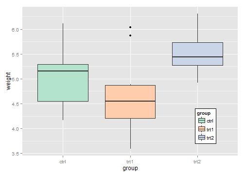
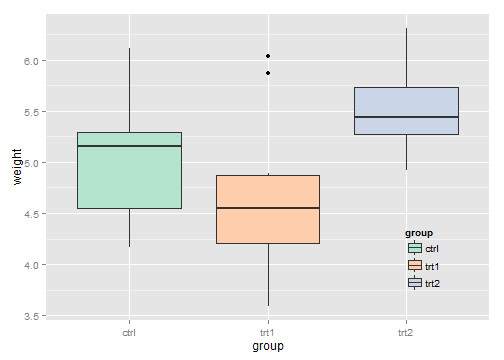
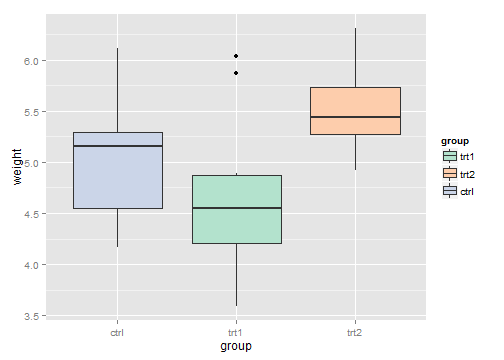
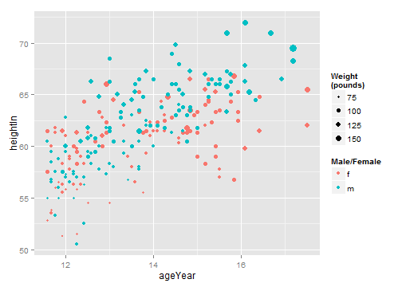
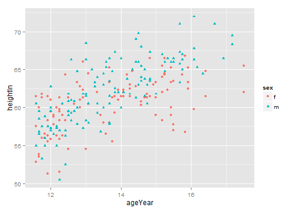
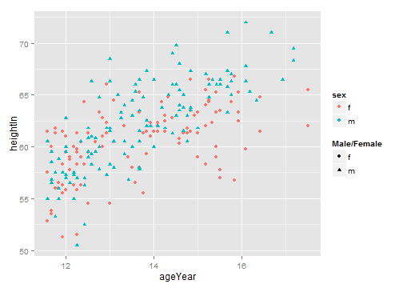
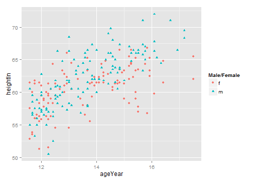
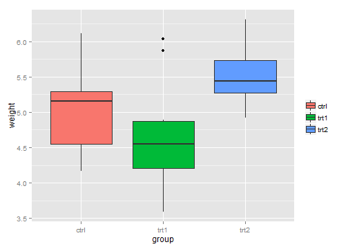
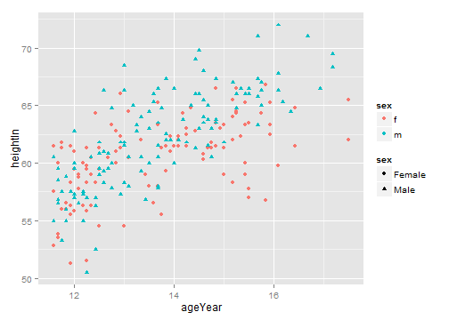
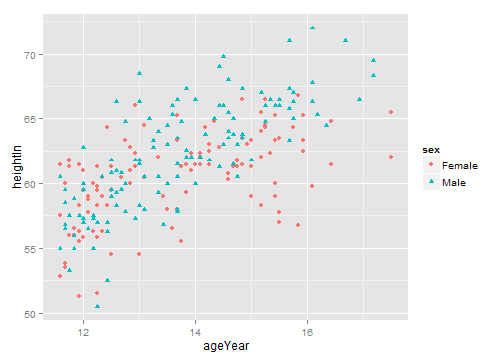

# chapter10: Legends
## 10.1 删除图例
**Problem** 
你想从图片中删除图例
**解决方案**
用guides()
??guides

```r
library(ggplot2)
# The base plot (with legend)
p <- ggplot(PlantGrowth, aes(x = group, y = weight, fill = group)) + geom_boxplot()
p
```

 

```r

# Remove the legend for fill
p + guides(fill = FALSE)
```

 

```r


# Remove the legend for fill
p + scale_fill_discrete(guide = FALSE)
```

 

```r

p + theme(legend.position = "none")
```

 

## 10.2.Changing the Position of a Legend  

```r
p <- ggplot(PlantGrowth, aes(x=group, y=weight, fill=group)) + geom_boxplot() +
    scale_fill_brewer(palette="Pastel2")

p + theme(legend.position="top")
```

 

```r
    
p + theme(legend.position=c(1,0), legend.justification=c(1,0))
```

 

```r
    
p + theme(legend.position=c(1,1), legend.justification=c(1,1))
```

 

```r
    
p + theme(legend.position=c(.85,.2)) +
    theme(legend.background=element_rect(fill="white", colour="black"))
```

 

```r
    
p + theme(legend.position=c(.85,.2)) +
    theme(legend.background=element_blank()) +  # Remove overall border
    theme(legend.key=element_blank())           # Remove border around each item
```

 

## 10.3.Changing the Order of Items in a Legend

```r
# The base plot
p <- ggplot(PlantGrowth, aes(x = group, y = weight, fill = group)) + geom_boxplot()
p
```

 

```r

# Change the order of items
p + scale_fill_discrete(limits = c("trt1", "trt2", "ctrl"))
```

 

```r

p + scale_fill_grey(start = 0.5, end = 1, limits = c("trt1", "trt2", "ctrl"))
```

 

```r

p + scale_fill_brewer(palette = "Pastel2", limits = c("trt1", "trt2", "ctrl"))
```

 

## 10.4.Reversing the Order of Items in a Legend  

```r
# The base plot
p <- ggplot(PlantGrowth, aes(x = group, y = weight, fill = group)) + geom_boxplot()
p
```

 

```r

# Reverse the legend order
p + guides(fill = guide_legend(reverse = TRUE))
```

 

```r

scale_fill_hue(guide = guide_legend(reverse = TRUE))
```

```
## discrete_scale(aesthetics = "fill", scale_name = "hue", palette = hue_pal(h, 
##     c, l, h.start, direction), na.value = na.value, guide = ..1)
```

## 10.5.Changing a Legend Title  

```r
# The base plot
p <- ggplot(PlantGrowth, aes(x = group, y = weight, fill = group)) + geom_boxplot()
p
```

 

```r

# Set the legend title to 'Condition'
p + labs(fill = "Condition")
```

 

```r

p + scale_fill_discrete(name = "Condition")
```

 

```r

library(gcookbook)  # For the data set

# Make the base plot
hw <- ggplot(heightweight, aes(x = ageYear, y = heightIn, colour = sex)) + geom_point(aes(size = weightLb)) + 
    scale_size_continuous(range = c(1, 4))

hw
```

 

```r

# With new legend titles
hw + labs(colour = "Male/Female", size = "Weight\n(pounds)")
```

 

```r

hw1 <- ggplot(heightweight, aes(x = ageYear, y = heightIn, shape = sex, colour = sex)) + 
    geom_point()

hw1
```

 

```r

# Change just shape
hw1 + labs(shape = "Male/Female")
```

 

```r

# Change both shape and colour
hw1 + labs(shape = "Male/Female", colour = "Male/Female")
```

 

```r

p + guides(fill = guide_legend(title = "Condition"))
```

 

## 10.6.Changing the Appearance of a Legend Title

```r
p <- ggplot(PlantGrowth, aes(x = group, y = weight, fill = group)) + geom_boxplot()

p + theme(legend.title = element_text(face = "italic", family = "Times", colour = "red", 
    size = 14))
```

 

```r

p + guides(fill = guide_legend(title.theme = element_text(face = "italic", family = "times", 
    colour = "red", size = 14)))
```

```
## Error: Text element requires non-NULL value for 'angle'.
```

## 10.7.Removing a Legend Title

```r
ggplot(PlantGrowth, aes(x = group, y = weight, fill = group)) + geom_boxplot() + 
    guides(fill = guide_legend(title = NULL))
```

 

```r

scale_fill_hue(guide = guide_legend(title = NULL))
```

```
## discrete_scale(aesthetics = "fill", scale_name = "hue", palette = hue_pal(h, 
##     c, l, h.start, direction), na.value = na.value, guide = ..1)
```

## 10.8.Changing the Labels in a Legend    

```r
library(gcookbook)  # For the data set

# The base plot
p <- ggplot(PlantGrowth, aes(x = group, y = weight, fill = group)) + geom_boxplot()

# Change the legend labels
p + scale_fill_discrete(labels = c("Control", "Treatment 1", "Treatment 2"))
```

 

```r

p + scale_fill_grey(start = 0.5, end = 1, labels = c("Control", "Treatment 1", 
    "Treatment 2"))
```

 

```r

p + scale_fill_discrete(limits = c("trt1", "trt2", "ctrl"), labels = c("Treatment 1", 
    "Treatment 2", "Control"))
```

 

```r

# The base plot
p <- ggplot(heightweight, aes(x = ageYear, y = heightIn, shape = sex, colour = sex)) + 
    geom_point()
p
```

 

```r

# Change the labels for one scale
p + scale_shape_discrete(labels = c("Female", "Male"))
```

 

```r

# Change the labels for both scales
p + scale_shape_discrete(labels = c("Female", "Male")) + scale_colour_discrete(labels = c("Female", 
    "Male"))
```

 

## 10.9.Changing the Appearance of Legend Labels

```r
# The base plot
p <- ggplot(PlantGrowth, aes(x = group, y = weight, fill = group)) + geom_boxplot()

# Change the legend label appearance
p + theme(legend.text = element_text(face = "italic", family = "Times", colour = "red", 
    size = 14))
```

 

```r


# Changes the legend title text for the fill legend
p + guides(fill = guide_legend(label.theme = element_text(face = "italic", family = "Times", 
    colour = "red", size = 14)))
```

```
## Error: Text element requires non-NULL value for 'angle'.
```

## 10.10.Using Labels with Multiple Lines of Text

```r
p <- ggplot(PlantGrowth, aes(x = group, y = weight, fill = group)) + geom_boxplot()

# Labels that have more than one line
p + scale_fill_discrete(labels = c("Control", "Type 1\ntreatment", "Type 2\ntreatment"))
```

 

```r

library(grid)
p + scale_fill_discrete(labels = c("Control", "Type 1\ntreatment", "Type 2\ntreatment")) + 
    theme(legend.text = element_text(lineheight = 0.8), legend.key.height = unit(1, 
        "cm"))
```

 

