chapter: Legends

```r
#==================
library(ggplot2)
# The base plot (with legend)
p <- ggplot(PlantGrowth, aes(x=group, y=weight, fill=group)) + geom_boxplot()
p
```

 

```r

# Remove the legend for fill
p + guides(fill=FALSE)
```

 

```r
    
    
#====================================
# Remove the legend for fill
p + scale_fill_discrete(guide=FALSE)
```

 

```r
    
    
#====================================
p + theme(legend.position="none")
```

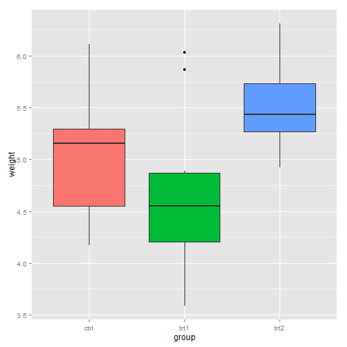 

```r
    
    
#====================================
p <- ggplot(PlantGrowth, aes(x=group, y=weight, fill=group)) + geom_boxplot() +
    scale_fill_brewer(palette="Pastel2")

p + theme(legend.position="top")
```

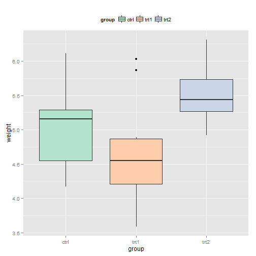 

```r
    
    
#====================================
p + theme(legend.position=c(1,0), legend.justification=c(1,0))
```

 

```r
    
    
#====================================
p + theme(legend.position=c(1,1), legend.justification=c(1,1))
```

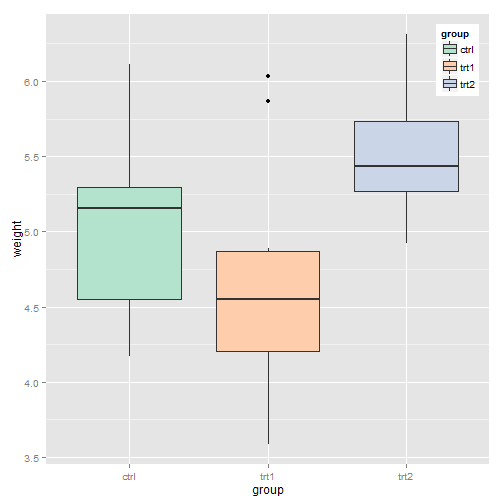 

```r
    
    
#====================================
p + theme(legend.position=c(.85,.2)) +
    theme(legend.background=element_rect(fill="white", colour="black"))
```

 

```r
    
    
#====================================
p + theme(legend.position=c(.85,.2)) +
    theme(legend.background=element_blank()) +  # Remove overall border
    theme(legend.key=element_blank())           # Remove border around each item
```

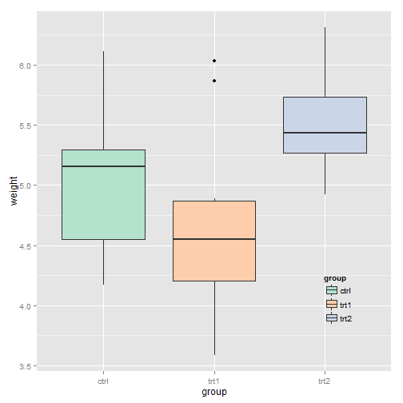 

```r
    
    
#====================================
# The base plot
p <- ggplot(PlantGrowth, aes(x=group, y=weight, fill=group)) + geom_boxplot()
p
```

 

```r

# Change the order of items
p + scale_fill_discrete(limits=c("trt1", "trt2", "ctrl"))
```

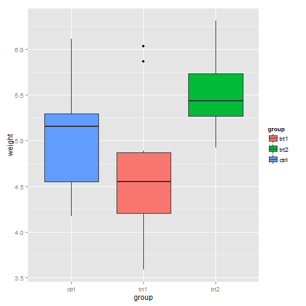 

```r
    
    
#====================================
p + scale_fill_grey(start=.5, end=1, limits=c("trt1", "trt2", "ctrl"))
```

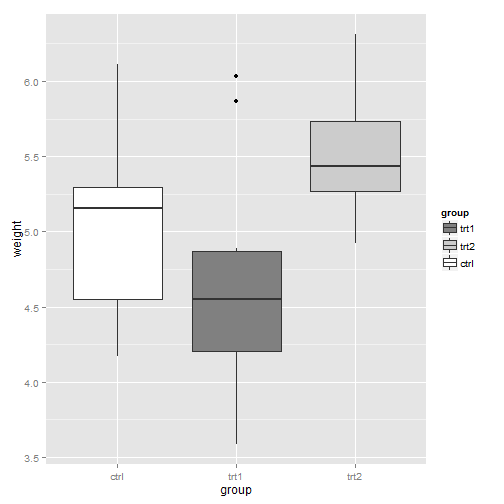 

```r
    
    
#====================================
p + scale_fill_brewer(palette="Pastel2", limits=c("trt1", "trt2", "ctrl"))
```

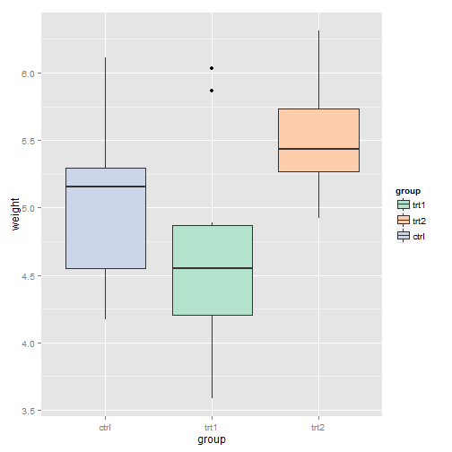 

```r
    
    
#====================================
# The base plot
p <- ggplot(PlantGrowth, aes(x=group, y=weight, fill=group)) + geom_boxplot()
p
```

 

```r

# Reverse the legend order
p + guides(fill=guide_legend(reverse=TRUE))
```

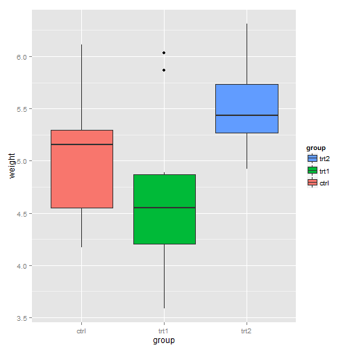 

```r
    
    
#====================================
scale_fill_hue(guide=guide_legend(reverse=TRUE))
```

```
## discrete_scale(aesthetics = "fill", scale_name = "hue", palette = hue_pal(h, 
##     c, l, h.start, direction), na.value = na.value, guide = ..1)
```

```r
    
    
#====================================
# The base plot
p <- ggplot(PlantGrowth, aes(x=group, y=weight, fill=group)) + geom_boxplot()
p
```

 

```r

# Set the legend title to "Condition"
p + labs(fill="Condition")
```

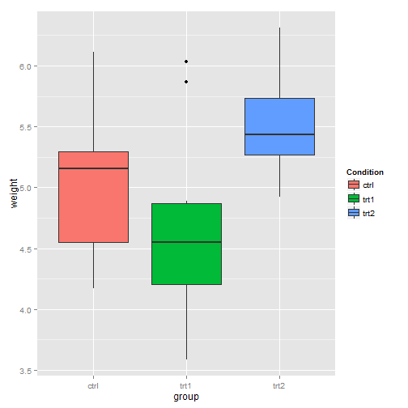 

```r
    
    
#====================================
p + scale_fill_discrete(name="Condition")
```

 

```r
    
    
#====================================
library(gcookbook) # For the data set

# Make the base plot
hw <- ggplot(heightweight, aes(x=ageYear, y=heightIn, colour=sex)) +
      geom_point(aes(size=weightLb)) + scale_size_continuous(range=c(1,4))

hw
```

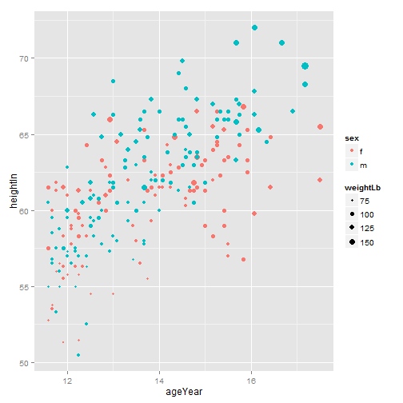 

```r

# With new legend titles
hw + labs(colour="Male/Female", size="Weight\n(pounds)")
```

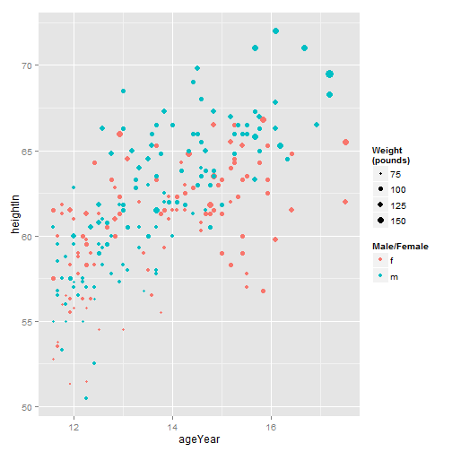 

```r
    
    
#====================================
hw1 <- ggplot(heightweight, aes(x=ageYear, y=heightIn, shape=sex, colour=sex)) +
       geom_point()

hw1
```

 

```r
    
    
#====================================
# Change just shape
hw1 + labs(shape="Male/Female")
```

 

```r

# Change both shape and colour
hw1 + labs(shape="Male/Female", colour="Male/Female")
```

 

```r
    
    
#====================================
p + guides(fill=guide_legend(title="Condition"))
```

 

```r
    
    
#====================================
p <- ggplot(PlantGrowth, aes(x=group, y=weight, fill=group)) + geom_boxplot()

p + theme(legend.title=element_text(face="italic", family="Times", colour="red", 
                                    size=14))
```

 

```r
    
    
#====================================
p + guides(fill=guide_legend(title.theme=
           element_text(face="italic", family="times", colour="red", size=14)))
```

```
## Error: Text element requires non-NULL value for 'angle'.
```

```r
    
    
#====================================
ggplot(PlantGrowth, aes(x=group, y=weight, fill=group)) + geom_boxplot() +
    guides(fill=guide_legend(title=NULL))
```

 

```r
    
    
#====================================
scale_fill_hue(guide = guide_legend(title=NULL))
```

```
## discrete_scale(aesthetics = "fill", scale_name = "hue", palette = hue_pal(h, 
##     c, l, h.start, direction), na.value = na.value, guide = ..1)
```

```r
    
    
#====================================
library(gcookbook) # For the data set

# The base plot
p <- ggplot(PlantGrowth, aes(x=group, y=weight, fill=group)) + geom_boxplot()

# Change the legend labels
p + scale_fill_discrete(labels=c("Control", "Treatment 1", "Treatment 2"))
```

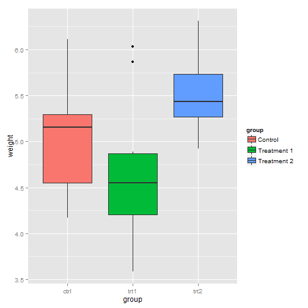 

```r
    
    
#====================================
p + scale_fill_grey(start=.5, end=1,
                    labels=c("Control", "Treatment 1", "Treatment 2"))
```

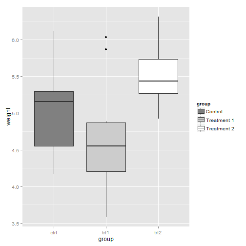 

```r
    
    
#====================================
p + scale_fill_discrete(limits=c("trt1", "trt2", "ctrl"),
                        labels=c("Treatment 1", "Treatment 2", "Control"))
```

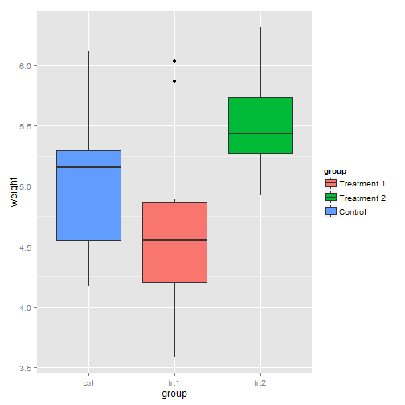 

```r
    
    
#====================================
# The base plot
p <- ggplot(heightweight, aes(x=ageYear, y=heightIn, shape=sex, colour=sex)) +
     geom_point()
p
```

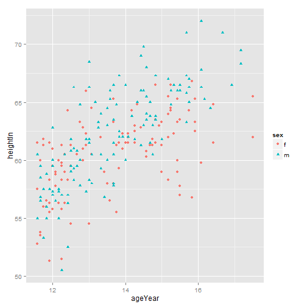 

```r

# Change the labels for one scale
p + scale_shape_discrete(labels=c("Female", "Male"))
```

 

```r

# Change the labels for both scales
p + scale_shape_discrete(labels=c("Female", "Male")) +
    scale_colour_discrete(labels=c("Female", "Male"))
```

 

```r
    
    
#====================================
# The base plot
p <- ggplot(PlantGrowth, aes(x=group, y=weight, fill=group)) + geom_boxplot()

# Change the legend label appearance
p + theme(legend.text=element_text(face="italic", family="Times", colour="red", 
                                   size=14))
```

 

```r
    
    
#====================================
# Changes the legend title text for the fill legend
p + guides(fill=guide_legend(label.theme=
           element_text(face="italic", family="Times", colour="red", size=14)))
```

```
## Error: Text element requires non-NULL value for 'angle'.
```

```r
    
    
#====================================
p <- ggplot(PlantGrowth, aes(x=group, y=weight, fill=group)) + geom_boxplot()

# Labels that have more than one line
p + scale_fill_discrete(labels=c("Control", "Type 1\ntreatment", 
                                 "Type 2\ntreatment"))
```

 

```r
    
    
#====================================
library(grid)
p + scale_fill_discrete(labels=c("Control", "Type 1\ntreatment",
                                 "Type 2\ntreatment")) +
    theme(legend.text=element_text(lineheight=.8),
          legend.key.height=unit(1, "cm"))
```

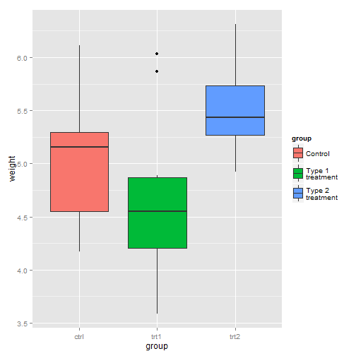 

```r
    
    
#==================
```

