# Legend guide:ggplot2图例使用方法解析

文章内容为下述文章，整理而来。
http://docs.ggplot2.org/current/guide_legend.html

## 用法概述：Usage
```
guide_legend(title = waiver(), title.position = NULL, title.theme = NULL, title.hjust = NULL, 
  title.vjust = NULL, label = TRUE, label.position = NULL, label.theme = NULL, 
      label.hjust = NULL, label.vjust = NULL, keywidth = NULL, keyheight = NULL, direction = NULL, 
      default.unit = "line", override.aes = list(), nrow = NULL, ncol = NULL, byrow = FALSE, 
      reverse = FALSE, order = 0, ...)
```
## 参数详解：Arguments
### 图例显示与否
下面是控制是否显示图例的选项：
如果我们不想要生成图例,我们只需要设置，colour=FALSE

```r
library(ggplot2)
first = ggplot(mpg, aes(displ, hwy, colour = cyl)) + geom_point()
first
first + guides(colour = FALSE)
```

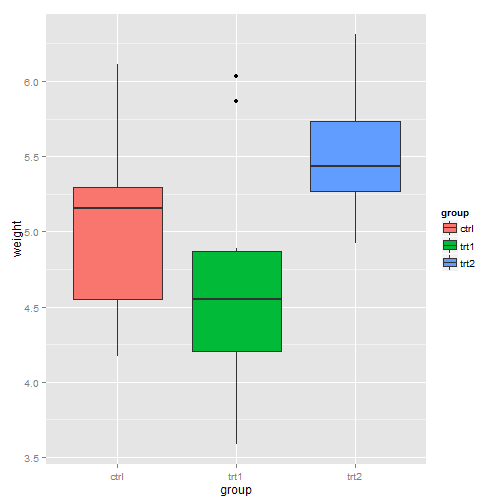 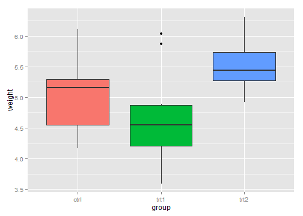 

注意上面我们用的是colour来生成的图例,所以下面我们控制图例的时候用colour

### title:标题
#### 设置标题是否显示：title=NULL

```r
first + guides(colour = guide_legend(title = NULL))
second = ggplot(mpg, aes(displ, hwy, colour = factor(cyl))) + geom_point()
second
second + guides(colour = guide_legend(title = NULL))
```

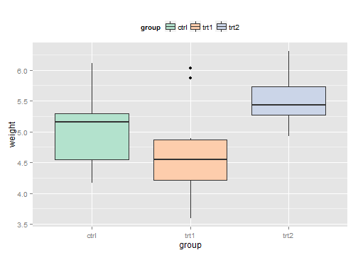  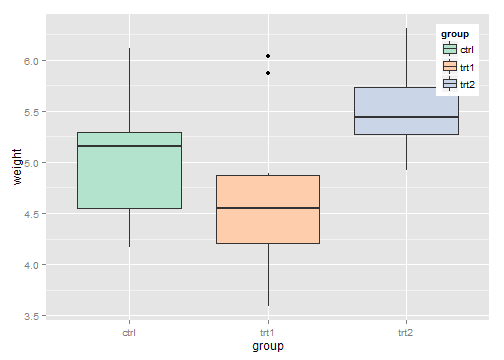 


#### 还要知道：
如果我们用fill来填充颜色,那么我们去掉图例就需要用fill, 去掉标题,也用fill,如下：

```r
third = ggplot(mpg, aes(cyl, hwy, fill = factor(cyl))) + geom_boxplot()
third
third + guides(fill = FALSE)
third + guides(fill = guide_legend(title = NULL))
```

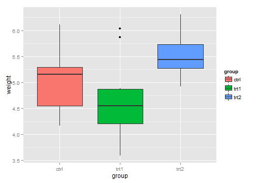 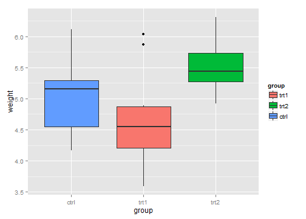 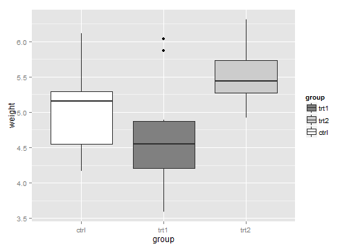 

#### 利用title改变标题

```r
third + guides(fill = guide_legend(title = "how"))
```

 

### title.position:标题位置
标题位置分为四种：top(),bottom(下),left(左),right(右)

```r
third + guides(fill = guide_legend(title.position = "top"))
third + guides(fill = guide_legend(title.position = "bottom"))
third + guides(fill = guide_legend(title.position = "left"))
third + guides(fill = guide_legend(title.position = "right"))
```

 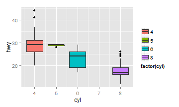  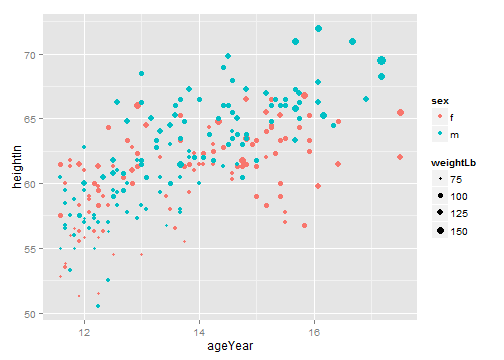 

#### title.theme:标题样式控制
在这个选项中我们可以随意的控制标题的size(大小),face(字体),colour(颜色),angel(旋转角度).

```r
third + guides(fill = guide_legend(title.theme = element_text(size = 15, face = "italic", 
    colour = "red", angle = 30)))
```

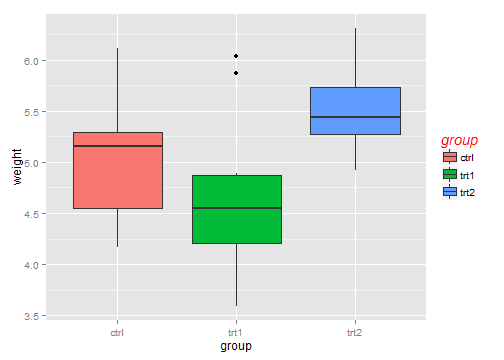 

#### title.hjust:水平方向调节对齐方式
标题的对齐方式，为了形象的显示，我们需要引入下面的一个变量.

```r
third + guides(fill = guide_legend(title.hjust = 0, nrow = 1))
third + guides(fill = guide_legend(title.hjust = 0.5, nrow = 1))
third + guides(fill = guide_legend(title.hjust = 1, nrow = 1))
```

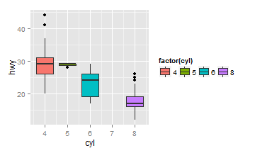 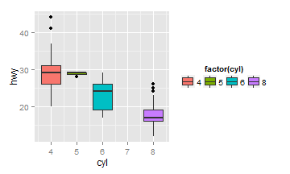 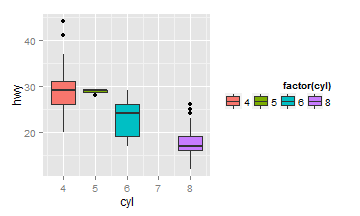 

#### title.vjust:竖直方向调节对齐方式

```r
third + guides(fill = guide_legend(title.vjust = 0, title.position = "left"))
third + guides(fill = guide_legend(title.vjust = 0.5, title.position = "left"))
third + guides(fill = guide_legend(title.vjust = 1, title.position = "left"))
```

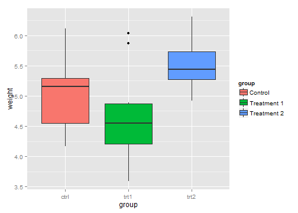 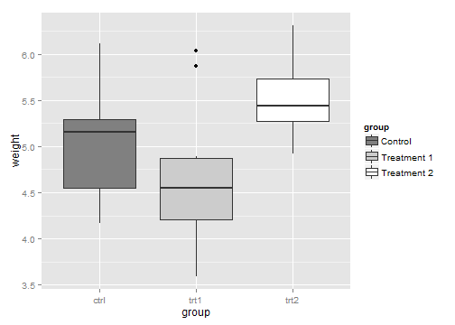 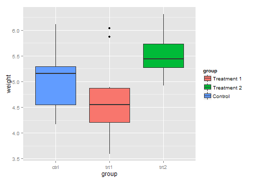 


### label:标签
#### 是否生成????
logical. If TRUE then the labels are drawn. If FALSE then the labels are invisible.
两个选线，TRUE和FALSE控制是否生成标签

```r
third + guides(fill = guide_legend(label = TRUE))
third + guides(fill = guide_legend(label = FALSE))
```

```
## Error: grob 'NULL' not found
```

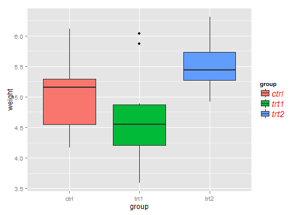 

#### label.position
和标题位置类似

```r
third + guides(fill = guide_legend(label.position = "top"))
third + guides(fill = guide_legend(label.position = "bottom"))
third + guides(fill = guide_legend(label.position = "left"))
third + guides(fill = guide_legend(label.position = "right"))
```

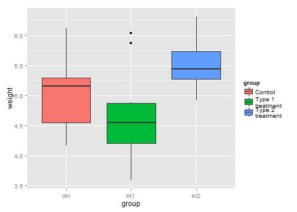  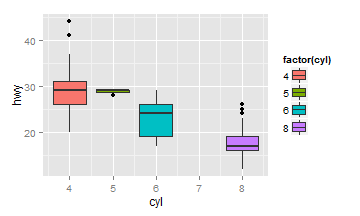  


#### label.theme：标签的样式
和标题的样式一样。

```r
third + guides(fill = guide_legend(label.theme = element_text(size = 15, face = "italic", 
    colour = "red", angle = 30)))
```

 

#### label.hjust:水平对齐方式

```r
third + guides(fill = guide_legend(label.hjust = 0, label.position = "top"))
third + guides(fill = guide_legend(label.hjust = 0.5, label.position = "top"))
third + guides(fill = guide_legend(label.hjust = 1, label.position = "top"))
```

 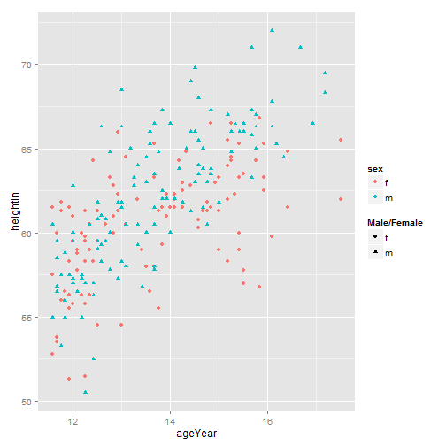 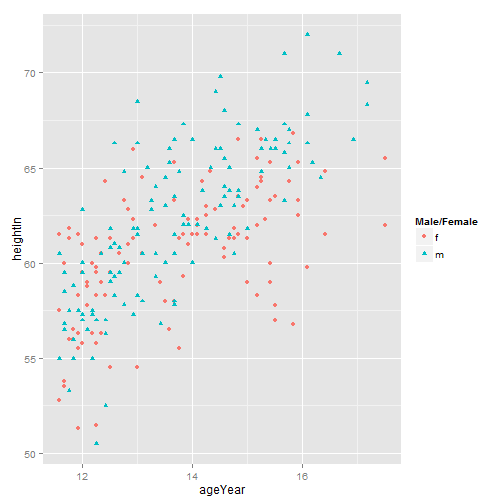 

#### label.vjust:竖直方向对齐方式

```r
third + guides(fill = guide_legend(label.vjust = 0, label.position = "left"))
third + guides(fill = guide_legend(label.vjust = 0.5, label.position = "left"))
third + guides(fill = guide_legend(label.vjust = 1, label.position = "left"))
```

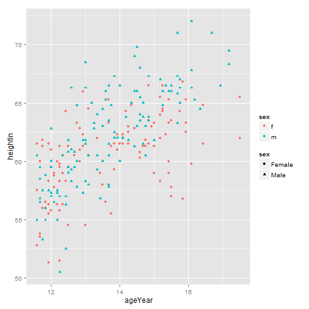 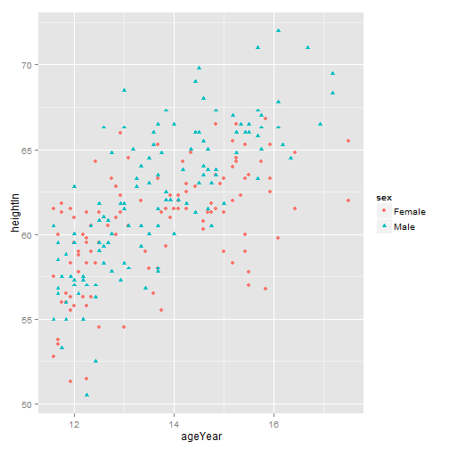  

### keywidth：图表宽,keyheight图表高

```r
third + guides(fill = guide_legend(keywidth = 5))
third + guides(fill = guide_legend(keywidth = 10))
third + guides(fill = guide_legend(keyheight = 1))
third + guides(fill = guide_legend(keyheight = 5))
```

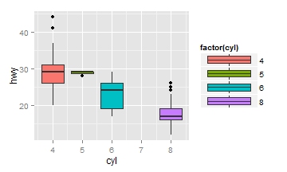 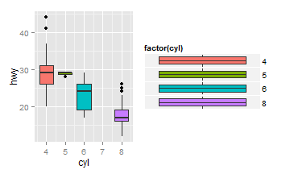 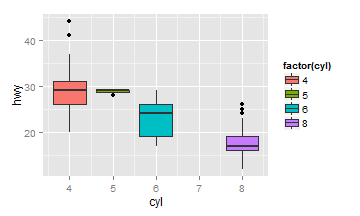 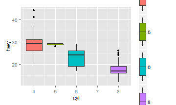 


#### direction
A character string indicating the direction of the guide. One of "horizontal" or "vertical."

```r
third + guides(fill = guide_legend(direction = "horizontal"))
third + guides(fill = guide_legend(direction = "vertical"))
```

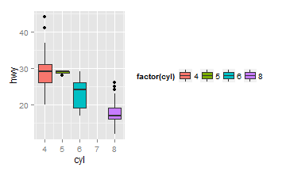  


#### default.unit
A character string indicating unit for keywidth and keyheight.
#### override.aes
如果我们设定的透明度很低，同样我们的图例中的色彩也会很淡，
这个override.aes就是控制图例的颜色不变。

```r
four = ggplot(mpg, aes(displ, hwy, colour = factor(cyl))) + geom_point(alpha = 1/10)
four + guides(colour = guide_legend(override.aes = list(alpha = 1)))
```

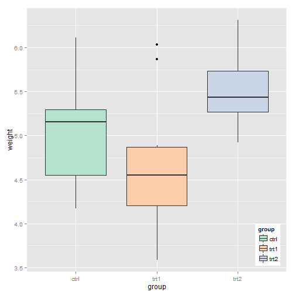 

#### nrow；控制没列的个数

```r
third
third + guides(fill = guide_legend(nrow = 4))
third + guides(fill = guide_legend(nrow = 3))
third + guides(fill = guide_legend(nrow = 2))
```

  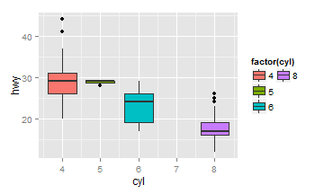 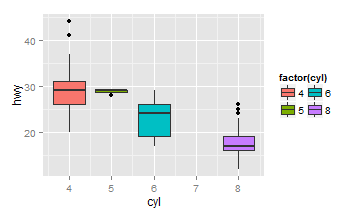 

#### ncol:控制每行的个数

```r
third
third + guides(fill = guide_legend(ncol = 4))
third + guides(fill = guide_legend(ncol = 2))
third + guides(fill = guide_legend(ncol = 1))
```

    

#### byrow:横，bycol：竖
图例排序的顺序

```r
third
third + guides(fill = guide_legend(ncol = 3, byrow = TRUE))
third + guides(fill = guide_legend(ncol = 3, bycol = TRUE))
```

 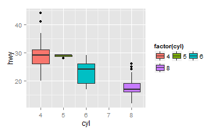 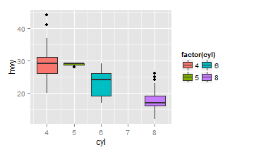 

#### reverse
反向显示图例

```r
third
third + guides(fill = guide_legend(reverse = TRUE))
```

 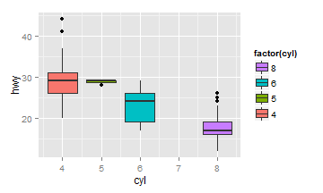 

#### order
positive integer less that 99 that specify the order of this guide in the multiple guides. If 0 (default), the order is determined by a secret algorithm.
不明觉历的。

```r
third
third + guides(fill = guide_legend(order = 5))
third + guides(fill = guide_legend(order = 0))
```

   

