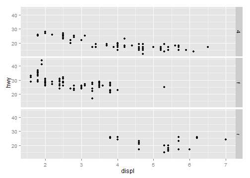
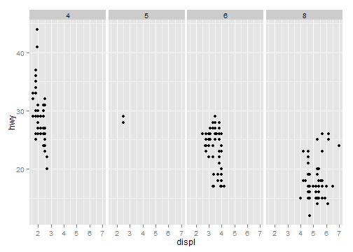
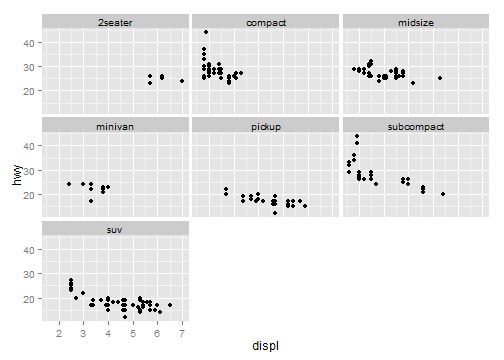
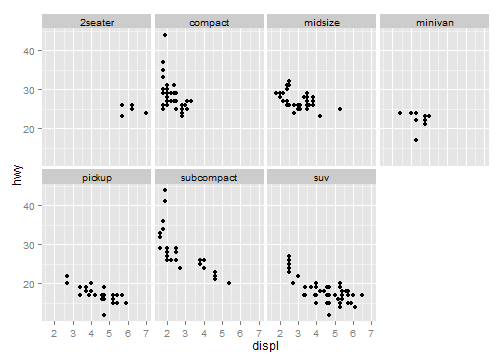
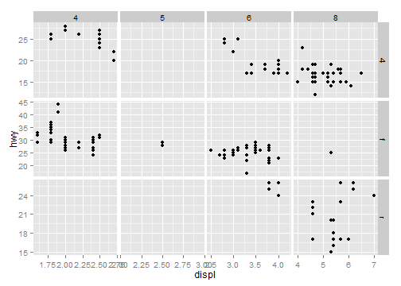
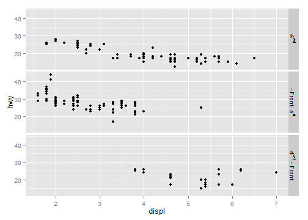
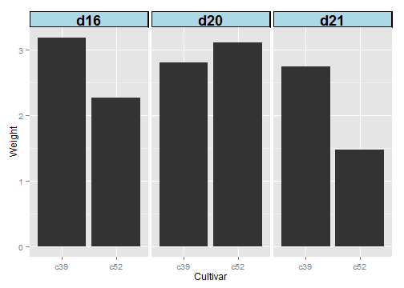

# chapter11: Facets
## 11.1.Splitting Data into Subplots with Facets

```r
library(ggplot2)
# The base plot
p <- ggplot(mpg, aes(x = displ, y = hwy)) + geom_point()

# Faceted by drv, in vertically arranged subpanels
p + facet_grid(drv ~ .)
```

 

```r

# Faceted by cyl, in horizontally arranged subpanels
p + facet_grid(. ~ cyl)
```

 

```r

# Split by drv (vertical) and cyl (horizontal)
p + facet_grid(drv ~ cyl)
```

 

```r

# Facet on class Note there is nothing before the tilde
p + facet_wrap(~class)
```

 

```r

# These will have the same result: 2 rows and 4 cols
p + facet_wrap(~class, nrow = 2)
```

 

```r
p + facet_wrap(~class, ncol = 4)
```

 

## 11.2.Using Facets with Different Axes

```r
# The base plot
p <- ggplot(mpg, aes(x = displ, y = hwy)) + geom_point()

# With free y scales
p + facet_grid(drv ~ cyl, scales = "free_y")
```

 

```r

# With free x and y scales
p + facet_grid(drv ~ cyl, scales = "free")
```

 

## 11.3.Changing the Text of Facet Labels  

```r
mpg2 <- mpg  # Make a copy of the original data

# Rename 4 to 4wd, f to Front, r to Rear
levels(mpg2$drv)[levels(mpg2$drv) == "4"] <- "4wd"
levels(mpg2$drv)[levels(mpg2$drv) == "f"] <- "Front"
levels(mpg2$drv)[levels(mpg2$drv) == "r"] <- "Rear"

# Plot the new data
ggplot(mpg2, aes(x = displ, y = hwy)) + geom_point() + facet_grid(drv ~ .)
```

 

```r

ggplot(mpg2, aes(x = displ, y = hwy)) + geom_point() + facet_grid(drv ~ ., labeller = label_both)
```

 

```r

mpg3 <- mpg

levels(mpg3$drv)[levels(mpg3$drv) == "4"] <- "4^{wd}"
levels(mpg3$drv)[levels(mpg3$drv) == "f"] <- "- Front %.% e^{pi * i}"
levels(mpg3$drv)[levels(mpg3$drv) == "r"] <- "4^{wd} - Front"

ggplot(mpg3, aes(x = displ, y = hwy)) + geom_point() + facet_grid(drv ~ ., labeller = label_parsed)
```

 

## 11.4.Changing the Appearance of Facet Labels

```r
library(gcookbook)  # For the data set

ggplot(cabbage_exp, aes(x = Cultivar, y = Weight)) + geom_bar(stat = "identity") + 
    facet_grid(. ~ Date) + theme(strip.text = element_text(face = "bold", size = rel(1.5)), 
    strip.background = element_rect(fill = "lightblue", colour = "black", size = 1))
```

 

