chapter: Using Colors in Plots

```r
# ==================
library(ggplot2)
ggplot(mtcars, aes(x = wt, y = mpg)) + geom_point(colour = "red")
```

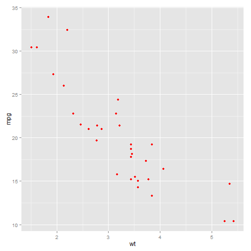 

```r

library(MASS)  # For the data set
ggplot(birthwt, aes(x = bwt)) + geom_histogram(fill = "red", colour = "black")
```

```
## stat_bin: binwidth defaulted to range/30. Use 'binwidth = x' to adjust this.
```

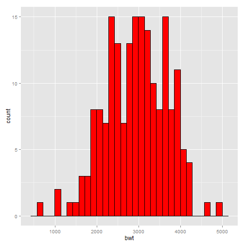 

```r


# ====================================
library(gcookbook)  # For the data set

# These both have the same effect
ggplot(cabbage_exp, aes(x = Date, y = Weight, fill = Cultivar)) + geom_bar(colour = "black", 
    position = "dodge")
```

```
## Mapping a variable to y and also using stat="bin".
##   With stat="bin", it will attempt to set the y value to the count of cases in each group.
##   This can result in unexpected behavior and will not be allowed in a future version of ggplot2.
##   If you want y to represent counts of cases, use stat="bin" and don't map a variable to y.
##   If you want y to represent values in the data, use stat="identity".
##   See ?geom_bar for examples. (Deprecated; last used in version 0.9.2)
```

 

```r

ggplot(cabbage_exp, aes(x = Date, y = Weight)) + geom_bar(aes(fill = Cultivar), 
    colour = "black", position = "dodge")
```

```
## Mapping a variable to y and also using stat="bin".
##   With stat="bin", it will attempt to set the y value to the count of cases in each group.
##   This can result in unexpected behavior and will not be allowed in a future version of ggplot2.
##   If you want y to represent counts of cases, use stat="bin" and don't map a variable to y.
##   If you want y to represent values in the data, use stat="identity".
##   See ?geom_bar for examples. (Deprecated; last used in version 0.9.2)
```

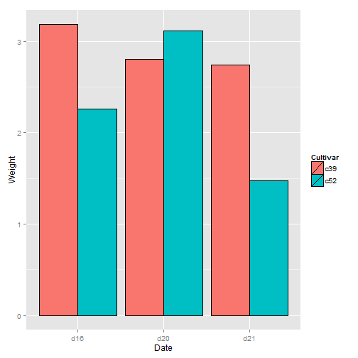 

```r

# These both have the same effect
ggplot(mtcars, aes(x = wt, y = mpg, colour = cyl)) + geom_point()
```

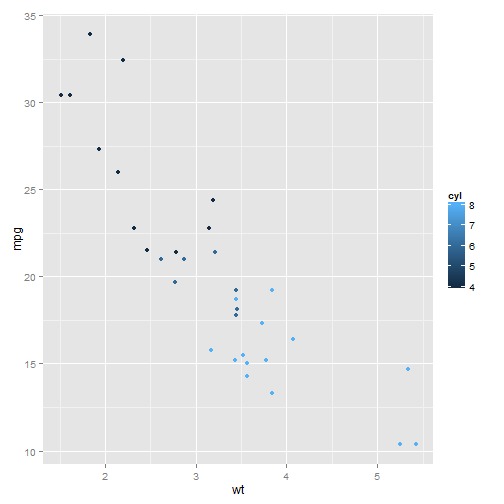 

```r

ggplot(mtcars, aes(x = wt, y = mpg)) + geom_point(aes(colour = cyl))
```

 

```r


# ====================================
str(cabbage_exp)
```

```
## 'data.frame':	6 obs. of  6 variables:
##  $ Cultivar: Factor w/ 2 levels "c39","c52": 1 1 1 2 2 2
##  $ Date    : Factor w/ 3 levels "d16","d20","d21": 1 2 3 1 2 3
##  $ Weight  : num  3.18 2.8 2.74 2.26 3.11 1.47
##  $ sd      : num  0.957 0.279 0.983 0.445 0.791 ...
##  $ n       : int  10 10 10 10 10 10
##  $ se      : num  0.3025 0.0882 0.311 0.1408 0.2501 ...
```

```r


# ==================================== Convert to factor in call to ggplot()
ggplot(mtcars, aes(x = wt, y = mpg, colour = factor(cyl))) + geom_point()
```

 

```r

# Another method: Convert to factor in the data
m <- mtcars  # Make a copy of mtcars
m$cyl <- factor(m$cyl)  # Convert cyl to a factor
ggplot(m, aes(x = wt, y = mpg, colour = cyl)) + geom_point()
```

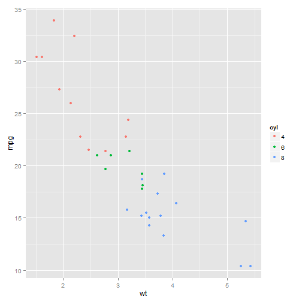 

```r


# ====================================
library(gcookbook)  # For the data set

# Base plot
p <- ggplot(uspopage, aes(x = Year, y = Thousands, fill = AgeGroup)) + geom_area()

# These three have the same effect
p
```

 

```r
p + scale_fill_discrete()
```

 

```r
p + scale_fill_hue()
```

 

```r

# ColorBrewer palette
p + scale_fill_brewer()
```

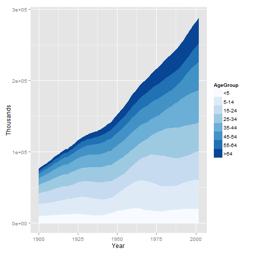 

```r


# ==================================== Basic scatter plot
h <- ggplot(heightweight, aes(x = ageYear, y = heightIn, colour = sex)) + geom_point()

# Default lightness = 65
h
```

 

```r

# Slightly darker
h + scale_colour_hue(l = 45)
```

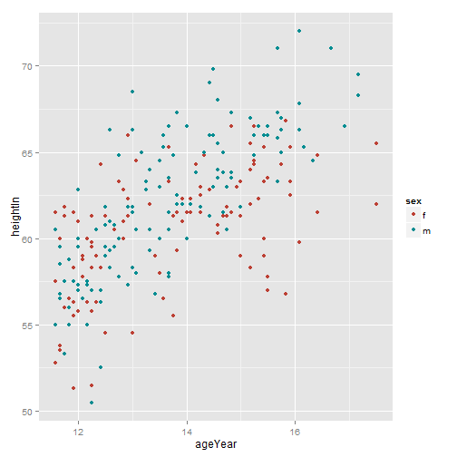 

```r


# ====================================
library(RColorBrewer)
display.brewer.all()
```

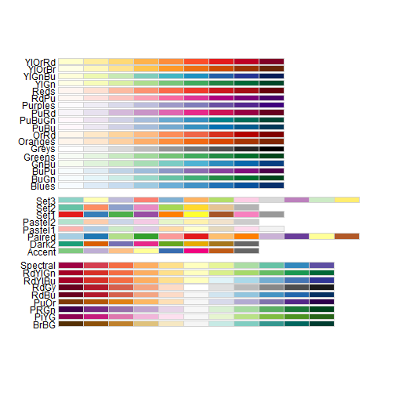 

```r


# ====================================
p + scale_fill_brewer(palette = "Oranges")
```

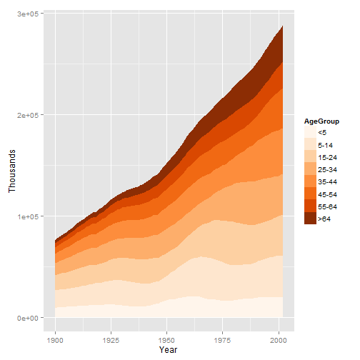 

```r


# ====================================
p + scale_fill_grey()
```

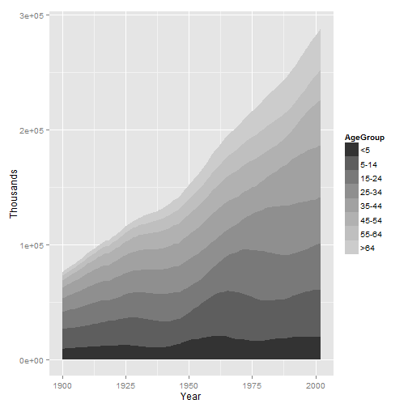 

```r

# Reverse the direction and use a different range of greys
p + scale_fill_grey(start = 0.7, end = 0)
```

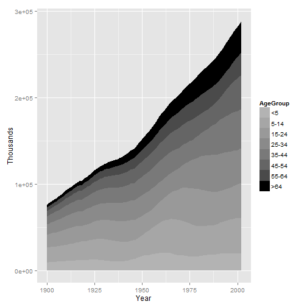 

```r


# ====================================
library(gcookbook)  # For the data set

# Base plot
h <- ggplot(heightweight, aes(x = ageYear, y = heightIn, colour = sex)) + geom_point()

# Using color names
h + scale_colour_manual(values = c("red", "blue"))
```

 

```r

# Using RGB values
h + scale_colour_manual(values = c("#CC6666", "#7777DD"))
```

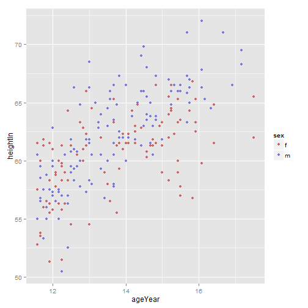 

```r


# ====================================
levels(heightweight$sex)
```

```
## [1] "f" "m"
```

```r

# 'f' 'm'


# ====================================
h + scale_colour_manual(values = c(m = "blue", f = "red"))
```

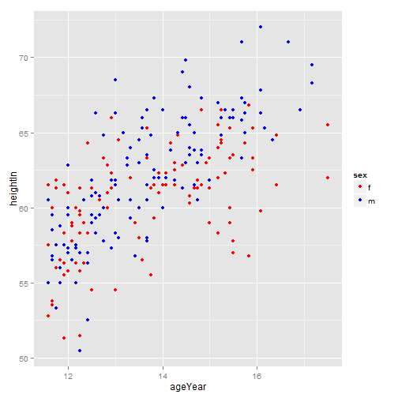 

```r


# ====================================
library(gcookbook)  # For the data set

# Base plot
p <- ggplot(uspopage, aes(x = Year, y = Thousands, fill = AgeGroup)) + geom_area()

# The palette with grey:
cb_palette <- c("#999999", "#E69F00", "#56B4E9", "#009E73", "#F0E442", "#0072B2", 
    "#D55E00", "#CC79A7")

# Add it to the plot
p + scale_fill_manual(values = cb_palette)
```

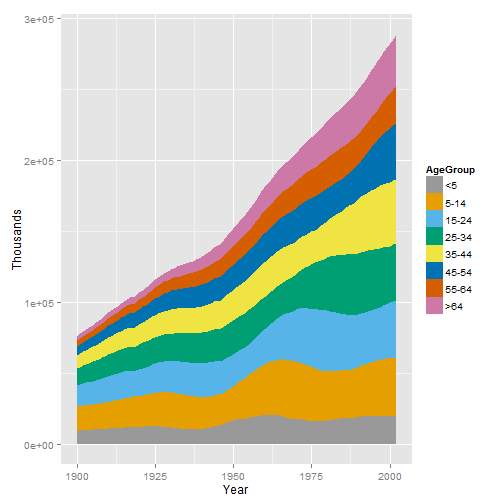 

```r


# ====================================
c("#000000", "#E69F00", "#56B4E9", "#009E73", "#F0E442", "#0072B2", "#D55E00", 
    "#CC79A7")
```

```
## [1] "#000000" "#E69F00" "#56B4E9" "#009E73" "#F0E442" "#0072B2" "#D55E00"
## [8] "#CC79A7"
```

```r


# ====================================
library(gcookbook)  # For the data set

# Base plot
p <- ggplot(heightweight, aes(x = ageYear, y = heightIn, colour = weightLb)) + 
    geom_point(size = 3)

p
```

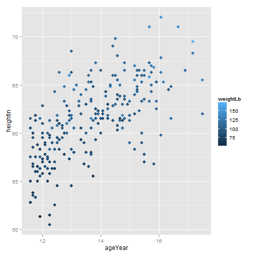 

```r

# With a gradient between two colors
p + scale_colour_gradient(low = "black", high = "white")
```

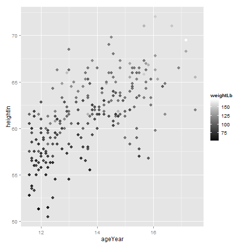 

```r

# A gradient with a white midpoint
library(scales)
p + scale_colour_gradient2(low = muted("red"), mid = "white", high = muted("blue"), 
    midpoint = 110)
```

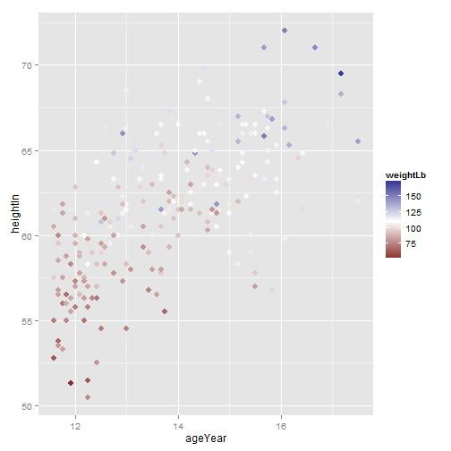 

```r

# A gradient of n colors
p + scale_colour_gradientn(colours = c("darkred", "orange", "yellow", "white"))
```

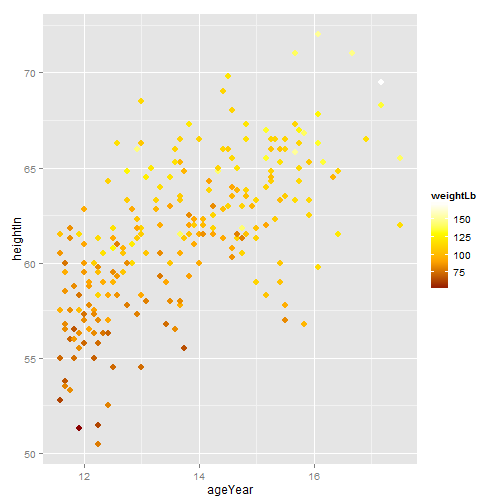 

```r


# ====================================
library(gcookbook)  # For the data set

cb <- subset(climate, Source == "Berkeley")

cb$valence[cb$Anomaly10y >= 0] <- "pos"
cb$valence[cb$Anomaly10y < 0] <- "neg"

head(cb)
```

```
##     Source Year Anomaly1y Anomaly5y Anomaly10y Unc10y valence
## 1 Berkeley 1800        NA        NA     -0.435  0.505     neg
## 2 Berkeley 1801        NA        NA     -0.453  0.493     neg
## 3 Berkeley 1802        NA        NA     -0.460  0.486     neg
## 4 Berkeley 1803        NA        NA     -0.493  0.489     neg
## 5 Berkeley 1804        NA        NA     -0.536  0.483     neg
## 6 Berkeley 1805        NA        NA     -0.541  0.475     neg
```

```r

# ====================================
ggplot(cb, aes(x = Year, y = Anomaly10y)) + geom_area(aes(fill = valence)) + 
    geom_line() + geom_hline(yintercept = 0)
```

 

```r


# ==================================== approx() returns a list with x and y
# vectors
interp <- approx(cb$Year, cb$Anomaly10y, n = 1000)

# Put in a data frame and recalculate valence
cbi <- data.frame(Year = interp$x, Anomaly10y = interp$y)
cbi$valence[cbi$Anomaly10y >= 0] <- "pos"
cbi$valence[cbi$Anomaly10y < 0] <- "neg"


# ====================================
ggplot(cbi, aes(x = Year, y = Anomaly10y)) + geom_area(aes(fill = valence), 
    alpha = 0.4) + geom_line() + geom_hline(yintercept = 0) + scale_fill_manual(values = c("#CCEEFF", 
    "#FFDDDD"), guide = FALSE) + scale_x_continuous(expand = c(0, 0))
```

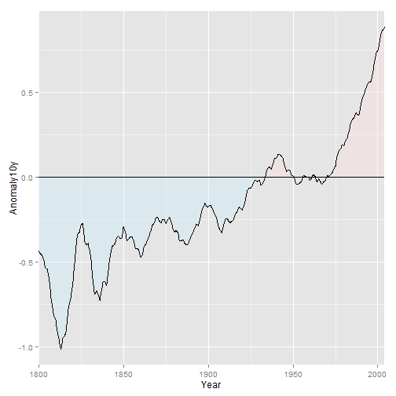 

```r


# ==================
```


