chapter: Miscellaneous Graphs

```r
#==================
library(ggplot2)
head(mtcars)
```

```
##                    mpg cyl disp  hp drat    wt  qsec vs am gear carb
## Mazda RX4         21.0   6  160 110 3.90 2.620 16.46  0  1    4    4
## Mazda RX4 Wag     21.0   6  160 110 3.90 2.875 17.02  0  1    4    4
## Datsun 710        22.8   4  108  93 3.85 2.320 18.61  1  1    4    1
## Hornet 4 Drive    21.4   6  258 110 3.08 3.215 19.44  1  0    3    1
## Hornet Sportabout 18.7   8  360 175 3.15 3.440 17.02  0  0    3    2
## Valiant           18.1   6  225 105 2.76 3.460 20.22  1  0    3    1
```

```r

#===================================
mcor <- cor(mtcars)

# Print mcor and round to 2 digits
round(mcor, digits=2)
```

```
##        mpg   cyl  disp    hp  drat    wt  qsec    vs    am  gear  carb
## mpg   1.00 -0.85 -0.85 -0.78  0.68 -0.87  0.42  0.66  0.60  0.48 -0.55
## cyl  -0.85  1.00  0.90  0.83 -0.70  0.78 -0.59 -0.81 -0.52 -0.49  0.53
## disp -0.85  0.90  1.00  0.79 -0.71  0.89 -0.43 -0.71 -0.59 -0.56  0.39
## hp   -0.78  0.83  0.79  1.00 -0.45  0.66 -0.71 -0.72 -0.24 -0.13  0.75
## drat  0.68 -0.70 -0.71 -0.45  1.00 -0.71  0.09  0.44  0.71  0.70 -0.09
## wt   -0.87  0.78  0.89  0.66 -0.71  1.00 -0.17 -0.55 -0.69 -0.58  0.43
## qsec  0.42 -0.59 -0.43 -0.71  0.09 -0.17  1.00  0.74 -0.23 -0.21 -0.66
## vs    0.66 -0.81 -0.71 -0.72  0.44 -0.55  0.74  1.00  0.17  0.21 -0.57
## am    0.60 -0.52 -0.59 -0.24  0.71 -0.69 -0.23  0.17  1.00  0.79  0.06
## gear  0.48 -0.49 -0.56 -0.13  0.70 -0.58 -0.21  0.21  0.79  1.00  0.27
## carb -0.55  0.53  0.39  0.75 -0.09  0.43 -0.66 -0.57  0.06  0.27  1.00
```

```r

#====================================
#install.packages("corrplot")
library(corrplot)

corrplot(mcor)
```

 

```r
    
    
#====================================
corrplot(mcor, method="shade", shade.col=NA, tl.col="black", tl.srt=45)
```

 

```r
    
    
#====================================
# Generate a lighter palette
col <- colorRampPalette(c("#BB4444", "#EE9988", "#FFFFFF", "#77AADD", "#4477AA"))

corrplot(mcor, method="shade", shade.col=NA, tl.col="black", tl.srt=45,
         col=col(200), addCoef.col="black", addcolorlabel="no", order="AOE")
```

```
## Warning: "addcolorlabel" is not a graphical parameter
## Warning: "addcolorlabel" is not a graphical parameter
## Warning: "addcolorlabel" is not a graphical parameter
```

 

```r
    
    
#====================================
# The data frame is only used for setting the range
p <- ggplot(data.frame(x=c(-3,3)), aes(x=x))

p + stat_function(fun = dnorm)
```

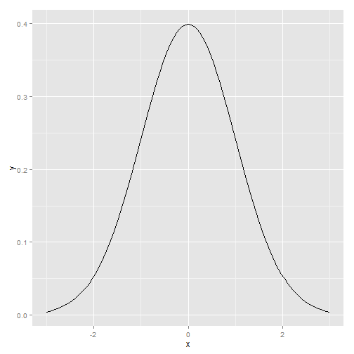 

```r
    
    
#====================================
p + stat_function(fun=dt, args=list(df=2))
```

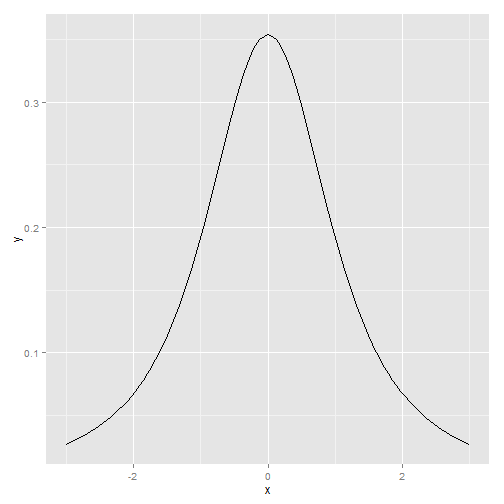 

```r
    
    
#====================================
myfun <- function(xvar) {
    1/(1 + exp(-xvar + 10))
}

ggplot(data.frame(x=c(0, 20)), aes(x=x)) + stat_function(fun=myfun)
```

 

```r
    
    
#====================================
# Return dnorm(x) for 0 < x < 2, and NA for all other x
dnorm_limit <- function(x) {
    y <- dnorm(x)
    y[x < 0  |  x > 2] <- NA
    return(y)
}

# ggplot() with dummy data
p <- ggplot(data.frame(x=c(-3, 3)), aes(x=x))

p + stat_function(fun=dnorm_limit, geom="area", fill="blue", alpha=0.2) +
    stat_function(fun=dnorm)
```

 

```r
    
    
#====================================
limitRange <- function(fun, min, max) {
    function(x) {
        y <- fun(x)
        y[x < min  |  x > max] <- NA
        return(y)
    }
}
    
    
#====================================
# This returns a function
dlimit <- limitRange(dnorm, 0, 2)

# Now we'll try out the new function -- it only returns values for inputs
# between 0 and 2
dlimit(-2:4)
```

```
## [1]      NA      NA 0.39894 0.24197 0.05399      NA      NA
```

```r

 #[1]         NA         NA 0.39894228 0.24197072 0.05399097         NA         NA

    
    
#====================================
p + stat_function(fun = dnorm) +
    stat_function(fun = limitRange(dnorm, 0, 2),
                  geom="area", fill="blue", alpha=0.2)
```

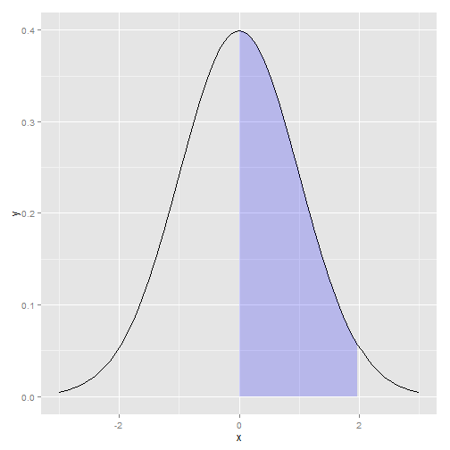 

```r
    
    
#====================================
# May need to install first, with install.packages("igraph")
#install.packages("igraph")
library(igraph)

# Specify edges for a directed graph
gd <- graph(c(1,2, 2,3, 2,4, 1,4, 5,5, 3,6))
plot(gd)
```

 

```r

# For an undirected graph
gu <- graph(c(1,2, 2,3, 2,4, 1,4, 5,5, 3,6), directed=FALSE)
# No labels
plot(gu, vertex.label=NA)
```

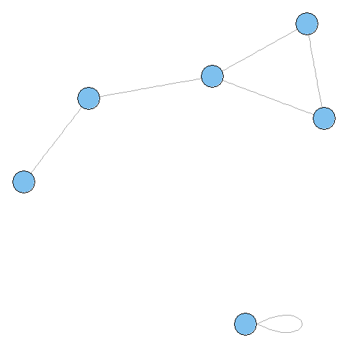 

```r
    
    
#====================================
str(gd)
```

```
## IGRAPH D--- 6 6 -- 
## + edges:
## [1] 1->2 2->3 2->4 1->4 5->5 3->6
```

```r

#IGRAPH D--- 6 6 -- 
#+ edges:
#[1] 1->2 2->3 2->4 1->4 5->5 3->6

str(gu)
```

```
## IGRAPH U--- 6 6 -- 
## + edges:
## [1] 1--2 2--3 2--4 1--4 5--5 3--6
```

```r

#IGRAPH U--- 6 6 -- 
#+ edges:
#[1] 1--2 2--3 2--4 1--4 5--5 3--6
    
    
#====================================
set.seed(229)
plot(gu)
```

 

```r
    
    
#====================================
library(gcookbook) # For the data set
head(madmen2)
```

```
##                  Name1        Name2
## 1          Abe Drexler  Peggy Olson
## 2              Allison   Don Draper
## 3          Arthur Case Betty Draper
## 4 Bellhop in Baltimore   Sal Romano
## 5     Bethany Van Nuys   Don Draper
## 6         Betty Draper   Don Draper
```

```r


# Create a graph object from the data set
g <- graph.data.frame(madmen2, directed=TRUE)

# Remove unnecessary margins
par(mar=c(0,0,0,0))

plot(g, layout=layout.fruchterman.reingold, vertex.size=8, edge.arrow.size=0.5,
     vertex.label=NA)
```

 

```r

    
    
#====================================
g <- graph.data.frame(madmen, directed=FALSE)
par(mar=c(0,0,0,0))  # Remove unnecessary margins
plot(g, layout=layout.circle, vertex.size=8, vertex.label=NA)
```

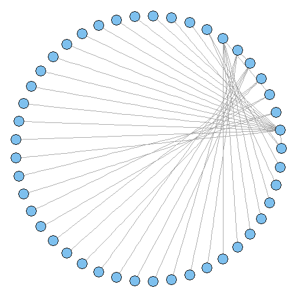 

```r
    
    
#====================================
library(igraph)
library(gcookbook) # For the data set
# Copy madmen and drop every other row
m <- madmen[1:nrow(madmen) %% 2 == 1, ]
g <- graph.data.frame(m, directed=FALSE)

# Print out the names of each vertex
V(g)$name
```

```
##  [1] "Betty Draper"      "Don Draper"        "Harry Crane"      
##  [4] "Joan Holloway"     "Lane Pryce"        "Peggy Olson"      
##  [7] "Pete Campbell"     "Roger Sterling"    "Sal Romano"       
## [10] "Henry Francis"     "Allison"           "Candace"          
## [13] "Faye Miller"       "Megan Calvet"      "Rachel Menken"    
## [16] "Suzanne Farrell"   "Hildy"             "Franklin"         
## [19] "Rebecca Pryce"     "Abe Drexler"       "Duck Phillips"    
## [22] "Playtex bra model" "Ida Blankenship"   "Mirabelle Ames"   
## [25] "Vicky"             "Kitty Romano"
```

```r


plot(g, layout=layout.fruchterman.reingold,
     vertex.size        = 4,          # Smaller nodes
     vertex.label       = V(g)$name,  # Set the labels
     vertex.label.cex   = 0.8,        # Slightly smaller font
     vertex.label.dist  = 0.4,        # Offset the labels
     vertex.label.color = "black")
```

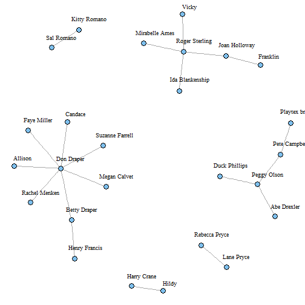 

```r

    
    
#====================================
# This is equivalent to the preceding code
V(g)$size        <- 4
V(g)$label       <- V(g)$name
V(g)$label.cex   <- 0.8
V(g)$label.dist  <- 0.4
V(g)$label.color <- "black"

# Set a property of the entire graph
g$layout <- layout.fruchterman.reingold

plot(g)
```

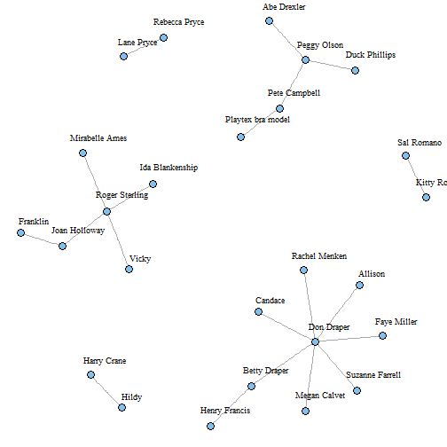 

```r
    
    
#====================================
# View the edges
E(g)
```

```
## Edge sequence:
##                                            
## [1]  Henry Francis     -- Betty Draper     
## [2]  Allison           -- Don Draper       
## [3]  Don Draper        -- Betty Draper     
## [4]  Candace           -- Don Draper       
## [5]  Faye Miller       -- Don Draper       
## [6]  Megan Calvet      -- Don Draper       
## [7]  Rachel Menken     -- Don Draper       
## [8]  Suzanne Farrell   -- Don Draper       
## [9]  Hildy             -- Harry Crane      
## [10] Franklin          -- Joan Holloway    
## [11] Roger Sterling    -- Joan Holloway    
## [12] Rebecca Pryce     -- Lane Pryce       
## [13] Abe Drexler       -- Peggy Olson      
## [14] Duck Phillips     -- Peggy Olson      
## [15] Pete Campbell     -- Peggy Olson      
## [16] Playtex bra model -- Pete Campbell    
## [17] Ida Blankenship   -- Roger Sterling   
## [18] Mirabelle Ames    -- Roger Sterling   
## [19] Vicky             -- Roger Sterling   
## [20] Kitty Romano      -- Sal Romano
```

```r

# Set some of the labels to "M"
E(g)[c(2,11,19)]$label <- "M"

# Set color of all to grey, and then color a few red
E(g)$color             <- "grey70"
E(g)[c(2,11,19)]$color <- "red"

plot(g)
```

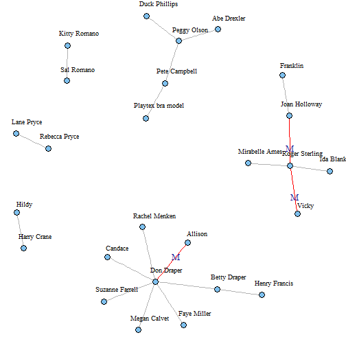 

```r

    
    
#====================================
presidents
```

```
##      Qtr1 Qtr2 Qtr3 Qtr4
## 1945   NA   87   82   75
## 1946   63   50   43   32
## 1947   35   60   54   55
## 1948   36   39   NA   NA
## 1949   69   57   57   51
## 1950   45   37   46   39
## 1951   36   24   32   23
## 1952   25   32   NA   32
## 1953   59   74   75   60
## 1954   71   61   71   57
## 1955   71   68   79   73
## 1956   76   71   67   75
## 1957   79   62   63   57
## 1958   60   49   48   52
## 1959   57   62   61   66
## 1960   71   62   61   57
## 1961   72   83   71   78
## 1962   79   71   62   74
## 1963   76   64   62   57
## 1964   80   73   69   69
## 1965   71   64   69   62
## 1966   63   46   56   44
## 1967   44   52   38   46
## 1968   36   49   35   44
## 1969   59   65   65   56
## 1970   66   53   61   52
## 1971   51   48   54   49
## 1972   49   61   NA   NA
## 1973   68   44   40   27
## 1974   28   25   24   24
```

```r

     #Qtr1 Qtr2 Qtr3 Qtr4
#1945   NA   87   82   75
#1946   63   50   43   32
 #...
#1973   68   44   40   27
#1974   28   25   24   24

str(presidents)
```

```
##  Time-Series [1:120] from 1945 to 1975: NA 87 82 75 63 50 43 32 35 60 ...
```

```r

#Time-Series [1:120] from 1945 to 1975: NA 87 82 75 63 50 43 32 35 60 ...
    
    
#====================================
pres_rating <- data.frame(
    rating  = as.numeric(presidents),
    year    = as.numeric(floor(time(presidents))),
    quarter = as.numeric(cycle(presidents))
)

head(pres_rating)
```

```
##   rating year quarter
## 1     NA 1945       1
## 2     87 1945       2
## 3     82 1945       3
## 4     75 1945       4
## 5     63 1946       1
## 6     50 1946       2
```

```r

#====================================
# Base plot
p <- ggplot(pres_rating, aes(x=year, y=quarter, fill=rating))

# Using geom_tile()
p + geom_tile()
```

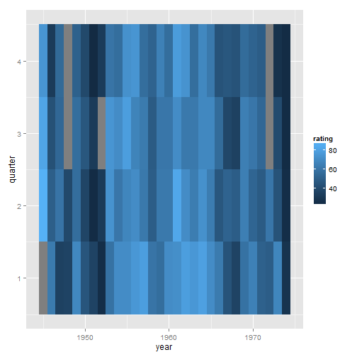 

```r

# Using geom_raster() - looks the same, but a little more efficient
p + geom_raster()
```

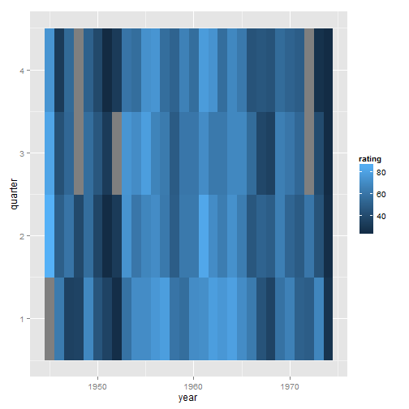 

```r
    
    
#====================================
p + geom_tile() +
    scale_x_continuous(breaks = seq(1940, 1976, by = 4)) +
    scale_y_reverse() +
    scale_fill_gradient2(midpoint=50, mid="grey70", limits=c(0,100))
```

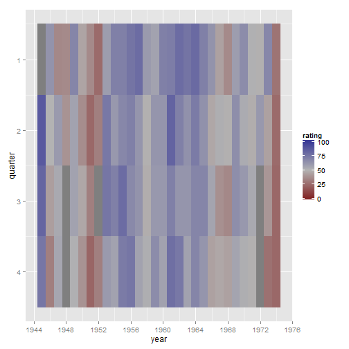 

```r
    
    
#====================================
# You may need to install first, with install.packages("rgl")
library(rgl)
plot3d(mtcars$wt, mtcars$disp, mtcars$mpg, type="s", size=0.75, lit=FALSE)
    
    
#====================================
# Function to interleave the elements of two vectors
interleave <- function(v1, v2)  as.vector(rbind(v1,v2))

# Plot the points
plot3d(mtcars$wt, mtcars$disp, mtcars$mpg,
       xlab="Weight", ylab="Displacement", zlab="MPG",
       size=.75, type="s", lit=FALSE)

# Add the segments
segments3d(interleave(mtcars$wt,   mtcars$wt),
           interleave(mtcars$disp, mtcars$disp),
           interleave(mtcars$mpg,  min(mtcars$mpg)),
           alpha=0.4, col="blue")
    
    
#====================================
# Make plot without axis ticks or labels
plot3d(mtcars$wt, mtcars$disp, mtcars$mpg,
       xlab = "", ylab = "", zlab = "",
       axes = FALSE,
       size=.75, type="s", lit=FALSE)

segments3d(interleave(mtcars$wt,   mtcars$wt),
           interleave(mtcars$disp, mtcars$disp),
           interleave(mtcars$mpg,  min(mtcars$mpg)),
           alpha = 0.4, col = "blue")

# Draw the box.
rgl.bbox(color="grey50",          # grey60 surface and black text
         emission="grey50",       # emission color is grey50
         xlen=0, ylen=0, zlen=0)  # Don't add tick marks

# Set default color of future objects to black
rgl.material(color="black")

# Add axes to specific sides. Possible values are "x--", "x-+", "x+-", and "x++".
axes3d(edges=c("x--", "y+-", "z--"),
       ntick=6,                       # Attempt 6 tick marks on each side
       cex=.75)                       # Smaller font

# Add axis labels. 'line' specifies how far to set the label from the axis.
mtext3d("Weight",       edge="x--", line=2)
mtext3d("Displacement", edge="y+-", line=3)
mtext3d("MPG",          edge="z--", line=3)
    
    
#====================================
# Given a model, predict zvar from xvar and yvar
# Defaults to range of x and y variables, and a 16x16 grid
predictgrid <- function(model, xvar, yvar, zvar, res = 16, type = NULL) {
  # Find the range of the predictor variable. This works for lm and glm
  # and some others, but may require customization for others.
  xrange <- range(model$model[[xvar]])
  yrange <- range(model$model[[yvar]])

  newdata <- expand.grid(x = seq(xrange[1], xrange[2], length.out = res),
                         y = seq(yrange[1], yrange[2], length.out = res))
  names(newdata) <- c(xvar, yvar)
  newdata[[zvar]] <- predict(model, newdata = newdata, type = type)
  newdata
}


# Convert long-style data frame with x, y, and z vars into a list
# with x and y as row/column values, and z as a matrix.
df2mat <- function(p, xvar = NULL, yvar = NULL, zvar = NULL) {
  if (is.null(xvar)) xvar <- names(p)[1]
  if (is.null(yvar)) yvar <- names(p)[2]
  if (is.null(zvar)) zvar <- names(p)[3]

  x <- unique(p[[xvar]])
  y <- unique(p[[yvar]])
  z <- matrix(p[[zvar]], nrow = length(y), ncol = length(x))

  m <- list(x, y, z)
  names(m) <- c(xvar, yvar, zvar)
  m
}

# Function to interleave the elements of two vectors
interleave <- function(v1, v2)  as.vector(rbind(v1,v2))
    
    
#====================================
#install.packages("rgl")
library(rgl)

# Make a copy of the data set
m <- mtcars

# Generate a linear model
mod <- lm(mpg ~ wt + disp + wt:disp, data = m)

# Get predicted values of mpg from wt and disp
m$pred_mpg <- predict(mod)

# Get predicted mpg from a grid of wt and disp
mpgrid_df <- predictgrid(mod, "wt", "disp", "mpg")
mpgrid_list <- df2mat(mpgrid_df)

# Make the plot with the data points
plot3d(m$wt, m$disp, m$mpg, type="s", size=0.5, lit=FALSE)

# Add the corresponding predicted points (smaller)
spheres3d(m$wt, m$disp, m$pred_mpg, alpha=0.4, type="s", size=0.5, lit=FALSE)

# Add line segments showing the error
segments3d(interleave(m$wt,   m$wt),
           interleave(m$disp, m$disp),
           interleave(m$mpg,  m$pred_mpg),
           alpha=0.4, col="red")

# Add the mesh of predicted values
surface3d(mpgrid_list$wt, mpgrid_list$disp, mpgrid_list$mpg,
          alpha=0.4, front="lines", back="lines")
    
    
#====================================
plot3d(mtcars$wt, mtcars$disp, mtcars$mpg,
       xlab = "", ylab = "", zlab = "",
       axes = FALSE,
       size=.5, type="s", lit=FALSE)

# Add the corresponding predicted points (smaller)
spheres3d(m$wt, m$disp, m$pred_mpg, alpha=0.4, type="s", size=0.5, lit=FALSE)

# Add line segments showing the error
segments3d(interleave(m$wt,   m$wt),
           interleave(m$disp, m$disp),
           interleave(m$mpg,  m$pred_mpg),
           alpha=0.4, col="red")

# Add the mesh of predicted values
surface3d(mpgrid_list$wt, mpgrid_list$disp, mpgrid_list$mpg,
          alpha=0.4, front="lines", back="lines")

# Draw the box
rgl.bbox(color="grey50",          # grey60 surface and black text
         emission="grey50",       # emission color is grey50
         xlen=0, ylen=0, zlen=0)  # Don't add tick marks

# Set default color of future objects to black
rgl.material(color="black")

# Add axes to specific sides. Possible values are "x--", "x-+", "x+-", and "x++".
axes3d(edges=c("x--", "y+-", "z--"),
       ntick=6,                       # Attempt 6 tick marks on each side
       cex=.75)                       # Smaller font

# Add axis labels. 'line' specifies how far to set the label from the axis.
mtext3d("Weight",       edge="x--", line=2)
mtext3d("Displacement", edge="y+-", line=3)
mtext3d("MPG",          edge="z--", line=3)
    
    
#====================================
library(rgl)
plot3d(mtcars$wt, mtcars$disp, mtcars$mpg, type="s", size=0.75, lit=FALSE)

rgl.snapshot('3dplot.png', fmt='png')
    
    
#====================================
rgl.postscript('figs/miscgraph/3dplot.pdf', fmt='pdf')

rgl.postscript('figs/miscgraph/3dplot.ps', fmt='ps')
    
    
#====================================
# Save the current viewpoint
view <- par3d("userMatrix")

# Restore the saved viewpoint
par3d(userMatrix = view)
    
    
#====================================
dput(view)
```

```
## structure(c(1, 0, 0, 0, 0, 0.342020143325668, -0.939692620785909, 
## 0, 0, 0.939692620785909, 0.342020143325668, 0, 0, 0, 0, 1), .Dim = c(4L, 
## 4L))
```

```r

structure(c(0.907931625843048, 0.267511069774628, -0.322642296552658,
0, -0.410978674888611, 0.417272746562958, -0.810543060302734,
0, -0.0821993798017502, 0.868516683578491, 0.488796472549438,
0, 0, 0, 0, 1), .Dim = c(4L, 4L))
```

```
##         [,1]    [,2]    [,3] [,4]
## [1,]  0.9079 -0.4110 -0.0822    0
## [2,]  0.2675  0.4173  0.8685    0
## [3,] -0.3226 -0.8105  0.4888    0
## [4,]  0.0000  0.0000  0.0000    1
```

```r

    
    
#====================================
view <- structure(c(0.907931625843048, 0.267511069774628, -0.322642296552658,
0, -0.410978674888611, 0.417272746562958, -0.810543060302734,
0, -0.0821993798017502, 0.868516683578491, 0.488796472549438,
0, 0, 0, 0, 1), .Dim = c(4L, 4L))

par3d(userMatrix = view)
    
    
#====================================
library(rgl)
plot3d(mtcars$wt, mtcars$disp, mtcars$mpg, type="s", size=0.75, lit=FALSE)

play3d(spin3d())
```

```
## Error: no device opened with id1
```

```r
    
    
#====================================
# Spin on x-axis, at 4 rpm, for 20 seconds
play3d(spin3d(axis=c(1,0,0), rpm=4), duration=20)
```

```
## Error: no device opened with id2
```

```r
    
    
#====================================
# Spin on z axis, at 4 rpm, for 15 seconds
movie3d(spin3d(axis=c(0,0,1), rpm=4), duration=15, fps=50)
```

```
## Writing movie000.png 
Writing movie001.png 
Writing movie002.png 
Writing movie003.png 
Writing movie004.png 
Writing movie005.png 
Writing movie006.png 
Writing movie007.png 
Writing movie008.png 
Writing movie009.png 
Writing movie010.png 
Writing movie011.png 
Writing movie012.png 
Writing movie013.png 
Writing movie014.png 
Writing movie015.png 
Writing movie016.png 
Writing movie017.png 
Writing movie018.png 
Writing movie019.png 
Writing movie020.png 
Writing movie021.png 
Writing movie022.png 
Writing movie023.png 
Writing movie024.png 
Writing movie025.png 
Writing movie026.png 
Writing movie027.png 
Writing movie028.png 
Writing movie029.png 
Writing movie030.png 
```

```
## Error: no device opened with id3
```

```r
    
    
#====================================
library(gcookbook) # For the data set

# Get data from year 2009
c2 <- subset(countries, Year==2009)

# Drop rows that have any NA values
c2 <- c2[complete.cases(c2), ]

# Pick out a random 25 countries
# (Set random seed to make this repeatable)
set.seed(201)
c2 <- c2[sample(1:nrow(c2), 25), ]

c2
```

```
##                   Name Code Year     GDP laborrate healthexp infmortality
## 6731          Mongolia  MNG 2009  1690.4      72.9     74.20         27.8
## 1733            Canada  CAN 2009 39599.0      67.8   4379.76          5.2
## 4028         Guatemala  GTM 2009  2685.0      66.9    186.12         25.9
## 611            Austria  AUT 2009 45555.4      60.4   5037.31          3.6
## 10964           Zambia  ZMB 2009  1006.4      69.2     47.06         71.5
## 1478          Bulgaria  BGR 2009  6403.1      54.5    474.85         11.1
## 662         Azerbaijan  AZE 2009  4808.2      63.0    284.73         41.1
## 3824            Greece  GRC 2009 28936.5      53.7   3040.73          3.5
## 1070             Benin  BEN 2009   771.7      72.7     31.93         74.7
## 2957  Egypt, Arab Rep.  EGY 2009  2370.7      48.8    113.30         20.0
## 4844             Italy  ITA 2009 35073.3      49.1   3327.63          3.2
## 7037             Nepal  NPL 2009   438.2      71.5     25.34         43.3
## 6119          Malaysia  MYS 2009  6908.7      62.0    336.44          5.6
## 4793            Israel  ISR 2009 26102.4      57.1   1966.47          3.7
## 5252       Korea, Rep.  KOR 2009 17110.0      60.9   1107.95          4.3
## 5099             Kenya  KEN 2009   744.4      82.2     33.25         56.3
## 152            Algeria  DZA 2009  4022.2      58.5    267.95         32.0
## 2447           Croatia  HRV 2009 14322.6      53.0   1120.37          4.9
## 5609           Lesotho  LSO 2009   800.4      74.0     70.05         67.0
## 4691           Ireland  IRL 2009 49737.9      63.6   4951.84          3.4
## 7343           Nigeria  NGA 2009  1091.1      56.2     69.30         90.4
## 5660           Liberia  LBR 2009   229.3      71.1     29.36         77.6
## 5558           Lebanon  LBN 2009  8321.4      46.1    663.27         19.4
## 5966    Macedonia, FYR  MKD 2009  4510.2      54.0    313.69         10.6
## 10148     Turkmenistan  TKM 2009  3710.5      68.0     77.07         48.0
```

```r

#====================================
rownames(c2) <- c2$Name
c2 <- c2[,4:7]
c2
```

```
##                      GDP laborrate healthexp infmortality
## Mongolia          1690.4      72.9     74.20         27.8
## Canada           39599.0      67.8   4379.76          5.2
## Guatemala         2685.0      66.9    186.12         25.9
## Austria          45555.4      60.4   5037.31          3.6
## Zambia            1006.4      69.2     47.06         71.5
## Bulgaria          6403.1      54.5    474.85         11.1
## Azerbaijan        4808.2      63.0    284.73         41.1
## Greece           28936.5      53.7   3040.73          3.5
## Benin              771.7      72.7     31.93         74.7
## Egypt, Arab Rep.  2370.7      48.8    113.30         20.0
## Italy            35073.3      49.1   3327.63          3.2
## Nepal              438.2      71.5     25.34         43.3
## Malaysia          6908.7      62.0    336.44          5.6
## Israel           26102.4      57.1   1966.47          3.7
## Korea, Rep.      17110.0      60.9   1107.95          4.3
## Kenya              744.4      82.2     33.25         56.3
## Algeria           4022.2      58.5    267.95         32.0
## Croatia          14322.6      53.0   1120.37          4.9
## Lesotho            800.4      74.0     70.05         67.0
## Ireland          49737.9      63.6   4951.84          3.4
## Nigeria           1091.1      56.2     69.30         90.4
## Liberia            229.3      71.1     29.36         77.6
## Lebanon           8321.4      46.1    663.27         19.4
## Macedonia, FYR    4510.2      54.0    313.69         10.6
## Turkmenistan      3710.5      68.0     77.07         48.0
```

```r

#====================================
c3 <- scale(c2)
c3
```

```
##                      GDP laborrate  healthexp infmortality
## Mongolia         -0.6783   1.15029 -0.6341394     -0.08335
## Canada            1.7505   0.59747  1.9736220     -0.88015
## Guatemala        -0.6146   0.49992 -0.5663495     -0.15033
## Austria           2.1321  -0.20465  2.3718821     -0.93656
## Zambia           -0.7222   0.74923 -0.6505785      1.45737
## Bulgaria         -0.3764  -0.84418 -0.3914778     -0.67213
## Azerbaijan       -0.4786   0.07718 -0.5066289      0.38557
## Greece            1.0673  -0.93090  1.1626100     -0.94009
## Benin            -0.7372   1.12861 -0.6597408      1.57019
## Egypt, Arab Rep. -0.6348  -1.46203 -0.6104582     -0.35835
## Italy             1.4605  -1.42951  1.3363751     -0.95066
## Nepal            -0.7586   0.99853 -0.6637287      0.46313
## Malaysia         -0.3440  -0.03122 -0.4753076     -0.86605
## Israel            0.8857  -0.56235  0.5119590     -0.93303
## Korea, Rep.       0.3096  -0.15045 -0.0080252     -0.91188
## Kenya            -0.7390   2.15836 -0.6589411      0.92147
## Algeria          -0.5289  -0.41060 -0.5167913      0.06473
## Croatia           0.1310  -1.00677 -0.0005011     -0.89073
## Lesotho          -0.7354   1.26952 -0.6366519      1.29872
## Ireland           2.4001   0.14221  2.3201175     -0.94361
## Nigeria          -0.7167  -0.65991 -0.6371077      2.12372
## Liberia          -0.7720   0.95518 -0.6612990      1.67244
## Lebanon          -0.2535  -1.75470 -0.2773526     -0.37950
## Macedonia, FYR   -0.4977  -0.89838 -0.4890859     -0.68976
## Turkmenistan     -0.5489   0.61915 -0.6324003      0.62884
## attr(,"scaled:center")
##          GDP    laborrate    healthexp infmortality 
##     12277.96        62.29      1121.20        30.16 
## attr(,"scaled:scale")
##          GDP    laborrate    healthexp infmortality 
##    15607.853        9.226     1651.057       28.363
```

```r


attr(,"scaled:scale")
```

```
## Error: 1元素是空的
```

```r
         #GDP    laborrate    healthexp infmortality
#15607.852864     9.225523  1651.056974    28.363384

    
    
#====================================
hc <- hclust(dist(c3))

# Make the dendrogram
plot(hc)
```

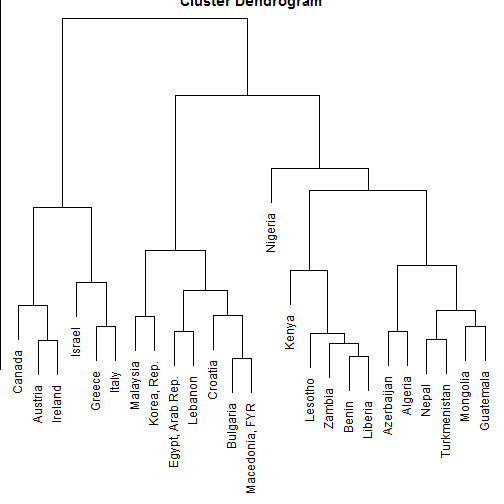 

```r

# With text aligned
plot(hc, hang = -1)
```

 

```r
    
    
#====================================
library(gcookbook) # For the data set
head(isabel)
```

```
##     x     y     z vx vy vz  t speed
## 1 -83 41.70 0.035 NA NA NA NA    NA
## 2 -83 41.56 0.035 NA NA NA NA    NA
## 3 -83 41.41 0.035 NA NA NA NA    NA
## 4 -83 41.27 0.035 NA NA NA NA    NA
## 5 -83 41.12 0.035 NA NA NA NA    NA
## 6 -83 40.98 0.035 NA NA NA NA    NA
```

```r

#====================================
islice <- subset(isabel, z == min(z))

ggplot(islice, aes(x=x, y=y)) +
       geom_segment(aes(xend = x + vx/50, yend = y + vy/50),
                    size = 0.25)   # Make the line segments 0.25 mm thick
```

```
## Warning: Removed 3745 rows containing missing values (geom_segment).
```

 

```r
    
    
#====================================
# Take a slice where z is equal to the minimum value of z
islice <- subset(isabel, z == min(z))

# Keep 1 out of every 'by' values in vector x
every_n <- function(x, by = 2) {
    x <- sort(x)
    x[seq(1, length(x), by = by)]
}

# Keep 1 of every 4 values in x and y
keepx <- every_n(unique(isabel$x), by=4)
keepy <- every_n(unique(isabel$y), by=4)

# Keep only those rows where x value is in keepx and y value is in keepy
islicesub <- subset(islice, x %in% keepx  &  y %in% keepy)
    
    
#====================================
# Need to load grid for arrow() function
library(grid)

# Make the plot with the subset, and use an arrowhead 0.1 cm long
ggplot(islicesub, aes(x=x, y=y)) +
    geom_segment(aes(xend = x+vx/50, yend = y+vy/50),
                 arrow = arrow(length = unit(0.1, "cm")), size = 0.25)
```

```
## Warning: Removed 248 rows containing missing values (geom_segment).
```

 

```r
    
    
#====================================
# The existing 'speed' column includes the z component. We'll calculate
# speedxy, the horizontal speed.
islicesub$speedxy <- sqrt(islicesub$vx^2 + islicesub$vy^2)

# Map speed to alpha
ggplot(islicesub, aes(x=x, y=y)) +
    geom_segment(aes(xend = x+vx/50, yend = y+vy/50, alpha = speed),
                 arrow = arrow(length = unit(0.1,"cm")), size = 0.6)
```

```
## Warning: Removed 248 rows containing missing values (geom_segment).
```

 

```r
    
    
#====================================
# Get USA map data
usa <- map_data("usa")

# Map speed to colour, and set go from "grey80" to "darkred"
ggplot(islicesub, aes(x=x, y=y)) +
    geom_segment(aes(xend = x+vx/50, yend = y+vy/50, colour = speed),
                 arrow = arrow(length = unit(0.1,"cm")), size = 0.6) +
    scale_colour_continuous(low="grey80", high="darkred") +
    geom_path(aes(x=long, y=lat, group=group), data=usa) +
    coord_cartesian(xlim = range(islicesub$x), ylim = range(islicesub$y))
```

```
## Warning: Removed 248 rows containing missing values (geom_segment).
```

 

```r
    
    
#====================================
# Keep 1 out of every 5 values in x and y, and 1 in 2 values in z
keepx <- every_n(unique(isabel$x), by=5)
keepy <- every_n(unique(isabel$y), by=5)
keepz <- every_n(unique(isabel$z), by=2)

isub <- subset(isabel, x %in% keepx  &  y %in% keepy  &  z %in% keepz)

ggplot(isub, aes(x=x, y=y)) +
    geom_segment(aes(xend = x+vx/50, yend = y+vy/50, colour = speed),
                 arrow = arrow(length = unit(0.1,"cm")), size = 0.5) +
    scale_colour_continuous(low="grey80", high="darkred") +
    facet_wrap( ~ z)
```

```
## Warning: Removed 151 rows containing missing values (geom_segment).
```

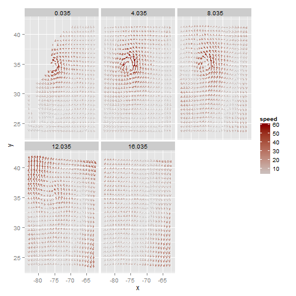 

```r
    
    
#====================================
library(gcookbook) # For the data set

# QQ plot of height
qqnorm(heightweight$heightIn)
qqline(heightweight$heightIn)
```

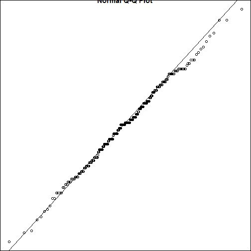 

```r

# QQ plot of age
qqnorm(heightweight$ageYear)
qqline(heightweight$ageYear)
```

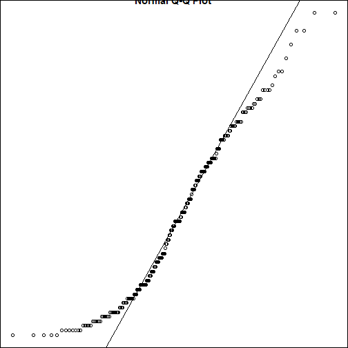 

```r
    
    
#====================================
library(gcookbook) # For the data set

# ecdf of heightIn
ggplot(heightweight, aes(x=heightIn)) + stat_ecdf()
```

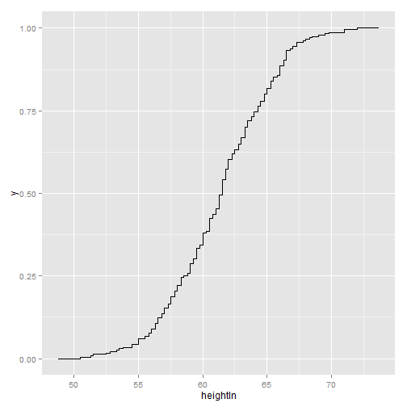 

```r

# ecdf of ageYear
ggplot(heightweight, aes(x=ageYear)) + stat_ecdf()
```

 

```r
    
    
#====================================
UCBAdmissions
```

```
## , , Dept = A
## 
##           Gender
## Admit      Male Female
##   Admitted  512     89
##   Rejected  313     19
## 
## , , Dept = B
## 
##           Gender
## Admit      Male Female
##   Admitted  353     17
##   Rejected  207      8
## 
## , , Dept = C
## 
##           Gender
## Admit      Male Female
##   Admitted  120    202
##   Rejected  205    391
## 
## , , Dept = D
## 
##           Gender
## Admit      Male Female
##   Admitted  138    131
##   Rejected  279    244
## 
## , , Dept = E
## 
##           Gender
## Admit      Male Female
##   Admitted   53     94
##   Rejected  138    299
## 
## , , Dept = F
## 
##           Gender
## Admit      Male Female
##   Admitted   22     24
##   Rejected  351    317
```

```r

#, , Dept = A

          #Gender
#Admit      Male Female
  #Admitted  512     89
  #Rejected  313     19

 #... [four other Depts]

#, , Dept = F
#
          #Gender
#Admit      Male Female
  #Admitted   22     24
  #Rejected  351    317

# Print a "flat" contingency table
ftable(UCBAdmissions)
```

```
##                 Dept   A   B   C   D   E   F
## Admit    Gender                             
## Admitted Male        512 353 120 138  53  22
##          Female       89  17 202 131  94  24
## Rejected Male        313 207 205 279 138 351
##          Female       19   8 391 244 299 317
```

```r

                #Dept   A   B   C   D   E   F
#Admit    Gender
#Admitted Male        512 353 120 138  53  22
         #Female       89  17 202 131  94  24
#Rejected Male        313 207 205 279 138 351
         #Female       19   8 391 244 299 317

dimnames(UCBAdmissions)
```

```
## $Admit
## [1] "Admitted" "Rejected"
## 
## $Gender
## [1] "Male"   "Female"
## 
## $Dept
## [1] "A" "B" "C" "D" "E" "F"
```

```r

#$Admit
#[1] "Admitted" "Rejected"

#$Gender
#[1] "Male"   "Female"

#$Dept
#[1] "A" "B" "C" "D" "E" "F"
    
    
#====================================
# You may need to install first, with install.packages("vcd")
library(vcd)
# Split by Admit, then Gender, then Dept
mosaic( ~ Admit + Gender + Dept, data=UCBAdmissions)
```

 

```r
    
    
#====================================
mosaic( ~ Dept + Gender + Admit, data=UCBAdmissions,
    highlighting="Admit", highlighting_fill=c("lightblue", "pink"),
    direction=c("v","h","v"))
```

 

```r
    
    
#====================================
# Another possible set of splitting directions
mosaic( ~ Dept + Gender + Admit, data=UCBAdmissions,
    highlighting="Admit", highlighting_fill=c("lightblue", "pink"),
    direction=c("v", "v", "h"))
```

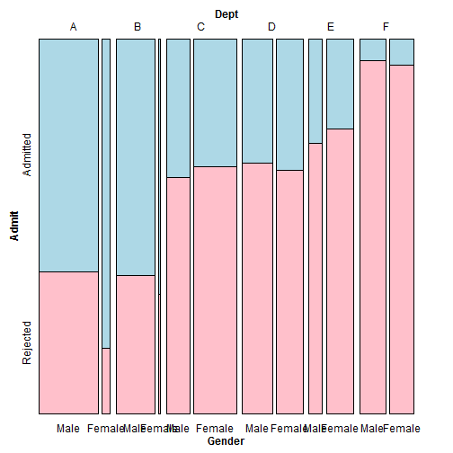 

```r

# This order makes it difficult to compare male and female
mosaic( ~ Dept + Gender + Admit, data=UCBAdmissions,
    highlighting="Admit", highlighting_fill=c("lightblue", "pink"),
    direction=c("v", "h", "h"))
```

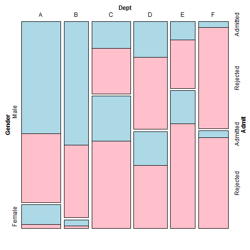 

```r
    
    
#====================================
library(MASS)  # For the data set

# Get a table of how many cases are in each level of fold
fold <- table(survey$Fold)
fold
```

```
## 
##  L on R Neither  R on L 
##      99      18     120
```

```r

 #L on R Neither  R on L
     #99      18     120

# Make the pie chart
pie(fold)

    
#====================================
pie(c(99, 18, 120), labels=c("L on R", "Neither", "R on L"))
```

 

```r
    
    
#====================================
library(maps) # For map data
# Get map data for USA
states_map <- map_data("state")

ggplot(states_map, aes(x=long, y=lat, group=group)) +
    geom_polygon(fill="white", colour="black")
```

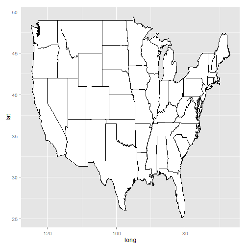 

```r

# geom_path (no fill) and Mercator projection
ggplot(states_map, aes(x=long, y=lat, group=group)) +
    geom_path() + coord_map("mercator")
```

```
## Error: mapproj package required for this functionality.  Please install
## and try again.
```

```r
    
    
#====================================
# Get map data for world
world_map <- map_data("world")
head(world_map)
```

```
##     long   lat group order region subregion
## 1 -133.4 58.42     1     1 Canada      <NA>
## 2 -132.3 57.16     1     2 Canada      <NA>
## 3 -132.0 56.99     1     3 Canada      <NA>
## 4 -131.9 56.74     1     4 Canada      <NA>
## 5 -130.2 56.10     1     5 Canada      <NA>
## 6 -130.0 55.91     1     6 Canada      <NA>
```

```r

#====================================
sort(unique(world_map$region))
```

```
##   [1] "Afghanistan"              "Albania"                 
##   [3] "Algeria"                  "American Samoa"          
##   [5] "Andaman Islands"          "Andorra"                 
##   [7] "Angola"                   "Anguilla"                
##   [9] "Antarctica"               "Antigua"                 
##  [11] "Aral Sea"                 "Argentina"               
##  [13] "Aruba"                    "Australia"               
##  [15] "Austria"                  "Azores"                  
##  [17] "Bahamas"                  "Bahrain"                 
##  [19] "Bangladesh"               "Barbados"                
##  [21] "Barbuda"                  "Belgium"                 
##  [23] "Belize"                   "Benin"                   
##  [25] "Bhutan"                   "Black Sea"               
##  [27] "Bolivia"                  "Bonaire"                 
##  [29] "Botswana"                 "Brazil"                  
##  [31] "Brunei"                   "Bulgaria"                
##  [33] "Burkina Faso"             "Burundi"                 
##  [35] "California"               "Cambodia"                
##  [37] "Cameroon"                 "Canada"                  
##  [39] "Canary Islands"           "Cape Verde"              
##  [41] "Caspian Sea"              "Cayman Islands"          
##  [43] "Central African Republic" "Chad"                    
##  [45] "Chagos Archipelago"       "Chile"                   
##  [47] "China"                    "Colombia"                
##  [49] "Comoros"                  "Congo"                   
##  [51] "Cook Islands"             "Costa Rica"              
##  [53] "Cuba"                     "Curacao"                 
##  [55] "Cyprus"                   "Czechoslovakia"          
##  [57] "Denmark"                  "Djibouti"                
##  [59] "Dominica"                 "Dominican Republic"      
##  [61] "Ecuador"                  "Egypt"                   
##  [63] "El Salvador"              "Equatorial Guinea"       
##  [65] "Ethiopia"                 "Falkland Islands"        
##  [67] "Fiji"                     "Finland"                 
##  [69] "France"                   "French Guiana"           
##  [71] "French Polynesia"         "Gabon"                   
##  [73] "Gambia"                   "Gaza Strip"              
##  [75] "Germany"                  "Ghana"                   
##  [77] "Great Bitter Lake"        "Great Lakes"             
##  [79] "Greece"                   "Greenland"               
##  [81] "Grenada"                  "Guadeloupe"              
##  [83] "Guatemala"                "Guinea"                  
##  [85] "Guinea-Bissau"            "Guyana"                  
##  [87] "Haiti"                    "Hawaii"                  
##  [89] "Honduras"                 "Hungary"                 
##  [91] "Iceland"                  "India"                   
##  [93] "Indonesia"                "Iran"                    
##  [95] "Iraq"                     "Ireland"                 
##  [97] "Irian Jaya"               "Isle of Man"             
##  [99] "Isle of Wight"            "Israel"                  
## [101] "Italy"                    "Ivory Coast"             
## [103] "Jamaica"                  "Japan"                   
## [105] "Jordan"                   "Kenya"                   
## [107] "Kiribati"                 "Kuwait"                  
## [109] "Lacul Greaca"             "Lake Albert"             
## [111] "Lake Fjerritslev"         "Lake Kariba"             
## [113] "Lake Malawi"              "Lake Pasvikelv"          
## [115] "Lake Tanganyika"          "Lake Titicaca"           
## [117] "Lake Victoria"            "Laos"                    
## [119] "Lebanon"                  "Lesotho"                 
## [121] "Liberia"                  "Libya"                   
## [123] "Liechtenstein"            "Luxembourg"              
## [125] "Madagascar"               "Madeira Islands"         
## [127] "Malawi"                   "Malaysia"                
## [129] "Maldives"                 "Mali"                    
## [131] "Malta"                    "Marshall Islands"        
## [133] "Martinique"               "Maug Island"             
## [135] "Mauritania"               "Mauritius"               
## [137] "Mexico"                   "Micronesia"              
## [139] "Monaco"                   "Mongolia"                
## [141] "Montserrat"               "Morocco"                 
## [143] "Mozambique"               "Myanmar"                 
## [145] "Namibia"                  "Nauru"                   
## [147] "Nepal"                    "Netherlands"             
## [149] "Neutral Zone"             "Nevis"                   
## [151] "New Caledonia"            "New Zealand"             
## [153] "Nicaragua"                "Niger"                   
## [155] "Nigeria"                  "North Korea"             
## [157] "Northern Mariana Islands" "Norway"                  
## [159] "Oman"                     "Pakistan"                
## [161] "Panama"                   "Papua New Guinea"        
## [163] "Paracel Islands"          "Paraguay"                
## [165] "Peru"                     "Philippines"             
## [167] "Pitcairn Islands"         "Poland"                  
## [169] "Portugal"                 "Puerto Rico"             
## [171] "Qatar"                    "Romania"                 
## [173] "Rwanda"                   "Saint-Barthelemy"        
## [175] "Saint-Martin"             "Saint Eustatius"         
## [177] "Saint Kitts"              "Saint Lucia"             
## [179] "Saint Vincent"            "Samoa"                   
## [181] "San Marino"               "Sao Tome and Principe"   
## [183] "Sardinia"                 "Saudi Arabia"            
## [185] "Senegal"                  "Seychelles"              
## [187] "Sicily"                   "Sierra Leone"            
## [189] "Sin Cowe Island"          "Solomon Islands"         
## [191] "Somalia"                  "Sonsorol Island"         
## [193] "South Africa"             "South Korea"             
## [195] "South Sandwich Islands"   "Spain"                   
## [197] "Spratly Island"           "Sri Lanka"               
## [199] "Sudan"                    "Suriname"                
## [201] "Swaziland"                "Sweden"                  
## [203] "Switzerland"              "Syria"                   
## [205] "Tanzania"                 "Thailand"                
## [207] "Tobago"                   "Togo"                    
## [209] "Tokelau"                  "Tonga"                   
## [211] "Trinidad"                 "Tunisia"                 
## [213] "Turkey"                   "Turks and Caicos"        
## [215] "Tuvalu"                   "Uganda"                  
## [217] "UK"                       "United Arab Emirates"    
## [219] "Uruguay"                  "USA"                     
## [221] "USSR"                     "Vanuatu"                 
## [223] "Venezuela"                "Vietnam"                 
## [225] "Virgin Islands"           "Vislinskiy Zaliv"        
## [227] "Wales"                    "West Bank"               
## [229] "Western Sahara"           "Yemen"                   
## [231] "Yugoslavia"               "Zaire"                   
## [233] "Zambia"                   "Zimbabwe"
```

```r

 #"Afghanistan"              "Albania"                  "Algeria"
 #"American Samoa"           "Andaman Islands"          "Andorra"
 #"Angola"                   "Anguilla"                 "Antarctica"
  #...
 #"USA"                      "USSR"                     "Vanuatu"
 #"Venezuela"                "Vietnam"                  "Virgin Islands"
 #"Vislinskiy Zaliv"         "Wales"                    "West Bank"
 #"Western Sahara"           "Yemen"                    "Yugoslavia"
 #"Zaire"                    "Zambia"                   "Zimbabwe"

# You might have noticed that it's a little out of date!
    
    
#====================================
east_asia <- map_data("world", region=c("Japan", "China", "North Korea",
                                        "South Korea"))
# Map region to fill color
ggplot(east_asia, aes(x=long, y=lat, group=group, fill=region)) +
    geom_polygon(colour="black") +
    scale_fill_brewer(palette="Set2")
```

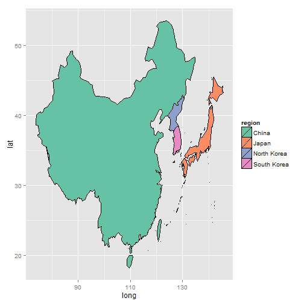 

```r
    
    
#====================================
# Get New Zealand data from world map
nz1 <- map_data("world", region="New Zealand")
nz1 <- subset(nz1, long > 0 & lat > -48)        # Trim off islands
ggplot(nz1, aes(x=long, y=lat, group=group)) + geom_path()
```

 

```r

# Get New Zealand data from the nz map
nz2 <- map_data("nz")
ggplot(nz2, aes(x=long, y=lat, group=group)) + geom_path()
```

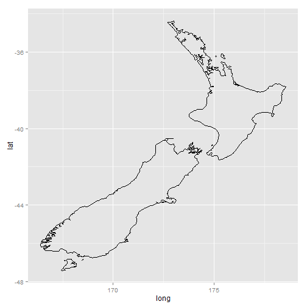 

```r
    
    
#====================================
# Transform the USArrests data set to the correct format
crimes <- data.frame(state = tolower(rownames(USArrests)), USArrests)
head(crimes)
```

```
##                 state Murder Assault UrbanPop Rape
## Alabama       alabama   13.2     236       58 21.2
## Alaska         alaska   10.0     263       48 44.5
## Arizona       arizona    8.1     294       80 31.0
## Arkansas     arkansas    8.8     190       50 19.5
## California california    9.0     276       91 40.6
## Colorado     colorado    7.9     204       78 38.7
```

```r

#install.packages("maps")
library(maps) # For map data
states_map <- map_data("state")

# Merge the data sets together
crime_map <- merge(states_map, crimes, by.x="region", by.y="state")

# After merging, the order has changed, which would lead to polygons drawn in
# the incorrect order. So, we sort the data.
head(crime_map)
```

```
##    region   long   lat group order subregion Murder Assault UrbanPop Rape
## 1 alabama -87.46 30.39     1     1      <NA>   13.2     236       58 21.2
## 2 alabama -87.48 30.37     1     2      <NA>   13.2     236       58 21.2
## 3 alabama -87.95 30.25     1    13      <NA>   13.2     236       58 21.2
## 4 alabama -88.01 30.24     1    14      <NA>   13.2     236       58 21.2
## 5 alabama -88.02 30.25     1    15      <NA>   13.2     236       58 21.2
## 6 alabama -87.53 30.37     1     3      <NA>   13.2     236       58 21.2
```

```r


library(plyr)  # For arrange() function
# Sort by group, then order
crime_map <- arrange(crime_map, group, order)
head(crime_map)
```

```
##    region   long   lat group order subregion Murder Assault UrbanPop Rape
## 1 alabama -87.46 30.39     1     1      <NA>   13.2     236       58 21.2
## 2 alabama -87.48 30.37     1     2      <NA>   13.2     236       58 21.2
## 3 alabama -87.53 30.37     1     3      <NA>   13.2     236       58 21.2
## 4 alabama -87.53 30.33     1     4      <NA>   13.2     236       58 21.2
## 5 alabama -87.57 30.33     1     5      <NA>   13.2     236       58 21.2
## 6 alabama -87.59 30.33     1     6      <NA>   13.2     236       58 21.2
```

```r

#====================================
ggplot(crime_map, aes(x=long, y=lat, group=group, fill=Assault)) +
    geom_polygon(colour="black") +
    coord_map("polyconic")
```

```
## Error: mapproj package required for this functionality.  Please install
## and try again.
```

```r
    
    
#====================================
ggplot(crimes, aes(map_id = state, fill=Assault)) +
    geom_map(map = states_map, colour="black") +
    scale_fill_gradient2(low="#559999", mid="grey90", high="#BB650B",
                         midpoint=median(crimes$Assault)) +
    expand_limits(x = states_map$long, y = states_map$lat) +
    coord_map("polyconic")
```

```
## Error: mapproj package required for this functionality.  Please install
## and try again.
```

```r
    
    
#====================================
# Find the quantile bounds
qa <- quantile(crimes$Assault, c(0, 0.2, 0.4, 0.6, 0.8, 1.0))
qa
```

```
##    0%   20%   40%   60%   80%  100% 
##  45.0  98.8 135.0 188.8 254.2 337.0
```

```r

   #0%   20%   40%   60%   80%  100%
 #45.0  98.8 135.0 188.8 254.2 337.0

# Add a column of the quantile category
crimes$Assault_q <- cut(crimes$Assault, qa,
                      labels=c("0-20%", "20-40%", "40-60%", "60-80%", "80-100%"),
                      include.lowest=TRUE)
crimes
```

```
##                         state Murder Assault UrbanPop Rape Assault_q
## Alabama               alabama   13.2     236       58 21.2    60-80%
## Alaska                 alaska   10.0     263       48 44.5   80-100%
## Arizona               arizona    8.1     294       80 31.0   80-100%
## Arkansas             arkansas    8.8     190       50 19.5    60-80%
## California         california    9.0     276       91 40.6   80-100%
## Colorado             colorado    7.9     204       78 38.7    60-80%
## Connecticut       connecticut    3.3     110       77 11.1    20-40%
## Delaware             delaware    5.9     238       72 15.8    60-80%
## Florida               florida   15.4     335       80 31.9   80-100%
## Georgia               georgia   17.4     211       60 25.8    60-80%
## Hawaii                 hawaii    5.3      46       83 20.2     0-20%
## Idaho                   idaho    2.6     120       54 14.2    20-40%
## Illinois             illinois   10.4     249       83 24.0    60-80%
## Indiana               indiana    7.2     113       65 21.0    20-40%
## Iowa                     iowa    2.2      56       57 11.3     0-20%
## Kansas                 kansas    6.0     115       66 18.0    20-40%
## Kentucky             kentucky    9.7     109       52 16.3    20-40%
## Louisiana           louisiana   15.4     249       66 22.2    60-80%
## Maine                   maine    2.1      83       51  7.8     0-20%
## Maryland             maryland   11.3     300       67 27.8   80-100%
## Massachusetts   massachusetts    4.4     149       85 16.3    40-60%
## Michigan             michigan   12.1     255       74 35.1   80-100%
## Minnesota           minnesota    2.7      72       66 14.9     0-20%
## Mississippi       mississippi   16.1     259       44 17.1   80-100%
## Missouri             missouri    9.0     178       70 28.2    40-60%
## Montana               montana    6.0     109       53 16.4    20-40%
## Nebraska             nebraska    4.3     102       62 16.5    20-40%
## Nevada                 nevada   12.2     252       81 46.0    60-80%
## New Hampshire   new hampshire    2.1      57       56  9.5     0-20%
## New Jersey         new jersey    7.4     159       89 18.8    40-60%
## New Mexico         new mexico   11.4     285       70 32.1   80-100%
## New York             new york   11.1     254       86 26.1    60-80%
## North Carolina north carolina   13.0     337       45 16.1   80-100%
## North Dakota     north dakota    0.8      45       44  7.3     0-20%
## Ohio                     ohio    7.3     120       75 21.4    20-40%
## Oklahoma             oklahoma    6.6     151       68 20.0    40-60%
## Oregon                 oregon    4.9     159       67 29.3    40-60%
## Pennsylvania     pennsylvania    6.3     106       72 14.9    20-40%
## Rhode Island     rhode island    3.4     174       87  8.3    40-60%
## South Carolina south carolina   14.4     279       48 22.5   80-100%
## South Dakota     south dakota    3.8      86       45 12.8     0-20%
## Tennessee           tennessee   13.2     188       59 26.9    40-60%
## Texas                   texas   12.7     201       80 25.5    60-80%
## Utah                     utah    3.2     120       80 22.9    20-40%
## Vermont               vermont    2.2      48       32 11.2     0-20%
## Virginia             virginia    8.5     156       63 20.7    40-60%
## Washington         washington    4.0     145       73 26.2    40-60%
## West Virginia   west virginia    5.7      81       39  9.3     0-20%
## Wisconsin           wisconsin    2.6      53       66 10.8     0-20%
## Wyoming               wyoming    6.8     161       60 15.6    40-60%
```

```r

# Generate a discrete color palette with 5 values
pal <- colorRampPalette(c("#559999", "grey80", "#BB650B"))(5)
pal
```

```
## [1] "#559999" "#90B2B2" "#CCCCCC" "#C3986B" "#BB650B"
```

```r

 #"#559999" "#90B2B2" "#CCCCCC" "#C3986B" "#BB650B"

ggplot(crimes, aes(map_id = state, fill=Assault_q)) +
    geom_map(map = states_map, colour="black") +
    scale_fill_manual(values=pal) +
    expand_limits(x = states_map$long, y = states_map$lat) +
    coord_map("polyconic") +
    labs(fill="Assault Rate\nPercentile")
```

```
## Error: mapproj package required for this functionality.  Please install
## and try again.
```

```r

    
    
#====================================
# The 'state' column in the crimes data is to be matched to the 'region' column
# in the states_map data
ggplot(crimes, aes(map_id = state, fill=Assault)) +
    geom_map(map = states_map) +
    expand_limits(x = states_map$long, y = states_map$lat) +
    coord_map("polyconic")
```

```
## Error: mapproj package required for this functionality.  Please install
## and try again.
```

```r
    
    
#====================================
# Create a theme with many of the background elements removed
theme_clean <- function(base_size = 12) {
require(grid) # Needed for unit() function
  theme_grey(base_size) %+replace%
  theme(
    axis.title        = element_blank(),
    axis.text         = element_blank(),
    panel.background  = element_blank(),
    panel.grid        = element_blank(),
    axis.ticks.length = unit(0, "cm"),
    axis.ticks.margin = unit(0, "cm"),
    panel.margin      = unit(0, "lines"),
    plot.margin       = unit(c(0, 0, 0, 0), "lines"),
    complete = TRUE
  )
}
    
    
#====================================
ggplot(crimes, aes(map_id = state, fill=Assault_q)) +
    geom_map(map = states_map, colour="black") +
    scale_fill_manual(values=pal) +
    expand_limits(x = states_map$long, y = states_map$lat) +
    coord_map("polyconic") +
    labs(fill="Assault Rate\nPercentile") +
    theme_clean()
```

```
## Error: mapproj package required for this functionality.  Please install
## and try again.
```

```r
    
    
#====================================
#install.packages("maptools")
#install.packages("sp")
# 首先要安装这两个包
library(maptools)
```

```
## Loading required package: sp
## Checking rgeos availability: FALSE
##  	Note: when rgeos is not available, polygon geometry 	computations in maptools depend on gpclib,
##  	which has a restricted licence. It is disabled by default;
##  	to enable gpclib, type gpclibPermit()
```

```r

# Load the shapefile and convert to a data frame
taiwan_shp <- readShapePoly("TWN_adm/TWN_adm2.shp")
```

```
## Error: Error opening SHP file
```

```r
taiwan_map <- fortify(taiwan_shp)
```

```
## Error: 找不到对象'taiwan_shp'
```

```r

ggplot(taiwan_map, aes(x = long, y = lat, group=group)) + geom_path()
```

```
## Error: 找不到对象'taiwan_map'
```

```r
    
    
#====================================
taiwan_shp <- readShapePoly("TWN_adm/TWN_adm2.shp")
```

```
## Error: Error opening SHP file
```

```r

# Look at the structure of the object
str(taiwan_shp)
```

```
## Error: 找不到对象'taiwan_shp'
```

```r

#Formal class 'SpatialPolygonsDataFrame' [package "sp"] with 5 slots
  #..@ data       :'data.frame': 22 obs. of  11 variables:
  #.. ..$ ID_0     : int [1:22] 223 223 223 223 223 223 223 223 223 223 ...
  #.. ..$ ISO      : Factor w/ 1 level "TWN": 1 1 1 1 1 1 1 1 1 1 ...
  #.. ..$ NAME_0   : Factor w/ 1 level "Taiwan": 1 1 1 1 1 1 1 1 1 1 ...
  #.. ..$ ID_1     : int [1:22] 1 2 3 4 4 4 4 4 4 4 ...
 #... [lots more stuff]
  #..@ proj4string:Formal class 'CRS' [package "sp"] with 1 slots
  #.. .. ..@ projargs: chr NA

    
    
#====================================
taiwan_map <- fortify(taiwan_shp)
```

```
## Error: 找不到对象'taiwan_shp'
```

```r
taiwan_map
```

```
## Error: 找不到对象'taiwan_map'
```

```r

#====================================
# Send the SpatialPolygonsDataFrame directly to ggplot()
ggplot(taiwan_shp, aes(x=long, y=lat, group=group)) + geom_path()
```

```
## Error: 找不到对象'taiwan_shp'
```

```r
    
    
#==================
```
