# chapter13: Miscellaneous Graphs
## 13.1.Making a Correlation Matrix

```r
library(ggplot2)
head(mtcars)
```

```
##                    mpg cyl disp  hp drat    wt  qsec vs am gear carb
## Mazda RX4         21.0   6  160 110 3.90 2.620 16.46  0  1    4    4
## Mazda RX4 Wag     21.0   6  160 110 3.90 2.875 17.02  0  1    4    4
## Datsun 710        22.8   4  108  93 3.85 2.320 18.61  1  1    4    1
## Hornet 4 Drive    21.4   6  258 110 3.08 3.215 19.44  1  0    3    1
## Hornet Sportabout 18.7   8  360 175 3.15 3.440 17.02  0  0    3    2
## Valiant           18.1   6  225 105 2.76 3.460 20.22  1  0    3    1
```

```r

mcor <- cor(mtcars)

# Print mcor and round to 2 digits
round(mcor, digits = 2)
```

```
##        mpg   cyl  disp    hp  drat    wt  qsec    vs    am  gear  carb
## mpg   1.00 -0.85 -0.85 -0.78  0.68 -0.87  0.42  0.66  0.60  0.48 -0.55
## cyl  -0.85  1.00  0.90  0.83 -0.70  0.78 -0.59 -0.81 -0.52 -0.49  0.53
## disp -0.85  0.90  1.00  0.79 -0.71  0.89 -0.43 -0.71 -0.59 -0.56  0.39
## hp   -0.78  0.83  0.79  1.00 -0.45  0.66 -0.71 -0.72 -0.24 -0.13  0.75
## drat  0.68 -0.70 -0.71 -0.45  1.00 -0.71  0.09  0.44  0.71  0.70 -0.09
## wt   -0.87  0.78  0.89  0.66 -0.71  1.00 -0.17 -0.55 -0.69 -0.58  0.43
## qsec  0.42 -0.59 -0.43 -0.71  0.09 -0.17  1.00  0.74 -0.23 -0.21 -0.66
## vs    0.66 -0.81 -0.71 -0.72  0.44 -0.55  0.74  1.00  0.17  0.21 -0.57
## am    0.60 -0.52 -0.59 -0.24  0.71 -0.69 -0.23  0.17  1.00  0.79  0.06
## gear  0.48 -0.49 -0.56 -0.13  0.70 -0.58 -0.21  0.21  0.79  1.00  0.27
## carb -0.55  0.53  0.39  0.75 -0.09  0.43 -0.66 -0.57  0.06  0.27  1.00
```

```r

# install.packages('corrplot')
library(corrplot)

corrplot(mcor)
```

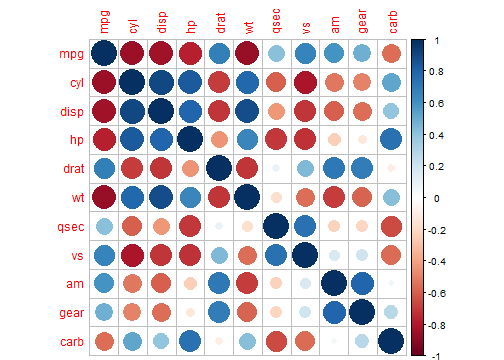 

```r

corrplot(mcor, method = "shade", shade.col = NA, tl.col = "black", tl.srt = 45)
```

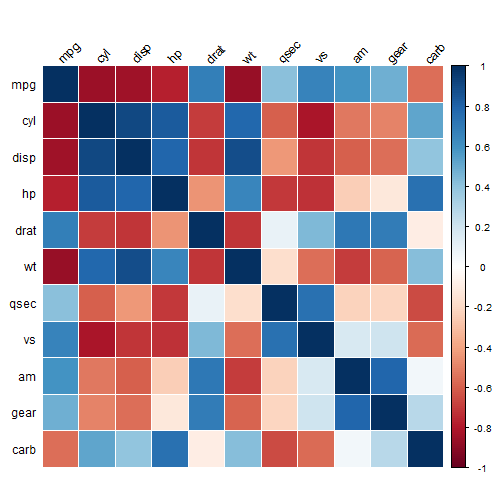 

```r


# Generate a lighter palette
col <- colorRampPalette(c("#BB4444", "#EE9988", "#FFFFFF", "#77AADD", "#4477AA"))

corrplot(mcor, method = "shade", shade.col = NA, tl.col = "black", tl.srt = 45, 
    col = col(200), addCoef.col = "black", addcolorlabel = "no", order = "AOE")
```

```
## Warning: "addcolorlabel" is not a graphical parameter
## Warning: "addcolorlabel" is not a graphical parameter
## Warning: "addcolorlabel" is not a graphical parameter
```

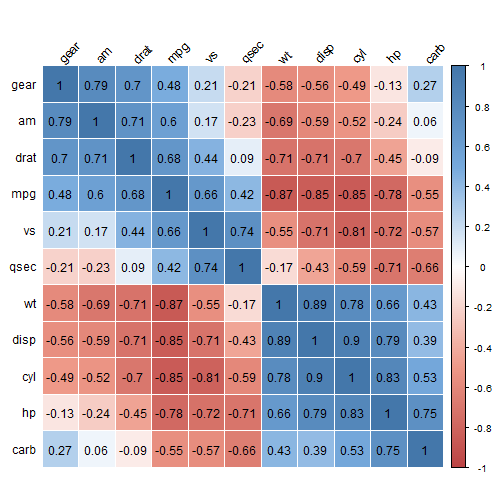 

## 13.2.Plotting a Functioon

```r
# The data frame is only used for setting the range
p <- ggplot(data.frame(x = c(-3, 3)), aes(x = x))

p + stat_function(fun = dnorm)
```

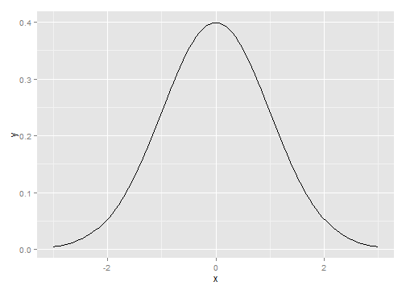 

```r

p + stat_function(fun = dt, args = list(df = 2))
```

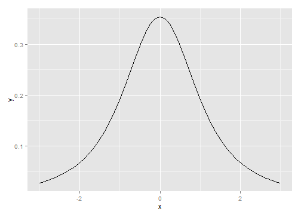 

```r

myfun <- function(xvar) {
    1/(1 + exp(-xvar + 10))
}

ggplot(data.frame(x = c(0, 20)), aes(x = x)) + stat_function(fun = myfun)
```

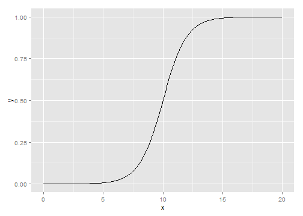 

## 13.3.Shading a Subregion Under a Function Curve

```r
# Return dnorm(x) for 0 < x < 2, and NA for all other x
dnorm_limit <- function(x) {
    y <- dnorm(x)
    y[x < 0 | x > 2] <- NA
    return(y)
}

# ggplot() with dummy data
p <- ggplot(data.frame(x = c(-3, 3)), aes(x = x))

p + stat_function(fun = dnorm_limit, geom = "area", fill = "blue", alpha = 0.2) + 
    stat_function(fun = dnorm)
```

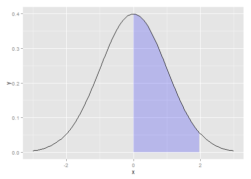 

```r

limitRange <- function(fun, min, max) {
    function(x) {
        y <- fun(x)
        y[x < min | x > max] <- NA
        return(y)
    }
}

# This returns a function
dlimit <- limitRange(dnorm, 0, 2)

# Now we'll try out the new function -- it only returns values for inputs
# between 0 and 2
dlimit(-2:4)
```

```
## [1]      NA      NA 0.39894 0.24197 0.05399      NA      NA
```

```r

p + stat_function(fun = dnorm) + stat_function(fun = limitRange(dnorm, 0, 2), 
    geom = "area", fill = "blue", alpha = 0.2)
```

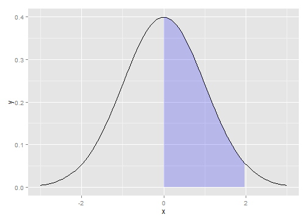 

## 13.4.Creating a Network Graph  

```r
# May need to install first, with install.packages('igraph')
# install.packages('igraph')
library(igraph)

# Specify edges for a directed graph
gd <- graph(c(1, 2, 2, 3, 2, 4, 1, 4, 5, 5, 3, 6))
plot(gd)
```

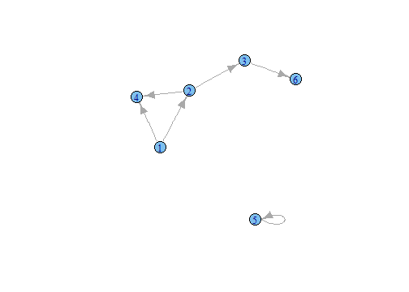 

```r

# For an undirected graph
gu <- graph(c(1, 2, 2, 3, 2, 4, 1, 4, 5, 5, 3, 6), directed = FALSE)
# No labels
plot(gu, vertex.label = NA)
```

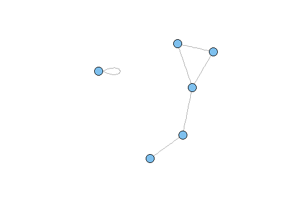 

```r

str(gd)
```

```
## IGRAPH D--- 6 6 -- 
## + edges:
## [1] 1->2 2->3 2->4 1->4 5->5 3->6
```

```r

str(gu)
```

```
## IGRAPH U--- 6 6 -- 
## + edges:
## [1] 1--2 2--3 2--4 1--4 5--5 3--6
```

```r

set.seed(229)
plot(gu)
```

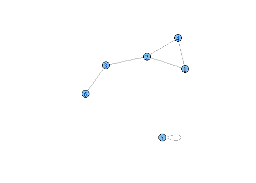 

```r

library(gcookbook)  # For the data set
head(madmen2)
```

```
##                  Name1        Name2
## 1          Abe Drexler  Peggy Olson
## 2              Allison   Don Draper
## 3          Arthur Case Betty Draper
## 4 Bellhop in Baltimore   Sal Romano
## 5     Bethany Van Nuys   Don Draper
## 6         Betty Draper   Don Draper
```

```r

# Create a graph object from the data set
g <- graph.data.frame(madmen2, directed = TRUE)

# Remove unnecessary margins
par(mar = c(0, 0, 0, 0))

plot(g, layout = layout.fruchterman.reingold, vertex.size = 8, edge.arrow.size = 0.5, 
    vertex.label = NA)
```

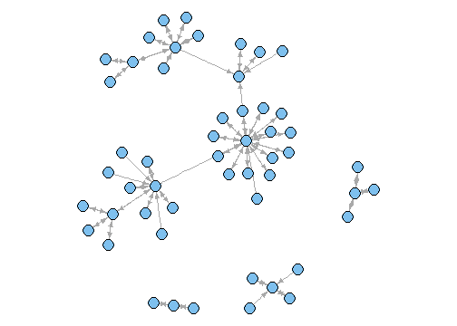 

```r

g <- graph.data.frame(madmen, directed = FALSE)
par(mar = c(0, 0, 0, 0))  # Remove unnecessary margins
plot(g, layout = layout.circle, vertex.size = 8, vertex.label = NA)
```

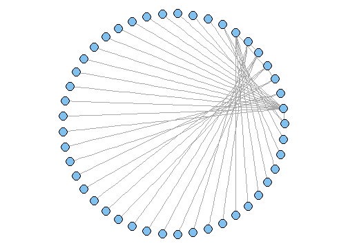 

## 13.5.Using Text Labels in a Network Graph    

```r
library(igraph)
library(gcookbook) # For the data set
# Copy madmen and drop every other row
m <- madmen[1:nrow(madmen) %% 2 == 1, ]
g <- graph.data.frame(m, directed=FALSE)

# Print out the names of each vertex
V(g)$name
```

```
##  [1] "Betty Draper"      "Don Draper"        "Harry Crane"      
##  [4] "Joan Holloway"     "Lane Pryce"        "Peggy Olson"      
##  [7] "Pete Campbell"     "Roger Sterling"    "Sal Romano"       
## [10] "Henry Francis"     "Allison"           "Candace"          
## [13] "Faye Miller"       "Megan Calvet"      "Rachel Menken"    
## [16] "Suzanne Farrell"   "Hildy"             "Franklin"         
## [19] "Rebecca Pryce"     "Abe Drexler"       "Duck Phillips"    
## [22] "Playtex bra model" "Ida Blankenship"   "Mirabelle Ames"   
## [25] "Vicky"             "Kitty Romano"
```

```r


plot(g, layout=layout.fruchterman.reingold,
     vertex.size        = 4,          # Smaller nodes
     vertex.label       = V(g)$name,  # Set the labels
     vertex.label.cex   = 0.8,        # Slightly smaller font
     vertex.label.dist  = 0.4,        # Offset the labels
     vertex.label.color = "black")
```

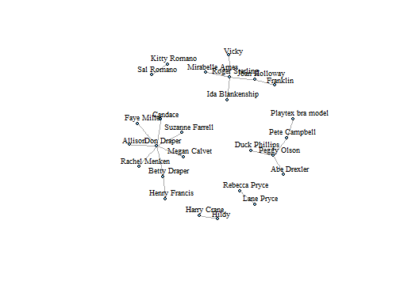 

```r

# This is equivalent to the preceding code
V(g)$size        <- 4
V(g)$label       <- V(g)$name
V(g)$label.cex   <- 0.8
V(g)$label.dist  <- 0.4
V(g)$label.color <- "black"

# Set a property of the entire graph
g$layout <- layout.fruchterman.reingold

plot(g)
```

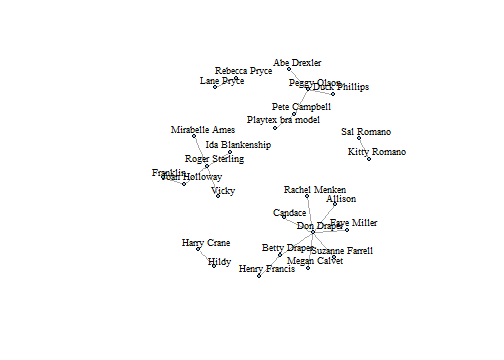 

```r
    
    
# View the edges
E(g)
```

```
## Edge sequence:
##                                            
## [1]  Henry Francis     -- Betty Draper     
## [2]  Allison           -- Don Draper       
## [3]  Don Draper        -- Betty Draper     
## [4]  Candace           -- Don Draper       
## [5]  Faye Miller       -- Don Draper       
## [6]  Megan Calvet      -- Don Draper       
## [7]  Rachel Menken     -- Don Draper       
## [8]  Suzanne Farrell   -- Don Draper       
## [9]  Hildy             -- Harry Crane      
## [10] Franklin          -- Joan Holloway    
## [11] Roger Sterling    -- Joan Holloway    
## [12] Rebecca Pryce     -- Lane Pryce       
## [13] Abe Drexler       -- Peggy Olson      
## [14] Duck Phillips     -- Peggy Olson      
## [15] Pete Campbell     -- Peggy Olson      
## [16] Playtex bra model -- Pete Campbell    
## [17] Ida Blankenship   -- Roger Sterling   
## [18] Mirabelle Ames    -- Roger Sterling   
## [19] Vicky             -- Roger Sterling   
## [20] Kitty Romano      -- Sal Romano
```

```r

# Set some of the labels to "M"
E(g)[c(2,11,19)]$label <- "M"

# Set color of all to grey, and then color a few red
E(g)$color             <- "grey70"
E(g)[c(2,11,19)]$color <- "red"

plot(g)
```

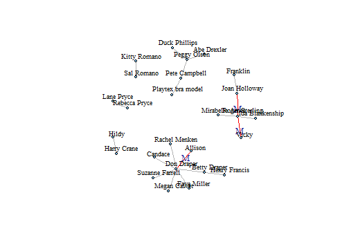 

## 13.6.Creating a Heat Map    

```r
head(presidents)
```

```
## [1] NA 87 82 75 63 50
```

```r

str(presidents)
```

```
##  Time-Series [1:120] from 1945 to 1975: NA 87 82 75 63 50 43 32 35 60 ...
```

```r

pres_rating <- data.frame(rating = as.numeric(presidents), year = as.numeric(floor(time(presidents))), 
    quarter = as.numeric(cycle(presidents)))
head(pres_rating)
```

```
##   rating year quarter
## 1     NA 1945       1
## 2     87 1945       2
## 3     82 1945       3
## 4     75 1945       4
## 5     63 1946       1
## 6     50 1946       2
```

```r

# Base plot
p <- ggplot(pres_rating, aes(x = year, y = quarter, fill = rating))

# Using geom_tile()
p + geom_tile()
```

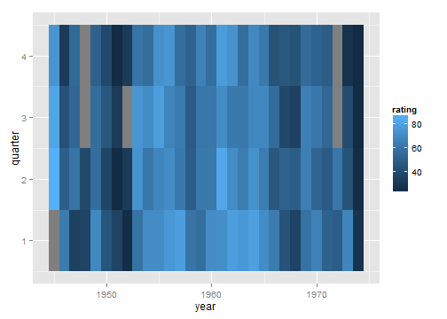 

```r

# Using geom_raster() - looks the same, but a little more efficient
p + geom_raster()
```

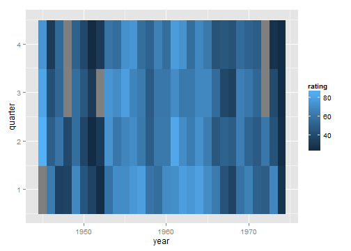 

```r

p + geom_tile() + scale_x_continuous(breaks = seq(1940, 1976, by = 4)) + scale_y_reverse() + 
    scale_fill_gradient2(midpoint = 50, mid = "grey70", limits = c(0, 100))
```

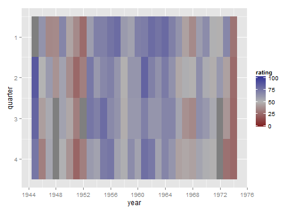 


## 13.7.Creating a Three-Dimensional Scatter Plot    

```r
# You may need to install first, with install.packages("rgl")
library(rgl)
plot3d(mtcars$wt, mtcars$disp, mtcars$mpg, type="s", size=0.75, lit=FALSE)
    
# Function to interleave the elements of two vectors
interleave <- function(v1, v2)  as.vector(rbind(v1,v2))

# Plot the points
plot3d(mtcars$wt, mtcars$disp, mtcars$mpg,
       xlab="Weight", ylab="Displacement", zlab="MPG",
       size=.75, type="s", lit=FALSE)

# Add the segments
segments3d(interleave(mtcars$wt,   mtcars$wt),
           interleave(mtcars$disp, mtcars$disp),
           interleave(mtcars$mpg,  min(mtcars$mpg)),
           alpha=0.4, col="blue")
    
    
# Make plot without axis ticks or labels
plot3d(mtcars$wt, mtcars$disp, mtcars$mpg,
       xlab = "", ylab = "", zlab = "",
       axes = FALSE,
       size=.75, type="s", lit=FALSE)

segments3d(interleave(mtcars$wt,   mtcars$wt),
           interleave(mtcars$disp, mtcars$disp),
           interleave(mtcars$mpg,  min(mtcars$mpg)),
           alpha = 0.4, col = "blue")

# Draw the box.
rgl.bbox(color="grey50",          # grey60 surface and black text
         emission="grey50",       # emission color is grey50
         xlen=0, ylen=0, zlen=0)  # Don't add tick marks

# Set default color of future objects to black
rgl.material(color="black")

# Add axes to specific sides. Possible values are "x--", "x-+", "x+-", and "x++".
axes3d(edges=c("x--", "y+-", "z--"),
       ntick=6,                       # Attempt 6 tick marks on each side
       cex=.75)                       # Smaller font

# Add axis labels. 'line' specifies how far to set the label from the axis.
mtext3d("Weight",       edge="x--", line=2)
mtext3d("Displacement", edge="y+-", line=3)
mtext3d("MPG",          edge="z--", line=3)
```

## 13.8.Adding a Prediction Surface to a Three-Dimensional Plot  

```r
# Given a model, predict zvar from xvar and yvar
# Defaults to range of x and y variables, and a 16x16 grid
predictgrid <- function(model, xvar, yvar, zvar, res = 16, type = NULL) {
  # Find the range of the predictor variable. This works for lm and glm
  # and some others, but may require customization for others.
  xrange <- range(model$model[[xvar]])
  yrange <- range(model$model[[yvar]])

  newdata <- expand.grid(x = seq(xrange[1], xrange[2], length.out = res),
                         y = seq(yrange[1], yrange[2], length.out = res))
  names(newdata) <- c(xvar, yvar)
  newdata[[zvar]] <- predict(model, newdata = newdata, type = type)
  newdata
}


# Convert long-style data frame with x, y, and z vars into a list
# with x and y as row/column values, and z as a matrix.
df2mat <- function(p, xvar = NULL, yvar = NULL, zvar = NULL) {
  if (is.null(xvar)) xvar <- names(p)[1]
  if (is.null(yvar)) yvar <- names(p)[2]
  if (is.null(zvar)) zvar <- names(p)[3]

  x <- unique(p[[xvar]])
  y <- unique(p[[yvar]])
  z <- matrix(p[[zvar]], nrow = length(y), ncol = length(x))

  m <- list(x, y, z)
  names(m) <- c(xvar, yvar, zvar)
  m
}

# Function to interleave the elements of two vectors
interleave <- function(v1, v2)  as.vector(rbind(v1,v2))
    
    
#install.packages("rgl")
library(rgl)

# Make a copy of the data set
m <- mtcars

# Generate a linear model
mod <- lm(mpg ~ wt + disp + wt:disp, data = m)

# Get predicted values of mpg from wt and disp
m$pred_mpg <- predict(mod)

# Get predicted mpg from a grid of wt and disp
mpgrid_df <- predictgrid(mod, "wt", "disp", "mpg")
mpgrid_list <- df2mat(mpgrid_df)

# Make the plot with the data points
plot3d(m$wt, m$disp, m$mpg, type="s", size=0.5, lit=FALSE)

# Add the corresponding predicted points (smaller)
spheres3d(m$wt, m$disp, m$pred_mpg, alpha=0.4, type="s", size=0.5, lit=FALSE)

# Add line segments showing the error
segments3d(interleave(m$wt,   m$wt),
           interleave(m$disp, m$disp),
           interleave(m$mpg,  m$pred_mpg),
           alpha=0.4, col="red")

# Add the mesh of predicted values
surface3d(mpgrid_list$wt, mpgrid_list$disp, mpgrid_list$mpg,
          alpha=0.4, front="lines", back="lines")
    
    
plot3d(mtcars$wt, mtcars$disp, mtcars$mpg,
       xlab = "", ylab = "", zlab = "",
       axes = FALSE,
       size=.5, type="s", lit=FALSE)

# Add the corresponding predicted points (smaller)
spheres3d(m$wt, m$disp, m$pred_mpg, alpha=0.4, type="s", size=0.5, lit=FALSE)

# Add line segments showing the error
segments3d(interleave(m$wt,   m$wt),
           interleave(m$disp, m$disp),
           interleave(m$mpg,  m$pred_mpg),
           alpha=0.4, col="red")

# Add the mesh of predicted values
surface3d(mpgrid_list$wt, mpgrid_list$disp, mpgrid_list$mpg,
          alpha=0.4, front="lines", back="lines")

# Draw the box
rgl.bbox(color="grey50",          # grey60 surface and black text
         emission="grey50",       # emission color is grey50
         xlen=0, ylen=0, zlen=0)  # Don't add tick marks

# Set default color of future objects to black
rgl.material(color="black")

# Add axes to specific sides. Possible values are "x--", "x-+", "x+-", and "x++".
axes3d(edges=c("x--", "y+-", "z--"),
       ntick=6,                       # Attempt 6 tick marks on each side
       cex=.75)                       # Smaller font

# Add axis labels. 'line' specifies how far to set the label from the axis.
mtext3d("Weight",       edge="x--", line=2)
mtext3d("Displacement", edge="y+-", line=3)
mtext3d("MPG",          edge="z--", line=3)
```

## 13.9.Saving a Three-Dimensional Plot  

```r
library(rgl)
plot3d(mtcars$wt, mtcars$disp, mtcars$mpg, type = "s", size = 0.75, lit = FALSE)

rgl.snapshot("3dplot.png", fmt = "png")


rgl.postscript("figs/miscgraph/3dplot.pdf", fmt = "pdf")

rgl.postscript("figs/miscgraph/3dplot.ps", fmt = "ps")


# Save the current viewpoint
view <- par3d("userMatrix")

# Restore the saved viewpoint
par3d(userMatrix = view)


dput(view)
```

```
## structure(c(1, 0, 0, 0, 0, 0.342020143325668, -0.939692620785909, 
## 0, 0, 0.939692620785909, 0.342020143325668, 0, 0, 0, 0, 1), .Dim = c(4L, 
## 4L))
```

```r

structure(c(0.907931625843048, 0.267511069774628, -0.322642296552658, 0, -0.410978674888611, 
    0.417272746562958, -0.810543060302734, 0, -0.0821993798017502, 0.868516683578491, 
    0.488796472549438, 0, 0, 0, 0, 1), .Dim = c(4L, 4L))
```

```
##         [,1]    [,2]    [,3] [,4]
## [1,]  0.9079 -0.4110 -0.0822    0
## [2,]  0.2675  0.4173  0.8685    0
## [3,] -0.3226 -0.8105  0.4888    0
## [4,]  0.0000  0.0000  0.0000    1
```

```r


view <- structure(c(0.907931625843048, 0.267511069774628, -0.322642296552658, 
    0, -0.410978674888611, 0.417272746562958, -0.810543060302734, 0, -0.0821993798017502, 
    0.868516683578491, 0.488796472549438, 0, 0, 0, 0, 1), .Dim = c(4L, 4L))

par3d(userMatrix = view)
```

## 13.10.Animating a Three-Dimensional Plot    

```r
library(rgl)
plot3d(mtcars$wt, mtcars$disp, mtcars$mpg, type = "s", size = 0.75, lit = FALSE)

play3d(spin3d())
```

```
## Error: no device opened with id1
```

```r

# Spin on x-axis, at 4 rpm, for 20 seconds
play3d(spin3d(axis = c(1, 0, 0), rpm = 4), duration = 20)
```

```
## Error: no device opened with id2
```

```r

# Spin on z axis, at 4 rpm, for 15 seconds
movie3d(spin3d(axis = c(0, 0, 1), rpm = 4), duration = 15, fps = 50)
```

```
## Writing movie000.png 
Writing movie001.png 
Writing movie002.png 
Writing movie003.png 
Writing movie004.png 
Writing movie005.png 
Writing movie006.png 
Writing movie007.png 
Writing movie008.png 
Writing movie009.png 
Writing movie010.png 
Writing movie011.png 
Writing movie012.png 
Writing movie013.png 
Writing movie014.png 
Writing movie015.png 
Writing movie016.png 
Writing movie017.png 
Writing movie018.png 
Writing movie019.png 
Writing movie020.png 
Writing movie021.png 
Writing movie022.png 
Writing movie023.png 
Writing movie024.png 
Writing movie025.png 
Writing movie026.png 
Writing movie027.png 
Writing movie028.png 
Writing movie029.png 
Writing movie030.png 
Writing movie031.png 
Writing movie032.png 
Writing movie033.png 
Writing movie034.png 
Writing movie035.png 
Writing movie036.png 
Writing movie037.png 
Writing movie038.png 
Writing movie039.png 
Writing movie040.png 
Writing movie041.png 
Writing movie042.png 
Writing movie043.png 
Writing movie044.png 
Writing movie045.png 
Writing movie046.png 
Writing movie047.png 
Writing movie048.png 
Writing movie049.png 
Writing movie050.png 
Writing movie051.png 
Writing movie052.png 
Writing movie053.png 
Writing movie054.png 
Writing movie055.png 
Writing movie056.png 
Writing movie057.png 
Writing movie058.png 
Writing movie059.png 
Writing movie060.png 
Writing movie061.png 
Writing movie062.png 
Writing movie063.png 
Writing movie064.png 
Writing movie065.png 
Writing movie066.png 
Writing movie067.png 
Writing movie068.png 
Writing movie069.png 
Writing movie070.png 
Writing movie071.png 
Writing movie072.png 
Writing movie073.png 
Writing movie074.png 
Writing movie075.png 
Writing movie076.png 
Writing movie077.png 
Writing movie078.png 
Writing movie079.png 
Writing movie080.png 
Writing movie081.png 
Writing movie082.png 
Writing movie083.png 
Writing movie084.png 
Writing movie085.png 
Writing movie086.png 
Writing movie087.png 
Writing movie088.png 
Writing movie089.png 
Writing movie090.png 
Writing movie091.png 
Writing movie092.png 
Writing movie093.png 
Writing movie094.png 
Writing movie095.png 
Writing movie096.png 
Writing movie097.png 
Writing movie098.png 
Writing movie099.png 
Writing movie100.png 
Writing movie101.png 
Writing movie102.png 
Writing movie103.png 
Writing movie104.png 
Writing movie105.png 
Writing movie106.png 
Writing movie107.png 
Writing movie108.png 
Writing movie109.png 
Writing movie110.png 
Writing movie111.png 
Writing movie112.png 
Writing movie113.png 
Writing movie114.png 
Writing movie115.png 
Writing movie116.png 
Writing movie117.png 
Writing movie118.png 
Writing movie119.png 
Writing movie120.png 
Writing movie121.png 
Writing movie122.png 
Writing movie123.png 
Writing movie124.png 
Writing movie125.png 
Writing movie126.png 
Writing movie127.png 
Writing movie128.png 
Writing movie129.png 
Writing movie130.png 
Writing movie131.png 
Writing movie132.png 
Writing movie133.png 
```

```
## Error: no device opened with id3
```

## 13.11.Creating a Dendrogram

```r
library(gcookbook)  # For the data set

# Get data from year 2009
c2 <- subset(countries, Year == 2009)

# Drop rows that have any NA values
c2 <- c2[complete.cases(c2), ]

# Pick out a random 25 countries (Set random seed to make this repeatable)
set.seed(201)
c2 <- c2[sample(1:nrow(c2), 25), ]

c2
```

```
##                   Name Code Year     GDP laborrate healthexp infmortality
## 6731          Mongolia  MNG 2009  1690.4      72.9     74.20         27.8
## 1733            Canada  CAN 2009 39599.0      67.8   4379.76          5.2
## 4028         Guatemala  GTM 2009  2685.0      66.9    186.12         25.9
## 611            Austria  AUT 2009 45555.4      60.4   5037.31          3.6
## 10964           Zambia  ZMB 2009  1006.4      69.2     47.06         71.5
## 1478          Bulgaria  BGR 2009  6403.1      54.5    474.85         11.1
## 662         Azerbaijan  AZE 2009  4808.2      63.0    284.73         41.1
## 3824            Greece  GRC 2009 28936.5      53.7   3040.73          3.5
## 1070             Benin  BEN 2009   771.7      72.7     31.93         74.7
## 2957  Egypt, Arab Rep.  EGY 2009  2370.7      48.8    113.30         20.0
## 4844             Italy  ITA 2009 35073.3      49.1   3327.63          3.2
## 7037             Nepal  NPL 2009   438.2      71.5     25.34         43.3
## 6119          Malaysia  MYS 2009  6908.7      62.0    336.44          5.6
## 4793            Israel  ISR 2009 26102.4      57.1   1966.47          3.7
## 5252       Korea, Rep.  KOR 2009 17110.0      60.9   1107.95          4.3
## 5099             Kenya  KEN 2009   744.4      82.2     33.25         56.3
## 152            Algeria  DZA 2009  4022.2      58.5    267.95         32.0
## 2447           Croatia  HRV 2009 14322.6      53.0   1120.37          4.9
## 5609           Lesotho  LSO 2009   800.4      74.0     70.05         67.0
## 4691           Ireland  IRL 2009 49737.9      63.6   4951.84          3.4
## 7343           Nigeria  NGA 2009  1091.1      56.2     69.30         90.4
## 5660           Liberia  LBR 2009   229.3      71.1     29.36         77.6
## 5558           Lebanon  LBN 2009  8321.4      46.1    663.27         19.4
## 5966    Macedonia, FYR  MKD 2009  4510.2      54.0    313.69         10.6
## 10148     Turkmenistan  TKM 2009  3710.5      68.0     77.07         48.0
```

```r

rownames(c2) <- c2$Name
c2 <- c2[, 4:7]
c2
```

```
##                      GDP laborrate healthexp infmortality
## Mongolia          1690.4      72.9     74.20         27.8
## Canada           39599.0      67.8   4379.76          5.2
## Guatemala         2685.0      66.9    186.12         25.9
## Austria          45555.4      60.4   5037.31          3.6
## Zambia            1006.4      69.2     47.06         71.5
## Bulgaria          6403.1      54.5    474.85         11.1
## Azerbaijan        4808.2      63.0    284.73         41.1
## Greece           28936.5      53.7   3040.73          3.5
## Benin              771.7      72.7     31.93         74.7
## Egypt, Arab Rep.  2370.7      48.8    113.30         20.0
## Italy            35073.3      49.1   3327.63          3.2
## Nepal              438.2      71.5     25.34         43.3
## Malaysia          6908.7      62.0    336.44          5.6
## Israel           26102.4      57.1   1966.47          3.7
## Korea, Rep.      17110.0      60.9   1107.95          4.3
## Kenya              744.4      82.2     33.25         56.3
## Algeria           4022.2      58.5    267.95         32.0
## Croatia          14322.6      53.0   1120.37          4.9
## Lesotho            800.4      74.0     70.05         67.0
## Ireland          49737.9      63.6   4951.84          3.4
## Nigeria           1091.1      56.2     69.30         90.4
## Liberia            229.3      71.1     29.36         77.6
## Lebanon           8321.4      46.1    663.27         19.4
## Macedonia, FYR    4510.2      54.0    313.69         10.6
## Turkmenistan      3710.5      68.0     77.07         48.0
```

```r

c3 <- scale(c2)
c3
```

```
##                      GDP laborrate  healthexp infmortality
## Mongolia         -0.6783   1.15029 -0.6341394     -0.08335
## Canada            1.7505   0.59747  1.9736220     -0.88015
## Guatemala        -0.6146   0.49992 -0.5663495     -0.15033
## Austria           2.1321  -0.20465  2.3718821     -0.93656
## Zambia           -0.7222   0.74923 -0.6505785      1.45737
## Bulgaria         -0.3764  -0.84418 -0.3914778     -0.67213
## Azerbaijan       -0.4786   0.07718 -0.5066289      0.38557
## Greece            1.0673  -0.93090  1.1626100     -0.94009
## Benin            -0.7372   1.12861 -0.6597408      1.57019
## Egypt, Arab Rep. -0.6348  -1.46203 -0.6104582     -0.35835
## Italy             1.4605  -1.42951  1.3363751     -0.95066
## Nepal            -0.7586   0.99853 -0.6637287      0.46313
## Malaysia         -0.3440  -0.03122 -0.4753076     -0.86605
## Israel            0.8857  -0.56235  0.5119590     -0.93303
## Korea, Rep.       0.3096  -0.15045 -0.0080252     -0.91188
## Kenya            -0.7390   2.15836 -0.6589411      0.92147
## Algeria          -0.5289  -0.41060 -0.5167913      0.06473
## Croatia           0.1310  -1.00677 -0.0005011     -0.89073
## Lesotho          -0.7354   1.26952 -0.6366519      1.29872
## Ireland           2.4001   0.14221  2.3201175     -0.94361
## Nigeria          -0.7167  -0.65991 -0.6371077      2.12372
## Liberia          -0.7720   0.95518 -0.6612990      1.67244
## Lebanon          -0.2535  -1.75470 -0.2773526     -0.37950
## Macedonia, FYR   -0.4977  -0.89838 -0.4890859     -0.68976
## Turkmenistan     -0.5489   0.61915 -0.6324003      0.62884
## attr(,"scaled:center")
##          GDP    laborrate    healthexp infmortality 
##     12277.96        62.29      1121.20        30.16 
## attr(,"scaled:scale")
##          GDP    laborrate    healthexp infmortality 
##    15607.853        9.226     1651.057       28.363
```

```r

attr(, "scaled:scale")
```

```
## Error: 1元素是空的
```

```r

hc <- hclust(dist(c3))

# Make the dendrogram
plot(hc)
```

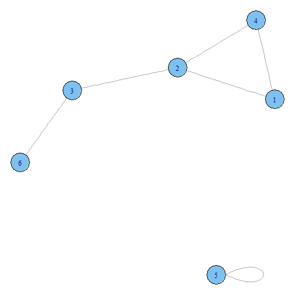 

```r

# With text aligned
plot(hc, hang = -1)
```

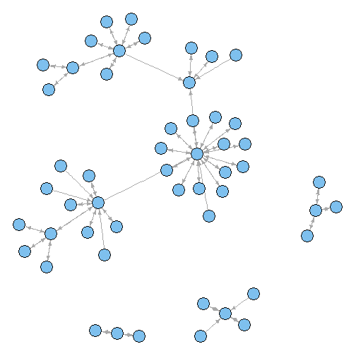 

## 13.12.Creating a Vector Field

```r
library(gcookbook)  # For the data set
head(isabel)
```

```
##     x     y     z vx vy vz  t speed
## 1 -83 41.70 0.035 NA NA NA NA    NA
## 2 -83 41.56 0.035 NA NA NA NA    NA
## 3 -83 41.41 0.035 NA NA NA NA    NA
## 4 -83 41.27 0.035 NA NA NA NA    NA
## 5 -83 41.12 0.035 NA NA NA NA    NA
## 6 -83 40.98 0.035 NA NA NA NA    NA
```

```r

islice <- subset(isabel, z == min(z))

ggplot(islice, aes(x = x, y = y)) + geom_segment(aes(xend = x + vx/50, yend = y + 
    vy/50), size = 0.25)  # Make the line segments 0.25 mm thick
```

```
## Warning: Removed 3745 rows containing missing values (geom_segment).
```

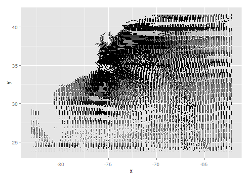 

```r


# ==================================== Take a slice where z is equal to the
# minimum value of z
islice <- subset(isabel, z == min(z))

# Keep 1 out of every 'by' values in vector x
every_n <- function(x, by = 2) {
    x <- sort(x)
    x[seq(1, length(x), by = by)]
}

# Keep 1 of every 4 values in x and y
keepx <- every_n(unique(isabel$x), by = 4)
keepy <- every_n(unique(isabel$y), by = 4)

# Keep only those rows where x value is in keepx and y value is in keepy
islicesub <- subset(islice, x %in% keepx & y %in% keepy)


# Need to load grid for arrow() function
library(grid)

# Make the plot with the subset, and use an arrowhead 0.1 cm long
ggplot(islicesub, aes(x = x, y = y)) + geom_segment(aes(xend = x + vx/50, yend = y + 
    vy/50), arrow = arrow(length = unit(0.1, "cm")), size = 0.25)
```

```
## Warning: Removed 248 rows containing missing values (geom_segment).
```

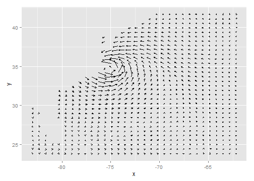 

```r


# The existing 'speed' column includes the z component. We'll calculate
# speedxy, the horizontal speed.
islicesub$speedxy <- sqrt(islicesub$vx^2 + islicesub$vy^2)

# Map speed to alpha
ggplot(islicesub, aes(x = x, y = y)) + geom_segment(aes(xend = x + vx/50, yend = y + 
    vy/50, alpha = speed), arrow = arrow(length = unit(0.1, "cm")), size = 0.6)
```

```
## Warning: Removed 248 rows containing missing values (geom_segment).
```

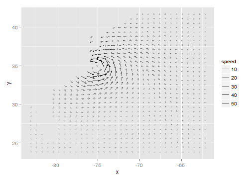 

```r


# Get USA map data
usa <- map_data("usa")

# Map speed to colour, and set go from 'grey80' to 'darkred'
ggplot(islicesub, aes(x = x, y = y)) + geom_segment(aes(xend = x + vx/50, yend = y + 
    vy/50, colour = speed), arrow = arrow(length = unit(0.1, "cm")), size = 0.6) + 
    scale_colour_continuous(low = "grey80", high = "darkred") + geom_path(aes(x = long, 
    y = lat, group = group), data = usa) + coord_cartesian(xlim = range(islicesub$x), 
    ylim = range(islicesub$y))
```

```
## Warning: Removed 248 rows containing missing values (geom_segment).
```

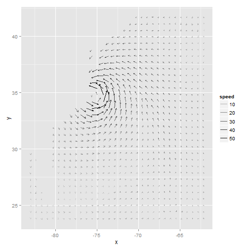 

```r


# Keep 1 out of every 5 values in x and y, and 1 in 2 values in z
keepx <- every_n(unique(isabel$x), by = 5)
keepy <- every_n(unique(isabel$y), by = 5)
keepz <- every_n(unique(isabel$z), by = 2)

isub <- subset(isabel, x %in% keepx & y %in% keepy & z %in% keepz)

ggplot(isub, aes(x = x, y = y)) + geom_segment(aes(xend = x + vx/50, yend = y + 
    vy/50, colour = speed), arrow = arrow(length = unit(0.1, "cm")), size = 0.5) + 
    scale_colour_continuous(low = "grey80", high = "darkred") + facet_wrap(~z)
```

```
## Warning: Removed 151 rows containing missing values (geom_segment).
```

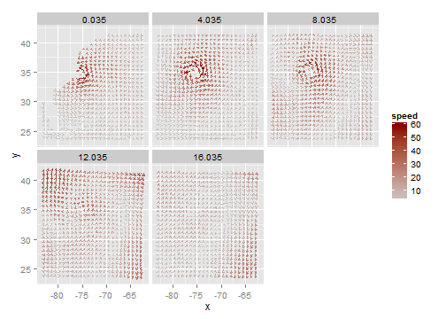 

## 13.13.Creating a QQ Plot  

```r
library(gcookbook)  # For the data set

# QQ plot of height
qqnorm(heightweight$heightIn)
qqline(heightweight$heightIn)
```

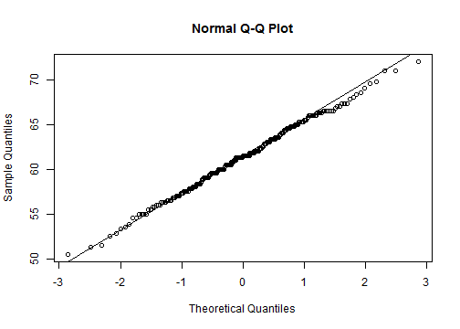 

```r

# QQ plot of age
qqnorm(heightweight$ageYear)
qqline(heightweight$ageYear)
```

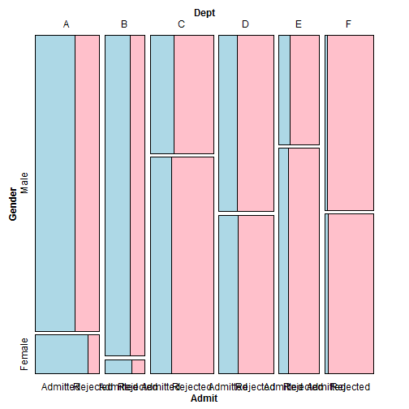 

## 13.14.Creating a Graph of an Empirical Cumulative Distribution Function  

```r
library(gcookbook)  # For the data set

# ecdf of heightIn
ggplot(heightweight, aes(x = heightIn)) + stat_ecdf()
```

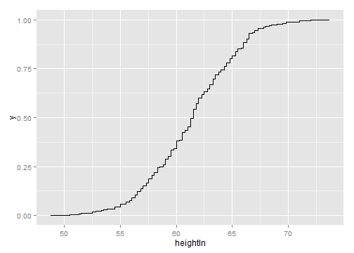 

```r

# ecdf of ageYear
ggplot(heightweight, aes(x = ageYear)) + stat_ecdf()
```

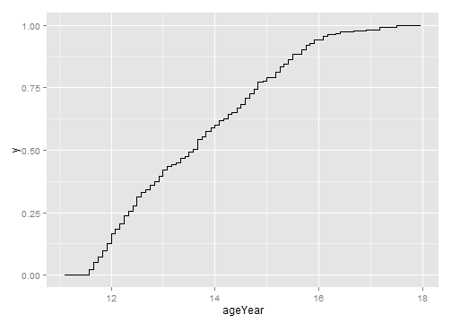 

## 13.15.Creating a Mosaic Plot  

```r
UCBAdmissions
```

```
## , , Dept = A
## 
##           Gender
## Admit      Male Female
##   Admitted  512     89
##   Rejected  313     19
## 
## , , Dept = B
## 
##           Gender
## Admit      Male Female
##   Admitted  353     17
##   Rejected  207      8
## 
## , , Dept = C
## 
##           Gender
## Admit      Male Female
##   Admitted  120    202
##   Rejected  205    391
## 
## , , Dept = D
## 
##           Gender
## Admit      Male Female
##   Admitted  138    131
##   Rejected  279    244
## 
## , , Dept = E
## 
##           Gender
## Admit      Male Female
##   Admitted   53     94
##   Rejected  138    299
## 
## , , Dept = F
## 
##           Gender
## Admit      Male Female
##   Admitted   22     24
##   Rejected  351    317
```

```r

# Print a 'flat' contingency table
ftable(UCBAdmissions)
```

```
##                 Dept   A   B   C   D   E   F
## Admit    Gender                             
## Admitted Male        512 353 120 138  53  22
##          Female       89  17 202 131  94  24
## Rejected Male        313 207 205 279 138 351
##          Female       19   8 391 244 299 317
```

```r

dimnames(UCBAdmissions)
```

```
## $Admit
## [1] "Admitted" "Rejected"
## 
## $Gender
## [1] "Male"   "Female"
## 
## $Dept
## [1] "A" "B" "C" "D" "E" "F"
```

```r

# You may need to install first, with install.packages('vcd')
library(vcd)
# Split by Admit, then Gender, then Dept
mosaic(~Admit + Gender + Dept, data = UCBAdmissions)
```

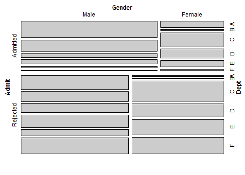 

```r


mosaic(~Dept + Gender + Admit, data = UCBAdmissions, highlighting = "Admit", 
    highlighting_fill = c("lightblue", "pink"), direction = c("v", "h", "v"))
```

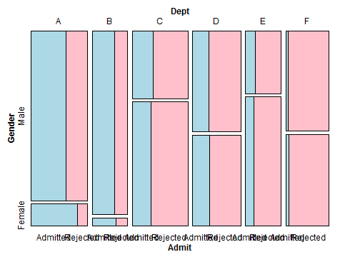 

```r


# Another possible set of splitting directions
mosaic(~Dept + Gender + Admit, data = UCBAdmissions, highlighting = "Admit", 
    highlighting_fill = c("lightblue", "pink"), direction = c("v", "v", "h"))
```

 

```r

# This order makes it difficult to compare male and female
mosaic(~Dept + Gender + Admit, data = UCBAdmissions, highlighting = "Admit", 
    highlighting_fill = c("lightblue", "pink"), direction = c("v", "h", "h"))
```

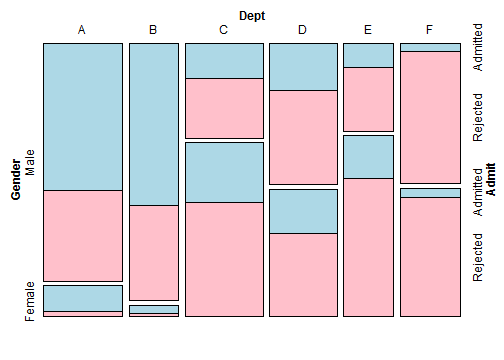 

## 13.16.Creating a Pie Chart  

```r
library(MASS)  # For the data set

# Get a table of how many cases are in each level of fold
fold <- table(survey$Fold)
fold
```

```
## 
##  L on R Neither  R on L 
##      99      18     120
```

```r

# Make the pie chart
pie(fold)

pie(c(99, 18, 120), labels = c("L on R", "Neither", "R on L"))
```

 

## 13.17.Creating a Map  

```r
library(maps)  # For map data
# Get map data for USA
states_map <- map_data("state")

ggplot(states_map, aes(x = long, y = lat, group = group)) + geom_polygon(fill = "white", 
    colour = "black")
```

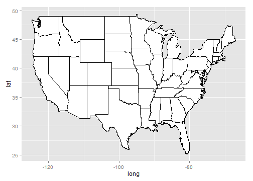 

```r

# geom_path (no fill) and Mercator projection
ggplot(states_map, aes(x = long, y = lat, group = group)) + geom_path() + coord_map("mercator")
```

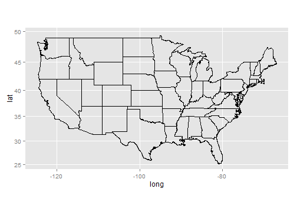 

```r

# Get map data for world
world_map <- map_data("world")
head(world_map)
```

```
##     long   lat group order region subregion
## 1 -133.4 58.42     1     1 Canada      <NA>
## 2 -132.3 57.16     1     2 Canada      <NA>
## 3 -132.0 56.99     1     3 Canada      <NA>
## 4 -131.9 56.74     1     4 Canada      <NA>
## 5 -130.2 56.10     1     5 Canada      <NA>
## 6 -130.0 55.91     1     6 Canada      <NA>
```

```r

head(sort(unique(world_map$region)))
```

```
## [1] "Afghanistan"     "Albania"         "Algeria"         "American Samoa" 
## [5] "Andaman Islands" "Andorra"
```

```r

# You might have noticed that it's a little out of date!

east_asia <- map_data("world", region = c("Japan", "China", "North Korea", "South Korea"))
# Map region to fill color
ggplot(east_asia, aes(x = long, y = lat, group = group, fill = region)) + geom_polygon(colour = "black") + 
    scale_fill_brewer(palette = "Set2")
```

 

```r


# Get New Zealand data from world map
nz1 <- map_data("world", region = "New Zealand")
nz1 <- subset(nz1, long > 0 & lat > -48)  # Trim off islands
ggplot(nz1, aes(x = long, y = lat, group = group)) + geom_path()
```

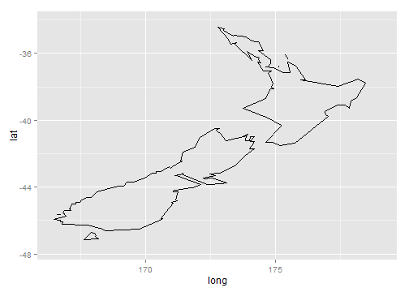 

```r

# Get New Zealand data from the nz map
nz2 <- map_data("nz")
ggplot(nz2, aes(x = long, y = lat, group = group)) + geom_path()
```

 

## 13.18.Creating a Choropleth Map  

```r
# Transform the USArrests data set to the correct format
crimes <- data.frame(state = tolower(rownames(USArrests)), USArrests)
head(crimes)
```

```
##                 state Murder Assault UrbanPop Rape
## Alabama       alabama   13.2     236       58 21.2
## Alaska         alaska   10.0     263       48 44.5
## Arizona       arizona    8.1     294       80 31.0
## Arkansas     arkansas    8.8     190       50 19.5
## California california    9.0     276       91 40.6
## Colorado     colorado    7.9     204       78 38.7
```

```r

# install.packages('maps')
library(maps)  # For map data
states_map <- map_data("state")

# Merge the data sets together
crime_map <- merge(states_map, crimes, by.x = "region", by.y = "state")

# After merging, the order has changed, which would lead to polygons drawn
# in the incorrect order. So, we sort the data.
head(crime_map)
```

```
##    region   long   lat group order subregion Murder Assault UrbanPop Rape
## 1 alabama -87.46 30.39     1     1      <NA>   13.2     236       58 21.2
## 2 alabama -87.48 30.37     1     2      <NA>   13.2     236       58 21.2
## 3 alabama -87.95 30.25     1    13      <NA>   13.2     236       58 21.2
## 4 alabama -88.01 30.24     1    14      <NA>   13.2     236       58 21.2
## 5 alabama -88.02 30.25     1    15      <NA>   13.2     236       58 21.2
## 6 alabama -87.53 30.37     1     3      <NA>   13.2     236       58 21.2
```

```r


library(plyr)  # For arrange() function
# Sort by group, then order
crime_map <- arrange(crime_map, group, order)
head(crime_map)
```

```
##    region   long   lat group order subregion Murder Assault UrbanPop Rape
## 1 alabama -87.46 30.39     1     1      <NA>   13.2     236       58 21.2
## 2 alabama -87.48 30.37     1     2      <NA>   13.2     236       58 21.2
## 3 alabama -87.53 30.37     1     3      <NA>   13.2     236       58 21.2
## 4 alabama -87.53 30.33     1     4      <NA>   13.2     236       58 21.2
## 5 alabama -87.57 30.33     1     5      <NA>   13.2     236       58 21.2
## 6 alabama -87.59 30.33     1     6      <NA>   13.2     236       58 21.2
```

```r

ggplot(crime_map, aes(x = long, y = lat, group = group, fill = Assault)) + geom_polygon(colour = "black") + 
    coord_map("polyconic")
```

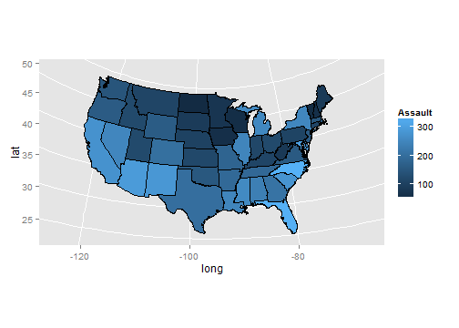 

```r


ggplot(crimes, aes(map_id = state, fill = Assault)) + geom_map(map = states_map, 
    colour = "black") + scale_fill_gradient2(low = "#559999", mid = "grey90", 
    high = "#BB650B", midpoint = median(crimes$Assault)) + expand_limits(x = states_map$long, 
    y = states_map$lat) + coord_map("polyconic")
```

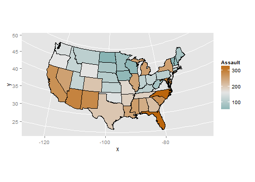 

```r


# Find the quantile bounds
qa <- quantile(crimes$Assault, c(0, 0.2, 0.4, 0.6, 0.8, 1))
qa
```

```
##    0%   20%   40%   60%   80%  100% 
##  45.0  98.8 135.0 188.8 254.2 337.0
```

```r

# Add a column of the quantile category
crimes$Assault_q <- cut(crimes$Assault, qa, labels = c("0-20%", "20-40%", "40-60%", 
    "60-80%", "80-100%"), include.lowest = TRUE)
head(crimes)
```

```
##                 state Murder Assault UrbanPop Rape Assault_q
## Alabama       alabama   13.2     236       58 21.2    60-80%
## Alaska         alaska   10.0     263       48 44.5   80-100%
## Arizona       arizona    8.1     294       80 31.0   80-100%
## Arkansas     arkansas    8.8     190       50 19.5    60-80%
## California california    9.0     276       91 40.6   80-100%
## Colorado     colorado    7.9     204       78 38.7    60-80%
```

```r

# Generate a discrete color palette with 5 values
pal <- colorRampPalette(c("#559999", "grey80", "#BB650B"))(5)
pal
```

```
## [1] "#559999" "#90B2B2" "#CCCCCC" "#C3986B" "#BB650B"
```

```r

ggplot(crimes, aes(map_id = state, fill = Assault_q)) + geom_map(map = states_map, 
    colour = "black") + scale_fill_manual(values = pal) + expand_limits(x = states_map$long, 
    y = states_map$lat) + coord_map("polyconic") + labs(fill = "Assault Rate\nPercentile")
```

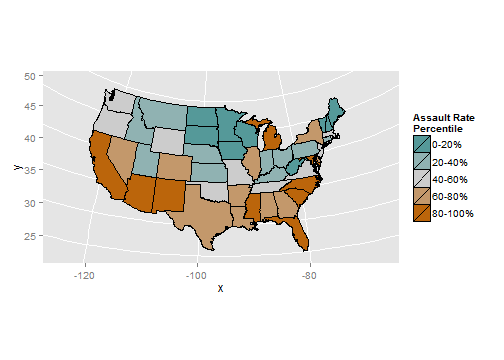 

```r


# The 'state' column in the crimes data is to be matched to the 'region'
# column in the states_map data
ggplot(crimes, aes(map_id = state, fill = Assault)) + geom_map(map = states_map) + 
    expand_limits(x = states_map$long, y = states_map$lat) + coord_map("polyconic")
```

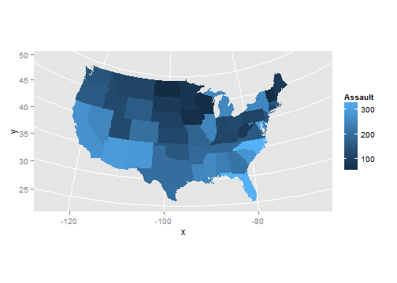 

## 13.19.Making a Map with a Clean Background  

```r
# Create a theme with many of the background elements removed
theme_clean <- function(base_size = 12) {
    require(grid)  # Needed for unit() function
    theme_grey(base_size) %+replace% theme(axis.title = element_blank(), axis.text = element_blank(), 
        panel.background = element_blank(), panel.grid = element_blank(), axis.ticks.length = unit(0, 
            "cm"), axis.ticks.margin = unit(0, "cm"), panel.margin = unit(0, 
            "lines"), plot.margin = unit(c(0, 0, 0, 0), "lines"), complete = TRUE)
}

ggplot(crimes, aes(map_id = state, fill = Assault_q)) + geom_map(map = states_map, 
    colour = "black") + scale_fill_manual(values = pal) + expand_limits(x = states_map$long, 
    y = states_map$lat) + coord_map("polyconic") + labs(fill = "Assault Rate\nPercentile") + 
    theme_clean()
```

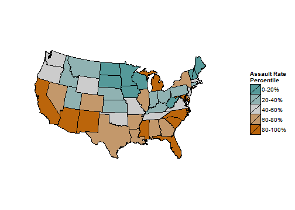 

## 13.20.Creating a Map from a Shapefile  

```r
# install.packages('maptools') install.packages('sp') 首先要安装这两个包
library(maptools)
```

```
## Loading required package: sp
## Checking rgeos availability: TRUE
```

```r
gpclibPermit()
```

```
## [1] FALSE
```

```r

# 地图包从这里下载：http://www.gadm.org/
# 记住要把几个TWN_adm2的文件都放在TWN_adm文件夹下 仅仅放一个shp会报错 Load
# the shapefile and convert to a data frame
taiwan_shp <- readShapePoly("TWN_adm/TWN_adm2.shp")
taiwan_map <- fortify(taiwan_shp)
```

```
## Regions defined for each Polygons
```

```r

ggplot(taiwan_map, aes(x = long, y = lat, group = group)) + geom_path()
```

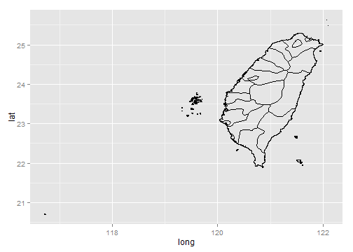 

```r


taiwan_shp <- readShapePoly("TWN_adm/TWN_adm2.shp")

# Look at the structure of the object
head(str(taiwan_shp))
```

```
## Formal class 'SpatialPolygonsDataFrame' [package "sp"] with 5 slots
##   ..@ data       :'data.frame':	22 obs. of  11 variables:
##   .. ..$ ID_0     : int [1:22] 223 223 223 223 223 223 223 223 223 223 ...
##   .. ..$ ISO      : Factor w/ 1 level "TWN": 1 1 1 1 1 1 1 1 1 1 ...
##   .. ..$ NAME_0   : Factor w/ 1 level "Taiwan": 1 1 1 1 1 1 1 1 1 1 ...
##   .. ..$ ID_1     : int [1:22] 1 2 3 4 4 4 4 4 4 4 ...
##   .. ..$ NAME_1   : Factor w/ 4 levels "Kaohsiung","Pratas Islands",..: 1 2 3 4 4 4 4 4 4 4 ...
##   .. ..$ ID_2     : int [1:22] 1 2 3 4 5 6 7 8 9 10 ...
##   .. ..$ NAME_2   : Factor w/ 21 levels "Changhwa","Chiayi",..: 7 NA 18 1 2 3 4 5 6 8 ...
##   .. ..$ NL_NAME_2: Factor w/ 0 levels: NA NA NA NA NA NA NA NA NA NA ...
##   .. ..$ VARNAME_2: Factor w/ 16 levels "Gaoxiong","Gaoxiong Shi",..: 2 NA 8 16 4 13 3 14 1 5 ...
##   .. ..$ TYPE_2   : Factor w/ 3 levels "Chuan-shih","District|Hsien",..: 1 NA 1 2 2 2 2 2 2 3 ...
##   .. ..$ ENGTYPE_2: Factor w/ 3 levels "County","Municipality",..: 3 NA 3 1 1 1 1 1 1 2 ...
##   .. ..- attr(*, "data_types")= chr [1:11] "N" "C" "C" "N" ...
##   ..@ polygons   :List of 22
##   .. ..$ :Formal class 'Polygons' [package "sp"] with 5 slots
##   .. .. .. ..@ Polygons :List of 2
##   .. .. .. .. ..$ :Formal class 'Polygon' [package "sp"] with 5 slots
##   .. .. .. .. .. .. ..@ labpt  : num [1:2] 120.3 22.7
##   .. .. .. .. .. .. ..@ area   : num 0.00602
##   .. .. .. .. .. .. ..@ hole   : logi FALSE
##   .. .. .. .. .. .. ..@ ringDir: int 1
##   .. .. .. .. .. .. ..@ coords : num [1:827, 1:2] 120 120 120 120 120 ...
##   .. .. .. .. ..$ :Formal class 'Polygon' [package "sp"] with 5 slots
##   .. .. .. .. .. .. ..@ labpt  : num [1:2] 120.2 22.8
##   .. .. .. .. .. .. ..@ area   : num 1.8e-08
##   .. .. .. .. .. .. ..@ hole   : logi FALSE
##   .. .. .. .. .. .. ..@ ringDir: int 1
##   .. .. .. .. .. .. ..@ coords : num [1:4, 1:2] 120.2 120.2 120.2 120.2 22.8 ...
##   .. .. .. ..@ plotOrder: int [1:2] 1 2
##   .. .. .. ..@ labpt    : num [1:2] 120.3 22.7
##   .. .. .. ..@ ID       : chr "0"
##   .. .. .. ..@ area     : num 0.00602
##   .. ..$ :Formal class 'Polygons' [package "sp"] with 5 slots
##   .. .. .. ..@ Polygons :List of 1
##   .. .. .. .. ..$ :Formal class 'Polygon' [package "sp"] with 5 slots
##   .. .. .. .. .. .. ..@ labpt  : num [1:2] 116.7 20.7
##   .. .. .. .. .. .. ..@ area   : num 0.000123
##   .. .. .. .. .. .. ..@ hole   : logi FALSE
##   .. .. .. .. .. .. ..@ ringDir: int 1
##   .. .. .. .. .. .. ..@ coords : num [1:189, 1:2] 117 117 117 117 117 ...
##   .. .. .. ..@ plotOrder: int 1
##   .. .. .. ..@ labpt    : num [1:2] 116.7 20.7
##   .. .. .. ..@ ID       : chr "1"
##   .. .. .. ..@ area     : num 0.000123
##   .. ..$ :Formal class 'Polygons' [package "sp"] with 5 slots
##   .. .. .. ..@ Polygons :List of 1
##   .. .. .. .. ..$ :Formal class 'Polygon' [package "sp"] with 5 slots
##   .. .. .. .. .. .. ..@ labpt  : num [1:2] 122 25
##   .. .. .. .. .. .. ..@ area   : num 0.0238
##   .. .. .. .. .. .. ..@ hole   : logi FALSE
##   .. .. .. .. .. .. ..@ ringDir: int 1
##   .. .. .. .. .. .. ..@ coords : num [1:14, 1:2] 122 122 122 122 122 ...
##   .. .. .. ..@ plotOrder: int 1
##   .. .. .. ..@ labpt    : num [1:2] 122 25
##   .. .. .. ..@ ID       : chr "2"
##   .. .. .. ..@ area     : num 0.0238
##   .. ..$ :Formal class 'Polygons' [package "sp"] with 5 slots
##   .. .. .. ..@ Polygons :List of 4
##   .. .. .. .. ..$ :Formal class 'Polygon' [package "sp"] with 5 slots
##   .. .. .. .. .. .. ..@ labpt  : num [1:2] 120.4 24.1
##   .. .. .. .. .. .. ..@ area   : num 0.00115
##   .. .. .. .. .. .. ..@ hole   : logi FALSE
##   .. .. .. .. .. .. ..@ ringDir: int 1
##   .. .. .. .. .. .. ..@ coords : num [1:262, 1:2] 120 120 120 120 120 ...
##   .. .. .. .. ..$ :Formal class 'Polygon' [package "sp"] with 5 slots
##   .. .. .. .. .. .. ..@ labpt  : num [1:2] 120.5 23.9
##   .. .. .. .. .. .. ..@ area   : num 0.104
##   .. .. .. .. .. .. ..@ hole   : logi FALSE
##   .. .. .. .. .. .. ..@ ringDir: int 1
##   .. .. .. .. .. .. ..@ coords : num [1:3022, 1:2] 120 121 121 121 121 ...
##   .. .. .. .. ..$ :Formal class 'Polygon' [package "sp"] with 5 slots
##   .. .. .. .. .. .. ..@ labpt  : num [1:2] 120.5 24.2
##   .. .. .. .. .. .. ..@ area   : num 3.85e-08
##   .. .. .. .. .. .. ..@ hole   : logi FALSE
##   .. .. .. .. .. .. ..@ ringDir: int 1
##   .. .. .. .. .. .. ..@ coords : num [1:4, 1:2] 120.5 120.5 120.5 120.5 24.2 ...
##   .. .. .. .. ..$ :Formal class 'Polygon' [package "sp"] with 5 slots
##   .. .. .. .. .. .. ..@ labpt  : num [1:2] 120.5 24.2
##   .. .. .. .. .. .. ..@ area   : num 3.98e-08
##   .. .. .. .. .. .. ..@ hole   : logi FALSE
##   .. .. .. .. .. .. ..@ ringDir: int 1
##   .. .. .. .. .. .. ..@ coords : num [1:4, 1:2] 120.5 120.5 120.5 120.5 24.2 ...
##   .. .. .. ..@ plotOrder: int [1:4] 2 1 4 3
##   .. .. .. ..@ labpt    : num [1:2] 120.5 23.9
##   .. .. .. ..@ ID       : chr "3"
##   .. .. .. ..@ area     : num 0.106
##   .. ..$ :Formal class 'Polygons' [package "sp"] with 5 slots
##   .. .. .. ..@ Polygons :List of 5
##   .. .. .. .. ..$ :Formal class 'Polygon' [package "sp"] with 5 slots
##   .. .. .. .. .. .. ..@ labpt  : num [1:2] 120.2 23.3
##   .. .. .. .. .. .. ..@ area   : num 2.72e-08
##   .. .. .. .. .. .. ..@ hole   : logi FALSE
##   .. .. .. .. .. .. ..@ ringDir: int 1
##   .. .. .. .. .. .. ..@ coords : num [1:4, 1:2] 120.2 120.2 120.2 120.2 23.3 ...
##   .. .. .. .. ..$ :Formal class 'Polygon' [package "sp"] with 5 slots
##   .. .. .. .. .. .. ..@ labpt  : num [1:2] 120.1 23.3
##   .. .. .. .. .. .. ..@ area   : num 7.17e-05
##   .. .. .. .. .. .. ..@ hole   : logi FALSE
##   .. .. .. .. .. .. ..@ ringDir: int 1
##   .. .. .. .. .. .. ..@ coords : num [1:87, 1:2] 120 120 120 120 120 ...
##   .. .. .. .. ..$ :Formal class 'Polygon' [package "sp"] with 5 slots
##   .. .. .. .. .. .. ..@ labpt  : num [1:2] 120.2 23.4
##   .. .. .. .. .. .. ..@ area   : num 2.82e-05
##   .. .. .. .. .. .. ..@ hole   : logi FALSE
##   .. .. .. .. .. .. ..@ ringDir: int 1
##   .. .. .. .. .. .. ..@ coords : num [1:73, 1:2] 120 120 120 120 120 ...
##   .. .. .. .. ..$ :Formal class 'Polygon' [package "sp"] with 5 slots
##   .. .. .. .. .. .. ..@ labpt  : num [1:2] 120.2 23.4
##   .. .. .. .. .. .. ..@ area   : num 1.26e-05
##   .. .. .. .. .. .. ..@ hole   : logi FALSE
##   .. .. .. .. .. .. ..@ ringDir: int 1
##   .. .. .. .. .. .. ..@ coords : num [1:37, 1:2] 120 120 120 120 120 ...
##   .. .. .. .. ..$ :Formal class 'Polygon' [package "sp"] with 5 slots
##   .. .. .. .. .. .. ..@ labpt  : num [1:2] 120.5 23.4
##   .. .. .. .. .. .. ..@ area   : num 0.152
##   .. .. .. .. .. .. ..@ hole   : logi FALSE
##   .. .. .. .. .. .. ..@ ringDir: int 1
##   .. .. .. .. .. .. ..@ coords : num [1:2246, 1:2] 120 121 121 121 121 ...
##   .. .. .. ..@ plotOrder: int [1:5] 5 2 3 4 1
##   .. .. .. ..@ labpt    : num [1:2] 120.5 23.4
##   .. .. .. ..@ ID       : chr "4"
##   .. .. .. ..@ area     : num 0.152
##   .. ..$ :Formal class 'Polygons' [package "sp"] with 5 slots
##   .. .. .. ..@ Polygons :List of 2
##   .. .. .. .. ..$ :Formal class 'Polygon' [package "sp"] with 5 slots
##   .. .. .. .. .. .. ..@ labpt  : num [1:2] 120.9 24.8
##   .. .. .. .. .. .. ..@ area   : num 2.63e-06
##   .. .. .. .. .. .. ..@ hole   : logi FALSE
##   .. .. .. .. .. .. ..@ ringDir: int 1
##   .. .. .. .. .. .. ..@ coords : num [1:19, 1:2] 121 121 121 121 121 ...
##   .. .. .. .. ..$ :Formal class 'Polygon' [package "sp"] with 5 slots
##   .. .. .. .. .. .. ..@ labpt  : num [1:2] 121.1 24.6
##   .. .. .. .. .. .. ..@ area   : num 0.156
##   .. .. .. .. .. .. ..@ hole   : logi FALSE
##   .. .. .. .. .. .. ..@ ringDir: int 1
##   .. .. .. .. .. .. ..@ coords : num [1:1382, 1:2] 121 121 121 121 121 ...
##   .. .. .. ..@ plotOrder: int [1:2] 2 1
##   .. .. .. ..@ labpt    : num [1:2] 121.1 24.6
##   .. .. .. ..@ ID       : chr "5"
##   .. .. .. ..@ area     : num 0.156
##   .. ..$ :Formal class 'Polygons' [package "sp"] with 5 slots
##   .. .. .. ..@ Polygons :List of 3
##   .. .. .. .. ..$ :Formal class 'Polygon' [package "sp"] with 5 slots
##   .. .. .. .. .. .. ..@ labpt  : num [1:2] 121.5 23.5
##   .. .. .. .. .. .. ..@ area   : num 1.11e-05
##   .. .. .. .. .. .. ..@ hole   : logi FALSE
##   .. .. .. .. .. .. ..@ ringDir: int 1
##   .. .. .. .. .. .. ..@ coords : num [1:33, 1:2] 122 122 122 122 122 ...
##   .. .. .. .. ..$ :Formal class 'Polygon' [package "sp"] with 5 slots
##   .. .. .. .. .. .. ..@ labpt  : num [1:2] 122 24
##   .. .. .. .. .. .. ..@ area   : num 1.85e-05
##   .. .. .. .. .. .. ..@ hole   : logi FALSE
##   .. .. .. .. .. .. ..@ ringDir: int 1
##   .. .. .. .. .. .. ..@ coords : num [1:93, 1:2] 122 122 122 122 122 ...
##   .. .. .. .. ..$ :Formal class 'Polygon' [package "sp"] with 5 slots
##   .. .. .. .. .. .. ..@ labpt  : num [1:2] 121.4 23.8
##   .. .. .. .. .. .. ..@ area   : num 0.416
##   .. .. .. .. .. .. ..@ hole   : logi FALSE
##   .. .. .. .. .. .. ..@ ringDir: int 1
##   .. .. .. .. .. .. ..@ coords : num [1:3135, 1:2] 122 122 122 122 122 ...
##   .. .. .. ..@ plotOrder: int [1:3] 3 2 1
##   .. .. .. ..@ labpt    : num [1:2] 121.4 23.8
##   .. .. .. ..@ ID       : chr "6"
##   .. .. .. ..@ area     : num 0.416
##   .. ..$ :Formal class 'Polygons' [package "sp"] with 5 slots
##   .. .. .. ..@ Polygons :List of 2
##   .. .. .. .. ..$ :Formal class 'Polygon' [package "sp"] with 5 slots
##   .. .. .. .. .. .. ..@ labpt  : num [1:2] 122 24.8
##   .. .. .. .. .. .. ..@ area   : num 0.000256
##   .. .. .. .. .. .. ..@ hole   : logi FALSE
##   .. .. .. .. .. .. ..@ ringDir: int 1
##   .. .. .. .. .. .. ..@ coords : num [1:245, 1:2] 122 122 122 122 122 ...
##   .. .. .. .. ..$ :Formal class 'Polygon' [package "sp"] with 5 slots
##   .. .. .. .. .. .. ..@ labpt  : num [1:2] 121.6 24.6
##   .. .. .. .. .. .. ..@ area   : num 0.229
##   .. .. .. .. .. .. ..@ hole   : logi FALSE
##   .. .. .. .. .. .. ..@ ringDir: int 1
##   .. .. .. .. .. .. ..@ coords : num [1:2200, 1:2] 122 122 122 122 122 ...
##   .. .. .. ..@ plotOrder: int [1:2] 2 1
##   .. .. .. ..@ labpt    : num [1:2] 121.6 24.6
##   .. .. .. ..@ ID       : chr "7"
##   .. .. .. ..@ area     : num 0.23
##   .. ..$ :Formal class 'Polygons' [package "sp"] with 5 slots
##   .. .. .. ..@ Polygons :List of 2
##   .. .. .. .. ..$ :Formal class 'Polygon' [package "sp"] with 5 slots
##   .. .. .. .. .. .. ..@ labpt  : num [1:2] 120.3 22.6
##   .. .. .. .. .. .. ..@ area   : num 0.000416
##   .. .. .. .. .. .. ..@ hole   : logi FALSE
##   .. .. .. .. .. .. ..@ ringDir: int 1
##   .. .. .. .. .. .. ..@ coords : num [1:688, 1:2] 120 120 120 120 120 ...
##   .. .. .. .. ..$ :Formal class 'Polygon' [package "sp"] with 5 slots
##   .. .. .. .. .. .. ..@ labpt  : num [1:2] 121 23
##   .. .. .. .. .. .. ..@ area   : num 0.265
##   .. .. .. .. .. .. ..@ hole   : logi FALSE
##   .. .. .. .. .. .. ..@ ringDir: int 1
##   .. .. .. .. .. .. ..@ coords : num [1:2202, 1:2] 121 121 121 121 121 ...
##   .. .. .. ..@ plotOrder: int [1:2] 2 1
##   .. .. .. ..@ labpt    : num [1:2] 121 23
##   .. .. .. ..@ ID       : chr "8"
##   .. .. .. ..@ area     : num 0.266
##   .. ..$ :Formal class 'Polygons' [package "sp"] with 5 slots
##   .. .. .. ..@ Polygons :List of 2
##   .. .. .. .. ..$ :Formal class 'Polygon' [package "sp"] with 5 slots
##   .. .. .. .. .. .. ..@ labpt  : num [1:2] 121.7 25.1
##   .. .. .. .. .. .. ..@ area   : num 0.00704
##   .. .. .. .. .. .. ..@ hole   : logi FALSE
##   .. .. .. .. .. .. ..@ ringDir: int 1
##   .. .. .. .. .. .. ..@ coords : num [1:773, 1:2] 122 122 122 122 122 ...
##   .. .. .. .. ..$ :Formal class 'Polygon' [package "sp"] with 5 slots
##   .. .. .. .. .. .. ..@ labpt  : num [1:2] 121.8 25.2
##   .. .. .. .. .. .. ..@ area   : num 2.08e-05
##   .. .. .. .. .. .. ..@ hole   : logi FALSE
##   .. .. .. .. .. .. ..@ ringDir: int 1
##   .. .. .. .. .. .. ..@ coords : num [1:63, 1:2] 122 122 122 122 122 ...
##   .. .. .. ..@ plotOrder: int [1:2] 1 2
##   .. .. .. ..@ labpt    : num [1:2] 121.7 25.1
##   .. .. .. ..@ ID       : chr "9"
##   .. .. .. ..@ area     : num 0.00706
##   .. ..$ :Formal class 'Polygons' [package "sp"] with 5 slots
##   .. .. .. ..@ Polygons :List of 1
##   .. .. .. .. ..$ :Formal class 'Polygon' [package "sp"] with 5 slots
##   .. .. .. .. .. .. ..@ labpt  : num [1:2] 120.9 24.5
##   .. .. .. .. .. .. ..@ area   : num 0.133
##   .. .. .. .. .. .. ..@ hole   : logi FALSE
##   .. .. .. .. .. .. ..@ ringDir: int 1
##   .. .. .. .. .. .. ..@ coords : num [1:1372, 1:2] 121 121 121 121 121 ...
##   .. .. .. ..@ plotOrder: int 1
##   .. .. .. ..@ labpt    : num [1:2] 120.9 24.5
##   .. .. .. ..@ ID       : chr "10"
##   .. .. .. ..@ area     : num 0.133
##   .. ..$ :Formal class 'Polygons' [package "sp"] with 5 slots
##   .. .. .. ..@ Polygons :List of 1
##   .. .. .. .. ..$ :Formal class 'Polygon' [package "sp"] with 5 slots
##   .. .. .. .. .. .. ..@ labpt  : num [1:2] 120.9 23.8
##   .. .. .. .. .. .. ..@ area   : num 0.306
##   .. .. .. .. .. .. ..@ hole   : logi FALSE
##   .. .. .. .. .. .. ..@ ringDir: int 1
##   .. .. .. .. .. .. ..@ coords : num [1:30, 1:2] 121 121 121 121 121 ...
##   .. .. .. ..@ plotOrder: int 1
##   .. .. .. ..@ labpt    : num [1:2] 120.9 23.8
##   .. .. .. ..@ ID       : chr "11"
##   .. .. .. ..@ area     : num 0.306
##   .. ..$ :Formal class 'Polygons' [package "sp"] with 5 slots
##   .. .. .. ..@ Polygons :List of 61
##   .. .. .. .. ..$ :Formal class 'Polygon' [package "sp"] with 5 slots
##   .. .. .. .. .. .. ..@ labpt  : num [1:2] 119.4 23.2
##   .. .. .. .. .. .. ..@ area   : num 0.000699
##   .. .. .. .. .. .. ..@ hole   : logi FALSE
##   .. .. .. .. .. .. ..@ ringDir: int 1
##   .. .. .. .. .. .. ..@ coords : num [1:509, 1:2] 119 119 119 119 119 ...
##   .. .. .. .. ..$ :Formal class 'Polygon' [package "sp"] with 5 slots
##   .. .. .. .. .. .. ..@ labpt  : num [1:2] 119.6 23.2
##   .. .. .. .. .. .. ..@ area   : num 0.000102
##   .. .. .. .. .. .. ..@ hole   : logi FALSE
##   .. .. .. .. .. .. ..@ ringDir: int 1
##   .. .. .. .. .. .. ..@ coords : num [1:158, 1:2] 120 120 120 120 120 ...
##   .. .. .. .. ..$ :Formal class 'Polygon' [package "sp"] with 5 slots
##   .. .. .. .. .. .. ..@ labpt  : num [1:2] 119.7 23.3
##   .. .. .. .. .. .. ..@ area   : num 0.00018
##   .. .. .. .. .. .. ..@ hole   : logi FALSE
##   .. .. .. .. .. .. ..@ ringDir: int 1
##   .. .. .. .. .. .. ..@ coords : num [1:236, 1:2] 120 120 120 120 120 ...
##   .. .. .. .. ..$ :Formal class 'Polygon' [package "sp"] with 5 slots
##   .. .. .. .. .. .. ..@ labpt  : num [1:2] 119.7 23.3
##   .. .. .. .. .. .. ..@ area   : num 2.14e-05
##   .. .. .. .. .. .. ..@ hole   : logi FALSE
##   .. .. .. .. .. .. ..@ ringDir: int 1
##   .. .. .. .. .. .. ..@ coords : num [1:61, 1:2] 120 120 120 120 120 ...
##   .. .. .. .. ..$ :Formal class 'Polygon' [package "sp"] with 5 slots
##   .. .. .. .. .. .. ..@ labpt  : num [1:2] 119.5 23.3
##   .. .. .. .. .. .. ..@ area   : num 7.56e-05
##   .. .. .. .. .. .. ..@ hole   : logi FALSE
##   .. .. .. .. .. .. ..@ ringDir: int 1
##   .. .. .. .. .. .. ..@ coords : num [1:162, 1:2] 120 120 120 120 120 ...
##   .. .. .. .. ..$ :Formal class 'Polygon' [package "sp"] with 5 slots
##   .. .. .. .. .. .. ..@ labpt  : num [1:2] 119.5 23.3
##   .. .. .. .. .. .. ..@ area   : num 4.93e-05
##   .. .. .. .. .. .. ..@ hole   : logi FALSE
##   .. .. .. .. .. .. ..@ ringDir: int 1
##   .. .. .. .. .. .. ..@ coords : num [1:89, 1:2] 120 120 120 120 120 ...
##   .. .. .. .. ..$ :Formal class 'Polygon' [package "sp"] with 5 slots
##   .. .. .. .. .. .. ..@ labpt  : num [1:2] 119.5 23.3
##   .. .. .. .. .. .. ..@ area   : num 6.93e-06
##   .. .. .. .. .. .. ..@ hole   : logi FALSE
##   .. .. .. .. .. .. ..@ ringDir: int 1
##   .. .. .. .. .. .. ..@ coords : num [1:25, 1:2] 120 120 120 120 120 ...
##   .. .. .. .. ..$ :Formal class 'Polygon' [package "sp"] with 5 slots
##   .. .. .. .. .. .. ..@ labpt  : num [1:2] 119.5 23.3
##   .. .. .. .. .. .. ..@ area   : num 1.2e-05
##   .. .. .. .. .. .. ..@ hole   : logi FALSE
##   .. .. .. .. .. .. ..@ ringDir: int 1
##   .. .. .. .. .. .. ..@ coords : num [1:60, 1:2] 120 120 120 120 120 ...
##   .. .. .. .. ..$ :Formal class 'Polygon' [package "sp"] with 5 slots
##   .. .. .. .. .. .. ..@ labpt  : num [1:2] 119.3 23.3
##   .. .. .. .. .. .. ..@ area   : num 2.03e-05
##   .. .. .. .. .. .. ..@ hole   : logi FALSE
##   .. .. .. .. .. .. ..@ ringDir: int 1
##   .. .. .. .. .. .. ..@ coords : num [1:70, 1:2] 119 119 119 119 119 ...
##   .. .. .. .. ..$ :Formal class 'Polygon' [package "sp"] with 5 slots
##   .. .. .. .. .. .. ..@ labpt  : num [1:2] 119.3 23.3
##   .. .. .. .. .. .. ..@ area   : num 2.03e-05
##   .. .. .. .. .. .. ..@ hole   : logi FALSE
##   .. .. .. .. .. .. ..@ ringDir: int 1
##   .. .. .. .. .. .. ..@ coords : num [1:85, 1:2] 119 119 119 119 119 ...
##   .. .. .. .. ..$ :Formal class 'Polygon' [package "sp"] with 5 slots
##   .. .. .. .. .. .. ..@ labpt  : num [1:2] 119.5 23.3
##   .. .. .. .. .. .. ..@ area   : num 5.72e-06
##   .. .. .. .. .. .. ..@ hole   : logi FALSE
##   .. .. .. .. .. .. ..@ ringDir: int 1
##   .. .. .. .. .. .. ..@ coords : num [1:32, 1:2] 120 120 120 120 120 ...
##   .. .. .. .. ..$ :Formal class 'Polygon' [package "sp"] with 5 slots
##   .. .. .. .. .. .. ..@ labpt  : num [1:2] 119.5 23.4
##   .. .. .. .. .. .. ..@ area   : num 1e-05
##   .. .. .. .. .. .. ..@ hole   : logi FALSE
##   .. .. .. .. .. .. ..@ ringDir: int 1
##   .. .. .. .. .. .. ..@ coords : num [1:34, 1:2] 120 120 120 120 120 ...
##   .. .. .. .. ..$ :Formal class 'Polygon' [package "sp"] with 5 slots
##   .. .. .. .. .. .. ..@ labpt  : num [1:2] 119.5 23.4
##   .. .. .. .. .. .. ..@ area   : num 8.47e-06
##   .. .. .. .. .. .. ..@ hole   : logi FALSE
##   .. .. .. .. .. .. ..@ ringDir: int 1
##   .. .. .. .. .. .. ..@ coords : num [1:41, 1:2] 120 120 120 120 120 ...
##   .. .. .. .. ..$ :Formal class 'Polygon' [package "sp"] with 5 slots
##   .. .. .. .. .. .. ..@ labpt  : num [1:2] 119.5 23.4
##   .. .. .. .. .. .. ..@ area   : num 0.000205
##   .. .. .. .. .. .. ..@ hole   : logi FALSE
##   .. .. .. .. .. .. ..@ ringDir: int 1
##   .. .. .. .. .. .. ..@ coords : num [1:333, 1:2] 120 120 120 120 120 ...
##   .. .. .. .. ..$ :Formal class 'Polygon' [package "sp"] with 5 slots
##   .. .. .. .. .. .. ..@ labpt  : num [1:2] 119.5 23.4
##   .. .. .. .. .. .. ..@ area   : num 7.87e-06
##   .. .. .. .. .. .. ..@ hole   : logi FALSE
##   .. .. .. .. .. .. ..@ ringDir: int 1
##   .. .. .. .. .. .. ..@ coords : num [1:45, 1:2] 120 120 120 120 120 ...
##   .. .. .. .. ..$ :Formal class 'Polygon' [package "sp"] with 5 slots
##   .. .. .. .. .. .. ..@ labpt  : num [1:2] 119.5 23.4
##   .. .. .. .. .. .. ..@ area   : num 1.34e-05
##   .. .. .. .. .. .. ..@ hole   : logi FALSE
##   .. .. .. .. .. .. ..@ ringDir: int 1
##   .. .. .. .. .. .. ..@ coords : num [1:41, 1:2] 120 120 120 120 120 ...
##   .. .. .. .. ..$ :Formal class 'Polygon' [package "sp"] with 5 slots
##   .. .. .. .. .. .. ..@ labpt  : num [1:2] 119.5 23.4
##   .. .. .. .. .. .. ..@ area   : num 0.000761
##   .. .. .. .. .. .. ..@ hole   : logi FALSE
##   .. .. .. .. .. .. ..@ ringDir: int 1
##   .. .. .. .. .. .. ..@ coords : num [1:655, 1:2] 119 119 119 119 119 ...
##   .. .. .. .. ..$ :Formal class 'Polygon' [package "sp"] with 5 slots
##   .. .. .. .. .. .. ..@ labpt  : num [1:2] 119.3 23.4
##   .. .. .. .. .. .. ..@ area   : num 0.00017
##   .. .. .. .. .. .. ..@ hole   : logi FALSE
##   .. .. .. .. .. .. ..@ ringDir: int 1
##   .. .. .. .. .. .. ..@ coords : num [1:199, 1:2] 119 119 119 119 119 ...
##   .. .. .. .. ..$ :Formal class 'Polygon' [package "sp"] with 5 slots
##   .. .. .. .. .. .. ..@ labpt  : num [1:2] 119.5 23.5
##   .. .. .. .. .. .. ..@ area   : num 0.000234
##   .. .. .. .. .. .. ..@ hole   : logi FALSE
##   .. .. .. .. .. .. ..@ ringDir: int 1
##   .. .. .. .. .. .. ..@ coords : num [1:314, 1:2] 120 120 120 120 120 ...
##   .. .. .. .. ..$ :Formal class 'Polygon' [package "sp"] with 5 slots
##   .. .. .. .. .. .. ..@ labpt  : num [1:2] 119.5 23.5
##   .. .. .. .. .. .. ..@ area   : num 4.53e-05
##   .. .. .. .. .. .. ..@ hole   : logi FALSE
##   .. .. .. .. .. .. ..@ ringDir: int 1
##   .. .. .. .. .. .. ..@ coords : num [1:106, 1:2] 120 120 120 120 120 ...
##   .. .. .. .. ..$ :Formal class 'Polygon' [package "sp"] with 5 slots
##   .. .. .. .. .. .. ..@ labpt  : num [1:2] 119.7 23.5
##   .. .. .. .. .. .. ..@ area   : num 5.55e-06
##   .. .. .. .. .. .. ..@ hole   : logi FALSE
##   .. .. .. .. .. .. ..@ ringDir: int 1
##   .. .. .. .. .. .. ..@ coords : num [1:28, 1:2] 120 120 120 120 120 ...
##   .. .. .. .. ..$ :Formal class 'Polygon' [package "sp"] with 5 slots
##   .. .. .. .. .. .. ..@ labpt  : num [1:2] 119.6 23.5
##   .. .. .. .. .. .. ..@ area   : num 3.5e-06
##   .. .. .. .. .. .. ..@ hole   : logi FALSE
##   .. .. .. .. .. .. ..@ ringDir: int 1
##   .. .. .. .. .. .. ..@ coords : num [1:22, 1:2] 120 120 120 120 120 ...
##   .. .. .. .. ..$ :Formal class 'Polygon' [package "sp"] with 5 slots
##   .. .. .. .. .. .. ..@ labpt  : num [1:2] 119.5 23.5
##   .. .. .. .. .. .. ..@ area   : num 1.19e-05
##   .. .. .. .. .. .. ..@ hole   : logi FALSE
##   .. .. .. .. .. .. ..@ ringDir: int 1
##   .. .. .. .. .. .. ..@ coords : num [1:50, 1:2] 120 120 120 120 120 ...
##   .. .. .. .. ..$ :Formal class 'Polygon' [package "sp"] with 5 slots
##   .. .. .. .. .. .. ..@ labpt  : num [1:2] 119.5 23.6
##   .. .. .. .. .. .. ..@ area   : num 9.04e-06
##   .. .. .. .. .. .. ..@ hole   : logi FALSE
##   .. .. .. .. .. .. ..@ ringDir: int 1
##   .. .. .. .. .. .. ..@ coords : num [1:35, 1:2] 120 120 120 120 120 ...
##   .. .. .. .. ..$ :Formal class 'Polygon' [package "sp"] with 5 slots
##   .. .. .. .. .. .. ..@ labpt  : num [1:2] 119.7 23.6
##   .. .. .. .. .. .. ..@ area   : num 4.92e-06
##   .. .. .. .. .. .. ..@ hole   : logi FALSE
##   .. .. .. .. .. .. ..@ ringDir: int 1
##   .. .. .. .. .. .. ..@ coords : num [1:30, 1:2] 120 120 120 120 120 ...
##   .. .. .. .. ..$ :Formal class 'Polygon' [package "sp"] with 5 slots
##   .. .. .. .. .. .. ..@ labpt  : num [1:2] 119.7 23.6
##   .. .. .. .. .. .. ..@ area   : num 3.12e-06
##   .. .. .. .. .. .. ..@ hole   : logi FALSE
##   .. .. .. .. .. .. ..@ ringDir: int 1
##   .. .. .. .. .. .. ..@ coords : num [1:37, 1:2] 120 120 120 120 120 ...
##   .. .. .. .. ..$ :Formal class 'Polygon' [package "sp"] with 5 slots
##   .. .. .. .. .. .. ..@ labpt  : num [1:2] 119.6 23.6
##   .. .. .. .. .. .. ..@ area   : num 5.11e-06
##   .. .. .. .. .. .. ..@ hole   : logi FALSE
##   .. .. .. .. .. .. ..@ ringDir: int 1
##   .. .. .. .. .. .. ..@ coords : num [1:31, 1:2] 120 120 120 120 120 ...
##   .. .. .. .. ..$ :Formal class 'Polygon' [package "sp"] with 5 slots
##   .. .. .. .. .. .. ..@ labpt  : num [1:2] 119.7 23.6
##   .. .. .. .. .. .. ..@ area   : num 1.15e-05
##   .. .. .. .. .. .. ..@ hole   : logi FALSE
##   .. .. .. .. .. .. ..@ ringDir: int 1
##   .. .. .. .. .. .. ..@ coords : num [1:54, 1:2] 120 120 120 120 120 ...
##   .. .. .. .. ..$ :Formal class 'Polygon' [package "sp"] with 5 slots
##   .. .. .. .. .. .. ..@ labpt  : num [1:2] 119.6 23.6
##   .. .. .. .. .. .. ..@ area   : num 3.92e-06
##   .. .. .. .. .. .. ..@ hole   : logi FALSE
##   .. .. .. .. .. .. ..@ ringDir: int 1
##   .. .. .. .. .. .. ..@ coords : num [1:23, 1:2] 120 120 120 120 120 ...
##   .. .. .. .. ..$ :Formal class 'Polygon' [package "sp"] with 5 slots
##   .. .. .. .. .. .. ..@ labpt  : num [1:2] 119.6 23.6
##   .. .. .. .. .. .. ..@ area   : num 0.00654
##   .. .. .. .. .. .. ..@ hole   : logi FALSE
##   .. .. .. .. .. .. ..@ ringDir: int 1
##   .. .. .. .. .. .. ..@ coords : num [1:3794, 1:2] 120 120 120 120 120 ...
##   .. .. .. .. ..$ :Formal class 'Polygon' [package "sp"] with 5 slots
##   .. .. .. .. .. .. ..@ labpt  : num [1:2] 119.7 23.6
##   .. .. .. .. .. .. ..@ area   : num 1.19e-05
##   .. .. .. .. .. .. ..@ hole   : logi FALSE
##   .. .. .. .. .. .. ..@ ringDir: int 1
##   .. .. .. .. .. .. ..@ coords : num [1:47, 1:2] 120 120 120 120 120 ...
##   .. .. .. .. ..$ :Formal class 'Polygon' [package "sp"] with 5 slots
##   .. .. .. .. .. .. ..@ labpt  : num [1:2] 119.6 23.6
##   .. .. .. .. .. .. ..@ area   : num 2.57e-05
##   .. .. .. .. .. .. ..@ hole   : logi FALSE
##   .. .. .. .. .. .. ..@ ringDir: int 1
##   .. .. .. .. .. .. ..@ coords : num [1:80, 1:2] 120 120 120 120 120 ...
##   .. .. .. .. ..$ :Formal class 'Polygon' [package "sp"] with 5 slots
##   .. .. .. .. .. .. ..@ labpt  : num [1:2] 119.6 23.6
##   .. .. .. .. .. .. ..@ area   : num 0.000179
##   .. .. .. .. .. .. ..@ hole   : logi FALSE
##   .. .. .. .. .. .. ..@ ringDir: int 1
##   .. .. .. .. .. .. ..@ coords : num [1:197, 1:2] 120 120 120 120 120 ...
##   .. .. .. .. ..$ :Formal class 'Polygon' [package "sp"] with 5 slots
##   .. .. .. .. .. .. ..@ labpt  : num [1:2] 119.6 23.6
##   .. .. .. .. .. .. ..@ area   : num 9.27e-06
##   .. .. .. .. .. .. ..@ hole   : logi FALSE
##   .. .. .. .. .. .. ..@ ringDir: int 1
##   .. .. .. .. .. .. ..@ coords : num [1:63, 1:2] 120 120 120 120 120 ...
##   .. .. .. .. ..$ :Formal class 'Polygon' [package "sp"] with 5 slots
##   .. .. .. .. .. .. ..@ labpt  : num [1:2] 119.7 23.6
##   .. .. .. .. .. .. ..@ area   : num 9.21e-06
##   .. .. .. .. .. .. ..@ hole   : logi FALSE
##   .. .. .. .. .. .. ..@ ringDir: int 1
##   .. .. .. .. .. .. ..@ coords : num [1:45, 1:2] 120 120 120 120 120 ...
##   .. .. .. .. ..$ :Formal class 'Polygon' [package "sp"] with 5 slots
##   .. .. .. .. .. .. ..@ labpt  : num [1:2] 119.5 23.6
##   .. .. .. .. .. .. ..@ area   : num 4.98e-06
##   .. .. .. .. .. .. ..@ hole   : logi FALSE
##   .. .. .. .. .. .. ..@ ringDir: int 1
##   .. .. .. .. .. .. ..@ coords : num [1:36, 1:2] 120 120 120 120 120 ...
##   .. .. .. .. ..$ :Formal class 'Polygon' [package "sp"] with 5 slots
##   .. .. .. .. .. .. ..@ labpt  : num [1:2] 119.6 23.6
##   .. .. .. .. .. .. ..@ area   : num 4.42e-05
##   .. .. .. .. .. .. ..@ hole   : logi FALSE
##   .. .. .. .. .. .. ..@ ringDir: int 1
##   .. .. .. .. .. .. ..@ coords : num [1:124, 1:2] 120 120 120 120 120 ...
##   .. .. .. .. ..$ :Formal class 'Polygon' [package "sp"] with 5 slots
##   .. .. .. .. .. .. ..@ labpt  : num [1:2] 119.6 23.7
##   .. .. .. .. .. .. ..@ area   : num 1.46e-05
##   .. .. .. .. .. .. ..@ hole   : logi FALSE
##   .. .. .. .. .. .. ..@ ringDir: int 1
##   .. .. .. .. .. .. ..@ coords : num [1:90, 1:2] 120 120 120 120 120 ...
##   .. .. .. .. ..$ :Formal class 'Polygon' [package "sp"] with 5 slots
##   .. .. .. .. .. .. ..@ labpt  : num [1:2] 119.7 23.7
##   .. .. .. .. .. .. ..@ area   : num 4.78e-05
##   .. .. .. .. .. .. ..@ hole   : logi FALSE
##   .. .. .. .. .. .. ..@ ringDir: int 1
##   .. .. .. .. .. .. ..@ coords : num [1:119, 1:2] 120 120 120 120 120 ...
##   .. .. .. .. ..$ :Formal class 'Polygon' [package "sp"] with 5 slots
##   .. .. .. .. .. .. ..@ labpt  : num [1:2] 119.7 23.7
##   .. .. .. .. .. .. ..@ area   : num 7.99e-06
##   .. .. .. .. .. .. ..@ hole   : logi FALSE
##   .. .. .. .. .. .. ..@ ringDir: int 1
##   .. .. .. .. .. .. ..@ coords : num [1:39, 1:2] 120 120 120 120 120 ...
##   .. .. .. .. ..$ :Formal class 'Polygon' [package "sp"] with 5 slots
##   .. .. .. .. .. .. ..@ labpt  : num [1:2] 119.6 23.7
##   .. .. .. .. .. .. ..@ area   : num 4.1e-06
##   .. .. .. .. .. .. ..@ hole   : logi FALSE
##   .. .. .. .. .. .. ..@ ringDir: int 1
##   .. .. .. .. .. .. ..@ coords : num [1:21, 1:2] 120 120 120 120 120 ...
##   .. .. .. .. ..$ :Formal class 'Polygon' [package "sp"] with 5 slots
##   .. .. .. .. .. .. ..@ labpt  : num [1:2] 119.7 23.7
##   .. .. .. .. .. .. ..@ area   : num 7.19e-06
##   .. .. .. .. .. .. ..@ hole   : logi FALSE
##   .. .. .. .. .. .. ..@ ringDir: int 1
##   .. .. .. .. .. .. ..@ coords : num [1:46, 1:2] 120 120 120 120 120 ...
##   .. .. .. .. ..$ :Formal class 'Polygon' [package "sp"] with 5 slots
##   .. .. .. .. .. .. ..@ labpt  : num [1:2] 119.5 23.6
##   .. .. .. .. .. .. ..@ area   : num 0.0035
##   .. .. .. .. .. .. ..@ hole   : logi FALSE
##   .. .. .. .. .. .. ..@ ringDir: int 1
##   .. .. .. .. .. .. ..@ coords : num [1:3107, 1:2] 120 120 120 120 120 ...
##   .. .. .. .. ..$ :Formal class 'Polygon' [package "sp"] with 5 slots
##   .. .. .. .. .. .. ..@ labpt  : num [1:2] 119.7 23.7
##   .. .. .. .. .. .. ..@ area   : num 2.03e-05
##   .. .. .. .. .. .. ..@ hole   : logi FALSE
##   .. .. .. .. .. .. ..@ ringDir: int 1
##   .. .. .. .. .. .. ..@ coords : num [1:84, 1:2] 120 120 120 120 120 ...
##   .. .. .. .. ..$ :Formal class 'Polygon' [package "sp"] with 5 slots
##   .. .. .. .. .. .. ..@ labpt  : num [1:2] 119.7 23.7
##   .. .. .. .. .. .. ..@ area   : num 1.79e-05
##   .. .. .. .. .. .. ..@ hole   : logi FALSE
##   .. .. .. .. .. .. ..@ ringDir: int 1
##   .. .. .. .. .. .. ..@ coords : num [1:63, 1:2] 120 120 120 120 120 ...
##   .. .. .. .. ..$ :Formal class 'Polygon' [package "sp"] with 5 slots
##   .. .. .. .. .. .. ..@ labpt  : num [1:2] 119.7 23.7
##   .. .. .. .. .. .. ..@ area   : num 3.32e-06
##   .. .. .. .. .. .. ..@ hole   : logi FALSE
##   .. .. .. .. .. .. ..@ ringDir: int 1
##   .. .. .. .. .. .. ..@ coords : num [1:20, 1:2] 120 120 120 120 120 ...
##   .. .. .. .. ..$ :Formal class 'Polygon' [package "sp"] with 5 slots
##   .. .. .. .. .. .. ..@ labpt  : num [1:2] 119.7 23.7
##   .. .. .. .. .. .. ..@ area   : num 9.97e-06
##   .. .. .. .. .. .. ..@ hole   : logi FALSE
##   .. .. .. .. .. .. ..@ ringDir: int 1
##   .. .. .. .. .. .. ..@ coords : num [1:49, 1:2] 120 120 120 120 120 ...
##   .. .. .. .. ..$ :Formal class 'Polygon' [package "sp"] with 5 slots
##   .. .. .. .. .. .. ..@ labpt  : num [1:2] 119.6 23.7
##   .. .. .. .. .. .. ..@ area   : num 4.93e-06
##   .. .. .. .. .. .. ..@ hole   : logi FALSE
##   .. .. .. .. .. .. ..@ ringDir: int 1
##   .. .. .. .. .. .. ..@ coords : num [1:26, 1:2] 120 120 120 120 120 ...
##   .. .. .. .. ..$ :Formal class 'Polygon' [package "sp"] with 5 slots
##   .. .. .. .. .. .. ..@ labpt  : num [1:2] 119.6 23.7
##   .. .. .. .. .. .. ..@ area   : num 6.28e-06
##   .. .. .. .. .. .. ..@ hole   : logi FALSE
##   .. .. .. .. .. .. ..@ ringDir: int 1
##   .. .. .. .. .. .. ..@ coords : num [1:34, 1:2] 120 120 120 120 120 ...
##   .. .. .. .. ..$ :Formal class 'Polygon' [package "sp"] with 5 slots
##   .. .. .. .. .. .. ..@ labpt  : num [1:2] 119.6 23.7
##   .. .. .. .. .. .. ..@ area   : num 1.85e-05
##   .. .. .. .. .. .. ..@ hole   : logi FALSE
##   .. .. .. .. .. .. ..@ ringDir: int 1
##   .. .. .. .. .. .. ..@ coords : num [1:79, 1:2] 120 120 120 120 120 ...
##   .. .. .. .. ..$ :Formal class 'Polygon' [package "sp"] with 5 slots
##   .. .. .. .. .. .. ..@ labpt  : num [1:2] 119.6 23.7
##   .. .. .. .. .. .. ..@ area   : num 5.04e-06
##   .. .. .. .. .. .. ..@ hole   : logi FALSE
##   .. .. .. .. .. .. ..@ ringDir: int 1
##   .. .. .. .. .. .. ..@ coords : num [1:42, 1:2] 120 120 120 120 120 ...
##   .. .. .. .. ..$ :Formal class 'Polygon' [package "sp"] with 5 slots
##   .. .. .. .. .. .. ..@ labpt  : num [1:2] 119.6 23.7
##   .. .. .. .. .. .. ..@ area   : num 5.19e-06
##   .. .. .. .. .. .. ..@ hole   : logi FALSE
##   .. .. .. .. .. .. ..@ ringDir: int 1
##   .. .. .. .. .. .. ..@ coords : num [1:36, 1:2] 120 120 120 120 120 ...
##   .. .. .. .. ..$ :Formal class 'Polygon' [package "sp"] with 5 slots
##   .. .. .. .. .. .. ..@ labpt  : num [1:2] 119.6 23.7
##   .. .. .. .. .. .. ..@ area   : num 1.62e-05
##   .. .. .. .. .. .. ..@ hole   : logi FALSE
##   .. .. .. .. .. .. ..@ ringDir: int 1
##   .. .. .. .. .. .. ..@ coords : num [1:67, 1:2] 120 120 120 120 120 ...
##   .. .. .. .. ..$ :Formal class 'Polygon' [package "sp"] with 5 slots
##   .. .. .. .. .. .. ..@ labpt  : num [1:2] 119.6 23.7
##   .. .. .. .. .. .. ..@ area   : num 4.92e-06
##   .. .. .. .. .. .. ..@ hole   : logi FALSE
##   .. .. .. .. .. .. ..@ ringDir: int 1
##   .. .. .. .. .. .. ..@ coords : num [1:41, 1:2] 120 120 120 120 120 ...
##   .. .. .. .. ..$ :Formal class 'Polygon' [package "sp"] with 5 slots
##   .. .. .. .. .. .. ..@ labpt  : num [1:2] 119.6 23.7
##   .. .. .. .. .. .. ..@ area   : num 5e-05
##   .. .. .. .. .. .. ..@ hole   : logi FALSE
##   .. .. .. .. .. .. ..@ ringDir: int 1
##   .. .. .. .. .. .. ..@ coords : num [1:165, 1:2] 120 120 120 120 120 ...
##   .. .. .. .. ..$ :Formal class 'Polygon' [package "sp"] with 5 slots
##   .. .. .. .. .. .. ..@ labpt  : num [1:2] 119.6 23.7
##   .. .. .. .. .. .. ..@ area   : num 3.9e-06
##   .. .. .. .. .. .. ..@ hole   : logi FALSE
##   .. .. .. .. .. .. ..@ ringDir: int 1
##   .. .. .. .. .. .. ..@ coords : num [1:28, 1:2] 120 120 120 120 120 ...
##   .. .. .. .. ..$ :Formal class 'Polygon' [package "sp"] with 5 slots
##   .. .. .. .. .. .. ..@ labpt  : num [1:2] 119.6 23.8
##   .. .. .. .. .. .. ..@ area   : num 6.14e-06
##   .. .. .. .. .. .. ..@ hole   : logi FALSE
##   .. .. .. .. .. .. ..@ ringDir: int 1
##   .. .. .. .. .. .. ..@ coords : num [1:45, 1:2] 120 120 120 120 120 ...
##   .. .. .. .. ..$ :Formal class 'Polygon' [package "sp"] with 5 slots
##   .. .. .. .. .. .. ..@ labpt  : num [1:2] 119.6 23.8
##   .. .. .. .. .. .. ..@ area   : num 4.56e-06
##   .. .. .. .. .. .. ..@ hole   : logi FALSE
##   .. .. .. .. .. .. ..@ ringDir: int 1
##   .. .. .. .. .. .. ..@ coords : num [1:28, 1:2] 120 120 120 120 120 ...
##   .. .. .. .. ..$ :Formal class 'Polygon' [package "sp"] with 5 slots
##   .. .. .. .. .. .. ..@ labpt  : num [1:2] 119.6 23.7
##   .. .. .. .. .. .. ..@ area   : num 0.000358
##   .. .. .. .. .. .. ..@ hole   : logi FALSE
##   .. .. .. .. .. .. ..@ ringDir: int 1
##   .. .. .. .. .. .. ..@ coords : num [1:414, 1:2] 120 120 120 120 120 ...
##   .. .. .. .. ..$ :Formal class 'Polygon' [package "sp"] with 5 slots
##   .. .. .. .. .. .. ..@ labpt  : num [1:2] 119.6 23.8
##   .. .. .. .. .. .. ..@ area   : num 2.22e-05
##   .. .. .. .. .. .. ..@ hole   : logi FALSE
##   .. .. .. .. .. .. ..@ ringDir: int 1
##   .. .. .. .. .. .. ..@ coords : num [1:87, 1:2] 120 120 120 120 120 ...
##   .. .. .. .. ..$ :Formal class 'Polygon' [package "sp"] with 5 slots
##   .. .. .. .. .. .. ..@ labpt  : num [1:2] 119.6 23.8
##   .. .. .. .. .. .. ..@ area   : num 7.83e-06
##   .. .. .. .. .. .. ..@ hole   : logi FALSE
##   .. .. .. .. .. .. ..@ ringDir: int 1
##   .. .. .. .. .. .. ..@ coords : num [1:36, 1:2] 120 120 120 120 120 ...
##   .. .. .. ..@ plotOrder: int [1:61] 30 43 17 1 59 19 14 3 33 18 ...
##   .. .. .. ..@ labpt    : num [1:2] 119.6 23.6
##   .. .. .. ..@ ID       : chr "12"
##   .. .. .. ..@ area     : num 0.0137
##   .. ..$ :Formal class 'Polygons' [package "sp"] with 5 slots
##   .. .. .. ..@ Polygons :List of 2
##   .. .. .. .. ..$ :Formal class 'Polygon' [package "sp"] with 5 slots
##   .. .. .. .. .. .. ..@ labpt  : num [1:2] 120.4 22.3
##   .. .. .. .. .. .. ..@ area   : num 0.000637
##   .. .. .. .. .. .. ..@ hole   : logi FALSE
##   .. .. .. .. .. .. ..@ ringDir: int 1
##   .. .. .. .. .. .. ..@ coords : num [1:350, 1:2] 120 120 120 120 120 ...
##   .. .. .. .. ..$ :Formal class 'Polygon' [package "sp"] with 5 slots
##   .. .. .. .. .. .. ..@ labpt  : num [1:2] 120.7 22.5
##   .. .. .. .. .. .. ..@ area   : num 0.259
##   .. .. .. .. .. .. ..@ hole   : logi FALSE
##   .. .. .. .. .. .. ..@ ringDir: int 1
##   .. .. .. .. .. .. ..@ coords : num [1:4621, 1:2] 121 121 121 121 121 ...
##   .. .. .. ..@ plotOrder: int [1:2] 2 1
##   .. .. .. ..@ labpt    : num [1:2] 120.7 22.5
##   .. .. .. ..@ ID       : chr "13"
##   .. .. .. ..@ area     : num 0.26
##   .. ..$ :Formal class 'Polygons' [package "sp"] with 5 slots
##   .. .. .. ..@ Polygons :List of 1
##   .. .. .. .. ..$ :Formal class 'Polygon' [package "sp"] with 5 slots
##   .. .. .. .. .. .. ..@ labpt  : num [1:2] 120.7 24.2
##   .. .. .. .. .. .. ..@ area   : num 0.0149
##   .. .. .. .. .. .. ..@ hole   : logi FALSE
##   .. .. .. .. .. .. ..@ ringDir: int 1
##   .. .. .. .. .. .. ..@ coords : num [1:12, 1:2] 121 121 121 121 121 ...
##   .. .. .. ..@ plotOrder: int 1
##   .. .. .. ..@ labpt    : num [1:2] 120.7 24.2
##   .. .. .. ..@ ID       : chr "14"
##   .. .. .. ..@ area     : num 0.0149
##   .. ..$ :Formal class 'Polygons' [package "sp"] with 5 slots
##   .. .. .. ..@ Polygons :List of 2
##   .. .. .. .. ..$ :Formal class 'Polygon' [package "sp"] with 5 slots
##   .. .. .. .. .. .. ..@ labpt  : num [1:2] 120.9 24.2
##   .. .. .. .. .. .. ..@ area   : num 0.235
##   .. .. .. .. .. .. ..@ hole   : logi FALSE
##   .. .. .. .. .. .. ..@ ringDir: int 1
##   .. .. .. .. .. .. ..@ coords : num [1:2138, 1:2] 121 121 121 121 121 ...
##   .. .. .. .. ..$ :Formal class 'Polygon' [package "sp"] with 5 slots
##   .. .. .. .. .. .. ..@ labpt  : num [1:2] 120.7 24.2
##   .. .. .. .. .. .. ..@ area   : num 0.0149
##   .. .. .. .. .. .. ..@ hole   : logi TRUE
##   .. .. .. .. .. .. ..@ ringDir: int -1
##   .. .. .. .. .. .. ..@ coords : num [1:12, 1:2] 121 121 121 121 121 ...
##   .. .. .. ..@ plotOrder: int [1:2] 1 2
##   .. .. .. ..@ labpt    : num [1:2] 120.9 24.2
##   .. .. .. ..@ ID       : chr "15"
##   .. .. .. ..@ area     : num 0.235
##   .. ..$ :Formal class 'Polygons' [package "sp"] with 5 slots
##   .. .. .. ..@ Polygons :List of 1
##   .. .. .. .. ..$ :Formal class 'Polygon' [package "sp"] with 5 slots
##   .. .. .. .. .. .. ..@ labpt  : num [1:2] 120 23
##   .. .. .. .. .. .. ..@ area   : num 0.013
##   .. .. .. .. .. .. ..@ hole   : logi FALSE
##   .. .. .. .. .. .. ..@ ringDir: int 1
##   .. .. .. .. .. .. ..@ coords : num [1:1333, 1:2] 120 120 120 120 120 ...
##   .. .. .. ..@ plotOrder: int 1
##   .. .. .. ..@ labpt    : num [1:2] 120 23
##   .. .. .. ..@ ID       : chr "16"
##   .. .. .. ..@ area     : num 0.013
##   .. ..$ :Formal class 'Polygons' [package "sp"] with 5 slots
##   .. .. .. ..@ Polygons :List of 2
##   .. .. .. .. ..$ :Formal class 'Polygon' [package "sp"] with 5 slots
##   .. .. .. .. .. .. ..@ labpt  : num [1:2] 120.2 23.3
##   .. .. .. .. .. .. ..@ area   : num 1.86e-08
##   .. .. .. .. .. .. ..@ hole   : logi FALSE
##   .. .. .. .. .. .. ..@ ringDir: int 1
##   .. .. .. .. .. .. ..@ coords : num [1:4, 1:2] 120.2 120.2 120.2 120.2 23.3 ...
##   .. .. .. .. ..$ :Formal class 'Polygon' [package "sp"] with 5 slots
##   .. .. .. .. .. .. ..@ labpt  : num [1:2] 120.3 23.2
##   .. .. .. .. .. .. ..@ area   : num 0.136
##   .. .. .. .. .. .. ..@ hole   : logi FALSE
##   .. .. .. .. .. .. ..@ ringDir: int 1
##   .. .. .. .. .. .. ..@ coords : num [1:1703, 1:2] 120 120 120 120 120 ...
##   .. .. .. ..@ plotOrder: int [1:2] 2 1
##   .. .. .. ..@ labpt    : num [1:2] 120.3 23.2
##   .. .. .. ..@ ID       : chr "17"
##   .. .. .. ..@ area     : num 0.136
##   .. ..$ :Formal class 'Polygons' [package "sp"] with 5 slots
##   .. .. .. ..@ Polygons :List of 4
##   .. .. .. .. ..$ :Formal class 'Polygon' [package "sp"] with 5 slots
##   .. .. .. .. .. .. ..@ labpt  : num [1:2] 122 25
##   .. .. .. .. .. .. ..@ area   : num 0.228
##   .. .. .. .. .. .. ..@ hole   : logi FALSE
##   .. .. .. .. .. .. ..@ ringDir: int 1
##   .. .. .. .. .. .. ..@ coords : num [1:4309, 1:2] 122 122 122 122 122 ...
##   .. .. .. .. ..$ :Formal class 'Polygon' [package "sp"] with 5 slots
##   .. .. .. .. .. .. ..@ labpt  : num [1:2] 122 25
##   .. .. .. .. .. .. ..@ area   : num 0.0238
##   .. .. .. .. .. .. ..@ hole   : logi TRUE
##   .. .. .. .. .. .. ..@ ringDir: int -1
##   .. .. .. .. .. .. ..@ coords : num [1:14, 1:2] 122 121 121 121 121 ...
##   .. .. .. .. ..$ :Formal class 'Polygon' [package "sp"] with 5 slots
##   .. .. .. .. .. .. ..@ labpt  : num [1:2] 122.1 25.5
##   .. .. .. .. .. .. ..@ area   : num 2.63e-05
##   .. .. .. .. .. .. ..@ hole   : logi FALSE
##   .. .. .. .. .. .. ..@ ringDir: int 1
##   .. .. .. .. .. .. ..@ coords : num [1:49, 1:2] 122 122 122 122 122 ...
##   .. .. .. .. ..$ :Formal class 'Polygon' [package "sp"] with 5 slots
##   .. .. .. .. .. .. ..@ labpt  : num [1:2] 122.1 25.6
##   .. .. .. .. .. .. ..@ area   : num 0.000121
##   .. .. .. .. .. .. ..@ hole   : logi FALSE
##   .. .. .. .. .. .. ..@ ringDir: int 1
##   .. .. .. .. .. .. ..@ coords : num [1:101, 1:2] 122 122 122 122 122 ...
##   .. .. .. ..@ plotOrder: int [1:4] 1 2 4 3
##   .. .. .. ..@ labpt    : num [1:2] 122 25
##   .. .. .. ..@ ID       : chr "18"
##   .. .. .. ..@ area     : num 0.228
##   .. ..$ :Formal class 'Polygons' [package "sp"] with 5 slots
##   .. .. .. ..@ Polygons :List of 7
##   .. .. .. .. ..$ :Formal class 'Polygon' [package "sp"] with 5 slots
##   .. .. .. .. .. .. ..@ labpt  : num [1:2] 121.6 21.9
##   .. .. .. .. .. .. ..@ area   : num 0.000103
##   .. .. .. .. .. .. ..@ hole   : logi FALSE
##   .. .. .. .. .. .. ..@ ringDir: int 1
##   .. .. .. .. .. .. ..@ coords : num [1:107, 1:2] 122 122 122 122 122 ...
##   .. .. .. .. ..$ :Formal class 'Polygon' [package "sp"] with 5 slots
##   .. .. .. .. .. .. ..@ labpt  : num [1:2] 121.6 22.1
##   .. .. .. .. .. .. ..@ area   : num 1.23e-05
##   .. .. .. .. .. .. ..@ hole   : logi FALSE
##   .. .. .. .. .. .. ..@ ringDir: int 1
##   .. .. .. .. .. .. ..@ coords : num [1:45, 1:2] 122 122 122 122 122 ...
##   .. .. .. .. ..$ :Formal class 'Polygon' [package "sp"] with 5 slots
##   .. .. .. .. .. .. ..@ labpt  : num [1:2] 122 22
##   .. .. .. .. .. .. ..@ area   : num 0.00419
##   .. .. .. .. .. .. ..@ hole   : logi FALSE
##   .. .. .. .. .. .. ..@ ringDir: int 1
##   .. .. .. .. .. .. ..@ coords : num [1:1013, 1:2] 122 122 122 122 122 ...
##   .. .. .. .. ..$ :Formal class 'Polygon' [package "sp"] with 5 slots
##   .. .. .. .. .. .. ..@ labpt  : num [1:2] 121.5 22.7
##   .. .. .. .. .. .. ..@ area   : num 0.00148
##   .. .. .. .. .. .. ..@ hole   : logi FALSE
##   .. .. .. .. .. .. ..@ ringDir: int 1
##   .. .. .. .. .. .. ..@ coords : num [1:537, 1:2] 121 121 121 121 121 ...
##   .. .. .. .. ..$ :Formal class 'Polygon' [package "sp"] with 5 slots
##   .. .. .. .. .. .. ..@ labpt  : num [1:2] 121.5 22.7
##   .. .. .. .. .. .. ..@ area   : num 8.94e-06
##   .. .. .. .. .. .. ..@ hole   : logi FALSE
##   .. .. .. .. .. .. ..@ ringDir: int 1
##   .. .. .. .. .. .. ..@ coords : num [1:31, 1:2] 122 122 122 122 122 ...
##   .. .. .. .. ..$ :Formal class 'Polygon' [package "sp"] with 5 slots
##   .. .. .. .. .. .. ..@ labpt  : num [1:2] 121.4 23.1
##   .. .. .. .. .. .. ..@ area   : num 3.68e-05
##   .. .. .. .. .. .. ..@ hole   : logi FALSE
##   .. .. .. .. .. .. ..@ ringDir: int 1
##   .. .. .. .. .. .. ..@ coords : num [1:81, 1:2] 121 121 121 121 121 ...
##   .. .. .. .. ..$ :Formal class 'Polygon' [package "sp"] with 5 slots
##   .. .. .. .. .. .. ..@ labpt  : num [1:2] 121 22.9
##   .. .. .. .. .. .. ..@ area   : num 0.343
##   .. .. .. .. .. .. ..@ hole   : logi FALSE
##   .. .. .. .. .. .. ..@ ringDir: int 1
##   .. .. .. .. .. .. ..@ coords : num [1:4188, 1:2] 121 121 121 121 121 ...
##   .. .. .. ..@ plotOrder: int [1:7] 7 3 4 1 6 2 5
##   .. .. .. ..@ labpt    : num [1:2] 121 22.9
##   .. .. .. ..@ ID       : chr "19"
##   .. .. .. ..@ area     : num 0.349
##   .. ..$ :Formal class 'Polygons' [package "sp"] with 5 slots
##   .. .. .. ..@ Polygons :List of 1
##   .. .. .. .. ..$ :Formal class 'Polygon' [package "sp"] with 5 slots
##   .. .. .. .. .. .. ..@ labpt  : num [1:2] 121.2 24.9
##   .. .. .. .. .. .. ..@ area   : num 0.096
##   .. .. .. .. .. .. ..@ hole   : logi FALSE
##   .. .. .. .. .. .. ..@ ringDir: int 1
##   .. .. .. .. .. .. ..@ coords : num [1:1108, 1:2] 121 121 121 121 121 ...
##   .. .. .. ..@ plotOrder: int 1
##   .. .. .. ..@ labpt    : num [1:2] 121.2 24.9
##   .. .. .. ..@ ID       : chr "20"
##   .. .. .. ..@ area     : num 0.096
##   .. ..$ :Formal class 'Polygons' [package "sp"] with 5 slots
##   .. .. .. ..@ Polygons :List of 3
##   .. .. .. .. ..$ :Formal class 'Polygon' [package "sp"] with 5 slots
##   .. .. .. .. .. .. ..@ labpt  : num [1:2] 120.1 23.6
##   .. .. .. .. .. .. ..@ area   : num 3.24e-06
##   .. .. .. .. .. .. ..@ hole   : logi FALSE
##   .. .. .. .. .. .. ..@ ringDir: int 1
##   .. .. .. .. .. .. ..@ coords : num [1:23, 1:2] 120 120 120 120 120 ...
##   .. .. .. .. ..$ :Formal class 'Polygon' [package "sp"] with 5 slots
##   .. .. .. .. .. .. ..@ labpt  : num [1:2] 120.2 23.7
##   .. .. .. .. .. .. ..@ area   : num 1.54e-05
##   .. .. .. .. .. .. ..@ hole   : logi FALSE
##   .. .. .. .. .. .. ..@ ringDir: int 1
##   .. .. .. .. .. .. ..@ coords : num [1:53, 1:2] 120 120 120 120 120 ...
##   .. .. .. .. ..$ :Formal class 'Polygon' [package "sp"] with 5 slots
##   .. .. .. .. .. .. ..@ labpt  : num [1:2] 120.4 23.7
##   .. .. .. .. .. .. ..@ area   : num 0.101
##   .. .. .. .. .. .. ..@ hole   : logi FALSE
##   .. .. .. .. .. .. ..@ ringDir: int 1
##   .. .. .. .. .. .. ..@ coords : num [1:1162, 1:2] 120 120 120 120 121 ...
##   .. .. .. ..@ plotOrder: int [1:3] 3 2 1
##   .. .. .. ..@ labpt    : num [1:2] 120.4 23.7
##   .. .. .. ..@ ID       : chr "21"
##   .. .. .. ..@ area     : num 0.101
##   ..@ plotOrder  : int [1:22] 7 20 12 9 14 16 8 19 6 5 ...
##   ..@ bbox       : num [1:2, 1:2] 116.7 20.7 122.1 25.6
##   .. ..- attr(*, "dimnames")=List of 2
##   .. .. ..$ : chr [1:2] "x" "y"
##   .. .. ..$ : chr [1:2] "min" "max"
##   ..@ proj4string:Formal class 'CRS' [package "sp"] with 1 slots
##   .. .. ..@ projargs: chr NA
```

```
## NULL
```

```r

taiwan_map <- fortify(taiwan_shp)
```

```
## Regions defined for each Polygons
```

```r
head(taiwan_map)
```

```
##    long   lat order  hole piece group id
## 1 120.2 22.75     1 FALSE     1   0.1  0
## 2 120.3 22.74     2 FALSE     1   0.1  0
## 3 120.3 22.71     3 FALSE     1   0.1  0
## 4 120.3 22.65     4 FALSE     1   0.1  0
## 5 120.3 22.61     5 FALSE     1   0.1  0
## 6 120.3 22.60     6 FALSE     1   0.1  0
```

```r

# Send the SpatialPolygonsDataFrame directly to ggplot()
ggplot(taiwan_shp, aes(x = long, y = lat, group = group)) + geom_path()
```

```
## Regions defined for each Polygons
```

 

