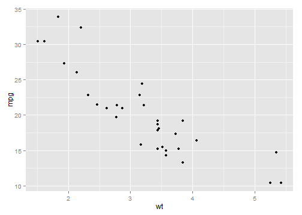
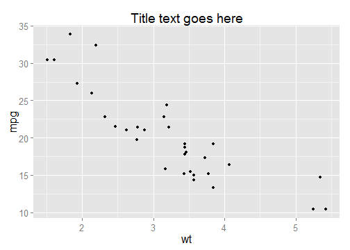
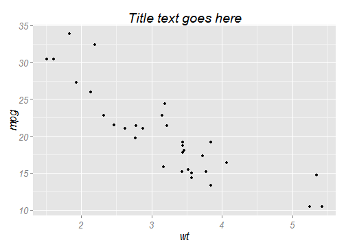

# chapter14: Output for Presentation
## 14.1.Outputting to PDF Vector Files

```r
library(ggplot2)
# width and height are in inches
pdf("myplot.pdf", width = 4, height = 4)

# Make plots
plot(mtcars$wt, mtcars$mpg)
print(ggplot(mtcars, aes(x = wt, y = mpg)) + geom_point())

dev.off()
```

```
## pdf 
##   2
```

```r

# 8x8 cm
pdf("myplot.pdf", width = 8/2.54, height = 8/2.54)

ggplot(mtcars, aes(x = wt, y = mpg)) + geom_point()

# Default is inches, but you can specify unit
ggsave("myplot.pdf", width = 8, height = 8, units = "cm")
```

## 14.2.Outputting to SVG Vector Files

```r
svg("myplot.svg", width = 4, height = 4)
plot(...)
```

```
## Error: '...'用在的上下文不对
```

```r
dev.off()
```

```
## pdf 
##   2
```

```r

# With ggsave()
ggsave("myplot.svg", width = 8, height = 8, units = "cm")
```

## 14.3.Outputting to WMF Vector Files

```r
win.metafile("myplot.wmf", width = 4, height = 4)
plot(...)
```

```
## Error: '...'用在的上下文不对
```

```r
dev.off()
```

```
## pdf 
##   2
```

```r

# With ggsave()
ggsave("myplot.wmf", width = 8, height = 8, units = "cm")
```

## 14.4.Editing a Vector Ouput File

```r
pdf("myplot.pdf", width = 4, height = 4, useDingbats = FALSE)

# or
ggsave("myplot.pdf", width = 4, height = 4, useDingbats = FALSE)
```

## 14.5.Outputting to Bitmap (PNG/TIFF) Files

```r
# width and height are in pixels
png("myplot.png", width = 400, height = 400)

# Make plot
plot(mtcars$wt, mtcars$mpg)

dev.off()
```

```
## pdf 
##   2
```

```r

# width and height are in pixels
png("myplot-%d.png", width = 400, height = 400)

plot(mtcars$wt, mtcars$mpg)
print(ggplot(mtcars, aes(x = wt, y = mpg)) + geom_point())

dev.off()
```

```
## pdf 
##   2
```

```r


ppi <- 300
# Calculate the height and width (in pixels) for a 4x4-inch image at 300 ppi
png("myplot.png", width = 4 * ppi, height = 4 * ppi, res = ppi)
plot(mtcars$wt, mtcars$mpg)
dev.off()
```

```
## pdf 
##   2
```

```r


ggplot(mtcars, aes(x = wt, y = mpg)) + geom_point()
```

 

```r

# Default dimensions are in inches, but you can specify the unit
ggsave("myplot.png", width = 8, height = 8, unit = "cm", dpi = 300)


# install.packages('Cairo') # One-time installation
library("Cairo")
CairoPNG("myplot.png")
plot(...)
```

```
## Error: '...'用在的上下文不对
```

```r
dev.off()
```

```
## pdf 
##   2
```

## 14.6.Using Fonts in PDF Files    

```r
# install.packages('extrafont')
library(extrafont)
```

```
## Registering fonts with R
```

```r

# Find and save information about fonts installed on your system
font_import()
```

```
## Importing fonts may take a few minutes, depending on the number of fonts and the speed of the system.
## Continue? [y/n]
```

```
## Exiting.
```

```r

# List the fonts
fonts()
```

```
## NULL
```

```r


library(extrafont)
# Register the fonts with R
loadfonts()

# On Windows, you may need to tell it where Ghostscript is installed (adjust
# the path to match your installation of Ghostscript)
Sys.setenv(R_GSCMD = "C:/Program Files/gs/gs9.05/bin/gswin32c.exe")

library(ggplot2)
ggplot(mtcars, aes(x = wt, y = mpg)) + geom_point() + ggtitle("Title text goes here") + 
    theme(text = element_text(size = 16, family = "Impact"))
```

 

```r

ggsave("myplot.pdf", width = 4, height = 4)
```

```
## Error: 字体类别出错
```

```r

embed_fonts("myplot.pdf")
```

```
## Error: status 127 in running command 'C:\Program
## Files\gs\gs9.05\bin\gswin32c.exe -dNOPAUSE -dBATCH -q
## -dAutoRotatePages=/None -sDEVICE=pdfwrite
## -sOutputFile=C:\Users\GRC\AppData\Local\Temp\RtmpQFSXsL\Rembedf1448a320d5
## "-sFONTPATH=" -I"C:\Program Files\R\R-3.0.2\library\extrafontdb\fontmap"
## "myplot.pdf"'
```

## 14.7.Using Fonts in Windows Bitmap or Screen Output  

```r
install.packages("extrafont")
```

```
## Error: trying to use CRAN without setting a mirror
```

```r
library(extrafont)

# Find and save information about fonts installed on your system
font_import()
```

```
## Importing fonts may take a few minutes, depending on the number of fonts and the speed of the system.
## Continue? [y/n]
```

```
## Exiting.
```

```r

# List the fonts
fonts()
```

```
## NULL
```

```r

library(extrafont)
# Register the fonts for Windows
loadfonts("win")

library(ggplot2)
ggplot(mtcars, aes(x = wt, y = mpg)) + geom_point() + ggtitle("Title text goes here") + 
    theme(text = element_text(size = 16, family = "Georgia", face = "italic"))
```

 

```r

ggsave("myplot.png", width = 4, height = 4, dpi = 300)
```

