chapter: Quickly Exploring Data

```r
# ==================
plot(mtcars$wt, mtcars$mpg)


# ====================================
library(ggplot2)
```

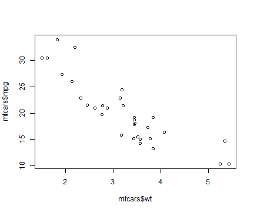 

```r
qplot(mtcars$wt, mtcars$mpg)
```

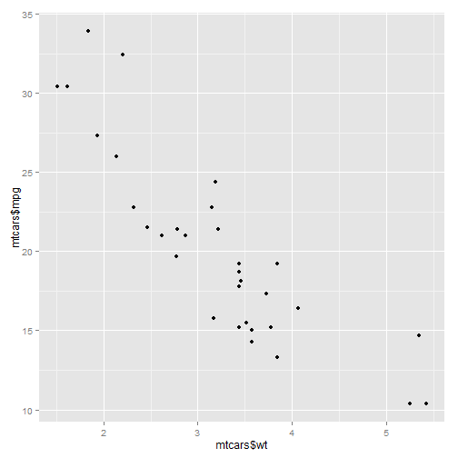 

```r


# ====================================
qplot(wt, mpg, data = mtcars)
```

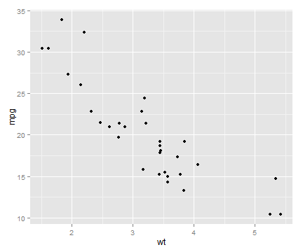 

```r
# This is equivalent to:
ggplot(mtcars, aes(x = wt, y = mpg)) + geom_point()
```

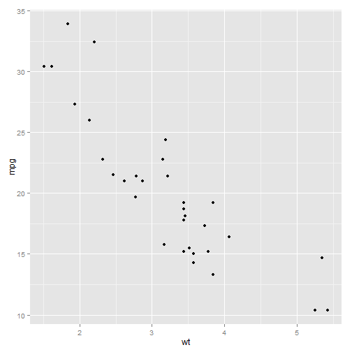 

```r


# ====================================
plot(pressure$temperature, pressure$pressure, type = "l")


# ====================================
plot(pressure$temperature, pressure$pressure, type = "l")
points(pressure$temperature, pressure$pressure)

lines(pressure$temperature, pressure$pressure/2, col = "red")
points(pressure$temperature, pressure$pressure/2, col = "red")
```

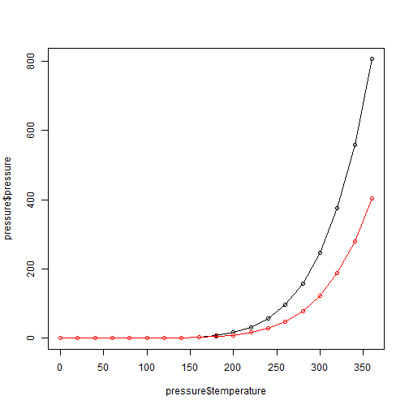 

```r


# ====================================
library(ggplot2)
qplot(pressure$temperature, pressure$pressure, geom = "line")
```

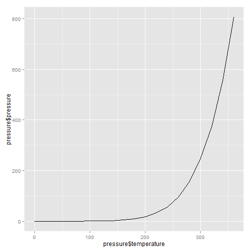 

```r


# ====================================
qplot(temperature, pressure, data = pressure, geom = "line")
```

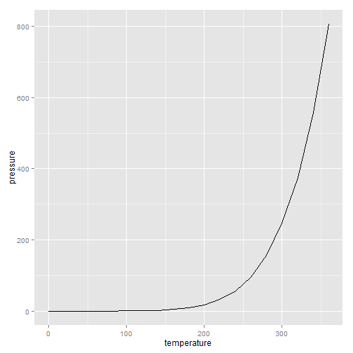 

```r
# This is equivalent to:
ggplot(pressure, aes(x = temperature, y = pressure)) + geom_line()
```

 

```r


# Lines and points together
qplot(temperature, pressure, data = pressure, geom = c("line", "point"))
```

 

```r
# Equivalent to:
ggplot(pressure, aes(x = temperature, y = pressure)) + geom_line() + geom_point()
```

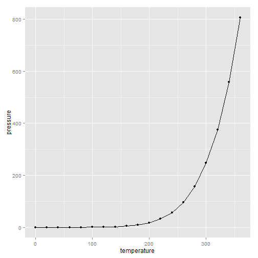 

```r


# ====================================
barplot(BOD$demand, names.arg = BOD$Time)
```

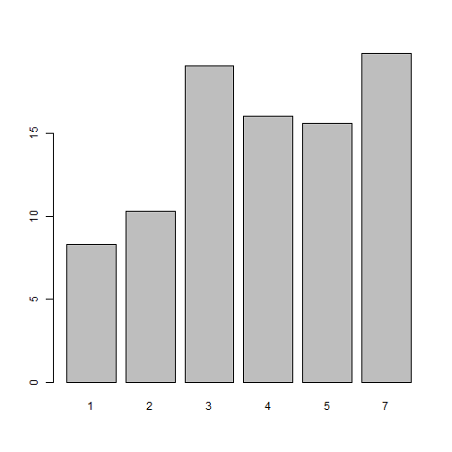 

```r


# ====================================
table(mtcars$cyl)
```

```
## 
##  4  6  8 
## 11  7 14
```

```r

# 4 6 8 11 7 14 There are 11 cases of the value 4, 7 cases of 6, and 14
# cases of 8


# ==================================== Generate a table of counts
barplot(table(mtcars$cyl))
```

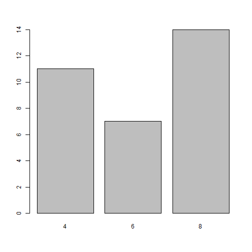 

```r


# ====================================
library(ggplot2)
qplot(BOD$Time, BOD$demand, geom = "bar", stat = "identity")
```

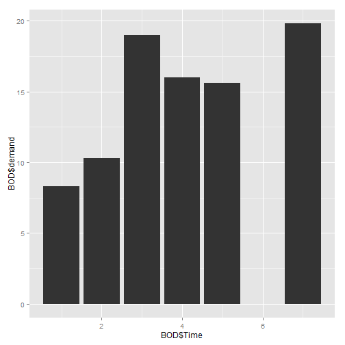 

```r

# Convert the x variable to a factor, so that it is treated as discrete
qplot(factor(BOD$Time), BOD$demand, geom = "bar", stat = "identity")
```

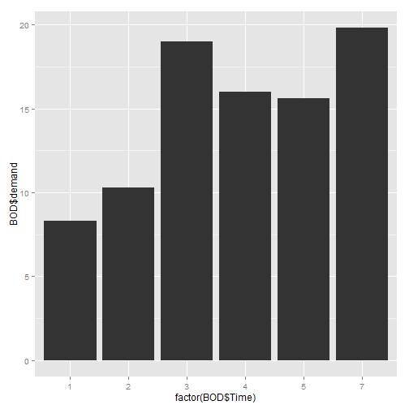 

```r


# ==================================== cyl is continuous here
qplot(mtcars$cyl)
```

```
## stat_bin: binwidth defaulted to range/30. Use 'binwidth = x' to adjust this.
```

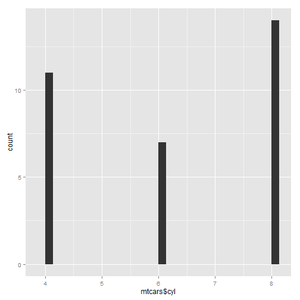 

```r

# Treat cyl as discrete
qplot(factor(mtcars$cyl))
```

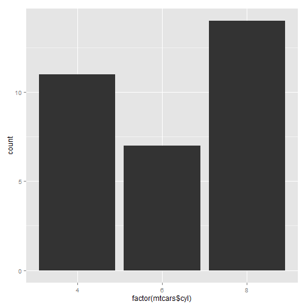 

```r


# ==================================== Bar graph of values. This uses the
# BOD data frame, with the
#'Time' column for x values and the 'demand' column for y values.
qplot(Time, demand, data = BOD, geom = "bar", stat = "identity")
```

 

```r
# This is equivalent to:
ggplot(BOD, aes(x = Time, y = demand)) + geom_bar(stat = "identity")
```

 

```r


# Bar graph of counts
qplot(factor(cyl), data = mtcars)
```

 

```r
# This is equivalent to:
ggplot(mtcars, aes(x = factor(cyl))) + geom_bar()
```

 

```r


# ====================================
hist(mtcars$mpg)
```

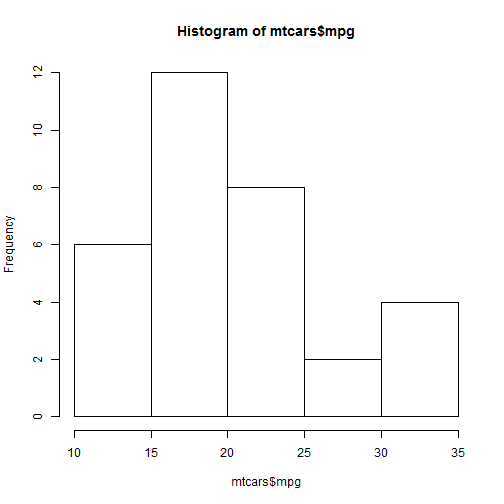 

```r

# Specify approximate number of bins with breaks
hist(mtcars$mpg, breaks = 10)
```

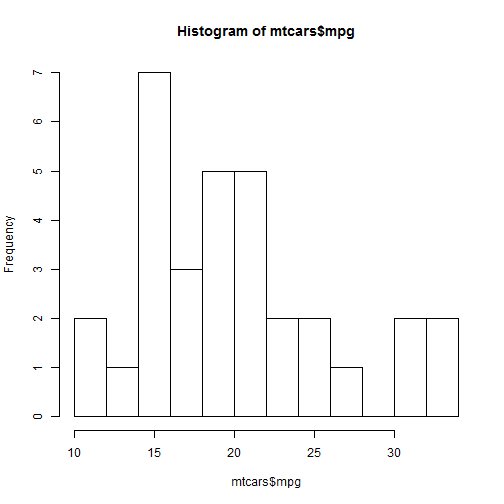 

```r


# ====================================
qplot(mtcars$mpg)
```

```
## stat_bin: binwidth defaulted to range/30. Use 'binwidth = x' to adjust this.
```

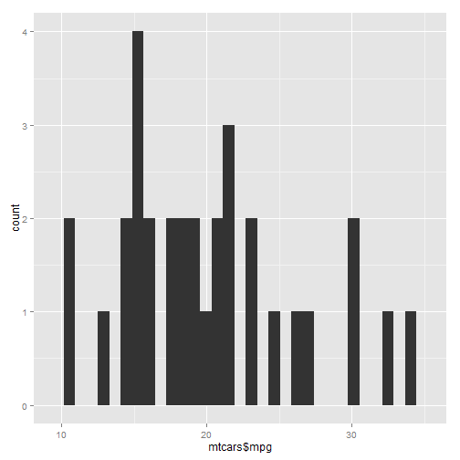 

```r


# ====================================
library(ggplot2)
qplot(mpg, data = mtcars, binwidth = 4)
```

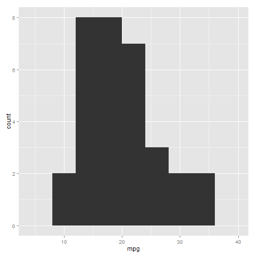 

```r
# This is equivalent to:
ggplot(mtcars, aes(x = mpg)) + geom_histogram(binwidth = 4)
```

 

```r


# ====================================
plot(ToothGrowth$supp, ToothGrowth$len)


# ==================================== Formula syntax
boxplot(len ~ supp, data = ToothGrowth)
```

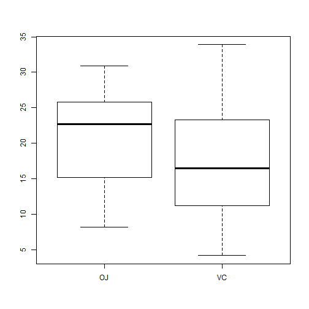 

```r

# Put interaction of two variables on x-axis
boxplot(len ~ supp + dose, data = ToothGrowth)
```

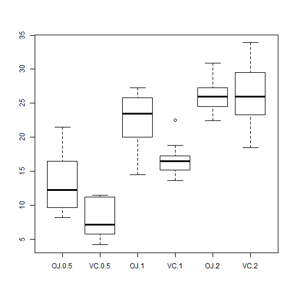 

```r


# ====================================
library(ggplot2)
qplot(ToothGrowth$supp, ToothGrowth$len, geom = "boxplot")
```

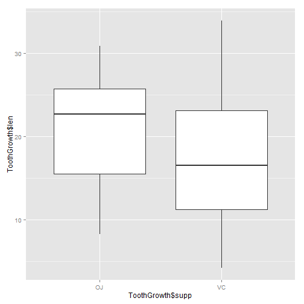 

```r


# ====================================
qplot(supp, len, data = ToothGrowth, geom = "boxplot")
```

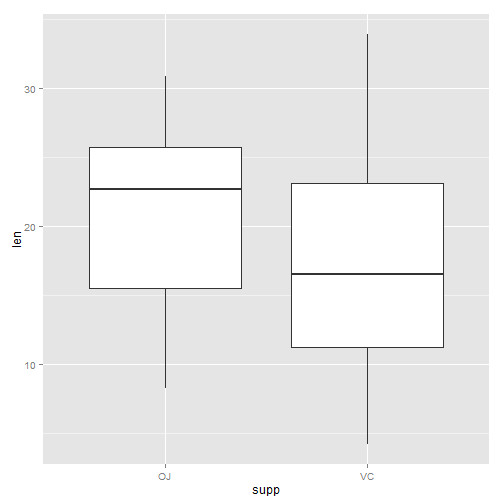 

```r
# This is equivalent to:
ggplot(ToothGrowth, aes(x = supp, y = len)) + geom_boxplot()
```

 

```r


# ==================================== Using three separate vectors
qplot(interaction(ToothGrowth$supp, ToothGrowth$dose), ToothGrowth$len, geom = "boxplot")
```

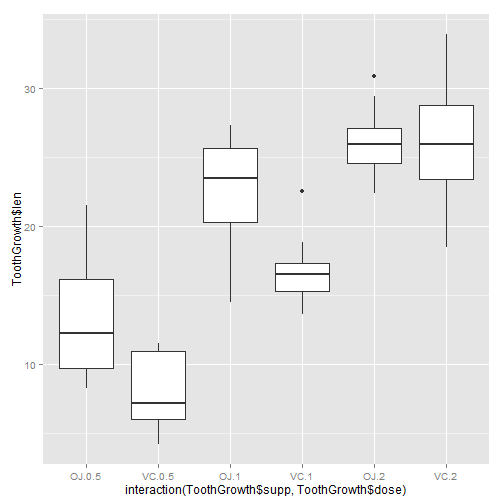 

```r

# Alternatively, get the columns from the data frame
qplot(interaction(supp, dose), len, data = ToothGrowth, geom = "boxplot")
```

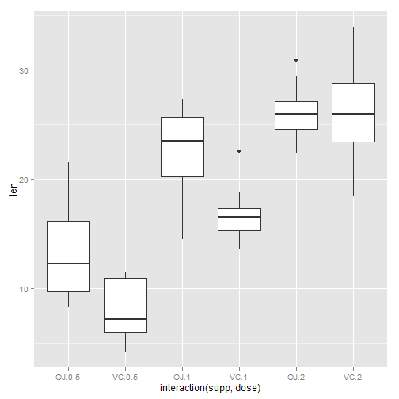 

```r
# This is equivalent to:
ggplot(ToothGrowth, aes(x = interaction(supp, dose), y = len)) + geom_boxplot()
```

 

```r


# ====================================
curve(x^3 - 5 * x, from = -4, to = 4)
```

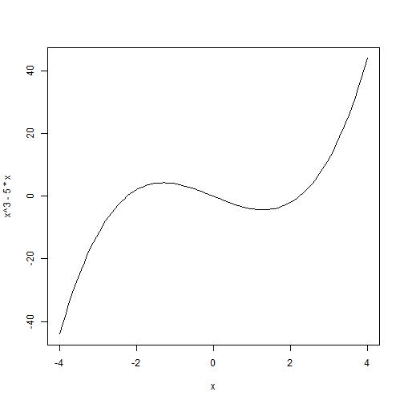 

```r


# ==================================== Plot a user-defined function
myfun <- function(xvar) {
    1/(1 + exp(-xvar + 10))
}
curve(myfun(x), from = 0, to = 20)
# Add a line:
curve(1 - myfun(x), add = TRUE, col = "red")
```

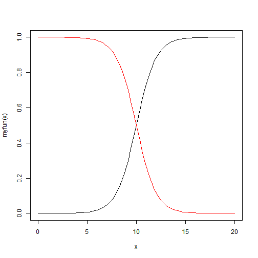 

```r


# ====================================
library(ggplot2)
# This sets the x range from 0 to 20
qplot(c(0, 20), fun = myfun, stat = "function", geom = "line")
```

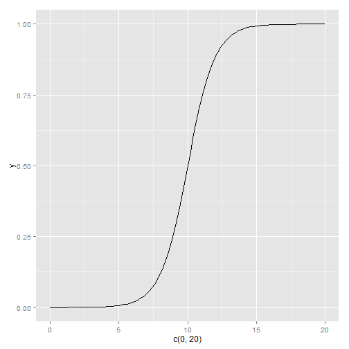 

```r
# This is equivalent to:
ggplot(data.frame(x = c(0, 20)), aes(x = x)) + stat_function(fun = myfun, geom = "line")
```

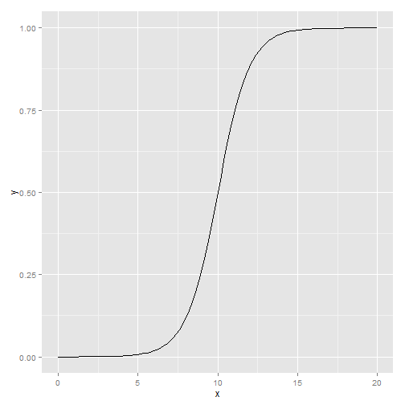 

```r


# ==================
```


