# chapter3: Bar Graphs
## 3.1.Making a Basic Bar Graph

```r
library(ggplot2)
library(gcookbook)  # For the data set
ggplot(pg_mean, aes(x = group, y = weight)) + geom_bar(stat = "identity")
```

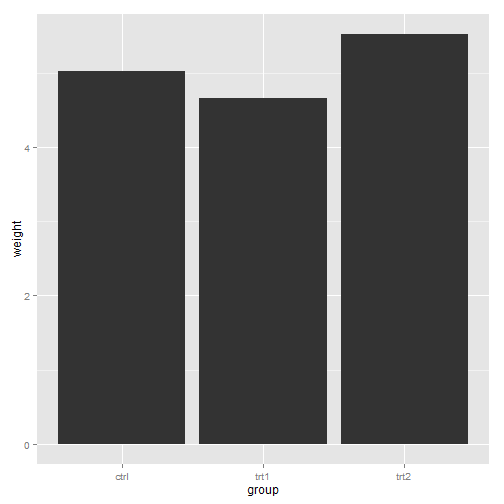 

```r


# There's no entry for Time == 6
BOD
```

```
##   Time demand
## 1    1    8.3
## 2    2   10.3
## 3    3   19.0
## 4    4   16.0
## 5    5   15.6
## 6    7   19.8
```

```r

# Time is numeric (continuous)
str(BOD)
```

```
## 'data.frame':	6 obs. of  2 variables:
##  $ Time  : num  1 2 3 4 5 7
##  $ demand: num  8.3 10.3 19 16 15.6 19.8
##  - attr(*, "reference")= chr "A1.4, p. 270"
```

```r


ggplot(BOD, aes(x = Time, y = demand)) + geom_bar(stat = "identity")
```

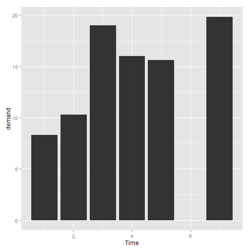 

```r

# Convert Time to a discrete (categorical) variable with factor()
ggplot(BOD, aes(x = factor(Time), y = demand)) + geom_bar(stat = "identity")
```

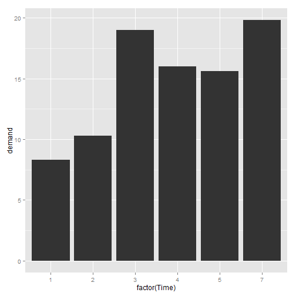 

```r


ggplot(pg_mean, aes(x = group, y = weight)) + geom_bar(stat = "identity", fill = "lightblue", 
    colour = "black")
```

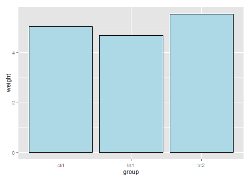 

## 3.2.Grouping Bars Together

```r
library(gcookbook)  # For the data set
cabbage_exp
```

```
##   Cultivar Date Weight     sd  n      se
## 1      c39  d16   3.18 0.9566 10 0.30251
## 2      c39  d20   2.80 0.2789 10 0.08819
## 3      c39  d21   2.74 0.9834 10 0.31098
## 4      c52  d16   2.26 0.4452 10 0.14079
## 5      c52  d20   3.11 0.7909 10 0.25009
## 6      c52  d21   1.47 0.2111 10 0.06675
```

```r

ggplot(cabbage_exp, aes(x = Date, y = Weight, fill = Cultivar)) + geom_bar(position = "dodge")
```

```
## Mapping a variable to y and also using stat="bin".
##   With stat="bin", it will attempt to set the y value to the count of cases in each group.
##   This can result in unexpected behavior and will not be allowed in a future version of ggplot2.
##   If you want y to represent counts of cases, use stat="bin" and don't map a variable to y.
##   If you want y to represent values in the data, use stat="identity".
##   See ?geom_bar for examples. (Deprecated; last used in version 0.9.2)
```

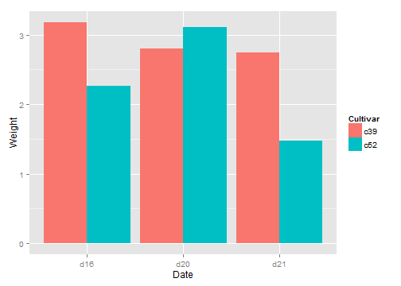 

```r

ggplot(cabbage_exp, aes(x = Date, y = Weight, fill = Cultivar)) + geom_bar(position = "dodge", 
    colour = "black") + scale_fill_brewer(palette = "Pastel1")
```

```
## Mapping a variable to y and also using stat="bin".
##   With stat="bin", it will attempt to set the y value to the count of cases in each group.
##   This can result in unexpected behavior and will not be allowed in a future version of ggplot2.
##   If you want y to represent counts of cases, use stat="bin" and don't map a variable to y.
##   If you want y to represent values in the data, use stat="identity".
##   See ?geom_bar for examples. (Deprecated; last used in version 0.9.2)
```

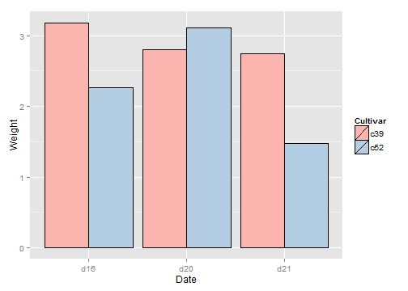 

```r

ce <- cabbage_exp[1:5, ]  # Copy the data without last row
ce
```

```
##   Cultivar Date Weight     sd  n      se
## 1      c39  d16   3.18 0.9566 10 0.30251
## 2      c39  d20   2.80 0.2789 10 0.08819
## 3      c39  d21   2.74 0.9834 10 0.31098
## 4      c52  d16   2.26 0.4452 10 0.14079
## 5      c52  d20   3.11 0.7909 10 0.25009
```

```r

ggplot(ce, aes(x = Date, y = Weight, fill = Cultivar)) + geom_bar(position = "dodge", 
    colour = "black") + scale_fill_brewer(palette = "Pastel1")
```

```
## Mapping a variable to y and also using stat="bin".
##   With stat="bin", it will attempt to set the y value to the count of cases in each group.
##   This can result in unexpected behavior and will not be allowed in a future version of ggplot2.
##   If you want y to represent counts of cases, use stat="bin" and don't map a variable to y.
##   If you want y to represent values in the data, use stat="identity".
##   See ?geom_bar for examples. (Deprecated; last used in version 0.9.2)
```

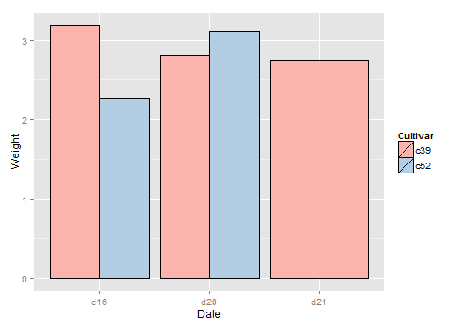 

## 3.3.Making a Bar Graph of Counts

```r
ggplot(diamonds, aes(x = cut)) + geom_bar()
```

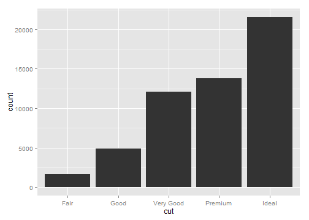 

```r
# Equivalent to using geom_bar(stat='bin')

head(diamonds)
```

```
##   carat       cut color clarity depth table price    x    y    z
## 1  0.23     Ideal     E     SI2  61.5    55   326 3.95 3.98 2.43
## 2  0.21   Premium     E     SI1  59.8    61   326 3.89 3.84 2.31
## 3  0.23      Good     E     VS1  56.9    65   327 4.05 4.07 2.31
## 4  0.29   Premium     I     VS2  62.4    58   334 4.20 4.23 2.63
## 5  0.31      Good     J     SI2  63.3    58   335 4.34 4.35 2.75
## 6  0.24 Very Good     J    VVS2  62.8    57   336 3.94 3.96 2.48
```

```r

ggplot(diamonds, aes(x = carat)) + geom_bar()
```

```
## stat_bin: binwidth defaulted to range/30. Use 'binwidth = x' to adjust this.
```

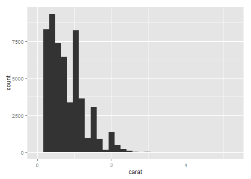 

## 3.4.Using Colors in a Bar Graph

```r
library(gcookbook)  # For the data set
upc <- subset(uspopchange, rank(Change) > 40)
upc
```

```
##             State Abb Region Change
## 3         Arizona  AZ   West   24.6
## 6        Colorado  CO   West   16.9
## 10        Florida  FL  South   17.6
## 11        Georgia  GA  South   18.3
## 13          Idaho  ID   West   21.1
## 29         Nevada  NV   West   35.1
## 34 North Carolina  NC  South   18.5
## 41 South Carolina  SC  South   15.3
## 44          Texas  TX  South   20.6
## 45           Utah  UT   West   23.8
```

```r

ggplot(upc, aes(x = Abb, y = Change, fill = Region)) + geom_bar(stat = "identity")
```

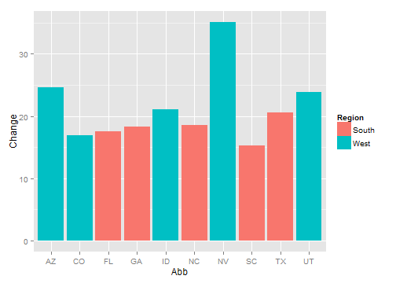 

```r

ggplot(upc, aes(x = reorder(Abb, Change), y = Change, fill = Region)) + geom_bar(stat = "identity", 
    colour = "black") + scale_fill_manual(values = c("#669933", "#FFCC66")) + 
    xlab("State")
```

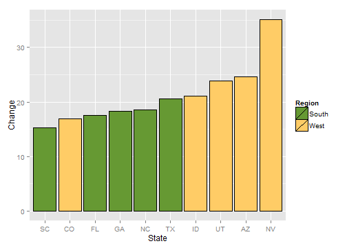 

## 3.5.Coloring Negative and Positive Bars Differently  

```r
library(gcookbook)  # For the data set
csub <- subset(climate, Source == "Berkeley" & Year >= 1900)
csub$pos <- csub$Anomaly10y >= 0
head(csub)
```

```
##       Source Year Anomaly1y Anomaly5y Anomaly10y Unc10y   pos
## 101 Berkeley 1900        NA        NA     -0.171  0.108 FALSE
## 102 Berkeley 1901        NA        NA     -0.162  0.109 FALSE
## 103 Berkeley 1902        NA        NA     -0.177  0.108 FALSE
## 104 Berkeley 1903        NA        NA     -0.199  0.104 FALSE
## 105 Berkeley 1904        NA        NA     -0.223  0.105 FALSE
## 106 Berkeley 1905        NA        NA     -0.241  0.107 FALSE
```

```r

ggplot(csub, aes(x = Year, y = Anomaly10y, fill = pos)) + geom_bar(stat = "identity", 
    position = "identity")
```

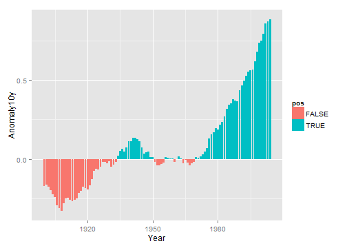 

```r

ggplot(csub, aes(x = Year, y = Anomaly10y, fill = pos)) + geom_bar(stat = "identity", 
    position = "identity", colour = "black", size = 0.25) + scale_fill_manual(values = c("#CCEEFF", 
    "#FFDDDD"), guide = FALSE)
```

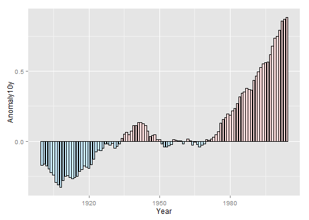 

## 3.6.Adjusting Bar Width and Spacing

```r
library(gcookbook)  # For the data set

ggplot(pg_mean, aes(x = group, y = weight)) + geom_bar(stat = "identity")
```

 

```r

ggplot(pg_mean, aes(x = group, y = weight)) + geom_bar(stat = "identity", width = 0.5)
```

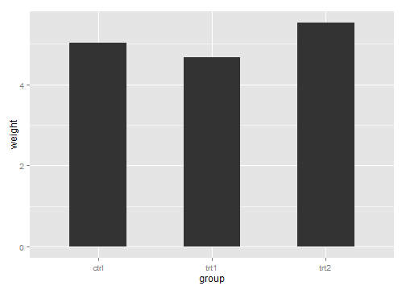 

```r

ggplot(pg_mean, aes(x = group, y = weight)) + geom_bar(stat = "identity", width = 1)
```

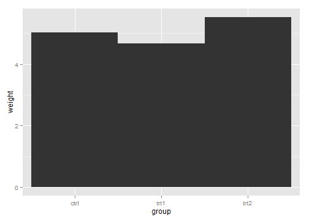 

```r

ggplot(cabbage_exp, aes(x = Date, y = Weight, fill = Cultivar)) + geom_bar(stat = "identity", 
    width = 0.5, position = "dodge")
```

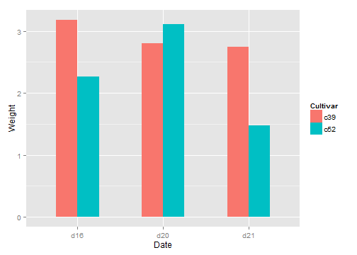 

```r

ggplot(cabbage_exp, aes(x = Date, y = Weight, fill = Cultivar)) + geom_bar(stat = "identity", 
    width = 0.5, position = position_dodge(0.7))
```

 

```r

geom_bar(position = "dodge")
```

```
## geom_bar:  
## stat_bin:  
## position_dodge: (width = NULL, height = NULL)
```

```r
geom_bar(width = 0.9, position = position_dodge())
```

```
## geom_bar:  
## stat_bin: width = 0.9 
## position_dodge: (width = NULL, height = NULL)
```

```r
geom_bar(position = position_dodge(0.9))
```

```
## geom_bar:  
## stat_bin:  
## position_dodge: (width = 0.9, height = NULL)
```

```r
geom_bar(width = 0.9, position = position_dodge(width = 0.9))
```

```
## geom_bar:  
## stat_bin: width = 0.9 
## position_dodge: (width = 0.9, height = NULL)
```

## 3.7.Making a Stacked Bar Graph

```r
library(gcookbook)  # For the data set
ggplot(cabbage_exp, aes(x = Date, y = Weight, fill = Cultivar)) + geom_bar(stat = "identity")
```

 

```r

cabbage_exp
```

```
##   Cultivar Date Weight     sd  n      se
## 1      c39  d16   3.18 0.9566 10 0.30251
## 2      c39  d20   2.80 0.2789 10 0.08819
## 3      c39  d21   2.74 0.9834 10 0.31098
## 4      c52  d16   2.26 0.4452 10 0.14079
## 5      c52  d20   3.11 0.7909 10 0.25009
## 6      c52  d21   1.47 0.2111 10 0.06675
```

```r

ggplot(cabbage_exp, aes(x = Date, y = Weight, fill = Cultivar)) + geom_bar(stat = "identity") + 
    guides(fill = guide_legend(reverse = TRUE))
```

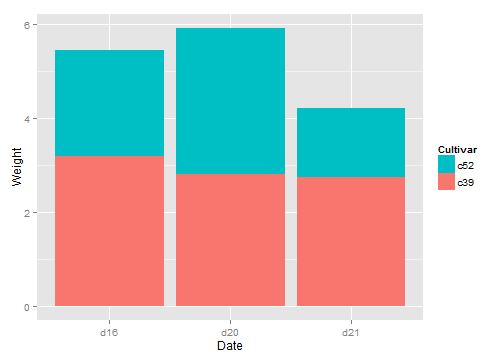 

```r

library(plyr)  # Needed for desc()
ggplot(cabbage_exp, aes(x = Date, y = Weight, fill = Cultivar, order = desc(Cultivar))) + 
    geom_bar(stat = "identity")
```

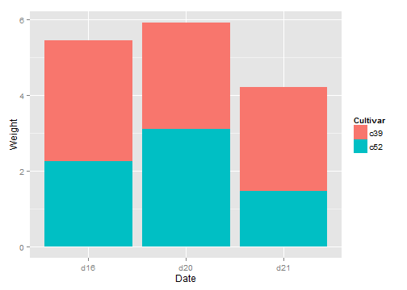 

```r

ggplot(cabbage_exp, aes(x = Date, y = Weight, fill = Cultivar)) + geom_bar(stat = "identity", 
    colour = "black") + guides(fill = guide_legend(reverse = TRUE)) + scale_fill_brewer(palette = "Pastel1")
```

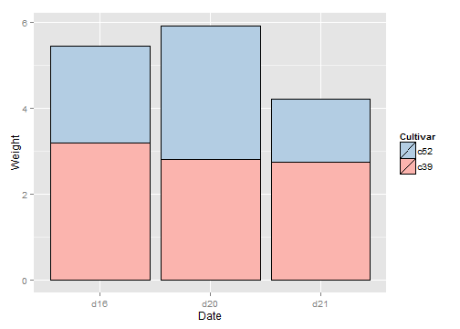 

## 3.8.Making a Proportional Stacked Bar Graph    

```r
library(gcookbook)  # For the data set
library(plyr)
# Do a group-wise transform(), splitting on 'Date'
ce <- ddply(cabbage_exp, "Date", transform, percent_weight = Weight/sum(Weight) * 
    100)

ggplot(ce, aes(x = Date, y = percent_weight, fill = Cultivar)) + geom_bar(stat = "identity")
```

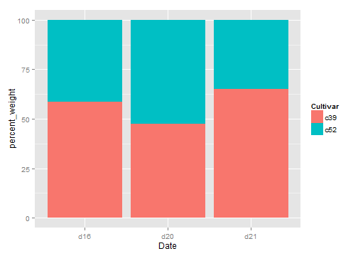 

```r

cabbage_exp
```

```
##   Cultivar Date Weight     sd  n      se
## 1      c39  d16   3.18 0.9566 10 0.30251
## 2      c39  d20   2.80 0.2789 10 0.08819
## 3      c39  d21   2.74 0.9834 10 0.31098
## 4      c52  d16   2.26 0.4452 10 0.14079
## 5      c52  d20   3.11 0.7909 10 0.25009
## 6      c52  d21   1.47 0.2111 10 0.06675
```

```r

ddply(cabbage_exp, "Date", transform, percent_weight = Weight/sum(Weight) * 
    100)
```

```
##   Cultivar Date Weight     sd  n      se percent_weight
## 1      c39  d16   3.18 0.9566 10 0.30251          58.46
## 2      c52  d16   2.26 0.4452 10 0.14079          41.54
## 3      c39  d20   2.80 0.2789 10 0.08819          47.38
## 4      c52  d20   3.11 0.7909 10 0.25009          52.62
## 5      c39  d21   2.74 0.9834 10 0.31098          65.08
## 6      c52  d21   1.47 0.2111 10 0.06675          34.92
```

```r

ggplot(ce, aes(x = Date, y = percent_weight, fill = Cultivar)) + geom_bar(stat = "identity", 
    colour = "black") + guides(fill = guide_legend(reverse = TRUE)) + scale_fill_brewer(palette = "Pastel1")
```

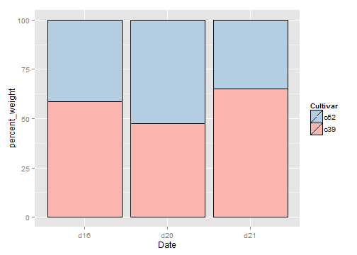 

## 3.9.Adding Labels to a Bar Graph  

```r
library(gcookbook)  # For the data set

# Below the top
ggplot(cabbage_exp, aes(x = interaction(Date, Cultivar), y = Weight)) + geom_bar(stat = "identity") + 
    geom_text(aes(label = Weight), vjust = 1.5, colour = "white")
```

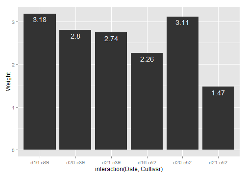 

```r

# Above the top
ggplot(cabbage_exp, aes(x = interaction(Date, Cultivar), y = Weight)) + geom_bar(stat = "identity") + 
    geom_text(aes(label = Weight), vjust = -0.2)
```

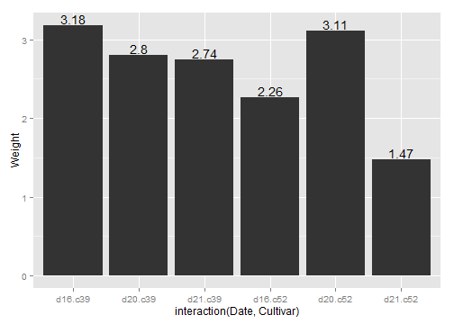 

```r

# Adjust y limits to be a little higher
ggplot(cabbage_exp, aes(x = interaction(Date, Cultivar), y = Weight)) + geom_bar(stat = "identity") + 
    geom_text(aes(label = Weight), vjust = -0.2) + ylim(0, max(cabbage_exp$Weight) * 
    1.05)
```

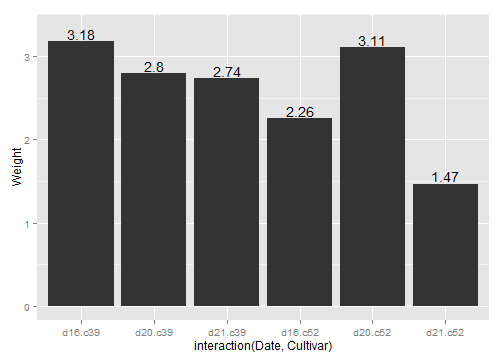 

```r

# Map y positions slightly above bar top - y range of plot will auto-adjust
ggplot(cabbage_exp, aes(x = interaction(Date, Cultivar), y = Weight)) + geom_bar(stat = "identity") + 
    geom_text(aes(y = Weight + 0.1, label = Weight))
```

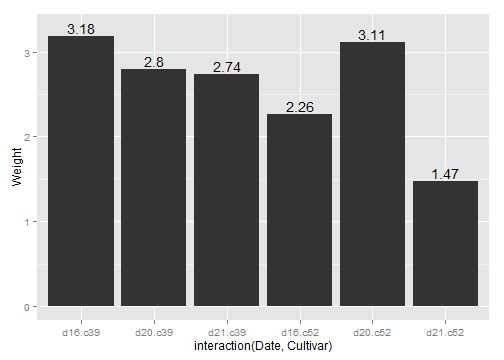 

```r


ggplot(cabbage_exp, aes(x = Date, y = Weight, fill = Cultivar)) + geom_bar(stat = "identity", 
    position = "dodge") + geom_text(aes(label = Weight), vjust = 1.5, colour = "white", 
    position = position_dodge(0.9), size = 3)
```

```
## ymax not defined: adjusting position using y instead
```

 

```r

library(plyr)
# Sort by the day and sex columns
ce <- arrange(cabbage_exp, Date, Cultivar)


# Get the cumulative sum
ce <- ddply(ce, "Date", transform, label_y = cumsum(Weight))
ce
```

```
##   Cultivar Date Weight     sd  n      se label_y
## 1      c39  d16   3.18 0.9566 10 0.30251    3.18
## 2      c52  d16   2.26 0.4452 10 0.14079    5.44
## 3      c39  d20   2.80 0.2789 10 0.08819    2.80
## 4      c52  d20   3.11 0.7909 10 0.25009    5.91
## 5      c39  d21   2.74 0.9834 10 0.31098    2.74
## 6      c52  d21   1.47 0.2111 10 0.06675    4.21
```

```r

ggplot(ce, aes(x = Date, y = Weight, fill = Cultivar)) + geom_bar(stat = "identity") + 
    geom_text(aes(y = label_y, label = Weight), vjust = 1.5, colour = "white")
```

 

```r


ce <- arrange(cabbage_exp, Date, Cultivar)

# Calculate y position, placing it in the middle
ce <- ddply(ce, "Date", transform, label_y = cumsum(Weight) - 0.5 * Weight)

ggplot(ce, aes(x = Date, y = Weight, fill = Cultivar)) + geom_bar(stat = "identity") + 
    geom_text(aes(y = label_y, label = Weight), colour = "white")
```

 

```r


ggplot(ce, aes(x = Date, y = Weight, fill = Cultivar)) + geom_bar(stat = "identity", 
    colour = "black") + geom_text(aes(y = label_y, label = paste(format(Weight, 
    nsmall = 2), "kg")), size = 4) + guides(fill = guide_legend(reverse = TRUE)) + 
    scale_fill_brewer(palette = "Pastel1")
```

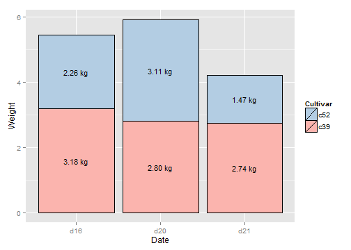 

## 3.10.Making a Cleveland Dot Plot

```r
library(gcookbook) # For the data set
tophit <- tophitters2001[1:25, ] # Take the top 25 from the tophitters data set

ggplot(tophit, aes(x=avg, y=name)) + geom_point()
```

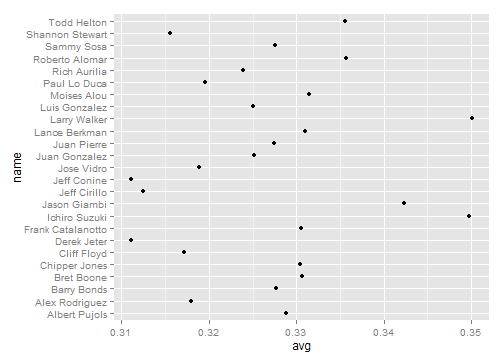 

```r
    
    
tophit[, c("name", "lg", "avg")]
```

```
##                 name lg    avg
## 1       Larry Walker NL 0.3501
## 2      Ichiro Suzuki AL 0.3497
## 3       Jason Giambi AL 0.3423
## 4     Roberto Alomar AL 0.3357
## 5        Todd Helton NL 0.3356
## 6        Moises Alou NL 0.3314
## 7      Lance Berkman NL 0.3310
## 8         Bret Boone AL 0.3307
## 9  Frank Catalanotto AL 0.3305
## 10     Chipper Jones NL 0.3304
## 11     Albert Pujols NL 0.3288
## 12       Barry Bonds NL 0.3277
## 13        Sammy Sosa NL 0.3276
## 14       Juan Pierre NL 0.3274
## 15     Juan Gonzalez AL 0.3252
## 16     Luis Gonzalez NL 0.3251
## 17      Rich Aurilia NL 0.3239
## 18      Paul Lo Duca NL 0.3196
## 19        Jose Vidro NL 0.3189
## 20    Alex Rodriguez AL 0.3180
## 21       Cliff Floyd NL 0.3171
## 22   Shannon Stewart AL 0.3156
## 23      Jeff Cirillo NL 0.3125
## 24       Jeff Conine AL 0.3111
## 25       Derek Jeter AL 0.3111
```

```r

ggplot(tophit, aes(x=avg, y=reorder(name, avg))) +
    geom_point(size=3) +                        # Use a larger dot
    theme_bw() +
    theme(panel.grid.major.x = element_blank(),
          panel.grid.minor.x = element_blank(),
          panel.grid.major.y = element_line(colour="grey60", linetype="dashed"))
```

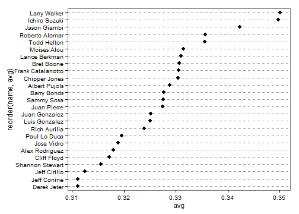 

```r
    
    
ggplot(tophit, aes(x=reorder(name, avg), y=avg)) +
    geom_point(size=3) +                        # Use a larger dot
    theme_bw() +
    theme(axis.text.x = element_text(angle=60, hjust=1),
          panel.grid.major.y = element_blank(),
          panel.grid.minor.y = element_blank(),
          panel.grid.major.x = element_line(colour="grey60", linetype="dashed"))
```

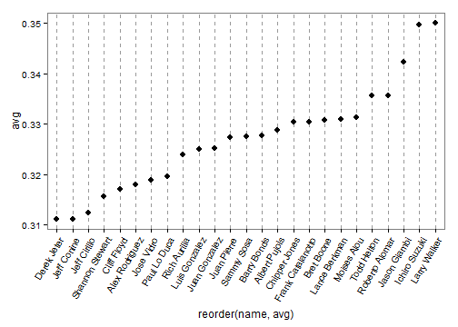 

```r
    
# Get the names, sorted first by lg, then by avg
nameorder <- tophit$name[order(tophit$lg, tophit$avg)]

# Turn name into a factor, with levels in the order of nameorder
tophit$name <- factor(tophit$name, levels=nameorder)
    
ggplot(tophit, aes(x=avg, y=name)) +
    geom_segment(aes(yend=name), xend=0, colour="grey50") +
    geom_point(size=3, aes(colour=lg)) +
    scale_colour_brewer(palette="Set1", limits=c("NL","AL")) +
    theme_bw() +
    theme(panel.grid.major.y = element_blank(),   # No horizontal grid lines
          legend.position=c(1, 0.55),             # Put legend inside plot area
          legend.justification=c(1, 0.5))
```

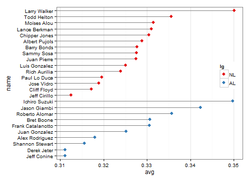 

```r
    
ggplot(tophit, aes(x=avg, y=name)) +
    geom_segment(aes(yend=name), xend=0, colour="grey50") +
    geom_point(size=3, aes(colour=lg)) +
    scale_colour_brewer(palette="Set1", limits=c("NL","AL"), guide=FALSE) +
    theme_bw() +
    theme(panel.grid.major.y = element_blank()) +
    facet_grid(lg ~ ., scales="free_y", space="free_y")
```

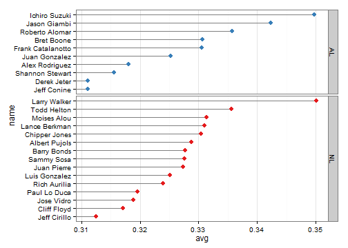 

