chapter: Bar Graphs

```r
#==================
library(ggplot2)
library(gcookbook) # For the data set
ggplot(pg_mean, aes(x=group, y=weight)) + geom_bar(stat="identity")
```

 

```r
    
    
#====================================
# There's no entry for Time == 6
BOD
```

```
##   Time demand
## 1    1    8.3
## 2    2   10.3
## 3    3   19.0
## 4    4   16.0
## 5    5   15.6
## 6    7   19.8
```

```r

# Time is numeric (continuous)
str(BOD)
```

```
## 'data.frame':	6 obs. of  2 variables:
##  $ Time  : num  1 2 3 4 5 7
##  $ demand: num  8.3 10.3 19 16 15.6 19.8
##  - attr(*, "reference")= chr "A1.4, p. 270"
```

```r

    
#====================================
ggplot(BOD, aes(x=Time, y=demand)) + geom_bar(stat="identity")
```

 

```r

# Convert Time to a discrete (categorical) variable with factor()
ggplot(BOD, aes(x=factor(Time), y=demand)) + geom_bar(stat="identity")
```

 

```r
    
    
#====================================
ggplot(pg_mean, aes(x=group, y=weight)) +
    geom_bar(stat="identity", fill="lightblue", colour="black")
```

 

```r
    
    
#====================================
library(gcookbook) # For the data set
cabbage_exp
```

```
##   Cultivar Date Weight     sd  n      se
## 1      c39  d16   3.18 0.9566 10 0.30251
## 2      c39  d20   2.80 0.2789 10 0.08819
## 3      c39  d21   2.74 0.9834 10 0.31098
## 4      c52  d16   2.26 0.4452 10 0.14079
## 5      c52  d20   3.11 0.7909 10 0.25009
## 6      c52  d21   1.47 0.2111 10 0.06675
```

```r

    
#====================================
ggplot(cabbage_exp, aes(x=Date, y=Weight, fill=Cultivar)) +
    geom_bar(position="dodge")
```

```
## Mapping a variable to y and also using stat="bin".
##   With stat="bin", it will attempt to set the y value to the count of cases in each group.
##   This can result in unexpected behavior and will not be allowed in a future version of ggplot2.
##   If you want y to represent counts of cases, use stat="bin" and don't map a variable to y.
##   If you want y to represent values in the data, use stat="identity".
##   See ?geom_bar for examples. (Deprecated; last used in version 0.9.2)
```

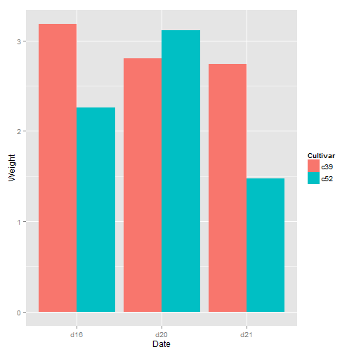 

```r
    
    
#====================================
ggplot(cabbage_exp, aes(x=Date, y=Weight, fill=Cultivar)) +
    geom_bar(position="dodge", colour="black") +
    scale_fill_brewer(palette="Pastel1")
```

```
## Mapping a variable to y and also using stat="bin".
##   With stat="bin", it will attempt to set the y value to the count of cases in each group.
##   This can result in unexpected behavior and will not be allowed in a future version of ggplot2.
##   If you want y to represent counts of cases, use stat="bin" and don't map a variable to y.
##   If you want y to represent values in the data, use stat="identity".
##   See ?geom_bar for examples. (Deprecated; last used in version 0.9.2)
```

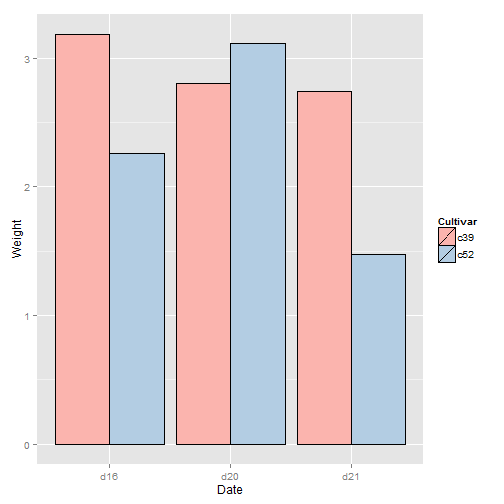 

```r
    
    
#====================================
ce <- cabbage_exp[1:5, ]   # Copy the data without last row
ce
```

```
##   Cultivar Date Weight     sd  n      se
## 1      c39  d16   3.18 0.9566 10 0.30251
## 2      c39  d20   2.80 0.2789 10 0.08819
## 3      c39  d21   2.74 0.9834 10 0.31098
## 4      c52  d16   2.26 0.4452 10 0.14079
## 5      c52  d20   3.11 0.7909 10 0.25009
```

```r

# Cultivar Date Weight
#      c39  d16   3.18
#      c39  d20   2.80
#      c39  d21   2.74
#      c52  d16   2.26
#      c52  d20   3.11

ggplot(ce, aes(x=Date, y=Weight, fill=Cultivar)) +
    geom_bar(position="dodge", colour="black") +
    scale_fill_brewer(palette="Pastel1")
```

```
## Mapping a variable to y and also using stat="bin".
##   With stat="bin", it will attempt to set the y value to the count of cases in each group.
##   This can result in unexpected behavior and will not be allowed in a future version of ggplot2.
##   If you want y to represent counts of cases, use stat="bin" and don't map a variable to y.
##   If you want y to represent values in the data, use stat="identity".
##   See ?geom_bar for examples. (Deprecated; last used in version 0.9.2)
```

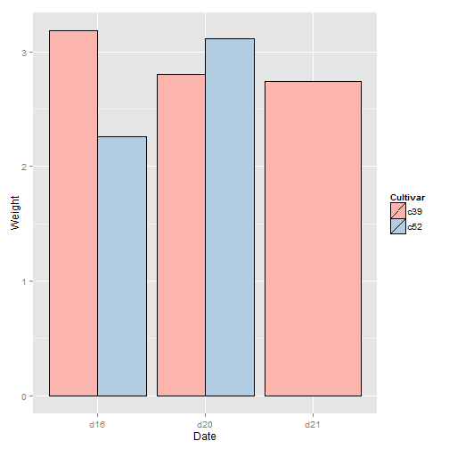 

```r

    
    
#====================================
ggplot(diamonds, aes(x=cut)) + geom_bar()
```

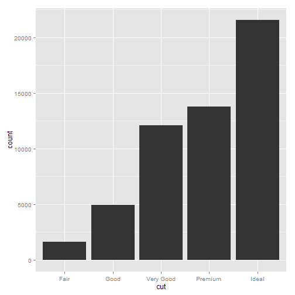 

```r
# Equivalent to using geom_bar(stat="bin")
    
    
#====================================
diamonds
```

```
##       carat       cut color clarity depth table price     x     y     z
## 1      0.23     Ideal     E     SI2  61.5  55.0   326  3.95  3.98  2.43
## 2      0.21   Premium     E     SI1  59.8  61.0   326  3.89  3.84  2.31
## 3      0.23      Good     E     VS1  56.9  65.0   327  4.05  4.07  2.31
## 4      0.29   Premium     I     VS2  62.4  58.0   334  4.20  4.23  2.63
## 5      0.31      Good     J     SI2  63.3  58.0   335  4.34  4.35  2.75
## 6      0.24 Very Good     J    VVS2  62.8  57.0   336  3.94  3.96  2.48
## 7      0.24 Very Good     I    VVS1  62.3  57.0   336  3.95  3.98  2.47
## 8      0.26 Very Good     H     SI1  61.9  55.0   337  4.07  4.11  2.53
## 9      0.22      Fair     E     VS2  65.1  61.0   337  3.87  3.78  2.49
## 10     0.23 Very Good     H     VS1  59.4  61.0   338  4.00  4.05  2.39
## 11     0.30      Good     J     SI1  64.0  55.0   339  4.25  4.28  2.73
## 12     0.23     Ideal     J     VS1  62.8  56.0   340  3.93  3.90  2.46
## 13     0.22   Premium     F     SI1  60.4  61.0   342  3.88  3.84  2.33
## 14     0.31     Ideal     J     SI2  62.2  54.0   344  4.35  4.37  2.71
## 15     0.20   Premium     E     SI2  60.2  62.0   345  3.79  3.75  2.27
## 16     0.32   Premium     E      I1  60.9  58.0   345  4.38  4.42  2.68
## 17     0.30     Ideal     I     SI2  62.0  54.0   348  4.31  4.34  2.68
## 18     0.30      Good     J     SI1  63.4  54.0   351  4.23  4.29  2.70
## 19     0.30      Good     J     SI1  63.8  56.0   351  4.23  4.26  2.71
## 20     0.30 Very Good     J     SI1  62.7  59.0   351  4.21  4.27  2.66
## 21     0.30      Good     I     SI2  63.3  56.0   351  4.26  4.30  2.71
## 22     0.23 Very Good     E     VS2  63.8  55.0   352  3.85  3.92  2.48
## 23     0.23 Very Good     H     VS1  61.0  57.0   353  3.94  3.96  2.41
## 24     0.31 Very Good     J     SI1  59.4  62.0   353  4.39  4.43  2.62
## 25     0.31 Very Good     J     SI1  58.1  62.0   353  4.44  4.47  2.59
## 26     0.23 Very Good     G    VVS2  60.4  58.0   354  3.97  4.01  2.41
## 27     0.24   Premium     I     VS1  62.5  57.0   355  3.97  3.94  2.47
## 28     0.30 Very Good     J     VS2  62.2  57.0   357  4.28  4.30  2.67
## 29     0.23 Very Good     D     VS2  60.5  61.0   357  3.96  3.97  2.40
## 30     0.23 Very Good     F     VS1  60.9  57.0   357  3.96  3.99  2.42
## 31     0.23 Very Good     F     VS1  60.0  57.0   402  4.00  4.03  2.41
## 32     0.23 Very Good     F     VS1  59.8  57.0   402  4.04  4.06  2.42
## 33     0.23 Very Good     E     VS1  60.7  59.0   402  3.97  4.01  2.42
## 34     0.23 Very Good     E     VS1  59.5  58.0   402  4.01  4.06  2.40
## 35     0.23 Very Good     D     VS1  61.9  58.0   402  3.92  3.96  2.44
## 36     0.23      Good     F     VS1  58.2  59.0   402  4.06  4.08  2.37
## 37     0.23      Good     E     VS1  64.1  59.0   402  3.83  3.85  2.46
## 38     0.31      Good     H     SI1  64.0  54.0   402  4.29  4.31  2.75
## 39     0.26 Very Good     D     VS2  60.8  59.0   403  4.13  4.16  2.52
## 40     0.33     Ideal     I     SI2  61.8  55.0   403  4.49  4.51  2.78
## 41     0.33     Ideal     I     SI2  61.2  56.0   403  4.49  4.50  2.75
## 42     0.33     Ideal     J     SI1  61.1  56.0   403  4.49  4.55  2.76
## 43     0.26      Good     D     VS2  65.2  56.0   403  3.99  4.02  2.61
## 44     0.26      Good     D     VS1  58.4  63.0   403  4.19  4.24  2.46
## 45     0.32      Good     H     SI2  63.1  56.0   403  4.34  4.37  2.75
## 46     0.29   Premium     F     SI1  62.4  58.0   403  4.24  4.26  2.65
## 47     0.32 Very Good     H     SI2  61.8  55.0   403  4.35  4.42  2.71
## 48     0.32      Good     H     SI2  63.8  56.0   403  4.36  4.38  2.79
## 49     0.25 Very Good     E     VS2  63.3  60.0   404  4.00  4.03  2.54
## 50     0.29 Very Good     H     SI2  60.7  60.0   404  4.33  4.37  2.64
## 51     0.24 Very Good     F     SI1  60.9  61.0   404  4.02  4.03  2.45
## 52     0.23     Ideal     G     VS1  61.9  54.0   404  3.93  3.95  2.44
## 53     0.32     Ideal     I     SI1  60.9  55.0   404  4.45  4.48  2.72
## 54     0.22   Premium     E     VS2  61.6  58.0   404  3.93  3.89  2.41
## 55     0.22   Premium     D     VS2  59.3  62.0   404  3.91  3.88  2.31
## 56     0.30     Ideal     I     SI2  61.0  59.0   405  4.30  4.33  2.63
## 57     0.30   Premium     J     SI2  59.3  61.0   405  4.43  4.38  2.61
## 58     0.30 Very Good     I     SI1  62.6  57.0   405  4.25  4.28  2.67
## 59     0.30 Very Good     I     SI1  63.0  57.0   405  4.28  4.32  2.71
## 60     0.30      Good     I     SI1  63.2  55.0   405  4.25  4.29  2.70
## 61     0.35     Ideal     I     VS1  60.9  57.0   552  4.54  4.59  2.78
## 62     0.30   Premium     D     SI1  62.6  59.0   552  4.23  4.27  2.66
## 63     0.30     Ideal     D     SI1  62.5  57.0   552  4.29  4.32  2.69
## 64     0.30     Ideal     D     SI1  62.1  56.0   552  4.30  4.33  2.68
## 65     0.42   Premium     I     SI2  61.5  59.0   552  4.78  4.84  2.96
## 66     0.28     Ideal     G    VVS2  61.4  56.0   553  4.19  4.22  2.58
## 67     0.32     Ideal     I    VVS1  62.0  55.3   553  4.39  4.42  2.73
## 68     0.31 Very Good     G     SI1  63.3  57.0   553  4.33  4.30  2.73
## 69     0.31   Premium     G     SI1  61.8  58.0   553  4.35  4.32  2.68
## 70     0.24   Premium     E    VVS1  60.7  58.0   553  4.01  4.03  2.44
## 71     0.24 Very Good     D    VVS1  61.5  60.0   553  3.97  4.00  2.45
## 72     0.30 Very Good     H     SI1  63.1  56.0   554  4.29  4.27  2.70
## 73     0.30   Premium     H     SI1  62.9  59.0   554  4.28  4.24  2.68
## 74     0.30   Premium     H     SI1  62.5  57.0   554  4.29  4.25  2.67
## 75     0.30      Good     H     SI1  63.7  57.0   554  4.28  4.26  2.72
## 76     0.26 Very Good     F    VVS2  59.2  60.0   554  4.19  4.22  2.49
## 77     0.26 Very Good     E    VVS2  59.9  58.0   554  4.15  4.23  2.51
## 78     0.26 Very Good     D    VVS2  62.4  54.0   554  4.08  4.13  2.56
## 79     0.26 Very Good     D    VVS2  62.8  60.0   554  4.01  4.05  2.53
## 80     0.26 Very Good     E    VVS1  62.6  59.0   554  4.06  4.09  2.55
## 81     0.26 Very Good     E    VVS1  63.4  59.0   554  4.00  4.04  2.55
## 82     0.26 Very Good     D    VVS1  62.1  60.0   554  4.03  4.12  2.53
## 83     0.26     Ideal     E    VVS2  62.9  58.0   554  4.02  4.06  2.54
## 84     0.38     Ideal     I     SI2  61.6  56.0   554  4.65  4.67  2.87
## 85     0.26      Good     E    VVS1  57.9  60.0   554  4.22  4.25  2.45
## 86     0.24   Premium     G    VVS1  62.3  59.0   554  3.95  3.92  2.45
## 87     0.24   Premium     H    VVS1  61.2  58.0   554  4.01  3.96  2.44
## 88     0.24   Premium     H    VVS1  60.8  59.0   554  4.02  4.00  2.44
## 89     0.24   Premium     H    VVS2  60.7  58.0   554  4.07  4.04  2.46
## 90     0.32   Premium     I     SI1  62.9  58.0   554  4.35  4.33  2.73
## 91     0.70     Ideal     E     SI1  62.5  57.0  2757  5.70  5.72  3.57
## 92     0.86      Fair     E     SI2  55.1  69.0  2757  6.45  6.33  3.52
## 93     0.70     Ideal     G     VS2  61.6  56.0  2757  5.70  5.67  3.50
## 94     0.71 Very Good     E     VS2  62.4  57.0  2759  5.68  5.73  3.56
## 95     0.78 Very Good     G     SI2  63.8  56.0  2759  5.81  5.85  3.72
## 96     0.70      Good     E     VS2  57.5  58.0  2759  5.85  5.90  3.38
## 97     0.70      Good     F     VS1  59.4  62.0  2759  5.71  5.76  3.40
## 98     0.96      Fair     F     SI2  66.3  62.0  2759  6.27  5.95  4.07
## 99     0.73 Very Good     E     SI1  61.6  59.0  2760  5.77  5.78  3.56
## 100    0.80   Premium     H     SI1  61.5  58.0  2760  5.97  5.93  3.66
## 101    0.75 Very Good     D     SI1  63.2  56.0  2760  5.80  5.75  3.65
## 102    0.75   Premium     E     SI1  59.9  54.0  2760  6.00  5.96  3.58
## 103    0.74     Ideal     G     SI1  61.6  55.0  2760  5.80  5.85  3.59
## 104    0.75   Premium     G     VS2  61.7  58.0  2760  5.85  5.79  3.59
## 105    0.80     Ideal     I     VS1  62.9  56.0  2760  5.94  5.87  3.72
## 106    0.75     Ideal     G     SI1  62.2  55.0  2760  5.87  5.80  3.63
## 107    0.80   Premium     G     SI1  63.0  59.0  2760  5.90  5.81  3.69
## 108    0.74     Ideal     I    VVS2  62.3  55.0  2761  5.77  5.81  3.61
## 109    0.81     Ideal     F     SI2  58.8  57.0  2761  6.14  6.11  3.60
## 110    0.59     Ideal     E    VVS2  62.0  55.0  2761  5.38  5.43  3.35
## 111    0.80     Ideal     F     SI2  61.4  57.0  2761  5.96  6.00  3.67
## 112    0.74     Ideal     E     SI2  62.2  56.0  2761  5.80  5.84  3.62
## 113    0.90   Premium     I     VS2  63.0  58.0  2761  6.16  6.12  3.87
## 114    0.74 Very Good     G     SI1  62.2  59.0  2762  5.73  5.82  3.59
## 115    0.73     Ideal     F     VS2  62.6  56.0  2762  5.77  5.74  3.60
## 116    0.73     Ideal     F     VS2  62.7  53.0  2762  5.80  5.75  3.62
## 117    0.80   Premium     F     SI2  61.7  58.0  2762  5.98  5.94  3.68
## 118    0.71     Ideal     G     VS2  62.4  54.0  2762  5.72  5.76  3.58
## 119    0.70     Ideal     E     VS2  60.7  58.0  2762  5.73  5.76  3.49
## 120    0.80     Ideal     F     SI2  59.9  59.0  2762  6.01  6.07  3.62
## 121    0.71     Ideal     D     SI2  62.3  56.0  2762  5.73  5.69  3.56
## 122    0.74     Ideal     E     SI1  62.3  54.0  2762  5.80  5.83  3.62
## 123    0.70 Very Good     F     VS2  61.7  63.0  2762  5.64  5.61  3.47
## 124    0.70      Fair     F     VS2  64.5  57.0  2762  5.57  5.53  3.58
## 125    0.70      Fair     F     VS2  65.3  55.0  2762  5.63  5.58  3.66
## 126    0.70   Premium     F     VS2  61.6  60.0  2762  5.65  5.59  3.46
## 127    0.91   Premium     H     SI1  61.4  56.0  2763  6.09  5.97  3.70
## 128    0.61 Very Good     D    VVS2  59.6  57.0  2763  5.56  5.58  3.32
## 129    0.91      Fair     H     SI2  64.4  57.0  2763  6.11  6.09  3.93
## 130    0.91      Fair     H     SI2  65.7  60.0  2763  6.03  5.99  3.95
## 131    0.77     Ideal     H     VS2  62.0  56.0  2763  5.89  5.86  3.64
## 132    0.71 Very Good     D     SI1  63.6  58.0  2764  5.64  5.68  3.60
## 133    0.71     Ideal     D     SI1  61.9  59.0  2764  5.69  5.72  3.53
## 134    0.70 Very Good     E     VS2  62.6  60.0  2765  5.62  5.65  3.53
## 135    0.77 Very Good     H     VS1  61.3  60.0  2765  5.88  5.90  3.61
## 136    0.63   Premium     E    VVS1  60.9  60.0  2765  5.52  5.55  3.37
## 137    0.71 Very Good     F     VS1  60.1  62.0  2765  5.74  5.77  3.46
## 138    0.71   Premium     F     VS1  61.8  59.0  2765  5.69  5.73  3.53
## 139    0.76     Ideal     H     SI1  61.2  57.0  2765  5.88  5.91  3.61
## 140    0.64     Ideal     G    VVS1  61.9  56.0  2766  5.53  5.56  3.43
## 141    0.71   Premium     G     VS2  60.9  57.0  2766  5.78  5.75  3.51
## 142    0.71   Premium     G     VS2  59.8  56.0  2766  5.89  5.81  3.50
## 143    0.70 Very Good     D     VS2  61.8  55.0  2767  5.68  5.72  3.52
## 144    0.70 Very Good     F     VS1  60.0  57.0  2767  5.80  5.87  3.50
## 145    0.71     Ideal     D     SI2  61.6  55.0  2767  5.74  5.76  3.54
## 146    0.70      Good     H    VVS2  62.1  64.0  2767  5.62  5.65  3.50
## 147    0.71 Very Good     G     VS1  63.3  59.0  2768  5.52  5.61  3.52
## 148    0.73 Very Good     D     SI1  60.2  56.0  2768  5.83  5.87  3.52
## 149    0.70 Very Good     D     SI1  61.1  58.0  2768  5.66  5.73  3.48
## 150    0.70     Ideal     E     SI1  60.9  57.0  2768  5.73  5.76  3.50
## 151    0.71   Premium     D     SI2  61.7  59.0  2768  5.71  5.67  3.51
## 152    0.74     Ideal     I     SI1  61.3  56.0  2769  5.82  5.86  3.57
## 153    0.71   Premium     D     VS2  62.5  60.0  2770  5.65  5.61  3.52
## 154    0.73   Premium     G     VS2  61.4  59.0  2770  5.83  5.76  3.56
## 155    0.76 Very Good     F     SI1  62.9  57.0  2770  5.79  5.81  3.65
## 156    0.76     Ideal     D     SI2  62.4  57.0  2770  5.78  5.83  3.62
## 157    0.71     Ideal     F     SI1  60.7  56.0  2770  5.77  5.80  3.51
## 158    0.73   Premium     G     VS2  60.7  58.0  2770  5.87  5.82  3.55
## 159    0.73   Premium     G     VS1  61.5  58.0  2770  5.79  5.75  3.55
## 160    0.73     Ideal     D     SI2  59.9  57.0  2770  5.92  5.89  3.54
## 161    0.73   Premium     G     VS2  59.2  59.0  2770  5.92  5.87  3.49
## 162    0.72 Very Good     H    VVS2  60.3  56.0  2771  5.81  5.83  3.51
## 163    0.73 Very Good     F     SI1  61.7  60.0  2771  5.79  5.82  3.58
## 164    0.71     Ideal     G     VS2  61.9  57.0  2771  5.73  5.77  3.56
## 165    0.79     Ideal     F     SI2  61.9  55.0  2771  5.97  5.92  3.68
## 166    0.73 Very Good     H    VVS1  60.4  59.0  2772  5.83  5.89  3.54
## 167    0.80 Very Good     F     SI2  61.0  57.0  2772  6.01  6.03  3.67
## 168    0.58     Ideal     G    VVS1  61.5  55.0  2772  5.39  5.44  3.33
## 169    0.58     Ideal     F    VVS1  61.7  56.0  2772  5.33  5.37  3.30
## 170    0.71      Good     E     VS2  59.2  61.0  2772  5.80  5.88  3.46
## 171    0.75     Ideal     D     SI2  61.3  56.0  2773  5.85  5.89  3.60
## 172    0.70   Premium     D     VS2  58.0  62.0  2773  5.87  5.78  3.38
## 173    1.17 Very Good     J      I1  60.2  61.0  2774  6.83  6.90  4.13
## 174    0.60     Ideal     E     VS1  61.7  55.0  2774  5.41  5.44  3.35
## 175    0.70     Ideal     E     SI1  62.7  55.0  2774  5.68  5.74  3.58
## 176    0.83      Good     I     VS2  64.6  54.0  2774  5.85  5.88  3.79
## 177    0.74 Very Good     F     VS2  61.3  61.0  2775  5.80  5.84  3.57
## 178    0.72 Very Good     G     VS2  63.7  56.4  2776  5.62  5.69  3.61
## 179    0.71   Premium     E     VS2  62.7  58.0  2776  5.74  5.68  3.58
## 180    0.71     Ideal     E     VS2  62.2  57.0  2776  5.79  5.62  3.55
## 181    0.54     Ideal     E    VVS2  61.6  56.0  2776  5.25  5.27  3.24
## 182    0.54     Ideal     E    VVS2  61.5  57.0  2776  5.24  5.26  3.23
## 183    0.72     Ideal     G     SI1  61.8  56.0  2776  5.72  5.75  3.55
## 184    0.72     Ideal     G     SI1  60.7  56.0  2776  5.79  5.82  3.53
## 185    0.72      Good     G     VS2  59.7  60.5  2776  5.80  5.84  3.47
## 186    0.71     Ideal     G     SI1  60.5  56.0  2776  5.80  5.76  3.50
## 187    0.70 Very Good     D     VS1  62.7  58.0  2777  5.66  5.73  3.57
## 188    0.71   Premium     F     VS2  62.1  58.0  2777  5.67  5.70  3.53
## 189    0.71 Very Good     F     VS2  62.8  57.0  2777  5.64  5.69  3.56
## 190    0.71      Good     F     VS2  63.8  58.0  2777  5.61  5.64  3.59
## 191    0.71      Good     F     VS2  57.8  60.0  2777  5.87  5.90  3.40
## 192    0.70     Ideal     E     VS2  62.1  55.0  2777  5.70  5.67  3.53
## 193    0.70   Premium     E     VS2  61.1  60.0  2777  5.71  5.64  3.47
## 194    0.70   Premium     E     SI1  60.0  59.0  2777  5.79  5.75  3.46
## 195    0.70   Premium     E     SI1  61.2  57.0  2777  5.73  5.68  3.49
## 196    0.70   Premium     E     SI1  62.7  59.0  2777  5.67  5.63  3.54
## 197    0.70   Premium     E     SI1  61.0  57.0  2777  5.73  5.68  3.48
## 198    0.70   Premium     E     SI1  61.0  58.0  2777  5.78  5.72  3.51
## 199    0.70     Ideal     E     SI1  61.4  57.0  2777  5.76  5.70  3.52
## 200    0.72   Premium     F     SI1  61.8  61.0  2777  5.82  5.71  3.56
## 201    0.70 Very Good     E     SI1  59.9  63.0  2777  5.76  5.70  3.43
## 202    0.70   Premium     E     SI1  61.3  58.0  2777  5.71  5.68  3.49
## 203    0.70   Premium     E     SI1  60.5  58.0  2777  5.77  5.74  3.48
## 204    0.70      Good     E     VS2  64.1  59.0  2777  5.64  5.59  3.60
## 205    0.98      Fair     H     SI2  67.9  60.0  2777  6.05  5.97  4.08
## 206    0.78   Premium     F     SI1  62.4  58.0  2777  5.83  5.80  3.63
## 207    0.70 Very Good     E     SI1  63.2  60.0  2777  5.60  5.51  3.51
## 208    0.52     Ideal     F    VVS1  61.3  55.0  2778  5.19  5.22  3.19
## 209    0.73 Very Good     H     VS2  60.8  56.0  2779  5.82  5.84  3.55
## 210    0.74     Ideal     E     SI1  61.7  56.0  2779  5.84  5.80  3.59
## 211    0.70 Very Good     F     VS2  63.6  57.0  2780  5.61  5.65  3.58
## 212    0.77   Premium     G     VS2  61.2  58.0  2780  5.90  5.93  3.62
## 213    0.71     Ideal     F     VS2  62.1  54.0  2780  5.68  5.72  3.54
## 214    0.74     Ideal     G     VS1  61.5  55.0  2780  5.81  5.86  3.59
## 215    0.70     Ideal     G     VS1  61.4  59.0  2780  5.64  5.73  3.49
## 216    1.01   Premium     F      I1  61.8  60.0  2781  6.39  6.36  3.94
## 217    0.77     Ideal     H     SI1  62.2  56.0  2781  5.83  5.88  3.64
## 218    0.78     Ideal     H     SI1  61.2  56.0  2781  5.92  5.99  3.64
## 219    0.72 Very Good     H     VS1  60.6  63.0  2782  5.83  5.76  3.51
## 220    0.53 Very Good     D    VVS2  57.5  64.0  2782  5.34  5.37  3.08
## 221    0.76     Ideal     G     VS2  61.3  56.0  2782  5.90  5.94  3.63
## 222    0.70      Good     E     VS1  57.2  62.0  2782  5.81  5.77  3.31
## 223    0.70   Premium     E     VS1  62.9  60.0  2782  5.62  5.54  3.51
## 224    0.75 Very Good     D     SI2  63.1  58.0  2782  5.78  5.73  3.63
## 225    0.72     Ideal     D     SI1  60.8  57.0  2782  5.76  5.75  3.50
## 226    0.72   Premium     D     SI1  62.7  59.0  2782  5.73  5.69  3.58
## 227    0.70   Premium     D     SI1  62.8  60.0  2782  5.68  5.66  3.56
## 228    0.84      Fair     G     SI1  55.1  67.0  2782  6.39  6.20  3.47
## 229    0.75   Premium     F     SI1  61.4  59.0  2782  5.88  5.85  3.60
## 230    0.52     Ideal     F      IF  62.2  55.0  2783  5.14  5.18  3.21
## 231    0.72 Very Good     F     VS2  63.0  54.0  2784  5.69  5.73  3.60
## 232    0.79 Very Good     H     VS1  63.7  56.0  2784  5.85  5.92  3.75
## 233    0.72 Very Good     F     VS2  63.6  58.0  2787  5.66  5.69  3.61
## 234    0.51     Ideal     F    VVS1  62.0  57.0  2787  5.11  5.15  3.18
## 235    0.64     Ideal     D     VS1  61.5  56.0  2787  5.54  5.55  3.41
## 236    0.70 Very Good     H    VVS1  60.5  60.0  2788  5.74  5.77  3.48
## 237    0.83 Very Good     I     VS1  61.1  60.0  2788  6.07  6.10  3.72
## 238    0.76     Ideal     I    VVS2  61.8  56.0  2788  5.85  5.87  3.62
## 239    0.71      Good     D     VS2  63.3  56.0  2788  5.64  5.68  3.58
## 240    0.77      Good     G     VS1  59.4  64.0  2788  5.97  5.92  3.53
## 241    0.71     Ideal     F     SI1  62.5  55.0  2788  5.71  5.65  3.55
## 242    1.01      Fair     E      I1  64.5  58.0  2788  6.29  6.21  4.03
## 243    1.01   Premium     H     SI2  62.7  59.0  2788  6.31  6.22  3.93
## 244    0.77      Good     F     SI1  64.2  52.0  2789  5.81  5.77  3.72
## 245    0.76      Good     E     SI1  63.7  54.0  2789  5.76  5.85  3.70
## 246    0.76   Premium     E     SI1  60.4  58.0  2789  5.92  5.94  3.58
## 247    0.76   Premium     E     SI1  61.8  58.0  2789  5.82  5.86  3.61
## 248    1.05 Very Good     J     SI2  63.2  56.0  2789  6.49  6.45  4.09
## 249    0.81     Ideal     G     SI2  61.6  56.0  2789  5.97  6.01  3.69
## 250    0.70     Ideal     E     SI1  61.6  56.0  2789  5.72  5.75  3.53
## 251    0.55     Ideal     G      IF  60.9  57.0  2789  5.28  5.30  3.22
## 252    0.81      Good     G     SI2  61.0  61.0  2789  5.94  5.99  3.64
## 253    0.63   Premium     E    VVS2  62.1  57.0  2789  5.48  5.41  3.38
## 254    0.63   Premium     E    VVS1  60.9  60.0  2789  5.55  5.52  3.37
## 255    0.77   Premium     H     VS1  61.3  60.0  2789  5.90  5.88  3.61
## 256    1.05      Fair     J     SI2  65.8  59.0  2789  6.41  6.27  4.18
## 257    0.64     Ideal     G      IF  61.3  56.0  2790  5.54  5.58  3.41
## 258    0.76   Premium     I    VVS1  58.8  59.0  2790  6.00  5.94  3.51
## 259    0.83     Ideal     F     SI2  62.3  55.0  2790  6.02  6.05  3.76
## 260    0.71   Premium     F     VS1  60.1  62.0  2790  5.77  5.74  3.46
## 261    0.71   Premium     F     VS1  61.8  59.0  2790  5.73  5.69  3.53
## 262    0.87 Very Good     I     SI1  63.6  55.8  2791  6.07  6.10  3.87
## 263    0.73     Ideal     E     SI1  62.2  56.0  2791  5.74  5.78  3.58
## 264    0.71   Premium     E     SI1  59.2  59.0  2792  5.83  5.86  3.46
## 265    0.71   Premium     E     SI1  61.8  59.0  2792  5.70  5.75  3.54
## 266    0.71     Ideal     E     SI1  61.3  55.0  2792  5.72  5.77  3.52
## 267    0.70   Premium     F     VS1  62.1  60.0  2792  5.71  5.65  3.53
## 268    0.70   Premium     F     VS1  60.7  60.0  2792  5.78  5.75  3.50
## 269    0.76   Premium     H    VVS2  59.6  57.0  2792  5.91  5.86  3.51
## 270    0.70     Ideal     F     VS1  62.2  56.0  2792  5.73  5.68  3.55
## 271    0.79 Very Good     G     SI1  60.6  57.0  2793  5.98  6.06  3.65
## 272    0.70 Very Good     E     VS2  62.9  57.0  2793  5.66  5.69  3.57
## 273    0.70      Good     E     VS2  64.1  55.0  2793  5.60  5.66  3.61
## 274    0.76     Ideal     I     VS2  61.3  56.0  2793  5.87  5.91  3.61
## 275    0.73     Ideal     H     VS2  62.7  55.0  2793  5.72  5.76  3.60
## 276    0.79 Very Good     E     SI1  63.2  56.0  2794  5.91  5.86  3.72
## 277    0.71 Very Good     E     VS2  60.7  56.0  2795  5.81  5.82  3.53
## 278    0.81   Premium     I    VVS2  61.9  60.0  2795  5.91  5.86  3.64
## 279    0.81     Ideal     F     SI2  62.6  55.0  2795  5.92  5.96  3.72
## 280    0.72      Good     F     VS1  60.7  60.0  2795  5.74  5.72  3.48
## 281    0.72   Premium     D     SI2  62.0  60.0  2795  5.73  5.69  3.54
## 282    0.72   Premium     I      IF  63.0  57.0  2795  5.72  5.70  3.60
## 283    0.81   Premium     H     VS2  58.0  59.0  2795  6.17  6.13  3.57
## 284    0.72   Premium     G     VS2  62.9  57.0  2795  5.73  5.65  3.58
## 285    1.00   Premium     I     SI2  58.2  60.0  2795  6.61  6.55  3.83
## 286    0.73      Good     E     SI1  63.2  58.0  2796  5.70  5.76  3.62
## 287    0.81 Very Good     H     SI2  61.3  59.0  2797  5.94  6.01  3.66
## 288    0.81 Very Good     E     SI1  60.3  60.0  2797  6.07  6.10  3.67
## 289    0.71   Premium     D     SI1  62.7  60.0  2797  5.67  5.71  3.57
## 290    0.71   Premium     D     SI1  61.3  58.0  2797  5.73  5.75  3.52
## 291    0.71   Premium     D     SI1  61.6  60.0  2797  5.74  5.69  3.52
## 292    0.57     Ideal     F    VVS2  61.9  55.0  2797  5.34  5.35  3.31
## 293    0.51     Ideal     D    VVS1  61.7  56.0  2797  5.12  5.16  3.17
## 294    0.72     Ideal     G     VS2  61.9  58.0  2797  5.72  5.75  3.55
## 295    0.74     Ideal     H     VS1  61.8  58.0  2797  5.77  5.81  3.58
## 296    0.74     Ideal     H     VS1  61.6  56.0  2797  5.81  5.82  3.58
## 297    0.70      Fair     G    VVS1  58.8  66.0  2797  5.81  5.90  3.44
## 298    0.80   Premium     F     SI2  61.0  57.0  2797  6.03  6.01  3.67
## 299    1.01      Fair     E     SI2  67.4  60.0  2797  6.19  6.05  4.13
## 300    0.80 Very Good     H     VS2  63.4  60.0  2797  5.92  5.82  3.72
## 301    0.77     Ideal     I     VS1  61.5  59.0  2798  5.87  5.91  3.62
## 302    0.83 Very Good     E     SI2  58.0  62.0  2799  6.19  6.25  3.61
## 303    0.82     Ideal     F     SI2  62.4  54.0  2799  5.97  6.02  3.74
## 304    0.78     Ideal     D     SI1  61.9  57.0  2799  5.91  5.86  3.64
## 305    0.60 Very Good     G      IF  61.6  56.0  2800  5.43  5.46  3.35
## 306    0.90      Good     I     SI2  62.2  59.0  2800  6.07  6.11  3.79
## 307    0.70   Premium     E     VS1  62.2  58.0  2800  5.60  5.66  3.50
## 308    0.90 Very Good     I     SI2  61.3  56.0  2800  6.17  6.23  3.80
## 309    0.83     Ideal     G     SI1  62.3  57.0  2800  5.99  6.08  3.76
## 310    0.83     Ideal     G     SI1  61.8  57.0  2800  6.03  6.07  3.74
## 311    0.83 Very Good     H     SI1  62.5  59.0  2800  5.95  6.02  3.74
## 312    0.74   Premium     G     VS1  62.9  60.0  2800  5.74  5.68  3.59
## 313    0.79     Ideal     I     VS1  61.8  59.0  2800  5.92  5.95  3.67
## 314    0.61     Ideal     G      IF  62.3  56.0  2800  5.43  5.45  3.39
## 315    0.76      Fair     G     VS1  59.0  70.0  2800  5.89  5.80  3.46
## 316    0.96     Ideal     F      I1  60.7  55.0  2801  6.37  6.41  3.88
## 317    0.73     Ideal     F     VS2  62.5  55.0  2801  5.80  5.76  3.61
## 318    0.73   Premium     F     VS2  62.7  58.0  2801  5.76  5.70  3.59
## 319    0.75     Ideal     H     SI1  60.4  57.0  2801  5.93  5.96  3.59
## 320    0.71   Premium     F     VS2  62.1  58.0  2801  5.70  5.67  3.53
## 321    0.71      Good     F     VS2  57.8  60.0  2801  5.90  5.87  3.40
## 322    0.71      Good     F     VS2  63.8  58.0  2801  5.64  5.61  3.59
## 323    0.71   Premium     F     VS2  62.8  57.0  2801  5.69  5.64  3.56
## 324    1.04   Premium     G      I1  62.2  58.0  2801  6.46  6.41  4.00
## 325    1.00   Premium     J     SI2  62.3  58.0  2801  6.45  6.34  3.98
## 326    0.87 Very Good     G     SI2  59.9  58.0  2802  6.19  6.23  3.72
## 327    0.53     Ideal     F      IF  61.9  54.0  2802  5.22  5.25  3.24
## 328    0.72   Premium     E     VS2  63.0  55.0  2802  5.79  5.61  3.59
## 329    0.72   Premium     F     VS1  62.4  58.0  2802  5.83  5.70  3.60
## 330    0.70 Very Good     F     VS2  62.9  58.0  2803  5.63  5.65  3.55
## 331    0.74 Very Good     E     SI1  63.5  56.0  2803  5.74  5.79  3.66
## 332    0.71     Ideal     G     VS2  61.3  56.0  2803  5.75  5.71  3.51
## 333    0.73     Ideal     E     SI1  60.6  54.0  2803  5.84  5.89  3.55
## 334    0.70      Good     G     VS1  65.1  58.0  2803  5.56  5.59  3.63
## 335    0.71   Premium     F     VS2  62.6  58.0  2803  5.70  5.67  3.56
## 336    0.71   Premium     F     VS2  58.0  62.0  2803  5.85  5.81  3.38
## 337    0.71   Premium     G     VS1  62.4  61.0  2803  5.70  5.65  3.54
## 338    0.77   Premium     G     VS2  61.3  57.0  2803  5.93  5.88  3.62
## 339    0.71   Premium     G     VS2  59.9  60.0  2803  5.81  5.77  3.47
## 340    0.78   Premium     G     VS2  60.8  58.0  2803  6.03  5.95  3.64
## 341    0.71 Very Good     G     VS1  63.5  55.0  2803  5.66  5.64  3.59
## 342    0.91     Ideal     D     SI2  62.2  57.0  2803  6.21  6.15  3.85
## 343    0.71 Very Good     E     VS2  63.8  58.0  2804  5.62  5.66  3.60
## 344    0.71 Very Good     E     VS2  64.0  57.0  2804  5.66  5.68  3.63
## 345    0.80 Very Good     E     SI2  62.5  56.0  2804  5.88  5.96  3.70
## 346    0.70 Very Good     D     SI1  62.3  58.0  2804  5.69  5.73  3.56
## 347    0.72     Ideal     F     VS1  61.7  57.0  2804  5.74  5.77  3.55
## 348    0.72 Very Good     F     VS1  62.2  58.0  2804  5.75  5.70  3.56
## 349    0.82     Ideal     H     VS2  61.5  56.0  2804  6.01  6.08  3.72
## 350    0.70     Ideal     D     SI1  61.0  59.0  2804  5.68  5.70  3.47
## 351    0.72     Ideal     D     SI1  62.2  56.0  2804  5.74  5.77  3.58
## 352    0.72     Ideal     D     SI1  61.5  54.0  2804  5.77  5.80  3.56
## 353    0.90      Fair     I     SI1  67.3  59.0  2804  5.93  5.84  3.96
## 354    0.74   Premium     F     VS2  61.7  58.0  2805  5.85  5.78  3.59
## 355    0.74   Premium     F     VS2  61.9  56.0  2805  5.80  5.77  3.58
## 356    0.73     Ideal     E     SI2  61.8  58.0  2805  5.77  5.81  3.58
## 357    0.57      Fair     E    VVS1  58.7  66.0  2805  5.34  5.43  3.16
## 358    0.73   Premium     F     VS2  62.5  57.0  2805  5.75  5.70  3.58
## 359    0.72     Ideal     G     VS2  62.8  56.0  2805  5.74  5.70  3.59
## 360    0.74      Fair     F     VS2  61.1  68.0  2805  5.82  5.75  3.53
## 361    0.82      Good     G     VS2  64.0  57.0  2805  5.92  5.89  3.78
## 362    0.81 Very Good     G     SI1  62.5  60.0  2806  5.89  5.94  3.69
## 363    0.75 Very Good     H    VVS1  60.6  58.0  2806  5.85  5.90  3.56
## 364    0.70     Ideal     F     SI1  61.6  55.0  2806  5.72  5.74  3.53
## 365    0.71 Very Good     F     VS1  62.2  58.0  2807  5.66  5.72  3.54
## 366    0.71 Very Good     F     VS1  60.0  57.0  2807  5.84  5.90  3.52
## 367    0.93   Premium     J     SI2  61.9  57.0  2807  6.21  6.19  3.84
## 368    0.80 Very Good     H     VS2  62.8  57.0  2808  5.87  5.91  3.70
## 369    0.70 Very Good     F     VS1  62.0  57.0  2808  5.64  5.71  3.52
## 370    1.00      Fair     G      I1  66.4  59.0  2808  6.16  6.09  4.07
## 371    0.75 Very Good     G     VS2  63.4  56.0  2808  5.78  5.74  3.65
## 372    0.58     Ideal     E    VVS2  60.9  56.0  2808  5.41  5.43  3.30
## 373    0.73 Very Good     D     SI1  63.1  57.0  2808  5.74  5.70  3.61
## 374    0.81 Very Good     F     SI1  63.1  59.0  2809  5.85  5.79  3.67
## 375    0.81   Premium     D     SI2  59.2  57.0  2809  6.15  6.05  3.61
## 376    0.71   Premium     F     SI1  60.7  54.0  2809  5.84  5.80  3.53
## 377    1.20      Fair     F      I1  64.6  56.0  2809  6.73  6.66  4.33
## 378    0.70 Very Good     F     VS1  61.8  56.0  2810  5.63  5.70  3.50
## 379    0.70 Very Good     F     VS1  59.9  60.0  2810  5.77  5.84  3.48
## 380    0.74     Ideal     D     SI2  61.7  55.0  2810  5.81  5.85  3.60
## 381    0.70      Good     F     VS1  62.8  61.0  2810  5.57  5.61  3.51
## 382    0.80      Good     G     SI1  62.7  57.0  2810  5.84  5.93  3.69
## 383    0.75 Very Good     F     SI1  63.4  58.0  2811  5.72  5.76  3.64
## 384    0.83 Very Good     D     SI1  63.5  54.0  2811  5.98  5.95  3.79
## 385    1.00      Fair     J     VS2  65.7  59.0  2811  6.14  6.07  4.01
## 386    0.99      Fair     I     SI2  68.1  56.0  2811  6.21  6.06  4.18
## 387    0.70 Very Good     G     VS1  63.0  60.0  2812  5.57  5.64  3.53
## 388    0.70 Very Good     F     VS2  59.5  58.0  2812  5.75  5.85  3.45
## 389    0.70      Good     E     SI1  63.5  59.0  2812  5.49  5.53  3.50
## 390    0.70 Very Good     F     VS2  61.7  58.0  2812  5.63  5.69  3.49
## 391    0.32   Premium     I     SI1  62.7  58.0   554  4.37  4.34  2.73
## 392    0.32   Premium     I     SI1  62.8  58.0   554  4.39  4.34  2.74
## 393    0.32     Ideal     I     SI1  62.4  57.0   554  4.37  4.35  2.72
## 394    0.32   Premium     I     SI1  61.0  59.0   554  4.39  4.36  2.67
## 395    0.32 Very Good     I     SI1  63.1  56.0   554  4.39  4.36  2.76
## 396    0.32     Ideal     I     SI1  60.7  57.0   554  4.47  4.42  2.70
## 397    0.30   Premium     H     SI1  60.9  59.0   554  4.31  4.29  2.62
## 398    0.30   Premium     H     SI1  60.1  55.0   554  4.41  4.38  2.64
## 399    0.30   Premium     H     SI1  62.9  58.0   554  4.28  4.24  2.68
## 400    0.30 Very Good     H     SI1  63.3  56.0   554  4.29  4.27  2.71
## 401    0.30      Good     H     SI1  63.8  55.0   554  4.26  4.20  2.70
## 402    0.30     Ideal     H     SI1  62.9  57.0   554  4.27  4.22  2.67
## 403    0.30 Very Good     H     SI1  63.4  60.0   554  4.25  4.23  2.69
## 404    0.32      Good     I     SI1  63.9  55.0   554  4.36  4.34  2.78
## 405    0.33     Ideal     H     SI2  61.4  56.0   554  4.85  4.79  2.95
## 406    0.29 Very Good     E     VS1  61.9  55.0   555  4.28  4.33  2.66
## 407    0.29 Very Good     E     VS1  62.4  55.0   555  4.20  4.25  2.63
## 408    0.31 Very Good     F     SI1  61.8  58.0   555  4.32  4.35  2.68
## 409    0.34     Ideal     H     VS2  61.5  56.0   555  4.47  4.50  2.76
## 410    0.34     Ideal     H     VS2  60.4  57.0   555  4.54  4.57  2.75
## 411    0.34     Ideal     I     VS1  61.8  55.0   555  4.48  4.52  2.78
## 412    0.34     Ideal     I     VS1  62.0  56.0   555  4.50  4.53  2.80
## 413    0.30     Ideal     G     VS1  62.3  56.0   555  4.29  4.31  2.68
## 414    0.29     Ideal     F     VS1  61.6  56.0   555  4.26  4.31  2.64
## 415    0.35     Ideal     G     SI1  60.6  56.0   555  4.56  4.58  2.77
## 416    0.43 Very Good     E      I1  58.4  62.0   555  4.94  5.00  2.90
## 417    0.32 Very Good     F     VS2  61.4  58.0   556  4.37  4.42  2.70
## 418    0.36     Ideal     I     VS2  61.9  56.0   556  4.54  4.57  2.82
## 419    0.30     Ideal     G     VS2  62.0  56.0   556  4.28  4.30  2.66
## 420    0.26     Ideal     E     VS1  61.5  57.0   556  4.09  4.12  2.52
## 421    0.70 Very Good     F     VS2  62.3  58.0  2812  5.64  5.72  3.54
## 422    0.70 Very Good     F     VS2  60.9  61.0  2812  5.66  5.71  3.46
## 423    0.71     Ideal     D     SI1  62.4  57.0  2812  5.69  5.72  3.56
## 424    0.99      Fair     J     SI1  55.0  61.0  2812  6.72  6.67  3.68
## 425    0.73   Premium     E     VS2  58.6  60.0  2812  5.92  5.89  3.46
## 426    0.51     Ideal     F    VVS1  62.0  57.0  2812  5.15  5.11  3.18
## 427    0.91   Premium     G     SI2  59.8  58.0  2813  6.30  6.29  3.77
## 428    0.84 Very Good     E     SI1  63.4  55.0  2813  6.00  5.95  3.79
## 429    0.91      Good     I     VS2  64.3  58.0  2813  6.09  6.05  3.90
## 430    0.76   Premium     E     SI1  62.2  59.0  2814  5.86  5.81  3.63
## 431    0.76     Ideal     E     SI1  61.7  57.0  2814  5.88  5.85  3.62
## 432    0.75   Premium     E     SI1  61.1  59.0  2814  5.86  5.83  3.57
## 433    0.55 Very Good     D    VVS1  61.5  56.0  2815  5.23  5.27  3.23
## 434    0.76 Very Good     F     SI2  58.5  62.0  2815  5.93  6.01  3.49
## 435    0.74   Premium     G     VS1  61.7  58.0  2815  5.79  5.81  3.58
## 436    0.70     Ideal     H     SI1  60.4  56.0  2815  5.75  5.81  3.49
## 437    0.70     Ideal     H     SI1  61.4  56.0  2815  5.70  5.76  3.52
## 438    0.70     Ideal     H     SI1  61.5  55.0  2815  5.73  5.79  3.54
## 439    0.70     Ideal     H     SI1  61.4  56.0  2815  5.72  5.77  3.53
## 440    0.90      Fair     J     VS2  65.0  56.0  2815  6.08  6.04  3.94
## 441    0.95      Fair     F     SI2  56.0  60.0  2815  6.62  6.53  3.68
## 442    0.89   Premium     H     SI2  60.2  59.0  2815  6.26  6.23  3.76
## 443    0.72   Premium     E     VS2  58.3  58.0  2815  5.99  5.92  3.47
## 444    0.96      Fair     E     SI2  53.1  63.0  2815  6.73  6.65  3.55
## 445    1.02   Premium     G      I1  60.3  58.0  2815  6.55  6.50  3.94
## 446    0.78 Very Good     I    VVS2  61.4  56.0  2816  5.91  5.95  3.64
## 447    0.61     Ideal     G    VVS2  60.1  57.0  2816  5.52  5.54  3.32
## 448    0.71      Good     D     VS1  63.4  55.0  2816  5.61  5.69  3.58
## 449    0.78   Premium     F     SI1  61.5  59.0  2816  5.96  5.88  3.64
## 450    0.87     Ideal     H     SI2  62.7  56.0  2816  6.16  6.13  3.85
## 451    0.83     Ideal     H     SI1  62.5  55.0  2816  6.04  6.00  3.76
## 452    0.71   Premium     E     SI1  61.3  56.0  2817  5.78  5.73  3.53
## 453    0.71     Ideal     I    VVS2  60.2  56.0  2817  5.84  5.89  3.53
## 454    0.71     Ideal     E     VS2  62.7  57.0  2817  5.66  5.64  3.54
## 455    0.71   Premium     E     VS2  62.3  58.0  2817  5.69  5.65  3.53
## 456    0.63     Ideal     F    VVS2  61.5  56.0  2817  5.48  5.52  3.38
## 457    0.71   Premium     E     SI1  59.2  59.0  2817  5.86  5.83  3.46
## 458    0.71   Premium     E     SI1  61.8  59.0  2817  5.75  5.70  3.54
## 459    0.71     Ideal     E     SI1  61.3  55.0  2817  5.77  5.72  3.52
## 460    0.71   Premium     E     SI1  61.4  58.0  2817  5.77  5.73  3.53
## 461    0.90     Ideal     J     VS2  62.8  55.0  2817  6.20  6.16  3.88
## 462    0.71      Good     E     SI1  62.8  64.0  2817  5.60  5.54  3.50
## 463    0.70   Premium     E     VS2  62.4  61.0  2818  5.66  5.63  3.52
## 464    0.70   Premium     E     VS2  59.3  60.0  2818  5.78  5.73  3.41
## 465    0.70   Premium     E     VS2  63.0  60.0  2818  5.64  5.60  3.54
## 466    1.00   Premium     H      I1  61.3  60.0  2818  6.43  6.39  3.93
## 467    0.86   Premium     F     SI2  59.3  62.0  2818  6.36  6.22  3.73
## 468    0.80     Ideal     H     SI1  61.0  57.0  2818  6.07  6.00  3.68
## 469    0.70     Ideal     E     VS1  62.9  57.0  2818  5.66  5.61  3.54
## 470    0.70   Premium     E     VS1  59.6  57.0  2818  5.91  5.83  3.50
## 471    0.70   Premium     F     VS2  61.8  60.0  2818  5.69  5.64  3.50
## 472    0.70   Premium     E     VS1  62.7  57.0  2818  5.68  5.64  3.55
## 473    1.00      Fair     H     SI2  65.3  62.0  2818  6.34  6.12  4.08
## 474    0.72 Very Good     G     VS1  63.8  58.0  2819  5.64  5.68  3.61
## 475    0.72     Ideal     H     VS1  62.3  56.0  2819  5.73  5.77  3.58
## 476    0.70      Good     F     VS1  59.7  63.0  2819  5.76  5.79  3.45
## 477    0.86      Good     F     SI2  64.3  60.0  2819  5.97  5.95  3.83
## 478    0.71     Ideal     G     VS1  62.9  58.0  2820  5.66  5.69  3.57
## 479    0.75     Ideal     E     SI1  62.0  57.0  2821  5.80  5.78  3.59
## 480    0.73   Premium     E     VS2  61.6  59.0  2821  5.77  5.73  3.54
## 481    0.53     Ideal     E    VVS1  61.9  55.0  2821  5.20  5.21  3.22
## 482    0.73   Premium     E     SI1  61.3  58.0  2821  5.83  5.76  3.55
## 483    0.73      Good     E     SI1  63.6  57.0  2821  5.72  5.70  3.63
## 484    0.73   Premium     E     SI1  59.6  61.0  2821  5.92  5.85  3.51
## 485    0.73   Premium     E     SI1  62.2  59.0  2821  5.77  5.68  3.56
## 486    0.73   Premium     D     SI1  61.7  55.0  2821  5.84  5.82  3.60
## 487    0.73 Very Good     E     SI1  63.2  58.0  2821  5.76  5.70  3.62
## 488    0.70   Premium     E     VS1  60.8  60.0  2822  5.74  5.71  3.48
## 489    0.72   Premium     E     VS2  60.3  59.0  2822  5.84  5.80  3.51
## 490    0.72   Premium     E     VS2  60.9  60.0  2822  5.80  5.76  3.52
## 491    0.72   Premium     E     VS2  62.4  59.0  2822  5.77  5.70  3.58
## 492    0.70   Premium     E     VS2  60.2  60.0  2822  5.73  5.70  3.44
## 493    0.60     Ideal     F    VVS2  62.0  55.0  2822  5.37  5.40  3.34
## 494    0.74     Ideal     I    VVS1  60.8  57.0  2822  5.85  5.89  3.57
## 495    0.73     Ideal     F     SI1  62.1  55.0  2822  5.75  5.78  3.58
## 496    0.71   Premium     D     SI1  62.7  60.0  2822  5.71  5.67  3.57
## 497    0.71   Premium     D     SI1  61.3  58.0  2822  5.75  5.73  3.52
## 498    0.70   Premium     D     SI1  60.2  60.0  2822  5.82  5.75  3.48
## 499    0.70     Ideal     D     SI1  60.7  56.0  2822  5.75  5.72  3.48
## 500    0.90      Good     J     VS2  64.0  61.0  2822  6.04  6.03  3.86
## 501    0.71     Ideal     D     SI1  60.2  56.0  2822  5.86  5.83  3.52
## 502    0.70   Premium     E     VS2  61.5  59.0  2822  5.73  5.68  3.51
## 503    0.70   Premium     E     VS2  62.6  56.0  2822  5.71  5.66  3.56
## 504    0.70     Ideal     D     SI1  59.7  58.0  2822  5.82  5.77  3.46
## 505    0.70      Good     E     SI1  61.4  64.0  2822  5.71  5.66  3.49
## 506    0.70     Ideal     D     SI1  62.5  57.0  2822  5.62  5.59  3.51
## 507    0.70     Ideal     D     SI1  61.8  56.0  2822  5.73  5.63  3.51
## 508    0.70   Premium     E     VS2  60.7  62.0  2822  5.72  5.68  3.46
## 509    0.70   Premium     F     VS2  60.6  58.0  2822  5.80  5.72  3.49
## 510    0.70     Ideal     D     SI1  61.4  54.0  2822  5.75  5.71  3.52
## 511    0.79 Very Good     D     SI2  62.8  59.0  2823  5.86  5.90  3.69
## 512    0.90      Good     I     SI1  63.8  57.0  2823  6.06  6.13  3.89
## 513    0.71   Premium     E     VS2  62.3  58.0  2823  5.71  5.66  3.54
## 514    0.61     Ideal     E    VVS2  61.3  54.0  2823  5.51  5.59  3.40
## 515    0.90      Fair     H     SI2  65.8  54.0  2823  6.05  5.98  3.96
## 516    0.71     Ideal     E     SI1  60.5  56.0  2823  5.77  5.73  3.47
## 517    0.71   Premium     D     VS2  61.2  59.0  2824  5.74  5.69  3.50
## 518    0.77     Ideal     I    VVS2  62.1  57.0  2824  5.84  5.86  3.63
## 519    0.74      Good     E     VS1  63.1  58.0  2824  5.73  5.75  3.62
## 520    0.82     Ideal     F     SI2  62.4  54.0  2824  6.02  5.97  3.74
## 521    0.82   Premium     E     SI2  60.8  60.0  2824  6.05  6.03  3.67
## 522    0.71   Premium     G     VS1  62.2  59.0  2825  5.73  5.66  3.54
## 523    0.83   Premium     H     SI1  60.0  59.0  2825  6.08  6.05  3.64
## 524    0.73 Very Good     G     VS1  62.0  57.0  2825  5.75  5.80  3.58
## 525    0.83   Premium     H     SI1  62.5  59.0  2825  6.02  5.95  3.74
## 526    1.17   Premium     J      I1  60.2  61.0  2825  6.90  6.83  4.13
## 527    0.91      Fair     H     SI2  61.3  67.0  2825  6.24  6.19  3.81
## 528    0.73   Premium     E     VS1  62.6  60.0  2826  5.75  5.68  3.58
## 529    0.70      Good     E     VS1  57.2  59.0  2826  5.94  5.88  3.38
## 530    0.90   Premium     I     SI2  62.2  59.0  2826  6.11  6.07  3.79
## 531    0.70   Premium     E     VS1  62.2  58.0  2826  5.66  5.60  3.50
## 532    0.70 Very Good     D     VS2  63.3  56.0  2826  5.60  5.58  3.54
## 533    0.70   Premium     E     VS1  59.4  61.0  2826  5.78  5.74  3.42
## 534    0.90 Very Good     I     SI2  63.5  56.0  2826  6.17  6.07  3.88
## 535    0.78   Premium     F     SI1  60.8  60.0  2826  5.97  5.94  3.62
## 536    0.96     Ideal     F      I1  60.7  55.0  2826  6.41  6.37  3.88
## 537    0.70 Very Good     D     SI1  62.3  59.0  2827  5.67  5.70  3.54
## 538    0.72      Good     D     VS2  64.0  54.0  2827  5.68  5.70  3.64
## 539    0.79   Premium     H    VVS2  62.6  58.0  2827  5.96  5.90  3.71
## 540    0.70     Ideal     H    VVS1  61.6  57.0  2827  5.69  5.74  3.52
## 541    0.70     Ideal     H    VVS1  62.3  55.0  2827  5.66  5.70  3.54
## 542    0.70     Ideal     D     SI2  60.6  57.0  2828  5.74  5.77  3.49
## 543    1.01   Premium     H     SI2  61.6  61.0  2828  6.39  6.31  3.91
## 544    0.72   Premium     F     VS1  62.2  58.0  2829  5.75  5.70  3.56
## 545    0.80      Good     E     SI2  63.7  54.0  2829  5.91  5.87  3.75
## 546    0.59     Ideal     E    VVS1  62.0  56.0  2829  5.36  5.38  3.33
## 547    0.72     Ideal     F     VS1  61.7  57.0  2829  5.77  5.74  3.55
## 548    0.75   Premium     E     SI2  61.9  57.0  2829  5.88  5.82  3.62
## 549    0.80   Premium     E     SI2  60.2  57.0  2829  6.05  6.01  3.63
## 550    0.71 Very Good     E     VS2  62.7  59.0  2830  5.65  5.70  3.56
## 551    0.77 Very Good     H     SI1  61.7  56.0  2830  5.84  5.89  3.62
## 552    0.97     Ideal     F      I1  60.7  56.0  2830  6.41  6.43  3.90
## 553    0.53     Ideal     F    VVS1  60.9  57.0  2830  5.23  5.29  3.19
## 554    0.53     Ideal     F    VVS1  61.8  57.0  2830  5.16  5.19  3.20
## 555    0.80     Ideal     I     VS2  62.1  54.4  2830  5.94  5.99  3.70
## 556    0.90   Premium     G     SI1  60.6  62.0  2830  6.21  6.13  3.74
## 557    0.76 Very Good     E     SI2  60.8  60.0  2831  5.89  5.98  3.61
## 558    0.72     Ideal     E     SI1  62.3  57.0  2831  5.70  5.76  3.57
## 559    0.75     Ideal     E     SI1  61.4  57.0  2831  5.82  5.87  3.59
## 560    0.72   Premium     E     SI1  62.1  58.0  2831  5.73  5.76  3.57
## 561    0.79     Ideal     G     SI1  61.8  56.0  2831  5.93  5.91  3.66
## 562    0.72 Very Good     F     VS2  62.5  58.0  2832  5.71  5.75  3.58
## 563    0.91 Very Good     I     SI2  62.8  61.0  2832  6.15  6.18  3.87
## 564    0.71   Premium     G    VVS2  62.1  57.0  2832  5.75  5.65  3.54
## 565    0.81   Premium     G     SI1  63.0  60.0  2832  5.87  5.81  3.68
## 566    0.82     Ideal     H     SI1  62.5  57.0  2832  5.91  5.97  3.71
## 567    0.71   Premium     F     VS1  62.2  58.0  2832  5.72  5.66  3.54
## 568    0.90      Good     J     SI1  64.3  63.0  2832  6.05  6.01  3.88
## 569    0.80 Very Good     I     VS2  62.0  58.0  2833  5.86  5.95  3.66
## 570    0.56 Very Good     E      IF  61.0  59.0  2833  5.28  5.34  3.24
## 571    0.70 Very Good     D     VS2  59.6  61.0  2833  5.77  5.80  3.45
## 572    0.70     Ideal     D     VS2  61.0  57.0  2833  5.74  5.76  3.51
## 573    0.61     Ideal     F    VVS2  61.7  55.0  2833  5.45  5.48  3.37
## 574    0.85     Ideal     H     SI2  62.5  57.0  2833  6.02  6.07  3.78
## 575    0.70     Ideal     F     SI1  60.7  57.0  2833  5.73  5.75  3.49
## 576    0.80     Ideal     G     VS2  62.2  56.0  2834  5.94  5.87  3.67
## 577    0.80     Ideal     H     VS2  62.8  57.0  2834  5.91  5.87  3.70
## 578    0.51 Very Good     D    VVS1  59.9  58.0  2834  5.16  5.19  3.10
## 579    0.53     Ideal     F    VVS1  61.4  57.0  2834  5.20  5.23  3.20
## 580    0.78     Ideal     I     VS2  61.8  55.0  2834  5.92  5.95  3.67
## 581    0.90 Very Good     J     SI1  63.4  54.0  2834  6.17  6.14  3.90
## 582    0.90      Fair     G     SI2  65.3  59.0  2834  6.07  6.00  3.94
## 583    0.77     Ideal     E     SI2  60.7  55.0  2834  6.01  5.95  3.63
## 584    0.73     Ideal     F     VS1  61.2  56.0  2835  5.89  5.81  3.58
## 585    0.63     Ideal     F    VVS2  61.9  57.0  2835  5.47  5.51  3.40
## 586    0.70     Ideal     E     VS2  61.5  54.0  2835  5.70  5.75  3.52
## 587    0.72     Ideal     E     VS2  62.8  57.0  2835  5.71  5.73  3.59
## 588    0.72     Ideal     E     SI1  61.0  57.0  2835  5.78  5.80  3.53
## 589    0.75   Premium     F     VS2  59.6  59.0  2835  6.04  5.94  3.57
## 590    0.82 Very Good     H     SI1  60.7  56.0  2836  6.04  6.06  3.67
## 591    0.71      Good     E     VS2  62.8  60.0  2836  5.60  5.65  3.53
## 592    0.70   Premium     E     VS1  62.6  59.0  2837  5.69  5.66  3.55
## 593    0.70     Ideal     E     VS1  61.8  56.0  2837  5.74  5.69  3.53
## 594    0.71     Ideal     F     SI1  59.8  53.0  2838  5.86  5.82  3.49
## 595    0.76 Very Good     H     SI1  60.9  55.0  2838  5.92  5.94  3.61
## 596    0.82      Fair     F     SI1  64.9  58.0  2838  5.83  5.79  3.77
## 597    0.72   Premium     F     VS1  58.8  60.0  2838  5.91  5.89  3.47
## 598    0.70   Premium     F     VS2  62.3  58.0  2838  5.72  5.64  3.54
## 599    0.70   Premium     F     VS2  61.7  58.0  2838  5.69  5.63  3.49
## 600    0.70   Premium     G     VS1  62.6  55.0  2838  5.73  5.64  3.56
## 601    0.70   Premium     F     VS2  59.4  61.0  2838  5.83  5.79  3.45
## 602    0.70 Very Good     E     SI1  63.5  59.0  2838  5.53  5.49  3.50
## 603    0.70   Premium     F     VS2  60.9  61.0  2838  5.71  5.66  3.46
## 604    0.70   Premium     F     VS2  59.5  58.0  2838  5.85  5.75  3.45
## 605    0.70   Premium     G     VS1  63.0  60.0  2838  5.64  5.57  3.53
## 606    0.74 Very Good     E     SI1  60.0  57.0  2839  5.85  5.89  3.52
## 607    0.71     Ideal     F     VS1  61.5  57.0  2839  5.74  5.71  3.52
## 608    0.70     Ideal     F     VS1  61.6  54.0  2839  5.75  5.72  3.53
## 609    0.71     Ideal     F     VS1  62.1  55.0  2839  5.82  5.68  3.57
## 610    0.71   Premium     F     VS1  59.1  61.0  2839  5.84  5.81  3.44
## 611    0.71   Premium     F     VS1  59.0  60.0  2839  5.82  5.80  3.43
## 612    0.71   Premium     F     VS1  60.5  58.0  2839  5.75  5.72  3.47
## 613    0.70     Ideal     F     VS1  62.4  53.0  2839  5.73  5.71  3.57
## 614    0.73     Ideal     G     VS2  61.8  54.0  2839  5.80  5.82  3.59
## 615    0.70     Ideal     E     VS2  62.1  54.0  2839  5.69  5.72  3.54
## 616    0.70     Ideal     G     VS1  61.3  57.0  2839  5.71  5.74  3.51
## 617    0.71   Premium     G    VVS2  60.3  58.0  2839  5.82  5.78  3.50
## 618    0.71   Premium     F     VS1  59.2  58.0  2839  5.87  5.82  3.46
## 619    0.79   Premium     G     VS2  59.3  62.0  2839  6.09  6.01  3.59
## 620    0.71   Premium     F     VS1  62.7  59.0  2839  5.70  5.62  3.55
## 621    0.77 Very Good     H     VS1  61.0  60.0  2840  5.90  5.87  3.59
## 622    0.75 Very Good     F     SI2  59.8  56.0  2840  5.85  5.92  3.52
## 623    0.70     Ideal     F     SI1  61.0  56.0  2840  5.75  5.80  3.52
## 624    0.71   Premium     F     VS2  59.3  56.0  2840  5.88  5.82  3.47
## 625    0.92     Ideal     D     SI2  61.9  56.0  2840  6.27  6.20  3.86
## 626    0.83   Premium     F     SI2  61.4  59.0  2840  6.08  6.04  3.72
## 627    0.70   Premium     H    VVS1  59.2  60.0  2840  5.87  5.78  3.45
## 628    0.73   Premium     F     VS2  60.3  59.0  2841  5.90  5.87  3.55
## 629    0.71 Very Good     D     VS1  63.4  55.0  2841  5.69  5.61  3.58
## 630    0.73 Very Good     D     SI1  63.9  57.0  2841  5.66  5.71  3.63
## 631    0.82     Ideal     F     SI2  61.7  53.0  2841  6.00  6.12  3.74
## 632    0.82     Ideal     F     SI2  62.3  56.0  2841  5.96  6.02  3.73
## 633    0.82 Very Good     F     SI2  59.7  57.0  2841  6.12  6.14  3.66
## 634    0.52     Ideal     F    VVS1  61.2  56.0  2841  5.19  5.21  3.18
## 635    1.00   Premium     F      I1  58.9  60.0  2841  6.60  6.55  3.87
## 636    0.95      Fair     G     SI1  66.7  56.0  2841  6.16  6.03  4.06
## 637    0.73     Ideal     D     SI1  61.4  57.0  2841  5.76  5.80  3.55
## 638    0.73   Premium     F     VS2  59.9  59.0  2841  5.87  5.77  3.50
## 639    0.73   Premium     G     VS1  61.4  58.0  2841  5.82  5.77  3.56
## 640    0.80     Ideal     I     VS1  62.6  54.0  2842  5.92  5.96  3.72
## 641    0.70   Premium     F     VS2  58.7  61.0  2842  5.80  5.72  3.38
## 642    0.70 Very Good     E     VS2  60.2  62.0  2843  5.71  5.75  3.45
## 643    0.70 Very Good     E     VS2  62.7  58.0  2843  5.65  5.67  3.55
## 644    0.71 Very Good     E     VS2  59.4  58.0  2843  5.76  5.82  3.44
## 645    0.81 Very Good     F     SI2  63.2  58.0  2843  5.91  5.92  3.74
## 646    0.71 Very Good     D     SI1  61.5  58.0  2843  5.73  5.79  3.54
## 647    0.73     Ideal     G    VVS2  61.3  57.0  2843  5.81  5.84  3.57
## 648    0.73 Very Good     F     VS1  61.8  59.0  2843  5.73  5.79  3.56
## 649    0.72     Ideal     E     VS2  62.0  57.0  2843  5.71  5.74  3.55
## 650    0.81     Ideal     F     SI2  62.1  57.0  2843  5.91  5.95  3.68
## 651    0.71     Ideal     G    VVS2  60.7  57.0  2843  5.81  5.78  3.52
## 652    0.73 Very Good     E     SI1  57.7  61.0  2844  5.92  5.96  3.43
## 653    0.70 Very Good     E     VS1  62.0  59.0  2844  5.65  5.68  3.51
## 654    1.01     Ideal     I      I1  61.5  57.0  2844  6.45  6.46  3.97
## 655    1.01      Good     I      I1  63.1  57.0  2844  6.35  6.39  4.02
## 656    0.79     Ideal     H     VS2  62.5  57.0  2844  5.91  5.93  3.70
## 657    0.70 Very Good     E     VS2  61.8  59.0  2845  5.65  5.68  3.50
## 658    0.70 Very Good     E     VS2  58.9  60.0  2845  5.83  5.85  3.44
## 659    0.80      Good     H     VS2  63.4  60.0  2845  5.92  5.82  3.72
## 660    1.27   Premium     H     SI2  59.3  61.0  2845  7.12  7.05  4.20
## 661    0.79     Ideal     D     SI1  61.5  56.0  2846  5.96  5.91  3.65
## 662    0.72 Very Good     F     VS1  60.2  59.0  2846  5.79  5.84  3.50
## 663    0.73     Ideal     H    VVS2  61.6  56.0  2846  5.79  5.84  3.58
## 664    1.01      Fair     H     SI2  65.4  59.0  2846  6.30  6.26  4.11
## 665    1.01      Good     H      I1  64.2  61.0  2846  6.25  6.18  3.99
## 666    0.73     Ideal     E     SI1  59.1  59.0  2846  5.92  5.95  3.51
## 667    0.70     Ideal     E     SI1  61.6  57.0  2846  5.71  5.76  3.53
## 668    0.70      Good     F     VS2  59.1  61.0  2846  5.76  5.84  3.43
## 669    0.77   Premium     E     SI1  62.9  59.0  2846  5.84  5.79  3.66
## 670    0.77   Premium     G     VS2  61.3  60.0  2846  5.91  5.81  3.59
## 671    0.77   Premium     G     VS1  61.4  58.0  2846  5.94  5.89  3.63
## 672    0.84 Very Good     H     SI1  61.2  57.0  2847  6.10  6.12  3.74
## 673    0.72     Ideal     E     SI1  60.3  57.0  2847  5.83  5.85  3.52
## 674    0.76   Premium     D     SI1  61.1  59.0  2847  5.93  5.88  3.61
## 675    0.70 Very Good     G    VVS2  62.9  59.0  2848  5.61  5.68  3.55
## 676    0.54     Ideal     D    VVS2  61.5  55.0  2848  5.25  5.29  3.24
## 677    0.75      Fair     D     SI2  64.6  57.0  2848  5.74  5.72  3.70
## 678    0.79      Good     E     SI1  64.1  54.0  2849  5.86  5.84  3.75
## 679    0.74 Very Good     E     VS1  63.1  58.0  2849  5.75  5.73  3.62
## 680    0.70 Very Good     E     VS2  61.0  60.0  2850  5.74  5.77  3.51
## 681    0.70     Ideal     F     VS2  60.8  59.0  2850  5.69  5.79  3.49
## 682    0.75     Ideal     J     SI1  61.5  56.0  2850  5.83  5.87  3.60
## 683    1.20 Very Good     H      I1  63.1  60.0  2850  6.75  6.67  4.23
## 684    0.80 Very Good     F     SI1  63.4  57.0  2851  5.89  5.82  3.71
## 685    0.66     Ideal     D     VS1  62.1  56.0  2851  5.54  5.57  3.45
## 686    0.87 Very Good     F     SI2  61.0  63.0  2851  6.22  6.07  3.75
## 687    0.86   Premium     H     SI1  62.7  59.0  2851  6.04  5.98  3.77
## 688    0.74     Ideal     F     SI1  61.0  57.0  2851  5.85  5.81  3.56
## 689    0.58 Very Good     E      IF  60.6  59.0  2852  5.37  5.43  3.27
## 690    0.78     Ideal     I     VS1  61.5  57.0  2852  5.88  5.92  3.63
## 691    0.74     Ideal     G     SI1  61.3  55.0  2852  5.85  5.86  3.59
## 692    0.73     Ideal     E     SI1  62.7  55.0  2852  5.70  5.79  3.60
## 693    0.91 Very Good     I     SI1  63.5  57.0  2852  6.12  6.07  3.87
## 694    0.71   Premium     F     VS2  62.6  58.0  2853  5.67  5.70  3.56
## 695    0.71      Good     G     VS1  63.5  55.0  2853  5.64  5.66  3.59
## 696    0.79     Ideal     D     SI2  62.8  57.0  2853  5.90  5.85  3.69
## 697    0.79   Premium     D     SI2  60.0  60.0  2853  6.07  6.03  3.63
## 698    0.71   Premium     E     SI1  62.7  58.0  2853  5.73  5.66  3.57
## 699    0.82   Premium     I     VS1  61.9  58.0  2853  5.99  5.97  3.70
## 700    0.78 Very Good     H     VS1  61.9  57.1  2854  5.87  5.95  3.66
## 701    0.70 Very Good     E     VS1  62.4  56.0  2854  5.64  5.70  3.54
## 702    1.12   Premium     H      I1  59.1  61.0  2854  6.78  6.75  4.00
## 703    0.73   Premium     E     VS2  62.0  57.0  2854  5.86  5.76  3.60
## 704    0.91      Fair     J     VS2  64.4  62.0  2854  6.06  6.03  3.89
## 705    0.91      Fair     J     VS2  65.4  60.0  2854  6.04  6.00  3.94
## 706    0.91      Good     J     VS2  64.2  58.0  2854  6.12  6.09  3.92
## 707    0.91      Fair     H     SI1  65.8  58.0  2854  6.04  6.01  3.96
## 708    0.70   Premium     E     VS1  58.4  59.0  2854  5.91  5.83  3.43
## 709    0.68   Premium     F    VVS2  61.7  57.0  2854  5.67  5.64  3.49
## 710    0.73 Very Good     F     VS2  62.5  57.0  2855  5.70  5.75  3.58
## 711    1.03      Good     J     SI1  63.6  57.0  2855  6.38  6.29  4.03
## 712    0.74   Premium     D     VS2  62.4  57.0  2855  5.80  5.74  3.60
## 713    0.98      Fair     E     SI2  53.3  67.0  2855  6.82  6.74  3.61
## 714    1.02      Fair     I     SI1  53.0  63.0  2856  6.84  6.77  3.66
## 715    1.00      Fair     G     SI2  67.8  61.0  2856  5.96  5.90  4.02
## 716    1.02     Ideal     H     SI2  61.6  55.0  2856  6.49  6.43  3.98
## 717    0.60     Ideal     F    VVS2  60.8  57.0  2856  5.44  5.49  3.32
## 718    0.80     Ideal     G     SI2  61.6  56.0  2856  5.97  6.01  3.69
## 719    0.97     Ideal     F      I1  60.7  56.0  2856  6.43  6.41  3.90
## 720    1.00      Fair     I     SI1  67.9  62.0  2856  6.19  6.03  4.15
## 721    0.26     Ideal     E     VS1  62.3  57.0   556  4.05  4.08  2.53
## 722    0.26     Ideal     E     VS1  62.1  56.0   556  4.09  4.12  2.55
## 723    0.36     Ideal     H     SI1  61.9  55.0   556  4.57  4.59  2.83
## 724    0.34      Good     G     VS2  57.5  61.0   556  4.60  4.66  2.66
## 725    0.34      Good     E     SI1  63.3  57.0   556  4.44  4.47  2.82
## 726    0.34      Good     E     SI1  63.5  55.0   556  4.44  4.47  2.83
## 727    0.34      Good     E     SI1  63.4  55.0   556  4.44  4.46  2.82
## 728    0.34 Very Good     G     VS2  59.6  62.0   556  4.54  4.56  2.71
## 729    0.34     Ideal     E     SI1  62.2  54.0   556  4.47  4.50  2.79
## 730    0.32      Good     E     VS2  64.1  54.0   556  4.34  4.37  2.79
## 731    0.31     Ideal     I    VVS1  61.6  55.0   557  4.36  4.41  2.70
## 732    0.31     Ideal     I    VVS1  61.3  56.0   557  4.36  4.38  2.68
## 733    0.31     Ideal     I    VVS1  62.3  54.0   557  4.37  4.40  2.73
## 734    0.31     Ideal     I    VVS1  62.0  54.0   557  4.37  4.40  2.72
## 735    0.31     Ideal     I    VVS1  62.7  53.0   557  4.33  4.35  2.72
## 736    0.31     Ideal     I    VVS1  62.2  53.0   557  4.36  4.38  2.72
## 737    0.31     Ideal     G     VS2  62.2  53.6   557  4.32  4.35  2.70
## 738    0.31     Ideal     H     VS1  61.6  54.8   557  4.35  4.37  2.69
## 739    0.31     Ideal     H     VS1  61.8  54.2   557  4.33  4.37  2.69
## 740    0.33   Premium     G     SI2  59.4  59.0   557  4.52  4.50  2.68
## 741    0.33   Premium     F     SI2  62.3  58.0   557  4.43  4.40  2.75
## 742    0.33   Premium     G     SI2  62.6  58.0   557  4.42  4.40  2.76
## 743    0.33     Ideal     G     SI2  61.9  56.0   557  4.45  4.41  2.74
## 744    0.33   Premium     F     SI2  63.0  58.0   557  4.42  4.40  2.78
## 745    0.33   Premium     J     VS1  62.8  58.0   557  4.41  4.38  2.76
## 746    0.33   Premium     J     VS1  61.5  61.0   557  4.46  4.39  2.72
## 747    0.33     Ideal     J     VS1  62.1  55.0   557  4.44  4.41  2.75
## 748    0.33     Ideal     I     SI1  63.0  57.0   557  4.39  4.37  2.76
## 749    0.33      Good     I     SI1  63.6  53.0   557  4.43  4.40  2.81
## 750    0.33   Premium     I     SI1  60.4  59.0   557  4.54  4.50  2.73
## 751    1.00      Fair     H     SI2  66.1  56.0  2856  6.21  5.97  4.04
## 752    0.77   Premium     F     SI1  60.8  59.0  2856  5.92  5.86  3.58
## 753    0.77   Premium     F     SI1  61.0  58.0  2856  5.94  5.90  3.61
## 754    0.70      Good     E    VVS2  60.1  63.0  2857  5.68  5.71  3.42
## 755    0.90 Very Good     G     SI2  63.1  58.0  2857  6.08  6.02  3.82
## 756    0.72     Ideal     E     SI1  62.3  57.0  2857  5.76  5.70  3.57
## 757    0.90   Premium     I     VS2  61.9  59.0  2857  6.20  6.14  3.82
## 758    0.72   Premium     E     SI1  62.1  58.0  2857  5.76  5.73  3.57
## 759    0.70     Ideal     G    VVS2  62.1  56.0  2858  5.63  5.71  3.52
## 760    0.81 Very Good     F     SI1  61.3  57.0  2858  6.02  6.05  3.70
## 761    0.81 Very Good     F     SI1  61.7  57.0  2858  6.00  6.05  3.72
## 762    0.71   Premium     E     VS2  61.0  60.0  2858  5.76  5.69  3.49
## 763    0.70   Premium     E     VS2  61.4  59.0  2858  5.73  5.70  3.51
## 764    0.71   Premium     E     VS2  61.5  60.0  2858  5.76  5.68  3.52
## 765    0.71 Very Good     E     VS2  63.5  59.0  2858  5.68  5.59  3.58
## 766    0.92   Premium     J     SI1  62.9  58.0  2858  6.22  6.18  3.90
## 767    0.76     Ideal     E     SI1  62.7  54.0  2858  5.88  5.83  3.67
## 768    0.73     Ideal     D     SI1  61.5  56.0  2858  5.84  5.80  3.58
## 769    0.71   Premium     D     VS2  60.4  62.0  2858  5.74  5.72  3.46
## 770    0.70      Good     E    VVS2  63.6  62.0  2858  5.61  5.58  3.56
## 771    0.90      Fair     G     SI2  64.5  56.0  2858  6.06  6.00  3.89
## 772    0.71      Fair     D     VS2  56.9  65.0  2858  5.89  5.84  3.34
## 773    0.70     Ideal     D     VS2  61.0  57.0  2859  5.76  5.74  3.51
## 774    0.70   Premium     D     VS2  62.4  56.0  2859  5.72  5.66  3.55
## 775    0.77   Premium     F     VS1  60.9  60.0  2859  5.91  5.88  3.59
## 776    0.71     Ideal     G     VS1  61.5  56.0  2859  5.74  5.78  3.54
## 777    0.70   Premium     D     VS2  59.6  61.0  2859  5.80  5.77  3.45
## 778    0.75      Fair     F     VS1  55.8  70.0  2859  6.09  5.98  3.37
## 779    0.83   Premium     E     SI2  59.2  60.0  2859  6.17  6.12  3.64
## 780    0.71 Very Good     F     VS2  61.3  61.0  2860  5.68  5.73  3.50
## 781    0.90 Very Good     J     SI2  63.6  58.0  2860  6.07  6.10  3.87
## 782    0.60     Ideal     E    VVS2  61.9  54.9  2860  5.41  5.44  3.35
## 783    0.71   Premium     D     VS1  62.9  57.0  2860  5.66  5.60  3.54
## 784    0.53     Ideal     F    VVS1  61.4  57.0  2860  5.23  5.20  3.20
## 785    0.71   Premium     D     SI1  60.7  58.0  2861  5.95  5.78  3.56
## 786    0.62     Ideal     G    VVS2  61.6  56.0  2861  5.45  5.48  3.37
## 787    0.62     Ideal     G    VVS2  61.6  56.0  2861  5.48  5.51  3.38
## 788    0.90   Premium     I     SI1  63.0  58.0  2861  6.09  6.01  3.81
## 789    0.62      Fair     F      IF  60.1  61.0  2861  5.53  5.56  3.33
## 790    0.82   Premium     E     SI2  61.7  59.0  2861  6.01  5.98  3.70
## 791    0.66   Premium     D     VS1  61.0  58.0  2861  5.67  5.57  3.43
## 792    0.70 Very Good     D     SI1  62.5  55.0  2862  5.67  5.72  3.56
## 793    0.80 Very Good     F     SI1  62.6  58.0  2862  5.90  5.92  3.70
## 794    0.80 Very Good     D     SI2  62.5  59.0  2862  5.88  5.92  3.69
## 795    0.79   Premium     F     SI1  62.3  54.0  2862  5.97  5.91  3.70
## 796    0.71 Very Good     F    VVS1  63.2  60.0  2862  5.65  5.61  3.56
## 797    0.70     Ideal     H     VS2  61.1  57.0  2862  5.71  5.74  3.50
## 798    0.70 Very Good     E     VS2  58.7  63.0  2862  5.73  5.69  3.35
## 799    0.79   Premium     H     VS1  60.0  60.0  2862  6.07  5.99  3.64
## 800    0.70   Premium     E     VS2  59.5  59.0  2862  5.82  5.77  3.45
## 801    1.22   Premium     E      I1  60.9  57.0  2862  6.93  6.88  4.21
## 802    1.01      Fair     E     SI2  67.6  57.0  2862  6.21  6.11  4.18
## 803    0.73   Premium     E     VS2  62.5  61.0  2862  5.78  5.64  3.59
## 804    0.91      Good     I     VS2  64.3  58.0  2863  6.05  6.09  3.90
## 805    0.71     Ideal     D     SI1  60.8  56.0  2863  5.80  5.77  3.52
## 806    0.83   Premium     G     SI1  62.3  58.0  2863  6.01  5.97  3.73
## 807    0.84   Premium     F     SI2  62.3  59.0  2863  6.06  6.01  3.76
## 808    0.71   Premium     D     SI1  61.0  61.0  2863  5.82  5.75  3.53
## 809    0.71   Premium     D     SI1  59.7  59.0  2863  5.82  5.80  3.47
## 810    0.71   Premium     D     SI1  61.7  56.0  2863  5.80  5.68  3.54
## 811    0.71     Ideal     D     SI1  61.7  57.0  2863  5.75  5.70  3.53
## 812    0.71   Premium     D     SI1  61.4  58.0  2863  5.79  5.75  3.54
## 813    0.71   Premium     D     SI1  60.6  58.0  2863  5.79  5.77  3.50
## 814    0.91   Premium     J     SI1  59.5  62.0  2863  6.40  6.18  3.74
## 815    0.90   Premium     J     VS2  59.8  62.0  2863  6.24  6.21  3.72
## 816    0.71   Premium     H    VVS2  61.5  62.0  2863  5.74  5.68  3.51
## 817    0.71   Premium     E     SI1  59.1  61.0  2863  5.84  5.80  3.44
## 818    0.72     Ideal     F     VS2  59.5  57.0  2863  5.91  5.86  3.50
## 819    0.72   Premium     E     SI1  60.9  60.0  2863  5.78  5.74  3.51
## 820    0.71     Ideal     E     VS2  61.0  55.0  2863  5.79  5.75  3.52
## 821    0.81     Ideal     E     SI2  60.3  57.0  2864  6.07  6.04  3.65
## 822    0.83 Very Good     I     VS2  61.6  58.0  2865  6.05  6.07  3.73
## 823    0.73   Premium     D     SI1  60.8  55.0  2865  5.87  5.81  3.55
## 824    0.56 Very Good     D    VVS1  62.0  56.0  2866  5.25  5.30  3.27
## 825    0.56 Very Good     D    VVS1  61.8  55.0  2866  5.27  5.31  3.27
## 826    0.71     Ideal     E     VS1  62.2  55.0  2866  5.74  5.70  3.56
## 827    0.70     Ideal     H    VVS1  62.3  58.0  2866  5.66  5.70  3.54
## 828    0.96   Premium     I     SI1  61.3  58.0  2866  6.39  6.30  3.89
## 829    0.71 Very Good     H    VVS1  62.9  57.0  2867  5.67  5.69  3.57
## 830    0.70     Ideal     D     VS2  62.4  57.0  2867  5.68  5.61  3.52
## 831    0.71     Ideal     H    VVS1  60.4  57.0  2867  5.78  5.81  3.50
## 832    0.80   Premium     H     VS2  61.2  53.0  2867  6.05  5.98  3.68
## 833    0.95   Premium     F     SI2  58.4  57.0  2867  6.49  6.41  3.77
## 834    0.82     Ideal     F     SI2  62.3  56.0  2867  5.99  5.95  3.72
## 835    0.52     Ideal     F    VVS1  61.2  56.0  2867  5.21  5.19  3.18
## 836    0.82     Ideal     F     SI2  61.7  53.0  2867  6.12  6.00  3.74
## 837    0.82     Ideal     F     SI2  62.3  56.0  2867  6.02  5.96  3.73
## 838    0.82   Premium     F     SI2  59.7  57.0  2867  6.14  6.12  3.66
## 839    0.80     Ideal     G     SI1  61.3  57.0  2867  5.96  5.91  3.64
## 840    0.96      Fair     F     SI2  68.2  61.0  2867  6.07  5.88  4.10
## 841    0.72     Ideal     I     VS1  62.4  55.0  2868  5.72  5.75  3.58
## 842    0.62     Ideal     G      IF  60.5  57.0  2868  5.52  5.56  3.35
## 843    0.79   Premium     E     SI2  61.0  58.0  2868  5.96  5.90  3.62
## 844    0.75 Very Good     E     SI1  63.1  56.0  2868  5.78  5.70  3.62
## 845    1.08   Premium     D      I1  61.9  60.0  2869  6.55  6.48  4.03
## 846    0.72     Ideal     E     SI1  60.8  55.0  2869  5.77  5.84  3.53
## 847    0.62     Ideal     G      IF  61.8  56.0  2869  5.43  5.47  3.37
## 848    0.73     Ideal     G    VVS2  61.3  57.0  2869  5.84  5.81  3.57
## 849    0.72     Ideal     H    VVS2  60.9  57.0  2869  5.79  5.77  3.52
## 850    0.52   Premium     F    VVS2  61.8  60.0  2870  5.16  5.13  3.18
## 851    0.83     Ideal     E     SI2  62.2  57.0  2870  6.00  6.05  3.75
## 852    0.64   Premium     E    VVS2  62.1  58.0  2870  5.56  5.51  3.44
## 853    0.80     Ideal     G     SI1  62.5  57.0  2870  5.94  5.90  3.70
## 854    0.74     Ideal     H     SI1  62.1  56.0  2870  5.77  5.83  3.60
## 855    0.72     Ideal     F     SI1  61.5  56.0  2870  5.72  5.79  3.54
## 856    0.82     Ideal     H     VS2  59.5  57.0  2870  6.12  6.09  3.63
## 857    0.73   Premium     E     VS1  61.3  59.0  2870  5.81  5.78  3.55
## 858    1.04   Premium     I      I1  61.6  61.0  2870  6.47  6.45  3.98
## 859    0.73 Very Good     E     SI1  61.3  58.0  2871  5.76  5.83  3.55
## 860    0.73      Good     E     SI1  63.6  57.0  2871  5.70  5.72  3.63
## 861    0.90   Premium     J     SI1  62.8  59.0  2871  6.13  6.03  3.82
## 862    0.75     Ideal     I     SI1  61.8  55.0  2871  5.83  5.85  3.61
## 863    0.79     Ideal     G     SI1  62.6  55.0  2871  5.91  5.95  3.71
## 864    0.70      Good     D     SI1  62.5  56.7  2872  5.59  5.62  3.51
## 865    0.75 Very Good     D     SI1  60.7  55.0  2872  5.87  5.92  3.58
## 866    1.02     Ideal     I      I1  61.7  56.0  2872  6.44  6.49  3.99
## 867    0.70 Very Good     G     SI2  59.0  62.0  2872  5.79  5.81  3.42
## 868    0.70     Ideal     D     SI1  61.8  56.0  2872  5.63  5.73  3.51
## 869    0.70      Good     E     SI1  61.4  64.0  2872  5.66  5.71  3.49
## 870    0.70     Ideal     D     SI1  61.4  54.0  2872  5.71  5.75  3.52
## 871    0.70     Ideal     D     SI1  60.7  56.0  2872  5.72  5.75  3.48
## 872    0.70 Very Good     D     SI1  60.2  60.0  2872  5.75  5.82  3.48
## 873    0.72 Very Good     E     VS2  58.3  57.0  2872  5.89  5.94  3.45
## 874    0.74     Ideal     E     SI1  62.3  58.0  2872  5.74  5.78  3.59
## 875    0.84      Good     G     SI1  65.1  55.0  2872  5.88  5.97  3.86
## 876    0.76 Very Good     F     VS2  62.0  58.0  2873  5.80  5.86  3.62
## 877    0.77 Very Good     E     SI1  63.2  58.0  2873  5.80  5.84  3.68
## 878    0.76     Ideal     E     SI2  62.8  56.0  2873  5.78  5.82  3.64
## 879    1.00     Ideal     I     SI2  61.7  56.0  2873  6.45  6.41  3.97
## 880    1.00      Fair     H     SI1  65.5  62.0  2873  6.14  6.07  4.00
## 881    0.90      Fair     I     SI1  65.7  58.0  2873  6.03  6.00  3.95
## 882    0.90   Premium     J     SI1  61.8  58.0  2873  6.16  6.13  3.80
## 883    0.90      Good     J     SI1  64.0  61.0  2873  6.00  5.96  3.83
## 884    0.90      Fair     I     SI1  65.3  61.0  2873  5.98  5.94  3.89
## 885    0.90      Fair     I     SI1  65.8  56.0  2873  6.01  5.96  3.94
## 886    0.90   Premium     J     SI1  60.9  61.0  2873  6.26  6.22  3.80
## 887    0.78   Premium     F     VS2  62.6  58.0  2874  5.91  5.82  3.67
## 888    0.71   Premium     D     VS2  61.2  59.0  2874  5.69  5.74  3.50
## 889    0.70   Premium     F     VS1  59.0  59.0  2874  5.79  5.77  3.41
## 890    0.70   Premium     F     VS1  60.8  62.0  2874  5.71  5.67  3.46
## 891    0.70   Premium     G    VVS2  61.8  58.0  2874  5.67  5.63  3.49
## 892    0.70     Ideal     F     VS1  61.0  55.0  2874  5.77  5.73  3.51
## 893    0.70     Ideal     F     VS1  61.6  55.0  2874  5.75  5.71  3.53
## 894    0.70     Ideal     F     VS1  62.4  56.0  2874  5.69  5.65  3.54
## 895    0.70   Premium     G    VVS2  62.9  59.0  2874  5.68  5.61  3.55
## 896    1.00      Fair     H     SI2  67.7  60.0  2875  6.11  5.98  4.09
## 897    0.77     Ideal     H     SI1  62.4  56.0  2875  5.84  5.90  3.66
## 898    1.00      Fair     J     VS1  65.5  55.0  2875  6.30  6.25  4.11
## 899    1.00      Fair     I     SI1  66.3  61.0  2875  6.08  6.03  4.01
## 900    1.00      Fair     H     SI2  69.5  55.0  2875  6.17  6.10  4.26
## 901    0.73   Premium     E     VS1  62.6  60.0  2876  5.68  5.75  3.58
## 902    0.79   Premium     E     VS2  60.6  53.0  2876  6.04  5.98  3.64
## 903    0.72 Very Good     H     VS1  62.2  54.0  2877  5.74  5.76  3.57
## 904    0.71     Ideal     E     VS1  62.4  56.0  2877  5.75  5.70  3.57
## 905    0.74     Ideal     G     VS2  62.3  55.0  2877  5.80  5.83  3.62
## 906    0.70      Good     H    VVS1  62.7  56.0  2877  5.60  5.66  3.53
## 907    0.70      Good     F     VS1  59.1  62.0  2877  5.82  5.86  3.44
## 908    0.79 Very Good     F     SI1  62.8  59.0  2878  5.86  5.89  3.69
## 909    0.79 Very Good     F     SI1  62.7  60.0  2878  5.82  5.89  3.67
## 910    0.79 Very Good     D     SI2  59.7  58.0  2878  6.00  6.07  3.60
## 911    0.71     Ideal     I     VS2  61.5  55.0  2878  5.76  5.78  3.55
## 912    0.79     Ideal     F     SI1  62.8  56.0  2878  5.88  5.90  3.70
## 913    0.73 Very Good     F     SI1  61.4  56.0  2879  5.81  5.86  3.58
## 914    0.63   Premium     E      IF  60.3  62.0  2879  5.55  5.53  3.34
## 915    0.70   Premium     F     VS1  60.4  60.0  2879  5.73  5.70  3.45
## 916    0.71   Premium     F     VS1  62.7  58.0  2879  5.71  5.67  3.57
## 917    0.84     Ideal     G     SI2  61.0  56.0  2879  6.13  6.10  3.73
## 918    0.84     Ideal     G     SI2  62.3  55.0  2879  6.08  6.03  3.77
## 919    1.02     Ideal     J     SI2  60.3  54.0  2879  6.53  6.50  3.93
## 920    0.72      Fair     F     VS1  56.9  69.0  2879  5.93  5.77  3.33
## 921    0.72     Ideal     F     VS1  62.0  56.0  2879  5.76  5.73  3.56
## 922    0.92 Very Good     J     SI2  58.7  61.0  2880  6.34  6.43  3.75
## 923    0.74 Very Good     D     SI1  63.9  57.0  2880  5.72  5.74  3.66
## 924    0.70     Ideal     H    VVS1  62.0  55.0  2881  5.74  5.71  3.55
## 925    0.71 Very Good     E     VS2  60.0  59.0  2881  5.84  5.83  3.50
## 926    1.05   Premium     H      I1  62.0  59.0  2881  6.50  6.47  4.02
## 927    0.70 Very Good     H      IF  62.8  56.0  2882  5.62  5.65  3.54
## 928    0.54     Ideal     F    VVS1  61.8  56.0  2882  5.23  5.26  3.24
## 929    0.73   Premium     F     VS2  59.9  58.0  2882  5.87  5.84  3.51
## 930    0.88      Fair     F     SI1  56.6  65.0  2882  6.39  6.32  3.60
## 931    0.73   Premium     F     VS2  58.7  57.0  2882  5.97  5.92  3.49
## 932    0.72     Ideal     D     SI1  61.8  56.0  2883  5.75  5.81  3.57
## 933    0.90      Good     H     SI2  62.7  64.0  2883  6.09  6.00  3.79
## 934    0.90      Fair     H     SI2  65.0  61.0  2883  6.01  5.96  3.89
## 935    1.03      Fair     I     SI2  65.3  55.0  2884  6.32  6.27  4.11
## 936    0.84 Very Good     F     SI1  63.8  57.0  2885  5.95  6.00  3.81
## 937    1.01   Premium     I     SI1  62.7  60.0  2885  6.36  6.27  3.96
## 938    0.77     Ideal     D     SI2  61.5  55.0  2885  5.90  5.93  3.64
## 939    0.80      Fair     E     SI1  56.3  63.0  2885  6.22  6.14  3.48
## 940    0.90      Fair     D     SI2  66.9  57.0  2885  6.02  5.90  3.99
## 941    0.73     Ideal     E     SI1  61.4  56.0  2886  5.79  5.81  3.56
## 942    0.72     Ideal     E     SI1  62.7  55.0  2886  5.64  5.69  3.55
## 943    0.71 Very Good     D     SI1  62.4  54.0  2887  5.71  5.79  3.59
## 944    0.70   Premium     E     VS1  62.6  59.0  2887  5.66  5.69  3.55
## 945    0.79     Ideal     I     VS1  61.7  59.0  2888  5.93  5.96  3.67
## 946    0.72 Very Good     G    VVS2  62.5  58.0  2889  5.68  5.72  3.56
## 947    0.70 Very Good     E     VS2  63.5  54.0  2889  5.62  5.66  3.58
## 948    0.70 Very Good     F     VS1  62.2  58.0  2889  5.64  5.75  3.54
## 949    0.90      Good     H     SI2  63.5  58.0  2889  6.09  6.14  3.88
## 950    0.71 Very Good     F     VS1  62.8  56.0  2889  5.69  5.72  3.58
## 951    0.50     Ideal     E    VVS2  62.2  54.0  2889  5.08  5.12  3.17
## 952    0.50     Ideal     E    VVS2  62.2  54.0  2889  5.09  5.11  3.17
## 953    0.74     Ideal     F     SI1  61.2  56.0  2889  5.83  5.87  3.58
## 954    0.77   Premium     F     VS2  61.8  56.0  2889  5.94  5.90  3.66
## 955    0.77   Premium     E     SI1  59.8  61.0  2889  5.99  5.95  3.57
## 956    0.80     Ideal     F     SI1  61.5  54.0  2890  6.07  6.00  3.71
## 957    0.80     Ideal     F     SI1  62.4  57.0  2890  5.90  5.87  3.67
## 958    0.80   Premium     F     SI1  61.5  60.0  2890  5.97  5.94  3.66
## 959    0.80      Good     F     SI1  63.8  59.0  2890  5.87  5.83  3.73
## 960    0.66     Ideal     G    VVS1  61.5  56.0  2890  5.61  5.58  3.44
## 961    0.71 Very Good     E     VS2  61.2  58.0  2891  5.71  5.79  3.52
## 962    0.71     Ideal     F     VS2  61.2  56.0  2891  5.73  5.77  3.52
## 963    0.71     Ideal     E     VS2  61.6  56.0  2891  5.74  5.76  3.54
## 964    0.71     Ideal     E     VS2  62.7  56.0  2891  5.71  5.75  3.59
## 965    0.72     Ideal     D     SI1  61.1  56.0  2891  5.78  5.81  3.54
## 966    0.71      Good     D     VS2  62.3  61.0  2891  5.70  5.73  3.56
## 967    0.86     Ideal     H     SI2  61.8  55.0  2892  6.12  6.14  3.79
## 968    1.19      Fair     H      I1  65.1  59.0  2892  6.62  6.55  4.29
## 969    0.71 Very Good     F     VS1  62.6  55.0  2893  5.66  5.71  3.56
## 970    0.82 Very Good     G     SI2  62.5  56.0  2893  5.99  6.04  3.76
## 971    0.71     Ideal     G    VVS2  61.5  57.0  2893  5.73  5.75  3.53
## 972    0.75     Ideal     F     VS2  62.5  57.0  2893  5.78  5.83  3.63
## 973    0.70 Very Good     H    VVS1  59.2  60.0  2893  5.87  5.78  3.45
## 974    0.80     Ideal     G     SI2  62.5  55.0  2893  5.89  5.92  3.69
## 975    0.82      Good     G     SI2  59.9  62.0  2893  6.02  6.04  3.61
## 976    0.82 Very Good     G     SI1  63.4  55.0  2893  6.00  5.93  3.78
## 977    0.82   Premium     G     SI1  59.9  59.0  2893  6.09  6.06  3.64
## 978    0.81 Very Good     E     SI2  62.4  57.0  2894  5.91  5.99  3.71
## 979    0.81     Ideal     G     SI2  62.2  57.0  2894  5.96  6.00  3.72
## 980    0.76     Ideal     F     SI1  61.4  56.0  2894  5.88  5.92  3.62
## 981    0.71 Very Good     G     VS2  60.9  56.0  2895  5.75  5.78  3.51
## 982    0.70 Very Good     F     VS1  61.8  59.0  2895  5.66  5.76  3.53
## 983    0.70     Ideal     G    VVS2  62.1  53.0  2895  5.71  5.75  3.56
## 984    0.74 Very Good     G     VS1  59.8  58.0  2896  5.85  5.89  3.51
## 985    0.77 Very Good     G     VS2  61.3  60.0  2896  5.81  5.91  3.59
## 986    0.77 Very Good     G     VS2  58.3  63.0  2896  6.00  6.05  3.51
## 987    0.53     Ideal     F    VVS1  61.6  56.0  2896  5.18  5.24  3.21
## 988    0.79     Ideal     D     SI1  61.5  56.0  2896  5.91  5.96  3.65
## 989    0.73     Ideal     E     SI2  61.5  55.0  2896  5.82  5.86  3.59
## 990    0.77     Ideal     D     SI2  62.1  56.0  2896  5.83  5.89  3.64
## 991    0.77   Premium     E     SI1  60.9  58.0  2896  5.94  5.88  3.60
## 992    1.01 Very Good     I      I1  63.1  57.0  2896  6.39  6.35  4.02
## 993    1.01     Ideal     I      I1  61.5  57.0  2896  6.46  6.45  3.97
## 994    0.60 Very Good     D    VVS2  60.6  57.0  2897  5.48  5.51  3.33
## 995    0.76   Premium     E     SI1  61.1  58.0  2897  5.91  5.85  3.59
## 996    0.54     Ideal     D    VVS2  61.4  52.0  2897  5.30  5.34  3.26
## 997    0.72     Ideal     E     SI1  62.5  55.0  2897  5.69  5.74  3.57
## 998    0.72      Good     F     VS1  59.4  61.0  2897  5.82  5.89  3.48
## 999    0.74   Premium     D     VS2  61.8  58.0  2897  5.81  5.77  3.58
## 1000   1.12   Premium     J     SI2  60.6  59.0  2898  6.68  6.61  4.03
## 1001   0.75     Ideal     D     SI1  62.3  55.0  2898  5.83  5.80  3.62
## 1002   0.77     Ideal     D     SI1  62.6  57.0  2898  5.92  5.81  3.67
## 1003   0.98      Good     H     SI2  57.9  56.0  2898  6.51  6.47  3.76
## 1004   0.79     Ideal     G     SI1  61.1  57.0  2898  5.98  5.93  3.64
## 1005   0.79     Ideal     G     SI1  62.3  57.0  2898  5.90  5.85  3.66
## 1006   0.79     Ideal     G     SI1  62.3  57.0  2898  5.90  5.85  3.66
## 1007   0.79     Ideal     G     SI1  62.3  57.0  2898  5.90  5.85  3.66
## 1008   0.79     Ideal     G     SI1  62.3  57.0  2898  5.90  5.85  3.66
## 1009   0.79     Ideal     G     SI1  62.3  57.0  2898  5.90  5.85  3.66
## 1010   0.70      Good     G    VVS1  59.9  61.0  2899  5.75  5.81  3.46
## 1011   0.70 Very Good     F     SI1  61.9  58.0  2900  5.71  5.72  3.54
## 1012   0.72   Premium     D     VS1  62.7  58.0  2900  5.68  5.65  3.55
## 1013   0.80   Premium     F     SI1  62.7  58.0  2901  5.91  5.93  3.71
## 1014   0.81     Ideal     E     SI2  63.0  56.0  2901  5.95  5.90  3.73
## 1015   0.81   Premium     E     SI2  62.5  59.0  2901  5.97  5.90  3.71
## 1016   0.74     Ideal     E     VS2  61.9  57.0  2901  5.81  5.78  3.59
## 1017   0.73   Premium     E     VS2  62.0  60.0  2902  5.76  5.73  3.56
## 1018   0.73     Ideal     E     VS2  61.4  55.0  2902  5.82  5.80  3.57
## 1019   0.75     Ideal     G     SI1  61.6  55.0  2902  5.82  5.86  3.60
## 1020   0.71      Fair     E     VS2  64.6  59.0  2902  5.62  5.59  3.62
## 1021   0.71   Premium     E     VS2  59.6  60.0  2902  5.85  5.80  3.47
## 1022   0.75   Premium     D     SI1  62.8  60.0  2903  5.78  5.74  3.62
## 1023   0.75     Ideal     D     SI1  62.3  57.0  2903  5.83  5.80  3.62
## 1024   0.72     Ideal     D     SI1  61.9  55.0  2903  5.78  5.75  3.57
## 1025   0.72   Premium     D     SI1  61.4  59.0  2903  5.79  5.71  3.53
## 1026   0.72   Premium     E     VS2  61.1  59.0  2903  5.80  5.75  3.53
## 1027   0.79 Very Good     F     SI1  63.0  54.0  2904  5.91  5.94  3.73
## 1028   0.79 Very Good     D     SI2  62.8  57.0  2904  5.85  5.90  3.69
## 1029   0.70 Very Good     E     VS1  58.4  59.0  2904  5.83  5.91  3.43
## 1030   0.62     Ideal     E    VVS2  62.0  56.0  2904  5.48  5.52  3.41
## 1031   0.70 Very Good     G    VVS2  59.3  62.0  2905  5.78  5.82  3.44
## 1032   0.70 Very Good     G    VVS2  63.4  59.0  2905  5.62  5.64  3.57
## 1033   0.70 Very Good     G    VVS2  63.3  59.0  2905  5.59  5.62  3.55
## 1034   0.71 Very Good     G     VS2  62.1  58.0  2905  5.65  5.71  3.53
## 1035   0.86 Very Good     I     VS1  61.2  58.0  2905  6.10  6.16  3.75
## 1036   0.53     Ideal     D    VVS1  62.5  54.0  2905  5.16  5.21  3.24
## 1037   0.91 Very Good     J     SI1  63.5  58.0  2905  6.17  6.12  3.90
## 1038   0.95      Good     I     SI2  63.8  57.0  2905  6.23  6.13  3.94
## 1039   0.91   Premium     J     SI1  62.8  59.0  2905  6.19  6.14  3.87
## 1040   0.74 Very Good     D     VS2  62.4  57.0  2906  5.74  5.80  3.60
## 1041   0.80     Ideal     I     VS1  62.2  58.0  2906  5.92  5.95  3.69
## 1042   0.74      Good     E     SI1  62.8  61.0  2906  5.74  5.76  3.61
## 1043   0.61     Ideal     E    VVS2  62.4  53.9  2907  5.42  5.43  3.38
## 1044   0.61     Ideal     E    VVS2  62.4  53.6  2907  5.42  5.45  3.39
## 1045   0.61     Ideal     E    VVS2  62.1  54.2  2907  5.43  5.45  3.38
## 1046   0.72     Ideal     H    VVS1  62.8  57.0  2907  5.68  5.72  3.58
## 1047   0.70     Ideal     F     VS2  62.3  53.0  2907  5.69  5.73  3.56
## 1048   0.71     Ideal     F     VS1  61.9  56.0  2907  5.70  5.74  3.54
## 1049   0.79     Ideal     G     SI1  60.3  60.0  2907  5.98  6.02  3.62
## 1050   0.72     Ideal     E     SI1  62.6  56.0  2907  5.70  5.73  3.58
## 1051   0.33     Ideal     G     SI2  62.9  55.0   557  4.46  4.41  2.79
## 1052   0.39     Ideal     H     SI2  61.5  57.0   558  4.66  4.70  2.88
## 1053   0.32     Ideal     D     SI1  61.3  55.0   558  4.41  4.46  2.72
## 1054   0.25   Premium     F     VS1  61.2  59.0   558  4.05  4.02  2.47
## 1055   0.25      Good     F     VS1  63.6  57.0   558  4.04  4.01  2.56
## 1056   0.25   Premium     E     VS1  60.7  59.0   558  4.13  4.11  2.50
## 1057   0.25   Premium     E     VS1  61.5  60.0   558  4.04  4.02  2.48
## 1058   0.31   Premium     I     VS2  60.8  58.0   558  4.37  4.34  2.65
## 1059   0.31   Premium     I     VS2  59.8  60.0   558  4.42  4.38  2.63
## 1060   0.31 Very Good     I     VS2  63.2  55.0   558  4.40  4.30  2.75
## 1061   0.31   Premium     I     VS2  62.3  57.0   558  4.35  4.32  2.70
## 1062   0.31   Premium     H     SI1  58.7  60.0   558  4.47  4.43  2.61
## 1063   0.31   Premium     H     SI1  62.7  58.0   558  4.34  4.31  2.71
## 1064   0.31     Ideal     E     SI2  61.7  56.0   558  4.40  4.35  2.70
## 1065   0.31     Ideal     E     SI2  60.1  57.0   558  4.44  4.41  2.66
## 1066   0.31     Ideal     E     SI2  61.3  55.0   558  4.37  4.34  2.67
## 1067   0.31   Premium     I     VS2  60.8  60.0   558  4.42  4.37  2.67
## 1068   0.31     Ideal     I     VS2  59.9  57.0   558  4.40  4.38  2.63
## 1069   0.31   Premium     I     VS2  59.9  60.0   558  4.44  4.41  2.65
## 1070   0.31   Premium     I     VS2  61.1  58.0   558  4.38  4.36  2.67
## 1071   0.31   Premium     I     VS2  60.7  61.0   558  4.34  4.32  2.63
## 1072   0.31 Very Good     I     VS2  63.1  54.0   558  4.34  4.31  2.73
## 1073   0.31   Premium     I     VS2  62.3  60.0   558  4.32  4.31  2.69
## 1074   0.31   Premium     H     SI1  61.7  59.0   558  4.39  4.36  2.70
## 1075   0.31   Premium     H     SI1  61.0  61.0   558  4.39  4.33  2.66
## 1076   0.31      Good     H     SI1  63.6  57.0   558  4.31  4.28  2.73
## 1077   0.31   Premium     H     SI1  62.4  57.0   558  4.35  4.31  2.70
## 1078   0.31   Premium     H     SI1  62.8  58.0   558  4.32  4.28  2.70
## 1079   0.31     Ideal     H     SI1  62.9  56.0   558  4.31  4.27  2.70
## 1080   0.31   Premium     E     SI2  60.9  60.0   558  4.38  4.35  2.66
## 1081   0.82 Very Good     H     SI1  63.6  56.0  2908  5.90  5.95  3.77
## 1082   0.73     Ideal     I     VS1  61.5  55.0  2908  5.80  5.84  3.58
## 1083   0.70   Premium     D     VS2  61.0  60.0  2909  5.75  5.70  3.49
## 1084   0.70   Premium     D     VS2  60.9  57.0  2909  5.71  5.69  3.47
## 1085   0.71     Ideal     H     VS1  61.2  56.0  2909  5.76  5.81  3.54
## 1086   0.71     Ideal     H     VS1  61.9  56.0  2909  5.70  5.74  3.54
## 1087   0.90     Ideal     I     SI2  61.9  57.0  2909  6.19  6.13  3.81
## 1088   0.71 Very Good     D     VS1  62.9  57.0  2910  5.60  5.66  3.54
## 1089   1.05   Premium     I     SI2  58.3  57.0  2911  6.72  6.67  3.90
## 1090   0.59     Ideal     E    VVS2  61.1  57.0  2911  5.39  5.41  3.30
## 1091   0.71     Ideal     G     VS2  60.6  56.0  2911  5.76  5.80  3.50
## 1092   0.77      Good     F     VS2  60.3  61.0  2911  5.89  5.96  3.57
## 1093   0.73      Good     E     VS2  64.2  54.0  2912  5.68  5.72  3.66
## 1094   0.70      Good     E     VS2  58.7  63.0  2912  5.69  5.73  3.35
## 1095   0.73      Good     E     VS2  63.2  56.0  2912  5.75  5.76  3.64
## 1096   0.80   Premium     E     SI1  61.2  60.0  2912  5.97  5.95  3.65
## 1097   1.00      Fair     H     SI2  65.2  54.0  2912  6.30  6.22  4.08
## 1098   1.00      Fair     I     SI1  66.0  56.0  2912  6.31  6.24  4.13
## 1099   1.00      Fair     H     SI2  67.0  55.0  2912  6.25  6.12  4.16
## 1100   0.70 Very Good     D     VS2  60.7  60.0  2913  5.72  5.74  3.48
## 1101   0.71   Premium     D     SI1  61.4  58.0  2913  5.75  5.79  3.54
## 1102   0.71   Premium     G     SI2  60.8  59.0  2913  5.70  5.74  3.48
## 1103   0.71   Premium     D     SI1  60.6  58.0  2913  5.77  5.79  3.50
## 1104   0.71 Very Good     D     SI1  61.7  56.0  2913  5.68  5.80  3.54
## 1105   0.71     Ideal     D     SI1  61.7  57.0  2913  5.70  5.75  3.53
## 1106   0.71   Premium     D     SI1  59.7  59.0  2913  5.80  5.82  3.47
## 1107   0.91   Premium     I     SI2  62.0  59.0  2913  6.18  6.23  3.85
## 1108   0.83   Premium     E     SI1  62.2  59.0  2913  6.05  5.97  3.74
## 1109   0.85     Ideal     G     SI2  62.0  57.0  2913  6.10  6.02  3.76
## 1110   0.80 Very Good     F     SI1  63.5  55.0  2914  5.86  5.89  3.73
## 1111   0.73     Ideal     E     SI1  61.4  58.0  2914  5.76  5.80  3.55
## 1112   0.83 Very Good     I     VS2  62.0  55.0  2915  6.03  6.06  3.74
## 1113   0.77 Very Good     G     SI1  63.6  57.0  2915  5.79  5.88  3.71
## 1114   0.80 Very Good     G     SI2  62.0  55.0  2915  5.94  6.01  3.70
## 1115   0.71     Ideal     F     VS2  62.2  56.0  2915  5.74  5.71  3.56
## 1116   0.73 Very Good     H     VS1  60.8  57.0  2916  5.80  5.83  3.54
## 1117   0.93     Ideal     I     SI1  62.0  57.0  2917  6.22  6.26  3.87
## 1118   0.74   Premium     F     VS1  62.5  60.0  2917  5.78  5.74  3.60
## 1119   0.70     Ideal     E     VS2  62.5  58.0  2917  5.63  5.67  3.53
## 1120   0.71     Ideal     F     VS2  61.2  56.0  2917  5.77  5.73  3.52
## 1121   0.71 Very Good     F     VS2  59.5  58.0  2918  5.82  5.87  3.48
## 1122   0.80 Very Good     H     VS2  61.2  53.0  2918  5.98  6.05  3.68
## 1123   0.71     Ideal     H    VVS1  62.1  54.0  2918  5.70  5.76  3.56
## 1124   0.72     Ideal     I     VS2  61.8  55.0  2918  5.75  5.79  3.56
## 1125   0.83 Very Good     D     SI2  63.1  57.0  2918  5.95  5.90  3.74
## 1126   0.72 Very Good     G     VS1  60.5  57.0  2919  5.80  5.83  3.52
## 1127   0.80 Very Good     H     SI1  62.5  56.0  2919  5.92  5.96  3.71
## 1128   0.73   Premium     G    VVS2  62.2  56.0  2919  5.79  5.75  3.59
## 1129   0.70      Good     F     VS1  63.8  58.0  2919  5.61  5.58  3.57
## 1130   0.73     Ideal     H     VS1  61.9  55.0  2919  5.79  5.76  3.58
## 1131   0.73     Ideal     G    VVS2  61.9  55.0  2919  5.83  5.77  3.59
## 1132   0.71   Premium     E     VS1  59.7  57.0  2920  5.87  5.78  3.48
## 1133   0.72     Ideal     F     SI1  61.0  55.0  2920  5.78  5.85  3.55
## 1134   0.71   Premium     F     VS1  59.1  59.0  2920  5.88  5.83  3.46
## 1135   0.71     Ideal     F     VS1  62.6  55.0  2920  5.71  5.67  3.56
## 1136   0.74 Very Good     H    VVS2  60.5  60.0  2921  5.79  5.81  3.51
## 1137   0.71 Very Good     E     VS2  59.9  59.0  2921  5.77  5.81  3.47
## 1138   0.71 Very Good     E     VS2  60.7  60.0  2921  5.75  5.78  3.50
## 1139   0.71 Very Good     D     SI1  60.1  60.0  2921  5.76  5.79  3.47
## 1140   0.65     Ideal     F    VVS2  61.3  56.0  2921  5.58  5.61  3.43
## 1141   0.90      Fair     I     VS2  64.1  66.0  2921  6.04  5.98  3.85
## 1142   0.71 Very Good     E     VS2  63.7  58.0  2922  5.60  5.64  3.58
## 1143   0.71 Very Good     E     VS2  63.3  59.0  2922  5.62  5.66  3.57
## 1144   0.68 Very Good     F     VS1  59.7  57.0  2922  5.79  5.76  3.45
## 1145   0.53     Ideal     F    VVS1  61.6  56.0  2922  5.24  5.18  3.21
## 1146   0.77     Ideal     D     SI2  60.6  56.0  2922  5.95  5.90  3.59
## 1147   0.72 Very Good     E     VS2  63.0  57.0  2923  5.69  5.73  3.60
## 1148   0.72 Very Good     E     VS2  63.2  58.0  2923  5.67  5.72  3.60
## 1149   0.70 Very Good     E     SI1  61.8  59.0  2923  5.63  5.69  3.50
## 1150   0.75 Very Good     E     SI1  62.3  58.0  2923  5.78  5.81  3.61
## 1151   0.75 Very Good     E     SI1  61.5  58.0  2923  5.82  5.86  3.59
## 1152   0.87     Ideal     H     SI1  62.5  57.0  2923  6.13  6.06  3.81
## 1153   0.71     Ideal     E     VS1  62.4  54.0  2923  5.71  5.74  3.57
## 1154   0.77     Ideal     D     SI2  60.2  56.0  2923  5.98  6.04  3.62
## 1155   0.78     Ideal     F     SI1  61.1  56.0  2923  5.94  5.98  3.64
## 1156   0.75      Good     E     SI1  58.3  60.0  2923  5.94  5.99  3.48
## 1157   0.90   Premium     I     VS2  58.7  60.0  2923  6.35  6.28  3.70
## 1158   0.70     Ideal     I     VS1  61.5  56.0  2924  5.71  5.75  3.52
## 1159   0.80 Very Good     D     SI1  58.2  63.0  2925  6.07  6.03  3.52
## 1160   0.70 Very Good     F     VS1  64.5  58.0  2925  5.55  5.59  3.59
## 1161   0.51 Very Good     E      IF  63.3  58.0  2925  5.03  5.08  3.20
## 1162   0.71     Ideal     I      IF  61.5  56.0  2925  5.74  5.77  3.54
## 1163   1.02     Ideal     I      I1  61.7  56.0  2925  6.49  6.44  3.99
## 1164   1.20   Premium     I      I1  60.5  58.0  2925  6.90  6.79  4.14
## 1165   0.81      Good     D     SI2  63.6  55.0  2926  5.91  5.86  3.74
## 1166   0.81   Premium     F     SI1  61.2  56.0  2926  6.03  6.00  3.68
## 1167   0.81   Premium     F     SI1  61.3  60.0  2926  6.00  5.94  3.66
## 1168   0.77 Very Good     H     VS1  63.3  57.0  2927  5.79  5.83  3.68
## 1169   0.80     Ideal     I     SI1  59.4  58.0  2927  6.07  6.09  3.61
## 1170   0.90   Premium     H     SI2  59.5  60.0  2927  6.32  6.29  3.75
## 1171   0.70 Very Good     F     VS2  61.3  54.0  2928  5.72  5.76  3.52
## 1172   0.70 Very Good     D     VS2  60.8  59.0  2928  5.67  5.71  3.46
## 1173   0.74 Very Good     E     SI1  61.0  58.0  2929  5.82  5.85  3.56
## 1174   0.80 Very Good     G     VS2  61.1  57.0  2929  6.01  6.07  3.69
## 1175   0.70     Ideal     G     VS2  61.8  57.0  2929  5.68  5.71  3.52
## 1176   0.70     Ideal     E     SI1  60.1  57.0  2929  5.78  5.83  3.49
## 1177   0.71 Very Good     E     VS2  61.3  60.0  2930  5.74  5.71  3.51
## 1178   0.70   Premium     E     VS1  60.3  58.0  2930  5.70  5.74  3.45
## 1179   0.70     Ideal     E     VS1  62.3  54.0  2930  5.67  5.72  3.55
## 1180   0.71     Ideal     F     VS2  62.3  57.0  2930  5.69  5.74  3.56
## 1181   0.71     Ideal     G     VS1  62.7  57.0  2930  5.69  5.73  3.58
## 1182   0.71     Ideal     G     VS1  62.6  57.0  2930  5.67  5.70  3.56
## 1183   0.90 Very Good     E     SI2  58.7  63.0  2930  6.23  6.20  3.65
## 1184   0.90      Fair     E     SI2  65.0  58.0  2930  6.08  6.04  3.94
## 1185   0.71     Ideal     G    VVS1  61.7  57.0  2930  5.75  5.70  3.53
## 1186   0.70 Very Good     G    VVS2  60.8  57.0  2931  5.72  5.76  3.49
## 1187   0.72 Very Good     F     VS2  63.3  57.0  2931  5.69  5.72  3.61
## 1188   0.72     Ideal     F     VS2  61.8  59.0  2931  5.71  5.74  3.54
## 1189   0.70   Premium     G    VVS1  62.0  61.0  2932  5.71  5.62  3.51
## 1190   0.70   Premium     F    VVS2  61.0  57.0  2932  5.80  5.71  3.51
## 1191   0.70 Very Good     F    VVS2  63.2  58.0  2932  5.66  5.60  3.56
## 1192   0.72 Very Good     G    VVS2  62.2  57.0  2933  5.67  5.72  3.54
## 1193   0.59 Very Good     D    VVS2  60.6  59.0  2933  5.44  5.49  3.31
## 1194   0.73   Premium     F     VS2  59.9  58.0  2933  5.84  5.87  3.51
## 1195   0.75     Ideal     F     VS2  62.3  57.0  2933  5.81  5.87  3.64
## 1196   0.75      Good     D     SI2  57.6  56.0  2933  5.98  6.07  3.47
## 1197   0.90      Good     H     SI2  62.7  64.0  2934  6.00  6.09  3.79
## 1198   0.71     Ideal     D     SI2  62.0  54.0  2934  5.77  5.74  3.57
## 1199   0.91   Premium     H     SI1  60.2  52.0  2935  6.27  6.15  3.74
## 1200   1.17      Fair     I      I1  65.4  62.0  2935  6.68  6.57  4.33
## 1201   0.80   Premium     H     VS1  62.0  60.0  2935  5.92  5.86  3.65
## 1202   0.70 Very Good     G    VVS2  61.8  60.0  2936  5.63  5.69  3.50
## 1203   0.81 Very Good     H     SI1  60.2  58.0  2936  6.06  6.10  3.66
## 1204   0.74     Ideal     F     VS2  60.5  59.0  2936  5.81  5.86  3.53
## 1205   0.70     Ideal     D     SI2  62.6  54.0  2936  5.69  5.72  3.57
## 1206   0.82     Ideal     E     SI2  62.1  56.0  2937  6.01  5.98  3.72
## 1207   0.76   Premium     E     SI1  58.3  62.0  2937  6.12  5.95  3.52
## 1208   0.76   Premium     G     VS1  59.6  57.0  2937  6.01  5.91  3.55
## 1209   0.95   Premium     G     SI2  58.8  60.0  2937  6.35  6.31  3.72
## 1210   0.71 Very Good     H    VVS1  62.7  57.0  2938  5.66  5.72  3.57
## 1211   0.71 Very Good     H    VVS1  62.7  59.0  2938  5.65  5.67  3.55
## 1212   0.81     Ideal     E     SI2  60.2  57.0  2938  6.10  6.06  3.66
## 1213   0.73 Very Good     F     VS2  62.7  58.0  2939  5.73  5.75  3.60
## 1214   0.73 Very Good     G     VS1  60.7  57.0  2939  5.76  5.83  3.52
## 1215   0.83 Very Good     F     SI2  61.9  56.0  2939  5.99  6.02  3.72
## 1216   0.77   Premium     D     SI1  59.5  60.0  2939  6.01  5.95  3.56
## 1217   0.80     Ideal     E     SI2  60.8  56.0  2939  6.02  6.01  3.66
## 1218   0.73     Ideal     F     VS2  62.7  58.0  2939  5.72  5.77  3.60
## 1219   0.72     Ideal     E     SI2  62.4  57.0  2939  5.71  5.74  3.57
## 1220   0.75     Ideal     G     VS2  60.6  55.0  2939  5.93  5.91  3.59
## 1221   0.80   Premium     E     SI2  59.9  58.0  2939  6.03  5.96  3.59
## 1222   0.81     Ideal     I     VS2  61.8  56.0  2939  6.02  5.99  3.71
## 1223   0.82   Premium     H     VS2  62.6  59.0  2939  5.99  5.93  3.73
## 1224   0.70      Good     F    VVS2  63.1  57.0  2940  5.59  5.66  3.55
## 1225   1.24 Very Good     J      I1  61.9  55.0  2940  6.85  6.92  4.26
## 1226   0.70 Very Good     F    VVS2  62.6  59.0  2940  5.60  5.64  3.52
## 1227   0.70     Ideal     F     VS1  61.2  54.0  2940  5.92  5.64  3.54
## 1228   0.75      Fair     E     VS2  56.0  67.0  2940  6.18  6.08  3.43
## 1229   1.00      Good     H      I1  57.6  61.0  2940  6.67  6.60  3.82
## 1230   0.75     Ideal     E     VS2  61.6  57.0  2940  5.84  5.81  3.59
## 1231   0.70     Ideal     E     VS2  61.5  56.0  2940  5.73  5.68  3.51
## 1232   0.79 Very Good     E     SI2  59.2  59.0  2941  6.04  6.06  3.58
## 1233   0.80      Good     F     SI1  63.8  59.0  2941  5.83  5.87  3.73
## 1234   0.81 Very Good     F     SI2  62.7  58.0  2942  5.92  5.95  3.72
## 1235   0.71   Premium     F     VS1  61.1  58.0  2942  5.76  5.72  3.51
## 1236   1.03      Fair     G     SI2  65.7  59.0  2942  6.30  6.24  4.12
## 1237   0.70     Ideal     F     VS2  60.8  56.0  2942  5.78  5.79  3.52
## 1238   0.76   Premium     D     SI1  61.6  59.0  2942  5.84  5.82  3.59
## 1239   1.01      Fair     G     SI2  67.1  59.0  2942  6.27  6.19  4.18
## 1240   0.73     Ideal     D     SI1  61.4  56.0  2943  5.82  5.78  3.56
## 1241   0.72     Ideal     F     VS2  62.0  56.0  2943  5.77  5.75  3.57
## 1242   0.74 Very Good     H    VVS2  61.3  58.0  2944  5.80  5.85  3.57
## 1243   0.79     Ideal     G     SI1  61.6  55.0  2944  5.96  5.98  3.68
## 1244   0.57 Very Good     D    VVS1  60.4  57.0  2945  5.39  5.44  3.27
## 1245   0.79 Very Good     H     VS2  61.5  55.0  2945  5.89  5.94  3.64
## 1246   0.78 Very Good     D     SI1  62.4  58.0  2945  5.86  5.90  3.67
## 1247   0.85      Good     G     SI1  64.9  56.0  2945  5.95  5.98  3.87
## 1248   0.71 Very Good     E     VS1  63.3  59.0  2946  5.64  5.67  3.58
## 1249   0.71 Very Good     E     VS1  62.7  57.0  2946  5.69  5.73  3.58
## 1250   0.72     Ideal     H    VVS1  62.2  56.0  2946  5.72  5.75  3.57
## 1251   0.72     Ideal     H    VVS1  62.5  57.0  2946  5.70  5.73  3.57
## 1252   0.77     Ideal     I     SI1  61.5  56.0  2946  5.90  5.93  3.64
## 1253   0.79     Ideal     E     SI1  62.3  55.0  2946  5.90  5.94  3.69
## 1254   0.78 Very Good     H     VS1  61.7  56.0  2947  5.92  5.94  3.66
## 1255   0.76     Ideal     E     VS1  62.1  57.0  2947  5.82  5.87  3.63
## 1256   0.92     Ideal     H     SI2  58.5  57.0  2947  6.37  6.34  3.72
## 1257   0.73   Premium     D     VS2  60.9  59.0  2947  5.82  5.77  3.53
## 1258   0.70     Ideal     H    VVS1  61.2  57.0  2947  5.69  5.72  3.49
## 1259   0.70     Ideal     H    VVS1  60.5  58.0  2947  5.76  5.81  3.50
## 1260   0.74     Ideal     I     VS1  62.0  56.0  2947  5.79  5.82  3.60
## 1261   0.74     Ideal     I     VS1  61.1  57.0  2947  5.83  5.86  3.57
## 1262   0.73     Ideal     D     SI1  61.2  57.0  2947  5.79  5.81  3.55
## 1263   0.82      Good     H     VS2  62.4  54.0  2947  5.97  6.04  3.75
## 1264   0.90   Premium     I     SI1  60.9  56.0  2947  6.26  6.21  3.80
## 1265   0.73     Ideal     G     VS1  61.7  55.0  2948  5.80  5.84  3.59
## 1266   0.70     Ideal     E     SI1  62.0  56.0  2948  5.68  5.70  3.53
## 1267   0.90   Premium     I     SI2  62.5  58.0  2948  6.15  6.10  3.83
## 1268   0.90      Fair     I     SI2  66.4  60.0  2948  5.92  5.86  3.91
## 1269   0.90   Premium     I     SI2  60.6  60.0  2948  6.28  6.23  3.79
## 1270   0.90     Ideal     I     SI2  62.0  56.0  2948  6.20  6.16  3.83
## 1271   1.00      Fair     E     SI2  65.8  58.0  2948  6.28  6.16  4.09
## 1272   0.72 Very Good     E     VS2  63.0  56.0  2949  5.66  5.73  3.59
## 1273   0.76     Ideal     E     SI1  61.7  57.0  2949  5.84  5.89  3.62
## 1274   0.77     Ideal     D     SI1  62.6  57.0  2949  5.81  5.92  3.67
## 1275   0.72     Ideal     H     VS1  62.3  55.0  2949  5.72  5.74  3.57
## 1276   0.99      Fair     J     SI1  58.0  67.0  2949  6.57  6.50  3.79
## 1277   0.81 Very Good     I     VS1  62.7  58.0  2950  5.90  5.96  3.72
## 1278   0.71     Ideal     G     VS1  62.4  57.0  2950  5.68  5.73  3.56
## 1279   0.71   Premium     D     VS2  62.1  60.0  2950  5.72  5.68  3.54
## 1280   0.54     Ideal     F    VVS1  61.6  55.0  2951  5.27  5.28  3.25
## 1281   0.72 Very Good     D     VS1  62.7  58.0  2951  5.65  5.68  3.55
## 1282   0.81     Ideal     H     SI1  62.3  58.0  2951  5.95  5.96  3.71
## 1283   0.73     Ideal     F     SI1  61.6  55.0  2951  5.77  5.81  3.56
## 1284   0.72     Ideal     E     SI1  61.0  56.0  2951  5.84  5.79  3.55
## 1285   0.70 Very Good     E     VS2  62.4  58.0  2952  5.66  5.68  3.54
## 1286   0.70 Very Good     E     VS2  63.4  59.0  2952  5.63  5.67  3.58
## 1287   0.70 Very Good     E     VS2  61.8  59.0  2952  5.63  5.67  3.49
## 1288   0.70 Very Good     E     VS1  61.3  60.0  2952  5.68  5.70  3.49
## 1289   0.72     Ideal     G     VS2  61.5  55.0  2952  5.76  5.79  3.55
## 1290   0.72     Ideal     G     VS2  61.4  55.0  2952  5.76  5.80  3.55
## 1291   0.70     Ideal     E     VS2  61.9  58.0  2952  5.70  5.73  3.54
## 1292   0.70     Ideal     E     VS2  62.6  57.0  2952  5.63  5.68  3.54
## 1293   0.70     Ideal     E     VS2  62.1  55.0  2952  5.71  5.75  3.56
## 1294   0.74     Ideal     I      IF  62.1  53.9  2952  5.79  5.81  3.60
## 1295   0.70      Good     E     VS1  61.0  61.0  2952  5.69  5.72  3.48
## 1296   0.80 Very Good     H     VS2  59.1  59.0  2953  6.02  6.07  3.57
## 1297   0.79   Premium     F     VS2  63.0  59.0  2953  5.84  5.80  3.66
## 1298   0.75      Good     F     VS1  64.4  59.0  2953  5.67  5.72  3.66
## 1299   0.71 Very Good     E     VS2  59.6  60.0  2954  5.80  5.85  3.47
## 1300   0.72     Ideal     D     SI1  61.9  55.0  2954  5.75  5.78  3.57
## 1301   0.72   Premium     E     VS2  61.1  59.0  2954  5.75  5.80  3.53
## 1302   0.72   Premium     D     SI1  61.4  59.0  2954  5.71  5.79  3.53
## 1303   0.75     Ideal     D     SI1  62.3  57.0  2954  5.80  5.83  3.62
## 1304   0.82 Very Good     D     SI1  63.1  58.0  2954  5.97  5.95  3.76
## 1305   0.76     Ideal     G     VS2  61.7  54.0  2954  5.88  5.92  3.64
## 1306   0.89   Premium     I     VS1  62.2  62.0  2955  6.14  6.02  3.78
## 1307   0.70 Very Good     F     VS2  62.4  57.0  2956  5.67  5.71  3.55
## 1308   0.74 Very Good     H     VS1  61.4  56.0  2956  5.81  5.84  3.57
## 1309   0.74 Very Good     H     VS1  62.3  56.0  2956  5.75  5.78  3.59
## 1310   0.95      Good     I     SI2  63.8  57.0  2956  6.13  6.23  3.94
## 1311   0.91 Very Good     J     SI1  62.8  59.0  2956  6.14  6.19  3.87
## 1312   0.70     Ideal     F     VS2  60.8  57.0  2956  5.75  5.77  3.50
## 1313   0.71      Good     F    VVS2  58.2  60.0  2956  5.89  5.94  3.44
## 1314   0.70   Premium     D     VS1  60.4  58.0  2956  5.78  5.71  3.47
## 1315   0.72     Ideal     F     VS2  62.6  56.0  2956  5.75  5.72  3.59
## 1316   0.72     Ideal     F     VS2  62.2  56.0  2956  5.75  5.73  3.57
## 1317   0.72     Ideal     H    VVS1  62.0  55.0  2958  5.74  5.77  3.57
## 1318   0.79     Ideal     I     VS1  62.2  57.0  2958  5.89  5.94  3.68
## 1319   0.72      Good     G     VS1  58.0  57.8  2958  5.85  5.87  3.40
## 1320   0.98      Fair     F     SI2  61.6  66.0  2958  6.46  6.24  3.92
## 1321   0.56 Very Good     D    VVS1  60.1  58.0  2959  5.36  5.42  3.24
## 1322   0.70 Very Good     F     VS1  60.1  58.0  2959  5.73  5.79  3.46
## 1323   0.79   Premium     G     VS2  62.3  58.0  2959  5.92  5.89  3.68
## 1324   0.82     Ideal     I     SI1  61.8  55.0  2959  6.00  6.03  3.72
## 1325   0.74      Fair     G    VVS2  65.2  58.0  2959  5.70  5.60  3.69
## 1326   0.71 Very Good     H    VVS2  61.8  56.0  2960  5.70  5.73  3.53
## 1327   0.70 Very Good     D     VS2  63.0  56.0  2960  5.61  5.69  3.56
## 1328   0.70      Good     D     VS2  63.4  57.0  2960  5.60  5.67  3.57
## 1329   0.70     Ideal     D     VS2  61.3  57.0  2960  5.72  5.76  3.52
## 1330   0.76     Ideal     F     VS2  62.6  56.0  2960  5.82  5.78  3.63
## 1331   0.72     Ideal     G     VS2  61.3  56.0  2960  5.77  5.81  3.55
## 1332   0.64     Ideal     G      IF  61.7  58.0  2960  5.52  5.56  3.42
## 1333   0.71      Good     F    VVS2  58.9  61.0  2960  5.80  5.90  3.44
## 1334   0.74     Ideal     G     VS1  61.8  55.0  2960  5.85  5.80  3.60
## 1335   0.77 Very Good     H     VS1  62.8  58.0  2961  5.75  5.78  3.62
## 1336   0.74     Ideal     H    VVS2  61.2  57.0  2961  5.79  5.85  3.56
## 1337   0.72   Premium     E     VS1  61.5  60.0  2961  5.79  5.75  3.55
## 1338   0.73   Premium     F     VS1  61.9  56.0  2961  5.81  5.76  3.58
## 1339   0.73   Premium     F     VS1  62.7  56.0  2961  5.75  5.73  3.60
## 1340   0.63     Ideal     F    VVS2  62.3  56.0  2961  5.48  5.50  3.42
## 1341   0.72     Ideal     H     VS1  61.1  57.0  2961  5.80  5.82  3.55
## 1342   0.76     Ideal     E     SI1  60.6  57.0  2961  5.91  5.93  3.59
## 1343   0.71   Premium     F     VS1  62.1  53.0  2961  5.77  5.70  3.56
## 1344   0.75   Premium     H     VS1  61.9  61.0  2961  5.85  5.82  3.61
## 1345   0.96   Premium     E     SI2  60.4  56.0  2961  6.32  6.23  3.79
## 1346   0.63     Ideal     D    VVS2  62.6  56.0  2962  5.47  5.49  3.43
## 1347   0.72     Ideal     E     VS2  62.0  56.0  2962  5.73  5.76  3.56
## 1348   0.71     Ideal     G     VS1  62.2  56.0  2962  5.69  5.72  3.55
## 1349   0.82   Premium     F     SI1  62.4  56.0  2962  6.01  5.98  3.74
## 1350   0.71     Ideal     E     VS1  62.1  53.0  2963  5.76  5.73  3.57
## 1351   0.91 Very Good     E     SI2  58.6  63.0  2963  6.38  6.32  3.72
## 1352   0.71 Very Good     E     VS2  62.9  57.0  2964  5.68  5.70  3.58
## 1353   0.71 Very Good     E     SI1  62.9  55.0  2964  5.64  5.68  3.56
## 1354   0.71 Very Good     D     SI1  59.4  59.0  2964  5.78  5.81  3.44
## 1355   0.70      Good     E     VS1  63.6  58.0  2964  5.61  5.56  3.55
## 1356   0.70      Fair     E     VS1  64.5  57.0  2964  5.59  5.55  3.59
## 1357   0.75     Ideal     E     SI1  61.7  56.0  2964  5.84  5.86  3.61
## 1358   0.90      Fair     F     SI2  65.7  59.0  2964  6.03  5.99  3.95
## 1359   0.90      Good     F     SI2  64.2  62.0  2964  6.08  6.00  3.88
## 1360   0.90      Fair     J     VS1  65.4  60.0  2964  6.02  5.93  3.91
## 1361   0.90   Premium     J     VS1  62.1  62.0  2964  6.12  6.05  3.78
## 1362   1.00      Fair     G     SI1  65.7  54.0  2964  6.24  6.16  4.07
## 1363   1.50      Fair     H      I1  65.6  54.0  2964  7.26  7.09  4.70
## 1364   1.05   Premium     E      I1  61.4  58.0  2964  6.53  6.46  3.99
## 1365   0.90      Fair     J     VS1  64.6  58.0  2964  6.12  6.06  3.93
## 1366   0.71     Ideal     I     VS1  61.8  56.0  2965  5.68  5.72  3.52
## 1367   0.71     Ideal     I     VS1  61.6  56.0  2965  5.71  5.75  3.53
## 1368   0.71     Ideal     I     VS1  61.3  57.0  2965  5.73  5.76  3.52
## 1369   0.71     Ideal     I     VS1  61.5  56.0  2965  5.72  5.76  3.52
## 1370   0.70     Ideal     G     SI1  61.7  55.0  2965  5.70  5.73  3.53
## 1371   0.70     Ideal     G     SI1  60.9  56.0  2965  5.73  5.79  3.51
## 1372   0.73 Very Good     G     VS2  62.1  59.0  2966  5.68  5.73  3.54
## 1373   0.85 Very Good     E     SI2  63.1  58.0  2966  6.02  6.00  3.79
## 1374   0.70     Ideal     I    VVS1  61.8  56.0  2966  5.69  5.73  3.53
## 1375   0.75     Ideal     F     SI1  61.2  55.0  2966  5.87  5.92  3.61
## 1376   0.82     Ideal     F     SI2  60.9  57.0  2966  6.06  6.02  3.68
## 1377   0.70 Very Good     E     VS1  61.3  56.0  2967  5.68  5.71  3.49
## 1378   0.70 Very Good     E     VS1  61.5  56.0  2967  5.69  5.75  3.52
## 1379   0.86 Very Good     G     SI2  62.6  56.0  2967  6.01  6.07  3.78
## 1380   0.79     Ideal     H     VS2  62.0  56.0  2967  5.91  5.93  3.67
## 1381   0.31   Premium     E     SI2  60.8  61.0   558  4.43  4.39  2.68
## 1382   0.31   Premium     E     SI2  61.2  61.0   558  4.37  4.36  2.67
## 1383   0.31     Ideal     G     SI2  61.4  55.0   558  4.39  4.37  2.69
## 1384   0.30 Very Good     H    VVS2  62.0  56.0   559  4.28  4.30  2.66
## 1385   0.31 Very Good     G     VS2  62.6  56.0   559  4.33  4.37  2.72
## 1386   0.31 Very Good     G     VS2  61.4  55.0   559  4.38  4.41  2.69
## 1387   0.31 Very Good     G     VS2  60.9  57.0   559  4.37  4.39  2.67
## 1388   0.24     Ideal     G    VVS1  62.4  56.0   559  3.97  3.99  2.48
## 1389   0.24     Ideal     G    VVS1  62.1  56.0   559  3.97  4.00  2.47
## 1390   0.24     Ideal     G    VVS1  62.2  56.0   559  4.00  4.04  2.50
## 1391   0.24     Ideal     G    VVS1  62.0  55.0   559  4.01  4.03  2.49
## 1392   0.24     Ideal     G    VVS1  62.0  56.0   559  3.97  4.01  2.47
## 1393   0.32     Ideal     E     SI1  61.9  55.0   559  4.40  4.43  2.73
## 1394   0.32     Ideal     E     SI1  61.0  56.0   559  4.41  4.45  2.70
## 1395   0.24     Ideal     G      IF  61.7  56.0   559  3.99  4.01  2.47
## 1396   0.24     Ideal     G      IF  60.8  58.0   559  4.01  4.05  2.44
## 1397   0.24     Ideal     G      IF  61.8  55.0   559  3.99  4.02  2.47
## 1398   0.24     Ideal     G      IF  61.6  57.0   559  3.99  4.02  2.46
## 1399   0.24     Ideal     G      IF  61.3  57.0   559  4.00  4.03  2.46
## 1400   0.32     Ideal     G     VS1  62.3  55.0   559  4.39  4.41  2.74
## 1401   0.32     Ideal     G     VS1  61.8  55.0   559  4.42  4.45  2.74
## 1402   0.25 Very Good     E    VVS2  62.0  56.0   560  4.05  4.08  2.52
## 1403   0.25 Very Good     E    VVS1  61.5  56.0   560  4.06  4.08  2.50
## 1404   0.25 Very Good     F      IF  61.5  56.0   560  4.04  4.06  2.48
## 1405   0.27 Very Good     F      IF  60.4  58.0   560  4.18  4.20  2.53
## 1406   0.32     Ideal     G     VS2  61.6  54.0   560  4.40  4.43  2.72
## 1407   0.36     Ideal     F     SI1  61.6  56.0   560  4.57  4.62  2.83
## 1408   0.41     Ideal     I     SI1  61.7  55.0   561  4.77  4.80  2.95
## 1409   0.32   Premium     H     VS1  60.2  58.0   561  4.43  4.47  2.68
## 1410   0.32     Ideal     H     VS1  61.5  57.0   561  4.40  4.42  2.71
## 1411   0.75 Very Good     E     SI1  60.2  60.0  2968  5.89  5.93  3.56
## 1412   0.92   Premium     H     SI1  59.2  60.0  2968  6.40  6.35  3.76
## 1413   1.13      Fair     H      I1  64.8  59.0  2968  6.52  6.42  4.19
## 1414   0.71   Premium     D     VS2  58.7  61.0  2968  5.88  5.85  3.44
## 1415   1.06   Premium     I     SI2  61.5  57.0  2968  6.57  6.49  4.02
## 1416   0.90     Ideal     G     SI2  62.4  57.0  2968  6.16  6.13  3.84
## 1417   0.80     Ideal     G     VS2  61.2  57.0  2969  6.02  6.07  3.70
## 1418   0.52   Premium     E    VVS2  60.1  58.0  2970  5.23  5.18  3.13
## 1419   0.72 Very Good     G     VS1  60.6  56.0  2970  5.84  5.87  3.55
## 1420   0.70      Good     F     VS1  63.8  58.0  2970  5.58  5.61  3.57
## 1421   0.78   Premium     E     VS2  62.6  57.0  2970  5.91  5.85  3.68
## 1422   0.78     Ideal     H     VS2  61.6  56.0  2970  5.94  5.91  3.64
## 1423   1.04      Good     I     SI2  59.9  64.0  2970  6.51  6.45  3.88
## 1424   0.91      Fair     F     SI1  64.9  57.0  2971  6.13  6.08  3.96
## 1425   0.81 Very Good     E     SI1  63.8  58.0  2972  5.85  5.97  3.77
## 1426   0.76     Ideal     G     VS1  59.4  57.0  2972  5.99  6.03  3.57
## 1427   0.70     Ideal     G     VS1  61.7  56.0  2972  5.64  5.71  3.50
## 1428   0.90 Very Good     H     SI2  63.1  60.0  2972  6.14  6.09  3.86
## 1429   0.81   Premium     H     VS1  62.6  58.0  2972  5.96  5.90  3.71
## 1430   0.90 Very Good     J     SI2  63.3  59.0  2973  6.08  6.12  3.86
## 1431   0.75     Ideal     G     VS1  62.3  57.0  2973  5.83  5.86  3.64
## 1432   0.77     Ideal     D     SI2  60.6  56.0  2973  5.90  5.95  3.59
## 1433   0.70     Ideal     E     VS1  60.5  56.0  2973  5.74  5.79  3.49
## 1434   0.81 Very Good     E     SI1  59.5  60.0  2973  6.05  6.09  3.61
## 1435   0.70      Good     E     VS1  59.8  62.0  2973  5.74  5.80  3.45
## 1436   0.82     Ideal     F     SI1  62.6  57.0  2974  5.96  6.02  3.75
## 1437   0.57     Ideal     F      IF  61.8  54.0  2974  5.33  5.35  3.30
## 1438   0.90      Good     H     SI1  64.2  60.0  2974  6.05  6.02  3.87
## 1439   1.00      Fair     D     SI2  69.3  58.0  2974  5.96  5.87  4.10
## 1440   0.71     Ideal     G     VS2  59.5  57.0  2974  5.81  5.80  3.46
## 1441   0.70 Very Good     F     VS1  62.1  57.0  2975  5.69  5.72  3.54
## 1442   0.70   Premium     F    VVS2  62.2  58.0  2975  5.72  5.66  3.54
## 1443   0.82 Very Good     E     SI2  63.3  56.0  2975  5.99  5.95  3.78
## 1444   0.80     Ideal     F     SI1  62.8  54.0  2975  5.90  5.97  3.74
## 1445   0.83   Premium     G     SI1  61.6  59.0  2975  6.02  5.99  3.70
## 1446   0.83     Ideal     H     VS2  61.3  54.0  2975  6.10  6.06  3.73
## 1447   0.77   Premium     E     SI1  60.4  58.0  2975  6.00  5.88  3.59
## 1448   0.79     Ideal     F     SI1  62.5  57.0  2976  5.88  5.92  3.69
## 1449   0.72     Ideal     E     SI1  61.0  56.0  2976  5.82  5.85  3.56
## 1450   0.91     Ideal     I     SI2  63.0  54.0  2976  6.17  6.12  3.86
## 1451   0.71 Very Good     G    VVS2  60.8  58.0  2977  5.75  5.77  3.50
## 1452   0.81     Ideal     F     SI1  61.9  57.0  2977  5.98  6.01  3.71
## 1453   0.76   Premium     D     VS2  60.9  58.0  2977  5.90  5.85  3.58
## 1454   0.54     Ideal     F    VVS1  61.6  55.0  2977  5.28  5.27  3.25
## 1455   0.71     Ideal     G    VVS2  62.5  58.0  2978  5.70  5.73  3.57
## 1456   0.70     Ideal     E     VS1  61.3  54.0  2978  5.77  5.83  3.54
## 1457   0.80     Ideal     E     SI2  61.0  55.0  2978  6.00  6.03  3.67
## 1458   0.76     Ideal     E     SI2  62.1  56.0  2978  5.85  5.88  3.64
## 1459   0.72     Ideal     H    VVS1  59.9  59.0  2979  5.76  5.82  3.47
## 1460   0.70     Ideal     E     VS2  61.7  56.0  2979  5.74  5.71  3.53
## 1461   0.86   Premium     F     SI2  61.8  58.0  2980  6.12  6.15  3.79
## 1462   0.70     Ideal     E     VS2  61.5  57.0  2980  5.67  5.78  3.52
## 1463   0.70      Good     D     SI1  61.3  61.0  2980  5.63  5.69  3.47
## 1464   0.64      Good     F      IF  58.6  61.0  2980  5.69  5.71  3.34
## 1465   0.70     Ideal     E     VS2  62.2  55.0  2981  5.67  5.71  3.54
## 1466   0.91   Premium     I     SI2  60.2  59.0  2981  6.29  6.24  3.77
## 1467   0.91     Ideal     I     SI2  61.6  57.0  2981  6.24  6.23  3.84
## 1468   0.90      Good     E     SI2  58.7  63.0  2982  6.20  6.23  3.65
## 1469   0.71     Ideal     G    VVS1  61.7  57.0  2982  5.70  5.75  3.53
## 1470   0.90      Fair     E     SI2  65.8  59.0  2982  6.03  5.98  3.95
## 1471   0.71     Ideal     E     VS2  59.5  57.0  2982  5.86  5.83  3.48
## 1472   0.71 Very Good     G     VS1  60.8  63.0  2982  5.76  5.68  3.48
## 1473   0.71   Premium     E     VS2  62.6  58.0  2982  5.72  5.68  3.57
## 1474   0.74     Ideal     E     VS2  62.7  54.0  2984  5.80  5.77  3.63
## 1475   0.90 Very Good     J     VS2  63.1  57.0  2984  6.12  6.06  3.84
## 1476   1.00   Premium     G      I1  62.5  62.0  2984  6.42  6.35  3.99
## 1477   0.70 Very Good     D     VS2  63.1  56.0  2985  5.62  5.69  3.57
## 1478   0.75     Ideal     E     SI1  62.2  57.0  2985  5.82  5.86  3.63
## 1479   0.82   Premium     H     VS1  62.3  60.0  2985  5.97  5.94  3.71
## 1480   0.77 Very Good     G     VS1  62.8  58.0  2986  5.78  5.84  3.65
## 1481   0.80     Ideal     I     VS1  61.9  54.1  2986  5.92  5.98  3.69
## 1482   0.82     Ideal     I     VS1  61.6  57.0  2986  6.00  6.05  3.71
## 1483   0.84     Ideal     G     SI2  62.0  56.0  2986  6.02  6.05  3.74
## 1484   0.70     Ideal     G     VS1  61.3  59.0  2987  5.68  5.70  3.49
## 1485   0.74     Ideal     D     SI1  61.5  56.0  2987  5.80  5.84  3.58
## 1486   0.77   Premium     E     SI1  61.7  58.0  2988  5.86  5.90  3.63
## 1487   0.60 Very Good     F      IF  60.1  54.0  2988  5.50  5.58  3.33
## 1488   1.03 Very Good     G      I1  63.2  58.0  2988  6.44  6.34  4.04
## 1489   0.76     Ideal     I      IF  61.6  55.0  2988  5.92  5.89  3.64
## 1490   0.72     Ideal     F     VS2  62.1  54.0  2989  5.76  5.80  3.59
## 1491   0.83   Premium     D     SI1  61.3  58.0  2990  6.03  6.00  3.69
## 1492   0.76 Very Good     G     VS2  62.1  54.0  2990  5.88  5.94  3.67
## 1493   0.72 Very Good     E     VS2  62.9  57.0  2990  5.68  5.73  3.59
## 1494   0.57      Good     E    VVS1  59.1  65.0  2990  5.34  5.43  3.18
## 1495   0.75     Ideal     G     VS2  60.6  55.0  2991  5.91  5.93  3.59
## 1496   0.70     Ideal     D     VS2  60.3  60.0  2991  5.71  5.76  3.46
## 1497   0.70 Very Good     E     VS2  62.8  56.0  2992  5.66  5.68  3.56
## 1498   0.75     Ideal     H    VVS2  62.0  55.1  2992  5.83  5.85  3.62
## 1499   1.06      Fair     J     SI2  61.0  66.0  2992  6.54  6.35  3.93
## 1500   0.69 Very Good     F    VVS2  61.5  60.0  2993  5.64  5.67  3.48
## 1501   0.87 Very Good     H     SI2  61.0  56.0  2993  6.15  6.19  3.77
## 1502   0.75 Very Good     E     SI1  63.6  56.0  2993  5.73  5.75  3.65
## 1503   0.70     Ideal     G    VVS2  63.0  55.0  2993  5.65  5.69  3.57
## 1504   0.70     Ideal     F     VS1  62.4  55.0  2993  5.65  5.70  3.54
## 1505   0.75     Ideal     E     SI1  61.1  57.0  2993  5.83  5.86  3.57
## 1506   0.72     Ideal     D     SI1  61.1  59.0  2993  5.76  5.80  3.53
## 1507   1.01      Fair     G     SI1  65.1  57.0  2993  6.27  6.22  4.07
## 1508   0.71 Very Good     F     VS2  59.6  56.0  2994  5.84  5.88  3.49
## 1509   0.71 Very Good     G     VS1  59.3  55.0  2994  5.88  5.95  3.51
## 1510   0.81 Very Good     G     VS2  63.1  58.0  2994  5.88  5.84  3.70
## 1511   1.24   Premium     J      I1  61.9  55.0  2994  6.92  6.85  4.26
## 1512   0.81   Premium     G     VS2  62.0  58.0  2994  5.95  5.92  3.68
## 1513   0.81   Premium     D     SI2  61.7  58.0  2994  5.97  5.93  3.67
## 1514   0.73     Ideal     D     SI1  61.4  56.0  2995  5.78  5.82  3.56
## 1515   0.70     Ideal     G     VS1  60.9  56.0  2995  5.76  5.80  3.52
## 1516   0.91      Fair     F     SI2  65.3  51.0  2996  6.05  5.98  3.93
## 1517   0.88 Very Good     I     VS1  63.3  55.0  2996  6.11  6.06  3.85
## 1518   0.77     Ideal     D     SI1  61.4  56.0  2996  5.90  5.93  3.63
## 1519   0.74     Ideal     I     VS2  61.9  55.0  2997  5.80  5.83  3.60
## 1520   0.72     Ideal     H     SI1  61.1  56.0  2997  5.78  5.80  3.54
## 1521   0.70     Ideal     D     VS2  62.8  57.0  2998  5.69  5.75  3.59
## 1522   0.72     Ideal     H     VS1  61.4  56.0  2998  5.79  5.81  3.56
## 1523   0.70     Ideal     F     VS1  61.6  57.0  2998  5.70  5.73  3.52
## 1524   1.01      Fair     J    VVS2  66.0  56.0  2998  6.29  6.22  4.13
## 1525   0.85      Fair     G     VS1  57.7  67.0  2998  6.26  6.19  3.59
## 1526   0.70 Very Good     D     VS2  59.7  59.0  2999  5.82  5.78  3.46
## 1527   0.73 Very Good     G     VS1  62.4  58.1  2999  5.71  5.75  3.58
## 1528   1.02      Fair     H      I1  61.5  60.0  2999  6.40  6.34  3.92
## 1529   0.87   Premium     F     SI2  61.6  58.0  2999  6.14  6.10  3.77
## 1530   0.71     Ideal     F     SI1  61.9  56.0  2999  5.69  5.74  3.54
## 1531   0.70   Premium     G    VVS2  60.6  60.0  2999  5.77  5.69  3.47
## 1532   0.74   Premium     E     VS1  62.7  58.0  2999  5.83  5.74  3.63
## 1533   0.74   Premium     E     VS1  60.9  62.0  2999  5.83  5.80  3.54
## 1534   0.70   Premium     G    VVS2  60.2  61.0  2999  5.74  5.66  3.43
## 1535   0.77     Ideal     E     SI1  62.5  56.0  3000  5.87  5.91  3.68
## 1536   0.93      Good     J     VS2  63.6  61.0  3000  6.16  6.08  3.89
## 1537   0.90   Premium     I     SI2  60.6  60.0  3001  6.23  6.28  3.79
## 1538   0.90 Very Good     I     SI2  62.5  58.0  3001  6.10  6.15  3.83
## 1539   0.90     Ideal     I     SI2  62.0  56.0  3001  6.16  6.20  3.83
## 1540   0.72 Very Good     D     SI1  61.5  58.0  3001  5.74  5.78  3.54
## 1541   0.70   Premium     D     VS1  61.6  61.0  3001  5.66  5.61  3.47
## 1542   0.70      Good     D     VS1  63.6  60.0  3001  5.61  5.52  3.54
## 1543   0.70 Very Good     D     VS1  63.4  59.0  3001  5.58  5.55  3.53
## 1544   0.60     Ideal     G    VVS1  62.1  56.0  3001  5.42  5.43  3.37
## 1545   0.75 Very Good     H    VVS2  60.6  57.0  3002  5.86  5.89  3.56
## 1546   0.83 Very Good     E     SI1  62.1  58.0  3002  6.01  6.04  3.74
## 1547   0.77 Very Good     E     SI2  60.4  58.0  3002  5.91  5.95  3.58
## 1548   0.71   Premium     D     VS2  62.1  60.0  3002  5.68  5.72  3.54
## 1549   0.89      Good     H     SI2  63.3  59.0  3002  6.04  6.09  3.84
## 1550   0.72      Good     F     VS1  63.8  58.0  3002  5.68  5.63  3.61
## 1551   0.72     Ideal     G    VVS2  61.6  55.0  3002  5.78  5.77  3.56
## 1552   0.80   Premium     G     VS2  60.6  59.0  3002  6.02  5.97  3.63
## 1553   0.73      Fair     F     VS1  58.6  66.0  3002  5.92  5.88  3.46
## 1554   0.76     Ideal     E     SI1  61.5  56.0  3003  5.89  5.91  3.63
## 1555   1.01      Fair     D     SI2  64.6  56.0  3003  6.31  6.24  4.05
## 1556   0.65   Premium     D    VVS2  59.9  58.0  3003  5.69  5.63  3.39
## 1557   0.81   Premium     F     SI1  61.9  58.0  3004  5.99  5.96  3.70
## 1558   0.81     Ideal     F     SI1  61.8  55.0  3004  6.04  6.00  3.72
## 1559   0.70     Ideal     H     VS1  61.7  55.0  3004  5.69  5.72  3.52
## 1560   0.61     Ideal     E     VS1  61.3  54.0  3004  5.53  5.50  3.38
## 1561   0.78     Ideal     G     SI1  60.6  57.0  3004  5.95  5.97  3.61
## 1562   0.72     Ideal     F     SI1  62.3  56.0  3004  5.77  5.79  3.60
## 1563   0.92   Premium     D     SI2  60.2  61.0  3004  6.32  6.27  3.79
## 1564   0.75 Very Good     E     SI1  61.1  59.0  3005  5.85  5.90  3.59
## 1565   0.55     Ideal     F    VVS1  61.2  54.0  3005  5.30  5.35  3.26
## 1566   0.80 Very Good     H     SI1  63.0  57.0  3005  5.89  5.95  3.73
## 1567   0.72     Ideal     I     VS1  60.4  56.0  3005  5.80  5.86  3.52
## 1568   0.73     Ideal     H    VVS1  61.6  57.0  3005  5.81  5.78  3.57
## 1569   0.91 Very Good     I     SI2  63.4  58.0  3006  6.08  6.12  3.87
## 1570   0.91 Very Good     G     SI2  62.8  59.0  3006  6.09  6.14  3.84
## 1571   0.71   Premium     E     VS1  61.1  58.0  3006  5.80  5.76  3.53
## 1572   0.71 Very Good     E     VS1  63.2  60.0  3006  5.63  5.60  3.55
## 1573   0.55   Premium     D    VVS1  60.3  59.0  3006  5.34  5.30  3.21
## 1574   0.71     Ideal     I    VVS2  60.7  57.0  3007  5.76  5.80  3.51
## 1575   0.71     Ideal     I    VVS2  60.4  57.0  3007  5.78  5.81  3.50
## 1576   0.70   Premium     E    VVS2  62.7  53.0  3007  5.65  5.61  3.53
## 1577   0.71     Ideal     G     SI1  61.3  55.0  3007  5.73  5.79  3.53
## 1578   0.71     Ideal     G     SI1  61.6  55.0  3007  5.72  5.78  3.54
## 1579   0.71     Ideal     G     SI1  61.9  56.0  3007  5.73  5.76  3.55
## 1580   0.71     Ideal     G     SI1  61.6  57.0  3007  5.73  5.76  3.54
## 1581   0.71     Ideal     G     SI1  61.4  56.0  3007  5.72  5.77  3.53
## 1582   0.76     Ideal     D     SI1  61.2  57.0  3007  5.88  5.91  3.61
## 1583   0.91 Very Good     F     SI1  63.1  60.0  3007  6.13  6.10  3.86
## 1584   0.70 Very Good     D     VS1  60.4  58.0  3008  5.71  5.78  3.47
## 1585   0.61     Ideal     G    VVS1  61.2  56.0  3008  5.46  5.48  3.35
## 1586   0.70     Ideal     F     VS2  61.3  57.0  3008  5.70  5.76  3.51
## 1587   0.82   Premium     H     VS1  62.5  59.0  3008  5.96  5.94  3.72
## 1588   0.71 Very Good     E     VS1  63.7  58.0  3009  5.63  5.68  3.60
## 1589   0.71 Very Good     E     VS1  62.1  57.0  3009  5.67  5.69  3.53
## 1590   0.71 Very Good     E     VS1  63.4  58.0  3009  5.64  5.68  3.59
## 1591   0.74 Very Good     E     SI1  61.3  58.0  3009  5.80  5.84  3.57
## 1592   0.83     Ideal     F     SI1  62.1  57.0  3010  6.00  6.02  3.73
## 1593   0.83 Very Good     F     SI1  62.1  58.0  3010  5.98  6.06  3.74
## 1594   0.80     Ideal     I     VS1  60.7  59.0  3010  5.98  6.02  3.64
## 1595   0.80     Ideal     D     SI1  62.2  57.0  3011  5.89  5.85  3.65
## 1596   0.73 Very Good     G     VS1  60.7  55.0  3011  5.87  5.89  3.57
## 1597   1.00 Very Good     G      I1  62.5  62.0  3011  6.42  6.35  3.99
## 1598   1.20      Fair     J      I1  64.9  59.0  3011  6.61  6.54  4.27
## 1599   1.20      Fair     I      I1  62.2  66.0  3011  6.77  6.70  4.20
## 1600   1.20      Fair     I      I1  66.2  55.0  3011  6.61  6.51  4.34
## 1601   0.61     Ideal     E    VVS2  62.0  54.0  3011  5.43  5.47  3.38
## 1602   0.70     Ideal     F     VS2  61.9  55.0  3011  5.70  5.74  3.54
## 1603   0.70     Ideal     F     VS2  61.8  57.0  3011  5.67  5.75  3.53
## 1604   0.70     Ideal     F     VS2  62.7  55.0  3011  5.66  5.69  3.56
## 1605   0.70     Ideal     F     VS2  61.4  58.0  3011  5.70  5.73  3.51
## 1606   0.77     Ideal     D     SI2  62.3  55.0  3011  5.90  5.85  3.66
## 1607   0.75     Ideal     H     SI1  61.9  55.0  3011  5.82  5.85  3.61
## 1608   0.75     Ideal     H     SI1  61.9  56.0  3011  5.81  5.85  3.61
## 1609   1.00      Fair     E     SI2  55.4  62.0  3011  6.63  6.59  3.66
## 1610   0.78 Very Good     G     VS2  61.3  60.0  3012  5.89  5.96  3.63
## 1611   0.82     Ideal     E     SI2  62.2  57.0  3012  6.00  5.97  3.72
## 1612   0.72     Ideal     G     VS2  61.7  56.0  3012  5.74  5.78  3.55
## 1613   0.72     Ideal     E     SI1  61.0  57.0  3012  5.77  5.80  3.53
## 1614   0.72     Ideal     E     SI1  60.3  55.0  3012  5.85  5.89  3.54
## 1615   0.80 Very Good     F     SI1  63.9  56.0  3013  5.84  5.87  3.74
## 1616   0.75   Premium     F     VS2  61.6  58.0  3013  5.84  5.89  3.61
## 1617   0.71 Very Good     F     VS1  62.1  53.0  3013  5.70  5.77  3.56
## 1618   0.71     Ideal     F     VS1  61.1  57.0  3013  5.76  5.82  3.54
## 1619   0.81     Ideal     E     SI2  61.8  56.0  3013  6.00  5.97  3.70
## 1620   0.81     Ideal     E     SI2  60.1  57.0  3013  6.07  6.10  3.66
## 1621   0.90   Premium     D     SI1  62.2  60.0  3013  6.08  6.05  3.77
## 1622   0.78     Ideal     E     SI1  62.7  55.0  3014  5.90  5.87  3.69
## 1623   0.71     Ideal     H    VVS1  61.8  56.0  3014  5.70  5.75  3.54
## 1624   0.73 Very Good     D     SI1  60.8  59.0  3014  5.80  5.85  3.54
## 1625   1.01   Premium     G      I1  61.1  61.0  3014  6.49  6.35  3.92
## 1626   0.90      Good     G     SI2  63.7  62.0  3014  6.07  6.01  3.85
## 1627   0.84 Very Good     G     SI2  62.8  57.0  3015  6.00  6.04  3.78
## 1628   0.91 Very Good     E     SI2  58.6  63.0  3015  6.32  6.38  3.72
## 1629   0.78     Ideal     H    VVS2  61.7  55.0  3015  5.90  5.94  3.65
## 1630   0.81     Ideal     E     SI2  61.0  56.0  3015  5.99  6.05  3.67
## 1631   0.72 Very Good     D     VS2  62.1  59.0  3016  5.70  5.73  3.55
## 1632   0.70   Premium     E     VS1  61.8  58.0  3016  5.71  5.75  3.54
## 1633   0.70     Ideal     E     VS1  62.7  57.0  3016  5.65  5.70  3.56
## 1634   0.90      Good     F     SI2  64.2  62.0  3016  6.00  6.08  3.88
## 1635   0.76     Ideal     H     VS2  61.9  55.0  3016  5.85  5.88  3.64
## 1636   0.96   Premium     E     SI2  62.8  60.0  3016  6.30  6.24  3.94
## 1637   0.90     Ideal     H     SI2  62.8  55.0  3016  6.18  6.11  3.86
## 1638   0.70 Very Good     G     VS1  60.1  60.0  3017  5.73  5.76  3.45
## 1639   0.71 Very Good     F     VS1  61.8  60.0  3017  5.66  5.70  3.51
## 1640   1.12   Premium     G      I1  60.3  60.0  3017  6.75  6.69  4.05
## 1641   0.70     Ideal     G     VS1  61.1  56.0  3017  5.72  5.74  3.50
## 1642   0.50      Good     D    VVS2  62.4  64.0  3017  5.03  5.06  3.14
## 1643   1.12 Very Good     G      I1  61.2  63.0  3017  6.68  6.59  4.05
## 1644   0.70      Good     F    VVS1  63.2  58.0  3018  5.58  5.62  3.54
## 1645   1.03 Very Good     G      I1  60.8  57.0  3018  6.51  6.55  3.97
## 1646   0.70   Premium     F    VVS2  62.5  59.0  3018  5.68  5.61  3.53
## 1647   0.71     Ideal     F    VVS2  62.6  56.0  3018  5.70  5.65  3.55
## 1648   0.72     Ideal     H     VS2  61.2  57.0  3018  5.79  5.77  3.54
## 1649   0.70      Good     E     VS1  60.2  61.0  3018  5.71  5.75  3.45
## 1650   1.02 Very Good     F     SI2  63.3  56.0  3018  6.38  6.31  4.02
## 1651   0.77   Premium     F     VS2  62.4  59.0  3018  5.85  5.81  3.64
## 1652   0.70   Premium     F    VVS2  62.2  56.0  3018  5.72  5.63  3.53
## 1653   0.93   Premium     G     SI2  61.4  56.0  3019  6.27  6.23  3.84
## 1654   0.78   Premium     D     SI1  60.4  57.0  3019  6.02  5.97  3.62
## 1655   0.71     Ideal     D     VS2  60.4  53.0  3020  5.81  5.85  3.52
## 1656   0.73 Very Good     F     SI1  61.3  56.0  3023  5.78  5.84  3.56
## 1657   0.65     Ideal     E    VVS2  62.1  57.0  3023  5.55  5.60  3.46
## 1658   0.85     Ideal     G     SI1  61.6  55.0  3023  6.09  6.11  3.76
## 1659   0.90      Good     H     SI2  63.1  60.0  3024  6.09  6.14  3.86
## 1660   0.90      Good     H     SI2  63.1  55.0  3024  6.08  6.13  3.85
## 1661   0.75   Premium     E     VS2  62.1  57.0  3024  5.90  5.79  3.63
## 1662   0.90 Very Good     J     VS2  63.1  59.0  3024  6.09  6.05  3.83
## 1663   0.90      Good     J     VS2  63.9  58.0  3024  6.15  6.08  3.91
## 1664   0.72   Premium     E     VS2  60.4  61.0  3024  5.79  5.76  3.49
## 1665   0.90      Fair     H     SI1  65.6  57.0  3024  6.04  6.01  3.95
## 1666   0.72   Premium     E     VS2  62.5  59.0  3024  5.73  5.70  3.57
## 1667   0.75      Good     D     SI1  63.6  58.0  3024  5.77  5.65  3.63
## 1668   0.75   Premium     E     SI1  61.7  60.0  3024  5.84  5.80  3.59
## 1669   0.72 Very Good     G     VS1  60.1  63.0  3024  5.86  5.82  3.51
## 1670   0.75   Premium     D     SI1  59.2  58.0  3024  5.96  5.93  3.52
## 1671   0.65 Very Good     D    VVS2  57.7  60.0  3025  5.69  5.74  3.30
## 1672   0.70 Very Good     G     VS2  61.8  55.0  3026  5.69  5.74  3.53
## 1673   0.59     Ideal     E    VVS2  61.8  57.0  3026  5.35  5.40  3.32
## 1674   0.71     Ideal     E     VS2  62.3  56.0  3026  5.70  5.73  3.56
## 1675   0.83     Ideal     H     VS2  61.3  54.0  3027  6.06  6.10  3.73
## 1676   1.02      Fair     J     SI1  66.8  55.0  3027  6.25  6.18  4.15
## 1677   1.00      Fair     G     SI2  64.9  57.0  3027  6.29  6.20  4.05
## 1678   1.02   Premium     G     SI2  61.7  58.0  3027  6.46  6.41  3.97
## 1679   0.77      Good     H    VVS2  57.9  61.0  3027  6.07  6.01  3.50
## 1680   0.70 Very Good     F    VVS2  58.5  60.0  3028  5.82  5.94  3.44
## 1681   0.80     Ideal     H     VS2  62.1  54.0  3030  5.96  5.99  3.71
## 1682   0.74     Ideal     H     VS1  61.6  55.0  3030  5.79  5.83  3.58
## 1683   0.77      Fair     F     VS1  66.8  57.0  3031  5.66  5.76  3.82
## 1684   0.72   Premium     G     VS1  58.9  58.0  3032  5.93  5.85  3.47
## 1685   1.01      Good     E      I1  63.8  57.0  3032  6.40  6.33  4.06
## 1686   1.01 Very Good     H     SI2  63.5  55.0  3032  6.32  6.27  4.00
## 1687   0.55     Ideal     F    VVS1  61.2  54.0  3032  5.35  5.30  3.26
## 1688   0.71 Very Good     D     VS2  63.0  57.0  3033  5.67  5.70  3.58
## 1689   0.73     Ideal     G     VS1  61.6  57.0  3033  5.76  5.79  3.56
## 1690   0.76     Ideal     E     SI1  62.5  57.0  3033  5.80  5.82  3.63
## 1691   0.52     Ideal     E      IF  61.1  57.0  3033  5.17  5.21  3.17
## 1692   0.70      Good     D     VS2  64.1  59.0  3033  5.56  5.49  3.54
## 1693   0.70 Very Good     D     VS2  63.2  60.0  3033  5.61  5.56  3.53
## 1694   0.70      Good     D     VS2  63.9  58.0  3033  5.62  5.58  3.58
## 1695   0.92      Fair     I     VS2  64.4  58.0  3033  6.13  6.10  3.94
## 1696   0.91   Premium     H     SI1  63.0  57.0  3033  6.19  6.10  3.87
## 1697   0.91     Ideal     I     SI2  61.6  57.0  3034  6.23  6.24  3.84
## 1698   0.91      Good     I     SI2  60.2  59.0  3034  6.24  6.29  3.77
## 1699   0.70     Ideal     G     VS1  61.4  57.0  3034  5.70  5.73  3.51
## 1700   0.72 Very Good     E     VS2  63.8  57.0  3035  5.66  5.69  3.62
## 1701   0.71     Ideal     E     VS2  59.5  57.0  3035  5.83  5.86  3.48
## 1702   0.72     Ideal     G     VS1  62.4  59.0  3035  5.71  5.74  3.57
## 1703   0.78     Ideal     D     SI1  62.4  57.0  3035  5.87  5.89  3.67
## 1704   0.71     Ideal     D     SI1  60.6  57.0  3035  5.82  5.72  3.50
## 1705   0.80 Very Good     H    VVS2  62.9  56.0  3036  5.90  5.96  3.73
## 1706   0.74     Ideal     E     VS2  62.6  56.0  3036  5.73  5.81  3.61
## 1707   0.74   Premium     D     SI1  62.4  59.0  3036  5.73  5.80  3.60
## 1708   0.61     Ideal     D    VVS2  62.4  58.0  3036  5.38  5.42  3.37
## 1709   0.78     Ideal     F     SI1  61.0  55.0  3036  6.00  5.96  3.65
## 1710   0.70 Very Good     G    VVS1  63.3  57.0  3037  5.59  5.63  3.55
## 1711   0.32      Good     E     SI1  63.3  56.0   561  4.34  4.35  2.75
## 1712   0.32   Premium     G     VS2  60.5  58.0   561  4.41  4.42  2.67
## 1713   0.40      Good     H     SI2  63.7  59.0   561  4.64  4.69  2.97
## 1714   0.32   Premium     G     VS2  62.5  60.0   561  4.32  4.38  2.72
## 1715   0.32     Ideal     G     VS2  61.4  56.0   561  4.37  4.39  2.69
## 1716   0.32   Premium     G     VS2  59.8  59.0   561  4.48  4.52  2.69
## 1717   0.32   Premium     I    VVS2  60.7  59.0   561  4.40  4.43  2.68
## 1718   0.32 Very Good     G     VS2  60.2  57.0   561  4.42  4.45  2.67
## 1719   0.32      Good     G     VS2  63.3  54.0   561  4.36  4.39  2.77
## 1720   0.32      Good     H     VS1  63.1  57.0   561  4.34  4.37  2.75
## 1721   0.32     Ideal     G     VS2  61.4  55.0   561  4.40  4.46  2.72
## 1722   0.32     Ideal     G     VS2  59.8  57.0   561  4.43  4.46  2.66
## 1723   0.32     Ideal     G     VS2  61.7  57.0   561  4.38  4.40  2.71
## 1724   0.32   Premium     H     VS1  62.3  58.0   561  4.34  4.39  2.72
## 1725   0.32 Very Good     H     VS1  63.0  57.0   561  4.32  4.35  2.73
## 1726   0.32   Premium     G     VS2  61.9  58.0   561  4.36  4.43  2.72
## 1727   0.32      Good     G     VS2  63.1  57.0   561  4.30  4.35  2.73
## 1728   0.32 Very Good     H     VS1  63.0  57.0   561  4.37  4.39  2.76
## 1729   0.32     Ideal     G     VS2  61.8  57.0   561  4.37  4.40  2.71
## 1730   0.32 Very Good     H     VS1  61.7  58.0   561  4.37  4.41  2.71
## 1731   0.32   Premium     H     VS1  61.7  58.0   561  4.38  4.44  2.72
## 1732   0.32 Very Good     E     SI1  60.1  60.0   561  4.42  4.47  2.67
## 1733   0.32     Ideal     G     VS2  61.8  55.0   561  4.41  4.42  2.73
## 1734   0.32   Premium     G     VS2  61.7  60.0   561  4.32  4.40  2.69
## 1735   0.32      Good     E     SI1  63.4  55.0   561  4.35  4.36  2.76
## 1736   0.32 Very Good     G     VS2  62.6  58.0   561  4.37  4.39  2.74
## 1737   0.32   Premium     G     VS2  62.3  58.0   561  4.36  4.41  2.73
## 1738   0.32     Ideal     G     VS2  61.6  57.0   561  4.39  4.41  2.71
## 1739   0.32     Ideal     H     VS1  61.9  55.0   561  4.40  4.42  2.73
## 1740   0.32     Ideal     H     VS1  60.2  56.0   561  4.44  4.49  2.69
## 1741   0.72     Ideal     E     SI1  62.2  58.0  3037  5.72  5.75  3.57
## 1742   0.76     Ideal     H     VS2  61.4  57.0  3038  5.85  5.88  3.60
## 1743   0.70     Ideal     H     VS2  61.5  56.0  3038  5.71  5.73  3.52
## 1744   0.73     Ideal     E     SI1  62.2  56.0  3038  5.76  5.79  3.59
## 1745   0.70 Very Good     G    VVS2  61.0  59.0  3039  5.67  5.70  3.47
## 1746   0.70      Fair     F     VS1  64.9  59.0  3039  5.56  5.59  3.62
## 1747   0.77 Very Good     D     SI1  62.1  58.0  3040  5.84  5.89  3.64
## 1748   0.92   Premium     I     SI2  61.5  59.0  3040  6.27  6.21  3.84
## 1749   0.73     Ideal     G     VS1  61.8  57.0  3041  5.78  5.81  3.58
## 1750   0.71     Ideal     F     VS1  62.7  57.0  3041  5.66  5.70  3.56
## 1751   0.71     Ideal     F     VS1  61.7  55.0  3041  5.73  5.77  3.55
## 1752   0.81      Good     I     VS1  59.4  56.0  3042  5.97  6.11  3.59
## 1753   0.71     Ideal     G    VVS2  62.5  57.0  3042  5.73  5.70  3.57
## 1754   0.72 Very Good     G    VVS2  60.4  58.0  3043  5.77  5.82  3.50
## 1755   0.81   Premium     F     SI1  61.9  59.0  3043  5.97  5.95  3.69
## 1756   0.81     Ideal     I     SI1  61.3  56.0  3043  6.27  6.23  3.83
## 1757   0.77 Very Good     F     SI1  59.6  60.0  3044  5.95  5.97  3.55
## 1758   0.83     Ideal     G     SI1  62.1  57.0  3044  6.03  5.95  3.72
## 1759   0.71 Very Good     F     VS1  62.2  55.0  3045  5.68  5.74  3.56
## 1760   0.71 Very Good     F     VS1  61.2  57.0  3045  5.73  5.77  3.52
## 1761   0.78 Very Good     F     SI1  62.4  58.0  3045  5.83  5.86  3.65
## 1762   0.71 Very Good     D     VS2  62.8  56.0  3045  5.67  5.70  3.57
## 1763   0.72   Premium     D     VS2  60.2  60.0  3045  5.76  5.81  3.48
## 1764   1.14     Ideal     J     SI1  60.2  57.0  3045  6.81  6.71  4.07
## 1765   0.75     Ideal     E     SI1  60.8  56.0  3045  5.91  5.89  3.59
## 1766   0.75 Very Good     D     SI1  59.7  62.0  3046  5.89  5.94  3.53
## 1767   0.70      Good     G    VVS2  61.1  61.0  3046  5.67  5.69  3.47
## 1768   0.79 Very Good     F     SI1  61.5  58.0  3047  5.94  5.97  3.66
## 1769   0.73      Fair     D     VS1  66.0  54.0  3047  5.56  5.66  3.70
## 1770   0.91   Premium     G     SI2  60.1  62.0  3047  6.24  6.20  3.73
## 1771   0.91   Premium     G     SI2  62.8  59.0  3047  6.14  6.12  3.85
## 1772   0.93     Ideal     I     SI2  62.3  57.0  3047  6.22  6.20  3.87
## 1773   0.82 Very Good     F     SI1  63.9  56.9  3048  5.85  5.92  3.76
## 1774   0.75 Very Good     D     SI1  61.8  57.0  3048  5.78  5.81  3.58
## 1775   0.72   Premium     H      IF  58.7  59.0  3048  5.94  5.88  3.47
## 1776   0.72     Ideal     G     SI1  61.8  56.0  3048  5.70  5.76  3.55
## 1777   0.72      Good     E     VS1  57.9  60.0  3048  5.97  5.91  3.44
## 1778   0.72 Very Good     E     VS1  63.1  56.0  3048  5.70  5.65  3.58
## 1779   0.90     Ideal     J     VS1  62.6  55.0  3048  6.13  6.11  3.83
## 1780   0.72   Premium     D     SI1  60.5  57.0  3048  5.89  5.85  3.55
## 1781   0.72   Premium     D     SI1  62.6  54.0  3048  5.78  5.72  3.60
## 1782   0.75     Ideal     E     SI1  61.4  55.0  3049  5.80  5.86  3.58
## 1783   0.66     Ideal     D    VVS2  61.6  57.0  3049  5.64  5.57  3.45
## 1784   0.83     Ideal     E     SI2  61.9  53.0  3049  6.08  6.04  3.75
## 1785   0.62 Very Good     D    VVS2  58.1  63.0  3050  5.59  5.66  3.27
## 1786   0.80 Very Good     E     SI1  63.1  56.0  3050  5.93  5.83  3.71
## 1787   0.76     Ideal     H     SI1  61.3  55.0  3050  5.87  5.93  3.62
## 1788   0.76     Ideal     H     SI1  61.4  55.0  3050  5.82  5.90  3.60
## 1789   0.82      Good     E     SI2  61.8  56.0  3050  5.95  5.99  3.69
## 1790   0.81     Ideal     E     SI2  62.1  57.0  3050  5.97  5.91  3.69
## 1791   1.02      Good     E      I1  63.1  60.0  3051  6.31  6.40  4.01
## 1792   0.66 Very Good     G      IF  60.5  59.0  3051  5.69  5.74  3.46
## 1793   0.70 Very Good     D     VS2  62.5  55.0  3052  5.65  5.71  3.55
## 1794   0.77     Ideal     F     VS2  61.2  57.0  3052  5.93  5.97  3.64
## 1795   0.70 Very Good     G    VVS2  60.2  61.0  3052  5.66  5.74  3.43
## 1796   1.03      Fair     G     SI1  66.1  56.0  3052  6.26  6.20  4.12
## 1797   0.70 Very Good     D     VS2  62.6  58.0  3053  5.67  5.70  3.56
## 1798   0.71 Very Good     E     VS2  59.9  59.0  3053  5.79  5.83  3.48
## 1799   0.70 Very Good     F     VS1  62.8  59.0  3053  5.65  5.69  3.56
## 1800   0.71     Ideal     E     VS2  60.9  56.0  3053  5.77  5.83  3.53
## 1801   0.81     Ideal     F     SI2  62.3  54.0  3053  5.94  5.98  3.72
## 1802   0.78     Ideal     E     SI2  61.0  56.0  3053  5.92  5.98  3.63
## 1803   0.75     Ideal     E     SI1  61.3  57.0  3053  5.84  5.91  3.60
## 1804   0.79 Very Good     E     SI1  63.2  56.0  3053  5.91  5.83  3.71
## 1805   0.79   Premium     G     VS1  62.3  56.0  3053  5.94  5.87  3.68
## 1806   0.79   Premium     G     VS1  61.3  59.0  3053  5.97  5.91  3.64
## 1807   0.79     Ideal     E     SI1  62.1  54.0  3053  5.96  5.92  3.69
## 1808   0.70 Very Good     D     VS1  62.9  60.0  3054  5.62  5.67  3.55
## 1809   1.01   Premium     H     SI2  61.1  60.0  3054  6.46  6.41  3.93
## 1810   1.01   Premium     I     SI2  61.9  58.0  3054  6.45  6.41  3.98
## 1811   1.01      Fair     I     SI2  66.1  58.0  3054  6.21  6.04  4.05
## 1812   1.01      Fair     I     SI2  68.1  59.0  3054  6.14  6.11  4.17
## 1813   0.78 Very Good     E     SI1  60.9  57.0  3055  5.93  5.97  3.62
## 1814   0.65 Very Good     D    VVS2  59.9  58.0  3056  5.63  5.69  3.39
## 1815   0.61     Ideal     E    VVS2  60.8  56.0  3056  5.50  5.47  3.34
## 1816   0.78     Ideal     G     SI1  61.7  56.0  3056  5.90  5.93  3.65
## 1817   0.76     Ideal     E     SI1  62.4  54.0  3056  5.84  5.86  3.65
## 1818   0.90 Very Good     I     SI2  61.5  61.0  3057  6.13  6.16  3.78
## 1819   0.92 Very Good     D     SI2  60.2  61.0  3057  6.27  6.32  3.79
## 1820   0.57     Ideal     F    VVS1  61.1  55.0  3057  5.36  5.44  3.30
## 1821   0.76      Good     F     VS1  59.9  61.0  3057  5.89  5.98  3.56
## 1822   0.90      Good     I     SI2  60.7  58.0  3057  6.17  6.21  3.76
## 1823   0.82      Fair     H     SI1  64.9  58.0  3057  5.82  5.77  3.76
## 1824   0.91      Good     F     SI2  63.9  56.0  3058  6.11  6.06  3.89
## 1825   0.79   Premium     D     SI1  61.4  59.0  3058  5.96  5.89  3.64
## 1826   0.91   Premium     J     VS2  61.6  58.0  3058  6.28  6.23  3.85
## 1827   0.72 Very Good     F     VS1  62.1  59.0  3059  5.69  5.74  3.55
## 1828   0.81 Very Good     E     SI2  62.9  56.0  3059  5.87  5.90  3.70
## 1829   0.71 Very Good     E     VS1  61.8  56.0  3059  5.74  5.78  3.56
## 1830   1.03 Very Good     G      I1  62.4  57.0  3060  6.41  6.45  4.01
## 1831   0.90      Good     G     SI2  63.6  57.0  3060  6.10  6.04  3.86
## 1832   0.74 Very Good     H    VVS1  62.4  57.0  3061  5.76  5.81  3.61
## 1833   0.70 Very Good     E     VS1  61.1  55.0  3061  5.72  5.77  3.51
## 1834   0.71 Very Good     E     VS1  63.3  56.0  3061  5.64  5.68  3.58
## 1835   0.90 Very Good     J     SI1  63.8  56.0  3061  6.11  6.14  3.91
## 1836   0.71     Ideal     G     SI1  61.5  55.0  3061  5.75  5.79  3.55
## 1837   0.91      Good     I     SI2  57.9  60.0  3061  6.46  6.39  3.72
## 1838   0.71      Fair     G    VVS1  62.8  57.0  3062  5.67  5.57  3.53
## 1839   0.70   Premium     F    VVS2  58.7  60.0  3062  5.80  5.75  3.39
## 1840   0.72     Ideal     D     SI1  61.5  56.5  3062  5.76  5.79  3.55
## 1841   0.90      Fair     F     SI2  65.7  63.0  3062  6.01  5.96  3.93
## 1842   0.71   Premium     E     VS2  62.2  59.0  3062  5.71  5.61  3.52
## 1843   0.71   Premium     E     VS2  62.0  61.0  3062  5.71  5.65  3.52
## 1844   0.93   Premium     J     VS1  60.3  58.0  3062  6.37  6.31  3.82
## 1845   0.70 Very Good     E     VS1  62.2  57.0  3063  5.63  5.68  3.52
## 1846   0.70 Very Good     E     VS1  62.5  56.0  3063  5.64  5.68  3.54
## 1847   0.70      Good     E     VS1  59.4  61.0  3063  5.79  5.83  3.45
## 1848   0.71 Very Good     E     VS1  63.3  59.0  3064  5.64  5.68  3.58
## 1849   0.76   Premium     E     VS2  61.7  62.0  3064  5.85  5.82  3.60
## 1850   0.70     Ideal     F     VS2  61.4  56.0  3064  5.72  5.75  3.52
## 1851   0.70     Ideal     F     VS2  61.6  55.0  3064  5.72  5.75  3.53
## 1852   0.80     Ideal     F     SI2  61.4  56.0  3064  5.99  5.93  3.66
## 1853   0.72 Very Good     E     VS2  63.0  58.0  3065  5.69  5.73  3.60
## 1854   0.70     Ideal     G     VS1  61.5  56.0  3065  5.70  5.75  3.52
## 1855   0.65     Ideal     H      IF  61.5  55.0  3065  5.60  5.62  3.45
## 1856   0.85 Very Good     D     SI2  61.4  60.0  3066  6.05  6.13  3.74
## 1857   0.77     Ideal     I     VS1  61.4  56.0  3066  5.90  5.93  3.63
## 1858   0.71     Ideal     F     VS1  62.0  57.0  3066  5.70  5.75  3.55
## 1859   0.71     Ideal     F     VS1  62.1  57.0  3066  5.73  5.76  3.57
## 1860   0.80     Ideal     F     SI2  62.5  56.0  3066  5.94  5.99  3.73
## 1861   0.80     Ideal     F     SI2  61.8  59.0  3066  5.94  5.96  3.68
## 1862   0.73 Very Good     E     VS2  63.1  55.0  3066  5.77  5.71  3.62
## 1863   0.90      Good     G     SI2  63.7  62.0  3067  6.01  6.07  3.85
## 1864   0.78     Ideal     E     SI1  62.7  55.0  3067  5.87  5.90  3.69
## 1865   0.70 Very Good     E     VS1  63.4  60.0  3068  5.63  5.66  3.58
## 1866   0.70     Ideal     E     VS2  62.6  56.0  3068  5.65  5.69  3.55
## 1867   0.85 Very Good     I     VS2  60.0  57.0  3070  6.10  6.16  3.68
## 1868   0.80 Very Good     G     SI1  62.9  56.0  3070  5.88  5.95  3.72
## 1869   0.80 Very Good     E     SI2  62.6  59.0  3070  5.84  5.91  3.68
## 1870   0.92      Good     J     SI2  59.0  63.0  3070  6.30  6.35  3.73
## 1871   0.80 Very Good     G     SI1  62.1  56.0  3071  6.01  5.85  3.68
## 1872   0.82     Ideal     I     VS1  61.6  56.0  3071  6.05  6.01  3.72
## 1873   0.71      Good     G    VVS1  62.7  61.0  3072  5.64  5.68  3.55
## 1874   0.70 Very Good     G    VVS1  63.1  56.0  3073  5.64  5.67  3.57
## 1875   0.79 Very Good     F     SI1  58.5  61.0  3073  6.03  6.08  3.54
## 1876   0.70     Ideal     G    VVS1  61.6  55.0  3073  5.72  5.75  3.53
## 1877   0.75     Ideal     G     VS2  61.6  55.0  3073  5.86  5.89  3.62
## 1878   0.71     Ideal     E     VS2  62.2  57.0  3073  5.69  5.73  3.55
## 1879   0.62   Premium     E    VVS1  61.9  59.0  3073  5.62  5.50  3.44
## 1880   1.03   Premium     G      I1  60.8  57.0  3073  6.55  6.51  3.97
## 1881   0.70      Good     D     VS2  58.0  65.0  3073  5.81  5.73  3.39
## 1882   0.78 Very Good     G     VS2  61.7  58.0  3074  5.87  5.92  3.64
## 1883   0.90      Fair     I    VVS2  67.0  56.0  3074  5.91  5.83  3.93
## 1884   0.77     Ideal     H     VS1  61.4  55.0  3074  5.89  5.93  3.63
## 1885   0.90      Good     G     SI1  63.7  56.0  3074  6.10  6.06  3.87
## 1886   0.72 Very Good     D     VS2  61.8  58.0  3075  5.73  5.76  3.55
## 1887   0.72 Very Good     D     VS2  62.6  59.0  3075  5.69  5.72  3.57
## 1888   0.71 Very Good     F     SI2  61.4  56.0  3075  5.71  5.73  3.51
## 1889   0.70 Very Good     D     SI1  62.4  57.0  3075  5.64  5.67  3.53
## 1890   0.72     Ideal     H    VVS1  62.2  57.0  3075  5.72  5.75  3.57
## 1891   0.76     Ideal     I     VS2  61.7  56.0  3075  5.87  5.90  3.63
## 1892   0.76     Ideal     D     SI1  62.8  57.0  3075  5.81  5.85  3.66
## 1893   0.79     Ideal     E     SI1  62.9  55.0  3075  5.93  5.86  3.71
## 1894   0.79 Very Good     E     SI1  60.4  59.0  3077  5.97  5.99  3.61
## 1895   0.79 Very Good     E     SI1  63.7  58.0  3077  5.79  5.85  3.71
## 1896   0.73     Ideal     E     VS2  62.7  56.0  3077  5.75  5.80  3.62
## 1897   0.71      Fair     D     VS2  64.7  58.0  3077  5.61  5.58  3.62
## 1898   0.71   Premium     D     VS2  60.3  62.0  3077  5.76  5.69  3.45
## 1899   0.75      Good     D     SI1  63.6  58.0  3078  5.65  5.77  3.63
## 1900   0.72   Premium     E     VS2  62.5  59.0  3078  5.70  5.73  3.57
## 1901   0.83   Premium     D     SI2  62.7  56.0  3078  6.01  5.98  3.76
## 1902   0.76     Ideal     E     VS2  61.3  56.0  3079  5.79  5.83  3.56
## 1903   0.94      Good     I     SI2  63.8  60.0  3079  6.21  6.14  3.94
## 1904   0.91      Fair     D     SI2  62.5  66.0  3079  6.08  6.01  3.78
## 1905   1.00 Very Good     E      I1  62.3  58.0  3080  6.33  6.38  3.96
## 1906   1.00     Ideal     H      I1  61.3  57.0  3080  6.41  6.44  3.94
## 1907   1.00      Fair     J     VS1  66.6  57.0  3080  6.07  6.03  4.03
## 1908   1.00   Premium     H     SI2  59.4  60.0  3080  6.49  6.40  3.83
## 1909   1.00   Premium     H     SI2  62.8  60.0  3080  6.46  6.34  4.02
## 1910   0.82   Premium     F     SI1  61.1  60.0  3080  6.02  5.96  3.66
## 1911   0.71     Ideal     H     VS2  61.8  55.0  3080  5.75  5.78  3.56
## 1912   0.71     Ideal     H     VS2  61.8  55.0  3080  5.73  5.75  3.55
## 1913   0.79 Very Good     D     SI2  63.2  57.0  3081  5.81  5.86  3.69
## 1914   0.75     Ideal     F     VS2  62.1  57.0  3081  5.80  5.82  3.61
## 1915   0.79     Ideal     F     SI1  62.0  55.0  3081  5.93  5.95  3.68
## 1916   0.71     Ideal     E     VS1  62.2  57.0  3081  5.74  5.70  3.56
## 1917   0.80 Very Good     F     SI1  63.5  58.0  3082  5.89  5.85  3.73
## 1918   0.91 Very Good     H     SI1  63.4  55.0  3082  6.18  6.15  3.91
## 1919   0.60     Ideal     E    VVS1  62.5  53.7  3082  5.35  5.43  3.38
## 1920   0.60     Ideal     E    VVS1  62.0  53.7  3082  5.40  5.44  3.36
## 1921   0.70      Good     D     VS2  57.7  60.0  3082  5.83  5.86  3.37
## 1922   0.91 Very Good     J     VS1  63.5  55.0  3082  6.22  6.12  3.92
## 1923   0.71   Premium     F     VS1  58.6  62.0  3082  5.88  5.82  3.43
## 1924   0.86   Premium     H     VS2  61.3  59.0  3082  6.17  6.10  3.76
## 1925   0.80     Ideal     F     SI1  61.0  56.0  3082  6.05  5.98  3.67
## 1926   0.80   Premium     F     SI1  60.1  58.0  3082  6.07  6.05  3.64
## 1927   0.80   Premium     D     SI2  61.1  58.0  3082  5.94  5.90  3.62
## 1928   0.92   Premium     F     SI2  62.1  60.0  3083  6.21  6.26  3.87
## 1929   0.72 Very Good     F     VS1  63.2  57.0  3083  5.69  5.73  3.61
## 1930   1.01   Premium     H     SI2  59.4  62.0  3083  6.47  6.43  3.83
## 1931   0.71 Very Good     D     VS2  61.8  55.0  3084  5.72  5.74  3.54
## 1932   0.72 Very Good     E     SI2  61.0  59.0  3084  5.73  5.78  3.51
## 1933   0.81   Premium     I    VVS2  62.9  59.0  3084  5.95  5.84  3.71
## 1934   0.53     Ideal     E    VVS1  61.8  55.0  3084  5.19  5.24  3.22
## 1935   0.61     Ideal     E    VVS1  62.2  56.0  3084  5.43  5.47  3.39
## 1936   0.85     Ideal     G     SI1  62.0  54.0  3084  6.08  6.11  3.78
## 1937   0.75      Good     E     VS2  62.6  58.0  3084  5.73  5.78  3.60
## 1938   0.90      Good     E     SI2  64.1  57.0  3084  6.09  6.07  3.90
## 1939   0.90 Very Good     E     SI2  63.4  62.0  3084  6.02  6.00  3.81
## 1940   0.90   Premium     E     SI2  60.7  61.0  3084  6.22  6.16  3.76
## 1941   0.90   Premium     E     SI2  59.5  61.0  3084  6.30  6.24  3.73
## 1942   0.90      Fair     E     SI2  64.5  55.0  3084  6.12  6.03  3.92
## 1943   0.90      Fair     E     SI2  65.8  58.0  3084  6.02  5.98  3.95
## 1944   0.90   Premium     E     SI2  63.0  57.0  3084  6.08  6.05  3.82
## 1945   0.81     Ideal     H     VS2  61.6  56.0  3084  6.03  5.98  3.70
## 1946   0.81   Premium     G     VS2  61.2  60.0  3084  6.00  5.99  3.67
## 1947   0.90 Very Good     E     SI2  63.1  54.0  3084  6.20  6.17  3.90
## 1948   1.02      Fair     I     SI2  64.5  56.0  3084  6.28  6.25  4.04
## 1949   0.72     Ideal     F     VS1  62.4  56.0  3084  5.76  5.72  3.58
## 1950   0.75 Very Good     D     SI1  63.9  56.0  3085  5.73  5.75  3.67
## 1951   0.84   Premium     E     SI2  59.2  59.0  3086  6.19  6.14  3.65
## 1952   0.75     Ideal     E     VS1  61.8  55.0  3086  5.85  5.87  3.62
## 1953   0.70      Good     D     VS2  63.9  58.0  3087  5.58  5.62  3.58
## 1954   0.70      Good     D     VS2  63.2  60.0  3087  5.56  5.61  3.53
## 1955   0.91 Very Good     H     SI1  63.0  57.0  3087  6.10  6.19  3.87
## 1956   0.70      Good     D     VS2  64.1  59.0  3087  5.49  5.56  3.54
## 1957   0.76     Ideal     E     SI1  62.4  57.0  3087  5.83  5.87  3.65
## 1958   0.74     Ideal     D     VS2  61.9  56.0  3087  5.84  5.79  3.60
## 1959   1.01      Good     J     SI2  63.7  60.0  3088  6.40  6.29  4.05
## 1960   1.01 Very Good     J     SI2  63.3  53.0  3088  6.35  6.31  4.01
## 1961   0.79   Premium     F     VS2  60.7  60.0  3089  5.95  5.97  3.62
## 1962   0.77     Ideal     H     SI1  61.3  56.0  3089  5.87  5.91  3.61
## 1963   0.73     Ideal     G     SI1  61.4  57.0  3089  5.74  5.79  3.54
## 1964   0.73     Ideal     G     SI1  60.9  57.0  3089  5.81  5.85  3.55
## 1965   0.73     Ideal     G     SI1  60.6  57.0  3089  5.84  5.87  3.55
## 1966   0.73     Ideal     G     SI1  61.9  55.0  3089  5.76  5.80  3.58
## 1967   0.73     Ideal     G     SI1  61.2  57.0  3089  5.79  5.86  3.56
## 1968   0.73     Ideal     G     SI1  61.7  57.0  3089  5.78  5.81  3.57
## 1969   0.71     Ideal     D     VS1  62.5  57.0  3090  5.71  5.68  3.56
## 1970   0.58     Ideal     F    VVS1  61.7  55.0  3090  5.36  5.39  3.31
## 1971   0.87     Ideal     F     SI2  62.2  56.0  3090  6.03  6.13  3.78
## 1972   0.71   Premium     D     VS1  58.1  62.0  3090  5.89  5.84  3.41
## 1973   0.72     Ideal     E     VS2  60.8  57.0  3091  5.79  5.82  3.53
## 1974   0.92   Premium     J     VS2  60.9  62.0  3091  6.31  6.26  3.83
## 1975   1.20   Premium     G      I1  60.3  58.0  3091  6.82  6.77  4.10
## 1976   0.80   Premium     E     SI1  62.9  60.0  3091  5.89  5.87  3.70
## 1977   0.98 Very Good     H     SI2  63.4  57.0  3091  6.41  6.32  4.04
## 1978   0.70 Very Good     D     VS2  60.7  58.0  3092  5.70  5.73  3.47
## 1979   0.70     Ideal     D     VS2  61.6  58.0  3092  5.66  5.70  3.50
## 1980   0.70     Ideal     D     VS2  62.3  55.0  3092  5.67  5.70  3.54
## 1981   0.80 Very Good     F     SI1  63.1  58.0  3093  5.89  5.93  3.73
## 1982   0.70     Ideal     E     VS2  62.0  57.0  3093  5.68  5.71  3.53
## 1983   0.70     Ideal     D     VS1  61.9  57.0  3093  5.69  5.72  3.53
## 1984   0.72     Ideal     E    VVS2  62.1  57.0  3093  5.76  5.74  3.57
## 1985   0.71     Ideal     G    VVS2  62.5  57.0  3095  5.70  5.73  3.57
## 1986   0.70 Very Good     E     VS1  63.4  57.0  3095  5.63  5.67  3.58
## 1987   0.81 Very Good     G     SI1  62.3  59.0  3095  5.93  5.98  3.71
## 1988   0.94   Premium     F     SI2  62.3  59.0  3095  6.32  6.23  3.91
## 1989   0.90   Premium     H     SI1  62.4  56.0  3095  6.13  6.05  3.80
## 1990   0.71 Very Good     D     VS2  63.1  59.0  3096  5.64  5.67  3.57
## 1991   0.71 Very Good     D     VS2  63.0  58.0  3096  5.65  5.68  3.57
## 1992   0.77      Good     H    VVS1  63.1  57.0  3096  5.83  5.86  3.69
## 1993   0.91   Premium     F     SI2  62.1  56.0  3096  6.26  6.21  3.87
## 1994   0.81     Ideal     I     SI1  61.3  56.0  3097  6.23  6.27  3.83
## 1995   0.81   Premium     F     SI1  60.3  59.0  3097  5.98  6.05  3.63
## 1996   0.52     Ideal     E    VVS1  61.8  55.0  3097  5.19  5.20  3.21
## 1997   0.53     Ideal     D    VVS1  61.6  55.0  3097  5.21  5.27  3.23
## 1998   1.29      Good     I      I1  64.2  54.0  3098  6.93  6.83  4.42
## 1999   0.90 Very Good     I     SI2  60.4  58.0  3099  6.25  6.31  3.79
## 2000   0.72     Ideal     D     VS2  61.8  57.0  3099  5.76  5.73  3.55
## 2001   0.94   Premium     G     SI2  63.0  59.0  3099  6.16  6.10  3.86
## 2002   0.93     Ideal     I     SI2  62.3  57.0  3101  6.20  6.22  3.87
## 2003   0.74     Ideal     F    VVS2  61.5  54.0  3101  5.84  5.86  3.60
## 2004   0.81     Ideal     E     SI2  62.1  55.0  3101  5.94  5.98  3.70
## 2005   0.71   Premium     E     VS2  62.2  59.0  3101  5.79  5.76  3.59
## 2006   0.72 Very Good     D     SI1  60.5  57.0  3102  5.85  5.89  3.55
## 2007   0.90 Very Good     J     VS1  62.6  55.0  3102  6.11  6.13  3.83
## 2008   0.72     Ideal     G     VS1  61.3  56.0  3102  5.77  5.82  3.55
## 2009   0.90     Ideal     J     SI1  62.6  54.0  3102  6.16  6.23  3.88
## 2010   0.83     Ideal     E     SI2  61.9  53.0  3103  6.04  6.08  3.75
## 2011   0.66     Ideal     D    VVS2  61.6  57.0  3103  5.57  5.64  3.45
## 2012   0.71     Ideal     E     VS2  62.2  56.0  3103  5.70  5.75  3.56
## 2013   0.78   Premium     D     SI1  61.8  59.0  3103  5.93  5.88  3.65
## 2014   0.81 Very Good     H     VS1  63.6  57.0  3104  5.87  5.90  3.74
## 2015   0.71 Very Good     F    VVS1  63.3  58.0  3104  5.67  5.64  3.58
## 2016   0.90      Fair     G     SI2  55.9  62.0  3104  6.35  6.42  3.57
## 2017   0.90      Fair     G     SI2  64.7  58.0  3104  5.94  6.03  3.87
## 2018   0.90     Ideal     I     SI2  62.8  55.0  3104  6.19  6.14  3.87
## 2019   0.70   Premium     F    VVS2  62.6  59.0  3105  5.66  5.62  3.53
## 2020   0.78     Ideal     I     VS1  61.9  56.0  3105  5.91  5.94  3.67
## 2021   0.78     Ideal     I     VS1  60.7  56.0  3105  5.97  6.03  3.64
## 2022   0.90 Very Good     H     SI2  59.5  63.0  3105  6.31  6.26  3.74
## 2023   0.90   Premium     H     SI2  62.4  61.0  3105  6.11  6.03  3.79
## 2024   0.90 Very Good     H     SI2  61.1  63.0  3105  6.19  6.12  3.76
## 2025   1.52      Good     E      I1  57.3  58.0  3105  7.53  7.42  4.28
## 2026   1.52      Good     E      I1  57.3  58.0  3105  7.53  7.42  4.28
## 2027   0.90     Ideal     J     VS2  59.8  56.0  3105  6.27  6.24  3.74
## 2028   0.90      Fair     H     SI2  65.6  58.0  3105  6.05  5.95  3.95
## 2029   0.75   Premium     D     SI1  58.9  60.0  3105  5.99  5.97  3.52
## 2030   0.70   Premium     G    VVS1  61.2  56.0  3105  5.75  5.68  3.50
## 2031   0.90 Very Good     H     SI2  63.4  60.0  3105  6.08  6.03  3.84
## 2032   0.72     Ideal     F     VS1  62.4  55.0  3105  5.78  5.75  3.60
## 2033   0.90   Premium     H     SI2  59.6  59.0  3105  6.38  6.24  3.76
## 2034   0.90      Good     H     SI2  64.1  58.0  3105  6.05  6.02  3.87
## 2035   0.72   Premium     F    VVS2  61.6  59.0  3105  5.78  5.72  3.54
## 2036   0.79     Ideal     E     SI1  62.1  54.0  3107  5.92  5.96  3.69
## 2037   0.79      Good     E     SI1  63.2  56.0  3107  5.83  5.91  3.71
## 2038   0.70 Very Good     E     VS1  63.4  56.0  3107  5.60  5.63  3.56
## 2039   0.70     Ideal     E     VS1  62.2  58.0  3107  5.62  5.69  3.52
## 2040   0.70      Good     D     VS1  60.4  63.0  3107  5.73  5.76  3.47
## 2041   0.32      Good     E     SI1  63.2  56.0   561  4.35  4.38  2.76
## 2042   0.32     Ideal     I    VVS2  61.5  56.0   561  4.40  4.42  2.71
## 2043   0.32     Ideal     H     VS1  61.3  55.0   561  4.41  4.43  2.71
## 2044   0.32   Premium     G     VS2  61.0  59.0   561  4.42  4.46  2.71
## 2045   0.32   Premium     H     VS1  61.3  60.0   561  4.33  4.38  2.67
## 2046   0.32   Premium     G     VS2  62.3  60.0   561  4.37  4.40  2.73
## 2047   0.32     Ideal     I    VVS2  62.6  54.0   561  4.37  4.41  2.75
## 2048   0.32 Very Good     E     SI1  61.6  56.0   561  4.39  4.41  2.71
## 2049   0.32     Ideal     G     VS2  61.8  57.0   561  4.38  4.42  2.72
## 2050   0.32 Very Good     G     VS2  62.4  59.0   561  4.33  4.36  2.71
## 2051   0.32      Good     E     SI1  63.1  56.0   561  4.36  4.39  2.76
## 2052   0.32 Very Good     H     VS1  61.7  61.0   561  4.38  4.43  2.72
## 2053   0.32   Premium     G     VS2  62.0  58.0   561  4.33  4.38  2.70
## 2054   0.32   Premium     G     VS2  62.6  59.0   561  4.33  4.36  2.72
## 2055   0.32 Very Good     E     SI1  62.8  57.0   561  4.34  4.39  2.74
## 2056   0.32   Premium     G     VS2  62.6  60.0   561  4.33  4.36  2.72
## 2057   0.32 Very Good     H     VS1  60.5  59.0   561  4.41  4.42  2.67
## 2058   0.32 Very Good     E     SI1  62.2  57.0   561  4.38  4.43  2.74
## 2059   0.32   Premium     H     VS1  60.6  60.0   561  4.40  4.44  2.68
## 2060   0.32     Ideal     G     VS2  60.3  57.0   561  4.43  4.46  2.68
## 2061   0.32 Very Good     E     VS2  60.5  58.0   561  4.40  4.42  2.67
## 2062   0.32 Very Good     H     VS1  62.9  54.0   561  4.37  4.41  2.76
## 2063   0.32   Premium     E     SI1  60.2  60.0   561  4.39  4.44  2.66
## 2064   0.32   Premium     G     VS2  62.1  60.0   561  4.34  4.39  2.71
## 2065   0.32   Premium     I    VVS2  61.9  59.0   561  4.35  4.38  2.70
## 2066   0.32   Premium     H     VS1  62.4  58.0   561  4.35  4.40  2.73
## 2067   0.32   Premium     G     VS2  61.5  58.0   561  4.35  4.40  2.69
## 2068   0.32     Ideal     E     SI1  61.9  56.0   561  4.39  4.43  2.73
## 2069   0.32   Premium     G     VS2  61.5  60.0   561  4.40  4.42  2.71
## 2070   0.32   Premium     E     SI1  61.9  59.0   561  4.36  4.39  2.71
## 2071   0.76   Premium     E     VS2  63.0  59.0  3107  5.79  5.76  3.64
## 2072   0.90      Good     I     VS2  62.4  65.0  3107  6.12  6.09  3.81
## 2073   0.90 Very Good     G     SI2  63.3  59.0  3107  6.12  6.07  3.86
## 2074   0.76   Premium     E     VS2  60.3  60.0  3107  5.97  5.94  3.59
## 2075   0.81   Premium     H     VS1  61.7  58.0  3107  5.98  5.95  3.68
## 2076   0.77     Ideal     F     SI1  61.5  56.0  3108  5.89  5.95  3.64
## 2077   0.74   Premium     E     VS2  62.4  59.0  3108  5.77  5.73  3.59
## 2078   0.75   Premium     E     VS2  59.9  61.0  3108  5.97  5.91  3.56
## 2079   0.70 Very Good     E     VS1  62.0  60.0  3109  5.61  5.64  3.49
## 2080   0.70   Premium     F    VVS1  61.9  59.0  3109  5.67  5.60  3.49
## 2081   0.81     Ideal     E     SI1  62.4  57.0  3109  5.92  5.97  3.71
## 2082   1.01      Good     H      I1  63.2  58.0  3110  6.33  6.39  4.02
## 2083   0.76 Very Good     E     VS2  61.0  58.0  3111  5.88  5.93  3.60
## 2084   1.01      Good     H     SI2  64.1  56.0  3111  6.37  6.30  4.06
## 2085   0.80     Ideal     H     VS1  63.1  58.0  3111  5.89  5.96  3.74
## 2086   0.68 Very Good     F    VVS2  57.3  60.0  3112  5.83  5.89  3.36
## 2087   0.91 Very Good     J     VS2  61.6  58.0  3112  6.23  6.28  3.85
## 2088   0.79   Premium     D     SI1  61.4  59.0  3112  5.89  5.96  3.64
## 2089   0.71 Very Good     E     VS1  59.8  58.0  3112  5.78  5.82  3.47
## 2090   0.71 Very Good     H      IF  63.0  57.0  3112  5.63  5.70  3.57
## 2091   0.71     Ideal     E     VS2  61.6  57.0  3112  5.71  5.79  3.54
## 2092   0.71 Very Good     G    VVS2  61.2  58.0  3113  5.68  5.72  3.49
## 2093   0.78 Very Good     G     VS2  62.6  58.0  3113  5.81  5.89  3.66
## 2094   0.82     Ideal     I     VS1  61.3  57.0  3113  6.02  6.07  3.70
## 2095   0.90      Good     H     SI2  60.4  61.0  3114  6.14  6.22  3.73
## 2096   0.90 Very Good     G     SI2  60.1  60.0  3114  6.22  6.32  3.77
## 2097   0.76     Ideal     G     VS2  61.7  55.0  3114  5.86  5.91  3.63
## 2098   0.77     Ideal     G     VS2  62.1  56.0  3114  5.85  5.88  3.64
## 2099   0.90      Good     H     SI2  64.3  58.0  3114  5.97  6.03  3.86
## 2100   0.93     Ideal     G     SI2  61.0  54.0  3114  6.35  6.32  3.87
## 2101   0.86 Very Good     H     SI1  63.8  56.0  3115  6.02  6.05  3.85
## 2102   0.70      Good     E     VS2  60.3  60.0  3115  5.69  5.75  3.45
## 2103   0.90      Good     H     SI2  64.3  60.0  3115  6.00  6.10  3.89
## 2104   0.84   Premium     F     SI1  59.0  59.0  3115  6.18  6.13  3.63
## 2105   0.80      Good     F     VS1  63.3  55.0  3116  5.87  5.92  3.73
## 2106   0.90      Good     F     SI2  63.3  57.0  3116  6.08  6.14  3.87
## 2107   0.90      Good     F     SI2  63.2  59.0  3116  6.06  6.13  3.85
## 2108   0.71     Ideal     F     VS2  61.2  56.0  3116  5.77  5.79  3.54
## 2109   0.92      Fair     F     SI1  64.9  58.0  3117  6.10  6.04  3.94
## 2110   1.08   Premium     H      I1  61.7  59.0  3118  6.54  6.59  4.05
## 2111   0.85     Ideal     G     SI1  60.4  56.0  3118  6.26  6.17  3.75
## 2112   0.83 Very Good     F     SI1  63.1  58.0  3118  5.98  5.94  3.76
## 2113   1.16      Fair     H     SI2  68.2  55.0  3118  6.47  6.37  4.38
## 2114   0.87     Ideal     H     VS2  61.7  57.0  3118  6.14  6.09  3.77
## 2115   0.90 Very Good     J     VS2  61.9  59.0  3119  6.14  6.20  3.82
## 2116   0.70     Ideal     F     SI1  61.9  55.0  3119  5.70  5.74  3.54
## 2117   0.70     Ideal     F     SI1  61.2  55.0  3119  5.74  5.76  3.52
## 2118   1.02   Premium     J     SI2  62.3  58.0  3119  6.42  6.37  3.98
## 2119   1.02      Fair     J     SI2  65.0  59.0  3119  6.34  6.24  4.08
## 2120   0.91      Fair     E     SI2  64.5  60.0  3119  6.04  5.96  3.87
## 2121   0.75     Ideal     E     VS2  62.0  56.0  3120  5.82  5.85  3.62
## 2122   0.90 Very Good     I     SI1  63.2  56.0  3120  6.15  6.12  3.88
## 2123   0.77     Ideal     G     VS1  62.4  54.0  3121  5.93  5.89  3.69
## 2124   0.76      Good     G     VS1  60.3  60.7  3121  5.86  5.90  3.55
## 2125   0.90   Premium     I     SI1  61.8  58.0  3121  6.26  6.20  3.85
## 2126   0.90 Very Good     I     SI1  63.5  59.0  3121  6.10  6.05  3.86
## 2127   0.90   Premium     I     SI1  62.1  59.0  3121  6.19  6.15  3.83
## 2128   0.86     Ideal     I     VS2  62.1  57.0  3121  6.10  6.07  3.78
## 2129   0.71 Very Good     E     SI1  60.0  56.0  3122  5.85  5.78  3.49
## 2130   0.72     Ideal     H     VS2  61.7  56.0  3122  5.74  5.77  3.56
## 2131   0.72     Ideal     H     VS2  60.1  56.0  3122  5.85  5.88  3.52
## 2132   0.92      Good     I     SI1  57.4  65.0  3122  6.42  6.48  3.70
## 2133   0.90 Very Good     G     SI2  64.2  56.0  3123  6.04  6.11  3.90
## 2134   0.70     Ideal     G    VVS1  62.3  57.0  3123  5.61  5.65  3.51
## 2135   0.71     Ideal     F     VS2  61.8  56.2  3123  5.70  5.75  3.53
## 2136   0.71     Ideal     G     VS1  60.9  56.6  3123  5.75  5.79  3.52
## 2137   0.71     Ideal     G     VS1  61.8  56.1  3123  5.72  5.74  3.54
## 2138   0.82     Ideal     G     SI1  60.7  57.0  3123  6.07  6.06  3.68
## 2139   0.77 Very Good     G     VS2  62.8  59.0  3124  5.81  5.84  3.66
## 2140   0.72     Ideal     H    VVS1  61.4  56.0  3124  5.79  5.77  3.55
## 2141   0.84 Very Good     E     SI2  62.1  58.0  3125  6.02  6.09  3.76
## 2142   0.83     Ideal     E     SI2  61.3  57.0  3125  6.02  6.05  3.70
## 2143   0.94      Good     D     SI2  57.9  61.0  3125  6.48  6.43  3.74
## 2144   0.90      Good     H     SI1  60.5  64.0  3125  6.18  6.11  3.72
## 2145   0.52     Ideal     E    VVS1  61.8  55.0  3125  5.20  5.19  3.21
## 2146   0.93   Premium     J     VS2  61.1  59.0  3125  6.34  6.32  3.87
## 2147   0.57 Very Good     D    VVS1  62.8  56.0  3126  5.27  5.31  3.32
## 2148   0.72     Ideal     G    VVS2  61.2  57.0  3126  5.72  5.81  3.53
## 2149   0.57     Ideal     D    VVS1  61.6  56.0  3126  5.33  5.35  3.29
## 2150   1.13      Good     G      I1  63.4  58.0  3127  6.58  6.61  4.18
## 2151   0.70 Very Good     G     VS1  61.6  57.0  3127  5.69  5.73  3.52
## 2152   0.70 Very Good     G     VS1  61.9  57.0  3127  5.68  5.71  3.53
## 2153   0.73     Ideal     G    VVS2  62.2  55.0  3127  5.77  5.74  3.58
## 2154   0.73     Ideal     G    VVS2  61.9  56.0  3127  5.81  5.75  3.58
## 2155   0.73   Premium     E     VS2  61.9  57.0  3127  5.79  5.75  3.57
## 2156   0.71     Ideal     E     SI1  61.1  57.0  3128  5.75  5.77  3.52
## 2157   0.70     Ideal     D     VS2  61.5  56.0  3129  5.70  5.74  3.52
## 2158   0.75 Very Good     F     VS1  63.2  57.0  3129  5.78  5.74  3.64
## 2159   0.75     Ideal     E     SI2  62.6  55.0  3129  5.72  5.79  3.60
## 2160   0.97      Good     J     VS2  64.3  58.0  3129  6.25  6.22  4.01
## 2161   0.74     Ideal     I    VVS2  61.3  57.0  3130  5.82  5.85  3.57
## 2162   0.74     Ideal     G     SI1  60.6  55.0  3130  5.87  5.93  3.57
## 2163   0.74     Ideal     G     SI1  61.9  55.0  3130  5.80  5.83  3.60
## 2164   0.74     Ideal     G     SI1  61.3  57.0  3130  5.81  5.83  3.57
## 2165   0.70 Very Good     D     VS2  61.2  60.0  3131  5.73  5.77  3.52
## 2166   0.71 Very Good     D     VS2  60.3  62.0  3131  5.69  5.76  3.45
## 2167   0.82     Ideal     E     SI2  62.6  55.0  3131  5.94  5.98  3.73
## 2168   0.72     Ideal     H     VS1  61.6  55.0  3133  5.76  5.80  3.56
## 2169   0.82     Ideal     G     SI1  61.8  55.0  3133  6.02  6.05  3.73
## 2170   0.74   Premium     E     VS1  60.0  57.0  3133  5.94  5.89  3.55
## 2171   0.94      Good     I     SI2  63.8  60.0  3134  6.14  6.21  3.94
## 2172   0.71     Ideal     D     VS2  61.2  56.0  3135  5.76  5.78  3.53
## 2173   0.71     Ideal     D     VS2  60.4  57.0  3135  5.77  5.82  3.50
## 2174   0.73     Ideal     F     VS1  62.9  56.0  3135  5.71  5.77  3.61
## 2175   0.80 Very Good     D     VS2  63.1  57.0  3135  5.94  5.89  3.73
## 2176   0.81   Premium     D     SI1  60.7  58.0  3135  6.07  5.99  3.66
## 2177   0.70   Premium     F    VVS2  62.6  59.0  3136  5.66  5.62  3.53
## 2178   1.00      Fair     E     SI2  66.6  59.0  3136  6.07  6.01  4.02
## 2179   0.80   Premium     G     VS2  59.6  59.0  3136  6.09  6.00  3.60
## 2180   0.75     Ideal     E     VS2  60.2  57.0  3136  5.93  5.90  3.56
## 2181   1.00   Premium     E      I1  62.3  58.0  3136  6.38  6.33  3.96
## 2182   0.71     Ideal     D     VS1  62.2  55.0  3136  5.74  5.71  3.56
## 2183   1.00      Fair     E     SI2  67.0  53.0  3136  6.19  6.13  4.13
## 2184   1.00      Fair     E     SI2  67.0  53.0  3136  6.19  6.13  4.13
## 2185   1.00   Premium     G     SI2  62.5  59.0  3136  6.41  6.33  3.98
## 2186   1.00     Ideal     H      I1  61.3  57.0  3136  6.44  6.41  3.94
## 2187   0.80     Ideal     F     SI1  61.0  56.0  3137  5.98  6.05  3.67
## 2188   0.72   Premium     H    VVS1  61.4  58.0  3137  5.75  5.78  3.54
## 2189   0.71     Ideal     H    VVS1  61.1  56.0  3137  5.78  5.81  3.53
## 2190   0.71     Ideal     D     VS2  62.3  56.0  3137  5.68  5.72  3.55
## 2191   1.01 Very Good     G     SI1  62.0  63.0  3137  6.34  6.25  3.90
## 2192   0.79 Very Good     E     SI1  63.3  56.3  3138  5.85  5.88  3.71
## 2193   0.74 Very Good     D     SI1  61.5  59.0  3138  5.76  5.82  3.56
## 2194   0.72 Very Good     D     VS2  63.1  59.0  3139  5.67  5.70  3.59
## 2195   0.90 Very Good     E     SI2  60.7  61.0  3139  6.16  6.22  3.76
## 2196   0.90      Good     E     SI2  64.1  57.0  3139  6.07  6.09  3.90
## 2197   0.90      Good     E     SI2  63.4  62.0  3139  6.00  6.02  3.81
## 2198   0.90 Very Good     E     SI2  59.5  61.0  3139  6.24  6.30  3.73
## 2199   0.72     Ideal     G    VVS2  62.4  57.0  3139  5.71  5.76  3.58
## 2200   0.54     Ideal     D    VVS1  61.4  58.0  3139  5.28  5.25  3.23
## 2201   0.73     Ideal     F     VS1  61.1  57.0  3140  5.80  5.89  3.57
## 2202   0.70     Ideal     G     VS1  61.2  57.0  3140  5.70  5.74  3.50
## 2203   0.72      Good     E     VS2  60.8  62.0  3140  5.73  5.78  3.50
## 2204   0.73     Ideal     D     SI1  62.4  53.0  3140  5.82  5.79  3.62
## 2205   1.02   Premium     H      I1  62.5  60.0  3141  6.39  6.41  4.00
## 2206   1.02 Very Good     E      I1  60.6  63.0  3141  6.46  6.52  3.93
## 2207   0.90   Premium     J     SI1  60.4  59.0  3141  6.27  6.24  3.78
## 2208   1.00   Premium     G     SI2  59.1  59.0  3142  6.55  6.48  0.00
## 2209   0.70     Ideal     E     VS2  61.9  56.0  3142  5.69  5.72  3.53
## 2210   1.00      Fair     G     SI2  64.6  67.0  3142  6.25  6.19  4.02
## 2211   1.02     Ideal     H     SI2  58.8  57.0  3142  6.61  6.55  3.87
## 2212   1.00   Premium     G     SI2  61.5  56.0  3142  6.49  6.44  3.97
## 2213   1.00      Fair     G     SI2  68.3  54.0  3142  6.21  6.12  4.20
## 2214   0.68 Very Good     G      IF  62.7  56.0  3143  5.56  5.60  3.50
## 2215   0.83     Ideal     E     SI2  61.0  57.0  3143  6.06  6.13  3.72
## 2216   0.80 Very Good     H     VS1  62.7  56.0  3144  5.88  5.96  3.71
## 2217   1.21      Good     E      I1  57.2  62.0  3144  7.01  6.95  3.99
## 2218   0.70 Very Good     E     VS1  62.8  57.0  3145  5.65  5.68  3.56
## 2219   0.71 Very Good     D     VS1  58.1  62.0  3145  5.84  5.89  3.41
## 2220   0.84 Very Good     D     SI2  63.6  57.0  3145  5.95  6.00  3.80
## 2221   0.90   Premium     I     VS1  60.7  58.0  3145  6.30  6.19  3.79
## 2222   0.90 Very Good     J     VS2  63.5  56.0  3145  6.12  6.10  3.88
## 2223   0.70     Ideal     H     VS2  61.2  56.0  3145  5.72  5.75  3.51
## 2224   0.70     Ideal     H     VS2  61.2  57.0  3145  5.73  5.77  3.52
## 2225   0.71     Ideal     E     VS2  60.1  59.0  3145  5.79  5.83  3.49
## 2226   0.70     Ideal     G     SI1  61.6  55.0  3145  5.71  5.76  3.53
## 2227   0.90      Fair     G     SI1  65.4  57.0  3145  6.04  5.95  3.92
## 2228   0.90      Fair     G     SI1  65.6  56.0  3145  6.10  6.03  3.98
## 2229   0.90      Fair     G     SI1  65.4  59.0  3145  6.04  6.00  3.94
## 2230   0.90      Fair     H     SI1  66.8  55.0  3145  5.98  5.90  3.97
## 2231   0.74   Premium     G    VVS1  61.2  59.0  3145  5.84  5.79  3.56
## 2232   0.72     Ideal     E     VS2  60.6  57.0  3145  5.85  5.83  3.54
## 2233   0.72      Good     F    VVS2  61.3  65.0  3145  5.76  5.72  3.52
## 2234   0.78   Premium     D     SI1  60.9  55.0  3145  6.00  5.93  3.63
## 2235   0.71 Very Good     F     VS2  63.3  57.0  3146  5.65  5.69  3.59
## 2236   0.71     Ideal     H      IF  61.2  56.0  3146  5.74  5.79  3.53
## 2237   0.92 Very Good     J     VS2  60.9  62.0  3146  6.26  6.31  3.83
## 2238   0.80 Very Good     E     SI1  62.9  60.0  3146  5.87  5.89  3.70
## 2239   0.81     Ideal     F     SI1  61.2  57.0  3146  6.00  6.05  3.69
## 2240   0.78     Ideal     E     SI1  62.1  58.0  3146  5.86  5.90  3.65
## 2241   0.73      Good     E     VS1  63.7  59.0  3146  5.67  5.69  3.62
## 2242   1.06     Ideal     I     SI2  62.8  55.0  3146  6.51  6.46  4.07
## 2243   1.00      Fair     F     SI2  65.5  56.0  3146  6.30  6.19  4.09
## 2244   0.77     Ideal     G     VS1  62.2  56.0  3148  5.90  5.85  3.66
## 2245   0.70      Good     E     VS1  61.2  58.0  3148  5.66  5.72  3.48
## 2246   0.70      Good     E     VS1  58.7  60.0  3148  5.79  5.83  3.41
## 2247   1.02     Ideal     I     VS2  62.8  57.0  3148  6.45  6.39  4.03
## 2248   0.91      Good     G     SI2  62.5  60.0  3149  6.05  6.08  3.79
## 2249   1.03      Good     J     SI2  64.1  62.0  3149  6.37  6.33  4.07
## 2250   1.03      Fair     J     SI2  64.6  62.0  3149  6.30  6.21  4.06
## 2251   1.03   Premium     J     SI2  62.2  59.0  3149  6.42  6.40  3.99
## 2252   0.94 Very Good     F     SI2  62.3  59.0  3150  6.23  6.32  3.91
## 2253   0.88 Very Good     E     SI2  59.1  58.0  3150  6.22  6.30  3.70
## 2254   0.75     Ideal     E     VS2  61.7  56.0  3150  5.86  5.84  3.61
## 2255   0.75   Premium     E     VS2  61.8  58.0  3150  5.85  5.83  3.61
## 2256   0.72     Ideal     F     VS2  61.3  56.0  3151  5.78  5.80  3.55
## 2257   0.77 Very Good     H     VS1  62.2  57.0  3152  5.81  5.86  3.63
## 2258   0.75     Ideal     D     SI1  62.0  58.0  3152  5.81  5.84  3.61
## 2259   0.83 Very Good     H     VS1  63.1  60.0  3153  5.91  5.98  3.75
## 2260   0.90      Good     D     SI2  63.9  60.0  3153  6.07  6.11  3.89
## 2261   0.80     Ideal     H     VS2  60.6  56.0  3153  6.03  6.08  3.67
## 2262   0.71     Ideal     D     VS2  62.0  57.0  3153  5.69  5.73  3.54
## 2263   0.92      Good     E     SI2  62.0  64.0  3153  6.20  6.16  3.83
## 2264   0.70 Very Good     E    VVS2  59.2  61.0  3154  5.79  5.84  3.44
## 2265   0.70 Very Good     E     VS1  62.2  55.0  3154  5.65  5.67  3.52
## 2266   0.70 Very Good     E     VS1  63.6  57.0  3154  5.61  5.65  3.58
## 2267   0.95 Very Good     J     SI1  63.4  55.0  3154  6.25  6.21  3.95
## 2268   0.58     Ideal     D    VVS1  61.6  60.0  3154  5.34  5.35  3.29
## 2269   0.73     Ideal     G     VS2  61.7  56.0  3154  5.79  5.81  3.58
## 2270   0.77     Ideal     G     VS2  61.7  55.0  3154  5.87  5.90  3.63
## 2271   0.70     Ideal     F     VS1  61.2  58.0  3154  5.70  5.73  3.50
## 2272   0.70     Ideal     F     VS1  61.7  55.0  3154  5.72  5.76  3.54
## 2273   0.95      Fair     J     SI1  58.0  66.0  3154  6.50  6.46  3.76
## 2274   0.80     Ideal     D     SI2  61.9  54.0  3154  6.00  5.95  3.70
## 2275   1.22   Premium     J     SI2  62.6  59.0  3156  6.79  4.24  3.76
## 2276   0.64     Ideal     E    VVS2  62.1  53.0  3157  5.51  5.54  3.43
## 2277   1.06   Premium     F      I1  60.3  58.0  3158  6.59  6.56  3.96
## 2278   0.77     Ideal     D     SI1  62.3  56.0  3158  5.84  5.87  3.65
## 2279   0.80 Very Good     G     VS1  59.5  63.0  3158  6.11  6.05  3.61
## 2280   0.82   Premium     D     SI2  61.7  56.0  3159  6.01  5.99  3.70
## 2281   0.78     Ideal     E     VS2  62.1  54.0  3159  5.92  5.94  3.68
## 2282   0.70     Ideal     F    VVS2  62.0  57.0  3160  5.68  5.74  3.54
## 2283   0.90 Very Good     H     SI2  62.8  57.0  3160  6.15  6.20  3.88
## 2284   0.77 Very Good     D     SI1  58.6  59.0  3160  6.00  6.04  3.53
## 2285   0.90      Good     H     SI2  63.4  60.0  3160  6.03  6.08  3.84
## 2286   0.90 Very Good     H     SI2  62.9  57.0  3160  6.09  6.16  3.85
## 2287   0.90      Good     H     SI2  62.4  61.0  3160  6.03  6.11  3.79
## 2288   0.90 Very Good     H     SI2  59.5  63.0  3160  6.26  6.31  3.74
## 2289   0.90     Ideal     J     VS2  61.3  57.0  3160  6.16  6.24  3.80
## 2290   0.90 Very Good     H     SI2  61.1  63.0  3160  6.12  6.19  3.76
## 2291   0.90 Very Good     H     SI2  59.2  61.0  3160  6.23  6.27  3.70
## 2292   0.81     Ideal     D     SI2  61.9  54.0  3160  5.96  5.99  3.70
## 2293   0.90      Fair     F     SI1  66.0  57.0  3160  6.06  6.00  3.98
## 2294   0.63     Ideal     E    VVS1  62.4  56.0  3161  5.48  5.52  3.43
## 2295   0.71   Premium     D     VS2  62.4  59.0  3161  5.73  5.68  3.56
## 2296   0.71     Ideal     D     VS2  62.5  55.0  3161  5.74  5.71  3.58
## 2297   0.71   Premium     D     VS2  59.2  59.0  3161  5.86  5.80  3.45
## 2298   0.76 Very Good     E     VS2  63.0  59.0  3162  5.76  5.79  3.64
## 2299   0.90      Good     I     VS2  62.4  65.0  3162  6.09  6.12  3.81
## 2300   0.90      Good     G     SI2  63.3  59.0  3162  6.07  6.12  3.86
## 2301   0.90 Very Good     H     SI2  63.0  55.0  3162  6.10  6.16  3.86
## 2302   0.70     Ideal     F     VS1  61.0  58.0  3162  5.74  5.76  3.51
## 2303   0.74      Good     E     VS2  63.9  54.0  3163  5.77  5.81  3.70
## 2304   0.74      Good     E     VS2  63.5  56.0  3163  5.75  5.80  3.67
## 2305   0.78      Good     F     VS1  64.0  54.0  3163  5.86  5.82  3.74
## 2306   0.79     Ideal     F     SI1  61.3  56.0  3163  5.96  6.01  3.67
## 2307   0.73     Ideal     H     VS2  61.4  55.0  3164  5.79  5.82  3.56
## 2308   0.73     Ideal     H     VS2  61.0  56.0  3164  5.83  5.88  3.57
## 2309   1.00      Fair     H     SI2  63.7  54.0  3164  6.42  6.27  4.06
## 2310   0.70     Ideal     G    VVS1  62.8  57.0  3165  5.63  5.68  3.55
## 2311   0.92   Premium     H     SI1  60.7  59.0  3165  6.34  6.25  3.82
## 2312   0.77 Very Good     D     SI1  60.3  58.0  3166  5.89  5.96  3.57
## 2313   0.73      Good     F    VVS2  58.2  63.0  3166  5.87  6.01  3.46
## 2314   0.87      Fair     I     VS2  57.3  59.0  3166  6.29  6.44  3.65
## 2315   1.01   Premium     H      I1  58.1  59.0  3167  6.66  6.60  0.00
## 2316   0.71     Ideal     G    VVS1  62.1  56.0  3167  5.72  5.84  3.59
## 2317   0.72     Ideal     H     VS1  61.8  55.0  3167  5.78  5.81  3.58
## 2318   0.70     Ideal     E     VS1  62.6  55.0  3167  5.66  5.69  3.55
## 2319   0.79     Ideal     H     SI1  61.4  56.0  3167  5.93  5.96  3.65
## 2320   0.85     Ideal     E     SI1  61.8  54.0  3167  6.10  6.14  3.78
## 2321   0.70     Ideal     H      IF  62.2  55.0  3167  5.68  5.71  3.54
## 2322   0.72   Premium     F     VS1  62.2  57.0  3167  5.74  5.67  3.55
## 2323   1.01      Fair     H     SI2  64.5  54.0  3167  6.26  6.15  4.00
## 2324   1.01 Very Good     H      I1  63.2  58.0  3167  6.39  6.33  4.02
## 2325   1.08     Ideal     F      I1  61.8  56.0  3168  6.64  6.62  4.10
## 2326   1.23     Ideal     H      I1  61.6  55.0  3168  6.92  6.87  4.25
## 2327   0.91 Very Good     J     SI2  62.4  61.0  3169  6.13  6.20  3.85
## 2328   0.79     Ideal     F     SI1  61.2  56.0  3169  5.96  6.01  3.66
## 2329   0.77     Ideal     F     SI1  61.4  55.0  3169  5.93  5.95  3.65
## 2330   0.76 Very Good     G     VS2  61.1  57.0  3170  5.84  5.95  3.60
## 2331   0.92 Very Good     J     SI1  62.6  58.0  3170  6.18  6.22  3.88
## 2332   0.92     Ideal     J     SI1  62.3  56.0  3170  6.24  6.29  3.90
## 2333   0.76     Ideal     E     SI1  61.8  57.0  3170  5.84  5.87  3.62
## 2334   0.75     Ideal     E     SI1  62.1  55.0  3170  5.81  5.85  3.62
## 2335   0.74   Premium     F     VS1  61.7  57.0  3170  5.85  5.79  3.59
## 2336   0.74     Ideal     F     VS1  62.3  56.0  3170  5.79  5.76  3.60
## 2337   1.09      Fair     F     SI2  66.3  56.0  3170  6.47  6.39  4.27
## 2338   0.74     Ideal     F     VS1  61.7  56.0  3170  5.83  5.78  3.58
## 2339   0.74     Ideal     F     VS1  62.3  57.0  3170  5.79  5.77  3.60
## 2340   0.74     Ideal     F     VS2  62.1  56.0  3171  5.79  5.83  3.61
## 2341   0.83 Very Good     G     SI1  62.3  58.0  3171  5.97  6.01  3.73
## 2342   0.83     Ideal     H     VS2  61.6  55.0  3171  6.04  6.08  3.73
## 2343   0.78     Ideal     G     VS2  62.2  57.0  3171  5.87  5.90  3.66
## 2344   0.75     Ideal     G     SI1  61.8  55.0  3171  5.81  5.84  3.60
## 2345   0.83     Ideal     G     SI1  61.8  55.0  3171  6.05  6.09  3.75
## 2346   0.79     Ideal     E     SI1  60.3  56.0  3171  5.99  6.05  3.63
## 2347   1.03     Ideal     H      I1  61.5  57.0  3172  6.48  6.52  4.00
## 2348   1.03   Premium     H      I1  61.1  60.0  3172  6.46  6.51  3.96
## 2349   1.03     Ideal     H     SI2  62.4  57.0  3172  6.43  6.36  4.00
## 2350   0.70     Ideal     G     VS2  62.7  54.0  3172  5.65  5.70  3.65
## 2351   0.70     Ideal     E     VS2  62.2  55.0  3172  5.64  5.67  3.52
## 2352   0.84      Fair     F     VS2  65.0  57.2  3172  5.83  5.87  3.81
## 2353   0.93      Fair     G     SI2  66.1  58.1  3172  6.00  6.04  3.98
## 2354   0.70 Very Good     E     SI1  63.9  57.0  3173  5.55  5.66  3.58
## 2355   1.01   Premium     G     SI2  60.1  58.0  3173  6.54  6.39  3.89
## 2356   0.80     Ideal     D     SI2  61.5  58.0  3173  5.97  6.00  3.68
## 2357   1.01      Fair     G     SI2  68.5  63.0  3173  6.08  6.00  4.14
## 2358   0.92   Premium     H     SI2  60.4  59.0  3174  6.36  6.33  3.83
## 2359   0.71 Very Good     F     VS1  62.9  55.0  3175  5.68  5.71  3.58
## 2360   0.70     Ideal     H    VVS1  60.2  57.0  3175  5.78  5.82  3.49
## 2361   0.90     Ideal     J     VS1  62.5  55.0  3175  6.18  6.14  3.85
## 2362   0.70   Premium     E     VS1  62.9  61.0  3175  5.65  5.57  3.53
## 2363   0.90   Premium     G     SI2  61.9  61.0  3175  6.13  6.06  3.77
## 2364   0.90   Premium     J     VS1  62.3  56.0  3175  6.23  6.19  3.87
## 2365   0.70      Good     E     VS1  63.6  58.0  3175  5.67  5.62  3.59
## 2366   1.00      Fair     J     SI1  65.3  57.0  3175  6.33  6.12  4.08
## 2367   1.50      Fair     H      I1  69.3  61.0  3175  6.99  6.81  4.78
## 2368   0.90 Very Good     I     SI1  61.8  58.0  3176  6.20  6.26  3.85
## 2369   0.90      Good     I     SI1  63.5  59.0  3176  6.05  6.10  3.86
## 2370   0.77     Ideal     G     VS1  62.4  54.0  3176  5.89  5.93  3.69
## 2371   0.32     Ideal     F     SI2  61.7  56.0   561  4.41  4.44  2.73
## 2372   0.32   Premium     G     VS2  62.5  58.0   561  4.36  4.38  2.73
## 2373   0.32     Ideal     G     VS2  62.0  57.0   561  4.39  4.41  2.73
## 2374   0.32     Ideal     H     VS1  61.8  55.0   561  4.41  4.42  2.73
## 2375   0.32     Ideal     G     VS2  61.5  57.0   561  4.40  4.41  2.71
## 2376   0.32 Very Good     H     VS1  63.0  55.0   561  4.40  4.42  2.78
## 2377   0.32   Premium     I    VVS2  62.1  59.0   561  4.35  4.38  2.71
## 2378   0.32 Very Good     I    VVS2  63.0  57.0   561  4.33  4.37  2.74
## 2379   0.32 Very Good     G     VS2  62.8  58.0   561  4.31  4.35  2.72
## 2380   0.32   Premium     G     VS2  60.8  59.0   561  4.41  4.44  2.69
## 2381   0.32   Premium     G     VS2  61.1  58.0   561  4.42  4.45  2.71
## 2382   0.32 Very Good     G     VS2  59.9  57.0   561  4.47  4.51  2.69
## 2383   0.32 Very Good     H     VS1  62.8  58.0   561  4.35  4.37  2.74
## 2384   0.32 Very Good     E     SI1  62.2  58.0   561  4.36  4.39  2.72
## 2385   0.32   Premium     E     SI1  62.3  58.0   561  4.37  4.40  2.73
## 2386   0.40      Good     H     SI2  63.8  57.0   561  4.67  4.70  2.99
## 2387   0.32   Premium     G     VS2  61.5  60.0   561  4.36  4.39  2.69
## 2388   0.32   Premium     G     VS2  60.7  58.0   561  4.38  4.42  2.67
## 2389   0.32   Premium     G     VS2  61.5  59.0   561  4.40  4.42  2.71
## 2390   0.32     Ideal     G     VS2  61.4  57.0   561  4.39  4.40  2.70
## 2391   0.32     Ideal     G     VS2  62.0  57.0   561  4.37  4.40  2.72
## 2392   0.32     Ideal     E     SI1  61.8  55.0   561  4.42  4.45  2.74
## 2393   0.32     Ideal     H     VS1  61.1  56.0   561  4.44  4.46  2.72
## 2394   0.32     Ideal     G     VS2  62.5  56.0   561  4.38  4.42  2.75
## 2395   0.32 Very Good     H     VS1  62.8  55.0   561  4.35  4.41  2.75
## 2396   0.32     Ideal     G     VS2  61.8  55.0   561  4.41  4.43  2.73
## 2397   0.32   Premium     G     VS2  61.2  59.0   561  4.38  4.41  2.69
## 2398   0.32 Very Good     G     VS2  62.0  59.0   561  4.37  4.41  2.72
## 2399   0.26 Very Good     F    VVS1  61.3  58.0   562  4.13  4.16  2.54
## 2400   0.31     Ideal     G     VS2  61.7  55.0   562  4.37  4.39  2.70
## 2401   0.70     Ideal     E     VS2  61.1  56.0  3176  5.73  5.76  3.51
## 2402   0.72     Ideal     D     SI2  60.5  57.0  3176  5.82  5.89  3.54
## 2403   0.70 Very Good     E     VS1  63.8  57.0  3177  5.61  5.65  3.59
## 2404   0.74     Ideal     D     VS2  61.1  54.0  3177  5.86  5.89  3.59
## 2405   0.67 Very Good     G    VVS1  62.0  56.0  3178  5.60  5.62  3.48
## 2406   0.74     Ideal     H     VS2  62.2  55.0  3178  5.83  5.81  3.62
## 2407   0.72     Ideal     G    VVS2  62.6  56.0  3179  5.70  5.74  3.58
## 2408   0.72     Ideal     D     VS2  60.8  56.0  3179  5.80  5.84  3.54
## 2409   0.72     Ideal     D     VS2  62.1  57.0  3179  5.69  5.75  3.55
## 2410   0.72     Ideal     D     VS2  62.8  57.0  3179  5.68  5.73  3.58
## 2411   0.81      Good     D     SI1  63.9  58.0  3179  5.90  5.85  3.75
## 2412   1.50      Good     G      I1  57.4  62.0  3179  7.56  7.39  4.29
## 2413   0.74 Very Good     E     VS2  61.8  58.0  3180  5.79  5.82  3.59
## 2414   0.93 Very Good     J     VS2  61.1  59.0  3180  6.32  6.34  3.87
## 2415   0.87 Very Good     H     SI1  62.2  57.0  3180  6.05  6.11  3.78
## 2416   0.72     Ideal     H    VVS1  60.8  58.0  3180  5.77  5.80  3.52
## 2417   0.72     Ideal     H    VVS1  61.8  55.0  3180  5.74  5.78  3.56
## 2418   0.72     Ideal     H    VVS1  61.5  57.0  3180  5.74  5.76  3.54
## 2419   0.91      Fair     H     SI1  64.4  60.0  3180  6.10  6.07  3.92
## 2420   0.91      Fair     H     SI1  64.8  57.0  3180  6.12  6.07  3.95
## 2421   0.91   Premium     H     SI1  62.2  56.0  3180  6.23  6.18  3.86
## 2422   0.91 Very Good     J     SI2  62.0  56.0  3181  6.18  6.23  3.85
## 2423   0.95   Premium     G     SI2  62.6  58.0  3181  6.22  6.18  3.88
## 2424   0.63     Ideal     E    VVS1  61.1  58.0  3181  5.49  5.54  3.37
## 2425   0.92     Ideal     J     SI1  61.7  57.0  3181  6.21  6.26  3.85
## 2426   0.95   Premium     G     SI2  59.8  60.0  3181  6.36  6.34  3.80
## 2427   0.80     Ideal     I    VVS1  61.7  56.0  3181  5.98  5.92  3.67
## 2428   0.73 Very Good     D     VS2  63.5  58.0  3182  5.68  5.72  3.62
## 2429   0.73     Ideal     D     VS2  62.1  56.0  3182  5.77  5.80  3.59
## 2430   0.73     Ideal     G    VVS2  61.9  56.0  3183  5.74  5.81  3.61
## 2431   0.73     Ideal     G    VVS2  62.2  55.0  3183  5.74  5.77  3.58
## 2432   0.72 Very Good     E     SI1  63.3  56.0  3183  5.67  5.71  3.60
## 2433   1.11   Premium     I      I1  61.8  59.0  3183  6.65  6.58  4.09
## 2434   0.85     Ideal     H     SI1  60.8  57.0  3183  6.13  6.18  3.74
## 2435   0.76     Ideal     G     VS2  61.5  55.0  3183  5.92  5.88  3.63
## 2436   0.70   Premium     D     VS1  60.9  60.0  3183  5.75  5.71  3.49
## 2437   0.73 Very Good     E     VS2  62.9  58.0  3184  5.70  5.75  3.60
## 2438   0.78     Ideal     G     VS2  61.7  55.0  3184  5.94  5.89  3.65
## 2439   0.70     Ideal     H     VS1  61.2  55.0  3185  5.71  5.76  3.51
## 2440   0.70     Ideal     H     VS1  61.0  56.0  3185  5.75  5.79  3.51
## 2441   0.70     Ideal     H     VS1  61.7  57.0  3185  5.66  5.70  3.50
## 2442   0.79     Ideal     D     SI1  61.2  56.0  3185  6.02  5.95  3.66
## 2443   0.72   Premium     G      IF  60.1  58.0  3185  5.89  5.86  3.53
## 2444   0.90      Fair     E     SI2  57.5  68.0  3187  6.37  6.33  3.65
## 2445   0.96   Premium     J     SI1  62.9  59.0  3187  6.30  6.22  3.94
## 2446   0.90 Very Good     E     SI2  63.4  56.0  3187  6.15  5.99  3.85
## 2447   1.03      Good     J     SI2  56.2  62.0  3188  6.69  6.73  3.77
## 2448   0.90 Very Good     J     VS1  62.5  56.0  3188  6.11  6.21  3.85
## 2449   0.75      Good     G    VVS1  58.4  56.0  3188  5.98  6.06  3.52
## 2450   0.77     Ideal     E     SI1  61.6  57.0  3189  5.87  5.91  3.63
## 2451   0.91 Very Good     G     SI2  60.3  59.0  3189  6.23  6.28  3.77
## 2452   0.85     Ideal     E     SI2  62.8  57.0  3189  6.06  6.01  3.79
## 2453   0.71     Ideal     H     VS2  61.9  55.0  3189  5.74  5.77  3.56
## 2454   0.74     Ideal     E     VS2  59.5  57.0  3189  5.92  5.94  3.53
## 2455   0.73     Ideal     D     SI1  61.8  56.0  3189  5.80  5.76  3.57
## 2456   0.73     Ideal     D     SI1  61.9  56.0  3189  5.80  5.77  3.58
## 2457   1.01   Premium     J     VS2  62.4  60.0  3190  6.45  6.35  3.99
## 2458   0.71     Ideal     H      IF  62.0  54.0  3190  5.71  5.75  3.55
## 2459   0.89   Premium     G     SI1  61.1  58.0  3190  6.24  6.17  3.79
## 2460   0.92   Premium     I     SI1  62.9  60.0  3190  6.18  6.13  3.87
## 2461   1.01      Fair     J     VS2  65.8  55.0  3190  6.29  6.24  4.12
## 2462   0.70     Ideal     G    VVS2  60.6  56.0  3191  5.69  5.82  3.49
## 2463   0.70     Ideal     G    VVS2  60.3  57.0  3191  5.75  5.83  3.49
## 2464   0.70     Ideal     F    VVS2  62.0  55.0  3191  5.71  5.67  3.53
## 2465   0.71     Ideal     E     VS2  62.1  57.0  3191  5.71  5.75  3.56
## 2466   0.71     Ideal     E     VS2  62.0  57.0  3191  5.71  5.74  3.55
## 2467   0.80     Ideal     E     VS2  61.4  55.0  3192  5.96  5.99  3.67
## 2468   0.71     Ideal     D     VS1  62.2  55.0  3192  5.71  5.74  3.56
## 2469   0.75     Ideal     E     VS2  60.2  57.0  3192  5.93  5.90  3.56
## 2470   0.71 Very Good     E     VS1  62.1  60.0  3192  5.65  5.71  3.53
## 2471   0.71 Very Good     E     VS1  61.5  57.0  3192  5.74  5.77  3.54
## 2472   0.81     Ideal     G     SI1  62.2  57.0  3192  5.97  6.02  3.73
## 2473   0.76     Ideal     E     VS2  61.5  56.0  3192  5.92  5.89  3.63
## 2474   0.91      Good     H     VS2  63.8  59.0  3192  5.99  5.96  3.82
## 2475   1.00      Good     H     SI2  62.0  64.0  3192  6.43  6.29  3.94
## 2476   0.76   Premium     E     VS2  60.1  59.0  3192  6.01  5.97  3.60
## 2477   1.00      Fair     H     SI2  64.4  57.0  3192  6.35  6.29  4.07
## 2478   0.81   Premium     G     VS2  61.4  60.0  3193  6.02  5.99  3.69
## 2479   0.73     Ideal     F    VVS2  62.2  54.0  3193  5.80  5.75  3.59
## 2480   0.90      Good     J    VVS2  57.4  61.0  3193  6.42  6.37  3.67
## 2481   0.70      Good     D     VS1  60.4  63.0  3193  5.68  5.74  3.45
## 2482   0.81   Premium     G     VS2  62.9  58.0  3193  5.94  5.88  3.72
## 2483   0.90      Good     H     SI2  63.6  60.0  3193  6.11  6.06  3.87
## 2484   0.54   Premium     D    VVS1  61.4  57.5  3194  5.25  5.28  3.23
## 2485   0.83 Very Good     G     VS2  62.7  58.0  3195  5.97  6.03  3.76
## 2486   0.73     Ideal     D     SI1  62.4  53.0  3195  5.79  5.82  3.62
## 2487   0.71     Ideal     G     VS1  62.3  54.0  3195  5.68  5.72  3.55
## 2488   0.80     Ideal     D     SI1  61.7  56.0  3195  5.96  6.00  3.69
## 2489   0.83      Good     G     VS2  63.7  60.9  3195  5.84  5.92  3.75
## 2490   0.91 Very Good     F     SI1  63.5  58.0  3195  6.15  6.10  3.89
## 2491   0.91 Very Good     F     SI1  63.3  60.0  3195  6.10  6.06  3.85
## 2492   0.60     Ideal     F    VVS2  61.5  57.0  3196  5.42  5.45  3.34
## 2493   0.90      Good     I     SI1  63.0  53.0  3196  6.08  6.15  3.85
## 2494   0.91     Ideal     F     SI2  61.7  55.0  3196  6.27  6.20  3.85
## 2495   0.90 Very Good     J     VS1  62.9  56.0  3197  6.13  6.18  3.87
## 2496   0.51     Ideal     E    VVS1  61.3  56.0  3197  5.13  5.21  3.17
## 2497   0.77 Very Good     G     VS1  61.1  54.0  3197  5.91  5.94  3.62
## 2498   1.01      Fair     F     SI1  66.1  60.0  3197  6.15  6.13  4.06
## 2499   0.83   Premium     F     SI1  62.0  59.0  3198  6.04  5.99  3.73
## 2500   0.73     Ideal     E     VS2  62.2  59.0  3198  5.74  5.77  3.58
## 2501   0.71     Ideal     E     VS1  61.4  59.0  3198  5.71  5.75  3.52
## 2502   0.71     Ideal     E     VS1  62.3  56.0  3198  5.66  5.70  3.54
## 2503   0.83     Ideal     F     SI1  62.1  55.0  3198  6.05  6.00  3.74
## 2504   0.70   Premium     E     VS2  61.0  59.0  3199  5.74  5.70  3.49
## 2505   1.00      Fair     J     SI2  56.3  64.0  3199  6.58  6.54  3.69
## 2506   0.71     Ideal     F     VS1  62.6  57.0  3199  5.70  5.73  3.58
## 2507   0.71     Ideal     F     VS1  61.1  56.0  3199  5.71  5.74  3.50
## 2508   1.02 Very Good     E      I1  60.6  63.0  3199  6.52  6.46  3.93
## 2509   0.70     Ideal     F     VS1  62.4  56.0  3199  5.67  5.65  3.53
## 2510   0.70     Ideal     D     SI1  61.7  57.0  3199  5.76  5.73  3.54
## 2511   1.02   Premium     H      I1  62.5  60.0  3199  6.41  6.39  4.00
## 2512   0.73 Very Good     F     VS1  62.0  57.0  3200  5.73  5.75  3.56
## 2513   0.74     Ideal     F     VS2  62.1  56.0  3200  5.83  5.79  3.61
## 2514   0.90     Ideal     E     SI2  62.6  56.0  3200  6.15  6.06  3.82
## 2515   0.90      Good     H     SI1  63.8  57.0  3201  6.07  6.13  3.89
## 2516   0.70     Ideal     E     VS2  60.5  59.0  3201  5.72  5.75  3.47
## 2517   0.70     Ideal     E     VS2  61.1  59.0  3201  5.67  5.73  3.48
## 2518   0.73     Ideal     E     VS2  62.4  57.0  3201  5.75  5.79  3.60
## 2519   0.84     Ideal     I     VS1  61.4  57.0  3201  6.03  6.09  3.72
## 2520   0.76     Ideal     F     VS2  61.0  55.0  3201  5.92  5.89  3.60
## 2521   0.71 Very Good     D     VS2  59.7  55.0  3203  5.85  5.88  3.50
## 2522   1.04      Good     H      I1  63.9  58.0  3203  6.35  6.42  4.08
## 2523   1.04 Very Good     H      I1  61.6  61.0  3203  6.45  6.47  3.98
## 2524   0.70 Very Good     F    VVS1  63.3  62.0  3204  5.67  5.57  3.56
## 2525   0.70   Premium     F    VVS1  63.0  60.0  3204  5.62  5.59  3.53
## 2526   1.02     Ideal     G     SI2  62.3  56.0  3204  6.39  6.35  3.97
## 2527   1.04      Good     J     SI2  63.8  56.0  3204  6.36  6.32  4.05
## 2528   0.70 Very Good     F    VVS2  60.5  60.0  3205  5.70  5.73  3.46
## 2529   1.11   Premium     H      I1  61.0  59.0  3205  6.61  6.67  4.05
## 2530   0.70     Ideal     G    VVS2  60.8  56.0  3205  5.75  5.79  3.51
## 2531   0.70     Ideal     G    VVS2  61.0  56.0  3205  5.74  5.77  3.51
## 2532   0.71      Fair     F      IF  58.7  62.0  3205  5.87  5.81  3.43
## 2533   0.90   Premium     D     SI2  62.7  59.0  3205  6.20  6.14  3.87
## 2534   0.90      Fair     D     SI2  65.9  59.0  3205  6.00  5.95  3.94
## 2535   0.90      Fair     D     SI2  66.0  58.0  3205  6.00  5.97  3.95
## 2536   0.90      Fair     D     SI2  64.7  54.0  3205  6.10  6.04  3.93
## 2537   0.90      Fair     D     SI2  65.7  60.0  3205  5.98  5.93  3.91
## 2538   0.90      Fair     D     SI2  64.7  59.0  3205  6.09  5.99  3.91
## 2539   0.90   Premium     D     SI2  59.0  61.0  3205  6.32  6.28  3.72
## 2540   0.72   Premium     D     VS2  60.6  57.0  3205  5.82  5.79  3.52
## 2541   0.75   Premium     E     VS2  61.8  58.0  3206  5.83  5.85  3.61
## 2542   0.75     Ideal     E     VS2  61.7  56.0  3206  5.84  5.86  3.61
## 2543   0.75 Very Good     E     VS2  62.8  55.0  3206  5.77  5.79  3.63
## 2544   0.58     Ideal     D    VVS1  60.6  57.0  3206  5.38  5.41  3.27
## 2545   0.70     Ideal     G     VS1  61.2  56.0  3206  5.71  5.75  3.50
## 2546   0.70     Ideal     G     VS1  61.4  55.0  3206  5.71  5.76  3.53
## 2547   0.70      Good     F    VVS1  59.9  62.0  3206  5.69  5.74  3.42
## 2548   0.83 Very Good     F     SI1  63.0  55.0  3207  5.95  5.96  3.75
## 2549   0.83     Ideal     D     SI2  62.1  56.0  3207  6.00  6.04  3.74
## 2550   1.01     Ideal     J     SI1  62.1  54.0  3207  6.48  6.40  4.00
## 2551   0.77 Very Good     H    VVS2  61.1  56.0  3208  5.89  5.92  3.61
## 2552   0.70 Very Good     G    VVS1  62.4  59.0  3208  5.63  5.66  3.52
## 2553   0.70 Very Good     D     VS1  60.1  60.0  3208  5.73  5.76  3.45
## 2554   0.90 Very Good     H     SI2  61.5  59.0  3208  6.15  6.20  3.80
## 2555   0.93 Very Good     J     VS2  63.3  61.0  3208  6.19  6.14  3.90
## 2556   0.80 Very Good     H     VS1  61.7  62.0  3209  5.89  5.94  3.65
## 2557   0.90 Very Good     I     VS2  62.5  57.0  3209  6.12  6.20  3.85
## 2558   0.73     Ideal     G     VS1  60.8  56.4  3209  5.81  5.86  3.55
## 2559   0.79     Ideal     D     SI1  61.1  57.0  3209  5.94  6.00  3.65
## 2560   0.80     Ideal     D     SI2  61.9  54.0  3210  5.95  6.00  3.70
## 2561   0.70   Premium     D    VVS2  61.5  60.0  3210  5.71  5.64  3.49
## 2562   0.71     Ideal     G    VVS1  62.6  56.0  3210  5.65  5.69  3.55
## 2563   0.79     Ideal     F     SI1  60.8  55.0  3210  5.98  6.05  3.66
## 2564   0.90   Premium     F     SI2  62.6  62.0  3210  6.06  6.01  3.78
## 2565   0.90      Good     F     SI2  64.3  57.0  3210  6.16  6.06  3.93
## 2566   0.90   Premium     F     SI2  61.9  62.0  3210  6.12  6.07  3.77
## 2567   0.91      Good     J     VS1  64.2  60.0  3210  6.01  5.95  3.84
## 2568   0.91      Fair     F     SI2  64.9  56.0  3210  6.08  6.05  3.94
## 2569   0.90 Very Good     I     SI1  63.1  54.0  3211  6.13  6.16  3.88
## 2570   0.73   Premium     F     VS1  60.7  61.0  3211  5.79  5.75  3.50
## 2571   0.73     Ideal     F     VS1  62.6  56.0  3211  5.73  5.71  3.58
## 2572   0.77   Premium     F     VS1  59.5  58.0  3211  5.96  5.94  3.54
## 2573   0.82   Premium     E     SI1  61.2  61.0  3211  5.98  5.95  3.65
## 2574   0.61     Ideal     E    VVS1  59.9  61.0  3212  5.50  5.55  3.31
## 2575   0.71     Ideal     D     VS2  62.7  57.0  3212  5.70  5.75  3.59
## 2576   0.71     Ideal     E     VS1  61.9  54.0  3212  5.74  5.76  3.56
## 2577   0.71     Ideal     E     VS1  62.3  54.0  3212  5.69  5.73  3.56
## 2578   0.76     Ideal     G     SI1  61.2  57.0  3212  5.85  5.90  3.59
## 2579   0.81   Premium     E     SI1  60.8  59.0  3213  5.99  5.95  3.63
## 2580   0.78     Ideal     D     SI1  61.1  57.0  3214  5.95  5.97  3.64
## 2581   0.70   Premium     D     VS1  62.9  59.0  3214  5.72  5.66  3.58
## 2582   0.95      Good     D     SI2  56.5  61.0  3214  6.53  6.50  3.68
## 2583   0.92     Ideal     J     VS2  61.1  57.0  3215  6.31  6.22  3.83
## 2584   0.96      Fair     I     VS2  56.1  60.0  3215  6.62  6.58  3.70
## 2585   0.96   Premium     G     SI2  62.7  60.0  3215  6.29  6.11  3.89
## 2586   1.10   Premium     J     SI2  60.0  58.0  3216  6.77  6.66  4.03
## 2587   1.10     Ideal     I     SI2  61.7  56.0  3216  6.65  6.60  4.09
## 2588   0.71 Very Good     E     VS2  60.7  58.0  3217  5.73  5.81  3.50
## 2589   0.71   Premium     D     VS2  59.2  59.0  3217  5.80  5.86  3.45
## 2590   0.71     Ideal     D     VS2  62.5  55.0  3217  5.71  5.74  3.58
## 2591   0.71 Very Good     D     VS2  62.4  59.0  3217  5.68  5.73  3.56
## 2592   1.00 Very Good     I     SI2  62.4  63.0  3217  6.35  6.44  3.99
## 2593   0.90 Very Good     F     SI2  62.8  54.0  3217  6.05  6.15  3.83
## 2594   0.64     Ideal     F    VVS2  60.9  56.0  3217  5.57  5.59  3.40
## 2595   0.71     Ideal     E     VS2  60.3  56.0  3217  5.80  5.84  3.51
## 2596   0.77   Premium     F     VS2  62.1  59.0  3218  5.85  5.87  3.64
## 2597   0.52     Ideal     D    VVS1  62.0  57.0  3218  5.15  5.17  3.20
## 2598   0.71 Very Good     F     VS1  60.6  60.0  3218  5.68  5.73  3.46
## 2599   0.90      Good     E     SI2  62.0  63.0  3218  6.09  6.14  3.79
## 2600   0.77     Ideal     E     SI1  61.6  57.0  3218  5.91  5.87  3.63
## 2601   1.18 Very Good     E      I1  59.9  63.0  3219  6.80  6.85  4.09
## 2602   0.72 Very Good     F     VS1  63.3  57.0  3219  5.68  5.75  3.62
## 2603   0.72 Very Good     F     VS1  62.8  58.0  3219  5.70  5.73  3.59
## 2604   0.72 Very Good     F     VS1  63.3  58.0  3219  5.66  5.71  3.60
## 2605   0.72     Ideal     D     VS2  62.7  56.0  3219  5.71  5.78  3.60
## 2606   0.72     Ideal     D     VS2  62.7  56.0  3219  5.65  5.71  3.56
## 2607   0.90 Very Good     I     SI1  62.6  58.0  3220  6.08  6.15  3.83
## 2608   0.90 Very Good     I     SI1  60.5  58.0  3220  6.22  6.27  3.78
## 2609   0.75 Very Good     F     VS1  60.9  59.0  3220  5.83  5.87  3.56
## 2610   0.73     Ideal     H    VVS1  62.1  56.0  3220  5.75  5.80  3.59
## 2611   1.15   Premium     H     SI2  60.4  58.0  3220  6.80  6.75  4.09
## 2612   0.71 Very Good     D     VS2  63.1  58.0  3222  5.67  5.70  3.59
## 2613   0.71     Ideal     D     VS2  61.4  57.0  3222  5.73  5.77  3.53
## 2614   0.51     Ideal     D    VVS2  61.3  56.0  3223  5.14  5.15  3.16
## 2615   0.72     Ideal     E     VS2  61.3  57.0  3223  5.76  5.79  3.54
## 2616   0.82   Premium     I      IF  61.2  60.0  3224  6.03  5.99  3.68
## 2617   1.01   Premium     H     SI1  62.9  58.0  3224  6.38  6.34  4.00
## 2618   0.90 Very Good     J     SI1  63.6  57.0  3225  6.07  6.10  3.87
## 2619   0.68      Good     G    VVS1  61.9  55.0  3225  5.63  5.68  3.50
## 2620   0.90   Premium     G     SI2  61.3  55.0  3226  6.18  6.12  3.77
## 2621   0.74 Very Good     F     VS1  61.7  57.0  3226  5.79  5.85  3.59
## 2622   0.74     Ideal     F     VS1  62.3  56.0  3226  5.76  5.79  3.60
## 2623   0.73 Very Good     E     VS1  62.3  58.0  3226  5.72  5.74  3.57
## 2624   0.80   Premium     D     SI1  59.4  55.0  3226  6.06  6.02  3.59
## 2625   0.90      Good     G     SI1  57.7  62.0  3226  6.29  6.23  3.61
## 2626   0.90      Fair     H     VS2  65.5  57.0  3226  6.05  6.01  3.95
## 2627   0.72     Ideal     F     VS2  61.1  56.0  3226  5.92  5.80  3.55
## 2628   0.51     Ideal     E    VVS1  61.3  56.0  3226  5.21  5.13  3.17
## 2629   0.86 Very Good     H     SI1  59.7  59.0  3228  6.14  6.23  3.69
## 2630   0.65     Ideal     D    VVS2  61.4  60.0  3228  5.54  5.57  3.41
## 2631   0.74   Premium     E     VS2  62.7  58.0  3228  5.77  5.72  3.60
## 2632   0.72 Very Good     F     VS1  62.2  57.0  3229  5.70  5.74  3.56
## 2633   0.70   Premium     D     VS1  61.6  60.0  3229  5.63  5.60  3.46
## 2634   0.70     Ideal     D     VS1  62.9  57.0  3229  5.67  5.61  3.55
## 2635   0.71     Ideal     H     VS1  61.8  55.0  3229  5.72  5.77  3.55
## 2636   0.71     Ideal     H     VS1  61.7  55.0  3229  5.73  5.75  3.54
## 2637   0.71     Ideal     H     VS1  60.8  57.0  3229  5.74  5.79  3.51
## 2638   0.71     Ideal     H     VS1  61.4  56.0  3229  5.74  5.78  3.54
## 2639   0.96   Premium     I     SI2  62.7  58.0  3229  6.24  6.20  3.90
## 2640   0.91      Good     H     SI1  63.7  60.0  3229  6.16  6.09  3.90
## 2641   0.79   Premium     E     VS2  59.4  60.0  3230  6.08  6.05  3.60
## 2642   1.03     Ideal     H      I1  61.5  57.0  3230  6.52  6.48  4.00
## 2643   0.81   Premium     F     SI1  61.0  59.0  3230  6.01  5.99  3.66
## 2644   0.75      Good     E     VS1  63.1  55.0  3231  5.80  5.83  3.67
## 2645   0.81     Ideal     E     VS2  60.4  57.0  3231  6.02  6.06  3.65
## 2646   0.90 Very Good     J     VS1  62.3  56.0  3231  6.19  6.23  3.87
## 2647   0.70 Very Good     D     VS1  62.9  60.0  3231  5.57  5.62  3.52
## 2648   0.83     Ideal     E     SI1  62.7  57.0  3231  5.96  6.01  3.75
## 2649   0.59 Very Good     D    VVS1  61.8  57.0  3234  5.37  5.41  3.33
## 2650   1.00      Good     J     SI2  62.7  58.0  3234  6.28  6.32  3.95
## 2651   0.71     Ideal     H      IF  62.2  57.0  3234  5.70  5.74  3.56
## 2652   1.05 Very Good     E      I1  62.2  61.0  3234  6.48  6.51  4.04
## 2653   0.70     Ideal     G    VVS2  59.9  58.0  3234  5.78  5.80  3.47
## 2654   0.71     Ideal     D     VS2  61.4  56.0  3234  5.74  5.79  3.54
## 2655   0.70 Very Good     F    VVS2  58.7  63.0  3234  5.82  5.79  3.41
## 2656   1.05     Ideal     H     SI2  60.6  57.0  3234  6.59  6.55  3.98
## 2657   0.70   Premium     G    VVS1  62.8  58.0  3234  5.68  5.62  3.55
## 2658   0.77   Premium     E     VS2  60.5  59.0  3234  5.98  5.92  3.60
## 2659   0.70 Very Good     G    VVS2  60.0  60.0  3235  5.78  5.85  3.49
## 2660   0.80 Very Good     H     VS2  63.1  57.0  3235  5.87  5.92  3.72
## 2661   0.73     Ideal     E     VS1  62.5  57.0  3235  5.73  5.76  3.59
## 2662   0.70 Very Good     E     VS1  61.9  61.0  3235  5.59  5.65  3.48
## 2663   0.70     Ideal     H    VVS2  62.2  55.0  3235  5.71  5.76  3.57
## 2664   0.72     Ideal     E     VS2  62.1  57.0  3235  5.73  5.76  3.57
## 2665   0.72     Ideal     D     VS2  60.9  55.0  3236  5.77  5.89  3.55
## 2666   0.95   Premium     I     SI2  62.5  58.0  3237  6.30  6.24  3.92
## 2667   0.85   Premium     G     VS2  61.0  58.0  3237  6.11  6.08  3.72
## 2668   0.89 Very Good     I     VS2  63.1  55.0  3238  6.09  6.17  3.87
## 2669   0.72 Very Good     F     VS2  61.6  58.0  3238  5.75  5.78  3.55
## 2670   0.76 Very Good     F     VS2  62.5  58.0  3238  5.79  5.83  3.63
## 2671   0.91 Very Good     G     SI2  62.0  59.0  3238  6.19  6.22  3.85
## 2672   0.70     Ideal     E    VVS2  62.8  56.0  3238  5.68  5.60  3.54
## 2673   0.71     Ideal     E     VS1  60.4  56.0  3238  5.80  5.85  3.52
## 2674   0.71     Ideal     E     VS1  62.7  57.0  3238  5.66  5.69  3.56
## 2675   0.70      Good     D     VS1  57.8  60.0  3239  5.85  5.87  3.39
## 2676   0.70   Premium     D     VS1  60.6  58.0  3239  5.73  5.75  3.48
## 2677   0.70 Very Good     D     VS1  61.5  55.0  3239  5.70  5.74  3.52
## 2678   0.73     Ideal     I    VVS1  61.8  57.0  3239  5.75  5.77  3.56
## 2679   0.90 Very Good     E     SI2  63.2  61.0  3239  6.06  5.99  3.81
## 2680   0.77 Very Good     G     VS1  62.3  58.0  3240  5.82  5.86  3.64
## 2681   0.77 Very Good     D     SI1  59.9  59.0  3241  5.90  5.95  3.55
## 2682   0.79     Ideal     D     SI1  61.2  56.0  3242  5.95  6.02  3.66
## 2683   0.72     Ideal     F     SI1  60.2  57.0  3242  5.83  5.86  3.52
## 2684   0.90 Very Good     H     SI1  63.2  61.0  3242  6.12  6.03  3.84
## 2685   0.77 Very Good     G     VS1  60.9  55.0  3243  5.90  5.96  3.61
## 2686   0.81 Very Good     E     SI1  61.9  58.0  3243  5.92  5.97  3.68
## 2687   0.68     Ideal     E     VS1  61.3  55.0  3243  5.67  5.71  3.49
## 2688   0.71     Ideal     D     VS2  63.0  56.0  3245  5.69  5.65  3.58
## 2689   0.90      Good     G     SI2  64.1  56.0  3246  6.12  6.08  3.91
## 2690   0.74     Ideal     F     VS2  60.8  57.0  3246  5.85  5.87  3.56
## 2691   0.84     Ideal     D     SI2  61.8  56.0  3246  6.04  6.06  3.74
## 2692   0.90      Good     I     VS2  63.7  61.0  3246  6.10  6.06  3.87
## 2693   0.90   Premium     G     SI2  62.1  58.0  3246  6.13  6.08  3.79
## 2694   0.90      Good     I     VS2  63.8  55.0  3246  6.16  6.07  3.90
## 2695   0.90      Good     G     SI2  63.8  59.0  3246  6.05  6.02  3.85
## 2696   0.90 Very Good     G     SI2  63.4  59.0  3246  6.08  6.04  3.84
## 2697   0.90      Good     G     SI2  63.8  56.0  3246  6.16  6.13  3.92
## 2698   0.90   Premium     G     SI2  61.1  58.0  3246  6.22  6.18  3.79
## 2699   1.03      Fair     J     SI2  56.2  62.0  3246  6.73  6.69  3.77
## 2700   0.90      Fair     I     VS2  65.4  60.0  3246  6.03  5.96  3.93
## 2701   0.31     Ideal     G     VS2  62.2  54.0   562  4.38  4.40  2.73
## 2702   0.31     Ideal     G     VS2  62.2  54.0   562  4.34  4.38  2.71
## 2703   0.31     Ideal     G     VS2  60.8  56.0   562  4.38  4.40  2.67
## 2704   0.31     Ideal     G     VS2  61.1  57.0   562  4.37  4.40  2.68
## 2705   0.31     Ideal     G     VS2  62.2  53.0   562  4.37  4.38  2.72
## 2706   0.31     Ideal     H     VS1  62.0  53.0   562  4.34  4.37  2.70
## 2707   0.31     Ideal     H     VS1  61.3  55.0   562  4.36  4.38  2.68
## 2708   0.39 Very Good     H     SI2  62.4  59.0   562  4.58  4.65  2.88
## 2709   0.29 Very Good     F    VVS1  61.5  56.0   563  4.26  4.30  2.63
## 2710   0.35     Ideal     G     VS2  61.6  54.0   563  4.55  4.58  2.81
## 2711   0.31     Ideal     G     SI1  61.6  55.0   563  4.34  4.37  2.68
## 2712   0.25      Fair     D     VS1  61.2  55.0   563  4.09  4.11  2.51
## 2713   0.32 Very Good     G     VS2  60.9  58.0   564  4.42  4.45  2.70
## 2714   0.32     Ideal     G     VS2  61.8  55.0   564  4.40  4.43  2.73
## 2715   0.33     Ideal     H     SI1  61.7  55.0   564  4.43  4.46  2.74
## 2716   0.33     Ideal     H     SI1  60.6  56.0   564  4.46  4.49  2.72
## 2717   0.30     Ideal     E     SI1  61.9  57.0   564  4.29  4.32  2.66
## 2718   0.30     Ideal     E     SI1  62.3  57.0   564  4.28  4.32  2.68
## 2719   0.32      Good     E     SI1  62.5  61.0   564  4.32  4.35  2.71
## 2720   0.26      Good     D    VVS2  63.6  56.0   564  4.06  4.09  2.59
## 2721   0.26     Ideal     E    VVS2  62.5  55.0   564  4.07  4.09  2.55
## 2722   0.26 Very Good     E    VVS2  58.9  61.0   564  4.16  4.19  2.46
## 2723   0.26 Very Good     E    VVS2  60.8  61.0   564  4.12  4.13  2.51
## 2724   0.26 Very Good     E    VVS2  61.7  61.0   564  4.08  4.12  2.53
## 2725   0.26      Good     F    VVS1  63.3  57.0   564  4.05  4.07  2.57
## 2726   0.36     Ideal     G     SI2  61.8  56.0   565  4.58  4.61  2.84
## 2727   0.34     Ideal     E     SI1  61.9  55.0   565  4.51  4.53  2.80
## 2728   0.34     Ideal     E     SI1  62.6  55.0   565  4.46  4.49  2.80
## 2729   0.31     Ideal     D     SI1  61.3  56.0   565  4.36  4.41  2.69
## 2730   0.31     Ideal     D     SI1  61.7  55.0   565  4.37  4.41  2.71
## 2731   0.90      Good     G     SI2  64.1  63.0  3246  6.02  5.99  3.85
## 2732   0.90   Premium     I     VS2  62.8  61.0  3246  6.12  6.02  3.81
## 2733   0.91     Ideal     F     SI2  61.1  55.0  3246  6.24  6.19  3.80
## 2734   0.70 Very Good     F    VVS2  62.5  58.0  3247  5.63  5.67  3.53
## 2735   0.70 Very Good     D     VS1  62.8  59.0  3247  5.63  5.68  3.55
## 2736   0.70     Ideal     G    VVS1  62.6  57.0  3247  5.65  5.70  3.55
## 2737   0.71     Ideal     E     VS2  62.0  55.0  3247  5.70  5.75  3.55
## 2738   0.71     Ideal     E     VS2  62.5  55.0  3247  5.67  5.73  3.56
## 2739   0.52     Ideal     D    VVS1  62.0  57.0  3247  5.17  5.15  3.20
## 2740   0.76     Ideal     D     VS2  63.0  56.0  3248  5.83  5.79  3.66
## 2741   0.61     Ideal     F    VVS2  61.5  55.0  3248  5.47  5.53  3.38
## 2742   0.61     Ideal     F    VVS2  61.4  56.0  3248  5.44  5.49  3.36
## 2743   0.61     Ideal     F    VVS2  61.1  57.0  3248  5.47  5.49  3.34
## 2744   0.65     Ideal     G    VVS1  61.9  56.0  3248  5.56  5.59  3.45
## 2745   0.70     Ideal     E     VS1  62.1  55.0  3248  5.72  5.77  3.57
## 2746   1.00      Fair     H     SI2  66.5  62.0  3248  6.19  6.10  4.09
## 2747   0.83 Very Good     H     VS2  61.7  59.0  3249  5.95  6.02  3.69
## 2748   0.76     Ideal     E     VS2  61.5  56.0  3249  5.89  5.92  3.63
## 2749   0.76      Good     E     VS2  63.2  56.0  3249  5.82  5.86  3.69
## 2750   0.76     Ideal     H    VVS2  61.0  56.0  3249  5.85  5.91  3.59
## 2751   0.73     Ideal     F     SI1  61.7  55.0  3249  5.79  5.82  3.58
## 2752   0.81      Good     G     VS2  62.9  58.0  3250  5.88  5.94  3.72
## 2753   0.90      Good     H     SI2  63.6  60.0  3250  6.06  6.11  3.87
## 2754   0.90 Very Good     H     SI2  59.6  59.0  3250  6.38  6.24  3.76
## 2755   0.90 Very Good     H     SI2  62.4  58.0  3250  6.11  6.16  3.83
## 2756   0.72   Premium     F    VVS2  61.1  58.0  3250  5.78  5.84  3.55
## 2757   0.83      Good     E     SI1  63.7  59.0  3250  5.95  5.89  3.77
## 2758   0.90      Fair     G     SI1  65.2  59.0  3250  6.05  6.01  3.93
## 2759   0.90      Good     G     SI1  64.2  58.0  3250  6.04  6.01  3.87
## 2760   0.93   Premium     J     VS2  62.3  60.0  3250  6.30  6.23  3.90
## 2761   0.73   Premium     D     VS2  59.8  58.0  3250  5.89  5.85  3.51
## 2762   0.90 Very Good     I     SI1  63.3  59.0  3251  6.14  6.05  3.86
## 2763   0.71     Ideal     G     VS1  61.0  56.0  3251  5.77  5.80  3.53
## 2764   0.80     Ideal     E     SI2  60.9  57.0  3251  6.00  6.03  3.66
## 2765   0.82     Ideal     F     SI1  62.6  56.0  3251  5.95  5.99  3.74
## 2766   0.90     Ideal     I     SI1  62.3  56.0  3251  6.18  6.12  3.83
## 2767   0.90     Ideal     I     SI1  60.8  57.0  3251  6.25  6.22  3.79
## 2768   0.90   Premium     I     SI1  61.8  58.0  3251  6.21  6.19  3.83
## 2769   0.77     Ideal     D     SI1  60.8  57.0  3251  5.94  5.90  3.60
## 2770   0.71     Ideal     D     SI1  62.0  55.0  3252  5.71  5.76  3.56
## 2771   0.70 Very Good     F    VVS1  63.3  56.0  3252  5.70  5.64  3.59
## 2772   0.70     Ideal     G     VS2  61.9  56.0  3253  5.68  5.70  3.52
## 2773   0.70     Ideal     G     VS2  61.5  57.0  3253  5.70  5.74  3.52
## 2774   0.70     Ideal     G     VS2  61.6  57.0  3253  5.70  5.73  3.53
## 2775   0.77     Ideal     G     SI1  61.5  56.0  3253  5.89  5.92  3.63
## 2776   0.90      Good     G     SI2  61.8  56.0  3253  6.11  6.16  3.79
## 2777   0.78      Good     D     SI1  60.1  61.0  3253  5.92  5.89  3.55
## 2778   0.83     Ideal     F     SI1  62.1  55.0  3254  6.00  6.05  3.74
## 2779   0.71     Ideal     G    VVS1  62.8  56.0  3254  5.71  5.76  3.60
## 2780   0.74     Ideal     H     VS1  61.0  55.0  3254  5.86  5.88  3.58
## 2781   0.74     Ideal     H     VS1  62.1  55.0  3254  5.82  5.84  3.62
## 2782   0.90 Very Good     H     SI2  64.1  59.0  3255  5.97  6.07  3.86
## 2783   0.90     Ideal     J     VS2  62.5  57.0  3255  6.16  6.26  3.88
## 2784   0.73     Ideal     D     VS2  61.9  56.0  3255  5.76  5.81  3.58
## 2785   0.90 Very Good     G     SI2  62.2  60.0  3256  6.09  6.20  3.82
## 2786   0.91     Ideal     J     VS2  62.1  56.0  3256  6.18  6.22  3.85
## 2787   0.79     Ideal     E     SI1  61.9  55.0  3256  5.97  5.89  3.67
## 2788   0.76     Ideal     F     VS2  61.0  55.0  3257  5.89  5.92  3.60
## 2789   0.81     Ideal     H     VS1  61.8  58.0  3257  5.97  6.04  3.71
## 2790   0.72     Ideal     H      IF  61.4  56.0  3257  5.76  5.80  3.55
## 2791   0.91 Very Good     J     VS2  61.0  58.0  3258  6.22  6.30  3.82
## 2792   0.78 Very Good     D     SI1  62.5  58.0  3258  5.86  5.89  3.67
## 2793   0.93      Fair     I     VS2  64.7  58.0  3258  6.09  6.06  3.93
## 2794   0.78     Ideal     F     VS2  61.3  57.0  3259  5.91  5.93  3.63
## 2795   1.00      Good     F     SI2  59.4  64.0  3259  6.52  6.48  3.86
## 2796   0.75 Very Good     E     SI1  59.2  59.0  3260  5.93  5.97  3.52
## 2797   0.77   Premium     E     VS1  60.8  56.0  3260  5.95  5.90  3.60
## 2798   0.70 Very Good     F    VVS1  63.0  60.0  3261  5.59  5.62  3.53
## 2799   0.76 Very Good     E     SI1  60.4  58.0  3261  5.91  5.97  3.59
## 2800   0.70     Ideal     F     VS1  61.5  55.0  3261  5.73  5.75  3.53
## 2801   1.04      Good     H      I1  63.9  58.0  3261  6.42  6.35  4.08
## 2802   1.04   Premium     H      I1  61.6  61.0  3261  6.47  6.45  3.98
## 2803   0.90 Very Good     D     SI2  59.0  61.0  3262  6.28  6.32  3.72
## 2804   0.71     Ideal     D     SI1  60.9  57.0  3262  5.75  5.79  3.51
## 2805   0.91   Premium     G     SI1  62.5  56.0  3262  6.30  6.18  3.90
## 2806   0.75     Ideal     E     VS2  62.4  57.0  3263  5.76  5.81  3.61
## 2807   1.11   Premium     H      I1  61.0  59.0  3263  6.67  6.61  4.05
## 2808   0.72 Very Good     F     VS1  63.4  57.0  3264  5.68  5.70  3.61
## 2809   0.88     Ideal     I     SI1  63.2  56.0  3264  6.04  6.09  3.83
## 2810   0.88     Ideal     I     SI1  62.4  55.0  3264  6.12  6.16  3.83
## 2811   0.72     Ideal     F     VS1  61.1  56.0  3265  5.76  5.79  3.53
## 2812   0.70   Premium     E    VVS1  61.7  59.0  3265  5.67  5.71  3.51
## 2813   0.70 Very Good     F     VS1  62.8  56.0  3265  5.64  5.66  3.55
## 2814   1.00      Good     F     SI2  63.6  62.0  3265  6.25  6.20  3.96
## 2815   0.70     Ideal     F     VS1  60.7  58.0  3265  5.72  5.75  3.48
## 2816   0.84     Ideal     D     SI1  61.5  54.0  3265  6.07  6.13  3.75
## 2817   1.00      Fair     I     VS2  65.7  58.0  3265  6.25  6.20  4.09
## 2818   1.00 Very Good     I     VS2  63.2  58.0  3265  6.43  6.32  4.03
## 2819   1.00      Good     J    VVS2  63.7  57.0  3265  6.34  6.31  4.03
## 2820   1.00      Fair     F     SI2  65.1  55.0  3265  6.26  6.23  4.07
## 2821   1.00      Fair     F     SI2  65.1  55.0  3265  6.26  6.23  4.07
## 2822   0.93     Ideal     F     SI2  62.0  57.0  3266  6.31  6.28  3.90
## 2823   0.81   Premium     H    VVS2  62.8  58.0  3266  5.92  5.89  3.71
## 2824   0.81   Premium     D     SI1  62.4  59.0  3266  5.96  5.89  3.70
## 2825   1.12   Premium     J     SI2  60.7  61.0  3266  6.71  6.64  4.05
## 2826   0.81   Premium     G     VS1  62.3  56.0  3266  5.95  5.89  3.69
## 2827   0.90      Good     F     SI2  64.3  57.0  3267  6.06  6.16  3.93
## 2828   0.90      Good     F     SI2  63.1  57.0  3267  6.11  6.18  3.88
## 2829   0.90      Good     F     SI2  63.2  57.0  3267  6.09  6.15  3.87
## 2830   0.90      Good     F     SI2  61.9  62.0  3267  6.07  6.12  3.77
## 2831   0.91     Ideal     J     VS1  60.7  57.0  3267  6.23  6.26  3.79
## 2832   0.70      Good     D    VVS2  63.3  54.0  3267  5.60  5.64  3.56
## 2833   0.78 Very Good     F     SI1  62.4  55.0  3267  5.85  5.89  3.66
## 2834   0.80 Very Good     F     SI1  61.6  56.0  3267  5.96  6.00  3.68
## 2835   0.78     Ideal     I    VVS2  62.4  56.0  3267  5.87  5.90  3.67
## 2836   0.78     Ideal     G     SI1  62.2  55.0  3267  5.87  5.90  3.66
## 2837   0.75 Very Good     F     VS1  57.9  62.0  3268  5.96  6.00  3.46
## 2838   0.70     Ideal     E     VS2  62.6  55.0  3268  5.66  5.68  3.55
## 2839   0.96   Premium     J     SI1  60.3  59.0  3269  6.40  6.36  3.85
## 2840   0.90      Good     G     SI2  58.4  55.0  3269  6.34  6.39  3.72
## 2841   0.70 Very Good     F    VVS1  59.3  62.0  3270  5.74  5.77  3.41
## 2842   0.72 Very Good     E     VS2  59.8  57.0  3270  5.84  5.89  3.51
## 2843   0.75 Very Good     F     VS1  62.3  57.0  3270  5.83  5.88  3.65
## 2844   0.81   Premium     E     SI1  60.8  59.0  3270  5.95  5.99  3.63
## 2845   0.56     Ideal     D    VVS1  61.8  56.0  3270  5.28  5.31  3.27
## 2846   0.73     Ideal     G     VS1  61.5  56.0  3270  5.80  5.77  3.56
## 2847   0.73     Ideal     E     VS2  62.2  56.0  3270  5.78  5.76  3.59
## 2848   0.79     Ideal     D     SI1  61.3  54.0  3270  6.01  5.96  3.67
## 2849   0.90 Very Good     I     SI1  61.4  55.0  3271  6.19  6.28  3.83
## 2850   1.10   Premium     I     SI2  59.3  62.0  3271  6.75  6.70  3.99
## 2851   0.67     Ideal     G      IF  61.6  55.0  3271  5.61  5.65  3.47
## 2852   0.71     Ideal     E     VS1  59.7  57.0  3272  5.84  5.86  3.49
## 2853   0.80 Very Good     H     VS1  60.9  57.0  3273  5.98  6.02  3.65
## 2854   0.73     Ideal     G     VS1  60.2  56.0  3273  5.86  5.90  3.54
## 2855   0.80      Good     E     VS2  63.4  56.0  3273  5.88  5.92  3.74
## 2856   0.80      Good     E     VS2  64.5  56.0  3273  5.80  5.86  3.76
## 2857   0.90 Very Good     I     SI1  61.7  58.0  3274  6.17  6.21  3.82
## 2858   0.90      Good     E     SI1  62.2  65.0  3274  6.13  6.08  3.80
## 2859   0.72     Ideal     H     VS1  60.7  55.0  3274  5.83  5.85  3.54
## 2860   0.72     Ideal     H     VS1  61.5  55.0  3274  5.77  5.85  3.56
## 2861   0.72     Ideal     H     VS1  61.6  56.0  3274  5.76  5.79  3.55
## 2862   0.70 Very Good     F    VVS2  61.6  63.0  3275  5.65  5.69  3.49
## 2863   0.95     Ideal     J     SI1  63.0  56.0  3275  6.32  6.26  3.96
## 2864   0.73     Ideal     E     VS2  61.9  55.0  3275  5.76  5.80  3.57
## 2865   0.72     Ideal     D     VS2  60.5  57.0  3275  5.81  5.83  3.52
## 2866   0.72     Ideal     E     VS1  62.6  55.0  3275  5.70  5.73  3.58
## 2867   1.01 Very Good     G     SI2  63.2  58.0  3275  6.42  6.35  4.04
## 2868   0.90   Premium     I     VS2  58.4  62.0  3276  6.35  6.29  3.69
## 2869   0.70 Very Good     G    VVS1  62.8  56.0  3276  5.63  5.67  3.55
## 2870   0.83 Very Good     H     VS2  59.4  59.0  3276  6.08  6.11  3.62
## 2871   1.00 Very Good     I     SI2  60.8  63.0  3276  6.41  6.34  3.88
## 2872   0.90   Premium     I     SI1  59.6  60.0  3276  6.37  6.24  3.76
## 2873   1.00 Very Good     I     SI2  62.4  63.0  3276  6.44  6.35  3.99
## 2874   0.90      Fair     E     VS1  67.6  56.0  3276  5.94  5.90  4.00
## 2875   1.00   Premium     J     SI1  62.0  62.0  3276  6.27  6.22  3.87
## 2876   0.78     Ideal     E     VS2  62.0  55.0  3276  5.95  5.89  3.67
## 2877   1.00     Ideal     I     SI2  62.5  56.0  3276  6.38  6.35  3.98
## 2878   1.25     Ideal     E      I1  60.9  56.0  3276  6.95  6.91  4.22
## 2879   0.70      Good     E     VS1  61.3  62.0  3277  5.64  5.72  3.48
## 2880   0.92      Good     D     SI2  57.8  63.0  3277  6.40  6.36  3.69
## 2881   0.70     Ideal     D     VS1  61.1  57.0  3278  5.73  5.75  3.51
## 2882   1.18 Very Good     E      I1  59.9  63.0  3278  6.85  6.80  4.09
## 2883   0.91      Fair     H     SI1  65.3  62.0  3278  6.11  6.01  3.96
## 2884   0.84     Ideal     G     SI1  62.4  57.0  3279  6.06  6.03  3.77
## 2885   1.01      Fair     I     SI1  65.5  58.0  3280  6.28  6.24  4.10
## 2886   0.71 Very Good     G    VVS2  62.8  58.0  3281  5.69  5.75  3.59
## 2887   0.71     Ideal     F     VS1  62.3  55.0  3281  5.74  5.76  3.58
## 2888   0.93     Ideal     J     VS1  62.3  56.0  3281  6.26  6.22  3.89
## 2889   0.82 Very Good     E     SI1  63.1  58.0  3282  5.95  6.00  3.77
## 2890   0.90      Good     H     SI1  66.1  57.0  3282  5.94  5.99  3.94
## 2891   0.90      Fair     H     SI1  61.4  61.0  3282  6.08  6.14  3.75
## 2892   0.91   Premium     I     VS2  63.0  58.0  3282  6.15  6.07  3.85
## 2893   0.91 Very Good     G     SI2  63.2  61.0  3282  6.27  6.01  3.88
## 2894   0.92      Fair     F     SI2  65.3  58.0  3282  6.08  6.04  3.96
## 2895   0.92      Good     F     SI2  64.2  58.0  3282  6.14  6.11  3.93
## 2896   0.91      Good     G     SI2  63.6  59.0  3282  6.15  6.11  3.90
## 2897   0.91 Very Good     G     SI2  63.3  57.0  3282  6.12  6.08  3.86
## 2898   0.92      Fair     F     SI2  65.1  58.0  3282  6.12  6.07  3.97
## 2899   0.92   Premium     F     SI2  58.1  58.0  3282  6.46  6.41  3.74
## 2900   0.92   Premium     F     SI2  58.9  59.0  3282  6.38  6.35  3.75
## 2901   0.80 Very Good     F     VS2  63.3  59.8  3283  5.79  5.83  3.68
## 2902   0.84     Ideal     I     VS1  62.3  59.0  3283  5.99  6.04  3.75
## 2903   0.72     Ideal     E     VS1  62.6  57.0  3283  5.69  5.72  3.57
## 2904   0.72     Ideal     E     VS1  61.9  55.0  3283  5.74  5.77  3.56
## 2905   0.72     Ideal     H      IF  62.1  58.0  3283  5.72  5.75  3.56
## 2906   0.80      Good     F     VS2  60.5  62.3  3283  5.97  6.01  3.62
## 2907   0.80      Good     G     VS1  63.2  60.1  3283  5.77  5.85  3.67
## 2908   0.52     Ideal     D    VVS2  61.5  55.0  3284  5.19  5.22  3.20
## 2909   0.71     Ideal     F     VS1  60.4  57.0  3284  5.78  5.81  3.50
## 2910   0.86     Ideal     D     SI2  60.2  56.0  3284  6.16  6.19  3.72
## 2911   0.89      Good     E     SI2  61.6  60.9  3284  6.13  6.24  3.82
## 2912   0.74   Premium     E     VS2  62.7  58.0  3285  5.72  5.77  3.60
## 2913   0.80   Premium     F     VS2  62.4  59.0  3285  5.92  5.85  3.67
## 2914   0.94      Fair     H     SI1  68.4  53.0  3285  6.05  5.97  4.11
## 2915   0.80   Premium     F     VS2  59.7  58.0  3285  6.02  5.97  3.58
## 2916   1.04      Good     J     VS2  58.2  64.0  3285  6.64  6.53  3.85
## 2917   0.96 Very Good     I     SI2  62.7  58.0  3286  6.20  6.24  3.90
## 2918   0.91      Good     G     SI1  64.3  60.0  3286  6.12  6.04  3.91
## 2919   0.91 Very Good     G     SI2  62.1  55.0  3287  6.16  6.21  3.84
## 2920   0.74     Ideal     H    VVS1  62.5  55.0  3287  5.76  5.79  3.61
## 2921   0.70     Ideal     D     VS1  62.5  57.0  3287  5.64  5.68  3.54
## 2922   0.70     Ideal     D     VS1  62.6  58.0  3287  5.64  5.67  3.54
## 2923   0.91      Good     I     VS2  64.2  55.0  3287  6.13  6.09  3.92
## 2924   1.03   Premium     I     SI1  58.4  60.0  3288  6.60  6.58  3.85
## 2925   0.73 Very Good     G    VVS2  61.4  58.0  3288  5.83  5.86  3.59
## 2926   1.01 Very Good     G      I1  62.4  59.0  3288  6.35  6.41  3.98
## 2927   0.90      Fair     I    VVS2  60.9  66.0  3288  6.10  6.12  3.72
## 2928   1.03 Very Good     H     SI2  63.1  56.0  3288  6.43  6.38  4.04
## 2929   0.91 Very Good     J     VS2  61.6  59.0  3290  6.13  6.25  3.81
## 2930   0.90      Good     H     SI1  64.2  59.0  3290  6.05  6.01  3.87
## 2931   0.83     Ideal     F     SI1  60.7  57.0  3290  6.02  6.10  3.68
## 2932   0.71     Ideal     H      IF  61.1  56.0  3290  5.74  5.78  3.52
## 2933   0.71     Ideal     H      IF  61.6  55.0  3290  5.75  5.78  3.55
## 2934   0.91      Good     J     VS2  61.3  61.0  3290  6.18  6.25  3.81
## 2935   1.02      Fair     I     SI2  66.2  57.0  3290  6.34  6.26  4.17
## 2936   0.77   Premium     E     VS2  60.5  59.0  3291  5.92  5.98  3.60
## 2937   0.77      Good     E     VS2  63.4  57.0  3291  5.80  5.84  3.69
## 2938   0.77   Premium     D     VS2  61.8  58.0  3291  5.84  5.81  3.60
## 2939   0.90   Premium     I     VS2  63.0  59.0  3292  6.10  6.06  3.83
## 2940   0.90   Premium     I     VS2  62.6  62.0  3292  6.13  6.04  3.81
## 2941   0.86 Very Good     G     SI1  62.9  55.0  3293  6.04  6.08  3.81
## 2942   1.00 Very Good     J     SI2  62.8  63.0  3293  6.26  6.19  3.19
## 2943   0.80 Very Good     E     SI1  63.1  57.0  3293  5.94  5.86  3.72
## 2944   1.00 Very Good     J     SI2  63.2  62.0  3293  6.32  6.27  3.98
## 2945   0.80     Ideal     F     SI1  60.1  60.0  3293  5.98  6.03  3.61
## 2946   1.05   Premium     E      I1  62.2  61.0  3293  6.51  6.48  4.04
## 2947   1.00   Premium     J     SI2  62.7  58.0  3293  6.32  6.28  3.95
## 2948   0.76     Ideal     D     VS2  60.2  56.0  3293  5.95  5.92  3.57
## 2949   1.01      Fair     E     SI2  64.6  59.0  3294  6.22  6.18  4.01
## 2950   0.72     Ideal     F     VS1  61.1  56.0  3294  5.79  5.76  3.53
## 2951   0.70   Premium     E    VVS1  61.7  59.0  3294  5.71  5.67  3.51
## 2952   0.74   Premium     D     VS2  58.0  59.0  3294  6.00  5.93  3.46
## 2953   0.90 Very Good     H     SI2  62.1  56.0  3295  6.13  6.23  3.84
## 2954   0.70 Very Good     E    VVS2  60.7  56.0  3295  5.77  5.82  3.52
## 2955   0.83 Very Good     E     SI1  63.8  54.0  3295  5.96  6.04  3.83
## 2956   0.72     Ideal     G    VVS2  61.0  56.0  3295  5.80  5.84  3.55
## 2957   0.82   Premium     E     SI1  62.5  56.0  3295  6.01  5.96  3.74
## 2958   1.01   Premium     J     VS2  62.4  60.0  3296  6.45  6.35  3.99
## 2959   0.80     Ideal     H     VS1  62.6  55.0  3296  5.90  5.93  3.70
## 2960   0.70      Fair     D    VVS2  58.5  62.0  3296  5.72  5.81  3.37
## 2961   1.07 Very Good     H     SI2  61.8  63.0  3296  6.57  6.47  4.03
## 2962   0.91     Ideal     J     VS1  60.7  57.0  3296  6.26  6.23  3.79
## 2963   1.07   Premium     G     SI2  62.5  59.0  3296  6.50  6.47  4.05
## 2964   0.80     Ideal     E     SI1  62.0  57.0  3297  5.97  5.94  3.69
## 2965   0.80   Premium     E     SI1  61.5  58.0  3297  5.97  5.93  3.66
## 2966   1.01   Premium     F     SI2  60.9  60.0  3297  6.45  6.42  3.91
## 2967   1.02      Good     J     SI2  63.1  58.0  3298  6.34  6.38  4.01
## 2968   0.91 Very Good     D     SI2  62.7  59.0  3298  6.16  6.22  3.88
## 2969   0.78      Good     D     VS2  64.0  54.0  3298  5.82  5.86  3.74
## 2970   0.78 Very Good     D     VS2  58.5  56.0  3298  6.08  6.12  3.57
## 2971   0.70     Ideal     I     VS2  61.9  57.0  3298  5.68  5.73  3.53
## 2972   0.91 Very Good     J     VS2  62.6  55.0  3299  6.17  6.19  3.87
## 2973   1.01 Very Good     I     SI2  61.5  62.0  3299  6.37  6.41  3.93
## 2974   0.62     Ideal     F    VVS2  61.4  56.0  3299  5.46  5.50  3.37
## 2975   0.91     Ideal     J     VS2  61.9  58.0  3299  6.18  6.22  3.84
## 2976   0.71     Ideal     G     VS2  61.8  56.0  3299  5.68  5.72  3.52
## 2977   0.71     Ideal     G     VS2  61.8  56.0  3299  5.73  5.76  3.55
## 2978   0.71     Ideal     G     VS2  61.8  56.0  3299  5.72  5.75  3.55
## 2979   0.71     Ideal     D     VS2  61.5  55.0  3299  5.75  5.79  3.55
## 2980   1.05     Ideal     G     SI2  59.6  57.0  3299  6.58  6.53  3.91
## 2981   0.77   Premium     G    VVS2  60.8  59.0  3299  5.96  5.92  3.61
## 2982   0.96      Fair     G     SI1  69.7  59.0  3299  6.09  5.90  4.18
## 2983   1.00 Very Good     E      I1  63.0  57.0  3300  6.32  6.35  3.99
## 2984   0.70   Premium     F    VVS1  62.4  56.0  3300  5.69  5.63  3.53
## 2985   0.77     Ideal     G     VS2  61.8  54.0  3300  5.91  5.94  3.66
## 2986   0.70     Ideal     G     VS1  60.8  56.0  3300  5.73  5.80  3.51
## 2987   0.90 Very Good     H     SI2  61.7  60.0  3301  6.17  6.24  3.83
## 2988   0.72     Ideal     E     VS2  60.9  56.0  3301  5.81  5.84  3.55
## 2989   0.71     Ideal     E     VS2  61.8  57.0  3301  5.69  5.74  3.53
## 2990   0.73     Ideal     H      IF  62.2  54.0  3301  5.76  5.82  3.60
## 2991   0.91      Good     H     VS2  56.9  61.0  3302  6.41  6.24  3.60
## 2992   1.08      Fair     J     SI2  64.9  60.0  3302  6.46  6.32  4.15
## 2993   0.90 Very Good     G     SI2  62.1  58.0  3303  6.08  6.13  3.79
## 2994   0.90   Premium     G     SI2  61.1  58.0  3303  6.18  6.22  3.79
## 2995   0.90      Good     I     VS2  63.8  55.0  3303  6.07  6.16  3.90
## 2996   0.90      Good     G     SI2  63.8  59.0  3303  6.02  6.05  3.85
## 2997   0.90      Good     I     VS2  63.7  61.0  3303  6.06  6.10  3.87
## 2998   0.90      Good     G     SI2  63.4  59.0  3303  6.04  6.08  3.84
## 2999   0.90 Very Good     G     SI2  59.2  57.0  3303  6.30  6.36  3.75
## 3000   0.90      Good     G     SI2  63.8  56.0  3303  6.13  6.16  3.92
## 3001   0.70     Ideal     G    VVS1  60.7  57.0  3303  5.73  5.76  3.49
## 3002   0.77     Ideal     E     VS2  61.0  56.0  3303  5.91  5.96  3.62
## 3003   0.81     Ideal     F     SI2  62.1  56.0  3303  5.95  6.00  3.71
## 3004   0.71     Ideal     E     VS2  62.1  55.0  3304  5.72  5.75  3.56
## 3005   0.71     Ideal     E     VS2  62.0  56.0  3304  5.72  5.75  3.55
## 3006   0.72     Ideal     E     VS2  60.8  56.0  3304  5.81  5.84  3.54
## 3007   0.71     Ideal     E     VS2  62.5  56.0  3304  5.69  5.71  3.56
## 3008   0.76      Good     G      IF  64.6  61.0  3304  5.72  5.80  3.72
## 3009   1.00      Fair     D     SI2  64.8  60.0  3304  6.23  6.18  4.02
## 3010   1.00      Fair     G     SI1  65.8  55.0  3304  6.22  6.19  4.08
## 3011   1.00 Very Good     D     SI2  63.4  58.0  3304  6.33  6.30  4.01
## 3012   1.00      Good     D     SI2  64.0  54.0  3304  6.29  6.24  4.01
## 3013   0.82     Ideal     E     VS1  60.0  55.0  3306  6.18  6.08  3.68
## 3014   0.76     Ideal     D     VS2  61.8  57.0  3306  5.85  5.90  3.63
## 3015   0.76     Ideal     D     SI1  62.0  57.0  3306  5.88  5.92  3.66
## 3016   0.53 Very Good     D    VVS1  61.2  55.0  3307  5.21  5.26  3.21
## 3017   0.73 Very Good     E     VS2  61.5  58.0  3307  5.71  5.80  3.54
## 3018   0.90      Good     G     SI1  64.2  58.0  3307  6.01  6.04  3.87
## 3019   0.71     Ideal     G    VVS2  61.7  57.0  3307  5.72  5.74  3.53
## 3020   0.71     Ideal     G    VVS2  61.3  56.0  3307  5.75  5.77  3.53
## 3021   0.73     Ideal     G     VS2  60.9  57.0  3307  5.80  5.86  3.55
## 3022   0.90 Very Good     I     SI1  62.3  56.0  3308  6.12  6.18  3.83
## 3023   0.90     Ideal     I     SI1  60.8  57.0  3308  6.22  6.25  3.79
## 3024   0.73   Premium     D     VS2  59.8  58.0  3308  5.85  5.89  3.51
## 3025   0.81 Very Good     F     SI1  62.2  56.0  3308  5.97  5.99  3.72
## 3026   0.66 Very Good     E    VVS1  61.8  55.0  3309  5.60  5.66  3.48
## 3027   0.77     Ideal     D     SI1  60.8  57.0  3309  5.90  5.94  3.60
## 3028   0.70     Ideal     E     VS1  62.2  58.0  3309  5.67  5.71  3.54
## 3029   0.70     Ideal     H      IF  61.3  59.0  3309  5.69  5.72  3.50
## 3030   1.01 Very Good     I     SI2  63.2  58.0  3309  6.34  6.31  4.00
## 3031   0.31     Ideal     D     SI1  62.2  54.0   565  4.36  4.39  2.72
## 3032   0.31     Ideal     D     SI1  61.3  55.0   565  4.36  4.41  2.69
## 3033   0.26 Very Good     H    VVS2  63.4  55.0   565  4.06  4.05  2.57
## 3034   0.26   Premium     H    VVS2  59.8  61.0   565  4.18  4.15  2.49
## 3035   0.41      Good     J     VS2  64.0  59.0   565  4.64  4.71  2.99
## 3036   0.31     Ideal     G    VVS2  62.2  55.0   565  4.32  4.36  2.70
## 3037   0.30      Good     G     VS1  63.4  55.0   565  4.26  4.32  2.72
## 3038   0.30      Good     G     VS1  63.5  58.0   565  4.21  4.26  2.69
## 3039   0.30      Good     F     VS2  63.4  59.0   565  4.23  4.25  2.69
## 3040   0.30 Very Good     G     VS1  60.2  62.0   565  4.30  4.31  2.59
## 3041   0.30      Good     G     VS1  63.3  56.0   565  4.28  4.31  2.72
## 3042   0.30 Very Good     G     VS1  62.0  60.0   565  4.27  4.31  2.66
## 3043   0.30     Ideal     F     VS2  62.4  57.0   565  4.29  4.33  2.69
## 3044   0.30 Very Good     G     VS1  60.8  61.0   565  4.31  4.34  2.63
## 3045   0.27 Very Good     G    VVS1  60.1  58.0   566  4.21  4.23  2.53
## 3046   0.27 Very Good     G    VVS1  62.9  55.0   566  4.12  4.15  2.60
## 3047   0.27 Very Good     G    VVS1  62.5  56.0   566  4.14  4.16  2.59
## 3048   0.27 Very Good     G    VVS1  61.0  56.0   566  4.21  4.25  2.57
## 3049   0.27 Very Good     G    VVS1  62.9  55.0   566  4.13  4.15  2.60
## 3050   0.27 Very Good     G      IF  60.8  57.0   566  4.20  4.22  2.56
## 3051   0.27     Ideal     G    VVS2  60.8  57.0   566  4.18  4.20  2.54
## 3052   0.38     Ideal     G     SI2  62.8  57.0   566  4.58  4.59  2.88
## 3053   0.27     Ideal     H      IF  61.6  56.0   566  4.18  4.21  2.58
## 3054   0.27     Ideal     G      IF  61.6  57.0   566  4.18  4.21  2.58
## 3055   0.35   Premium     H     SI2  61.6  58.0   566  4.54  4.49  2.78
## 3056   0.34   Premium     F     SI1  59.3  60.0   566  4.52  4.58  2.70
## 3057   0.34 Very Good     F     SI1  59.4  62.0   566  4.54  4.59  2.71
## 3058   0.34 Very Good     F     SI1  63.0  54.0   566  4.48  4.50  2.83
## 3059   0.38 Very Good     J     VS2  60.5  60.0   566  4.64  4.68  2.82
## 3060   0.34   Premium     F     SI1  59.8  58.0   566  4.53  4.57  2.72
## 3061   0.70      Good     F    VVS1  63.3  56.0  3310  5.64  5.70  3.59
## 3062   0.73     Ideal     E     VS2  61.5  56.0  3310  5.79  5.82  3.57
## 3063   0.62     Ideal     G      IF  61.8  56.0  3310  5.45  5.48  3.38
## 3064   0.76   Premium     H    VVS1  60.7  58.0  3311  5.90  5.93  3.59
## 3065   0.73     Ideal     E     VS1  62.3  56.0  3311  5.80  5.75  3.60
## 3066   0.73   Premium     E     VS1  61.2  58.0  3311  5.83  5.77  3.55
## 3067   0.81   Premium     G     VS1  62.1  58.0  3311  5.96  5.92  3.69
## 3068   0.81   Premium     F     SI1  61.6  58.0  3311  5.96  5.92  3.66
## 3069   0.73   Premium     E     VS1  60.9  61.0  3311  5.81  5.79  3.53
## 3070   0.80   Premium     D     SI1  62.7  59.0  3312  5.89  5.85  3.68
## 3071   0.70      Good     D    VVS2  63.6  57.0  3312  5.61  5.58  3.56
## 3072   0.80   Premium     D     SI1  61.7  58.0  3312  5.96  5.93  3.67
## 3073   0.84      Good     G     VS2  63.6  59.0  3312  5.94  5.89  3.76
## 3074   0.90   Premium     D     SI2  58.1  60.0  3312  6.26  6.24  3.63
## 3075   0.96      Good     J     VS2  63.9  58.0  3312  6.27  6.21  3.99
## 3076   1.24     Ideal     I     SI2  62.5  57.0  3312  6.89  6.84  4.29
## 3077   0.90   Premium     D     SI2  62.5  59.0  3312  6.18  6.13  3.85
## 3078   0.74   Premium     E     VS1  61.2  58.0  3312  5.88  5.82  3.58
## 3079   0.70      Good     D    VVS2  63.7  55.0  3312  5.66  5.61  3.59
## 3080   0.90   Premium     D     SI2  61.0  61.0  3312  6.17  6.15  3.76
## 3081   1.24     Ideal     J     SI1  62.3  57.0  3312  6.86  6.81  4.26
## 3082   0.57     Ideal     F    VVS1  61.3  56.0  3313  5.37  5.40  3.30
## 3083   1.02   Premium     H     SI2  58.3  59.0  3313  6.61  6.57  3.84
## 3084   0.95 Very Good     J     VS2  63.5  56.0  3314  6.24  6.27  3.97
## 3085   0.81 Very Good     H     VS1  62.2  57.0  3314  5.91  5.94  3.69
## 3086   0.75 Very Good     E     VS1  61.5  54.0  3314  5.88  5.82  3.60
## 3087   0.83     Ideal     I     SI1  61.9  57.0  3314  5.96  6.02  3.71
## 3088   0.74     Ideal     E     VS2  61.7  56.0  3315  5.86  5.81  3.60
## 3089   0.84      Good     G     VS1  63.6  57.0  3316  5.98  5.93  3.79
## 3090   0.71     Ideal     D     SI1  62.3  56.0  3316  5.72  5.70  3.56
## 3091   0.93   Premium     F     SI2  61.3  62.0  3317  6.26  6.17  3.81
## 3092   0.77 Very Good     E     VS1  62.0  56.0  3318  5.88  5.92  3.66
## 3093   0.90      Good     F     SI2  63.2  56.0  3318  6.15  6.20  3.90
## 3094   0.90      Good     F     SI2  63.2  58.0  3318  6.09  6.12  3.86
## 3095   0.79     Ideal     E     VS2  59.3  57.0  3318  6.06  6.02  3.58
## 3096   0.92   Premium     G     SI2  62.3  59.0  3318  6.20  6.15  3.85
## 3097   0.73     Ideal     D     VS2  61.8  54.0  3319  5.89  5.92  3.65
## 3098   0.70     Ideal     F     VS1  61.5  55.0  3319  5.73  5.75  3.53
## 3099   1.02     Ideal     G      I1  61.5  56.0  3321  6.46  6.49  3.98
## 3100   0.52     Ideal     D    VVS1  60.9  56.0  3321  5.20  5.24  3.18
## 3101   0.71     Ideal     D     VS2  62.1  56.0  3321  5.71  5.75  3.56
## 3102   0.71     Ideal     D     VS2  61.2  57.0  3321  5.73  5.77  3.52
## 3103   0.77     Ideal     F     SI1  61.5  55.0  3321  5.88  5.92  3.63
## 3104   1.06     Ideal     G     SI2  61.0  56.0  3321  6.62  6.56  4.02
## 3105   0.83 Very Good     F     SI1  61.9  58.0  3322  5.97  6.01  3.71
## 3106   0.72     Ideal     D     SI1  62.2  56.0  3322  5.77  5.74  3.58
## 3107   0.86   Premium     E     SI1  61.9  61.0  3323  6.07  5.99  3.73
## 3108   0.69 Very Good     G    VVS1  60.8  55.0  3323  5.74  5.77  3.50
## 3109   0.71 Very Good     F     VS2  63.0  54.0  3323  5.70  5.72  3.60
## 3110   0.74 Very Good     E     VS2  62.8  58.0  3323  5.73  5.76  3.61
## 3111   0.53     Ideal     E    VVS1  61.5  54.0  3323  5.23  5.25  3.22
## 3112   0.81      Fair     G    VVS2  64.8  56.2  3323  5.82  5.98  3.82
## 3113   0.92 Very Good     I     SI1  63.3  58.0  3323  6.18  6.14  3.90
## 3114   0.92     Ideal     I     SI1  61.8  57.0  3323  6.27  6.25  3.87
## 3115   0.91      Good     H     SI1  63.8  56.0  3323  6.09  6.04  3.87
## 3116   0.92      Fair     F     SI1  66.0  57.0  3323  6.04  5.99  3.97
## 3117   0.81      Good     D     SI1  64.1  54.0  3324  5.92  5.96  3.81
## 3118   0.90 Very Good     H     SI2  62.0  58.0  3324  6.11  6.12  3.79
## 3119   0.79     Ideal     H    VVS2  62.0  55.9  3324  5.88  5.95  3.67
## 3120   0.70     Ideal     H    VVS2  61.8  55.0  3325  5.69  5.74  3.53
## 3121   0.70     Ideal     H    VVS2  61.0  56.0  3325  5.75  5.78  3.52
## 3122   0.70     Ideal     H    VVS2  60.9  56.0  3325  5.76  5.79  3.52
## 3123   0.78     Ideal     G     VS2  62.6  57.0  3325  5.87  5.91  3.69
## 3124   0.96     Ideal     J     VS2  61.5  57.0  3326  6.32  6.36  3.90
## 3125   0.90   Premium     H     SI2  62.1  59.0  3326  6.13  6.04  3.78
## 3126   0.78     Ideal     D     SI1  61.2  58.0  3326  5.92  5.95  3.63
## 3127   0.90      Fair     F     SI1  65.3  61.0  3326  6.00  5.95  3.90
## 3128   0.90   Premium     H     SI2  59.2  60.0  3326  6.30  6.24  3.71
## 3129   0.72     Ideal     G    VVS1  61.7  55.0  3326  5.80  5.77  3.57
## 3130   0.90   Premium     G     SI1  60.1  59.0  3326  6.25  6.20  3.74
## 3131   0.90   Premium     G     SI2  59.5  61.0  3326  6.33  6.28  3.75
## 3132   0.73     Ideal     E     VS1  62.8  57.0  3327  5.75  5.78  3.62
## 3133   0.79     Ideal     D     SI1  61.3  54.0  3328  5.96  6.01  3.67
## 3134   0.73     Ideal     E     VS2  62.2  56.0  3328  5.76  5.78  3.59
## 3135   0.74 Very Good     G    VVS1  63.2  56.0  3328  5.74  5.72  3.62
## 3136   0.82     Ideal     E     SI2  60.9  56.0  3328  6.06  6.12  3.71
## 3137   0.88     Ideal     I     SI1  61.7  56.0  3328  6.14  6.18  3.80
## 3138   1.27     Ideal     I      I1  62.3  56.0  3328  6.91  6.86  4.29
## 3139   0.88     Ideal     E     SI2  62.2  57.0  3329  6.08  6.20  3.82
## 3140   0.72     Ideal     F     VS1  62.5  54.0  3330  5.73  5.76  3.59
## 3141   0.70     Ideal     E     SI1  61.9  56.0  3330  5.70  5.73  3.54
## 3142   0.70     Ideal     E     SI1  61.1  56.0  3330  5.75  5.78  3.52
## 3143   0.70     Ideal     E     SI1  61.6  56.0  3330  5.70  5.72  3.52
## 3144   0.71 Very Good     F    VVS2  63.6  56.0  3332  5.65  5.70  3.61
## 3145   0.71 Very Good     D     VS1  64.1  57.0  3332  5.64  5.66  3.62
## 3146   0.71     Ideal     G    VVS1  61.4  59.0  3332  5.70  5.76  3.52
## 3147   0.77     Ideal     H     VS2  60.9  56.0  3332  5.89  5.94  3.61
## 3148   0.71     Ideal     E     VS1  61.8  55.0  3332  5.72  5.77  3.55
## 3149   0.90      Fair     E     SI1  65.0  61.0  3332  6.05  6.02  3.92
## 3150   0.90      Good     E     SI1  63.8  61.0  3332  6.08  6.05  3.87
## 3151   0.92     Ideal     J     VS1  62.4  56.0  3332  6.23  6.19  3.88
## 3152   0.98      Fair     G     SI2  66.6  56.0  3332  6.12  6.02  4.04
## 3153   0.60 Very Good     F    VVS1  61.2  58.0  3333  5.42  5.46  3.33
## 3154   0.71 Very Good     D     VS1  62.5  58.0  3333  5.68  5.71  3.56
## 3155   0.93   Premium     F     SI2  60.0  60.0  3333  6.36  6.31  3.80
## 3156   0.90 Very Good     I     VS2  58.4  62.0  3334  6.29  6.35  3.69
## 3157   0.90 Very Good     I     VS2  58.4  62.0  3334  6.29  6.35  3.69
## 3158   0.78 Very Good     E     VS2  61.7  58.0  3334  5.90  5.93  3.65
## 3159   0.78     Ideal     E     VS2  62.0  55.0  3334  5.89  5.95  3.67
## 3160   0.72     Ideal     H    VVS2  61.6  56.0  3334  5.75  5.77  3.55
## 3161   0.95 Very Good     H     SI2  59.0  59.0  3335  6.38  6.51  3.77
## 3162   0.92      Good     D     SI2  57.8  63.0  3335  6.36  6.40  3.69
## 3163   0.70     Ideal     D     VS1  62.0  57.0  3335  5.69  5.76  3.55
## 3164   0.94   Premium     H     SI2  61.9  57.0  3335  6.29  6.21  3.87
## 3165   0.64     Ideal     F    VVS2  61.0  56.0  3336  5.55  5.59  3.40
## 3166   0.61     Ideal     D    VVS2  60.1  57.0  3336  5.53  5.58  3.34
## 3167   0.75     Ideal     F     SI1  61.5  55.0  3336  5.88  5.90  3.62
## 3168   0.75     Ideal     F     SI1  61.8  56.0  3336  5.84  5.87  3.62
## 3169   1.01   Premium     I     SI1  62.7  58.0  3337  6.40  6.33  3.99
## 3170   0.61 Very Good     E      IF  61.7  58.0  3337  5.39  5.47  3.35
## 3171   0.99      Fair     I     SI1  60.7  66.0  3337  6.42  6.34  3.87
## 3172   1.01   Premium     D     SI2  58.9  59.0  3337  6.54  6.49  3.84
## 3173   0.72 Very Good     F    VVS2  63.4  56.0  3338  5.68  5.71  3.61
## 3174   0.90 Very Good     I     VS2  62.0  63.0  3338  6.13  6.03  3.77
## 3175   0.90   Premium     I     VS2  61.2  62.0  3338  6.19  6.13  3.77
## 3176   0.81     Ideal     E     SI1  61.3  57.0  3338  6.08  6.03  3.71
## 3177   0.90     Ideal     G     SI2  62.5  55.0  3338  6.21  6.15  3.86
## 3178   0.71 Very Good     E    VVS2  63.4  58.0  3340  5.64  5.69  3.59
## 3179   0.91      Good     G     SI2  63.6  59.0  3340  6.11  6.15  3.90
## 3180   0.91 Very Good     I     VS2  63.0  58.0  3340  6.07  6.15  3.85
## 3181   0.91      Good     G     SI2  63.2  61.0  3340  6.01  6.27  3.88
## 3182   0.92      Good     F     SI2  64.2  58.0  3340  6.11  6.14  3.93
## 3183   0.91      Good     G     SI2  63.3  57.0  3340  6.08  6.12  3.86
## 3184   0.74     Ideal     F     VS1  62.0  54.8  3340  5.81  5.83  3.61
## 3185   1.02      Good     I     SI2  57.1  62.0  3342  6.66  6.58  3.78
## 3186   0.73     Ideal     F    VVS1  61.9  56.0  3342  5.83  5.76  3.59
## 3187   0.71     Ideal     E     VS2  61.1  56.0  3342  5.77  5.79  3.53
## 3188   0.73     Ideal     G     VS1  62.0  55.0  3342  5.74  5.79  3.58
## 3189   0.73     Ideal     G     VS1  60.8  58.0  3342  5.81  5.87  3.55
## 3190   0.90 Very Good     E     SI2  63.4  60.0  3342  6.07  6.02  3.83
## 3191   0.90      Fair     E     SI2  64.5  57.0  3342  6.13  6.09  3.94
## 3192   0.78   Premium     F     VS1  60.6  57.0  3342  6.00  5.95  3.62
## 3193   0.78     Ideal     G     VS2  61.1  56.0  3343  5.89  5.96  3.62
## 3194   0.77   Premium     F     VS1  62.1  60.0  3343  5.82  5.77  3.60
## 3195   0.57     Ideal     F    VVS1  61.3  56.0  3343  5.40  5.37  3.30
## 3196   0.71 Very Good     E     VS2  62.5  58.0  3344  5.69  5.73  3.57
## 3197   1.00   Premium     F      I1  62.4  59.0  3344  6.34  6.38  3.97
## 3198   0.91      Good     G     SI1  64.3  60.0  3344  6.04  6.12  3.91
## 3199   0.72     Ideal     G     VS2  61.7  55.0  3344  5.72  5.79  3.55
## 3200   0.92 Very Good     I     SI1  63.7  58.0  3345  6.12  6.18  3.92
## 3201   0.70     Ideal     E     VS1  62.3  54.0  3345  5.67  5.71  3.54
## 3202   0.78     Ideal     E     SI1  61.6  56.0  3345  5.94  6.00  3.68
## 3203   0.77     Ideal     D     SI1  62.5  56.0  3345  5.86  5.91  3.68
## 3204   0.97   Premium     H     SI2  58.8  58.0  3346  6.44  6.41  3.78
## 3205   0.53     Ideal     D    VVS2  61.6  56.0  3346  5.21  5.24  3.22
## 3206   0.73     Ideal     D     VS2  61.5  57.0  3346  5.81  5.83  3.58
## 3207   0.71     Ideal     E     VS1  62.3  56.0  3346  5.69  5.74  3.56
## 3208   0.91   Premium     F     SI2  63.0  59.0  3346  6.17  6.12  3.87
## 3209   0.91   Premium     F     SI2  62.9  57.0  3346  6.16  6.11  3.86
## 3210   0.71   Premium     F    VVS1  58.1  58.0  3347  5.92  5.88  3.43
## 3211   0.83   Premium     D     SI1  62.2  60.0  3347  6.01  5.98  3.73
## 3212   0.70   Premium     F    VVS1  61.8  60.0  3348  5.67  5.63  3.49
## 3213   0.70     Ideal     F    VVS1  62.2  55.0  3348  5.69  5.66  3.53
## 3214   0.90      Good     H     SI2  61.3  61.0  3348  6.11  6.16  3.76
## 3215   1.00      Fair     I     SI2  65.8  58.0  3348  6.23  6.27  4.11
## 3216   1.01   Premium     G      I1  59.4  61.0  3348  6.51  6.45  3.85
## 3217   1.01      Good     I     SI2  64.1  58.0  3349  6.26  6.31  4.03
## 3218   0.91      Good     D     SI2  64.1  62.0  3349  6.06  6.01  3.87
## 3219   0.71   Premium     H      IF  62.9  60.0  3349  5.74  5.67  3.59
## 3220   0.77 Very Good     F     VS1  62.8  58.0  3350  5.79  5.86  3.66
## 3221   0.90 Very Good     G     SI2  63.5  57.0  3350  6.09  6.13  3.88
## 3222   0.90      Good     G     SI2  58.5  61.0  3350  6.28  6.33  3.69
## 3223   0.77 Very Good     D     VS2  63.0  58.0  3351  5.81  5.85  3.67
## 3224   0.94 Very Good     G     SI2  62.3  59.0  3351  6.20  6.26  3.88
## 3225   0.63     Ideal     F    VVS2  61.2  56.0  3351  5.53  5.55  3.39
## 3226   0.76     Ideal     D     VS2  60.2  56.0  3352  5.92  5.95  3.57
## 3227   0.72     Ideal     G    VVS2  61.3  56.0  3352  5.76  5.80  3.54
## 3228   0.72     Ideal     G    VVS2  62.0  55.0  3352  5.72  5.76  3.56
## 3229   0.72     Ideal     G    VVS2  61.2  57.0  3352  5.76  5.77  3.53
## 3230   0.53     Ideal     E    VVS1  61.5  54.0  3352  5.25  5.23  3.22
## 3231   1.05   Premium     H     SI2  62.8  56.0  3352  6.54  6.47  4.08
## 3232   1.05   Premium     H     SI2  61.7  59.0  3352  6.59  6.53  4.05
## 3233   0.74   Premium     D     VS2  59.3  60.0  3353  5.89  5.91  3.50
## 3234   0.73 Very Good     E     VS1  62.1  60.0  3353  5.71  5.79  3.57
## 3235   0.90 Very Good     G     SI2  63.1  59.0  3353  6.11  6.16  3.87
## 3236   0.76     Ideal     D     VS1  61.1  54.0  3353  5.86  5.89  3.59
## 3237   0.90      Good     I     VS2  58.5  66.0  3353  6.23  6.25  3.65
## 3238   0.90      Good     G     SI2  61.3  60.0  3353  6.13  6.20  3.78
## 3239   0.94      Fair     H     SI2  66.0  50.1  3353  6.13  6.17  4.06
## 3240   0.81     Ideal     D     SI1  61.9  57.0  3353  6.01  5.97  3.71
## 3241   0.71 Very Good     F    VVS2  62.1  60.0  3354  5.69  5.72  3.54
## 3242   1.07      Good     F      I1  64.3  59.0  3354  6.37  6.42  4.11
## 3243   0.70     Ideal     G    VVS1  61.9  58.0  3354  5.67  5.74  3.53
## 3244   0.71     Ideal     E     VS1  62.4  57.0  3354  5.67  5.71  3.55
## 3245   0.71     Ideal     H      IF  63.0  57.0  3354  5.68  5.72  3.59
## 3246   0.81     Ideal     I     VS2  61.4  55.0  3355  6.03  6.06  3.71
## 3247   0.96   Premium     G     SI1  62.0  57.0  3355  6.34  6.31  3.92
## 3248   1.28     Ideal     H      I1  61.9  56.0  3355  6.95  6.91  4.29
## 3249   0.80   Premium     E     SI1  61.5  58.0  3356  5.93  5.97  3.66
## 3250   0.89 Very Good     F     SI2  60.2  60.0  3356  6.18  6.21  3.73
## 3251   0.77   Premium     F     VS1  62.7  58.0  3357  5.82  5.88  3.67
## 3252   0.77     Ideal     F     VS1  62.5  57.0  3357  5.88  5.90  3.68
## 3253   0.80     Ideal     I      IF  62.4  58.0  3357  5.90  5.96  3.70
## 3254   0.90      Good     H     SI1  63.8  58.0  3357  6.05  6.12  3.88
## 3255   0.82     Ideal     D     SI2  62.1  57.0  3357  6.04  6.00  3.74
## 3256   0.91      Good     D     SI1  64.0  59.0  3357  6.13  6.02  3.89
## 3257   0.74   Premium     E     VS1  62.8  59.0  3357  5.76  5.68  3.59
## 3258   0.74 Very Good     E     VS1  63.4  55.0  3357  5.78  5.76  3.66
## 3259   0.90 Very Good     J     VS1  60.4  58.0  3358  6.22  6.27  3.77
## 3260   0.70 Very Good     E     VS1  60.7  57.0  3358  5.72  5.75  3.48
## 3261   0.93      Fair     G     SI1  64.4  57.0  3358  6.14  6.09  3.94
## 3262   0.70     Ideal     F     VS1  60.3  57.0  3359  5.74  5.79  3.47
## 3263   1.02 Very Good     J     SI2  63.1  58.0  3359  6.38  6.34  4.01
## 3264   0.93     Ideal     I     SI1  61.9  57.0  3359  6.23  6.21  3.85
## 3265   0.78   Premium     E     VS1  60.9  57.0  3360  5.94  5.88  3.59
## 3266   0.70     Ideal     D     VS2  61.4  55.0  3360  5.71  5.75  3.52
## 3267   0.71     Ideal     E     SI1  61.9  55.0  3360  5.74  5.77  3.56
## 3268   0.71     Ideal     E     SI1  60.8  57.0  3360  5.80  5.84  3.54
## 3269   1.01   Premium     I     SI2  61.5  62.0  3360  6.41  6.37  3.93
## 3270   1.00   Premium     H     SI2  59.4  60.0  3360  6.55  6.49  3.87
## 3271   1.00      Good     I     SI1  64.3  57.0  3360  6.29  6.25  4.03
## 3272   1.00 Very Good     I     SI2  58.3  63.0  3360  6.53  6.50  3.80
## 3273   1.00     Ideal     E      I1  63.0  57.0  3360  6.35  6.32  3.99
## 3274   1.00   Premium     H     SI2  59.8  61.0  3360  6.24  6.17  3.71
## 3275   1.00   Premium     I     SI1  62.2  62.0  3360  6.39  6.33  3.96
## 3276   0.51   Premium     F     SI1  62.7  62.0  3360  5.09  4.96  3.15
## 3277   1.00 Very Good     I     SI1  59.3  63.0  3360  6.52  6.47  3.85
## 3278   0.70     Ideal     D     VS1  62.5  57.0  3361  5.65  5.68  3.54
## 3279   0.82     Ideal     F     SI1  62.1  56.0  3361  6.04  6.00  3.74
## 3280   0.78     Ideal     F     SI1  61.3  56.0  3362  5.92  6.00  3.64
## 3281   0.80     Ideal     E     SI1  61.5  58.0  3362  5.96  6.00  3.68
## 3282   0.91   Premium     G     SI2  61.3  60.0  3363  6.20  6.17  3.79
## 3283   0.76     Ideal     H    VVS1  62.1  56.0  3363  5.81  5.89  3.63
## 3284   0.63     Ideal     G      IF  61.9  56.0  3363  5.50  5.52  3.41
## 3285   0.82      Good     F     VS2  60.9  62.2  3363  5.97  6.04  3.66
## 3286   0.91     Ideal     H     SI2  60.3  57.0  3363  6.31  6.27  3.79
## 3287   0.91   Premium     H     SI2  62.7  58.0  3363  6.17  6.14  3.86
## 3288   0.91      Good     F     SI1  64.0  57.0  3363  6.17  6.08  3.92
## 3289   0.91   Premium     H     SI2  62.9  59.0  3363  6.15  6.12  3.86
## 3290   0.82     Ideal     H     VS1  61.5  56.0  3364  6.00  6.04  3.70
## 3291   0.70   Premium     D     VS1  62.5  59.0  3365  5.69  5.64  3.54
## 3292   0.75 Very Good     E     VS2  62.3  56.0  3365  5.79  5.84  3.62
## 3293   0.95 Very Good     J     VS1  62.4  57.0  3365  6.25  6.29  3.91
## 3294   0.83 Very Good     E     SI1  63.5  58.0  3365  5.93  5.98  3.78
## 3295   0.80      Good     E     VS2  63.3  59.0  3365  5.82  5.87  3.70
## 3296   0.74   Premium     D     VS1  62.7  56.0  3365  5.80  5.77  3.63
## 3297   0.71 Very Good     D     VS2  61.9  59.0  3366  5.68  5.72  3.53
## 3298   1.13     Ideal     F      I1  61.2  56.0  3366  6.76  6.71  4.12
## 3299   0.76 Very Good     H      IF  62.6  57.0  3367  5.80  5.83  3.64
## 3300   0.90 Very Good     F     SI2  62.4  57.0  3368  6.11  6.16  3.83
## 3301   0.90 Very Good     F     SI2  63.0  56.0  3368  6.09  6.16  3.86
## 3302   0.90 Very Good     F     SI2  62.6  56.0  3368  6.13  6.17  3.85
## 3303   0.80   Premium     F     VS2  62.0  61.0  3369  5.99  5.91  3.69
## 3304   0.69      Good     D    VVS2  61.5  61.0  3369  5.61  5.65  3.46
## 3305   0.80 Very Good     F     VS2  63.2  55.0  3369  5.90  5.88  3.72
## 3306   0.80     Ideal     F     VS2  62.7  54.0  3369  5.95  5.91  3.72
## 3307   0.73   Premium     E     VS1  61.2  58.0  3370  5.77  5.83  3.55
## 3308   0.73     Ideal     E     VS1  62.3  56.0  3370  5.75  5.80  3.60
## 3309   0.73 Very Good     E     VS1  60.9  61.0  3370  5.79  5.81  3.53
## 3310   0.84      Good     G     VS2  63.6  59.0  3370  5.89  5.94  3.76
## 3311   0.70     Ideal     E     VS2  61.1  56.0  3370  5.76  5.81  3.53
## 3312   0.90 Very Good     D     SI2  58.1  60.0  3371  6.24  6.26  3.63
## 3313   0.90 Very Good     D     SI2  61.0  61.0  3371  6.15  6.17  3.76
## 3314   0.71     Ideal     H    VVS2  61.7  57.0  3371  5.68  5.73  3.53
## 3315   0.71     Ideal     H    VVS2  61.9  56.0  3371  5.72  5.76  3.55
## 3316   0.90   Premium     H     SI2  58.3  60.0  3371  6.34  6.31  3.69
## 3317   0.86   Premium     F     SI1  62.6  58.0  3372  6.01  6.06  3.78
## 3318   0.87     Ideal     H     VS2  62.3  57.0  3372  6.08  6.12  3.80
## 3319   0.76     Ideal     G     VS1  61.6  56.0  3372  5.82  5.87  3.60
## 3320   0.71     Ideal     D     VS2  62.4  56.0  3372  5.74  5.70  3.57
## 3321   0.82 Very Good     E     SI1  62.0  60.0  3373  5.96  6.00  3.71
## 3322   0.52     Ideal     D    VVS1  62.1  54.0  3373  5.15  5.18  3.21
## 3323   0.81     Ideal     E     SI1  61.5  56.0  3373  6.01  6.03  3.70
## 3324   0.72 Very Good     E    VVS2  59.3  60.0  3374  5.87  5.83  3.47
## 3325   0.74     Ideal     E     VS2  61.7  56.0  3374  5.81  5.86  3.60
## 3326   0.70 Very Good     D     VS1  62.8  58.0  3375  5.65  5.68  3.56
## 3327   0.72 Very Good     D     VS1  64.1  57.0  3375  5.68  5.71  3.65
## 3328   0.90      Fair     H     VS2  65.6  55.0  3375  6.01  5.97  3.93
## 3329   1.23   Premium     F      I1  60.8  59.0  3375  6.96  6.91  4.22
## 3330   0.71 Very Good     E    VVS2  61.7  60.0  3376  5.70  5.74  3.53
## 3331   0.93      Good     F     SI2  61.3  62.0  3376  6.17  6.26  3.81
## 3332   0.91   Premium     I     VS2  62.4  61.0  3376  6.18  6.16  3.85
## 3333   0.70     Ideal     E     VS2  61.0  56.0  3376  5.76  5.79  3.52
## 3334   0.71     Ideal     E     SI1  61.7  55.0  3376  5.73  5.77  3.55
## 3335   0.91   Premium     G     SI2  60.4  61.0  3376  6.28  6.21  3.77
## 3336   1.01     Ideal     F      I1  62.2  54.0  3377  6.42  6.44  4.00
## 3337   0.79     Ideal     E     VS2  59.3  57.0  3377  6.02  6.06  3.58
## 3338   0.92   Premium     G     SI2  62.3  59.0  3377  6.15  6.20  3.85
## 3339   0.90   Premium     G     SI2  58.3  60.0  3377  6.39  6.33  3.71
## 3340   0.70   Premium     E    VVS2  60.6  60.0  3377  5.74  5.72  3.47
## 3341   0.90   Premium     H     SI1  62.0  55.0  3377  6.21  6.17  3.84
## 3342   0.90   Premium     I     SI1  63.0  60.0  3377  6.08  5.99  3.80
## 3343   0.50      Good     D      IF  63.2  59.0  3378  4.99  5.04  3.17
## 3344   0.50 Very Good     D      IF  62.9  59.0  3378  4.99  5.09  3.17
## 3345   1.03   Premium     J     SI2  62.0  58.0  3378  6.47  6.52  4.03
## 3346   0.73     Ideal     H      IF  61.6  55.0  3378  5.80  5.82  3.58
## 3347   0.62     Ideal     G      IF  60.3  57.0  3378  5.54  5.61  3.35
## 3348   0.95 Very Good     I     SI1  63.5  58.0  3378  6.19  6.16  3.92
## 3349   0.91 Very Good     E     SI2  63.4  58.0  3379  6.15  6.09  3.88
## 3350   0.91   Premium     E     SI2  58.5  60.0  3379  6.34  6.31  3.70
## 3351   0.91   Premium     E     SI2  60.0  60.0  3379  6.28  6.23  3.75
## 3352   0.82     Ideal     E     SI1  62.1  54.0  3380  5.98  6.03  3.73
## 3353   0.70      Good     G    VVS1  58.5  62.0  3380  5.80  5.82  3.40
## 3354   0.71     Ideal     E     VS1  62.0  57.0  3380  5.72  5.66  3.53
## 3355   0.71   Premium     E    VVS2  59.0  59.0  3380  5.88  5.82  3.45
## 3356   0.80 Very Good     G     VS1  63.5  57.0  3381  5.87  5.91  3.74
## 3357   0.71     Ideal     E     VS2  61.6  56.0  3381  5.71  5.75  3.53
## 3358   0.92      Good     I     SI1  63.3  58.0  3382  6.14  6.18  3.90
## 3359   0.91 Very Good     H     SI2  63.4  57.0  3382  6.10  6.18  3.89
## 3360   0.60     Ideal     D    VVS2  61.9  55.0  3382  5.41  5.45  3.36
## 3361   0.30 Very Good     I     SI1  61.2  58.0   405  4.28  4.31  2.63
## 3362   0.30     Ideal     G     SI2  60.6  56.0   405  4.35  4.40  2.65
## 3363   0.31 Very Good     I     VS2  59.3  59.0   406  4.38  4.42  2.61
## 3364   0.30 Very Good     I     VS2  62.7  56.0   407  4.27  4.28  2.68
## 3365   0.30 Very Good     I     VS2  60.7  56.0   407  4.32  4.34  2.63
## 3366   0.25 Very Good     G     VS2  61.9  57.0   407  4.05  4.08  2.51
## 3367   0.25 Very Good     G     VS2  63.0  54.0   407  4.04  4.06  2.55
## 3368   0.27 Very Good     E     VS1  63.8  60.0   407  4.03  4.09  2.59
## 3369   0.27 Very Good     E     SI1  61.2  57.0   407  4.20  4.23  2.58
## 3370   0.30     Ideal     I     VS2  62.3  56.0   407  4.28  4.29  2.67
## 3371   0.30     Ideal     I     VS2  62.4  55.0   407  4.32  4.34  2.70
## 3372   0.32     Ideal     G     SI2  61.3  56.0   407  4.44  4.47  2.73
## 3373   0.30     Ideal     H     SI1  62.0  58.0   407  4.25  4.33  2.66
## 3374   0.30     Ideal     H     SI1  62.9  53.0   407  4.28  4.31  2.70
## 3375   0.25     Ideal     G     SI1  62.3  57.0   407  4.03  4.09  2.53
## 3376   0.24     Ideal     F     VS2  61.8  57.0   408  3.97  3.99  2.46
## 3377   0.30     Ideal     H     SI2  60.0  56.0   408  4.41  4.43  2.65
## 3378   0.31 Very Good     G     SI2  62.3  57.0   408  4.33  4.37  2.71
## 3379   0.31      Good     G     SI2  63.2  55.0   408  4.31  4.33  2.73
## 3380   0.31   Premium     I     SI1  61.3  58.0   408  4.34  4.37  2.67
## 3381   0.31     Ideal     I     SI1  62.7  56.0   408  4.30  4.34  2.71
## 3382   0.31   Premium     J     VS1  60.7  60.0   408  4.34  4.39  2.65
## 3383   0.31 Very Good     I     SI1  61.4  61.0   408  4.34  4.39  2.68
## 3384   0.31 Very Good     G     SI2  63.0  57.0   408  4.32  4.35  2.73
## 3385   0.31      Good     I     SI1  63.5  56.0   408  4.28  4.32  2.73
## 3386   0.31 Very Good     G     SI2  61.8  59.0   408  4.30  4.34  2.67
## 3387   0.31   Premium     J     VS1  61.8  59.0   408  4.31  4.33  2.67
## 3388   0.31   Premium     I     SI1  61.5  59.0   408  4.35  4.37  2.68
## 3389   0.31 Very Good     F     SI2  63.0  58.0   408  4.34  4.36  2.74
## 3390   0.31 Very Good     I     SI1  63.0  57.0   408  4.32  4.34  2.73
## 3391   0.34 Very Good     F     SI1  62.8  56.0   566  4.42  4.46  2.79
## 3392   0.27 Very Good     E    VVS2  59.7  61.0   567  4.24  4.27  2.54
## 3393   0.27 Very Good     E    VVS2  59.4  64.0   567  4.16  4.19  2.48
## 3394   0.35 Very Good     H     VS2  60.1  56.0   567  4.61  4.64  2.78
## 3395   0.27 Very Good     F      IF  59.4  61.0   567  4.23  4.26  2.52
## 3396   0.32     Ideal     I    VVS2  62.2  54.5   567  4.38  4.42  2.74
## 3397   0.32     Ideal     I    VVS2  62.0  54.9   567  4.36  4.39  2.71
## 3398   0.30     Ideal     H    VVS2  62.5  54.0   567  4.30  4.30  2.70
## 3399   0.30     Ideal     F     VS2  62.6  54.0   567  4.30  4.33  2.70
## 3400   0.30 Very Good     I     VS1  61.8  63.0   567  4.29  4.26  2.64
## 3401   0.30   Premium     I     VS1  61.6  61.0   567  4.28  4.23  2.62
## 3402   0.28   Premium     F     VS2  59.6  61.0   567  4.28  4.25  2.54
## 3403   0.27   Premium     D     VS2  59.6  61.0   567  4.26  4.23  2.53
## 3404   0.40      Good     J     VS1  64.0  56.0   567  4.66  4.69  2.99
## 3405   0.31      Good     D     VS2  63.6  56.0   567  4.26  4.32  2.73
## 3406   0.33      Good     D     SI1  63.1  55.0   567  4.38  4.40  2.77
## 3407   0.33      Good     D     SI1  63.1  55.0   567  4.42  4.46  2.80
## 3408   0.33     Ideal     D     SI1  62.0  56.0   567  4.44  4.47  2.76
## 3409   0.30     Ideal     F     VS2  60.3  57.0   568  4.34  4.39  2.63
## 3410   0.30     Ideal     F     VS2  62.1  57.0   568  4.27  4.30  2.66
## 3411   0.38     Ideal     F     SI2  61.3  55.0   568  4.67  4.69  2.87
## 3412   0.38     Ideal     F     SI2  62.0  55.0   568  4.67  4.69  2.90
## 3413   0.38     Ideal     F     SI2  60.9  56.0   568  4.69  4.74  2.87
## 3414   0.39     Ideal     J     SI1  61.0  56.0   568  4.71  4.73  2.88
## 3415   0.31     Ideal     F     SI1  61.2  55.0   568  4.37  4.40  2.68
## 3416   0.36   Premium     I     VS1  62.0  59.0   568  4.53  4.60  2.83
## 3417   0.30 Very Good     D     VS2  61.0  57.0   568  4.32  4.34  2.64
## 3418   0.36      Good     H     VS2  63.7  55.0   568  4.49  4.52  2.87
## 3419   0.36 Very Good     H     VS2  61.0  60.0   568  4.55  4.60  2.79
## 3420   0.36   Premium     H     VS2  60.9  59.0   568  4.58  4.62  2.80
## 3421   0.90      Fair     D     SI1  66.4  59.0  3382  5.97  5.92  3.95
## 3422   0.90 Very Good     I     VS2  63.2  54.0  3382  6.10  6.08  3.85
## 3423   1.02     Ideal     G      I1  61.5  56.0  3382  6.49  6.46  3.98
## 3424   0.70     Ideal     G     VS1  60.5  56.0  3384  5.77  5.79  3.50
## 3425   0.70     Ideal     G     VS1  61.9  55.0  3384  5.67  5.71  3.52
## 3426   0.70     Ideal     G     VS1  60.6  57.0  3384  5.73  5.79  3.50
## 3427   0.79     Ideal     E     SI1  62.0  57.0  3384  5.92  5.96  3.68
## 3428   0.95      Fair     D     SI2  64.4  60.0  3384  6.06  6.02  3.89
## 3429   0.71   Premium     H      IF  60.2  61.0  3384  5.80  5.76  3.48
## 3430   0.76     Ideal     D     VS2  61.2  57.0  3384  5.91  5.89  3.61
## 3431   0.78 Very Good     E     SI1  59.8  57.0  3385  5.98  6.02  3.59
## 3432   0.90   Premium     I     VS2  59.1  59.0  3385  6.28  6.24  3.70
## 3433   0.90   Premium     G     SI2  62.8  61.0  3385  6.14  6.09  3.84
## 3434   0.72     Ideal     E     VS2  61.5  56.0  3385  5.71  5.77  3.53
## 3435   0.91 Very Good     G     SI2  64.0  61.0  3387  6.05  6.08  3.88
## 3436   0.91 Very Good     G     SI2  62.0  58.0  3387  6.13  6.20  3.82
## 3437   0.90   Premium     H     SI1  62.6  58.0  3387  6.12  6.08  3.82
## 3438   0.90   Premium     H     SI1  61.0  59.0  3387  6.16  6.11  3.74
## 3439   0.90   Premium     H     SI1  62.1  61.0  3387  6.11  6.07  3.78
## 3440   0.90 Very Good     H     SI1  62.3  63.0  3387  6.13  6.06  3.80
## 3441   0.90   Premium     H     SI1  62.8  62.0  3387  6.09  6.05  3.81
## 3442   0.90      Fair     H     SI1  65.4  56.0  3387  6.11  6.04  3.97
## 3443   0.90      Fair     I     VS1  65.2  60.0  3387  6.00  5.96  3.90
## 3444   0.77     Ideal     F     VS1  62.1  57.0  3387  5.88  5.84  3.64
## 3445   0.90 Very Good     H     SI1  63.4  58.0  3387  6.16  6.11  3.89
## 3446   0.90   Premium     H     SI1  61.4  60.0  3387  6.13  6.08  3.75
## 3447   1.00      Fair     F     SI1  68.7  55.0  3387  6.06  5.88  4.11
## 3448   1.01     Ideal     E      I1  62.0  57.0  3388  6.37  6.41  3.96
## 3449   0.91 Very Good     G     SI2  61.8  59.0  3388  6.17  6.23  3.83
## 3450   0.90 Very Good     H     SI1  63.0  55.0  3388  6.12  6.16  3.87
## 3451   0.90 Very Good     H     SI1  63.2  59.0  3388  6.08  6.14  3.86
## 3452   1.10   Premium     H     SI2  59.2  59.0  3388  6.80  6.74  4.01
## 3453   0.74     Ideal     G    VVS1  62.1  56.0  3388  5.78  5.82  3.60
## 3454   0.70   Premium     E    VVS2  61.0  59.0  3389  5.64  5.71  3.50
## 3455   0.74 Very Good     G     VS1  60.9  59.0  3389  5.90  5.86  3.58
## 3456   0.73     Ideal     G     VS2  60.2  55.0  3389  5.85  5.90  3.54
## 3457   0.78     Ideal     D     SI1  62.2  55.0  3389  5.92  5.95  3.69
## 3458   0.88   Premium     D     SI2  60.9  61.0  3390  6.16  6.13  3.74
## 3459   0.79     Ideal     E     SI2  61.0  57.0  3390  6.00  5.95  3.65
## 3460   0.90      Good     E     SI1  63.8  61.0  3391  6.05  6.08  3.87
## 3461   0.90 Very Good     G     SI2  61.2  57.0  3391  6.19  6.23  3.80
## 3462   0.72     Ideal     I     VS2  60.3  57.0  3391  5.82  5.86  3.52
## 3463   0.72     Ideal     I     VS2  61.4  56.0  3391  5.77  5.83  3.56
## 3464   1.06   Premium     J     SI2  62.9  59.0  3391  6.43  6.39  4.03
## 3465   0.84 Very Good     I    VVS2  61.7  56.0  3392  6.03  6.07  3.74
## 3466   0.91   Premium     G     SI1  58.0  59.0  3392  6.45  6.38  3.72
## 3467   0.85     Ideal     I     SI1  61.4  56.0  3392  6.06  6.12  3.74
## 3468   1.04   Premium     E     SI2  60.1  58.0  3392  6.65  6.56  3.97
## 3469   1.04   Premium     E     SI2  61.6  59.0  3392  6.51  6.47  4.00
## 3470   0.77      Good     F     VS1  59.3  56.0  3393  5.98  6.03  3.56
## 3471   0.71      Good     F      IF  62.1  62.0  3393  5.68  5.79  3.56
## 3472   0.83   Premium     F     VS2  62.0  59.0  3393  6.00  5.96  3.71
## 3473   0.76 Very Good     G    VVS2  61.5  59.0  3394  5.83  5.91  3.61
## 3474   0.94 Very Good     H     SI2  61.9  57.0  3394  6.21  6.29  3.87
## 3475   1.01   Premium     E      I1  59.8  58.0  3394  6.57  6.53  3.92
## 3476   1.01      Good     I     SI1  58.4  64.0  3394  6.51  6.48  3.79
## 3477   1.01   Premium     H     SI2  61.9  61.0  3394  6.34  6.29  3.91
## 3478   1.01   Premium     H     SI2  60.9  59.0  3394  6.42  6.35  3.89
## 3479   1.05 Very Good     J     SI2  60.9  60.0  3395  6.51  6.59  3.99
## 3480   0.73     Ideal     G    VVS2  62.1  56.0  3396  5.78  5.81  3.59
## 3481   0.61     Ideal     D    VVS2  62.2  54.0  3397  5.41  5.45  3.38
## 3482   0.81     Ideal     G     VS2  61.5  55.0  3397  6.00  6.06  3.71
## 3483   0.79 Very Good     F     VS1  58.6  57.0  3398  6.08  6.14  3.58
## 3484   0.90      Good     H     SI1  63.2  61.0  3398  6.12  6.03  3.84
## 3485   0.90   Premium     I     VS2  61.9  58.0  3398  6.18  6.23  3.84
## 3486   0.90 Very Good     G     SI2  62.3  58.0  3398  6.15  6.20  3.85
## 3487   0.90   Premium     I     VS2  61.8  59.0  3398  6.15  6.21  3.82
## 3488   0.90 Very Good     I     VS2  62.4  58.0  3398  6.12  6.16  3.83
## 3489   0.90      Good     I     VS2  62.5  59.0  3398  6.06  6.13  3.81
## 3490   0.90      Good     I     VS1  62.8  57.0  3398  6.07  6.16  3.84
## 3491   0.85   Premium     D     SI2  58.5  60.0  3398  6.23  6.21  3.64
## 3492   0.81     Ideal     G     VS2  60.8  60.0  3398  5.98  6.00  3.64
## 3493   1.01      Good     J     SI1  62.8  58.0  3399  6.28  6.33  3.96
## 3494   1.01      Good     I     SI2  62.6  59.0  3399  6.24  6.35  3.94
## 3495   1.01      Good     I     SI2  61.8  62.0  3399  6.28  6.35  3.90
## 3496   0.70     Ideal     F     VS1  61.6  55.0  3399  5.68  5.71  3.51
## 3497   0.70     Ideal     F     VS1  61.6  56.0  3399  5.65  5.72  3.50
## 3498   0.92   Premium     F     SI1  58.5  57.0  3400  6.39  6.37  3.73
## 3499   0.90      Good     E     SI1  64.3  62.0  3400  6.00  6.07  3.88
## 3500   0.88   Premium     G     VS2  61.1  58.0  3400  6.19  6.15  3.77
## 3501   0.92     Ideal     F     SI1  62.2  55.0  3400  6.25  6.19  3.87
## 3502   0.74   Premium     E     VS1  61.1  58.0  3401  5.84  5.81  3.56
## 3503   0.90      Good     E     SI2  63.2  57.0  3401  6.06  6.15  3.86
## 3504   0.90      Good     E     SI2  63.4  60.0  3401  6.02  6.07  3.83
## 3505   0.78 Very Good     F     VS1  60.6  57.0  3401  5.95  6.00  3.62
## 3506   0.76     Ideal     D     VS2  61.8  55.0  3401  5.85  5.89  3.63
## 3507   0.76     Ideal     E     SI1  61.2  56.0  3401  5.88  5.91  3.61
## 3508   0.74     Ideal     G    VVS1  61.9  54.0  3402  5.80  5.84  3.60
## 3509   0.81   Premium     G     VS1  61.7  59.0  3402  6.07  5.96  3.71
## 3510   0.75     Ideal     E     VS1  62.0  55.0  3402  5.88  5.83  3.66
## 3511   1.14      Fair     J     SI2  64.4  55.0  3403  6.56  6.54  4.22
## 3512   0.70   Premium     E      IF  62.9  59.0  3403  5.66  5.59  3.40
## 3513   0.85     Ideal     G     SI1  62.2  56.0  3403  6.06  6.09  3.78
## 3514   0.91   Premium     D     SI2  62.0  62.0  3403  6.25  6.16  3.85
## 3515   0.81 Very Good     H     VS1  62.5  57.0  3404  5.94  5.96  3.72
## 3516   0.71     Ideal     F     VS1  61.5  57.0  3404  5.70  5.74  3.52
## 3517   0.71     Ideal     F     VS1  61.1  56.0  3404  5.75  5.78  3.52
## 3518   0.71     Ideal     F     VS1  61.5  57.0  3404  5.73  5.76  3.53
## 3519   0.81     Ideal     E     SI1  62.3  57.0  3404  5.95  5.99  3.72
## 3520   0.91 Very Good     F     SI2  63.0  59.0  3405  6.12  6.17  3.87
## 3521   0.72 Very Good     G      IF  63.3  54.0  3405  5.64  5.73  3.60
## 3522   0.71     Ideal     F     VS2  62.2  55.0  3405  5.72  5.76  3.57
## 3523   1.00   Premium     F      I1  62.4  59.0  3405  6.38  6.34  3.97
## 3524   0.71 Very Good     D     VS1  63.2  57.0  3406  5.63  5.67  3.57
## 3525   0.71     Ideal     D     VS1  61.3  56.0  3406  5.75  5.77  3.53
## 3526   0.90 Very Good     I     SI1  61.0  58.0  3407  6.19  6.23  3.79
## 3527   0.90 Very Good     I     SI1  61.8  56.0  3407  6.19  6.24  3.84
## 3528   0.90   Premium     G     SI1  60.6  60.0  3407  6.22  6.15  3.75
## 3529   0.92      Fair     E     SI1  65.6  57.0  3407  6.10  6.07  3.99
## 3530   1.04      Good     J     SI1  64.2  58.0  3407  6.42  6.34  4.10
## 3531   0.90   Premium     G     SI1  60.6  61.0  3407  6.16  6.12  3.72
## 3532   0.91      Good     D     SI2  64.1  62.0  3408  6.01  6.06  3.87
## 3533   0.91 Very Good     H     SI2  58.4  63.0  3408  6.29  6.24  3.66
## 3534   0.83   Premium     F     VS2  61.9  58.0  3408  6.05  6.01  3.73
## 3535   0.72     Ideal     E     VS1  61.2  56.0  3409  5.78  5.83  3.55
## 3536   0.72     Ideal     E     SI1  60.5  55.0  3409  5.80  5.86  3.53
## 3537   0.72     Ideal     E     SI1  60.8  57.0  3409  5.77  5.80  3.52
## 3538   0.70   Premium     D     VS1  62.5  60.0  3410  5.67  5.62  3.53
## 3539   0.73 Very Good     D     VS2  60.5  59.0  3411  5.76  5.84  3.51
## 3540   0.73     Ideal     G     VS1  60.7  57.0  3411  5.85  5.81  3.54
## 3541   1.01      Good     I     SI2  64.1  58.0  3411  6.31  6.26  4.03
## 3542   1.01   Premium     I     SI2  61.6  59.0  3411  6.40  6.35  3.93
## 3543   1.07     Ideal     H      I1  62.1  55.0  3412  6.55  6.59  4.08
## 3544   0.73     Ideal     D     VS2  62.7  53.0  3412  5.76  5.79  3.62
## 3545   0.74 Very Good     G    VVS2  61.3  56.0  3413  5.85  5.90  3.60
## 3546   0.79     Ideal     G     VS1  62.0  56.0  3413  5.91  5.93  3.67
## 3547   0.81     Ideal     E     SI1  60.3  56.0  3413  6.05  6.13  3.67
## 3548   0.91   Premium     H     SI1  60.9  58.0  3414  6.26  6.22  3.80
## 3549   0.76 Very Good     E     VS1  62.1  58.0  3415  5.84  5.89  3.64
## 3550   1.07     Ideal     H     SI1  61.5  54.0  3415  6.64  6.60  4.07
## 3551   0.77 Very Good     F    VVS2  63.5  59.0  3415  5.77  5.72  3.65
## 3552   1.07      Good     F      I1  64.3  59.0  3415  6.42  6.37  4.11
## 3553   1.21      Good     G      I1  64.0  59.0  3415  6.78  6.73  4.32
## 3554   1.00   Premium     J     SI1  62.7  57.0  3416  6.40  6.33  3.99
## 3555   0.74      Good     E     VS1  63.4  55.0  3416  5.76  5.78  3.66
## 3556   0.74 Very Good     E     VS1  62.8  59.0  3416  5.68  5.76  3.59
## 3557   0.92 Very Good     H     SI2  62.8  59.0  3417  6.14  6.16  3.86
## 3558   0.79     Ideal     H    VVS2  62.4  56.0  3417  5.91  5.94  3.70
## 3559   0.72     Ideal     H    VVS2  61.7  55.0  3417  5.77  5.80  3.57
## 3560   0.72     Ideal     H    VVS2  61.8  55.0  3417  5.75  5.77  3.56
## 3561   1.01   Premium     H     SI1  59.2  58.0  3417  6.58  6.56  3.89
## 3562   0.90 Very Good     J     VS1  62.4  58.0  3418  6.15  6.19  3.85
## 3563   0.90     Ideal     J     VS1  62.1  57.0  3418  6.16  6.18  3.83
## 3564   0.93      Good     F     SI2  59.4  61.0  3418  6.24  6.25  3.71
## 3565   0.86      Fair     G     VS2  66.5  54.1  3418  5.89  5.97  3.94
## 3566   1.09 Very Good     E     SI2  63.1  58.0  3418  6.51  6.46  4.09
## 3567   0.80 Very Good     D     VS2  60.6  63.0  3419  5.94  5.90  3.59
## 3568   0.70     Ideal     E     VS1  60.5  56.0  3419  5.78  5.83  3.51
## 3569   0.70     Ideal     D     VS1  61.7  57.0  3419  5.71  5.74  3.53
## 3570   0.75     Ideal     E     SI1  61.4  56.0  3419  5.83  5.89  3.60
## 3571   0.70      Good     E     VS1  58.4  61.0  3419  5.85  5.89  3.43
## 3572   0.70      Good     E     VS1  58.4  60.0  3419  5.84  5.87  3.42
## 3573   0.96 Very Good     D     SI2  60.2  63.0  3419  6.36  6.30  3.81
## 3574   0.96      Good     D     SI2  64.0  62.0  3419  6.16  6.13  3.93
## 3575   0.72 Very Good     F    VVS2  63.6  59.0  3420  5.65  5.70  3.61
## 3576   0.78 Very Good     E     VS1  60.9  57.0  3420  5.94  5.88  3.59
## 3577   0.71 Very Good     D     VS1  62.0  61.0  3420  5.71  5.74  3.55
## 3578   0.82     Ideal     H    VVS1  62.9  56.0  3420  5.99  5.91  3.74
## 3579   0.80     Ideal     F     SI1  60.5  57.0  3420  6.02  6.07  3.66
## 3580   0.93 Very Good     F     SI2  63.5  58.0  3420  6.14  6.05  3.87
## 3581   1.01   Premium     J     SI2  63.0  60.0  3421  6.38  6.31  4.00
## 3582   0.71     Ideal     E     VS2  62.0  55.0  3421  5.72  5.77  3.56
## 3583   0.71     Ideal     F     SI1  61.2  55.0  3421  5.76  5.80  3.54
## 3584   0.59     Ideal     E    VVS1  60.7  57.0  3422  5.41  5.45  3.29
## 3585   0.81     Ideal     I     VS1  61.8  56.0  3422  5.97  6.00  3.70
## 3586   0.81     Ideal     F     SI1  61.5  57.0  3422  6.01  6.06  3.71
## 3587   0.90      Good     E     SI2  61.9  62.0  3422  6.14  6.18  3.81
## 3588   1.00      Good     J     VS2  57.6  58.0  3422  6.59  6.56  3.79
## 3589   1.00      Fair     J     VS2  65.3  61.0  3422  6.33  6.13  4.03
## 3590   0.91      Good     F     SI1  64.0  57.0  3423  6.08  6.17  3.92
## 3591   0.91   Premium     G     SI2  61.3  60.0  3423  6.17  6.20  3.79
## 3592   0.91   Premium     H     SI2  62.7  58.0  3423  6.14  6.17  3.86
## 3593   0.91     Ideal     H     SI2  60.3  57.0  3423  6.27  6.31  3.79
## 3594   0.76     Ideal     H    VVS1  61.8  57.0  3423  5.82  5.86  3.61
## 3595   0.90      Good     J     VS2  57.9  63.0  3423  6.32  6.35  3.67
## 3596   0.90      Good     J     VS2  62.3  64.0  3423  6.09  6.17  3.82
## 3597   1.09      Good     G     SI2  57.4  61.0  3424  6.82  6.75  3.89
## 3598   0.76     Ideal     H     VS1  61.6  56.0  3424  5.85  5.90  3.62
## 3599   0.90      Good     D     SI2  63.5  62.0  3425  6.09  6.13  3.88
## 3600   0.70   Premium     D     VS1  61.2  60.0  3425  5.69  5.71  3.49
## 3601   0.71 Very Good     G     VS1  62.0  53.0  3425  5.72  5.76  3.56
## 3602   0.91     Ideal     G     SI2  62.2  57.0  3425  6.18  6.24  3.86
## 3603   0.93      Good     G     SI2  64.5  56.3  3425  6.08  6.14  3.94
## 3604   0.91      Good     H     SI1  63.9  60.0  3425  6.13  6.08  3.90
## 3605   1.04      Good     J     SI2  64.2  59.0  3425  6.47  6.38  4.13
## 3606   1.00      Fair     J     SI1  64.9  58.0  3427  6.29  6.23  4.06
## 3607   1.00 Very Good     G     SI2  58.2  63.0  3427  6.53  6.49  3.79
## 3608   0.72     Ideal     E     VS2  61.7  55.0  3427  5.80  5.77  3.57
## 3609   1.02      Good     H     SI2  58.6  64.0  3427  6.32  6.26  3.68
## 3610   1.00   Premium     G     SI2  60.7  59.0  3427  6.45  6.41  3.90
## 3611   0.90      Good     F     SI1  64.3  57.0  3427  6.08  6.01  3.89
## 3612   0.90     Ideal     G     SI2  62.7  55.0  3428  6.11  6.17  3.85
## 3613   0.82     Ideal     F     SI1  61.1  56.0  3428  6.06  6.08  3.71
## 3614   0.77      Good     D     VS2  64.3  56.0  3428  5.84  5.77  3.73
## 3615   1.05     Ideal     I     VS2  62.2  56.0  3428  6.52  6.50  4.05
## 3616   0.77 Very Good     D     VS2  63.1  57.0  3428  5.86  5.83  3.69
## 3617   0.77   Premium     D     VS2  61.2  59.0  3428  5.91  5.86  3.60
## 3618   0.77   Premium     D     VS2  61.3  60.0  3428  5.92  5.89  3.62
## 3619   0.70 Very Good     E    VVS2  61.5  58.0  3429  5.67  5.71  3.50
## 3620   0.78 Very Good     F     VS2  62.2  58.0  3429  5.86  5.90  3.66
## 3621   0.80   Premium     F     VS2  61.6  58.0  3429  5.98  6.03  3.70
## 3622   0.80     Ideal     F     VS2  62.7  54.0  3429  5.91  5.95  3.72
## 3623   0.80      Good     F     VS2  63.2  55.0  3429  5.88  5.90  3.72
## 3624   0.73     Ideal     E     VS2  61.6  56.0  3429  5.80  5.82  3.58
## 3625   0.89     Ideal     E     SI2  62.4  56.0  3429  6.04  6.08  3.78
## 3626   0.73     Ideal     H      IF  61.4  59.0  3429  5.77  5.83  3.56
## 3627   0.90   Premium     I     VS2  59.8  61.0  3431  6.22  6.13  3.69
## 3628   0.90   Premium     I     VS2  62.4  60.0  3431  6.16  6.06  3.81
## 3629   0.76     Ideal     E     VS2  62.1  56.0  3431  5.83  5.87  3.63
## 3630   0.71     Ideal     G     VS1  61.7  56.0  3431  5.72  5.75  3.53
## 3631   0.71     Ideal     G     VS1  61.8  57.0  3431  5.69  5.73  3.53
## 3632   0.71     Ideal     G     VS1  61.7  57.0  3431  5.70  5.75  3.53
## 3633   0.71     Ideal     G     VS1  61.6  55.0  3431  5.71  5.75  3.53
## 3634   0.71     Ideal     G     VS1  61.5  55.0  3431  5.72  5.77  3.54
## 3635   0.71     Ideal     G     VS1  60.7  57.0  3431  5.76  5.80  3.51
## 3636   0.71     Ideal     G     VS1  61.8  55.0  3431  5.71  5.76  3.55
## 3637   0.79 Very Good     D     SI1  59.7  57.0  3432  5.96  5.99  3.57
## 3638   0.74     Ideal     G     VS2  61.2  56.0  3434  5.82  5.85  3.57
## 3639   0.91 Very Good     G     SI2  60.4  61.0  3435  6.21  6.28  3.77
## 3640   0.75     Ideal     E     VS2  61.9  57.0  3435  5.81  5.83  3.60
## 3641   0.71     Ideal     E     VS1  61.4  57.0  3435  5.81  5.78  3.56
## 3642   0.79      Good     F     VS1  57.7  58.0  3436  6.06  6.14  3.52
## 3643   0.90 Very Good     G     SI2  64.2  60.0  3437  6.02  6.09  3.89
## 3644   0.90 Very Good     H     SI1  62.8  58.0  3437  6.13  6.16  3.86
## 3645   0.90 Very Good     H     SI1  62.8  57.0  3437  6.14  6.18  3.87
## 3646   0.90   Premium     F     SI1  62.6  62.0  3437  6.13  6.11  3.83
## 3647   0.90      Fair     F     SI1  65.1  56.0  3437  6.08  6.05  3.95
## 3648   0.93   Premium     H     SI2  63.0  59.0  3437  6.16  6.11  3.86
## 3649   0.93   Premium     H     SI1  60.9  61.0  3437  6.24  6.20  3.79
## 3650   0.91 Very Good     E     SI2  58.5  60.0  3438  6.31  6.34  3.70
## 3651   0.91 Very Good     E     SI2  60.0  60.0  3438  6.23  6.28  3.75
## 3652   0.73     Ideal     I     VS2  60.8  56.0  3438  5.82  5.85  3.55
## 3653   0.82     Ideal     F     SI1  61.3  55.0  3439  6.06  6.08  3.72
## 3654   1.01     Ideal     F      I1  62.2  54.0  3439  6.44  6.42  4.00
## 3655   0.73     Ideal     D     VS2  62.0  56.0  3440  5.74  5.78  3.57
## 3656   0.85     Ideal     E     SI2  60.7  55.0  3441  6.14  6.19  3.74
## 3657   0.80   Premium     D     SI1  62.9  60.0  3441  5.94  5.89  3.72
## 3658   0.73 Very Good     F    VVS2  61.9  59.0  3442  5.72  5.84  3.58
## 3659   0.53     Ideal     D    VVS1  62.1  57.0  3442  5.15  5.18  3.21
## 3660   0.77     Ideal     D     VS2  61.3  56.0  3442  5.87  5.90  3.61
## 3661   0.86     Ideal     G     SI2  61.9  55.0  3442  6.11  6.14  3.79
## 3662   0.82 Very Good     I    VVS1  62.8  58.0  3443  5.95  5.99  3.75
## 3663   0.76      Good     D     VS2  63.5  55.0  3443  5.81  5.85  3.70
## 3664   0.76     Ideal     D     VS2  61.2  57.0  3443  5.89  5.91  3.61
## 3665   1.00      Fair     F     SI2  65.7  61.0  3443  6.13  6.11  4.02
## 3666   1.09      Fair     J     VS2  64.6  58.0  3443  6.48  6.41  4.16
## 3667   1.22 Very Good     J     SI2  63.5  58.0  3443  6.80  6.75  4.30
## 3668   1.03     Ideal     F      I1  61.1  55.0  3444  6.51  6.54  3.99
## 3669   0.71 Very Good     H      IF  60.2  61.0  3444  5.76  5.80  3.48
## 3670   1.03   Premium     F      I1  62.3  59.0  3444  6.42  6.46  4.01
## 3671   1.02   Premium     J     SI1  58.9  62.0  3444  6.51  6.43  3.81
## 3672   0.78   Premium     E     VS1  62.5  57.0  3444  5.94  5.90  3.70
## 3673   0.90 Very Good     I     VS2  61.4  58.0  3445  6.16  6.26  3.81
## 3674   0.90 Very Good     G     SI2  62.0  59.0  3445  6.14  6.19  3.82
## 3675   0.90   Premium     G     SI2  60.4  58.0  3445  6.25  6.30  3.79
## 3676   0.90 Very Good     G     SI2  61.1  55.0  3445  6.21  6.26  3.81
## 3677   0.90     Ideal     J     SI1  62.7  56.0  3445  6.21  6.16  3.88
## 3678   0.70      Good     F    VVS2  62.5  58.0  3445  5.68  5.75  3.57
## 3679   0.91 Very Good     G     SI1  63.1  63.0  3445  6.16  6.11  3.87
## 3680   0.78   Premium     F     VS1  61.5  58.0  3446  5.93  5.98  3.66
## 3681   0.51     Ideal     D      IF  62.0  56.0  3446  5.14  5.18  3.20
## 3682   0.76     Ideal     F     VS1  61.6  56.0  3446  5.87  5.91  3.63
## 3683   0.51     Ideal     D      IF  62.1  55.0  3446  5.12  5.13  3.19
## 3684   0.70     Ideal     E     VS1  61.0  56.0  3446  5.70  5.77  3.50
## 3685   0.81     Ideal     H     SI1  61.4  56.0  3446  6.00  6.05  3.70
## 3686   0.90 Very Good     H     SI1  62.6  58.0  3447  6.08  6.12  3.82
## 3687   0.90 Very Good     I     VS1  62.6  58.0  3447  6.14  6.17  3.85
## 3688   0.90      Good     I     VS1  62.8  59.0  3447  6.11  6.18  3.86
## 3689   0.90      Good     H     SI1  62.8  62.0  3447  6.05  6.09  3.81
## 3690   0.90 Very Good     H     SI1  61.0  59.0  3447  6.11  6.16  3.74
## 3691   0.90 Very Good     H     SI1  62.3  63.0  3447  6.06  6.13  3.80
## 3692   0.90 Very Good     H     SI1  58.7  59.0  3447  6.30  6.35  3.71
## 3693   0.70   Premium     G      IF  60.0  59.0  3447  5.75  5.79  3.46
## 3694   0.90      Good     H     SI1  62.1  61.0  3447  6.07  6.11  3.78
## 3695   0.76   Premium     E     VS2  60.5  56.0  3447  5.98  5.95  3.61
## 3696   0.70     Ideal     D     VS2  62.7  57.0  3448  5.65  5.67  3.55
## 3697   0.72 Very Good     G    VVS2  60.1  60.0  3449  5.79  5.82  3.49
## 3698   1.04 Very Good     I     SI2  61.6  58.0  3449  6.47  6.58  4.02
## 3699   0.90 Very Good     E     SI2  64.2  54.0  3449  6.08  6.11  3.91
## 3700   0.90      Good     E     SI1  63.8  56.0  3449  6.17  6.09  3.91
## 3701   1.00   Premium     E     SI2  62.9  61.0  3450  6.30  6.23  3.94
## 3702   1.00      Good     E     SI2  64.3  58.0  3450  6.18  6.11  3.95
## 3703   0.72     Ideal     D     VS2  62.1  54.0  3450  5.76  5.81  3.59
## 3704   1.00     Ideal     E     SI2  62.9  56.0  3450  6.32  6.30  3.97
## 3705   1.00     Ideal     E     SI2  62.9  56.0  3450  6.32  6.30  3.97
## 3706   1.00   Premium     E     SI2  61.0  59.0  3450  6.40  6.33  3.88
## 3707   1.01     Ideal     E      I1  62.0  57.0  3450  6.41  6.37  3.96
## 3708   0.70   Premium     G    VVS2  59.3  54.0  3450  5.89  5.78  3.46
## 3709   0.77   Premium     F    VVS2  60.5  56.0  3450  5.94  5.90  3.58
## 3710   1.00   Premium     E     SI2  58.5  59.0  3450  6.62  6.51  3.84
## 3711   0.70     Ideal     G     VS2  61.6  56.0  3451  5.70  5.73  3.52
## 3712   1.02     Ideal     J    VVS2  62.7  57.0  3451  6.45  6.37  4.02
## 3713   0.93 Very Good     H     SI2  61.9  57.0  3452  6.25  6.31  3.89
## 3714   0.90 Very Good     G     SI2  63.1  55.0  3452  6.16  6.13  3.88
## 3715   0.84 Very Good     E     SI1  58.8  58.0  3453  6.16  6.28  3.66
## 3716   0.73     Ideal     E     SI1  61.5  56.0  3453  5.79  5.82  3.57
## 3717   0.82     Ideal     F     VS2  61.9  57.0  3453  5.99  5.96  3.70
## 3718   0.91   Premium     H     SI2  60.9  61.0  3453  6.24  6.18  3.78
## 3719   0.90      Good     F     SI2  63.9  55.0  3453  6.15  6.12  3.92
## 3720   0.74     Ideal     F     VS2  61.9  57.0  3454  5.79  5.81  3.59
## 3721   0.30 Very Good     E     VS1  63.0  57.0   568  4.25  4.29  2.69
## 3722   0.36      Good     H     VS2  63.5  54.0   568  4.55  4.59  2.90
## 3723   0.36     Ideal     I     VS1  60.5  57.0   568  4.56  4.59  2.77
## 3724   0.36      Good     I     VS1  63.3  56.0   568  4.51  4.56  2.87
## 3725   0.36     Ideal     H     VS2  62.1  55.0   568  4.57  4.58  2.84
## 3726   0.36     Ideal     I     VS1  62.1  56.0   568  4.55  4.59  2.84
## 3727   0.30      Good     D     VS2  63.1  58.0   568  4.26  4.30  2.70
## 3728   0.36     Ideal     H     VS2  62.1  55.0   568  4.57  4.61  2.85
## 3729   0.30      Good     E     VS1  63.2  57.0   568  4.26  4.29  2.70
## 3730   0.36 Very Good     H     VS2  60.0  62.0   568  4.58  4.62  2.76
## 3731   0.36 Very Good     I     VS1  60.9  61.0   568  4.58  4.61  2.80
## 3732   0.36 Very Good     I     VS1  60.3  60.0   568  4.58  4.64  2.78
## 3733   0.36     Ideal     I     VS1  62.1  57.0   568  4.54  4.58  2.83
## 3734   0.26 Very Good     E    VVS2  60.5  55.0   569  4.10  4.16  2.50
## 3735   0.35     Ideal     J      IF  61.8  55.0   569  4.54  4.56  2.81
## 3736   0.35     Ideal     J      IF  61.8  53.0   569  4.58  4.61  2.84
## 3737   0.30     Ideal     F     VS2  61.1  55.0   569  4.37  4.32  2.66
## 3738   0.30     Ideal     F     VS2  62.3  58.0   569  4.26  4.23  2.64
## 3739   0.33     Ideal     I    VVS1  61.7  55.7   570  4.43  4.45  2.74
## 3740   0.41      Good     G     SI2  63.7  55.0   570  4.70  4.75  3.01
## 3741   0.30      Good     F     VS1  63.7  56.0   570  4.26  4.28  2.72
## 3742   0.30   Premium     E     VS2  61.7  60.0   570  4.28  4.31  2.65
## 3743   0.30     Ideal     F     VS1  61.7  56.0   570  4.32  4.34  2.67
## 3744   0.30     Ideal     F     VS1  61.0  56.0   570  4.35  4.37  2.66
## 3745   0.30   Premium     F     VS1  61.0  58.0   570  4.33  4.36  2.65
## 3746   0.30 Very Good     F     VS1  61.0  60.0   570  4.30  4.22  2.60
## 3747   0.30     Ideal     F     VS1  61.3  55.0   570  4.32  4.36  2.66
## 3748   0.30     Ideal     F     VS1  62.6  57.0   570  4.29  4.34  2.70
## 3749   0.23   Premium     F    VVS2  61.3  59.0   571  3.99  3.94  2.43
## 3750   0.36 Very Good     I    VVS2  59.7  55.0   571  4.65  4.69  2.79
## 3751   0.74     Ideal     D     VS2  62.2  56.0  3454  5.79  5.81  3.61
## 3752   0.78     Ideal     D     SI2  61.4  57.0  3454  5.91  5.94  3.64
## 3753   0.70     Ideal     D     SI1  61.8  56.0  3454  5.70  5.72  3.53
## 3754   0.96      Good     H     SI2  56.7  62.0  3454  6.51  6.39  3.66
## 3755   1.02 Very Good     E      I1  60.4  62.0  3455  6.47  6.52  3.92
## 3756   1.02   Premium     J     SI2  61.4  60.0  3455  6.50  6.44  3.97
## 3757   0.90     Ideal     I     SI1  62.3  57.0  3455  6.12  6.15  3.82
## 3758   1.02     Ideal     E     SI2  62.3  56.0  3455  6.42  6.37  3.98
## 3759   0.75     Ideal     D     VS2  62.4  55.0  3456  5.83  5.80  3.63
## 3760   0.86     Ideal     E     SI1  62.3  54.0  3456  6.13  6.07  3.80
## 3761   0.94   Premium     F     SI2  62.4  58.0  3456  6.23  6.17  3.87
## 3762   0.71     Ideal     F     VS1  62.1  56.0  3457  5.69  5.75  3.55
## 3763   0.90   Premium     F     SI2  61.1  54.0  3457  6.29  6.27  3.84
## 3764   1.05   Premium     J     SI2  60.9  60.0  3457  6.59  6.51  3.99
## 3765   0.90 Very Good     F     SI2  63.1  58.0  3457  6.13  6.11  3.86
## 3766   0.90 Very Good     F     SI2  63.1  56.0  3457  6.18  6.12  3.88
## 3767   0.90   Premium     F     SI2  61.6  58.0  3457  6.23  6.15  3.81
## 3768   1.50   Premium     H      I1  60.1  57.0  3457  7.40  7.28  4.42
## 3769   1.04 Very Good     J     SI2  62.8  57.0  3459  6.44  6.50  4.06
## 3770   1.02     Ideal     G      I1  61.2  56.0  3459  6.47  6.50  3.97
## 3771   0.90   Premium     J    VVS2  62.5  61.0  3459  6.15  6.08  3.82
## 3772   0.73     Ideal     G     VS1  60.9  59.0  3459  5.79  5.83  3.54
## 3773   0.72   Premium     D    VVS2  60.0  57.0  3459  5.92  5.84  3.53
## 3774   0.82 Very Good     G     VS1  63.3  56.0  3460  5.96  5.98  3.78
## 3775   0.80 Very Good     F     VS1  63.7  56.0  3460  5.87  5.90  3.75
## 3776   1.03     Ideal     F     SI2  62.6  57.0  3461  6.44  6.40  4.02
## 3777   0.71 Very Good     F    VVS1  61.8  55.0  3461  5.71  5.77  3.55
## 3778   1.01      Fair     G     SI2  65.1  58.0  3461  6.29  6.21  4.07
## 3779   1.01   Premium     G     SI2  61.5  58.0  3461  6.51  6.44  3.98
## 3780   1.06     Ideal     F     SI2  62.7  56.0  3461  6.52  6.47  4.07
## 3781   1.01   Premium     I     SI2  62.9  58.0  3461  6.34  6.31  3.98
## 3782   0.74   Premium     D     VS1  62.3  58.0  3461  5.79  5.77  3.60
## 3783   1.01      Good     G     SI2  64.0  59.0  3461  6.34  6.31  4.05
## 3784   0.96     Ideal     I     VS2  59.8  57.0  3462  6.42  6.39  3.83
## 3785   0.74   Premium     E     VS1  61.1  58.0  3462  5.81  5.84  3.56
## 3786   0.75     Ideal     E     VS1  62.0  55.0  3462  5.83  5.88  3.66
## 3787   1.01 Very Good     J     SI2  63.5  59.0  3462  6.30  6.36  4.02
## 3788   0.81 Very Good     D     SI1  63.1  57.0  3462  5.91  5.94  3.74
## 3789   0.74     Ideal     G    VVS2  62.2  57.0  3462  5.75  5.79  3.59
## 3790   0.73     Ideal     F    VVS2  61.7  54.0  3463  5.82  5.76  3.57
## 3791   0.91 Very Good     D     SI2  62.0  62.0  3463  6.16  6.25  3.85
## 3792   0.73     Ideal     H    VVS2  61.6  56.0  3463  5.80  5.82  3.57
## 3793   0.70      Good     D     VS1  60.4  62.0  3463  5.73  5.76  3.47
## 3794   0.71 Very Good     E     VS1  62.6  59.0  3464  5.68  5.76  3.58
## 3795   0.71 Very Good     E     VS1  61.6  59.0  3464  5.65  5.72  3.50
## 3796   0.90 Very Good     I     SI2  60.5  56.0  3464  6.22  6.24  3.77
## 3797   0.73     Ideal     D     VS2  61.6  56.0  3464  5.78  5.82  3.57
## 3798   0.71     Ideal     E     VS1  60.4  57.0  3464  5.75  5.81  3.49
## 3799   0.71      Good     E     VS1  59.4  61.0  3464  5.80  5.89  3.47
## 3800   1.00      Good     I     SI2  63.9  60.0  3465  6.26  6.30  4.01
## 3801   1.00     Ideal     J     SI2  62.1  56.0  3465  6.34  6.41  3.96
## 3802   1.00 Very Good     J     SI1  61.9  62.0  3465  6.33  6.36  3.93
## 3803   0.56     Ideal     D    VVS1  61.9  56.0  3465  5.28  5.32  3.28
## 3804   0.71 Very Good     D     VS1  62.9  56.0  3465  5.65  5.70  3.57
## 3805   0.90 Very Good     F     SI2  63.4  60.0  3465  6.06  6.09  3.85
## 3806   0.72     Ideal     E     VS1  62.5  57.0  3465  5.73  5.76  3.59
## 3807   0.90      Good     F     SI2  65.9  60.0  3465  5.98  6.01  3.95
## 3808   0.90      Good     H     SI1  64.4  58.0  3465  6.04  6.08  3.90
## 3809   1.25      Good     I     SI2  60.5  64.0  3465  6.91  6.82  4.15
## 3810   1.03      Good     G     SI2  63.9  60.0  3466  6.33  6.37  4.06
## 3811   0.73      Good     E     VS1  59.0  61.0  3466  5.88  5.92  3.48
## 3812   0.73     Ideal     D     VS2  61.4  56.0  3467  5.81  5.78  3.56
## 3813   0.90 Very Good     F     SI2  61.3  60.0  3468  6.18  6.22  3.80
## 3814   0.55     Ideal     D    VVS2  60.8  56.0  3468  5.29  5.32  3.23
## 3815   0.55     Ideal     D    VVS2  61.5  56.0  3468  5.26  5.28  3.24
## 3816   0.55     Ideal     D    VVS2  60.8  56.0  3468  5.31  5.34  3.24
## 3817   0.70     Ideal     F     VS2  61.0  55.0  3468  5.74  5.79  3.52
## 3818   0.77     Ideal     H     VS1  61.3  56.0  3468  5.91  5.97  3.64
## 3819   0.90   Premium     I     SI1  62.1  59.0  3468  6.20  6.17  3.84
## 3820   1.11   Premium     I     SI2  62.5  56.0  3469  6.63  6.55  4.12
## 3821   0.73     Ideal     E     VS2  61.7  57.0  3470  5.75  5.78  3.55
## 3822   0.90      Good     F     SI2  57.9  62.0  3470  6.23  6.35  3.64
## 3823   0.70   Premium     D     VS1  62.5  60.0  3471  5.62  5.67  3.53
## 3824   0.80 Very Good     F     VS2  62.1  60.0  3471  5.86  5.92  3.66
## 3825   0.80 Very Good     F     VS1  63.6  56.0  3471  5.83  5.94  3.74
## 3826   0.73     Ideal     E     VS1  61.4  55.0  3471  5.80  5.82  3.57
## 3827   0.70     Ideal     D     SI1  61.6  57.0  3471  5.69  5.74  3.52
## 3828   0.70     Ideal     D     SI1  61.8  55.0  3471  5.72  5.74  3.54
## 3829   0.73      Good     E     VS1  60.8  61.0  3471  5.77  5.80  3.52
## 3830   0.70     Ideal     E     VS1  62.1  56.0  3472  5.70  5.66  3.53
## 3831   1.00   Premium     H     SI2  61.0  60.0  3472  6.42  6.36  3.90
## 3832   1.00     Ideal     I     SI1  58.5  55.0  3472  6.47  6.42  3.77
## 3833   0.88 Very Good     H     VS2  63.2  57.0  3472  6.08  6.15  3.87
## 3834   0.78 Very Good     G     VS1  61.5  55.0  3472  5.92  5.97  3.66
## 3835   1.00      Good     H     SI2  63.7  58.0  3472  6.28  6.15  3.96
## 3836   1.00   Premium     H     SI2  59.0  58.0  3472  6.62  6.50  3.87
## 3837   1.00      Fair     H     SI2  66.1  59.0  3472  6.18  6.13  4.07
## 3838   0.90 Very Good     D     SI2  60.3  63.0  3473  6.22  6.12  3.72
## 3839   0.90      Good     D     SI2  60.3  64.0  3473  6.14  6.10  3.69
## 3840   0.90      Fair     D     SI2  64.9  57.0  3473  6.03  5.98  3.90
## 3841   0.90   Premium     D     SI2  63.0  58.0  3473  6.16  6.12  3.87
## 3842   0.90      Fair     D     SI2  64.5  61.0  3473  6.10  6.00  3.90
## 3843   0.90 Very Good     I     VS2  63.1  57.0  3473  6.12  6.09  3.85
## 3844   0.78   Premium     D     VS2  63.0  58.0  3473  5.86  5.80  3.67
## 3845   0.91   Premium     H     SI1  60.9  58.0  3475  6.22  6.26  3.80
## 3846   0.72     Ideal     H    VVS2  60.9  56.0  3475  5.78  5.84  3.54
## 3847   0.84     Ideal     I     VS2  61.7  55.0  3475  6.07  6.11  3.76
## 3848   0.74 Very Good     D     VS2  59.8  58.0  3476  5.90  5.94  3.54
## 3849   0.70 Very Good     D     VS1  61.6  58.0  3477  5.67  5.73  3.51
## 3850   0.80      Good     F     VS1  59.0  60.9  3477  6.03  6.04  3.56
## 3851   1.01      Fair     F     SI2  64.8  55.0  3477  6.37  6.26  4.10
## 3852   0.91 Very Good     J     VS2  61.9  59.0  3478  6.11  6.16  3.80
## 3853   0.70     Ideal     F    VVS2  61.0  57.0  3478  5.73  5.75  3.50
## 3854   0.72     Ideal     G     VS1  61.6  56.0  3478  5.75  5.78  3.55
## 3855   0.72     Ideal     G     VS1  61.3  56.0  3478  5.75  5.80  3.54
## 3856   0.72     Ideal     G     VS1  61.2  57.0  3478  5.76  5.79  3.53
## 3857   0.72     Ideal     G     VS1  61.7  56.0  3478  5.75  5.78  3.56
## 3858   0.72     Ideal     G     VS1  61.4  56.0  3478  5.75  5.79  3.55
## 3859   0.72     Ideal     G     VS1  61.8  56.0  3478  5.74  5.76  3.55
## 3860   0.72     Ideal     G     VS1  60.3  57.0  3478  5.82  5.86  3.52
## 3861   0.72     Ideal     G     VS1  61.5  57.0  3478  5.74  5.79  3.54
## 3862   0.72     Ideal     G     VS1  61.0  55.0  3478  5.81  5.83  3.55
## 3863   0.72     Ideal     G     VS1  60.4  57.0  3478  5.81  5.84  3.52
## 3864   0.86     Ideal     E     SI2  60.0  56.0  3478  6.22  6.24  3.74
## 3865   0.90   Premium     G     SI2  62.4  55.0  3478  6.17  6.13  3.84
## 3866   0.90 Very Good     G     SI2  60.3  63.0  3478  6.33  6.25  3.79
## 3867   0.90   Premium     I     VS2  61.6  58.0  3478  6.15  6.09  3.77
## 3868   0.71   Premium     D     VS1  61.6  58.0  3479  5.78  5.72  3.54
## 3869   0.96 Very Good     D     SI2  60.2  63.0  3480  6.30  6.36  3.81
## 3870   1.13   Premium     H      I1  62.7  59.0  3480  6.58  6.63  4.14
## 3871   0.71     Ideal     F     VS1  61.3  56.0  3480  5.76  5.78  3.53
## 3872   0.90 Very Good     H     SI2  61.2  57.0  3481  6.21  6.27  3.82
## 3873   0.90 Very Good     H     SI2  62.3  61.0  3481  6.15  6.17  3.84
## 3874   0.81     Ideal     F     SI1  62.3  55.0  3481  5.96  6.00  3.72
## 3875   0.83   Premium     E     SI1  60.7  58.0  3482  6.06  6.09  3.69
## 3876   0.90 Very Good     E     SI2  63.7  56.0  3482  6.08  6.13  3.89
## 3877   0.83     Ideal     F     SI1  62.8  56.0  3482  5.97  6.01  3.76
## 3878   1.01      Fair     H     SI1  64.4  59.0  3482  6.22  6.17  3.99
## 3879   1.02 Very Good     J     SI1  61.9  60.0  3483  6.37  6.42  3.96
## 3880   0.90 Very Good     I     VS1  63.2  57.0  3484  6.10  6.05  3.84
## 3881   0.90   Premium     I     VS1  62.9  60.0  3484  6.09  6.05  3.82
## 3882   0.90 Very Good     I     VS1  63.5  57.0  3484  6.06  6.03  3.84
## 3883   0.90      Good     H     SI1  63.1  63.0  3484  6.04  6.10  3.83
## 3884   1.01      Good     I     VS1  64.2  60.0  3484  6.35  6.27  4.05
## 3885   0.90   Premium     I     VS1  61.2  61.0  3484  6.20  6.15  3.78
## 3886   1.01      Good     E      I1  61.5  65.0  3484  6.28  6.21  3.84
## 3887   0.91      Good     H     SI1  63.9  60.0  3485  6.08  6.13  3.90
## 3888   0.98   Premium     F     SI2  62.3  56.0  3485  6.44  6.35  3.98
## 3889   0.75   Premium     G    VVS2  62.5  56.0  3486  5.84  5.78  3.63
## 3890   0.74     Ideal     D     VS2  62.0  57.0  3487  5.79  5.83  3.60
## 3891   0.73     Ideal     G    VVS1  61.6  56.0  3487  5.77  5.82  3.57
## 3892   0.77 Very Good     E     VS1  59.4  61.0  3488  5.98  5.94  3.54
## 3893   0.90 Very Good     I     VS2  63.4  57.0  3489  6.07  6.10  3.86
## 3894   0.90 Very Good     I     VS2  63.4  56.0  3489  6.09  6.12  3.87
## 3895   0.77 Very Good     D     VS2  61.2  59.0  3489  5.86  5.91  3.60
## 3896   0.77      Good     D     VS2  63.1  57.0  3489  5.83  5.86  3.69
## 3897   0.90 Very Good     G     SI2  61.4  58.0  3489  6.16  6.21  3.80
## 3898   0.91 Very Good     F     SI2  63.1  56.0  3489  6.13  6.17  3.88
## 3899   0.89   Premium     H     VS1  60.5  59.0  3489  6.22  6.17  3.75
## 3900   0.92     Ideal     J     VS1  62.0  55.0  3489  6.24  6.27  3.88
## 3901   0.72     Ideal     F     VS1  61.8  56.0  3489  5.72  5.77  3.55
## 3902   0.90      Good     G     SI2  62.7  59.0  3489  6.04  6.12  3.81
## 3903   0.90   Premium     G     SI2  59.9  58.0  3492  6.22  6.27  3.74
## 3904   0.73 Very Good     E     VS1  61.5  57.0  3492  5.78  5.83  3.57
## 3905   0.90 Very Good     H     SI2  62.1  58.0  3492  6.10  6.18  3.81
## 3906   0.72     Ideal     G    VVS1  62.2  54.4  3492  5.73  5.76  3.57
## 3907   0.72 Very Good     D     VS2  62.9  58.0  3493  5.67  5.71  3.58
## 3908   0.73     Ideal     F     VS1  61.4  55.0  3493  5.81  5.84  3.57
## 3909   0.71 Very Good     F    VVS2  60.6  58.0  3494  5.76  5.79  3.50
## 3910   0.80   Premium     E     VS2  63.0  56.0  3494  5.91  5.84  3.70
## 3911   0.54     Ideal     D    VVS1  61.2  57.0  3494  5.25  5.27  3.22
## 3912   0.80     Ideal     G     VS2  62.1  57.0  3494  5.95  6.00  3.71
## 3913   0.78   Premium     E     VS2  62.8  60.0  3494  5.86  5.79  3.66
## 3914   0.72 Very Good     E    VVS2  61.3  60.0  3495  5.73  5.76  3.52
## 3915   0.74     Ideal     G    VVS2  60.9  58.0  3495  5.85  5.88  3.57
## 3916   0.72     Ideal     F     VS2  61.3  55.0  3495  5.78  5.83  3.56
## 3917   0.72     Ideal     D     VS2  62.6  58.0  3495  5.70  5.73  3.58
## 3918   0.83   Premium     F     VS2  60.2  60.0  3495  6.09  6.04  3.65
## 3919   1.02   Premium     J     SI1  61.2  57.0  3496  6.58  6.43  3.98
## 3920   1.02   Premium     G     SI2  61.8  58.0  3496  6.47  6.40  3.98
## 3921   0.56     Ideal     D    VVS1  61.9  56.0  3496  5.32  5.28  3.28
## 3922   0.91 Very Good     F     SI2  63.5  56.0  3496  6.16  6.12  3.89
## 3923   0.74 Very Good     E     SI1  59.9  56.0  3497  5.89  5.93  3.54
## 3924   0.81     Ideal     H    VVS2  62.0  57.0  3497  5.93  5.97  3.69
## 3925   0.76     Ideal     E     VS2  61.5  59.0  3497  5.84  5.86  3.60
## 3926   0.74     Ideal     E     SI1  60.8  56.0  3497  5.85  5.89  3.57
## 3927   1.51      Good     G      I1  64.0  59.0  3497  7.29  7.17  4.63
## 3928   0.74 Very Good     D     VS2  62.2  59.0  3498  5.80  5.84  3.62
## 3929   0.90     Ideal     J     VS1  62.4  56.0  3498  6.15  6.18  3.85
## 3930   0.91   Premium     H     SI2  62.1  56.0  3498  6.24  6.15  3.85
## 3931   1.01   Premium     J     SI2  61.7  58.0  3499  6.40  6.44  3.96
## 3932   1.01   Premium     J     SI2  61.8  60.0  3499  6.37  6.41  3.95
## 3933   1.01 Very Good     J     SI1  62.9  57.0  3499  6.35  6.37  4.00
## 3934   0.62     Ideal     F    VVS1  61.9  56.0  3499  5.46  5.48  3.38
## 3935   0.71     Ideal     F    VVS2  62.0  57.0  3499  5.70  5.65  3.52
## 3936   0.90 Very Good     H     SI1  63.3  58.0  3500  6.04  6.13  3.85
## 3937   0.93      Good     H     VS1  59.1  64.0  3500  6.36  6.27  3.73
## 3938   0.90     Ideal     G     SI2  62.4  56.0  3500  6.14  6.19  3.85
## 3939   0.83     Ideal     F     SI1  61.7  57.0  3500  6.04  6.08  3.74
## 3940   0.90      Fair     H     VS1  65.9  60.0  3500  5.99  5.96  3.94
## 3941   1.01     Ideal     H     SI2  61.6  56.0  3501  6.48  6.44  3.98
## 3942   0.70   Premium     D     VS1  61.0  59.0  3501  5.79  5.72  3.51
## 3943   0.80 Very Good     D     SI1  62.9  60.0  3502  5.89  5.94  3.72
## 3944   0.72     Ideal     G    VVS1  62.2  57.0  3502  5.72  5.75  3.57
## 3945   0.71     Ideal     D     SI1  60.8  57.0  3502  5.75  5.78  3.50
## 3946   0.71     Ideal     D     SI1  61.8  56.0  3502  5.72  5.76  3.54
## 3947   0.71     Ideal     D     SI1  61.4  55.0  3502  5.78  5.82  3.56
## 3948   0.80   Premium     F     VS2  62.1  60.0  3502  5.92  5.86  3.66
## 3949   0.90 Very Good     I     SI2  61.5  57.0  3503  6.16  6.19  3.80
## 3950   0.85     Ideal     E     SI1  62.8  56.0  3503  6.05  6.02  3.79
## 3951   0.70   Premium     F    VVS1  61.6  59.0  3504  5.71  5.76  3.53
## 3952   0.71     Ideal     G    VVS2  61.5  56.0  3504  5.74  5.69  3.52
## 3953   0.70     Ideal     E     VS2  61.0  56.0  3504  5.74  5.78  3.52
## 3954   0.70     Ideal     E     VS2  61.3  57.0  3504  5.73  5.75  3.52
## 3955   0.70     Ideal     E     VS2  60.8  56.0  3504  5.74  5.78  3.50
## 3956   1.52      Fair     H      I1  64.9  58.0  3504  7.18  7.13  4.65
## 3957   1.20     Ideal     I      I1  61.9  56.0  3505  6.82  6.85  4.23
## 3958   0.90      Good     D     SI1  61.9  64.0  3505  6.09  6.00  3.74
## 3959   0.91      Good     G     SI1  63.1  63.0  3506  6.11  6.16  3.87
## 3960   0.83   Premium     E     SI1  58.4  59.0  3506  6.22  6.18  3.62
## 3961   1.01 Very Good     G     SI2  63.1  55.0  3507  6.36  6.31  4.00
## 3962   1.01   Premium     H     SI2  62.0  60.0  3507  6.39  6.25  3.92
## 3963   0.81 Very Good     G     VS1  63.1  58.0  3507  5.92  5.96  3.75
## 3964   1.01   Premium     F     SI2  61.8  54.0  3507  6.47  6.42  3.98
## 3965   0.90   Premium     F     SI2  62.2  61.0  3507  6.08  6.04  3.77
## 3966   0.90   Premium     F     SI2  61.5  61.0  3507  6.10  6.06  3.74
## 3967   1.03     Ideal     F      I1  61.1  55.0  3507  6.54  6.51  3.99
## 3968   1.19 Very Good     E      I1  60.2  61.0  3508  6.87  6.91  4.15
## 3969   0.90   Premium     E     SI1  59.0  59.0  3508  6.34  6.30  3.73
## 3970   0.90 Very Good     E     SI1  63.5  55.0  3508  6.22  6.12  3.92
## 3971   0.90      Fair     E     SI1  65.5  59.0  3508  6.06  6.03  3.96
## 3972   0.55      Good     D      IF  58.0  62.0  3509  5.31  5.41  3.12
## 3973   0.73     Ideal     D     VS1  61.1  57.0  3509  5.85  5.81  3.56
## 3974   0.90      Good     E     SI1  63.8  56.0  3510  6.09  6.17  3.91
## 3975   1.15 Very Good     G      I1  61.2  58.0  3510  6.74  6.80  4.14
## 3976   0.90 Very Good     E     SI1  62.9  57.0  3510  6.11  6.17  3.86
## 3977   0.73     Ideal     E     VS1  61.9  56.0  3510  5.78  5.81  3.59
## 3978   0.73 Very Good     E    VVS2  63.4  58.0  3511  5.68  5.70  3.61
## 3979   0.91   Premium     D     SI2  58.3  60.0  3511  6.40  6.33  3.71
## 3980   1.00   Premium     H     SI1  62.2  51.0  3511  6.47  6.40  4.00
## 3981   1.00      Fair     H     SI1  65.5  57.0  3511  6.26  6.21  4.08
## 3982   1.00      Fair     H     SI1  65.5  57.0  3511  6.26  6.21  4.08
## 3983   1.01      Good     G     SI2  60.8  63.0  3512  6.36  6.40  3.88
## 3984   1.04   Premium     I     SI2  61.6  58.0  3512  6.58  6.47  4.02
## 3985   0.90      Good     G     SI1  63.9  60.0  3512  6.10  6.07  3.89
## 3986   0.90 Very Good     G     SI1  63.2  62.0  3512  6.19  6.09  3.88
## 3987   1.02   Premium     J     VS2  61.6  58.0  3513  6.40  6.35  3.93
## 3988   0.82   Premium     F     VS1  62.1  56.0  3513  6.02  5.97  3.72
## 3989   0.82     Ideal     F     VS2  61.9  57.0  3514  5.96  5.99  3.70
## 3990   0.80   Premium     G     VS1  62.5  58.0  3514  5.90  5.94  3.70
## 3991   0.81     Ideal     H     SI1  61.9  56.0  3514  5.92  5.97  3.68
## 3992   1.06 Very Good     I     SI2  58.4  62.0  3515  6.65  6.70  3.90
## 3993   0.71     Ideal     F     VS2  61.5  55.0  3516  5.74  5.77  3.54
## 3994   0.71     Ideal     F     VS2  61.8  55.0  3516  5.74  5.76  3.55
## 3995   0.71     Ideal     F     VS2  61.6  56.0  3516  5.74  5.77  3.54
## 3996   0.71     Ideal     E     VS1  62.0  56.0  3516  5.72  5.74  3.55
## 3997   0.90     Ideal     H     SI2  62.0  57.0  3516  6.19  6.17  3.83
## 3998   0.76 Very Good     E     VS2  63.4  58.0  3517  5.76  5.82  3.67
## 3999   0.70     Ideal     H    VVS1  61.5  57.0  3517  5.69  5.73  3.51
## 4000   0.74     Ideal     D     SI1  61.8  56.0  3517  5.84  5.88  3.62
## 4001   0.53     Ideal     D      IF  61.5  54.0  3517  5.27  5.21  3.22
## 4002   0.94 Very Good     F     SI2  62.4  58.0  3518  6.17  6.23  3.87
## 4003   0.74     Ideal     E     VS2  60.2  55.0  3518  5.87  5.92  3.55
## 4004   0.71     Ideal     D     VS1  60.9  57.0  3518  5.74  5.76  3.50
## 4005   0.90 Very Good     I     VS2  63.3  58.0  3519  6.07  6.13  3.86
## 4006   0.90 Very Good     F     SI2  60.3  57.0  3519  6.27  6.34  3.80
## 4007   0.90 Very Good     F     SI2  61.1  54.0  3519  6.27  6.29  3.84
## 4008   0.90 Very Good     F     SI2  61.4  57.0  3519  6.21  6.24  3.82
## 4009   0.90 Very Good     F     SI2  61.6  58.0  3519  6.15  6.23  3.81
## 4010   0.90      Good     F     SI2  63.1  58.0  3519  6.11  6.13  3.86
## 4011   0.90 Very Good     F     SI2  62.4  59.0  3519  6.12  6.16  3.83
## 4012   0.90 Very Good     F     SI2  62.3  58.0  3519  6.16  6.19  3.85
## 4013   0.90      Good     F     SI2  63.1  56.0  3519  6.12  6.18  3.88
## 4014   0.79 Very Good     F     SI1  62.9  57.0  3519  5.86  5.94  3.71
## 4015   1.02   Premium     E      I1  60.4  62.0  3519  6.52  6.47  3.92
## 4016   1.00     Ideal     E      I1  61.8  56.0  3520  6.38  6.43  3.96
## 4017   0.91      Good     E     SI2  63.1  61.0  3520  6.04  6.14  3.84
## 4018   0.91      Good     H     SI1  63.8  60.0  3520  6.00  6.16  3.88
## 4019   1.02     Ideal     I     SI2  62.9  56.0  3521  6.45  6.37  4.03
## 4020   0.90     Ideal     G     SI2  62.5  56.0  3521  6.15  6.20  3.86
## 4021   0.90     Ideal     G     SI2  61.2  57.0  3521  6.24  6.28  3.83
## 4022   0.93     Ideal     G     SI1  60.9  57.0  3521  6.29  6.25  3.82
## 4023   0.72     Ideal     D     VS1  61.6  56.0  3522  5.73  5.80  3.55
## 4024   0.96      Good     G     SI1  56.6  63.0  3522  6.52  6.39  3.67
## 4025   0.73     Ideal     F    VVS2  61.7  54.0  3524  5.76  5.82  3.57
## 4026   0.70     Ideal     H    VVS1  60.3  56.0  3524  5.77  5.82  3.49
## 4027   0.71      Good     D     VS1  59.2  56.0  3524  5.84  5.85  3.46
## 4028   1.11   Premium     J     SI1  59.5  58.0  3524  6.89  6.77  4.07
## 4029   0.75     Ideal     G    VVS2  61.3  55.0  3525  5.85  5.89  3.59
## 4030   0.73     Ideal     G     VS1  61.7  56.0  3525  5.76  5.79  3.56
## 4031   0.90 Very Good     E     SI2  63.2  59.0  3526  6.10  6.15  3.87
## 4032   0.71     Ideal     E     SI1  60.5  56.0  3527  5.81  5.84  3.53
## 4033   0.95 Very Good     E     SI2  58.7  63.0  3527  6.43  6.37  3.76
## 4034   1.00   Premium     F     SI1  62.4  58.0  3528  6.39  6.27  3.95
## 4035   1.00     Ideal     G     SI2  60.3  57.0  3528  6.51  6.45  3.91
## 4036   0.82 Very Good     G     VS2  62.1  56.0  3528  5.94  5.98  3.70
## 4037   0.73     Ideal     D     VS2  61.4  56.0  3528  5.78  5.81  3.56
## 4038   1.00      Good     H     SI2  63.9  58.0  3528  6.36  6.28  4.03
## 4039   1.00   Premium     J     SI1  61.9  62.0  3528  6.36  6.33  3.93
## 4040   1.00      Good     I     SI2  63.9  60.0  3528  6.30  6.26  4.01
## 4041   1.24   Premium     E      I1  61.1  62.0  3528  6.91  6.86  4.21
## 4042   1.00     Ideal     J     SI2  62.1  56.0  3528  6.41  6.34  3.96
## 4043   0.84   Premium     E     VS2  62.4  60.0  3528  6.04  5.98  3.75
## 4044   1.05     Ideal     J     VS1  60.6  56.0  3528  6.59  6.55  3.98
## 4045   1.05     Ideal     H     SI2  62.0  57.0  3528  6.54  6.50  4.04
## 4046   0.92   Premium     I     SI1  60.7  58.0  3529  6.30  6.25  3.81
## 4047   0.70     Ideal     D     VS1  62.8  54.0  3529  5.65  5.69  3.56
## 4048   1.03      Fair     G     SI2  65.7  58.0  3530  6.32  6.26  4.13
## 4049   1.03     Ideal     I     SI2  59.8  56.0  3530  6.64  6.58  3.95
## 4050   1.03      Fair     I     SI2  65.2  56.0  3530  6.42  6.35  4.16
## 4051   0.24 Very Good     E     SI1  59.9  58.0   571  4.06  4.10  2.44
## 4052   0.35     Ideal     H     VS2  61.2  56.0   571  4.54  4.55  2.78
## 4053   0.35     Ideal     H     VS2  61.7  56.0   571  4.55  4.59  2.82
## 4054   0.35     Ideal     H     VS2  61.2  56.0   571  4.53  4.56  2.78
## 4055   0.35     Ideal     I     VS1  61.7  54.0   571  4.54  4.57  2.81
## 4056   0.35     Ideal     I     VS1  62.1  54.0   571  4.54  4.57  2.83
## 4057   0.36     Ideal     G     SI1  61.5  54.0   571  4.60  4.63  2.84
## 4058   0.36     Ideal     G     SI1  61.1  55.0   571  4.58  4.62  2.81
## 4059   0.36     Ideal     G     SI1  61.4  55.0   571  4.61  4.64  2.84
## 4060   0.32     Ideal     G     SI1  62.6  55.0   571  4.41  4.38  2.75
## 4061   0.32      Good     D     SI2  64.1  54.0   571  4.37  4.34  2.79
## 4062   0.34 Very Good     E     SI2  63.1  56.0   571  4.51  4.46  2.83
## 4063   0.31   Premium     D     SI1  62.0  58.0   571  4.30  4.35  2.68
## 4064   0.31      Good     D     SI1  63.5  57.0   571  4.28  4.32  2.73
## 4065   0.31     Ideal     D     SI1  62.3  54.0   571  4.33  4.37  2.71
## 4066   0.31   Premium     D     SI1  61.4  58.0   571  4.33  4.36  2.67
## 4067   0.31      Good     D     SI1  63.4  55.0   571  4.28  4.30  2.72
## 4068   0.31     Ideal     D     SI1  61.9  57.0   571  4.33  4.36  2.69
## 4069   0.31     Ideal     D     SI1  62.7  56.0   571  4.32  4.36  2.72
## 4070   0.31 Very Good     D     SI1  63.0  55.0   571  4.32  4.34  2.73
## 4071   0.31     Ideal     D     SI1  62.0  55.0   571  4.36  4.38  2.71
## 4072   0.31     Ideal     I    VVS1  61.4  54.0   571  4.38  4.41  2.70
## 4073   0.31      Good     D     SI1  63.5  56.0   571  4.29  4.31  2.73
## 4074   0.31     Ideal     D     SI1  61.8  57.0   571  4.32  4.36  2.68
## 4075   0.31     Ideal     D     SI1  62.4  56.0   571  4.33  4.35  2.71
## 4076   0.31 Very Good     D     SI1  61.7  59.0   571  4.31  4.35  2.67
## 4077   0.31     Ideal     D     SI1  61.7  57.0   571  4.34  4.38  2.69
## 4078   0.31      Good     D     SI1  63.1  57.0   571  4.30  4.32  2.72
## 4079   0.31     Ideal     D     SI1  61.4  55.0   571  4.35  4.38  2.68
## 4080   0.31      Good     D     SI1  63.4  58.0   571  4.32  4.35  2.75
## 4081   0.91 Very Good     G     SI2  60.0  57.0  3531  6.27  6.32  3.78
## 4082   0.78     Ideal     F     VS2  60.4  58.0  3531  6.00  5.95  3.61
## 4083   0.78     Ideal     F     VS2  61.5  56.0  3531  5.94  5.90  3.64
## 4084   0.78     Ideal     F     VS2  62.3  56.0  3531  5.91  5.88  3.67
## 4085   1.01      Good     F     SI2  63.8  57.0  3532  6.31  6.36  4.04
## 4086   0.77     Ideal     F     VS2  61.8  56.0  3533  5.90  5.92  3.65
## 4087   0.96      Fair     E     SI2  65.6  58.0  3533  6.11  6.15  4.02
## 4088   0.90 Very Good     D     SI2  60.3  63.0  3534  6.12  6.22  3.72
## 4089   0.90 Very Good     D     SI2  60.6  61.0  3534  6.14  6.20  3.74
## 4090   0.90 Very Good     D     SI2  63.0  58.0  3534  6.12  6.16  3.87
## 4091   0.90      Good     D     SI2  60.3  64.0  3534  6.10  6.14  3.69
## 4092   0.78 Very Good     D     VS2  63.0  58.0  3534  5.80  5.86  3.67
## 4093   1.02      Good     J     SI2  63.4  56.0  3534  6.36  6.42  4.05
## 4094   1.02 Very Good     J     SI2  62.6  60.0  3534  6.39  6.42  4.01
## 4095   0.92 Very Good     F     SI2  60.6  63.0  3534  6.34  6.25  3.81
## 4096   0.90 Very Good     I     VS2  62.1  61.0  3535  6.08  6.12  3.79
## 4097   0.82 Very Good     G     VS2  59.8  56.0  3535  6.13  6.18  3.68
## 4098   0.84 Very Good     G     VS2  62.0  56.0  3535  6.07  6.09  3.77
## 4099   0.73     Ideal     E    VVS2  61.6  55.0  3535  5.80  5.83  3.58
## 4100   0.70     Ideal     D     VS1  62.2  56.0  3535  5.69  5.72  3.55
## 4101   1.01   Premium     J     VS2  59.8  61.0  3535  6.47  6.43  3.86
## 4102   0.70 Very Good     F    VVS1  60.6  60.0  3536  5.67  5.70  3.45
## 4103   0.65     Ideal     G      IF  60.1  57.0  3536  5.61  5.65  3.38
## 4104   0.70      Good     F    VVS1  61.2  61.0  3536  5.71  5.79  3.52
## 4105   1.00      Good     J     SI2  57.8  61.0  3536  6.54  6.58  3.79
## 4106   0.92      Fair     H     SI2  64.5  60.0  3536  6.06  6.01  3.89
## 4107   0.78     Ideal     F     VS1  61.6  56.0  3537  5.90  5.92  3.64
## 4108   0.74     Ideal     G    VVS1  62.1  54.0  3537  5.80  5.83  3.61
## 4109   1.08     Ideal     J     SI2  61.8  57.0  3537  6.56  6.58  4.06
## 4110   0.90     Ideal     I     SI1  62.0  56.0  3537  6.16  6.23  3.84
## 4111   0.91      Good     E     SI2  63.9  61.0  3538  6.03  6.09  3.87
## 4112   0.90      Fair     H     VS2  64.8  58.0  3538  6.07  6.03  3.92
## 4113   0.90      Good     H     VS2  64.0  57.0  3538  6.14  6.11  3.92
## 4114   0.90      Fair     H     VS2  64.6  55.0  3538  6.07  6.00  3.90
## 4115   0.78   Premium     E     VS1  62.2  58.0  3538  5.90  5.86  3.66
## 4116   0.81     Ideal     E     VS2  62.0  55.0  3538  5.99  5.97  3.71
## 4117   0.79   Premium     G     SI1  61.2  56.0  3539  6.00  5.96  3.66
## 4118   0.79 Very Good     E     VS2  62.7  56.0  3539  5.85  5.88  3.68
## 4119   0.90   Premium     I     VS2  62.4  58.0  3539  6.16  6.22  3.86
## 4120   0.90 Very Good     G     SI2  62.4  55.0  3539  6.13  6.17  3.84
## 4121   0.91      Good     F     SI2  63.8  59.0  3539  6.04  6.09  3.87
## 4122   0.93      Good     D     SI2  63.4  59.0  3540  6.15  6.18  3.91
## 4123   0.71     Ideal     D     VS2  59.9  57.0  3540  5.80  5.83  3.48
## 4124   0.72     Ideal     G     VS1  62.0  56.0  3540  5.74  5.78  3.57
## 4125   1.01      Fair     F     SI2  64.6  59.0  3540  6.19  6.25  4.20
## 4126   0.64 Very Good     E    VVS2  61.8  59.0  3541  5.51  5.53  3.41
## 4127   1.00      Fair     G     SI2  64.7  58.0  3541  6.24  6.19  4.02
## 4128   1.00      Good     G     SI2  58.1  65.0  3541  6.48  6.46  3.76
## 4129   1.52   Premium     I      I1  61.2  58.0  3541  7.43  7.35  4.52
## 4130   1.13     Ideal     F      I1  62.2  55.0  3542  6.63  6.68  4.14
## 4131   0.70 Very Good     G      IF  58.5  60.0  3543  5.83  5.87  3.42
## 4132   0.75 Very Good     E     VS1  61.9  58.0  3543  5.83  5.86  3.62
## 4133   0.72     Ideal     D     VS2  62.0  54.8  3543  5.73  5.76  3.56
## 4134   1.06     Ideal     F      I1  62.1  55.0  3544  6.54  6.57  4.07
## 4135   1.06     Ideal     F      I1  61.8  55.0  3544  6.55  6.58  4.06
## 4136   0.81 Very Good     G     VS1  62.6  55.0  3544  5.92  5.97  3.72
## 4137   0.95 Very Good     I     SI1  61.0  61.0  3544  6.29  6.37  3.86
## 4138   0.86     Ideal     I    VVS2  61.4  58.0  3544  6.07  6.10  3.74
## 4139   0.77     Ideal     G     VS2  62.1  56.0  3544  5.84  5.88  3.64
## 4140   0.81     Ideal     G     VS1  62.3  57.0  3544  5.99  5.95  3.72
## 4141   1.13   Premium     H      I1  62.7  59.0  3544  6.63  6.58  4.14
## 4142   0.71   Premium     G      IF  61.9  58.0  3545  5.74  5.77  3.56
## 4143   0.90   Premium     H     SI1  62.7  58.0  3545  6.14  6.20  3.87
## 4144   0.90     Ideal     I     VS1  62.4  57.0  3545  6.17  6.21  3.86
## 4145   1.07      Fair     G     SI2  66.8  57.0  3545  6.34  6.26  4.21
## 4146   0.92   Premium     I     SI1  58.8  59.0  3545  6.36  6.33  3.73
## 4147   1.07   Premium     G     SI2  62.2  58.0  3545  6.56  6.49  4.06
## 4148   1.01      Good     E     SI2  63.9  58.0  3546  6.31  6.37  4.05
## 4149   1.04 Very Good     H     SI2  62.4  58.0  3546  6.40  6.49  4.02
## 4150   0.91   Premium     F     SI2  58.9  61.0  3546  6.36  6.33  3.74
## 4151   0.91   Premium     F     SI2  61.0  51.0  3546  6.24  6.21  3.80
## 4152   1.01      Fair     H     SI1  66.4  57.0  3546  6.12  6.08  4.05
## 4153   0.72     Ideal     G     VS2  61.0  55.0  3547  5.81  5.83  3.55
## 4154   1.07   Premium     G      I1  62.3  60.0  3547  6.55  6.51  4.07
## 4155   0.90     Ideal     H     SI2  62.6  57.0  3548  6.16  6.07  3.83
## 4156   0.72     Ideal     G    VVS1  61.7  54.8  3548  5.73  5.77  3.55
## 4157   0.85     Ideal     I     VS1  61.9  56.0  3548  6.08  6.10  3.77
## 4158   0.96      Good     H     SI2  60.1  64.0  3548  6.43  6.35  3.84
## 4159   0.76 Very Good     G    VVS2  62.3  57.0  3549  5.79  5.84  3.62
## 4160   1.09     Ideal     G      I1  61.0  56.0  3549  6.62  6.66  4.05
## 4161   0.72 Very Good     E     VS2  60.0  57.0  3550  5.81  5.86  3.50
## 4162   0.72     Ideal     D     SI1  60.5  56.0  3550  5.79  5.84  3.52
## 4163   0.92   Premium     D     SI2  62.5  59.0  3550  6.24  6.20  3.89
## 4164   0.75 Very Good     F    VVS2  61.1  55.0  3551  5.85  5.90  3.59
## 4165   0.90 Very Good     F     SI2  60.8  55.0  3552  6.25  6.28  3.81
## 4166   0.71     Ideal     E     VS2  61.6  56.0  3553  5.73  5.77  3.54
## 4167   0.71     Ideal     E     VS2  61.3  56.0  3553  5.76  5.79  3.54
## 4168   0.90   Premium     F     SI2  60.7  59.0  3553  6.25  6.21  3.78
## 4169   1.04     Ideal     I     SI2  61.9  56.0  3553  6.51  6.45  4.02
## 4170   1.03   Premium     I     VS1  61.6  58.0  3553  6.50  6.42  3.98
## 4171   0.72     Ideal     D     VS1  61.6  56.0  3554  5.80  5.73  3.55
## 4172   0.92   Premium     G     SI2  62.4  57.0  3555  6.22  6.18  3.87
## 4173   0.92   Premium     H     SI1  62.0  60.0  3555  6.27  6.21  3.87
## 4174   0.75     Ideal     E     VS1  62.5  57.0  3555  5.80  5.85  3.64
## 4175   1.01      Good     J     VS2  63.3  54.0  3555  6.34  6.42  4.04
## 4176   0.92   Premium     G     SI2  59.4  62.0  3555  6.36  6.34  3.77
## 4177   0.90   Premium     F     SI2  61.4  58.0  3556  6.19  6.13  3.78
## 4178   0.90   Premium     F     SI2  61.3  59.0  3556  6.16  6.11  3.76
## 4179   0.83   Premium     D     SI1  62.5  54.0  3556  6.08  6.02  3.78
## 4180   0.90 Very Good     F     SI2  63.4  58.0  3556  6.08  6.01  3.83
## 4181   0.83   Premium     D     SI1  59.7  59.0  3556  6.14  6.12  3.66
## 4182   0.73   Premium     D     VS1  60.0  58.0  3557  5.90  5.86  3.53
## 4183   0.83   Premium     F     VS2  60.2  60.0  3557  6.04  6.09  3.65
## 4184   0.91     Ideal     G     SI2  62.7  57.0  3557  6.15  6.19  3.87
## 4185   0.91     Ideal     G     SI2  61.8  56.0  3557  6.21  6.24  3.85
## 4186   0.88     Ideal     H     SI1  61.6  56.0  3557  6.13  6.17  3.79
## 4187   0.95     Ideal     J    VVS2  60.6  57.0  3558  6.40  6.34  3.86
## 4188   0.80 Very Good     F     VS1  63.6  57.0  3559  5.82  5.91  3.73
## 4189   0.83     Ideal     F     SI1  62.2  55.0  3560  6.01  6.03  3.74
## 4190   0.79     Ideal     G     VS1  62.0  56.0  3561  5.91  5.94  3.67
## 4191   0.70      Good     D     VS2  59.9  59.0  3561  5.69  5.73  3.42
## 4192   0.93 Very Good     I     VS1  62.5  58.0  3562  6.20  6.25  3.89
## 4193   1.00   Premium     F     SI2  59.2  61.0  3562  6.59  6.51  3.87
## 4194   1.00     Ideal     F     SI2  61.0  55.0  3562  6.45  6.41  3.92
## 4195   0.75     Ideal     D     VS2  61.7  55.0  3562  5.85  5.82  3.60
## 4196   0.93 Very Good     I     VS2  63.5  57.0  3563  6.13  6.21  3.92
## 4197   0.78 Very Good     F     VS1  63.3  56.0  3563  5.84  5.89  3.71
## 4198   1.01 Very Good     I     SI1  63.1  58.0  3563  6.38  6.33  4.01
## 4199   1.01   Premium     J     SI2  62.5  62.0  3563  6.41  6.36  3.99
## 4200   1.01 Very Good     F     SI2  63.4  60.0  3563  6.33  6.26  3.99
## 4201   1.01   Premium     J     SI2  61.7  58.0  3563  6.44  6.40  3.96
## 4202   1.01   Premium     J     SI2  61.8  60.0  3563  6.41  6.37  3.95
## 4203   1.01   Premium     F     SI2  60.2  61.0  3563  6.49  6.43  3.89
## 4204   0.78 Very Good     E     VS1  61.0  55.0  3564  5.94  5.96  3.63
## 4205   1.04   Premium     G     SI2  62.8  59.0  3564  6.47  6.42  4.05
## 4206   0.72     Ideal     F     VS2  61.8  56.0  3564  5.72  5.74  3.54
## 4207   0.80     Ideal     D     SI1  62.7  57.0  3564  5.88  5.92  3.70
## 4208   1.04      Fair     G     SI2  66.1  60.0  3564  6.32  6.23  4.15
## 4209   0.73 Very Good     E    VVS2  60.2  60.0  3565  5.81  5.85  3.51
## 4210   0.72   Premium     E    VVS1  62.9  59.0  3566  5.75  5.67  3.59
## 4211   0.87     Ideal     E     SI2  60.4  58.0  3566  6.19  6.23  3.75
## 4212   0.73 Very Good     G    VVS1  60.2  61.0  3567  5.83  5.89  3.53
## 4213   0.90      Good     D     SI1  61.9  64.0  3567  6.00  6.09  3.74
## 4214   0.70 Very Good     D     VS1  61.2  56.0  3567  5.68  5.75  3.50
## 4215   0.91 Very Good     H     VS2  63.1  56.0  3567  6.20  6.13  3.89
## 4216   0.90   Premium     D     SI1  61.7  56.0  3568  6.16  6.09  3.78
## 4217   1.00   Premium     G     SI1  60.0  60.0  3568  6.47  6.42  3.87
## 4218   0.72     Ideal     D     SI1  61.7  55.0  3568  5.77  5.80  3.57
## 4219   0.90 Very Good     F     SI2  62.7  59.0  3569  6.10  6.18  3.85
## 4220   0.90 Very Good     F     SI2  62.4  58.0  3569  6.15  6.19  3.85
## 4221   1.00      Good     D     SI2  64.0  59.0  3569  6.24  6.29  4.01
## 4222   0.97     Ideal     F     SI2  62.4  55.0  3569  6.38  6.34  3.97
## 4223   0.72      Good     D     VS1  63.3  55.0  3570  5.69  5.75  3.62
## 4224   0.90      Good     E     SI1  63.5  55.0  3570  6.12  6.22  3.92
## 4225   0.83     Ideal     H    VVS1  61.7  57.0  3570  6.02  6.07  3.73
## 4226   0.60     Ideal     D    VVS1  61.6  56.0  3570  5.41  5.43  3.34
## 4227   0.90 Very Good     I     VS2  63.2  56.0  3570  6.15  6.09  3.87
## 4228   1.20     Ideal     I      I1  61.9  56.0  3570  6.85  6.82  4.23
## 4229   0.74     Ideal     G     VS1  61.5  56.0  3572  5.79  5.82  3.57
## 4230   1.19   Premium     E      I1  60.2  61.0  3572  6.91  6.87  4.15
## 4231   0.91 Very Good     D     SI2  58.3  60.0  3573  6.33  6.40  3.71
## 4232   1.16   Premium     H     SI2  62.1  58.0  3573  6.72  6.65  4.15
## 4233   1.10 Very Good     I     SI1  63.5  57.0  3573  6.55  6.53  4.15
## 4234   0.90      Good     G     SI1  63.2  62.0  3574  6.09  6.19  3.88
## 4235   0.90      Good     G     SI1  63.9  60.0  3574  6.07  6.10  3.89
## 4236   0.91     Ideal     I     SI1  62.4  56.0  3574  6.20  6.24  3.88
## 4237   1.15   Premium     G      I1  61.2  58.0  3574  6.80  6.74  4.14
## 4238   1.00 Very Good     H     SI2  59.1  62.0  3575  6.47  6.50  3.83
## 4239   1.00      Fair     E     SI2  65.1  59.0  3575  6.30  6.23  4.08
## 4240   0.93 Very Good     J     VS2  62.8  56.0  3576  6.14  6.22  3.88
## 4241   0.71     Ideal     D     VS1  60.4  60.0  3576  5.77  5.82  3.50
## 4242   0.76     Ideal     I     VS2  61.8  56.0  3577  5.85  5.89  3.63
## 4243   0.82     Ideal     E     SI1  62.1  55.0  3577  5.98  6.00  3.72
## 4244   0.90      Good     H     SI1  59.0  62.0  3577  6.23  6.27  3.69
## 4245   0.84      Good     E     SI1  61.9  61.0  3577  6.03  6.05  3.74
## 4246   1.01 Very Good     G     SI2  60.8  63.0  3577  6.40  6.36  3.88
## 4247   0.82   Premium     E     VS2  62.6  60.0  3577  5.97  5.91  3.72
## 4248   0.90     Ideal     H     SI2  62.0  57.0  3578  6.17  6.19  3.83
## 4249   0.90   Premium     D     SI2  58.7  58.0  3578  6.30  6.28  3.69
## 4250   0.80     Ideal     G     VS1  61.1  58.0  3578  5.96  6.03  3.66
## 4251   0.78      Good     E     SI1  59.4  62.0  3578  6.02  6.07  3.59
## 4252   0.71   Premium     F      IF  61.1  58.0  3578  5.80  5.72  3.52
## 4253   0.91 Very Good     I     VS2  62.5  58.0  3579  6.13  6.19  3.85
## 4254   0.91   Premium     I     VS2  62.7  58.0  3579  6.14  6.18  3.86
## 4255   1.06   Premium     I     SI2  58.4  62.0  3579  6.70  6.65  3.90
## 4256   0.90   Premium     D     SI2  58.8  59.0  3579  6.28  6.24  3.68
## 4257   0.71 Very Good     E    VVS2  61.5  61.0  3580  5.70  5.75  3.52
## 4258   0.90 Very Good     I     SI1  62.3  58.0  3580  6.12  6.17  3.83
## 4259   0.90 Very Good     I     VS1  63.3  59.0  3580  6.10  6.06  3.85
## 4260   0.90   Premium     I     VS1  62.2  58.0  3580  6.18  6.13  3.83
## 4261   1.00      Good     J     VS2  64.3  59.0  3580  6.27  6.21  4.01
## 4262   0.90 Very Good     I     VS2  61.6  57.0  3581  6.13  6.17  3.79
## 4263   0.76   Premium     D     VS2  61.7  59.0  3581  5.87  5.90  3.63
## 4264   0.90 Very Good     G     SI2  59.9  60.0  3581  6.19  6.23  3.72
## 4265   0.90 Very Good     G     SI2  60.9  56.0  3581  6.18  6.24  3.78
## 4266   0.78     Ideal     H    VVS2  62.1  56.0  3581  5.88  5.90  3.66
## 4267   1.04      Good     F     SI2  64.0  60.0  3581  6.38  6.33  4.07
## 4268   0.80     Ideal     H     VS1  62.2  56.0  3581  5.92  5.95  3.69
## 4269   1.02   Premium     H     SI1  62.2  52.0  3581  6.47  6.43  4.01
## 4270   0.78     Ideal     E     VS2  61.4  56.0  3582  5.91  5.95  3.64
## 4271   0.71     Ideal     D     VS1  61.5  58.0  3582  5.75  5.77  3.54
## 4272   0.71      Good     G      IF  57.8  62.0  3583  5.82  5.95  3.40
## 4273   0.79   Premium     E     VS1  62.6  56.0  3583  5.92  5.87  3.69
## 4274   0.98      Fair     H     SI1  68.6  58.0  3583  6.18  6.04  4.19
## 4275   0.90 Very Good     E     SI2  61.0  59.0  3584  6.14  6.18  3.76
## 4276   1.00   Premium     G     SI2  60.2  58.0  3584  6.55  6.48  3.92
## 4277   0.76     Ideal     E     SI1  61.3  55.0  3584  5.87  5.91  3.61
## 4278   0.90      Good     E     SI2  63.6  59.0  3584  6.05  6.09  3.86
## 4279   0.80     Ideal     E     VS2  62.2  57.0  3584  5.98  5.95  3.71
## 4280   1.00      Good     H     SI2  63.9  55.0  3584  6.41  6.34  4.07
## 4281   1.00   Premium     H     SI2  61.3  57.0  3584  6.45  6.40  3.94
## 4282   1.00      Fair     I     SI1  64.8  59.0  3584  6.23  6.14  4.01
## 4283   1.00   Premium     H     SI2  60.0  62.0  3584  6.53  6.51  3.91
## 4284   1.00   Premium     E      I1  60.9  61.0  3584  6.41  6.37  3.89
## 4285   1.00     Ideal     E      I1  61.8  56.0  3584  6.43  6.38  3.96
## 4286   1.00   Premium     F     SI2  60.2  58.0  3584  6.47  6.42  3.88
## 4287   0.70     Ideal     E    VVS2  62.2  54.0  3585  5.68  5.74  3.55
## 4288   0.70     Ideal     E    VVS2  62.4  54.0  3585  5.66  5.71  3.55
## 4289   0.97   Premium     D     SI2  60.4  61.0  3585  6.40  6.37  3.86
## 4290   0.92 Very Good     E     SI1  63.3  57.0  3586  6.22  6.17  3.92
## 4291   0.90     Ideal     J     VS1  61.6  55.0  3587  6.24  6.27  3.85
## 4292   0.70   Premium     F    VVS1  61.9  60.0  3587  5.68  5.63  3.50
## 4293   1.04     Ideal     E     SI2  59.0  57.0  3588  6.65  6.60  3.91
## 4294   0.91     Ideal     F     SI2  60.9  57.0  3588  6.27  6.30  3.83
## 4295   0.82     Ideal     E     SI1  61.8  55.0  3588  5.97  6.01  3.70
## 4296   1.11   Premium     D      I1  61.9  58.0  3589  6.63  6.66  4.11
## 4297   0.73     Ideal     G     VS1  61.2  56.0  3589  5.82  5.85  3.57
## 4298   0.95 Very Good     E     SI2  58.7  63.0  3590  6.37  6.43  3.76
## 4299   0.78     Ideal     G     VS2  62.0  57.0  3590  5.90  5.86  3.65
## 4300   0.74     Ideal     F     VS1  61.9  54.0  3590  5.78  5.82  3.59
## 4301   1.08 Very Good     F     SI2  63.1  59.0  3590  6.51  6.46  4.09
## 4302   0.70   Premium     G      IF  62.2  58.0  3591  5.63  5.69  3.52
## 4303   0.84   Premium     E     VS2  62.4  60.0  3591  5.98  6.04  3.75
## 4304   1.01 Very Good     J     SI2  61.9  59.0  3592  6.34  6.38  3.94
## 4305   1.01 Very Good     H     SI2  63.4  57.0  3592  6.39  6.32  4.03
## 4306   0.90 Very Good     G     SI2  62.6  60.0  3593  6.10  6.16  3.84
## 4307   0.82 Very Good     D     SI1  61.3  56.0  3593  6.02  6.06  3.70
## 4308   0.99      Fair     H     VS2  71.6  57.0  3593  5.94  5.80  4.20
## 4309   1.05   Premium     J     VS2  59.4  62.0  3593  6.66  6.58  3.93
## 4310   0.74     Ideal     F     VS1  62.0  57.0  3593  5.81  5.78  3.60
## 4311   0.93   Premium     G     SI2  60.8  59.0  3594  6.35  6.28  3.84
## 4312   0.90 Very Good     H     SI1  61.9  59.0  3595  6.17  6.21  3.83
## 4313   0.90 Very Good     H     SI1  62.3  58.0  3595  6.16  6.19  3.85
## 4314   1.07     Ideal     G     SI2  60.8  57.0  3595  6.62  6.60  4.02
## 4315   0.73     Ideal     G     VS2  61.6  56.0  3595  5.80  5.83  3.58
## 4316   0.78     Ideal     D     VS2  61.7  57.0  3595  5.87  5.93  3.64
## 4317   0.90      Good     E     SI2  63.7  63.0  3595  6.05  6.10  3.87
## 4318   0.90      Good     E     SI2  61.6  61.0  3595  6.12  6.16  3.78
## 4319   0.90      Good     E     SI2  64.1  58.0  3595  6.04  6.09  3.89
## 4320   0.90      Good     E     SI2  65.8  60.0  3595  5.94  5.97  3.92
## 4321   0.84 Very Good     G     VS2  61.8  57.0  3596  6.04  6.07  3.74
## 4322   0.90 Very Good     G     SI1  61.6  59.0  3597  6.13  6.19  3.80
## 4323   1.01      Fair     F     SI2  60.1  66.0  3597  6.44  6.41  3.86
## 4324   0.80     Ideal     D     SI1  62.6  55.0  3597  5.91  5.94  3.71
## 4325   1.01      Good     F     SI2  63.8  57.0  3597  6.36  6.31  4.04
## 4326   1.01      Fair     I     VS2  68.7  58.0  3597  6.14  6.00  4.19
## 4327   1.01      Fair     F     SI2  67.3  62.0  3597  6.09  6.03  4.08
## 4328   1.01      Fair     F     SI2  66.7  64.0  3597  6.14  6.05  4.06
## 4329   1.01   Premium     F     SI2  61.3  58.0  3597  6.42  6.33  3.91
## 4330   1.01   Premium     F     SI2  62.2  58.0  3597  6.40  6.37  3.97
## 4331   1.01     Ideal     J     SI1  60.5  56.0  3599  6.49  6.53  3.94
## 4332   1.02   Premium     J     SI2  62.6  60.0  3599  6.42  6.39  4.01
## 4333   0.90   Premium     E     SI2  62.6  60.0  3599  6.18  6.09  3.84
## 4334   0.90   Premium     E     SI2  62.2  60.0  3599  6.19  6.15  3.84
## 4335   1.05   Premium     G     SI2  60.7  61.0  3599  6.56  6.52  3.97
## 4336   1.02     Ideal     F      I1  61.0  56.0  3599  6.53  6.51  3.98
## 4337   0.90     Ideal     E     SI2  62.0  55.0  3599  6.23  6.15  3.84
## 4338   1.02 Very Good     J     SI2  63.4  56.0  3599  6.42  6.36  4.05
## 4339   1.50   Premium     H      I1  61.1  59.0  3599  7.37  7.26  4.47
## 4340   0.90      Good     H     VS2  64.0  57.0  3601  6.11  6.14  3.92
## 4341   0.81     Ideal     E     VS2  62.0  55.0  3601  5.97  5.99  3.71
## 4342   0.78 Very Good     E     VS1  60.0  56.0  3601  6.00  6.03  3.61
## 4343   1.02 Very Good     J     SI2  61.1  61.0  3601  6.44  6.50  3.95
## 4344   0.90 Very Good     F     SI2  61.6  56.0  3601  6.22  6.29  3.85
## 4345   0.72     Ideal     E     VS2  61.1  56.0  3601  5.78  5.81  3.54
## 4346   0.78     Ideal     E     VS2  61.7  55.0  3601  5.92  6.00  3.68
## 4347   0.72     Ideal     E     VS2  60.8  56.0  3601  5.78  5.82  3.53
## 4348   0.72     Ideal     E     VS2  61.4  56.0  3601  5.78  5.80  3.55
## 4349   0.72     Ideal     E     VS2  61.5  56.0  3601  5.77  5.81  3.56
## 4350   0.72   Premium     D     VS1  62.7  56.0  3601  5.76  5.69  3.59
## 4351   1.09   Premium     G     SI2  61.3  60.0  3601  6.66  6.59  4.06
## 4352   0.70     Ideal     F    VVS1  61.0  57.0  3602  5.71  5.76  3.50
## 4353   0.83   Premium     G     VS1  58.8  58.0  3602  6.20  6.15  3.63
## 4354   1.13     Ideal     H      I1  61.1  56.0  3603  6.71  6.77  4.12
## 4355   1.04 Very Good     I     SI2  59.6  57.0  3603  6.60  6.62  3.94
## 4356   1.04   Premium     J     SI2  62.0  59.0  3603  6.47  6.49  4.02
## 4357   0.80 Very Good     F     VS1  63.8  55.0  3603  5.84  5.89  3.74
## 4358   0.83 Very Good     F     VS1  63.3  56.0  3603  5.99  5.92  3.77
## 4359   1.10   Premium     I     SI2  62.9  59.0  3604  6.60  6.53  4.13
## 4360   0.71   Premium     F    VVS1  60.9  58.0  3604  5.76  5.80  3.52
## 4361   1.01   Premium     D     SI2  58.0  60.0  3604  6.58  6.53  3.80
## 4362   0.90      Good     D     VS2  57.9  62.0  3604  6.33  6.24  3.64
## 4363   1.10   Premium     I     SI2  59.7  62.0  3604  6.80  6.64  4.01
## 4364   0.90      Good     F     SI1  63.9  58.0  3604  6.12  6.08  3.90
## 4365   0.90 Very Good     I     VS2  62.3  64.0  3605  6.10  6.13  3.81
## 4366   1.01 Very Good     D     SI2  59.1  63.0  3605  6.54  6.59  3.88
## 4367   0.90 Very Good     F     SI2  63.4  59.0  3605  6.07  6.11  3.86
## 4368   0.79     Ideal     E     VS2  61.8  56.0  3605  5.91  5.94  3.66
## 4369   0.79     Ideal     D     SI1  61.2  57.0  3605  5.94  5.98  3.65
## 4370   1.16     Ideal     I     SI2  62.8  57.0  3605  6.80  6.64  4.22
## 4371   1.11   Premium     H     SI2  60.4  59.0  3605  6.70  6.64  4.03
## 4372   0.73 Very Good     G    VVS1  62.9  59.0  3606  5.70  5.78  3.61
## 4373   1.15     Ideal     H      I1  62.0  55.0  3606  6.76  6.69  4.17
## 4374   0.73 Very Good     E     VS1  63.0  60.0  3607  5.68  5.72  3.59
## 4375   1.13   Premium     F      I1  62.3  56.0  3607  6.69  6.61  4.14
## 4376   1.03      Good     D     SI2  63.8  54.0  3607  6.36  6.30  4.04
## 4377   1.13     Ideal     F      I1  62.2  55.0  3607  6.68  6.63  4.14
## 4378   0.91   Premium     F     SI2  61.7  58.0  3609  6.22  6.29  3.86
## 4379   1.06     Ideal     F      I1  62.1  55.0  3609  6.57  6.54  4.07
## 4380   0.90   Premium     E     SI1  62.4  57.0  3609  6.19  6.14  3.85
## 4381   0.31 Very Good     D     SI1  61.1  57.0   571  4.35  4.36  2.66
## 4382   0.31 Very Good     D     SI1  62.1  58.0   571  4.30  4.33  2.68
## 4383   0.31     Ideal     D     SI1  62.3  55.0   571  4.33  4.37  2.71
## 4384   0.31 Very Good     D     SI1  62.9  57.0   571  4.27  4.32  2.70
## 4385   0.31     Ideal     I    VVS1  62.0  54.0   571  4.34  4.37  2.70
## 4386   0.31   Premium     D     SI1  61.2  60.0   571  4.35  4.41  2.68
## 4387   0.31      Good     D     SI1  63.5  56.0   571  4.29  4.31  2.73
## 4388   0.31 Very Good     D     SI1  60.0  61.0   571  4.41  4.43  2.65
## 4389   0.31     Ideal     D     SI1  61.0  57.0   571  4.38  4.41  2.68
## 4390   0.31     Ideal     D     SI1  62.6  57.0   571  4.30  4.33  2.70
## 4391   0.31 Very Good     D     SI1  62.9  56.0   571  4.31  4.34  2.72
## 4392   0.31 Very Good     I    VVS1  62.8  55.0   571  4.33  4.36  2.73
## 4393   0.31     Ideal     D     SI1  62.6  56.0   571  4.33  4.36  2.72
## 4394   0.31   Premium     D     SI1  61.4  58.0   571  4.34  4.39  2.68
## 4395   0.31      Good     D     SI1  63.5  58.0   571  4.27  4.30  2.72
## 4396   0.31 Very Good     D     SI1  63.0  54.0   571  4.32  4.35  2.73
## 4397   0.31      Good     D     SI1  63.7  54.0   571  4.31  4.35  2.76
## 4398   0.31     Ideal     D     SI1  61.8  56.0   571  4.34  4.37  2.69
## 4399   0.31     Ideal     D     SI1  62.1  56.0   571  4.33  4.37  2.70
## 4400   0.31 Very Good     D     SI1  60.2  56.0   571  4.37  4.40  2.64
## 4401   0.31     Ideal     D     SI1  61.1  56.0   571  4.36  4.38  2.67
## 4402   0.31     Ideal     D     SI1  61.2  55.0   571  4.37  4.49  2.71
## 4403   0.31     Ideal     D     SI1  60.8  56.0   571  4.32  4.37  2.64
## 4404   0.31   Premium     I    VVS1  61.0  58.0   571  4.33  4.39  2.66
## 4405   0.31     Ideal     D     SI1  62.4  56.0   571  4.31  4.35  2.70
## 4406   0.31      Good     I    VVS1  63.1  59.0   571  4.25  4.31  2.70
## 4407   0.31      Good     D     SI1  63.9  54.0   571  4.27  4.30  2.74
## 4408   0.31     Ideal     D     SI1  62.6  57.0   571  4.30  4.32  2.70
## 4409   0.31     Ideal     I    VVS1  62.1  56.0   571  4.35  4.38  2.71
## 4410   0.31     Ideal     D     SI1  61.5  56.0   571  4.33  4.35  2.67
## 4411   0.91      Good     G     SI2  63.6  56.0  3610  6.14  6.09  3.89
## 4412   0.72 Very Good     H    VVS1  59.9  57.0  3610  5.83  5.86  3.50
## 4413   1.01 Very Good     I     SI1  58.8  58.0  3610  6.52  6.57  3.85
## 4414   0.92     Ideal     I     SI1  62.1  55.0  3610  6.24  6.29  3.89
## 4415   0.75     Ideal     F     SI1  60.8  57.0  3610  5.87  5.90  3.58
## 4416   0.96      Good     H     SI2  56.7  62.0  3611  6.51  6.39  3.66
## 4417   0.70     Ideal     H    VVS1  60.9  57.0  3611  5.70  5.78  3.50
## 4418   1.01      Good     E     SI2  63.9  58.0  3611  6.37  6.31  4.05
## 4419   1.04   Premium     H     SI2  62.4  58.0  3611  6.49  6.40  4.02
## 4420   0.71 Very Good     F    VVS2  62.0  56.0  3612  5.71  5.74  3.55
## 4421   0.70     Ideal     E     VS2  61.7  55.0  3612  5.70  5.74  3.53
## 4422   1.00   Premium     E     SI2  59.9  55.0  3612  6.48  6.40  3.86
## 4423   0.92 Very Good     D     SI2  62.5  59.0  3613  6.20  6.24  3.89
## 4424   0.78     Ideal     G     VS2  61.7  56.0  3613  5.89  5.94  3.65
## 4425   0.90      Fair     F     SI2  64.6  56.0  3613  6.01  6.07  3.90
## 4426   1.15     Ideal     G     SI2  62.8  57.0  3613  6.70  6.65  4.19
## 4427   0.72 Very Good     G      IF  60.7  56.0  3614  5.78  5.81  3.52
## 4428   1.00      Good     J     SI1  58.7  62.0  3614  6.47  6.51  3.81
## 4429   1.09     Ideal     G      I1  61.0  56.0  3614  6.66  6.62  4.05
## 4430   0.91 Very Good     G     SI2  62.9  54.0  3615  6.14  6.22  3.89
## 4431   0.90 Very Good     G     SI1  63.8  53.0  3615  6.10  6.16  3.91
## 4432   0.90 Very Good     G     SI1  63.4  54.0  3615  6.11  6.16  3.89
## 4433   1.05      Fair     F     SI2  66.0  60.0  3615  6.30  6.22  4.13
## 4434   0.73     Ideal     D     SI1  61.3  57.0  3615  5.81  5.83  3.57
## 4435   0.90      Good     G     SI1  64.5  57.0  3615  6.04  6.09  3.91
## 4436   0.90      Good     G     SI1  65.0  57.0  3615  5.96  6.01  3.89
## 4437   1.09     Ideal     J     VS2  62.5  55.0  3615  6.64  6.58  4.13
## 4438   1.05     Ideal     J     SI2  61.6  57.0  3616  6.55  6.51  4.02
## 4439   0.74 Very Good     E    VVS2  61.9  59.0  3616  5.74  5.77  3.56
## 4440   0.73      Good     F    VVS2  59.5  61.0  3616  5.80  5.83  3.46
## 4441   1.00      Good     J     SI1  59.5  61.0  3616  6.46  6.52  3.86
## 4442   0.90   Premium     J    VVS1  62.0  58.0  3617  6.19  6.11  3.81
## 4443   1.03      Fair     H     SI1  65.1  57.0  3617  6.43  6.36  4.16
## 4444   0.91   Premium     F     SI1  62.6  56.0  3618  6.18  6.13  3.85
## 4445   0.92   Premium     H     SI1  62.0  60.0  3618  6.21  6.27  3.87
## 4446   0.92 Very Good     G     SI2  59.4  62.0  3618  6.34  6.36  3.77
## 4447   0.91 Very Good     I    VVS2  63.5  59.0  3618  6.10  6.06  3.86
## 4448   0.70     Ideal     D     VS1  62.8  53.4  3618  5.64  5.68  3.55
## 4449   0.70     Ideal     D     VS1  63.1  54.0  3618  5.62  5.65  3.56
## 4450   0.71   Premium     D    VVS2  60.0  58.0  3618  5.92  5.84  3.53
## 4451   0.91   Premium     F     SI2  61.4  60.0  3618  6.23  6.21  3.82
## 4452   0.90     Ideal     F     SI2  61.9  56.0  3619  6.18  6.23  3.84
## 4453   0.90   Premium     F     SI2  61.4  58.0  3619  6.13  6.19  3.78
## 4454   0.72 Very Good     D     VS1  59.4  56.0  3619  5.85  5.90  3.49
## 4455   0.88     Ideal     F     SI2  62.2  56.0  3619  6.11  6.17  3.82
## 4456   1.01 Very Good     J     VS2  63.3  54.0  3620  6.42  6.34  4.04
## 4457   1.01      Good     I     VS2  63.6  57.0  3620  6.30  6.21  3.98
## 4458   1.01      Good     G     SI2  63.8  56.0  3620  6.32  6.22  4.00
## 4459   0.73   Premium     D     VS1  60.0  58.0  3620  5.86  5.90  3.53
## 4460   0.91   Premium     I     VS1  59.5  62.0  3620  6.30  6.24  3.73
## 4461   1.01   Premium     H     SI2  60.1  58.0  3620  6.55  6.52  3.93
## 4462   0.93   Premium     F     SI2  59.5  60.0  3620  6.39  6.36  3.79
## 4463   0.73     Ideal     E     VS1  61.2  57.0  3620  5.85  5.80  3.57
## 4464   0.82 Very Good     F     VS2  58.7  58.0  3621  6.10  6.20  3.61
## 4465   0.90      Good     F     SI2  61.3  59.0  3621  6.12  6.15  3.76
## 4466   0.70 Very Good     D    VVS2  62.3  56.0  3622  5.66  5.70  3.54
## 4467   0.70 Very Good     D    VVS2  61.1  57.0  3622  5.70  5.75  3.50
## 4468   0.70 Very Good     F    VVS1  63.1  58.0  3622  5.60  5.66  3.55
## 4469   0.72     Ideal     D     VS1  61.4  56.0  3622  5.80  5.82  3.57
## 4470   0.72     Ideal     D     VS1  62.3  54.0  3622  5.74  5.79  3.59
## 4471   0.80     Ideal     E     SI1  62.3  54.0  3622  5.95  5.97  3.71
## 4472   0.82     Ideal     E     SI1  61.8  58.0  3622  5.99  6.05  3.72
## 4473   0.98      Fair     F     SI1  61.8  66.0  3622  6.38  6.27  3.91
## 4474   0.70 Very Good     E      IF  63.4  58.0  3622  5.64  5.59  3.56
## 4475   1.10     Ideal     F      I1  61.3  56.9  3623  6.62  6.68  4.08
## 4476   0.92   Premium     H     SI1  62.4  58.0  3624  6.19  6.22  3.87
## 4477   0.94 Very Good     H     SI2  62.7  61.0  3624  6.21  6.24  3.90
## 4478   0.90 Very Good     F     SI1  63.1  58.0  3624  6.09  6.15  3.86
## 4479   0.81     Ideal     F     VS2  61.9  55.0  3624  6.00  5.95  3.70
## 4480   0.81     Ideal     F     VS2  61.8  55.0  3624  5.96  5.92  3.67
## 4481   0.75     Ideal     D     VS2  61.7  55.0  3625  5.82  5.85  3.60
## 4482   0.92 Very Good     F     SI2  59.9  60.0  3625  6.26  6.29  3.76
## 4483   0.61     Ideal     D    VVS1  62.3  54.0  3625  5.40  5.45  3.38
## 4484   0.90   Premium     E     SI1  60.7  61.0  3625  6.19  6.17  3.75
## 4485   0.83   Premium     E     VS2  61.3  59.0  3625  6.08  6.02  3.71
## 4486   0.83     Ideal     E     VS2  61.8  57.0  3625  6.04  6.03  3.73
## 4487   0.90      Good     E     SI1  60.8  65.0  3625  6.31  6.18  3.80
## 4488   0.71 Very Good     F    VVS1  62.7  58.0  3626  5.67  5.72  3.57
## 4489   1.01      Good     G     SI2  63.6  58.0  3626  6.31  6.37  4.03
## 4490   1.01      Good     G     SI2  63.7  58.0  3626  6.31  6.35  4.03
## 4491   0.90      Good     H     SI2  64.5  58.0  3627  6.00  5.96  3.86
## 4492   0.79   Premium     E     VS2  62.1  59.0  3628  5.90  5.86  3.65
## 4493   1.00     Ideal     I     SI2  58.8  55.0  3629  6.53  6.46  3.82
## 4494   1.00     Ideal     I     SI2  58.8  55.0  3629  6.53  6.46  3.82
## 4495   0.90     Ideal     I     VS2  61.5  58.0  3629  6.19  6.23  3.82
## 4496   0.72     Ideal     D     VS1  62.5  55.0  3629  5.71  5.74  3.58
## 4497   0.90      Fair     G     SI1  64.5  57.0  3629  6.07  6.03  3.90
## 4498   0.90     Ideal     H     SI1  62.8  57.0  3629  6.16  6.14  3.86
## 4499   0.90   Premium     H     SI1  60.0  56.0  3629  6.33  6.27  3.78
## 4500   0.90   Premium     H     SI1  61.9  58.0  3629  6.20  6.15  3.82
## 4501   0.90   Premium     H     VS2  60.0  59.0  3629  6.23  6.16  3.72
## 4502   1.08     Ideal     H     SI2  62.0  57.0  3629  6.65  6.55  4.06
## 4503   0.90   Premium     F     SI2  58.4  62.0  3629  6.37  6.34  3.71
## 4504   0.90 Very Good     F     SI2  60.3  63.0  3630  6.28  6.21  3.77
## 4505   0.80     Ideal     E     SI1  61.7  56.0  3630  5.99  6.04  3.71
## 4506   1.00      Fair     G     SI1  67.7  57.0  3631  6.00  6.15  4.11
## 4507   0.91 Very Good     E     SI2  62.5  59.0  3632  6.16  6.23  3.87
## 4508   0.90 Very Good     D     SI2  59.8  53.0  3632  6.20  6.25  3.72
## 4509   0.91      Good     E     SI2  64.3  57.0  3632  6.00  6.04  3.87
## 4510   0.74     Ideal     E    VVS2  61.9  57.0  3633  5.79  5.81  3.59
## 4511   1.02      Good     F     SI2  59.6  64.0  3633  6.58  6.55  3.91
## 4512   1.06      Fair     G     SI2  65.3  62.0  3633  6.33  6.25  4.11
## 4513   1.02      Fair     F     SI2  66.6  58.0  3633  6.21  6.14  4.11
## 4514   1.02      Good     F     SI2  64.2  61.0  3633  6.30  6.21  4.02
## 4515   0.94 Very Good     D     SI2  62.0  57.0  3634  6.28  6.34  3.91
## 4516   1.00   Premium     D     SI2  62.0  60.0  3634  6.38  6.30  3.93
## 4517   1.00      Fair     D     SI2  65.2  56.0  3634  6.27  6.21  4.07
## 4518   1.00      Good     D     SI2  64.0  59.0  3634  6.29  6.24  4.01
## 4519   1.00      Fair     G     SI1  43.0  59.0  3634  6.32  6.27  3.97
## 4520   1.00   Premium     G     SI1  60.1  61.0  3634  6.44  6.40  3.86
## 4521   1.00   Premium     G     SI1  60.1  61.0  3634  6.44  6.40  3.86
## 4522   1.03   Premium     J     SI2  62.8  58.0  3634  6.48  6.41  4.05
## 4523   1.00      Good     D     SI2  63.9  56.0  3634  6.32  6.27  4.02
## 4524   1.03     Ideal     F      I1  61.0  56.0  3634  6.58  6.52  3.99
## 4525   1.03     Ideal     H     SI2  60.8  56.0  3634  6.56  6.47  3.96
## 4526   0.91     Ideal     H     SI1  62.4  57.0  3635  6.18  6.23  3.87
## 4527   0.74     Ideal     G     VS1  61.2  56.0  3635  5.83  5.86  3.58
## 4528   0.74     Ideal     G     VS1  60.9  55.0  3635  5.84  5.91  3.58
## 4529   1.12     Ideal     J     VS2  62.9  57.0  3638  6.55  6.52  4.11
## 4530   0.91 Very Good     E     SI2  60.3  59.0  3638  6.28  6.25  3.78
## 4531   1.02      Good     J     SI2  62.2  61.0  3639  6.41  6.48  4.01
## 4532   0.91   Premium     E     SI2  61.1  59.0  3639  6.24  6.20  3.80
## 4533   0.91   Premium     E     SI2  62.8  61.0  3639  6.09  6.07  3.82
## 4534   1.14      Good     I     SI1  63.9  58.0  3639  6.64  6.60  4.23
## 4535   1.00   Premium     F     SI2  59.8  58.0  3640  6.53  6.48  3.89
## 4536   0.76 Very Good     F    VVS2  62.9  58.0  3640  5.76  5.85  3.65
## 4537   1.03 Very Good     J     SI2  63.1  57.0  3640  6.41  6.43  4.05
## 4538   1.00      Fair     H     SI2  65.1  58.0  3640  6.27  6.15  4.05
## 4539   1.00   Premium     H     SI2  59.1  62.0  3640  6.50  6.47  3.83
## 4540   1.00      Good     H     SI2  64.1  61.0  3640  6.36  6.27  4.05
## 4541   1.00   Premium     H     SI2  59.6  62.0  3640  6.52  6.41  3.85
## 4542   1.00      Good     I     SI1  57.6  61.0  3640  6.56  6.52  3.77
## 4543   1.00      Good     H     SI2  63.8  55.0  3640  6.28  6.24  4.00
## 4544   1.00 Very Good     I     SI1  63.3  54.0  3640  6.39  6.34  4.03
## 4545   1.00   Premium     J     VS1  59.7  62.0  3640  6.52  6.46  3.87
## 4546   1.00   Premium     G     SI2  63.0  56.0  3640  6.37  6.33  4.00
## 4547   1.00      Good     H     SI2  63.8  57.0  3640  6.32  6.28  4.02
## 4548   0.82 Very Good     E     VS2  62.6  60.0  3641  5.91  5.97  3.72
## 4549   0.85     Ideal     F     VS2  62.4  57.0  3641  6.13  6.01  3.79
## 4550   0.71   Premium     G      IF  62.0  58.0  3642  5.67  5.72  3.53
## 4551   0.91     Ideal     F     SI2  62.7  57.0  3642  6.16  6.21  3.88
## 4552   0.90 Very Good     J     VS1  62.4  57.0  3643  6.13  6.18  3.84
## 4553   0.90 Very Good     D     SI2  58.8  59.0  3643  6.24  6.28  3.68
## 4554   0.77 Very Good     D     VS1  62.4  58.0  3643  5.82  5.87  3.65
## 4555   0.81 Very Good     E     SI1  61.9  60.0  3643  5.87  5.95  3.66
## 4556   0.90 Very Good     H     SI1  63.0  58.0  3643  6.13  6.18  3.88
## 4557   1.16   Premium     D      I1  61.8  59.0  3644  6.74  6.78  4.18
## 4558   0.90      Good     I     VS1  63.3  59.0  3644  6.06  6.10  3.85
## 4559   0.90     Ideal     H     SI1  61.5  57.0  3644  6.17  6.23  3.81
## 4560   0.90 Very Good     I     VS1  62.2  58.0  3644  6.13  6.18  3.83
## 4561   0.93 Very Good     G     SI2  60.8  62.0  3644  6.29  6.34  3.84
## 4562   0.70     Ideal     F    VVS2  61.7  58.0  3644  5.66  5.71  3.51
## 4563   0.91   Premium     E     SI2  61.0  58.0  3644  6.31  6.27  3.84
## 4564   0.91   Premium     F     SI1  62.7  59.0  3644  6.23  6.18  3.89
## 4565   0.77   Premium     D     VS1  62.1  57.0  3644  5.85  5.80  3.62
## 4566   1.16      Good     G     SI2  63.7  57.0  3644  6.59  6.56  4.19
## 4567   1.00      Good     G     SI2  61.4  61.0  3646  6.32  6.35  3.89
## 4568   0.93   Premium     H     SI1  62.8  58.0  3646  6.24  6.21  3.91
## 4569   0.77     Ideal     F     VS1  61.2  56.0  3647  5.90  5.93  3.62
## 4570   0.80     Ideal     E     VS2  62.2  57.0  3648  5.95  5.98  3.71
## 4571   0.76     Ideal     H    VVS1  61.9  54.0  3648  5.87  5.90  3.64
## 4572   0.76     Ideal     F     VS2  61.9  57.0  3648  5.83  5.86  3.62
## 4573   0.76     Ideal     G     VS1  61.3  54.0  3648  5.88  5.94  3.62
## 4574   0.92   Premium     G     SI2  58.4  58.0  3648  6.40  6.34  3.73
## 4575   0.76     Ideal     E     VS1  60.5  56.0  3649  5.94  5.99  3.61
## 4576   0.92      Good     E     SI1  63.3  57.0  3649  6.17  6.22  3.92
## 4577   0.90 Very Good     G     SI1  63.6  57.0  3649  6.09  6.12  3.88
## 4578   0.90 Very Good     G     SI1  63.5  59.0  3649  6.07  6.11  3.87
## 4579   0.73     Ideal     E     VS2  61.7  57.0  3649  5.77  5.80  3.57
## 4580   0.92   Premium     G     SI2  62.9  58.0  3650  6.21  6.15  3.89
## 4581   0.93 Very Good     J     VS1  63.0  53.0  3651  6.22  6.26  3.93
## 4582   1.02   Premium     J     VS2  58.9  60.0  3651  6.57  6.53  3.86
## 4583   1.00      Good     G     SI2  57.8  64.0  3651  6.55  6.50  3.77
## 4584   0.82     Ideal     G     VS1  61.5  56.0  3652  6.01  6.05  3.71
## 4585   0.95   Premium     H     SI2  58.8  60.0  3652  6.45  6.38  3.77
## 4586   0.80 Very Good     F     VS2  62.3  57.0  3653  5.91  5.94  3.69
## 4587   0.91 Very Good     F     SI2  61.6  59.0  3653  6.14  6.24  3.81
## 4588   0.80     Ideal     F     VS2  62.0  55.0  3653  5.93  6.00  3.70
## 4589   0.76 Very Good     G    VVS2  62.1  56.0  3655  5.81  5.85  3.63
## 4590   1.01      Good     J     VS2  62.8  58.0  3655  6.30  6.35  3.97
## 4591   0.77     Ideal     F     VS1  60.9  58.0  3655  5.91  5.95  3.61
## 4592   1.11   Premium     D      I1  61.9  58.0  3655  6.66  6.63  4.11
## 4593   1.07 Very Good     G     SI2  63.5  59.0  3655  6.52  6.46  4.12
## 4594   1.02   Premium     G     SI2  62.5  58.0  3656  6.42  6.34  3.99
## 4595   0.90 Very Good     I     VS1  63.3  58.0  3656  6.07  6.10  3.85
## 4596   0.70     Ideal     H     VS2  61.9  56.0  3656  5.68  5.73  3.53
## 4597   0.70     Ideal     H     VS2  60.8  56.0  3656  5.74  5.77  3.50
## 4598   0.90     Ideal     J     VS1  62.6  54.0  3656  6.15  6.18  3.86
## 4599   1.02      Good     H     SI2  64.0  57.0  3656  6.41  6.37  4.09
## 4600   1.02     Ideal     I     SI1  62.9  57.0  3656  6.41  6.37  4.02
## 4601   1.01   Premium     J     SI2  61.9  59.0  3658  6.38  6.34  3.94
## 4602   0.96      Fair     H     VS2  68.8  56.0  3658  6.11  5.98  4.16
## 4603   0.91 Very Good     F     SI2  62.4  58.0  3659  6.17  6.21  3.86
## 4604   0.90      Good     F     SI1  62.8  64.0  3659  6.18  5.99  3.82
## 4605   0.73     Ideal     E     VS1  60.9  55.8  3660  5.80  5.85  3.55
## 4606   0.90      Good     E     SI2  59.9  61.0  3660  6.16  6.20  3.70
## 4607   0.91      Good     D     SI2  63.3  62.0  3660  6.01  6.09  3.83
## 4608   1.09   Premium     I     SI1  62.7  60.0  3662  6.57  6.51  4.10
## 4609   0.90   Premium     E     SI2  62.2  60.0  3662  6.15  6.19  3.84
## 4610   0.90 Very Good     E     SI2  62.4  57.0  3662  6.13  6.17  3.84
## 4611   0.90   Premium     E     SI2  61.3  60.0  3662  6.17  6.23  3.80
## 4612   0.90   Premium     E     SI2  60.8  60.0  3662  6.21  6.25  3.79
## 4613   0.90 Very Good     E     SI2  62.6  60.0  3662  6.09  6.18  3.84
## 4614   0.90     Ideal     E     SI2  62.0  55.0  3662  6.15  6.23  3.84
## 4615   0.70     Ideal     F     VS1  61.2  56.0  3662  5.73  5.76  3.52
## 4616   1.22 Very Good     H      I1  61.6  56.0  3663  6.80  6.87  4.21
## 4617   0.89      Good     F     SI1  64.3  55.0  3663  6.12  6.01  3.90
## 4618   0.90   Premium     I     VS2  60.1  59.0  3663  6.37  6.25  3.79
## 4619   0.91 Very Good     I     VS2  61.0  57.0  3664  6.20  6.26  3.80
## 4620   0.87 Very Good     D     SI1  60.2  60.0  3664  6.12  6.17  3.70
## 4621   0.91     Ideal     G     SI2  62.3  56.0  3664  6.18  6.22  3.86
## 4622   1.01   Premium     I     SI2  59.6  62.0  3665  6.56  6.50  3.89
## 4623   0.91     Ideal     E     SI1  60.7  56.0  3665  6.26  6.22  3.79
## 4624   1.01   Premium     H     SI2  59.6  60.0  3665  6.50  6.55  3.89
## 4625   1.19     Ideal     H      I1  61.5  57.0  3665  6.79  6.83  4.19
## 4626   1.27 Very Good     I      I1  60.2  62.0  3665  7.00  7.05  4.23
## 4627   0.91   Premium     E     SI1  62.2  58.0  3665  6.29  6.18  3.86
## 4628   1.01      Good     J     SI1  63.6  54.0  3665  6.44  6.36  4.07
## 4629   0.91 Very Good     J     VS1  62.1  55.0  3666  6.16  6.24  3.85
## 4630   0.90      Good     I     VS1  63.5  61.0  3666  5.96  6.01  3.80
## 4631   0.73     Ideal     G    VVS1  61.3  56.0  3667  5.79  5.82  3.56
## 4632   0.70 Very Good     D     VS2  60.6  60.0  3668  5.71  5.75  3.47
## 4633   0.78 Very Good     D     VS2  62.2  56.0  3668  5.85  5.91  3.66
## 4634   1.03   Premium     F     SI2  62.2  60.0  3668  6.47  6.45  4.02
## 4635   0.74     Ideal     D     VS2  61.4  58.0  3668  5.80  5.83  3.57
## 4636   1.03 Very Good     F     SI2  63.1  57.0  3668  6.42  6.38  4.04
## 4637   0.73 Very Good     F    VVS2  63.8  59.0  3669  5.69  5.72  3.64
## 4638   0.95   Premium     J    VVS2  62.6  59.0  3669  6.23  6.26  3.91
## 4639   0.85 Very Good     D     SI1  60.3  57.0  3669  6.09  6.22  3.71
## 4640   0.73     Ideal     G    VVS1  61.9  57.0  3669  5.76  5.80  3.58
## 4641   0.90      Good     G     SI1  57.7  65.0  3669  6.25  6.29  3.62
## 4642   0.90      Good     G     SI1  65.2  58.0  3669  6.00  6.06  3.93
## 4643   1.04   Premium     J     SI2  62.0  59.0  3669  6.49  6.47  4.02
## 4644   0.91   Premium     H     SI1  62.8  58.0  3669  6.16  6.13  3.86
## 4645   0.90      Good     G     SI1  63.7  60.0  3669  6.11  6.07  3.88
## 4646   0.91   Premium     I     VS1  61.9  57.0  3669  6.24  6.19  3.85
## 4647   0.90 Very Good     G     SI1  63.1  59.0  3669  6.15  6.11  3.87
## 4648   0.90      Good     I      IF  63.7  64.0  3669  6.07  6.02  3.85
## 4649   0.90      Good     G     SI1  63.7  58.0  3669  6.12  6.09  3.89
## 4650   0.90      Good     H     VS1  64.0  59.0  3669  6.05  6.01  3.86
## 4651   0.90      Good     G     SI1  63.8  59.0  3669  6.08  6.05  3.87
## 4652   0.90 Very Good     G     SI1  63.2  59.0  3669  6.10  6.05  3.84
## 4653   0.90   Premium     G     SI1  62.0  61.0  3669  6.13  6.07  3.78
## 4654   1.12   Premium     I     SI2  61.2  58.0  3669  6.72  6.68  4.10
## 4655   1.00      Fair     F     SI1  66.7  57.0  3669  6.07  5.99  4.02
## 4656   1.04     Ideal     H     SI2  62.0  57.0  3669  6.53  6.43  4.02
## 4657   0.91     Ideal     I     VS1  62.5  55.0  3669  6.25  6.20  3.89
## 4658   0.90   Premium     G     SI1  61.9  59.0  3669  6.18  6.13  3.81
## 4659   1.12      Fair     I     SI2  64.6  57.0  3669  6.50  6.47  4.19
## 4660   1.17   Premium     H      I1  62.8  58.0  3669  6.71  6.69  4.21
## 4661   1.13     Ideal     H      I1  61.1  56.0  3669  6.77  6.71  4.12
## 4662   0.91   Premium     H     SI1  62.2  60.0  3669  6.22  6.16  3.85
## 4663   1.04     Ideal     I     SI1  59.7  56.0  3669  6.60  6.54  3.92
## 4664   0.90   Premium     G     SI1  62.6  62.0  3669  6.08  6.06  3.80
## 4665   0.71 Very Good     D    VVS2  62.7  59.0  3670  5.64  5.69  3.55
## 4666   0.85     Ideal     G     SI1  62.2  56.0  3670  6.04  6.09  3.77
## 4667   1.13     Ideal     H     SI2  60.6  57.0  3670  6.79  6.77  4.11
## 4668   1.01   Premium     H     SI2  63.0  59.0  3671  6.33  6.27  3.97
## 4669   1.01      Fair     G     SI1  66.1  56.0  3671  6.26  6.20  4.12
## 4670   1.01      Good     D     SI2  63.8  61.0  3671  6.13  6.06  3.89
## 4671   0.76     Ideal     G    VVS1  62.0  54.7  3671  5.83  5.87  3.62
## 4672   0.78     Ideal     E     SI1  60.4  57.0  3671  5.95  6.00  3.61
## 4673   1.01 Very Good     D     SI2  59.1  63.0  3671  6.59  6.54  3.88
## 4674   0.95   Premium     G     SI2  60.5  62.0  3671  6.44  6.36  3.88
## 4675   0.78 Very Good     D     VS2  59.8  60.0  3672  5.97  6.03  3.59
## 4676   1.00      Good     F     SI2  60.6  62.0  3672  6.36  6.45  3.88
## 4677   1.06   Premium     J     SI2  61.3  60.0  3672  6.52  6.59  4.02
## 4678   1.05   Premium     F     SI2  61.1  59.0  3672  6.54  6.61  4.02
## 4679   0.70     Ideal     G      IF  60.2  57.0  3672  5.78  5.84  3.50
## 4680   0.80 Very Good     G     VS1  62.7  56.0  3673  5.90  5.94  3.71
## 4681   0.73     Ideal     D     VS2  62.3  54.0  3673  5.77  5.80  3.60
## 4682   0.82   Premium     G     SI1  61.8  58.0  3674  6.02  5.98  3.71
## 4683   0.71     Ideal     D     SI1  61.4  56.0  3674  5.70  5.74  3.51
## 4684   0.71     Ideal     D     SI1  60.6  56.0  3674  5.78  5.81  3.51
## 4685   0.96      Fair     E     SI2  57.7  67.0  3674  6.49  6.46  3.73
## 4686   1.01   Premium     E     SI2  62.3  55.0  3674  6.35  6.29  3.94
## 4687   1.00     Ideal     F     SI2  61.1  54.0  3674  6.51  6.47  3.97
## 4688   0.81   Premium     E     VS2  61.5  58.0  3674  5.99  5.94  3.97
## 4689   1.01 Very Good     E     SI2  63.3  58.0  3674  6.40  6.31  4.02
## 4690   0.92   Premium     H     SI1  62.2  58.0  3675  6.19  6.23  3.86
## 4691   1.03   Premium     D     SI2  62.3  58.0  3675  6.50  6.40  4.03
## 4692   0.79     Ideal     H    VVS1  62.0  56.0  3675  5.92  5.96  3.68
## 4693   0.63   Premium     E     VS1  60.5  57.0  3675  5.58  5.53  3.36
## 4694   1.00      Good     G     SI2  63.4  60.0  3676  6.22  6.34  3.98
## 4695   1.01   Premium     H     SI2  60.3  59.0  3676  6.51  6.45  3.91
## 4696   1.01      Fair     H     VS1  67.1  59.0  3676  6.16  6.09  4.11
## 4697   1.01   Premium     H     SI2  61.6  60.0  3676  6.22  6.18  3.82
## 4698   1.01 Very Good     I     SI1  63.2  55.0  3676  6.40  6.32  4.02
## 4699   1.01      Good     I     SI1  64.1  59.0  3676  6.24  6.21  3.99
## 4700   0.90     Ideal     J      IF  62.2  57.0  3677  6.17  6.14  3.83
## 4701   0.90     Ideal     I     VS1  61.6  56.0  3677  6.22  6.16  3.81
## 4702   1.13     Ideal     H      I1  62.2  55.0  3678  6.65  6.69  4.15
## 4703   1.10     Ideal     F      I1  61.8  56.0  3678  6.61  6.65  4.10
## 4704   1.10 Very Good     F      I1  59.8  61.0  3678  6.65  6.70  3.99
## 4705   0.90 Very Good     F     SI1  63.6  58.0  3679  6.10  6.13  3.89
## 4706   0.75     Ideal     D     VS2  61.1  55.0  3679  5.87  5.89  3.60
## 4707   0.92 Very Good     E     SI2  63.2  54.0  3679  6.29  6.25  3.96
## 4708   1.00      Good     J     SI1  63.9  60.0  3679  6.26  6.19  3.98
## 4709   0.90     Ideal     F     SI2  62.3  57.0  3679  6.19  6.17  3.85
## 4710   0.90   Premium     H     SI1  62.0  62.0  3679  6.13  6.03  3.77
## 4711   0.31 Very Good     I    VVS1  62.2  60.0   571  4.30  4.32  2.68
## 4712   0.31   Premium     D     SI1  60.9  60.0   571  4.38  4.39  2.67
## 4713   0.31      Good     D     SI1  63.5  55.0   571  4.27  4.30  2.72
## 4714   0.31     Ideal     D     SI1  62.4  53.0   571  4.33  4.35  2.71
## 4715   0.28 Very Good     E    VVS2  64.0  54.0   572  4.11  4.17  2.65
## 4716   0.28 Very Good     E    VVS2  60.1  62.0   572  4.25  4.27  2.56
## 4717   0.28 Very Good     F    VVS1  58.9  62.0   572  4.27  4.32  2.53
## 4718   0.38     Ideal     J     VS2  62.3  55.0   572  4.63  4.65  2.89
## 4719   0.24     Ideal     F     VS1  62.7  54.0   572  3.99  4.02  2.51
## 4720   0.24     Ideal     F     VS1  61.8  54.0   572  3.99  4.03  2.48
## 4721   0.37     Ideal     F     SI2  60.9  56.0   572  4.65  4.68  2.84
## 4722   0.30     Ideal     H     SI1  61.6  57.0   572  4.28  4.32  2.65
## 4723   0.33   Premium     I     SI1  62.8  58.0   572  4.43  4.39  2.77
## 4724   0.33     Ideal     I     SI1  62.7  56.0   572  4.44  4.40  2.77
## 4725   0.33     Ideal     I     SI1  61.5  57.0   572  4.49  4.46  2.75
## 4726   0.33   Premium     I     SI1  61.4  58.0   572  4.50  4.46  2.75
## 4727   0.33   Premium     I     SI1  61.3  59.0   572  4.51  4.46  2.75
## 4728   0.33 Very Good     I     SI1  63.2  58.0   572  4.38  4.36  2.76
## 4729   0.33      Good     I     SI1  63.6  57.0   572  4.42  4.39  2.80
## 4730   0.42 Very Good     G     SI2  59.5  61.0   573  4.85  4.90  2.90
## 4731   0.34     Ideal     G     VS2  61.6  56.0   573  4.48  4.51  2.77
## 4732   0.30     Ideal     F     VS2  61.6  56.0   573  4.30  4.33  2.66
## 4733   0.30     Ideal     F     VS2  61.9  56.0   573  4.32  4.34  2.68
## 4734   0.30     Ideal     F     VS2  62.2  55.0   573  4.30  4.32  2.68
## 4735   0.30     Ideal     F     VS2  62.5  54.0   573  4.29  4.32  2.69
## 4736   0.30     Ideal     F     VS2  62.3  55.0   573  4.30  4.34  2.69
## 4737   0.30     Ideal     F     VS2  61.1  56.0   573  4.36  4.38  2.67
## 4738   0.30     Ideal     F     VS2  60.9  56.0   573  4.35  4.39  2.66
## 4739   0.30     Ideal     F     VS2  61.9  54.0   573  4.29  4.33  2.67
## 4740   0.30     Ideal     F     VS2  61.7  58.0   573  4.28  4.31  2.65
## 4741   0.92   Premium     E     SI2  61.8  59.0  3679  6.19  6.11  3.80
## 4742   0.76     Ideal     F     VS1  62.2  56.0  3680  5.83  5.87  3.64
## 4743   0.90 Very Good     G     SI1  63.0  57.0  3681  6.13  6.19  3.88
## 4744   1.01 Very Good     G     SI2  62.0  58.0  3682  6.41  6.46  3.99
## 4745   0.91   Premium     F     SI2  61.4  60.0  3682  6.21  6.23  3.82
## 4746   0.80     Ideal     D     SI2  61.9  54.0  3682  5.98  5.96  3.70
## 4747   0.70     Ideal     F    VVS1  62.5  57.0  3683  5.62  5.67  3.53
## 4748   0.92   Premium     F     SI1  62.6  59.0  3684  6.23  6.19  3.89
## 4749   0.93 Very Good     I     SI1  58.9  60.0  3685  6.43  6.48  3.80
## 4750   0.84     Ideal     D     SI1  62.4  57.0  3685  6.03  6.08  3.78
## 4751   1.00   Premium     J     VS2  62.0  62.0  3685  6.42  6.35  3.96
## 4752   1.00   Premium     J     VS2  60.7  61.0  3685  6.50  6.41  3.92
## 4753   1.02   Premium     F     SI2  62.5  58.0  3686  6.40  6.47  4.02
## 4754   1.21     Ideal     I      I1  61.3  57.0  3686  6.94  6.89  4.24
## 4755   0.91 Very Good     F     SI2  61.2  59.0  3688  6.20  6.22  3.80
## 4756   1.12     Ideal     I     SI2  62.4  57.0  3688  6.69  6.62  4.15
## 4757   0.96      Fair     F     SI2  65.2  58.0  3688  6.14  6.12  3.99
## 4758   0.90   Premium     D     SI1  59.5  57.0  3689  6.29  6.21  3.72
## 4759   0.90 Very Good     E     SI1  60.7  61.0  3689  6.17  6.19  3.75
## 4760   0.81 Very Good     F     VS1  62.7  56.0  3689  5.92  5.98  3.73
## 4761   0.90      Good     D     SI1  63.6  63.0  3689  6.07  6.03  3.85
## 4762   0.90      Fair     D     SI1  64.8  59.0  3689  6.10  6.03  3.93
## 4763   0.90      Fair     D     SI1  64.5  61.0  3689  6.05  6.01  3.89
## 4764   0.90      Good     D     SI1  64.1  56.0  3689  6.07  6.04  3.88
## 4765   0.90      Good     D     SI1  63.9  57.0  3689  6.10  6.04  3.88
## 4766   0.72   Premium     F    VVS1  62.8  58.0  3689  5.75  5.68  3.59
## 4767   0.93   Premium     G     SI2  62.2  55.0  3689  6.27  6.24  3.89
## 4768   0.71      Good     D     VS1  64.2  58.0  3690  5.65  5.60  3.61
## 4769   0.72     Ideal     E     VS1  62.1  54.0  3690  5.74  5.76  3.57
## 4770   1.00      Good     J     SI1  61.7  62.0  3690  6.37  6.40  3.94
## 4771   0.96   Premium     H     SI2  59.4  56.0  3690  6.47  6.42  3.83
## 4772   1.10     Ideal     F      I1  61.3  57.0  3690  6.68  6.62  4.08
## 4773   0.94 Very Good     D     SI2  60.9  62.0  3691  6.22  6.30  3.81
## 4774   0.71 Very Good     F    VVS1  61.8  58.0  3692  5.63  5.73  3.51
## 4775   0.77 Very Good     F     VS2  62.6  55.0  3692  5.85  5.88  3.67
## 4776   1.03     Ideal     G     SI2  60.4  56.0  3692  6.56  6.53  3.95
## 4777   1.11   Premium     I     SI2  61.3  59.0  3692  6.69  6.63  4.09
## 4778   1.03 Very Good     F     SI2  63.3  59.0  3692  6.35  6.32  4.01
## 4779   1.03     Ideal     H     SI2  60.5  57.0  3692  6.58  6.52  3.96
## 4780   1.23      Fair     E      I1  67.4  56.0  3692  6.76  6.56  4.49
## 4781   0.97     Ideal     H     SI2  61.6  55.0  3694  6.37  6.32  3.91
## 4782   0.74     Ideal     F     VS1  62.0  54.0  3694  5.85  5.81  3.62
## 4783   1.21   Premium     J     VS2  59.0  60.0  3694  6.93  6.88  4.07
## 4784   1.00     Ideal     F     SI2  62.3  56.0  3696  6.34  6.27  3.93
## 4785   1.10      Good     H     SI2  57.6  61.0  3696  6.82  6.73  3.90
## 4786   1.00      Good     E     SI2  57.7  65.0  3696  6.55  6.59  3.79
## 4787   1.20 Very Good     H      I1  58.6  57.0  3696  6.96  7.01  4.09
## 4788   0.90      Good     F     SI1  64.0  59.0  3696  5.97  5.99  3.83
## 4789   1.00      Fair     E     SI1  66.5  55.0  3696  6.21  6.19  4.12
## 4790   1.00   Premium     G     SI2  59.1  59.0  3696  6.54  6.50  3.85
## 4791   1.00      Good     E     SI1  57.6  65.0  3696  6.47  6.44  3.72
## 4792   1.10   Premium     G     SI2  63.0  59.0  3696  6.50  6.47  0.00
## 4793   1.10   Premium     I     SI2  62.4  59.0  3696  6.55  6.51  4.08
## 4794   1.10   Premium     J     VS2  61.2  57.0  3696  6.66  6.61  4.06
## 4795   1.50      Good     I      I1  63.7  61.0  3696  7.22  7.10  4.57
## 4796   1.20      Fair     H     SI2  65.6  57.0  3696  6.73  6.57  4.36
## 4797   0.75     Ideal     D     VS1  62.4  54.0  3696  5.86  5.84  3.65
## 4798   0.77     Ideal     E     VS1  62.0  56.0  3697  5.87  5.90  3.65
## 4799   0.90 Very Good     E     SI2  63.5  58.0  3697  6.08  6.14  3.88
## 4800   0.92     Ideal     G     SI2  63.0  57.0  3697  6.16  6.13  3.87
## 4801   0.90      Fair     H     VS2  64.7  58.0  3697  5.98  6.01  3.88
## 4802   0.82   Premium     E     VS2  59.7  61.0  3697  6.08  6.04  3.62
## 4803   1.31   Premium     J     SI2  59.7  59.0  3697  7.06  7.01  4.20
## 4804   1.01      Good     J     SI1  63.6  54.0  3699  6.44  6.36  4.07
## 4805   0.90 Very Good     F     SI1  63.8  54.0  3699  6.09  6.13  3.90
## 4806   0.90 Very Good     F     SI1  63.4  57.0  3699  6.06  6.11  3.86
## 4807   0.90      Good     F     SI1  58.0  58.0  3699  6.24  6.28  3.63
## 4808   1.00      Fair     G     SI1  66.1  62.0  3700  6.10  6.03  4.01
## 4809   1.12 Very Good     G     SI2  63.4  57.0  3700  6.51  6.47  4.12
## 4810   1.08   Premium     G     SI2  59.3  61.0  3701  6.66  6.61  3.94
## 4811   1.02   Premium     H     SI2  59.2  59.0  3701  6.57  6.54  3.88
## 4812   0.90      Good     H     VS2  63.6  61.0  3701  6.03  5.97  3.80
## 4813   0.90   Premium     E     SI2  59.2  60.0  3701  6.31  6.23  3.71
## 4814   0.71     Ideal     F     VS1  61.1  56.0  3701  5.76  5.80  3.53
## 4815   0.71     Ideal     F     VS1  61.0  56.0  3701  5.77  5.80  3.53
## 4816   0.71      Good     F     VS1  61.8  57.0  3701  5.73  5.76  3.55
## 4817   0.77     Ideal     F     SI1  61.7  56.0  3702  5.85  5.91  3.63
## 4818   0.91   Premium     E     SI2  61.1  59.0  3703  6.20  6.24  3.80
## 4819   0.91 Very Good     E     SI2  62.8  61.0  3703  6.07  6.09  3.82
## 4820   0.91 Very Good     I     SI1  62.8  57.0  3703  6.09  6.18  3.85
## 4821   0.90   Premium     F     SI2  60.5  57.0  3704  6.23  6.20  3.76
## 4822   0.90     Ideal     F     SI2  62.6  57.0  3704  6.20  6.13  3.86
## 4823   0.90   Premium     F     SI2  60.1  59.0  3704  6.31  6.24  3.77
## 4824   0.90   Premium     F     SI2  62.3  57.0  3704  6.18  6.15  3.84
## 4825   0.90   Premium     F     SI2  58.0  57.0  3704  6.41  6.34  3.70
## 4826   0.90   Premium     F     SI2  61.5  59.0  3704  6.23  6.20  3.82
## 4827   0.90   Premium     F     SI2  62.0  61.0  3704  6.16  6.14  3.81
## 4828   0.90   Premium     F     SI2  61.4  62.0  3704  6.20  6.11  3.78
## 4829   0.90   Premium     F     SI2  60.3  55.0  3704  6.35  6.28  3.81
## 4830   0.73 Very Good     F    VVS2  62.1  57.0  3705  5.74  5.76  3.57
## 4831   0.85 Very Good     F     VS2  62.2  56.0  3705  6.01  6.08  3.76
## 4832   0.71     Ideal     F    VVS2  61.2  55.0  3705  5.73  5.84  3.54
## 4833   0.90 Very Good     D     SI2  62.9  59.0  3706  6.06  6.15  3.84
## 4834   0.92 Very Good     D     SI2  63.7  57.0  3707  6.12  6.21  3.93
## 4835   0.77     Ideal     H    VVS2  61.3  56.0  3707  5.91  5.94  3.63
## 4836   0.72     Ideal     H    VVS1  61.8  56.0  3708  5.75  5.78  3.56
## 4837   0.90 Very Good     I     VS2  58.7  60.0  3709  6.28  6.35  3.71
## 4838   0.90 Very Good     I     VS2  60.7  59.0  3709  6.23  6.26  3.79
## 4839   0.90 Very Good     I     VS2  63.0  60.0  3709  6.15  6.17  3.88
## 4840   0.90 Very Good     I     VS2  59.9  58.0  3709  6.17  6.22  3.71
## 4841   1.01 Very Good     F     SI2  59.5  57.0  3709  6.61  6.66  3.95
## 4842   0.92   Premium     H     SI1  59.0  59.0  3709  6.36  6.31  3.74
## 4843   0.86     Ideal     D     SI1  62.8  56.0  3709  6.05  6.08  3.81
## 4844   0.91 Very Good     H     SI1  63.4  59.0  3710  6.12  6.09  3.87
## 4845   0.75     Ideal     F    VVS2  61.9  54.0  3710  5.83  5.84  3.61
## 4846   0.79     Ideal     I     VS2  60.9  56.0  3710  5.97  5.99  3.64
## 4847   0.71     Ideal     F     VS1  60.9  57.0  3710  5.76  5.78  3.51
## 4848   0.71     Ideal     F     VS1  60.8  56.0  3710  5.81  5.82  3.54
## 4849   0.71     Ideal     F     VS1  61.5  56.0  3710  5.72  5.76  3.53
## 4850   0.71     Ideal     F     VS1  61.9  56.0  3710  5.70  5.74  3.54
## 4851   0.71     Ideal     F     VS1  61.4  56.0  3710  5.75  5.78  3.54
## 4852   0.71     Ideal     F     VS1  61.5  57.0  3710  5.71  5.77  3.53
## 4853   0.71     Ideal     F     VS1  61.3  56.0  3710  5.69  5.75  3.51
## 4854   0.71     Ideal     F     VS1  60.9  56.0  3710  5.76  5.79  3.52
## 4855   0.71     Ideal     F     VS1  61.9  56.0  3710  5.69  5.72  3.53
## 4856   0.71     Ideal     F     VS1  61.8  55.0  3710  5.71  5.73  3.54
## 4857   0.71     Ideal     F     VS1  61.5  56.0  3710  5.72  5.75  3.52
## 4858   0.71     Ideal     F     VS1  61.4  57.0  3710  5.72  5.73  3.52
## 4859   0.91 Very Good     G     SI1  63.5  61.0  3710  6.10  6.05  3.86
## 4860   1.16   Premium     D      I1  61.8  59.0  3711  6.78  6.74  4.18
## 4861   1.00   Premium     I     SI2  61.6  59.0  3712  6.34  6.41  3.93
## 4862   1.00   Premium     J     SI1  60.8  58.0  3712  6.39  6.44  3.90
## 4863   0.75     Ideal     D     SI1  61.1  56.0  3712  5.85  5.90  3.59
## 4864   1.02   Premium     I     VS2  61.1  59.0  3713  6.40  6.37  3.90
## 4865   0.78     Ideal     E     VS2  61.1  55.0  3713  5.99  5.96  3.65
## 4866   0.92 Very Good     G     SI2  62.4  60.0  3713  6.18  6.22  3.87
## 4867   0.80     Ideal     F     VS2  61.2  58.0  3713  5.99  6.03  3.68
## 4868   1.00   Premium     G     SI2  61.4  61.0  3713  6.35  6.32  3.89
## 4869   1.02   Premium     I     SI1  60.2  60.0  3713  6.45  6.39  3.87
## 4870   1.02      Good     H     SI2  64.3  60.0  3713  6.36  6.25  4.06
## 4871   1.02   Premium     H     SI2  61.3  57.0  3713  6.51  6.45  3.97
## 4872   1.00 Very Good     G     SI2  63.1  63.0  3713  6.33  6.23  3.96
## 4873   1.02 Very Good     H     SI2  63.4  63.0  3713  6.36  6.32  4.02
## 4874   1.02   Premium     H     SI2  60.8  58.0  3713  6.48  6.45  3.93
## 4875   1.02     Ideal     H     SI2  62.0  56.0  3713  6.40  6.34  3.95
## 4876   1.02     Ideal     I     SI1  62.1  56.0  3713  6.44  6.39  3.98
## 4877   0.90   Premium     F     SI1  61.3  58.0  3714  6.13  6.08  3.74
## 4878   0.73     Ideal     E    VVS2  62.0  57.0  3714  5.79  5.73  3.57
## 4879   0.90 Very Good     E     SI2  61.6  58.0  3715  6.18  6.23  3.82
## 4880   0.90 Very Good     E     SI2  62.2  54.0  3715  6.13  6.21  3.84
## 4881   0.79     Ideal     E     SI1  61.6  55.0  3715  5.94  6.04  3.69
## 4882   0.76     Ideal     F    VVS2  60.9  57.0  3716  5.89  5.96  3.61
## 4883   0.71     Ideal     D     VS1  60.9  58.0  3716  5.72  5.78  3.50
## 4884   0.97      Good     J     VS2  60.0  56.0  3717  6.40  6.46  3.86
## 4885   1.01   Premium     F     SI2  60.0  60.0  3717  6.46  6.40  3.86
## 4886   1.01      Good     I     VS2  57.1  63.0  3717  6.60  6.56  3.76
## 4887   0.75 Very Good     E     VS2  63.0  57.0  3718  5.81  5.78  3.65
## 4888   0.90 Very Good     G     SI1  63.6  57.0  3718  6.07  6.13  3.88
## 4889   0.90     Ideal     G     SI2  62.3  56.0  3718  6.14  6.21  3.85
## 4890   0.90      Good     I    VVS2  64.8  55.0  3718  6.04  6.15  3.95
## 4891   0.71   Premium     D     VS1  59.2  59.0  3718  5.90  5.85  3.48
## 4892   1.04     Ideal     F      I1  61.6  57.0  3718  6.51  6.46  4.00
## 4893   0.72 Very Good     E    VVS2  62.0  58.0  3719  5.71  5.74  3.55
## 4894   0.73 Very Good     F    VVS1  60.6  56.0  3720  5.79  5.83  3.52
## 4895   0.90 Very Good     I     VS2  61.2  57.0  3720  6.15  6.20  3.78
## 4896   0.80 Very Good     F     VS1  62.6  57.0  3720  5.90  5.98  3.72
## 4897   0.80 Very Good     F     VS1  62.3  57.0  3720  5.92  5.95  3.70
## 4898   0.90   Premium     I     VS1  61.0  55.0  3720  6.29  6.27  3.83
## 4899   0.77     Ideal     D     VS2  61.8  56.0  3721  5.84  5.90  3.63
## 4900   1.01   Premium     J     VS2  61.0  61.0  3722  6.28  6.22  3.81
## 4901   0.90     Ideal     G     SI2  61.5  57.0  3722  6.07  6.19  3.77
## 4902   0.72     Ideal     D     SI1  61.2  56.0  3722  5.77  5.79  3.54
## 4903   0.96 Very Good     G     SI2  62.6  59.0  3723  6.18  6.29  3.90
## 4904   0.91     Ideal     E     SI2  61.1  58.0  3723  6.25  6.29  3.83
## 4905   0.91     Ideal     E     SI2  61.8  53.0  3723  6.22  6.30  3.87
## 4906   0.92      Good     I     VS1  60.9  63.0  3723  6.27  6.34  3.84
## 4907   1.12   Premium     F     SI2  62.4  59.0  3723  6.60  6.54  4.10
## 4908   0.95   Premium     G     SI2  59.5  56.0  3724  6.41  6.36  3.80
## 4909   0.70 Very Good     E    VVS1  62.5  56.0  3724  5.63  5.70  3.54
## 4910   0.70 Very Good     E    VVS1  60.9  59.0  3724  5.67  5.81  3.50
## 4911   0.90 Very Good     F     SI1  61.6  56.0  3724  6.14  6.20  3.80
## 4912   0.90      Good     F     SI1  63.1  57.0  3724  6.12  6.15  3.87
## 4913   0.92 Very Good     G     SI1  63.8  57.0  3724  6.13  6.16  3.92
## 4914   1.25   Premium     F      I1  58.0  59.0  3724  7.12  7.05  4.11
## 4915   0.90     Ideal     I     VS1  61.8  56.0  3724  6.20  6.23  3.84
## 4916   0.90      Good     E     SI2  62.1  63.0  3724  6.09  6.12  3.79
## 4917   0.92   Premium     I     VS1  61.4  58.0  3725  6.23  6.27  3.84
## 4918   0.70 Very Good     G      IF  63.0  59.0  3725  5.58  5.62  3.53
## 4919   0.70     Ideal     G    VVS2  61.6  57.0  3725  5.74  5.71  3.53
## 4920   0.90      Fair     H     VS2  64.6  54.0  3725  6.09  6.14  3.95
## 4921   1.21      Good     E      I1  63.3  63.0  3726  6.67  6.72  4.24
## 4922   0.91 Very Good     F     SI2  61.4  60.0  3726  6.13  6.16  3.77
## 4923   1.10   Premium     J     SI2  59.6  59.0  3726  6.74  6.72  4.01
## 4924   0.91     Ideal     I     VS2  62.2  59.0  3726  6.13  6.18  3.83
## 4925   0.90      Good     H     SI1  57.1  56.0  3726  6.33  6.28  3.60
## 4926   1.08 Very Good     E     SI2  63.5  56.0  3726  6.53  6.48  4.13
## 4927   1.13     Ideal     E      I1  62.0  55.0  3729  6.66  6.70  4.14
## 4928   1.03 Very Good     J     SI2  58.0  60.0  3729  6.64  6.67  3.86
## 4929   0.97     Ideal     H     SI2  60.7  55.0  3729  6.47  6.41  3.91
## 4930   1.11 Very Good     J     VS2  63.2  59.0  3730  6.55  6.46  4.11
## 4931   0.90 Very Good     I     SI1  60.6  56.0  3730  6.23  6.28  3.79
## 4932   0.90      Good     H     SI1  61.4  60.0  3730  6.06  6.12  3.74
## 4933   0.91      Fair     D     SI1  64.7  61.0  3730  6.06  5.99  3.90
## 4934   0.91      Fair     D     SI1  65.2  57.0  3730  6.08  6.04  3.95
## 4935   0.91      Good     D     SI1  64.0  58.0  3730  6.09  6.06  3.89
## 4936   0.90   Premium     I    VVS2  60.9  59.0  3730  6.25  6.22  3.80
## 4937   1.11      Fair     H     SI2  64.4  58.0  3730  6.55  6.50  4.20
## 4938   0.90   Premium     H     SI1  60.7  59.0  3730  6.26  6.19  3.78
## 4939   0.98 Very Good     H     SI2  62.1  59.0  3731  6.33  6.39  3.95
## 4940   1.01     Ideal     J     SI2  61.6  55.0  3732  6.45  6.50  3.99
## 4941   1.01   Premium     H     SI2  59.6  60.0  3732  6.55  6.50  3.89
## 4942   0.58     Ideal     D    VVS1  62.1  55.0  3732  5.33  5.37  3.32
## 4943   0.76     Ideal     D     SI1  62.3  55.0  3732  5.81  5.84  3.63
## 4944   0.80     Ideal     H    VVS1  61.8  57.0  3732  5.93  5.89  3.65
## 4945   1.19     Ideal     H      I1  61.5  57.0  3732  6.83  6.79  4.19
## 4946   1.27   Premium     I      I1  60.2  62.0  3732  7.05  7.00  4.23
## 4947   1.01     Ideal     F     SI2  62.4  56.0  3733  6.44  6.38  4.00
## 4948   1.01   Premium     F     SI2  62.7  58.0  3733  6.38  6.32  3.98
## 4949   1.15      Good     J     SI2  63.8  60.0  3733  6.63  6.56  4.21
## 4950   1.01      Good     G     SI1  64.3  55.0  3733  6.34  6.31  4.07
## 4951   0.90      Good     F     SI1  61.0  62.0  3733  6.17  6.26  3.79
## 4952   1.01   Premium     H     SI2  60.8  59.0  3733  6.51  6.46  3.94
## 4953   1.01     Ideal     I     SI2  61.9  55.0  3733  6.45  6.38  3.97
## 4954   1.01      Fair     H     VS2  65.2  56.0  3733  6.23  6.19  4.05
## 4955   1.01   Premium     J     SI2  61.2  59.0  3733  6.43  6.37  3.92
## 4956   0.90      Good     G     SI1  62.8  59.0  3734  6.08  6.12  3.83
## 4957   0.90      Good     G     SI1  63.8  59.0  3734  6.05  6.08  3.87
## 4958   0.90   Premium     G     SI1  62.2  60.0  3734  6.10  6.16  3.81
## 4959   0.90      Good     G     SI1  63.2  59.0  3734  6.05  6.10  3.84
## 4960   0.91 Very Good     H     SI1  62.2  60.0  3734  6.16  6.22  3.85
## 4961   0.90      Good     I      IF  63.7  64.0  3734  6.02  6.07  3.85
## 4962   0.90      Good     H     VS1  64.0  59.0  3734  6.01  6.05  3.86
## 4963   0.90 Very Good     G     SI1  62.0  61.0  3734  6.07  6.13  3.78
## 4964   0.90      Good     G     SI1  63.1  59.0  3734  6.11  6.15  3.87
## 4965   0.90      Good     G     SI1  63.7  58.0  3734  6.09  6.12  3.89
## 4966   0.90      Good     G     SI1  63.7  60.0  3734  6.07  6.11  3.88
## 4967   0.91 Very Good     H     SI1  62.8  58.0  3734  6.13  6.16  3.86
## 4968   0.91 Very Good     I     VS1  61.9  57.0  3734  6.19  6.24  3.85
## 4969   0.90      Good     H     SI1  58.9  61.0  3734  6.27  6.36  3.72
## 4970   1.13   Premium     I     SI2  62.1  60.0  3734  6.74  6.66  4.16
## 4971   1.51      Fair     F      I1  67.8  59.0  3734  7.09  7.00  4.78
## 4972   1.51      Fair     F      I1  67.5  56.0  3734  7.17  7.05  4.80
## 4973   0.73     Ideal     D     VS2  62.6  55.0  3735  5.71  5.76  3.59
## 4974   1.14      Good     I     SI2  60.0  65.0  3735  6.80  6.75  4.06
## 4975   1.15   Premium     H     SI2  59.6  59.0  3735  6.82  6.78  4.05
## 4976   0.78     Ideal     D     VS2  62.9  56.0  3736  5.85  5.88  3.69
## 4977   0.78     Ideal     G     VS1  61.6  55.0  3736  5.91  5.94  3.65
## 4978   0.90      Good     E     SI2  63.0  58.0  3736  6.08  6.11  3.84
## 4979   0.80 Very Good     H    VVS1  61.9  56.0  3737  5.93  5.96  3.69
## 4980   1.01      Good     E     SI2  63.9  58.0  3737  6.37  6.31  4.05
## 4981   0.70     Ideal     D    VVS2  60.9  59.0  3737  5.69  5.73  3.48
## 4982   0.93 Very Good     G     SI2  62.7  57.0  3738  6.21  6.26  3.91
## 4983   1.03     Ideal     J     SI1  62.3  57.0  3738  6.48  6.43  4.02
## 4984   0.71     Ideal     G      IF  60.9  57.0  3739  5.74  5.79  3.51
## 4985   1.01     Ideal     G     SI2  61.5  57.0  3739  6.42  6.46  3.96
## 4986   1.19 Very Good     G     SI2  63.4  56.0  3739  6.69  6.56  4.20
## 4987   1.00      Good     H     SI2  63.2  60.0  3740  6.27  6.30  3.97
## 4988   0.75     Ideal     G    VVS2  62.0  56.0  3740  5.79  5.85  3.61
## 4989   1.00      Fair     F     SI2  65.1  60.0  3740  6.19  6.10  4.00
## 4990   0.72     Ideal     F    VVS2  62.3  57.0  3740  5.72  5.74  3.57
## 4991   1.06   Premium     J     SI2  61.3  60.0  3740  6.59  6.52  4.02
## 4992   0.90   Premium     D     SI2  61.0  59.0  3740  6.18  6.14  3.76
## 4993   0.90      Good     D     SI2  63.8  58.0  3740  6.13  6.09  3.90
## 4994   0.90   Premium     D     SI2  62.3  58.0  3740  6.27  6.05  3.84
## 4995   0.90      Good     D     SI2  63.6  57.0  3740  6.07  6.03  3.85
## 4996   0.70     Ideal     F    VVS2  61.9  54.8  3741  5.68  5.72  3.53
## 4997   0.58     Ideal     D    VVS1  62.2  56.0  3741  5.34  5.36  3.33
## 4998   0.90      Good     I    VVS1  63.9  63.0  3741  6.04  6.07  3.87
## 4999   1.08      Good     J     SI2  63.2  59.0  3742  6.40  6.57  4.10
## 5000   1.05 Very Good     I     SI2  62.3  59.0  3742  6.42  6.46  4.01
## 5001   0.87   Premium     D     SI1  58.8  56.0  3742  6.30  6.26  3.69
## 5002   1.09 Very Good     D     SI2  63.4  59.0  3742  6.59  6.54  4.16
## 5003   0.91   Premium     E     SI2  61.6  60.0  3743  6.14  6.10  3.77
## 5004   0.91     Ideal     H     VS2  63.0  56.0  3743  6.15  6.05  3.84
## 5005   1.03      Good     D     SI2  57.2  59.0  3743  6.66  6.63  3.80
## 5006   0.90      Fair     E     SI1  64.9  56.0  3743  6.12  6.18  3.99
## 5007   1.03      Fair     D     SI2  66.4  56.0  3743  6.31  6.19  4.15
## 5008   0.92      Good     E     SI2  61.8  59.0  3744  6.11  6.19  3.80
## 5009   0.78 Very Good     F     VS1  61.7  55.0  3744  5.89  5.94  3.65
## 5010   0.93      Good     D     SI2  59.2  62.0  3744  6.36  6.38  3.77
## 5011   1.02 Very Good     J     SI2  63.3  56.0  3745  6.38  6.42  4.05
## 5012   1.13     Ideal     H      I1  62.2  55.0  3745  6.69  6.65  4.15
## 5013   1.10   Premium     F      I1  59.8  61.0  3745  6.70  6.65  3.99
## 5014   1.10     Ideal     F      I1  61.8  56.0  3745  6.65  6.61  4.10
## 5015   1.52      Fair     I      I1  67.7  58.0  3745  7.07  7.00  4.76
## 5016   0.91   Premium     F     SI2  62.6  58.0  3746  6.14  6.09  3.83
## 5017   0.90 Very Good     J    VVS1  60.4  60.0  3746  6.23  6.28  3.78
## 5018   0.72     Ideal     F    VVS2  60.9  56.0  3746  5.77  5.83  3.53
## 5019   0.93 Very Good     E     SI2  63.0  58.0  3746  6.16  6.18  3.89
## 5020   1.13   Premium     G      I1  61.2  58.0  3746  6.77  6.66  4.11
## 5021   0.91   Premium     F     SI2  58.2  61.0  3746  6.58  6.41  3.77
## 5022   0.91 Very Good     F     SI2  63.3  54.0  3746  6.22  6.14  3.91
## 5023   0.74     Ideal     D     VS1  61.7  55.0  3746  5.85  5.79  3.59
## 5024   0.91     Ideal     F     SI2  62.2  56.0  3746  6.17  6.14  3.83
## 5025   0.91     Ideal     F     SI2  62.4  57.0  3746  6.22  6.18  3.87
## 5026   0.91      Good     I     VS2  58.0  62.0  3747  6.32  6.38  3.68
## 5027   0.90 Very Good     E     SI1  62.5  60.0  3748  6.09  6.13  3.82
## 5028   0.71     Ideal     E     VS1  61.5  55.0  3748  5.78  5.75  3.55
## 5029   0.92   Premium     F     SI1  62.6  59.0  3749  6.19  6.23  3.89
## 5030   1.01 Very Good     J     SI1  62.9  56.0  3749  6.35  6.40  4.01
## 5031   1.01   Premium     I     SI2  61.7  60.0  3749  6.34  6.40  3.93
## 5032   1.03     Ideal     F     SI2  61.9  56.0  3749  6.53  6.49  4.03
## 5033   0.63     Ideal     F      IF  60.9  57.0  3749  5.53  5.57  3.38
## 5034   1.03      Fair     H     SI2  66.3  57.0  3749  6.35  6.25  4.18
## 5035   1.03   Premium     H     SI2  62.7  62.0  3749  6.43  6.38  4.02
## 5036   1.03   Premium     J     SI1  61.1  61.0  3749  6.49  6.44  3.95
## 5037   1.03   Premium     H     SI2  62.0  60.0  3749  6.47  6.41  4.00
## 5038   1.03   Premium     I     SI1  62.0  58.0  3749  6.46  6.41  3.99
## 5039   0.90      Good     F     VS1  63.8  56.0  3750  5.99  5.92  3.80
## 5040   1.08   Premium     I     SI2  60.1  59.0  3750  6.75  6.69  4.04
## 5041   0.30     Ideal     F     VS2  60.5  58.0   573  4.30  4.36  2.62
## 5042   0.33     Ideal     I     VS1  61.7  55.0   573  4.44  4.47  2.75
## 5043   0.40     Ideal     G     SI2  62.6  54.0   573  4.73  4.76  2.97
## 5044   0.40     Ideal     G     SI2  62.4  56.0   573  4.71  4.75  2.95
## 5045   0.40     Ideal     G     SI2  62.1  53.0   573  4.75  4.78  2.96
## 5046   0.40     Ideal     I     SI1  61.8  55.0   573  4.74  4.78  2.94
## 5047   0.31     Ideal     H     SI1  61.4  55.0   573  4.44  4.36  2.70
## 5048   0.31   Premium     H     SI1  59.0  57.0   573  4.44  4.40  2.61
## 5049   0.31   Premium     H     SI1  62.3  55.0   573  4.36  4.34  2.71
## 5050   0.31   Premium     H     SI1  61.1  55.0   573  4.39  4.35  2.67
## 5051   0.31      Good     H     SI1  63.6  57.0   573  4.33  4.32  2.75
## 5052   0.31   Premium     H     SI1  62.4  60.0   573  4.34  4.32  2.70
## 5053   0.31   Premium     H     SI1  61.1  57.0   573  4.35  4.32  2.65
## 5054   0.31     Ideal     H     SI1  62.7  56.0   573  4.38  4.33  2.73
## 5055   0.31   Premium     H     SI1  60.5  60.0   573  4.40  4.33  2.64
## 5056   0.31 Very Good     H     SI1  63.1  57.0   573  4.34  4.31  2.73
## 5057   0.30     Ideal     D     SI2  60.2  56.0   574  4.40  4.37  2.64
## 5058   0.31     Ideal     G     VS2  61.4  57.0   574  4.35  4.38  2.68
## 5059   0.31     Ideal     G     VS2  61.4  56.0   574  4.34  4.37  2.67
## 5060   0.34   Premium     G     SI2  62.8  58.0   574  4.46  4.43  2.79
## 5061   0.34 Very Good     F     SI2  63.3  54.0   574  4.48  4.46  2.83
## 5062   0.34   Premium     F     SI2  60.0  58.0   574  4.58  4.55  2.74
## 5063   0.34   Premium     F     SI2  61.7  61.0   574  4.48  4.44  2.75
## 5064   0.34   Premium     F     SI2  63.0  58.0   574  4.47  4.45  2.81
## 5065   0.30   Premium     G     SI1  62.6  57.0   574  4.34  4.25  2.69
## 5066   0.30   Premium     G     SI1  61.6  59.0   574  4.28  4.26  2.63
## 5067   0.30      Good     G     SI1  63.8  56.0   574  4.30  4.26  2.73
## 5068   0.30   Premium     G     SI1  61.4  57.0   574  4.35  4.31  2.66
## 5069   0.30   Premium     G     SI1  59.8  57.0   574  4.37  4.32  2.60
## 5070   0.30   Premium     G     SI1  59.7  60.0   574  4.39  4.35  2.61
## 5071   0.77     Ideal     F     VS1  61.9  54.0  3750  5.91  5.94  3.66
## 5072   0.95      Good     F     SI2  59.7  57.0  3750  6.41  6.45  3.84
## 5073   0.90      Fair     F     VS1  65.7  59.0  3750  5.96  5.92  3.90
## 5074   0.93   Premium     H     SI1  61.8  59.0  3750  6.27  6.23  3.86
## 5075   0.90      Fair     F     VS2  65.7  57.0  3750  6.03  5.99  3.95
## 5076   1.01   Premium     G     SI2  62.9  57.0  3750  6.39  6.33  4.00
## 5077   0.93      Fair     H     SI1  64.6  58.0  3750  6.13  6.07  3.94
## 5078   0.91 Very Good     E     SI2  63.8  60.0  3751  6.05  6.09  3.87
## 5079   1.25   Premium     J     VS2  59.8  58.0  3751  7.02  6.96  4.18
## 5080   0.92   Premium     G     SI1  61.5  60.0  3751  6.26  6.19  3.83
## 5081   0.91     Ideal     I     VS2  62.2  56.0  3751  6.22  6.18  3.86
## 5082   0.90      Fair     D     SI1  65.7  65.0  3751  6.06  5.94  3.94
## 5083   0.90 Very Good     G     SI1  63.3  56.0  3752  6.08  6.11  3.86
## 5084   0.90 Very Good     G     SI1  63.8  57.0  3752  6.04  6.13  3.88
## 5085   0.70     Ideal     D     VS1  61.4  54.2  3752  5.72  5.76  3.52
## 5086   0.90      Good     G     SI1  60.0  61.0  3752  6.19  6.22  3.72
## 5087   1.00      Good     E     SI2  57.9  59.0  3752  6.65  6.51  3.80
## 5088   1.00   Premium     E     SI2  61.0  59.0  3752  6.40  6.33  3.89
## 5089   1.06 Very Good     J     SI2  62.0  58.0  3754  6.45  6.53  4.04
## 5090   1.02      Fair     F     SI2  65.5  59.0  3754  6.27  6.24  4.10
## 5091   1.02   Premium     F     SI2  62.5  58.0  3754  6.47  6.40  4.02
## 5092   0.90      Good     D     SI1  64.1  56.0  3755  6.04  6.07  3.88
## 5093   0.90      Good     D     SI1  63.6  63.0  3755  6.03  6.07  3.85
## 5094   1.14     Ideal     F      I1  61.7  57.0  3755  6.67  6.70  4.13
## 5095   1.03 Very Good     G     SI2  63.0  60.0  3755  6.35  6.39  4.01
## 5096   1.02 Very Good     J     SI2  62.9  59.0  3755  6.34  6.41  4.01
## 5097   0.77     Ideal     D     VS2  61.8  56.0  3755  5.90  5.84  3.63
## 5098   0.91     Ideal     E     SI2  62.7  57.0  3756  6.19  6.26  3.90
## 5099   0.91 Very Good     H     SI2  63.3  58.0  3756  6.11  6.06  3.85
## 5100   0.81     Ideal     F     VS2  61.7  57.0  3756  5.97  6.02  3.70
## 5101   1.01      Good     J     SI2  59.5  62.0  3756  6.42  6.46  3.83
## 5102   0.86      Fair     G     VS1  64.6  58.8  3756  5.95  6.04  3.87
## 5103   0.73     Ideal     E     VS1  61.7  57.0  3758  5.77  5.80  3.57
## 5104   0.94   Premium     E     SI2  60.4  59.0  3758  6.37  6.34  3.84
## 5105   0.61     Ideal     D    VVS2  61.7  56.0  3758  5.47  5.42  3.36
## 5106   0.72     Ideal     F     VS1  61.6  56.0  3759  5.76  5.79  3.56
## 5107   0.72     Ideal     F     VS1  61.5  56.0  3759  5.77  5.80  3.56
## 5108   0.72     Ideal     F     VS1  60.7  57.0  3759  5.79  5.87  3.54
## 5109   0.72     Ideal     F     VS1  61.7  56.0  3759  5.75  5.78  3.56
## 5110   0.72     Ideal     F     VS1  61.4  56.0  3759  5.75  5.79  3.54
## 5111   0.72     Ideal     F     VS1  61.0  55.0  3759  5.77  5.81  3.53
## 5112   0.72     Ideal     F     VS1  61.3  56.0  3759  5.74  5.78  3.54
## 5113   0.72     Ideal     F     VS1  61.5  56.0  3759  5.74  5.77  3.53
## 5114   0.72     Ideal     F     VS1  60.5  56.0  3759  5.82  5.85  3.53
## 5115   0.71 Very Good     E    VVS2  60.3  52.0  3760  5.80  5.87  3.52
## 5116   0.79     Ideal     G    VVS2  62.1  56.0  3760  5.89  5.93  3.67
## 5117   1.09     Ideal     E     SI2  59.4  57.0  3760  6.74  6.65  3.98
## 5118   0.74     Ideal     H      IF  60.9  57.0  3760  5.83  5.85  3.56
## 5119   1.01   Premium     I     SI2  60.5  61.0  3761  6.47  6.42  3.90
## 5120   0.72 Very Good     F    VVS1  62.1  55.0  3762  5.72  5.78  3.57
## 5121   0.91 Very Good     H     SI1  62.7  56.0  3762  6.14  6.18  3.86
## 5122   1.04     Ideal     J     SI2  60.4  57.0  3762  6.55  6.60  3.97
## 5123   0.92 Very Good     F     SI2  62.9  58.0  3763  6.18  6.22  3.90
## 5124   0.91 Very Good     E     SI2  62.9  56.0  3763  6.14  6.17  3.87
## 5125   0.91 Very Good     G     SI1  63.4  59.0  3763  6.20  6.14  3.91
## 5126   0.70     Ideal     G    VVS1  61.6  57.0  3763  5.69  5.73  3.52
## 5127   0.78     Ideal     D     VS2  61.9  56.0  3763  5.88  5.94  3.66
## 5128   0.92     Ideal     F     SI2  61.5  56.0  3763  6.27  6.32  3.87
## 5129   0.91     Ideal     F     SI2  60.3  57.0  3763  6.26  6.34  3.80
## 5130   0.91      Good     D     SI2  64.7  57.0  3763  6.02  6.04  3.90
## 5131   1.00      Fair     E     SI2  64.6  54.0  3763  6.33  6.27  4.07
## 5132   1.00      Good     E     SI2  57.7  65.0  3763  6.59  6.55  3.79
## 5133   1.00      Fair     I     VS1  65.3  55.0  3763  6.34  6.25  4.11
## 5134   1.00   Premium     I     VS1  60.3  62.0  3763  6.46  6.41  3.88
## 5135   1.00   Premium     E     SI2  60.7  58.0  3763  6.45  6.38  3.90
## 5136   1.00      Good     I     VS1  64.0  53.0  3763  6.34  6.28  4.04
## 5137   1.20     Ideal     H      I1  58.6  57.0  3763  7.01  6.96  4.09
## 5138   1.12     Ideal     H     SI2  61.4  56.0  3763  6.69  6.66  4.10
## 5139   1.00   Premium     I     VS1  60.1  62.0  3763  6.50  6.47  3.90
## 5140   1.00      Fair     E     SI2  69.0  56.0  3763  6.01  5.94  4.12
## 5141   1.00 Very Good     E     SI2  63.2  56.0  3763  6.40  6.32  4.02
## 5142   0.91   Premium     G     SI1  62.6  56.0  3763  6.21  6.16  3.87
## 5143   1.22      Fair     G     SI2  64.7  61.0  3763  6.75  6.68  4.34
## 5144   1.00 Very Good     E     SI2  63.5  56.0  3763  6.37  6.30  4.02
## 5145   0.90 Very Good     I     VS2  62.8  52.0  3764  6.19  6.23  3.90
## 5146   1.51      Fair     H      I1  65.6  61.0  3765  7.16  7.00  4.66
## 5147   1.03      Fair     G     SI2  65.6  58.0  3765  6.30  6.26  4.12
## 5148   0.93 Very Good     I     VS2  63.1  58.0  3766  6.19  6.21  3.91
## 5149   0.85     Ideal     G     SI1  62.1  56.0  3766  6.05  6.10  3.77
## 5150   1.01   Premium     I     SI2  59.6  62.0  3767  6.56  6.50  3.89
## 5151   0.76   Premium     E    VVS2  60.6  59.0  3767  5.94  5.85  3.57
## 5152   1.00      Fair     D     SI2  65.6  66.0  3767  6.10  6.01  3.97
## 5153   1.01      Good     F     SI2  64.0  56.0  3768  6.25  6.32  4.02
## 5154   1.01      Good     F     SI2  63.1  58.0  3768  6.34  6.38  4.01
## 5155   0.96   Premium     H     SI1  62.7  58.0  3768  6.27  6.24  3.92
## 5156   1.02   Premium     D      I1  61.4  60.0  3769  6.42  6.47  3.96
## 5157   1.02 Very Good     I     SI2  63.4  57.0  3769  6.37  6.40  4.05
## 5158   1.02   Premium     H     SI2  59.2  59.0  3769  6.57  6.54  3.88
## 5159   1.00      Good     J     VS2  58.7  61.0  3769  6.50  6.52  3.82
## 5160   0.90      Good     F     SI2  58.0  57.0  3770  6.34  6.41  3.70
## 5161   0.90 Very Good     F     SI2  62.0  61.0  3770  6.14  6.16  3.81
## 5162   0.90 Very Good     F     SI2  61.4  62.0  3770  6.11  6.20  3.78
## 5163   0.90   Premium     F     SI2  61.5  59.0  3770  6.20  6.23  3.82
## 5164   1.01 Very Good     I     SI2  62.1  56.0  3770  6.41  6.45  3.99
## 5165   0.90 Very Good     H     SI1  60.8  57.0  3770  6.22  6.25  3.79
## 5166   0.90     Ideal     H     SI2  61.5  56.0  3770  6.24  6.18  3.82
## 5167   1.02      Good     H     SI2  57.9  61.0  3770  6.75  6.68  3.89
## 5168   0.91 Very Good     H     SI1  63.4  56.0  3771  6.18  6.10  3.89
## 5169   0.91 Very Good     E     SI2  63.0  56.0  3772  6.12  6.16  3.87
## 5170   0.90 Very Good     H     SI1  61.7  57.0  3772  6.21  6.26  3.85
## 5171   0.91     Ideal     E     SI2  62.6  57.0  3772  6.13  6.18  3.85
## 5172   0.71     Ideal     G      IF  61.8  57.0  3772  5.70  5.75  3.54
## 5173   1.02      Good     D     SI2  58.9  65.0  3773  6.54  6.59  3.87
## 5174   0.71     Ideal     E     VS2  61.9  55.0  3773  5.68  5.72  3.53
## 5175   1.04   Premium     I     SI2  62.0  57.0  3774  6.53  6.47  4.03
## 5176   1.04   Premium     I     SI2  62.0  57.0  3774  6.53  6.47  4.03
## 5177   0.83 Very Good     I    VVS1  61.8  56.0  3774  6.00  6.03  3.72
## 5178   1.29 Very Good     F      I1  58.2  61.0  3774  7.11  7.15  4.15
## 5179   0.90   Premium     G     SI1  62.9  58.0  3774  6.11  6.02  3.82
## 5180   0.90   Premium     G     SI1  60.6  61.0  3774  6.21  6.16  3.75
## 5181   0.91     Ideal     E     SI2  62.5  56.0  3774  6.16  6.19  3.86
## 5182   0.83     Ideal     D     SI2  62.0  55.0  3774  6.02  6.05  3.74
## 5183   0.83     Ideal     F     SI1  62.0  55.0  3774  6.03  6.07  3.75
## 5184   0.90   Premium     G     SI1  61.3  60.0  3774  6.17  6.14  3.77
## 5185   0.90   Premium     G     SI1  62.7  59.0  3774  6.14  6.10  3.84
## 5186   0.90      Good     G     SI1  63.8  61.0  3774  6.09  6.05  3.87
## 5187   0.80     Ideal     H      IF  61.1  56.0  3774  6.02  5.96  3.66
## 5188   0.90   Premium     G     SI1  62.7  58.0  3774  6.13  6.08  3.83
## 5189   0.83     Ideal     E     SI1  61.6  56.0  3775  6.03  6.05  3.72
## 5190   0.90      Good     H     VS2  63.6  55.0  3775  6.14  6.09  3.89
## 5191   1.07     Ideal     J     SI1  60.8  56.0  3775  6.61  6.57  4.01
## 5192   1.07   Premium     H     SI2  60.0  59.0  3775  6.60  6.56  3.95
## 5193   0.91 Very Good     G     VS2  62.7  63.0  3776  6.05  6.00  3.78
## 5194   0.91      Good     G     SI1  63.5  61.0  3776  6.05  6.10  3.86
## 5195   1.06     Ideal     I     SI2  61.4  57.0  3777  6.57  6.63  4.05
## 5196   0.73     Ideal     G    VVS2  62.4  57.0  3777  5.71  5.79  3.59
## 5197   1.01     Ideal     F     SI2  61.3  57.0  3777  6.40  6.35  3.91
## 5198   0.71   Premium     E    VVS1  62.7  60.0  3779  5.73  5.62  3.56
## 5199   0.90      Good     F     SI1  62.7  58.0  3780  6.11  6.13  3.84
## 5200   0.90      Good     F     SI1  62.9  57.0  3780  6.08  6.13  3.84
## 5201   0.90 Very Good     F     SI1  61.3  58.0  3780  6.08  6.13  3.74
## 5202   0.73     Ideal     E    VVS2  62.0  57.0  3780  5.73  5.79  3.57
## 5203   1.04 Very Good     D     SI2  63.1  58.0  3780  6.39  6.33  4.01
## 5204   1.04   Premium     D     SI2  58.3  58.0  3780  6.67  6.63  3.88
## 5205   1.00      Good     J     SI1  63.8  59.0  3780  6.34  6.27  4.02
## 5206   1.04   Premium     G     SI1  60.3  58.0  3780  6.60  6.55  3.96
## 5207   1.00   Premium     J     SI1  62.8  59.0  3780  6.37  6.27  3.97
## 5208   1.00      Fair     J     SI1  64.7  52.0  3780  6.35  6.30  4.09
## 5209   1.00   Premium     I     SI2  62.5  56.0  3780  6.38  6.30  3.96
## 5210   0.90     Ideal     G     SI1  60.3  56.0  3780  6.27  6.23  3.77
## 5211   0.90   Premium     D     SI2  59.8  61.0  3780  6.21  6.17  3.70
## 5212   0.72     Ideal     F    VVS2  60.9  56.0  3780  5.83  5.77  3.53
## 5213   1.00   Premium     J     SI1  60.8  58.0  3780  6.44  6.39  3.90
## 5214   1.00   Premium     I     SI2  61.6  59.0  3780  6.41  6.34  3.93
## 5215   0.90   Premium     F     SI2  62.7  58.0  3780  6.16  6.09  3.84
## 5216   1.04      Fair     D     SI2  65.8  58.0  3780  6.32  6.25  4.13
## 5217   1.50   Premium     D      I1  62.4  60.0  3780  7.37  7.19  4.54
## 5218   0.82     Ideal     H    VVS2  61.4  56.0  3781  6.01  6.05  3.71
## 5219   0.91   Premium     D     SI2  62.3  57.0  3781  6.22  6.14  3.85
## 5220   0.91      Good     D     SI2  63.8  58.0  3781  6.09  6.04  3.87
## 5221   1.20   Premium     J     SI2  61.7  57.0  3782  6.85  6.79  4.21
## 5222   1.01   Premium     H     SI2  62.3  60.0  3782  6.39  6.32  3.96
## 5223   1.01   Premium     I     SI1  62.8  58.0  3782  6.40  6.34  4.00
## 5224   1.07 Very Good     J     SI2  61.6  54.0  3783  6.57  6.59  4.05
## 5225   0.73     Ideal     G    VVS2  61.0  56.0  3783  5.82  5.86  3.56
## 5226   0.69     Ideal     F    VVS1  61.6  56.0  3784  5.69  5.71  3.51
## 5227   0.73     Ideal     H      IF  62.3  55.0  3785  5.77  5.79  3.60
## 5228   0.92      Good     I     VS2  59.6  61.0  3785  6.28  6.34  3.76
## 5229   1.02     Ideal     I     SI2  60.7  57.0  3786  6.54  6.57  3.98
## 5230   1.02      Good     I     SI2  63.6  56.0  3786  6.37  6.40  4.06
## 5231   0.77     Ideal     G     VS2  61.7  55.0  3786  5.89  5.91  3.64
## 5232   1.04     Ideal     H     SI2  60.5  57.0  3786  6.55  6.51  3.95
## 5233   0.77 Very Good     D     VS2  59.6  57.0  3787  6.01  6.03  3.59
## 5234   0.90 Very Good     G     SI2  63.2  58.0  3787  6.05  6.10  3.84
## 5235   0.90 Very Good     F     SI2  62.4  59.0  3787  6.10  6.17  3.83
## 5236   1.16   Premium     F     SI2  62.1  59.0  3787  6.74  6.63  4.15
## 5237   0.85     Ideal     E     SI2  60.1  56.0  3787  6.17  6.18  3.71
## 5238   0.90      Fair     F     SI2  62.6  58.0  3787  6.01  6.06  3.78
## 5239   1.02      Fair     G     SI2  65.3  58.0  3787  6.33  6.22  4.10
## 5240   0.92      Good     F     SI2  63.7  64.0  3787  6.13  6.08  3.89
## 5241   0.92   Premium     F     SI2  62.1  59.0  3787  6.26  6.21  3.87
## 5242   0.92   Premium     F     SI2  61.8  58.0  3787  6.23  6.19  3.84
## 5243   0.70     Ideal     D     VS2  61.2  57.0  3788  5.69  5.75  3.50
## 5244   1.00     Ideal     J     SI1  62.7  58.0  3788  6.35  6.41  4.00
## 5245   1.23     Ideal     G     SI2  61.6  55.0  3788  6.91  6.88  4.25
## 5246   1.00 Very Good     F     SI2  62.7  58.0  3789  6.30  6.36  3.97
## 5247   1.00 Very Good     F     SI2  61.7  58.0  3789  6.32  6.36  3.91
## 5248   0.90 Very Good     D     SI2  64.0  58.0  3789  6.06  6.11  3.90
## 5249   1.01   Premium     J     VS1  63.0  55.0  3790  6.39  6.34  4.01
## 5250   1.01   Premium     H     SI2  60.7  58.0  3790  6.52  6.49  3.95
## 5251   1.00   Premium     J     VS2  60.3  58.0  3790  6.49  6.44  3.90
## 5252   1.01   Premium     H     SI2  61.9  59.0  3790  6.42  6.37  3.96
## 5253   1.24 Very Good     J     SI2  63.1  60.0  3791  6.79  6.74  4.27
## 5254   0.59     Ideal     D    VVS1  62.3  54.0  3791  5.36  5.39  3.35
## 5255   1.01 Very Good     I     SI2  59.2  59.0  3792  6.52  6.62  3.89
## 5256   1.01 Very Good     I     SI2  61.4  63.0  3792  6.33  6.38  3.90
## 5257   0.90      Good     G     VS2  63.9  61.0  3792  6.01  5.97  3.83
## 5258   1.14   Premium     J     SI1  62.4  59.0  3792  6.70  6.62  4.16
## 5259   1.01 Very Good     J     SI2  62.7  55.0  3793  6.42  6.44  4.03
## 5260   0.80     Ideal     F     VS1  61.2  56.0  3793  6.01  5.98  3.67
## 5261   1.19     Ideal     H      I1  60.3  57.0  3794  6.83  6.93  4.15
## 5262   1.12 Very Good     E     SI2  60.9  63.0  3794  6.59  6.65  4.03
## 5263   0.90     Ideal     H     SI2  62.3  57.0  3794  6.16  6.19  3.85
## 5264   0.82 Very Good     E     VS2  60.4  61.0  3795  6.06  6.09  3.67
## 5265   0.72     Ideal     F    VVS1  61.7  56.0  3795  5.73  5.77  3.55
## 5266   1.21 Very Good     E      I1  63.3  63.0  3795  6.72  6.67  4.24
## 5267   1.03      Good     J     VS2  63.7  56.0  3795  6.42  6.35  4.07
## 5268   0.90      Good     E     SI1  63.9  57.0  3795  6.12  6.08  3.90
## 5269   1.01 Very Good     G     SI2  62.7  58.0  3796  6.32  6.43  4.00
## 5270   1.02 Very Good     J     VS2  59.3  58.0  3796  6.56  6.62  3.91
## 5271   0.91      Good     D     SI1  64.0  58.0  3796  6.06  6.09  3.89
## 5272   0.79 Very Good     E    VVS1  63.1  60.0  3796  5.88  5.84  3.70
## 5273   0.90     Ideal     F     SI2  61.9  56.0  3796  6.19  6.24  3.85
## 5274   0.73     Ideal     F     VS1  61.2  57.0  3797  5.79  5.84  3.56
## 5275   0.73     Ideal     F     VS1  61.4  55.0  3797  5.80  5.83  3.57
## 5276   1.13     Ideal     H     SI2  60.4  56.0  3797  6.78  6.70  4.07
## 5277   1.13     Ideal     E      I1  62.0  55.0  3797  6.70  6.66  4.14
## 5278   0.72 Very Good     E    VVS2  60.5  55.0  3798  5.82  5.85  3.53
## 5279   0.79 Very Good     D     VS1  58.8  60.0  3798  6.03  6.08  3.56
## 5280   0.90 Very Good     D     SI2  62.5  58.0  3798  6.12  6.16  3.84
## 5281   0.82     Ideal     F     VS2  61.5  57.0  3798  6.01  6.05  3.71
## 5282   0.90     Ideal     D     SI2  60.9  57.0  3798  6.20  6.24  3.79
## 5283   0.90      Good     D     SI2  59.5  62.0  3798  6.20  6.23  3.70
## 5284   0.71 Very Good     D    VVS2  62.3  60.0  3799  5.65  5.71  3.54
## 5285   1.00      Good     F     SI2  64.1  58.0  3799  6.35  6.26  4.04
## 5286   0.71     Ideal     F     VS1  61.9  56.0  3799  5.66  5.72  3.53
## 5287   1.00 Very Good     F     SI2  63.2  59.0  3799  6.31  6.25  3.97
## 5288   1.06     Ideal     H     SI2  60.4  57.0  3799  6.64  6.58  3.99
## 5289   0.92 Very Good     H     SI1  60.6  60.0  3800  6.28  6.33  3.82
## 5290   1.16     Ideal     I     SI2  62.4  55.0  3800  6.76  6.69  4.20
## 5291   0.91     Ideal     E     SI2  62.2  57.0  3800  6.20  6.24  3.87
## 5292   0.90   Premium     E     SI1  62.3  61.0  3800  6.17  6.12  3.83
## 5293   0.78 Very Good     D     VS1  63.2  58.0  3800  5.87  5.81  3.69
## 5294   0.90      Good     E     SI1  63.8  56.0  3800  6.12  6.05  3.88
## 5295   1.01   Premium     E     SI2  60.4  57.0  3801  6.53  6.49  3.93
## 5296   0.90      Good     G     VS2  64.0  59.0  3801  6.04  6.08  3.88
## 5297   1.01   Premium     E     SI2  59.5  60.0  3801  6.59  6.53  3.90
## 5298   0.71     Ideal     D     VS1  62.1  57.0  3801  5.70  5.73  3.55
## 5299   1.00      Good     F     SI2  63.4  60.0  3801  6.28  6.33  4.00
## 5300   1.01      Fair     E     SI2  60.0  60.0  3801  6.48  6.38  3.86
## 5301   1.01     Ideal     J     SI2  61.6  55.0  3801  6.50  6.45  3.99
## 5302   1.01      Fair     I     VS1  64.9  56.0  3801  6.29  6.20  4.07
## 5303   1.01   Premium     E     SI2  61.8  61.0  3801  6.35  6.29  3.90
## 5304   1.01 Very Good     E     SI2  63.4  58.0  3801  6.43  6.34  4.05
## 5305   1.02      Fair     I     SI2  65.5  57.0  3802  6.19  6.24  4.07
## 5306   0.93   Premium     G     SI2  61.7  60.0  3802  6.25  6.20  3.84
## 5307   0.97     Ideal     H     SI2  61.6  56.0  3802  6.39  6.36  3.93
## 5308   0.90 Very Good     F     SI2  61.8  60.0  3803  6.13  6.14  3.79
## 5309   0.90   Premium     F     SI2  59.9  59.0  3803  6.32  6.27  3.77
## 5310   0.90   Premium     F     SI2  58.9  59.0  3803  6.31  6.26  3.70
## 5311   0.85   Premium     E     VS2  60.2  60.0  3803  6.14  6.09  3.68
## 5312   0.90   Premium     E     SI2  60.1  62.0  3804  6.28  6.24  3.76
## 5313   0.90     Ideal     E     SI2  62.1  56.0  3804  6.25  6.19  3.86
## 5314   0.74     Ideal     H    VVS1  61.1  56.0  3804  5.84  5.91  3.59
## 5315   0.74     Ideal     E     VS1  62.1  53.0  3804  5.82  5.80  3.61
## 5316   1.11   Premium     G     SI2  62.5  57.0  3804  6.54  6.49  4.07
## 5317   0.90     Ideal     I     VS2  61.3  56.0  3805  6.24  6.20  3.81
## 5318   0.90     Ideal     G     SI2  62.7  53.0  3805  6.18  6.22  3.89
## 5319   1.08   Premium     I     SI2  62.7  57.0  3805  6.57  6.53  4.11
## 5320   0.90      Good     D     SI2  62.3  58.0  3806  6.05  6.27  3.84
## 5321   0.90 Very Good     D     SI2  61.0  59.0  3806  6.14  6.18  3.76
## 5322   0.90      Good     D     SI2  63.8  58.0  3806  6.09  6.13  3.90
## 5323   0.79 Very Good     F     VS1  61.0  55.0  3806  6.01  6.03  3.67
## 5324   0.90      Fair     G     VS1  65.7  58.0  3806  6.02  5.97  3.94
## 5325   1.03     Ideal     F     SI2  62.4  57.0  3807  6.43  6.38  4.00
## 5326   0.61      Good     F     SI2  62.5  65.0  3807  5.36  5.29  3.33
## 5327   0.71 Very Good     E    VVS1  63.0  57.0  3808  5.66  5.70  3.58
## 5328   1.00   Premium     G     SI2  61.8  58.0  3808  6.44  6.40  3.97
## 5329   0.90     Ideal     E     SI2  62.6  57.0  3808  6.13  6.20  3.86
## 5330   1.00   Premium     I     SI1  58.5  59.0  3808  6.56  6.54  3.83
## 5331   0.96   Premium     I     VS2  60.6  60.0  3808  6.47  6.40  3.90
## 5332   0.84 Very Good     D     SI1  59.2  59.0  3809  6.18  6.21  3.67
## 5333   1.04 Very Good     J     SI2  63.5  59.0  3810  6.37  6.42  4.06
## 5334   0.82     Ideal     F     SI1  61.7  56.0  3810  6.01  6.06  3.72
## 5335   0.90 Very Good     H     VS2  61.6  63.0  3810  6.14  6.10  3.77
## 5336   1.08 Very Good     J     SI2  63.2  59.0  3810  6.57  6.40  4.10
## 5337   0.90   Premium     H     VS2  62.8  58.0  3810  6.17  6.13  3.86
## 5338   0.90   Premium     H     VS2  61.2  61.0  3810  6.21  6.14  3.78
## 5339   0.90   Premium     H     VS2  63.0  61.0  3810  6.14  6.05  3.84
## 5340   1.00     Ideal     I     SI2  60.9  57.0  3811  6.43  6.47  3.93
## 5341   0.78     Ideal     D     VS2  61.9  56.0  3811  5.89  5.91  3.65
## 5342   1.02      Good     F     SI2  63.3  61.0  3811  6.28  6.32  3.99
## 5343   0.91     Ideal     F     SI2  62.2  56.0  3812  6.14  6.17  3.83
## 5344   0.91     Ideal     F     SI2  62.4  57.0  3812  6.18  6.22  3.87
## 5345   0.74     Ideal     D     VS1  61.3  57.0  3812  5.80  5.84  3.57
## 5346   0.53     Ideal     D      IF  62.2  55.0  3812  5.17  5.19  3.22
## 5347   0.93   Premium     D     SI1  60.8  60.0  3812  6.30  6.24  3.81
## 5348   0.90   Premium     D     SI1  62.1  60.0  3812  6.20  6.14  3.83
## 5349   0.90 Very Good     D     SI1  62.4  63.0  3812  6.13  6.04  3.80
## 5350   0.90      Fair     D     SI1  60.4  61.0  3812  6.24  6.22  3.76
## 5351   0.93      Good     D     SI1  63.8  59.0  3812  6.21  6.15  3.94
## 5352   0.80   Premium     F     VS1  60.5  59.0  3813  6.00  6.03  3.64
## 5353   0.74     Ideal     D     VS1  61.7  55.0  3813  5.79  5.85  3.59
## 5354   0.73      Fair     E    VVS2  57.4  59.0  3813  5.99  5.95  3.43
## 5355   1.05 Very Good     E     SI2  62.2  59.0  3816  6.44  6.51  4.03
## 5356   1.18 Very Good     D      I1  61.5  62.0  3816  6.73  6.88  4.19
## 5357   0.93   Premium     H     SI1  61.8  59.0  3816  6.23  6.27  3.86
## 5358   0.84 Very Good     D     SI1  62.9  58.0  3816  5.93  6.02  3.76
## 5359   1.05      Fair     D     SI2  65.4  59.0  3816  6.30  6.24  4.10
## 5360   0.72     Ideal     F    VVS2  61.2  56.0  3816  5.78  5.81  3.55
## 5361   0.90      Good     G     SI1  64.1  59.4  3816  6.04  6.08  3.88
## 5362   0.90      Good     G     SI1  62.2  62.5  3816  6.08  6.10  3.78
## 5363   1.01      Fair     G     SI2  58.7  67.0  3816  6.52  6.56  3.84
## 5364   1.01      Fair     G     SI2  59.8  66.0  3816  6.42  6.48  3.86
## 5365   0.91   Premium     G     SI1  62.2  57.0  3816  6.17  6.12  3.82
## 5366   0.91      Fair     H     SI1  64.7  56.0  3816  6.10  6.07  3.94
## 5367   0.75 Very Good     E     VS2  60.4  56.0  3817  5.90  5.96  3.58
## 5368   0.92 Very Good     G     SI1  61.5  60.0  3817  6.19  6.26  3.83
## 5369   0.79     Ideal     D     VS2  61.3  57.0  3818  5.95  6.00  3.66
## 5370   0.90 Very Good     D     SI2  63.2  57.0  3818  6.08  6.10  3.85
## 5371   0.30 Very Good     D     SI2  63.2  57.0   574  4.24  4.21  2.67
## 5372   0.30     Ideal     D     SI2  63.0  55.0   574  4.26  4.25  2.68
## 5373   0.30   Premium     D     SI2  61.8  58.0   574  4.32  4.29  2.66
## 5374   0.30   Premium     D     SI2  61.2  60.0   574  4.31  4.28  2.63
## 5375   0.30   Premium     G     SI1  62.7  58.0   574  4.27  4.22  2.66
## 5376   0.34   Premium     J     VS1  61.7  58.0   574  4.47  4.41  2.74
## 5377   0.34      Good     I     SI1  63.7  54.0   574  4.48  4.43  2.84
## 5378   0.34   Premium     I     SI1  61.3  61.0   574  4.49  4.45  2.74
## 5379   0.34   Premium     I     SI1  61.8  57.0   574  4.51  4.46  2.77
## 5380   0.34   Premium     I     SI1  60.2  59.0   574  4.55  4.52  2.73
## 5381   0.34   Premium     I     SI1  59.2  61.0   574  4.58  4.57  2.71
## 5382   0.34   Premium     I     SI1  62.7  58.0   574  4.43  4.40  2.77
## 5383   0.34   Premium     G     SI2  62.8  59.0   574  4.47  4.45  2.80
## 5384   0.34 Very Good     F     SI2  63.5  56.0   574  4.48  4.44  2.83
## 5385   0.34   Premium     F     SI2  60.0  62.0   574  4.55  4.51  2.72
## 5386   0.34     Ideal     F     SI2  60.1  56.0   574  4.55  4.54  2.73
## 5387   0.30   Premium     G     SI1  58.8  60.0   574  4.39  4.35  2.57
## 5388   0.30   Premium     G     SI1  60.1  62.0   574  4.37  4.35  2.62
## 5389   0.30     Ideal     G     SI1  62.8  56.0   574  4.32  4.28  2.70
## 5390   0.30 Very Good     G     SI1  59.5  63.0   574  4.32  4.29  2.56
## 5391   0.30   Premium     G     SI1  61.0  57.0   574  4.34  4.31  2.64
## 5392   0.30   Premium     G     SI1  62.9  59.0   574  4.28  4.24  2.68
## 5393   0.30   Premium     D     SI2  60.9  58.0   574  4.32  4.29  2.62
## 5394   0.30   Premium     D     SI2  62.3  58.0   574  4.32  4.29  2.68
## 5395   0.30     Ideal     D     SI2  61.1  55.0   574  4.35  4.32  2.65
## 5396   0.30   Premium     D     SI2  60.2  60.0   574  4.35  4.32  2.61
## 5397   0.30     Ideal     D     SI2  62.1  57.0   574  4.33  4.30  2.68
## 5398   0.30   Premium     D     SI2  62.4  58.0   574  4.31  4.28  2.68
## 5399   0.30   Premium     D     SI2  61.4  59.0   574  4.31  4.26  2.63
## 5400   0.30 Very Good     D     SI2  63.3  57.0   574  4.30  4.26  2.71
## 5401   1.01     Ideal     J     SI1  62.9  56.0  3818  6.40  6.35  4.01
## 5402   1.01   Premium     I     SI2  62.6  58.0  3818  6.43  6.38  4.01
## 5403   1.01   Premium     I     SI2  62.6  55.0  3818  6.43  6.38  4.01
## 5404   1.01 Very Good     I     SI2  63.1  54.0  3818  6.39  6.35  4.02
## 5405   0.95   Premium     I     VS2  62.9  57.0  3818  6.24  6.19  3.91
## 5406   1.01   Premium     I     SI2  61.7  60.0  3818  6.40  6.34  3.93
## 5407   1.00      Good     E     SI2  63.7  61.0  3819  6.27  6.32  4.01
## 5408   1.00      Fair     H     VS2  64.8  55.0  3819  6.35  6.28  4.09
## 5409   1.00   Premium     H     VS2  59.8  56.0  3819  6.50  6.48  3.88
## 5410   1.00      Good     H     VS2  63.9  57.0  3819  6.32  6.26  4.02
## 5411   0.90     Ideal     I     VS2  62.6  54.3  3820  6.14  6.17  3.86
## 5412   0.90     Ideal     G     SI2  62.8  54.0  3820  6.11  6.15  3.85
## 5413   1.52   Premium     G      I1  61.7  58.0  3820  7.43  7.34  4.56
## 5414   0.76     Ideal     F     VS1  61.9  55.0  3820  5.88  5.84  3.63
## 5415   0.85     Ideal     D     VS2  61.9  55.0  3821  6.07  6.14  3.78
## 5416   1.02   Premium     G     SI2  62.3  58.1  3822  6.41  6.38  4.00
## 5417   0.75   Premium     F    VVS2  62.4  57.0  3822  5.88  5.75  3.63
## 5418   1.05   Premium     J     VS1  62.7  61.0  3822  6.58  6.49  4.09
## 5419   1.05   Premium     H     SI2  63.0  57.0  3822  6.47  6.42  4.06
## 5420   1.05      Good     H     SI2  63.9  56.0  3822  6.44  6.37  4.09
## 5421   0.91   Premium     F     SI2  62.5  56.0  3822  6.21  6.15  3.86
## 5422   1.05     Ideal     I     SI1  60.4  57.0  3822  6.60  6.58  3.98
## 5423   1.01      Good     J     VS1  63.2  62.0  3823  6.29  6.33  3.99
## 5424   1.01      Good     I     SI2  62.6  59.0  3823  6.34  6.43  4.00
## 5425   0.92 Very Good     D     SI2  63.3  59.0  3823  6.18  6.12  3.89
## 5426   1.06   Premium     J     SI2  62.0  58.0  3823  6.53  6.45  4.04
## 5427   1.03   Premium     G     SI2  63.0  60.0  3824  6.39  6.35  4.01
## 5428   1.14     Ideal     F      I1  61.7  57.0  3824  6.70  6.67  4.13
## 5429   0.94   Premium     E     SI2  60.4  59.0  3825  6.34  6.37  3.84
## 5430   1.08     Ideal     G     SI2  62.7  54.0  3825  6.63  6.57  4.14
## 5431   0.91     Ideal     J    VVS2  60.2  57.0  3826  6.31  6.34  3.81
## 5432   1.01      Good     F     SI2  63.0  60.0  3827  6.28  6.35  3.98
## 5433   0.79     Ideal     E     VS2  62.2  55.0  3827  5.90  5.97  3.69
## 5434   0.79 Very Good     E     VS1  62.2  55.0  3827  5.95  6.01  3.72
## 5435   0.53 Very Good     D      IF  59.8  60.0  3827  5.22  5.28  3.14
## 5436   0.77     Ideal     E     SI1  61.0  56.0  3827  5.92  5.94  3.62
## 5437   1.05   Premium     G     SI2  60.1  60.0  3828  6.58  6.66  3.98
## 5438   0.91 Very Good     D     SI2  59.3  60.0  3828  6.28  6.33  3.74
## 5439   0.86     Ideal     E     SI2  61.8  57.0  3828  6.10  6.13  3.78
## 5440   0.93     Ideal     F     SI2  59.5  57.0  3828  6.37  6.33  3.78
## 5441   0.77 Very Good     G    VVS2  62.8  58.0  3829  5.84  5.78  3.65
## 5442   0.91 Very Good     G     SI1  63.0  57.0  3830  6.14  6.20  3.89
## 5443   1.14   Premium     H     SI2  62.2  61.0  3830  6.72  6.64  4.16
## 5444   0.90 Very Good     E     SI1  63.2  57.0  3830  6.15  6.12  3.88
## 5445   0.70     Ideal     F    VVS1  62.4  55.0  3830  5.63  5.71  3.54
## 5446   0.90 Very Good     J     SI1  63.4  59.0  3830  6.14  6.10  3.88
## 5447   1.00      Fair     H     SI1  55.2  64.0  3830  6.69  6.64  3.68
## 5448   1.20   Premium     H     SI2  60.9  60.0  3830  6.91  6.81  4.18
## 5449   0.90   Premium     E     SI2  61.7  58.0  3830  6.18  6.11  3.79
## 5450   1.00   Premium     I     SI2  62.6  56.0  3830  6.40  6.34  3.99
## 5451   0.95   Premium     G     SI2  59.7  61.0  3830  6.35  6.27  3.77
## 5452   1.06   Premium     F     SI2  62.6  59.0  3831  6.47  6.51  4.06
## 5453   0.80 Very Good     E     VS1  63.2  54.0  3831  5.88  5.93  3.73
## 5454   0.74     Ideal     G    VVS2  60.7  56.0  3831  5.90  5.88  3.58
## 5455   0.71   Premium     E    VVS1  62.5  57.0  3831  5.67  5.62  3.53
## 5456   1.04   Premium     H     SI2  62.1  58.0  3832  6.50  6.52  4.04
## 5457   1.01 Very Good     I     SI1  62.0  58.0  3832  6.43  6.47  4.00
## 5458   0.63     Ideal     D      IF  61.2  53.0  3832  5.55  5.60  3.41
## 5459   0.76 Very Good     E    VVS2  60.6  59.0  3833  5.85  5.94  3.57
## 5460   1.01 Very Good     I     SI2  61.4  59.0  3833  6.42  6.45  3.95
## 5461   1.00      Fair     G     SI1  68.2  60.0  3833  6.02  5.94  4.08
## 5462   1.17      Fair     I     SI2  59.2  68.0  3833  6.91  6.84  4.07
## 5463   1.00      Fair     G     SI1  68.9  56.0  3833  6.16  6.11  4.23
## 5464   1.23 Very Good     H      I1  61.9  60.6  3835  6.79  6.85  4.22
## 5465   1.00      Good     J     VS2  62.0  61.0  3835  6.36  6.45  3.97
## 5466   1.00      Good     I     SI1  65.2  56.0  3836  6.21  6.27  4.07
## 5467   0.91 Very Good     D     SI2  63.9  56.0  3837  6.06  6.09  3.88
## 5468   0.77     Ideal     D     VS2  61.1  57.0  3837  5.93  5.96  3.63
## 5469   0.83     Ideal     E     SI1  62.3  55.0  3837  5.98  6.02  3.74
## 5470   0.91      Fair     F     VS2  66.8  58.0  3837  5.95  5.97  3.98
## 5471   1.01      Fair     F     SI2  65.2  57.0  3837  6.33  6.24  4.10
## 5472   1.01   Premium     F     SI2  59.2  58.0  3837  6.50  6.47  0.00
## 5473   0.93 Very Good     H     SI1  59.3  61.0  3838  6.33  6.39  3.77
## 5474   1.02      Good     E     SI2  62.8  64.0  3838  6.36  6.32  3.98
## 5475   0.71     Ideal     D     VS2  61.0  56.0  3838  5.76  5.81  3.53
## 5476   1.02      Fair     E     SI2  65.3  59.0  3838  6.28  6.22  4.08
## 5477   1.12      Good     I     SI2  64.3  60.0  3838  6.59  6.56  4.23
## 5478   1.12   Premium     G     SI2  61.0  60.0  3838  6.70  6.64  4.07
## 5479   1.02   Premium     D      I1  61.4  60.0  3838  6.47  6.42  3.96
## 5480   0.90   Premium     H     VS1  63.0  62.0  3838  6.09  6.00  3.81
## 5481   0.81 Very Good     E     VS2  62.8  57.0  3839  5.90  5.95  3.72
## 5482   1.02      Good     D     SI2  57.5  62.0  3839  6.60  6.62  3.80
## 5483   0.93      Good     D     SI2  64.5  58.0  3839  6.11  6.14  3.95
## 5484   0.70     Ideal     D     VS1  62.3  55.0  3840  5.64  5.68  3.53
## 5485   0.90 Very Good     G     SI1  61.3  60.0  3841  6.14  6.17  3.77
## 5486   0.90 Very Good     G     SI1  62.0  58.0  3841  6.14  6.18  3.82
## 5487   0.90   Premium     G     SI1  62.7  59.0  3841  6.10  6.14  3.84
## 5488   0.90     Ideal     G     SI1  62.6  56.0  3841  6.16  6.23  3.88
## 5489   0.90   Premium     G     VS2  59.0  58.0  3841  6.29  6.25  3.70
## 5490   0.83     Ideal     F     VS2  61.6  58.0  3841  6.04  6.07  3.73
## 5491   0.90 Very Good     G     SI2  59.8  61.0  3842  6.32  6.28  3.77
## 5492   0.90 Very Good     F     SI1  62.8  56.0  3842  6.11  6.15  3.85
## 5493   0.74     Ideal     F    VVS2  61.4  56.0  3842  5.83  5.86  3.59
## 5494   1.06      Good     I     SI2  58.7  60.0  3842  6.65  6.71  3.92
## 5495   1.02      Good     D     SI2  58.9  65.0  3842  6.59  6.54  3.87
## 5496   0.91   Premium     E     SI1  61.5  60.0  3842  6.24  6.19  3.82
## 5497   0.92      Good     D     SI2  60.3  61.0  3843  6.29  6.38  3.82
## 5498   0.90 Very Good     I     VS1  62.6  58.0  3844  6.09  6.15  3.83
## 5499   1.04      Good     J     VS2  57.4  60.0  3844  6.76  6.72  3.87
## 5500   0.91     Ideal     G     SI2  60.8  57.0  3844  6.28  6.22  3.81
## 5501   0.93     Ideal     H     SI1  62.0  55.0  3844  6.32  6.29  3.91
## 5502   0.74     Ideal     F     VS1  61.7  56.0  3845  5.79  5.87  3.60
## 5503   0.91   Premium     F     SI2  59.1  60.0  3845  6.36  6.30  3.74
## 5504   0.91   Premium     F     SI2  60.8  59.0  3845  6.28  6.25  3.81
## 5505   1.11      Good     J     SI1  63.6  58.0  3846  6.48  6.57  4.15
## 5506   0.83     Ideal     H    VVS1  63.4  56.0  3846  5.96  5.99  3.79
## 5507   0.91   Premium     E     SI2  61.6  60.0  3846  6.14  6.10  3.77
## 5508   1.01   Premium     F     SI2  61.7  58.0  3846  6.46  6.41  3.97
## 5509   1.08 Very Good     F     SI2  63.4  55.0  3847  6.53  6.50  4.13
## 5510   0.90      Fair     D     SI2  64.6  59.0  3847  6.04  6.01  3.89
## 5511   1.06   Premium     I     SI2  61.5  58.0  3847  6.59  6.55  4.04
## 5512   0.91   Premium     D     SI2  62.7  59.0  3848  6.17  6.21  3.88
## 5513   0.91 Very Good     D     SI2  62.3  57.0  3848  6.14  6.22  3.85
## 5514   0.91      Good     D     SI2  63.8  58.0  3848  6.04  6.09  3.87
## 5515   0.90 Very Good     F     SI1  63.6  58.0  3848  6.08  6.12  3.88
## 5516   1.08     Ideal     I     SI2  61.9  55.0  3849  6.58  6.61  4.08
## 5517   0.72     Ideal     G    VVS2  61.9  57.0  3849  5.72  5.75  3.55
## 5518   1.00      Good     I     SI1  63.8  58.0  3850  6.28  6.32  4.02
## 5519   1.00      Good     H     SI2  63.4  61.0  3850  6.29  6.33  4.00
## 5520   1.00 Very Good     H     SI2  60.2  61.0  3850  6.44  6.48  3.89
## 5521   1.00   Premium     H     SI2  61.2  59.0  3850  6.38  6.42  3.92
## 5522   0.60     Ideal     D    VVS1  62.3  55.0  3850  5.38  5.40  3.36
## 5523   0.90   Premium     G     VS2  62.9  62.0  3850  6.06  6.02  3.80
## 5524   1.01 Very Good     G     SI2  61.9  55.0  3852  6.43  6.46  3.99
## 5525   1.01      Good     G     SI2  63.7  58.0  3852  6.31  6.35  4.03
## 5526   1.01      Good     G     SI2  62.8  57.0  3852  6.30  6.34  3.97
## 5527   1.01      Good     G     SI2  63.4  57.0  3852  6.32  6.37  4.02
## 5528   0.81     Ideal     D     SI1  62.0  56.0  3852  5.97  6.00  3.71
## 5529   1.01      Good     J     SI1  58.8  57.0  3853  6.57  6.63  3.88
## 5530   0.91 Very Good     H     VS2  63.1  59.0  3853  6.16  6.13  3.88
## 5531   0.91   Premium     H     VS2  59.6  60.0  3853  6.29  6.25  3.74
## 5532   1.00   Premium     F     SI2  61.7  57.0  3853  6.42  6.35  3.94
## 5533   0.92 Very Good     F     SI2  62.1  59.0  3854  6.21  6.26  3.87
## 5534   0.92   Premium     F     SI2  61.8  58.0  3854  6.19  6.23  3.84
## 5535   0.90 Very Good     F     SI1  61.7  60.0  3854  6.19  6.22  3.83
## 5536   1.11   Premium     H     SI2  59.3  59.0  3854  6.80  6.76  4.02
## 5537   0.91     Ideal     H     SI2  60.6  57.0  3854  6.30  6.26  3.81
## 5538   0.92     Ideal     H     SI2  60.5  57.0  3854  6.30  6.29  3.81
## 5539   0.91      Good     H     SI1  58.2  59.0  3855  6.36  6.40  3.71
## 5540   0.91      Fair     D     SI1  64.4  60.0  3855  6.08  6.04  3.90
## 5541   0.73 Very Good     D     VS1  62.2  56.0  3856  5.72  5.75  3.57
## 5542   0.71     Ideal     D    VVS2  61.3  57.0  3856  5.70  5.81  3.53
## 5543   0.93     Ideal     I     SI1  62.5  55.0  3856  6.23  6.29  3.91
## 5544   1.01      Fair     G     SI2  64.7  58.0  3856  6.14  6.23  4.00
## 5545   1.02   Premium     I     SI2  61.2  59.0  3856  6.51  6.46  3.97
## 5546   1.02   Premium     J     SI1  63.0  58.0  3856  6.44  6.39  4.04
## 5547   1.02     Ideal     J     SI1  62.8  54.0  3856  6.46  6.43  4.05
## 5548   1.02   Premium     J     SI1  61.8  58.0  3856  6.50  6.44  4.00
## 5549   1.02   Premium     I     SI2  62.0  59.0  3856  6.45  6.42  3.99
## 5550   1.02      Good     I     SI2  63.6  56.0  3856  6.40  6.37  4.06
## 5551   1.02     Ideal     I     SI2  60.7  57.0  3856  6.57  6.54  3.98
## 5552   0.90   Premium     E     SI2  60.4  59.0  3856  6.24  6.21  3.76
## 5553   0.90   Premium     E     SI2  61.6  59.0  3856  6.26  6.18  3.83
## 5554   1.01 Very Good     E     SI2  59.4  59.0  3857  6.49  6.51  3.86
## 5555   1.02 Very Good     J     SI1  62.5  58.0  3857  6.37  6.43  4.00
## 5556   1.00 Very Good     F     SI2  63.5  55.0  3858  6.37  6.32  4.03
## 5557   1.00   Premium     F     SI2  60.2  62.0  3858  6.53  6.45  3.91
## 5558   1.00      Good     F     SI2  56.7  60.0  3858  6.62  6.58  3.74
## 5559   0.74     Ideal     D     VS2  61.8  56.0  3858  5.79  5.82  3.59
## 5560   1.00     Ideal     I     VS2  62.6  54.0  3858  6.39  6.35  3.99
## 5561   1.00   Premium     F     SI2  61.7  58.0  3858  6.36  6.32  3.91
## 5562   0.96     Ideal     G     SI2  61.7  57.0  3858  6.35  6.30  3.90
## 5563   1.00      Good     F     SI2  59.8  65.0  3858  6.58  6.43  3.90
## 5564   1.00   Premium     F     SI2  59.3  62.0  3858  6.49  6.43  3.83
## 5565   1.00   Premium     F     SI2  60.4  58.0  3858  6.47  6.44  3.90
## 5566   1.00      Good     F     SI2  59.4  64.0  3858  6.36  6.29  3.76
## 5567   0.90      Good     G     VS2  63.9  61.0  3859  5.97  6.01  3.83
## 5568   0.80     Ideal     F     VS1  61.2  56.0  3860  5.98  6.01  3.67
## 5569   1.00      Good     G     SI2  59.7  63.0  3860  6.43  6.50  3.86
## 5570   1.04   Premium     I     SI2  62.1  59.0  3861  6.46  6.52  4.03
## 5571   1.08      Fair     E     SI2  64.9  60.0  3861  6.43  6.39  4.16
## 5572   1.04   Premium     G     SI2  62.2  59.0  3861  6.57  6.49  4.06
## 5573   1.14   Premium     J     SI2  60.4  59.0  3861  6.80  6.74  4.09
## 5574   0.79     Ideal     E     VS2  62.2  55.0  3861  5.97  5.90  3.69
## 5575   0.94 Very Good     D     SI2  59.0  59.0  3862  6.34  6.41  3.76
## 5576   1.21      Fair     H     SI1  69.6  55.0  3862  6.49  6.42  4.49
## 5577   1.21      Fair     H     SI2  65.6  56.0  3862  6.69  6.59  4.36
## 5578   0.90 Very Good     E     SI1  62.9  55.0  3863  6.18  6.22  3.90
## 5579   0.90 Very Good     E     SI1  63.6  57.0  3863  6.08  6.12  3.88
## 5580   0.91     Ideal     J     VS1  61.9  56.0  3863  6.19  6.22  3.85
## 5581   1.00   Premium     H     SI2  61.0  61.0  3864  6.31  6.27  3.84
## 5582   0.78     Ideal     D     VS2  62.2  55.0  3864  5.87  5.97  3.68
## 5583   1.12     Ideal     E     SI2  60.9  57.0  3864  6.66  6.60  4.04
## 5584   0.76     Ideal     E     VS2  61.6  56.0  3864  5.85  5.90  3.62
## 5585   1.12 Very Good     E     SI2  60.9  63.0  3864  6.65  6.59  4.03
## 5586   1.00      Fair     F     SI2  65.5  54.0  3864  6.20  6.16  4.05
## 5587   1.00   Premium     J    VVS2  59.6  61.0  3864  6.40  6.36  3.80
## 5588   1.19     Ideal     H      I1  60.3  57.0  3864  6.93  6.83  4.15
## 5589   0.92   Premium     F     SI2  59.3  61.0  3864  6.36  6.29  3.75
## 5590   1.50      Good     F      I1  63.7  59.0  3864  7.29  7.18  4.62
## 5591   1.17      Good     D     SI2  57.4  59.0  3866  7.02  6.95  4.01
## 5592   0.90     Ideal     I     VS1  62.9  58.0  3867  6.13  6.18  3.87
## 5593   0.90     Ideal     I     VS1  62.4  56.0  3867  6.14  6.19  3.85
## 5594   0.90 Very Good     E     SI1  62.3  61.0  3868  6.12  6.17  3.83
## 5595   1.01      Fair     H     SI1  64.5  59.0  3869  6.27  6.23  4.03
## 5596   1.01      Fair     H     SI1  65.3  61.0  3869  6.23  6.18  4.05
## 5597   1.01   Premium     H     SI1  62.1  57.0  3869  6.47  6.37  3.99
## 5598   1.01   Premium     H     SI1  62.8  58.0  3869  6.43  6.34  4.01
## 5599   0.94   Premium     F     SI2  62.6  57.0  3869  6.27  6.25  3.92
## 5600   0.85 Very Good     E     VS2  60.2  60.0  3871  6.09  6.14  3.68
## 5601   1.20   Premium     E      I1  62.3  60.0  3871  6.78  6.71  4.20
## 5602   1.01      Good     G     SI1  62.2  65.0  3871  6.34  6.30  3.93
## 5603   0.96     Ideal     G     SI2  62.1  57.0  3871  6.32  6.27  3.91
## 5604   0.90     Ideal     D     SI2  62.3  57.0  3871  6.17  6.23  3.86
## 5605   0.96      Good     F     VS2  63.7  54.0  3871  6.24  6.19  3.96
## 5606   1.01      Fair     D     SI2  64.7  57.0  3871  6.31  6.27  4.07
## 5607   0.96   Premium     H     SI2  59.2  61.0  3871  6.42  6.36  3.78
## 5608   0.90 Very Good     I    VVS1  63.4  57.0  3872  6.09  6.12  3.87
## 5609   1.10     Ideal     E      I1  61.9  56.0  3872  6.59  6.63  4.09
## 5610   0.74 Very Good     E     VS1  62.1  53.4  3872  5.80  5.82  3.61
## 5611   0.90 Very Good     E     SI2  59.4  58.0  3872  6.31  6.35  3.76
## 5612   0.89     Ideal     E     SI2  61.8  56.0  3872  6.15  6.19  3.81
## 5613   0.92 Very Good     F     SI2  62.8  56.0  3873  6.19  6.23  3.90
## 5614   0.98     Ideal     I     SI2  62.6  54.0  3873  6.35  6.39  3.99
## 5615   0.87   Premium     D     VS2  59.9  59.0  3873  6.20  6.16  3.70
## 5616   0.72     Ideal     E    VVS2  62.0  56.0  3874  5.74  5.77  3.57
## 5617   1.12     Ideal     G      I1  60.3  57.0  3874  6.73  6.80  4.08
## 5618   1.01   Premium     I     SI2  61.1  58.0  3874  6.50  6.46  3.96
## 5619   1.00      Good     H     SI2  63.2  59.0  3874  6.24  6.29  3.96
## 5620   1.02 Very Good     F     SI2  58.7  63.0  3875  6.49  6.46  3.80
## 5621   0.90      Fair     E     VS2  65.2  61.0  3875  6.01  5.98  3.91
## 5622   0.96   Premium     I     VS2  60.6  60.0  3876  6.40  6.47  3.90
## 5623   0.91 Very Good     E     SI2  62.8  59.0  3876  6.10  6.16  3.85
## 5624   1.03      Fair     E     SI2  65.3  59.0  3876  6.30  6.25  4.10
## 5625   1.03   Premium     E     SI2  61.7  61.0  3876  6.49  6.45  3.99
## 5626   1.00   Premium     J     VS2  60.7  58.0  3877  6.49  6.52  3.95
## 5627   0.92   Premium     D     SI2  59.4  59.0  3877  6.39  6.28  3.76
## 5628   0.71   Premium     D    VVS2  60.4  59.0  3877  5.73  5.69  3.45
## 5629   0.90 Very Good     H     VS2  61.2  61.0  3878  6.14  6.21  3.78
## 5630   0.90 Very Good     H     VS2  61.6  63.0  3878  6.10  6.14  3.77
## 5631   0.90 Very Good     H     VS2  63.0  61.0  3878  6.05  6.14  3.84
## 5632   0.90 Very Good     H     VS2  62.8  58.0  3878  6.13  6.17  3.86
## 5633   1.00      Good     H     SI2  63.9  55.0  3878  6.25  6.33  4.02
## 5634   1.00      Good     I     SI1  60.5  57.0  3878  6.40  6.46  3.89
## 5635   0.95   Premium     I     SI1  60.0  60.0  3878  6.39  6.37  3.83
## 5636   0.91 Very Good     F     SI1  60.1  58.0  3879  6.30  6.35  3.80
## 5637   1.02 Very Good     J     SI1  63.1  60.0  3879  6.35  6.40  4.02
## 5638   0.75     Ideal     G    VVS2  62.2  56.0  3879  5.78  5.82  3.61
## 5639   0.90   Premium     G     SI1  61.0  60.0  3879  6.17  6.12  3.75
## 5640   0.90   Premium     G     SI1  60.2  59.0  3879  6.27  6.23  3.76
## 5641   0.74     Ideal     F    VVS2  61.5  55.0  3879  5.85  5.82  3.59
## 5642   0.90 Very Good     I     VS1  62.0  61.0  3880  6.12  6.18  3.81
## 5643   0.90      Good     D     SI1  62.4  63.0  3880  6.04  6.13  3.80
## 5644   0.90 Very Good     D     SI1  62.1  60.0  3880  6.14  6.20  3.83
## 5645   0.90 Very Good     D     SI1  61.6  54.0  3880  6.18  6.25  3.83
## 5646   0.93 Very Good     D     SI1  60.8  60.0  3880  6.24  6.30  3.81
## 5647   1.20 Very Good     J     SI2  59.6  62.0  3880  6.90  6.95  4.13
## 5648   1.12      Good     J     SI1  63.7  61.0  3880  6.50  6.54  4.15
## 5649   1.00      Good     E     SI2  63.3  56.0  3880  6.30  6.36  4.01
## 5650   0.71     Ideal     F    VVS1  61.8  56.0  3880  5.72  5.74  3.54
## 5651   0.82     Ideal     G     VS1  61.9  54.0  3880  5.99  6.03  3.72
## 5652   0.73     Ideal     F      IF  61.2  55.0  3880  5.86  5.80  3.57
## 5653   1.26      Fair     H     SI2  64.9  60.0  3881  6.70  6.62  4.32
## 5654   0.90      Good     F     SI1  63.6  59.0  3881  6.12  6.07  3.88
## 5655   0.90   Premium     F     SI1  62.5  62.0  3881  6.11  6.08  3.81
## 5656   0.90   Premium     F     SI1  62.6  60.0  3881  6.14  6.10  3.83
## 5657   0.90 Very Good     F     SI1  63.2  61.0  3881  6.13  6.09  3.86
## 5658   0.90 Very Good     F     SI1  63.1  58.0  3881  6.18  6.12  3.88
## 5659   1.00   Premium     F     SI1  59.4  62.0  3881  6.55  6.52  3.88
## 5660   1.05      Good     J     VS1  57.8  64.0  3881  6.74  6.67  3.88
## 5661   1.00     Ideal     I     SI2  60.9  57.0  3881  6.47  6.43  3.93
## 5662   0.90      Good     H     VS2  63.6  58.0  3881  6.11  6.09  3.88
## 5663   0.90     Ideal     F     SI2  62.4  57.0  3881  6.23  6.15  3.86
## 5664   0.91 Very Good     H     VS1  62.7  63.0  3881  6.10  6.03  3.80
## 5665   0.91   Premium     H     VS1  59.2  62.0  3881  6.20  6.14  3.65
## 5666   1.00   Premium     F     SI1  59.4  62.0  3881  6.55  6.52  3.88
## 5667   1.11 Very Good     I     SI2  63.7  58.0  3882  6.57  6.53  4.17
## 5668   1.09     Ideal     F     SI2  61.6  54.0  3882  6.69  6.62  4.10
## 5669   1.13   Premium     D     SI2  58.3  60.0  3883  6.83  6.78  3.97
## 5670   1.29 Very Good     J     SI2  63.5  57.0  3884  6.89  6.87  4.37
## 5671   0.91     Ideal     G     SI1  62.6  57.0  3884  6.16  6.21  3.87
## 5672   0.91 Very Good     G     SI1  62.2  57.0  3884  6.12  6.17  3.82
## 5673   0.90      Good     E     SI1  58.1  64.0  3884  6.26  6.28  3.64
## 5674   1.02      Good     H     SI2  63.7  58.0  3884  6.28  6.24  3.99
## 5675   0.80     Ideal     F     VS1  62.4  55.0  3884  5.92  5.88  3.68
## 5676   0.80     Ideal     F     VS1  61.6  54.0  3884  5.99  5.95  3.68
## 5677   0.95     Ideal     I     VS2  62.2  57.0  3884  6.29  6.22  3.89
## 5678   0.97     Ideal     F     SI1  61.7  56.0  3884  6.37  6.32  3.92
## 5679   1.01 Very Good     I     SI2  61.8  60.0  3885  6.34  6.37  3.93
## 5680   0.91 Very Good     F     SI1  62.2  55.0  3885  6.18  6.23  3.86
## 5681   1.01      Good     F     SI2  62.5  59.0  3886  6.31  6.37  3.96
## 5682   1.01      Good     F     SI2  62.7  61.0  3886  6.28  6.38  3.97
## 5683   0.94 Very Good     E     SI2  62.0  58.0  3886  6.23  6.29  3.88
## 5684   1.05   Premium     E     SI2  62.2  59.0  3886  6.51  6.44  4.03
## 5685   1.18     Ideal     D      I1  61.5  62.0  3886  6.88  6.73  4.19
## 5686   1.01      Fair     J     VS2  59.6  62.0  3886  6.54  6.49  3.88
## 5687   0.91 Very Good     H     VS2  61.6  60.0  3887  6.19  6.21  3.82
## 5688   0.70 Very Good     F      IF  61.5  58.0  3887  5.65  5.70  3.49
## 5689   1.01 Very Good     H     SI2  60.6  61.0  3888  6.38  6.45  3.89
## 5690   1.01 Very Good     I     SI1  62.8  58.0  3888  6.37  6.40  4.01
## 5691   1.01 Very Good     I     SI1  62.1  58.0  3888  6.38  6.44  3.98
## 5692   1.01      Good     H     SI2  63.9  58.0  3888  6.32  6.35  4.05
## 5693   1.01 Very Good     I     SI1  60.3  57.0  3888  6.51  6.53  3.93
## 5694   1.01 Very Good     I     SI1  62.0  54.0  3888  6.36  6.51  3.99
## 5695   0.73     Ideal     F    VVS2  61.9  55.2  3888  5.74  5.79  3.58
## 5696   0.74     Ideal     E     VS1  62.2  55.0  3888  5.79  5.82  3.61
## 5697   0.91   Premium     D     SI2  61.2  58.0  3889  6.25  6.21  3.81
## 5698   1.00      Good     E     SI2  63.7  61.0  3889  6.32  6.27  4.01
## 5699   1.00      Fair     E     SI2  56.9  63.0  3889  6.54  6.49  3.71
## 5700   1.12   Premium     H     SI2  61.4  59.0  3889  6.69  6.66  4.10
## 5701   0.30 Very Good     D     SI2  63.4  56.0   574  4.29  4.26  2.71
## 5702   0.30   Premium     D     SI2  62.9  58.0   574  4.29  4.26  2.69
## 5703   0.30   Premium     D     SI2  62.4  59.0   574  4.28  4.25  2.66
## 5704   0.30   Premium     D     SI2  62.2  59.0   574  4.30  4.25  2.66
## 5705   0.30   Premium     D     SI2  61.0  61.0   574  4.31  4.25  2.61
## 5706   0.30   Premium     D     SI2  61.2  57.0   574  4.33  4.30  2.64
## 5707   0.33      Good     E     VS2  57.3  59.0   574  4.60  4.62  2.64
## 5708   0.25 Very Good     F    VVS2  59.0  58.0   575  4.10  4.14  2.43
## 5709   0.25 Very Good     F    VVS2  59.4  57.0   575  4.10  4.12  2.44
## 5710   0.25 Very Good     F    VVS2  61.8  58.0   575  4.05  4.07  2.51
## 5711   0.25 Very Good     F    VVS2  61.0  58.0   575  4.02  4.05  2.46
## 5712   0.25 Very Good     F    VVS2  60.4  59.0   575  4.09  4.12  2.48
## 5713   0.25 Very Good     F    VVS2  63.2  57.0   575  3.99  4.01  2.53
## 5714   0.27 Very Good     E    VVS2  58.6  61.0   575  4.27  4.30  2.51
## 5715   0.25 Very Good     E    VVS2  60.2  59.0   575  4.07  4.14  2.47
## 5716   0.25 Very Good     E    VVS2  62.7  59.0   575  4.01  4.03  2.52
## 5717   0.27 Very Good     E    VVS2  61.9  58.0   575  4.10  4.14  2.55
## 5718   0.25 Very Good     E    VVS2  59.8  59.0   575  4.07  4.09  2.44
## 5719   0.25 Very Good     E    VVS2  62.1  58.0   575  4.03  4.06  2.51
## 5720   0.25 Very Good     E    VVS2  63.0  57.0   575  4.00  4.06  2.54
## 5721   0.25 Very Good     E    VVS2  60.9  59.0   575  4.03  4.11  2.48
## 5722   0.25 Very Good     E    VVS2  61.9  59.0   575  3.99  4.02  2.48
## 5723   0.25 Very Good     E    VVS2  63.4  58.0   575  3.97  4.01  2.53
## 5724   0.25 Very Good     E    VVS2  63.0  55.0   575  4.00  4.03  2.53
## 5725   0.25 Very Good     E    VVS2  60.5  59.0   575  4.06  4.10  2.47
## 5726   0.25 Very Good     D    VVS2  58.8  59.0   575  4.11  4.16  2.43
## 5727   0.27 Very Good     D    VVS2  64.6  53.0   575  4.04  4.10  2.63
## 5728   0.25 Very Good     D    VVS2  61.3  59.0   575  4.07  4.12  2.51
## 5729   0.25 Very Good     E    VVS1  59.7  58.0   575  4.13  4.14  2.47
## 5730   0.25 Very Good     E    VVS1  60.7  58.0   575  4.07  4.10  2.48
## 5731   0.90 Very Good     H     VS2  60.8  58.0  3890  6.18  6.22  3.77
## 5732   1.09 Very Good     D     SI2  61.9  61.0  3890  6.54  6.58  4.06
## 5733   0.80     Ideal     E     SI1  61.0  57.0  3890  6.00  6.03  3.67
## 5734   0.90      Good     H     VS2  64.3  60.0  3890  6.02  6.04  3.88
## 5735   0.92      Good     D     SI2  63.3  59.0  3891  6.12  6.18  3.89
## 5736   0.91 Very Good     G     SI2  63.4  60.0  3891  6.11  6.06  3.86
## 5737   1.10      Fair     E     SI1  65.5  57.0  3891  6.45  6.37  4.20
## 5738   1.02   Premium     G     SI2  62.3  58.0  3892  6.41  6.38  4.00
## 5739   1.03      Good     H     SI2  65.0  57.0  3892  6.30  6.32  4.10
## 5740   1.03      Fair     I     SI1  57.4  61.0  3892  6.67  6.71  3.84
## 5741   0.90 Very Good     F     SI1  61.1  56.0  3893  6.23  6.30  3.83
## 5742   0.90      Good     F     SI1  61.3  60.0  3893  6.13  6.18  3.77
## 5743   1.03     Ideal     J     SI1  62.3  56.0  3893  6.51  6.45  4.04
## 5744   0.91      Good     F     SI1  66.1  57.0  3893  5.99  6.03  3.97
## 5745   0.90     Ideal     G     SI1  60.2  56.0  3894  6.24  6.29  3.77
## 5746   1.18 Very Good     E      I1  62.5  58.0  3894  6.62  6.75  4.18
## 5747   1.00      Good     D     SI2  64.3  53.0  3894  6.29  6.34  4.06
## 5748   0.90 Very Good     E     VS2  63.4  59.0  3894  6.19  6.11  3.90
## 5749   0.76   Premium     D     VS1  60.6  58.0  3894  5.95  5.89  3.59
## 5750   0.98 Very Good     E     SI2  61.1  60.0  3895  6.31  6.36  3.87
## 5751   1.01      Good     G     SI2  64.5  61.0  3895  6.24  6.31  4.05
## 5752   1.01      Good     F     SI2  61.5  61.0  3895  6.33  6.38  3.91
## 5753   0.90      Good     E     SI2  61.3  61.0  3895  6.13  6.17  3.77
## 5754   0.92   Premium     I     VS2  60.9  58.0  3895  6.28  6.27  3.82
## 5755   0.93      Good     F     SI2  63.4  54.0  3896  6.19  6.24  3.94
## 5756   0.72     Ideal     D     VS1  60.9  56.0  3896  5.79  5.86  3.55
## 5757   1.24   Premium     G     SI2  60.0  60.0  3896  6.94  6.88  4.15
## 5758   1.04   Premium     G     SI2  60.6  59.0  3896  6.60  6.56  3.99
## 5759   1.01   Premium     F     SI2  63.0  60.0  3897  6.35  6.28  3.98
## 5760   1.01   Premium     F     SI2  58.3  58.0  3897  6.56  6.55  3.82
## 5761   1.01   Premium     F     SI2  60.0  59.0  3897  6.47  6.41  3.86
## 5762   1.01      Good     F     SI2  63.7  60.0  3897  6.37  6.29  4.02
## 5763   1.01 Very Good     F     SI2  63.5  56.0  3897  6.38  6.35  4.04
## 5764   1.01   Premium     J    VVS2  62.7  59.0  3897  6.46  6.39  4.03
## 5765   1.01      Good     F     SI2  64.3  57.0  3897  6.32  6.25  4.04
## 5766   0.78 Very Good     E     VS1  61.5  60.0  3898  5.86  5.92  3.62
## 5767   0.90 Very Good     F     SI1  63.4  56.0  3898  6.06  6.12  3.86
## 5768   0.90      Good     F     SI1  62.4  55.0  3898  6.17  6.21  3.86
## 5769   0.91   Premium     E     SI2  62.8  59.0  3898  6.16  6.13  3.86
## 5770   1.05   Premium     G     SI2  60.1  60.0  3898  6.66  6.58  3.98
## 5771   1.13   Premium     E     SI2  62.5  57.0  3898  6.68  6.63  4.16
## 5772   0.91     Ideal     E     SI2  60.8  56.0  3898  6.29  6.25  3.81
## 5773   0.91     Ideal     E     SI2  61.5  56.0  3898  6.23  6.20  3.82
## 5774   1.05      Good     G     SI2  63.7  59.0  3898  6.41  6.37  4.07
## 5775   1.01   Premium     I     SI2  62.1  59.0  3899  6.39  6.42  3.98
## 5776   1.18      Fair     D     SI2  57.0  66.0  3899  6.96  6.91  3.98
## 5777   0.73     Ideal     F    VVS1  62.7  56.0  3900  5.76  5.72  3.60
## 5778   1.11 Very Good     J     SI1  62.0  58.0  3901  6.57  6.62  4.09
## 5779   0.70     Ideal     E    VVS2  62.6  54.0  3901  5.65  5.70  3.55
## 5780   1.06   Premium     F     SI2  62.6  59.0  3901  6.51  6.47  4.06
## 5781   1.29   Premium     E      I1  58.6  60.0  3901  7.18  7.12  4.19
## 5782   0.90 Very Good     E     SI2  62.6  58.0  3902  6.10  6.16  3.84
## 5783   0.90 Very Good     E     SI2  61.1  58.0  3902  6.12  6.26  3.78
## 5784   1.04   Premium     H     SI1  60.0  58.0  3902  6.59  6.52  3.93
## 5785   0.90      Good     H     VS2  64.1  56.0  3902  6.00  6.05  3.86
## 5786   0.72 Very Good     E    VVS1  61.2  58.0  3903  5.75  5.79  3.53
## 5787   1.03 Very Good     F     SI2  60.2  55.0  3903  6.53  6.59  3.95
## 5788   1.01      Good     H     SI2  57.9  59.0  3903  6.64  6.59  3.83
## 5789   1.01   Premium     F     SI2  61.1  57.0  3903  6.48  6.44  3.95
## 5790   0.82     Ideal     E     VS2  61.9  57.0  3903  6.01  5.98  3.71
## 5791   1.02   Premium     G     SI2  60.7  56.0  3904  6.56  6.51  3.97
## 5792   1.01 Very Good     J     SI2  62.2  58.0  3905  6.37  6.40  3.97
## 5793   1.23     Ideal     H      I1  61.9  61.0  3905  6.85  6.79  4.22
## 5794   1.00      Good     F     SI2  63.7  57.0  3906  6.32  6.36  4.04
## 5795   1.00 Very Good     F     SI2  62.4  56.0  3906  6.31  6.35  3.95
## 5796   1.00 Very Good     F     SI2  61.9  59.0  3906  6.39  6.44  3.97
## 5797   1.01 Very Good     J     SI2  62.8  59.0  3906  6.34  6.37  3.99
## 5798   0.91     Ideal     I     VS1  62.1  57.0  3906  6.20  6.23  3.86
## 5799   1.00      Good     G     SI2  64.2  57.0  3906  6.25  6.27  4.02
## 5800   0.71 Very Good     E    VVS1  57.9  61.0  3907  5.88  5.96  3.43
## 5801   0.95   Premium     E     SI2  58.9  61.0  3907  6.45  6.41  3.79
## 5802   0.90     Ideal     I     SI1  61.6  55.0  3908  6.20  6.22  3.82
## 5803   1.24 Very Good     J     SI2  63.3  60.0  3908  6.83  6.75  4.29
## 5804   0.90 Very Good     G     SI2  60.8  57.0  3909  6.20  6.24  3.78
## 5805   0.71     Ideal     G    VVS2  61.5  57.0  3909  5.74  5.78  3.54
## 5806   1.02      Good     D     SI2  63.8  59.0  3909  6.43  6.33  4.07
## 5807   1.02      Good     D     SI2  57.5  62.0  3909  6.62  6.60  3.80
## 5808   0.90 Very Good     G     VS2  59.0  58.0  3910  6.25  6.29  3.70
## 5809   0.91 Very Good     D     SI2  60.8  58.0  3910  6.26  6.31  3.82
## 5810   0.92   Premium     F     SI1  62.0  60.0  3910  6.26  6.19  3.86
## 5811   0.77 Very Good     E     VS2  60.4  58.0  3911  5.94  6.01  3.61
## 5812   0.91   Premium     E     SI1  61.5  60.0  3911  6.19  6.24  3.82
## 5813   0.91 Very Good     D     SI2  63.4  59.0  3911  6.12  6.15  3.89
## 5814   0.97   Premium     H     SI1  58.0  62.0  3911  6.56  6.48  3.79
## 5815   1.02     Ideal     I     SI2  62.7  57.0  3913  6.43  6.40  4.02
## 5816   0.73     Ideal     G    VVS1  61.6  56.0  3913  5.76  5.79  3.56
## 5817   0.80     Ideal     F     VS2  61.3  55.0  3913  5.98  6.00  3.67
## 5818   0.81     Ideal     E     SI1  61.9  55.0  3913  5.98  6.01  3.71
## 5819   1.18   Premium     J     VS2  62.8  59.0  3913  6.78  6.69  4.23
## 5820   1.39 Very Good     I      I1  62.6  57.0  3914  7.10  7.15  4.46
## 5821   1.04   Premium     E     SI2  61.6  58.0  3914  6.52  6.45  3.99
## 5822   1.02     Ideal     H      I1  62.1  56.0  3915  6.40  6.45  3.99
## 5823   0.66     Ideal     D    VVS2  61.3  57.0  3915  5.59  5.63  3.44
## 5824   0.94     Ideal     E     SI2  61.1  55.0  3915  6.29  6.34  3.86
## 5825   1.00   Premium     H     SI1  62.9  60.0  3915  6.36  6.32  3.99
## 5826   0.92   Premium     H     VS2  59.6  59.0  3916  6.32  6.29  3.76
## 5827   1.01      Fair     E     SI2  57.9  57.0  3916  6.51  6.55  3.78
## 5828   1.11      Good     J     SI1  63.6  58.0  3916  6.57  6.48  4.15
## 5829   0.92      Good     D     SI2  63.9  55.0  3916  6.14  6.09  3.91
## 5830   0.92   Premium     G     SI2  59.4  60.0  3916  6.34  6.31  3.76
## 5831   0.77 Very Good     F    VVS2  60.6  60.0  3917  5.89  5.92  3.58
## 5832   0.90   Premium     E     SI1  60.3  60.0  3917  6.27  6.20  3.76
## 5833   1.10      Good     F     SI2  63.7  58.0  3918  6.48  6.45  4.12
## 5834   0.90      Good     G     VS2  62.9  62.0  3918  6.02  6.06  3.80
## 5835   0.90 Very Good     D     SI2  63.5  58.0  3918  6.08  6.17  3.89
## 5836   0.95     Ideal     I     SI2  61.2  56.0  3918  6.33  6.37  3.89
## 5837   1.10   Premium     F     SI2  62.1  56.0  3918  6.68  6.56  4.12
## 5838   1.00   Premium     I     VS2  62.7  62.0  3918  6.32  6.27  3.95
## 5839   0.90 Very Good     G     SI1  62.6  60.0  3919  6.09  6.14  3.83
## 5840   0.90 Very Good     H     VS2  63.1  60.0  3919  6.12  6.08  3.85
## 5841   0.90      Good     H     VS2  64.0  58.0  3919  6.11  6.07  3.90
## 5842   0.90   Premium     H     VS2  62.3  58.0  3919  6.18  6.09  3.82
## 5843   1.00   Premium     H     SI2  60.2  61.0  3920  6.48  6.44  3.89
## 5844   1.01   Premium     F     SI1  62.8  59.0  3920  6.40  6.36  4.01
## 5845   0.92 Very Good     F     SI1  63.8  56.0  3920  6.12  6.17  3.92
## 5846   1.00      Fair     I     SI1  56.4  61.0  3920  6.58  6.55  3.70
## 5847   1.00      Good     I     SI1  62.9  64.0  3920  6.27  6.23  3.93
## 5848   1.00 Very Good     G     SI2  63.3  56.0  3920  6.38  6.29  4.01
## 5849   1.00   Premium     H     SI2  61.3  58.0  3920  6.45  6.41  3.94
## 5850   1.00   Premium     H     SI2  61.2  59.0  3920  6.42  6.38  3.92
## 5851   1.00 Very Good     H     SI2  63.4  61.0  3920  6.33  6.29  4.00
## 5852   1.00      Good     I     SI1  63.8  58.0  3920  6.32  6.28  4.02
## 5853   1.00      Good     J     VS1  58.1  64.0  3920  6.63  6.51  3.82
## 5854   1.00      Good     I     SI1  63.7  64.0  3920  6.33  6.27  4.01
## 5855   1.00   Premium     F     SI2  61.5  58.0  3920  6.41  6.38  3.93
## 5856   0.70 Very Good     D    VVS1  61.5  63.0  3920  5.78  5.64  3.51
## 5857   1.00   Premium     J     SI1  58.7  58.0  3920  6.55  6.51  3.83
## 5858   0.51      Fair     F    VVS2  65.4  60.0  3920  4.98  4.90  3.23
## 5859   0.91   Premium     H     VS2  59.6  60.0  3921  6.25  6.29  3.74
## 5860   0.91      Good     H     VS2  63.1  59.0  3921  6.13  6.16  3.88
## 5861   1.03     Ideal     J     SI1  61.9  56.0  3921  6.45  6.50  4.01
## 5862   0.90      Good     G     SI1  60.2  63.0  3921  6.16  6.20  3.72
## 5863   0.88   Premium     F     VS1  60.7  55.0  3921  6.28  6.22  3.79
## 5864   0.74     Ideal     G    VVS2  61.7  55.0  3922  5.80  5.83  3.59
## 5865   1.03     Ideal     J     SI1  62.6  57.0  3922  6.45  6.43  4.03
## 5866   0.78 Very Good     D     VS1  61.5  57.0  3923  5.92  5.95  3.65
## 5867   1.01   Premium     G     SI2  63.0  59.0  3923  6.38  6.32  4.00
## 5868   0.81     Ideal     G     VS1  61.6  56.0  3923  5.99  6.02  3.70
## 5869   1.01      Good     G     SI2  63.7  58.0  3923  6.35  6.31  4.03
## 5870   0.92      Fair     H     VS1  56.0  60.0  3924  6.53  6.51  3.65
## 5871   0.91 Very Good     H     VS2  63.7  57.0  3924  6.10  6.12  3.89
## 5872   0.90   Premium     E     SI2  60.4  59.0  3924  6.21  6.24  3.76
## 5873   0.85     Ideal     E     VS2  59.3  57.0  3924  6.19  6.22  3.68
## 5874   0.90 Very Good     E     SI2  61.6  59.0  3924  6.18  6.26  3.83
## 5875   1.04 Very Good     J     SI2  63.2  58.6  3924  6.35  6.39  4.03
## 5876   0.91      Good     F     SI1  63.7  58.0  3924  6.17  6.10  3.91
## 5877   0.91      Good     F     SI1  63.7  58.0  3924  6.09  6.02  3.86
## 5878   1.03     Ideal     I     SI2  62.2  57.0  3925  6.46  6.50  4.03
## 5879   1.18   Premium     I     SI2  62.9  58.0  3925  6.77  6.70  4.24
## 5880   1.01     Ideal     J     SI1  62.8  57.0  3926  6.40  6.44  4.03
## 5881   1.01      Good     H     SI2  65.7  60.0  3926  6.17  6.19  4.06
## 5882   1.02 Very Good     I     SI1  60.4  58.0  3927  6.52  6.56  3.95
## 5883   1.02     Ideal     H     SI2  61.6  56.0  3927  6.47  6.51  4.00
## 5884   1.02 Very Good     H     SI2  62.4  59.0  3927  6.37  6.42  3.99
## 5885   1.02 Very Good     I     SI1  62.9  58.0  3927  6.36  6.42  4.02
## 5886   0.76     Ideal     G    VVS2  62.0  56.0  3927  5.86  5.88  3.64
## 5887   1.01   Premium     E     SI2  59.4  59.0  3928  6.51  6.49  3.86
## 5888   1.03      Good     G     SI2  63.7  60.0  3929  6.28  6.35  4.02
## 5889   1.00     Ideal     J     SI1  59.2  62.0  3929  6.47  6.50  3.84
## 5890   0.80     Ideal     E     VS2  60.9  57.0  3930  6.01  6.05  3.67
## 5891   0.90      Fair     F     VS2  64.7  54.0  3931  6.09  6.03  3.92
## 5892   0.90   Premium     I    VVS2  58.3  60.0  3931  6.32  6.28  3.67
## 5893   0.90      Good     G     SI1  57.8  58.0  3931  6.42  6.38  3.70
## 5894   0.90     Ideal     G     SI1  61.6  57.0  3931  6.24  6.17  3.82
## 5895   0.90      Fair     D     VS2  57.5  66.0  3931  6.30  6.25  3.61
## 5896   1.04     Ideal     J     SI1  61.1  57.0  3931  6.57  6.52  4.00
## 5897   0.90   Premium     G     SI1  61.0  59.0  3931  6.29  6.17  3.80
## 5898   0.90     Ideal     G     SI1  62.2  56.0  3931  6.20  6.14  3.84
## 5899   1.08   Premium     F     SI2  59.9  58.0  3931  6.75  6.66  4.01
## 5900   1.20     Ideal     I     SI2  62.5  56.0  3931  6.80  6.70  4.22
## 5901   1.01      Good     D     SI2  64.0  59.0  3932  6.28  6.34  4.04
## 5902   0.92   Premium     I    VVS1  62.4  59.0  3932  6.17  6.14  3.84
## 5903   1.06     Ideal     J     SI2  61.3  57.0  3932  6.55  6.60  4.03
## 5904   0.90   Premium     H     VS2  62.6  58.0  3933  6.14  6.19  3.86
## 5905   0.93 Very Good     G     SI1  62.5  57.8  3933  6.15  6.28  3.87
## 5906   0.83     Ideal     D     SI1  61.5  53.0  3933  6.09  6.07  3.74
## 5907   0.90      Good     E     SI1  60.8  65.0  3933  6.14  6.17  3.74
## 5908   0.81     Ideal     F     VS1  61.5  55.0  3933  6.01  5.96  3.68
## 5909   0.81     Ideal     E     SI1  61.9  56.0  3935  5.97  6.02  3.71
## 5910   1.06     Ideal     G     SI2  62.3  55.0  3936  6.54  6.49  4.06
## 5911   0.91 Very Good     F     SI1  61.4  58.0  3936  6.19  6.23  3.81
## 5912   0.91 Very Good     E     SI2  62.4  58.0  3936  6.11  6.14  3.82
## 5913   0.90   Premium     F     SI1  61.7  62.0  3936  6.19  6.13  3.80
## 5914   0.84     Ideal     G     VS2  62.0  55.0  3936  6.07  6.09  3.77
## 5915   0.92      Good     D     SI2  59.0  58.0  3936  6.31  6.36  3.74
## 5916   1.02     Ideal     J    VVS2  62.1  57.0  3936  6.46  6.43  4.00
## 5917   0.71   Premium     E    VVS1  61.8  56.0  3936  5.71  5.68  3.52
## 5918   0.73     Ideal     D     VS1  60.9  55.0  3937  5.83  5.86  3.56
## 5919   0.93   Premium     H     VS2  60.3  61.0  3937  6.39  6.25  3.81
## 5920   0.94 Very Good     F     SI2  62.6  57.0  3938  6.25  6.27  3.92
## 5921   1.02      Good     H     SI2  58.2  60.0  3940  6.49  6.57  3.80
## 5922   1.00      Good     G     SI2  57.4  60.0  3941  6.63  6.53  3.78
## 5923   1.00      Good     G     SI2  64.0  55.0  3941  6.30  6.26  4.02
## 5924   0.93     Ideal     F     SI2  61.9  57.0  3941  6.21  6.25  3.86
## 5925   0.92     Ideal     E     SI2  62.1  57.0  3941  6.26  6.20  3.87
## 5926   0.92   Premium     E     SI2  62.1  58.0  3941  6.22  6.18  3.85
## 5927   0.92   Premium     E     SI2  61.7  59.0  3941  6.27  6.18  3.84
## 5928   0.92     Ideal     E     SI2  62.1  53.0  3941  6.25  6.22  3.87
## 5929   0.92     Ideal     E     SI2  62.2  56.0  3941  6.24  6.20  3.87
## 5930   1.12   Premium     E      I1  61.0  59.0  3942  6.70  6.74  4.10
## 5931   1.28   Premium     I     SI1  59.4  61.0  3942  7.11  7.04  4.20
## 5932   1.10     Ideal     E      I1  61.9  56.0  3942  6.63  6.59  4.09
## 5933   0.91   Premium     D     SI2  61.0  61.0  3943  6.24  6.16  3.78
## 5934   1.01   Premium     I     SI1  61.6  58.0  3944  6.45  6.51  3.99
## 5935   0.90      Fair     D     SI1  66.1  55.0  3945  5.98  5.92  3.93
## 5936   1.01     Ideal     F     SI2  62.7  57.0  3945  6.37  6.43  4.01
## 5937   1.01 Very Good     F     SI2  60.8  63.0  3945  6.32  6.38  3.86
## 5938   1.01 Very Good     F     SI2  62.5  61.0  3945  6.33  6.37  3.97
## 5939   0.90 Very Good     G     SI1  62.9  56.0  3945  6.11  6.17  3.86
## 5940   0.96     Ideal     G     SI2  62.0  58.0  3945  6.30  6.34  3.92
## 5941   0.90      Good     E     SI1  62.6  62.0  3945  6.15  6.18  3.86
## 5942   1.03   Premium     H     SI1  61.8  58.0  3945  6.47  6.41  3.98
## 5943   1.12     Ideal     G      I1  60.3  57.0  3945  6.80  6.73  4.08
## 5944   0.90      Good     I    VVS2  62.9  61.0  3946  6.10  6.14  3.85
## 5945   0.93      Good     I     VS2  58.2  60.0  3946  6.41  6.48  3.75
## 5946   1.02 Very Good     E     SI2  63.6  59.0  3947  6.23  6.28  3.98
## 5947   0.72     Ideal     E     VS1  61.1  57.0  3947  5.78  5.81  3.54
## 5948   0.74 Very Good     F    VVS2  61.5  55.1  3948  5.82  5.85  3.59
## 5949   0.97   Premium     I     VS2  62.2  56.0  3948  6.34  6.29  3.94
## 5950   0.76     Ideal     H     VS2  62.0  56.0  3948  5.86  5.88  3.64
## 5951   0.90      Good     E     VS2  63.7  58.0  3948  6.06  6.09  3.87
## 5952   1.01      Good     G     SI2  61.1  62.0  3948  6.38  6.48  3.93
## 5953   0.91   Premium     D     SI2  62.4  56.0  3949  6.20  6.17  3.86
## 5954   0.70     Ideal     G      IF  61.3  56.0  3949  5.72  5.73  3.51
## 5955   1.00      Good     G     SI2  63.8  56.0  3949  6.23  6.31  4.00
## 5956   0.90      Good     F     SI1  63.1  58.0  3950  6.12  6.18  3.88
## 5957   0.90 Very Good     F     SI1  62.5  62.0  3950  6.08  6.11  3.81
## 5958   0.90 Very Good     F     SI1  62.6  60.0  3950  6.10  6.14  3.83
## 5959   0.90      Good     F     SI1  63.3  60.0  3950  6.09  6.11  3.86
## 5960   0.90 Very Good     F     SI1  62.0  59.0  3950  6.13  6.17  3.81
## 5961   0.90 Very Good     F     SI1  62.6  57.0  3950  6.16  6.20  3.87
## 5962   0.90      Good     F     SI1  57.5  60.0  3950  6.33  6.37  3.65
## 5963   0.90      Good     F     SI1  63.6  59.0  3950  6.07  6.12  3.88
## 5964   0.90 Very Good     F     SI1  61.7  60.0  3950  6.16  6.22  3.82
## 5965   0.90      Good     F     SI1  63.2  61.0  3950  6.09  6.13  3.86
## 5966   0.90     Ideal     F     SI1  61.8  57.0  3950  6.19  6.21  3.83
## 5967   0.90 Very Good     F     SI1  60.4  60.0  3950  6.23  6.29  3.78
## 5968   0.90      Good     F     SI1  57.6  60.0  3950  6.34  6.37  3.66
## 5969   1.14   Premium     D      I1  61.8  59.0  3950  6.62  6.74  4.13
## 5970   0.90 Very Good     F     SI1  63.7  58.0  3950  6.05  6.10  3.87
## 5971   0.90 Very Good     F     SI1  63.4  58.0  3950  6.09  6.12  3.87
## 5972   0.90 Very Good     F     SI1  62.5  60.0  3950  6.05  6.11  3.80
## 5973   0.90 Very Good     F     SI1  62.3  55.0  3950  6.14  6.18  3.84
## 5974   0.76      Good     D     VS1  63.7  56.0  3950  5.81  5.77  3.69
## 5975   0.90   Premium     F     SI2  59.7  60.0  3951  6.25  6.22  3.72
## 5976   0.72   Premium     E      IF  61.3  60.0  3951  5.74  5.71  3.51
## 5977   1.20   Premium     J     SI2  59.6  62.0  3951  6.95  6.90  4.13
## 5978   1.12      Good     J     SI1  63.7  61.0  3951  6.54  6.50  4.15
## 5979   0.90   Premium     F     SI2  60.6  59.0  3951  6.27  6.21  3.78
## 5980   1.00      Fair     I     VS1  64.0  49.0  3951  6.43  6.39  4.10
## 5981   1.05   Premium     E     SI2  60.9  61.0  3951  6.61  6.55  4.01
## 5982   0.96 Very Good     G     SI2  63.1  56.0  3951  6.29  6.22  3.95
## 5983   0.72 Very Good     F    VVS2  59.2  63.0  3952  5.77  5.86  3.44
## 5984   1.13      Good     F     SI2  64.0  58.0  3952  6.52  6.58  4.19
## 5985   1.01 Very Good     J     SI1  58.9  59.0  3952  6.56  6.62  3.88
## 5986   0.71   Premium     D    VVS1  58.8  58.0  3952  5.89  5.81  3.44
## 5987   0.80     Ideal     F     VS1  61.6  54.0  3953  5.95  5.99  3.68
## 5988   1.04     Ideal     I     SI2  62.4  57.0  3953  6.48  6.46  4.04
## 5989   0.80 Very Good     F     VS2  61.3  55.0  3954  5.93  6.01  3.66
## 5990   0.90 Very Good     F     SI1  62.5  59.0  3954  6.06  6.13  3.81
## 5991   0.91     Ideal     I     VS1  62.4  57.0  3954  6.17  6.21  3.86
## 5992   0.90      Good     F     SI1  64.7  54.0  3954  6.04  6.08  3.92
## 5993   1.16     Ideal     J     SI1  60.7  57.0  3955  6.77  6.83  4.13
## 5994   0.71     Ideal     G    VVS1  61.1  57.0  3955  5.76  5.80  3.53
## 5995   1.11 Very Good     I     SI2  61.2  61.0  3956  6.65  6.69  4.08
## 5996   1.03   Premium     J     VS1  61.8  58.0  3957  6.51  6.41  3.99
## 5997   0.91   Premium     D     SI2  61.2  58.0  3958  6.21  6.25  3.81
## 5998   1.06 Very Good     H     SI2  62.6  58.0  3958  6.46  6.52  4.06
## 5999   0.90     Ideal     E     SI2  61.9  54.0  3958  6.23  6.18  3.84
## 6000   1.01   Premium     H     SI2  62.8  61.0  3959  6.33  6.25  3.95
## 6001   1.01   Premium     H     SI2  60.6  61.0  3959  6.45  6.38  3.89
## 6002   1.01      Good     H     SI2  63.9  58.0  3959  6.35  6.32  4.05
## 6003   1.01   Premium     H     SI2  62.5  58.0  3959  6.39  6.35  3.98
## 6004   1.01   Premium     I     SI1  62.7  59.0  3959  6.43  6.36  4.01
## 6005   1.01      Good     D     SI2  63.6  61.0  3959  6.35  6.33  4.03
## 6006   1.01 Very Good     H     SI2  63.4  55.0  3959  6.35  6.29  4.01
## 6007   1.01      Good     I     SI1  63.6  55.0  3959  6.39  6.31  4.04
## 6008   0.97 Very Good     G     SI2  59.8  58.0  3960  6.38  6.42  3.83
## 6009   1.04   Premium     I     SI2  61.6  56.0  3960  6.56  6.49  4.02
## 6010   0.91 Very Good     G     SI1  63.6  57.0  3961  6.09  6.12  3.88
## 6011   0.75     Ideal     D     VS1  62.4  56.0  3961  5.79  5.84  3.63
## 6012   0.91   Premium     E     SI1  61.9  61.0  3961  6.14  6.11  3.79
## 6013   1.09   Premium     D     SI2  61.9  61.0  3961  6.58  6.54  4.06
## 6014   0.88     Ideal     D     SI2  62.2  56.0  3962  6.12  6.16  3.82
## 6015   0.91 Very Good     F     SI1  62.7  56.0  3963  6.11  6.17  3.85
## 6016   0.94 Very Good     E     SI2  62.0  60.0  3963  6.19  6.22  3.85
## 6017   0.91   Premium     H     VS2  62.3  57.0  3963  6.22  6.13  3.85
## 6018   0.90 Very Good     H     VS1  62.6  55.0  3964  6.14  6.19  3.86
## 6019   0.90 Very Good     H     VS1  62.7  56.0  3964  6.15  6.20  3.87
## 6020   1.21 Very Good     I     SI2  63.4  62.0  3964  6.84  6.69  4.31
## 6021   1.00      Fair     G     SI1  68.3  61.0  3965  6.02  5.93  4.08
## 6022   1.18 Very Good     E      I1  63.3  57.0  3965  6.70  6.64  4.22
## 6023   1.18   Premium     E      I1  62.5  58.0  3965  6.75  6.62  4.18
## 6024   1.00      Good     D     SI2  64.3  60.0  3965  6.22  6.19  3.99
## 6025   1.00      Good     D     SI2  64.3  53.0  3965  6.34  6.29  4.06
## 6026   1.00      Fair     G     SI1  65.2  62.0  3965  6.19  6.08  4.01
## 6027   1.00 Very Good     D     SI2  63.2  56.0  3965  6.38  6.33  4.02
## 6028   1.00 Very Good     D     SI2  60.8  63.0  3965  6.41  6.36  3.88
## 6029   1.00      Good     G     SI1  62.2  65.0  3965  6.28  6.22  3.89
## 6030   1.00      Fair     D     SI2  65.0  56.0  3965  6.27  6.23  4.06
## 6031   0.25 Very Good     E    VVS1  60.0  56.0   575  4.10  4.14  2.47
## 6032   0.25 Very Good     E    VVS1  60.2  59.0   575  4.11  4.13  2.48
## 6033   0.33 Very Good     I     VS1  59.9  62.0   575  4.48  4.57  2.71
## 6034   0.30 Very Good     E     VS2  62.1  62.0   575  4.21  4.26  2.63
## 6035   0.32     Ideal     I    VVS1  62.2  53.0   575  4.42  4.45  2.76
## 6036   0.32     Ideal     I    VVS1  61.4  56.0   575  4.42  4.44  2.72
## 6037   0.25     Ideal     F    VVS1  60.9  57.0   575  4.06  4.09  2.48
## 6038   0.33     Ideal     D     SI1  62.2  54.0   575  4.45  4.46  2.77
## 6039   0.25      Good     E    VVS1  61.3  61.0   575  4.04  4.08  2.49
## 6040   0.37      Good     F     SI1  63.7  55.0   575  4.55  4.59  2.91
## 6041   0.32 Very Good     G     VS2  61.9  56.0   576  4.36  4.39  2.71
## 6042   0.32     Ideal     H     SI1  60.6  57.0   576  4.44  4.40  2.68
## 6043   0.32   Premium     E     SI2  62.4  58.0   576  4.40  4.35  2.73
## 6044   0.32     Ideal     E     SI2  62.0  55.0   576  4.41  4.36  2.72
## 6045   0.32   Premium     E     SI2  59.7  60.0   576  4.45  4.43  2.65
## 6046   0.32     Ideal     E     SI2  62.7  57.0   576  4.37  4.34  2.73
## 6047   0.32     Ideal     I     VS2  60.3  56.0   576  4.45  4.44  2.68
## 6048   0.32     Ideal     I     VS2  61.5  56.0   576  4.41  4.40  2.71
## 6049   0.32     Ideal     I     VS2  62.2  57.0   576  4.42  4.39  2.74
## 6050   0.32   Premium     I     VS2  62.6  58.0   576  4.42  4.37  2.75
## 6051   0.32     Ideal     I     VS2  62.5  55.0   576  4.39  4.38  2.74
## 6052   0.32     Ideal     I     VS2  63.0  56.0   576  4.42  4.38  2.77
## 6053   0.32     Ideal     I     VS2  61.3  56.0   576  4.43  4.38  2.70
## 6054   0.32   Premium     I     VS2  61.1  57.0   576  4.42  4.39  2.69
## 6055   0.32     Ideal     I     VS2  62.5  57.0   576  4.39  4.35  2.73
## 6056   0.32     Ideal     I     VS2  62.0  57.0   576  4.41  4.36  2.72
## 6057   0.32     Ideal     I     VS2  61.6  56.0   576  4.39  4.37  2.70
## 6058   0.32     Ideal     I     VS2  62.5  55.0   576  4.40  4.37  2.74
## 6059   0.32     Ideal     I     VS2  62.9  57.0   576  4.40  4.37  2.76
## 6060   0.32   Premium     I     VS2  62.2  59.0   576  4.37  4.35  2.71
## 6061   1.00      Fair     D     SI2  66.5  59.0  3965  6.24  6.21  4.14
## 6062   1.20   Premium     H     SI2  62.1  57.0  3965  6.84  6.69  4.21
## 6063   0.77 Very Good     G    VVS1  62.7  54.0  3966  5.84  5.89  3.67
## 6064   1.01 Very Good     G     SI2  61.8  58.0  3966  6.36  6.39  3.94
## 6065   1.01 Very Good     G     SI2  62.1  61.0  3966  6.27  6.38  3.93
## 6066   1.01 Very Good     G     SI2  63.0  58.0  3966  6.29  6.34  3.98
## 6067   0.82     Ideal     E     SI1  61.9  56.0  3966  6.00  6.02  3.72
## 6068   0.77   Premium     D     VS1  59.4  59.0  3966  6.00  5.96  3.55
## 6069   0.80   Premium     E     VS1  61.7  58.0  3967  5.98  5.95  3.68
## 6070   1.13 Very Good     E     SI2  59.4  62.0  3967  6.78  6.83  4.04
## 6071   0.92 Very Good     F     SI1  63.5  58.0  3967  6.16  6.12  3.90
## 6072   0.92   Premium     F     SI1  61.8  59.0  3967  6.25  6.21  3.85
## 6073   0.90     Ideal     H     SI1  61.1  58.0  3967  6.24  6.19  3.79
## 6074   1.09   Premium     I     SI1  61.6  61.0  3968  6.64  6.57  4.07
## 6075   0.91     Ideal     E     SI2  61.5  56.0  3968  6.20  6.23  3.82
## 6076   0.91     Ideal     E     SI2  60.8  56.0  3968  6.25  6.29  3.81
## 6077   0.91 Very Good     E     SI2  62.8  59.0  3968  6.13  6.16  3.86
## 6078   0.62     Ideal     D    VVS1  62.2  54.0  3968  5.45  5.48  3.40
## 6079   1.09   Premium     I     SI1  61.9  58.0  3968  6.65  6.58  4.10
## 6080   1.02 Very Good     D     SI2  61.3  62.0  3971  6.42  6.46  3.95
## 6081   1.01      Good     H     SI2  63.5  60.0  3971  6.23  6.31  3.98
## 6082   1.01   Premium     I     SI2  62.1  59.0  3971  6.42  6.39  3.98
## 6083   1.01   Premium     I     SI2  59.4  57.0  3971  6.59  6.57  3.91
## 6084   0.80     Ideal     E     VS2  61.4  56.0  3972  5.97  6.02  3.68
## 6085   0.80     Ideal     H      IF  62.4  54.0  3972  5.93  5.99  3.72
## 6086   0.90      Good     I    VVS1  62.4  61.0  3972  6.05  6.09  3.79
## 6087   1.02      Fair     H     SI1  64.6  55.0  3972  6.33  6.28  4.07
## 6088   0.91      Good     E     SI1  64.0  61.0  3973  6.01  6.06  3.86
## 6089   0.70 Very Good     F    VVS2  61.3  59.0  3974  5.69  5.73  3.50
## 6090   1.02 Very Good     F     SI2  59.6  59.0  3974  6.51  6.54  3.89
## 6091   1.03   Premium     F     SI2  60.2  55.0  3974  6.59  6.53  3.95
## 6092   1.00 Very Good     H     SI2  63.1  58.0  3975  6.29  6.36  3.99
## 6093   0.90 Very Good     D     SI2  62.2  57.0  3975  6.11  6.15  3.81
## 6094   0.90 Very Good     D     SI2  61.2  54.0  3975  6.25  6.29  3.84
## 6095   0.81     Ideal     E     VS2  61.5  57.0  3975  6.00  6.06  3.71
## 6096   1.06     Ideal     I     SI2  62.4  57.0  3975  6.48  6.54  4.06
## 6097   0.96      Good     H     SI2  61.6  59.0  3975  6.24  6.29  3.86
## 6098   1.00      Fair     F     SI2  59.3  66.0  3975  6.44  6.51  3.84
## 6099   0.91   Premium     G     SI1  62.2  59.0  3975  6.19  6.15  3.84
## 6100   0.91   Premium     G     SI1  62.6  58.0  3975  6.17  6.14  3.85
## 6101   0.91   Premium     G     SI1  62.8  58.0  3975  6.18  6.15  3.87
## 6102   0.91   Premium     G     SI1  61.8  60.0  3975  6.21  6.18  3.83
## 6103   0.90      Good     G     VS2  63.2  58.0  3976  6.09  6.16  3.87
## 6104   1.23      Good     D      I1  63.7  58.0  3977  6.72  6.79  4.30
## 6105   0.97 Very Good     F     SI2  59.6  59.0  3977  6.41  6.47  3.84
## 6106   0.90 Very Good     F     SI2  62.0  59.0  3977  6.20  6.10  3.81
## 6107   0.90      Good     G     VS1  64.5  57.0  3977  6.01  6.08  3.90
## 6108   1.00      Good     F     SI2  63.7  57.0  3977  6.36  6.32  4.04
## 6109   1.00   Premium     F     SI2  62.4  56.0  3977  6.35  6.31  3.95
## 6110   1.06     Ideal     E     SI2  60.7  57.0  3977  6.61  6.59  4.00
## 6111   1.11   Premium     I     SI1  61.9  58.0  3978  6.63  6.61  4.10
## 6112   0.82     Ideal     E     SI1  61.8  53.0  3979  6.02  6.05  3.73
## 6113   0.91      Good     H     VS2  62.7  62.0  3979  6.11  6.21  3.86
## 6114   1.02 Very Good     I     SI2  62.8  56.0  3980  6.42  6.38  4.02
## 6115   0.77     Ideal     D     VS2  61.6  55.0  3980  5.88  5.91  3.63
## 6116   0.73     Ideal     D     VS2  61.5  55.0  3980  5.79  5.82  3.57
## 6117   1.08      Good     J     VS2  64.3  58.0  3980  6.46  6.44  4.15
## 6118   1.08      Fair     J     VS2  65.1  54.0  3980  6.47  6.44  4.20
## 6119   0.81 Very Good     G    VVS2  63.5  55.0  3981  5.90  5.94  3.76
## 6120   1.01   Premium     G     SI2  60.6  59.0  3981  6.49  6.41  3.91
## 6121   1.01     Ideal     J     SI2  59.0  59.0  3982  6.57  6.61  3.89
## 6122   1.02     Ideal     I     SI1  61.9  55.0  3983  6.43  6.46  3.99
## 6123   1.02 Very Good     F     SI2  61.1  62.0  3984  6.49  6.54  3.98
## 6124   0.83 Very Good     D     VS1  61.3  57.2  3984  6.02  6.11  3.72
## 6125   0.90   Premium     G     SI1  62.2  60.0  3984  6.14  6.07  3.80
## 6126   1.21      Fair     J     SI2  64.6  59.0  3984  6.74  6.64  4.32
## 6127   0.95   Premium     H     SI1  62.9  58.0  3984  6.26  6.21  3.92
## 6128   0.93   Premium     E     SI2  62.9  57.0  3984  6.25  6.19  3.91
## 6129   1.04     Ideal     H     SI1  61.3  55.0  3984  6.49  6.44  3.96
## 6130   1.17   Premium     F      I1  62.2  58.0  3984  6.76  6.72  4.19
## 6131   1.21   Premium     J     SI2  60.8  58.0  3984  6.93  6.88  4.19
## 6132   0.93     Ideal     H     SI1  61.6  54.0  3985  6.29  6.33  3.89
## 6133   1.39   Premium     I      I1  62.6  57.0  3985  7.15  7.10  4.46
## 6134   0.91     Ideal     G     SI2  61.6  56.0  3985  6.24  6.22  3.84
## 6135   0.92 Very Good     G     SI1  62.5  60.0  3986  6.19  6.26  3.89
## 6136   0.91 Very Good     E     SI2  60.5  59.0  3986  6.26  6.34  3.81
## 6137   1.13 Very Good     I     SI2  59.1  63.0  3987  6.85  6.82  4.04
## 6138   1.13   Premium     J     SI2  62.4  59.0  3987  6.68  6.62  4.15
## 6139   1.13   Premium     I     SI2  62.2  59.0  3987  6.67  6.61  4.13
## 6140   1.02     Ideal     H      I1  62.1  56.0  3987  6.45  6.40  3.99
## 6141   0.93     Ideal     H     SI1  62.8  56.0  3988  6.19  6.27  3.91
## 6142   0.90   Premium     H     VS2  62.1  58.0  3989  6.16  6.20  3.84
## 6143   0.90      Good     H     VS2  63.1  60.0  3989  6.08  6.12  3.85
## 6144   0.90 Very Good     H     VS2  62.6  58.0  3989  6.14  6.22  3.87
## 6145   0.90 Very Good     H     VS2  62.1  57.0  3989  6.16  6.23  3.85
## 6146   0.90      Good     H     VS2  61.9  58.0  3989  6.14  6.18  3.81
## 6147   0.90 Very Good     D     SI2  59.5  58.0  3989  6.28  6.33  3.75
## 6148   0.96   Premium     D     SI2  60.0  60.0  3989  6.47  6.43  3.87
## 6149   1.06   Premium     E     SI2  60.0  59.0  3989  6.64  6.59  3.97
## 6150   1.05      Good     F     SI2  63.6  59.0  3989  6.40  6.36  4.06
## 6151   0.70     Ideal     E    VVS2  62.3  53.7  3990  5.67  5.72  3.55
## 6152   0.93     Ideal     E     SI2  62.1  55.0  3990  6.27  6.29  3.90
## 6153   0.90     Ideal     D     SI2  62.7  57.0  3990  6.10  6.15  3.84
## 6154   0.93     Ideal     D     SI2  62.5  55.0  3990  6.20  6.24  3.89
## 6155   0.83     Ideal     D     SI1  61.3  56.0  3990  6.04  6.06  3.71
## 6156   0.90      Good     G     VS2  62.0  63.0  3990  6.06  6.13  3.78
## 6157   1.25      Fair     H     SI2  64.4  58.0  3990  6.82  6.71  4.36
## 6158   0.73     Ideal     F    VVS1  61.8  54.0  3990  5.80  5.78  3.58
## 6159   0.91     Ideal     G     SI1  62.6  56.0  3991  6.27  6.30  3.81
## 6160   1.00 Very Good     J     SI2  62.8  54.0  3991  6.35  6.43  4.01
## 6161   1.00 Very Good     H     SI2  64.1  54.0  3991  6.30  6.33  4.05
## 6162   0.91 Very Good     F     SI1  63.7  58.0  3991  6.08  6.11  3.88
## 6163   1.01      Fair     E     SI2  56.8  66.0  3991  6.63  6.58  3.75
## 6164   1.00      Good     H     SI2  63.2  60.0  3991  6.27  6.33  3.98
## 6165   1.00      Good     H     SI2  59.0  61.0  3991  6.42  6.46  3.80
## 6166   1.01      Fair     F     SI1  66.8  60.0  3991  6.21  6.13  4.12
## 6167   1.01     Ideal     I     VS1  62.8  57.0  3991  6.42  6.38  4.02
## 6168   1.00   Premium     H     SI1  61.8  60.0  3991  6.37  6.31  3.92
## 6169   1.08   Premium     F     SI2  62.7  58.0  3992  6.53  6.49  4.08
## 6170   0.90 Very Good     I     VS2  59.3  59.0  3992  6.27  6.30  3.73
## 6171   0.90      Fair     F     VS2  58.9  67.0  3992  6.18  6.17  3.64
## 6172   0.90   Premium     F     SI1  62.8  59.0  3992  6.16  6.13  3.86
## 6173   0.90 Very Good     F     SI1  59.6  63.0  3992  6.24  6.17  3.70
## 6174   0.90      Good     F     SI1  63.9  59.0  3992  6.09  6.06  3.88
## 6175   0.90 Very Good     F     SI1  63.4  62.0  3992  6.05  6.00  3.82
## 6176   0.90     Ideal     F     SI1  62.4  56.0  3992  6.22  6.18  3.87
## 6177   0.90   Premium     F     SI1  61.6  60.0  3992  6.19  6.14  3.80
## 6178   0.81 Very Good     F    VVS2  63.1  56.0  3992  5.99  5.90  3.75
## 6179   0.90      Good     F     SI1  63.9  58.0  3992  6.08  6.03  3.87
## 6180   0.91      Good     F     SI1  63.7  58.0  3993  6.10  6.17  3.91
## 6181   0.74 Very Good     E    VVS1  63.5  58.0  3993  5.78  5.72  3.65
## 6182   0.97   Premium     F     SI2  61.9  58.0  3993  6.35  6.31  3.92
## 6183   0.97   Premium     F     SI2  59.9  59.0  3993  6.45  6.38  3.84
## 6184   0.91 Very Good     I     VS2  61.5  58.0  3994  6.20  6.23  3.82
## 6185   0.95     Ideal     H     SI2  59.3  59.0  3994  6.42  6.46  3.82
## 6186   0.91      Good     F     SI1  64.4  60.0  3994  6.05  6.10  3.91
## 6187   1.06 Very Good     H     SI2  62.6  60.0  3996  6.43  6.47  4.04
## 6188   0.77     Ideal     H     VS2  61.3  56.0  3996  5.91  5.94  3.63
## 6189   1.02   Premium     F     SI2  58.0  60.0  3996  6.70  6.64  3.87
## 6190   0.85 Very Good     E     VS2  63.6  56.0  3997  5.97  6.01  3.81
## 6191   1.01     Ideal     J     SI2  61.4  56.0  3997  6.44  6.47  3.97
## 6192   0.92     Ideal     D     SI2  60.3  56.0  3997  6.32  6.35  3.82
## 6193   0.90 Very Good     D     SI1  61.1  63.0  3997  6.21  6.17  3.78
## 6194   0.90 Very Good     D     SI1  62.4  63.0  3997  6.18  6.15  3.85
## 6195   0.90 Very Good     D     SI1  62.5  63.0  3997  6.14  6.11  3.83
## 6196   0.90   Premium     D     SI1  62.8  59.0  3997  6.10  6.06  3.82
## 6197   0.90 Very Good     D     SI1  63.2  62.0  3997  6.13  6.06  3.85
## 6198   1.03     Ideal     I     SI2  62.2  57.0  3997  6.50  6.46  4.03
## 6199   1.01 Very Good     I     SI2  63.7  57.0  3998  6.32  6.36  4.04
## 6200   1.01 Very Good     J     SI1  62.8  57.0  3998  6.37  6.41  4.01
## 6201   0.91 Very Good     H     SI1  59.2  60.0  3998  6.30  6.41  3.76
## 6202   1.02   Premium     H     SI2  62.4  59.0  3998  6.42  6.37  3.99
## 6203   1.02      Good     I     SI1  64.2  53.0  3998  6.30  6.26  4.03
## 6204   1.00   Premium     G     SI2  59.0  62.0  3998  6.52  6.47  3.83
## 6205   1.19   Premium     H     SI2  61.5  58.0  3998  6.88  6.78  4.20
## 6206   1.02 Very Good     H     SI2  63.5  60.0  3998  6.33  6.24  3.99
## 6207   1.00   Premium     G     SI2  62.2  57.0  3998  6.29  6.25  3.90
## 6208   1.01      Good     H     SI2  63.7  55.0  3999  6.32  6.37  4.04
## 6209   1.01   Premium     H     SI2  59.4  59.0  3999  6.53  6.56  3.89
## 6210   1.01     Ideal     I     SI1  60.6  57.0  3999  6.51  6.56  3.96
## 6211   0.70     Ideal     E     VS1  61.2  56.0  4000  5.72  5.75  3.51
## 6212   1.07 Very Good     I     SI1  58.4  60.0  4001  6.68  6.78  3.93
## 6213   0.90     Ideal     G     SI1  61.6  57.0  4001  6.17  6.24  3.82
## 6214   0.90     Ideal     H     SI2  62.1  55.0  4001  6.17  6.20  3.84
## 6215   1.03      Good     G     SI2  63.7  60.0  4001  6.35  6.28  4.02
## 6216   0.80 Very Good     G    VVS2  62.5  56.0  4002  5.95  5.98  3.73
## 6217   0.99 Very Good     J     SI1  60.3  57.0  4002  6.44  6.49  3.90
## 6218   0.70 Very Good     D     VS1  59.3  55.0  4003  5.86  5.83  3.47
## 6219   0.89 Very Good     E     SI1  62.7  57.0  4003  6.08  6.13  3.83
## 6220   1.01     Ideal     G     SI1  62.9  57.0  4004  6.37  6.30  3.98
## 6221   1.01 Very Good     F     SI2  60.7  57.0  4004  6.42  6.46  3.91
## 6222   1.01      Good     F     SI2  63.1  58.0  4004  6.34  6.38  4.01
## 6223   1.00      Good     E     SI2  60.5  61.0  4004  6.31  6.38  3.84
## 6224   1.00 Very Good     E     SI2  58.8  62.0  4004  6.50  6.53  3.83
## 6225   1.00 Very Good     E     SI2  59.5  63.0  4004  6.41  6.47  3.83
## 6226   1.00 Very Good     E     SI2  59.1  61.0  4004  6.39  6.44  3.79
## 6227   1.02 Very Good     H     SI2  58.3  61.0  4004  6.57  6.63  3.85
## 6228   1.02 Very Good     H     SI2  63.5  58.0  4004  6.34  6.38  4.04
## 6229   0.90 Very Good     F     SI1  63.3  55.0  4004  6.05  6.08  3.84
## 6230   0.90      Good     F     SI1  58.8  60.0  4004  6.22  6.26  3.67
## 6231   1.01      Fair     G     SI1  64.2  59.0  4004  6.31  6.28  4.04
## 6232   1.01      Good     D     SI2  64.0  59.0  4004  6.34  6.28  4.04
## 6233   1.10   Premium     H     SI2  59.5  57.0  4004  6.81  6.74  4.03
## 6234   1.10   Premium     H     SI2  62.8  55.0  4004  6.68  6.57  4.16
## 6235   0.75 Very Good     E    VVS2  62.8  57.0  4005  5.74  5.78  3.62
## 6236   0.90      Good     F     SI1  62.6  58.0  4006  6.10  6.14  3.83
## 6237   0.90     Ideal     H     VS2  62.6  57.0  4007  6.19  6.15  3.86
## 6238   0.75     Ideal     D     VS1  62.0  58.0  4007  5.77  5.84  3.60
## 6239   0.71     Ideal     H      IF  61.2  56.0  4007  5.76  5.86  3.54
## 6240   1.06   Premium     I     SI2  58.4  58.0  4007  6.70  6.65  3.90
## 6241   0.90   Premium     D     SI2  62.9  56.0  4007  6.19  6.09  3.86
## 6242   0.90     Ideal     D     SI2  62.4  56.0  4007  6.24  6.16  3.87
## 6243   1.01   Premium     F     SI2  61.8  59.0  4008  6.41  6.31  3.93
## 6244   0.91 Very Good     I     VS2  59.9  58.0  4008  6.35  6.27  3.78
## 6245   1.03     Ideal     J     SI2  62.1  54.0  4008  6.47  6.51  4.03
## 6246   0.90     Ideal     G     SI1  60.8  58.0  4008  6.20  6.29  3.80
## 6247   0.90     Ideal     G     SI1  61.9  59.0  4008  6.16  6.19  3.82
## 6248   0.90     Ideal     G     SI1  61.6  58.0  4008  6.16  6.21  3.81
## 6249   0.90      Good     G     SI1  62.5  62.0  4008  6.04  6.09  3.79
## 6250   0.90 Very Good     F     SI1  63.0  61.0  4009  6.09  6.14  3.85
## 6251   0.83     Ideal     F     SI1  61.8  55.0  4009  6.01  6.06  3.73
## 6252   1.05 Very Good     E     SI2  61.7  59.0  4010  6.52  6.58  4.04
## 6253   1.17      Good     G     SI2  63.6  62.0  4010  6.65  6.55  4.20
## 6254   0.93   Premium     F     SI1  58.8  60.0  4010  6.49  6.37  3.78
## 6255   0.93   Premium     F     SI1  62.5  58.0  4010  6.22  6.19  3.88
## 6256   0.92 Very Good     E     SI2  62.1  58.0  4011  6.18  6.22  3.85
## 6257   0.92   Premium     E     SI2  61.7  59.0  4011  6.18  6.27  3.84
## 6258   0.92     Ideal     E     SI2  62.2  56.0  4011  6.20  6.24  3.87
## 6259   0.92     Ideal     E     SI2  62.1  57.0  4011  6.20  6.26  3.87
## 6260   0.92     Ideal     E     SI2  62.1  53.0  4011  6.22  6.25  3.87
## 6261   0.90     Ideal     I    VVS2  61.9  55.0  4011  6.21  6.23  3.85
## 6262   1.01      Good     F     SI2  58.3  60.0  4011  6.64  6.66  3.88
## 6263   1.01      Good     F     SI2  59.4  60.0  4011  6.44  6.49  3.84
## 6264   1.27   Premium     J     VS2  62.8  58.0  4011  6.96  6.92  4.36
## 6265   0.91 Very Good     H     VS2  63.5  57.0  4012  6.12  6.16  3.90
## 6266   0.87     Ideal     D     SI2  61.4  54.0  4012  6.15  6.20  3.79
## 6267   0.74     Ideal     F    VVS1  60.9  57.0  4013  5.83  5.86  3.56
## 6268   0.90      Good     F     SI2  61.9  59.0  4013  6.09  6.12  3.78
## 6269   1.04 Very Good     F     SI2  63.2  58.0  4013  6.39  6.34  4.02
## 6270   1.04     Ideal     I     VS2  62.9  56.0  4013  6.50  6.41  4.06
## 6271   1.04   Premium     F     SI2  62.8  60.0  4013  6.41  6.38  4.01
## 6272   0.71 Very Good     D    VVS2  61.7  58.0  4014  5.71  5.74  3.53
## 6273   1.12   Premium     H     SI2  62.1  56.0  4014  6.70  6.65  4.14
## 6274   1.12   Premium     E      I1  61.0  59.0  4014  6.74  6.70  4.10
## 6275   1.00   Premium     E     SI2  60.4  62.0  4014  6.52  6.42  3.91
## 6276   1.00 Very Good     H     SI2  63.0  61.0  4015  6.31  6.35  3.99
## 6277   1.00      Good     I     SI1  63.2  56.0  4015  6.31  6.37  4.01
## 6278   0.71     Ideal     G    VVS1  61.2  56.0  4015  5.75  5.81  3.54
## 6279   0.90     Ideal     H     SI2  61.0  56.0  4016  6.23  6.29  3.82
## 6280   0.90      Good     F     SI1  59.3  56.0  4016  6.27  6.32  3.73
## 6281   1.01      Good     I     VS1  63.8  57.0  4016  6.31  6.23  4.00
## 6282   1.01 Very Good     F     SI2  60.8  63.0  4017  6.38  6.32  3.86
## 6283   1.01   Premium     F     SI2  62.5  61.0  4017  6.37  6.33  3.97
## 6284   1.01     Ideal     F     SI2  62.7  57.0  4017  6.43  6.37  4.01
## 6285   1.25   Premium     J     SI2  61.3  58.0  4018  6.98  6.95  4.27
## 6286   0.97 Very Good     I     VS2  62.2  55.9  4018  6.34  6.29  3.94
## 6287   1.05   Premium     G     SI2  62.7  54.0  4018  6.51  6.48  4.07
## 6288   0.91   Premium     H     VS2  62.5  59.0  4018  6.19  6.09  3.84
## 6289   0.97   Premium     F     SI2  58.9  58.0  4020  6.51  6.47  3.82
## 6290   0.97      Good     H     SI1  62.1  60.0  4020  6.24  6.29  3.89
## 6291   1.07     Ideal     G     SI2  61.1  57.0  4021  6.61  6.65  4.05
## 6292   0.90 Very Good     H     VS1  62.5  56.0  4021  6.13  6.19  3.85
## 6293   0.90 Very Good     H     VS1  63.0  62.0  4021  6.09  6.00  3.81
## 6294   1.15 Very Good     J     SI2  63.6  57.0  4021  6.60  6.64  4.21
## 6295   0.70     Ideal     F    VVS1  62.7  54.0  4021  5.66  5.70  3.56
## 6296   0.70 Very Good     D    VVS2  62.8  60.0  4022  5.65  5.69  3.56
## 6297   1.01   Premium     G     SI2  59.4  60.0  4022  6.55  6.58  3.90
## 6298   0.65     Ideal     D    VVS1  61.8  57.0  4022  5.54  5.56  3.43
## 6299   0.91     Ideal     I     VS1  61.9  56.0  4022  6.20  6.23  3.85
## 6300   0.90      Good     G     VS2  63.6  59.0  4022  6.10  6.04  3.86
## 6301   1.14   Premium     J     SI2  62.3  56.0  4022  6.73  6.66  4.17
## 6302   0.90   Premium     G     VS2  61.0  58.0  4022  6.20  6.13  3.76
## 6303   0.90   Premium     G     VS2  59.6  61.0  4022  6.25  6.20  3.71
## 6304   1.14   Premium     D      I1  61.8  59.0  4022  6.74  6.62  4.13
## 6305   1.50   Premium     H      I1  62.9  60.0  4022  7.31  7.22  4.57
## 6306   1.50      Good     H      I1  64.0  56.0  4022  7.18  7.05  4.56
## 6307   1.00   Premium     F     SI1  62.8  61.0  4022  6.37  6.25  3.96
## 6308   1.01 Very Good     H     SI2  63.9  56.0  4023  6.29  6.38  4.05
## 6309   0.83     Ideal     E     SI1  61.5  55.0  4024  6.05  6.08  3.73
## 6310   1.23     Ideal     H      I1  61.8  56.0  4025  6.85  6.91  4.25
## 6311   0.56 Very Good     D      IF  62.5  59.0  4025  5.26  5.30  3.30
## 6312   1.13      Good     F     SI2  64.0  58.0  4025  6.58  6.52  4.19
## 6313   1.13   Premium     F     SI2  58.3  61.0  4025  6.88  6.78  3.98
## 6314   0.91   Premium     F     SI1  61.0  59.0  4026  6.23  6.19  3.79
## 6315   0.96   Premium     H     SI1  63.0  58.0  4026  6.27  6.23  3.94
## 6316   1.00      Good     E     SI2  64.0  54.0  4026  6.31  6.26  4.01
## 6317   0.71     Ideal     E    VVS1  61.9  55.0  4027  5.73  5.77  3.56
## 6318   0.94   Premium     E     SI2  62.4  58.0  4027  6.33  6.26  3.93
## 6319   1.16     Ideal     J     SI1  60.7  57.0  4028  6.83  6.77  4.13
## 6320   1.01      Good     F     SI2  61.3  62.0  4028  6.44  6.48  3.96
## 6321   1.11   Premium     I     SI2  61.2  61.0  4028  6.69  6.65  4.08
## 6322   1.11 Very Good     H     SI2  63.4  55.0  4028  6.54  6.51  4.14
## 6323   1.00      Good     H     VS2  63.8  59.0  4028  6.28  6.26  4.00
## 6324   1.11 Very Good     H     SI2  61.5  59.0  4029  6.56  6.61  4.05
## 6325   0.71     Ideal     D     VS2  60.1  56.0  4029  5.77  5.83  3.48
## 6326   0.71     Ideal     D     VS2  61.2  57.0  4029  5.72  5.76  3.51
## 6327   0.71     Ideal     D     VS2  61.2  55.0  4029  5.74  5.78  3.53
## 6328   0.71     Ideal     D     VS2  60.9  56.0  4029  5.76  5.79  3.52
## 6329   0.71     Ideal     D     VS2  61.7  56.0  4029  5.71  5.74  3.53
## 6330   0.91     Ideal     G     VS1  61.3  56.0  4029  6.28  6.21  3.83
## 6331   0.71     Ideal     E    VVS2  61.2  57.0  4030  5.73  5.80  3.53
## 6332   0.83     Ideal     F     VS1  62.0  57.0  4030  6.02  5.97  3.72
## 6333   0.91 Very Good     E     SI1  61.9  61.0  4031  6.11  6.14  3.79
## 6334   1.06   Premium     H     SI2  62.6  58.0  4031  6.52  6.46  4.06
## 6335   1.00   Premium     H     SI2  61.0  57.0  4032  6.51  6.40  3.94
## 6336   1.00   Premium     J     VS1  62.8  57.0  4032  6.39  6.35  4.00
## 6337   1.00     Ideal     J     VS1  62.3  56.0  4032  6.43  6.38  3.99
## 6338   1.00   Premium     H     SI2  61.0  57.0  4032  6.51  6.40  3.94
## 6339   0.57 Very Good     D      IF  61.3  57.0  4032  5.33  5.41  3.29
## 6340   0.90     Ideal     G     SI2  61.5  57.0  4032  6.19  6.23  3.82
## 6341   1.00      Fair     E     SI2  57.3  62.0  4032  6.54  6.59  3.76
## 6342   1.00      Fair     G     VS2  44.0  53.0  4032  6.31  6.24  4.12
## 6343   1.00 Very Good     I     SI1  60.4  63.0  4032  6.44  6.37  3.87
## 6344   1.20   Premium     H     SI2  59.8  58.0  4032  6.92  6.83  4.11
## 6345   0.90   Premium     H     VS2  61.6  58.0  4032  6.26  6.18  3.83
## 6346   1.01      Good     E     SI1  64.2  56.0  4032  6.31  6.27  4.04
## 6347   1.00   Premium     H     SI2  62.7  59.0  4032  6.35  6.31  3.97
## 6348   1.00      Good     I    VVS2  57.4  59.0  4032  6.61  6.53  3.77
## 6349   1.50   Premium     E      I1  61.5  58.0  4032  7.38  7.20  4.50
## 6350   0.93 Very Good     I     VS1  62.6  59.0  4033  6.17  6.20  3.87
## 6351   0.91     Ideal     H     VS2  62.6  57.0  4033  6.20  6.23  3.89
## 6352   1.00 Very Good     F     SI2  63.4  55.0  4033  6.30  6.38  4.02
## 6353   0.90 Very Good     E     SI1  60.1  58.0  4034  6.25  6.29  3.77
## 6354   0.90     Ideal     E     SI2  61.7  56.0  4034  6.21  6.26  3.85
## 6355   0.90     Ideal     E     SI1  60.1  56.0  4034  6.30  6.35  3.80
## 6356   1.03     Ideal     E     SI1  58.9  56.0  4035  6.61  6.57  3.88
## 6357   1.00 Very Good     F     SI2  63.4  58.0  4036  6.31  6.25  3.98
## 6358   0.90     Ideal     G     SI1  62.4  55.0  4036  6.19  6.15  3.85
## 6359   1.00      Fair     F     SI2  59.0  67.0  4036  6.48  6.41  3.80
## 6360   0.91   Premium     F     SI1  61.7  59.0  4036  6.21  6.17  3.82
## 6361   0.32 Very Good     I     VS2  63.2  56.0   576  4.38  4.32  2.75
## 6362   0.32   Premium     I     VS2  62.8  58.0   576  4.37  4.33  2.73
## 6363   0.32     Ideal     I     VS2  63.0  57.0   576  4.37  4.33  2.74
## 6364   0.32     Ideal     I     VS2  63.0  55.0   576  4.39  4.34  2.75
## 6365   0.32 Very Good     I     VS2  63.4  55.0   576  4.37  4.33  2.76
## 6366   0.32   Premium     H     SI1  61.9  59.0   576  4.41  4.38  2.72
## 6367   0.32 Very Good     H     SI1  63.1  54.0   576  4.42  4.36  2.77
## 6368   0.32   Premium     H     SI1  61.3  60.0   576  4.42  4.36  2.69
## 6369   0.32   Premium     H     SI1  62.2  56.0   576  4.39  4.36  2.72
## 6370   0.32   Premium     H     SI1  61.9  58.0   576  4.38  4.34  2.70
## 6371   0.32 Very Good     H     SI1  63.1  55.0   576  4.37  4.34  2.75
## 6372   0.32   Premium     E     SI2  61.2  58.0   576  4.44  4.39  2.70
## 6373   0.32     Ideal     E     SI2  62.7  55.0   576  4.42  4.39  2.76
## 6374   0.32   Premium     E     SI2  61.7  60.0   576  4.41  4.38  2.71
## 6375   0.30   Premium     H     VS1  60.0  60.0   576  4.40  4.30  2.61
## 6376   0.25 Very Good     F    VVS2  62.0  59.0   576  3.99  4.04  2.49
## 6377   0.25 Very Good     F    VVS1  60.7  59.0   576  4.07  4.10  2.48
## 6378   0.25   Premium     E    VVS1  60.7  60.0   576  4.09  4.11  2.49
## 6379   0.25     Ideal     E    VVS1  61.2  57.0   576  4.08  4.12  2.51
## 6380   0.25   Premium     E    VVS2  61.5  59.0   576  4.02  4.04  2.48
## 6381   0.25   Premium     E    VVS2  62.5  59.0   576  4.02  4.05  2.52
## 6382   0.25     Ideal     E    VVS2  62.1  57.0   576  4.04  4.07  2.52
## 6383   0.25   Premium     E    VVS2  62.0  59.0   576  4.05  4.08  2.52
## 6384   0.25   Premium     F      IF  61.1  58.0   576  4.08  4.10  2.50
## 6385   0.25 Very Good     E    VVS1  62.9  59.0   576  3.99  4.02  2.52
## 6386   0.25   Premium     E    VVS2  62.5  59.0   576  4.02  4.04  2.52
## 6387   0.25      Good     E    VVS2  63.1  56.0   576  4.00  4.05  2.54
## 6388   0.25     Ideal     E    VVS2  61.6  57.0   576  4.08  4.10  2.52
## 6389   0.25 Very Good     E    VVS1  62.9  58.0   576  4.01  4.03  2.53
## 6390   0.36   Premium     F     SI1  60.2  58.0   576  4.60  4.63  2.78
## 6391   1.04   Premium     J     SI1  60.2  56.0  4036  6.61  6.54  3.96
## 6392   0.77   Premium     D     VS1  59.4  59.0  4037  5.96  6.00  3.55
## 6393   0.92   Premium     F     SI1  61.8  59.0  4037  6.21  6.25  3.85
## 6394   0.92 Very Good     F     SI1  62.9  56.0  4037  6.20  6.24  3.91
## 6395   0.92 Very Good     F     SI1  62.7  57.0  4037  6.14  6.20  3.87
## 6396   1.00 Very Good     F     SI2  62.9  59.0  4037  6.27  6.38  3.98
## 6397   1.02   Premium     H     SI1  59.1  60.0  4037  6.59  6.54  3.88
## 6398   1.01   Premium     G     SI2  61.8  58.0  4038  6.39  6.36  3.94
## 6399   1.01   Premium     G     SI2  62.1  61.0  4038  6.38  6.27  3.93
## 6400   1.01   Premium     G     SI2  63.0  58.0  4038  6.34  6.29  3.98
## 6401   1.03   Premium     I     SI1  61.0  58.0  4038  6.52  6.47  3.96
## 6402   1.03      Fair     H     SI2  67.0  61.0  4038  6.25  6.17  4.16
## 6403   1.01     Ideal     G     SI2  61.2  57.0  4038  6.45  6.40  3.92
## 6404   1.01   Premium     G     SI2  61.1  58.0  4038  6.39  6.37  3.90
## 6405   1.01     Ideal     G     SI2  63.2  57.0  4038  6.33  6.28  3.99
## 6406   1.03   Premium     H     SI2  62.1  59.0  4038  6.47  6.42  4.00
## 6407   1.02 Very Good     H     SI2  60.9  58.0  4039  6.41  6.53  3.94
## 6408   1.02 Very Good     H     SI2  61.1  61.0  4039  6.48  6.51  3.97
## 6409   0.76     Ideal     E     VS2  62.1  55.0  4039  5.84  5.88  3.64
## 6410   0.77     Ideal     D     VS1  62.2  55.0  4039  5.85  5.88  3.65
## 6411   0.92   Premium     H     VS1  61.7  62.0  4039  6.20  6.12  3.80
## 6412   1.13   Premium     E     SI2  59.4  62.0  4040  6.83  6.78  4.04
## 6413   0.74      Fair     D    VVS2  65.4  53.0  4040  5.73  5.71  3.74
## 6414   0.91 Very Good     D     SI1  63.1  61.0  4041  6.16  6.10  3.87
## 6415   1.05 Very Good     H     SI2  61.4  58.0  4042  6.54  6.58  4.03
## 6416   1.00 Very Good     H     SI2  62.5  58.0  4042  6.27  6.36  3.95
## 6417   0.71     Ideal     E    VVS2  62.0  53.9  4042  5.73  5.77  3.57
## 6418   0.54     Ideal     D    VVS1  61.3  56.0  4042  5.24  5.26  3.22
## 6419   1.00      Good     I     SI1  65.6  56.0  4042  6.23  6.30  4.11
## 6420   1.02   Premium     F     SI2  61.0  58.0  4043  6.49  6.52  3.97
## 6421   0.80     Ideal     F     VS2  60.9  57.0  4043  5.98  6.04  3.66
## 6422   0.80     Ideal     F     VS2  62.1  56.0  4043  5.93  5.98  3.70
## 6423   1.04   Premium     J     VS2  58.7  58.0  4043  6.68  6.61  3.90
## 6424   0.90     Ideal     H     VS2  62.4  56.0  4044  6.15  6.18  3.85
## 6425   0.90   Premium     H     VS2  60.6  60.0  4044  6.24  6.30  3.80
## 6426   1.01   Premium     E     SI2  60.6  58.0  4044  6.47  6.53  3.94
## 6427   1.01     Ideal     E     SI2  61.7  57.0  4044  6.50  6.47  4.00
## 6428   0.90     Ideal     G     SI2  61.4  56.0  4044  6.19  6.23  3.81
## 6429   1.02   Premium     D     SI2  61.3  62.0  4044  6.46  6.42  3.95
## 6430   1.01      Fair     H     VS1  66.1  55.0  4044  6.28  6.24  4.14
## 6431   1.02   Premium     D     SI2  62.3  58.0  4044  6.42  6.37  3.99
## 6432   1.02     Ideal     G     SI1  62.4  56.0  4044  6.42  6.37  3.99
## 6433   1.02     Ideal     D     SI2  62.5  57.0  4044  6.43  6.38  4.00
## 6434   1.02      Fair     G     SI1  64.5  56.0  4044  6.30  6.23  4.04
## 6435   1.20      Fair     G     SI2  65.5  59.0  4044  6.73  6.53  4.34
## 6436   0.91   Premium     G     SI1  62.6  58.0  4045  6.14  6.17  3.85
## 6437   0.91 Very Good     G     SI1  62.8  58.0  4045  6.15  6.18  3.87
## 6438   0.91   Premium     G     SI1  62.2  59.0  4045  6.15  6.19  3.84
## 6439   0.91   Premium     G     SI1  61.8  60.0  4045  6.18  6.21  3.83
## 6440   1.29 Very Good     G     SI2  63.2  54.0  4045  6.96  6.94  4.39
## 6441   1.09   Premium     J     SI1  62.3  59.0  4046  6.55  6.59  4.09
## 6442   0.79     Ideal     H      IF  61.3  56.0  4046  5.96  5.98  3.66
## 6443   1.01 Very Good     I     SI2  63.7  56.0  4047  6.33  6.38  4.05
## 6444   0.90   Premium     F     SI1  62.3  58.0  4047  6.18  6.12  3.83
## 6445   0.72     Ideal     D     VS1  61.7  56.0  4047  5.77  5.81  3.57
## 6446   1.01      Good     G     SI2  59.2  65.0  4047  6.35  6.41  3.78
## 6447   1.01      Fair     G     SI2  58.3  62.0  4047  6.46  6.50  3.78
## 6448   1.09   Premium     G     SI2  60.7  57.0  4047  6.72  6.62  4.06
## 6449   1.10     Ideal     H     VS2  62.6  57.0  4048  6.61  6.56  4.12
## 6450   0.91 Very Good     F     SI1  62.3  60.0  4049  6.08  6.15  3.81
## 6451   0.91     Ideal     G     SI1  61.8  57.0  4049  6.16  6.20  3.82
## 6452   1.01      Good     F     SI2  65.7  58.0  4049  6.12  6.20  4.05
## 6453   1.14 Very Good     F      I1  61.3  55.8  4050  6.74  6.76  4.13
## 6454   0.93   Premium     H     VS2  61.0  60.0  4050  6.29  6.26  3.82
## 6455   1.23      Good     D      I1  63.7  58.0  4050  6.79  6.72  4.30
## 6456   0.91   Premium     D     SI2  61.5  56.0  4051  6.27  6.22  3.84
## 6457   0.91   Premium     D     SI2  62.2  59.0  4051  6.23  6.19  3.86
## 6458   0.91   Premium     D     SI2  61.1  60.0  4051  6.29  6.24  3.83
## 6459   1.01 Very Good     H     SI1  62.5  58.0  4052  6.37  6.42  4.00
## 6460   0.99      Good     F     SI2  63.3  54.0  4052  6.36  6.43  4.05
## 6461   0.90   Premium     G     VS2  62.8  60.0  4052  6.14  6.08  3.84
## 6462   0.71     Ideal     E     VS1  61.1  57.0  4053  5.74  5.78  3.52
## 6463   0.71     Ideal     E     VS1  61.9  56.0  4053  5.70  5.73  3.54
## 6464   0.80     Ideal     E     SI1  61.1  56.0  4053  5.98  6.01  3.66
## 6465   1.00      Good     F     SI2  61.8  58.0  4053  6.43  6.48  3.99
## 6466   0.94      Fair     F     SI1  56.8  67.0  4053  6.56  6.44  3.69
## 6467   1.17      Good     J     SI1  63.9  55.0  4054  6.66  6.73  4.28
## 6468   0.90 Very Good     E     SI1  61.8  60.0  4054  6.14  6.20  3.81
## 6469   0.90 Very Good     E     SI1  62.2  60.0  4054  6.14  6.17  3.83
## 6470   0.90 Very Good     F     SI1  59.8  54.0  4054  6.25  6.32  3.76
## 6471   0.90 Very Good     F     SI1  63.3  57.0  4054  6.10  6.16  3.88
## 6472   0.91 Very Good     F     SI2  60.9  58.0  4054  6.28  6.20  3.80
## 6473   1.03     Ideal     J     SI2  62.4  56.0  4054  6.44  6.48  4.03
## 6474   0.90     Ideal     F     SI1  62.5  56.0  4054  6.13  6.16  3.84
## 6475   0.88     Ideal     F     SI1  62.3  53.0  4054  6.12  6.15  3.82
## 6476   0.90      Good     G     VS2  62.1  59.0  4054  6.02  6.16  3.78
## 6477   0.90      Good     E     SI1  62.4  62.0  4054  6.13  6.17  3.84
## 6478   1.01   Premium     E     SI2  62.8  57.0  4054  6.41  6.36  4.01
## 6479   1.11      Fair     J     SI2  64.8  55.1  4056  6.44  6.55  4.21
## 6480   1.02   Premium     F     SI2  61.1  62.0  4057  6.54  6.49  3.98
## 6481   1.06 Very Good     G     SI2  63.4  61.0  4057  6.46  6.37  4.07
## 6482   0.90      Fair     E     VS2  65.0  55.0  4057  6.11  6.04  3.95
## 6483   1.22 Very Good     J     SI2  62.2  60.0  4058  6.77  6.89  4.25
## 6484   1.24      Fair     G     SI2  65.7  57.0  4058  6.72  6.68  4.40
## 6485   0.90 Very Good     G     SI1  62.7  59.0  4059  6.12  6.17  3.85
## 6486   1.04     Ideal     J     SI1  60.8  57.0  4059  6.54  6.59  3.99
## 6487   0.90     Ideal     G     SI1  62.4  57.0  4059  6.15  6.19  3.85
## 6488   0.96   Premium     G     SI2  61.1  59.0  4059  6.32  6.28  3.85
## 6489   1.03 Very Good     G     SI2  63.1  58.0  4060  6.41  6.37  4.03
## 6490   1.01      Good     G     SI2  63.7  59.0  4060  6.31  6.38  4.04
## 6491   0.96 Very Good     D     SI2  60.0  60.0  4060  6.43  6.47  3.87
## 6492   1.25 Very Good     H     SI2  63.5  57.0  4060  6.73  6.65  4.25
## 6493   1.06      Good     H     SI1  57.2  60.0  4060  6.84  6.74  3.88
## 6494   1.02   Premium     I     SI2  62.2  58.0  4061  6.41  6.36  3.97
## 6495   0.90      Good     F     SI1  63.9  59.0  4062  6.06  6.09  3.88
## 6496   0.90   Premium     F     SI1  60.4  59.0  4062  6.29  6.32  3.81
## 6497   0.90 Very Good     E     VS2  61.1  63.0  4062  6.20  6.17  3.78
## 6498   0.89     Ideal     G    VVS2  61.7  55.0  4062  6.22  6.19  3.83
## 6499   0.93   Premium     G     SI1  61.0  59.0  4062  6.34  6.28  3.85
## 6500   0.90   Premium     E     VS2  62.3  55.0  4062  6.18  6.14  3.84
## 6501   0.97   Premium     F     SI2  61.9  58.0  4063  6.31  6.35  3.92
## 6502   0.97 Very Good     F     SI2  59.9  59.0  4063  6.38  6.45  3.84
## 6503   0.97      Fair     F     SI1  56.4  66.0  4063  6.59  6.54  3.70
## 6504   0.90   Premium     H     VS1  61.8  56.0  4064  6.18  6.16  3.81
## 6505   0.90 Very Good     H     VS2  62.1  60.0  4064  6.11  6.20  3.82
## 6506   1.01 Very Good     D     SI2  62.9  59.0  4064  6.29  6.37  3.98
## 6507   1.01      Good     G     SI1  63.1  55.0  4064  6.31  6.33  3.99
## 6508   1.01 Very Good     G     SI1  62.3  59.0  4064  6.34  6.37  3.96
## 6509   0.96 Very Good     H     SI1  63.1  58.0  4064  6.20  6.25  3.93
## 6510   0.90   Premium     H     VS1  63.0  59.0  4064  6.13  6.10  3.85
## 6511   1.12   Premium     J     SI1  62.3  57.0  4064  6.72  6.61  4.15
## 6512   1.12   Premium     J     SI1  62.7  55.0  4064  6.65  6.61  4.16
## 6513   1.44   Premium     J     SI2  58.2  58.0  4064  7.39  7.35  4.29
## 6514   0.90     Ideal     H     VS1  61.2  57.0  4064  6.28  6.24  3.83
## 6515   0.90   Premium     H     VS1  61.5  59.0  4064  6.19  6.13  3.79
## 6516   1.12   Premium     H     SI2  62.4  58.0  4065  6.58  6.63  4.12
## 6517   1.10      Good     E     SI2  63.3  56.0  4065  6.53  6.58  4.15
## 6518   0.92     Ideal     F     SI2  62.0  54.0  4065  6.26  6.32  3.90
## 6519   1.00      Good     D     SI2  64.3  59.0  4065  6.21  6.30  4.02
## 6520   0.91 Very Good     H     VS1  61.7  56.0  4066  6.22  6.25  3.85
## 6521   0.91 Very Good     H     VS1  62.7  63.0  4066  6.10  6.03  3.80
## 6522   1.12 Very Good     J     SI2  58.5  60.0  4066  6.83  6.89  4.01
## 6523   1.10 Very Good     G     SI2  63.4  56.0  4066  6.56  6.54  4.15
## 6524   0.91     Ideal     D     SI2  62.6  54.0  4067  6.22  6.25  3.90
## 6525   0.91      Good     F     SI1  58.0  57.0  4067  6.36  6.47  3.72
## 6526   0.90 Very Good     D     SI1  62.4  63.0  4068  6.15  6.18  3.85
## 6527   0.90 Very Good     D     SI1  61.8  61.0  4068  6.16  6.20  3.82
## 6528   0.90 Very Good     D     SI1  62.5  63.0  4068  6.11  6.14  3.83
## 6529   0.90 Very Good     D     SI1  61.1  63.0  4068  6.17  6.21  3.78
## 6530   0.90      Good     D     SI1  63.2  62.0  4068  6.06  6.13  3.85
## 6531   0.90 Very Good     D     SI1  62.8  59.0  4068  6.06  6.10  3.82
## 6532   0.92     Ideal     G     SI2  62.4  56.0  4068  6.21  6.23  3.88
## 6533   0.95     Ideal     E     SI2  62.2  56.0  4068  6.26  6.35  3.92
## 6534   0.84     Ideal     E     SI1  61.7  53.0  4068  6.08  6.11  3.76
## 6535   0.80     Ideal     F     VS1  62.8  56.0  4070  5.91  5.96  3.73
## 6536   0.95   Premium     E     SI2  60.7  59.0  4070  6.36  6.30  3.84
## 6537   1.03   Premium     E     SI2  58.8  62.0  4070  6.58  6.51  3.85
## 6538   1.10     Ideal     E     SI2  59.4  54.0  4071  6.79  6.74  4.02
## 6539   1.18      Good     E     SI2  63.6  57.0  4071  6.74  6.72  4.28
## 6540   1.12   Premium     D     SI2  61.2  59.0  4071  6.70  6.66  4.09
## 6541   1.01   Premium     I     SI1  61.8  58.0  4072  6.45  6.37  3.96
## 6542   1.01   Premium     G     SI1  60.2  58.0  4072  6.48  6.44  3.89
## 6543   1.01 Very Good     F     SI2  63.1  57.0  4072  6.37  6.30  4.00
## 6544   1.01   Premium     D     SI2  61.7  59.0  4072  6.41  6.37  3.94
## 6545   0.90     Ideal     H     VS2  62.7  57.0  4072  6.13  6.15  3.85
## 6546   0.90      Good     H     VS1  60.6  61.0  4072  6.13  6.19  3.73
## 6547   1.01   Premium     H     SI2  59.4  59.0  4072  6.56  6.53  3.89
## 6548   1.01      Good     H     SI2  63.7  55.0  4072  6.37  6.32  4.04
## 6549   1.01      Fair     G     VS2  65.7  54.0  4072  6.32  6.28  4.14
## 6550   1.01 Very Good     I     SI1  63.4  62.0  4072  6.25  6.18  3.94
## 6551   1.01   Premium     F     SI2  62.0  59.0  4072  6.49  6.43  4.01
## 6552   1.01      Good     F     SI2  63.6  59.0  4072  6.38  6.34  4.04
## 6553   1.01   Premium     I     SI2  60.5  60.0  4072  6.52  6.50  3.94
## 6554   1.01   Premium     I     SI1  58.6  62.0  4072  6.51  6.45  3.80
## 6555   0.93   Premium     I     VS2  62.7  61.0  4073  6.24  6.14  3.88
## 6556   1.11     Ideal     J     SI2  62.5  57.0  4073  6.64  6.60  4.14
## 6557   0.90 Very Good     F     SI1  61.6  58.0  4074  6.12  6.26  3.81
## 6558   0.99   Premium     F     SI2  60.6  61.0  4075  6.45  6.38  3.89
## 6559   1.07   Premium     I     SI1  58.4  60.0  4075  6.78  6.68  3.93
## 6560   1.11 Very Good     I     SI2  63.1  57.0  4075  6.59  6.54  4.14
## 6561   1.00     Ideal     E     SI2  62.3  57.0  4077  6.33  6.28  3.93
## 6562   0.91     Ideal     E     VS2  62.1  55.0  4077  6.17  6.14  3.82
## 6563   0.92   Premium     H     VS2  61.3  58.0  4077  6.21  6.26  3.82
## 6564   1.01      Good     F     SI2  56.9  60.0  4077  6.68  6.64  3.79
## 6565   1.00      Good     E     SI2  61.5  64.0  4077  6.29  6.22  3.85
## 6566   0.90     Ideal     G     SI2  60.6  55.0  4077  6.27  6.33  3.82
## 6567   1.00   Premium     E     SI2  60.5  61.0  4077  6.38  6.31  3.84
## 6568   1.12   Premium     H     SI2  61.0  59.0  4077  6.72  6.66  4.08
## 6569   1.00   Premium     E     SI2  59.1  61.0  4077  6.44  6.39  3.79
## 6570   1.00 Very Good     E     SI2  59.5  63.0  4077  6.47  6.41  3.83
## 6571   1.00     Ideal     E     SI2  60.7  55.0  4077  6.39  6.33  3.86
## 6572   1.12   Premium     H     SI2  61.0  56.0  4077  6.68  6.65  4.07
## 6573   1.00   Premium     E     SI2  62.6  56.0  4077  6.43  6.39  4.01
## 6574   1.04     Ideal     H     SI2  59.6  56.0  4077  6.64  6.59  3.94
## 6575   1.04     Ideal     H     SI2  62.2  56.0  4077  6.51  6.48  4.04
## 6576   1.12   Premium     I     SI1  61.3  58.0  4077  6.69  6.68  4.10
## 6577   1.00   Premium     E     SI2  62.0  59.0  4077  6.43  6.30  3.95
## 6578   1.00   Premium     I     VS1  60.6  58.0  4077  6.47  6.40  3.90
## 6579   1.00      Fair     E     SI2  64.6  60.0  4077  6.23  6.18  4.01
## 6580   0.90      Good     D     SI2  64.0  59.0  4078  6.04  6.09  3.88
## 6581   0.90 Very Good     D     SI2  62.9  56.0  4078  6.09  6.19  3.86
## 6582   0.90     Ideal     D     SI2  62.4  56.0  4078  6.16  6.24  3.87
## 6583   1.03   Premium     H     SI2  60.7  59.0  4078  6.48  6.54  3.95
## 6584   1.03     Ideal     I     SI1  61.3  56.0  4078  6.49  6.53  3.99
## 6585   1.03   Premium     H     SI2  62.3  59.0  4078  6.42  6.46  4.01
## 6586   1.09 Very Good     I     SI2  63.8  57.0  4078  6.50  6.55  4.16
## 6587   1.01     Ideal     H     SI2  60.7  59.0  4078  6.47  6.45  3.92
## 6588   1.01     Ideal     H     SI2  61.3  59.0  4078  6.50  6.46  3.97
## 6589   0.97     Ideal     E     SI2  62.3  56.0  4078  6.28  6.33  3.93
## 6590   1.06   Premium     E     SI1  59.2  60.0  4078  6.64  6.60  3.92
## 6591   1.02   Premium     G     SI2  58.1  58.0  4078  6.67  6.58  3.85
## 6592   1.19   Premium     G     SI2  62.4  59.0  4078  6.74  6.71  4.20
## 6593   1.01      Good     G     SI2  63.5  58.0  4079  6.34  6.39  4.04
## 6594   1.01     Ideal     G     SI2  59.5  57.0  4079  6.56  6.59  3.91
## 6595   0.90   Premium     G     VS2  60.6  61.0  4079  6.19  6.13  3.73
## 6596   1.00 Very Good     I     SI2  60.7  59.0  4080  6.40  6.46  3.90
## 6597   0.91 Very Good     G     SI1  63.5  58.0  4081  6.15  6.04  3.87
## 6598   0.90 Very Good     G     VS2  63.5  62.0  4081  6.07  6.11  3.87
## 6599   1.00 Very Good     F     SI2  62.8  57.0  4081  6.37  6.44  4.02
## 6600   1.00      Good     I     VS2  62.6  59.0  4081  6.28  6.33  3.95
## 6601   1.00 Very Good     F     SI2  62.9  59.0  4081  6.30  6.39  3.99
## 6602   1.00 Very Good     F     SI2  62.6  58.0  4081  6.31  6.37  3.97
## 6603   1.00      Good     F     SI2  63.8  58.0  4081  6.28  6.33  4.02
## 6604   1.00      Good     F     SI2  62.7  57.0  4081  6.29  6.34  3.96
## 6605   0.93 Very Good     F     SI1  58.8  60.0  4081  6.37  6.49  3.78
## 6606   0.93   Premium     F     SI1  62.5  58.0  4081  6.19  6.22  3.88
## 6607   0.91 Very Good     F     SI2  60.6  56.0  4081  6.27  6.30  3.81
## 6608   1.00      Good     H     SI2  63.0  56.0  4081  6.31  6.38  4.00
## 6609   0.90 Very Good     H     VS2  63.3  59.0  4082  6.05  6.01  3.82
## 6610   1.00 Very Good     F     SI2  60.2  59.0  4082  6.41  6.48  3.88
## 6611   0.74     Ideal     E    VVS2  62.2  57.0  4082  5.78  5.83  3.61
## 6612   0.72     Ideal     D     VS2  61.8  56.0  4082  5.74  5.78  3.56
## 6613   0.72     Ideal     D     VS2  61.0  55.0  4082  5.79  5.81  3.54
## 6614   0.90   Premium     H     VS2  61.8  58.0  4082  6.17  6.12  3.80
## 6615   0.90   Premium     H     VS2  61.3  59.0  4082  6.24  6.19  3.81
## 6616   0.90   Premium     H     VS2  62.7  59.0  4082  6.15  6.10  3.84
## 6617   0.90   Premium     H     VS2  62.0  57.0  4082  6.16  6.10  3.80
## 6618   0.90   Premium     H     VS2  61.8  56.0  4082  6.25  6.18  3.84
## 6619   0.90   Premium     H     VS2  60.7  58.0  4082  6.21  6.17  3.76
## 6620   1.35   Premium     J     SI1  62.1  54.0  4082  7.15  7.09  4.42
## 6621   1.10 Very Good     I     SI2  62.8  57.0  4083  6.56  6.63  4.14
## 6622   1.12   Premium     G     SI2  61.2  58.0  4084  6.67  6.69  4.09
## 6623   1.04 Very Good     G     SI2  60.3  62.0  4084  6.50  6.56  3.94
## 6624   1.02 Very Good     I     SI2  62.6  56.0  4084  6.41  6.44  4.02
## 6625   0.64     Ideal     D    VVS1  61.8  54.0  4084  5.54  5.56  3.43
## 6626   1.10      Good     G     SI2  64.2  56.0  4084  6.55  6.51  4.19
## 6627   1.11 Very Good     J     SI1  63.3  61.0  4084  6.56  6.49  4.13
## 6628   1.28      Good     H     SI2  56.8  62.0  4086  7.22  7.16  4.08
## 6629   0.80     Ideal     E     VS1  62.1  56.0  4086  5.92  5.97  3.69
## 6630   0.92      Good     D     SI1  63.6  57.0  4086  6.14  6.09  3.89
## 6631   1.00      Good     H     SI1  56.8  65.0  4086  6.61  6.49  3.72
## 6632   0.81     Ideal     D     VS2  62.1  56.0  4087  6.01  5.98  3.72
## 6633   1.00 Very Good     F     SI1  63.2  54.0  4088  6.30  6.23  3.96
## 6634   1.00   Premium     H     SI2  58.6  59.0  4088  6.57  6.50  3.83
## 6635   0.90     Ideal     G     SI1  62.1  56.0  4088  6.20  6.16  3.84
## 6636   1.00   Premium     H     SI2  63.0  61.0  4088  6.35  6.31  3.99
## 6637   1.00 Very Good     I     SI1  63.2  56.0  4088  6.37  6.31  4.01
## 6638   0.90 Very Good     I     VS2  61.4  58.0  4089  6.22  6.25  3.83
## 6639   1.01   Premium     E     SI2  60.8  58.0  4089  6.49  6.46  3.94
## 6640   0.85     Ideal     E     SI1  63.0  56.0  4089  6.00  6.04  3.79
## 6641   0.92      Good     G     SI1  60.6  60.0  4089  6.29  6.32  3.82
## 6642   1.09   Premium     I     SI1  62.0  58.0  4090  6.60  6.56  4.08
## 6643   1.09   Premium     I     VS2  59.0  61.0  4090  6.78  6.75  3.98
## 6644   0.90     Ideal     E     SI2  62.7  54.0  4091  6.13  6.21  3.87
## 6645   1.17   Premium     F     SI2  59.9  59.0  4092  6.82  6.86  4.10
## 6646   1.06     Ideal     I     SI2  61.3  56.0  4092  6.55  6.59  4.03
## 6647   0.79     Ideal     I    VVS2  61.7  56.0  4092  5.94  5.95  3.67
## 6648   1.11     Ideal     J     SI2  61.7  57.0  4092  6.63  6.69  4.11
## 6649   0.90 Very Good     E     SI1  63.1  61.0  4092  6.18  6.14  3.89
## 6650   0.90   Premium     E     SI1  59.8  58.0  4092  6.26  6.21  3.73
## 6651   0.90     Ideal     E     SI1  63.0  56.0  4092  6.15  6.10  3.86
## 6652   0.90   Premium     E     SI1  62.7  62.0  4092  6.22  6.10  3.85
## 6653   0.90 Very Good     E     SI1  63.1  60.0  4092  6.18  6.14  3.89
## 6654   0.90      Good     G     VS2  63.6  59.0  4093  6.04  6.10  3.86
## 6655   0.90 Very Good     G     VS2  59.6  61.0  4093  6.20  6.25  3.71
## 6656   1.02      Good     H     SI1  57.1  61.0  4093  6.57  6.66  3.78
## 6657   0.90     Ideal     I     VS1  61.3  55.0  4093  6.21  6.25  3.82
## 6658   1.13   Premium     J     SI2  59.7  59.0  4093  6.85  6.76  4.06
## 6659   1.08     Ideal     J     VS2  62.3  56.0  4093  6.60  6.53  4.09
## 6660   0.72     Ideal     E    VVS2  62.0  54.9  4094  5.75  5.78  3.57
## 6661   1.00   Premium     G     SI2  62.7  59.0  4095  6.30  6.36  3.97
## 6662   0.70 Very Good     D     VS1  60.3  58.0  4095  5.76  5.79  3.48
## 6663   1.03      Good     F     SI2  57.7  63.0  4095  6.68  6.64  3.84
## 6664   1.03     Ideal     E     SI2  62.0  55.0  4095  6.46  6.44  4.00
## 6665   0.91     Ideal     H     SI1  61.6  56.0  4096  6.21  6.25  3.84
## 6666   1.11   Premium     G     SI1  60.9  59.0  4096  6.69  6.64  4.07
## 6667   0.92   Premium     D     SI2  62.4  58.0  4096  6.19  6.18  3.86
## 6668   0.92   Premium     D     SI2  62.4  60.0  4096  6.25  6.21  3.89
## 6669   1.50   Premium     F      I1  62.6  57.0  4096  7.33  7.21  4.55
## 6670   1.06   Premium     I     SI2  60.9  58.0  4096  6.60  6.56  4.01
## 6671   0.95 Very Good     J    VVS2  60.5  59.0  4098  6.33  6.36  3.84
## 6672   0.94   Premium     E     SI2  62.4  58.0  4098  6.26  6.33  3.93
## 6673   1.08   Premium     J     SI1  61.0  60.0  4098  6.57  6.62  4.02
## 6674   1.23     Ideal     H      I1  61.8  56.0  4098  6.91  6.85  4.25
## 6675   0.90 Very Good     I    VVS1  61.3  59.0  4099  6.17  6.20  3.79
## 6676   1.01     Ideal     J     SI2  61.9  55.3  4099  6.43  6.50  4.01
## 6677   0.90 Very Good     F     SI1  62.8  59.0  4099  6.10  6.16  3.85
## 6678   1.22      Fair     I     SI1  66.2  60.0  4099  6.61  6.56  4.36
## 6679   1.20     Ideal     J     VS2  61.6  54.0  4099  6.88  6.82  4.22
## 6680   1.03 Very Good     H     SI2  60.9  57.0  4101  6.50  6.58  3.98
## 6681   1.11     Ideal     J     SI2  62.6  54.0  4101  6.61  6.64  4.15
## 6682   0.90     Ideal     H     SI2  61.8  57.0  4101  6.17  6.19  3.82
## 6683   0.90     Ideal     H     SI2  61.8  56.0  4101  6.17  6.20  3.82
## 6684   0.90     Ideal     H     SI2  61.9  55.0  4101  6.21  6.19  3.84
## 6685   1.03      Good     F     SI2  61.7  63.0  4101  6.46  6.51  4.00
## 6686   0.97     Ideal     G     SI2  62.7  57.0  4101  6.31  6.28  3.95
## 6687   0.97   Premium     G     SI2  61.3  57.0  4101  6.37  6.32  3.89
## 6688   1.11 Very Good     E     SI2  61.6  61.0  4102  6.61  6.66  4.09
## 6689   1.11 Very Good     E     SI2  61.7  63.0  4102  6.54  6.65  4.07
## 6690   1.20 Very Good     J     SI2  61.8  56.0  4102  6.81  6.85  4.22
## 6691   0.31   Premium     G     SI2  60.3  59.0   408  4.35  4.37  2.63
## 6692   0.31 Very Good     I     SI1  60.7  60.0   408  4.33  4.37  2.64
## 6693   0.31   Premium     I     SI1  62.3  59.0   408  4.29  4.32  2.68
## 6694   0.31   Premium     G     SI2  61.3  58.0   408  4.37  4.40  2.69
## 6695   0.31     Ideal     G     SI2  61.7  56.0   408  4.34  4.38  2.69
## 6696   0.31      Good     I     SI1  63.3  53.0   408  4.30  4.32  2.73
## 6697   0.31     Ideal     G     SI2  60.5  57.0   408  4.36  4.40  2.65
## 6698   0.31      Good     I     SI1  63.8  55.0   408  4.31  4.34  2.76
## 6699   0.31      Good     G     SI2  63.3  54.0   408  4.29  4.34  2.73
## 6700   0.32     Ideal     J     VS2  61.5  53.0   409  4.44  4.47  2.74
## 6701   0.35      Good     J     SI1  63.3  56.0   409  4.50  4.53  2.86
## 6702   0.25 Very Good     E     VS2  59.7  61.0   409  4.08  4.10  2.44
## 6703   0.30   Premium     H     SI2  60.2  62.0   410  4.37  4.34  2.62
## 6704   0.25 Very Good     D     VS1  62.1  60.0   410  4.03  4.05  2.51
## 6705   0.36   Premium     J     SI1  61.6  60.0   410  4.54  4.58  2.81
## 6706   0.30     Ideal     J     VS1  62.0  57.0   411  4.28  4.30  2.66
## 6707   0.30     Ideal     J     VS1  62.2  57.0   411  4.27  4.28  2.66
## 6708   0.23   Premium     D     VS2  58.5  61.0   411  4.06  3.98  2.35
## 6709   0.24 Very Good     E     VS1  62.5  55.0   412  3.96  3.98  2.48
## 6710   0.27     Ideal     I    VVS2  62.0  54.5   412  4.15  4.19  2.58
## 6711   0.31      Good     J     VS1  61.9  61.0   412  4.29  4.34  2.67
## 6712   0.27 Very Good     E     VS1  60.6  59.0   413  4.19  4.22  2.55
## 6713   0.27 Very Good     D     VS1  62.2  58.0   413  4.14  4.15  2.58
## 6714   0.30 Very Good     G     SI1  60.1  58.0   413  4.31  4.34  2.60
## 6715   0.30 Very Good     D     SI2  62.3  58.0   413  4.26  4.28  2.66
## 6716   0.30     Ideal     J    VVS2  62.0  54.0   413  4.30  4.34  2.68
## 6717   0.32     Ideal     J     VS2  62.3  55.3   413  4.36  4.37  2.72
## 6718   0.34     Ideal     J     VS1  61.9  55.0   413  4.50  4.54  2.80
## 6719   0.33     Ideal     F     SI2  61.4  57.0   413  4.44  4.48  2.74
## 6720   0.30     Ideal     D     SI2  61.1  58.0   413  4.31  4.33  2.64
## 6721   0.23 Very Good     D     VS2  60.2  57.0   577  4.02  4.07  2.43
## 6722   0.30     Ideal     H    VVS2  61.0  55.0   577  4.33  4.34  2.65
## 6723   0.31     Ideal     G     VS2  62.1  55.0   577  4.35  4.38  2.71
## 6724   0.27     Ideal     F     VS2  60.9  57.0   577  4.17  4.20  2.55
## 6725   0.27     Ideal     F     VS2  60.3  56.0   577  4.24  4.27  2.56
## 6726   0.27     Ideal     E     VS2  61.0  55.0   577  4.18  4.20  2.56
## 6727   0.27     Ideal     F     VS1  61.7  57.0   577  4.15  4.18  2.57
## 6728   0.27     Ideal     E     VS1  60.5  56.0   577  4.21  4.22  2.55
## 6729   0.25     Ideal     H    VVS1  62.5  56.0   577  4.06  4.03  2.53
## 6730   0.25   Premium     H    VVS1  59.8  59.0   577  4.09  4.07  2.44
## 6731   0.25   Premium     H    VVS1  60.1  62.0   577  4.11  4.08  2.46
## 6732   0.25   Premium     H    VVS1  62.7  60.0   577  4.03  3.98  2.51
## 6733   0.33   Premium     F     VS2  60.0  60.0   577  4.45  4.49  2.68
## 6734   0.31 Very Good     H    VVS2  62.6  56.0   578  4.33  4.36  2.72
## 6735   0.31 Very Good     H    VVS2  61.2  55.0   578  4.41  4.44  2.70
## 6736   0.26     Ideal     I     VS1  61.6  54.0   578  4.08  4.12  2.53
## 6737   0.30 Very Good     E     VS1  61.5  57.0   578  4.28  4.31  2.64
## 6738   0.40 Very Good     F     SI2  62.6  53.0   579  4.70  4.75  2.96
## 6739   0.40 Very Good     F     SI2  62.1  57.0   579  4.70  4.74  2.93
## 6740   0.36     Ideal     G     VS2  62.3  54.0   579  4.59  4.62  2.87
## 6741   0.31      Fair     E     SI1  56.9  66.0   579  4.53  4.47  2.56
## 6742   0.33   Premium     E     SI1  60.4  59.0   579  4.43  4.47  2.69
## 6743   0.33     Ideal     G     VS2  62.2  56.0   579  4.43  4.44  2.76
## 6744   0.33 Very Good     G     VS2  60.6  61.0   579  4.46  4.49  2.71
## 6745   0.33      Good     E     SI1  63.4  55.0   579  4.37  4.40  2.78
## 6746   0.33 Very Good     E     SI1  60.2  58.0   579  4.49  4.55  2.72
## 6747   0.33      Good     E     SI1  63.8  55.0   579  4.36  4.38  2.79
## 6748   0.33 Very Good     E     SI1  60.3  60.0   579  4.47  4.49  2.70
## 6749   0.33   Premium     G     VS2  61.3  59.0   579  4.44  4.46  2.73
## 6750   0.33     Ideal     H     VS1  61.5  56.0   579  4.44  4.47  2.74
## 6751   1.00      Good     F     SI2  65.7  62.0  4102  6.15  6.21  4.06
## 6752   1.01      Fair     G     SI1  66.9  56.0  4102  6.15  6.22  4.14
## 6753   1.09   Premium     E     SI2  60.1  62.0  4102  6.72  6.60  4.00
## 6754   1.02   Premium     H     SI1  61.8  56.0  4102  6.47  6.42  3.98
## 6755   0.90     Ideal     F     SI1  62.3  56.0  4103  6.17  6.13  3.83
## 6756   0.90   Premium     F     SI1  62.6  60.0  4103  6.11  6.06  3.81
## 6757   1.06     Ideal     I     SI2  61.9  59.0  4103  6.47  6.52  4.02
## 6758   0.90 Very Good     F     SI1  63.1  56.0  4103  6.17  6.12  3.88
## 6759   0.91 Very Good     G     VS2  64.0  56.6  4105  6.09  6.15  3.92
## 6760   1.07   Premium     J     SI2  62.4  58.0  4105  6.54  6.47  4.06
## 6761   1.20     Ideal     J     VS2  62.2  54.0  4106  6.84  6.80  4.24
## 6762   0.90   Premium     E     SI1  61.1  58.0  4106  6.22  6.26  3.81
## 6763   1.01      Good     E     SI1  64.3  59.0  4106  6.28  6.31  4.05
## 6764   0.94   Premium     G     SI1  61.9  57.0  4106  6.29  6.24  3.88
## 6765   1.01      Fair     E     SI1  65.6  59.0  4106  6.22  6.18  4.07
## 6766   1.30 Very Good     J     VS2  63.3  57.0  4106  6.98  6.96  4.41
## 6767   1.00 Very Good     I     SI2  62.6  57.0  4107  6.37  6.40  4.00
## 6768   0.91      Fair     D     VS2  65.7  56.0  4107  6.10  6.05  3.99
## 6769   0.91      Fair     D     VS2  65.7  58.0  4107  6.04  5.99  3.95
## 6770   0.91     Ideal     F     SI1  60.2  57.0  4108  6.29  6.34  3.80
## 6771   0.91 Very Good     F     SI1  62.2  57.0  4108  6.19  6.25  3.87
## 6772   0.87     Ideal     D     SI1  62.6  56.0  4108  6.17  6.08  3.84
## 6773   0.90      Good     G     VS1  65.8  59.0  4108  6.00  6.04  3.96
## 6774   0.91     Ideal     H     VS1  62.9  55.0  4109  6.23  6.13  3.89
## 6775   0.93 Very Good     G     SI1  61.5  57.0  4111  6.23  6.33  3.86
## 6776   0.81     Ideal     H      IF  61.6  58.0  4111  5.98  6.01  3.69
## 6777   1.05 Very Good     H     SI2  63.8  58.0  4112  6.38  6.45  4.09
## 6778   1.02   Premium     H     SI2  60.9  58.0  4113  6.53  6.41  3.94
## 6779   0.91      Good     D     SI1  63.1  61.0  4113  6.10  6.16  3.87
## 6780   1.09 Very Good     F     SI2  58.5  59.0  4113  6.75  6.80  3.96
## 6781   0.93 Very Good     E     SI2  62.5  58.0  4113  6.21  6.24  3.89
## 6782   1.00      Good     G     SI2  57.6  62.0  4113  6.62  6.55  3.79
## 6783   0.82     Ideal     D     SI1  61.9  56.0  4113  5.99  6.02  3.72
## 6784   1.13      Fair     H     SI2  64.4  58.0  4113  6.59  6.51  4.22
## 6785   1.02   Premium     H     SI2  61.1  61.0  4113  6.51  6.48  3.97
## 6786   1.13   Premium     I     SI1  61.7  58.0  4113  6.66  6.62  4.10
## 6787   1.02   Premium     I     SI1  61.7  58.0  4113  6.48  6.45  3.99
## 6788   1.20   Premium     J     SI1  62.8  58.0  4113  6.77  6.70  4.23
## 6789   0.96   Premium     E     SI2  62.6  60.0  4113  6.32  6.26  3.94
## 6790   1.02     Ideal     I     SI2  60.6  56.0  4113  6.57  6.53  3.97
## 6791   0.70 Very Good     E    VVS1  61.9  58.0  4114  5.60  5.67  3.49
## 6792   0.70     Ideal     F    VVS2  61.7  55.0  4114  5.70  5.74  3.53
## 6793   0.70     Ideal     F    VVS2  61.2  56.0  4114  5.73  5.78  3.52
## 6794   0.90      Good     I    VVS1  63.6  58.0  4114  6.14  6.10  3.89
## 6795   0.90   Premium     D     SI2  59.2  60.0  4114  6.34  6.30  3.74
## 6796   0.91      Fair     H    VVS1  56.5  67.0  4115  6.38  6.40  3.61
## 6797   0.90 Very Good     G     VS1  61.5  56.0  4116  6.15  6.20  3.80
## 6798   1.01      Good     H     SI1  64.0  58.0  4116  6.31  6.37  4.06
## 6799   1.01      Good     H     SI1  63.4  58.0  4116  6.37  6.41  4.05
## 6800   0.73 Very Good     D     VS1  61.1  59.0  4116  5.79  5.86  3.56
## 6801   0.98     Ideal     G     SI2  62.9  57.0  4116  6.33  6.29  3.97
## 6802   0.92      Good     H     VS1  62.3  63.0  4116  6.18  6.30  3.88
## 6803   1.05   Premium     H     SI2  61.4  58.0  4116  6.58  6.54  4.03
## 6804   1.05   Premium     G     SI2  61.7  56.0  4116  6.57  6.53  4.04
## 6805   1.05   Premium     J     VS1  60.0  60.0  4116  6.46  6.43  4.00
## 6806   1.05     Ideal     J     VS1  62.8  57.0  4116  6.45  6.41  4.04
## 6807   1.00   Premium     E     SI2  62.6  60.0  4116  6.35  6.33  3.97
## 6808   0.90      Good     D     SI1  64.4  60.0  4117  5.95  6.00  3.85
## 6809   0.80 Very Good     E     VS1  60.7  60.0  4118  6.00  6.09  3.67
## 6810   1.02     Ideal     I     SI2  61.8  57.0  4118  6.44  6.46  3.99
## 6811   1.01     Ideal     E     SI2  63.0  56.0  4118  6.34  6.30  3.98
## 6812   1.01   Premium     E     SI2  60.6  58.0  4118  6.53  6.47  3.94
## 6813   1.01      Fair     E     SI2  55.2  65.0  4118  6.78  6.67  3.71
## 6814   1.01 Very Good     E     SI2  63.1  61.0  4118  6.34  6.27  3.98
## 6815   1.01      Fair     E     SI2  64.7  55.0  4118  6.37  6.30  4.10
## 6816   1.01      Fair     D     SI1  66.3  55.0  4118  6.22  6.17  4.11
## 6817   1.01      Good     E     SI2  63.7  55.0  4118  6.38  6.31  4.05
## 6818   1.01   Premium     G     SI1  63.0  60.0  4118  6.34  6.30  3.98
## 6819   1.01     Ideal     I     VS1  62.9  56.0  4118  6.43  6.38  4.03
## 6820   1.01   Premium     G     SI1  60.0  59.0  4118  6.51  6.47  3.89
## 6821   1.07   Premium     H     SI2  62.2  59.0  4119  6.47  6.53  4.04
## 6822   0.90      Good     F     SI1  62.5  59.0  4119  6.10  6.13  3.82
## 6823   0.90 Very Good     F     SI1  62.7  59.0  4119  6.12  6.16  3.85
## 6824   1.01 Very Good     F     SI2  62.8  58.0  4119  6.31  6.36  3.98
## 6825   1.01     Ideal     H     SI2  62.8  56.0  4119  6.38  6.45  4.03
## 6826   1.01      Good     F     SI2  58.2  63.0  4119  6.51  6.55  3.80
## 6827   1.01 Very Good     J     VS2  59.3  59.0  4120  6.50  6.58  3.88
## 6828   1.11   Premium     I     SI2  61.5  58.0  4120  6.61  6.65  4.08
## 6829   1.06     Ideal     H     SI1  62.7  57.0  4120  6.48  6.53  4.08
## 6830   1.11   Premium     I     SI2  61.8  58.0  4120  6.61  6.66  4.10
## 6831   0.90      Good     D     SI1  63.8  58.0  4120  6.13  6.09  3.90
## 6832   1.09   Premium     I     SI2  61.3  55.0  4120  6.66  6.62  4.07
## 6833   1.01 Very Good     F     SI2  62.7  56.0  4121  6.35  6.40  4.00
## 6834   1.01      Good     I     VS2  62.8  59.0  4121  6.34  6.40  4.00
## 6835   1.01 Very Good     F     SI2  62.2  58.0  4121  6.36  6.40  3.97
## 6836   1.01      Good     F     SI2  63.6  59.0  4121  6.34  6.37  4.04
## 6837   1.01 Very Good     F     SI2  61.0  60.0  4121  6.44  6.48  3.94
## 6838   1.01   Premium     F     SI2  60.6  60.0  4121  6.46  6.50  3.93
## 6839   0.91   Premium     D     SI2  62.2  59.0  4123  6.19  6.23  3.86
## 6840   0.91 Very Good     D     SI2  61.5  56.0  4123  6.22  6.27  3.84
## 6841   0.91   Premium     D     SI2  61.1  60.0  4123  6.24  6.29  3.83
## 6842   1.13      Fair     J     SI1  64.9  55.0  4123  6.49  6.56  4.24
## 6843   1.04   Premium     D     SI2  60.9  57.0  4123  6.54  6.49  3.97
## 6844   0.90 Very Good     F     VS2  62.7  62.0  4124  6.11  6.17  3.85
## 6845   0.71     Ideal     E    VVS2  62.0  57.0  4124  5.70  5.72  3.54
## 6846   0.90      Good     G     VS2  64.9  61.0  4124  5.91  5.99  3.86
## 6847   1.08   Premium     G     SI2  63.0  54.0  4124  6.58  6.54  4.13
## 6848   1.14     Ideal     F      I1  61.3  56.0  4124  6.76  6.74  4.13
## 6849   1.00      Good     H     SI2  62.7  58.0  4125  6.31  6.33  3.96
## 6850   1.00 Very Good     E     SI2  62.8  59.0  4125  6.30  6.34  3.97
## 6851   1.00     Ideal     I     SI1  59.8  57.0  4125  6.44  6.50  3.87
## 6852   1.00 Very Good     I     SI1  63.0  58.0  4125  6.30  6.33  3.98
## 6853   1.04 Very Good     G     SI2  62.7  57.0  4125  6.40  6.46  4.03
## 6854   0.80     Ideal     E     SI1  61.9  55.0  4125  5.94  5.98  3.69
## 6855   0.91      Good     G     VS2  59.9  61.0  4125  6.20  6.33  3.75
## 6856   0.90      Fair     E     VS2  64.5  61.0  4125  6.07  6.03  3.90
## 6857   0.80 Very Good     F    VVS2  62.7  58.0  4126  5.88  5.92  3.70
## 6858   0.90 Very Good     I     VS1  62.6  59.0  4126  6.11  6.15  3.84
## 6859   0.80     Ideal     E     VS2  62.2  55.0  4126  5.95  5.98  3.71
## 6860   1.05     Ideal     J     SI2  62.3  54.0  4126  6.52  6.55  4.07
## 6861   1.07   Premium     I     SI1  61.2  58.0  4126  6.62  6.55  4.03
## 6862   0.81     Ideal     G    VVS2  61.7  55.1  4127  5.97  6.04  3.71
## 6863   0.74     Ideal     F    VVS1  60.8  60.0  4127  5.82  5.86  3.55
## 6864   0.89     Ideal     F     SI1  62.1  55.0  4127  6.15  6.18  3.83
## 6865   1.01      Fair     F     SI2  58.2  61.0  4127  6.48  6.52  3.78
## 6866   0.90     Ideal     D     VS2  61.5  56.0  4128  6.25  6.20  3.83
## 6867   0.91   Premium     H     VS2  62.8  58.0  4128  6.17  6.15  3.87
## 6868   0.91   Premium     H     VS2  61.9  59.0  4128  6.23  6.18  3.84
## 6869   0.91   Premium     H     VS2  61.0  59.0  4128  6.32  6.27  3.84
## 6870   1.07     Ideal     F     SI2  61.2  57.0  4128  6.62  6.59  4.04
## 6871   0.91   Premium     H     VS2  59.9  62.0  4128  6.33  6.26  3.77
## 6872   1.01     Ideal     G     SI1  61.5  56.0  4129  6.52  6.46  3.99
## 6873   0.90 Very Good     H     VS2  63.7  61.0  4129  6.04  6.07  3.86
## 6874   1.01     Ideal     H     SI2  61.7  56.0  4129  6.47  6.43  3.98
## 6875   1.01 Very Good     I     VS1  63.1  56.0  4129  6.42  6.36  4.03
## 6876   1.01      Good     J     VS1  60.4  64.0  4129  6.48  6.44  3.90
## 6877   1.01      Fair     H     SI2  64.9  56.0  4129  6.33  6.25  4.08
## 6878   1.01   Premium     I     SI1  59.9  59.0  4129  6.46  6.42  3.86
## 6879   0.90 Very Good     D     SI1  60.1  58.0  4130  6.27  6.30  3.78
## 6880   0.82     Ideal     G    VVS2  62.1  56.0  4130  5.97  6.01  3.72
## 6881   1.08     Ideal     I     SI2  62.3  57.0  4130  6.56  6.61  4.10
## 6882   1.16      Good     F     SI2  60.8  65.0  4131  6.78  6.75  4.11
## 6883   1.01     Ideal     H     SI2  60.1  60.0  4131  6.54  6.50  3.92
## 6884   1.09     Ideal     J     VS2  61.3  57.0  4131  6.63  6.61  4.06
## 6885   1.20   Premium     I     VS2  61.3  60.0  4131  6.79  6.75  4.15
## 6886   1.06 Very Good     I     SI2  62.8  56.0  4132  6.47  6.55  4.09
## 6887   0.91     Ideal     E     SI1  61.0  58.0  4132  6.23  6.29  3.82
## 6888   1.22   Premium     J     SI2  62.2  60.0  4132  6.89  6.77  4.25
## 6889   0.90   Premium     D     SI2  61.2  62.0  4133  6.22  6.07  3.76
## 6890   1.23   Premium     I     SI1  60.3  60.0  4133  6.95  6.88  4.17
## 6891   1.01 Very Good     J     SI1  63.3  55.0  4133  6.34  6.32  4.01
## 6892   1.00     Ideal     I     SI1  61.6  59.0  4133  6.34  6.42  3.93
## 6893   1.10      Good     I     SI1  63.1  61.0  4133  6.49  6.56  4.12
## 6894   0.90     Ideal     G     VS2  62.7  56.0  4133  6.25  6.15  3.89
## 6895   0.90   Premium     E     SI2  61.7  57.0  4133  6.23  6.21  3.84
## 6896   0.90     Ideal     H     VS2  61.9  55.0  4133  6.22  6.19  3.84
## 6897   0.90 Very Good     E     VS2  61.1  63.0  4134  6.17  6.20  3.78
## 6898   1.11   Premium     F     SI2  62.5  59.0  4134  6.59  6.53  4.10
## 6899   0.73     Ideal     D     VS2  60.7  57.0  4134  5.84  5.88  3.55
## 6900   0.73     Ideal     D     VS2  61.6  56.0  4134  5.76  5.80  3.56
## 6901   0.90 Very Good     G     VS2  63.4  59.0  4135  6.08  6.13  3.87
## 6902   0.82 Very Good     E     VS2  62.8  59.0  4135  5.92  5.93  3.72
## 6903   0.82     Ideal     D     SI1  61.6  57.0  4135  6.02  6.06  3.72
## 6904   0.82     Ideal     D     SI1  62.2  55.0  4135  5.97  5.99  3.72
## 6905   0.90      Good     G     VS2  64.4  62.0  4135  5.97  6.02  3.86
## 6906   1.04     Ideal     I     SI1  63.0  56.0  4135  6.49  6.39  4.06
## 6907   1.01      Good     G     SI2  63.7  59.0  4135  6.38  6.31  4.04
## 6908   0.90 Very Good     H     VS1  61.5  59.0  4136  6.13  6.19  3.79
## 6909   0.90 Very Good     H     VS1  61.8  56.0  4136  6.16  6.18  3.81
## 6910   0.96 Very Good     H     VS2  61.2  57.0  4136  6.34  6.38  3.89
## 6911   0.90 Very Good     H     VS1  62.7  57.0  4136  6.14  6.18  3.86
## 6912   0.90 Very Good     H     VS1  63.0  59.0  4136  6.10  6.13  3.85
## 6913   0.96 Very Good     G     SI1  62.0  59.0  4136  6.26  6.32  3.90
## 6914   1.02 Very Good     J     SI1  61.4  58.0  4137  6.47  6.50  3.98
## 6915   0.90   Premium     G     VS2  62.4  61.0  4137  6.17  6.13  3.84
## 6916   0.90   Premium     G     VS2  60.8  56.0  4137  6.19  6.14  3.75
## 6917   0.90   Premium     G     VS2  62.0  60.0  4137  6.19  6.14  3.82
## 6918   0.90   Premium     G     VS2  62.8  58.0  4137  6.14  6.09  3.84
## 6919   1.01   Premium     F     SI2  62.8  57.0  4137  6.31  6.24  3.94
## 6920   1.00      Good     H     SI1  56.8  65.0  4138  6.61  6.49  3.72
## 6921   0.91   Premium     E     SI1  60.5  61.0  4138  6.23  6.19  3.76
## 6922   0.91   Premium     E     SI1  62.4  57.0  4138  6.23  6.11  3.85
## 6923   0.91   Premium     E     SI1  61.9  61.0  4138  6.12  6.10  3.78
## 6924   1.01   Premium     G     SI1  62.3  59.0  4138  6.37  6.34  3.96
## 6925   0.91 Very Good     E     SI1  63.5  57.0  4138  6.11  6.07  3.87
## 6926   0.91   Premium     E     SI1  62.6  58.0  4138  6.17  6.14  3.85
## 6927   1.01      Good     G     SI1  64.2  56.0  4138  6.38  6.26  4.05
## 6928   1.05   Premium     E     SI2  61.5  59.0  4139  6.52  6.58  4.03
## 6929   1.12     Ideal     D      I1  60.6  55.0  4139  6.73  6.76  4.09
## 6930   0.97 Very Good     G     SI1  60.2  61.0  4140  6.40  6.46  3.87
## 6931   1.01      Good     F     SI2  64.9  60.0  4140  6.20  6.25  4.04
## 6932   1.01      Good     F     SI2  58.2  61.0  4140  6.47  6.53  3.78
## 6933   1.10 Very Good     E     SI2  63.3  56.0  4140  6.58  6.53  4.15
## 6934   1.32      Fair     H      I1  65.8  55.0  4140  6.87  6.83  4.51
## 6935   0.80     Ideal     F    VVS2  61.6  57.0  4140  5.97  5.94  3.67
## 6936   1.12     Ideal     F     SI2  61.8  55.0  4140  6.69  6.66  4.13
## 6937   0.93   Premium     D     SI2  62.6  57.0  4140  6.26  6.20  3.90
## 6938   0.93   Premium     D     SI2  60.6  59.0  4140  6.34  6.30  3.83
## 6939   1.50   Premium     G      I1  60.4  55.0  4140  7.40  7.32  4.45
## 6940   1.00      Fair     E     SI1  66.3  62.0  4140  6.27  6.06  4.09
## 6941   1.50      Good     G      I1  63.7  57.0  4140  7.28  7.21  4.62
## 6942   1.04   Premium     I     SI2  61.3  59.0  4141  6.50  6.46  3.97
## 6943   0.82 Very Good     F    VVS2  63.1  59.0  4141  5.91  5.97  3.75
## 6944   0.91 Very Good     F     SI1  62.0  59.0  4141  6.20  6.22  3.85
## 6945   0.95   Premium     E     SI2  60.7  59.0  4142  6.30  6.36  3.84
## 6946   1.00 Very Good     G     SI2  62.4  60.0  4142  6.31  6.36  3.95
## 6947   0.96 Very Good     F     SI2  60.9  57.0  4142  6.38  6.42  3.90
## 6948   0.73     Ideal     G      IF  62.3  56.0  4142  5.72  5.78  3.58
## 6949   0.91 Very Good     H    VVS2  63.6  56.0  4143  6.11  6.13  3.89
## 6950   1.00   Premium     F     SI1  59.0  59.0  4144  6.55  6.50  3.85
## 6951   1.00   Premium     J     VS1  62.8  57.0  4144  6.39  6.35  4.00
## 6952   1.00     Ideal     J     VS1  62.3  56.0  4144  6.43  6.38  3.99
## 6953   0.90 Very Good     E     SI1  62.0  62.0  4144  6.11  6.21  3.82
## 6954   0.93 Very Good     G     SI1  62.3  58.0  4144  6.20  6.29  3.90
## 6955   1.00   Premium     H     SI1  61.7  59.0  4144  6.41  6.36  3.94
## 6956   1.00   Premium     F     SI2  61.5  59.0  4144  6.47  6.44  3.97
## 6957   1.41      Fair     H      I1  64.7  58.0  4145  7.05  7.00  4.55
## 6958   1.05   Premium     J     VS2  61.1  58.0  4145  6.56  6.51  3.99
## 6959   0.80     Ideal     G    VVS2  62.6  54.0  4146  5.90  5.97  3.71
## 6960   1.21      Fair     J     SI1  65.0  59.0  4147  6.64  6.57  4.29
## 6961   1.21      Fair     J     SI1  65.3  60.0  4147  6.60  6.51  4.28
## 6962   0.90     Ideal     E     SI1  61.7  56.0  4147  6.16  6.23  3.82
## 6963   0.90      Good     E     SI1  60.4  58.0  4147  6.12  6.24  3.73
## 6964   1.00 Very Good     I     SI1  63.1  58.0  4149  6.30  6.35  3.99
## 6965   1.01      Good     H     SI2  64.8  58.0  4149  6.24  6.29  4.06
## 6966   1.01      Good     E     SI2  63.3  58.0  4149  6.29  6.35  4.00
## 6967   1.14     Ideal     H     SI2  62.6  57.0  4150  6.71  6.65  4.18
## 6968   0.92   Premium     D     SI2  62.5  55.0  4150  6.21  6.18  3.87
## 6969   0.91      Good     G     VS1  64.1  59.0  4150  6.10  6.13  3.92
## 6970   1.01      Good     G     SI2  62.4  60.0  4150  6.32  6.38  3.96
## 6971   1.00      Fair     H     SI1  56.3  63.0  4150  6.63  6.61  3.73
## 6972   0.95   Premium     G     SI1  62.6  58.0  4150  6.26  6.21  3.90
## 6973   0.76     Ideal     D    VVS2  62.3  57.0  4150  5.87  5.84  3.65
## 6974   1.00   Premium     H     SI1  61.8  59.0  4150  6.40  6.35  3.94
## 6975   0.76   Premium     F      IF  60.6  60.0  4150  5.89  5.85  3.56
## 6976   1.02   Premium     F     SI2  62.7  59.0  4151  6.38  6.45  4.02
## 6977   0.90 Very Good     E     SI1  63.1  58.0  4151  6.12  6.02  3.83
## 6978   0.90   Premium     G     VS2  61.1  58.0  4152  6.22  6.25  3.81
## 6979   1.08 Very Good     J     SI2  62.5  60.0  4152  6.51  6.57  4.09
## 6980   1.18     Ideal     E      I1  61.6  56.0  4153  6.79  6.82  4.19
## 6981   1.01 Very Good     J     SI1  61.3  57.0  4153  6.45  6.50  3.97
## 6982   1.03   Premium     H     SI2  62.3  59.0  4153  6.46  6.42  4.01
## 6983   1.03   Premium     J     SI1  61.7  54.0  4153  6.56  6.50  4.03
## 6984   1.01   Premium     G     SI2  60.1  59.0  4154  6.45  6.39  3.86
## 6985   1.09      Good     F     SI1  61.0  64.0  4154  6.58  6.63  4.03
## 6986   1.01 Very Good     G     SI2  63.5  58.0  4154  6.39  6.34  4.04
## 6987   0.92   Premium     H     VS1  61.0  62.0  4155  6.32  6.26  3.84
## 6988   0.90 Very Good     H     VS2  62.0  57.0  4155  6.10  6.16  3.80
## 6989   0.90   Premium     H     VS2  61.8  58.0  4155  6.12  6.17  3.80
## 6990   0.90   Premium     H     VS2  61.3  59.0  4155  6.19  6.24  3.81
## 6991   0.90 Very Good     H     VS2  61.8  56.0  4155  6.18  6.25  3.84
## 6992   0.90 Very Good     H     VS2  62.7  59.0  4155  6.10  6.15  3.84
## 6993   1.02 Very Good     I     SI2  63.2  60.0  4155  6.37  6.41  4.04
## 6994   1.00      Good     F     SI2  57.3  61.0  4155  6.64  6.59  3.79
## 6995   1.06   Premium     F     SI1  61.9  59.0  4155  6.57  6.52  4.05
## 6996   1.00   Premium     I     VS2  62.6  59.0  4155  6.33  6.28  3.95
## 6997   1.00      Good     F     SI2  63.8  58.0  4155  6.33  6.28  4.02
## 6998   1.00     Ideal     F     SI2  62.7  57.0  4155  6.34  6.29  3.96
## 6999   1.00   Premium     F     SI2  62.9  59.0  4155  6.39  6.30  3.99
## 7000   1.00   Premium     F     SI2  62.6  58.0  4155  6.37  6.31  3.97
## 7001   1.00   Premium     F     SI2  62.8  57.0  4155  6.44  6.37  4.02
## 7002   1.00      Good     I     VS2  59.7  64.0  4155  6.51  6.45  3.87
## 7003   1.00      Good     D     SI1  57.6  62.0  4155  6.62  6.50  3.78
## 7004   1.06   Premium     D     SI2  60.9  60.0  4155  6.55  6.52  3.98
## 7005   1.00   Premium     F     SI2  62.4  61.0  4155  6.34  6.32  3.95
## 7006   1.00   Premium     F     SI2  59.4  62.0  4155  6.40  6.37  3.79
## 7007   1.06   Premium     I     SI1  62.9  60.0  4155  6.47  6.43  4.06
## 7008   0.90      Good     H     VS2  61.5  61.0  4156  6.15  6.24  3.81
## 7009   0.90 Very Good     H     VS2  62.2  58.0  4157  6.11  6.18  3.82
## 7010   0.74     Ideal     F    VVS2  61.7  57.0  4157  5.79  5.84  3.59
## 7011   0.90     Ideal     I     VS2  62.0  53.0  4157  6.17  6.23  3.85
## 7012   1.10     Ideal     J     SI2  60.9  56.0  4157  6.68  6.72  4.08
## 7013   1.16   Premium     H     SI2  58.8  61.0  4157  6.93  6.84  4.05
## 7014   0.90   Premium     F     SI1  61.2  59.0  4158  6.19  6.16  3.78
## 7015   0.90 Very Good     F     SI1  63.2  56.0  4158  6.16  6.09  3.87
## 7016   0.92      Good     D     SI1  63.6  57.0  4158  6.09  6.14  3.89
## 7017   0.92      Good     D     SI1  63.1  58.0  4158  6.11  6.16  3.87
## 7018   1.00      Good     F     SI1  63.7  58.0  4158  6.29  6.34  4.02
## 7019   1.05 Very Good     H     SI2  63.0  59.0  4158  6.44  6.48  4.07
## 7020   1.10     Ideal     I     SI2  62.8  57.0  4158  6.63  6.56  4.14
## 7021   1.12   Premium     G     SI2  61.2  58.0  4158  6.69  6.67  4.09
## 7022   1.04   Premium     G     SI2  60.3  62.0  4158  6.56  6.50  3.94
## 7023   1.36      Fair     J     SI2  67.8  55.0  4158  6.73  6.66  4.54
## 7024   1.12      Good     G     SI2  56.7  62.0  4158  6.91  6.86  3.90
## 7025   0.90   Premium     E     SI1  62.9  58.0  4158  6.16  6.11  3.86
## 7026   0.90   Premium     F     SI1  63.0  60.0  4158  6.13  6.09  3.85
## 7027   0.90   Premium     F     SI1  59.9  59.0  4158  6.29  6.26  3.76
## 7028   1.12     Ideal     G     SI2  62.8  54.0  4158  6.70  6.64  4.19
## 7029   0.83     Ideal     D     SI1  61.9  56.0  4159  6.01  6.04  3.73
## 7030   1.02      Good     G     SI2  59.9  58.0  4159  6.48  6.55  3.90
## 7031   0.94   Premium     G     SI1  61.3  61.0  4159  6.33  6.27  3.86
## 7032   1.03   Premium     G     SI2  59.3  58.0  4160  6.58  6.63  3.92
## 7033   0.91     Ideal     E     SI2  61.8  56.0  4160  6.19  6.27  3.85
## 7034   1.32   Premium     J     SI2  61.2  59.0  4160  7.08  7.04  4.32
## 7035   0.90 Very Good     I    VVS1  63.5  58.0  4161  6.06  6.09  3.86
## 7036   0.90     Ideal     G     SI1  62.1  56.0  4161  6.16  6.20  3.84
## 7037   0.90     Ideal     G     SI1  61.9  55.0  4161  6.18  6.23  3.84
## 7038   0.59     Ideal     D      IF  60.7  58.0  4161  5.45  5.49  3.32
## 7039   1.02 Very Good     F     SI2  63.0  58.0  4162  6.38  6.44  4.04
## 7040   1.02 Very Good     F     SI2  60.4  60.0  4162  6.49  6.53  3.93
## 7041   1.02     Ideal     F     SI2  62.1  56.0  4162  6.41  6.44  3.99
## 7042   1.02 Very Good     F     SI2  59.9  62.0  4162  6.50  6.53  3.90
## 7043   1.06 Very Good     G     SI2  61.1  62.0  4162  6.55  6.61  4.02
## 7044   1.02 Very Good     F     SI2  62.0  59.0  4162  6.33  6.42  3.95
## 7045   1.02 Very Good     F     SI2  60.2  61.0  4162  6.48  6.52  3.91
## 7046   1.02      Good     F     SI2  63.8  53.0  4162  6.37  6.46  4.09
## 7047   1.02   Premium     F     SI2  59.9  59.0  4162  6.56  6.59  3.94
## 7048   1.03     Ideal     I     SI2  62.3  59.0  4162  6.39  6.45  4.00
## 7049   0.93 Very Good     G     SI2  62.9  56.0  4163  6.20  6.23  3.91
## 7050   1.00      Fair     G     SI1  63.1  59.0  4163  6.32  6.27  3.97
## 7051   0.33     Ideal     E     SI1  62.5  55.0   579  4.42  4.45  2.77
## 7052   0.33     Ideal     I    VVS2  62.4  56.0   579  4.41  4.43  2.76
## 7053   0.33   Premium     G     VS2  61.4  60.0   579  4.41  4.45  2.72
## 7054   0.33     Ideal     H     VS1  62.0  55.0   579  4.44  4.46  2.76
## 7055   0.33     Ideal     H     VS1  61.7  54.0   579  4.45  4.47  2.75
## 7056   0.33 Very Good     E     SI1  62.7  56.0   579  4.39  4.45  2.77
## 7057   0.33   Premium     G     VS2  61.9  59.0   579  4.40  4.46  2.74
## 7058   0.33     Ideal     E     SI1  62.4  56.0   579  4.41  4.43  2.76
## 7059   0.33 Very Good     E     SI1  60.7  57.0   579  4.43  4.47  2.70
## 7060   0.33   Premium     I    VVS2  61.0  58.0   579  4.42  4.46  2.71
## 7061   0.33 Very Good     G     VS2  60.9  56.0   579  4.46  4.50  2.73
## 7062   0.33   Premium     I    VVS2  61.0  59.0   579  4.41  4.44  2.70
## 7063   0.33 Very Good     G     VS2  62.0  58.0   579  4.42  4.45  2.75
## 7064   0.33     Ideal     I    VVS2  62.7  54.0   579  4.42  4.45  2.78
## 7065   0.33 Very Good     G     VS2  59.3  61.0   579  4.49  4.51  2.67
## 7066   0.33      Good     I    VVS2  63.7  56.0   579  4.36  4.40  2.79
## 7067   0.33     Ideal     H     VS1  61.8  56.0   579  4.41  4.46  2.74
## 7068   0.33   Premium     G     VS2  62.6  58.0   579  4.41  4.44  2.77
## 7069   0.33   Premium     I    VVS2  61.4  58.0   579  4.45  4.48  2.74
## 7070   0.33 Very Good     E     SI1  59.1  58.0   579  4.51  4.56  2.68
## 7071   0.33 Very Good     G     VS2  60.8  62.0   579  4.42  4.46  2.70
## 7072   0.33     Ideal     I    VVS2  62.4  57.0   579  4.41  4.44  2.76
## 7073   0.33     Ideal     G     VS2  62.5  57.0   579  4.39  4.41  2.75
## 7074   0.33 Very Good     G     VS2  61.1  59.0   579  4.43  4.47  2.72
## 7075   0.33   Premium     G     VS2  60.8  58.0   579  4.45  4.47  2.71
## 7076   0.33 Very Good     H     VS1  60.0  61.0   579  4.48  4.52  2.70
## 7077   0.33   Premium     E     SI1  62.2  59.0   579  4.41  4.43  2.75
## 7078   0.33   Premium     H     VS1  61.9  58.0   579  4.43  4.45  2.75
## 7079   0.33   Premium     H     VS1  62.1  59.0   579  4.43  4.46  2.76
## 7080   0.33     Ideal     G     VS2  61.6  55.0   579  4.43  4.46  2.74
## 7081   1.05     Ideal     I     SI2  60.9  57.0  4163  6.55  6.62  4.01
## 7082   1.00     Ideal     H     SI2  62.5  54.0  4163  6.32  6.38  3.97
## 7083   1.04   Premium     E     SI2  61.6  59.0  4164  6.55  6.57  4.04
## 7084   0.85     Ideal     G     VS1  61.6  54.0  4164  6.08  6.12  3.76
## 7085   0.90      Good     E     SI1  63.1  61.0  4165  6.14  6.18  3.89
## 7086   0.90 Very Good     E     SI1  61.3  57.0  4165  6.24  6.29  3.84
## 7087   0.90 Very Good     E     SI1  59.8  58.0  4165  6.21  6.26  3.73
## 7088   0.90 Very Good     E     SI1  61.8  59.0  4165  6.11  6.16  3.79
## 7089   0.93      Good     D     SI2  61.4  63.0  4165  6.22  6.26  3.83
## 7090   0.90      Good     E     SI1  58.3  61.0  4165  6.24  6.29  3.65
## 7091   0.91   Premium     D     SI1  61.5  59.0  4165  6.25  6.18  3.82
## 7092   1.01 Very Good     I     SI1  62.9  58.0  4166  6.34  6.37  4.00
## 7093   1.01   Premium     I     SI1  61.8  59.0  4166  6.37  6.44  3.96
## 7094   1.01   Premium     H     SI2  61.6  59.0  4166  6.39  6.44  3.95
## 7095   1.01      Good     F     SI2  63.7  59.0  4166  6.28  6.38  4.03
## 7096   1.01 Very Good     H     SI2  58.8  58.0  4166  6.57  6.62  3.88
## 7097   1.00      Fair     H     VS2  66.8  63.0  4166  6.19  6.08  4.10
## 7098   1.00      Good     H     VS2  57.8  59.0  4166  6.53  6.47  3.75
## 7099   0.71     Ideal     F    VVS2  62.2  56.0  4167  5.70  5.74  3.56
## 7100   0.71     Ideal     F    VVS2  61.6  54.0  4167  5.76  5.79  3.56
## 7101   1.17   Premium     F     SI2  59.9  59.0  4167  6.86  6.82  4.10
## 7102   1.02      Good     H     SI1  57.1  61.0  4167  6.66  6.57  3.78
## 7103   1.06     Ideal     I     SI2  61.3  56.0  4167  6.59  6.55  4.03
## 7104   0.90     Ideal     D     SI2  60.8  56.0  4167  6.26  6.24  3.80
## 7105   1.08 Very Good     F     SI2  63.3  59.0  4167  6.48  6.44  4.09
## 7106   1.51      Fair     G      I1  65.6  54.0  4167  7.28  7.10  4.72
## 7107   1.01      Good     E     SI2  63.3  58.0  4168  6.30  6.36  4.01
## 7108   0.92   Premium     D     SI2  62.4  58.0  4168  6.18  6.19  3.86
## 7109   0.92 Very Good     D     SI2  62.4  60.0  4168  6.21  6.25  3.89
## 7110   1.11 Very Good     I     SI2  62.6  55.0  4168  6.65  6.71  4.18
## 7111   1.19   Premium     D     SI2  58.6  61.0  4168  6.93  6.89  4.05
## 7112   1.11 Very Good     E     SI2  60.0  61.0  4170  6.66  6.71  4.01
## 7113   0.80     Ideal     D     VS2  61.0  57.0  4170  5.96  6.00  3.65
## 7114   1.00   Premium     G     SI2  62.7  59.0  4170  6.36  6.30  3.97
## 7115   0.70 Very Good     E    VVS1  61.6  61.0  4171  5.70  5.73  3.52
## 7116   1.01 Very Good     I     SI2  62.9  55.0  4171  6.37  6.42  4.02
## 7117   0.95   Premium     F     SI2  62.4  59.0  4171  6.26  6.21  3.89
## 7118   0.73     Ideal     F    VVS1  61.1  56.0  4171  5.83  5.86  3.57
## 7119   1.01      Good     E     SI2  57.5  63.0  4171  6.56  6.58  3.78
## 7120   1.01      Good     I     SI1  61.7  58.0  4171  6.33  6.40  3.93
## 7121   1.00     Ideal     H     VS2  62.4  57.0  4172  6.42  6.36  3.99
## 7122   0.60     Ideal     D    VVS1  62.5  55.0  4172  5.40  5.42  3.38
## 7123   1.00 Very Good     H     SI2  61.6  58.0  4172  6.43  6.47  3.97
## 7124   0.97   Premium     H     SI1  61.9  60.0  4172  6.37  6.30  3.92
## 7125   1.00   Premium     G     SI2  59.4  62.0  4172  6.50  6.47  3.85
## 7126   0.90 Very Good     H     VS2  62.7  59.0  4173  6.11  6.17  3.85
## 7127   1.14 Very Good     J     SI1  63.3  55.0  4173  6.60  6.67  4.20
## 7128   0.90     Ideal     H     VS2  61.6  57.0  4173  6.17  6.29  3.84
## 7129   0.90      Good     E     SI1  60.7  63.0  4173  6.07  6.13  3.70
## 7130   0.92 Very Good     H     VS2  63.4  57.0  4173  6.17  6.11  3.89
## 7131   0.92 Very Good     H     VS2  63.1  57.0  4173  6.20  6.17  3.90
## 7132   1.08   Premium     J     SI1  61.0  60.0  4173  6.62  6.57  4.02
## 7133   0.92     Ideal     G     SI1  62.6  56.0  4173  6.21  6.19  3.88
## 7134   1.00     Ideal     I     SI1  62.7  56.0  4174  6.33  6.37  3.98
## 7135   1.01     Ideal     J     SI2  61.9  55.0  4174  6.50  6.43  4.01
## 7136   1.04 Very Good     I     SI1  62.5  62.0  4175  6.39  6.45  4.01
## 7137   1.03     Ideal     J     SI1  61.6  57.0  4175  6.46  6.49  3.99
## 7138   1.13      Fair     F     SI2  64.4  56.0  4176  6.58  6.52  4.22
## 7139   1.01 Very Good     G     SI2  62.9  56.0  4176  6.36  6.39  4.01
## 7140   1.11   Premium     E     SI2  61.0  60.0  4177  6.68  6.66  4.07
## 7141   1.03      Good     D     SI2  57.6  58.0  4177  6.60  6.67  3.82
## 7142   1.11   Premium     E     SI2  61.6  61.0  4177  6.66  6.61  4.09
## 7143   1.20   Premium     J     SI2  61.8  56.0  4177  6.85  6.81  4.22
## 7144   1.11 Very Good     E     SI2  61.7  63.0  4177  6.65  6.54  4.07
## 7145   0.90      Good     D     SI1  63.8  57.0  4178  6.12  6.07  3.89
## 7146   1.01      Good     E     SI1  63.8  60.0  4179  6.31  6.36  4.04
## 7147   0.93     Ideal     E     SI1  62.0  56.0  4179  6.25  6.29  3.89
## 7148   1.02      Good     F     SI2  64.1  60.0  4179  6.25  6.29  4.02
## 7149   0.91   Premium     D     SI1  59.3  58.0  4179  6.38  6.33  3.77
## 7150   1.28     Ideal     F     SI2  59.7  57.0  4179  7.12  7.06  4.23
## 7151   0.79     Ideal     F    VVS2  61.9  57.0  4180  5.93  5.96  3.68
## 7152   0.90   Premium     D     SI1  61.8  59.0  4181  6.13  6.11  3.78
## 7153   1.04 Very Good     F     SI2  62.3  58.0  4181  6.44  6.50  4.03
## 7154   1.00 Very Good     E     SI2  63.7  60.0  4181  6.24  6.32  4.00
## 7155   1.22      Good     G     SI2  64.0  61.0  4181  6.75  6.68  4.30
## 7156   0.83     Ideal     G     VS1  62.1  57.0  4181  5.99  6.03  3.73
## 7157   0.85     Ideal     E     SI1  60.7  57.0  4181  6.11  6.14  3.72
## 7158   1.01      Good     E     SI1  64.3  59.0  4181  6.31  6.28  4.05
## 7159   1.01      Fair     E     SI1  64.7  59.0  4181  6.23  6.11  3.99
## 7160   0.90 Very Good     G     VS2  62.4  60.0  4182  6.07  6.11  3.80
## 7161   0.73     Ideal     G    VVS1  61.7  57.0  4182  5.77  5.80  3.57
## 7162   0.94     Ideal     D     SI2  62.1  56.0  4182  6.21  6.25  3.87
## 7163   0.97      Good     F     SI2  59.1  62.0  4182  6.49  6.54  3.85
## 7164   0.93   Premium     F     SI1  61.1  59.0  4182  6.32  6.29  3.85
## 7165   0.90   Premium     G     VS2  60.9  58.0  4183  6.34  6.19  3.79
## 7166   0.90   Premium     F     SI1  62.0  55.0  4183  6.20  6.16  3.83
## 7167   0.92     Ideal     E     SI1  61.4  55.0  4183  6.29  6.25  3.85
## 7168   0.78     Ideal     D     VS2  62.3  54.0  4183  5.87  5.91  3.67
## 7169   0.92 Very Good     E     SI1  63.2  58.0  4183  6.18  6.16  3.90
## 7170   0.91      Good     G     VS2  63.6  58.0  4183  6.14  6.10  3.89
## 7171   0.92   Premium     E     SI1  59.4  62.0  4183  6.30  6.24  3.73
## 7172   0.90      Fair     F     VS1  66.2  55.0  4183  6.11  5.97  4.00
## 7173   0.92      Good     E     SI1  63.7  57.0  4183  6.14  6.11  3.90
## 7174   0.65     Ideal     E      IF  62.3  56.0  4184  5.52  5.56  3.45
## 7175   1.00      Good     E     SI2  59.9  63.0  4184  6.45  6.50  3.88
## 7176   1.01   Premium     I     SI1  61.8  58.0  4185  6.45  6.37  3.96
## 7177   1.01 Very Good     H     SI2  58.9  60.0  4185  6.62  6.58  3.89
## 7178   1.01      Good     G     SI2  63.8  53.0  4185  6.41  6.31  4.06
## 7179   1.01 Very Good     I     SI1  63.4  55.0  4185  6.39  6.35  4.04
## 7180   1.11     Ideal     G     SI2  61.9  55.0  4185  6.65  6.60  4.10
## 7181   1.01 Very Good     G     SI1  63.3  57.0  4185  6.37  6.35  4.02
## 7182   0.90 Very Good     H    VVS2  62.9  58.0  4186  6.10  6.15  3.85
## 7183   0.90 Very Good     F     VS2  61.2  59.0  4186  6.20  6.26  3.81
## 7184   0.96 Very Good     E     SI2  62.6  60.0  4186  6.26  6.32  3.94
## 7185   1.01 Very Good     I     SI1  59.7  60.0  4186  6.49  6.55  3.89
## 7186   1.15     Ideal     H     SI2  62.2  57.0  4186  6.68  6.63  4.14
## 7187   1.15   Premium     F     SI2  61.8  54.0  4186  6.78  6.75  4.18
## 7188   0.96 Very Good     I     VS2  59.6  59.0  4187  6.36  6.42  3.81
## 7189   0.90      Good     I    VVS1  63.6  58.0  4187  6.10  6.14  3.89
## 7190   1.01 Very Good     F     SI2  62.4  58.0  4187  6.37  6.42  3.99
## 7191   0.90 Very Good     D     SI1  63.4  53.0  4187  6.10  6.17  3.89
## 7192   0.90      Good     D     SI1  62.0  62.0  4187  6.06  6.10  3.77
## 7193   0.91 Very Good     E     SI1  63.7  59.0  4188  6.13  6.17  3.92
## 7194   0.91 Very Good     F     SI1  63.1  60.0  4188  6.13  6.17  3.88
## 7195   0.87     Ideal     F     SI1  61.7  56.0  4188  6.10  6.12  3.77
## 7196   0.87   Premium     D     SI1  62.1  58.0  4189  6.08  6.13  3.79
## 7197   1.01 Very Good     I     SI1  63.6  58.0  4189  6.31  6.36  4.03
## 7198   0.85     Ideal     E     VS1  63.0  57.0  4189  6.08  5.99  3.80
## 7199   1.02     Ideal     I     SI2  62.8  58.0  4189  6.37  6.41  4.01
## 7200   1.01      Good     J     VS1  61.5  61.0  4189  6.39  6.45  3.95
## 7201   1.00   Premium     G     SI1  60.0  62.0  4189  6.48  6.45  3.88
## 7202   1.04 Very Good     I     SI1  64.1  57.0  4190  6.35  6.38  4.08
## 7203   0.90      Good     E     SI1  57.9  60.0  4190  6.30  6.34  3.66
## 7204   1.01   Premium     H     SI1  60.3  59.0  4191  6.45  6.42  3.88
## 7205   0.86 Very Good     D     VS2  62.8  55.0  4191  6.07  6.13  3.83
## 7206   1.21 Very Good     J     VS2  62.4  58.0  4191  6.79  6.83  4.25
## 7207   0.91 Very Good     E     SI1  63.3  56.0  4191  6.12  6.17  3.89
## 7208   0.91 Very Good     E     SI1  58.8  59.0  4191  6.34  6.39  3.74
## 7209   0.90     Ideal     E     SI2  62.2  55.0  4191  6.19  6.22  3.86
## 7210   1.04      Good     D     SI2  57.6  63.0  4191  6.67  6.70  3.85
## 7211   1.01      Good     H     SI1  64.0  58.0  4191  6.37  6.31  4.06
## 7212   0.90   Premium     H     VS2  61.7  59.0  4191  6.19  6.13  3.80
## 7213   1.01 Very Good     H     SI1  63.4  58.0  4191  6.41  6.37  4.05
## 7214   1.01      Fair     H     SI1  64.6  55.0  4191  6.29  6.25  4.05
## 7215   1.01   Premium     H     SI1  61.9  59.0  4191  6.35  6.32  3.92
## 7216   1.01     Ideal     H     SI1  60.2  56.0  4191  6.47  6.42  3.88
## 7217   1.01   Premium     H     SI1  61.2  59.0  4191  6.45  6.40  3.93
## 7218   1.01   Premium     H     SI1  58.8  62.0  4191  6.59  6.54  3.86
## 7219   1.01   Premium     H     SI1  58.2  62.0  4191  6.54  6.48  3.78
## 7220   1.10 Very Good     I     SI2  62.6  59.0  4192  6.53  6.57  4.10
## 7221   1.21      Good     J     SI2  63.7  55.0  4192  6.75  6.81  4.32
## 7222   0.89     Ideal     D     SI2  60.8  56.0  4192  6.22  6.25  3.79
## 7223   1.04 Very Good     I     SI1  63.2  54.0  4193  6.49  6.42  4.08
## 7224   0.91 Very Good     H     VS2  58.3  59.0  4193  6.35  6.47  3.74
## 7225   0.90      Good     D     SI1  63.8  58.0  4193  6.09  6.13  3.90
## 7226   1.04      Good     H     SI2  57.9  58.0  4193  6.72  6.68  3.88
## 7227   1.04     Ideal     H     SI2  60.3  56.0  4193  6.61  6.58  3.98
## 7228   0.80   Premium     G      IF  62.6  58.0  4193  5.93  5.89  3.70
## 7229   1.07      Good     I     VS2  63.8  60.0  4194  6.41  6.38  4.08
## 7230   0.90     Ideal     H     VS1  61.8  56.0  4194  6.18  6.24  3.84
## 7231   0.95 Very Good     G     SI2  62.6  58.0  4194  6.17  6.23  3.88
## 7232   1.01 Very Good     J     SI1  63.0  54.0  4194  6.35  6.41  4.02
## 7233   0.92   Premium     F     SI1  62.2  59.0  4194  6.21  6.14  3.84
## 7234   1.01     Ideal     J     SI1  60.2  59.0  4194  6.48  6.51  3.91
## 7235   0.90      Fair     I    VVS1  63.5  57.0  4194  5.98  6.09  3.83
## 7236   0.90      Good     G     VS2  63.6  58.0  4194  6.12  6.08  3.88
## 7237   1.07   Premium     H     SI2  62.2  59.0  4194  6.53  6.47  4.04
## 7238   0.90   Premium     G     VS2  61.3  59.0  4194  6.21  6.15  3.79
## 7239   1.13 Very Good     I     SI2  59.9  57.0  4195  6.76  6.80  4.06
## 7240   1.01      Good     G     SI1  63.6  58.0  4195  6.29  6.35  4.02
## 7241   1.00 Very Good     G     SI2  60.0  62.0  4195  6.45  6.48  3.88
## 7242   0.73     Ideal     D     VS1  61.5  58.0  4196  5.76  5.79  3.55
## 7243   1.11   Premium     I     SI2  61.5  58.0  4196  6.65  6.61  4.08
## 7244   1.06     Ideal     H     SI1  62.7  57.0  4196  6.53  6.48  4.08
## 7245   1.11     Ideal     E     SI2  62.0  57.0  4196  6.67  6.63  4.12
## 7246   1.11   Premium     I     SI2  61.8  58.0  4196  6.66  6.61  4.10
## 7247   1.01   Premium     F     SI2  59.6  59.0  4197  6.59  6.52  3.91
## 7248   1.00     Ideal     F     SI2  61.8  57.0  4197  6.36  6.45  3.96
## 7249   1.06 Very Good     I     SI1  62.7  56.0  4197  6.46  6.50  4.06
## 7250   1.18   Premium     J     SI2  61.3  60.0  4197  6.78  6.83  4.17
## 7251   1.01   Premium     F     SI2  61.0  60.0  4197  6.48  6.44  3.94
## 7252   1.01   Premium     F     SI2  62.7  56.0  4197  6.40  6.35  4.00
## 7253   1.01      Good     F     SI2  63.6  59.0  4197  6.37  6.34  4.04
## 7254   1.01   Premium     F     SI2  58.8  62.0  4197  6.49  6.46  3.81
## 7255   1.01      Good     I     VS2  63.9  59.0  4197  6.29  6.26  4.01
## 7256   1.01      Good     F     SI2  64.3  59.0  4197  6.33  6.26  4.05
## 7257   1.01     Ideal     F     SI2  60.8  55.0  4197  6.52  6.48  3.95
## 7258   0.70      Good     D    VVS1  59.2  59.0  4198  5.76  5.79  3.42
## 7259   1.19   Premium     J     SI2  58.4  60.0  4198  6.98  6.92  4.06
## 7260   0.90     Ideal     F     SI2  61.5  56.0  4198  6.24  6.18  3.82
## 7261   1.05   Premium     G     SI2  61.8  60.0  4198  6.49  6.46  4.00
## 7262   1.01      Good     F     SI1  64.2  58.0  4199  6.31  6.33  4.06
## 7263   1.05 Very Good     J     SI1  62.5  58.0  4199  6.47  6.52  4.06
## 7264   1.03     Ideal     E     SI2  61.6  56.0  4199  6.50  6.45  3.99
## 7265   0.91     Ideal     I     VS2  61.6  56.0  4199  6.17  6.25  3.83
## 7266   0.91     Ideal     I     VS2  61.9  56.0  4199  6.18  6.22  3.84
## 7267   1.25 Very Good     H     SI2  63.2  60.0  4199  6.87  6.81  4.32
## 7268   1.03     Ideal     I     VS1  62.4  57.0  4199  6.48  6.40  4.02
## 7269   1.03   Premium     I     VS1  60.1  59.0  4199  6.53  6.46  3.90
## 7270   1.00     Ideal     I     SI1  61.4  56.0  4200  6.45  6.39  3.94
## 7271   1.04     Ideal     G     SI2  62.0  57.0  4200  6.53  6.60  4.07
## 7272   1.04 Very Good     G     SI2  60.9  58.0  4200  6.52  6.58  3.99
## 7273   1.04   Premium     G     SI2  61.2  58.0  4200  6.50  6.57  4.00
## 7274   1.04 Very Good     G     SI2  62.9  58.0  4200  6.43  6.47  4.06
## 7275   1.00 Very Good     H     SI2  63.3  57.0  4200  6.37  6.30  4.01
## 7276   1.00   Premium     I     SI1  60.5  59.0  4200  6.54  6.49  3.94
## 7277   1.00      Good     H     SI1  63.7  55.0  4200  6.33  6.29  4.02
## 7278   1.00     Ideal     I     SI1  59.8  57.0  4200  6.50  6.44  3.87
## 7279   1.00   Premium     H     SI2  62.7  58.0  4200  6.33  6.31  3.96
## 7280   1.00 Very Good     I     SI1  63.3  58.0  4200  6.34  6.30  4.00
## 7281   1.00   Premium     F     SI2  62.5  59.0  4200  6.40  6.28  3.96
## 7282   1.00   Premium     E     SI2  61.0  62.0  4200  6.41  6.34  3.89
## 7283   1.00   Premium     E     SI2  62.8  59.0  4200  6.34  6.30  3.97
## 7284   1.25   Premium     J     SI1  62.0  61.0  4200  6.86  6.84  4.25
## 7285   1.25   Premium     H     SI2  60.5  61.0  4200  6.97  6.91  4.20
## 7286   0.90 Very Good     H     VS1  60.5  63.0  4201  6.13  6.16  3.72
## 7287   1.07 Very Good     G     SI2  58.5  61.0  4201  6.59  6.71  3.89
## 7288   1.07   Premium     G     SI2  59.8  60.0  4201  6.65  6.70  3.99
## 7289   1.07 Very Good     G     SI2  59.9  59.0  4201  6.61  6.67  3.98
## 7290   1.10   Premium     E     SI2  60.0  60.0  4201  6.70  6.73  4.03
## 7291   0.91 Very Good     H     VS2  59.9  62.0  4201  6.26  6.33  3.77
## 7292   0.91 Very Good     H     VS2  62.8  58.0  4201  6.15  6.17  3.87
## 7293   0.91   Premium     H     VS2  61.9  59.0  4201  6.18  6.23  3.84
## 7294   0.90 Very Good     E     SI1  62.1  59.0  4201  6.13  6.17  3.82
## 7295   0.90     Ideal     H     VS1  60.9  57.0  4201  6.20  6.24  3.79
## 7296   1.05     Ideal     J     VS2  62.3  56.0  4201  6.55  6.51  4.07
## 7297   1.21      Good     E      I1  64.0  57.0  4201  6.73  6.67  4.29
## 7298   1.10 Very Good     I     SI2  60.5  59.0  4202  6.65  6.71  4.04
## 7299   1.11 Very Good     I     SI2  61.1  58.0  4202  6.63  6.69  4.07
## 7300   1.00   Premium     E     SI2  58.5  61.0  4202  6.52  6.48  3.80
## 7301   1.00      Good     I     VS1  63.8  56.0  4202  6.35  6.32  4.04
## 7302   0.90      Good     E     VS2  64.0  58.0  4203  6.07  6.02  3.87
## 7303   1.20   Premium     D     SI2  60.2  60.0  4203  6.94  6.81  4.14
## 7304   1.05      Good     E     SI2  63.2  59.0  4204  6.36  6.43  4.04
## 7305   1.00      Good     F     SI2  62.0  59.0  4204  6.32  6.36  3.93
## 7306   0.96   Premium     G     SI2  59.3  58.0  4204  6.49  6.43  3.83
## 7307   0.91   Premium     F     SI1  62.1  56.0  4204  6.24  6.20  3.86
## 7308   0.84 Very Good     D     SI1  59.9  54.0  4205  6.20  6.23  3.72
## 7309   0.70     Ideal     E    VVS2  61.6  56.0  4205  5.72  5.75  3.53
## 7310   0.91      Good     H    VVS2  65.5  57.0  4205  6.01  6.11  3.97
## 7311   1.01      Fair     D     SI2  65.3  55.0  4205  6.33  6.19  4.09
## 7312   1.13 Very Good     J     VS2  62.0  59.0  4206  6.62  6.66  4.12
## 7313   1.07   Premium     I     SI2  59.7  59.0  4206  6.68  6.63  3.97
## 7314   1.00 Very Good     G     SI2  62.8  57.0  4207  6.31  6.37  3.98
## 7315   1.02   Premium     H     SI2  60.9  59.0  4207  6.46  6.51  3.95
## 7316   1.02   Premium     H     SI2  59.8  59.0  4207  6.50  6.54  3.90
## 7317   1.02 Very Good     F     SI2  60.0  60.0  4207  6.53  6.57  3.93
## 7318   1.02      Good     H     SI2  63.1  59.0  4207  6.37  6.43  4.04
## 7319   1.02     Ideal     H     SI2  61.8  55.0  4207  6.47  6.51  4.01
## 7320   1.01 Very Good     I     SI1  60.9  59.0  4207  6.39  6.45  3.91
## 7321   0.59     Ideal     D      IF  60.9  57.0  4208  5.40  5.43  3.30
## 7322   1.01 Very Good     H     VS2  63.1  62.0  4208  6.18  6.15  3.89
## 7323   1.01      Good     H     VS2  63.9  58.0  4208  6.26  6.22  3.99
## 7324   0.81   Premium     D     VS1  62.3  58.0  4209  6.00  5.94  3.72
## 7325   1.01     Ideal     G     SI2  62.1  59.0  4209  6.45  6.41  3.99
## 7326   0.90   Premium     E     SI1  61.3  60.0  4209  6.19  6.14  3.78
## 7327   0.90   Premium     E     SI1  60.3  56.0  4209  6.29  6.21  3.77
## 7328   0.90   Premium     E     SI1  61.9  58.0  4209  6.17  6.10  3.80
## 7329   0.60     Ideal     D    VVS1  62.5  55.0  4209  5.42  5.40  3.38
## 7330   0.91      Good     G     VS1  63.6  60.0  4209  6.11  6.03  3.86
## 7331   0.91 Very Good     G     VS1  63.2  58.0  4209  6.15  6.07  3.86
## 7332   0.91 Very Good     G     VS1  63.4  54.0  4209  6.24  6.07  3.90
## 7333   0.90 Very Good     G     VS2  62.4  61.0  4210  6.13  6.17  3.84
## 7334   0.90 Very Good     G     VS2  61.0  60.0  4210  6.21  6.24  3.80
## 7335   0.90      Good     G     VS2  60.8  56.0  4210  6.14  6.19  3.75
## 7336   1.01      Good     G     SI2  62.8  61.0  4210  6.31  6.37  3.98
## 7337   0.85 Very Good     D     VS2  61.8  56.0  4211  6.06  6.08  3.75
## 7338   0.91 Very Good     E     SI1  60.5  61.0  4211  6.19  6.23  3.76
## 7339   0.91 Very Good     E     SI1  61.9  61.0  4211  6.10  6.12  3.78
## 7340   0.91   Premium     E     SI1  62.6  58.0  4211  6.14  6.17  3.85
## 7341   0.91 Very Good     E     SI1  62.4  57.0  4211  6.11  6.23  3.85
## 7342   0.91      Good     E     SI1  63.5  57.0  4211  6.07  6.11  3.87
## 7343   1.01      Good     G     SI2  63.7  56.0  4211  6.26  6.34  4.01
## 7344   1.18   Premium     D     SI2  61.8  58.0  4211  6.83  6.70  4.19
## 7345   1.01 Very Good     I     SI1  62.7  56.0  4212  6.36  6.43  4.01
## 7346   1.14     Ideal     J     SI2  61.5  57.0  4212  6.73  6.77  4.15
## 7347   1.09     Ideal     H     SI2  61.5  55.0  4212  6.65  6.68  4.10
## 7348   1.11   Premium     H     SI2  61.5  59.0  4212  6.61  6.56  4.05
## 7349   0.79 Very Good     D     VS1  62.4  60.0  4213  5.86  5.88  3.66
## 7350   0.96     Ideal     H     SI2  62.1  57.0  4213  6.30  6.35  3.93
## 7351   1.00      Good     E     SI1  59.8  65.0  4213  6.56  6.45  3.89
## 7352   1.00      Fair     E     SI1  58.1  63.0  4213  6.60  6.52  3.81
## 7353   0.93 Very Good     D     SI2  60.6  59.0  4214  6.30  6.34  3.83
## 7354   0.93 Very Good     D     SI2  62.6  57.0  4214  6.20  6.26  3.90
## 7355   1.13   Premium     J     SI1  61.3  59.0  4214  6.77  6.67  4.12
## 7356   1.12     Ideal     D      I1  60.6  55.0  4215  6.76  6.73  4.09
## 7357   1.12   Premium     E     SI2  63.0  61.0  4215  6.66  6.61  4.18
## 7358   0.56     Ideal     D      IF  62.4  56.0  4216  5.24  5.28  3.28
## 7359   1.10 Very Good     J     SI2  61.9  55.0  4217  6.59  6.63  4.09
## 7360   1.00      Good     G     SI1  63.9  58.0  4218  6.26  6.32  4.02
## 7361   1.00      Good     G     SI1  63.1  56.0  4218  6.31  6.41  4.01
## 7362   1.00      Good     D     SI2  61.5  63.0  4218  6.27  6.32  3.87
## 7363   1.00      Good     D     SI2  57.8  58.0  4218  6.55  6.61  3.80
## 7364   1.00      Good     D     SI2  63.5  59.0  4218  6.32  6.35  4.02
## 7365   1.00 Very Good     G     SI1  58.6  63.0  4218  6.56  6.58  3.85
## 7366   1.03 Very Good     F     SI2  61.1  59.0  4218  6.51  6.58  4.00
## 7367   0.96 Very Good     F     SI2  59.8  59.0  4218  6.38  6.45  3.84
## 7368   0.93     Ideal     H     VS2  61.5  57.0  4218  6.30  6.26  3.86
## 7369   0.90      Fair     E     SI1  59.2  60.0  4220  6.17  6.22  3.67
## 7370   1.01      Good     F     SI2  63.2  58.0  4221  6.30  6.43  4.02
## 7371   1.01      Good     F     SI2  63.3  57.0  4221  6.37  6.39  4.04
## 7372   1.03     Ideal     J     SI1  62.1  55.0  4221  6.46  6.51  4.03
## 7373   0.71     Ideal     D    VVS2  61.6  56.0  4222  5.69  5.77  3.53
## 7374   1.12     Ideal     G     SI2  62.1  57.0  4222  6.71  6.65  4.14
## 7375   1.16      Fair     H     SI2  66.3  57.0  4222  6.56  6.50  4.33
## 7376   1.16   Premium     J     SI1  62.5  58.0  4222  6.73  6.67  4.19
## 7377   0.76     Ideal     D    VVS2  62.3  57.0  4223  5.84  5.87  3.65
## 7378   0.76   Premium     F      IF  60.6  60.0  4223  5.85  5.89  3.56
## 7379   0.97 Very Good     F     SI2  62.9  57.0  4223  6.28  6.31  3.96
## 7380   0.90      Good     G     VS1  63.9  57.0  4223  6.08  6.03  3.87
## 7381   0.33   Premium     H     VS1  61.0  59.0   579  4.45  4.50  2.73
## 7382   0.33     Ideal     G     VS2  61.2  55.0   579  4.46  4.52  2.75
## 7383   0.33     Ideal     G     VS2  62.6  57.0   579  4.45  4.47  2.79
## 7384   0.33 Very Good     G     VS2  59.4  61.0   579  4.49  4.53  2.68
## 7385   0.33 Very Good     E     SI1  63.0  54.0   579  4.38  4.42  2.77
## 7386   0.33 Very Good     G     VS2  62.1  56.0   579  4.41  4.44  2.75
## 7387   0.33 Very Good     H     VS1  59.7  59.0   579  4.52  4.53  2.70
## 7388   0.33     Ideal     G     VS2  62.2  56.0   579  4.44  4.47  2.77
## 7389   0.33 Very Good     I    VVS2  62.1  56.0   579  4.41  4.45  2.75
## 7390   0.33 Very Good     H     VS1  60.2  62.0   579  4.44  4.47  2.68
## 7391   0.33 Very Good     E     SI1  62.0  60.0   579  4.38  4.43  2.73
## 7392   0.33     Ideal     G     VS2  62.0  57.0   579  4.44  4.47  2.76
## 7393   0.33     Ideal     G     VS2  62.3  57.0   579  4.40  4.43  2.75
## 7394   0.33   Premium     H     VS1  61.5  58.0   579  4.39  4.46  2.72
## 7395   0.33   Premium     H     VS1  59.5  59.0   579  4.48  4.53  2.68
## 7396   0.33   Premium     E     SI1  60.9  58.0   579  4.46  4.50  2.73
## 7397   0.33 Very Good     H     VS1  62.9  59.0   579  4.35  4.40  2.75
## 7398   0.33     Ideal     G     VS2  62.3  55.0   579  4.42  4.47  2.77
## 7399   0.33     Ideal     H     VS1  61.4  57.0   579  4.44  4.49  2.74
## 7400   0.33   Premium     I    VVS2  62.2  59.0   579  4.41  4.47  2.76
## 7401   0.33     Ideal     H     VS1  60.2  57.0   579  4.50  4.54  2.72
## 7402   0.33     Ideal     H     VS1  61.9  56.0   579  4.44  4.48  2.76
## 7403   0.33 Very Good     G     VS2  62.8  54.0   579  4.40  4.42  2.77
## 7404   0.33 Very Good     G     VS2  62.6  58.0   579  4.36  4.40  2.74
## 7405   0.33 Very Good     G     VS2  62.6  56.0   579  4.38  4.41  2.75
## 7406   0.33      Good     E     SI1  63.3  56.0   579  4.41  4.43  2.80
## 7407   0.33   Premium     I    VVS2  61.5  58.0   579  4.43  4.45  2.73
## 7408   0.33   Premium     E     SI1  61.1  58.0   579  4.43  4.47  2.72
## 7409   0.33   Premium     G     VS2  60.0  58.0   579  4.47  4.49  2.69
## 7410   0.33 Very Good     E     SI1  60.6  60.0   579  4.41  4.44  2.68
## 7411   1.05     Ideal     H     SI1  62.0  56.0  4223  6.53  6.46  4.03
## 7412   1.06 Very Good     F     SI2  60.0  59.0  4224  6.60  6.63  3.97
## 7413   0.91 Very Good     H     VS1  63.4  56.0  4224  6.18  6.12  3.90
## 7414   1.07   Premium     J     VS2  62.8  57.0  4224  6.54  6.49  4.09
## 7415   1.02     Ideal     H     SI2  60.5  60.0  4225  6.56  6.53  3.96
## 7416   1.10     Ideal     J     SI2  62.0  59.0  4226  6.58  6.61  4.09
## 7417   0.98      Good     F     SI1  56.8  64.0  4226  6.68  6.52  3.75
## 7418   1.02   Premium     F     SI2  62.7  59.0  4227  6.45  6.38  4.02
## 7419   1.02      Fair     F     SI1  61.8  50.0  4227  6.59  6.51  4.05
## 7420   1.11     Ideal     F     SI2  62.0  57.0  4227  6.67  6.64  4.13
## 7421   1.00   Premium     G     SI2  62.9  60.0  4227  6.35  6.30  3.98
## 7422   1.02   Premium     I     SI1  62.7  58.0  4227  6.44  6.41  4.03
## 7423   0.71 Very Good     E    VVS1  62.8  59.0  4228  5.66  5.71  3.57
## 7424   0.92 Very Good     H     VS1  61.0  62.0  4228  6.26  6.32  3.84
## 7425   0.92 Very Good     H     VS1  62.9  58.0  4228  6.17  6.20  3.89
## 7426   0.92 Very Good     H     VS1  61.7  62.0  4228  6.20  6.12  3.80
## 7427   1.01 Very Good     G     SI2  63.3  56.0  4228  6.26  6.33  3.99
## 7428   0.86     Ideal     E     SI1  60.6  56.0  4228  6.16  6.18  3.74
## 7429   0.72     Ideal     F      IF  62.0  57.0  4228  5.71  5.78  3.56
## 7430   0.91   Premium     D     SI1  62.8  57.0  4228  6.17  6.12  3.86
## 7431   1.02 Very Good     H     SI2  62.6  60.0  4229  6.30  6.38  3.97
## 7432   0.76     Ideal     D     VS1  61.3  57.0  4229  5.87  5.90  3.61
## 7433   0.90      Good     E     SI1  59.8  64.0  4229  6.14  6.21  3.69
## 7434   0.93   Premium     E     SI1  61.4  57.0  4229  6.34  6.23  3.86
## 7435   0.80   Premium     E    VVS2  62.9  59.0  4229  5.95  5.88  3.72
## 7436   0.90      Fair     F     VS2  64.4  53.0  4229  6.08  6.04  3.90
## 7437   0.90   Premium     F     VS2  62.7  54.0  4229  6.13  6.11  3.84
## 7438   0.93     Ideal     E     SI1  62.8  56.0  4229  6.24  6.19  3.90
## 7439   1.18     Ideal     E      I1  61.6  56.0  4229  6.82  6.79  4.19
## 7440   1.09      Good     F     SI1  61.0  64.0  4230  6.63  6.58  4.03
## 7441   0.94   Premium     F     SI2  62.2  59.0  4230  6.27  6.23  3.89
## 7442   0.71     Ideal     E    VVS1  62.3  55.0  4231  5.68  5.72  3.55
## 7443   0.90 Very Good     F     SI1  63.0  60.0  4232  6.09  6.13  3.85
## 7444   0.90      Good     F     SI1  64.2  56.0  4232  6.02  6.10  3.89
## 7445   0.90   Premium     F     SI1  59.9  59.0  4232  6.26  6.29  3.76
## 7446   0.92 Very Good     E     SI1  60.7  59.0  4232  6.25  6.28  3.80
## 7447   0.92     Ideal     F     SI1  62.8  56.0  4232  6.14  6.18  3.87
## 7448   1.07      Good     F     SI2  58.7  64.0  4232  6.64  6.68  3.91
## 7449   1.20 Very Good     J     VS2  63.1  56.0  4232  6.77  6.71  4.25
## 7450   1.02     Ideal     H     SI1  63.0  57.0  4233  6.36  6.30  3.99
## 7451   1.14   Premium     G     SI2  62.8  58.0  4233  6.68  6.64  4.18
## 7452   1.14      Good     G     SI2  63.7  60.0  4233  6.69  6.60  4.24
## 7453   0.90   Premium     H     VS1  62.7  60.0  4234  6.12  6.07  3.82
## 7454   0.90      Good     H     VS1  64.1  57.0  4234  6.07  6.04  3.88
## 7455   0.78 Very Good     D     VS1  60.5  55.0  4234  6.00  6.03  3.64
## 7456   1.00   Premium     F     SI1  63.0  60.0  4234  6.34  6.24  3.97
## 7457   1.01      Good     D     SI2  64.0  56.0  4234  6.25  6.29  4.01
## 7458   0.96      Good     G     SI1  57.6  59.0  4234  6.53  6.56  3.77
## 7459   0.90   Premium     H     VS1  62.4  58.0  4234  6.19  6.15  3.85
## 7460   0.90 Very Good     H     VS1  63.5  59.0  4234  6.13  6.10  3.88
## 7461   1.05   Premium     H     SI2  63.0  59.0  4234  6.48  6.44  4.07
## 7462   0.90   Premium     H     VS1  62.9  58.0  4234  6.12  6.06  3.83
## 7463   0.90   Premium     H     VS1  62.1  59.0  4234  6.14  6.09  3.80
## 7464   0.90      Good     F     VS2  63.6  59.0  4234  6.11  6.06  3.87
## 7465   0.90   Premium     F     VS2  58.7  59.0  4234  6.34  6.30  3.71
## 7466   0.90     Ideal     H     VS1  62.0  56.0  4234  6.22  6.19  3.85
## 7467   0.90   Premium     H     VS1  60.2  58.0  4234  6.32  6.28  3.79
## 7468   1.00   Premium     F     SI1  60.8  59.0  4234  6.44  6.38  3.90
## 7469   1.20   Premium     I     SI2  59.0  60.0  4234  6.99  6.95  4.11
## 7470   1.00 Very Good     F     SI1  63.1  59.0  4234  6.29  6.22  3.95
## 7471   1.00   Premium     F     SI1  62.1  60.0  4234  6.29  6.23  3.88
## 7472   0.71   Premium     D    VVS1  59.2  59.0  4234  5.88  5.84  3.47
## 7473   1.20   Premium     J     SI2  61.1  59.0  4234  6.81  6.78  4.15
## 7474   1.20     Ideal     J     SI1  63.0  57.0  4234  6.74  6.64  4.24
## 7475   1.00   Premium     F     SI1  60.8  59.0  4234  6.45  6.41  3.91
## 7476   1.10 Very Good     I     SI1  60.4  61.0  4235  6.69  6.73  4.05
## 7477   1.07     Ideal     J     SI1  62.0  56.0  4235  6.53  6.57  4.06
## 7478   1.07   Premium     H     SI1  58.9  59.0  4235  6.76  6.71  3.97
## 7479   1.07 Very Good     I     SI1  60.7  61.0  4237  6.55  6.60  3.99
## 7480   1.00     Ideal     I     SI1  62.8  56.0  4237  6.33  6.38  3.99
## 7481   1.02   Premium     F     SI2  60.2  61.0  4238  6.52  6.48  3.91
## 7482   0.91   Premium     H     VS2  61.8  60.0  4238  6.22  6.18  3.83
## 7483   1.06   Premium     G     SI2  61.1  62.0  4238  6.61  6.55  4.02
## 7484   1.02   Premium     F     SI2  60.4  60.0  4238  6.53  6.49  3.93
## 7485   1.02     Ideal     F     SI2  62.1  56.0  4238  6.44  6.41  3.99
## 7486   1.02   Premium     F     SI2  63.0  58.0  4238  6.44  6.38  4.04
## 7487   1.02      Good     F     SI2  63.8  53.0  4238  6.46  6.37  4.09
## 7488   1.02   Premium     F     SI2  62.0  59.0  4238  6.42  6.33  3.95
## 7489   1.06     Ideal     G     SI2  62.5  55.0  4238  6.55  6.51  4.08
## 7490   1.02   Premium     F     SI2  59.9  59.0  4238  6.59  6.56  3.94
## 7491   1.02   Premium     F     SI2  59.9  62.0  4238  6.53  6.50  3.90
## 7492   1.01      Good     I     VS2  62.5  59.0  4239  6.30  6.37  3.96
## 7493   1.01     Ideal     F     SI2  60.6  57.0  4239  6.49  6.55  3.95
## 7494   1.01     Ideal     I     VS2  62.6  54.0  4239  6.40  6.45  4.02
## 7495   1.01     Ideal     F     SI2  61.4  56.0  4239  6.46  6.51  3.98
## 7496   0.91 Very Good     D     SI1  61.5  59.0  4239  6.18  6.25  3.82
## 7497   0.90 Very Good     E     SI1  61.5  62.0  4239  6.15  6.20  3.80
## 7498   1.04   Premium     I     VS1  61.4  57.0  4240  6.52  6.47  3.99
## 7499   0.70 Very Good     E    VVS2  61.7  57.0  4240  5.68  5.71  3.51
## 7500   0.79     Ideal     E     VS1  62.0  56.0  4240  5.90  5.93  3.67
## 7501   0.91     Ideal     G     SI1  62.1  57.0  4240  6.20  6.23  3.86
## 7502   1.04   Premium     E     SI2  61.6  59.0  4240  6.57  6.55  4.04
## 7503   1.04   Premium     E     SI2  61.0  60.0  4240  6.57  6.52  3.99
## 7504   1.05   Premium     G     SI2  61.3  58.0  4241  6.55  6.60  4.03
## 7505   1.08 Very Good     G     SI2  59.8  57.0  4241  6.66  6.72  4.00
## 7506   1.05 Very Good     G     SI2  62.5  60.0  4241  6.45  6.50  4.05
## 7507   1.08      Good     G     SI2  63.2  57.0  4241  6.50  6.54  4.12
## 7508   1.02 Very Good     F     SI2  60.3  59.0  4241  6.50  6.53  3.93
## 7509   1.05      Good     G     SI2  63.2  54.0  4241  6.49  6.52  4.11
## 7510   1.05 Very Good     G     SI2  61.6  60.0  4241  6.49  6.56  4.02
## 7511   0.90     Ideal     D     SI2  60.8  56.0  4241  6.24  6.26  3.80
## 7512   0.61     Ideal     D    VVS1  62.1  56.0  4241  5.43  5.46  3.38
## 7513   1.01     Ideal     I     SI1  60.2  59.0  4241  6.54  6.49  3.92
## 7514   0.90      Good     F     SI1  61.8  63.0  4241  6.21  6.18  3.83
## 7515   0.91   Premium     G     VS2  59.5  58.0  4241  6.34  6.26  3.75
## 7516   1.01      Good     H     SI1  60.6  61.0  4242  6.35  6.39  3.86
## 7517   1.01      Good     H     SI1  60.3  64.0  4242  6.49  6.52  3.92
## 7518   1.01 Very Good     H     SI1  62.7  59.0  4242  6.27  6.33  3.95
## 7519   1.01   Premium     I     SI1  62.9  58.0  4242  6.37  6.34  4.00
## 7520   1.01   Premium     I     SI1  61.8  59.0  4242  6.44  6.37  3.96
## 7521   1.01   Premium     H     SI2  61.9  60.0  4242  6.43  6.40  3.97
## 7522   1.01   Premium     H     SI2  61.1  59.0  4242  6.54  6.46  3.97
## 7523   1.01     Ideal     G     SI2  62.4  56.0  4242  6.42  6.37  3.99
## 7524   1.01   Premium     H     SI2  59.9  59.0  4242  6.51  6.48  3.89
## 7525   1.01   Premium     G     SI2  59.1  59.0  4242  6.55  6.51  3.86
## 7526   1.01   Premium     H     SI2  58.8  58.0  4242  6.62  6.57  3.88
## 7527   1.01   Premium     H     SI2  61.6  59.0  4242  6.44  6.39  3.95
## 7528   1.01   Premium     H     SI2  61.5  60.0  4242  6.40  6.34  3.92
## 7529   1.01     Ideal     D     SI2  62.0  57.0  4242  6.42  6.38  3.97
## 7530   1.01   Premium     H     SI2  59.9  59.0  4242  6.55  6.48  3.90
## 7531   1.01      Good     F     SI2  63.7  59.0  4242  6.38  6.28  4.03
## 7532   0.84   Premium     F    VVS2  60.4  62.0  4243  6.15  6.10  3.70
## 7533   1.01 Very Good     I     SI1  61.2  59.0  4243  6.34  6.44  3.92
## 7534   0.76     Ideal     D     VS1  62.0  56.0  4243  5.84  5.87  3.63
## 7535   1.02     Ideal     H     SI2  60.5  56.0  4243  6.53  6.57  3.96
## 7536   0.92      Good     G     VS2  63.4  57.0  4243  6.17  6.23  3.93
## 7537   0.70 Very Good     D    VVS1  62.7  54.0  4244  5.67  5.71  3.57
## 7538   1.04 Very Good     F     SI2  62.8  55.0  4244  6.41  6.48  4.05
## 7539   1.09 Very Good     D     SI2  59.2  63.0  4244  6.67  6.71  3.96
## 7540   1.01 Very Good     I     SI2  63.5  57.0  4244  6.35  6.37  4.04
## 7541   1.01     Ideal     I     SI2  62.8  57.0  4244  6.36  6.41  4.01
## 7542   1.10      Good     F     SI2  63.8  56.0  4244  6.53  6.48  4.15
## 7543   1.01 Very Good     E     SI2  63.3  58.0  4244  6.36  6.30  4.01
## 7544   1.02      Good     D     SI2  57.7  64.0  4246  6.70  6.62  3.84
## 7545   0.70     Ideal     F    VVS1  61.6  56.0  4246  5.86  5.71  3.51
## 7546   0.90   Premium     H     VS2  60.4  59.0  4246  6.27  6.24  3.78
## 7547   0.92      Good     H     VS2  63.4  57.0  4247  6.11  6.17  3.89
## 7548   0.96 Very Good     G     SI1  63.2  57.0  4247  6.27  6.23  3.95
## 7549   1.03   Premium     I     SI1  62.0  58.0  4248  6.43  6.47  4.00
## 7550   1.01   Premium     G     SI2  62.5  60.0  4249  6.34  6.39  3.98
## 7551   1.01 Very Good     G     SI2  61.0  58.0  4249  6.43  6.48  3.94
## 7552   1.01 Very Good     G     SI2  62.0  58.0  4249  6.37  6.41  3.96
## 7553   0.92     Ideal     G     SI1  62.6  55.0  4249  6.22  6.24  3.90
## 7554   1.21     Ideal     H     SI1  62.7  56.0  4249  6.81  6.78  4.26
## 7555   1.21     Ideal     H     SI1  62.9  57.0  4249  6.78  6.74  4.25
## 7556   1.01 Very Good     H     SI1  63.4  55.0  4249  6.32  6.27  3.99
## 7557   1.15   Premium     E     SI2  62.5  58.0  4250  6.65  6.72  4.18
## 7558   1.15 Very Good     E     SI2  61.7  60.0  4250  6.70  6.78  4.16
## 7559   1.03      Good     E     SI2  63.8  62.0  4250  6.30  6.37  4.04
## 7560   1.12   Premium     H     SI2  62.4  58.0  4250  6.63  6.58  4.12
## 7561   1.10     Ideal     H     SI2  61.9  56.0  4250  6.65  6.63  4.11
## 7562   0.93   Premium     E     SI2  60.5  57.0  4250  6.37  6.32  3.84
## 7563   1.20   Premium     G     SI2  62.6  61.0  4250  6.73  6.68  4.20
## 7564   0.90   Premium     G     VS2  62.1  59.0  4252  6.15  6.09  3.80
## 7565   1.04 Very Good     D     SI2  58.2  59.0  4252  6.62  6.67  3.87
## 7566   1.02 Very Good     H     SI2  63.4  54.0  4252  6.37  6.43  4.06
## 7567   0.72     Ideal     F    VVS1  62.0  56.0  4252  5.73  5.75  3.56
## 7568   0.90      Fair     D     SI1  63.8  61.0  4252  6.07  5.99  3.85
## 7569   1.04   Premium     I     SI1  62.5  62.0  4252  6.45  6.39  4.01
## 7570   0.73     Ideal     D    VVS2  62.2  56.0  4252  5.79  5.73  3.58
## 7571   0.91 Very Good     D     SI1  59.3  58.0  4253  6.33  6.38  3.77
## 7572   0.92 Very Good     D     SI1  60.7  58.0  4253  6.27  6.39  3.84
## 7573   1.05     Ideal     J     SI1  62.3  56.0  4253  6.47  6.50  4.04
## 7574   0.90      Good     F     VS2  59.8  61.0  4253  6.18  6.22  3.71
## 7575   0.90      Good     F     VS2  63.3  57.0  4253  6.04  6.09  3.84
## 7576   0.92 Very Good     E     SI1  63.0  57.0  4254  6.17  6.21  3.90
## 7577   0.90 Very Good     H     VS2  60.0  56.0  4255  6.30  6.34  3.79
## 7578   1.00 Very Good     F     SI2  62.9  56.0  4255  6.36  6.42  4.02
## 7579   1.00 Very Good     F     SI2  59.9  61.0  4255  6.42  6.46  3.86
## 7580   1.06 Very Good     I     SI1  62.8  56.0  4255  6.47  6.52  4.08
## 7581   1.00   Premium     F     SI2  61.5  58.0  4255  6.38  6.41  3.93
## 7582   1.00 Very Good     F     SI2  61.6  62.0  4255  6.30  6.37  3.90
## 7583   1.26      Good     J     SI1  63.9  58.0  4255  6.78  6.74  4.32
## 7584   1.02     Ideal     G     SI2  61.4  56.0  4255  6.52  6.47  3.99
## 7585   0.93 Very Good     F     SI1  59.8  58.0  4256  6.32  6.39  3.80
## 7586   1.13   Premium     H     SI1  62.6  60.0  4256  6.68  6.62  4.16
## 7587   1.00      Fair     E     SI2  65.2  56.0  4256  6.30  6.12  4.05
## 7588   0.91   Premium     E     SI1  62.1  58.0  4256  6.18  6.15  3.83
## 7589   1.01      Good     E     SI1  63.8  60.0  4256  6.36  6.31  4.04
## 7590   0.91      Good     E     SI1  63.7  64.0  4256  6.09  6.03  3.86
## 7591   0.91      Fair     E     SI1  65.0  62.0  4256  6.09  6.04  3.94
## 7592   1.01      Fair     H     SI1  65.3  57.0  4256  6.33  6.23  4.10
## 7593   1.00     Ideal     H     SI2  62.6  56.0  4256  6.38  6.34  3.98
## 7594   1.00      Fair     F     SI1  66.4  57.0  4256  6.21  6.14  4.10
## 7595   1.00   Premium     G     SI1  61.8  59.0  4256  6.43  6.38  3.96
## 7596   0.91      Good     G     VS2  63.6  58.0  4257  6.10  6.14  3.89
## 7597   0.91     Ideal     G     VS2  62.3  57.0  4257  6.18  6.24  3.87
## 7598   1.04      Good     F     SI2  58.5  61.0  4257  6.63  6.68  3.89
## 7599   1.06      Good     E     SI2  58.8  61.0  4257  6.63  6.67  3.91
## 7600   1.01   Premium     F     SI2  61.8  56.0  4257  6.43  6.38  3.96
## 7601   0.90 Very Good     H     VS2  63.6  58.0  4258  6.10  6.14  3.89
## 7602   0.92      Good     E     SI1  63.7  57.0  4258  6.11  6.14  3.90
## 7603   0.92      Good     E     SI1  63.2  58.0  4258  6.16  6.18  3.90
## 7604   0.92     Ideal     E     SI1  61.4  54.6  4258  6.25  6.29  3.85
## 7605   0.92   Premium     E     SI1  60.9  59.0  4258  6.25  6.27  3.81
## 7606   0.73     Ideal     D     VS1  61.9  55.0  4258  5.78  5.81  3.59
## 7607   1.00      Good     E     SI2  61.5  61.0  4258  6.35  6.43  3.93
## 7608   0.84 Very Good     G    VVS2  60.4  55.0  4259  6.07  6.12  3.68
## 7609   1.11     Ideal     J     SI1  62.1  56.0  4259  6.64  6.67  4.13
## 7610   1.17   Premium     F     SI2  62.5  57.0  4259  6.80  6.71  4.22
## 7611   0.90   Premium     G     VS2  60.8  61.0  4259  6.22  6.12  3.75
## 7612   0.90   Premium     E     SI1  62.2  59.0  4259  6.21  6.16  3.88
## 7613   0.90   Premium     G     VS2  62.1  59.0  4259  6.20  6.14  3.83
## 7614   1.01 Very Good     D     SI2  60.8  61.0  4260  6.45  6.50  3.94
## 7615   1.01   Premium     G     SI1  59.2  59.0  4260  6.52  6.58  3.88
## 7616   1.01 Very Good     D     SI2  59.8  57.0  4260  6.51  6.57  3.91
## 7617   1.01      Good     D     SI2  57.6  62.0  4260  6.56  6.66  3.81
## 7618   1.01      Good     D     SI2  61.5  56.0  4260  6.36  6.42  3.93
## 7619   1.01 Very Good     D     SI2  58.9  56.0  4260  6.55  6.59  3.87
## 7620   1.01 Very Good     D     SI2  61.8  57.0  4260  6.42  6.47  3.98
## 7621   1.01      Good     D     SI2  63.1  54.0  4260  6.37  6.43  4.04
## 7622   1.00     Ideal     H     SI2  61.2  57.0  4260  6.42  6.45  3.94
## 7623   1.01     Ideal     G     SI2  61.7  56.0  4260  6.47  6.43  3.98
## 7624   0.90     Ideal     G     SI1  62.5  55.0  4260  6.17  6.21  3.87
## 7625   1.01 Very Good     J     VS1  61.3  57.0  4262  6.43  6.50  3.96
## 7626   1.01 Very Good     H     SI2  61.5  62.0  4262  6.35  6.44  3.93
## 7627   0.80 Very Good     E     VS2  61.6  57.0  4263  5.95  5.97  3.67
## 7628   1.01      Fair     I     VS1  64.9  58.0  4263  6.17  6.22  4.02
## 7629   1.09     Ideal     H     SI2  62.0  57.0  4264  6.61  6.55  4.08
## 7630   0.94   Premium     H     VS2  62.5  58.0  4264  6.26  6.18  3.89
## 7631   0.96 Very Good     G     SI1  60.3  57.0  4265  6.35  6.38  3.84
## 7632   1.00      Fair     E     SI2  65.9  62.0  4265  6.09  6.02  3.99
## 7633   0.91      Good     D     SI1  64.6  58.0  4265  6.02  6.12  3.92
## 7634   1.11   Premium     J     VS2  62.6  59.0  4265  6.60  6.56  4.12
## 7635   1.00      Good     E     SI2  63.7  61.0  4265  6.27  6.20  3.97
## 7636   0.93     Ideal     H     VS1  62.7  54.0  4265  6.25  6.20  3.90
## 7637   0.90   Premium     H     VS2  61.7  59.0  4266  6.13  6.19  3.80
## 7638   1.06 Very Good     I     SI1  60.4  59.0  4267  6.56  6.61  3.98
## 7639   1.06     Ideal     H     SI2  60.6  59.0  4267  6.63  6.60  4.01
## 7640   0.91     Ideal     F     SI1  62.3  56.0  4267  6.16  6.19  3.85
## 7641   0.90 Very Good     F     VS2  64.2  59.0  4268  6.07  6.11  3.91
## 7642   0.80   Premium     G      IF  62.6  58.0  4268  5.89  5.93  3.70
## 7643   1.03 Very Good     H     SI2  62.3  57.0  4268  6.43  6.48  4.02
## 7644   0.90      Good     F     VS2  65.0  58.0  4268  6.03  6.06  3.93
## 7645   0.90      Good     F     VS2  64.5  60.0  4268  6.03  6.07  3.90
## 7646   1.21   Premium     J     VS2  62.4  58.0  4268  6.83  6.79  4.25
## 7647   1.03     Ideal     F     SI2  62.3  56.0  4268  6.51  6.43  4.03
## 7648   1.01   Premium     G     SI2  60.1  59.0  4269  6.45  6.39  3.86
## 7649   0.90   Premium     G     VS2  61.7  59.0  4269  6.14  6.22  3.81
## 7650   0.90 Very Good     G     VS2  61.9  56.0  4269  6.17  6.23  3.84
## 7651   0.90 Very Good     G     VS2  61.3  59.0  4269  6.15  6.21  3.79
## 7652   0.90 Very Good     G     VS2  60.9  59.0  4269  6.18  6.24  3.78
## 7653   0.90     Ideal     G     VS2  62.6  57.0  4269  6.14  6.20  3.86
## 7654   0.90      Good     G     VS2  63.6  58.0  4269  6.08  6.12  3.88
## 7655   1.00 Very Good     F     SI2  63.3  58.0  4269  6.26  6.29  3.97
## 7656   0.90     Ideal     F     SI1  61.7  55.0  4269  6.19  6.16  3.81
## 7657   1.01     Ideal     G     SI2  62.8  56.0  4269  6.40  6.44  4.03
## 7658   1.10   Premium     I     SI2  62.6  59.0  4269  6.57  6.53  4.10
## 7659   1.21      Good     J     SI2  63.7  55.0  4269  6.81  6.75  4.32
## 7660   1.21   Premium     J     SI1  62.6  58.0  4269  6.74  6.71  4.21
## 7661   1.01   Premium     G     SI2  60.1  60.0  4270  6.48  6.44  3.88
## 7662   1.01 Very Good     F     SI2  63.4  54.0  4270  6.42  6.39  4.06
## 7663   0.81     Ideal     F     VS1  61.8  55.0  4270  5.97  6.03  3.71
## 7664   1.06     Ideal     I     SI2  61.8  57.0  4270  6.57  6.60  4.07
## 7665   1.15   Premium     G     SI2  62.7  58.0  4270  6.71  6.69  4.20
## 7666   1.01 Very Good     E     SI2  63.3  57.0  4270  6.39  6.31  4.02
## 7667   1.01 Very Good     G     SI1  63.5  60.0  4271  6.41  6.38  3.92
## 7668   0.83     Ideal     E     VS2  61.3  56.0  4271  6.06  6.08  3.72
## 7669   1.13   Premium     I     SI2  59.9  57.0  4271  6.80  6.76  4.06
## 7670   1.11 Very Good     I     SI1  61.9  59.0  4273  6.58  6.64  4.09
## 7671   1.11     Ideal     I     SI1  62.4  55.0  4273  6.60  6.64  4.13
## 7672   1.00 Very Good     H     SI2  59.7  58.0  4273  6.48  6.55  3.89
## 7673   1.00      Good     I     SI1  58.0  58.0  4273  6.56  6.62  3.82
## 7674   1.09   Premium     I     SI1  61.7  59.0  4273  6.59  6.53  4.05
## 7675   1.09      Fair     I     SI1  56.4  62.0  4273  6.97  6.90  3.90
## 7676   1.02   Premium     G     SI1  61.4  55.0  4273  6.51  6.48  3.99
## 7677   1.20 Very Good     F     SI2  63.3  59.0  4274  6.70  6.66  4.23
## 7678   0.74      Good     D    VVS1  59.2  62.6  4274  5.85  5.87  3.47
## 7679   1.01      Good     H     SI1  64.6  56.0  4274  6.17  6.21  4.00
## 7680   1.18   Premium     J     SI2  61.3  60.0  4274  6.83  6.78  4.17
## 7681   1.00     Ideal     F     SI2  61.8  57.0  4274  6.45  6.36  3.96
## 7682   1.03   Premium     H     SI1  62.4  58.0  4274  6.50  6.42  4.03
## 7683   0.92   Premium     D     SI1  62.3  58.0  4274  6.27  6.21  3.89
## 7684   1.03   Premium     H     SI1  63.0  59.0  4274  6.43  6.40  4.04
## 7685   0.96   Premium     D     SI2  60.0  61.0  4274  6.36  6.32  3.81
## 7686   1.20   Premium     F     SI2  62.7  60.0  4274  6.73  6.67  4.21
## 7687   0.65     Ideal     D    VVS2  60.7  57.0  4275  5.63  5.65  3.42
## 7688   1.10     Ideal     J     SI1  62.2  55.0  4275  6.62  6.65  4.13
## 7689   1.01   Premium     F     SI1  62.7  54.0  4276  6.42  6.37  4.01
## 7690   0.90 Very Good     G     VS2  58.4  61.0  4276  6.33  6.38  3.71
## 7691   1.10 Very Good     H     SI1  63.0  58.0  4276  6.53  6.59  4.13
## 7692   1.10 Very Good     H     SI1  62.1  58.0  4276  6.59  6.61  4.10
## 7693   1.08 Very Good     I     SI1  60.5  60.0  4276  6.61  6.67  4.02
## 7694   1.14     Ideal     I     SI2  62.1  55.0  4276  6.71  6.72  4.17
## 7695   1.07     Ideal     J     SI1  62.1  56.0  4276  6.54  6.60  4.08
## 7696   1.00      Good     H     SI1  64.9  56.0  4276  6.24  6.31  4.07
## 7697   1.01      Good     F     SI1  64.2  58.0  4276  6.33  6.31  4.06
## 7698   1.01      Good     F     SI1  64.1  60.0  4276  6.21  6.16  3.97
## 7699   1.01      Fair     F     SI1  65.9  58.0  4276  6.16  6.10  4.04
## 7700   1.01      Fair     F     SI1  67.2  60.0  4276  6.06  6.00  4.05
## 7701   1.01      Fair     D     SI1  65.9  60.0  4276  6.32  6.18  4.12
## 7702   1.01     Ideal     F     SI1  62.3  55.0  4276  6.38  6.31  3.95
## 7703   1.12   Premium     E     SI2  62.4  58.0  4277  6.59  6.64  4.13
## 7704   1.29      Fair     G      I1  66.0  58.0  4277  6.82  6.75  4.48
## 7705   0.90      Fair     D     VS2  57.4  65.0  4277  6.26  6.29  3.60
## 7706   1.04     Ideal     G     SI2  62.0  57.0  4277  6.60  6.53  4.07
## 7707   1.04   Premium     G     SI2  60.9  58.0  4277  6.58  6.52  3.99
## 7708   1.04   Premium     G     SI2  62.9  58.0  4277  6.47  6.43  4.06
## 7709   0.90      Good     E     VS2  64.0  58.0  4278  6.02  6.07  3.87
## 7710   1.00     Ideal     J     VS2  61.9  54.0  4278  6.41  6.45  3.98
## 7711   0.33     Ideal     E     SI1  62.0  54.0   579  4.41  4.43  2.74
## 7712   0.33     Ideal     E     SI1  62.5  55.0   579  4.42  4.45  2.77
## 7713   0.33   Premium     H     VS1  59.2  58.0   579  4.50  4.55  2.68
## 7714   0.33     Ideal     G     VS2  61.2  55.0   579  4.46  4.49  2.74
## 7715   0.33     Ideal     E     SI1  61.9  57.0   579  4.43  4.46  2.75
## 7716   0.32     Ideal     G     VS2  61.5  55.0   580  4.39  4.43  2.71
## 7717   0.32     Ideal     H     VS1  61.4  55.0   580  4.43  4.49  2.74
## 7718   0.32     Ideal     H     VS1  61.0  56.0   580  4.43  4.45  2.71
## 7719   0.26   Premium     F     VS1  59.5  58.0   580  4.22  4.18  2.50
## 7720   0.26     Ideal     F     VS1  62.3  56.0   580  4.10  4.08  2.55
## 7721   0.26     Ideal     F     VS1  60.9  57.0   580  4.13  4.11  2.51
## 7722   0.26   Premium     E     VS1  60.1  60.0   580  4.15  4.10  2.48
## 7723   0.26   Premium     E     VS2  62.1  56.0   580  4.13  4.11  2.56
## 7724   0.26   Premium     E     VS2  60.4  58.0   580  4.19  4.15  2.52
## 7725   0.26     Ideal     E     VS1  61.8  55.0   580  4.13  4.09  2.54
## 7726   0.26   Premium     E     VS1  61.9  58.0   580  4.11  4.10  2.54
## 7727   0.26     Ideal     D     VS1  62.0  55.0   580  4.12  4.10  2.55
## 7728   0.35     Ideal     I     SI2  61.6  55.0   580  4.62  4.53  2.82
## 7729   0.32   Premium     E     VS2  59.3  58.0   580  4.45  4.49  2.65
## 7730   0.30 Very Good     H    VVS2  63.0  56.0   581  4.24  4.27  2.68
## 7731   0.30 Very Good     H    VVS2  62.0  59.0   581  4.27  4.34  2.67
## 7732   0.30 Very Good     G     VS1  62.6  56.0   581  4.29  4.31  2.69
## 7733   0.30     Ideal     H    VVS2  62.5  55.0   581  4.29  4.32  2.69
## 7734   0.30     Ideal     H    VVS2  61.5  56.0   581  4.34  4.38  2.68
## 7735   0.38     Ideal     D     SI1  62.3  57.0   581  4.60  4.65  2.88
## 7736   0.34      Good     F     SI1  61.9  56.0   581  4.50  4.52  2.79
## 7737   0.43   Premium     H      I1  62.0  59.0   581  4.83  4.78  2.98
## 7738   0.31      Fair     E     VS2  55.9  62.0   581  4.60  4.56  2.56
## 7739   0.38 Very Good     I     SI1  60.2  60.0   581  4.65  4.68  2.81
## 7740   0.38     Ideal     I     SI1  62.3  56.0   581  4.58  4.63  2.87
## 7741   0.97     Ideal     J     VS1  61.3  57.0  4278  6.37  6.41  3.92
## 7742   1.07   Premium     G     SI2  58.5  61.0  4278  6.71  6.59  3.89
## 7743   1.07   Premium     G     SI2  59.9  59.0  4278  6.67  6.61  3.98
## 7744   1.24   Premium     E     SI2  60.8  57.0  4278  6.98  6.94  4.23
## 7745   1.24   Premium     E     SI2  60.8  57.0  4278  6.98  6.94  4.23
## 7746   1.07   Premium     G     SI2  59.8  60.0  4278  6.70  6.65  3.99
## 7747   0.91      Good     F     SI1  63.9  55.0  4279  6.10  6.17  3.92
## 7748   0.91 Very Good     F     SI1  59.7  55.0  4279  6.33  6.36  3.79
## 7749   0.61     Ideal     D    VVS1  62.1  56.0  4279  5.46  5.43  3.38
## 7750   1.03     Ideal     F     SI2  61.9  56.0  4280  6.47  6.43  3.99
## 7751   1.02     Ideal     I     VS2  60.8  57.0  4281  6.42  6.50  3.93
## 7752   1.02     Ideal     I     VS2  62.7  56.0  4281  6.37  6.43  4.01
## 7753   0.92 Very Good     G     SI1  61.8  54.0  4281  6.25  6.37  3.90
## 7754   0.64     Ideal     D    VVS1  61.5  56.0  4281  5.57  5.59  3.43
## 7755   0.98      Fair     G     SI1  64.4  56.0  4281  6.33  6.24  4.03
## 7756   1.05      Fair     I     VS1  58.9  66.0  4281  6.71  6.60  3.92
## 7757   1.05 Very Good     E     SI2  63.2  59.0  4281  6.43  6.36  4.04
## 7758   1.13 Very Good     F     SI2  62.3  59.0  4282  6.65  6.68  4.15
## 7759   1.03 Very Good     F     SI1  62.5  59.0  4282  6.41  6.45  4.02
## 7760   1.03     Ideal     J     VS2  61.6  57.0  4283  6.52  6.47  4.00
## 7761   1.11 Very Good     J     VS2  61.8  56.0  4283  6.59  6.64  4.09
## 7762   1.10 Very Good     J     SI2  61.8  58.0  4283  6.60  6.63  4.09
## 7763   1.03 Very Good     H     SI2  62.8  59.0  4283  6.40  6.43  4.03
## 7764   1.03     Ideal     H     SI2  60.6  56.0  4283  6.53  6.63  3.99
## 7765   1.11   Premium     F     SI2  62.1  58.0  4283  6.63  6.51  4.10
## 7766   1.07   Premium     E     SI2  60.5  59.0  4284  6.59  6.67  4.01
## 7767   0.91      Good     G     VS1  63.4  54.0  4284  6.07  6.24  3.90
## 7768   0.91      Good     G     VS1  63.6  60.0  4284  6.03  6.11  3.86
## 7769   0.91      Good     G     VS1  63.2  58.0  4284  6.07  6.15  3.86
## 7770   0.81   Premium     D     VS1  62.3  58.0  4284  5.94  6.00  3.72
## 7771   0.91 Very Good     E     SI1  62.1  60.0  4284  6.21  6.25  3.87
## 7772   1.02 Very Good     F     SI2  60.9  58.0  4284  6.43  6.55  3.95
## 7773   1.00   Premium     G     SI2  61.8  60.0  4284  6.37  6.34  3.93
## 7774   1.50      Fair     J      I1  68.8  57.0  4284  6.94  6.87  4.75
## 7775   0.91     Ideal     E     SI1  62.3  57.0  4284  6.21  6.25  3.88
## 7776   1.00     Ideal     G     SI2  62.8  57.0  4284  6.37  6.31  3.98
## 7777   1.02 Very Good     H     SI2  63.1  59.0  4284  6.43  6.37  4.04
## 7778   1.02   Premium     I     SI1  62.7  55.0  4284  6.48  6.41  4.04
## 7779   1.02   Premium     H     SI2  62.5  54.0  4284  6.44  6.40  4.01
## 7780   1.02   Premium     I     SI1  58.0  58.0  4284  6.84  6.60  3.90
## 7781   0.90     Ideal     F     SI1  61.5  56.0  4284  6.25  6.20  3.83
## 7782   1.02   Premium     H     SI2  60.9  59.0  4284  6.51  6.46  3.95
## 7783   1.02   Premium     H     SI2  59.8  59.0  4284  6.54  6.50  3.90
## 7784   1.02     Ideal     H     SI2  61.8  55.0  4284  6.51  6.47  4.01
## 7785   1.02   Premium     F     SI2  60.0  60.0  4284  6.57  6.53  3.93
## 7786   0.72     Ideal     E    VVS2  62.1  56.0  4285  5.72  5.77  3.57
## 7787   1.01      Good     E     SI2  61.4  64.0  4285  6.29  6.42  3.90
## 7788   1.02 Very Good     E     SI2  58.7  63.0  4286  6.61  6.55  3.86
## 7789   0.90 Very Good     E     SI1  62.9  56.0  4286  6.09  6.12  3.84
## 7790   0.92   Premium     G     VS2  61.6  62.0  4287  6.30  6.24  3.86
## 7791   0.90 Very Good     E     SI2  59.9  57.0  4288  6.25  6.34  3.77
## 7792   0.71      Good     D     VS2  63.6  54.0  4289  5.70  5.75  3.64
## 7793   0.91 Very Good     E     SI1  63.9  57.0  4289  6.05  6.12  3.89
## 7794   0.90 Very Good     D     SI1  62.1  60.0  4289  6.11  6.19  3.82
## 7795   1.04 Very Good     I     SI1  62.0  57.0  4290  6.47  6.50  4.02
## 7796   1.04   Premium     I     SI1  61.8  60.0  4290  6.47  6.51  4.01
## 7797   1.04     Ideal     H     SI2  61.1  56.0  4290  6.60  6.66  4.05
## 7798   1.03     Ideal     G     SI2  62.9  57.0  4290  6.37  6.47  4.04
## 7799   1.04      Good     E     SI2  62.3  62.0  4290  6.40  6.44  4.00
## 7800   1.12     Ideal     H     SI1  62.7  56.0  4290  6.66  6.61  4.16
## 7801   1.02     Ideal     G     SI2  62.7  57.0  4291  6.42  6.44  4.03
## 7802   1.02 Very Good     G     SI2  62.9  59.0  4291  6.38  6.40  4.02
## 7803   1.02   Premium     G     SI2  62.5  59.0  4291  6.37  6.42  4.00
## 7804   1.02 Very Good     G     SI2  61.6  61.0  4291  6.46  6.47  3.98
## 7805   0.90 Very Good     D     SI1  61.8  59.0  4291  6.13  6.16  3.80
## 7806   1.29   Premium     I     SI2  61.1  62.0  4291  7.00  6.94  4.26
## 7807   1.03 Very Good     J     VS1  63.4  58.0  4292  6.36  6.42  4.05
## 7808   1.05 Very Good     I     SI1  63.5  58.0  4292  6.46  6.43  4.09
## 7809   0.85 Very Good     F     VS1  62.0  55.0  4293  6.08  6.14  3.78
## 7810   0.56     Ideal     D      IF  61.9  57.0  4293  5.28  5.31  3.28
## 7811   0.91   Premium     H     VS2  60.6  58.0  4293  6.30  6.25  3.80
## 7812   1.18 Very Good     J     SI2  63.5  57.0  4294  6.68  6.74  4.26
## 7813   1.13   Premium     H     SI2  62.3  59.0  4294  6.68  6.65  4.15
## 7814   1.01 Very Good     J     SI1  62.2  57.0  4295  6.35  6.39  3.96
## 7815   1.00     Ideal     H     SI2  59.4  55.0  4295  6.59  6.65  3.93
## 7816   1.00 Very Good     D     SI2  61.5  63.0  4295  6.32  6.27  3.87
## 7817   1.00      Good     D     SI2  57.8  58.0  4295  6.61  6.55  3.80
## 7818   1.00 Very Good     D     SI2  63.5  59.0  4295  6.35  6.32  4.02
## 7819   1.00      Fair     G     SI1  64.4  57.0  4295  6.32  6.28  4.06
## 7820   1.00 Very Good     G     SI1  63.1  56.0  4295  6.41  6.31  4.01
## 7821   1.00      Fair     G     SI1  66.2  58.0  4295  6.25  6.15  4.11
## 7822   1.00 Very Good     D     SI2  63.3  60.0  4295  6.29  6.19  3.95
## 7823   1.00   Premium     D     SI2  60.3  58.0  4295  6.48  6.45  3.90
## 7824   1.00   Premium     D     SI2  60.8  60.0  4295  6.45  6.41  3.91
## 7825   0.90 Very Good     G     VS2  60.5  60.0  4296  6.20  6.24  3.76
## 7826   0.90      Good     G     VS2  61.5  61.0  4296  6.18  6.21  3.81
## 7827   1.02     Ideal     H     SI2  60.5  57.0  4297  6.52  6.56  3.95
## 7828   0.90 Very Good     G     VS1  62.4  58.0  4297  6.14  6.16  3.84
## 7829   0.93   Premium     F     SI1  62.3  58.0  4297  6.22  6.18  3.86
## 7830   0.91      Good     H     VS1  63.4  56.0  4298  6.12  6.18  3.90
## 7831   1.01 Very Good     F     SI2  61.8  56.0  4298  6.43  6.38  3.96
## 7832   1.01   Premium     E     SI1  61.6  59.0  4299  6.44  6.42  3.96
## 7833   1.01 Very Good     E     SI2  63.4  59.0  4299  6.32  6.26  3.99
## 7834   1.01 Very Good     F     SI2  63.2  58.0  4299  6.43  6.30  4.02
## 7835   1.01 Very Good     F     SI2  63.3  57.0  4299  6.39  6.37  4.04
## 7836   1.01     Ideal     G     SI2  61.5  57.0  4299  6.50  6.42  3.97
## 7837   1.20 Very Good     I     SI1  63.1  61.0  4301  6.65  6.58  4.18
## 7838   1.20   Premium     H     SI2  60.8  59.0  4301  6.80  6.75  4.12
## 7839   0.96     Ideal     G     SI1  63.0  53.0  4301  6.24  6.21  3.92
## 7840   1.01      Good     F     SI2  61.5  62.0  4302  6.41  6.46  3.96
## 7841   1.13     Ideal     E     SI2  62.4  56.0  4303  6.66  6.63  4.15
## 7842   0.91 Very Good     D     SI1  62.8  57.0  4303  6.12  6.17  3.86
## 7843   1.02 Very Good     H     SI2  59.7  58.0  4303  6.53  6.57  3.91
## 7844   1.09   Premium     J     VS1  59.3  57.0  4303  6.79  6.74  4.01
## 7845   0.77 Very Good     F    VVS1  61.1  57.0  4304  5.91  5.94  3.62
## 7846   0.93 Very Good     E     SI1  62.8  56.0  4304  6.19  6.24  3.90
## 7847   0.80 Very Good     E    VVS2  62.9  59.0  4304  5.88  5.95  3.72
## 7848   1.01 Very Good     F     SI2  59.1  57.0  4304  6.57  6.62  3.90
## 7849   0.90     Ideal     D     SI1  60.7  57.0  4304  6.23  6.16  3.76
## 7850   0.90 Very Good     D     SI1  63.3  57.0  4304  6.12  6.07  3.86
## 7851   0.90   Premium     D     SI1  61.2  60.0  4304  6.19  6.14  3.77
## 7852   0.90   Premium     D     SI1  62.7  56.0  4304  6.16  6.12  3.85
## 7853   0.90   Premium     D     SI1  61.5  58.0  4304  6.21  6.15  3.80
## 7854   0.90 Very Good     D     SI1  61.0  63.0  4304  6.13  6.10  3.73
## 7855   0.90 Very Good     D     SI1  63.5  57.0  4304  6.15  6.11  3.89
## 7856   0.90   Premium     D     SI1  59.4  62.0  4304  6.24  6.19  3.69
## 7857   0.90   Premium     D     SI1  62.7  58.0  4304  6.15  6.09  3.84
## 7858   0.90   Premium     D     SI1  62.6  58.0  4304  6.15  6.11  3.84
## 7859   1.00      Good     H     VS2  63.6  57.0  4305  6.35  6.26  4.01
## 7860   1.01 Very Good     H     SI1  62.5  58.0  4306  6.35  6.38  3.98
## 7861   1.01 Very Good     H     SI1  62.3  57.0  4306  6.36  6.42  3.98
## 7862   1.13     Ideal     I     SI2  61.7  57.0  4307  6.59  6.70  4.13
## 7863   1.11 Very Good     E     SI2  62.3  58.0  4307  6.64  6.68  4.15
## 7864   1.07 Very Good     I     SI1  61.8  60.0  4307  6.52  6.56  4.04
## 7865   1.00      Good     E     SI2  62.1  61.0  4307  6.36  6.40  3.96
## 7866   1.16      Fair     G     SI2  60.1  60.0  4307  6.90  6.72  4.09
## 7867   1.00 Very Good     E     SI2  62.5  59.0  4308  6.31  6.37  3.96
## 7868   0.98   Premium     F     SI2  61.8  58.0  4308  6.37  6.32  3.92
## 7869   1.01   Premium     E     SI2  58.6  58.0  4308  6.66  6.62  3.89
## 7870   0.90 Very Good     G     VS2  63.1  56.0  4309  6.14  6.04  3.84
## 7871   0.90      Good     G     VS2  63.7  60.0  4309  6.02  5.98  3.82
## 7872   0.90      Good     F     VS2  63.6  59.0  4309  6.06  6.11  3.87
## 7873   0.90      Good     H     VS1  63.5  59.0  4309  6.10  6.13  3.88
## 7874   0.90 Very Good     H     VS1  62.9  58.0  4309  6.06  6.12  3.83
## 7875   0.90 Very Good     H     VS1  62.1  59.0  4309  6.09  6.14  3.80
## 7876   0.90      Good     F     VS2  63.8  55.0  4309  6.09  6.13  3.90
## 7877   0.90   Premium     H     VS1  62.4  58.0  4309  6.15  6.19  3.85
## 7878   0.91      Good     H     VS2  59.9  61.0  4309  6.18  6.24  3.72
## 7879   0.90   Premium     G     VS2  61.5  60.0  4309  6.16  6.13  3.78
## 7880   0.92     Ideal     E     SI2  62.6  57.0  4309  6.22  6.18  3.88
## 7881   0.90 Very Good     G     VS2  63.3  54.0  4309  6.19  6.11  3.89
## 7882   0.90      Fair     G     VS2  65.8  61.0  4309  5.99  5.96  3.93
## 7883   0.90     Ideal     G     VS2  62.4  54.0  4309  6.22  6.19  3.87
## 7884   1.04 Very Good     H     SI1  63.2  57.0  4310  6.45  6.40  4.06
## 7885   1.21   Premium     F     SI2  62.4  60.0  4310  6.77  6.73  4.21
## 7886   0.66 Very Good     D    VVS2  60.7  59.0  4311  5.60  5.67  3.42
## 7887   1.00 Very Good     E     SI2  61.9  59.0  4311  6.39  6.43  3.97
## 7888   1.00 Very Good     E     SI2  60.7  59.0  4311  6.38  6.44  3.89
## 7889   1.00      Fair     D     SI2  64.5  54.0  4312  6.34  6.28  4.07
## 7890   1.00 Very Good     E     SI2  62.2  59.0  4312  6.35  6.38  3.96
## 7891   1.21 Very Good     J     SI1  62.7  57.0  4312  6.72  6.77  4.23
## 7892   1.00 Very Good     E     SI2  60.6  61.0  4312  6.39  6.44  3.89
## 7893   1.00      Good     E     SI2  63.3  55.0  4312  6.25  6.29  3.97
## 7894   1.12 Very Good     I     SI1  60.6  60.0  4312  6.73  6.77  4.09
## 7895   1.10      Good     I     SI1  57.7  60.0  4312  6.82  6.77  3.92
## 7896   1.10   Premium     I     SI1  60.4  61.0  4312  6.73  6.69  4.05
## 7897   1.00      Fair     H    VVS2  65.3  58.0  4312  6.25  6.18  4.06
## 7898   1.00      Fair     H    VVS2  65.1  57.0  4312  6.27  6.23  4.07
## 7899   1.00   Premium     H    VVS2  61.9  61.0  4312  6.36  6.31  3.92
## 7900   1.00      Fair     G     SI1  64.7  60.0  4312  6.22  6.18  4.01
## 7901   1.00      Fair     F     VS2  68.3  58.0  4312  5.98  5.95  4.08
## 7902   1.00      Good     D     SI1  64.3  62.0  4312  6.18  6.13  3.96
## 7903   1.00     Ideal     H     SI2  61.4  56.0  4312  6.46  6.41  3.95
## 7904   0.91   Premium     H     VS2  61.8  60.0  4313  6.18  6.22  3.83
## 7905   1.01 Very Good     I     SI1  63.1  57.0  4313  6.32  6.36  4.00
## 7906   1.06     Ideal     I     SI1  62.2  56.0  4313  6.49  6.53  4.05
## 7907   1.07     Ideal     H     SI2  59.2  57.0  4314  6.70  6.64  3.95
## 7908   0.81     Ideal     E     VS2  62.0  57.0  4314  5.96  5.98  3.70
## 7909   0.90     Ideal     G     SI2  60.7  57.0  4314  6.19  6.33  3.80
## 7910   1.07   Premium     I     SI1  60.7  61.0  4314  6.60  6.55  3.99
## 7911   1.07 Very Good     E     SI1  60.4  63.0  4314  6.67  6.60  4.01
## 7912   1.03 Very Good     G     SI2  63.0  57.0  4315  6.40  6.42  4.04
## 7913   0.90 Very Good     E     SI1  62.6  58.0  4315  6.11  6.15  3.84
## 7914   0.90 Very Good     E     SI1  62.6  61.0  4315  6.06  6.11  3.81
## 7915   0.90 Very Good     E     SI1  63.0  56.0  4315  6.11  6.15  3.86
## 7916   1.15     Ideal     H     SI2  60.5  56.0  4315  6.83  6.80  4.13
## 7917   0.81     Ideal     D     VS2  59.5  60.0  4315  6.08  6.15  3.64
## 7918   1.09     Ideal     I     SI2  60.3  57.0  4315  6.64  6.70  4.02
## 7919   0.90      Good     E     VS2  64.2  59.0  4315  6.02  6.10  3.89
## 7920   1.11   Premium     J     VS2  59.9  60.0  4315  6.78  6.71  4.04
## 7921   0.91 Very Good     G     VS2  59.5  58.0  4316  6.26  6.34  3.75
## 7922   1.00 Very Good     H     SI2  61.7  55.0  4316  6.40  6.46  3.97
## 7923   1.11 Very Good     J     SI1  62.4  57.7  4316  6.57  6.64  4.12
## 7924   1.01     Ideal     I     SI1  62.2  56.0  4316  6.35  6.42  3.97
## 7925   1.04 Very Good     H     SI1  63.1  58.0  4316  6.43  6.37  4.04
## 7926   1.04   Premium     H     SI1  62.1  56.0  4316  6.48  6.41  4.01
## 7927   1.01   Premium     F     SI2  59.6  59.0  4317  6.59  6.52  3.91
## 7928   0.91     Ideal     I     VS2  61.6  55.0  4317  6.21  6.28  3.85
## 7929   0.93     Ideal     H     SI1  61.7  55.0  4317  6.26  6.29  3.87
## 7930   1.01      Fair     F     SI2  65.3  59.0  4317  6.28  6.24  4.09
## 7931   0.84 Very Good     F    VVS2  60.4  62.0  4318  6.10  6.15  3.70
## 7932   1.08   Premium     G     SI2  60.7  60.0  4318  6.64  6.61  4.02
## 7933   0.90     Ideal     F     SI1  62.0  57.0  4318  6.21  6.25  3.86
## 7934   1.02      Good     D     SI2  61.5  61.0  4318  6.34  6.41  3.92
## 7935   1.08   Premium     G     SI2  59.8  57.0  4318  6.72  6.66  4.00
## 7936   1.08 Very Good     G     SI2  63.2  57.0  4318  6.54  6.50  4.12
## 7937   1.05   Premium     G     SI2  62.5  60.0  4318  6.50  6.45  4.05
## 7938   1.05   Premium     G     SI2  61.3  58.0  4318  6.60  6.55  4.03
## 7939   1.05 Very Good     G     SI2  63.2  54.0  4318  6.52  6.49  4.11
## 7940   1.05   Premium     G     SI2  61.6  60.0  4318  6.56  6.49  4.02
## 7941   1.02   Premium     F     SI2  60.3  59.0  4318  6.53  6.50  3.93
## 7942   0.84   Premium     E     VS1  59.7  59.0  4318  6.16  6.13  3.67
## 7943   1.02 Very Good     F     SI2  63.0  58.0  4319  6.37  6.43  4.03
## 7944   1.02     Ideal     F     SI2  62.4  57.0  4319  6.40  6.43  4.00
## 7945   1.00   Premium     G     SI2  61.8  58.0  4319  6.39  6.43  3.96
## 7946   1.02     Ideal     H     SI2  60.7  57.0  4319  6.51  6.54  3.96
## 7947   1.07   Premium     F     SI2  58.2  58.0  4319  6.79  6.72  3.93
## 7948   1.07     Ideal     I     VS2  61.1  57.0  4319  6.66  6.60  4.05
## 7949   1.16   Premium     G     SI2  62.0  59.0  4320  6.74  6.62  4.14
## 7950   0.90 Very Good     G     SI1  62.4  59.0  4320  6.10  6.15  3.82
## 7951   0.65     Ideal     D    VVS1  61.9  56.0  4320  5.53  5.56  3.43
## 7952   1.01   Premium     H     SI1  62.7  59.0  4320  6.33  6.27  3.95
## 7953   1.01      Good     H     SI1  60.3  64.0  4320  6.52  6.49  3.92
## 7954   1.01   Premium     H     SI1  60.6  61.0  4320  6.39  6.35  3.86
## 7955   1.45      Fair     F      I1  64.8  67.0  4320  7.16  7.00  4.64
## 7956   1.07 Very Good     G     SI2  62.9  59.0  4321  6.51  6.58  4.12
## 7957   0.90   Premium     H     VS2  60.4  59.0  4321  6.24  6.27  3.78
## 7958   1.00 Very Good     E     SI2  59.8  58.0  4321  6.47  6.53  3.89
## 7959   1.00 Very Good     E     SI2  59.6  59.0  4321  6.48  6.51  3.87
## 7960   1.00 Very Good     E     SI2  63.9  57.0  4321  6.24  6.27  4.00
## 7961   1.04   Premium     F     SI2  62.8  55.0  4321  6.48  6.41  4.05
## 7962   1.04      Good     F     SI2  64.2  56.0  4321  6.39  6.36  4.09
## 7963   1.12   Premium     I     VS2  62.4  58.0  4321  6.63  6.59  4.13
## 7964   1.06      Good     E     SI2  63.9  60.0  4321  6.45  6.41  4.11
## 7965   1.09 Very Good     D     SI2  59.2  63.0  4322  6.71  6.67  3.96
## 7966   1.09   Premium     G     SI1  62.5  59.0  4322  6.56  6.53  4.09
## 7967   1.09   Premium     G     SI1  61.8  59.0  4322  6.59  6.53  4.06
## 7968   1.16 Very Good     J     VS2  63.7  56.0  4323  6.63  6.68  4.24
## 7969   0.70     Ideal     D     VS1  61.4  57.0  4323  5.71  5.76  3.52
## 7970   0.70     Ideal     D     VS1  61.5  57.0  4323  5.68  5.71  3.50
## 7971   1.04     Ideal     H     SI2  60.3  57.0  4323  6.54  6.59  3.96
## 7972   0.90 Very Good     H     VS1  62.2  57.0  4324  6.10  6.15  3.81
## 7973   0.90 Very Good     H     VS1  63.2  59.0  4324  6.08  6.11  3.85
## 7974   0.90 Very Good     H     VS1  62.2  59.0  4324  6.14  6.18  3.83
## 7975   1.17   Premium     F     SI2  59.6  60.0  4324  6.88  6.85  4.09
## 7976   1.27      Good     F      I1  59.2  64.0  4324  7.06  6.99  4.16
## 7977   0.90     Ideal     F     SI1  60.7  57.0  4324  6.25  6.21  3.78
## 7978   0.93 Very Good     E     SI2  60.5  57.0  4325  6.32  6.37  3.84
## 7979   0.71     Ideal     D    VVS2  61.6  54.0  4325  5.74  5.78  3.55
## 7980   0.68     Ideal     D    VVS1  61.3  57.0  4325  5.66  5.69  3.48
## 7981   0.84     Ideal     G     VS1  61.8  56.0  4325  6.02  6.11  3.75
## 7982   1.12     Ideal     J     SI2  62.5  57.0  4325  6.63  6.59  4.13
## 7983   1.03     Ideal     H     SI2  61.1  57.0  4325  6.48  6.52  3.97
## 7984   0.92     Ideal     H     SI1  60.5  57.0  4325  6.27  6.32  3.81
## 7985   1.03      Good     H     SI1  63.1  56.0  4326  6.35  6.39  4.02
## 7986   1.03 Very Good     H     SI1  58.6  61.0  4326  6.60  6.64  3.88
## 7987   1.01      Good     G     SI1  63.2  55.0  4326  6.32  6.40  4.02
## 7988   0.92      Good     F     SI1  64.0  56.0  4326  6.12  6.17  3.93
## 7989   1.03   Premium     I     SI1  62.0  58.0  4326  6.47  6.43  4.00
## 7990   1.16   Premium     J     SI1  62.2  58.0  4326  6.75  6.68  4.18
## 7991   1.16   Premium     I     SI2  62.1  58.0  4326  6.78  6.71  4.19
## 7992   1.03 Very Good     E     SI2  60.7  63.0  4326  6.48  6.44  3.92
## 7993   1.01   Premium     G     SI2  62.4  59.0  4327  6.39  6.34  3.97
## 7994   1.01      Good     G     SI2  63.8  56.0  4327  6.32  6.28  4.02
## 7995   0.92 Very Good     D     SI2  61.6  58.0  4327  6.19  6.22  3.82
## 7996   0.82     Ideal     D     VS2  62.4  54.0  4327  5.99  6.02  3.75
## 7997   1.01   Premium     G     SI2  62.0  58.0  4327  6.41  6.37  3.96
## 7998   1.01   Premium     G     SI2  62.7  58.0  4327  6.44  6.38  4.02
## 7999   1.01   Premium     G     SI2  60.5  58.0  4327  6.55  6.47  3.94
## 8000   1.01   Premium     G     SI2  61.9  59.0  4327  6.46  6.39  3.98
## 8001   1.01     Ideal     G     SI2  59.6  57.0  4327  6.59  6.54  3.91
## 8002   1.01   Premium     G     SI2  60.1  59.0  4327  6.55  6.46  3.91
## 8003   1.01     Ideal     G     SI2  60.5  58.0  4327  6.52  6.48  3.93
## 8004   1.01   Premium     G     SI2  60.4  59.0  4327  6.57  6.52  3.95
## 8005   1.01   Premium     G     SI2  62.5  60.0  4327  6.39  6.34  3.98
## 8006   1.01   Premium     G     SI2  61.0  58.0  4327  6.48  6.43  3.94
## 8007   1.01   Premium     G     SI2  60.1  61.0  4327  6.60  6.55  3.95
## 8008   0.90 Very Good     H     VS2  62.3  59.0  4328  6.10  6.17  3.82
## 8009   0.90 Very Good     H     VS1  62.5  58.0  4328  6.08  6.14  3.82
## 8010   1.00      Fair     F     SI1  67.1  57.0  4328  6.06  6.10  4.08
## 8011   1.15   Premium     E     SI2  62.5  58.0  4328  6.72  6.65  4.18
## 8012   1.15   Premium     E     SI2  61.7  60.0  4328  6.78  6.70  4.16
## 8013   1.03      Fair     I     VS1  57.6  58.0  4328  6.67  6.58  3.81
## 8014   1.03   Premium     E     SI2  61.4  58.0  4328  6.49  6.45  3.97
## 8015   1.50      Fair     I     SI2  70.1  58.0  4328  6.96  6.85  4.84
## 8016   0.92     Ideal     H     VS1  60.9  57.0  4328  6.33  6.29  3.84
## 8017   1.19 Very Good     J     SI2  63.4  56.8  4329  6.70  6.79  4.27
## 8018   1.04   Premium     D     SI2  58.2  59.0  4330  6.67  6.62  3.87
## 8019   1.01   Premium     E     SI1  61.7  56.0  4330  6.44  6.39  3.96
## 8020   1.05     Ideal     H     SI2  61.2  57.0  4331  6.55  6.62  4.03
## 8021   1.05     Ideal     H     SI2  61.2  57.0  4331  6.54  6.59  4.02
## 8022   1.25   Premium     J     SI2  62.3  59.0  4331  6.82  6.86  4.26
## 8023   1.19   Premium     H     SI2  61.9  58.0  4332  6.84  6.77  4.21
## 8024   0.91   Premium     E     SI1  62.1  58.0  4332  6.15  6.18  3.83
## 8025   1.04 Very Good     H     SI2  60.2  60.0  4332  6.52  6.57  3.94
## 8026   1.01 Very Good     F     SI2  62.2  58.0  4332  6.33  6.38  3.95
## 8027   1.01 Very Good     F     SI2  62.1  58.0  4332  6.35  6.41  3.96
## 8028   1.06     Ideal     I     SI1  62.8  56.0  4333  6.52  6.47  4.08
## 8029   1.08     Ideal     H     SI1  62.2  57.0  4333  6.56  6.60  4.09
## 8030   0.96     Ideal     F     VS1  61.7  56.0  4333  6.40  6.34  3.93
## 8031   1.00   Premium     F     SI2  62.9  56.0  4333  6.42  6.36  4.02
## 8032   1.00   Premium     F     SI2  59.9  61.0  4333  6.46  6.42  3.86
## 8033   1.00   Premium     F     SI2  61.6  62.0  4333  6.37  6.30  3.90
## 8034   0.91 Very Good     F     SI2  62.5  58.0  4334  6.10  6.16  3.83
## 8035   0.88     Ideal     H    VVS1  62.0  59.0  4334  6.12  6.13  3.80
## 8036   0.90   Premium     E     VS2  62.9  58.0  4334  6.15  6.12  3.86
## 8037   0.90      Good     D     VS2  62.6  65.0  4334  6.10  6.04  3.80
## 8038   0.90   Premium     E     SI1  63.0  59.0  4334  6.13  6.10  3.85
## 8039   0.78     Ideal     D     VS1  62.1  55.0  4336  5.90  5.95  3.68
## 8040   1.01     Ideal     I     SI2  62.5  57.0  4336  6.38  6.45  4.01
## 8041   0.39      Good     J     VS2  63.3  56.0   581  4.60  4.63  2.92
## 8042   0.39     Ideal     J     VS2  61.4  57.0   581  4.66  4.72  2.88
## 8043   0.39 Very Good     G     SI2  62.7  54.0   581  4.64  4.71  2.93
## 8044   0.38   Premium     I     SI1  60.5  58.0   581  4.67  4.72  2.84
## 8045   0.39   Premium     J     VS2  61.3  60.0   581  4.65  4.68  2.86
## 8046   0.25     Ideal     G    VVS1  61.7  56.0   582  4.05  4.07  2.51
## 8047   0.25     Ideal     G    VVS1  62.6  55.0   582  4.03  4.04  2.52
## 8048   0.25     Ideal     G    VVS1  62.6  56.0   582  4.01  4.05  2.52
## 8049   0.31     Ideal     E     SI1  62.1  56.0   582  4.35  4.38  2.71
## 8050   0.25     Ideal     G      IF  61.1  57.0   582  4.06  4.07  2.48
## 8051   0.25 Very Good     F    VVS2  61.2  55.0   583  4.10  4.14  2.52
## 8052   0.23 Very Good     F    VVS2  61.4  56.0   583  3.94  3.97  2.43
## 8053   0.23 Very Good     F    VVS2  61.5  56.0   583  3.95  4.00  2.44
## 8054   0.23 Very Good     F    VVS2  61.6  57.0   583  3.96  3.99  2.45
## 8055   0.23 Very Good     F    VVS1  61.8  57.0   583  3.94  3.96  2.44
## 8056   0.23 Very Good     F    VVS1  62.3  55.0   583  3.93  3.96  2.46
## 8057   0.23 Very Good     F    VVS1  62.8  54.0   583  3.92  3.94  2.47
## 8058   0.23 Very Good     E    VVS1  62.4  54.0   583  3.95  3.98  2.47
## 8059   0.23 Very Good     E    VVS1  62.2  57.0   583  3.93  3.96  2.45
## 8060   0.36 Very Good     H     VS2  61.0  55.0   583  4.62  4.66  2.83
## 8061   0.27     Ideal     F    VVS2  60.0  62.0   583  4.21  4.22  2.53
## 8062   0.27     Ideal     F     VS2  61.9  54.0   583  4.14  4.16  2.57
## 8063   0.27     Ideal     F     VS2  61.8  53.0   583  4.18  4.20  2.59
## 8064   0.37     Ideal     F     SI1  61.3  55.0   583  4.61  4.65  2.84
## 8065   0.37   Premium     J     VS2  61.1  60.0   583  4.63  4.60  2.82
## 8066   0.37   Premium     J     VS2  60.7  60.0   583  4.68  4.65  2.83
## 8067   0.31     Ideal     G     VS1  61.9  55.0   583  4.36  4.37  2.70
## 8068   0.31      Good     G     VS1  63.3  57.0   583  4.28  4.31  2.72
## 8069   0.31      Good     F     VS2  63.5  55.0   583  4.31  4.32  2.74
## 8070   0.31     Ideal     F     VS2  61.6  56.0   583  4.35  4.38  2.69
## 8071   1.01     Ideal     I     SI2  62.4  57.0  4336  6.37  6.41  3.99
## 8072   0.74      Good     F    VVS1  58.4  60.0  4336  6.03  6.06  3.53
## 8073   1.01 Very Good     J     VS2  60.6  59.0  4337  6.42  6.45  3.90
## 8074   0.91     Ideal     H     SI1  62.0  56.0  4337  6.19  6.22  3.85
## 8075   1.21   Premium     I     SI2  59.9  61.0  4337  6.89  6.85  4.11
## 8076   1.01 Very Good     D     SI2  63.1  54.0  4338  6.43  6.37  4.04
## 8077   1.01      Good     D     SI2  63.6  57.0  4338  6.34  6.30  4.02
## 8078   1.01   Premium     D     SI2  60.8  61.0  4338  6.50  6.45  3.94
## 8079   1.01      Good     D     SI2  57.6  62.0  4338  6.66  6.56  3.81
## 8080   1.01   Premium     G     SI1  59.2  59.0  4338  6.58  6.52  3.88
## 8081   1.23   Premium     J     VS2  58.0  61.0  4338  7.07  7.03  4.09
## 8082   1.01   Premium     G     SI1  62.6  60.0  4338  6.39  6.35  3.99
## 8083   1.01   Premium     D     SI2  61.8  57.0  4338  6.47  6.42  3.98
## 8084   1.01   Premium     G     SI1  63.0  59.0  4338  6.32  6.27  3.96
## 8085   1.01   Premium     D     SI2  62.6  60.0  4338  6.40  6.37  4.00
## 8086   1.01   Premium     G     SI1  62.8  59.0  4338  6.33  6.29  3.96
## 8087   0.72 Very Good     E    VVS1  60.8  58.0  4339  5.79  5.83  3.53
## 8088   1.01      Good     F     SI1  63.4  55.0  4339  6.35  6.42  4.05
## 8089   1.01      Good     F     SI1  64.2  58.0  4339  6.24  6.29  4.02
## 8090   1.07 Very Good     G     SI2  64.6  60.0  4340  6.35  6.40  4.12
## 8091   1.00   Premium     F     SI2  61.5  60.0  4340  6.35  6.33  3.90
## 8092   1.25   Premium     I     SI2  60.1  60.0  4340  6.99  6.95  4.19
## 8093   1.25   Premium     G     SI2  61.1  58.0  4340  6.96  6.91  4.24
## 8094   1.02 Very Good     H     SI2  62.6  57.0  4341  6.42  6.46  4.03
## 8095   0.70     Ideal     F    VVS1  62.4  55.0  4341  5.65  5.69  3.54
## 8096   1.02   Premium     G     SI1  61.3  58.0  4341  6.47  6.45  3.96
## 8097   0.95   Premium     D     SI2  60.1  61.0  4341  6.37  6.35  3.82
## 8098   1.08     Ideal     H     SI2  62.1  56.0  4344  6.54  6.60  4.08
## 8099   1.04     Ideal     I     SI1  61.7  57.0  4344  6.49  6.54  4.02
## 8100   0.91      Good     E     VS2  63.1  58.0  4345  6.13  6.19  3.89
## 8101   1.52   Premium     G      I1  62.3  60.0  4345  7.34  7.28  4.56
## 8102   1.01 Very Good     J     SI1  61.9  58.0  4346  6.36  6.40  3.95
## 8103   1.20      Good     D      I1  63.6  60.0  4346  6.72  6.67  4.26
## 8104   1.03     Ideal     J     SI2  60.6  56.0  4347  6.58  6.57  3.99
## 8105   1.15   Premium     J     SI1  62.3  55.0  4347  6.76  6.66  4.18
## 8106   1.15   Premium     I     SI2  62.6  57.0  4347  6.73  6.69  4.20
## 8107   1.15     Ideal     J     SI1  61.8  57.0  4347  6.73  6.67  4.14
## 8108   1.02 Very Good     H     SI1  62.8  59.0  4348  6.33  6.38  3.99
## 8109   1.00 Very Good     D     SI2  62.3  56.0  4348  6.33  6.39  3.96
## 8110   1.13 Very Good     I     VS2  61.6  57.0  4348  6.73  6.78  4.16
## 8111   1.01   Premium     H     VS2  58.1  60.0  4348  6.61  6.55  3.82
## 8112   1.09 Very Good     H     SI2  60.9  57.0  4349  6.64  6.69  4.06
## 8113   1.13   Premium     H     SI2  59.4  58.0  4350  6.74  6.80  4.02
## 8114   0.92   Premium     D     SI1  62.3  58.0  4350  6.21  6.27  3.89
## 8115   0.78     Ideal     D     VS1  62.2  57.0  4350  5.86  5.90  3.66
## 8116   1.01     Ideal     G     SI2  62.1  57.0  4350  6.48  6.44  4.01
## 8117   0.93 Very Good     H     VS2  62.8  59.0  4351  6.13  6.16  3.86
## 8118   0.90     Ideal     D     SI1  61.6  56.0  4351  6.19  6.21  3.82
## 8119   1.01 Very Good     E     SI2  60.4  60.0  4352  6.48  6.57  3.94
## 8120   0.91   Premium     D     SI1  63.0  59.0  4352  6.15  6.11  3.86
## 8121   1.34 Very Good     H     SI2  61.1  63.0  4352  7.08  7.01  4.30
## 8122   1.18 Very Good     J     SI2  62.2  58.0  4353  6.74  6.79  4.21
## 8123   1.27   Premium     G     SI2  62.4  56.0  4353  6.93  6.88  4.32
## 8124   1.02     Ideal     H     SI2  61.9  56.0  4353  6.47  6.51  4.02
## 8125   0.90      Good     E     VS1  64.8  54.0  4353  6.12  6.07  3.95
## 8126   1.02 Very Good     J     VS2  63.9  57.9  4354  6.28  6.33  4.03
## 8127   1.10   Premium     H     SI1  62.1  58.0  4354  6.61  6.59  4.10
## 8128   1.05   Premium     F     SI2  60.4  57.0  4354  6.61  6.54  3.97
## 8129   1.08     Ideal     I     SI1  61.4  57.0  4355  6.67  6.62  4.08
## 8130   0.90   Premium     H     VS2  61.2  61.0  4355  6.18  6.08  3.75
## 8131   1.01     Ideal     E     SI2  62.1  56.0  4355  6.39  6.43  3.98
## 8132   1.01   Premium     E     SI2  62.5  60.0  4355  6.39  6.42  4.00
## 8133   1.01 Very Good     E     SI2  61.8  56.0  4355  6.42  6.50  3.99
## 8134   1.01 Very Good     E     SI2  62.4  58.0  4355  6.36  6.42  3.99
## 8135   1.01 Very Good     E     SI2  59.6  61.0  4355  6.56  6.59  3.92
## 8136   1.01 Very Good     E     SI2  62.8  57.0  4355  6.35  6.38  4.00
## 8137   1.01      Good     E     SI2  63.3  58.0  4355  6.37  6.39  4.04
## 8138   1.01 Very Good     F     SI2  63.4  56.0  4355  6.40  6.34  4.04
## 8139   1.01   Premium     I     SI1  62.3  58.0  4355  6.44  6.40  4.00
## 8140   0.97      Good     I     VS2  64.5  61.0  4355  6.16  6.21  3.99
## 8141   0.90   Premium     H    VVS2  60.3  61.0  4355  6.25  6.22  3.76
## 8142   0.90   Premium     H    VVS2  62.0  58.0  4355  6.16  6.13  3.81
## 8143   1.08   Premium     I     SI1  60.5  60.0  4355  6.67  6.61  4.02
## 8144   1.01      Fair     H    VVS2  65.0  55.0  4355  6.31  6.27  4.09
## 8145   1.01   Premium     H     SI2  61.3  59.0  4355  6.47  6.41  3.95
## 8146   0.96     Ideal     G     SI1  62.6  57.0  4355  6.28  6.24  3.92
## 8147   0.96     Ideal     G     SI1  63.0  54.0  4355  6.27  6.24  3.94
## 8148   1.01      Good     F     SI1  63.6  58.0  4355  6.36  6.28  4.02
## 8149   1.01   Premium     I     SI1  61.9  58.0  4355  6.48  6.42  3.99
## 8150   1.01   Premium     G     SI2  59.5  55.0  4355  6.59  6.53  3.90
## 8151   1.10 Very Good     I     SI1  62.7  58.0  4356  6.54  6.58  4.11
## 8152   1.02      Good     F     SI2  59.2  58.0  4356  6.51  6.56  3.87
## 8153   1.01     Ideal     H     SI2  61.7  56.0  4357  6.41  6.46  3.97
## 8154   1.06      Good     F     SI2  62.2  61.0  4357  6.47  6.53  4.04
## 8155   0.91   Premium     G     VS2  60.8  56.0  4357  6.28  6.21  3.80
## 8156   0.90 Very Good     G     VS1  62.4  55.0  4358  6.11  6.17  3.83
## 8157   1.02     Ideal     H     SI2  61.0  58.0  4360  6.50  6.54  3.98
## 8158   0.91     Ideal     G     SI2  61.0  57.0  4360  6.25  6.28  3.82
## 8159   1.13   Premium     F     SI2  62.3  59.0  4360  6.68  6.65  4.15
## 8160   1.10      Good     D     SI2  57.0  62.0  4361  6.91  6.84  3.92
## 8161   1.10 Very Good     D     SI2  58.6  63.0  4361  6.76  6.69  3.94
## 8162   1.09     Ideal     J     VS2  62.0  54.0  4361  6.64  6.61  4.11
## 8163   0.70 Very Good     D    VVS1  63.4  59.0  4362  5.63  5.64  3.57
## 8164   1.03   Premium     I     SI1  61.6  59.0  4362  6.46  6.49  3.99
## 8165   1.08 Very Good     G     SI2  60.3  58.0  4362  6.65  6.72  4.03
## 8166   1.01   Premium     G     SI2  62.4  58.0  4362  6.38  6.41  3.99
## 8167   0.72     Ideal     F    VVS1  61.0  56.0  4362  5.78  5.80  3.53
## 8168   0.80     Ideal     F     VS1  62.2  56.0  4362  5.93  5.96  3.70
## 8169   0.90      Good     D     SI1  61.1  62.0  4362  6.20  6.24  3.80
## 8170   1.07   Premium     E     SI2  60.5  59.0  4362  6.67  6.59  4.01
## 8171   0.71 Very Good     D    VVS2  61.0  56.0  4363  5.75  5.79  3.52
## 8172   1.01 Very Good     E     SI2  63.5  55.0  4363  6.32  6.38  4.03
## 8173   1.05   Premium     F     SI2  61.7  60.0  4363  6.58  6.49  4.03
## 8174   1.02     Ideal     G     SI2  62.6  58.0  4363  6.42  6.40  4.01
## 8175   0.85     Ideal     E     SI1  61.6  57.0  4363  6.07  6.10  3.75
## 8176   1.05   Premium     F     SI2  62.8  55.0  4363  6.55  6.48  4.09
## 8177   1.05   Premium     F     SI2  62.3  56.0  4363  6.55  6.51  4.07
## 8178   1.04 Very Good     F     SI2  62.4  54.0  4364  6.46  6.53  4.05
## 8179   1.05     Ideal     J     SI2  61.3  56.0  4364  6.56  6.59  4.03
## 8180   0.96   Premium     E     SI1  58.7  62.0  4365  6.41  6.39  3.76
## 8181   0.84   Premium     D     VS1  60.6  57.0  4365  6.15  6.06  3.70
## 8182   1.07   Premium     F     SI2  61.7  58.0  4366  6.55  6.58  4.05
## 8183   1.07   Premium     F     SI2  61.8  58.0  4366  6.51  6.57  4.04
## 8184   1.02     Ideal     G     SI2  62.0  55.0  4366  6.40  6.51  4.00
## 8185   0.94     Ideal     E     SI2  60.9  57.0  4366  6.34  6.36  3.87
## 8186   1.20     Ideal     I     SI1  62.2  57.0  4368  6.80  6.77  4.22
## 8187   1.50      Fair     I      I1  71.3  58.0  4368  6.85  6.81  4.87
## 8188   1.20      Fair     I     SI1  66.2  59.0  4368  6.55  6.47  4.31
## 8189   1.04     Ideal     H     SI2  61.8  55.0  4368  6.54  6.50  4.03
## 8190   1.04   Premium     H     SI1  60.4  59.0  4368  6.59  6.55  3.97
## 8191   1.20     Ideal     H     SI2  61.1  57.0  4368  6.90  6.81  4.19
## 8192   1.02      Good     F     SI2  61.4  61.0  4368  6.40  6.44  3.94
## 8193   1.04   Premium     I     SI1  62.0  57.0  4368  6.50  6.47  4.02
## 8194   1.04   Premium     I     SI1  61.8  60.0  4368  6.51  6.47  4.01
## 8195   1.04   Premium     H     SI2  61.5  59.0  4368  6.54  6.51  4.01
## 8196   1.20   Premium     H     SI2  62.5  58.0  4368  6.74  6.69  4.20
## 8197   1.30   Premium     H     SI2  60.7  59.0  4368  7.06  7.00  4.27
## 8198   1.20      Fair     H     SI2  64.8  58.0  4368  6.61  6.56  4.27
## 8199   1.00   Premium     G     SI2  61.8  59.0  4368  6.38  6.33  3.93
## 8200   1.04   Premium     H     SI2  58.6  60.0  4368  6.67  6.63  3.90
## 8201   1.00      Fair     H     VS1  65.4  61.0  4368  6.22  6.17  4.05
## 8202   1.04     Ideal     H     SI2  61.1  56.0  4368  6.66  6.60  4.05
## 8203   1.00      Fair     H     VS1  57.4  68.0  4368  6.52  6.47  3.73
## 8204   0.51      Fair     F    VVS2  60.7  66.0  4368  5.21  5.11  3.13
## 8205   0.90 Very Good     G     VS2  62.5  58.0  4369  6.10  6.15  3.83
## 8206   1.01 Very Good     H     SI1  62.6  58.0  4369  6.34  6.44  4.00
## 8207   0.70     Ideal     D    VVS2  62.0  53.4  4369  5.69  5.72  3.54
## 8208   0.90     Ideal     H     VS2  62.5  53.0  4369  6.17  6.22  3.87
## 8209   1.01      Good     F     SI1  65.5  58.0  4369  6.11  6.25  4.05
## 8210   0.91 Very Good     H     VS1  62.1  59.0  4370  6.17  6.20  3.84
## 8211   0.90      Good     F     VS2  62.4  58.0  4370  6.08  6.10  3.80
## 8212   0.90      Good     F     VS2  63.1  57.0  4370  6.13  6.16  3.88
## 8213   1.02   Premium     G     SI2  62.9  59.0  4370  6.40  6.38  4.02
## 8214   1.02 Very Good     G     SI2  63.1  60.0  4370  6.41  6.34  4.02
## 8215   1.04   Premium     E     SI2  62.8  59.0  4370  6.45  6.41  4.04
## 8216   1.02     Ideal     G     SI2  62.7  57.0  4370  6.44  6.42  4.03
## 8217   1.02   Premium     G     SI2  62.5  59.0  4370  6.42  6.37  4.00
## 8218   1.13     Ideal     J     SI2  61.9  56.0  4371  6.67  6.71  4.14
## 8219   1.01   Premium     E     SI2  61.0  56.0  4371  6.42  6.36  3.90
## 8220   1.09 Very Good     J     VS2  62.3  59.0  4372  6.56  6.63  4.11
## 8221   1.06 Very Good     H     SI2  62.8  57.0  4372  6.49  6.57  4.10
## 8222   1.06   Premium     I     SI1  61.9  59.0  4372  6.50  6.52  4.03
## 8223   1.00 Very Good     F     SI2  61.3  61.0  4372  6.36  6.39  3.91
## 8224   1.00 Very Good     F     SI2  61.6  61.0  4372  6.33  6.36  3.91
## 8225   1.06   Premium     F     SI2  62.4  58.0  4372  6.50  6.54  4.07
## 8226   1.00     Ideal     F     SI2  61.2  57.0  4372  6.39  6.48  3.94
## 8227   1.00     Ideal     F     SI2  61.3  56.0  4372  6.43  6.46  3.95
## 8228   1.00   Premium     I     VS2  61.6  59.0  4372  6.39  6.47  3.96
## 8229   1.00      Good     F     SI1  64.0  57.0  4372  6.29  6.33  4.04
## 8230   1.00 Very Good     F     SI2  61.1  61.0  4372  6.35  6.38  3.89
## 8231   0.73     Ideal     D    VVS2  61.3  56.0  4372  5.79  5.82  3.56
## 8232   0.84     Ideal     G     VS1  61.4  56.0  4372  6.04  6.15  3.74
## 8233   0.93   Premium     F     SI1  62.3  58.0  4373  6.18  6.22  3.86
## 8234   1.12   Premium     I     SI1  61.1  59.0  4373  6.66  6.69  4.08
## 8235   1.12 Very Good     H     SI2  62.5  58.0  4373  6.58  6.63  4.13
## 8236   1.02 Very Good     F     SI2  60.0  57.0  4373  6.53  6.57  3.93
## 8237   0.85     Ideal     G     VS1  61.8  55.0  4373  6.09  6.11  3.77
## 8238   0.85     Ideal     D     SI1  61.9  56.0  4373  6.03  6.09  3.75
## 8239   1.32   Premium     G     SI2  59.2  61.0  4373  7.21  7.14  4.25
## 8240   1.03 Very Good     G     SI2  62.2  56.0  4374  6.46  6.49  4.03
## 8241   1.07     Ideal     F     SI2  61.9  55.0  4374  6.53  6.58  4.06
## 8242   0.93     Ideal     E     SI1  62.2  55.0  4374  6.24  6.27  3.89
## 8243   1.05   Premium     I     SI2  60.2  61.0  4374  6.64  6.61  3.99
## 8244   1.07     Ideal     E     SI2  61.7  57.0  4374  6.59  6.56  4.06
## 8245   1.07   Premium     H     VS2  60.6  60.0  4374  6.66  6.63  4.03
## 8246   1.04     Ideal     G     SI2  60.7  57.0  4375  6.51  6.61  3.98
## 8247   1.04     Ideal     G     SI2  61.4  57.0  4375  6.48  6.54  4.00
## 8248   1.04 Very Good     G     SI2  62.6  58.0  4375  6.42  6.49  4.04
## 8249   1.01 Very Good     I     SI1  60.0  62.0  4375  6.41  6.53  3.88
## 8250   1.24   Premium     I     SI2  62.8  58.0  4375  6.88  6.79  4.28
## 8251   1.24      Fair     F     SI2  64.9  60.0  4375  6.70  6.63  4.32
## 8252   1.02     Ideal     H     SI2  60.5  57.0  4375  6.56  6.52  3.95
## 8253   0.93      Good     G     SI1  63.8  58.0  4375  6.14  6.09  3.90
## 8254   1.11     Ideal     I     SI2  61.9  57.0  4377  6.62  6.66  4.11
## 8255   0.76     Ideal     D     VS1  61.7  56.0  4377  5.84  5.87  3.61
## 8256   1.21     Ideal     F      I1  62.0  56.0  4377  6.84  6.80  4.23
## 8257   0.83     Ideal     D     VS2  62.0  54.9  4378  6.03  6.04  3.74
## 8258   1.01     Ideal     I     VS2  64.1  58.0  4378  6.27  6.21  4.00
## 8259   0.92   Premium     E     SI1  61.3  58.0  4379  6.19  6.25  3.81
## 8260   1.00 Very Good     H     SI2  62.0  57.0  4379  6.40  6.34  3.95
## 8261   0.90 Very Good     F     SI1  61.4  58.0  4379  6.18  6.23  3.81
## 8262   0.71     Ideal     D     VS1  61.7  56.0  4380  5.71  5.74  3.53
## 8263   1.02   Premium     G     SI1  61.9  58.0  4381  6.47  6.42  3.99
## 8264   0.90 Very Good     H     VS2  63.0  57.0  4381  6.09  6.13  3.85
## 8265   0.90      Good     D     SI1  63.5  57.0  4381  6.11  6.15  3.89
## 8266   0.90 Very Good     D     SI1  61.0  63.0  4381  6.10  6.13  3.73
## 8267   0.90      Good     D     SI1  63.3  57.0  4381  6.07  6.12  3.86
## 8268   0.90   Premium     D     SI1  62.7  58.0  4381  6.09  6.15  3.84
## 8269   0.90 Very Good     D     SI1  59.4  62.0  4381  6.19  6.24  3.69
## 8270   0.90 Very Good     D     SI1  61.5  58.0  4381  6.15  6.21  3.80
## 8271   0.90 Very Good     D     SI1  62.6  58.0  4381  6.11  6.15  3.84
## 8272   0.90      Good     D     SI1  63.2  55.0  4381  6.10  6.14  3.87
## 8273   0.90 Very Good     D     SI1  62.7  56.0  4381  6.12  6.16  3.85
## 8274   0.90 Very Good     D     SI1  61.2  60.0  4381  6.14  6.19  3.77
## 8275   0.90      Good     H    VVS1  64.3  59.0  4381  6.04  6.09  3.90
## 8276   1.02   Premium     D     SI2  60.0  62.0  4381  6.59  6.50  3.93
## 8277   1.02      Fair     D     SI2  65.5  60.0  4381  6.27  6.24  4.10
## 8278   1.02   Premium     D     SI2  60.9  61.0  4381  6.39  6.31  3.87
## 8279   1.02   Premium     D     SI2  61.5  58.0  4381  6.51  6.33  3.95
## 8280   1.02   Premium     D     SI2  62.1  57.0  4381  6.41  6.37  3.97
## 8281   0.90 Very Good     E     SI1  63.2  54.0  4382  6.10  6.17  3.88
## 8282   0.90      Good     G    VVS1  64.0  55.0  4382  6.05  6.02  3.86
## 8283   1.03     Ideal     H     SI2  62.5  54.0  4382  6.46  6.50  4.05
## 8284   0.90      Good     D     SI2  62.2  63.0  4382  6.14  6.23  3.85
## 8285   0.76     Ideal     E    VVS1  61.8  54.0  4382  5.90  5.87  3.64
## 8286   1.00 Very Good     F     SI2  62.2  55.0  4383  6.39  6.44  3.99
## 8287   1.09     Ideal     H     SI2  60.0  59.0  4383  6.72  6.77  4.05
## 8288   1.01     Ideal     G     SI2  61.0  56.0  4383  6.48  6.54  3.97
## 8289   0.74     Ideal     F      IF  61.9  55.0  4383  5.79  5.84  3.60
## 8290   1.01 Very Good     F     SI2  62.3  59.0  4384  6.31  6.37  3.95
## 8291   1.03   Premium     H     SI1  60.7  60.0  4384  6.61  6.53  3.99
## 8292   1.03     Ideal     H     SI2  61.1  57.0  4384  6.55  6.52  3.99
## 8293   0.90   Premium     E     SI1  60.8  59.0  4385  6.24  6.19  3.78
## 8294   1.13 Very Good     J     SI1  63.5  59.0  4385  6.62  6.55  4.18
## 8295   0.90   Premium     E     SI1  59.1  62.0  4385  6.33  6.30  3.73
## 8296   0.90   Premium     E     VS2  58.0  61.0  4385  6.45  6.34  3.71
## 8297   1.13     Ideal     I     SI2  61.7  57.0  4385  6.70  6.59  4.13
## 8298   0.90   Premium     E     SI1  61.6  57.0  4385  6.25  6.19  3.83
## 8299   0.90   Premium     E     SI1  59.8  55.0  4385  6.34  6.30  3.78
## 8300   0.90   Premium     G     VS2  61.8  60.0  4386  6.16  6.21  3.82
## 8301   0.90 Very Good     G     VS2  61.5  60.0  4386  6.13  6.16  3.78
## 8302   0.91     Ideal     H     SI1  61.9  56.0  4386  6.17  6.21  3.83
## 8303   1.00      Good     F     SI2  60.2  65.0  4386  6.38  6.41  3.85
## 8304   1.20   Premium     G     SI2  62.8  62.0  4387  6.69  6.65  4.19
## 8305   1.44   Premium     I      I1  62.7  55.0  4387  7.21  7.18  4.51
## 8306   0.93   Premium     H     VS2  58.3  60.0  4387  6.45  6.37  3.74
## 8307   0.80     Ideal     G     VS1  61.1  57.0  4388  5.97  6.00  3.65
## 8308   0.96   Premium     D     SI2  59.1  58.0  4388  6.53  6.44  3.83
## 8309   1.00      Good     H     SI1  62.7  60.0  4389  6.24  6.30  3.93
## 8310   1.00 Very Good     H     SI1  62.2  60.0  4389  6.34  6.45  3.98
## 8311   1.00      Good     H     SI1  63.4  56.0  4389  6.34  6.37  4.03
## 8312   1.00   Premium     H     SI1  59.0  60.0  4389  6.52  6.56  3.86
## 8313   1.00      Good     H     SI1  63.9  56.0  4389  6.28  6.31  4.02
## 8314   1.00      Good     H     SI1  61.2  62.0  4389  6.32  6.36  3.88
## 8315   0.91 Very Good     D     SI1  63.5  56.0  4389  6.13  6.18  3.91
## 8316   1.00     Ideal     H     SI2  58.3  61.0  4390  6.56  6.61  3.84
## 8317   1.10     Ideal     J     SI1  61.5  55.0  4390  6.65  6.68  4.10
## 8318   0.90     Ideal     F     SI1  62.2  55.0  4390  6.16  6.21  3.85
## 8319   1.00 Very Good     E     SI2  63.3  55.0  4390  6.29  6.25  3.97
## 8320   1.12   Premium     I     SI1  60.6  60.0  4390  6.77  6.73  4.09
## 8321   1.00   Premium     E     SI2  62.2  59.0  4390  6.38  6.35  3.96
## 8322   1.00   Premium     E     SI2  60.6  61.0  4390  6.44  6.39  3.89
## 8323   1.13 Very Good     J     SI1  62.9  57.7  4391  6.60  6.64  4.16
## 8324   1.03     Ideal     G     SI2  61.7  55.0  4391  6.48  6.52  4.01
## 8325   1.08      Good     F     SI2  58.0  61.0  4391  6.72  6.77  3.91
## 8326   1.21   Premium     J     SI1  62.7  57.0  4391  6.77  6.72  4.23
## 8327   1.21   Premium     I     SI2  61.8  60.0  4391  6.86  6.76  4.21
## 8328   0.91     Ideal     E     SI1  61.0  57.0  4392  6.20  6.26  3.80
## 8329   1.00 Very Good     E     SI2  62.5  55.0  4392  6.38  6.41  4.00
## 8330   1.00      Good     E     SI2  61.0  61.0  4394  6.37  6.44  3.91
## 8331   1.09   Premium     H     SI2  61.2  62.0  4395  6.63  6.58  4.04
## 8332   1.09   Premium     H     SI2  61.2  62.0  4395  6.63  6.58  4.04
## 8333   1.16      Good     F     SI2  63.7  63.0  4395  6.55  6.63  4.20
## 8334   1.00 Very Good     H     SI2  63.7  58.0  4395  6.31  6.35  4.03
## 8335   1.03     Ideal     J     SI1  61.7  56.0  4395  6.49  6.53  4.02
## 8336   0.90      Good     G     VS1  61.0  62.0  4395  6.16  6.24  3.78
## 8337   1.01   Premium     G     SI1  58.8  58.0  4395  6.59  6.51  3.85
## 8338   1.01   Premium     G     SI1  62.3  60.0  4395  6.31  6.25  3.91
## 8339   0.90 Very Good     F     VS2  59.6  59.0  4397  6.27  6.31  3.75
## 8340   1.02     Ideal     J     VS2  61.1  58.0  4397  6.45  6.49  3.95
## 8341   1.02     Ideal     J     VS2  60.7  57.0  4397  6.50  6.54  3.96
## 8342   1.01      Good     G     SI2  59.3  62.0  4397  6.51  6.58  3.88
## 8343   1.02      Fair     H     SI2  59.6  57.0  4398  6.65  6.50  3.92
## 8344   1.02 Very Good     E     SI2  60.5  58.0  4398  6.54  6.58  3.97
## 8345   1.02      Good     E     SI2  63.3  59.0  4398  6.32  6.42  4.03
## 8346   1.02 Very Good     E     SI2  62.8  55.0  4398  6.40  6.43  4.03
## 8347   1.02 Very Good     E     SI2  62.9  56.0  4398  6.36  6.43  4.02
## 8348   1.02 Very Good     E     SI2  63.0  57.0  4398  6.39  6.44  4.04
## 8349   1.02     Ideal     E     SI2  62.4  55.0  4398  6.44  6.47  4.03
## 8350   1.02 Very Good     E     SI2  59.6  59.0  4398  6.54  6.59  3.91
## 8351   1.05 Very Good     E     SI2  62.9  57.0  4398  6.47  6.51  4.08
## 8352   1.04      Fair     D     SI2  64.9  56.0  4398  6.39  6.34  4.13
## 8353   1.02     Ideal     G     SI2  61.4  54.0  4398  6.55  6.52  4.01
## 8354   1.00   Premium     G     SI2  61.8  58.0  4398  6.43  6.39  3.96
## 8355   1.02   Premium     F     SI2  63.0  58.0  4398  6.43  6.37  4.03
## 8356   1.02     Ideal     F     SI2  62.4  57.0  4398  6.43  6.40  4.00
## 8357   1.02      Fair     D     SI1  70.6  57.0  4398  6.08  6.01  4.27
## 8358   1.02     Ideal     H     SI2  60.7  57.0  4398  6.54  6.51  3.96
## 8359   0.77 Very Good     F    VVS1  60.2  58.0  4399  5.93  5.97  3.58
## 8360   1.01   Premium     E     SI1  62.4  58.0  4399  6.37  6.42  3.99
## 8361   1.01      Good     E     SI1  64.1  59.0  4399  6.31  6.35  4.06
## 8362   1.01      Good     E     SI1  64.1  62.0  4399  6.19  6.26  3.99
## 8363   1.01 Very Good     E     SI1  61.0  56.0  4399  6.47  6.54  3.97
## 8364   1.01      Good     E     SI1  59.3  64.0  4399  6.47  6.49  3.84
## 8365   1.14   Premium     F     SI2  62.8  58.0  4399  6.61  6.56  4.14
## 8366   0.90 Very Good     G     VS2  63.8  58.0  4400  6.08  6.12  3.89
## 8367   0.90 Very Good     G     VS2  58.8  61.0  4400  6.28  6.30  3.70
## 8368   0.90 Very Good     F     VS2  63.4  58.0  4400  6.07  6.11  3.86
## 8369   1.00      Good     E     SI2  63.5  54.0  4400  6.35  6.41  4.05
## 8370   0.97   Premium     G     SI1  62.6  58.0  4400  6.24  6.18  3.89
## 8371   0.31 Very Good     F     VS2  60.7  61.0   583  4.36  4.40  2.66
## 8372   0.31      Good     F     VS2  63.7  59.0   583  4.26  4.31  2.73
## 8373   0.31     Ideal     F     VS2  60.8  57.0   583  4.38  4.41  2.67
## 8374   0.31     Ideal     F     VS2  61.6  56.0   583  4.35  4.39  2.69
## 8375   0.31   Premium     F     VS2  59.4  58.0   583  4.37  4.45  2.62
## 8376   0.31 Very Good     F     VS2  63.0  57.0   583  4.27  4.33  2.71
## 8377   0.31      Good     F     VS2  63.6  54.0   583  4.28  4.33  2.74
## 8378   0.31 Very Good     G     VS1  58.2  61.0   583  4.42  4.45  2.58
## 8379   0.31     Ideal     F     VS2  61.9  57.0   583  4.32  4.34  2.68
## 8380   0.31 Very Good     F     VS2  58.3  61.0   583  4.44  4.48  2.60
## 8381   0.31     Ideal     F     VS2  62.2  56.0   583  4.36  4.39  2.72
## 8382   0.35     Ideal     F     SI1  62.5  54.0   583  4.50  4.52  2.82
## 8383   0.35   Premium     F     SI1  60.2  58.0   583  4.54  4.60  2.75
## 8384   0.35     Ideal     F     SI1  62.4  55.0   583  4.52  4.55  2.83
## 8385   0.35     Ideal     F     SI1  62.2  56.0   583  4.48  4.52  2.80
## 8386   0.35      Good     F     SI1  63.6  54.0   583  4.51  4.52  2.87
## 8387   0.35      Good     F     SI1  63.1  56.0   583  4.46  4.51  2.83
## 8388   0.35   Premium     F     SI1  62.3  58.0   583  4.49  4.53  2.81
## 8389   0.35 Very Good     F     SI1  61.7  58.0   583  4.51  4.54  2.79
## 8390   0.26 Very Good     E    VVS2  60.9  58.0   584  4.13  4.15  2.52
## 8391   0.32 Very Good     E     SI1  59.9  57.0   584  4.47  4.49  2.68
## 8392   0.32 Very Good     E     SI1  62.3  55.0   584  4.36  4.38  2.72
## 8393   0.50      Fair     F      I1  69.8  55.0   584  4.89  4.80  3.38
## 8394   0.34     Ideal     D     SI1  62.0  55.0   584  4.50  4.53  2.80
## 8395   0.37      Good     H     VS2  63.1  55.0   584  4.59  4.63  2.91
## 8396   0.37 Very Good     H     VS2  59.5  61.0   584  4.64  4.67  2.77
## 8397   0.37      Good     H     VS2  63.7  55.0   584  4.54  4.56  2.90
## 8398   0.37   Premium     I     VS1  61.4  59.0   584  4.55  4.61  2.81
## 8399   0.34   Premium     D     SI1  62.0  58.0   584  4.43  4.47  2.76
## 8400   0.30 Very Good     E     VS2  61.6  61.0   585  4.26  4.31  2.64
## 8401   1.07   Premium     G     SI2  62.0  59.0  4401  6.54  6.50  4.04
## 8402   0.90     Ideal     F     SI1  60.7  57.0  4401  6.21  6.25  3.78
## 8403   0.90 Very Good     G     SI1  62.9  54.0  4401  6.14  6.16  3.87
## 8404   1.06     Ideal     H     SI2  60.1  59.0  4401  6.65  6.63  3.99
## 8405   1.03     Ideal     I     SI1  63.3  57.0  4401  6.37  6.46  4.06
## 8406   1.07   Premium     G     SI2  62.9  59.0  4401  6.58  6.51  4.12
## 8407   0.90      Good     G     VS1  63.9  60.0  4401  6.14  6.09  3.91
## 8408   1.07     Ideal     G     SI2  62.0  57.0  4401  6.58  6.55  4.07
## 8409   1.06     Ideal     H     SI2  62.8  57.0  4402  6.52  6.56  4.11
## 8410   1.04     Ideal     F     SI1  59.9  56.0  4403  6.64  6.58  3.96
## 8411   0.90     Ideal     H     VS2  61.9  58.0  4403  6.20  6.24  3.85
## 8412   1.04      Fair     F     SI1  66.9  62.0  4403  6.22  6.15  4.14
## 8413   1.04     Ideal     H     SI2  62.1  56.0  4404  6.48  6.50  4.03
## 8414   0.92      Good     F     VS2  63.1  57.0  4404  6.11  6.16  3.87
## 8415   1.02 Very Good     E     SI2  63.1  59.0  4404  6.33  6.39  4.01
## 8416   1.02 Very Good     E     SI2  60.7  62.0  4404  6.44  6.47  3.92
## 8417   0.97 Very Good     H     SI1  62.8  55.0  4404  6.25  6.30  3.94
## 8418   1.51   Premium     H      I1  60.9  56.0  4404  7.38  7.26  4.46
## 8419   1.21 Very Good     I     SI1  63.3  60.0  4404  6.76  6.69  4.26
## 8420   1.21   Premium     I     SI1  61.0  56.0  4404  6.91  6.87  4.20
## 8421   1.15 Very Good     I     SI2  62.0  58.0  4405  6.69  6.73  4.16
## 8422   1.05     Ideal     J     SI1  61.7  55.0  4405  6.54  6.56  4.04
## 8423   1.05     Ideal     J     SI1  61.5  55.0  4405  6.53  6.57  4.03
## 8424   1.00      Good     H     SI1  61.6  61.0  4405  6.29  6.35  3.89
## 8425   0.93      Good     G     SI1  58.8  61.0  4405  6.36  6.39  3.75
## 8426   0.92     Ideal     G     VS2  62.6  56.0  4405  6.20  6.17  3.87
## 8427   1.06     Ideal     I     VS2  61.4  57.0  4405  6.57  6.52  4.02
## 8428   0.92     Ideal     G     SI2  61.9  57.0  4406  6.23  6.25  3.86
## 8429   0.92      Good     E     VS2  58.9  57.0  4406  6.35  6.38  3.75
## 8430   1.03   Premium     H     SI1  58.6  61.0  4406  6.64  6.60  3.88
## 8431   1.03 Very Good     H     SI1  63.4  62.0  4406  6.46  6.27  4.05
## 8432   1.13      Good     D     SI2  60.7  64.0  4406  6.68  6.63  4.00
## 8433   0.90   Premium     D     SI1  61.4  62.0  4407  6.19  6.05  3.76
## 8434   1.08 Very Good     F     SI2  62.6  56.0  4407  6.55  6.61  4.12
## 8435   1.08   Premium     F     SI2  60.2  59.0  4407  6.60  6.65  3.99
## 8436   0.77     Ideal     D     VS1  62.3  56.0  4407  5.83  5.89  3.65
## 8437   1.03     Ideal     G     SI2  62.1  56.0  4407  6.44  6.48  4.01
## 8438   0.70      Good     D    VVS1  61.0  61.0  4407  5.69  5.72  3.48
## 8439   1.23   Premium     G     SI2  58.9  62.0  4408  7.03  6.97  4.12
## 8440   0.90      Good     H     VS1  62.4  55.0  4409  6.09  6.16  3.82
## 8441   1.25   Premium     J     SI2  62.3  59.0  4410  6.86  6.82  4.26
## 8442   1.05     Ideal     H     SI2  61.2  57.0  4410  6.62  6.55  4.03
## 8443   1.05     Ideal     H     SI2  61.2  57.0  4410  6.59  6.54  4.02
## 8444   1.01   Premium     F     SI1  61.9  58.0  4412  6.38  6.34  3.94
## 8445   1.01 Very Good     I     SI1  63.5  59.0  4412  6.36  6.31  4.02
## 8446   1.01   Premium     H     VS2  62.3  58.0  4412  6.45  6.36  3.99
## 8447   0.81     Ideal     F     VS1  62.3  55.0  4412  5.97  6.00  3.73
## 8448   1.01 Very Good     H     VS1  63.5  56.0  4412  6.32  6.27  4.00
## 8449   1.01   Premium     E     SI2  59.1  60.0  4412  6.57  6.55  3.88
## 8450   1.01   Premium     H     SI2  60.3  60.0  4412  6.49  6.45  3.90
## 8451   1.06 Very Good     J     VS2  62.6  59.0  4413  6.49  6.57  4.09
## 8452   1.07   Premium     H     SI2  61.2  60.0  4413  6.53  6.57  4.01
## 8453   1.07 Very Good     H     SI2  62.8  57.0  4413  6.50  6.58  4.11
## 8454   1.00 Very Good     G     SI1  62.6  57.0  4413  6.31  6.37  3.97
## 8455   1.01     Ideal     I     SI1  62.5  56.0  4413  6.40  6.44  4.01
## 8456   1.01      Good     E     SI2  56.7  61.0  4413  6.68  6.70  3.79
## 8457   1.08     Ideal     H     SI1  62.2  57.0  4413  6.60  6.56  4.09
## 8458   1.03 Very Good     G     SI2  63.5  56.0  4413  6.37  6.33  4.03
## 8459   1.03   Premium     G     SI2  59.9  60.0  4413  6.56  6.50  3.91
## 8460   1.02      Good     E     SI2  64.2  59.0  4414  6.26  6.20  4.00
## 8461   1.02 Very Good     E     SI2  58.7  63.0  4414  6.61  6.55  3.86
## 8462   1.08   Premium     F     SI2  62.3  58.0  4414  6.55  6.52  4.07
## 8463   1.10 Very Good     H     SI1  62.5  56.0  4414  6.56  6.63  4.12
## 8464   1.03 Very Good     F     SI2  61.8  59.0  4414  6.43  6.48  3.99
## 8465   1.03 Very Good     F     SI2  62.0  58.0  4414  6.43  6.51  4.01
## 8466   1.04     Ideal     G     SI2  63.1  55.0  4414  6.45  6.52  4.09
## 8467   1.03      Good     F     SI2  59.0  59.0  4414  6.55  6.60  3.88
## 8468   1.08 Very Good     E     SI2  59.8  59.0  4415  6.65  6.73  4.00
## 8469   1.01 Very Good     F     SI2  60.0  59.0  4416  6.48  6.61  3.93
## 8470   1.01 Very Good     F     SI2  62.4  58.0  4416  6.37  6.41  3.99
## 8471   1.01      Good     F     SI2  63.2  59.0  4416  6.35  6.38  4.02
## 8472   1.01   Premium     F     SI2  62.2  59.0  4416  6.41  6.45  4.00
## 8473   1.01   Premium     F     SI2  62.6  60.0  4416  6.35  6.37  3.98
## 8474   1.01     Ideal     F     SI2  62.5  55.0  4416  6.39  6.40  4.00
## 8475   1.01   Premium     F     SI2  61.3  60.0  4416  6.40  6.43  3.93
## 8476   1.01   Premium     F     SI2  62.2  59.0  4416  6.38  6.42  3.98
## 8477   1.01   Premium     F     SI2  61.6  58.0  4416  6.39  6.40  3.94
## 8478   1.01     Ideal     F     SI2  60.5  57.0  4416  6.49  6.53  3.94
## 8479   1.01      Good     F     SI2  63.9  54.0  4416  6.33  6.44  4.08
## 8480   1.01 Very Good     F     SI2  62.7  59.0  4416  6.35  6.40  4.00
## 8481   1.01 Very Good     F     SI2  62.8  60.0  4416  6.33  6.40  4.00
## 8482   1.00      Good     G     SI1  62.2  62.0  4416  6.34  6.39  3.96
## 8483   1.06     Ideal     H     VS2  62.4  57.0  4416  6.54  6.48  4.06
## 8484   0.83     Ideal     F     VS2  62.3  56.0  4417  5.99  6.02  3.74
## 8485   1.01      Fair     G     SI1  65.3  58.0  4417  6.14  6.20  4.03
## 8486   0.95 Very Good     D     SI2  60.1  61.0  4418  6.35  6.37  3.82
## 8487   1.15 Very Good     H     SI2  61.4  58.0  4418  6.70  6.75  4.13
## 8488   1.01 Very Good     I     SI1  62.1  59.0  4418  6.36  6.42  3.97
## 8489   1.01   Premium     F     SI1  62.2  59.0  4418  6.44  6.35  3.98
## 8490   0.90 Very Good     E     VS2  62.8  57.0  4419  6.13  6.16  3.86
## 8491   1.00 Very Good     D     SI2  63.7  55.0  4419  6.32  6.37  4.04
## 8492   0.90 Very Good     D     SI1  59.5  57.0  4419  6.19  6.34  3.73
## 8493   0.90     Ideal     E     VS2  62.1  57.0  4419  6.15  6.18  3.83
## 8494   1.07     Ideal     G     SI2  62.4  57.0  4419  6.56  6.58  4.10
## 8495   0.90      Good     D     SI1  61.9  62.0  4419  6.15  6.17  3.81
## 8496   0.92   Premium     F     SI1  62.1  60.0  4420  6.22  6.21  3.86
## 8497   0.86     Ideal     G     VS1  62.2  57.0  4420  6.05  6.10  3.78
## 8498   1.07     Ideal     G     SI2  61.7  57.0  4421  6.55  6.59  4.05
## 8499   1.10 Very Good     H     SI2  62.9  58.0  4422  6.53  6.56  4.12
## 8500   1.07     Ideal     J     SI1  62.4  56.0  4422  6.52  6.56  4.08
## 8501   1.12     Ideal     J     VS2  60.1  57.0  4422  6.82  6.75  4.08
## 8502   1.12   Premium     J     VS2  58.6  58.0  4422  6.85  6.81  4.00
## 8503   1.04     Ideal     I     SI1  61.4  55.0  4423  6.50  6.59  4.02
## 8504   0.91 Very Good     F     VS1  63.1  59.0  4423  6.19  6.14  3.89
## 8505   1.17   Premium     I     SI2  62.7  57.0  4423  6.77  6.69  4.22
## 8506   1.35     Ideal     J     SI1  61.0  55.0  4423  7.17  7.09  4.35
## 8507   1.17   Premium     J     SI1  61.9  58.0  4423  6.77  6.73  4.18
## 8508   1.35      Good     I     SI2  57.9  60.0  4423  7.33  7.29  4.23
## 8509   1.35      Fair     I     SI2  66.5  57.0  4423  6.79  6.74  4.50
## 8510   0.90   Premium     G     VS2  60.2  59.0  4424  6.28  6.22  3.76
## 8511   1.03      Fair     G     SI1  64.7  63.0  4424  6.36  6.31  4.10
## 8512   0.90   Premium     G     VS2  60.0  59.0  4424  6.30  6.23  3.76
## 8513   1.16     Ideal     G     SI2  61.3  55.0  4425  6.79  6.84  4.18
## 8514   1.01 Very Good     F     SI2  60.0  55.0  4425  6.56  6.53  3.93
## 8515   1.01     Ideal     J     VS2  62.3  55.0  4425  6.40  6.44  4.00
## 8516   1.00     Ideal     F     SI2  61.3  57.0  4425  6.40  6.46  3.94
## 8517   0.93      Good     G     VS1  63.8  59.0  4425  6.21  6.15  3.94
## 8518   1.04     Ideal     F     SI1  62.1  56.0  4426  6.54  6.47  4.04
## 8519   1.00 Very Good     E     SI2  62.6  58.0  4426  6.33  6.39  3.98
## 8520   1.04 Very Good     I     SI1  61.9  58.0  4426  6.45  6.47  4.00
## 8521   0.95   Premium     G     SI1  58.0  62.0  4426  6.47  6.42  3.74
## 8522   1.23   Premium     G     SI2  62.8  59.0  4426  6.76  6.72  4.23
## 8523   1.04      Good     F     SI2  63.1  60.0  4427  6.35  6.42  4.03
## 8524   1.05 Very Good     G     SI2  63.5  57.0  4427  6.39  6.43  4.07
## 8525   1.04 Very Good     F     SI2  60.0  61.0  4427  6.50  6.57  3.92
## 8526   0.90   Premium     D     SI1  61.5  60.0  4427  6.19  6.17  3.80
## 8527   1.00     Ideal     D     SI2  62.3  56.0  4427  6.39  6.33  3.96
## 8528   1.00   Premium     G     SI1  60.2  59.0  4427  6.50  6.39  3.88
## 8529   1.00      Good     D     SI2  58.1  65.0  4427  6.54  6.48  3.78
## 8530   1.00      Good     G     SI1  64.3  58.0  4427  6.25  6.22  4.01
## 8531   0.90 Very Good     H     VS1  62.5  58.0  4428  6.09  6.13  3.82
## 8532   1.28     Ideal     G      I1  61.6  57.0  4428  6.93  6.96  4.28
## 8533   0.90     Ideal     H     VS1  62.2  58.0  4428  6.14  6.17  3.83
## 8534   1.11     Ideal     I     SI2  61.6  54.0  4428  6.66  6.72  4.12
## 8535   0.91   Premium     D     SI1  60.2  60.0  4429  6.25  6.30  3.78
## 8536   0.91 Very Good     D     SI1  63.0  59.0  4429  6.11  6.15  3.86
## 8537   1.05 Very Good     G     SI1  59.1  57.0  4429  6.63  6.73  3.95
## 8538   0.91 Very Good     G     SI1  60.2  58.0  4429  6.29  6.31  3.79
## 8539   0.91     Ideal     E     SI1  60.8  57.0  4429  6.27  6.29  3.82
## 8540   0.91 Very Good     H     VS2  60.8  58.0  4430  6.21  6.25  3.79
## 8541   1.13   Premium     H     SI2  59.4  58.0  4430  6.80  6.74  4.02
## 8542   1.13   Premium     I     VS2  60.2  61.0  4430  6.74  6.71  4.05
## 8543   0.90 Very Good     H    VVS2  60.3  61.0  4432  6.22  6.25  3.76
## 8544   0.90      Good     F     VS2  63.3  57.0  4432  6.11  6.15  3.88
## 8545   0.90   Premium     H    VVS2  62.0  58.0  4432  6.13  6.16  3.81
## 8546   1.01 Very Good     H     SI1  61.8  61.0  4432  6.40  6.47  3.98
## 8547   1.01 Very Good     H     SI1  62.1  60.0  4432  6.40  6.44  3.99
## 8548   1.01 Very Good     H     SI1  61.9  57.0  4432  6.36  6.41  3.95
## 8549   1.01      Good     H     SI1  63.1  60.0  4432  6.37  6.41  4.03
## 8550   1.07     Ideal     H     SI2  59.2  57.0  4434  6.70  6.64  3.95
## 8551   1.03     Ideal     I     SI1  62.2  58.0  4434  6.45  6.41  4.00
## 8552   0.91 Very Good     E     SI1  63.1  58.0  4434  6.17  6.12  3.88
## 8553   1.01     Ideal     E     SI2  62.8  57.0  4434  6.38  6.35  4.00
## 8554   1.01   Premium     E     SI2  62.5  60.0  4434  6.42  6.39  4.00
## 8555   1.01 Very Good     E     SI2  63.3  58.0  4434  6.39  6.37  4.04
## 8556   0.91 Very Good     F     VS2  63.4  55.0  4434  6.22  6.18  3.93
## 8557   1.01   Premium     E     SI2  59.6  61.0  4434  6.59  6.56  3.92
## 8558   1.01     Ideal     E     SI2  62.1  56.0  4434  6.43  6.39  3.98
## 8559   0.91   Premium     E     SI1  62.5  61.0  4434  6.19  6.10  3.84
## 8560   1.10   Premium     H     SI2  62.6  57.0  4435  6.60  6.56  4.12
## 8561   0.90     Ideal     D     SI1  61.9  55.0  4435  6.22  6.18  3.84
## 8562   1.02   Premium     G     SI1  62.2  58.0  4435  6.44  6.48  4.02
## 8563   1.04 Very Good     H     SI2  62.9  57.0  4435  6.39  6.45  4.04
## 8564   1.01 Very Good     G     SI2  59.3  61.0  4435  6.56  6.52  3.88
## 8565   1.01 Very Good     G     SI2  62.1  60.0  4435  6.38  6.35  3.95
## 8566   0.90 Very Good     G     SI1  62.2  58.0  4435  6.15  6.20  3.84
## 8567   1.00 Very Good     E     SI2  60.5  59.0  4435  6.44  6.48  3.91
## 8568   0.90   Premium     F     SI1  61.4  55.0  4435  6.18  6.16  3.79
## 8569   0.90   Premium     E     VS2  61.4  57.0  4435  6.19  6.16  3.79
## 8570   1.20   Premium     J     VS2  58.0  59.0  4435  6.98  6.92  4.03
## 8571   1.10   Premium     I     SI1  62.7  58.0  4435  6.58  6.54  4.11
## 8572   1.00      Good     E     SI1  63.1  64.0  4435  6.31  6.25  3.96
## 8573   0.90 Very Good     F     SI1  58.0  63.0  4435  6.33  6.25  3.65
## 8574   1.00 Very Good     E     SI1  63.1  58.0  4435  6.34  6.20  3.95
## 8575   1.00      Fair     E     SI1  65.1  61.0  4435  6.15  6.08  3.98
## 8576   1.00      Fair     G     VS2  69.8  54.0  4435  6.03  5.94  4.18
## 8577   1.00   Premium     E     SI1  60.3  62.0  4435  6.52  6.43  3.91
## 8578   1.05 Very Good     F     SI2  62.1  58.0  4436  6.47  6.50  4.03
## 8579   1.04   Premium     E     SI2  60.1  60.0  4436  6.53  6.51  3.92
## 8580   1.01      Good     E     SI2  60.7  62.0  4436  6.43  6.49  3.92
## 8581   1.13 Very Good     G     SI2  60.0  61.0  4437  6.71  6.78  4.05
## 8582   0.91 Very Good     F     SI1  60.4  59.0  4437  6.22  6.26  3.77
## 8583   1.15   Premium     F     SI2  62.2  59.0  4437  6.70  6.62  4.14
## 8584   1.15      Good     F     SI2  63.8  57.0  4437  6.65  6.60  4.23
## 8585   1.19   Premium     I     SI2  61.6  56.0  4438  6.87  6.83  4.22
## 8586   1.01 Very Good     I     VS2  61.3  56.0  4438  6.53  6.45  3.98
## 8587   0.90 Very Good     D     SI1  60.9  57.0  4438  6.22  6.26  3.80
## 8588   1.01   Premium     H     SI1  62.1  60.0  4439  6.43  6.39  3.98
## 8589   0.70     Ideal     F    VVS2  61.5  56.0  4439  5.70  5.78  3.53
## 8590   0.90     Ideal     E     SI1  59.1  59.0  4439  6.31  6.37  3.75
## 8591   0.91      Fair     D     VS2  65.1  63.0  4439  6.02  6.00  3.91
## 8592   1.07   Premium     H     SI1  62.9  61.0  4440  6.47  6.41  4.05
## 8593   0.56 Very Good     D      IF  60.7  56.0  4440  5.34  5.36  3.25
## 8594   1.21   Premium     J     SI2  60.9  60.0  4440  6.82  6.78  4.14
## 8595   1.01      Good     E     SI2  63.9  55.0  4440  6.38  6.33  4.08
## 8596   1.03     Ideal     E     SI2  62.5  56.0  4441  6.45  6.48  4.04
## 8597   1.03   Premium     E     SI2  61.0  60.0  4441  6.46  6.53  3.96
## 8598   0.90 Very Good     F     SI2  61.0  61.0  4441  6.14  6.18  3.76
## 8599   1.03      Fair     D     SI1  65.5  58.0  4441  6.18  6.13  4.03
## 8600   1.03   Premium     I     SI1  61.6  59.0  4441  6.49  6.46  3.99
## 8601   1.03      Good     D     SI1  64.3  58.0  4441  6.31  6.28  4.05
## 8602   1.03      Good     D     SI1  64.3  58.0  4441  6.31  6.28  4.05
## 8603   1.11 Very Good     I     SI2  62.5  58.0  4442  6.59  6.65  4.14
## 8604   1.07     Ideal     H     SI2  61.8  56.0  4442  6.58  6.63  4.08
## 8605   1.01   Premium     G     SI2  62.4  58.0  4442  6.41  6.38  3.99
## 8606   1.08   Premium     G     SI2  60.3  58.0  4442  6.72  6.65  4.03
## 8607   1.20 Very Good     G     SI2  61.8  60.0  4443  6.78  6.85  4.21
## 8608   1.20 Very Good     G     SI2  61.5  58.0  4443  6.83  6.85  4.21
## 8609   1.08     Ideal     J     SI1  61.8  56.2  4443  6.55  6.58  4.06
## 8610   1.02      Good     E     SI1  63.7  62.0  4443  6.31  6.40  4.05
## 8611   1.02      Good     E     SI1  63.1  57.0  4443  6.37  6.43  4.04
## 8612   0.84 Very Good     D     VS1  60.6  57.0  4443  6.06  6.15  3.70
## 8613   0.90   Premium     E     SI1  62.7  60.0  4443  6.13  6.03  3.81
## 8614   1.01     Ideal     J     VS2  62.2  54.0  4443  6.41  6.47  4.01
## 8615   0.91 Very Good     D     SI1  62.0  60.0  4444  6.12  6.20  3.82
## 8616   0.80      Good     E     VS1  60.2  54.0  4444  6.04  6.01  3.63
## 8617   1.09   Premium     E     SI2  59.4  60.0  4444  6.81  6.70  4.01
## 8618   1.24   Premium     H     SI2  62.3  58.0  4444  6.84  6.80  4.25
## 8619   1.01 Very Good     E     SI2  62.0  60.0  4445  6.36  6.41  3.96
## 8620   1.00      Good     I    VVS1  56.5  62.0  4445  6.58  6.55  3.71
## 8621   1.05   Premium     F     SI1  61.8  58.0  4445  6.51  6.44  4.01
## 8622   1.07   Premium     F     SI2  61.8  58.0  4446  6.57  6.51  4.04
## 8623   1.07      Good     F     SI2  61.3  65.0  4446  6.59  6.41  4.00
## 8624   1.07   Premium     F     SI2  61.7  58.0  4446  6.58  6.55  4.05
## 8625   0.90 Very Good     D     SI1  63.4  57.0  4447  6.13  6.10  3.88
## 8626   0.71     Ideal     E    VVS2  61.7  56.0  4447  5.78  5.80  3.57
## 8627   0.93   Premium     D     SI1  60.8  59.0  4448  6.27  6.24  3.80
## 8628   1.06     Ideal     I     VS2  62.3  56.0  4449  6.51  6.56  4.07
## 8629   0.90 Very Good     E     VS1  63.0  55.0  4449  6.08  6.15  3.85
## 8630   1.03 Very Good     F     SI2  62.2  56.0  4449  6.51  6.48  4.04
## 8631   1.13     Ideal     F     SI2  60.4  56.0  4449  6.78  6.72  4.08
## 8632   1.02   Premium     G     SI1  62.6  59.0  4449  6.43  6.38  4.01
## 8633   1.01 Very Good     H     SI1  62.3  63.0  4449  6.30  6.23  3.90
## 8634   0.92   Premium     H     VS2  62.4  60.0  4451  6.24  6.16  3.87
## 8635   1.04 Very Good     J     VS2  59.5  59.0  4451  6.59  6.66  3.94
## 8636   1.07 Very Good     I     SI1  62.6  58.0  4451  6.49  6.57  4.09
## 8637   0.85   Premium     F    VVS2  61.2  60.0  4451  6.13  6.10  3.74
## 8638   0.93      Good     G     SI1  63.8  58.0  4452  6.09  6.14  3.90
## 8639   0.90     Ideal     G     SI1  62.3  58.0  4452  6.17  6.22  3.86
## 8640   1.06   Premium     I     SI1  61.9  59.0  4452  6.52  6.50  4.03
## 8641   1.00   Premium     I     VS2  61.6  59.0  4452  6.47  6.39  3.96
## 8642   1.06   Premium     I     SI1  61.9  57.0  4452  6.61  6.51  4.06
## 8643   1.00     Ideal     F     SI2  61.2  57.0  4452  6.48  6.39  3.94
## 8644   1.00     Ideal     F     SI2  61.3  56.0  4452  6.46  6.43  3.95
## 8645   1.06     Ideal     H     SI2  62.8  57.0  4452  6.57  6.49  4.10
## 8646   1.06   Premium     F     SI2  62.4  58.0  4452  6.54  6.50  4.07
## 8647   1.00   Premium     F     SI2  61.3  61.0  4452  6.39  6.36  3.91
## 8648   1.00   Premium     F     SI2  61.1  61.0  4452  6.38  6.35  3.89
## 8649   1.00   Premium     F     SI2  61.6  61.0  4452  6.36  6.33  3.91
## 8650   1.00      Good     F     SI1  64.0  57.0  4452  6.33  6.29  4.04
## 8651   1.06     Ideal     H     SI2  59.4  57.0  4452  6.67  6.63  3.95
## 8652   0.91     Ideal     G     SI1  62.0  54.0  4453  6.23  6.26  3.87
## 8653   1.07      Good     E     SI2  60.0  62.0  4453  6.57  6.62  3.96
## 8654   0.71     Ideal     F    VVS1  62.0  56.0  4454  5.72  5.77  3.56
## 8655   1.03     Ideal     F     SI2  61.8  56.0  4454  6.49  6.46  4.00
## 8656   1.02   Premium     H     SI2  62.7  59.0  4455  6.41  6.34  4.00
## 8657   0.90 Very Good     H     VS1  62.1  57.0  4455  6.17  6.23  3.85
## 8658   1.08     Ideal     H     SI2  59.3  57.0  4455  6.71  6.74  3.99
## 8659   1.20 Very Good     I     SI2  61.9  59.0  4455  6.77  6.84  4.21
## 8660   1.20 Very Good     J     SI1  60.5  59.0  4455  6.79  6.84  4.12
## 8661   1.08     Ideal     H     SI2  60.4  57.0  4455  6.63  6.68  4.02
## 8662   1.16 Very Good     H     SI2  59.6  59.0  4455  6.85  6.87  4.09
## 8663   1.16 Very Good     H     SI2  63.2  57.0  4455  6.66  6.70  4.22
## 8664   1.04     Ideal     G     SI2  61.7  56.0  4455  6.57  6.52  4.04
## 8665   0.90   Premium     G     SI1  62.6  57.0  4455  6.16  6.11  3.84
## 8666   1.30   Premium     G     SI2  63.0  59.0  4455  6.97  6.90  4.37
## 8667   1.17 Very Good     H     SI2  63.1  58.0  4455  6.72  6.64  4.22
## 8668   0.90   Premium     G     SI1  60.6  57.0  4455  6.28  6.20  3.78
## 8669   1.02   Premium     F     SI1  62.6  58.0  4455  6.42  6.36  4.00
## 8670   1.04   Premium     G     SI2  62.6  58.0  4455  6.49  6.42  4.04
## 8671   1.04     Ideal     G     SI2  61.4  57.0  4455  6.54  6.48  4.00
## 8672   1.04     Ideal     G     SI2  60.7  57.0  4455  6.61  6.51  3.98
## 8673   1.02      Fair     H     VS1  71.8  56.0  4455  6.04  5.97  4.31
## 8674   1.00      Fair     G     VS1  64.9  65.0  4455  6.31  6.18  4.05
## 8675   1.02     Ideal     I     SI1  61.3  56.0  4455  6.52  6.47  3.98
## 8676   1.11      Good     H     SI2  63.5  60.3  4456  6.49  6.58  4.15
## 8677   1.11 Very Good     H     SI2  59.8  60.0  4456  6.66  6.75  4.01
## 8678   0.96      Good     H     VS1  63.9  54.0  4456  6.27  6.22  3.99
## 8679   1.09   Premium     G     SI2  59.0  58.0  4456  6.78  6.72  3.98
## 8680   1.01      Good     D     SI2  63.5  61.0  4457  6.33  6.37  4.03
## 8681   1.02     Ideal     F     SI2  61.0  58.0  4457  6.48  6.51  3.96
## 8682   0.92     Ideal     I     SI1  61.7  56.0  4457  6.20  6.23  3.83
## 8683   1.10      Good     G     SI2  60.5  61.0  4457  6.69  6.74  4.06
## 8684   1.11     Ideal     I     SI2  61.9  57.0  4457  6.66  6.62  4.11
## 8685   0.70     Ideal     F    VVS1  62.2  57.0  4458  5.70  5.74  3.56
## 8686   1.01     Ideal     F     SI2  61.5  56.0  4458  6.42  6.49  3.97
## 8687   1.01     Ideal     F     SI2  62.1  55.0  4458  6.42  6.47  4.00
## 8688   1.03     Ideal     I     SI1  60.7  60.0  4458  6.50  6.55  3.96
## 8689   1.07     Ideal     H     VS2  62.1  57.0  4458  6.53  6.49  4.04
## 8690   1.02   Premium     F     SI2  61.1  59.0  4459  6.41  6.45  3.93
## 8691   1.06     Ideal     G     SI2  62.2  55.0  4459  6.53  6.56  4.07
## 8692   1.02   Premium     F     SI2  61.5  58.0  4459  6.42  6.49  3.97
## 8693   1.02   Premium     F     SI2  62.5  60.0  4459  6.36  6.43  4.00
## 8694   1.02   Premium     I     VS2  62.0  58.0  4459  6.44  6.47  4.00
## 8695   0.91   Premium     G     VS1  62.2  58.0  4459  6.22  6.12  3.85
## 8696   1.00     Ideal     H     SI2  61.5  55.6  4459  6.41  6.48  3.96
## 8697   1.02      Good     D     SI2  64.1  58.0  4459  6.25  6.32  4.03
## 8698   1.58   Premium     I      I1  60.2  61.0  4459  7.55  7.51  4.53
## 8699   0.90      Good     G     VS1  63.6  58.0  4460  6.12  6.09  3.88
## 8700   0.90      Good     G     VS1  63.7  56.0  4460  6.15  6.07  3.89
## 8701   0.30 Very Good     G     VS1  60.8  56.0   585  4.35  4.37  2.65
## 8702   0.30 Very Good     G     VS1  62.1  55.0   585  4.28  4.31  2.67
## 8703   0.38 Very Good     F     SI2  61.2  57.0   585  4.67  4.71  2.87
## 8704   0.40   Premium     I     SI2  62.9  59.0   585  4.68  4.63  2.93
## 8705   0.28 Very Good     G    VVS1  61.9  55.0   586  4.18  4.20  2.60
## 8706   0.28 Very Good     G    VVS1  60.7  56.0   586  4.27  4.29  2.60
## 8707   0.28     Ideal     G    VVS2  61.6  56.0   586  4.18  4.20  2.58
## 8708   0.28     Ideal     G    VVS2  61.5  56.0   586  4.22  4.24  2.60
## 8709   0.28     Ideal     H    VVS1  62.0  55.0   586  4.17  4.22  2.60
## 8710   0.39     Ideal     J     VS2  61.8  55.9   586  4.66  4.69  2.89
## 8711   0.31     Ideal     G     VS1  62.3  54.0   586  4.31  4.33  2.69
## 8712   0.23     Ideal     E     VS1  61.9  55.0   586  3.94  3.98  2.45
## 8713   0.23     Ideal     E     VS1  61.5  54.0   586  3.96  3.97  2.44
## 8714   0.37     Ideal     G     SI1  61.4  56.0   586  4.63  4.65  2.85
## 8715   0.37     Ideal     G     SI1  61.4  55.0   586  4.63  4.68  2.86
## 8716   0.37     Ideal     G     SI1  62.0  55.0   586  4.62  4.64  2.87
## 8717   0.37     Ideal     G     SI1  61.9  55.0   586  4.62  4.66  2.87
## 8718   0.32     Ideal     F     SI1  61.4  54.0   586  4.42  4.44  2.72
## 8719   0.32     Ideal     F     SI1  60.9  55.0   586  4.46  4.53  2.72
## 8720   0.28     Ideal     H      IF  63.0  55.0   586  4.14  4.19  2.62
## 8721   0.28     Ideal     H      IF  62.0  56.0   586  4.20  4.23  2.61
## 8722   0.30      Fair     E    VVS2  66.6  54.0   586  4.14  4.18  2.77
## 8723   0.31      Good     I     VS1  63.9  55.0   586  4.30  4.28  2.74
## 8724   0.31   Premium     H     VS2  58.9  61.0   586  4.46  4.43  2.62
## 8725   0.31      Good     H     VS2  63.8  56.0   586  4.33  4.29  2.75
## 8726   0.38 Very Good     D     SI1  62.0  55.0   586  4.67  4.72  2.91
## 8727   0.27 Very Good     E    VVS2  61.8  59.0   586  4.14  4.18  2.57
## 8728   0.27     Ideal     D    VVS1  61.7  57.0   586  4.16  4.20  2.58
## 8729   0.27     Ideal     E    VVS1  62.0  56.0   586  4.16  4.19  2.59
## 8730   0.27      Good     E    VVS1  63.9  57.0   586  4.07  4.10  2.61
## 8731   1.18   Premium     J     SI1  62.5  55.0  4460  6.82  6.74  4.24
## 8732   1.18   Premium     I     SI2  61.2  59.0  4460  6.85  6.78  4.17
## 8733   0.90   Premium     G     VS1  62.7  60.0  4460  6.13  6.06  3.82
## 8734   0.90     Ideal     G     VS1  61.6  55.0  4460  6.27  6.23  3.85
## 8735   0.90   Premium     G     VS1  62.3  60.0  4460  6.08  6.00  3.76
## 8736   1.04     Ideal     H     SI2  61.7  57.0  4461  6.49  6.54  4.02
## 8737   1.02      Fair     H     VS2  64.6  61.0  4462  6.32  6.24  4.06
## 8738   1.02      Fair     F     SI1  65.1  56.0  4462  6.29  6.25  4.08
## 8739   0.96   Premium     E     SI2  58.2  58.0  4462  6.52  6.47  3.78
## 8740   1.24 Very Good     G     SI2  63.3  57.0  4462  6.85  6.79  4.32
## 8741   0.90 Very Good     E     SI1  59.8  55.0  4463  6.30  6.34  3.78
## 8742   0.90      Good     E     SI1  63.9  55.0  4463  6.08  6.13  3.90
## 8743   0.90 Very Good     E     SI1  61.6  57.0  4463  6.19  6.25  3.83
## 8744   0.90      Good     E     SI1  63.9  57.0  4463  6.05  6.10  3.88
## 8745   0.90   Premium     E     SI1  60.8  59.0  4463  6.19  6.24  3.78
## 8746   1.14   Premium     H     SI1  62.1  59.0  4463  6.73  6.61  4.14
## 8747   0.91      Good     G    VVS2  64.1  58.0  4464  6.10  6.06  3.90
## 8748   1.06 Very Good     I     SI2  61.4  56.5  4465  6.55  6.58  4.03
## 8749   1.06 Very Good     H     SI2  61.7  59.5  4465  6.51  6.53  4.02
## 8750   1.02     Ideal     E     SI2  61.6  56.0  4465  6.48  6.55  3.99
## 8751   1.09     Ideal     J     SI1  62.7  57.0  4465  6.53  6.59  4.11
## 8752   0.90 Very Good     H     VS1  61.7  58.0  4466  6.18  6.26  3.84
## 8753   1.20      Good     J     VS2  63.7  58.0  4466  6.61  6.68  4.23
## 8754   1.03 Very Good     G     SI2  61.4  54.0  4466  6.52  6.57  4.02
## 8755   0.91 Very Good     D     SI1  63.2  59.0  4466  6.11  6.14  3.87
## 8756   0.91 Very Good     D     SI1  60.2  60.0  4466  6.22  6.27  3.76
## 8757   0.91 Very Good     D     SI1  62.1  59.0  4466  6.10  6.18  3.81
## 8758   0.90 Very Good     D     SI1  61.7  60.0  4466  6.14  6.17  3.80
## 8759   0.90 Very Good     D     SI1  62.8  59.0  4466  6.12  6.18  3.86
## 8760   0.90 Very Good     D     SI1  62.5  59.0  4466  6.13  6.19  3.85
## 8761   1.00     Ideal     J     VS1  61.1  57.0  4466  6.43  6.48  3.95
## 8762   1.05     Ideal     I     SI1  62.6  56.0  4466  6.45  6.53  4.06
## 8763   0.90      Good     F     VS2  62.6  57.0  4466  6.07  6.19  3.84
## 8764   1.00      Good     G     SI1  62.5  62.0  4466  6.32  6.36  3.96
## 8765   1.01      Good     D     VS2  64.1  57.0  4466  6.32  6.22  4.02
## 8766   1.00 Very Good     H     SI1  63.6  54.0  4467  6.33  6.37  4.04
## 8767   0.71     Ideal     E    VVS2  62.0  56.0  4467  5.71  5.74  3.55
## 8768   1.06     Ideal     G     SI2  62.2  57.0  4467  6.51  6.49  4.04
## 8769   1.04   Premium     G     SI1  62.3  57.0  4467  6.50  6.46  4.04
## 8770   1.04   Premium     G     SI1  62.8  57.0  4467  6.50  6.41  4.05
## 8771   0.80 Very Good     H    VVS1  62.9  58.0  4468  5.82  5.88  3.68
## 8772   1.01      Good     D     SI2  64.6  59.0  4468  6.23  6.30  4.05
## 8773   1.01      Good     D     SI2  65.1  57.0  4468  6.27  6.32  4.10
## 8774   1.01   Premium     F     SI2  58.8  61.0  4468  6.53  6.46  3.82
## 8775   1.01   Premium     F     SI2  62.6  54.0  4468  6.38  6.34  3.98
## 8776   1.00      Good     H     SI1  57.9  54.0  4469  6.68  6.62  3.85
## 8777   0.95     Ideal     G     SI1  60.7  56.0  4469  6.31  6.27  3.82
## 8778   1.04     Ideal     J     SI1  62.0  53.0  4469  6.51  6.55  4.05
## 8779   0.90      Good     D     SI1  58.5  63.0  4469  6.21  6.30  3.66
## 8780   1.00 Very Good     H     SI1  63.4  56.0  4469  6.37  6.34  4.03
## 8781   1.00   Premium     H     SI1  62.7  60.0  4469  6.30  6.24  3.93
## 8782   1.00   Premium     H     SI1  61.2  62.0  4469  6.36  6.32  3.88
## 8783   1.00   Premium     H     SI1  62.2  60.0  4469  6.45  6.34  3.98
## 8784   1.00 Very Good     H     SI1  60.0  63.0  4469  6.37  6.34  3.81
## 8785   1.00   Premium     D     SI1  62.3  60.0  4469  6.23  6.19  3.87
## 8786   1.00     Ideal     H     SI1  62.6  57.0  4469  6.40  6.37  4.00
## 8787   1.00     Ideal     H     SI1  61.4  55.0  4469  6.49  6.44  3.97
## 8788   1.00      Good     H     SI1  63.9  56.0  4469  6.31  6.28  4.02
## 8789   1.14 Very Good     J     SI2  62.4  57.0  4470  6.66  6.70  4.17
## 8790   1.23   Premium     D     SI2  58.0  59.0  4470  7.02  6.97  4.06
## 8791   0.98     Ideal     G     SI2  61.7  56.0  4470  6.36  6.40  3.93
## 8792   1.03     Ideal     G     SI2  62.1  57.0  4470  6.44  6.42  3.99
## 8793   1.06 Very Good     D     SI2  60.9  58.0  4471  6.57  6.63  4.02
## 8794   1.02   Premium     G     SI2  62.5  58.0  4471  6.40  6.43  4.01
## 8795   1.21   Premium     F     SI2  61.8  59.0  4472  6.82  6.77  4.20
## 8796   1.04 Very Good     E     SI2  60.7  59.0  4472  6.50  6.54  3.96
## 8797   1.10   Premium     E     SI1  60.0  58.0  4472  6.68  6.65  4.05
## 8798   1.01 Very Good     D     SI2  63.4  57.0  4472  6.40  6.31  4.03
## 8799   1.21   Premium     G     SI2  60.9  59.0  4472  6.87  6.82  4.17
## 8800   1.03 Very Good     G     SI2  59.2  63.0  4473  6.55  6.60  3.89
## 8801   0.91      Fair     F     VS2  58.0  56.0  4474  6.34  6.41  3.70
## 8802   1.00      Good     E     SI1  63.8  55.0  4474  6.34  6.31  4.03
## 8803   1.00 Very Good     F     SI1  63.1  56.0  4474  6.36  6.34  4.01
## 8804   1.05   Premium     F     SI2  62.6  59.0  4475  6.43  6.47  4.04
## 8805   1.01 Very Good     H     SI2  63.5  58.0  4475  6.29  6.37  4.02
## 8806   1.01 Very Good     I     SI1  64.2  55.0  4475  6.28  6.34  4.05
## 8807   1.01      Good     H     SI1  60.5  56.0  4475  6.43  6.49  3.91
## 8808   1.31   Premium     J     SI1  60.7  58.0  4475  7.11  7.06  4.30
## 8809   0.91   Premium     D     SI1  62.8  59.0  4476  6.21  6.17  3.89
## 8810   1.08     Ideal     I     SI1  61.4  57.0  4476  6.67  6.62  4.08
## 8811   1.20      Good     I     SI2  64.1  57.0  4476  6.70  6.62  4.27
## 8812   1.20 Very Good     J     SI1  63.1  61.0  4476  6.66  6.58  4.18
## 8813   1.02      Good     H     SI1  63.9  55.0  4476  6.37  6.40  4.08
## 8814   1.02 Very Good     H     SI1  60.3  59.0  4476  6.44  6.50  3.90
## 8815   1.02     Ideal     H     SI1  61.6  56.0  4476  6.51  6.55  4.02
## 8816   1.02 Very Good     H     SI1  61.9  61.0  4476  6.34  6.42  3.95
## 8817   1.16   Premium     F     SI2  61.9  59.0  4476  6.71  6.66  4.14
## 8818   1.16      Good     F     SI2  63.7  63.0  4476  6.63  6.55  4.20
## 8819   1.08   Premium     I     SI1  62.2  58.0  4476  6.60  6.56  4.09
## 8820   1.01 Very Good     H     VS2  61.9  62.0  4477  6.37  6.45  3.97
## 8821   1.04   Premium     H     VS2  58.7  62.0  4477  6.67  6.65  3.91
## 8822   1.23 Very Good     G     SI2  61.0  63.0  4477  6.91  6.85  4.20
## 8823   1.02      Good     E     SI2  64.3  58.0  4478  6.36  6.26  4.06
## 8824   1.16     Ideal     I     SI2  62.6  56.0  4478  6.68  6.73  4.20
## 8825   1.03 Very Good     D     SI2  61.8  60.0  4478  6.42  6.45  3.98
## 8826   1.12 Very Good     G     SI2  63.3  58.0  4478  6.70  6.63  4.22
## 8827   1.02     Ideal     E     SI2  62.8  55.0  4478  6.43  6.40  4.03
## 8828   1.02     Ideal     E     SI2  62.4  55.0  4478  6.47  6.44  4.03
## 8829   1.02   Premium     E     SI2  62.9  56.0  4478  6.43  6.36  4.02
## 8830   1.02     Ideal     E     SI2  63.0  57.0  4478  6.44  6.39  4.04
## 8831   0.98   Premium     E     SI2  61.7  61.0  4478  6.38  6.34  3.93
## 8832   1.12   Premium     G     SI2  62.8  58.0  4478  6.62  6.57  4.14
## 8833   1.02      Good     I     VS1  63.7  58.0  4478  6.33  6.26  4.01
## 8834   1.02   Premium     E     SI2  59.9  58.0  4478  6.60  6.55  3.94
## 8835   1.02   Premium     E     SI2  58.7  59.0  4478  6.61  6.57  3.87
## 8836   1.02   Premium     E     SI2  59.6  59.0  4478  6.59  6.54  3.91
## 8837   1.02 Very Good     E     SI2  63.3  59.0  4478  6.42  6.32  4.03
## 8838   1.02   Premium     E     SI2  60.5  58.0  4478  6.58  6.54  3.97
## 8839   1.01      Good     F     SI1  63.3  58.0  4479  6.31  6.40  4.02
## 8840   1.01      Good     E     SI2  63.2  59.0  4479  6.34  6.38  4.02
## 8841   1.01     Ideal     E     SI2  60.9  57.0  4479  6.47  6.51  3.95
## 8842   0.90      Good     G     VS1  63.9  60.0  4479  6.09  6.14  3.91
## 8843   0.90     Ideal     G     VS1  61.4  57.0  4479  6.18  6.32  3.84
## 8844   0.98 Very Good     H     SI2  62.2  60.0  4479  6.31  6.36  3.94
## 8845   1.00   Premium     F     SI2  58.2  59.0  4480  6.51  6.49  3.78
## 8846   1.00     Ideal     E     SI1  62.6  56.0  4480  6.37  6.29  3.96
## 8847   0.96   Premium     F     SI1  60.6  62.0  4480  6.39  6.35  3.86
## 8848   1.01      Good     E     SI1  64.1  62.0  4480  6.26  6.19  3.99
## 8849   1.01      Fair     E     SI1  65.1  61.0  4480  6.27  6.24  4.07
## 8850   1.01      Good     E     SI1  64.1  59.0  4480  6.35  6.31  4.06
## 8851   1.01   Premium     E     SI1  62.4  58.0  4480  6.42  6.37  3.99
## 8852   1.01      Fair     E     SI1  64.8  58.0  4480  6.34  6.29  4.09
## 8853   1.01      Good     E     SI1  59.3  64.0  4480  6.49  6.47  3.84
## 8854   1.00      Fair     E     VS2  66.4  51.0  4480  6.31  6.22  4.16
## 8855   1.00 Very Good     E     SI2  63.5  54.0  4480  6.41  6.35  4.05
## 8856   1.01      Fair     G     VS2  66.8  56.0  4480  6.15  6.09  4.09
## 8857   1.00   Premium     F     SI2  61.6  58.0  4480  6.44  6.35  3.94
## 8858   1.00   Premium     G     SI2  62.2  59.0  4480  6.39  6.35  3.96
## 8859   1.08 Very Good     H     SI2  63.0  59.0  4481  6.51  6.54  4.11
## 8860   1.13     Ideal     I     SI2  61.4  56.0  4481  6.69  6.71  4.12
## 8861   0.97   Premium     F     SI1  62.7  59.0  4481  6.31  6.28  3.95
## 8862   0.90 Very Good     E     VS2  63.3  59.0  4482  6.08  6.12  3.86
## 8863   0.71   Premium     D    VVS1  59.7  59.0  4482  5.81  5.88  3.49
## 8864   0.92   Premium     E     SI1  62.2  58.0  4482  6.23  6.18  3.86
## 8865   0.90     Ideal     G     VS2  62.0  57.0  4482  6.22  6.19  3.85
## 8866   0.92      Fair     E     SI1  66.8  55.0  4482  6.04  5.99  4.02
## 8867   0.92   Premium     E     SI1  62.1  58.0  4482  6.22  6.15  3.84
## 8868   1.15 Very Good     H     SI2  63.0  54.0  4483  6.64  6.73  4.21
## 8869   1.06   Premium     D     SI2  59.8  61.0  4483  6.63  6.58  3.95
## 8870   1.04     Ideal     H     SI2  60.7  57.0  4484  6.51  6.43  3.93
## 8871   1.04     Ideal     I     SI1  62.2  56.0  4484  6.51  6.47  4.04
## 8872   0.90 Very Good     G     VS2  58.5  59.0  4484  6.35  6.36  3.72
## 8873   1.04   Premium     E     SI2  59.2  58.0  4484  6.64  6.70  3.95
## 8874   1.01 Very Good     F     SI2  61.9  57.0  4484  6.42  6.35  3.95
## 8875   1.04     Ideal     I     SI1  61.8  59.0  4484  6.46  6.48  4.00
## 8876   1.04 Very Good     H     SI1  58.9  63.0  4484  6.59  6.55  3.87
## 8877   1.04     Ideal     H     SI2  62.1  56.0  4484  6.50  6.48  4.03
## 8878   1.10     Ideal     G     SI1  62.5  57.0  4484  6.61  6.58  4.12
## 8879   0.90 Very Good     H    VVS1  63.5  57.0  4485  6.02  6.07  3.84
## 8880   1.08   Premium     G     SI1  61.2  59.0  4485  6.61  6.66  4.06
## 8881   1.02     Ideal     J     VS2  62.0  56.0  4485  6.42  6.45  3.99
## 8882   0.90      Good     G    VVS2  62.6  63.0  4485  6.10  6.14  3.83
## 8883   1.04 Very Good     E     SI2  60.9  59.0  4486  6.58  6.62  4.02
## 8884   1.01     Ideal     J     VS2  61.3  57.0  4486  6.47  6.54  3.99
## 8885   1.04     Ideal     F     SI2  62.4  56.0  4486  6.40  6.48  4.02
## 8886   1.02   Premium     G     SI2  60.9  59.0  4486  6.56  6.45  3.96
## 8887   0.90   Premium     G    VVS2  63.0  58.0  4486  6.15  6.07  3.85
## 8888   1.02 Very Good     H     SI1  63.5  55.0  4487  6.31  6.35  4.02
## 8889   0.94 Very Good     G     VS2  62.9  58.6  4488  6.10  6.25  3.89
## 8890   1.06      Good     F     SI1  57.0  64.0  4488  6.80  6.71  3.85
## 8891   1.06 Very Good     F     SI1  59.5  63.0  4488  6.62  6.59  3.93
## 8892   1.17     Ideal     I     SI2  62.2  56.0  4488  6.72  6.79  4.20
## 8893   0.92     Ideal     I     SI1  61.8  57.0  4488  6.22  6.27  3.86
## 8894   1.01      Good     H     SI1  57.1  58.0  4488  6.60  6.64  3.78
## 8895   1.08   Premium     F     SI2  60.2  59.0  4488  6.65  6.60  3.99
## 8896   1.08   Premium     F     SI2  62.6  56.0  4488  6.61  6.55  4.12
## 8897   1.08     Ideal     G     SI2  62.3  56.0  4489  6.53  6.57  4.08
## 8898   1.01      Good     H     VS2  64.3  58.0  4489  6.27  6.20  4.01
## 8899   1.31   Premium     J     SI1  60.3  62.0  4490  7.12  7.04  4.26
## 8900   0.79   Premium     E    VVS1  62.8  60.0  4490  5.89  5.80  3.67
## 8901   1.07   Premium     F     SI2  60.8  58.0  4491  6.62  6.68  4.04
## 8902   1.07   Premium     I     VS2  60.7  58.0  4491  6.62  6.66  4.03
## 8903   1.08     Ideal     H     SI2  61.8  55.0  4491  6.57  6.60  4.07
## 8904   1.54      Good     J      I1  61.7  60.0  4492  7.26  7.32  4.50
## 8905   1.21   Premium     J     SI1  59.7  60.0  4492  6.90  6.93  4.13
## 8906   0.90     Ideal     I     VS1  60.9  60.0  4492  6.20  6.24  3.79
## 8907   0.90     Ideal     H     SI1  62.5  56.0  4492  6.14  6.18  3.85
## 8908   0.90     Ideal     H     SI1  62.1  56.0  4492  6.14  6.19  3.83
## 8909   0.80     Ideal     E    VVS2  61.4  57.0  4493  5.98  5.94  3.66
## 8910   0.90 Very Good     F     VS2  61.7  57.0  4493  6.17  6.21  3.82
## 8911   0.90      Good     F     VS2  62.7  59.0  4493  6.10  6.14  3.84
## 8912   1.00      Good     G     SI2  61.7  63.0  4493  6.36  6.37  3.93
## 8913   1.00   Premium     G     SI1  62.5  59.0  4493  6.35  6.29  3.95
## 8914   1.05     Ideal     I     SI1  61.0  57.0  4494  6.55  6.62  4.02
## 8915   1.07   Premium     H     SI2  61.2  60.0  4494  6.57  6.53  4.01
## 8916   1.07     Ideal     H     SI2  62.8  57.0  4494  6.58  6.50  4.11
## 8917   1.07   Premium     H     VS1  60.5  61.0  4494  6.67  6.59  4.01
## 8918   0.80 Very Good     E     VS1  62.4  54.0  4495  5.98  5.94  3.72
## 8919   1.07      Fair     E     SI2  62.2  66.0  4496  6.57  6.48  4.06
## 8920   1.09   Premium     H     SI2  61.7  60.0  4496  6.57  6.59  4.06
## 8921   1.00      Good     E     SI2  63.3  58.0  4496  6.32  6.35  4.01
## 8922   1.00   Premium     E     SI2  62.7  58.0  4496  6.34  6.41  4.00
## 8923   1.00 Very Good     H     SI2  60.8  60.0  4496  6.44  6.49  3.93
## 8924   1.00      Good     I     SI1  61.0  60.0  4496  6.36  6.39  3.89
## 8925   1.01      Good     H     SI1  62.9  57.0  4496  6.27  6.36  3.97
## 8926   0.90 Very Good     D     SI1  62.3  58.0  4497  6.14  6.16  3.83
## 8927   0.71     Ideal     F    VVS2  61.6  56.0  4497  5.73  5.75  3.53
## 8928   1.11     Ideal     J     SI1  62.4  57.0  4497  6.57  6.60  4.11
## 8929   1.01   Premium     F     SI2  62.7  59.0  4497  6.40  6.35  4.00
## 8930   1.10   Premium     H     SI2  58.9  57.0  4497  6.86  6.82  4.03
## 8931   1.10      Good     I     SI1  63.7  59.0  4497  6.56  6.50  4.16
## 8932   1.01     Ideal     F     SI2  60.5  57.0  4497  6.53  6.49  3.94
## 8933   1.01   Premium     F     SI2  61.6  58.0  4497  6.40  6.39  3.94
## 8934   1.01   Premium     F     SI2  60.0  59.0  4497  6.61  6.48  3.93
## 8935   1.01   Premium     F     SI2  62.2  59.0  4497  6.45  6.41  4.00
## 8936   1.01   Premium     F     SI2  61.3  60.0  4497  6.43  6.40  3.93
## 8937   1.01     Ideal     F     SI2  62.5  55.0  4497  6.40  6.39  4.00
## 8938   1.01   Premium     F     SI2  62.8  60.0  4497  6.40  6.33  4.00
## 8939   1.01   Premium     F     SI2  62.4  58.0  4497  6.41  6.37  3.99
## 8940   1.01   Premium     F     SI2  62.6  60.0  4497  6.37  6.35  3.98
## 8941   1.01 Very Good     F     SI2  63.2  59.0  4497  6.38  6.35  4.02
## 8942   1.01   Premium     F     SI2  62.2  59.0  4497  6.42  6.38  3.98
## 8943   1.01   Premium     F     SI2  61.6  58.0  4497  6.45  6.40  3.96
## 8944   1.12 Very Good     H     SI2  60.9  60.0  4498  6.71  6.76  4.10
## 8945   1.12 Very Good     H     SI2  62.9  58.0  4498  6.55  6.62  4.14
## 8946   1.01 Very Good     G     SI2  63.7  57.0  4498  6.30  6.35  4.03
## 8947   0.90 Very Good     F     SI1  59.1  59.0  4498  6.30  6.35  3.74
## 8948   1.19      Good     J     SI1  59.8  64.0  4498  6.94  6.90  4.14
## 8949   1.19   Premium     I     SI2  62.6  58.0  4498  6.82  6.69  4.23
## 8950   1.19   Premium     I     SI2  60.1  59.0  4498  6.90  6.82  4.12
## 8951   1.19   Premium     I     SI2  59.5  59.0  4498  6.95  6.89  4.12
## 8952   1.19   Premium     J     SI1  63.0  54.0  4498  6.82  6.74  4.27
## 8953   1.00      Good     I     VS1  63.9  56.0  4499  6.18  6.37  4.01
## 8954   0.96     Ideal     F     SI2  60.9  60.0  4500  6.31  6.36  3.86
## 8955   0.90   Premium     E     VS2  62.2  59.0  4500  6.18  6.13  3.83
## 8956   1.02 Very Good     G     SI2  63.8  55.0  4501  6.37  6.40  4.07
## 8957   1.14      Good     G     SI2  63.7  58.0  4501  6.62  6.54  4.19
## 8958   1.02     Ideal     G     SI2  62.4  54.0  4501  6.39  6.47  4.02
## 8959   0.91      Good     F     VS1  63.1  59.0  4502  6.14  6.19  3.89
## 8960   1.20 Very Good     F     SI2  63.2  58.0  4502  6.78  6.74  4.27
## 8961   0.90   Premium     E     SI1  62.3  56.0  4502  6.21  6.14  3.85
## 8962   1.34   Premium     H     SI2  61.6  60.0  4502  7.05  6.97  4.32
## 8963   0.93      Good     G     VS1  63.8  59.0  4503  6.15  6.21  3.94
## 8964   0.90 Very Good     G     VS2  60.2  59.0  4503  6.22  6.28  3.76
## 8965   1.03   Premium     F     SI2  60.7  60.0  4503  6.47  6.52  3.94
## 8966   1.03 Very Good     F     SI2  61.4  57.0  4503  6.53  6.60  4.03
## 8967   1.03   Premium     F     SI2  61.6  58.0  4503  6.43  6.46  3.97
## 8968   1.03 Very Good     F     SI2  62.4  59.0  4503  6.38  6.45  4.00
## 8969   0.76 Very Good     F    VVS1  62.1  57.0  4504  5.80  5.83  3.61
## 8970   0.76 Very Good     F    VVS1  59.6  58.0  4504  5.91  5.96  3.54
## 8971   0.90 Very Good     F     VS2  63.2  58.0  4504  6.11  6.16  3.88
## 8972   1.00      Good     F     SI1  63.6  62.0  4504  6.24  6.30  3.99
## 8973   1.00      Good     F     SI1  62.5  57.0  4504  6.28  6.39  3.96
## 8974   1.05     Ideal     H     SI2  61.9  56.0  4504  6.49  6.56  4.04
## 8975   1.00 Very Good     F     SI1  61.4  60.0  4504  6.35  6.38  3.91
## 8976   0.97 Very Good     G     SI1  61.0  59.0  4504  6.36  6.40  3.89
## 8977   1.01     Ideal     E     SI2  61.5  55.0  4504  6.45  6.49  3.98
## 8978   1.01      Good     G     SI1  63.8  56.0  4504  6.32  6.37  4.05
## 8979   0.90   Premium     D     VS2  58.7  62.0  4505  6.32  6.29  3.70
## 8980   1.01      Good     E     SI2  58.5  61.0  4506  6.51  6.55  3.82
## 8981   1.06 Very Good     I     SI1  60.2  59.0  4507  6.62  6.67  4.00
## 8982   1.04   Premium     F     SI2  62.6  58.0  4507  6.49  6.44  4.05
## 8983   1.19     Ideal     J     SI2  61.7  56.0  4508  6.80  6.85  4.21
## 8984   0.95     Ideal     H     SI1  61.9  56.0  4508  6.29  6.35  3.91
## 8985   0.90      Good     F     VS1  63.3  59.0  4508  6.03  6.07  3.83
## 8986   1.04 Very Good     F     SI2  63.1  60.0  4508  6.42  6.35  4.03
## 8987   1.15   Premium     H     SI2  62.4  57.0  4508  6.66  6.59  4.14
## 8988   1.36   Premium     G      I1  62.1  57.0  4509  7.11  7.06  4.40
## 8989   1.20     Ideal     J     SI2  59.1  62.0  4509  6.97  6.94  4.11
## 8990   1.01     Ideal     I     SI1  61.9  57.0  4509  6.40  6.50  3.98
## 8991   1.28     Ideal     G      I1  61.6  57.0  4509  6.96  6.93  4.28
## 8992   1.22   Premium     H     SI2  61.3  60.0  4509  6.87  6.81  4.19
## 8993   1.22   Premium     J     SI2  62.1  59.0  4509  6.82  6.77  4.22
## 8994   1.00      Good     H     SI1  61.0  61.0  4510  6.36  6.42  3.90
## 8995   1.05   Premium     G     SI1  59.1  57.0  4510  6.73  6.63  3.95
## 8996   0.91   Premium     G     VS1  60.9  54.0  4510  6.38  6.27  3.85
## 8997   1.04 Very Good     I     VS2  61.9  58.0  4511  6.47  6.55  4.03
## 8998   1.00     Ideal     I     VS2  62.5  55.0  4511  6.41  6.36  4.00
## 8999   0.93     Ideal     E     SI1  61.9  55.0  4511  6.26  6.31  3.89
## 9000   0.91      Good     E     SI1  63.5  57.0  4512  6.11  6.14  3.89
## 9001   0.91 Very Good     E     SI1  62.5  61.0  4512  6.10  6.19  3.84
## 9002   0.91      Good     E     SI1  63.1  58.0  4512  6.12  6.17  3.88
## 9003   1.01     Ideal     H     SI1  62.6  55.0  4513  6.42  6.36  4.00
## 9004   1.07     Ideal     D     SI2  61.4  56.0  4513  6.55  6.58  4.03
## 9005   1.14   Premium     D     SI2  62.4  58.0  4513  6.67  6.70  4.17
## 9006   0.93 Very Good     G     SI1  61.7  56.0  4513  6.22  6.26  3.85
## 9007   1.01   Premium     H     SI1  62.3  61.0  4513  6.39  6.32  3.96
## 9008   0.91     Ideal     E     SI1  61.2  58.0  4513  6.24  6.30  3.84
## 9009   1.01 Very Good     H     SI1  63.1  60.0  4513  6.41  6.37  4.03
## 9010   1.01   Premium     H     SI1  61.8  61.0  4513  6.47  6.40  3.98
## 9011   1.01   Premium     H     SI1  62.4  58.0  4513  6.41  6.35  3.98
## 9012   1.01   Premium     H     SI1  62.3  58.0  4513  6.42  6.35  3.98
## 9013   1.01   Premium     H     SI1  61.3  58.0  4513  6.47  6.39  3.94
## 9014   1.01 Very Good     H     SI1  63.5  62.0  4513  6.36  6.24  4.00
## 9015   0.91 Very Good     H     VS1  60.0  58.0  4514  6.29  6.38  3.80
## 9016   1.20 Very Good     I     SI2  60.3  57.0  4514  6.88  6.95  4.17
## 9017   1.20   Premium     J     SI1  60.7  60.0  4514  6.88  6.92  4.19
## 9018   0.90 Very Good     D     SI1  61.9  55.0  4514  6.18  6.22  3.84
## 9019   1.00 Very Good     H     VS2  63.3  60.0  4514  6.31  6.22  3.97
## 9020   1.00   Premium     H     VS2  60.2  62.0  4514  6.46  6.43  3.88
## 9021   1.00   Premium     H     VS2  58.9  56.0  4514  6.53  6.51  3.84
## 9022   1.00   Premium     H     VS2  58.4  60.0  4514  6.36  6.30  3.70
## 9023   0.90 Very Good     G     VS1  61.3  61.0  4515  6.15  6.25  3.80
## 9024   1.04     Ideal     H     SI1  61.9  57.0  4515  6.49  6.46  4.01
## 9025   1.04     Ideal     H     SI1  62.7  54.0  4515  6.51  6.47  4.07
## 9026   1.00 Very Good     I     VS1  63.3  55.0  4516  6.39  6.34  4.03
## 9027   1.05 Very Good     G     SI2  62.6  62.0  4516  6.45  6.49  4.05
## 9028   1.06 Very Good     H     SI2  62.4  54.0  4516  6.50  6.54  4.07
## 9029   1.06     Ideal     H     SI2  60.1  59.0  4516  6.58  6.67  3.98
## 9030   1.05     Ideal     I     SI1  62.1  59.0  4516  6.50  6.47  4.03
## 9031   0.27     Ideal     D    VVS2  61.5  56.0   586  4.15  4.18  2.56
## 9032   0.27     Ideal     I    VVS2  61.2  56.0   587  4.18  4.20  2.56
## 9033   0.41     Ideal     J     VS2  61.7  55.0   587  4.79  4.81  2.96
## 9034   0.36     Ideal     H     VS2  61.0  57.0   587  4.59  4.63  2.81
## 9035   0.36     Ideal     H     VS2  60.8  56.0   587  4.61  4.63  2.81
## 9036   0.36     Ideal     H     VS2  61.4  57.0   587  4.59  4.63  2.83
## 9037   0.36     Ideal     H     VS2  61.0  55.0   587  4.59  4.62  2.81
## 9038   0.36     Ideal     H     VS2  61.0  56.0   587  4.61  4.63  2.82
## 9039   0.36     Ideal     I     VS1  62.0  54.0   587  4.58  4.61  2.85
## 9040   0.31     Ideal     G     VS1  60.6  58.0   587  4.39  4.42  2.67
## 9041   0.38     Ideal     G     SI2  61.7  56.0   587  4.64  4.67  2.87
## 9042   0.39     Ideal     F     SI2  62.2  55.0   587  4.68  4.71  2.92
## 9043   0.27     Ideal     I      IF  60.5  57.0   587  4.20  4.22  2.55
## 9044   0.31 Very Good     E     VS1  61.2  61.0   587  4.29  4.37  2.65
## 9045   0.30     Ideal     F     VS1  61.5  55.0   587  4.33  4.35  2.67
## 9046   0.39 Very Good     H     SI2  60.4  60.0   588  4.74  4.80  2.88
## 9047   0.33 Very Good     F     SI1  60.9  54.0   588  4.47  4.52  2.73
## 9048   0.40      Good     E     SI2  61.2  61.0   588  4.71  4.74  2.89
## 9049   0.28 Very Good     E     VS1  63.1  55.0   588  4.18  4.15  2.63
## 9050   0.35      Good     E     SI2  64.0  55.0   588  4.49  4.45  2.86
## 9051   0.34   Premium     I     SI1  61.7  56.0   589  4.54  4.51  2.79
## 9052   0.34   Premium     I     SI1  60.0  58.0   589  4.55  4.51  2.72
## 9053   0.34   Premium     I     SI1  60.4  56.0   589  4.56  4.54  2.75
## 9054   0.34     Ideal     I     SI1  61.9  57.0   589  4.52  4.49  2.79
## 9055   0.34     Ideal     I     SI1  60.2  57.0   589  4.54  4.50  2.72
## 9056   0.34     Ideal     I     SI1  62.8  57.0   589  4.45  4.43  2.79
## 9057   0.34     Ideal     I     SI1  61.9  57.0   589  4.48  4.44  2.76
## 9058   0.34     Ideal     I     SI1  62.4  56.0   589  4.49  4.45  2.79
## 9059   0.34     Ideal     I     SI1  62.3  55.0   589  4.47  4.42  2.77
## 9060   0.32 Very Good     D     SI1  62.6  58.0   589  4.33  4.36  2.72
## 9061   0.90   Premium     I      IF  62.6  59.0  4516  6.15  6.12  3.84
## 9062   1.00      Fair     E     SI2  65.2  59.0  4516  6.28  6.27  4.09
## 9063   1.20     Ideal     J     SI2  62.5  57.0  4516  6.80  6.74  4.23
## 9064   1.28      Good     H     SI2  63.8  55.0  4516  6.84  6.79  4.35
## 9065   1.00      Fair     E     SI2  63.0  58.0  4516  6.35  6.26  3.97
## 9066   1.06      Good     J     VS2  63.5  60.1  4517  6.43  6.51  4.11
## 9067   1.02      Good     H     SI2  60.3  63.0  4517  6.45  6.49  3.90
## 9068   1.02 Very Good     H     SI1  58.4  62.0  4518  6.55  6.61  3.84
## 9069   1.01     Ideal     I     SI1  62.3  59.0  4518  6.41  6.37  3.98
## 9070   1.13   Premium     G     SI2  60.0  61.0  4518  6.78  6.71  4.05
## 9071   1.09   Premium     I     VS2  63.0  56.0  4519  6.61  6.57  4.15
## 9072   1.03     Ideal     H     SI1  62.3  56.0  4520  6.45  6.48  4.03
## 9073   1.03 Very Good     H     SI1  61.1  59.0  4520  6.50  6.56  3.99
## 9074   1.14   Premium     D     SI2  62.6  58.0  4520  6.64  6.58  4.14
## 9075   1.11     Ideal     H     SI2  61.3  60.0  4520  6.68  6.66  4.09
## 9076   1.00      Good     D     SI2  62.8  61.0  4520  6.31  6.36  3.98
## 9077   1.20 Very Good     G     SI1  63.4  55.0  4520  6.72  6.65  4.24
## 9078   0.83 Very Good     D     VS1  58.2  59.0  4521  6.19  6.24  3.62
## 9079   1.08     Ideal     I     SI1  62.1  59.0  4521  6.57  6.53  4.07
## 9080   1.02      Good     H     SI2  61.4  60.0  4521  6.44  6.49  3.97
## 9081   0.90 Very Good     D     VS2  63.5  61.0  4521  6.16  6.09  3.89
## 9082   1.03     Ideal     E     SI2  62.5  56.0  4522  6.48  6.45  4.04
## 9083   1.03   Premium     E     SI2  61.0  60.0  4522  6.53  6.46  3.96
## 9084   1.07   Premium     G     SI2  62.0  59.0  4523  6.54  6.50  4.04
## 9085   1.11      Good     H     SI1  64.2  58.0  4523  6.47  6.53  4.17
## 9086   1.20 Very Good     J     SI2  61.2  58.0  4523  6.77  6.82  4.16
## 9087   0.90 Very Good     D     SI1  64.2  55.0  4523  6.09  6.16  3.93
## 9088   0.90 Very Good     D     SI1  63.0  58.0  4523  6.11  6.14  3.86
## 9089   1.06     Ideal     H     SI2  62.7  57.0  4523  6.46  6.50  4.06
## 9090   0.90     Ideal     F     SI1  62.5  57.0  4523  6.13  6.15  3.84
## 9091   0.90     Ideal     D     SI1  62.1  57.0  4523  6.18  6.25  3.86
## 9092   0.91      Good     E     SI1  60.2  60.0  4523  6.17  6.26  3.74
## 9093   1.32   Premium     G     SI2  58.9  59.0  4524  7.25  7.18  4.25
## 9094   1.20   Premium     G     SI2  61.8  60.0  4524  6.85  6.78  4.21
## 9095   1.02 Very Good     E     SI1  63.1  57.0  4524  6.43  6.37  4.04
## 9096   1.08     Ideal     J     SI1  61.8  56.0  4524  6.58  6.55  4.06
## 9097   1.01   Premium     I     SI1  60.8  61.0  4525  6.47  6.43  3.92
## 9098   1.01      Fair     E     VS2  66.6  55.0  4525  6.27  6.20  4.15
## 9099   1.01 Very Good     I     SI1  63.2  54.0  4525  6.41  6.35  4.03
## 9100   1.01   Premium     G     SI2  61.9  60.0  4525  6.37  6.33  3.93
## 9101   1.01   Premium     G     SI1  63.0  58.0  4525  6.35  6.29  3.98
## 9102   0.93 Very Good     D     SI1  60.8  59.0  4527  6.24  6.27  3.80
## 9103   1.01 Very Good     D     SI2  62.0  59.0  4528  6.36  6.40  3.96
## 9104   1.00      Good     G     SI1  62.5  65.0  4528  6.24  6.31  3.92
## 9105   1.00      Good     G     SI1  61.6  62.0  4528  6.37  6.45  3.95
## 9106   1.05      Good     I     VS2  63.1  58.0  4529  6.42  6.47  4.07
## 9107   0.96   Premium     H     VS2  61.7  55.0  4529  6.36  6.31  3.91
## 9108   0.85   Premium     F    VVS2  61.2  60.0  4530  6.10  6.13  3.74
## 9109   1.04     Ideal     E     SI1  62.0  57.0  4530  6.47  6.50  4.02
## 9110   1.06     Ideal     I     VS2  62.3  56.0  4530  6.56  6.51  4.07
## 9111   0.90 Very Good     G     VS2  63.2  58.0  4531  6.11  6.17  3.88
## 9112   0.90     Ideal     G     VS1  61.6  56.3  4531  6.22  6.30  3.86
## 9113   0.90     Ideal     F     VS2  60.5  54.0  4531  6.22  6.17  3.75
## 9114   0.93 Very Good     E     SI1  63.1  57.0  4531  6.19  6.17  3.90
## 9115   1.02 Very Good     I     VS2  59.3  59.0  4532  6.56  6.60  3.90
## 9116   1.00 Very Good     E     SI2  63.2  56.0  4532  6.33  6.36  4.01
## 9117   1.11      Good     E     SI2  58.3  60.0  4532  6.76  6.83  3.96
## 9118   1.01   Premium     F     SI2  61.7  60.0  4533  6.36  6.42  3.94
## 9119   1.12 Very Good     I     SI2  61.2  59.0  4533  6.69  6.74  4.11
## 9120   0.93 Very Good     F     SI1  61.1  58.0  4534  6.26  6.30  3.84
## 9121   1.00      Fair     G    VVS2  66.9  55.0  4534  6.20  6.17  4.14
## 9122   0.96      Good     H     VS1  63.9  54.0  4535  6.22  6.27  3.99
## 9123   1.13     Ideal     H     SI2  61.0  60.0  4535  6.73  6.69  4.09
## 9124   1.00      Good     E     SI1  63.5  62.0  4535  6.27  6.40  4.02
## 9125   0.91 Very Good     G     VS1  63.1  61.0  4536  6.13  6.07  3.85
## 9126   0.90   Premium     F     VS2  61.9  55.0  4536  6.25  6.23  3.86
## 9127   1.13   Premium     I     SI1  61.8  59.0  4536  6.65  6.68  4.12
## 9128   1.20     Ideal     J     SI1  62.5  55.0  4536  6.84  6.79  4.26
## 9129   1.20   Premium     J     SI1  60.5  59.0  4536  6.84  6.79  4.12
## 9130   0.90      Fair     F     VS2  59.5  67.0  4536  6.29  6.24  3.73
## 9131   1.08     Ideal     H     SI2  61.0  57.0  4536  6.64  6.60  4.04
## 9132   1.08     Ideal     H     SI2  59.3  57.0  4536  6.74  6.71  3.99
## 9133   1.08     Ideal     H     SI2  60.4  57.0  4536  6.68  6.63  4.02
## 9134   1.00   Premium     H     VS2  61.9  61.0  4536  6.37  6.23  3.90
## 9135   1.10 Very Good     I     SI1  62.0  59.0  4537  6.54  6.59  4.07
## 9136   1.10   Premium     H     SI2  62.2  58.0  4537  6.60  6.69  4.13
## 9137   1.10     Ideal     H     SI2  62.0  55.0  4537  6.60  6.62  4.10
## 9138   1.10     Ideal     H     SI2  62.6  56.0  4537  6.57  6.65  4.14
## 9139   1.13 Very Good     H     SI2  59.8  59.0  4537  6.75  6.82  4.06
## 9140   1.13 Very Good     H     SI2  62.5  62.0  4537  6.59  6.66  4.14
## 9141   0.93 Very Good     E     SI1  62.5  58.0  4537  6.18  6.24  3.88
## 9142   1.10     Ideal     J     VS2  62.4  55.0  4537  6.59  6.64  4.13
## 9143   1.12 Very Good     H     SI2  62.4  55.0  4538  6.63  6.68  4.15
## 9144   1.00 Very Good     I     SI1  63.3  56.0  4538  6.27  6.36  4.00
## 9145   1.01 Very Good     D     SI2  63.5  61.0  4538  6.37  6.33  4.03
## 9146   1.01      Fair     D     SI2  64.6  62.0  4538  6.26  6.21  4.03
## 9147   1.11     Ideal     H     SI2  63.5  60.0  4538  6.58  6.49  4.15
## 9148   1.11   Premium     H     SI2  59.8  60.0  4538  6.75  6.66  4.01
## 9149   1.01      Good     G     SI1  63.5  64.0  4538  6.41  6.28  4.03
## 9150   1.09   Premium     D     SI2  62.8  56.0  4538  6.49  6.45  4.06
## 9151   1.10 Very Good     E     SI2  60.0  58.0  4539  6.72  6.75  4.04
## 9152   1.10 Very Good     E     SI2  60.9  60.0  4539  6.61  6.66  4.04
## 9153   1.00     Ideal     J     VS2  62.4  54.0  4539  6.40  6.46  4.01
## 9154   1.02     Ideal     H     SI1  61.6  57.0  4540  6.43  6.50  3.98
## 9155   0.90 Very Good     G     VS1  62.7  60.0  4540  6.06  6.13  3.82
## 9156   0.90      Good     G     VS1  63.6  58.0  4540  6.09  6.12  3.88
## 9157   0.90      Good     G     VS1  63.7  56.0  4540  6.07  6.15  3.89
## 9158   0.90 Very Good     G     VS1  62.3  60.0  4540  6.00  6.08  3.76
## 9159   1.02 Very Good     E     SI2  63.3  58.0  4540  6.31  6.40  4.02
## 9160   1.01 Very Good     E     SI2  60.0  60.0  4540  6.57  6.49  3.92
## 9161   1.00 Very Good     D     SI2  64.7  57.0  4541  6.29  6.36  4.09
## 9162   1.00      Good     D     SI2  64.5  59.0  4541  6.25  6.31  4.05
## 9163   1.06     Ideal     G     SI2  62.2  55.0  4541  6.56  6.53  4.07
## 9164   1.02     Ideal     F     SI2  60.7  56.0  4541  6.53  6.50  3.95
## 9165   1.02   Premium     F     SI2  61.5  58.0  4541  6.49  6.42  3.97
## 9166   1.02   Premium     F     SI2  62.5  60.0  4541  6.43  6.36  4.00
## 9167   1.02   Premium     F     SI2  61.1  59.0  4541  6.45  6.41  3.93
## 9168   0.98 Very Good     G     SI2  62.2  57.0  4542  6.33  6.37  3.95
## 9169   1.27      Good     J     SI2  66.0  59.0  4542  6.71  6.75  4.44
## 9170   0.90 Very Good     G     VS2  62.7  59.0  4543  6.09  6.16  3.84
## 9171   0.91      Good     G    VVS2  64.1  58.0  4543  6.06  6.10  3.90
## 9172   1.00 Very Good     D     SI2  59.5  62.0  4543  6.49  6.52  3.87
## 9173   1.00      Good     D     SI2  62.2  61.0  4543  6.30  6.36  3.94
## 9174   1.00      Good     G     SI1  63.3  60.0  4543  6.24  6.33  3.98
## 9175   1.00 Very Good     D     SI2  59.4  60.0  4543  6.48  6.56  3.87
## 9176   1.00 Very Good     D     SI2  61.6  58.0  4543  6.37  6.45  3.95
## 9177   1.00 Very Good     D     SI2  58.3  61.0  4543  6.54  6.59  3.83
## 9178   1.04   Premium     D     SI2  61.9  58.0  4543  6.54  6.49  4.03
## 9179   1.04     Ideal     I     SI1  62.6  56.0  4543  6.55  6.48  4.08
## 9180   1.25   Premium     D     SI2  59.8  55.0  4543  7.07  7.01  4.21
## 9181   1.04     Ideal     H     SI2  61.7  57.0  4543  6.54  6.49  4.02
## 9182   1.08 Very Good     G     SI2  62.9  59.0  4544  6.53  6.57  4.12
## 9183   1.08     Ideal     G     SI2  61.9  57.0  4544  6.55  6.57  4.06
## 9184   1.08     Ideal     G     SI2  62.2  56.0  4544  6.56  6.59  4.09
## 9185   1.10 Very Good     J     VS1  60.9  59.0  4545  6.65  6.74  4.08
## 9186   1.03 Very Good     D     SI2  60.9  57.0  4545  6.53  6.55  3.98
## 9187   0.90 Very Good     F     SI1  63.3  55.0  4545  6.18  6.12  3.89
## 9188   1.01      Good     E     SI1  63.5  58.0  4546  6.28  6.35  4.01
## 9189   0.93     Ideal     G     SI1  62.0  56.0  4546  6.22  6.26  3.87
## 9190   1.04     Ideal     F     SI2  62.6  57.0  4547  6.45  6.48  4.05
## 9191   1.04     Ideal     F     SI2  61.8  56.0  4547  6.49  6.53  4.02
## 9192   0.73     Ideal     D    VVS2  62.0  53.6  4547  5.76  5.80  3.59
## 9193   0.90      Good     G     VS2  60.4  61.0  4547  6.23  6.32  3.79
## 9194   1.06     Ideal     H     SI2  61.7  60.0  4547  6.53  6.51  4.02
## 9195   1.02     Ideal     E     SI2  61.6  56.0  4547  6.55  6.48  3.99
## 9196   1.31   Premium     H     SI2  61.7  59.0  4548  7.03  6.98  4.32
## 9197   1.31   Premium     H     SI2  61.7  59.0  4548  7.03  6.98  4.32
## 9198   1.20      Good     J     VS2  63.7  58.0  4548  6.68  6.61  4.23
## 9199   0.94   Premium     H     VS2  60.1  59.0  4548  6.35  6.32  3.81
## 9200   0.95     Ideal     G     VS2  61.6  56.0  4549  6.34  6.30  3.89
## 9201   1.01      Good     F     SI1  63.5  57.0  4549  6.29  6.33  4.01
## 9202   1.01 Very Good     F     SI1  63.0  57.0  4549  6.36  6.40  4.02
## 9203   1.04     Ideal     J     VS2  61.3  54.0  4550  6.53  6.55  4.01
## 9204   0.91      Fair     E     VS2  61.8  66.0  4550  6.11  6.09  3.77
## 9205   1.05      Good     I     VS2  64.3  55.0  4550  6.46  6.42  4.14
## 9206   1.00     Ideal     G     SI2  62.0  53.0  4551  6.42  6.45  3.99
## 9207   1.26      Fair     I     SI2  64.8  57.0  4551  6.73  6.69  4.35
## 9208   1.07 Very Good     F     SI2  59.4  60.0  4552  6.68  6.75  3.99
## 9209   1.02 Very Good     H     SI1  63.7  55.0  4552  6.31  6.38  4.04
## 9210   1.27      Good     H     SI2  63.6  58.0  4552  6.82  6.74  4.31
## 9211   1.02   Premium     G     SI2  62.5  58.0  4552  6.43  6.40  4.01
## 9212   1.28   Premium     J     SI2  62.3  58.0  4553  6.89  6.94  4.31
## 9213   0.87     Ideal     G     VS2  61.4  55.0  4553  6.15  6.17  3.78
## 9214   1.18      Fair     I     VS2  62.0  66.0  4553  6.75  6.63  4.16
## 9215   1.07      Fair     F     SI1  60.6  66.0  4554  6.65  6.46  3.97
## 9216   1.18   Premium     I     SI2  61.7  58.0  4555  6.75  6.79  4.18
## 9217   0.91 Very Good     D     SI1  62.8  59.0  4556  6.17  6.21  3.89
## 9218   1.01     Ideal     G     SI2  59.3  60.0  4556  6.54  6.58  3.89
## 9219   1.13     Ideal     H     SI2  62.0  57.0  4556  6.74  6.64  4.15
## 9220   1.13     Ideal     H     SI1  61.3  57.0  4556  6.72  6.70  4.11
## 9221   1.04     Ideal     H     SI2  61.7  55.0  4557  6.49  6.53  4.02
## 9222   1.03     Ideal     G     SI2  62.8  54.0  4557  6.51  6.46  4.07
## 9223   1.05   Premium     F     SI2  62.6  59.0  4557  6.47  6.43  4.04
## 9224   1.03   Premium     G     SI2  60.6  60.0  4557  6.53  6.50  3.95
## 9225   1.10   Premium     H     SI2  62.6  57.0  4558  6.60  6.56  4.12
## 9226   1.19   Premium     I     SI2  61.6  56.0  4558  6.87  6.83  4.22
## 9227   1.02     Ideal     H     SI1  61.8  57.0  4558  6.48  6.41  3.98
## 9228   1.02      Good     H     SI1  63.9  55.0  4558  6.40  6.37  4.08
## 9229   1.02   Premium     H     SI1  60.3  59.0  4558  6.50  6.44  3.90
## 9230   1.02   Premium     H     SI1  61.9  61.0  4558  6.42  6.34  3.95
## 9231   1.05   Premium     H     SI1  62.5  57.0  4558  6.52  6.45  4.05
## 9232   1.10   Premium     H     SI2  60.9  57.0  4558  6.67  6.62  4.05
## 9233   1.02      Good     D     SI1  64.3  54.0  4558  6.32  6.27  4.05
## 9234   1.19 Very Good     H     SI2  63.4  58.0  4558  6.79  6.76  4.29
## 9235   1.14     Ideal     G     SI2  63.0  57.0  4558  6.70  6.64  4.20
## 9236   1.01      Good     H     SI1  63.3  58.0  4559  6.37  6.40  4.04
## 9237   1.01 Very Good     H     SI1  63.0  60.0  4559  6.33  6.36  4.00
## 9238   1.01   Premium     H     SI1  59.8  60.0  4559  6.48  6.52  3.89
## 9239   1.01 Very Good     H     SI1  62.8  58.0  4559  6.36  6.38  4.00
## 9240   1.01      Good     H     SI1  63.4  58.0  4559  6.34  6.38  4.03
## 9241   1.01   Premium     H     SI1  61.2  58.0  4559  6.43  6.47  3.95
## 9242   1.01      Good     H     SI1  60.3  64.0  4559  6.50  6.53  3.93
## 9243   1.01     Ideal     H     SI1  62.4  53.0  4559  6.42  6.47  4.02
## 9244   1.21      Good     J     SI2  60.4  56.0  4559  6.84  6.93  4.16
## 9245   1.01   Premium     H     VS2  61.9  62.0  4559  6.45  6.37  3.97
## 9246   1.01     Ideal     F     SI1  63.0  57.0  4559  6.39  6.34  4.01
## 9247   1.01 Very Good     H     VS2  63.3  57.0  4559  6.32  6.27  3.99
## 9248   1.01   Premium     H     VS2  62.9  60.0  4559  6.33  6.22  3.95
## 9249   1.35     Ideal     G      I1  62.5  57.0  4560  7.01  7.04  4.39
## 9250   1.07   Premium     F     SI2  61.8  59.0  4560  6.53  6.57  4.05
## 9251   0.96 Very Good     F     SI1  60.6  62.0  4560  6.35  6.39  3.86
## 9252   0.90 Very Good     E     SI1  63.2  58.0  4560  6.12  6.10  3.86
## 9253   1.01     Ideal     G     SI2  61.6  54.0  4560  6.40  6.45  3.96
## 9254   1.05      Good     D     SI2  60.0  63.0  4560  6.59  6.64  3.97
## 9255   1.03   Premium     D     SI2  61.8  60.0  4560  6.45  6.42  3.98
## 9256   1.16     Ideal     I     SI2  62.6  56.0  4560  6.73  6.68  4.20
## 9257   0.97   Premium     F     SI1  62.7  59.0  4561  6.28  6.31  3.95
## 9258   0.90     Ideal     G     VS2  62.0  57.0  4561  6.19  6.22  3.85
## 9259   1.10 Very Good     H     SI2  59.8  60.0  4561  6.70  6.77  4.03
## 9260   0.91 Very Good     D     SI1  60.8  60.0  4561  6.24  6.21  3.79
## 9261   1.05     Ideal     G     SI2  62.3  56.0  4561  6.52  6.58  4.08
## 9262   0.92     Ideal     D     SI1  62.2  56.0  4561  6.23  6.27  3.89
## 9263   1.01 Very Good     E     SI2  63.2  59.0  4561  6.38  6.34  4.02
## 9264   1.01      Fair     F     SI1  65.9  60.0  4561  6.25  6.17  4.09
## 9265   0.92   Premium     E     SI1  62.2  58.0  4562  6.18  6.23  3.86
## 9266   0.92   Premium     E     SI1  59.8  59.0  4562  6.33  6.37  3.80
## 9267   0.92 Very Good     E     SI1  62.1  58.0  4562  6.15  6.22  3.84
## 9268   0.90   Premium     E     VS2  63.0  57.0  4562  6.15  6.07  3.85
## 9269   0.90   Premium     E     VS2  60.6  53.0  4562  6.30  6.27  3.81
## 9270   1.22   Premium     I     VS2  61.6  59.0  4562  6.86  6.81  4.21
## 9271   1.01 Very Good     E     SI1  61.1  57.0  4563  6.44  6.50  3.95
## 9272   1.06     Ideal     H     SI2  60.9  56.0  4563  6.58  6.63  4.02
## 9273   1.01      Good     E     SI1  64.5  56.0  4563  6.24  6.29  4.04
## 9274   1.07     Ideal     E     SI2  61.6  55.0  4564  6.62  6.59  4.07
## 9275   1.04 Very Good     H     SI1  62.8  57.0  4564  6.44  6.48  4.06
## 9276   1.01 Very Good     D     SI2  59.7  58.0  4564  6.55  6.61  3.93
## 9277   1.01 Very Good     D     SI2  61.4  60.0  4564  6.33  6.38  3.90
## 9278   1.08     Ideal     H     SI2  61.2  57.4  4564  6.57  6.63  4.04
## 9279   1.00     Ideal     H     SI1  61.4  57.0  4564  6.37  6.34  3.90
## 9280   0.90 Very Good     G    VVS2  63.0  58.0  4565  6.07  6.15  3.85
## 9281   1.09     Ideal     J     SI1  61.4  55.0  4565  6.61  6.67  4.08
## 9282   1.04      Fair     E     SI2  67.5  56.0  4566  6.28  6.22  4.22
## 9283   1.01 Very Good     E     SI2  60.9  58.0  4566  6.45  6.49  3.94
## 9284   1.04     Ideal     G     SI2  60.4  58.0  4566  6.56  6.62  3.98
## 9285   1.01      Good     E     SI2  60.2  60.0  4566  6.37  6.42  3.85
## 9286   0.91      Good     H     VS1  57.8  61.0  4566  6.40  6.36  3.69
## 9287   1.04   Premium     E     SI2  59.2  58.0  4566  6.70  6.64  3.95
## 9288   0.92     Ideal     H     VS2  62.2  55.0  4568  6.21  6.27  3.88
## 9289   1.06     Ideal     F     SI2  60.7  57.0  4568  6.57  6.61  4.00
## 9290   1.00      Good     H     SI1  61.5  64.0  4568  6.38  6.41  3.93
## 9291   1.00      Good     H     VS2  62.7  54.0  4569  6.26  6.31  3.94
## 9292   1.12   Premium     F     SI2  60.5  59.0  4570  6.73  6.79  4.09
## 9293   0.79 Very Good     E    VVS1  62.8  60.0  4570  5.80  5.89  3.67
## 9294   1.06 Very Good     E     SI2  61.7  62.0  4570  6.50  6.54  4.02
## 9295   1.45      Fair     J     SI2  58.6  68.0  4570  7.45  7.33  4.34
## 9296   0.91   Premium     G     VS1  62.5  61.0  4570  6.17  6.05  3.82
## 9297   1.02   Premium     F     SI2  62.5  57.0  4570  6.47  6.43  4.03
## 9298   1.06   Premium     G     SI2  61.5  58.0  4571  6.60  6.54  4.04
## 9299   1.06   Premium     G     SI2  61.9  60.0  4571  6.53  6.52  4.04
## 9300   1.12   Premium     H     SI1  62.0  56.0  4572  6.69  6.59  4.13
## 9301   1.15     Ideal     H     SI2  62.6  55.0  4572  6.74  6.65  4.19
## 9302   1.00      Good     E     SI1  63.9  57.0  4573  6.31  6.34  4.04
## 9303   1.32      Good     J     SI1  63.5  57.0  4573  6.95  6.98  4.42
## 9304   1.03 Very Good     H     SI1  63.5  53.0  4573  6.43  6.46  4.09
## 9305   1.07   Premium     F     SI2  62.4  57.0  4573  6.58  6.53  4.09
## 9306   1.00 Very Good     H     SI1  62.4  58.0  4574  6.37  6.42  3.99
## 9307   1.01      Good     H     SI1  62.9  55.0  4574  6.35  6.41  4.01
## 9308   1.21   Premium     J     SI1  59.7  60.0  4574  6.93  6.90  4.13
## 9309   0.94     Ideal     D     SI1  62.3  57.0  4575  6.24  6.29  3.90
## 9310   1.01 Very Good     E     SI2  62.2  58.0  4575  6.36  6.43  3.98
## 9311   1.00 Very Good     E     SI2  60.6  60.0  4576  6.33  6.40  3.86
## 9312   1.12 Very Good     H     SI1  63.1  56.0  4576  6.62  6.59  4.17
## 9313   1.02     Ideal     F     SI2  61.4  56.0  4578  6.47  6.50  3.98
## 9314   1.06     Ideal     G     SI2  61.0  57.0  4578  6.56  6.61  4.02
## 9315   1.11     Ideal     H     SI2  62.7  57.0  4578  6.59  6.66  4.14
## 9316   1.11     Ideal     H     SI2  62.0  54.0  4578  6.61  6.64  4.11
## 9317   1.11     Ideal     H     SI2  61.3  55.0  4578  6.65  6.73  4.10
## 9318   1.11   Premium     H     SI2  61.6  60.0  4578  6.60  6.67  4.09
## 9319   1.09   Premium     H     SI2  61.7  60.0  4578  6.59  6.57  4.06
## 9320   1.09   Premium     H     SI2  62.1  55.0  4578  6.63  6.58  4.10
## 9321   1.01   Premium     H     SI1  60.5  58.0  4578  6.47  6.39  3.89
## 9322   0.90 Very Good     D     SI1  62.5  59.0  4579  6.11  6.15  3.83
## 9323   0.90     Ideal     D     SI1  62.5  57.0  4579  6.12  6.20  3.85
## 9324   1.18   Premium     I     SI2  60.8  58.0  4579  6.84  6.78  4.14
## 9325   1.03   Premium     F     SI1  60.9  60.0  4579  6.52  6.45  3.95
## 9326   0.90   Premium     G     VS1  62.7  58.0  4579  6.15  6.06  3.83
## 9327   1.00   Premium     E     SI2  62.7  58.0  4579  6.41  6.34  4.00
## 9328   1.00 Very Good     E     SI2  63.3  58.0  4579  6.35  6.32  4.01
## 9329   1.27   Premium     J     VS2  62.2  58.0  4580  6.88  6.84  4.27
## 9330   0.90 Very Good     E     VS2  59.1  62.0  4580  6.24  6.28  3.70
## 9331   0.90      Good     F     VS1  63.5  57.0  4580  6.06  6.09  3.86
## 9332   0.90 Very Good     E     VS2  62.2  59.0  4580  6.13  6.18  3.83
## 9333   0.90      Good     E     VS2  63.1  58.0  4580  6.11  6.15  3.87
## 9334   0.90 Very Good     E     VS2  62.9  57.0  4580  6.16  6.18  3.88
## 9335   1.20 Very Good     J     SI2  61.8  60.0  4580  6.76  6.83  4.20
## 9336   1.03 Very Good     D     SI2  63.7  56.0  4580  6.32  6.39  4.05
## 9337   1.00     Ideal     H     SI2  62.0  55.0  4580  6.39  6.43  3.98
## 9338   0.94   Premium     E     SI1  62.0  58.0  4580  6.27  6.24  3.88
## 9339   0.94   Premium     E     SI1  60.0  58.0  4580  6.44  6.37  3.84
## 9340   0.94   Premium     E     SI1  62.4  56.0  4580  6.27  6.24  3.90
## 9341   1.11   Premium     E     SI2  62.5  58.0  4581  6.61  6.63  4.14
## 9342   1.01 Very Good     E     SI2  63.3  58.0  4581  6.37  6.30  4.01
## 9343   1.00      Good     I     VS1  63.9  56.0  4581  6.37  6.18  4.01
## 9344   1.03     Ideal     G     SI2  61.8  55.0  4582  6.46  6.51  4.01
## 9345   1.03      Good     J     VS1  60.1  62.4  4582  6.43  6.49  3.88
## 9346   1.24 Very Good     J     SI2  62.2  58.0  4583  6.82  6.94  4.28
## 9347   1.02   Premium     D     SI2  59.3  60.0  4583  6.56  6.52  3.88
## 9348   1.02 Very Good     D     SI2  58.6  63.0  4583  6.56  6.54  3.84
## 9349   1.09 Very Good     I     SI2  62.5  57.0  4584  6.56  6.58  4.11
## 9350   1.11 Very Good     H     SI2  59.0  59.0  4584  6.79  6.82  4.02
## 9351   0.90     Ideal     H     VS2  59.9  57.0  4584  6.27  6.31  3.77
## 9352   1.13     Ideal     H     SI2  62.5  57.0  4584  6.67  6.71  4.18
## 9353   1.01     Ideal     I     SI1  62.4  56.0  4584  6.36  6.40  3.98
## 9354   1.07   Premium     G     SI2  62.1  59.0  4584  6.54  6.48  4.04
## 9355   1.03     Ideal     H     SI1  59.7  55.0  4585  6.60  6.64  3.95
## 9356   1.02     Ideal     E     SI2  62.7  57.0  4585  6.35  6.44  4.01
## 9357   1.09     Ideal     G     SI2  61.2  57.0  4586  6.63  6.68  4.07
## 9358   1.09     Ideal     G     SI2  62.1  56.0  4586  6.59  6.66  4.12
## 9359   1.16 Very Good     I     SI1  62.9  58.0  4586  6.64  6.69  4.19
## 9360   1.00      Good     F     SI1  63.6  62.0  4586  6.30  6.24  3.99
## 9361   0.32     Ideal     D     SI1  61.3  55.0   589  4.39  4.42  2.70
## 9362   0.32 Very Good     D     SI1  62.8  56.0   589  4.37  4.42  2.76
## 9363   0.32   Premium     D     SI1  61.5  59.0   589  4.39  4.42  2.71
## 9364   0.32     Ideal     D     SI1  61.3  57.0   589  4.37  4.41  2.69
## 9365   0.32     Ideal     D     SI1  61.4  57.0   589  4.41  4.42  2.71
## 9366   0.32      Good     D     SI1  63.1  57.0   589  4.37  4.38  2.76
## 9367   0.32      Good     D     SI1  63.1  56.0   589  4.34  4.38  2.75
## 9368   0.32      Good     D     SI1  63.7  55.0   589  4.35  4.38  2.78
## 9369   0.32     Ideal     D     SI1  62.7  54.0   589  4.37  4.40  2.75
## 9370   0.32 Very Good     D     SI1  58.3  58.0   589  4.49  4.54  2.63
## 9371   0.32 Very Good     D     SI1  62.8  56.0   589  4.34  4.35  2.73
## 9372   0.32   Premium     D     SI1  61.3  60.0   589  4.41  4.43  2.71
## 9373   0.32   Premium     D     SI1  60.8  58.0   589  4.41  4.44  2.69
## 9374   0.32     Ideal     D     SI1  61.9  57.0   589  4.36  4.40  2.71
## 9375   0.32     Ideal     I    VVS1  62.5  55.0   589  4.37  4.40  2.74
## 9376   0.32   Premium     D     SI1  60.2  58.0   589  4.40  4.43  2.66
## 9377   0.32   Premium     D     SI1  60.4  58.0   589  4.44  4.47  2.69
## 9378   0.32 Very Good     I    VVS1  63.0  58.0   589  4.32  4.38  2.74
## 9379   0.32     Ideal     D     SI1  62.0  57.0   589  4.38  4.42  2.73
## 9380   0.32     Ideal     I    VVS1  61.7  55.0   589  4.39  4.40  2.71
## 9381   0.36   Premium     G     VS2  62.5  58.0   589  4.51  4.55  2.83
## 9382   0.32      Good     D     SI1  63.5  55.0   589  4.31  4.35  2.75
## 9383   0.32     Ideal     D     SI1  62.0  55.0   589  4.37  4.47  2.74
## 9384   0.32 Very Good     D     SI1  58.9  60.0   589  4.47  4.49  2.64
## 9385   0.32     Ideal     D     SI1  61.5  56.0   589  4.39  4.42  2.71
## 9386   0.32      Good     D     SI1  63.6  56.0   589  4.34  4.37  2.77
## 9387   0.32      Good     D     SI1  63.3  57.0   589  4.37  4.38  2.77
## 9388   0.32      Good     D     SI1  63.8  56.0   589  4.33  4.35  2.77
## 9389   0.32     Ideal     D     SI1  62.5  54.0   589  4.39  4.41  2.75
## 9390   0.32      Good     D     SI1  63.2  54.0   589  4.36  4.38  2.76
## 9391   1.00   Premium     F     SI1  61.4  60.0  4586  6.38  6.35  3.91
## 9392   0.90   Premium     D     VS2  63.0  62.0  4586  6.13  6.06  3.84
## 9393   1.17      Good     I     SI1  60.0  64.0  4586  6.91  6.83  4.12
## 9394   1.00      Good     F     SI1  64.1  60.0  4586  6.25  6.19  3.99
## 9395   1.00      Fair     F     SI1  64.8  58.0  4586  6.26  6.21  4.04
## 9396   1.03     Ideal     F     SI2  60.5  58.0  4586  6.55  6.49  3.94
## 9397   1.26   Premium     H     SI2  62.0  56.0  4586  6.92  6.88  4.28
## 9398   1.00 Very Good     F     SI1  58.1  63.0  4586  6.45  6.36  3.72
## 9399   1.03   Premium     F     SI2  60.7  60.0  4586  6.52  6.47  3.94
## 9400   1.03   Premium     F     SI2  61.4  57.0  4586  6.60  6.53  4.03
## 9401   1.05     Ideal     H     SI2  61.9  56.0  4586  6.56  6.49  4.04
## 9402   1.03   Premium     F     SI2  62.4  59.0  4586  6.45  6.38  4.00
## 9403   1.00      Good     F     SI1  63.8  58.0  4586  6.28  6.22  3.99
## 9404   1.00   Premium     F     SI1  62.2  58.0  4586  6.39  6.35  3.96
## 9405   0.91 Very Good     D     SI1  63.1  59.0  4586  6.14  6.10  3.86
## 9406   1.03   Premium     F     SI2  61.6  58.0  4586  6.46  6.43  3.97
## 9407   1.00   Premium     F     SI1  62.9  57.0  4586  6.37  6.32  3.99
## 9408   0.92     Ideal     I     VS1  62.3  55.0  4587  6.24  6.28  3.90
## 9409   0.92     Ideal     H     SI1  61.6  56.0  4587  6.21  6.25  3.84
## 9410   0.90 Very Good     H     VS2  62.3  59.0  4588  6.13  6.17  3.83
## 9411   1.01 Very Good     J     VS1  59.5  59.0  4588  6.54  6.60  3.91
## 9412   1.01 Very Good     D     SI2  62.2  60.0  4588  6.40  6.43  3.99
## 9413   1.01 Very Good     G     SI1  62.9  61.0  4588  6.36  6.40  4.01
## 9414   1.01      Good     D     SI2  63.9  57.0  4588  6.29  6.36  4.04
## 9415   1.01      Good     G     SI1  63.6  57.0  4588  6.33  6.37  4.04
## 9416   1.01 Very Good     D     SI2  58.3  59.0  4588  6.63  6.67  3.88
## 9417   1.01 Very Good     G     SI1  62.9  54.0  4588  6.41  6.47  4.05
## 9418   1.01   Premium     G     SI1  62.5  60.0  4588  6.34  6.39  3.98
## 9419   1.01      Good     G     SI1  63.5  60.0  4588  6.30  6.33  4.01
## 9420   1.01 Very Good     G     SI1  59.6  61.0  4588  6.47  6.52  3.87
## 9421   1.01      Good     G     SI1  63.4  58.0  4588  6.28  6.33  4.00
## 9422   1.01 Very Good     D     SI2  60.3  57.0  4588  6.51  6.56  3.94
## 9423   1.01      Good     G     SI1  63.9  57.0  4588  6.30  6.37  4.05
## 9424   1.01     Ideal     G     SI1  61.8  57.0  4588  6.41  6.46  3.98
## 9425   1.01 Very Good     D     SI2  61.8  60.0  4588  6.37  6.41  3.95
## 9426   1.01 Very Good     D     SI2  62.8  59.0  4588  6.34  6.44  4.01
## 9427   1.28   Premium     H     SI2  62.4  56.0  4588  6.97  6.89  4.34
## 9428   0.91 Very Good     G     VS1  60.9  54.0  4590  6.27  6.38  3.85
## 9429   1.20 Very Good     J     VS2  62.5  57.0  4590  6.72  6.79  4.22
## 9430   1.05     Ideal     F     SI2  60.9  56.0  4591  6.56  6.64  4.02
## 9431   1.02     Ideal     E     SI1  61.1  56.0  4591  6.45  6.51  3.96
## 9432   1.09 Very Good     G     SI2  62.1  57.0  4591  6.58  6.63  4.10
## 9433   1.06     Ideal     I     SI2  62.7  58.0  4591  6.48  6.50  4.07
## 9434   1.14     Ideal     F     SI2  61.7  56.0  4591  6.71  6.67  4.13
## 9435   1.19   Premium     I     VS2  59.3  59.0  4591  6.98  6.88  4.11
## 9436   1.00      Good     H     SI2  57.9  62.0  4592  6.53  6.49  3.77
## 9437   1.00   Premium     I     SI1  59.6  58.0  4592  6.55  6.50  3.89
## 9438   1.00      Good     H    VVS2  59.5  64.0  4592  6.44  6.41  3.82
## 9439   0.90 Very Good     H    VVS2  63.7  57.0  4592  6.09  6.02  3.86
## 9440   0.90 Very Good     H     VS1  62.3  59.0  4592  6.12  6.17  3.83
## 9441   1.01   Premium     I     VS2  62.5  58.0  4592  6.39  6.44  4.01
## 9442   0.90     Ideal     H     VS1  61.6  56.0  4592  6.17  6.13  3.79
## 9443   0.83     Ideal     F     VS1  62.3  56.4  4592  5.97  6.02  3.73
## 9444   1.00     Ideal     D     SI1  63.0  56.0  4592  6.33  6.28  3.97
## 9445   0.90     Ideal     F     SI2  61.8  56.0  4593  6.18  6.21  3.83
## 9446   0.90     Ideal     F     SI2  61.9  57.0  4593  6.13  6.18  3.81
## 9447   0.90     Ideal     F     SI2  62.4  55.0  4593  6.17  6.20  3.86
## 9448   1.02 Very Good     F     SI1  63.0  58.0  4594  6.36  6.40  4.02
## 9449   1.02      Good     F     SI1  63.5  57.0  4594  6.35  6.40  4.05
## 9450   1.00 Very Good     D     SI2  62.8  58.0  4595  6.29  6.39  3.98
## 9451   0.90 Very Good     I      IF  62.6  59.0  4596  6.12  6.15  3.84
## 9452   0.76     Ideal     F      IF  59.6  58.0  4596  5.95  5.96  3.55
## 9453   1.00      Good     H     SI1  63.8  53.0  4596  6.39  6.27  4.04
## 9454   1.14   Premium     I     SI1  60.4  60.0  4596  6.78  6.73  4.08
## 9455   1.20     Ideal     I     SI2  63.0  57.0  4596  6.77  6.70  4.24
## 9456   1.07   Premium     F     SI1  61.7  58.0  4597  6.58  6.62  4.07
## 9457   0.90 Very Good     E     VS2  63.8  55.0  4598  6.11  6.18  3.92
## 9458   1.09 Very Good     D     SI2  62.2  59.0  4598  6.46  6.49  4.03
## 9459   1.38      Good     J     SI2  63.7  58.0  4598  7.06  7.01  4.48
## 9460   1.05   Premium     G     SI2  62.6  62.0  4598  6.49  6.45  4.05
## 9461   0.92   Premium     E     VS2  61.2  62.0  4600  6.27  6.22  3.82
## 9462   0.90 Very Good     G     VS2  62.5  57.0  4600  6.12  6.14  3.83
## 9463   1.51 Very Good     J      I1  63.3  57.0  4600  7.31  7.23  4.60
## 9464   1.11     Ideal     H     SI2  60.9  56.0  4600  6.71  6.73  4.09
## 9465   1.01      Fair     E     SI2  57.1  59.0  4600  6.65  6.69  3.81
## 9466   0.90      Good     D     VS2  63.5  61.0  4601  6.09  6.16  3.89
## 9467   0.90 Very Good     G    VVS1  62.3  58.0  4601  6.14  6.21  3.85
## 9468   1.04   Premium     I     SI1  60.7  59.0  4601  6.60  6.57  4.00
## 9469   1.07     Ideal     J     VS2  61.6  56.3  4602  6.55  6.59  4.04
## 9470   1.07      Good     J     VS2  61.7  57.7  4602  6.55  6.58  4.05
## 9471   1.00     Ideal     I     SI1  61.8  55.0  4602  6.41  6.44  3.97
## 9472   1.06     Ideal     H     SI1  60.8  54.0  4602  6.64  6.61  4.03
## 9473   1.20 Very Good     H     SI1  61.4  63.0  4603  6.76  6.72  4.14
## 9474   1.03   Premium     H     SI1  61.1  59.0  4603  6.56  6.50  3.99
## 9475   1.03     Ideal     H     SI1  62.3  56.0  4603  6.48  6.45  4.03
## 9476   1.03   Premium     H     SI1  60.0  60.0  4603  6.41  6.40  4.02
## 9477   1.02 Very Good     H     SI1  62.6  59.0  4604  6.38  6.43  4.01
## 9478   1.02   Premium     H     SI1  61.9  58.0  4604  6.43  6.47  3.99
## 9479   1.02      Good     H     SI1  63.5  58.0  4604  6.36  6.39  4.05
## 9480   1.05     Ideal     H     SI2  61.8  58.0  4604  6.52  6.55  4.04
## 9481   1.07     Ideal     H     SI2  61.0  55.0  4604  6.62  6.65  4.05
## 9482   1.01     Ideal     E     SI2  59.6  60.0  4604  6.52  6.60  3.91
## 9483   1.02     Ideal     H     VS2  62.3  54.0  4604  6.48  6.39  4.01
## 9484   1.02 Very Good     H     VS2  60.0  63.0  4604  6.54  6.49  3.91
## 9485   1.02 Very Good     H     VS2  63.3  55.0  4604  6.40  6.33  4.03
## 9486   1.01   Premium     G     SI1  62.8  59.0  4605  6.43  6.34  4.01
## 9487   0.91 Very Good     F     VS2  60.8  57.0  4606  6.24  6.25  3.80
## 9488   1.01 Very Good     D     SI2  62.7  58.0  4606  6.31  6.39  3.98
## 9489   1.01      Good     D     SI2  64.5  58.0  4606  6.18  6.26  4.01
## 9490   1.11      Good     H     SI1  64.2  58.0  4606  6.53  6.47  4.17
## 9491   1.10 Very Good     E     SI2  60.1  62.0  4607  6.65  6.69  4.01
## 9492   1.05 Very Good     H     SI1  59.5  58.0  4608  6.61  6.69  3.96
## 9493   1.05      Good     H     SI1  63.1  60.0  4608  6.42  6.49  4.07
## 9494   1.05   Premium     H     SI1  61.9  58.0  4608  6.45  6.50  4.01
## 9495   1.05     Ideal     G     SI2  61.8  57.0  4608  6.51  6.57  4.04
## 9496   1.00      Good     F     SI1  58.1  64.0  4608  6.56  6.60  3.82
## 9497   1.01      Good     E     SI1  64.7  57.0  4608  6.22  6.29  4.05
## 9498   1.07 Very Good     E     SI2  60.5  61.0  4609  6.55  6.61  3.98
## 9499   0.91     Ideal     I    VVS1  60.0  57.0  4609  6.29  6.31  3.83
## 9500   1.01      Good     H     SI1  63.7  56.0  4610  6.34  6.33  4.08
## 9501   1.13   Premium     I     VS2  62.0  58.0  4611  6.64  6.69  4.13
## 9502   0.93      Good     E     SI1  63.1  57.0  4611  6.17  6.19  3.90
## 9503   0.91      Good     E     SI1  63.6  57.0  4611  6.13  6.10  3.89
## 9504   1.03     Ideal     H     SI2  61.6  54.0  4611  6.51  6.55  4.02
## 9505   1.09     Ideal     J     SI1  60.7  58.0  4611  6.64  6.68  4.04
## 9506   1.20   Premium     J     VS2  61.8  59.0  4611  6.84  6.76  4.20
## 9507   1.16      Fair     G     SI1  65.9  55.0  4612  6.54  6.51  4.30
## 9508   0.90   Premium     D     SI1  62.2  60.0  4612  6.14  6.08  3.80
## 9509   1.01     Ideal     I     SI1  60.2  59.0  4612  6.49  6.54  3.92
## 9510   0.90   Premium     D     SI1  62.2  58.0  4612  6.18  6.11  3.82
## 9511   0.90   Premium     D     SI1  62.8  59.0  4612  6.18  6.14  3.87
## 9512   1.05 Very Good     I     VS2  63.1  58.0  4612  6.47  6.42  4.07
## 9513   1.22      Good     J     SI1  63.8  57.0  4612  6.77  6.72  4.30
## 9514   0.90     Ideal     D     SI1  62.7  56.0  4612  6.18  6.16  3.87
## 9515   0.90   Premium     D     SI1  62.4  61.0  4612  6.17  6.13  3.84
## 9516   1.11   Premium     F     SI2  58.9  60.0  4612  6.80  6.74  3.99
## 9517   1.22     Ideal     I     SI2  61.8  57.0  4612  6.90  6.83  4.23
## 9518   1.07     Ideal     E     SI2  62.4  57.0  4613  6.52  6.55  4.08
## 9519   1.04     Ideal     E     SI1  62.0  57.0  4613  6.50  6.47  4.02
## 9520   1.14 Very Good     H     SI2  63.3  57.0  4615  6.60  6.63  4.19
## 9521   1.01   Premium     F     SI2  62.9  59.0  4616  6.32  6.27  3.96
## 9522   1.01      Good     H     SI1  59.4  60.0  4616  6.49  6.54  3.87
## 9523   1.01   Premium     F     SI2  61.7  60.0  4616  6.42  6.36  3.94
## 9524   0.90 Very Good     F     VS2  61.6  63.0  4617  6.13  6.17  3.79
## 9525   0.90 Very Good     F     VS2  62.2  57.0  4617  6.17  6.24  3.86
## 9526   0.90      Good     F     VS2  64.3  57.0  4617  6.07  6.09  3.91
## 9527   0.90 Very Good     H    VVS2  61.8  60.0  4617  6.11  6.15  3.79
## 9528   1.02 Very Good     H     SI1  63.0  58.0  4617  6.34  6.40  4.01
## 9529   1.01 Very Good     H     SI1  60.2  60.0  4617  6.50  6.48  3.91
## 9530   1.01     Ideal     J     VS2  61.3  56.0  4617  6.46  6.50  3.97
## 9531   1.01     Ideal     J     VS2  61.1  56.0  4617  6.49  6.51  3.97
## 9532   0.83     Ideal     F     VS1  61.2  54.0  4617  6.07  6.11  3.73
## 9533   1.17     Ideal     J     SI1  62.1  57.0  4617  6.74  6.81  4.21
## 9534   1.05   Premium     G     SI2  63.0  57.0  4618  6.47  6.41  4.06
## 9535   1.01 Very Good     F     SI1  63.0  58.0  4619  6.31  6.39  4.00
## 9536   1.01      Good     F     SI1  62.4  59.0  4619  6.30  6.42  3.97
## 9537   1.01 Very Good     F     SI1  61.9  57.0  4619  6.37  6.42  3.96
## 9538   1.01      Good     E     SI1  63.2  59.0  4619  6.25  6.28  3.96
## 9539   1.01 Very Good     H     SI1  58.5  56.0  4619  6.60  6.69  3.89
## 9540   0.80     Ideal     D     VS1  62.4  56.0  4619  5.94  5.98  3.72
## 9541   1.13   Premium     H     SI2  61.1  59.0  4619  6.73  6.65  4.09
## 9542   1.17     Ideal     J     VS2  62.1  56.0  4619  6.80  6.75  4.21
## 9543   1.00   Premium     E     SI2  61.1  58.0  4620  6.44  6.48  3.95
## 9544   1.50      Good     I      I1  62.6  63.0  4620  7.19  7.25  4.52
## 9545   1.00      Good     D     SI2  63.3  56.0  4620  6.35  6.38  4.03
## 9546   1.00      Good     E     SI2  63.5  56.0  4620  6.31  6.38  4.03
## 9547   1.00 Very Good     E     SI2  61.4  61.0  4620  6.36  6.41  3.92
## 9548   1.12   Premium     H     SI2  61.9  58.0  4620  6.66  6.74  4.15
## 9549   1.00 Very Good     F     SI1  60.3  61.0  4620  6.38  6.43  3.86
## 9550   1.00 Very Good     E     SI2  62.4  57.0  4620  6.33  6.40  3.97
## 9551   1.00   Premium     E     SI2  61.7  58.0  4620  6.34  6.39  3.93
## 9552   1.00   Premium     E     SI2  61.2  60.0  4620  6.42  6.45  3.94
## 9553   1.26     Ideal     I     SI2  59.6  57.0  4620  7.01  7.04  4.19
## 9554   1.10   Premium     I     SI1  62.0  59.0  4620  6.59  6.54  4.07
## 9555   1.00 Very Good     I     VS2  63.5  56.0  4620  6.33  6.30  4.01
## 9556   1.10     Ideal     H     SI2  62.0  55.0  4620  6.62  6.60  4.10
## 9557   1.10   Premium     H     SI2  62.2  58.0  4620  6.69  6.60  4.13
## 9558   1.10     Ideal     H     SI2  62.6  56.0  4620  6.65  6.57  4.14
## 9559   0.92 Very Good     F     SI1  62.2  55.0  4621  6.19  6.26  3.87
## 9560   1.01 Very Good     H     SI1  62.6  61.0  4622  6.36  6.39  3.99
## 9561   1.06     Ideal     H     SI2  60.6  55.0  4622  6.62  6.65  4.02
## 9562   1.10   Premium     E     SI2  60.9  60.0  4622  6.66  6.61  4.04
## 9563   1.00     Ideal     E     SI2  62.0  57.0  4623  6.37  6.41  3.96
## 9564   0.91     Ideal     E     SI1  61.9  55.0  4623  6.18  6.22  3.84
## 9565   0.98   Premium     H     VS2  59.9  60.0  4623  6.45  6.38  3.84
## 9566   1.12 Very Good     H     SI2  61.8  58.0  4624  6.62  6.68  4.11
## 9567   1.10     Ideal     J     SI2  60.1  57.0  4624  6.77  6.74  4.06
## 9568   1.10     Ideal     I     SI2  62.6  55.0  4624  6.57  6.60  4.13
## 9569   1.00      Good     I     VS1  59.6  61.0  4624  6.48  6.53  3.88
## 9570   0.90   Premium     E     VS2  63.0  58.0  4625  6.16  6.13  3.87
## 9571   1.01 Very Good     I     VS2  61.9  61.0  4626  6.36  6.41  3.95
## 9572   1.00   Premium     D     SI2  62.2  61.0  4626  6.36  6.30  3.94
## 9573   1.00 Very Good     G     SI1  63.3  60.0  4626  6.33  6.24  3.98
## 9574   1.00   Premium     D     SI2  58.3  61.0  4626  6.59  6.54  3.83
## 9575   1.00   Premium     D     SI2  59.4  60.0  4626  6.56  6.48  3.87
## 9576   1.00   Premium     D     SI2  61.6  58.0  4626  6.45  6.37  3.95
## 9577   1.00   Premium     D     SI2  59.5  62.0  4626  6.52  6.49  3.87
## 9578   1.35      Fair     G     SI2  66.0  58.0  4627  6.89  6.81  4.52
## 9579   1.08   Premium     G     SI2  62.2  56.0  4627  6.62  6.54  4.09
## 9580   1.08   Premium     G     SI2  62.3  56.0  4627  6.60  6.52  4.09
## 9581   1.08   Premium     G     SI2  62.9  59.0  4627  6.57  6.53  4.12
## 9582   1.08     Ideal     G     SI2  61.9  57.0  4627  6.57  6.55  4.06
## 9583   1.08     Ideal     G     SI2  62.2  56.0  4627  6.59  6.56  4.09
## 9584   0.90 Very Good     F     VS2  63.1  59.0  4627  6.13  6.05  3.84
## 9585   1.00 Very Good     D     SI2  63.2  57.0  4628  6.24  6.32  3.97
## 9586   0.82     Ideal     D     VS2  60.8  57.0  4628  6.02  6.05  3.67
## 9587   0.82     Ideal     D     VS2  61.9  56.0  4628  5.98  6.03  3.72
## 9588   0.95   Premium     E     SI1  62.8  59.0  4628  6.25  6.21  3.91
## 9589   1.04     Ideal     H     SI1  60.3  57.0  4629  6.55  6.58  3.96
## 9590   0.94   Premium     H     VS2  60.1  59.0  4629  6.32  6.35  3.81
## 9591   1.09 Very Good     F     SI2  58.6  63.0  4629  6.73  6.78  3.96
## 9592   1.00 Very Good     E     SI2  63.0  54.0  4630  6.33  6.37  4.00
## 9593   1.06     Ideal     I     SI1  61.2  56.0  4630  6.64  6.60  4.05
## 9594   1.06     Ideal     I     SI1  61.2  56.0  4630  6.64  6.60  4.05
## 9595   0.81     Ideal     F    VVS2  62.3  54.0  4630  5.94  6.01  3.72
## 9596   1.04     Ideal     F     SI2  62.6  57.0  4630  6.48  6.45  4.05
## 9597   1.00      Fair     G     VS1  63.1  63.0  4630  6.38  6.29  4.00
## 9598   1.04     Ideal     F     SI2  61.8  56.0  4630  6.53  6.49  4.02
## 9599   1.21     Ideal     G     SI2  62.9  57.0  4631  6.78  6.73  4.25
## 9600   1.17   Premium     H     SI1  62.6  59.0  4631  6.78  6.71  4.22
## 9601   0.56     Ideal     D      IF  60.8  58.0  4632  5.35  5.31  3.24
## 9602   1.01 Very Good     F     SI1  63.5  58.0  4632  6.29  6.24  3.98
## 9603   1.01   Premium     F     SI1  63.0  58.0  4632  6.33  6.29  3.98
## 9604   1.01      Good     F     SI1  57.4  57.0  4632  6.52  6.48  3.73
## 9605   1.02      Good     D     SI2  63.4  59.0  4633  6.37  6.41  4.05
## 9606   1.02 Very Good     G     SI1  63.0  55.0  4633  6.40  6.45  4.05
## 9607   1.02   Premium     G     SI1  60.8  58.0  4633  6.46  6.50  3.94
## 9608   1.02   Premium     G     SI1  62.3  59.0  4633  6.40  6.44  4.00
## 9609   1.02 Very Good     D     SI2  61.5  56.0  4633  6.47  6.51  3.99
## 9610   1.02     Ideal     G     SI1  59.2  57.0  4633  6.52  6.56  3.87
## 9611   1.02   Premium     G     SI1  61.0  59.0  4633  6.44  6.48  3.94
## 9612   1.02 Very Good     G     SI1  62.0  57.0  4633  6.41  6.50  4.00
## 9613   1.02 Very Good     D     SI2  60.3  58.0  4633  6.48  6.52  3.92
## 9614   1.00      Good     J    VVS1  63.5  59.0  4633  6.29  6.34  4.01
## 9615   1.08     Ideal     J     SI1  62.1  55.0  4633  6.54  6.57  4.07
## 9616   1.06 Very Good     F     SI2  62.6  60.0  4634  6.54  6.44  4.06
## 9617   1.01      Fair     F     SI1  65.5  57.0  4634  6.12  6.22  4.04
## 9618   1.33   Premium     G     SI2  61.3  59.0  4634  7.06  6.93  4.29
## 9619   0.93     Ideal     H     SI1  62.4  55.0  4635  6.20  6.24  3.88
## 9620   1.20 Very Good     J     SI2  61.4  55.0  4636  6.85  6.92  4.23
## 9621   1.28   Premium     J     SI2  62.3  58.0  4636  6.94  6.89  4.31
## 9622   1.20      Good     J     VS2  64.3  56.0  4637  6.65  6.57  4.25
## 9623   0.90 Very Good     F     VS2  63.4  57.0  4637  6.19  6.08  3.89
## 9624   0.90   Premium     G     VS2  61.7  57.0  4637  6.21  6.11  3.80
## 9625   1.20 Very Good     H     SI1  63.3  56.0  4637  6.75  6.72  4.26
## 9626   0.90 Very Good     H    VVS2  59.9  61.0  4637  6.29  6.19  3.74
## 9627   1.00      Good     H     VS2  63.6  61.0  4637  6.21  6.25  3.96
## 9628   0.92   Premium     H    VVS2  62.5  58.0  4637  6.25  6.16  3.88
## 9629   0.91   Premium     D     VS2  62.7  59.0  4637  6.16  6.13  3.85
## 9630   1.15   Premium     I     SI1  62.2  56.0  4637  6.77  6.67  4.18
## 9631   1.21 Very Good     G     SI1  63.4  60.0  4637  6.68  6.63  4.22
## 9632   1.21      Fair     G     SI1  64.5  56.0  4637  6.69  6.62  4.29
## 9633   0.92   Premium     E     SI1  61.7  57.0  4637  6.32  6.20  3.86
## 9634   1.01     Ideal     I     SI1  61.9  59.0  4638  6.38  6.42  3.96
## 9635   1.01   Premium     H     SI2  60.3  60.0  4638  6.49  6.47  3.91
## 9636   0.92     Ideal     H     VS2  60.8  58.0  4639  6.27  6.32  3.83
## 9637   0.97   Premium     D     SI1  62.0  60.0  4639  6.29  6.25  3.89
## 9638   1.09   Premium     H     SI2  62.5  58.0  4639  6.61  6.55  4.11
## 9639   1.09 Very Good     I     SI1  63.2  59.0  4639  6.54  6.50  4.12
## 9640   1.17      Good     D     SI2  57.8  62.0  4639  6.97  6.91  4.01
## 9641   1.18   Premium     I     SI2  61.7  58.0  4639  6.79  6.75  4.18
## 9642   1.10 Very Good     I     SI1  61.2  61.0  4640  6.61  6.66  4.01
## 9643   1.10   Premium     D     SI2  62.4  58.0  4640  6.57  6.60  4.11
## 9644   1.09 Very Good     I     SI1  61.4  58.0  4640  6.61  6.69  4.08
## 9645   1.00 Very Good     I     VS1  63.3  55.0  4641  6.39  6.34  4.03
## 9646   1.01     Ideal     I     SI1  60.3  58.0  4641  6.50  6.56  3.94
## 9647   1.01      Good     G     SI1  62.8  58.0  4641  6.36  6.29  3.97
## 9648   1.12   Premium     H     SI2  59.7  60.0  4641  6.77  6.72  4.03
## 9649   1.12   Premium     H     SI2  62.0  57.0  4641  6.68  6.61  4.12
## 9650   1.12   Premium     H     SI1  61.2  59.0  4641  6.69  6.65  4.08
## 9651   1.12   Premium     I     SI1  62.0  56.0  4641  6.73  6.65  4.15
## 9652   1.01   Premium     H     SI1  62.5  59.0  4642  6.44  6.33  3.99
## 9653   0.91     Ideal     F     SI2  62.0  57.0  4642  6.15  6.23  3.84
## 9654   0.91     Ideal     F     SI2  61.7  56.0  4642  6.21  6.24  3.84
## 9655   0.91     Ideal     F     SI2  62.0  56.0  4642  6.20  6.22  3.85
## 9656   1.01   Premium     H     SI1  62.8  58.0  4642  6.38  6.36  4.00
## 9657   1.01 Very Good     H     SI1  63.4  58.0  4642  6.38  6.34  4.03
## 9658   1.01   Premium     H     SI1  61.2  58.0  4642  6.47  6.43  3.95
## 9659   1.01   Premium     H     SI1  63.0  60.0  4642  6.36  6.33  4.00
## 9660   1.01      Good     H     SI1  60.3  64.0  4642  6.53  6.50  3.93
## 9661   1.01 Very Good     H     SI1  63.3  58.0  4642  6.40  6.37  4.04
## 9662   1.01     Ideal     H     SI1  62.4  53.0  4642  6.47  6.42  4.02
## 9663   1.01   Premium     H     SI1  61.8  60.0  4642  6.48  6.43  3.99
## 9664   0.90 Very Good     E     VS2  63.0  57.0  4643  6.07  6.15  3.85
## 9665   1.00 Very Good     F     SI1  62.5  56.0  4643  6.38  6.42  4.00
## 9666   1.06     Ideal     J     VS2  62.4  54.0  4643  6.51  6.57  4.08
## 9667   1.35     Ideal     G      I1  62.5  57.0  4643  7.04  7.01  4.39
## 9668   0.70 Very Good     E    VVS1  63.2  57.0  4644  5.62  5.67  3.57
## 9669   1.07   Premium     F     SI2  61.8  59.0  4644  6.57  6.53  4.05
## 9670   1.02     Ideal     E     SI2  62.0  59.0  4645  6.43  6.40  3.98
## 9671   1.11     Ideal     I     SI1  62.3  56.0  4645  6.59  6.64  4.12
## 9672   1.00      Good     E     SI1  63.9  55.0  4646  6.28  6.34  4.03
## 9673   1.06     Ideal     I     SI1  62.6  56.0  4646  6.46  6.54  4.07
## 9674   1.01      Fair     G     SI1  60.4  62.0  4646  6.31  6.34  3.82
## 9675   1.13   Premium     G     SI2  61.5  59.0  4647  6.73  6.69  4.13
## 9676   1.00   Premium     E     SI2  60.4  60.0  4648  6.49  6.46  3.91
## 9677   1.52      Fair     H      I1  69.7  55.0  4648  6.92  6.89  4.81
## 9678   1.52      Fair     H      I1  65.4  62.0  4648  7.10  7.02  4.62
## 9679   1.04     Ideal     H     SI1  62.5  57.0  4648  6.50  6.46  4.05
## 9680   1.00 Very Good     I     SI1  58.5  61.0  4649  6.51  6.55  3.82
## 9681   1.00     Ideal     H     SI2  62.0  56.0  4649  6.38  6.43  3.97
## 9682   1.00     Ideal     I     SI1  62.5  56.0  4649  6.38  6.41  4.00
## 9683   1.00     Ideal     I     SI1  61.5  57.0  4649  6.39  6.43  3.94
## 9684   1.23   Premium     J     SI1  61.9  54.0  4649  6.89  6.86  4.26
## 9685   1.10   Premium     G     SI2  61.4  59.0  4650  6.71  6.59  4.08
## 9686   1.14 Very Good     F     SI2  62.9  59.0  4652  6.62  6.64  4.17
## 9687   1.06   Premium     E     SI2  60.5  60.0  4652  6.61  6.67  4.02
## 9688   1.22 Very Good     J     SI2  62.6  58.0  4652  6.78  6.84  4.26
## 9689   1.17 Very Good     H     SI1  63.1  56.0  4652  6.76  6.71  4.25
## 9690   1.00 Very Good     H     VS2  63.3  62.0  4652  6.37  6.29  4.01
## 9691   0.36   Premium     E     SI1  62.2  59.0   589  4.53  4.57  2.83
## 9692   0.32 Very Good     D     SI1  62.3  55.0   589  4.38  4.42  2.74
## 9693   0.32     Ideal     D     SI1  62.0  57.0   589  4.37  4.40  2.72
## 9694   0.32     Ideal     I    VVS1  61.9  55.0   589  4.39  4.40  2.72
## 9695   0.32      Good     D     SI1  63.3  57.0   589  4.36  4.39  2.77
## 9696   0.32 Very Good     D     SI1  62.7  57.0   589  4.34  4.37  2.73
## 9697   0.32   Premium     D     SI1  61.4  58.0   589  4.38  4.42  2.70
## 9698   0.32   Premium     D     SI1  60.9  60.0   589  4.39  4.41  2.68
## 9699   0.32     Ideal     I    VVS1  62.4  55.0   589  4.34  4.38  2.72
## 9700   0.40      Good     J     VS1  63.5  56.0   589  4.69  4.70  2.98
## 9701   0.32 Very Good     D     SI1  63.0  58.0   589  4.36  4.40  2.76
## 9702   0.32     Ideal     D     SI1  62.7  54.0   589  4.35  4.39  2.74
## 9703   0.32     Ideal     D     SI1  62.6  55.0   589  4.36  4.39  2.74
## 9704   0.32     Ideal     D     SI1  60.8  57.0   589  4.41  4.44  2.69
## 9705   0.32     Ideal     D     SI1  59.3  55.0   589  4.51  4.53  2.68
## 9706   0.32     Ideal     D     SI1  59.6  57.0   589  4.42  4.47  2.65
## 9707   0.32     Ideal     D     SI1  60.9  56.0   589  4.40  4.43  2.69
## 9708   0.32 Very Good     I    VVS1  60.1  61.0   589  4.40  4.45  2.66
## 9709   0.34      Good     F     VS2  64.3  53.0   589  4.44  4.48  2.87
## 9710   0.31     Ideal     E     VS2  62.0  56.0   589  4.36  4.38  2.71
## 9711   0.34 Very Good     H     VS1  62.3  57.0   590  4.45  4.48  2.78
## 9712   0.26 Very Good     F     SI1  59.6  55.0   590  4.18  4.24  2.51
## 9713   0.35 Very Good     F     SI1  61.0  55.0   590  4.60  4.63  2.81
## 9714   0.38 Very Good     E     SI2  62.5  61.0   590  4.59  4.63  2.88
## 9715   0.35     Ideal     I    VVS2  62.4  54.0   590  4.51  4.53  2.82
## 9716   0.30     Ideal     H    VVS2  62.2  57.0   590  4.26  4.29  2.66
## 9717   0.30     Ideal     H    VVS2  62.4  56.0   590  4.28  4.31  2.68
## 9718   0.30     Ideal     H    VVS2  62.1  54.0   590  4.32  4.35  2.69
## 9719   0.30     Ideal     H    VVS2  61.5  55.0   590  4.34  4.37  2.68
## 9720   0.30     Ideal     H    VVS2  62.7  53.0   590  4.29  4.32  2.70
## 9721   1.01 Very Good     G     SI1  62.4  58.0  4653  6.39  6.44  4.00
## 9722   1.01     Ideal     G     SI1  61.4  55.0  4653  6.46  6.50  3.98
## 9723   1.01     Ideal     G     SI1  61.4  57.0  4653  6.44  6.50  3.97
## 9724   1.15 Very Good     H     SI2  61.9  57.0  4654  6.68  6.72  4.15
## 9725   1.06   Premium     E     SI2  61.7  62.0  4654  6.54  6.50  4.02
## 9726   1.12   Premium     F     SI2  61.6  58.0  4654  6.69  6.63  4.10
## 9727   1.14   Premium     H     SI1  63.0  57.0  4654  6.70  6.65  4.20
## 9728   1.12   Premium     F     SI2  60.5  59.0  4654  6.79  6.73  4.09
## 9729   0.90      Good     F     VS2  60.0  58.0  4655  6.21  6.26  3.74
## 9730   0.75 Very Good     D    VVS2  59.4  59.0  4656  5.88  5.94  3.51
## 9731   1.26     Ideal     J     SI2  62.5  53.0  4656  6.86  6.90  4.30
## 9732   1.08   Premium     E     SI2  60.8  59.0  4656  6.57  6.62  4.01
## 9733   1.08 Very Good     E     SI2  60.2  58.0  4656  6.61  6.68  4.00
## 9734   1.08      Good     E     SI2  63.7  57.0  4656  6.49  6.54  4.15
## 9735   1.00      Fair     F     VS2  68.4  58.0  4656  5.97  6.10  4.13
## 9736   1.06   Premium     F     SI2  62.0  59.0  4656  6.57  6.52  4.06
## 9737   1.16 Very Good     I     SI1  61.5  60.4  4657  6.71  6.76  4.14
## 9738   1.20   Premium     J     SI1  61.5  59.0  4657  6.84  6.81  4.20
## 9739   0.90   Premium     H    VVS2  62.4  58.0  4657  6.15  6.12  3.83
## 9740   1.32 Very Good     J     SI1  63.5  57.0  4657  6.98  6.95  4.42
## 9741   1.00      Fair     F     SI1  65.8  58.0  4657  6.23  6.15  4.07
## 9742   0.90     Ideal     F     SI1  61.7  57.0  4657  6.25  6.20  3.84
## 9743   1.20     Ideal     J     SI2  61.7  56.0  4659  6.79  6.87  4.21
## 9744   1.20      Good     J     SI2  63.3  54.4  4659  6.72  6.78  4.27
## 9745   1.01 Very Good     H     SI1  63.5  57.0  4659  6.31  6.35  4.02
## 9746   1.09   Premium     I     VS2  61.3  58.0  4659  6.63  6.58  4.05
## 9747   1.04   Premium     H     SI1  58.5  62.0  4659  6.67  6.64  3.89
## 9748   1.04     Ideal     I     SI1  61.3  57.0  4659  6.56  6.53  4.01
## 9749   1.04     Ideal     I     SI1  61.3  57.0  4659  6.57  6.54  4.02
## 9750   1.19   Premium     I     SI2  62.6  58.0  4660  6.70  6.75  4.21
## 9751   1.27   Premium     J     SI2  60.4  58.0  4660  7.04  7.00  4.24
## 9752   0.94 Very Good     E     SI1  62.4  56.0  4661  6.24  6.27  3.90
## 9753   0.94 Very Good     E     SI1  61.8  56.0  4661  6.29  6.33  3.90
## 9754   0.94   Premium     E     SI1  60.0  58.0  4661  6.37  6.44  3.84
## 9755   0.94   Premium     E     SI1  62.0  58.0  4661  6.24  6.27  3.88
## 9756   1.13 Very Good     H     SI2  62.7  55.0  4661  6.61  6.69  4.17
## 9757   0.90   Premium     G     VS1  62.7  58.0  4661  6.06  6.15  3.83
## 9758   1.23 Very Good     F     SI2  60.9  58.0  4661  6.93  6.96  4.23
## 9759   1.15 Very Good     H     SI2  63.7  56.0  4661  6.63  6.66  4.23
## 9760   1.00 Very Good     D     SI2  62.5  58.0  4661  6.35  6.44  4.00
## 9761   0.90     Ideal     D     SI1  61.3  58.0  4661  6.16  6.21  3.79
## 9762   1.11   Premium     H     SI2  61.5  59.0  4662  6.67  6.63  4.09
## 9763   1.11   Premium     H     SI2  62.9  59.0  4662  6.59  6.54  4.13
## 9764   1.02   Premium     I     VS2  59.5  59.0  4662  6.54  6.50  3.88
## 9765   0.90 Very Good     H     VS2  62.6  57.0  4662  6.11  6.09  3.82
## 9766   1.02     Ideal     I     VS2  61.5  57.0  4662  6.49  6.45  3.98
## 9767   1.02     Ideal     F     SI2  62.4  55.0  4662  6.46  6.43  4.02
## 9768   1.06     Ideal     G     SI2  61.0  57.0  4662  6.61  6.56  4.02
## 9769   1.02     Ideal     F     SI2  61.4  56.0  4662  6.50  6.47  3.98
## 9770   1.11     Ideal     H     SI2  62.7  57.0  4662  6.66  6.59  4.14
## 9771   1.11   Premium     H     SI2  61.6  60.0  4662  6.67  6.60  4.09
## 9772   1.11     Ideal     H     SI2  62.0  54.0  4662  6.64  6.61  4.11
## 9773   1.11     Ideal     H     SI2  61.3  55.0  4662  6.73  6.65  4.10
## 9774   0.91     Ideal     I    VVS2  60.6  57.0  4663  6.25  6.27  3.79
## 9775   1.12   Premium     D     SI2  59.5  59.0  4663  6.80  6.75  4.03
## 9776   0.91   Premium     D     SI1  62.3  60.0  4663  6.21  6.15  3.85
## 9777   0.91   Premium     D     SI1  59.0  61.0  4663  6.35  6.29  3.73
## 9778   0.90 Very Good     H    VVS1  62.1  59.0  4664  6.17  6.19  3.84
## 9779   1.00     Ideal     I     VS1  63.1  57.0  4664  6.32  6.39  4.01
## 9780   1.11   Premium     E     SI2  62.5  58.0  4664  6.63  6.61  4.14
## 9781   0.91 Very Good     H    VVS2  62.9  58.0  4665  6.14  6.17  3.87
## 9782   0.86 Very Good     E     VS2  62.3  56.0  4665  6.05  6.08  3.78
## 9783   0.98     Ideal     G     SI1  62.3  56.0  4665  6.37  6.34  3.96
## 9784   1.19 Very Good     I     SI1  63.2  58.0  4665  6.82  6.70  4.27
## 9785   1.00      Fair     H     SI1  67.6  59.0  4665  6.03  5.95  4.05
## 9786   1.01 Very Good     I     VS2  62.3  60.0  4666  6.33  6.41  3.97
## 9787   1.01 Very Good     E     SI2  59.5  59.0  4666  6.54  6.58  3.90
## 9788   1.01     Ideal     E     SI2  62.2  54.0  4666  6.39  6.43  3.99
## 9789   1.01 Very Good     D     SI1  62.4  58.0  4666  6.39  6.47  4.01
## 9790   1.01     Ideal     E     SI2  61.2  54.0  4666  6.49  6.52  3.98
## 9791   1.01   Premium     E     SI2  61.5  58.0  4666  6.40  6.43  3.95
## 9792   1.01   Premium     E     SI2  62.6  59.0  4666  6.36  6.39  3.99
## 9793   1.01 Very Good     E     SI2  61.5  56.0  4666  6.45  6.47  3.97
## 9794   1.01     Ideal     E     SI2  61.1  57.0  4666  6.48  6.52  3.97
## 9795   1.01      Good     E     SI2  63.7  58.0  4666  6.32  6.36  4.04
## 9796   1.24     Ideal     J     SI2  61.6  57.0  4666  6.89  6.87  4.24
## 9797   1.24   Premium     E     SI2  60.5  62.0  4666  6.97  6.89  4.19
## 9798   0.93     Ideal     G     SI1  62.2  58.0  4666  6.20  6.24  3.87
## 9799   1.24   Premium     J     SI2  62.2  58.0  4666  6.94  6.82  4.28
## 9800   1.05     Ideal     G     SI2  62.2  54.0  4667  6.52  6.56  4.07
## 9801   1.04     Ideal     F     SI2  62.1  57.0  4668  6.46  6.48  4.02
## 9802   0.90 Very Good     G    VVS2  62.6  55.0  4668  6.12  6.19  3.85
## 9803   0.90 Very Good     D     VS2  63.0  62.0  4668  6.06  6.13  3.84
## 9804   0.90      Good     G    VVS2  62.6  58.0  4668  6.10  6.13  3.83
## 9805   1.03 Very Good     E     SI2  62.1  59.0  4668  6.43  6.46  4.00
## 9806   0.91 Very Good     E     SI2  63.2  56.0  4668  6.08  6.14  3.86
## 9807   1.01     Ideal     E     SI2  61.6  58.0  4668  6.45  6.50  3.99
## 9808   1.16     Ideal     I     SI1  61.7  56.0  4668  6.76  6.70  4.15
## 9809   1.01 Very Good     H     SI1  63.3  56.0  4669  6.35  6.39  4.03
## 9810   1.21      Good     F     SI2  63.7  64.0  4669  6.73  6.63  4.25
## 9811   1.21   Premium     I     VS2  61.6  61.0  4669  6.86  6.80  4.21
## 9812   1.11   Premium     G     SI2  61.5  58.0  4670  6.60  6.67  4.08
## 9813   0.91   Premium     H     VS1  61.0  59.0  4670  6.25  6.18  3.79
## 9814   0.91   Premium     H     VS1  61.8  54.0  4670  6.32  6.27  3.89
## 9815   0.91 Very Good     H     VS1  59.4  63.0  4670  6.32  6.28  3.74
## 9816   1.09     Ideal     G     SI2  61.2  57.0  4670  6.68  6.63  4.07
## 9817   1.09     Ideal     G     SI2  62.1  56.0  4670  6.66  6.59  4.12
## 9818   1.03      Good     D     SI2  59.3  58.0  4671  6.57  6.61  3.91
## 9819   1.01   Premium     D     SI2  58.8  59.0  4672  6.58  6.55  3.86
## 9820   1.01   Premium     G     SI1  61.2  61.0  4672  6.47  6.41  3.94
## 9821   1.01      Good     G     SI1  60.7  59.0  4672  6.35  6.40  3.87
## 9822   1.01   Premium     G     SI1  61.0  62.0  4672  6.49  6.40  3.93
## 9823   1.01 Very Good     G     SI1  63.5  60.0  4672  6.33  6.30  4.01
## 9824   1.01   Premium     D     SI2  62.8  59.0  4672  6.44  6.34  4.01
## 9825   1.01 Very Good     G     SI1  63.4  58.0  4672  6.33  6.28  4.00
## 9826   1.01      Good     G     SI1  63.9  57.0  4672  6.37  6.30  4.05
## 9827   1.01   Premium     G     SI1  62.9  61.0  4672  6.40  6.36  4.01
## 9828   1.01   Premium     D     SI2  62.2  60.0  4672  6.43  6.40  3.99
## 9829   1.01      Good     G     SI1  63.6  57.0  4672  6.37  6.33  4.04
## 9830   1.01   Premium     G     SI1  62.5  60.0  4672  6.39  6.34  3.98
## 9831   1.01   Premium     D     SI2  61.8  60.0  4672  6.41  6.37  3.95
## 9832   1.01     Ideal     G     SI1  62.9  54.0  4672  6.47  6.41  4.05
## 9833   1.01   Premium     D     SI2  60.3  57.0  4672  6.56  6.51  3.94
## 9834   1.01   Premium     G     SI1  59.6  61.0  4672  6.52  6.47  3.87
## 9835   1.01      Good     D     SI2  63.9  57.0  4672  6.36  6.29  4.04
## 9836   1.01   Premium     D     SI2  60.9  62.0  4672  6.45  6.43  3.92
## 9837   1.01   Premium     D     SI2  58.3  59.0  4672  6.67  6.63  3.88
## 9838   1.12 Very Good     H     SI1  63.1  56.0  4673  6.62  6.59  4.17
## 9839   0.91     Ideal     G     SI1  62.5  56.0  4673  6.19  6.22  3.88
## 9840   1.10      Good     F     SI2  60.5  61.0  4674  6.61  6.67  4.02
## 9841   1.21   Premium     J     VS1  61.0  60.0  4675  6.88  6.83  4.18
## 9842   1.08     Ideal     G     SI2  61.9  58.0  4675  6.55  6.57  4.06
## 9843   1.02     Ideal     E     SI1  61.1  56.0  4675  6.51  6.45  3.96
## 9844   1.05     Ideal     F     SI2  60.9  56.0  4675  6.64  6.56  4.02
## 9845   1.01   Premium     I     VS2  62.5  58.0  4676  6.44  6.39  4.01
## 9846   0.92 Very Good     D     SI1  62.9  56.0  4676  6.18  6.22  3.90
## 9847   1.22     Ideal     J     SI2  61.2  57.0  4676  6.86  6.90  4.21
## 9848   0.91   Premium     E     VS2  62.2  60.0  4676  6.21  6.13  3.84
## 9849   1.00     Ideal     H     SI1  61.4  55.0  4676  6.49  6.44  3.97
## 9850   1.01   Premium     F     SI2  61.9  58.0  4676  6.39  6.34  3.94
## 9851   0.90   Premium     E     SI1  62.8  58.0  4677  6.13  6.09  3.84
## 9852   1.74 Very Good     H      I1  63.2  55.0  4677  7.62  7.59  4.80
## 9853   1.07     Ideal     F     SI2  62.0  57.0  4678  6.49  6.60  4.06
## 9854   1.07     Ideal     F     SI2  61.5  57.0  4678  6.57  6.60  4.05
## 9855   0.90 Very Good     F     VS2  61.9  57.0  4678  6.17  6.23  3.84
## 9856   0.90     Ideal     F     VS2  62.7  56.0  4678  6.17  6.20  3.88
## 9857   0.90 Very Good     F     VS2  61.7  56.0  4678  6.18  6.21  3.82
## 9858   1.02   Premium     F     SI1  63.0  58.0  4678  6.40  6.36  4.02
## 9859   1.02 Very Good     F     SI1  63.5  57.0  4678  6.40  6.35  4.05
## 9860   1.18      Good     G     SI1  64.2  62.0  4678  6.60  6.51  4.25
## 9861   1.02      Good     F     SI1  63.7  61.0  4678  6.27  6.23  3.98
## 9862   0.91     Ideal     H     VS2  62.4  56.0  4678  6.20  6.14  3.85
## 9863   1.19     Ideal     J     SI1  62.0  56.0  4678  6.80  6.77  4.21
## 9864   1.03 Very Good     D     SI2  61.3  61.0  4679  6.46  6.49  3.97
## 9865   1.03      Good     G     SI1  63.2  58.0  4679  6.38  6.43  4.05
## 9866   1.03   Premium     D     SI2  61.7  58.0  4679  6.47  6.50  4.00
## 9867   1.03 Very Good     D     SI2  62.8  56.0  4679  6.43  6.46  4.05
## 9868   1.03     Ideal     D     SI2  61.2  57.0  4679  6.51  6.59  4.01
## 9869   1.03     Ideal     G     SI1  62.4  57.0  4679  6.47  6.52  4.05
## 9870   1.03     Ideal     D     SI2  61.8  56.0  4679  6.46  6.51  4.01
## 9871   0.70 Very Good     E      IF  60.3  59.0  4679  5.72  5.76  3.46
## 9872   1.05     Ideal     I     SI1  62.1  54.0  4679  6.54  6.55  4.06
## 9873   1.00      Good     F     SI1  60.1  65.0  4679  6.40  6.44  3.86
## 9874   1.00      Fair     F     SI1  56.5  60.0  4679  6.62  6.66  3.75
## 9875   1.28      Good     G     SI2  63.6  57.0  4679  6.78  6.73  4.29
## 9876   1.01 Very Good     H     SI1  59.8  61.0  4680  6.54  6.51  3.90
## 9877   1.01     Ideal     H     SI1  61.4  60.0  4680  6.48  6.45  3.97
## 9878   0.90 Very Good     F     VS2  62.6  58.0  4681  6.08  6.13  3.82
## 9879   1.01 Very Good     I     SI1  62.1  58.0  4681  6.37  6.39  3.96
## 9880   1.04 Very Good     H     SI1  59.7  60.0  4682  6.55  6.58  3.92
## 9881   0.95   Premium     F     SI1  62.9  59.0  4682  6.24  6.13  3.89
## 9882   0.90      Good     D     VS2  65.8  58.0  4682  5.99  6.01  3.95
## 9883   1.09   Premium     D     SI2  62.2  59.0  4682  6.49  6.46  4.03
## 9884   1.09      Good     D     SI2  63.8  60.0  4682  6.57  6.49  4.16
## 9885   1.06     Ideal     D     SI2  61.2  57.0  4682  6.59  6.51  4.01
## 9886   1.10 Very Good     H     SI1  63.5  55.0  4682  6.55  6.49  4.14
## 9887   0.95   Premium     F     SI1  62.3  60.0  4682  6.30  6.26  3.91
## 9888   1.05   Premium     H     SI1  62.2  58.0  4682  6.50  6.46  4.03
## 9889   1.03     Ideal     F     SI2  61.6  55.0  4683  6.46  6.49  3.99
## 9890   1.02     Ideal     F     SI2  61.6  56.0  4684  6.52  6.49  4.01
## 9891   0.90 Very Good     H     VS1  63.6  55.0  4685  6.15  6.11  3.90
## 9892   0.90 Very Good     H     VS1  62.8  59.0  4685  6.07  6.15  3.84
## 9893   1.08 Very Good     G     SI2  62.8  56.0  4685  6.48  6.60  4.11
## 9894   1.00 Very Good     E     SI2  59.6  62.0  4685  6.45  6.51  3.86
## 9895   1.01     Ideal     I     VS2  59.9  61.0  4685  6.49  6.53  3.90
## 9896   1.02     Ideal     I     SI1  61.3  57.0  4685  6.47  6.49  3.97
## 9897   0.90      Good     H     VS2  58.2  59.0  4685  6.36  6.33  3.69
## 9898   1.01      Good     E     SI2  58.7  63.0  4685  6.52  6.60  3.85
## 9899   1.20   Premium     J     SI2  58.7  59.0  4685  6.99  6.94  4.09
## 9900   1.21   Premium     I     SI2  62.3  59.0  4686  6.82  6.77  4.23
## 9901   1.07     Ideal     J     VS2  61.7  58.0  4686  6.58  6.55  4.05
## 9902   1.07     Ideal     J     VS2  61.6  56.0  4686  6.59  6.55  4.04
## 9903   1.24   Premium     J     SI1  61.8  58.0  4687  6.90  6.86  4.25
## 9904   0.90   Premium     E     VS2  62.6  59.0  4687  6.14  6.06  3.82
## 9905   0.90   Premium     F     VS1  59.0  58.0  4687  6.33  6.29  3.72
## 9906   1.11   Premium     H     VS1  62.3  57.0  4687  6.67  6.62  4.14
## 9907   1.05 Very Good     I     SI1  62.6  56.0  4688  6.49  6.45  4.05
## 9908   1.00      Fair     F     SI1  56.9  63.0  4688  6.45  6.52  3.69
## 9909   1.02 Very Good     H     SI1  63.5  58.0  4688  6.39  6.36  4.05
## 9910   1.02   Premium     H     SI1  62.6  59.0  4688  6.43  6.38  4.01
## 9911   1.01   Premium     E     SI2  62.9  59.0  4688  6.37  6.31  3.99
## 9912   1.14   Premium     G     SI2  61.1  59.0  4688  6.77  6.72  4.12
## 9913   1.02 Very Good     H     SI1  63.2  57.0  4688  6.44  6.38  4.05
## 9914   1.15   Premium     E     SI2  62.3  58.0  4688  6.73  6.67  4.18
## 9915   1.13   Premium     H     SI1  61.2  59.0  4689  6.68  6.65  4.08
## 9916   1.10 Very Good     H     SI1  63.0  57.0  4689  6.50  6.54  4.11
## 9917   0.90     Ideal     H     VS1  61.9  56.0  4689  6.17  6.23  3.84
## 9918   1.06   Premium     E     SI1  63.0  56.0  4689  6.54  6.45  4.09
## 9919   1.13   Premium     H     SI1  62.1  58.0  4689  6.70  6.66  4.15
## 9920   1.13 Very Good     H     SI1  63.3  56.0  4689  6.65  6.62  4.20
## 9921   1.01 Very Good     F     SI2  62.5  58.0  4690  6.39  6.41  4.00
## 9922   1.01 Very Good     D     SI2  60.1  60.0  4690  6.41  6.47  3.87
## 9923   1.25   Premium     J     SI2  61.5  57.0  4690  7.00  6.93  4.28
## 9924   1.21 Very Good     J     VS2  63.0  57.0  4691  6.73  6.77  4.25
## 9925   0.92     Ideal     F     SI2  61.5  53.0  4691  6.26  6.30  3.86
## 9926   1.10   Premium     E     SI2  60.1  62.0  4691  6.69  6.65  4.01
## 9927   1.01      Good     E     SI1  63.3  57.0  4692  6.33  6.37  4.02
## 9928   1.09     Ideal     I     SI1  59.4  61.0  4692  6.68  6.73  3.98
## 9929   1.05   Premium     H     SI1  61.9  58.0  4692  6.50  6.45  4.01
## 9930   1.05 Very Good     H     SI1  63.1  60.0  4692  6.49  6.42  4.07
## 9931   1.05   Premium     H     SI1  59.5  58.0  4692  6.69  6.61  3.96
## 9932   1.11   Premium     G     SI2  58.8  59.0  4692  6.80  6.76  3.99
## 9933   1.05 Very Good     H     SI1  63.5  57.0  4692  6.47  6.44  4.10
## 9934   1.01 Very Good     H     VS2  63.3  58.0  4692  6.33  6.27  3.99
## 9935   0.93   Premium     D     SI2  62.0  56.0  4692  6.27  6.22  3.87
## 9936   1.27     Ideal     J     SI2  62.6  57.0  4693  6.85  6.88  4.30
## 9937   0.90 Very Good     D     SI1  59.6  62.0  4693  6.19  6.22  3.70
## 9938   0.90 Very Good     D     SI1  62.4  61.0  4693  6.13  6.17  3.84
## 9939   0.90   Premium     D     SI1  62.2  58.0  4693  6.11  6.18  3.82
## 9940   0.90 Very Good     D     SI1  62.8  59.0  4693  6.14  6.18  3.87
## 9941   1.01 Very Good     I     SI1  61.4  62.0  4693  6.39  6.45  3.94
## 9942   1.01     Ideal     J     VS1  61.2  57.0  4693  6.45  6.49  3.96
## 9943   1.01     Ideal     H     SI2  61.1  56.0  4693  6.44  6.48  3.95
## 9944   1.01     Ideal     H     SI2  62.4  57.0  4693  6.36  6.43  3.99
## 9945   0.96      Good     D     SI1  61.0  61.0  4693  6.29  6.33  3.85
## 9946   1.01     Ideal     E     SI2  62.0  56.0  4694  6.46  6.42  3.99
## 9947   1.01     Ideal     G     SI1  62.3  57.0  4694  6.41  6.36  3.98
## 9948   1.01   Premium     D     SI2  60.4  60.0  4694  6.52  6.46  3.92
## 9949   1.04     Ideal     F     SI2  62.0  54.0  4695  6.49  6.51  4.03
## 9950   1.13      Fair     I     VS2  55.9  67.0  4695  7.05  6.94  3.90
## 9951   0.92     Ideal     D     SI1  61.8  55.0  4696  6.25  6.28  3.87
## 9952   1.04     Ideal     I     VS1  63.0  56.0  4696  6.44  6.41  4.05
## 9953   0.90 Very Good     G    VVS1  63.3  58.0  4697  6.05  6.14  3.86
## 9954   1.00 Very Good     D     SI1  60.1  60.0  4697  6.47  6.55  3.91
## 9955   1.09      Good     F     SI2  60.3  61.0  4698  6.64  6.69  4.02
## 9956   1.07     Ideal     E     SI2  62.4  57.0  4698  6.55  6.52  4.08
## 9957   1.33      Fair     F      I1  62.0  56.0  4698  7.05  7.01  4.36
## 9958   1.11   Premium     F     SI1  60.4  58.0  4699  6.68  6.66  4.03
## 9959   1.09   Premium     H     SI2  62.0  57.0  4700  6.61  6.55  4.08
## 9960   0.93     Ideal     E     SI1  59.6  57.0  4700  6.37  6.42  3.81
## 9961   1.07   Premium     F     SI2  62.0  58.0  4700  6.57  6.52  4.06
## 9962   1.07   Premium     F     SI2  60.3  58.0  4700  6.68  6.62  4.01
## 9963   1.09      Good     H     SI1  62.4  64.0  4700  6.61  6.51  4.09
## 9964   1.15   Premium     E     SI2  61.8  56.0  4701  6.75  6.70  4.15
## 9965   1.14 Very Good     J     VS1  60.0  60.0  4702  6.76  6.81  4.07
## 9966   1.00 Very Good     H     SI1  62.3  60.0  4702  6.34  6.38  3.96
## 9967   1.00     Ideal     H     SI1  60.3  56.0  4702  6.52  6.54  3.94
## 9968   1.00   Premium     H     SI1  61.5  58.0  4702  6.37  6.45  3.94
## 9969   1.25 Very Good     J     SI1  62.5  57.0  4702  6.83  6.86  4.28
## 9970   1.14      Good     I     SI1  63.5  56.0  4702  6.58  6.62  4.19
## 9971   1.00      Good     H     SI1  63.7  60.0  4702  6.30  6.33  4.02
## 9972   1.14   Premium     H     SI2  60.6  59.0  4702  6.77  6.80  4.11
## 9973   1.00 Very Good     H     SI1  62.7  59.0  4702  6.30  6.37  3.97
## 9974   0.72     Ideal     E    VVS1  61.6  56.0  4702  5.75  5.77  3.55
## 9975   1.16   Premium     J     VS2  62.2  59.0  4702  6.74  6.69  4.18
## 9976   1.04 Very Good     G     SI2  60.6  57.0  4703  6.56  6.60  3.99
## 9977   1.02 Very Good     H     SI1  63.5  56.0  4703  6.36  6.43  4.06
## 9978   1.20      Good     H     SI2  64.1  57.0  4704  6.68  6.65  4.27
## 9979   1.32   Premium     I     SI2  60.8  58.0  4704  7.03  7.11  4.30
## 9980   1.02 Very Good     G     SI1  62.9  56.0  4704  6.36  6.40  4.01
## 9981   1.00      Fair     D     SI1  66.3  58.0  4704  6.15  6.04  4.04
## 9982   1.50      Fair     I      I1  66.1  57.0  4704  7.12  7.04  4.68
## 9983   1.50      Fair     I      I1  69.7  56.0  4704  6.94  6.90  4.82
## 9984   1.00 Very Good     F     SI1  63.1  57.0  4704  6.37  6.33  4.01
## 9985   1.00     Ideal     H     VS2  62.5  58.0  4704  6.38  6.33  3.97
## 9986   1.26     Ideal     I     SI2  59.6  57.0  4704  7.04  7.01  4.19
## 9987   1.00   Premium     E     SI2  61.2  60.0  4704  6.45  6.42  3.94
## 9988   1.12   Premium     I     SI1  60.8  57.0  4704  6.76  6.70  4.09
## 9989   1.20 Very Good     I     SI1  63.3  57.0  4704  6.70  6.66  4.23
## 9990   1.50      Fair     I     SI2  64.9  61.0  4704  7.14  7.09  4.62
## 9991   1.20   Premium     J     VS1  62.0  59.0  4704  6.77  6.72  4.18
## 9992   1.12   Premium     H     SI2  61.9  58.0  4704  6.74  6.66  4.15
## 9993   1.00   Premium     F     SI1  60.3  61.0  4704  6.43  6.38  3.86
## 9994   1.00   Premium     E     SI2  61.7  58.0  4704  6.39  6.34  3.93
## 9995   1.00 Very Good     D     SI2  63.3  56.0  4704  6.38  6.35  4.03
## 9996   1.00 Very Good     E     SI2  63.5  56.0  4704  6.38  6.31  4.03
## 9997   1.00   Premium     E     SI2  61.4  61.0  4704  6.41  6.36  3.92
## 9998   1.00   Premium     E     SI2  61.1  58.0  4704  6.48  6.44  3.95
## 9999   1.00   Premium     D     SI1  62.0  58.0  4704  6.41  6.29  3.94
## [����getOption("max.print") -- ����43941��]]
```

```r

#       carat       cut color clarity depth table price    x    y    z
# 1      0.23     Ideal     E     SI2  61.5    55   326 3.95 3.98 2.43
# 2      0.21   Premium     E     SI1  59.8    61   326 3.89 3.84 2.31
# 3      0.23      Good     E     VS1  56.9    65   327 4.05 4.07 2.31
#  ...
# 53939  0.86   Premium     H     SI2  61.0    58  2757 6.15 6.12 3.74
# 53940  0.75     Ideal     D     SI2  62.2    55  2757 5.83 5.87 3.64

    
    
#====================================
ggplot(diamonds, aes(x=carat)) + geom_bar()
```

```
## stat_bin: binwidth defaulted to range/30. Use 'binwidth = x' to adjust this.
```

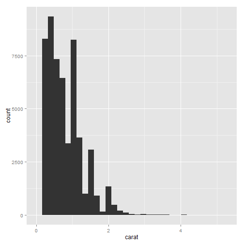 

```r
    
    
#====================================
library(gcookbook) # For the data set
upc <- subset(uspopchange, rank(Change)>40)
upc
```

```
##             State Abb Region Change
## 3         Arizona  AZ   West   24.6
## 6        Colorado  CO   West   16.9
## 10        Florida  FL  South   17.6
## 11        Georgia  GA  South   18.3
## 13          Idaho  ID   West   21.1
## 29         Nevada  NV   West   35.1
## 34 North Carolina  NC  South   18.5
## 41 South Carolina  SC  South   15.3
## 44          Texas  TX  South   20.6
## 45           Utah  UT   West   23.8
```

```r

#          State Abb Region Change
#        Arizona  AZ   West   24.6
#       Colorado  CO   West   16.9
#        Florida  FL  South   17.6
#        Georgia  GA  South   18.3
#          Idaho  ID   West   21.1
#         Nevada  NV   West   35.1
# North Carolina  NC  South   18.5
# South Carolina  SC  South   15.3
#          Texas  TX  South   20.6
#           Utah  UT   West   23.8

    
    
#====================================
ggplot(upc, aes(x=Abb, y=Change, fill=Region)) + geom_bar(stat="identity")
```

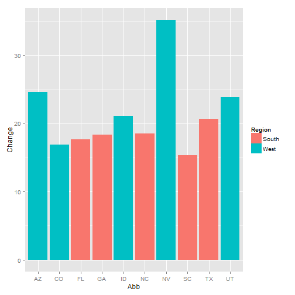 

```r
    
    
#====================================
ggplot(upc, aes(x=reorder(Abb, Change), y=Change, fill=Region)) +
    geom_bar(stat="identity", colour="black") +
    scale_fill_manual(values=c("#669933", "#FFCC66")) +
    xlab("State")
```

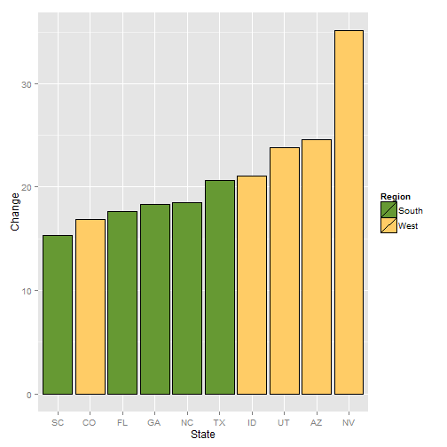 

```r
    
    
#====================================
library(gcookbook) # For the data set
csub <- subset(climate, Source=="Berkeley" & Year >= 1900)
csub$pos <- csub$Anomaly10y >= 0

csub
```

```
##       Source Year Anomaly1y Anomaly5y Anomaly10y Unc10y   pos
## 101 Berkeley 1900        NA        NA     -0.171  0.108 FALSE
## 102 Berkeley 1901        NA        NA     -0.162  0.109 FALSE
## 103 Berkeley 1902        NA        NA     -0.177  0.108 FALSE
## 104 Berkeley 1903        NA        NA     -0.199  0.104 FALSE
## 105 Berkeley 1904        NA        NA     -0.223  0.105 FALSE
## 106 Berkeley 1905        NA        NA     -0.241  0.107 FALSE
## 107 Berkeley 1906        NA        NA     -0.294  0.106 FALSE
## 108 Berkeley 1907        NA        NA     -0.312  0.105 FALSE
## 109 Berkeley 1908        NA        NA     -0.328  0.103 FALSE
## 110 Berkeley 1909        NA        NA     -0.281  0.101 FALSE
## 111 Berkeley 1910        NA        NA     -0.247  0.099 FALSE
## 112 Berkeley 1911        NA        NA     -0.243  0.097 FALSE
## 113 Berkeley 1912        NA        NA     -0.257  0.100 FALSE
## 114 Berkeley 1913        NA        NA     -0.268  0.100 FALSE
## 115 Berkeley 1914        NA        NA     -0.257  0.097 FALSE
## 116 Berkeley 1915        NA        NA     -0.249  0.095 FALSE
## 117 Berkeley 1916        NA        NA     -0.214  0.096 FALSE
## 118 Berkeley 1917        NA        NA     -0.201  0.096 FALSE
## 119 Berkeley 1918        NA        NA     -0.176  0.096 FALSE
## 120 Berkeley 1919        NA        NA     -0.182  0.097 FALSE
## 121 Berkeley 1920        NA        NA     -0.193  0.097 FALSE
## 122 Berkeley 1921        NA        NA     -0.167  0.098 FALSE
## 123 Berkeley 1922        NA        NA     -0.128  0.096 FALSE
## 124 Berkeley 1923        NA        NA     -0.075  0.097 FALSE
## 125 Berkeley 1924        NA        NA     -0.064  0.098 FALSE
## 126 Berkeley 1925        NA        NA     -0.065  0.100 FALSE
## 127 Berkeley 1926        NA        NA     -0.050  0.100 FALSE
## 128 Berkeley 1927        NA        NA     -0.020  0.099 FALSE
## 129 Berkeley 1928        NA        NA     -0.018  0.099 FALSE
## 130 Berkeley 1929        NA        NA     -0.026  0.100 FALSE
## 131 Berkeley 1930        NA        NA     -0.014  0.101 FALSE
## 132 Berkeley 1931        NA        NA     -0.047  0.098 FALSE
## 133 Berkeley 1932        NA        NA     -0.035  0.096 FALSE
## 134 Berkeley 1933        NA        NA     -0.017  0.093 FALSE
## 135 Berkeley 1934        NA        NA      0.020  0.092  TRUE
## 136 Berkeley 1935        NA        NA      0.053  0.089  TRUE
## 137 Berkeley 1936        NA        NA      0.063  0.085  TRUE
## 138 Berkeley 1937        NA        NA      0.048  0.081  TRUE
## 139 Berkeley 1938        NA        NA      0.073  0.079  TRUE
## 140 Berkeley 1939        NA        NA      0.113  0.076  TRUE
## 141 Berkeley 1940        NA        NA      0.113  0.072  TRUE
## 142 Berkeley 1941        NA        NA      0.134  0.071  TRUE
## 143 Berkeley 1942        NA        NA      0.134  0.069  TRUE
## 144 Berkeley 1943        NA        NA      0.127  0.070  TRUE
## 145 Berkeley 1944        NA        NA      0.111  0.068  TRUE
## 146 Berkeley 1945        NA        NA      0.072  0.066  TRUE
## 147 Berkeley 1946        NA        NA      0.035  0.066  TRUE
## 148 Berkeley 1947        NA        NA      0.042  0.064  TRUE
## 149 Berkeley 1948        NA        NA      0.045  0.063  TRUE
## 150 Berkeley 1949        NA        NA      0.013  0.062  TRUE
## 151 Berkeley 1950        NA        NA      0.010  0.058  TRUE
## 152 Berkeley 1951        NA        NA     -0.017  0.054 FALSE
## 153 Berkeley 1952        NA        NA     -0.040  0.047 FALSE
## 154 Berkeley 1953        NA        NA     -0.040  0.043 FALSE
## 155 Berkeley 1954        NA        NA     -0.032  0.038 FALSE
## 156 Berkeley 1955        NA        NA     -0.022  0.035 FALSE
## 157 Berkeley 1956        NA        NA      0.012  0.031  TRUE
## 158 Berkeley 1957        NA        NA      0.007  0.028  TRUE
## 159 Berkeley 1958        NA        NA      0.002  0.027  TRUE
## 160 Berkeley 1959        NA        NA      0.002  0.026  TRUE
## 161 Berkeley 1960        NA        NA     -0.019  0.026 FALSE
## 162 Berkeley 1961        NA        NA     -0.001  0.021 FALSE
## 163 Berkeley 1962        NA        NA      0.017  0.018  TRUE
## 164 Berkeley 1963        NA        NA      0.004  0.016  TRUE
## 165 Berkeley 1964        NA        NA     -0.028  0.018 FALSE
## 166 Berkeley 1965        NA        NA     -0.006  0.017 FALSE
## 167 Berkeley 1966        NA        NA     -0.024  0.017 FALSE
## 168 Berkeley 1967        NA        NA     -0.041  0.019 FALSE
## 169 Berkeley 1968        NA        NA     -0.025  0.020 FALSE
## 170 Berkeley 1969        NA        NA     -0.019  0.024 FALSE
## 171 Berkeley 1970        NA        NA      0.010  0.026  TRUE
## 172 Berkeley 1971        NA        NA      0.007  0.022  TRUE
## 173 Berkeley 1972        NA        NA      0.015  0.015  TRUE
## 174 Berkeley 1973        NA        NA      0.028  0.012  TRUE
## 175 Berkeley 1974        NA        NA      0.049  0.014  TRUE
## 176 Berkeley 1975        NA        NA      0.068  0.012  TRUE
## 177 Berkeley 1976        NA        NA      0.128  0.011  TRUE
## 178 Berkeley 1977        NA        NA      0.158  0.012  TRUE
## 179 Berkeley 1978        NA        NA      0.167  0.013  TRUE
## 180 Berkeley 1979        NA        NA      0.193  0.012  TRUE
## 181 Berkeley 1980        NA        NA      0.186  0.016  TRUE
## 182 Berkeley 1981        NA        NA      0.217  0.016  TRUE
## 183 Berkeley 1982        NA        NA      0.235  0.014  TRUE
## 184 Berkeley 1983        NA        NA      0.270  0.014  TRUE
## 185 Berkeley 1984        NA        NA      0.318  0.014  TRUE
## 186 Berkeley 1985        NA        NA      0.344  0.013  TRUE
## 187 Berkeley 1986        NA        NA      0.352  0.012  TRUE
## 188 Berkeley 1987        NA        NA      0.380  0.011  TRUE
## 189 Berkeley 1988        NA        NA      0.370  0.013  TRUE
## 190 Berkeley 1989        NA        NA      0.366  0.017  TRUE
## 191 Berkeley 1990        NA        NA      0.433  0.019  TRUE
## 192 Berkeley 1991        NA        NA      0.467  0.018  TRUE
## 193 Berkeley 1992        NA        NA      0.496  0.017  TRUE
## 194 Berkeley 1993        NA        NA      0.526  0.019  TRUE
## 195 Berkeley 1994        NA        NA      0.554  0.020  TRUE
## 196 Berkeley 1995        NA        NA      0.563  0.019  TRUE
## 197 Berkeley 1996        NA        NA      0.565  0.022  TRUE
## 198 Berkeley 1997        NA        NA      0.618  0.022  TRUE
## 199 Berkeley 1998        NA        NA      0.680  0.023  TRUE
## 200 Berkeley 1999        NA        NA      0.734  0.025  TRUE
## 201 Berkeley 2000        NA        NA      0.748  0.026  TRUE
## 202 Berkeley 2001        NA        NA      0.793  0.027  TRUE
## 203 Berkeley 2002        NA        NA      0.856  0.028  TRUE
## 204 Berkeley 2003        NA        NA      0.869  0.028  TRUE
## 205 Berkeley 2004        NA        NA      0.884  0.029  TRUE
```

```r

#   Source Year Anomaly1y Anomaly5y Anomaly10y Unc10y
# Berkeley 1900        NA        NA     -0.171  0.108 FALSE
# Berkeley 1901        NA        NA     -0.162  0.109 FALSE
# Berkeley 1902        NA        NA     -0.177  0.108 FALSE
# ...
# Berkeley 2002        NA        NA      0.856  0.028  TRUE
# Berkeley 2003        NA        NA      0.869  0.028  TRUE
# Berkeley 2004        NA        NA      0.884  0.029  TRUE

    
    
#====================================
ggplot(csub, aes(x=Year, y=Anomaly10y, fill=pos)) +
  geom_bar(stat="identity", position="identity")
```

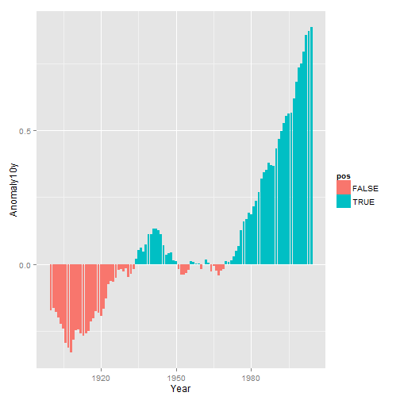 

```r
    
    
#====================================
ggplot(csub, aes(x=Year, y=Anomaly10y, fill=pos)) +
    geom_bar(stat="identity", position="identity", colour="black", size=0.25) +
    scale_fill_manual(values=c("#CCEEFF", "#FFDDDD"), guide=FALSE)
```

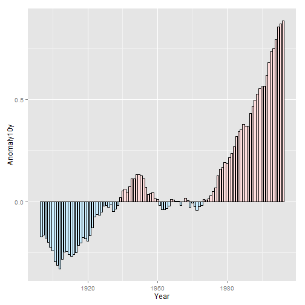 

```r
    
    
#====================================
library(gcookbook) # For the data set

ggplot(pg_mean, aes(x=group, y=weight)) + geom_bar(stat="identity")
```

 

```r
    
    
#====================================
ggplot(pg_mean, aes(x=group, y=weight)) + geom_bar(stat="identity", width=0.5)
```

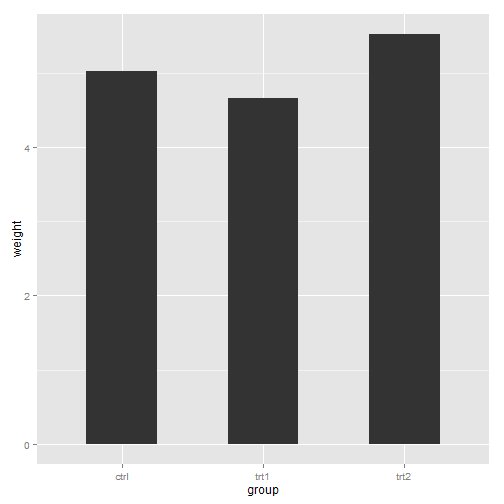 

```r
    
    
#====================================
ggplot(pg_mean, aes(x=group, y=weight)) + geom_bar(stat="identity", width=1)
```

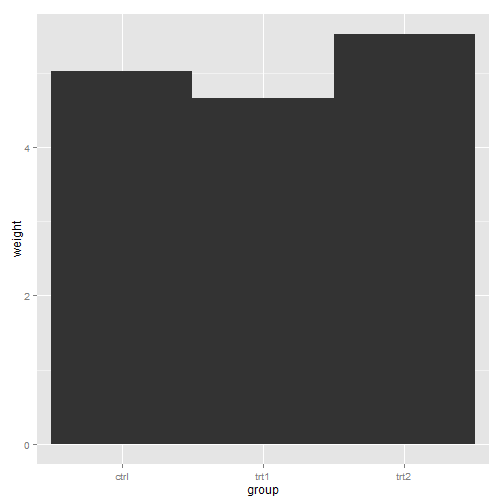 

```r
    
    
#====================================
ggplot(cabbage_exp, aes(x=Date, y=Weight, fill=Cultivar)) +
    geom_bar(stat="identity", width=0.5, position="dodge")
```

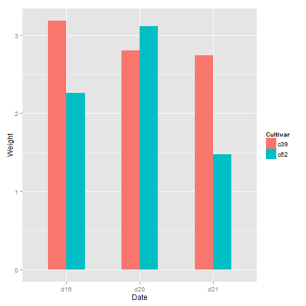 

```r
    
    
#====================================
ggplot(cabbage_exp, aes(x=Date, y=Weight, fill=Cultivar)) +
    geom_bar(stat="identity", width=0.5, position=position_dodge(0.7))
```

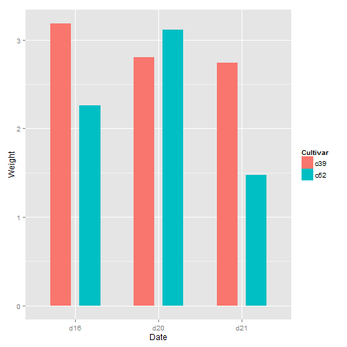 

```r
    
    
#====================================
geom_bar(position="dodge")
```

```
## geom_bar:  
## stat_bin:  
## position_dodge: (width = NULL, height = NULL)
```

```r
geom_bar(width=0.9, position=position_dodge())
```

```
## geom_bar:  
## stat_bin: width = 0.9 
## position_dodge: (width = NULL, height = NULL)
```

```r
geom_bar(position=position_dodge(0.9))
```

```
## geom_bar:  
## stat_bin:  
## position_dodge: (width = 0.9, height = NULL)
```

```r
geom_bar(width=0.9, position=position_dodge(width=0.9))
```

```
## geom_bar:  
## stat_bin: width = 0.9 
## position_dodge: (width = 0.9, height = NULL)
```

```r
    
    
#====================================
library(gcookbook) # For the data set
ggplot(cabbage_exp, aes(x=Date, y=Weight, fill=Cultivar)) +
    geom_bar(stat="identity")
```

 

```r
    
    
#====================================
cabbage_exp
```

```
##   Cultivar Date Weight     sd  n      se
## 1      c39  d16   3.18 0.9566 10 0.30251
## 2      c39  d20   2.80 0.2789 10 0.08819
## 3      c39  d21   2.74 0.9834 10 0.31098
## 4      c52  d16   2.26 0.4452 10 0.14079
## 5      c52  d20   3.11 0.7909 10 0.25009
## 6      c52  d21   1.47 0.2111 10 0.06675
```

```r

# Cultivar Date Weight        sd  n         se
#      c39  d16   3.18 0.9566144 10 0.30250803
#      c39  d20   2.80 0.2788867 10 0.08819171
#      c39  d21   2.74 0.9834181 10 0.31098410
#      c52  d16   2.26 0.4452215 10 0.14079141
#      c52  d20   3.11 0.7908505 10 0.25008887
#      c52  d21   1.47 0.2110819 10 0.06674995

    
    
#====================================
ggplot(cabbage_exp, aes(x=Date, y=Weight, fill=Cultivar)) +
    geom_bar(stat="identity") +
    guides(fill=guide_legend(reverse=TRUE))
```

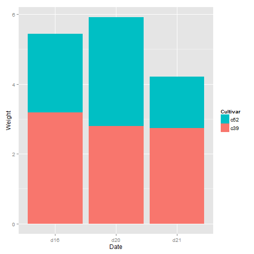 

```r
    
    
#====================================
libary(plyr) # Needed for desc()
```

```
## Error: ����"libary"��������
```

```r
ggplot(cabbage_exp, aes(x=Date, y=Weight, fill=Cultivar, order=desc(Cultivar))) +
    geom_bar(stat="identity")
```

```
## Error: ����"desc"��������
```

```r
    
    
#====================================
ggplot(cabbage_exp, aes(x=Date, y=Weight, fill=Cultivar)) +
    geom_bar(stat="identity", colour="black") +
    guides(fill=guide_legend(reverse=TRUE)) +
    scale_fill_brewer(palette="Pastel1")
```

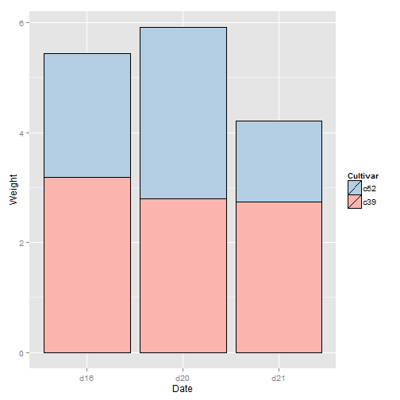 

```r
    
    
#====================================
library(gcookbook) # For the data set
library(plyr)
# Do a group-wise transform(), splitting on "Date"
ce <- ddply(cabbage_exp, "Date", transform,
            percent_weight = Weight / sum(Weight) * 100)

ggplot(ce, aes(x=Date, y=percent_weight, fill=Cultivar)) +
    geom_bar(stat="identity")
```

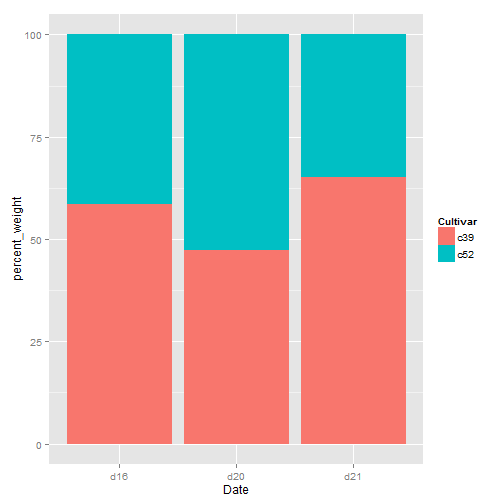 

```r
    
    
#====================================
cabbage_exp
```

```
##   Cultivar Date Weight     sd  n      se
## 1      c39  d16   3.18 0.9566 10 0.30251
## 2      c39  d20   2.80 0.2789 10 0.08819
## 3      c39  d21   2.74 0.9834 10 0.31098
## 4      c52  d16   2.26 0.4452 10 0.14079
## 5      c52  d20   3.11 0.7909 10 0.25009
## 6      c52  d21   1.47 0.2111 10 0.06675
```

```r

# Cultivar Date Weight        sd  n         se
#      c39  d16   3.18 0.9566144 10 0.30250803
#      c39  d20   2.80 0.2788867 10 0.08819171
#      c39  d21   2.74 0.9834181 10 0.31098410
#      c52  d16   2.26 0.4452215 10 0.14079141
#      c52  d20   3.11 0.7908505 10 0.25008887
#      c52  d21   1.47 0.2110819 10 0.06674995

ddply(cabbage_exp, "Date", transform,
      percent_weight = Weight / sum(Weight) * 100)
```

```
##   Cultivar Date Weight     sd  n      se percent_weight
## 1      c39  d16   3.18 0.9566 10 0.30251          58.46
## 2      c52  d16   2.26 0.4452 10 0.14079          41.54
## 3      c39  d20   2.80 0.2789 10 0.08819          47.38
## 4      c52  d20   3.11 0.7909 10 0.25009          52.62
## 5      c39  d21   2.74 0.9834 10 0.31098          65.08
## 6      c52  d21   1.47 0.2111 10 0.06675          34.92
```

```r

# Cultivar Date Weight        sd  n         se percent_weight
#      c39  d16   3.18 0.9566144 10 0.30250803       58.45588
#      c52  d16   2.26 0.4452215 10 0.14079141       41.54412
#      c39  d20   2.80 0.2788867 10 0.08819171       47.37733
#      c52  d20   3.11 0.7908505 10 0.25008887       52.62267
#      c39  d21   2.74 0.9834181 10 0.31098410       65.08314
#      c52  d21   1.47 0.2110819 10 0.06674995       34.91686
    
    
#====================================
ggplot(ce, aes(x=Date, y=percent_weight, fill=Cultivar)) +
    geom_bar(stat="identity", colour="black") +
    guides(fill=guide_legend(reverse=TRUE)) +
    scale_fill_brewer(palette="Pastel1")
```

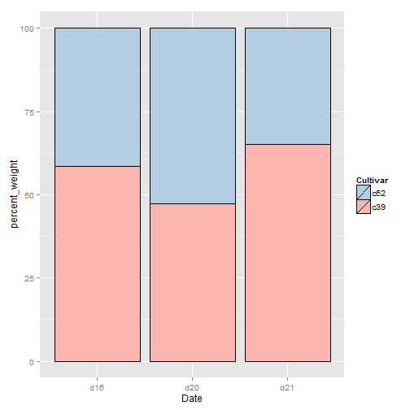 

```r
    
    
#====================================
library(gcookbook) # For the data set

# Below the top
ggplot(cabbage_exp, aes(x=interaction(Date, Cultivar), y=Weight)) +
    geom_bar(stat="identity") +
    geom_text(aes(label=Weight), vjust=1.5, colour="white")
```

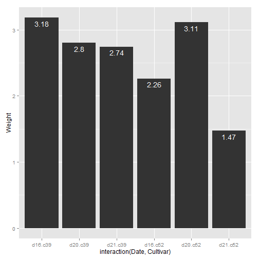 

```r

# Above the top
ggplot(cabbage_exp, aes(x=interaction(Date, Cultivar), y=Weight)) +
    geom_bar(stat="identity") +
    geom_text(aes(label=Weight), vjust=-0.2)
```

 

```r
    
    
#====================================
# Adjust y limits to be a little higher
ggplot(cabbage_exp, aes(x=interaction(Date, Cultivar), y=Weight)) +
    geom_bar(stat="identity") +
    geom_text(aes(label=Weight), vjust=-0.2) +
    ylim(0, max(cabbage_exp$Weight) * 1.05)
```

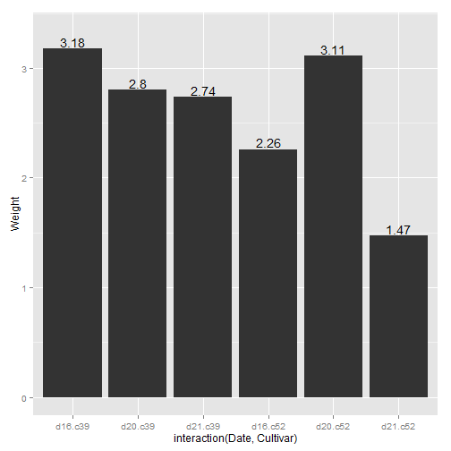 

```r

# Map y positions slightly above bar top - y range of plot will auto-adjust
ggplot(cabbage_exp, aes(x=interaction(Date, Cultivar), y=Weight)) +
    geom_bar(stat="identity") +
    geom_text(aes(y=Weight+0.1, label=Weight))
```

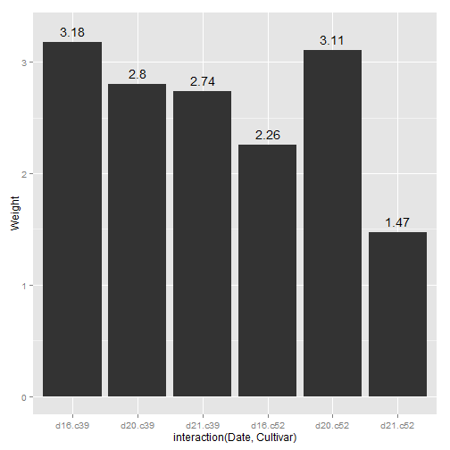 

```r
    
    
#====================================
ggplot(cabbage_exp, aes(x=Date, y=Weight, fill=Cultivar)) +
    geom_bar(stat="identity", position="dodge") +
    geom_text(aes(label=Weight), vjust=1.5, colour="white",
              position=position_dodge(.9), size=3)
```

```
## ymax not defined: adjusting position using y instead
```

 

```r
    
    
#====================================
library(plyr)
# Sort by the day and sex columns
ce <- arrange(cabbage_exp, Date, Cultivar)
    
    
#====================================
# Get the cumulative sum
ce <- ddply(ce, "Date", transform, label_y=cumsum(Weight))
ce
```

```
##   Cultivar Date Weight     sd  n      se label_y
## 1      c39  d16   3.18 0.9566 10 0.30251    3.18
## 2      c52  d16   2.26 0.4452 10 0.14079    5.44
## 3      c39  d20   2.80 0.2789 10 0.08819    2.80
## 4      c52  d20   3.11 0.7909 10 0.25009    5.91
## 5      c39  d21   2.74 0.9834 10 0.31098    2.74
## 6      c52  d21   1.47 0.2111 10 0.06675    4.21
```

```r

# Cultivar Date Weight        sd  n         se label_y
#      c39  d16   3.18 0.9566144 10 0.30250803    3.18
#      c52  d16   2.26 0.4452215 10 0.14079141    5.44
#      c39  d20   2.80 0.2788867 10 0.08819171    2.80
#      c52  d20   3.11 0.7908505 10 0.25008887    5.91
#      c39  d21   2.74 0.9834181 10 0.31098410    2.74
#      c52  d21   1.47 0.2110819 10 0.06674995    4.21

ggplot(ce, aes(x=Date, y=Weight, fill=Cultivar)) +
    geom_bar(stat="identity") +
    geom_text(aes(y=label_y, label=Weight), vjust=1.5, colour="white")
```

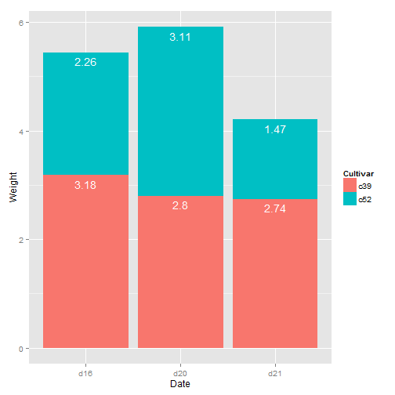 

```r

    
    
#====================================
ce <- arrange(cabbage_exp, Date, Cultivar)

# Calculate y position, placing it in the middle
ce <- ddply(ce, "Date", transform, label_y=cumsum(Weight)-0.5*Weight)

ggplot(ce, aes(x=Date, y=Weight, fill=Cultivar)) +
    geom_bar(stat="identity") +
    geom_text(aes(y=label_y, label=Weight), colour="white")
```

 

```r
    
    
#====================================
ggplot(ce, aes(x=Date, y=Weight, fill=Cultivar)) +
    geom_bar(stat="identity", colour="black") +
    geom_text(aes(y=label_y, label=paste(format(Weight, nsmall=2), "kg")),
              size=4) +
    guides(fill=guide_legend(reverse=TRUE)) +
    scale_fill_brewer(palette="Pastel1")
```

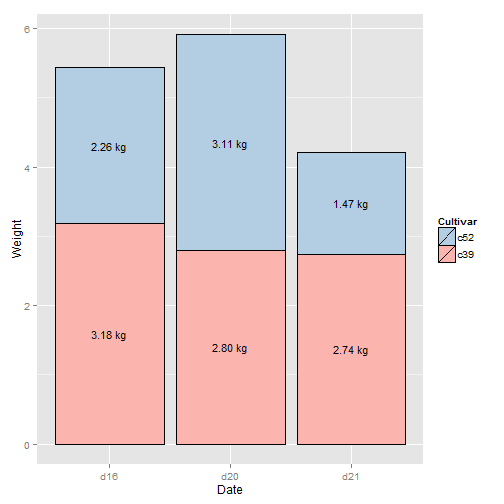 

```r
    
    
#====================================
library(gcookbook) # For the data set
tophit <- tophitters2001[1:25, ] # Take the top 25 from the tophitters data set

ggplot(tophit, aes(x=avg, y=name)) + geom_point()
```

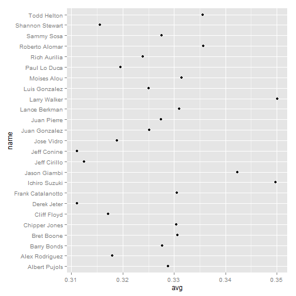 

```r
    
    
#====================================
tophit[, c("name", "lg", "avg")]
```

```
##                 name lg    avg
## 1       Larry Walker NL 0.3501
## 2      Ichiro Suzuki AL 0.3497
## 3       Jason Giambi AL 0.3423
## 4     Roberto Alomar AL 0.3357
## 5        Todd Helton NL 0.3356
## 6        Moises Alou NL 0.3314
## 7      Lance Berkman NL 0.3310
## 8         Bret Boone AL 0.3307
## 9  Frank Catalanotto AL 0.3305
## 10     Chipper Jones NL 0.3304
## 11     Albert Pujols NL 0.3288
## 12       Barry Bonds NL 0.3277
## 13        Sammy Sosa NL 0.3276
## 14       Juan Pierre NL 0.3274
## 15     Juan Gonzalez AL 0.3252
## 16     Luis Gonzalez NL 0.3251
## 17      Rich Aurilia NL 0.3239
## 18      Paul Lo Duca NL 0.3196
## 19        Jose Vidro NL 0.3189
## 20    Alex Rodriguez AL 0.3180
## 21       Cliff Floyd NL 0.3171
## 22   Shannon Stewart AL 0.3156
## 23      Jeff Cirillo NL 0.3125
## 24       Jeff Conine AL 0.3111
## 25       Derek Jeter AL 0.3111
```

```r

#          name lg    avg
#  Larry Walker NL 0.3501
# Ichiro Suzuki AL 0.3497
#  Jason Giambi AL 0.3423
#...
#   Jeff Conine AL 0.3111
#   Derek Jeter AL 0.3111

    
    
#====================================
ggplot(tophit, aes(x=avg, y=reorder(name, avg))) +
    geom_point(size=3) +                        # Use a larger dot
    theme_bw() +
    theme(panel.grid.major.x = element_blank(),
          panel.grid.minor.x = element_blank(),
          panel.grid.major.y = element_line(colour="grey60", linetype="dashed"))
```

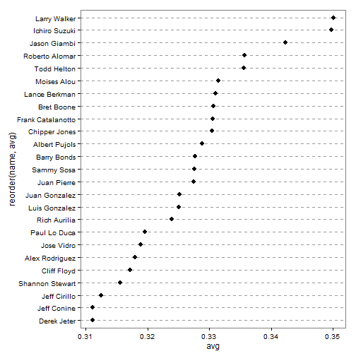 

```r
    
    
#====================================
ggplot(tophit, aes(x=reorder(name, avg), y=avg)) +
    geom_point(size=3) +                        # Use a larger dot
    theme_bw() +
    theme(axis.text.x = element_text(angle=60, hjust=1),
          panel.grid.major.y = element_blank(),
          panel.grid.minor.y = element_blank(),
          panel.grid.major.x = element_line(colour="grey60", linetype="dashed"))
```

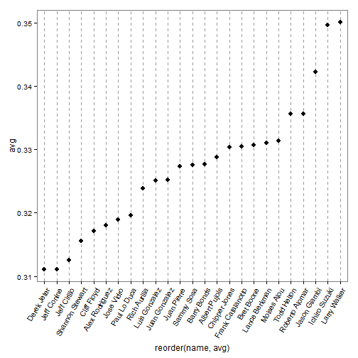 

```r
    
    
#====================================
# Get the names, sorted first by lg, then by avg
nameorder <- tophit$name[order(tophit$lg, tophit$avg)]

# Turn name into a factor, with levels in the order of nameorder
tophit$name <- factor(tophit$name, levels=nameorder)
    
    
#====================================
ggplot(tophit, aes(x=avg, y=name)) +
    geom_segment(aes(yend=name), xend=0, colour="grey50") +
    geom_point(size=3, aes(colour=lg)) +
    scale_colour_brewer(palette="Set1", limits=c("NL","AL")) +
    theme_bw() +
    theme(panel.grid.major.y = element_blank(),   # No horizontal grid lines
          legend.position=c(1, 0.55),             # Put legend inside plot area
          legend.justification=c(1, 0.5))
```

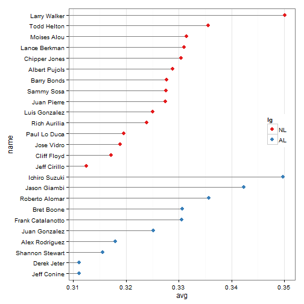 

```r
    
    
#====================================
ggplot(tophit, aes(x=avg, y=name)) +
    geom_segment(aes(yend=name), xend=0, colour="grey50") +
    geom_point(size=3, aes(colour=lg)) +
    scale_colour_brewer(palette="Set1", limits=c("NL","AL"), guide=FALSE) +
    theme_bw() +
    theme(panel.grid.major.y = element_blank()) +
    facet_grid(lg ~ ., scales="free_y", space="free_y")
```

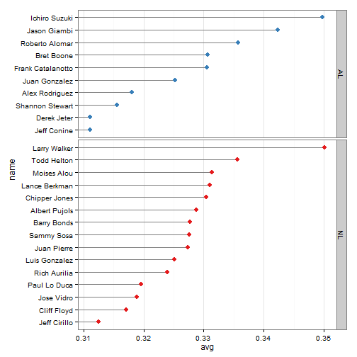 

```r
    
    
#==================
```

