# chapter: Line Graphs
## Making a Basic Line Graph

```r
library(ggplot2)
ggplot(BOD, aes(x = Time, y = demand)) + geom_line()
```

 

```r

BOD
```

```
##   Time demand
## 1    1    8.3
## 2    2   10.3
## 3    3   19.0
## 4    4   16.0
## 5    5   15.6
## 6    7   19.8
```

```r

BOD1 <- BOD  # Make a copy of the data
BOD1$Time <- factor(BOD1$Time)
ggplot(BOD1, aes(x = Time, y = demand, group = 1)) + geom_line()
```

 

```r

# These have the same result
ggplot(BOD, aes(x = Time, y = demand)) + geom_line() + ylim(0, max(BOD$demand))
```

 

```r
ggplot(BOD, aes(x = Time, y = demand)) + geom_line() + expand_limits(y = 0)
```

 

## 4.2.Adding Points to a Line Graph

```r
ggplot(BOD, aes(x = Time, y = demand)) + geom_line() + geom_point()
```

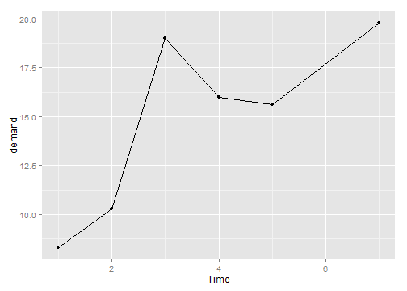 

```r

library(gcookbook)  # For the data set

ggplot(worldpop, aes(x = Year, y = Population)) + geom_line() + geom_point()
```

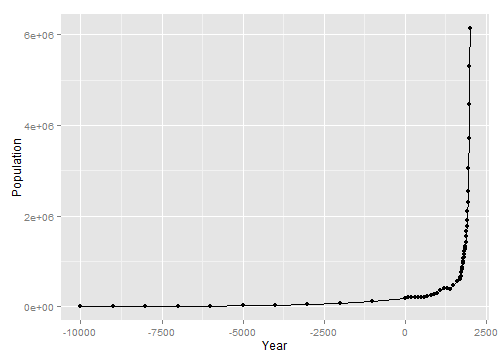 

```r

# Same with a log y-axis
ggplot(worldpop, aes(x = Year, y = Population)) + geom_line() + geom_point() + 
    scale_y_log10()
```

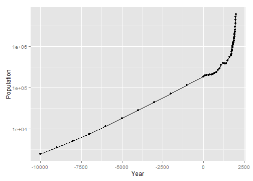 

## 4.3.Making a Line Graph with Multiple Lines

```r
# Load plyr so we can use ddply() to create the example data set
library(plyr)
# Summarize the ToothGrowth data
tg <- ddply(ToothGrowth, c("supp", "dose"), summarise, length=mean(len))

# Map supp to colour
ggplot(tg, aes(x=dose, y=length, colour=supp)) + geom_line()
```

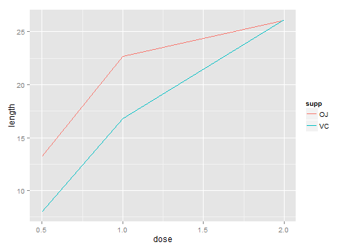 

```r

# Map supp to linetype
ggplot(tg, aes(x=dose, y=length, linetype=supp)) + geom_line()
```

 

```r
    
tg
```

```
##   supp dose length
## 1   OJ  0.5  13.23
## 2   OJ  1.0  22.70
## 3   OJ  2.0  26.06
## 4   VC  0.5   7.98
## 5   VC  1.0  16.77
## 6   VC  2.0  26.14
```

```r

str(tg)
```

```
## 'data.frame':	6 obs. of  3 variables:
##  $ supp  : Factor w/ 2 levels "OJ","VC": 1 1 1 2 2 2
##  $ dose  : num  0.5 1 2 0.5 1 2
##  $ length: num  13.23 22.7 26.06 7.98 16.77 ...
```

```r
    
ggplot(tg, aes(x=factor(dose), y=length, colour=supp, group=supp)) + geom_line()
```

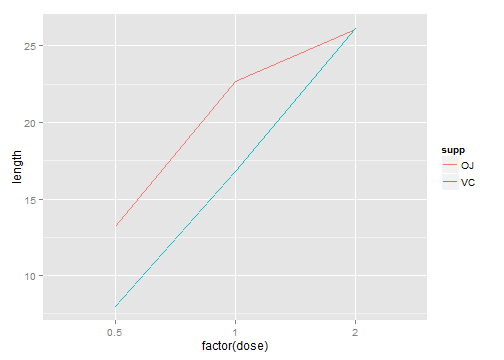 

```r
    
    
ggplot(tg, aes(x=factor(dose), y=length, colour=supp)) + geom_line()
```

```
## geom_path: Each group consist of only one observation. Do you need to adjust the group aesthetic?
```

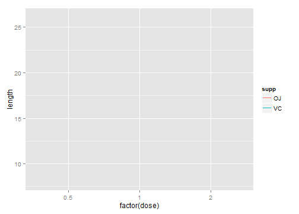 

```r

#  geom_path: Each group consists of only one observation. Do you need to adjust the 
#group aesthetic?

    
    
ggplot(tg, aes(x=dose, y=length)) + geom_line()
```

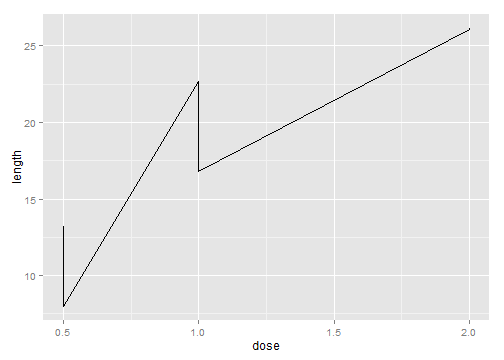 

```r
    
    
ggplot(tg, aes(x=dose, y=length, shape=supp)) + geom_line() +
    geom_point(size=4)           # Make the points a little larger
```

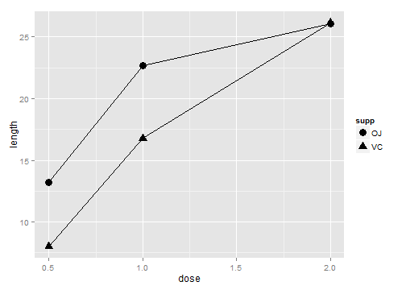 

```r

ggplot(tg, aes(x=dose, y=length, fill=supp)) + geom_line() +
    geom_point(size=4, shape=21) # Also use a point with a color fill
```

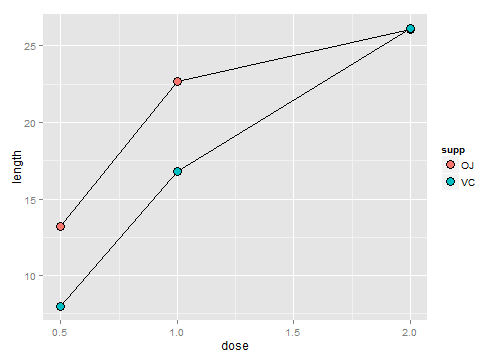 

```r
    
    
ggplot(tg, aes(x=dose, y=length, shape=supp)) +
    geom_line(position=position_dodge(0.2)) +         # Dodge lines by 0.2
    geom_point(position=position_dodge(0.2), size=4)  # Dodge points by 0.2
```

```
## ymax not defined: adjusting position using y instead
## ymax not defined: adjusting position using y instead
```

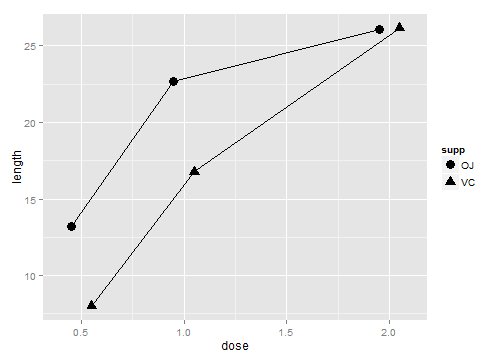 

## 4.4.Changing the Appearance of Lines

```r
ggplot(BOD, aes(x = Time, y = demand)) + geom_line(linetype = "dashed", size = 1, 
    colour = "blue")
```

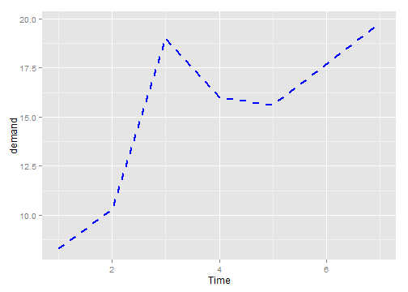 

```r

# Load plyr so we can use ddply() to create the example data set
library(plyr)
# Summarize the ToothGrowth data
tg <- ddply(ToothGrowth, c("supp", "dose"), summarise, length = mean(len))

ggplot(tg, aes(x = dose, y = length, colour = supp)) + geom_line() + scale_colour_brewer(palette = "Set1")
```

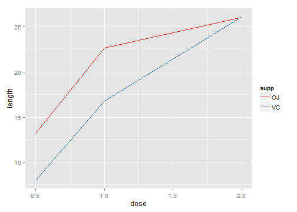 

```r


# If both lines have the same properties, you need to specify a variable to
# use for grouping
ggplot(tg, aes(x = dose, y = length, group = supp)) + geom_line(colour = "darkgreen", 
    size = 1.5)
```

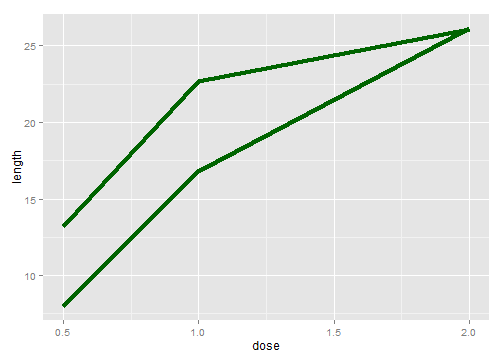 

```r

# Since supp is mapped to colour, it will automatically be used for grouping
ggplot(tg, aes(x = dose, y = length, colour = supp)) + geom_line(linetype = "dashed") + 
    geom_point(shape = 22, size = 3, fill = "white")
```

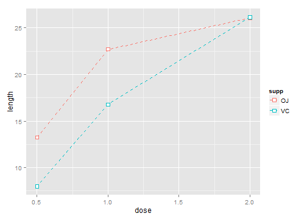 

## 4.5.Changing the Appearance of Points 

```r
ggplot(BOD, aes(x = Time, y = demand)) + geom_line() + geom_point(size = 4, 
    shape = 22, colour = "darkred", fill = "pink")
```

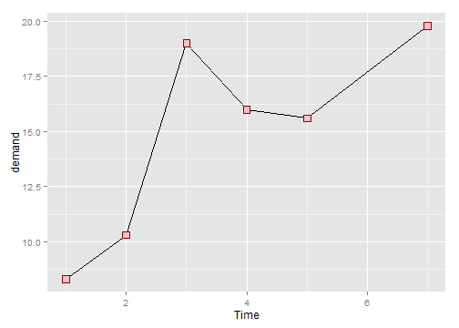 

```r

ggplot(BOD, aes(x = Time, y = demand)) + geom_line() + geom_point(size = 4, 
    shape = 21, fill = "white")
```

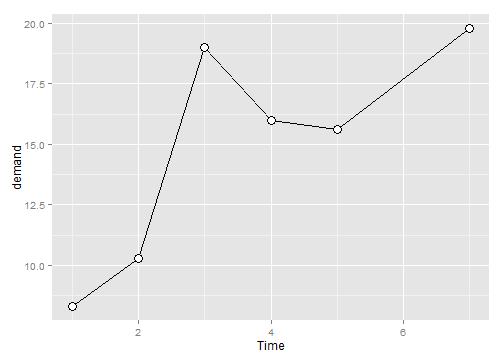 

```r


# Load plyr so we can use ddply() to create the example data set
library(plyr)
# Summarize the ToothGrowth data
tg <- ddply(ToothGrowth, c("supp", "dose"), summarise, length = mean(len))

# Save the position_dodge specification because we'll use it multiple times
pd <- position_dodge(0.2)

ggplot(tg, aes(x = dose, y = length, fill = supp)) + geom_line(position = pd) + 
    geom_point(shape = 21, size = 3, position = pd) + scale_fill_manual(values = c("black", 
    "white"))
```

```
## ymax not defined: adjusting position using y instead
## ymax not defined: adjusting position using y instead
```

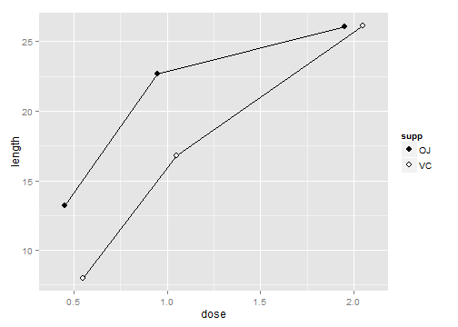 

## 4.6.Making a Graph with a Shaded Area

```r
# Convert the sunspot.year data set into a data frame for this example
sunspotyear <- data.frame(Year = as.numeric(time(sunspot.year)), Sunspots = as.numeric(sunspot.year))

ggplot(sunspotyear, aes(x = Year, y = Sunspots)) + geom_area()
```

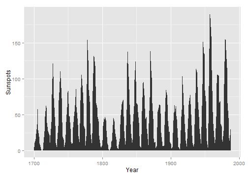 

```r

ggplot(sunspotyear, aes(x = Year, y = Sunspots)) + geom_area(colour = "black", 
    fill = "blue", alpha = 0.2)
```

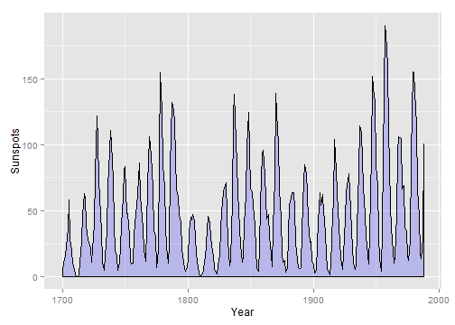 

```r

ggplot(sunspotyear, aes(x = Year, y = Sunspots)) + geom_area(fill = "blue", 
    alpha = 0.2) + geom_line()
```

 

## 4.7.Making a Stacked Area Graph

```r
library(gcookbook)  # For the data set

ggplot(uspopage, aes(x = Year, y = Thousands, fill = AgeGroup)) + geom_area()
```

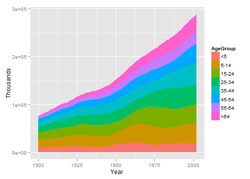 

```r

head(uspopage)
```

```
##   Year AgeGroup Thousands
## 1 1900       <5      9181
## 2 1900     5-14     16966
## 3 1900    15-24     14951
## 4 1900    25-34     12161
## 5 1900    35-44      9273
## 6 1900    45-54      6437
```

```r

ggplot(uspopage, aes(x = Year, y = Thousands, fill = AgeGroup)) + geom_area(colour = "black", 
    size = 0.2, alpha = 0.4) + scale_fill_brewer(palette = "Blues", breaks = rev(levels(uspopage$AgeGroup)))
```

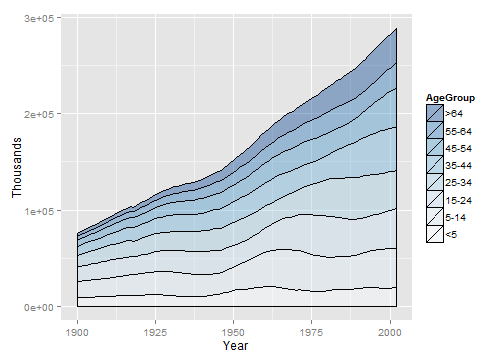 

```r

library(plyr)  # For the desc() function
ggplot(uspopage, aes(x = Year, y = Thousands, fill = AgeGroup, order = desc(AgeGroup))) + 
    geom_area(colour = "black", size = 0.2, alpha = 0.4) + scale_fill_brewer(palette = "Blues")
```

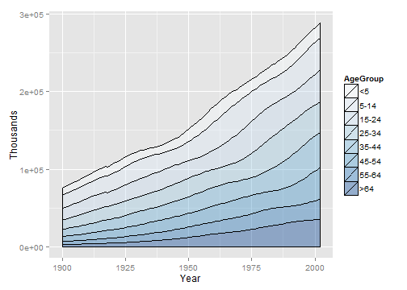 

```r

ggplot(uspopage, aes(x = Year, y = Thousands, fill = AgeGroup, order = desc(AgeGroup))) + 
    geom_area(colour = NA, alpha = 0.4) + scale_fill_brewer(palette = "Blues") + 
    geom_line(position = "stack", size = 0.2)
```

```
## ymax not defined: adjusting position using y instead
```

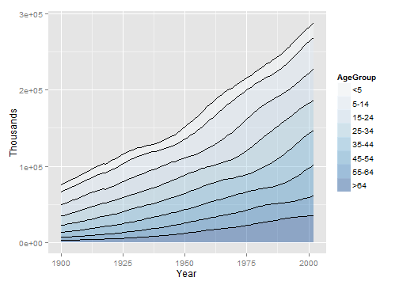 

## 4.8.Making a Proportional Stacked Area Graph    

```r
library(gcookbook)  # For the data set
library(plyr)  # For the ddply() function

# Convert Thousands to Percent
uspopage_prop <- ddply(uspopage, "Year", transform, Percent = Thousands/sum(Thousands) * 
    100)

ggplot(uspopage_prop, aes(x = Year, y = Percent, fill = AgeGroup)) + geom_area(colour = "black", 
    size = 0.2, alpha = 0.4) + scale_fill_brewer(palette = "Blues", breaks = rev(levels(uspopage$AgeGroup)))
```

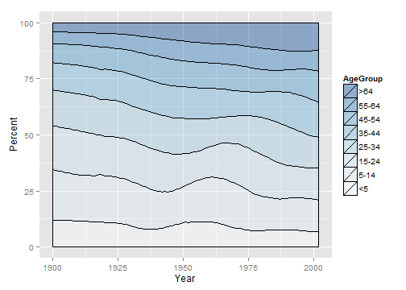 

```r

head(uspopage)
```

```
##   Year AgeGroup Thousands
## 1 1900       <5      9181
## 2 1900     5-14     16966
## 3 1900    15-24     14951
## 4 1900    25-34     12161
## 5 1900    35-44      9273
## 6 1900    45-54      6437
```

```r

uspopage_prop <- ddply(uspopage, "Year", transform, Percent = Thousands/sum(Thousands) * 
    100)
```

## 4.9.Adding a Confidence Region

```r
library(gcookbook)  # For the data set

# Grab a subset of the climate data
clim <- subset(climate, Source == "Berkeley", select = c("Year", "Anomaly10y", 
    "Unc10y"))

head(clim)
```

```
##   Year Anomaly10y Unc10y
## 1 1800     -0.435  0.505
## 2 1801     -0.453  0.493
## 3 1802     -0.460  0.486
## 4 1803     -0.493  0.489
## 5 1804     -0.536  0.483
## 6 1805     -0.541  0.475
```

```r

# Shaded region
ggplot(clim, aes(x = Year, y = Anomaly10y)) + geom_ribbon(aes(ymin = Anomaly10y - 
    Unc10y, ymax = Anomaly10y + Unc10y), alpha = 0.2) + geom_line()
```

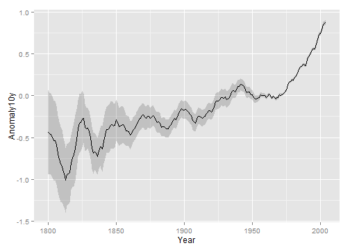 

```r

# With a dotted line for upper and lower bounds
ggplot(clim, aes(x = Year, y = Anomaly10y)) + geom_line(aes(y = Anomaly10y - 
    Unc10y), colour = "grey50", linetype = "dotted") + geom_line(aes(y = Anomaly10y + 
    Unc10y), colour = "grey50", linetype = "dotted") + geom_line()
```

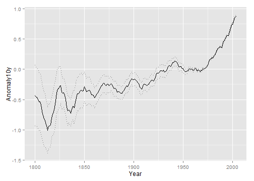 

