chapter: Scatter Plots

```r
#==================
library(gcookbook) # For the data set
library(ggplot2)

# List the two columns we'll use
heightweight[, c("ageYear", "heightIn")]
```

```
##     ageYear heightIn
## 1     11.92     56.3
## 2     12.92     62.3
## 3     12.75     63.3
## 4     13.42     59.0
## 5     15.92     62.5
## 6     14.25     62.5
## 7     15.42     59.0
## 8     11.83     56.5
## 9     13.33     62.0
## 10    11.67     53.8
## 11    11.58     61.5
## 12    14.83     61.5
## 13    13.08     64.5
## 14    12.42     58.3
## 15    11.92     51.3
## 16    12.08     58.8
## 17    15.92     65.3
## 18    12.50     59.5
## 19    12.25     61.3
## 20    15.00     63.3
## 21    11.75     61.8
## 22    11.67     53.5
## 23    13.67     58.0
## 24    14.67     61.3
## 25    15.42     63.3
## 26    13.83     61.5
## 27    14.58     60.8
## 28    15.00     59.0
## 29    17.50     65.5
## 30    12.17     56.3
## 31    14.17     64.3
## 32    13.50     58.0
## 33    12.42     64.3
## 34    11.58     57.5
## 35    15.50     57.8
## 36    16.42     61.5
## 37    14.08     62.3
## 38    14.75     61.8
## 39    15.42     65.3
## 40    15.17     58.3
## 41    14.42     62.8
## 42    13.83     59.3
## 43    14.00     61.5
## 44    14.08     62.0
## 45    12.50     61.3
## 46    15.33     62.3
## 47    11.58     52.8
## 48    12.25     59.8
## 49    12.00     59.5
## 50    14.75     61.3
## 51    14.83     63.5
## 52    16.42     64.8
## 53    12.17     60.0
## 54    12.08     59.0
## 55    12.25     55.8
## 56    12.08     57.8
## 57    12.92     61.3
## 58    13.92     62.3
## 59    15.25     64.3
## 60    11.92     55.5
## 61    15.25     64.5
## 62    15.42     60.0
## 63    12.33     56.3
## 64    12.25     58.3
## 65    12.83     60.0
## 66    13.00     54.5
## 67    12.00     55.8
## 68    12.83     62.8
## 69    12.67     60.5
## 70    15.92     63.3
## 71    15.83     66.8
## 72    11.67     60.0
## 73    12.33     60.5
## 74    15.75     64.3
## 75    11.92     58.3
## 76    14.83     66.5
## 77    13.67     65.3
## 78    13.08     60.5
## 79    12.25     59.5
## 80    12.33     59.0
## 81    14.75     61.3
## 82    14.25     61.5
## 83    14.33     64.8
## 84    15.83     56.8
## 85    15.25     66.5
## 86    11.92     61.5
## 87    14.92     63.0
## 88    15.50     57.0
## 89    15.17     65.5
## 90    15.17     62.0
## 91    11.83     56.0
## 92    13.75     61.3
## 93    13.75     55.5
## 94    12.83     61.0
## 95    12.50     54.5
## 96    12.92     66.0
## 97    13.58     56.5
## 98    11.75     56.0
## 99    12.25     51.5
## 100   17.50     62.0
## 101   14.25     63.0
## 102   13.92     61.0
## 103   15.17     64.0
## 104   12.00     61.0
## 105   16.08     59.8
## 106   11.75     61.3
## 107   13.67     63.3
## 108   15.50     63.5
## 109   14.08     61.5
## 110   14.58     60.3
## 111   15.00     61.3
## 112   13.75     64.8
## 113   13.08     60.5
## 114   12.00     57.3
## 115   12.50     59.5
## 116   12.50     60.8
## 117   11.58     60.5
## 118   15.75     67.0
## 119   15.25     64.8
## 120   12.25     50.5
## 121   12.17     57.5
## 122   13.33     60.5
## 123   13.00     61.8
## 124   14.42     61.3
## 125   12.58     66.3
## 126   11.75     53.3
## 127   12.50     59.0
## 128   13.67     57.8
## 129   12.75     60.0
## 130   17.17     68.3
## 132   14.67     63.8
## 133   14.67     65.0
## 134   11.67     59.5
## 135   15.42     66.0
## 136   15.00     61.8
## 137   12.17     57.3
## 138   15.25     66.0
## 139   11.67     56.5
## 140   12.58     58.3
## 141   12.58     61.0
## 142   12.00     62.8
## 143   13.33     59.3
## 144   14.83     67.3
## 145   16.08     66.3
## 146   13.50     64.5
## 147   13.67     60.5
## 148   15.50     66.0
## 149   11.92     57.5
## 150   14.58     64.0
## 151   14.58     68.0
## 152   14.58     63.5
## 153   14.42     69.0
## 154   14.17     63.8
## 155   14.50     66.0
## 156   13.67     63.5
## 157   12.00     59.5
## 158   13.00     66.3
## 159   12.42     57.0
## 160   12.00     60.0
## 161   12.25     57.0
## 162   15.67     67.3
## 163   14.08     62.0
## 164   14.33     65.0
## 165   12.50     59.5
## 166   16.08     67.8
## 167   13.08     58.0
## 168   14.00     60.0
## 169   11.67     58.5
## 170   13.00     58.3
## 171   13.00     61.5
## 172   13.17     65.0
## 173   15.33     66.5
## 174   13.00     68.5
## 175   12.00     57.0
## 176   14.67     61.5
## 177   14.00     66.5
## 178   12.42     52.5
## 179   11.83     55.0
## 180   15.67     71.0
## 181   16.92     66.5
## 182   11.83     58.8
## 183   15.75     66.3
## 184   15.67     65.8
## 185   16.67     71.0
## 186   12.67     59.5
## 187   14.50     69.8
## 188   13.83     62.5
## 189   12.08     56.5
## 190   11.92     57.5
## 191   13.58     65.3
## 192   13.83     67.3
## 193   15.17     67.0
## 194   14.42     66.0
## 195   12.92     61.8
## 196   13.50     60.0
## 197   14.75     63.0
## 198   14.75     60.5
## 199   14.58     65.5
## 200   13.83     62.0
## 201   12.50     59.0
## 202   12.50     61.8
## 203   15.67     63.3
## 204   13.58     66.0
## 205   14.25     61.8
## 206   13.50     63.0
## 207   11.75     57.5
## 208   14.50     63.0
## 209   11.83     56.0
## 210   12.33     60.5
## 211   11.67     56.8
## 212   13.33     64.0
## 213   12.00     60.0
## 214   17.17     69.5
## 215   13.25     63.3
## 216   12.42     56.3
## 217   16.08     72.0
## 218   16.17     65.3
## 219   12.67     60.8
## 220   12.17     55.0
## 221   11.58     55.0
## 222   15.50     66.5
## 223   13.42     56.8
## 224   12.75     64.8
## 225   16.33     64.5
## 226   13.67     58.0
## 227   13.25     62.8
## 228   14.83     63.8
## 229   12.75     57.8
## 230   12.92     57.3
## 231   14.83     63.5
## 232   11.83     55.0
## 233   13.67     66.5
## 234   15.75     65.0
## 235   13.67     61.5
## 236   13.92     62.0
## 237   12.58     59.3
```

```r

    
#====================================
ggplot(heightweight, aes(x=ageYear, y=heightIn)) + geom_point()
```

 

```r
    
    
#====================================
ggplot(heightweight, aes(x=ageYear, y=heightIn)) + geom_point(shape=21)
```

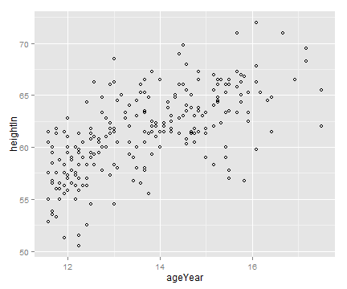 

```r
    
    
#====================================
ggplot(heightweight, aes(x=ageYear, y=heightIn)) + geom_point(size=1.5)
```

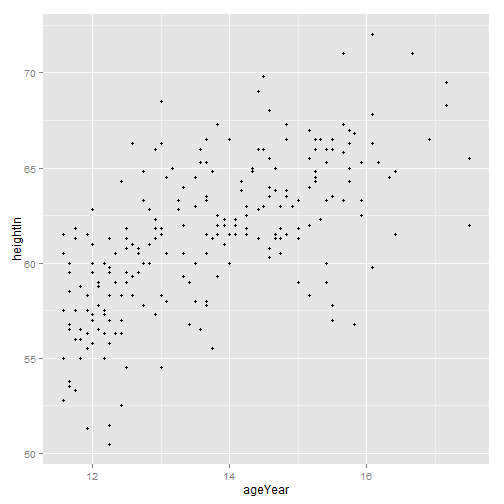 

```r
    
    
#====================================
library(gcookbook) # For the data set
# Show the three columns we'll use
heightweight[, c("sex", "ageYear", "heightIn")]
```

```
##     sex ageYear heightIn
## 1     f   11.92     56.3
## 2     f   12.92     62.3
## 3     f   12.75     63.3
## 4     f   13.42     59.0
## 5     f   15.92     62.5
## 6     f   14.25     62.5
## 7     f   15.42     59.0
## 8     f   11.83     56.5
## 9     f   13.33     62.0
## 10    f   11.67     53.8
## 11    f   11.58     61.5
## 12    f   14.83     61.5
## 13    f   13.08     64.5
## 14    f   12.42     58.3
## 15    f   11.92     51.3
## 16    f   12.08     58.8
## 17    f   15.92     65.3
## 18    f   12.50     59.5
## 19    f   12.25     61.3
## 20    f   15.00     63.3
## 21    f   11.75     61.8
## 22    f   11.67     53.5
## 23    f   13.67     58.0
## 24    f   14.67     61.3
## 25    f   15.42     63.3
## 26    f   13.83     61.5
## 27    f   14.58     60.8
## 28    f   15.00     59.0
## 29    f   17.50     65.5
## 30    f   12.17     56.3
## 31    f   14.17     64.3
## 32    f   13.50     58.0
## 33    f   12.42     64.3
## 34    f   11.58     57.5
## 35    f   15.50     57.8
## 36    f   16.42     61.5
## 37    f   14.08     62.3
## 38    f   14.75     61.8
## 39    f   15.42     65.3
## 40    f   15.17     58.3
## 41    f   14.42     62.8
## 42    f   13.83     59.3
## 43    f   14.00     61.5
## 44    f   14.08     62.0
## 45    f   12.50     61.3
## 46    f   15.33     62.3
## 47    f   11.58     52.8
## 48    f   12.25     59.8
## 49    f   12.00     59.5
## 50    f   14.75     61.3
## 51    f   14.83     63.5
## 52    f   16.42     64.8
## 53    f   12.17     60.0
## 54    f   12.08     59.0
## 55    f   12.25     55.8
## 56    f   12.08     57.8
## 57    f   12.92     61.3
## 58    f   13.92     62.3
## 59    f   15.25     64.3
## 60    f   11.92     55.5
## 61    f   15.25     64.5
## 62    f   15.42     60.0
## 63    f   12.33     56.3
## 64    f   12.25     58.3
## 65    f   12.83     60.0
## 66    f   13.00     54.5
## 67    f   12.00     55.8
## 68    f   12.83     62.8
## 69    f   12.67     60.5
## 70    f   15.92     63.3
## 71    f   15.83     66.8
## 72    f   11.67     60.0
## 73    f   12.33     60.5
## 74    f   15.75     64.3
## 75    f   11.92     58.3
## 76    f   14.83     66.5
## 77    f   13.67     65.3
## 78    f   13.08     60.5
## 79    f   12.25     59.5
## 80    f   12.33     59.0
## 81    f   14.75     61.3
## 82    f   14.25     61.5
## 83    f   14.33     64.8
## 84    f   15.83     56.8
## 85    f   15.25     66.5
## 86    f   11.92     61.5
## 87    f   14.92     63.0
## 88    f   15.50     57.0
## 89    f   15.17     65.5
## 90    f   15.17     62.0
## 91    f   11.83     56.0
## 92    f   13.75     61.3
## 93    f   13.75     55.5
## 94    f   12.83     61.0
## 95    f   12.50     54.5
## 96    f   12.92     66.0
## 97    f   13.58     56.5
## 98    f   11.75     56.0
## 99    f   12.25     51.5
## 100   f   17.50     62.0
## 101   f   14.25     63.0
## 102   f   13.92     61.0
## 103   f   15.17     64.0
## 104   f   12.00     61.0
## 105   f   16.08     59.8
## 106   f   11.75     61.3
## 107   f   13.67     63.3
## 108   f   15.50     63.5
## 109   f   14.08     61.5
## 110   f   14.58     60.3
## 111   f   15.00     61.3
## 112   m   13.75     64.8
## 113   m   13.08     60.5
## 114   m   12.00     57.3
## 115   m   12.50     59.5
## 116   m   12.50     60.8
## 117   m   11.58     60.5
## 118   m   15.75     67.0
## 119   m   15.25     64.8
## 120   m   12.25     50.5
## 121   m   12.17     57.5
## 122   m   13.33     60.5
## 123   m   13.00     61.8
## 124   m   14.42     61.3
## 125   m   12.58     66.3
## 126   m   11.75     53.3
## 127   m   12.50     59.0
## 128   m   13.67     57.8
## 129   m   12.75     60.0
## 130   m   17.17     68.3
## 132   m   14.67     63.8
## 133   m   14.67     65.0
## 134   m   11.67     59.5
## 135   m   15.42     66.0
## 136   m   15.00     61.8
## 137   m   12.17     57.3
## 138   m   15.25     66.0
## 139   m   11.67     56.5
## 140   m   12.58     58.3
## 141   m   12.58     61.0
## 142   m   12.00     62.8
## 143   m   13.33     59.3
## 144   m   14.83     67.3
## 145   m   16.08     66.3
## 146   m   13.50     64.5
## 147   m   13.67     60.5
## 148   m   15.50     66.0
## 149   m   11.92     57.5
## 150   m   14.58     64.0
## 151   m   14.58     68.0
## 152   m   14.58     63.5
## 153   m   14.42     69.0
## 154   m   14.17     63.8
## 155   m   14.50     66.0
## 156   m   13.67     63.5
## 157   m   12.00     59.5
## 158   m   13.00     66.3
## 159   m   12.42     57.0
## 160   m   12.00     60.0
## 161   m   12.25     57.0
## 162   m   15.67     67.3
## 163   m   14.08     62.0
## 164   m   14.33     65.0
## 165   m   12.50     59.5
## 166   m   16.08     67.8
## 167   m   13.08     58.0
## 168   m   14.00     60.0
## 169   m   11.67     58.5
## 170   m   13.00     58.3
## 171   m   13.00     61.5
## 172   m   13.17     65.0
## 173   m   15.33     66.5
## 174   m   13.00     68.5
## 175   m   12.00     57.0
## 176   m   14.67     61.5
## 177   m   14.00     66.5
## 178   m   12.42     52.5
## 179   m   11.83     55.0
## 180   m   15.67     71.0
## 181   m   16.92     66.5
## 182   m   11.83     58.8
## 183   m   15.75     66.3
## 184   m   15.67     65.8
## 185   m   16.67     71.0
## 186   m   12.67     59.5
## 187   m   14.50     69.8
## 188   m   13.83     62.5
## 189   m   12.08     56.5
## 190   m   11.92     57.5
## 191   m   13.58     65.3
## 192   m   13.83     67.3
## 193   m   15.17     67.0
## 194   m   14.42     66.0
## 195   m   12.92     61.8
## 196   m   13.50     60.0
## 197   m   14.75     63.0
## 198   m   14.75     60.5
## 199   m   14.58     65.5
## 200   m   13.83     62.0
## 201   m   12.50     59.0
## 202   m   12.50     61.8
## 203   m   15.67     63.3
## 204   m   13.58     66.0
## 205   m   14.25     61.8
## 206   m   13.50     63.0
## 207   m   11.75     57.5
## 208   m   14.50     63.0
## 209   m   11.83     56.0
## 210   m   12.33     60.5
## 211   m   11.67     56.8
## 212   m   13.33     64.0
## 213   m   12.00     60.0
## 214   m   17.17     69.5
## 215   m   13.25     63.3
## 216   m   12.42     56.3
## 217   m   16.08     72.0
## 218   m   16.17     65.3
## 219   m   12.67     60.8
## 220   m   12.17     55.0
## 221   m   11.58     55.0
## 222   m   15.50     66.5
## 223   m   13.42     56.8
## 224   m   12.75     64.8
## 225   m   16.33     64.5
## 226   m   13.67     58.0
## 227   m   13.25     62.8
## 228   m   14.83     63.8
## 229   m   12.75     57.8
## 230   m   12.92     57.3
## 231   m   14.83     63.5
## 232   m   11.83     55.0
## 233   m   13.67     66.5
## 234   m   15.75     65.0
## 235   m   13.67     61.5
## 236   m   13.92     62.0
## 237   m   12.58     59.3
```

```r

#====================================
ggplot(heightweight, aes(x=ageYear, y=heightIn, colour=sex)) + geom_point()
```

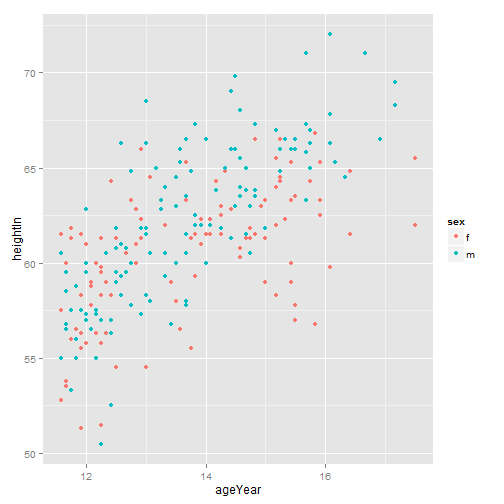 

```r

ggplot(heightweight, aes(x=ageYear, y=heightIn, shape=sex)) + geom_point()
```

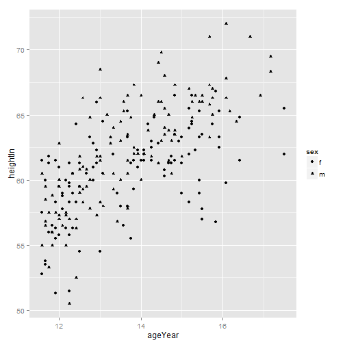 

```r
    
    
#====================================
ggplot(heightweight, aes(x=ageYear, y=heightIn, shape=sex, colour=sex)) +
    geom_point()
```

 

```r
    
    
#====================================
ggplot(heightweight, aes(x=ageYear, y=heightIn, shape=sex, colour=sex)) +
    geom_point() +
    scale_shape_manual(values=c(1,2)) +
    scale_colour_brewer(palette="Set1")
```

 

```r
    
    
#====================================
library(gcookbook) # For the data set

ggplot(heightweight, aes(x=ageYear, y=heightIn)) + geom_point(shape=3)
```

 

```r
    
    
#====================================
# Use slightly larger points and use a shape scale with custom values
ggplot(heightweight, aes(x=ageYear, y=heightIn, shape=sex)) +
    geom_point(size=3) + scale_shape_manual(values=c(1, 4))
```

 

```r
    
    
#====================================
# Make a copy of the data
hw <- heightweight
# Categorize into <100 and >=100 groups
hw$weightGroup <- cut(hw$weightLb, breaks=c(-Inf, 100, Inf),
                      labels=c("< 100", ">= 100"))

# Use shapes with fill and color, and use colors that are empty (NA) and 
# filled
ggplot(hw, aes(x=ageYear, y=heightIn, shape=sex, fill=weightGroup)) +
    geom_point(size=2.5) +
    scale_shape_manual(values=c(21, 24)) +
    scale_fill_manual(values=c(NA, "black"),
      guide=guide_legend(override.aes=list(shape=21)))
```

 

```r
    
    
#====================================
library(gcookbook) # For the data set

# List the four columns we'll use
heightweight[, c("sex", "ageYear", "heightIn", "weightLb")]
```

```
##     sex ageYear heightIn weightLb
## 1     f   11.92     56.3     85.0
## 2     f   12.92     62.3    105.0
## 3     f   12.75     63.3    108.0
## 4     f   13.42     59.0     92.0
## 5     f   15.92     62.5    112.5
## 6     f   14.25     62.5    112.0
## 7     f   15.42     59.0    104.0
## 8     f   11.83     56.5     69.0
## 9     f   13.33     62.0     94.5
## 10    f   11.67     53.8     68.5
## 11    f   11.58     61.5    104.0
## 12    f   14.83     61.5    103.5
## 13    f   13.08     64.5    123.5
## 14    f   12.42     58.3     93.0
## 15    f   11.92     51.3     50.5
## 16    f   12.08     58.8     89.0
## 17    f   15.92     65.3    107.0
## 18    f   12.50     59.5     78.5
## 19    f   12.25     61.3    115.0
## 20    f   15.00     63.3    114.0
## 21    f   11.75     61.8     85.0
## 22    f   11.67     53.5     81.0
## 23    f   13.67     58.0     83.5
## 24    f   14.67     61.3    112.0
## 25    f   15.42     63.3    101.0
## 26    f   13.83     61.5    103.5
## 27    f   14.58     60.8     93.5
## 28    f   15.00     59.0    112.0
## 29    f   17.50     65.5    140.0
## 30    f   12.17     56.3     83.5
## 31    f   14.17     64.3     90.0
## 32    f   13.50     58.0     84.0
## 33    f   12.42     64.3    110.5
## 34    f   11.58     57.5     96.0
## 35    f   15.50     57.8     95.0
## 36    f   16.42     61.5    121.0
## 37    f   14.08     62.3     99.5
## 38    f   14.75     61.8    142.5
## 39    f   15.42     65.3    118.0
## 40    f   15.17     58.3    104.5
## 41    f   14.42     62.8    102.5
## 42    f   13.83     59.3     89.5
## 43    f   14.00     61.5     95.0
## 44    f   14.08     62.0     98.5
## 45    f   12.50     61.3     94.0
## 46    f   15.33     62.3    108.0
## 47    f   11.58     52.8     63.5
## 48    f   12.25     59.8     84.5
## 49    f   12.00     59.5     93.5
## 50    f   14.75     61.3    112.0
## 51    f   14.83     63.5    148.5
## 52    f   16.42     64.8    112.0
## 53    f   12.17     60.0    109.0
## 54    f   12.08     59.0     91.5
## 55    f   12.25     55.8     75.0
## 56    f   12.08     57.8     84.0
## 57    f   12.92     61.3    107.0
## 58    f   13.92     62.3     92.5
## 59    f   15.25     64.3    109.5
## 60    f   11.92     55.5     84.0
## 61    f   15.25     64.5    102.5
## 62    f   15.42     60.0    106.0
## 63    f   12.33     56.3     77.0
## 64    f   12.25     58.3    111.5
## 65    f   12.83     60.0    114.0
## 66    f   13.00     54.5     75.0
## 67    f   12.00     55.8     73.5
## 68    f   12.83     62.8     93.5
## 69    f   12.67     60.5    105.0
## 70    f   15.92     63.3    113.5
## 71    f   15.83     66.8    140.0
## 72    f   11.67     60.0     77.0
## 73    f   12.33     60.5     84.5
## 74    f   15.75     64.3    113.5
## 75    f   11.92     58.3     77.5
## 76    f   14.83     66.5    117.5
## 77    f   13.67     65.3     98.0
## 78    f   13.08     60.5    112.0
## 79    f   12.25     59.5    101.0
## 80    f   12.33     59.0     95.0
## 81    f   14.75     61.3     81.0
## 82    f   14.25     61.5     91.0
## 83    f   14.33     64.8    142.0
## 84    f   15.83     56.8     98.5
## 85    f   15.25     66.5    112.0
## 86    f   11.92     61.5    116.5
## 87    f   14.92     63.0     98.5
## 88    f   15.50     57.0     83.5
## 89    f   15.17     65.5    133.0
## 90    f   15.17     62.0     91.5
## 91    f   11.83     56.0     72.5
## 92    f   13.75     61.3    106.5
## 93    f   13.75     55.5     67.0
## 94    f   12.83     61.0    122.5
## 95    f   12.50     54.5     74.0
## 96    f   12.92     66.0    144.5
## 97    f   13.58     56.5     84.0
## 98    f   11.75     56.0     72.5
## 99    f   12.25     51.5     64.0
## 100   f   17.50     62.0    116.0
## 101   f   14.25     63.0     84.0
## 102   f   13.92     61.0     93.5
## 103   f   15.17     64.0    111.5
## 104   f   12.00     61.0     92.0
## 105   f   16.08     59.8    115.0
## 106   f   11.75     61.3     85.0
## 107   f   13.67     63.3    108.0
## 108   f   15.50     63.5    108.0
## 109   f   14.08     61.5     85.0
## 110   f   14.58     60.3     86.0
## 111   f   15.00     61.3    110.5
## 112   m   13.75     64.8     98.0
## 113   m   13.08     60.5    105.0
## 114   m   12.00     57.3     76.5
## 115   m   12.50     59.5     84.0
## 116   m   12.50     60.8    128.0
## 117   m   11.58     60.5     87.0
## 118   m   15.75     67.0    128.0
## 119   m   15.25     64.8    111.0
## 120   m   12.25     50.5     79.0
## 121   m   12.17     57.5     90.0
## 122   m   13.33     60.5     84.0
## 123   m   13.00     61.8    112.0
## 124   m   14.42     61.3     93.0
## 125   m   12.58     66.3    117.0
## 126   m   11.75     53.3     84.0
## 127   m   12.50     59.0     99.5
## 128   m   13.67     57.8     95.0
## 129   m   12.75     60.0     84.0
## 130   m   17.17     68.3    134.0
## 132   m   14.67     63.8     98.5
## 133   m   14.67     65.0    118.5
## 134   m   11.67     59.5     94.5
## 135   m   15.42     66.0    105.0
## 136   m   15.00     61.8    104.0
## 137   m   12.17     57.3     83.0
## 138   m   15.25     66.0    105.5
## 139   m   11.67     56.5     84.0
## 140   m   12.58     58.3     86.0
## 141   m   12.58     61.0     81.0
## 142   m   12.00     62.8     94.0
## 143   m   13.33     59.3     78.5
## 144   m   14.83     67.3    119.5
## 145   m   16.08     66.3    133.0
## 146   m   13.50     64.5    119.0
## 147   m   13.67     60.5     95.0
## 148   m   15.50     66.0    112.0
## 149   m   11.92     57.5     75.0
## 150   m   14.58     64.0     92.0
## 151   m   14.58     68.0    112.0
## 152   m   14.58     63.5     98.5
## 153   m   14.42     69.0    112.5
## 154   m   14.17     63.8    112.5
## 155   m   14.50     66.0    108.0
## 156   m   13.67     63.5    108.0
## 157   m   12.00     59.5     88.0
## 158   m   13.00     66.3    106.0
## 159   m   12.42     57.0     92.0
## 160   m   12.00     60.0    117.5
## 161   m   12.25     57.0     84.0
## 162   m   15.67     67.3    112.0
## 163   m   14.08     62.0    100.0
## 164   m   14.33     65.0    112.0
## 165   m   12.50     59.5     84.0
## 166   m   16.08     67.8    127.5
## 167   m   13.08     58.0     80.5
## 168   m   14.00     60.0     93.5
## 169   m   11.67     58.5     86.5
## 170   m   13.00     58.3     92.5
## 171   m   13.00     61.5    108.5
## 172   m   13.17     65.0    121.0
## 173   m   15.33     66.5    112.0
## 174   m   13.00     68.5    114.0
## 175   m   12.00     57.0     84.0
## 176   m   14.67     61.5     81.0
## 177   m   14.00     66.5    111.5
## 178   m   12.42     52.5     81.0
## 179   m   11.83     55.0     70.0
## 180   m   15.67     71.0    140.0
## 181   m   16.92     66.5    117.0
## 182   m   11.83     58.8     84.0
## 183   m   15.75     66.3    112.0
## 184   m   15.67     65.8    150.5
## 185   m   16.67     71.0    147.0
## 186   m   12.67     59.5    105.0
## 187   m   14.50     69.8    119.5
## 188   m   13.83     62.5     84.0
## 189   m   12.08     56.5     91.0
## 190   m   11.92     57.5    101.0
## 191   m   13.58     65.3    117.5
## 192   m   13.83     67.3    121.0
## 193   m   15.17     67.0    133.0
## 194   m   14.42     66.0    112.0
## 195   m   12.92     61.8     91.5
## 196   m   13.50     60.0    105.0
## 197   m   14.75     63.0    111.0
## 198   m   14.75     60.5    112.0
## 199   m   14.58     65.5    114.0
## 200   m   13.83     62.0     91.0
## 201   m   12.50     59.0     98.0
## 202   m   12.50     61.8    118.0
## 203   m   15.67     63.3    115.5
## 204   m   13.58     66.0    112.0
## 205   m   14.25     61.8    112.0
## 206   m   13.50     63.0     91.0
## 207   m   11.75     57.5     85.0
## 208   m   14.50     63.0    112.0
## 209   m   11.83     56.0     87.5
## 210   m   12.33     60.5    118.0
## 211   m   11.67     56.8     83.5
## 212   m   13.33     64.0    116.0
## 213   m   12.00     60.0     89.0
## 214   m   17.17     69.5    171.5
## 215   m   13.25     63.3    112.0
## 216   m   12.42     56.3     72.0
## 217   m   16.08     72.0    150.0
## 218   m   16.17     65.3    134.5
## 219   m   12.67     60.8     97.0
## 220   m   12.17     55.0     71.5
## 221   m   11.58     55.0     73.5
## 222   m   15.50     66.5    112.0
## 223   m   13.42     56.8     75.0
## 224   m   12.75     64.8    128.0
## 225   m   16.33     64.5     98.0
## 226   m   13.67     58.0     84.0
## 227   m   13.25     62.8     99.0
## 228   m   14.83     63.8    112.0
## 229   m   12.75     57.8     79.5
## 230   m   12.92     57.3     80.5
## 231   m   14.83     63.5    102.5
## 232   m   11.83     55.0     76.0
## 233   m   13.67     66.5    112.0
## 234   m   15.75     65.0    114.0
## 235   m   13.67     61.5    140.0
## 236   m   13.92     62.0    107.5
## 237   m   12.58     59.3     87.0
```

```r

#====================================
ggplot(heightweight, aes(x=ageYear, y=heightIn, colour=weightLb)) + geom_point()
```

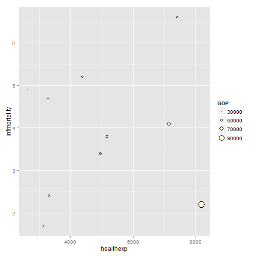 

```r

ggplot(heightweight, aes(x=ageYear, y=heightIn, size=weightLb)) + geom_point()
```

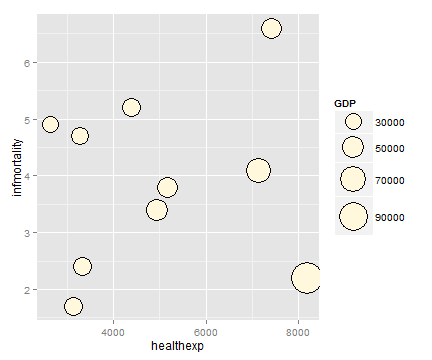 

```r
    
    
#====================================
ggplot(heightweight, aes(x=weightLb, y=heightIn, fill=ageYear)) +
    geom_point(shape=21, size=2.5) +
    scale_fill_gradient(low="black", high="white")
```

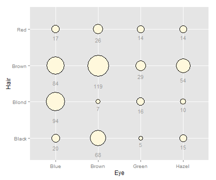 

```r

# Using guide_legend() will result in a discrete legend instead of a colorbar
ggplot(heightweight, aes(x=weightLb, y=heightIn, fill=ageYear)) +
    geom_point(shape=21, size=2.5) +
    scale_fill_gradient(low="black", high="white", breaks=12:17,
                        guide=guide_legend())
```

 

```r
    
    
#====================================
ggplot(heightweight, aes(x=ageYear, y=heightIn, size=weightLb, colour=sex)) +
    geom_point(alpha=.5) +
    scale_size_area() +     # Make area proportional to numeric value
    scale_colour_brewer(palette="Set1")
```

 

```r
    
    
#====================================
sp <- ggplot(diamonds, aes(x=carat, y=price))

sp + geom_point()
```

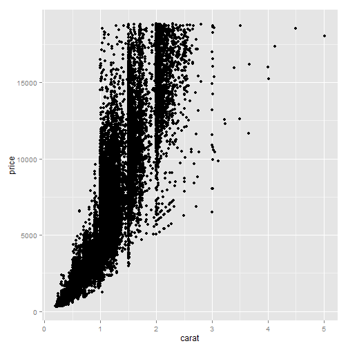 

```r
    
    
#====================================
sp + geom_point(alpha=.1)
```

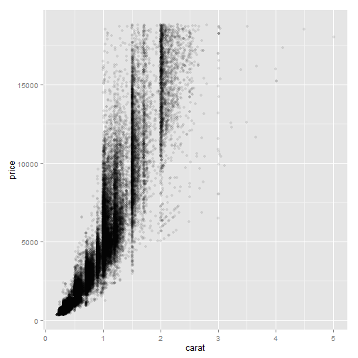 

```r

sp + geom_point(alpha=.01)
```

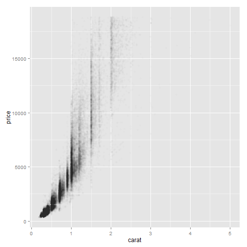 

```r
    
    
#====================================
sp + stat_bin2d()
```

 

```r

sp + stat_bin2d(bins=50) +
    scale_fill_gradient(low="lightblue", high="red", limits=c(0, 6000))
```

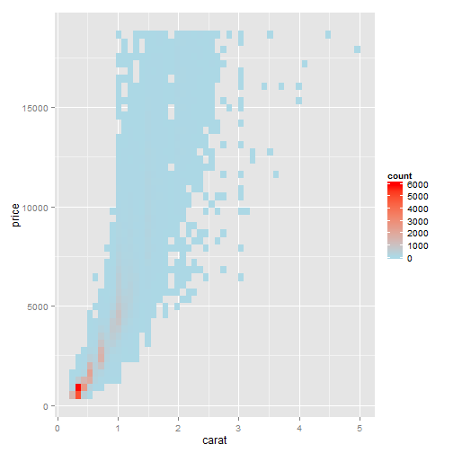 

```r
    
    
#====================================
#install.packages("hexbin")
library(hexbin)
```

```
## Loading required package: grid
## Loading required package: lattice
```

```r

sp + stat_binhex() +
    scale_fill_gradient(low="lightblue", high="red",
                        limits=c(0, 8000))
```

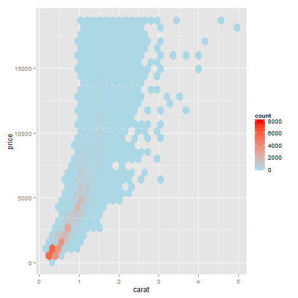 

```r

sp + stat_binhex() +
    scale_fill_gradient(low="lightblue", high="red",
                        breaks=c(0, 250, 500, 1000, 2000, 4000, 6000),
                        limits=c(0, 6000))
```

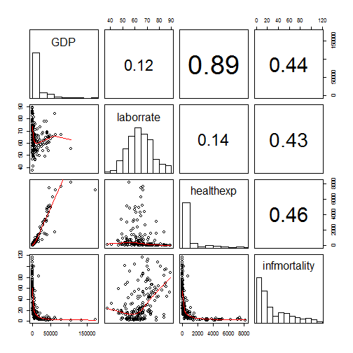 

```r
    
    
#====================================
sp1 <- ggplot(ChickWeight, aes(x=Time, y=weight))

sp1 + geom_point()
```

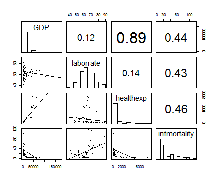 

```r

sp1 + geom_point(position="jitter")
```

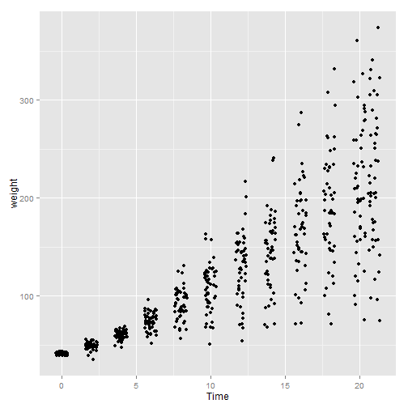 

```r
# Could also use geom_jitter(), which is equivalent

sp1 + geom_point(position=position_jitter(width=.5, height=0))
```

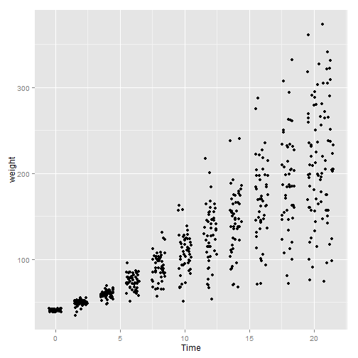 

```r
    
    
#====================================
sp1 + geom_boxplot(aes(group=Time))
```

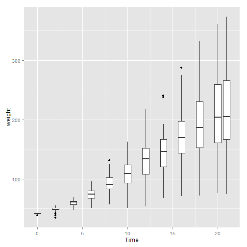 

```r
    
    
#====================================
library(gcookbook) # For the data set

# The base plot
sp <- ggplot(heightweight, aes(x=ageYear, y=heightIn))

sp + geom_point() + stat_smooth(method=lm)
```

 

```r
    
    
#====================================
# 99% confidence region
sp + geom_point() + stat_smooth(method=lm, level=0.99)
```

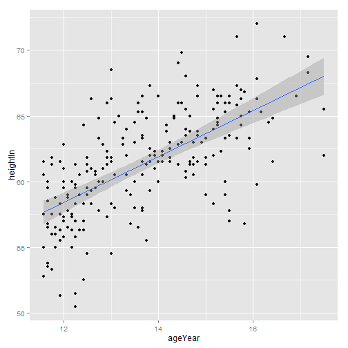 

```r

# No confidence region
sp + geom_point() + stat_smooth(method=lm, se=FALSE)
```

 

```r
    
    
#====================================
sp + geom_point(colour="grey60") +
    stat_smooth(method=lm, se=FALSE, colour="black")
```

 

```r
    
    
#====================================
sp + geom_point(colour="grey60") + stat_smooth()
```

```
## geom_smooth: method="auto" and size of largest group is <1000, so using loess. Use 'method = x' to change the smoothing method.
```

 

```r
sp + geom_point(colour="grey60") + stat_smooth(method=loess)
```

 

```r
    
    
#====================================
library(MASS) # For the data set

b <- biopsy

b$classn[b$class=="benign"]    <- 0
b$classn[b$class=="malignant"] <- 1

b
```

```
##           ID V1 V2 V3 V4 V5 V6 V7 V8 V9     class classn
## 1    1000025  5  1  1  1  2  1  3  1  1    benign      0
## 2    1002945  5  4  4  5  7 10  3  2  1    benign      0
## 3    1015425  3  1  1  1  2  2  3  1  1    benign      0
## 4    1016277  6  8  8  1  3  4  3  7  1    benign      0
## 5    1017023  4  1  1  3  2  1  3  1  1    benign      0
## 6    1017122  8 10 10  8  7 10  9  7  1 malignant      1
## 7    1018099  1  1  1  1  2 10  3  1  1    benign      0
## 8    1018561  2  1  2  1  2  1  3  1  1    benign      0
## 9    1033078  2  1  1  1  2  1  1  1  5    benign      0
## 10   1033078  4  2  1  1  2  1  2  1  1    benign      0
## 11   1035283  1  1  1  1  1  1  3  1  1    benign      0
## 12   1036172  2  1  1  1  2  1  2  1  1    benign      0
## 13   1041801  5  3  3  3  2  3  4  4  1 malignant      1
## 14   1043999  1  1  1  1  2  3  3  1  1    benign      0
## 15   1044572  8  7  5 10  7  9  5  5  4 malignant      1
## 16   1047630  7  4  6  4  6  1  4  3  1 malignant      1
## 17   1048672  4  1  1  1  2  1  2  1  1    benign      0
## 18   1049815  4  1  1  1  2  1  3  1  1    benign      0
## 19   1050670 10  7  7  6  4 10  4  1  2 malignant      1
## 20   1050718  6  1  1  1  2  1  3  1  1    benign      0
## 21   1054590  7  3  2 10  5 10  5  4  4 malignant      1
## 22   1054593 10  5  5  3  6  7  7 10  1 malignant      1
## 23   1056784  3  1  1  1  2  1  2  1  1    benign      0
## 24   1057013  8  4  5  1  2 NA  7  3  1 malignant      1
## 25   1059552  1  1  1  1  2  1  3  1  1    benign      0
## 26   1065726  5  2  3  4  2  7  3  6  1 malignant      1
## 27   1066373  3  2  1  1  1  1  2  1  1    benign      0
## 28   1066979  5  1  1  1  2  1  2  1  1    benign      0
## 29   1067444  2  1  1  1  2  1  2  1  1    benign      0
## 30   1070935  1  1  3  1  2  1  1  1  1    benign      0
## 31   1070935  3  1  1  1  1  1  2  1  1    benign      0
## 32   1071760  2  1  1  1  2  1  3  1  1    benign      0
## 33   1072179 10  7  7  3  8  5  7  4  3 malignant      1
## 34   1074610  2  1  1  2  2  1  3  1  1    benign      0
## 35   1075123  3  1  2  1  2  1  2  1  1    benign      0
## 36   1079304  2  1  1  1  2  1  2  1  1    benign      0
## 37   1080185 10 10 10  8  6  1  8  9  1 malignant      1
## 38   1081791  6  2  1  1  1  1  7  1  1    benign      0
## 39   1084584  5  4  4  9  2 10  5  6  1 malignant      1
## 40   1091262  2  5  3  3  6  7  7  5  1 malignant      1
## 41   1096800  6  6  6  9  6 NA  7  8  1    benign      0
## 42   1099510 10  4  3  1  3  3  6  5  2 malignant      1
## 43   1100524  6 10 10  2  8 10  7  3  3 malignant      1
## 44   1102573  5  6  5  6 10  1  3  1  1 malignant      1
## 45   1103608 10 10 10  4  8  1  8 10  1 malignant      1
## 46   1103722  1  1  1  1  2  1  2  1  2    benign      0
## 47   1105257  3  7  7  4  4  9  4  8  1 malignant      1
## 48   1105524  1  1  1  1  2  1  2  1  1    benign      0
## 49   1106095  4  1  1  3  2  1  3  1  1    benign      0
## 50   1106829  7  8  7  2  4  8  3  8  2 malignant      1
## 51   1108370  9  5  8  1  2  3  2  1  5 malignant      1
## 52   1108449  5  3  3  4  2  4  3  4  1 malignant      1
## 53   1110102 10  3  6  2  3  5  4 10  2 malignant      1
## 54   1110503  5  5  5  8 10  8  7  3  7 malignant      1
## 55   1110524 10  5  5  6  8  8  7  1  1 malignant      1
## 56   1111249 10  6  6  3  4  5  3  6  1 malignant      1
## 57   1112209  8 10 10  1  3  6  3  9  1 malignant      1
## 58   1113038  8  2  4  1  5  1  5  4  4 malignant      1
## 59   1113483  5  2  3  1  6 10  5  1  1 malignant      1
## 60   1113906  9  5  5  2  2  2  5  1  1 malignant      1
## 61   1115282  5  3  5  5  3  3  4 10  1 malignant      1
## 62   1115293  1  1  1  1  2  2  2  1  1    benign      0
## 63   1116116  9 10 10  1 10  8  3  3  1 malignant      1
## 64   1116132  6  3  4  1  5  2  3  9  1 malignant      1
## 65   1116192  1  1  1  1  2  1  2  1  1    benign      0
## 66   1116998 10  4  2  1  3  2  4  3 10 malignant      1
## 67   1117152  4  1  1  1  2  1  3  1  1    benign      0
## 68   1118039  5  3  4  1  8 10  4  9  1 malignant      1
## 69   1120559  8  3  8  3  4  9  8  9  8 malignant      1
## 70   1121732  1  1  1  1  2  1  3  2  1    benign      0
## 71   1121919  5  1  3  1  2  1  2  1  1    benign      0
## 72   1123061  6 10  2  8 10  2  7  8 10 malignant      1
## 73   1124651  1  3  3  2  2  1  7  2  1    benign      0
## 74   1125035  9  4  5 10  6 10  4  8  1 malignant      1
## 75   1126417 10  6  4  1  3  4  3  2  3 malignant      1
## 76   1131294  1  1  2  1  2  2  4  2  1    benign      0
## 77   1132347  1  1  4  1  2  1  2  1  1    benign      0
## 78   1133041  5  3  1  2  2  1  2  1  1    benign      0
## 79   1133136  3  1  1  1  2  3  3  1  1    benign      0
## 80   1136142  2  1  1  1  3  1  2  1  1    benign      0
## 81   1137156  2  2  2  1  1  1  7  1  1    benign      0
## 82   1143978  4  1  1  2  2  1  2  1  1    benign      0
## 83   1143978  5  2  1  1  2  1  3  1  1    benign      0
## 84   1147044  3  1  1  1  2  2  7  1  1    benign      0
## 85   1147699  3  5  7  8  8  9  7 10  7 malignant      1
## 86   1147748  5 10  6  1 10  4  4 10 10 malignant      1
## 87   1148278  3  3  6  4  5  8  4  4  1 malignant      1
## 88   1148873  3  6  6  6  5 10  6  8  3 malignant      1
## 89   1152331  4  1  1  1  2  1  3  1  1    benign      0
## 90   1155546  2  1  1  2  3  1  2  1  1    benign      0
## 91   1156272  1  1  1  1  2  1  3  1  1    benign      0
## 92   1156948  3  1  1  2  2  1  1  1  1    benign      0
## 93   1157734  4  1  1  1  2  1  3  1  1    benign      0
## 94   1158247  1  1  1  1  2  1  2  1  1    benign      0
## 95   1160476  2  1  1  1  2  1  3  1  1    benign      0
## 96   1164066  1  1  1  1  2  1  3  1  1    benign      0
## 97   1165297  2  1  1  2  2  1  1  1  1    benign      0
## 98   1165790  5  1  1  1  2  1  3  1  1    benign      0
## 99   1165926  9  6  9  2 10  6  2  9 10 malignant      1
## 100  1166630  7  5  6 10  5 10  7  9  4 malignant      1
## 101  1166654 10  3  5  1 10  5  3 10  2 malignant      1
## 102  1167439  2  3  4  4  2  5  2  5  1 malignant      1
## 103  1167471  4  1  2  1  2  1  3  1  1    benign      0
## 104  1168359  8  2  3  1  6  3  7  1  1 malignant      1
## 105  1168736 10 10 10 10 10  1  8  8  8 malignant      1
## 106  1169049  7  3  4  4  3  3  3  2  7 malignant      1
## 107  1170419 10 10 10  8  2 10  4  1  1 malignant      1
## 108  1170420  1  6  8 10  8 10  5  7  1 malignant      1
## 109  1171710  1  1  1  1  2  1  2  3  1    benign      0
## 110  1171710  6  5  4  4  3  9  7  8  3 malignant      1
## 111  1171795  1  3  1  2  2  2  5  3  2    benign      0
## 112  1171845  8  6  4  3  5  9  3  1  1 malignant      1
## 113  1172152 10  3  3 10  2 10  7  3  3 malignant      1
## 114  1173216 10 10 10  3 10  8  8  1  1 malignant      1
## 115  1173235  3  3  2  1  2  3  3  1  1    benign      0
## 116  1173347  1  1  1  1  2  5  1  1  1    benign      0
## 117  1173347  8  3  3  1  2  2  3  2  1    benign      0
## 118  1173509  4  5  5 10  4 10  7  5  8 malignant      1
## 119  1173514  1  1  1  1  4  3  1  1  1    benign      0
## 120  1173681  3  2  1  1  2  2  3  1  1    benign      0
## 121  1174057  1  1  2  2  2  1  3  1  1    benign      0
## 122  1174057  4  2  1  1  2  2  3  1  1    benign      0
## 123  1174131 10 10 10  2 10 10  5  3  3 malignant      1
## 124  1174428  5  3  5  1  8 10  5  3  1 malignant      1
## 125  1175937  5  4  6  7  9  7  8 10  1 malignant      1
## 126  1176406  1  1  1  1  2  1  2  1  1    benign      0
## 127  1176881  7  5  3  7  4 10  7  5  5 malignant      1
## 128  1177027  3  1  1  1  2  1  3  1  1    benign      0
## 129  1177399  8  3  5  4  5 10  1  6  2 malignant      1
## 130  1177512  1  1  1  1 10  1  1  1  1    benign      0
## 131  1178580  5  1  3  1  2  1  2  1  1    benign      0
## 132  1179818  2  1  1  1  2  1  3  1  1    benign      0
## 133  1180194  5 10  8 10  8 10  3  6  3 malignant      1
## 134  1180523  3  1  1  1  2  1  2  2  1    benign      0
## 135  1180831  3  1  1  1  3  1  2  1  1    benign      0
## 136  1181356  5  1  1  1  2  2  3  3  1    benign      0
## 137  1182404  4  1  1  1  2  1  2  1  1    benign      0
## 138  1182410  3  1  1  1  2  1  1  1  1    benign      0
## 139  1183240  4  1  2  1  2  1  2  1  1    benign      0
## 140  1183246  1  1  1  1  1 NA  2  1  1    benign      0
## 141  1183516  3  1  1  1  2  1  1  1  1    benign      0
## 142  1183911  2  1  1  1  2  1  1  1  1    benign      0
## 143  1183983  9  5  5  4  4  5  4  3  3 malignant      1
## 144  1184184  1  1  1  1  2  5  1  1  1    benign      0
## 145  1184241  2  1  1  1  2  1  2  1  1    benign      0
## 146  1184840  1  1  3  1  2 NA  2  1  1    benign      0
## 147  1185609  3  4  5  2  6  8  4  1  1 malignant      1
## 148  1185610  1  1  1  1  3  2  2  1  1    benign      0
## 149  1187457  3  1  1  3  8  1  5  8  1    benign      0
## 150  1187805  8  8  7  4 10 10  7  8  7 malignant      1
## 151  1188472  1  1  1  1  1  1  3  1  1    benign      0
## 152  1189266  7  2  4  1  6 10  5  4  3 malignant      1
## 153  1189286 10 10  8  6  4  5  8 10  1 malignant      1
## 154  1190394  4  1  1  1  2  3  1  1  1    benign      0
## 155  1190485  1  1  1  1  2  1  1  1  1    benign      0
## 156  1192325  5  5  5  6  3 10  3  1  1 malignant      1
## 157  1193091  1  2  2  1  2  1  2  1  1    benign      0
## 158  1193210  2  1  1  1  2  1  3  1  1    benign      0
## 159  1193683  1  1  2  1  3 NA  1  1  1    benign      0
## 160  1196295  9  9 10  3  6 10  7 10  6 malignant      1
## 161  1196915 10  7  7  4  5 10  5  7  2 malignant      1
## 162  1197080  4  1  1  1  2  1  3  2  1    benign      0
## 163  1197270  3  1  1  1  2  1  3  1  1    benign      0
## 164  1197440  1  1  1  2  1  3  1  1  7    benign      0
## 165  1197510  5  1  1  1  2 NA  3  1  1    benign      0
## 166  1197979  4  1  1  1  2  2  3  2  1    benign      0
## 167  1197993  5  6  7  8  8 10  3 10  3 malignant      1
## 168  1198128 10  8 10 10  6  1  3  1 10 malignant      1
## 169  1198641  3  1  1  1  2  1  3  1  1    benign      0
## 170  1199219  1  1  1  2  1  1  1  1  1    benign      0
## 171  1199731  3  1  1  1  2  1  1  1  1    benign      0
## 172  1199983  1  1  1  1  2  1  3  1  1    benign      0
## 173  1200772  1  1  1  1  2  1  2  1  1    benign      0
## 174  1200847  6 10 10 10  8 10 10 10  7 malignant      1
## 175  1200892  8  6  5  4  3 10  6  1  1 malignant      1
## 176  1200952  5  8  7  7 10 10  5  7  1 malignant      1
## 177  1201834  2  1  1  1  2  1  3  1  1    benign      0
## 178  1201936  5 10 10  3  8  1  5 10  3 malignant      1
## 179  1202125  4  1  1  1  2  1  3  1  1    benign      0
## 180  1202812  5  3  3  3  6 10  3  1  1 malignant      1
## 181  1203096  1  1  1  1  1  1  3  1  1    benign      0
## 182  1204242  1  1  1  1  2  1  1  1  1    benign      0
## 183  1204898  6  1  1  1  2  1  3  1  1    benign      0
## 184  1205138  5  8  8  8  5 10  7  8  1 malignant      1
## 185  1205579  8  7  6  4  4 10  5  1  1 malignant      1
## 186  1206089  2  1  1  1  1  1  3  1  1    benign      0
## 187  1206695  1  5  8  6  5  8  7 10  1 malignant      1
## 188  1206841 10  5  6 10  6 10  7  7 10 malignant      1
## 189  1207986  5  8  4 10  5  8  9 10  1 malignant      1
## 190  1208301  1  2  3  1  2  1  3  1  1    benign      0
## 191  1210963 10 10 10  8  6  8  7 10  1 malignant      1
## 192  1211202  7  5 10 10 10 10  4 10  3 malignant      1
## 193  1212232  5  1  1  1  2  1  2  1  1    benign      0
## 194  1212251  1  1  1  1  2  1  3  1  1    benign      0
## 195  1212422  3  1  1  1  2  1  3  1  1    benign      0
## 196  1212422  4  1  1  1  2  1  3  1  1    benign      0
## 197  1213375  8  4  4  5  4  7  7  8  2    benign      0
## 198  1213383  5  1  1  4  2  1  3  1  1    benign      0
## 199  1214092  1  1  1  1  2  1  1  1  1    benign      0
## 200  1214556  3  1  1  1  2  1  2  1  1    benign      0
## 201  1214966  9  7  7  5  5 10  7  8  3 malignant      1
## 202  1216694 10  8  8  4 10 10  8  1  1 malignant      1
## 203  1216947  1  1  1  1  2  1  3  1  1    benign      0
## 204  1217051  5  1  1  1  2  1  3  1  1    benign      0
## 205  1217264  1  1  1  1  2  1  3  1  1    benign      0
## 206  1218105  5 10 10  9  6 10  7 10  5 malignant      1
## 207  1218741 10 10  9  3  7  5  3  5  1 malignant      1
## 208  1218860  1  1  1  1  1  1  3  1  1    benign      0
## 209  1218860  1  1  1  1  1  1  3  1  1    benign      0
## 210  1219406  5  1  1  1  1  1  3  1  1    benign      0
## 211  1219525  8 10 10 10  5 10  8 10  6 malignant      1
## 212  1219859  8 10  8  8  4  8  7  7  1 malignant      1
## 213  1220330  1  1  1  1  2  1  3  1  1    benign      0
## 214  1221863 10 10 10 10  7 10  7 10  4 malignant      1
## 215  1222047 10 10 10 10  3 10 10  6  1 malignant      1
## 216  1222936  8  7  8  7  5  5  5 10  2 malignant      1
## 217  1223282  1  1  1  1  2  1  2  1  1    benign      0
## 218  1223426  1  1  1  1  2  1  3  1  1    benign      0
## 219  1223793  6 10  7  7  6  4  8 10  2 malignant      1
## 220  1223967  6  1  3  1  2  1  3  1  1    benign      0
## 221  1224329  1  1  1  2  2  1  3  1  1    benign      0
## 222  1225799 10  6  4  3 10 10  9 10  1 malignant      1
## 223  1226012  4  1  1  3  1  5  2  1  1 malignant      1
## 224  1226612  7  5  6  3  3  8  7  4  1 malignant      1
## 225  1227210 10  5  5  6  3 10  7  9  2 malignant      1
## 226  1227244  1  1  1  1  2  1  2  1  1    benign      0
## 227  1227481 10  5  7  4  4 10  8  9  1 malignant      1
## 228  1228152  8  9  9  5  3  5  7  7  1 malignant      1
## 229  1228311  1  1  1  1  1  1  3  1  1    benign      0
## 230  1230175 10 10 10  3 10 10  9 10  1 malignant      1
## 231  1230688  7  4  7  4  3  7  7  6  1 malignant      1
## 232  1231387  6  8  7  5  6  8  8  9  2 malignant      1
## 233  1231706  8  4  6  3  3  1  4  3  1    benign      0
## 234  1232225 10  4  5  5  5 10  4  1  1 malignant      1
## 235  1236043  3  3  2  1  3  1  3  6  1    benign      0
## 236  1241232  3  1  4  1  2 NA  3  1  1    benign      0
## 237  1241559 10  8  8  2  8 10  4  8 10 malignant      1
## 238  1241679  9  8  8  5  6  2  4 10  4 malignant      1
## 239  1242364  8 10 10  8  6  9  3 10 10 malignant      1
## 240  1243256 10  4  3  2  3 10  5  3  2 malignant      1
## 241  1270479  5  1  3  3  2  2  2  3  1    benign      0
## 242  1276091  3  1  1  3  1  1  3  1  1    benign      0
## 243  1277018  2  1  1  1  2  1  3  1  1    benign      0
## 244   128059  1  1  1  1  2  5  5  1  1    benign      0
## 245  1285531  1  1  1  1  2  1  3  1  1    benign      0
## 246  1287775  5  1  1  2  2  2  3  1  1    benign      0
## 247   144888  8 10 10  8  5 10  7  8  1 malignant      1
## 248   145447  8  4  4  1  2  9  3  3  1 malignant      1
## 249   167528  4  1  1  1  2  1  3  6  1    benign      0
## 250   169356  3  1  1  1  2 NA  3  1  1    benign      0
## 251   183913  1  2  2  1  2  1  1  1  1    benign      0
## 252   191250 10  4  4 10  2 10  5  3  3 malignant      1
## 253  1017023  6  3  3  5  3 10  3  5  3    benign      0
## 254  1100524  6 10 10  2  8 10  7  3  3 malignant      1
## 255  1116116  9 10 10  1 10  8  3  3  1 malignant      1
## 256  1168736  5  6  6  2  4 10  3  6  1 malignant      1
## 257  1182404  3  1  1  1  2  1  1  1  1    benign      0
## 258  1182404  3  1  1  1  2  1  2  1  1    benign      0
## 259  1198641  3  1  1  1  2  1  3  1  1    benign      0
## 260   242970  5  7  7  1  5  8  3  4  1    benign      0
## 261   255644 10  5  8 10  3 10  5  1  3 malignant      1
## 262   263538  5 10 10  6 10 10 10  6  5 malignant      1
## 263   274137  8  8  9  4  5 10  7  8  1 malignant      1
## 264   303213 10  4  4 10  6 10  5  5  1 malignant      1
## 265   314428  7  9  4 10 10  3  5  3  3 malignant      1
## 266  1182404  5  1  4  1  2  1  3  2  1    benign      0
## 267  1198641 10 10  6  3  3 10  4  3  2 malignant      1
## 268   320675  3  3  5  2  3 10  7  1  1 malignant      1
## 269   324427 10  8  8  2  3  4  8  7  8 malignant      1
## 270   385103  1  1  1  1  2  1  3  1  1    benign      0
## 271   390840  8  4  7  1  3 10  3  9  2 malignant      1
## 272   411453  5  1  1  1  2  1  3  1  1    benign      0
## 273   320675  3  3  5  2  3 10  7  1  1 malignant      1
## 274   428903  7  2  4  1  3  4  3  3  1 malignant      1
## 275   431495  3  1  1  1  2  1  3  2  1    benign      0
## 276   432809  3  1  3  1  2 NA  2  1  1    benign      0
## 277   434518  3  1  1  1  2  1  2  1  1    benign      0
## 278   452264  1  1  1  1  2  1  2  1  1    benign      0
## 279   456282  1  1  1  1  2  1  3  1  1    benign      0
## 280   476903 10  5  7  3  3  7  3  3  8 malignant      1
## 281   486283  3  1  1  1  2  1  3  1  1    benign      0
## 282   486662  2  1  1  2  2  1  3  1  1    benign      0
## 283   488173  1  4  3 10  4 10  5  6  1 malignant      1
## 284   492268 10  4  6  1  2 10  5  3  1 malignant      1
## 285   508234  7  4  5 10  2 10  3  8  2 malignant      1
## 286   527363  8 10 10 10  8 10 10  7  3 malignant      1
## 287   529329 10 10 10 10 10 10  4 10 10 malignant      1
## 288   535331  3  1  1  1  3  1  2  1  1    benign      0
## 289   543558  6  1  3  1  4  5  5 10  1 malignant      1
## 290   555977  5  6  6  8  6 10  4 10  4 malignant      1
## 291   560680  1  1  1  1  2  1  1  1  1    benign      0
## 292   561477  1  1  1  1  2  1  3  1  1    benign      0
## 293   563649  8  8  8  1  2 NA  6 10  1 malignant      1
## 294   601265 10  4  4  6  2 10  2  3  1 malignant      1
## 295   606140  1  1  1  1  2 NA  2  1  1    benign      0
## 296   606722  5  5  7  8  6 10  7  4  1 malignant      1
## 297   616240  5  3  4  3  4  5  4  7  1    benign      0
## 298    61634  5  4  3  1  2 NA  2  3  1    benign      0
## 299   625201  8  2  1  1  5  1  1  1  1    benign      0
## 300    63375  9  1  2  6  4 10  7  7  2 malignant      1
## 301   635844  8  4 10  5  4  4  7 10  1 malignant      1
## 302   636130  1  1  1  1  2  1  3  1  1    benign      0
## 303   640744 10 10 10  7  9 10  7 10 10 malignant      1
## 304   646904  1  1  1  1  2  1  3  1  1    benign      0
## 305   653777  8  3  4  9  3 10  3  3  1 malignant      1
## 306   659642 10  8  4  4  4 10  3 10  4 malignant      1
## 307   666090  1  1  1  1  2  1  3  1  1    benign      0
## 308   666942  1  1  1  1  2  1  3  1  1    benign      0
## 309   667204  7  8  7  6  4  3  8  8  4 malignant      1
## 310   673637  3  1  1  1  2  5  5  1  1    benign      0
## 311   684955  2  1  1  1  3  1  2  1  1    benign      0
## 312   688033  1  1  1  1  2  1  1  1  1    benign      0
## 313   691628  8  6  4 10 10  1  3  5  1 malignant      1
## 314   693702  1  1  1  1  2  1  1  1  1    benign      0
## 315   704097  1  1  1  1  1  1  2  1  1    benign      0
## 316   704168  4  6  5  6  7 NA  4  9  1    benign      0
## 317   706426  5  5  5  2  5 10  4  3  1 malignant      1
## 318   709287  6  8  7  8  6  8  8  9  1 malignant      1
## 319   718641  1  1  1  1  5  1  3  1  1    benign      0
## 320   721482  4  4  4  4  6  5  7  3  1    benign      0
## 321   730881  7  6  3  2  5 10  7  4  6 malignant      1
## 322   733639  3  1  1  1  2 NA  3  1  1    benign      0
## 323   733639  3  1  1  1  2  1  3  1  1    benign      0
## 324   733823  5  4  6 10  2 10  4  1  1 malignant      1
## 325   740492  1  1  1  1  2  1  3  1  1    benign      0
## 326   743348  3  2  2  1  2  1  2  3  1    benign      0
## 327   752904 10  1  1  1  2 10  5  4  1 malignant      1
## 328   756136  1  1  1  1  2  1  2  1  1    benign      0
## 329   760001  8 10  3  2  6  4  3 10  1 malignant      1
## 330   760239 10  4  6  4  5 10  7  1  1 malignant      1
## 331    76389 10  4  7  2  2  8  6  1  1 malignant      1
## 332   764974  5  1  1  1  2  1  3  1  2    benign      0
## 333   770066  5  2  2  2  2  1  2  2  1    benign      0
## 334   785208  5  4  6  6  4 10  4  3  1 malignant      1
## 335   785615  8  6  7  3  3 10  3  4  2 malignant      1
## 336   792744  1  1  1  1  2  1  1  1  1    benign      0
## 337   797327  6  5  5  8  4 10  3  4  1 malignant      1
## 338   798429  1  1  1  1  2  1  3  1  1    benign      0
## 339   704097  1  1  1  1  1  1  2  1  1    benign      0
## 340   806423  8  5  5  5  2 10  4  3  1 malignant      1
## 341   809912 10  3  3  1  2 10  7  6  1 malignant      1
## 342   810104  1  1  1  1  2  1  3  1  1    benign      0
## 343   814265  2  1  1  1  2  1  1  1  1    benign      0
## 344   814911  1  1  1  1  2  1  1  1  1    benign      0
## 345   822829  7  6  4  8 10 10  9  5  3 malignant      1
## 346   826923  1  1  1  1  2  1  1  1  1    benign      0
## 347   830690  5  2  2  2  3  1  1  3  1    benign      0
## 348   831268  1  1  1  1  1  1  1  3  1    benign      0
## 349   832226  3  4  4 10  5  1  3  3  1 malignant      1
## 350   832567  4  2  3  5  3  8  7  6  1 malignant      1
## 351   836433  5  1  1  3  2  1  1  1  1    benign      0
## 352   837082  2  1  1  1  2  1  3  1  1    benign      0
## 353   846832  3  4  5  3  7  3  4  6  1    benign      0
## 354   850831  2  7 10 10  7 10  4  9  4 malignant      1
## 355   855524  1  1  1  1  2  1  2  1  1    benign      0
## 356   857774  4  1  1  1  3  1  2  2  1    benign      0
## 357   859164  5  3  3  1  3  3  3  3  3 malignant      1
## 358   859350  8 10 10  7 10 10  7  3  8 malignant      1
## 359   866325  8 10  5  3  8  4  4 10  3 malignant      1
## 360   873549 10  3  5  4  3  7  3  5  3 malignant      1
## 361   877291  6 10 10 10 10 10  8 10 10 malignant      1
## 362   877943  3 10  3 10  6 10  5  1  4 malignant      1
## 363   888169  3  2  2  1  4  3  2  1  1    benign      0
## 364   888523  4  4  4  2  2  3  2  1  1    benign      0
## 365   896404  2  1  1  1  2  1  3  1  1    benign      0
## 366   897172  2  1  1  1  2  1  2  1  1    benign      0
## 367    95719  6 10 10 10  8 10  7 10  7 malignant      1
## 368   160296  5  8  8 10  5 10  8 10  3 malignant      1
## 369   342245  1  1  3  1  2  1  1  1  1    benign      0
## 370   428598  1  1  3  1  1  1  2  1  1    benign      0
## 371   492561  4  3  2  1  3  1  2  1  1    benign      0
## 372   493452  1  1  3  1  2  1  1  1  1    benign      0
## 373   493452  4  1  2  1  2  1  2  1  1    benign      0
## 374   521441  5  1  1  2  2  1  2  1  1    benign      0
## 375   560680  3  1  2  1  2  1  2  1  1    benign      0
## 376   636437  1  1  1  1  2  1  1  1  1    benign      0
## 377   640712  1  1  1  1  2  1  2  1  1    benign      0
## 378   654244  1  1  1  1  1  1  2  1  1    benign      0
## 379   657753  3  1  1  4  3  1  2  2  1    benign      0
## 380   685977  5  3  4  1  4  1  3  1  1    benign      0
## 381   805448  1  1  1  1  2  1  1  1  1    benign      0
## 382   846423 10  6  3  6  4 10  7  8  4 malignant      1
## 383  1002504  3  2  2  2  2  1  3  2  1    benign      0
## 384  1022257  2  1  1  1  2  1  1  1  1    benign      0
## 385  1026122  2  1  1  1  2  1  1  1  1    benign      0
## 386  1071084  3  3  2  2  3  1  1  2  3    benign      0
## 387  1080233  7  6  6  3  2 10  7  1  1 malignant      1
## 388  1114570  5  3  3  2  3  1  3  1  1    benign      0
## 389  1114570  2  1  1  1  2  1  2  2  1    benign      0
## 390  1116715  5  1  1  1  3  2  2  2  1    benign      0
## 391  1131411  1  1  1  2  2  1  2  1  1    benign      0
## 392  1151734 10  8  7  4  3 10  7  9  1 malignant      1
## 393  1156017  3  1  1  1  2  1  2  1  1    benign      0
## 394  1158247  1  1  1  1  1  1  1  1  1    benign      0
## 395  1158405  1  2  3  1  2  1  2  1  1    benign      0
## 396  1168278  3  1  1  1  2  1  2  1  1    benign      0
## 397  1176187  3  1  1  1  2  1  3  1  1    benign      0
## 398  1196263  4  1  1  1  2  1  1  1  1    benign      0
## 399  1196475  3  2  1  1  2  1  2  2  1    benign      0
## 400  1206314  1  2  3  1  2  1  1  1  1    benign      0
## 401  1211265  3 10  8  7  6  9  9  3  8 malignant      1
## 402  1213784  3  1  1  1  2  1  1  1  1    benign      0
## 403  1223003  5  3  3  1  2  1  2  1  1    benign      0
## 404  1223306  3  1  1  1  2  4  1  1  1    benign      0
## 405  1223543  1  2  1  3  2  1  1  2  1    benign      0
## 406  1229929  1  1  1  1  2  1  2  1  1    benign      0
## 407  1231853  4  2  2  1  2  1  2  1  1    benign      0
## 408  1234554  1  1  1  1  2  1  2  1  1    benign      0
## 409  1236837  2  3  2  2  2  2  3  1  1    benign      0
## 410  1237674  3  1  2  1  2  1  2  1  1    benign      0
## 411  1238021  1  1  1  1  2  1  2  1  1    benign      0
## 412  1238464  1  1  1  1  1 NA  2  1  1    benign      0
## 413  1238633 10 10 10  6  8  4  8  5  1 malignant      1
## 414  1238915  5  1  2  1  2  1  3  1  1    benign      0
## 415  1238948  8  5  6  2  3 10  6  6  1 malignant      1
## 416  1239232  3  3  2  6  3  3  3  5  1    benign      0
## 417  1239347  8  7  8  5 10 10  7  2  1 malignant      1
## 418  1239967  1  1  1  1  2  1  2  1  1    benign      0
## 419  1240337  5  2  2  2  2  2  3  2  2    benign      0
## 420  1253505  2  3  1  1  5  1  1  1  1    benign      0
## 421  1255384  3  2  2  3  2  3  3  1  1    benign      0
## 422  1257200 10 10 10  7 10 10  8  2  1 malignant      1
## 423  1257648  4  3  3  1  2  1  3  3  1    benign      0
## 424  1257815  5  1  3  1  2  1  2  1  1    benign      0
## 425  1257938  3  1  1  1  2  1  1  1  1    benign      0
## 426  1258549  9 10 10 10 10 10 10 10  1 malignant      1
## 427  1258556  5  3  6  1  2  1  1  1  1    benign      0
## 428  1266154  8  7  8  2  4  2  5 10  1 malignant      1
## 429  1272039  1  1  1  1  2  1  2  1  1    benign      0
## 430  1276091  2  1  1  1  2  1  2  1  1    benign      0
## 431  1276091  1  3  1  1  2  1  2  2  1    benign      0
## 432  1276091  5  1  1  3  4  1  3  2  1    benign      0
## 433  1277629  5  1  1  1  2  1  2  2  1    benign      0
## 434  1293439  3  2  2  3  2  1  1  1  1    benign      0
## 435  1293439  6  9  7  5  5  8  4  2  1    benign      0
## 436  1294562 10  8 10  1  3 10  5  1  1 malignant      1
## 437  1295186 10 10 10  1  6  1  2  8  1 malignant      1
## 438   527337  4  1  1  1  2  1  1  1  1    benign      0
## 439   558538  4  1  3  3  2  1  1  1  1    benign      0
## 440   566509  5  1  1  1  2  1  1  1  1    benign      0
## 441   608157 10  4  3 10  4 10 10  1  1 malignant      1
## 442   677910  5  2  2  4  2  4  1  1  1    benign      0
## 443   734111  1  1  1  3  2  3  1  1  1    benign      0
## 444   734111  1  1  1  1  2  2  1  1  1    benign      0
## 445   780555  5  1  1  6  3  1  2  1  1    benign      0
## 446   827627  2  1  1  1  2  1  1  1  1    benign      0
## 447  1049837  1  1  1  1  2  1  1  1  1    benign      0
## 448  1058849  5  1  1  1  2  1  1  1  1    benign      0
## 449  1182404  1  1  1  1  1  1  1  1  1    benign      0
## 450  1193544  5  7  9  8  6 10  8 10  1 malignant      1
## 451  1201870  4  1  1  3  1  1  2  1  1    benign      0
## 452  1202253  5  1  1  1  2  1  1  1  1    benign      0
## 453  1227081  3  1  1  3  2  1  1  1  1    benign      0
## 454  1230994  4  5  5  8  6 10 10  7  1 malignant      1
## 455  1238410  2  3  1  1  3  1  1  1  1    benign      0
## 456  1246562 10  2  2  1  2  6  1  1  2 malignant      1
## 457  1257470 10  6  5  8  5 10  8  6  1 malignant      1
## 458  1259008  8  8  9  6  6  3 10 10  1 malignant      1
## 459  1266124  5  1  2  1  2  1  1  1  1    benign      0
## 460  1267898  5  1  3  1  2  1  1  1  1    benign      0
## 461  1268313  5  1  1  3  2  1  1  1  1    benign      0
## 462  1268804  3  1  1  1  2  5  1  1  1    benign      0
## 463  1276091  6  1  1  3  2  1  1  1  1    benign      0
## 464  1280258  4  1  1  1  2  1  1  2  1    benign      0
## 465  1293966  4  1  1  1  2  1  1  1  1    benign      0
## 466  1296572 10  9  8  7  6  4  7 10  3 malignant      1
## 467  1298416 10  6  6  2  4 10  9  7  1 malignant      1
## 468  1299596  6  6  6  5  4 10  7  6  2 malignant      1
## 469  1105524  4  1  1  1  2  1  1  1  1    benign      0
## 470  1181685  1  1  2  1  2  1  2  1  1    benign      0
## 471  1211594  3  1  1  1  1  1  2  1  1    benign      0
## 472  1238777  6  1  1  3  2  1  1  1  1    benign      0
## 473  1257608  6  1  1  1  1  1  1  1  1    benign      0
## 474  1269574  4  1  1  1  2  1  1  1  1    benign      0
## 475  1277145  5  1  1  1  2  1  1  1  1    benign      0
## 476  1287282  3  1  1  1  2  1  1  1  1    benign      0
## 477  1296025  4  1  2  1  2  1  1  1  1    benign      0
## 478  1296263  4  1  1  1  2  1  1  1  1    benign      0
## 479  1296593  5  2  1  1  2  1  1  1  1    benign      0
## 480  1299161  4  8  7 10  4 10  7  5  1 malignant      1
## 481  1301945  5  1  1  1  1  1  1  1  1    benign      0
## 482  1302428  5  3  2  4  2  1  1  1  1    benign      0
## 483  1318169  9 10 10 10 10  5 10 10 10 malignant      1
## 484   474162  8  7  8  5  5 10  9 10  1 malignant      1
## 485   787451  5  1  2  1  2  1  1  1  1    benign      0
## 486  1002025  1  1  1  3  1  3  1  1  1    benign      0
## 487  1070522  3  1  1  1  1  1  2  1  1    benign      0
## 488  1073960 10 10 10 10  6 10  8  1  5 malignant      1
## 489  1076352  3  6  4 10  3  3  3  4  1 malignant      1
## 490  1084139  6  3  2  1  3  4  4  1  1 malignant      1
## 491  1115293  1  1  1  1  2  1  1  1  1    benign      0
## 492  1119189  5  8  9  4  3 10  7  1  1 malignant      1
## 493  1133991  4  1  1  1  1  1  2  1  1    benign      0
## 494  1142706  5 10 10 10  6 10  6  5  2 malignant      1
## 495  1155967  5  1  2 10  4  5  2  1  1    benign      0
## 496  1170945  3  1  1  1  1  1  2  1  1    benign      0
## 497  1181567  1  1  1  1  1  1  1  1  1    benign      0
## 498  1182404  4  2  1  1  2  1  1  1  1    benign      0
## 499  1204558  4  1  1  1  2  1  2  1  1    benign      0
## 500  1217952  4  1  1  1  2  1  2  1  1    benign      0
## 501  1224565  6  1  1  1  2  1  3  1  1    benign      0
## 502  1238186  4  1  1  1  2  1  2  1  1    benign      0
## 503  1253917  4  1  1  2  2  1  2  1  1    benign      0
## 504  1265899  4  1  1  1  2  1  3  1  1    benign      0
## 505  1268766  1  1  1  1  2  1  1  1  1    benign      0
## 506  1277268  3  3  1  1  2  1  1  1  1    benign      0
## 507  1286943  8 10 10 10  7  5  4  8  7 malignant      1
## 508  1295508  1  1  1  1  2  4  1  1  1    benign      0
## 509  1297327  5  1  1  1  2  1  1  1  1    benign      0
## 510  1297522  2  1  1  1  2  1  1  1  1    benign      0
## 511  1298360  1  1  1  1  2  1  1  1  1    benign      0
## 512  1299924  5  1  1  1  2  1  2  1  1    benign      0
## 513  1299994  5  1  1  1  2  1  1  1  1    benign      0
## 514  1304595  3  1  1  1  1  1  2  1  1    benign      0
## 515  1306282  6  6  7 10  3 10  8 10  2 malignant      1
## 516  1313325  4 10  4  7  3 10  9 10  1 malignant      1
## 517  1320077  1  1  1  1  1  1  1  1  1    benign      0
## 518  1320077  1  1  1  1  1  1  2  1  1    benign      0
## 519  1320304  3  1  2  2  2  1  1  1  1    benign      0
## 520  1330439  4  7  8  3  4 10  9  1  1 malignant      1
## 521   333093  1  1  1  1  3  1  1  1  1    benign      0
## 522   369565  4  1  1  1  3  1  1  1  1    benign      0
## 523   412300 10  4  5  4  3  5  7  3  1 malignant      1
## 524   672113  7  5  6 10  4 10  5  3  1 malignant      1
## 525   749653  3  1  1  1  2  1  2  1  1    benign      0
## 526   769612  3  1  1  2  2  1  1  1  1    benign      0
## 527   769612  4  1  1  1  2  1  1  1  1    benign      0
## 528   798429  4  1  1  1  2  1  3  1  1    benign      0
## 529   807657  6  1  3  2  2  1  1  1  1    benign      0
## 530  8233704  4  1  1  1  1  1  2  1  1    benign      0
## 531   837480  7  4  4  3  4 10  6  9  1 malignant      1
## 532   867392  4  2  2  1  2  1  2  1  1    benign      0
## 533   869828  1  1  1  1  1  1  3  1  1    benign      0
## 534  1043068  3  1  1  1  2  1  2  1  1    benign      0
## 535  1056171  2  1  1  1  2  1  2  1  1    benign      0
## 536  1061990  1  1  3  2  2  1  3  1  1    benign      0
## 537  1113061  5  1  1  1  2  1  3  1  1    benign      0
## 538  1116192  5  1  2  1  2  1  3  1  1    benign      0
## 539  1135090  4  1  1  1  2  1  2  1  1    benign      0
## 540  1145420  6  1  1  1  2  1  2  1  1    benign      0
## 541  1158157  5  1  1  1  2  2  2  1  1    benign      0
## 542  1171578  3  1  1  1  2  1  1  1  1    benign      0
## 543  1174841  5  3  1  1  2  1  1  1  1    benign      0
## 544  1184586  4  1  1  1  2  1  2  1  1    benign      0
## 545  1186936  2  1  3  2  2  1  2  1  1    benign      0
## 546  1197527  5  1  1  1  2  1  2  1  1    benign      0
## 547  1222464  6 10 10 10  4 10  7 10  1 malignant      1
## 548  1240603  2  1  1  1  1  1  1  1  1    benign      0
## 549  1240603  3  1  1  1  1  1  1  1  1    benign      0
## 550  1241035  7  8  3  7  4  5  7  8  2 malignant      1
## 551  1287971  3  1  1  1  2  1  2  1  1    benign      0
## 552  1289391  1  1  1  1  2  1  3  1  1    benign      0
## 553  1299924  3  2  2  2  2  1  4  2  1    benign      0
## 554  1306339  4  4  2  1  2  5  2  1  2    benign      0
## 555  1313658  3  1  1  1  2  1  1  1  1    benign      0
## 556  1313982  4  3  1  1  2  1  4  8  1    benign      0
## 557  1321264  5  2  2  2  1  1  2  1  1    benign      0
## 558  1321321  5  1  1  3  2  1  1  1  1    benign      0
## 559  1321348  2  1  1  1  2  1  2  1  1    benign      0
## 560  1321931  5  1  1  1  2  1  2  1  1    benign      0
## 561  1321942  5  1  1  1  2  1  3  1  1    benign      0
## 562  1321942  5  1  1  1  2  1  3  1  1    benign      0
## 563  1328331  1  1  1  1  2  1  3  1  1    benign      0
## 564  1328755  3  1  1  1  2  1  2  1  1    benign      0
## 565  1331405  4  1  1  1  2  1  3  2  1    benign      0
## 566  1331412  5  7 10 10  5 10 10 10  1 malignant      1
## 567  1333104  3  1  2  1  2  1  3  1  1    benign      0
## 568  1334071  4  1  1  1  2  3  2  1  1    benign      0
## 569  1343068  8  4  4  1  6 10  2  5  2 malignant      1
## 570  1343374 10 10  8 10  6  5 10  3  1 malignant      1
## 571  1344121  8 10  4  4  8 10  8  2  1 malignant      1
## 572   142932  7  6 10  5  3 10  9 10  2 malignant      1
## 573   183936  3  1  1  1  2  1  2  1  1    benign      0
## 574   324382  1  1  1  1  2  1  2  1  1    benign      0
## 575   378275 10  9  7  3  4  2  7  7  1 malignant      1
## 576   385103  5  1  2  1  2  1  3  1  1    benign      0
## 577   690557  5  1  1  1  2  1  2  1  1    benign      0
## 578   695091  1  1  1  1  2  1  2  1  1    benign      0
## 579   695219  1  1  1  1  2  1  2  1  1    benign      0
## 580   824249  1  1  1  1  2  1  3  1  1    benign      0
## 581   871549  5  1  2  1  2  1  2  1  1    benign      0
## 582   878358  5  7 10  6  5 10  7  5  1 malignant      1
## 583  1107684  6 10  5  5  4 10  6 10  1 malignant      1
## 584  1115762  3  1  1  1  2  1  1  1  1    benign      0
## 585  1217717  5  1  1  6  3  1  1  1  1    benign      0
## 586  1239420  1  1  1  1  2  1  1  1  1    benign      0
## 587  1254538  8 10 10 10  6 10 10 10  1 malignant      1
## 588  1261751  5  1  1  1  2  1  2  2  1    benign      0
## 589  1268275  9  8  8  9  6  3  4  1  1 malignant      1
## 590  1272166  5  1  1  1  2  1  1  1  1    benign      0
## 591  1294261  4 10  8  5  4  1 10  1  1 malignant      1
## 592  1295529  2  5  7  6  4 10  7  6  1 malignant      1
## 593  1298484 10  3  4  5  3 10  4  1  1 malignant      1
## 594  1311875  5  1  2  1  2  1  1  1  1    benign      0
## 595  1315506  4  8  6  3  4 10  7  1  1 malignant      1
## 596  1320141  5  1  1  1  2  1  2  1  1    benign      0
## 597  1325309  4  1  2  1  2  1  2  1  1    benign      0
## 598  1333063  5  1  3  1  2  1  3  1  1    benign      0
## 599  1333495  3  1  1  1  2  1  2  1  1    benign      0
## 600  1334659  5  2  4  1  1  1  1  1  1    benign      0
## 601  1336798  3  1  1  1  2  1  2  1  1    benign      0
## 602  1344449  1  1  1  1  1  1  2  1  1    benign      0
## 603  1350568  4  1  1  1  2  1  2  1  1    benign      0
## 604  1352663  5  4  6  8  4  1  8 10  1 malignant      1
## 605   188336  5  3  2  8  5 10  8  1  2 malignant      1
## 606   352431 10  5 10  3  5  8  7  8  3 malignant      1
## 607   353098  4  1  1  2  2  1  1  1  1    benign      0
## 608   411453  1  1  1  1  2  1  1  1  1    benign      0
## 609   557583  5 10 10 10 10 10 10  1  1 malignant      1
## 610   636375  5  1  1  1  2  1  1  1  1    benign      0
## 611   736150 10  4  3 10  3 10  7  1  2 malignant      1
## 612   803531  5 10 10 10  5  2  8  5  1 malignant      1
## 613   822829  8 10 10 10  6 10 10 10 10 malignant      1
## 614  1016634  2  3  1  1  2  1  2  1  1    benign      0
## 615  1031608  2  1  1  1  1  1  2  1  1    benign      0
## 616  1041043  4  1  3  1  2  1  2  1  1    benign      0
## 617  1042252  3  1  1  1  2  1  2  1  1    benign      0
## 618  1057067  1  1  1  1  1 NA  1  1  1    benign      0
## 619  1061990  4  1  1  1  2  1  2  1  1    benign      0
## 620  1073836  5  1  1  1  2  1  2  1  1    benign      0
## 621  1083817  3  1  1  1  2  1  2  1  1    benign      0
## 622  1096352  6  3  3  3  3  2  6  1  1    benign      0
## 623  1140597  7  1  2  3  2  1  2  1  1    benign      0
## 624  1149548  1  1  1  1  2  1  1  1  1    benign      0
## 625  1174009  5  1  1  2  1  1  2  1  1    benign      0
## 626  1183596  3  1  3  1  3  4  1  1  1    benign      0
## 627  1190386  4  6  6  5  7  6  7  7  3 malignant      1
## 628  1190546  2  1  1  1  2  5  1  1  1    benign      0
## 629  1213273  2  1  1  1  2  1  1  1  1    benign      0
## 630  1218982  4  1  1  1  2  1  1  1  1    benign      0
## 631  1225382  6  2  3  1  2  1  1  1  1    benign      0
## 632  1235807  5  1  1  1  2  1  2  1  1    benign      0
## 633  1238777  1  1  1  1  2  1  1  1  1    benign      0
## 634  1253955  8  7  4  4  5  3  5 10  1 malignant      1
## 635  1257366  3  1  1  1  2  1  1  1  1    benign      0
## 636  1260659  3  1  4  1  2  1  1  1  1    benign      0
## 637  1268952 10 10  7  8  7  1 10 10  3 malignant      1
## 638  1275807  4  2  4  3  2  2  2  1  1    benign      0
## 639  1277792  4  1  1  1  2  1  1  1  1    benign      0
## 640  1277792  5  1  1  3  2  1  1  1  1    benign      0
## 641  1285722  4  1  1  3  2  1  1  1  1    benign      0
## 642  1288608  3  1  1  1  2  1  2  1  1    benign      0
## 643  1290203  3  1  1  1  2  1  2  1  1    benign      0
## 644  1294413  1  1  1  1  2  1  1  1  1    benign      0
## 645  1299596  2  1  1  1  2  1  1  1  1    benign      0
## 646  1303489  3  1  1  1  2  1  2  1  1    benign      0
## 647  1311033  1  2  2  1  2  1  1  1  1    benign      0
## 648  1311108  1  1  1  3  2  1  1  1  1    benign      0
## 649  1315807  5 10 10 10 10  2 10 10 10 malignant      1
## 650  1318671  3  1  1  1  2  1  2  1  1    benign      0
## 651  1319609  3  1  1  2  3  4  1  1  1    benign      0
## 652  1323477  1  2  1  3  2  1  2  1  1    benign      0
## 653  1324572  5  1  1  1  2  1  2  2  1    benign      0
## 654  1324681  4  1  1  1  2  1  2  1  1    benign      0
## 655  1325159  3  1  1  1  2  1  3  1  1    benign      0
## 656  1326892  3  1  1  1  2  1  2  1  1    benign      0
## 657  1330361  5  1  1  1  2  1  2  1  1    benign      0
## 658  1333877  5  4  5  1  8  1  3  6  1    benign      0
## 659  1334015  7  8  8  7  3 10  7  2  3 malignant      1
## 660  1334667  1  1  1  1  2  1  1  1  1    benign      0
## 661  1339781  1  1  1  1  2  1  2  1  1    benign      0
## 662  1339781  4  1  1  1  2  1  3  1  1    benign      0
## 663 13454352  1  1  3  1  2  1  2  1  1    benign      0
## 664  1345452  1  1  3  1  2  1  2  1  1    benign      0
## 665  1345593  3  1  1  3  2  1  2  1  1    benign      0
## 666  1347749  1  1  1  1  2  1  1  1  1    benign      0
## 667  1347943  5  2  2  2  2  1  1  1  2    benign      0
## 668  1348851  3  1  1  1  2  1  3  1  1    benign      0
## 669  1350319  5  7  4  1  6  1  7 10  3 malignant      1
## 670  1350423  5 10 10  8  5  5  7 10  1 malignant      1
## 671  1352848  3 10  7  8  5  8  7  4  1 malignant      1
## 672  1353092  3  2  1  2  2  1  3  1  1    benign      0
## 673  1354840  2  1  1  1  2  1  3  1  1    benign      0
## 674  1354840  5  3  2  1  3  1  1  1  1    benign      0
## 675  1355260  1  1  1  1  2  1  2  1  1    benign      0
## 676  1365075  4  1  4  1  2  1  1  1  1    benign      0
## 677  1365328  1  1  2  1  2  1  2  1  1    benign      0
## 678  1368267  5  1  1  1  2  1  1  1  1    benign      0
## 679  1368273  1  1  1  1  2  1  1  1  1    benign      0
## 680  1368882  2  1  1  1  2  1  1  1  1    benign      0
## 681  1369821 10 10 10 10  5 10 10 10  7 malignant      1
## 682  1371026  5 10 10 10  4 10  5  6  3 malignant      1
## 683  1371920  5  1  1  1  2  1  3  2  1    benign      0
## 684   466906  1  1  1  1  2  1  1  1  1    benign      0
## 685   466906  1  1  1  1  2  1  1  1  1    benign      0
## 686   534555  1  1  1  1  2  1  1  1  1    benign      0
## 687   536708  1  1  1  1  2  1  1  1  1    benign      0
## 688   566346  3  1  1  1  2  1  2  3  1    benign      0
## 689   603148  4  1  1  1  2  1  1  1  1    benign      0
## 690   654546  1  1  1  1  2  1  1  1  8    benign      0
## 691   654546  1  1  1  3  2  1  1  1  1    benign      0
## 692   695091  5 10 10  5  4  5  4  4  1 malignant      1
## 693   714039  3  1  1  1  2  1  1  1  1    benign      0
## 694   763235  3  1  1  1  2  1  2  1  2    benign      0
## 695   776715  3  1  1  1  3  2  1  1  1    benign      0
## 696   841769  2  1  1  1  2  1  1  1  1    benign      0
## 697   888820  5 10 10  3  7  3  8 10  2 malignant      1
## 698   897471  4  8  6  4  3  4 10  6  1 malignant      1
## 699   897471  4  8  8  5  4  5 10  4  1 malignant      1
```

```r

#====================================
ggplot(b, aes(x=V1, y=classn)) +
    geom_point(position=position_jitter(width=0.3, height=0.06), alpha=0.4,
               shape=21, size=1.5) +
    stat_smooth(method=glm, family=binomial)
```

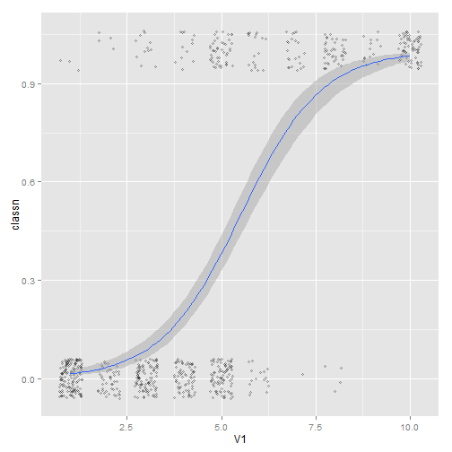 

```r
    
    
#====================================
sps <- ggplot(heightweight, aes(x=ageYear, y=heightIn, colour=sex)) +
       geom_point() +
       scale_colour_brewer(palette="Set1")

sps + geom_smooth()
```

```
## geom_smooth: method="auto" and size of largest group is <1000, so using loess. Use 'method = x' to change the smoothing method.
```

 

```r
    
    
#====================================
sps + geom_smooth(method=lm, se=FALSE, fullrange=TRUE)
```

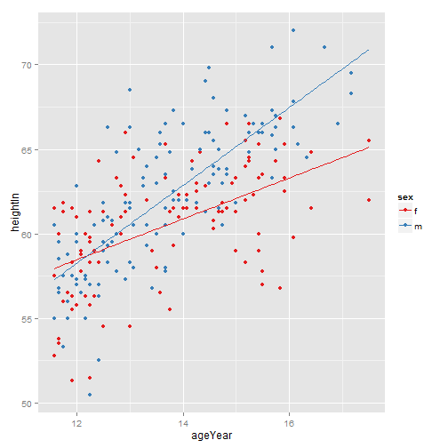 

```r
    
    
#====================================
library(gcookbook) # For the data set

model <- lm(heightIn ~ ageYear + I(ageYear^2), heightweight)
model
```

```
## 
## Call:
## lm(formula = heightIn ~ ageYear + I(ageYear^2), data = heightweight)
## 
## Coefficients:
##  (Intercept)       ageYear  I(ageYear^2)  
##      -10.314         8.667        -0.248
```

```r


# Create a data frame with ageYear column, interpolating across range
xmin <- min(heightweight$ageYear)
xmax <- max(heightweight$ageYear)
predicted <- data.frame(ageYear=seq(xmin, xmax, length.out=100))

# Calculate predicted values of heightIn
predicted$heightIn <- predict(model, predicted)
head(predicted)
```

```
##   ageYear heightIn
## 1   11.58    56.83
## 2   11.64    57.00
## 3   11.70    57.17
## 4   11.76    57.34
## 5   11.82    57.51
## 6   11.88    57.68
```

```r

#====================================
sp <- ggplot(heightweight, aes(x=ageYear, y=heightIn)) +
      geom_point(colour="grey40")

sp + geom_line(data=predicted, size=1)
```

 

```r
    
    
#====================================
# Given a model, predict values of yvar from xvar
# This supports one predictor and one predicted variable
# xrange: If NULL, determine the x range from the model object. If a vector with
#   two numbers, use those as the min and max of the prediction range.
# samples: Number of samples across the x range.
# ...: Further arguments to be passed to predict()
predictvals <- function(model, xvar, yvar, xrange=NULL, samples=100, ...) {

  # If xrange isn't passed in, determine xrange from the models.
  # Different ways of extracting the x range, depending on model type
  if (is.null(xrange)) {
    if (any(class(model) %in% c("lm", "glm")))
      xrange <- range(model$model[[xvar]])
    else if (any(class(model) %in% "loess"))
      xrange <- range(model$x)
  }

  newdata <- data.frame(x = seq(xrange[1], xrange[2], length.out = samples))
  names(newdata) <- xvar
  newdata[[yvar]] <- predict(model, newdata = newdata, ...)
  newdata
}
    
    
#====================================
modlinear <- lm(heightIn ~ ageYear, heightweight)

modloess  <- loess(heightIn ~ ageYear, heightweight)
    
    
#====================================
lm_predicted    <- predictvals(modlinear, "ageYear", "heightIn")
loess_predicted <- predictvals(modloess, "ageYear", "heightIn")

sp + geom_line(data=lm_predicted, colour="red", size=.8) +
     geom_line(data=loess_predicted, colour="blue", size=.8)
```

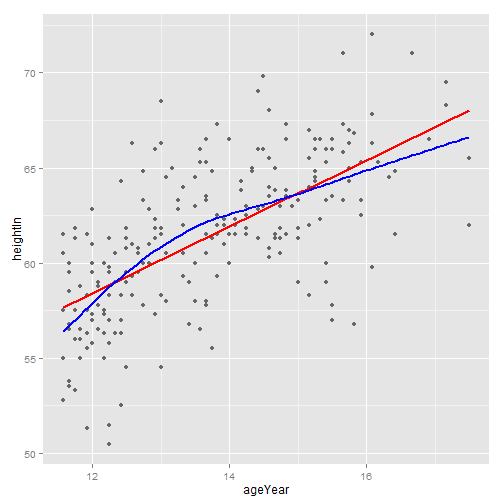 

```r
    
    
#====================================
library(MASS) # For the data set
b <- biopsy

b$classn[b$class=="benign"]    <- 0
b$classn[b$class=="malignant"] <- 1
    
    
#====================================
fitlogistic <- glm(classn ~ V1, b, family=binomial)
    
    
#====================================
# Get predicted values
glm_predicted <- predictvals(fitlogistic, "V1", "classn", type="response")

ggplot(b, aes(x=V1, y=classn)) +
    geom_point(position=position_jitter(width=.3, height=.08), alpha=0.4,
               shape=21, size=1.5) +
    geom_line(data=glm_predicted, colour="#1177FF", size=1)
```

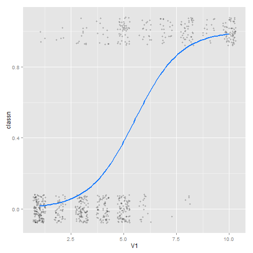 

```r
    
    
#====================================
make_model <- function(data) {
    lm(heightIn ~ ageYear, data)
}
    
    
#====================================
library(gcookbook) # For the data set
library(plyr)
models <- dlply(heightweight, "sex", .fun = make_model)

# Print out the list of two lm objects, f and m
models
```

```
## $f
## 
## Call:
## lm(formula = heightIn ~ ageYear, data = data)
## 
## Coefficients:
## (Intercept)      ageYear  
##       43.96         1.21  
## 
## 
## $m
## 
## Call:
## lm(formula = heightIn ~ ageYear, data = data)
## 
## Coefficients:
## (Intercept)      ageYear  
##        30.7          2.3  
## 
## 
## attr(,"split_type")
## [1] "data.frame"
## attr(,"split_labels")
##   sex
## 1   f
## 2   m
```

```r

#====================================
predvals <- ldply(models, .fun=predictvals, xvar="ageYear", yvar="heightIn")
head(predvals)
```

```
##   sex ageYear heightIn
## 1   f   11.58    57.96
## 2   f   11.64    58.03
## 3   f   11.70    58.11
## 4   f   11.76    58.18
## 5   f   11.82    58.25
## 6   f   11.88    58.32
```

```r

    
#====================================
ggplot(heightweight, aes(x=ageYear, y=heightIn, colour=sex)) +
    geom_point() + geom_line(data=predvals)
```

 

```r
    
    
#====================================
predvals <- ldply(models, .fun=predictvals, xvar="ageYear", yvar="heightIn",
                   xrange=range(heightweight$ageYear))
    
    
#====================================
ggplot(heightweight, aes(x=ageYear, y=heightIn, colour=sex)) +
    geom_point() + geom_line(data=predvals)
```

 

```r
    
    
#====================================
library(gcookbook) # For the data set

model <- lm(heightIn ~ ageYear, heightweight)
summary(model)
```

```
## 
## Call:
## lm(formula = heightIn ~ ageYear, data = heightweight)
## 
## Residuals:
##    Min     1Q Median     3Q    Max 
## -8.352 -1.901  0.138  1.907  8.337 
## 
## Coefficients:
##             Estimate Std. Error t value Pr(>|t|)    
## (Intercept)   37.436      1.828    20.5   <2e-16 ***
## ageYear        1.748      0.133    13.2   <2e-16 ***
## ---
## Signif. codes:  0 '***' 0.001 '**' 0.01 '*' 0.05 '.' 0.1 ' ' 1
## 
## Residual standard error: 2.99 on 234 degrees of freedom
## Multiple R-squared:  0.425,	Adjusted R-squared:  0.422 
## F-statistic:  173 on 1 and 234 DF,  p-value: <2e-16
```

```r

#====================================
# First generate prediction data
pred <- predictvals(model, "ageYear", "heightIn")
sp <- ggplot(heightweight, aes(x=ageYear, y=heightIn)) + geom_point() +
    geom_line(data=pred)

sp + annotate("text", label="r^2=0.42", x=16.5, y=52)
```

 

```r
    
    
#====================================
sp + annotate("text", label="r^2 == 0.42", parse = TRUE, x=16.5, y=52)
```

 

```r
    
    
#====================================
expression(r^2 == 0.42)  # Valid
```

```
## expression(r^2 == 0.42)
```

```r

expression(r^2 == 0.42)
```

```
## expression(r^2 == 0.42)
```

```r


expression(r^2 == 0.42)   # Not valid
```

```
## expression(r^2 == 0.42)
```

```r

#Error: unexpected '=' in "expression(r^2 ="
    
    
#====================================
eqn <- as.character(as.expression(
  substitute(italic(y) == a + b * italic(x) * "," ~~ italic(r)^2 ~ "=" ~ r2,
    list(a = format(coef(model)[1], digits=3),
         b = format(coef(model)[2], digits=3),
         r2 = format(summary(model)$r.squared, digits=2)
        ))))
eqn
```

```
## [1] "italic(y) == \"37.4\" + \"1.75\" * italic(x) * \",\" ~ ~italic(r)^2 ~ \"=\" ~ \"0.42\""
```

```r

#"italic(y) == \"37.4\" + \"1.75\" * italic(x) * \",\" ~ ~italic(r)^2 ~ \"=\" ~ 
#\"0.42\""


parse(text=eqn)  # Parsing turns it into an expression
```

```
## expression(italic(y) == "37.4" + "1.75" * italic(x) * "," ~ ~italic(r)^2 ~ 
##     "=" ~ "0.42")
```

```r

expression(italic(y) == "37.4" + "1.75" * italic(x) * "," ~ ~italic(r)^2 ~ "=" ~ 
"0.42")
```

```
## expression(italic(y) == "37.4" + "1.75" * italic(x) * "," ~ ~italic(r)^2 ~ 
##     "=" ~ "0.42")
```

```r
    
    
#====================================
sp + annotate("text", label=eqn, parse=TRUE, x=Inf, y=-Inf, hjust=1.1, vjust=-.5)
```

 

```r
    
    
#====================================
ggplot(faithful, aes(x=eruptions, y=waiting)) + geom_point() + geom_rug()
```

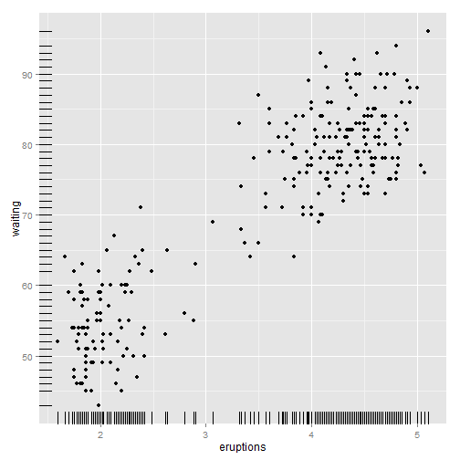 

```r
    
    
#====================================
ggplot(faithful, aes(x=eruptions, y=waiting)) + geom_point() +
    geom_rug(position="jitter", size=.2)
```

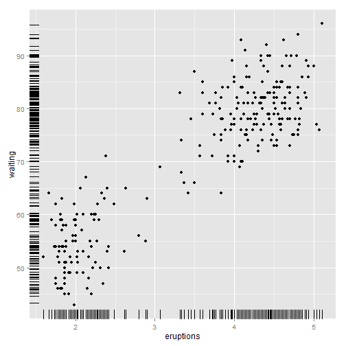 

```r
    
    
#====================================
library(gcookbook) # For the data set
subset(countries, Year==2009 & healthexp>2000)
```

```
##                 Name Code Year    GDP laborrate healthexp infmortality
## 254          Andorra  AND 2009     NA        NA      3090          3.1
## 560        Australia  AUS 2009  42131      65.2      3867          4.2
## 611          Austria  AUT 2009  45555      60.4      5037          3.6
## 968          Belgium  BEL 2009  43640      53.5      5104          3.6
## 1733          Canada  CAN 2009  39599      67.8      4380          5.2
## 2702         Denmark  DNK 2009  55933      65.4      6273          3.4
## 3365         Finland  FIN 2009  44577      60.9      4310          2.5
## 3416          France  FRA 2009  40663      56.1      4798          3.5
## 3671         Germany  DEU 2009  40659      59.8      4629          3.5
## 3824          Greece  GRC 2009  28936      53.7      3041          3.5
## 4436         Iceland  ISL 2009  37972      77.5      3130          1.7
## 4691         Ireland  IRL 2009  49738      63.6      4952          3.4
## 4844           Italy  ITA 2009  35073      49.1      3328          3.2
## 4946           Japan  JPN 2009  39456      59.5      3321          2.4
## 5864      Luxembourg  LUX 2009 106252      55.5      8183          2.2
## 6680          Monaco  MCO 2009 172676        NA      7137          3.4
## 7088     Netherlands  NLD 2009  48068      66.1      5164          3.8
## 7190     New Zealand  NZL 2009  29352      68.6      2634          4.9
## 7445          Norway  NOR 2009  78409      66.9      7662          2.9
## 7955        Portugal  PRT 2009  22030      62.5      2410          3.2
## 8312      San Marino  SMR 2009     NA        NA      4089          1.9
## 8822        Slovenia  SVN 2009  24101      58.9      2175          2.5
## 9077           Spain  ESP 2009  31891      58.6      3075          4.0
## 9536          Sweden  SWE 2009  43406      64.8      4252          2.4
## 9587     Switzerland  CHE 2009  63525      66.9      7141          4.1
## 10454 United Kingdom  GBR 2009  35163      62.2      3285          4.7
## 10505  United States  USA 2009  45745      65.0      7410          6.6
```

```r

#====================================
sp <- ggplot(subset(countries, Year==2009 & healthexp>2000),
             aes(x=healthexp, y=infmortality)) +
      geom_point()

sp + annotate("text", x=4350, y=5.4, label="Canada") +
     annotate("text", x=7400, y=6.8, label="USA")
```

 

```r
    
    
#====================================
sp + geom_text(aes(label=Name), size=4)
```

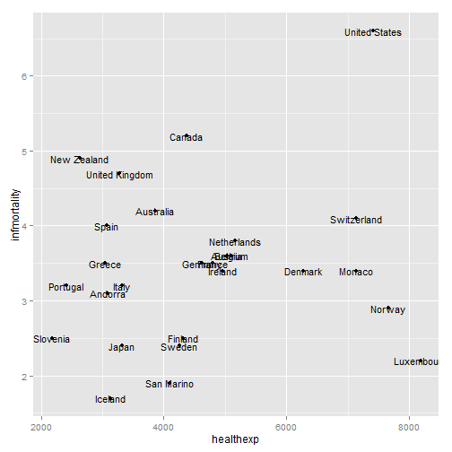 

```r
    
    
#====================================
sp + geom_text(aes(label=Name), size=4, vjust=0)
```

 

```r

# Add a little extra to y
sp + geom_text(aes(y=infmortality+.1, label=Name), size=4, vjust=0)
```

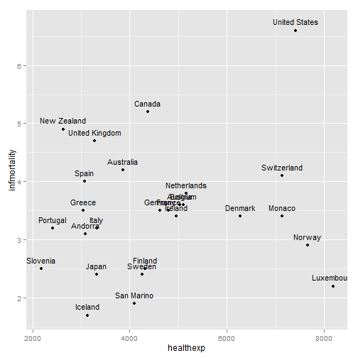 

```r
    
    
#====================================
sp + geom_text(aes(label=Name), size=4, hjust=0)
```

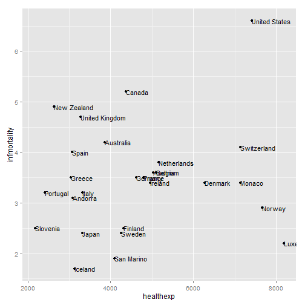 

```r

sp + geom_text(aes(x=healthexp+100, label=Name), size=4, hjust=0)
```

 

```r
    
    
#====================================
cdat <- subset(countries, Year==2009 & healthexp>2000)

cdat$Name1 <- cdat$Name
    
    
#====================================
idx <- cdat$Name1 %in% c("Canada", "Ireland", "United Kingdom", "United States",
                         "New Zealand", "Iceland", "Japan", "Luxembourg",
                         "Netherlands", "Switzerland")
idx
```

```
##  [1] FALSE FALSE FALSE FALSE  TRUE FALSE FALSE FALSE FALSE FALSE  TRUE
## [12]  TRUE FALSE  TRUE  TRUE FALSE  TRUE  TRUE FALSE FALSE FALSE FALSE
## [23] FALSE FALSE  TRUE  TRUE  TRUE
```

```r


#====================================
cdat$Name1[!idx] <- NA
    
    
#====================================
cdat
```

```
##                 Name Code Year    GDP laborrate healthexp infmortality
## 254          Andorra  AND 2009     NA        NA      3090          3.1
## 560        Australia  AUS 2009  42131      65.2      3867          4.2
## 611          Austria  AUT 2009  45555      60.4      5037          3.6
## 968          Belgium  BEL 2009  43640      53.5      5104          3.6
## 1733          Canada  CAN 2009  39599      67.8      4380          5.2
## 2702         Denmark  DNK 2009  55933      65.4      6273          3.4
## 3365         Finland  FIN 2009  44577      60.9      4310          2.5
## 3416          France  FRA 2009  40663      56.1      4798          3.5
## 3671         Germany  DEU 2009  40659      59.8      4629          3.5
## 3824          Greece  GRC 2009  28936      53.7      3041          3.5
## 4436         Iceland  ISL 2009  37972      77.5      3130          1.7
## 4691         Ireland  IRL 2009  49738      63.6      4952          3.4
## 4844           Italy  ITA 2009  35073      49.1      3328          3.2
## 4946           Japan  JPN 2009  39456      59.5      3321          2.4
## 5864      Luxembourg  LUX 2009 106252      55.5      8183          2.2
## 6680          Monaco  MCO 2009 172676        NA      7137          3.4
## 7088     Netherlands  NLD 2009  48068      66.1      5164          3.8
## 7190     New Zealand  NZL 2009  29352      68.6      2634          4.9
## 7445          Norway  NOR 2009  78409      66.9      7662          2.9
## 7955        Portugal  PRT 2009  22030      62.5      2410          3.2
## 8312      San Marino  SMR 2009     NA        NA      4089          1.9
## 8822        Slovenia  SVN 2009  24101      58.9      2175          2.5
## 9077           Spain  ESP 2009  31891      58.6      3075          4.0
## 9536          Sweden  SWE 2009  43406      64.8      4252          2.4
## 9587     Switzerland  CHE 2009  63525      66.9      7141          4.1
## 10454 United Kingdom  GBR 2009  35163      62.2      3285          4.7
## 10505  United States  USA 2009  45745      65.0      7410          6.6
##                Name1
## 254             <NA>
## 560             <NA>
## 611             <NA>
## 968             <NA>
## 1733          Canada
## 2702            <NA>
## 3365            <NA>
## 3416            <NA>
## 3671            <NA>
## 3824            <NA>
## 4436         Iceland
## 4691         Ireland
## 4844            <NA>
## 4946           Japan
## 5864      Luxembourg
## 6680            <NA>
## 7088     Netherlands
## 7190     New Zealand
## 7445            <NA>
## 7955            <NA>
## 8312            <NA>
## 8822            <NA>
## 9077            <NA>
## 9536            <NA>
## 9587     Switzerland
## 10454 United Kingdom
## 10505  United States
```

```r

    
    
#====================================
ggplot(cdat, aes(x=healthexp, y=infmortality)) +
    geom_point() +
    geom_text(aes(x=healthexp+100, label=Name1), size=4, hjust=0) +
    xlim(2000, 10000)
```

```
## Warning: Removed 17 rows containing missing values (geom_text).
```

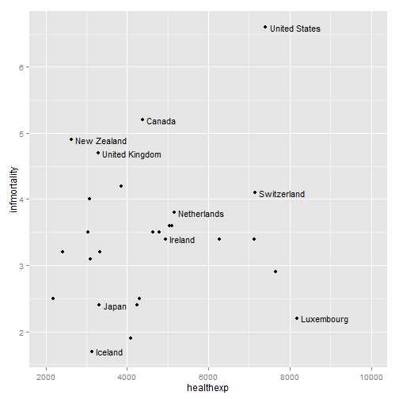 

```r
    
    
#====================================
library(gcookbook) # For the data set

cdat <- subset(countries, Year==2009 &
    Name %in% c("Canada", "Ireland", "United Kingdom", "United States",
                "New Zealand", "Iceland", "Japan", "Luxembourg",
                "Netherlands", "Switzerland"))

cdat
```

```
##                 Name Code Year    GDP laborrate healthexp infmortality
## 1733          Canada  CAN 2009  39599      67.8      4380          5.2
## 4436         Iceland  ISL 2009  37972      77.5      3130          1.7
## 4691         Ireland  IRL 2009  49738      63.6      4952          3.4
## 4946           Japan  JPN 2009  39456      59.5      3321          2.4
## 5864      Luxembourg  LUX 2009 106252      55.5      8183          2.2
## 7088     Netherlands  NLD 2009  48068      66.1      5164          3.8
## 7190     New Zealand  NZL 2009  29352      68.6      2634          4.9
## 9587     Switzerland  CHE 2009  63525      66.9      7141          4.1
## 10454 United Kingdom  GBR 2009  35163      62.2      3285          4.7
## 10505  United States  USA 2009  45745      65.0      7410          6.6
```

```r

    
    
#====================================
p <- ggplot(cdat, aes(x=healthexp, y=infmortality, size=GDP)) +
     geom_point(shape=21, colour="black", fill="cornsilk")

# GDP mapped to radius (default with scale_size_continuous)
p
```

 

```r

# GDP mapped to area instead, and larger circles
p + scale_size_area(max_size=15)
```

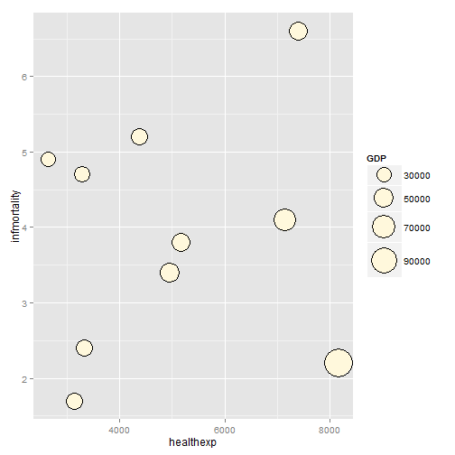 

```r
    
    
#====================================
# Add up counts for male and female
hec <- HairEyeColor[,,"Male"] + HairEyeColor[,,"Female"]

# Convert to long format
library(reshape2)
hec <- melt(hec, value.name="count")

ggplot(hec, aes(x=Eye, y=Hair)) +
    geom_point(aes(size=count), shape=21, colour="black", fill="cornsilk") +
    scale_size_area(max_size=20, guide=FALSE) +
    geom_text(aes(y=as.numeric(Hair)-sqrt(count)/22, label=count), vjust=1,
              colour="grey60", size=4)
```

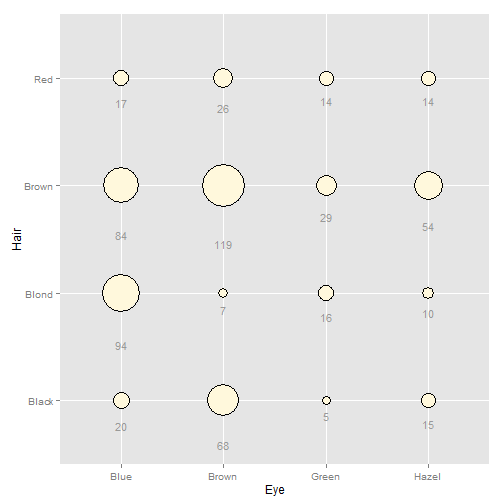 

```r
    
    
#====================================
library(gcookbook) # For the data set
c2009 <- subset(countries, Year==2009,
                select=c(Name, GDP, laborrate, healthexp, infmortality))

head(c2009)
```

```
##               Name  GDP laborrate healthexp infmortality
## 50     Afghanistan   NA      59.8     50.89        103.2
## 101        Albania 3773      59.5    264.60         17.2
## 152        Algeria 4022      58.5    267.95         32.0
## 203 American Samoa   NA        NA        NA           NA
## 254        Andorra   NA        NA   3089.64          3.1
## 305         Angola 4069      81.3    203.81         99.9
```

```r

#====================================
pairs(c2009[,2:5])
```

 

```r
    
    
#====================================
panel.cor <- function(x, y, digits=2, prefix="", cex.cor, ...) {
    usr <- par("usr")
    on.exit(par(usr))
    par(usr = c(0, 1, 0, 1))
    r <- abs(cor(x, y, use="complete.obs"))
    txt <- format(c(r, 0.123456789), digits=digits)[1]
    txt <- paste(prefix, txt, sep="")
    if(missing(cex.cor)) cex.cor <- 0.8/strwidth(txt)
    text(0.5, 0.5, txt, cex =  cex.cor * (1 + r) / 2)
}
    
    
#====================================
panel.hist <- function(x, ...) {
    usr <- par("usr")
    on.exit(par(usr))
    par(usr = c(usr[1:2], 0, 1.5) )
    h <- hist(x, plot = FALSE)
    breaks <- h$breaks
    nB <- length(breaks)
    y <- h$counts
    y <- y/max(y)
    rect(breaks[-nB], 0, breaks[-1], y, col="white", ...)
}
    
    
#====================================
pairs(c2009[,2:5], upper.panel = panel.cor,
                   diag.panel  = panel.hist,
                   lower.panel = panel.smooth)
```

 

```r
    
    
#====================================
panel.lm <- function (x, y, col = par("col"), bg = NA, pch = par("pch"),
                            cex = 1, col.smooth = "black", ...) {
    points(x, y, pch = pch, col = col, bg = bg, cex = cex)
    abline(stats::lm(y ~ x),  col = col.smooth, ...)
}
    
    
#====================================
pairs(c2009[,2:5], pch=".",
                   upper.panel = panel.cor,
                   diag.panel  = panel.hist,
                   lower.panel = panel.lm)
```

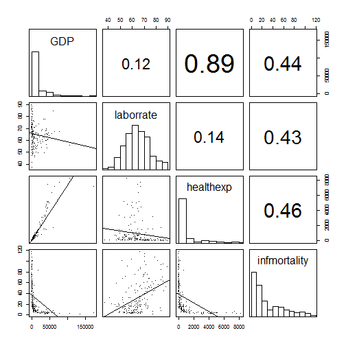 

```r
    
    
#==================
```

