# chapter: Scatter Plots
## 5.1.Making a Basic scatter Plot

```r
# ==================
library(gcookbook)  # For the data set
library(ggplot2)

# List the two columns we'll use
head(heightweight[, c("ageYear", "heightIn")])
```

```
##   ageYear heightIn
## 1   11.92     56.3
## 2   12.92     62.3
## 3   12.75     63.3
## 4   13.42     59.0
## 5   15.92     62.5
## 6   14.25     62.5
```

```r


# ====================================
ggplot(heightweight, aes(x = ageYear, y = heightIn)) + geom_point()
```

 

```r


# ====================================
ggplot(heightweight, aes(x = ageYear, y = heightIn)) + geom_point(shape = 21)
```

 

```r


# ====================================
ggplot(heightweight, aes(x = ageYear, y = heightIn)) + geom_point(size = 1.5)
```

 

## 5.2.Grouping Data Points by a Variable Using  

```r
# ====================================
library(gcookbook)  # For the data set
# Show the three columns we'll use
head(heightweight[, c("sex", "ageYear", "heightIn")])
```

```
##   sex ageYear heightIn
## 1   f   11.92     56.3
## 2   f   12.92     62.3
## 3   f   12.75     63.3
## 4   f   13.42     59.0
## 5   f   15.92     62.5
## 6   f   14.25     62.5
```

```r

# ====================================
ggplot(heightweight, aes(x = ageYear, y = heightIn, colour = sex)) + geom_point()
```

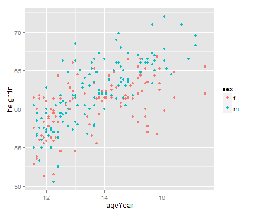 

```r

ggplot(heightweight, aes(x = ageYear, y = heightIn, shape = sex)) + geom_point()
```

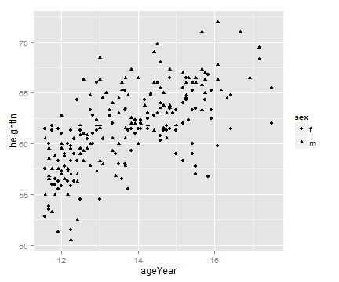 

```r


# ====================================
ggplot(heightweight, aes(x = ageYear, y = heightIn, shape = sex, colour = sex)) + 
    geom_point()
```

 

```r


# ====================================
ggplot(heightweight, aes(x = ageYear, y = heightIn, shape = sex, colour = sex)) + 
    geom_point() + scale_shape_manual(values = c(1, 2)) + scale_colour_brewer(palette = "Set1")
```

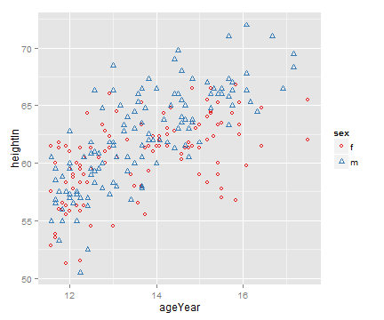 

## 5.3.Using Different Point Shapes

```r
# ====================================
library(gcookbook)  # For the data set

ggplot(heightweight, aes(x = ageYear, y = heightIn)) + geom_point(shape = 3)
```

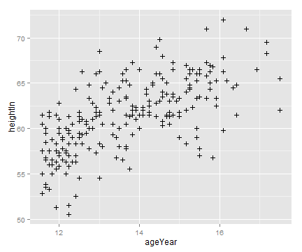 

```r


# ==================================== Use slightly larger points and use a
# shape scale with custom values
ggplot(heightweight, aes(x = ageYear, y = heightIn, shape = sex)) + geom_point(size = 3) + 
    scale_shape_manual(values = c(1, 4))
```

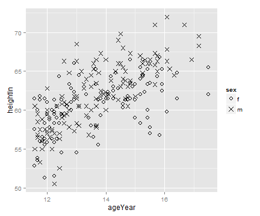 

```r


# ==================================== Make a copy of the data
hw <- heightweight
# Categorize into <100 and >=100 groups
hw$weightGroup <- cut(hw$weightLb, breaks = c(-Inf, 100, Inf), labels = c("< 100", 
    ">= 100"))

# Use shapes with fill and color, and use colors that are empty (NA) and
# filled
ggplot(hw, aes(x = ageYear, y = heightIn, shape = sex, fill = weightGroup)) + 
    geom_point(size = 2.5) + scale_shape_manual(values = c(21, 24)) + scale_fill_manual(values = c(NA, 
    "black"), guide = guide_legend(override.aes = list(shape = 21)))
```

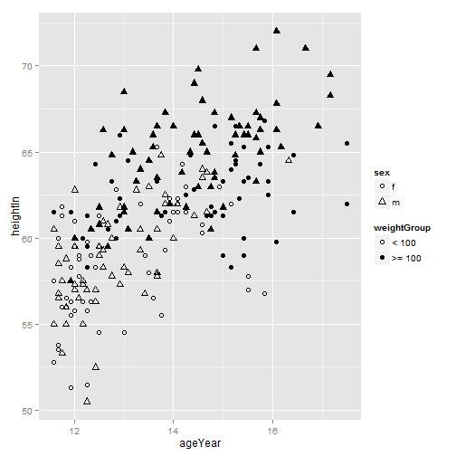 

## 5.4.Mapping a Continuous Variable to Color or Size

```r
#====================================
library(gcookbook) # For the data set

# List the four columns we'll use
head(heightweight[, c("sex", "ageYear", "heightIn", "weightLb")])
```

```
##   sex ageYear heightIn weightLb
## 1   f   11.92     56.3     85.0
## 2   f   12.92     62.3    105.0
## 3   f   12.75     63.3    108.0
## 4   f   13.42     59.0     92.0
## 5   f   15.92     62.5    112.5
## 6   f   14.25     62.5    112.0
```

```r

#====================================
ggplot(heightweight, aes(x=ageYear, y=heightIn, colour=weightLb)) + geom_point()
```

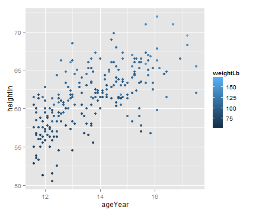 

```r

ggplot(heightweight, aes(x=ageYear, y=heightIn, size=weightLb)) + geom_point()
```

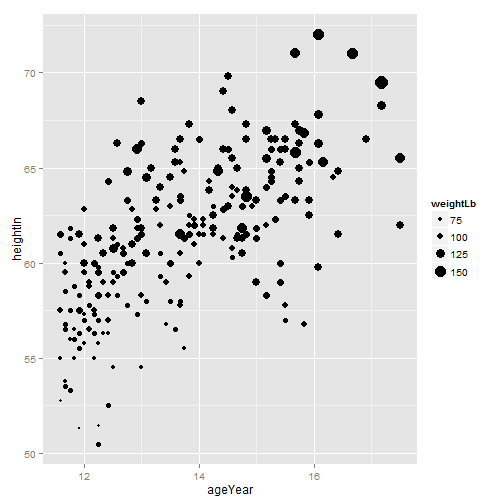 

```r
    
    
#====================================
ggplot(heightweight, aes(x=weightLb, y=heightIn, fill=ageYear)) +
    geom_point(shape=21, size=2.5) +
    scale_fill_gradient(low="black", high="white")
```

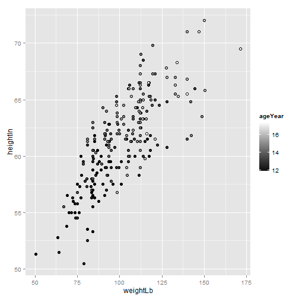 

```r

# Using guide_legend() will result in a discrete legend instead of a colorbar
ggplot(heightweight, aes(x=weightLb, y=heightIn, fill=ageYear)) +
    geom_point(shape=21, size=2.5) +
    scale_fill_gradient(low="black", high="white", breaks=12:17,
                        guide=guide_legend())
```

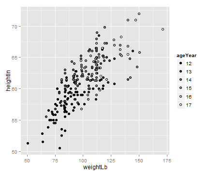 

```r
    
    
#====================================
ggplot(heightweight, aes(x=ageYear, y=heightIn, size=weightLb, colour=sex)) +
    geom_point(alpha=.5) +
    scale_size_area() +     # Make area proportional to numeric value
    scale_colour_brewer(palette="Set1")
```

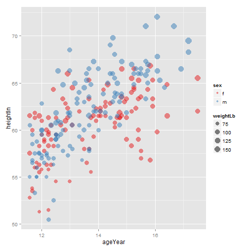 

## 5.5.Dealing with Overplotting

```r
# ====================================
sp <- ggplot(diamonds, aes(x = carat, y = price))

sp + geom_point()
```

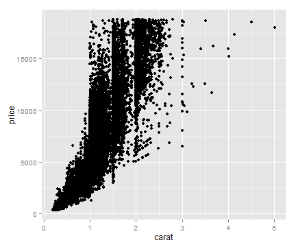 

```r
# ====================================
sp + geom_point(alpha = 0.1)
```

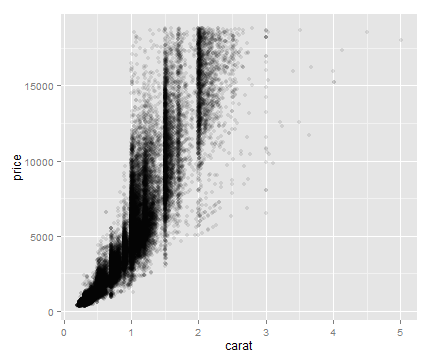 

```r

sp + geom_point(alpha = 0.01)
```

 

```r


# ====================================
sp + stat_bin2d()
```

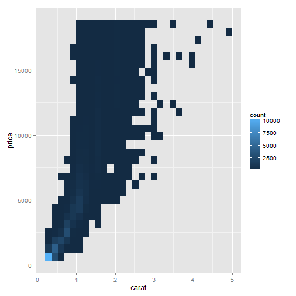 

```r

sp + stat_bin2d(bins = 50) + scale_fill_gradient(low = "lightblue", high = "red", 
    limits = c(0, 6000))
```

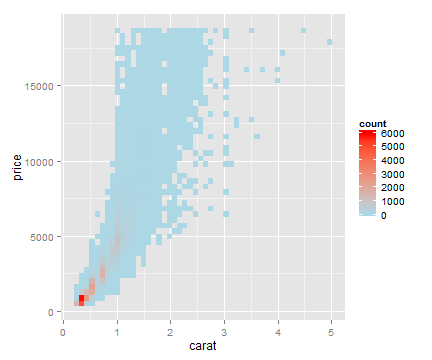 

```r


# ==================================== install.packages('hexbin')
library(hexbin)
```

```
## Loading required package: grid
## Loading required package: lattice
```

```r

sp + stat_binhex() + scale_fill_gradient(low = "lightblue", high = "red", limits = c(0, 
    8000))
```

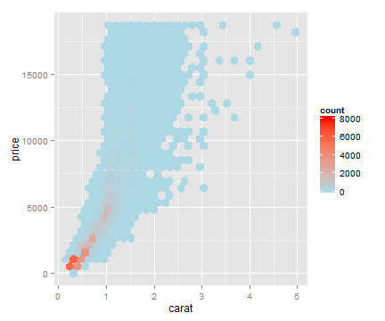 

```r

sp + stat_binhex() + scale_fill_gradient(low = "lightblue", high = "red", breaks = c(0, 
    250, 500, 1000, 2000, 4000, 6000), limits = c(0, 6000))
```

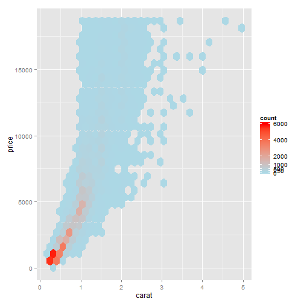 

```r


# ====================================
sp1 <- ggplot(ChickWeight, aes(x = Time, y = weight))

sp1 + geom_point()
```

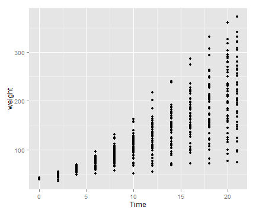 

```r

sp1 + geom_point(position = "jitter")
```

 

```r
# Could also use geom_jitter(), which is equivalent

sp1 + geom_point(position = position_jitter(width = 0.5, height = 0))
```

 

```r


# ====================================
sp1 + geom_boxplot(aes(group = Time))
```

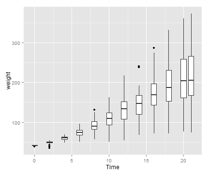 

## 5.6.Adding Fitted Regression Model Lines

```r
# ====================================
library(gcookbook)  # For the data set

# The base plot
sp <- ggplot(heightweight, aes(x = ageYear, y = heightIn))

sp + geom_point() + stat_smooth(method = lm)
```

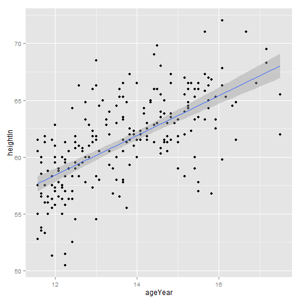 

```r


# ==================================== 99% confidence region
sp + geom_point() + stat_smooth(method = lm, level = 0.99)
```

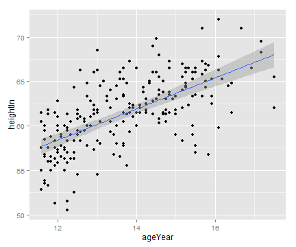 

```r

# No confidence region
sp + geom_point() + stat_smooth(method = lm, se = FALSE)
```

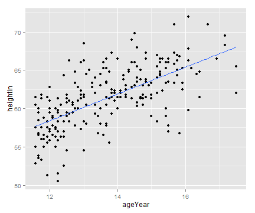 

```r


# ====================================
sp + geom_point(colour = "grey60") + stat_smooth(method = lm, se = FALSE, colour = "black")
```

 

```r


# ====================================
sp + geom_point(colour = "grey60") + stat_smooth()
```

```
## geom_smooth: method="auto" and size of largest group is <1000, so using loess. Use 'method = x' to change the smoothing method.
```

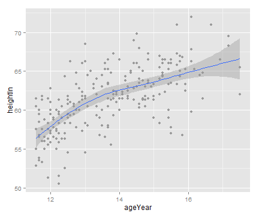 

```r
sp + geom_point(colour = "grey60") + stat_smooth(method = loess)
```

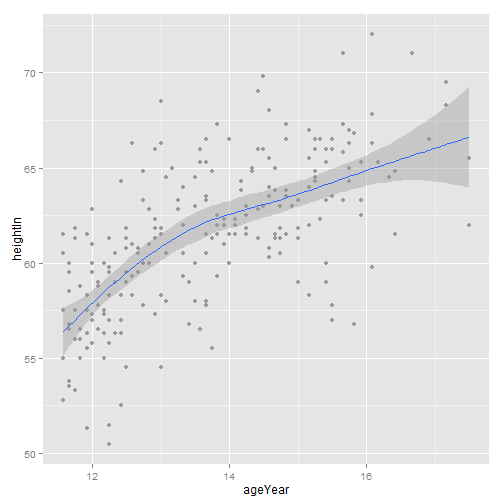 

```r


# ====================================
library(MASS)  # For the data set

b <- biopsy

b$classn[b$class == "benign"] <- 0
b$classn[b$class == "malignant"] <- 1

head(b)
```

```
##        ID V1 V2 V3 V4 V5 V6 V7 V8 V9     class classn
## 1 1000025  5  1  1  1  2  1  3  1  1    benign      0
## 2 1002945  5  4  4  5  7 10  3  2  1    benign      0
## 3 1015425  3  1  1  1  2  2  3  1  1    benign      0
## 4 1016277  6  8  8  1  3  4  3  7  1    benign      0
## 5 1017023  4  1  1  3  2  1  3  1  1    benign      0
## 6 1017122  8 10 10  8  7 10  9  7  1 malignant      1
```

```r

# ====================================
ggplot(b, aes(x = V1, y = classn)) + geom_point(position = position_jitter(width = 0.3, 
    height = 0.06), alpha = 0.4, shape = 21, size = 1.5) + stat_smooth(method = glm, 
    family = binomial)
```

 

```r


# ====================================
sps <- ggplot(heightweight, aes(x = ageYear, y = heightIn, colour = sex)) + 
    geom_point() + scale_colour_brewer(palette = "Set1")

sps + geom_smooth()
```

```
## geom_smooth: method="auto" and size of largest group is <1000, so using loess. Use 'method = x' to change the smoothing method.
```

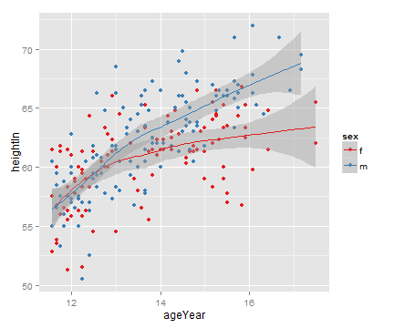 

```r


# ====================================
sps + geom_smooth(method = lm, se = FALSE, fullrange = TRUE)
```

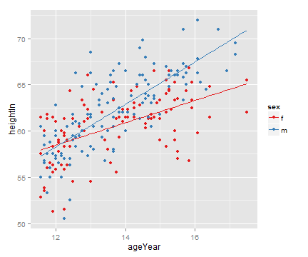 

## 5.7.Adding Fitted Lines from an Existing Model

```r
# ====================================
library(gcookbook)  # For the data set

model <- lm(heightIn ~ ageYear + I(ageYear^2), heightweight)
model
```

```
## 
## Call:
## lm(formula = heightIn ~ ageYear + I(ageYear^2), data = heightweight)
## 
## Coefficients:
##  (Intercept)       ageYear  I(ageYear^2)  
##      -10.314         8.667        -0.248
```

```r


# Create a data frame with ageYear column, interpolating across range
xmin <- min(heightweight$ageYear)
xmax <- max(heightweight$ageYear)
predicted <- data.frame(ageYear = seq(xmin, xmax, length.out = 100))

# Calculate predicted values of heightIn
predicted$heightIn <- predict(model, predicted)
head(predicted)
```

```
##   ageYear heightIn
## 1   11.58    56.83
## 2   11.64    57.00
## 3   11.70    57.17
## 4   11.76    57.34
## 5   11.82    57.51
## 6   11.88    57.68
```

```r

# ====================================
sp <- ggplot(heightweight, aes(x = ageYear, y = heightIn)) + geom_point(colour = "grey40")

sp + geom_line(data = predicted, size = 1)
```

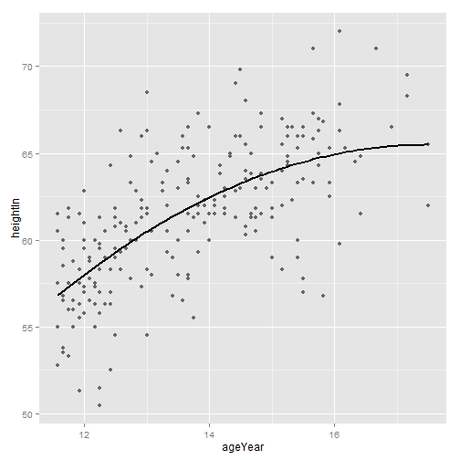 

```r


# ==================================== Given a model, predict values of yvar
# from xvar This supports one predictor and one predicted variable xrange:
# If NULL, determine the x range from the model object. If a vector with two
# numbers, use those as the min and max of the prediction range.  samples:
# Number of samples across the x range.  ...: Further arguments to be passed
# to predict()
predictvals <- function(model, xvar, yvar, xrange = NULL, samples = 100, ...) {
    
    # If xrange isn't passed in, determine xrange from the models.  Different
    # ways of extracting the x range, depending on model type
    if (is.null(xrange)) {
        if (any(class(model) %in% c("lm", "glm"))) 
            xrange <- range(model$model[[xvar]]) else if (any(class(model) %in% "loess")) 
            xrange <- range(model$x)
    }
    
    newdata <- data.frame(x = seq(xrange[1], xrange[2], length.out = samples))
    names(newdata) <- xvar
    newdata[[yvar]] <- predict(model, newdata = newdata, ...)
    newdata
}


# ====================================
modlinear <- lm(heightIn ~ ageYear, heightweight)

modloess <- loess(heightIn ~ ageYear, heightweight)


# ====================================
lm_predicted <- predictvals(modlinear, "ageYear", "heightIn")
loess_predicted <- predictvals(modloess, "ageYear", "heightIn")

sp + geom_line(data = lm_predicted, colour = "red", size = 0.8) + geom_line(data = loess_predicted, 
    colour = "blue", size = 0.8)
```

 

```r


# ====================================
library(MASS)  # For the data set
b <- biopsy

b$classn[b$class == "benign"] <- 0
b$classn[b$class == "malignant"] <- 1


# ====================================
fitlogistic <- glm(classn ~ V1, b, family = binomial)


# ==================================== Get predicted values
glm_predicted <- predictvals(fitlogistic, "V1", "classn", type = "response")

ggplot(b, aes(x = V1, y = classn)) + geom_point(position = position_jitter(width = 0.3, 
    height = 0.08), alpha = 0.4, shape = 21, size = 1.5) + geom_line(data = glm_predicted, 
    colour = "#1177FF", size = 1)
```

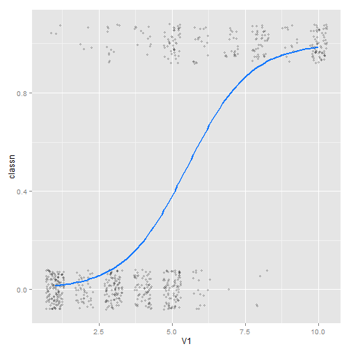 

## 5.8.Adding Fitted Lines from Multiple Existing Models

```r
# ====================================
make_model <- function(data) {
    lm(heightIn ~ ageYear, data)
}


# ====================================
library(gcookbook)  # For the data set
library(plyr)
models <- dlply(heightweight, "sex", .fun = make_model)

# Print out the list of two lm objects, f and m
models
```

```
## $f
## 
## Call:
## lm(formula = heightIn ~ ageYear, data = data)
## 
## Coefficients:
## (Intercept)      ageYear  
##       43.96         1.21  
## 
## 
## $m
## 
## Call:
## lm(formula = heightIn ~ ageYear, data = data)
## 
## Coefficients:
## (Intercept)      ageYear  
##        30.7          2.3  
## 
## 
## attr(,"split_type")
## [1] "data.frame"
## attr(,"split_labels")
##   sex
## 1   f
## 2   m
```

```r

# ====================================
predvals <- ldply(models, .fun = predictvals, xvar = "ageYear", yvar = "heightIn")
head(predvals)
```

```
##   sex ageYear heightIn
## 1   f   11.58    57.96
## 2   f   11.64    58.03
## 3   f   11.70    58.11
## 4   f   11.76    58.18
## 5   f   11.82    58.25
## 6   f   11.88    58.32
```

```r


# ====================================
ggplot(heightweight, aes(x = ageYear, y = heightIn, colour = sex)) + geom_point() + 
    geom_line(data = predvals)
```

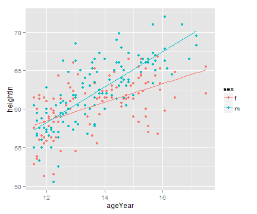 

```r


# ====================================
predvals <- ldply(models, .fun = predictvals, xvar = "ageYear", yvar = "heightIn", 
    xrange = range(heightweight$ageYear))


# ====================================
ggplot(heightweight, aes(x = ageYear, y = heightIn, colour = sex)) + geom_point() + 
    geom_line(data = predvals)
```

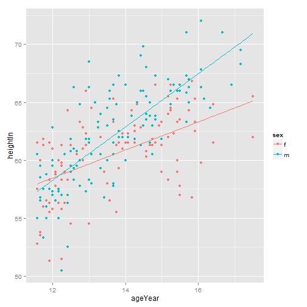 

## 5.9.Adding Annotations with Model Coefficients

```r
# ====================================
library(gcookbook)  # For the data set

model <- lm(heightIn ~ ageYear, heightweight)
summary(model)
```

```
## 
## Call:
## lm(formula = heightIn ~ ageYear, data = heightweight)
## 
## Residuals:
##    Min     1Q Median     3Q    Max 
## -8.352 -1.901  0.138  1.907  8.337 
## 
## Coefficients:
##             Estimate Std. Error t value Pr(>|t|)    
## (Intercept)   37.436      1.828    20.5   <2e-16 ***
## ageYear        1.748      0.133    13.2   <2e-16 ***
## ---
## Signif. codes:  0 '***' 0.001 '**' 0.01 '*' 0.05 '.' 0.1 ' ' 1
## 
## Residual standard error: 2.99 on 234 degrees of freedom
## Multiple R-squared:  0.425,	Adjusted R-squared:  0.422 
## F-statistic:  173 on 1 and 234 DF,  p-value: <2e-16
```

```r

# ==================================== First generate prediction data
pred <- predictvals(model, "ageYear", "heightIn")
sp <- ggplot(heightweight, aes(x = ageYear, y = heightIn)) + geom_point() + 
    geom_line(data = pred)

sp + annotate("text", label = "r^2=0.42", x = 16.5, y = 52)
```

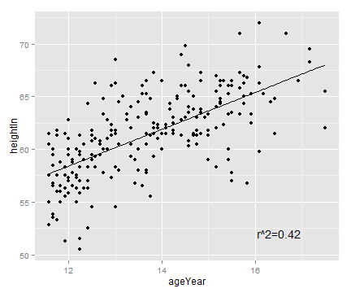 

```r


# ====================================
sp + annotate("text", label = "r^2 == 0.42", parse = TRUE, x = 16.5, y = 52)
```

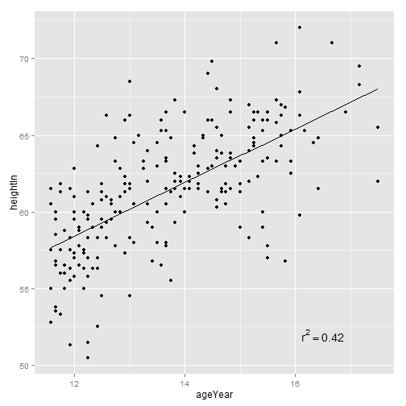 

```r


# ====================================
expression(r^2 == 0.42)  # Valid
```

```
## expression(r^2 == 0.42)
```

```r

expression(r^2 == 0.42)
```

```
## expression(r^2 == 0.42)
```

```r


expression(r^2 == 0.42)  # Not valid
```

```
## expression(r^2 == 0.42)
```

```r

# ====================================
eqn <- as.character(as.expression(substitute(italic(y) == a + b * italic(x) * 
    "," ~ ~italic(r)^2 ~ "=" ~ r2, list(a = format(coef(model)[1], digits = 3), 
    b = format(coef(model)[2], digits = 3), r2 = format(summary(model)$r.squared, 
        digits = 2)))))
eqn
```

```
## [1] "italic(y) == \"37.4\" + \"1.75\" * italic(x) * \",\" ~ ~italic(r)^2 ~ \"=\" ~ \"0.42\""
```

```r

#'italic(y) == \'37.4\' + \'1.75\' * italic(x) * \',\' ~ ~italic(r)^2 ~ \'=\' ~ 
# \'0.42\''


parse(text = eqn)  # Parsing turns it into an expression
```

```
## expression(italic(y) == "37.4" + "1.75" * italic(x) * "," ~ ~italic(r)^2 ~ 
##     "=" ~ "0.42")
```

```r

expression(italic(y) == "37.4" + "1.75" * italic(x) * "," ~ ~italic(r)^2 ~ "=" ~ 
    "0.42")
```

```
## expression(italic(y) == "37.4" + "1.75" * italic(x) * "," ~ ~italic(r)^2 ~ 
##     "=" ~ "0.42")
```

```r


# ====================================
sp + annotate("text", label = eqn, parse = TRUE, x = Inf, y = -Inf, hjust = 1.1, 
    vjust = -0.5)
```

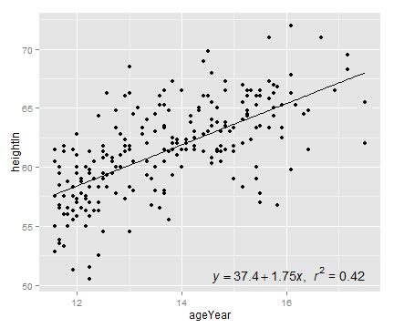 

```r


# ====================================
ggplot(faithful, aes(x = eruptions, y = waiting)) + geom_point() + geom_rug()
```

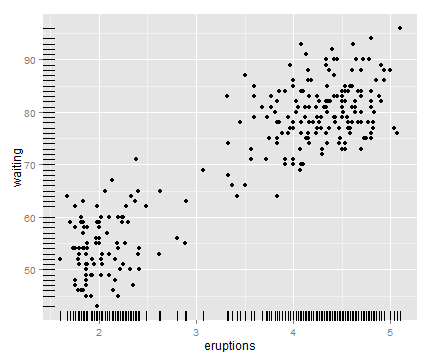 

```r


# ====================================
ggplot(faithful, aes(x = eruptions, y = waiting)) + geom_point() + geom_rug(position = "jitter", 
    size = 0.2)
```

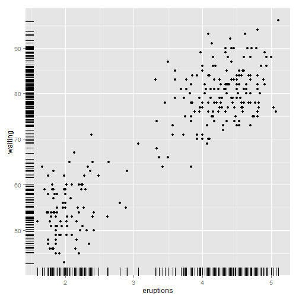 

## 5.11.Labeling Points in a Scatter Plot

```r
# ====================================
library(gcookbook)  # For the data set
subset(countries, Year == 2009 & healthexp > 2000)
```

```
##                 Name Code Year    GDP laborrate healthexp infmortality
## 254          Andorra  AND 2009     NA        NA      3090          3.1
## 560        Australia  AUS 2009  42131      65.2      3867          4.2
## 611          Austria  AUT 2009  45555      60.4      5037          3.6
## 968          Belgium  BEL 2009  43640      53.5      5104          3.6
## 1733          Canada  CAN 2009  39599      67.8      4380          5.2
## 2702         Denmark  DNK 2009  55933      65.4      6273          3.4
## 3365         Finland  FIN 2009  44577      60.9      4310          2.5
## 3416          France  FRA 2009  40663      56.1      4798          3.5
## 3671         Germany  DEU 2009  40659      59.8      4629          3.5
## 3824          Greece  GRC 2009  28936      53.7      3041          3.5
## 4436         Iceland  ISL 2009  37972      77.5      3130          1.7
## 4691         Ireland  IRL 2009  49738      63.6      4952          3.4
## 4844           Italy  ITA 2009  35073      49.1      3328          3.2
## 4946           Japan  JPN 2009  39456      59.5      3321          2.4
## 5864      Luxembourg  LUX 2009 106252      55.5      8183          2.2
## 6680          Monaco  MCO 2009 172676        NA      7137          3.4
## 7088     Netherlands  NLD 2009  48068      66.1      5164          3.8
## 7190     New Zealand  NZL 2009  29352      68.6      2634          4.9
## 7445          Norway  NOR 2009  78409      66.9      7662          2.9
## 7955        Portugal  PRT 2009  22030      62.5      2410          3.2
## 8312      San Marino  SMR 2009     NA        NA      4089          1.9
## 8822        Slovenia  SVN 2009  24101      58.9      2175          2.5
## 9077           Spain  ESP 2009  31891      58.6      3075          4.0
## 9536          Sweden  SWE 2009  43406      64.8      4252          2.4
## 9587     Switzerland  CHE 2009  63525      66.9      7141          4.1
## 10454 United Kingdom  GBR 2009  35163      62.2      3285          4.7
## 10505  United States  USA 2009  45745      65.0      7410          6.6
```

```r

# ====================================
sp <- ggplot(subset(countries, Year == 2009 & healthexp > 2000), aes(x = healthexp, 
    y = infmortality)) + geom_point()

sp + annotate("text", x = 4350, y = 5.4, label = "Canada") + annotate("text", 
    x = 7400, y = 6.8, label = "USA")
```

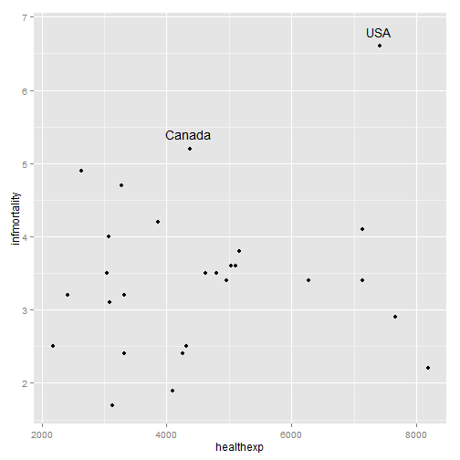 

```r


# ====================================
sp + geom_text(aes(label = Name), size = 4)
```

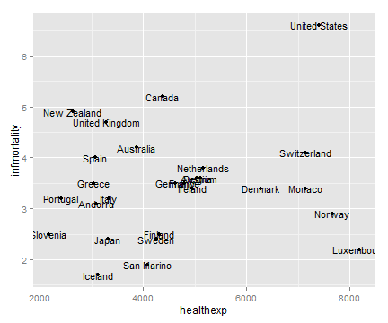 

```r


# ====================================
sp + geom_text(aes(label = Name), size = 4, vjust = 0)
```

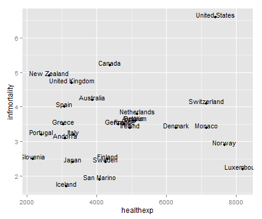 

```r

# Add a little extra to y
sp + geom_text(aes(y = infmortality + 0.1, label = Name), size = 4, vjust = 0)
```

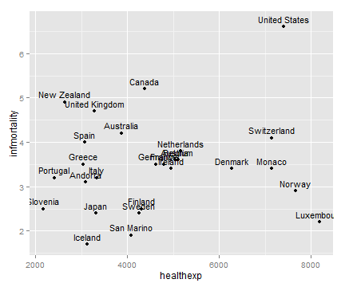 

```r


# ====================================
sp + geom_text(aes(label = Name), size = 4, hjust = 0)
```

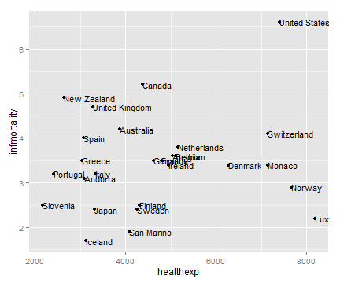 

```r

sp + geom_text(aes(x = healthexp + 100, label = Name), size = 4, hjust = 0)
```

 

```r


# ====================================
cdat <- subset(countries, Year == 2009 & healthexp > 2000)

cdat$Name1 <- cdat$Name


# ====================================
idx <- cdat$Name1 %in% c("Canada", "Ireland", "United Kingdom", "United States", 
    "New Zealand", "Iceland", "Japan", "Luxembourg", "Netherlands", "Switzerland")
idx
```

```
##  [1] FALSE FALSE FALSE FALSE  TRUE FALSE FALSE FALSE FALSE FALSE  TRUE
## [12]  TRUE FALSE  TRUE  TRUE FALSE  TRUE  TRUE FALSE FALSE FALSE FALSE
## [23] FALSE FALSE  TRUE  TRUE  TRUE
```

```r


# ====================================
cdat$Name1[!idx] <- NA


# ====================================
cdat
```

```
##                 Name Code Year    GDP laborrate healthexp infmortality
## 254          Andorra  AND 2009     NA        NA      3090          3.1
## 560        Australia  AUS 2009  42131      65.2      3867          4.2
## 611          Austria  AUT 2009  45555      60.4      5037          3.6
## 968          Belgium  BEL 2009  43640      53.5      5104          3.6
## 1733          Canada  CAN 2009  39599      67.8      4380          5.2
## 2702         Denmark  DNK 2009  55933      65.4      6273          3.4
## 3365         Finland  FIN 2009  44577      60.9      4310          2.5
## 3416          France  FRA 2009  40663      56.1      4798          3.5
## 3671         Germany  DEU 2009  40659      59.8      4629          3.5
## 3824          Greece  GRC 2009  28936      53.7      3041          3.5
## 4436         Iceland  ISL 2009  37972      77.5      3130          1.7
## 4691         Ireland  IRL 2009  49738      63.6      4952          3.4
## 4844           Italy  ITA 2009  35073      49.1      3328          3.2
## 4946           Japan  JPN 2009  39456      59.5      3321          2.4
## 5864      Luxembourg  LUX 2009 106252      55.5      8183          2.2
## 6680          Monaco  MCO 2009 172676        NA      7137          3.4
## 7088     Netherlands  NLD 2009  48068      66.1      5164          3.8
## 7190     New Zealand  NZL 2009  29352      68.6      2634          4.9
## 7445          Norway  NOR 2009  78409      66.9      7662          2.9
## 7955        Portugal  PRT 2009  22030      62.5      2410          3.2
## 8312      San Marino  SMR 2009     NA        NA      4089          1.9
## 8822        Slovenia  SVN 2009  24101      58.9      2175          2.5
## 9077           Spain  ESP 2009  31891      58.6      3075          4.0
## 9536          Sweden  SWE 2009  43406      64.8      4252          2.4
## 9587     Switzerland  CHE 2009  63525      66.9      7141          4.1
## 10454 United Kingdom  GBR 2009  35163      62.2      3285          4.7
## 10505  United States  USA 2009  45745      65.0      7410          6.6
##                Name1
## 254             <NA>
## 560             <NA>
## 611             <NA>
## 968             <NA>
## 1733          Canada
## 2702            <NA>
## 3365            <NA>
## 3416            <NA>
## 3671            <NA>
## 3824            <NA>
## 4436         Iceland
## 4691         Ireland
## 4844            <NA>
## 4946           Japan
## 5864      Luxembourg
## 6680            <NA>
## 7088     Netherlands
## 7190     New Zealand
## 7445            <NA>
## 7955            <NA>
## 8312            <NA>
## 8822            <NA>
## 9077            <NA>
## 9536            <NA>
## 9587     Switzerland
## 10454 United Kingdom
## 10505  United States
```

```r


# ====================================
ggplot(cdat, aes(x = healthexp, y = infmortality)) + geom_point() + geom_text(aes(x = healthexp + 
    100, label = Name1), size = 4, hjust = 0) + xlim(2000, 10000)
```

```
## Warning: Removed 17 rows containing missing values (geom_text).
```

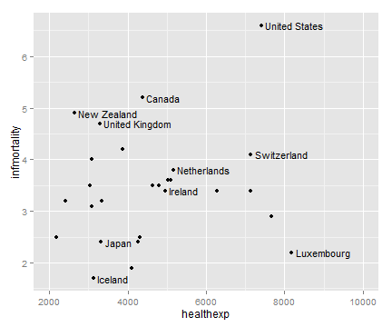 

## 5.12.Creating a Balloon Plot

```r
# ====================================
library(gcookbook)  # For the data set

cdat <- subset(countries, Year == 2009 & Name %in% c("Canada", "Ireland", "United Kingdom", 
    "United States", "New Zealand", "Iceland", "Japan", "Luxembourg", "Netherlands", 
    "Switzerland"))

cdat
```

```
##                 Name Code Year    GDP laborrate healthexp infmortality
## 1733          Canada  CAN 2009  39599      67.8      4380          5.2
## 4436         Iceland  ISL 2009  37972      77.5      3130          1.7
## 4691         Ireland  IRL 2009  49738      63.6      4952          3.4
## 4946           Japan  JPN 2009  39456      59.5      3321          2.4
## 5864      Luxembourg  LUX 2009 106252      55.5      8183          2.2
## 7088     Netherlands  NLD 2009  48068      66.1      5164          3.8
## 7190     New Zealand  NZL 2009  29352      68.6      2634          4.9
## 9587     Switzerland  CHE 2009  63525      66.9      7141          4.1
## 10454 United Kingdom  GBR 2009  35163      62.2      3285          4.7
## 10505  United States  USA 2009  45745      65.0      7410          6.6
```

```r


# ====================================
p <- ggplot(cdat, aes(x = healthexp, y = infmortality, size = GDP)) + geom_point(shape = 21, 
    colour = "black", fill = "cornsilk")

# GDP mapped to radius (default with scale_size_continuous)
p
```

 

```r

# GDP mapped to area instead, and larger circles
p + scale_size_area(max_size = 15)
```

 

```r


# ==================================== Add up counts for male and female
hec <- HairEyeColor[, , "Male"] + HairEyeColor[, , "Female"]

# Convert to long format
library(reshape2)
hec <- melt(hec, value.name = "count")

ggplot(hec, aes(x = Eye, y = Hair)) + geom_point(aes(size = count), shape = 21, 
    colour = "black", fill = "cornsilk") + scale_size_area(max_size = 20, guide = FALSE) + 
    geom_text(aes(y = as.numeric(Hair) - sqrt(count)/22, label = count), vjust = 1, 
        colour = "grey60", size = 4)
```

 

## 5.13.Making a Scatter Plot Matrix

```r
# ====================================
library(gcookbook)  # For the data set
c2009 <- subset(countries, Year == 2009, select = c(Name, GDP, laborrate, healthexp, 
    infmortality))

head(c2009)
```

```
##               Name  GDP laborrate healthexp infmortality
## 50     Afghanistan   NA      59.8     50.89        103.2
## 101        Albania 3773      59.5    264.60         17.2
## 152        Algeria 4022      58.5    267.95         32.0
## 203 American Samoa   NA        NA        NA           NA
## 254        Andorra   NA        NA   3089.64          3.1
## 305         Angola 4069      81.3    203.81         99.9
```

```r

# ====================================
pairs(c2009[, 2:5])
```

 

```r


# ====================================
panel.cor <- function(x, y, digits = 2, prefix = "", cex.cor, ...) {
    usr <- par("usr")
    on.exit(par(usr))
    par(usr = c(0, 1, 0, 1))
    r <- abs(cor(x, y, use = "complete.obs"))
    txt <- format(c(r, 0.123456789), digits = digits)[1]
    txt <- paste(prefix, txt, sep = "")
    if (missing(cex.cor)) 
        cex.cor <- 0.8/strwidth(txt)
    text(0.5, 0.5, txt, cex = cex.cor * (1 + r)/2)
}


# ====================================
panel.hist <- function(x, ...) {
    usr <- par("usr")
    on.exit(par(usr))
    par(usr = c(usr[1:2], 0, 1.5))
    h <- hist(x, plot = FALSE)
    breaks <- h$breaks
    nB <- length(breaks)
    y <- h$counts
    y <- y/max(y)
    rect(breaks[-nB], 0, breaks[-1], y, col = "white", ...)
}


# ====================================
pairs(c2009[, 2:5], upper.panel = panel.cor, diag.panel = panel.hist, lower.panel = panel.smooth)
```

 

```r


# ====================================
panel.lm <- function(x, y, col = par("col"), bg = NA, pch = par("pch"), cex = 1, 
    col.smooth = "black", ...) {
    points(x, y, pch = pch, col = col, bg = bg, cex = cex)
    abline(stats::lm(y ~ x), col = col.smooth, ...)
}


# ====================================
pairs(c2009[, 2:5], pch = ".", upper.panel = panel.cor, diag.panel = panel.hist, 
    lower.panel = panel.lm)
```

 

```r


# ==================
```

