chapter: Summarized Data Distributions

```r
#==================
library(ggplot2)
ggplot(faithful, aes(x=waiting)) + geom_histogram()
```

```
## stat_bin: binwidth defaulted to range/30. Use 'binwidth = x' to adjust this.
```

 

```r
    
    
#====================================
head(faithful)
```

```
##   eruptions waiting
## 1     3.600      79
## 2     1.800      54
## 3     3.333      74
## 4     2.283      62
## 5     4.533      85
## 6     2.883      55
```

```r
    
#====================================
# Store the values in a simple vector
w <- faithful$waiting

ggplot(NULL, aes(x=w)) + geom_histogram()
```

```
## stat_bin: binwidth defaulted to range/30. Use 'binwidth = x' to adjust this.
```

 

```r
    
    
#====================================
# Set the width of each bin to 5
ggplot(faithful, aes(x=waiting)) +
    geom_histogram(binwidth=5, fill="white", colour="black")
```

 

```r

# Divide the x range into 15 bins
binsize <- diff(range(faithful$waiting))/15
ggplot(faithful, aes(x=waiting)) +
    geom_histogram(binwidth=binsize, fill="white", colour="black")
```

 

```r
    
    
#====================================
h <- ggplot(faithful, aes(x=waiting))  # Save the base object for reuse

h + geom_histogram(binwidth=8, fill="white", colour="black", origin=31)
```

 

```r

h + geom_histogram(binwidth=8, fill="white", colour="black", origin=35)
```

 

```r
    
    
#====================================
library(MASS) # For the data set

# Use smoke as the faceting variable
ggplot(birthwt, aes(x=bwt)) + geom_histogram(fill="white", colour="black") +
    facet_grid(smoke ~ .)
```

```
## stat_bin: binwidth defaulted to range/30. Use 'binwidth = x' to adjust this.
## stat_bin: binwidth defaulted to range/30. Use 'binwidth = x' to adjust this.
```

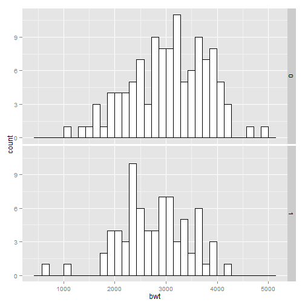 

```r
    
    
#====================================
head(birthwt)
```

```
##    low age lwt race smoke ptl ht ui ftv  bwt
## 85   0  19 182    2     0   0  0  1   0 2523
## 86   0  33 155    3     0   0  0  0   3 2551
## 87   0  20 105    1     1   0  0  0   1 2557
## 88   0  21 108    1     1   0  0  1   2 2594
## 89   0  18 107    1     1   0  0  1   0 2600
## 91   0  21 124    3     0   0  0  0   0 2622
```

```r

    
#====================================
birthwt1 <- birthwt # Make a copy of the data

# Convert smoke to a factor
birthwt1$smoke <- factor(birthwt1$smoke)
levels(birthwt1$smoke)
```

```
## [1] "0" "1"
```

```r


library(plyr) # For the revalue() function
birthwt1$smoke <- revalue(birthwt1$smoke, c("0"="No Smoke", "1"="Smoke"))

    
    
#====================================
ggplot(birthwt1, aes(x=bwt)) + geom_histogram(fill="white", colour="black") +
    facet_grid(smoke ~ .)
```

```
## stat_bin: binwidth defaulted to range/30. Use 'binwidth = x' to adjust this.
## stat_bin: binwidth defaulted to range/30. Use 'binwidth = x' to adjust this.
```

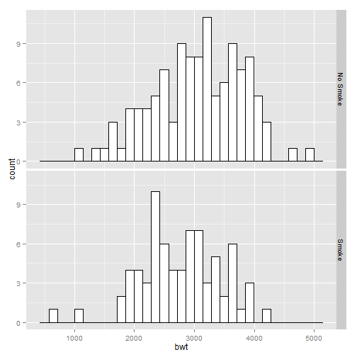 

```r
    
    
#====================================
ggplot(birthwt, aes(x=bwt)) + geom_histogram(fill="white", colour="black") +
    facet_grid(race ~ .)
```

```
## stat_bin: binwidth defaulted to range/30. Use 'binwidth = x' to adjust this.
## stat_bin: binwidth defaulted to range/30. Use 'binwidth = x' to adjust this.
## stat_bin: binwidth defaulted to range/30. Use 'binwidth = x' to adjust this.
```

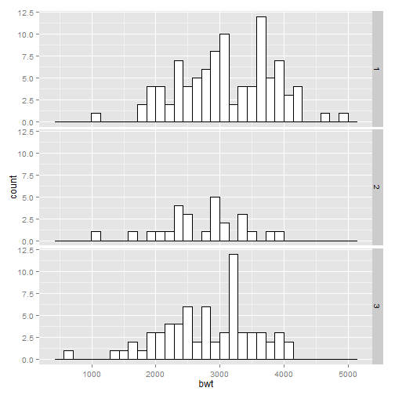 

```r
    
    
#====================================
ggplot(birthwt, aes(x=bwt)) + geom_histogram(fill="white", colour="black") +
    facet_grid(race ~ ., scales="free")
```

```
## stat_bin: binwidth defaulted to range/30. Use 'binwidth = x' to adjust this.
## stat_bin: binwidth defaulted to range/30. Use 'binwidth = x' to adjust this.
## stat_bin: binwidth defaulted to range/30. Use 'binwidth = x' to adjust this.
```

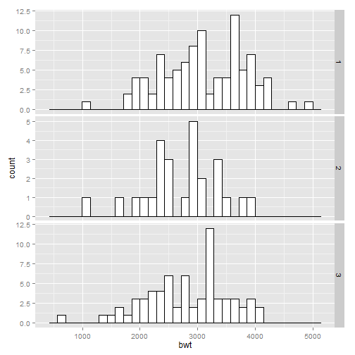 

```r
    
    
#====================================
# Convert smoke to a factor
birthwt1$smoke <- factor(birthwt1$smoke)

# Map smoke to fill, make the bars NOT stacked, and make them semitransparent
ggplot(birthwt1, aes(x=bwt, fill=smoke)) +
    geom_histogram(position="identity", alpha=0.4)
```

```
## stat_bin: binwidth defaulted to range/30. Use 'binwidth = x' to adjust this.
```

 

```r
    
    
#====================================
ggplot(faithful, aes(x=waiting)) + geom_density()
```

 

```r
    
    
#====================================
# The expand_limits() increases the y range to include the value 0
ggplot(faithful, aes(x=waiting)) + geom_line(stat="density") +
    expand_limits(y=0)
```

 

```r
    
    
#====================================
head(faithful)
```

```
##   eruptions waiting
## 1     3.600      79
## 2     1.800      54
## 3     3.333      74
## 4     2.283      62
## 5     4.533      85
## 6     2.883      55
```

```r

    
#====================================
# Store the values in a simple vector
w <- faithful$waiting

ggplot(NULL, aes(x=w)) + geom_density()
```

 

```r
    
    
#====================================
ggplot(faithful, aes(x=waiting)) +
    geom_line(stat="density", adjust=.25, colour="red") +
    geom_line(stat="density") +
    geom_line(stat="density", adjust=2, colour="blue")
```

 

```r
    
    
#====================================
ggplot(faithful, aes(x=waiting)) +
    geom_density(fill="blue", alpha=.2) +
    xlim(35, 105)
```

 

```r

# This draws a blue polygon with geom_density(), then adds a line on top
ggplot(faithful, aes(x=waiting)) +
    geom_density(fill="blue", colour=NA, alpha=.2) +
    geom_line(stat="density") +
    xlim(35, 105)
```

 

```r
    
    
#====================================
ggplot(faithful, aes(x=waiting, y=..density..)) +
    geom_histogram(fill="cornsilk", colour="grey60", size=.2) +
    geom_density() +
    xlim(35, 105)
```

```
## stat_bin: binwidth defaulted to range/30. Use 'binwidth = x' to adjust this.
```

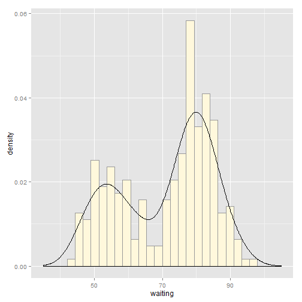 

```r
    
    
#====================================
library(MASS) # For the data set
# Make a copy of the data
birthwt1 <- birthwt

# Convert smoke to a factor
birthwt1$smoke <- factor(birthwt1$smoke)

# Map smoke to colour
ggplot(birthwt1, aes(x=bwt, colour=smoke)) + geom_density()
```

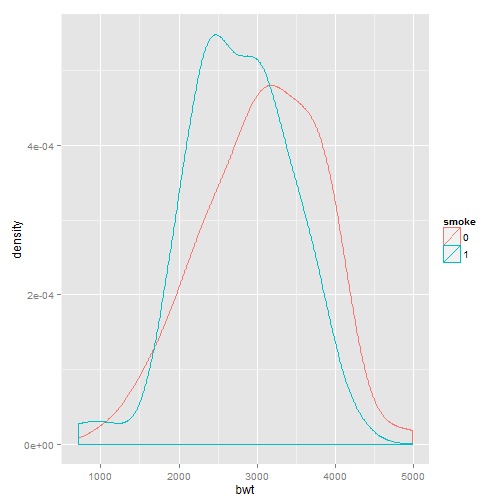 

```r

# Map smoke to fill and make the fill semitransparent by setting alpha
ggplot(birthwt1, aes(x=bwt, fill=smoke)) + geom_density(alpha=.3)
```

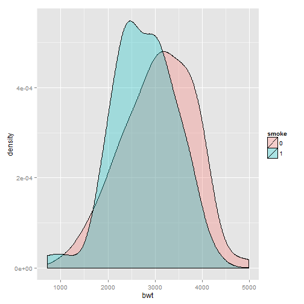 

```r
    
    
#====================================
head(birthwt)
```

```
##    low age lwt race smoke ptl ht ui ftv  bwt
## 85   0  19 182    2     0   0  0  1   0 2523
## 86   0  33 155    3     0   0  0  0   3 2551
## 87   0  20 105    1     1   0  0  0   1 2557
## 88   0  21 108    1     1   0  0  1   2 2594
## 89   0  18 107    1     1   0  0  1   0 2600
## 91   0  21 124    3     0   0  0  0   0 2622
```

```r

    
#====================================
ggplot(birthwt1, aes(x=bwt)) + geom_density() + facet_grid(smoke ~ .)
```

 

```r
    
    
#====================================
levels(birthwt1$smoke)
```

```
## [1] "0" "1"
```

```r


library(plyr) # For the revalue function
birthwt1$smoke <- revalue(birthwt1$smoke, c("0"="No Smoke", "1"="Smoke"))

    
    
#====================================
ggplot(birthwt1, aes(x=bwt)) + geom_density() + facet_grid(smoke ~ .)
```

 

```r
    
    
#====================================
ggplot(birthwt1, aes(x=bwt, y=..density..)) +
    geom_histogram(binwidth=200, fill="cornsilk", colour="grey60", size=.2) +
    geom_density() +
    facet_grid(smoke ~ .)
```

 

```r
    
    
#====================================
ggplot(faithful, aes(x=waiting)) + geom_freqpoly()
```

```
## stat_bin: binwidth defaulted to range/30. Use 'binwidth = x' to adjust this.
```

 

```r
    
    
#====================================
ggplot(faithful, aes(x=waiting)) + geom_freqpoly(binwidth=4)
```

 

```r
    
    
#====================================
# Use 15 bins
binsize <- diff(range(faithful$waiting))/15
ggplot(faithful, aes(x=waiting)) + geom_freqpoly(binwidth=binsize)
```

 

```r
    
    
#====================================
library(MASS) # For the data set

ggplot(birthwt, aes(x=factor(race), y=bwt)) + geom_boxplot()
```

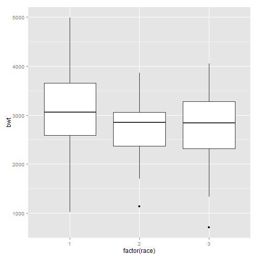 

```r
# Use factor() to convert numeric variable to discrete
    
    
#====================================
head(birthwt)
```

```
##    low age lwt race smoke ptl ht ui ftv  bwt
## 85   0  19 182    2     0   0  0  1   0 2523
## 86   0  33 155    3     0   0  0  0   3 2551
## 87   0  20 105    1     1   0  0  0   1 2557
## 88   0  21 108    1     1   0  0  1   2 2594
## 89   0  18 107    1     1   0  0  1   0 2600
## 91   0  21 124    3     0   0  0  0   0 2622
```

```r

    
#====================================
ggplot(birthwt, aes(x=factor(race), y=bwt)) + geom_boxplot(width=.5)
```

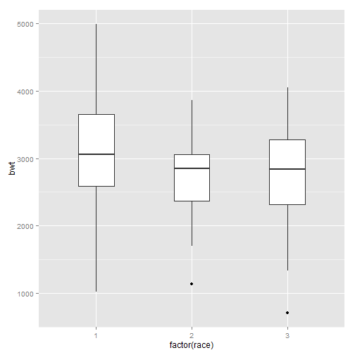 

```r
    
    
#====================================
ggplot(birthwt, aes(x=factor(race), y=bwt)) +
    geom_boxplot(outlier.size=1.5, outlier.shape=21)
```

 

```r
    
    
#====================================
ggplot(birthwt, aes(x=1, y=bwt)) + geom_boxplot() +
    scale_x_continuous(breaks=NULL) +
    theme(axis.title.x = element_blank())
```

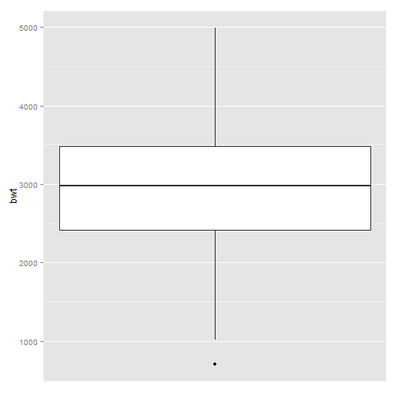 

```r
    
    
#====================================
library(MASS) # For the data set

ggplot(birthwt, aes(x=factor(race), y=bwt)) + geom_boxplot(notch=TRUE)
```

```
## notch went outside hinges. Try setting notch=FALSE.
```

 

```r
    
    
#====================================
#Notch went outside hinges. Try setting notch=FALSE.
    
    
#====================================
library(MASS) # For the data set

ggplot(birthwt, aes(x=factor(race), y=bwt)) + geom_boxplot() +
    stat_summary(fun.y="mean", geom="point", shape=23, size=3, fill="white")
```

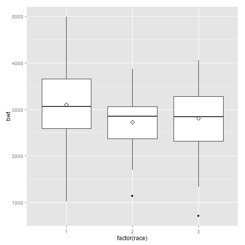 

```r
    
    
#====================================
library(gcookbook) # For the data set

# Base plot
p <- ggplot(heightweight, aes(x=sex, y=heightIn))

p + geom_violin()
```

 

```r
    
    
#====================================
p + geom_violin() + geom_boxplot(width=.1, fill="black", outlier.colour=NA) +
    stat_summary(fun.y=median, geom="point", fill="white", shape=21, size=2.5)
```

 

```r
    
    
#====================================
p + geom_violin(trim=FALSE)
```

 

```r
    
    
#====================================
# Scaled area proportional to number of observations
p + geom_violin(scale="count")
```

 

```r
    
    
#====================================
# More smoothing
p + geom_violin(adjust=2)
```

 

```r

# Less smoothing
p + geom_violin(adjust=.5)
```

 

```r
    
    
#====================================
library(gcookbook) # For the data set
countries2009 <- subset(countries, Year==2009 & healthexp>2000)

p <- ggplot(countries2009, aes(x=infmortality))

p + geom_dotplot()
```

```
## stat_bindot: binwidth defaulted to range/30. Use 'binwidth = x' to adjust this.
```

 

```r
    
    
#====================================
p + geom_dotplot(binwidth=.25) + geom_rug() +
    scale_y_continuous(breaks=NULL) +   # Remove tick markers
    theme(axis.title.y=element_blank()) # Remove axis label
```

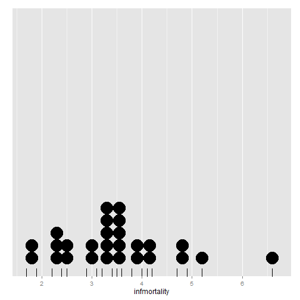 

```r
    
    
#====================================
p + geom_dotplot(method="histodot", binwidth=.25) + geom_rug() +
    scale_y_continuous(breaks=NULL) + theme(axis.title.y=element_blank())
```

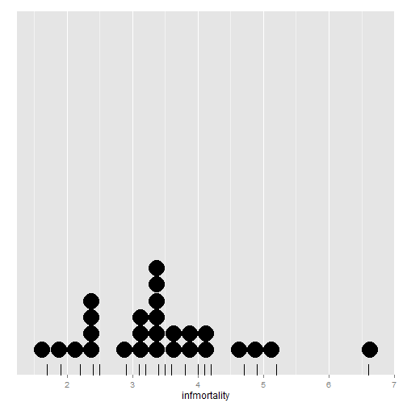 

```r
    
    
#====================================
p + geom_dotplot(binwidth=.25, stackdir="center")
```

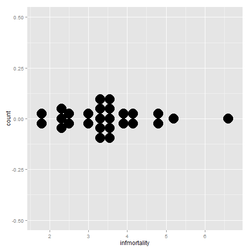 

```r
    scale_y_continuous(breaks=NULL) + theme(axis.title.y=element_blank())
```

```
## NULL
```

```r

p + geom_dotplot(binwidth=.25, stackdir="centerwhole")
```

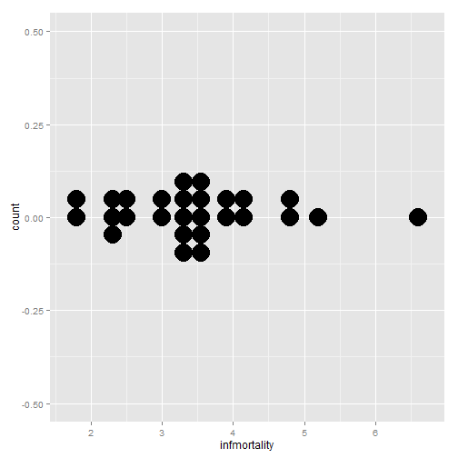 

```r
    scale_y_continuous(breaks=NULL) + theme(axis.title.y=element_blank())
```

```
## NULL
```

```r
    
    
#====================================
library(gcookbook) # For the data set

ggplot(heightweight, aes(x=sex, y=heightIn)) +
    geom_dotplot(binaxis="y", binwidth=.5, stackdir="center")
```

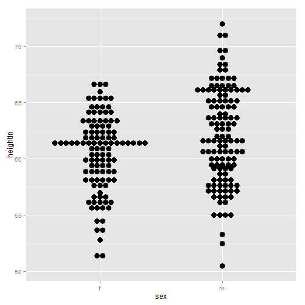 

```r
    
    
#====================================
ggplot(heightweight, aes(x=sex, y=heightIn)) +
    geom_boxplot(outlier.colour=NA, width=.4) +
    geom_dotplot(binaxis="y", binwidth=.5, stackdir="center", fill=NA)
```

 

```r
    
    
#====================================
ggplot(heightweight, aes(x=sex, y=heightIn)) +
    geom_boxplot(aes(x=as.numeric(sex) + .2, group=sex), width=.25) +
    geom_dotplot(aes(x=as.numeric(sex) - .2, group=sex), binaxis="y",
                 binwidth=.5, stackdir="center") +
    scale_x_continuous(breaks=1:nlevels(heightweight$sex),
                       labels=levels(heightweight$sex))
```

 

```r
    
    
#====================================
# The base plot
p <- ggplot(faithful, aes(x=eruptions, y=waiting))

p + geom_point() + stat_density2d()
```

 

```r
    
    
#====================================
# Contour lines, with "height" mapped to color
p + stat_density2d(aes(colour=..level..))
```

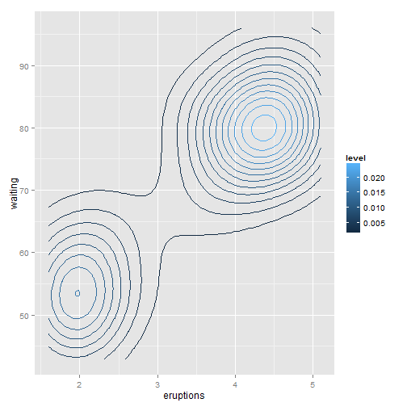 

```r
    
    
#====================================
# Map density estimate to fill color
p + stat_density2d(aes(fill=..density..), geom="raster", contour=FALSE)
```

 

```r

# With points, and map density estimate to alpha
p + geom_point() +
    stat_density2d(aes(alpha=..density..), geom="tile", contour=FALSE)
```

 

```r
    
    
#====================================
p + stat_density2d(aes(fill=..density..), geom="raster", 
                   contour=FALSE, h=c(.5,5))
```

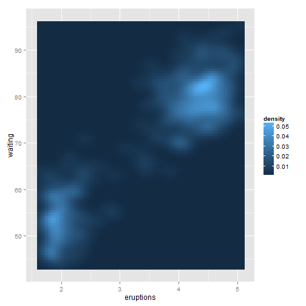 

```r
    
    
#==================
```
