# chapter6: Summarized Data Distributions
## 6.1.Making a Basic Histogram

```r
library(ggplot2)
ggplot(faithful, aes(x = waiting)) + geom_histogram()
```

```
## stat_bin: binwidth defaulted to range/30. Use 'binwidth = x' to adjust this.
```

 

```r

head(faithful)
```

```
##   eruptions waiting
## 1     3.600      79
## 2     1.800      54
## 3     3.333      74
## 4     2.283      62
## 5     4.533      85
## 6     2.883      55
```

```r

# Store the values in a simple vector
w <- faithful$waiting

ggplot(NULL, aes(x = w)) + geom_histogram()
```

```
## stat_bin: binwidth defaulted to range/30. Use 'binwidth = x' to adjust this.
```

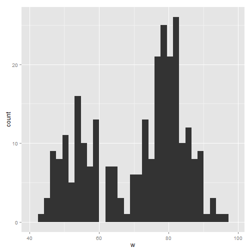 

```r

# Set the width of each bin to 5
ggplot(faithful, aes(x = waiting)) + geom_histogram(binwidth = 5, fill = "white", 
    colour = "black")
```

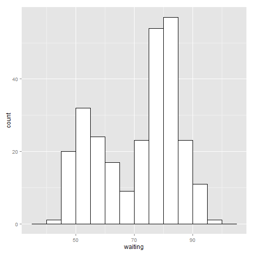 

```r

# Divide the x range into 15 bins
binsize <- diff(range(faithful$waiting))/15
ggplot(faithful, aes(x = waiting)) + geom_histogram(binwidth = binsize, fill = "white", 
    colour = "black")
```

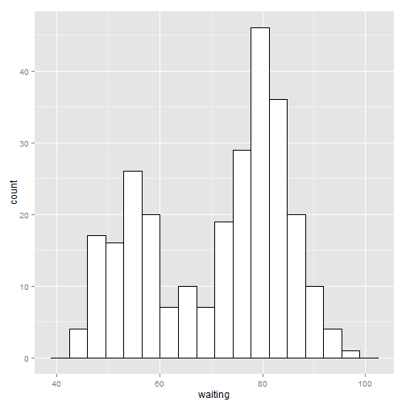 

```r

h <- ggplot(faithful, aes(x = waiting))  # Save the base object for reuse

h + geom_histogram(binwidth = 8, fill = "white", colour = "black", origin = 31)
```

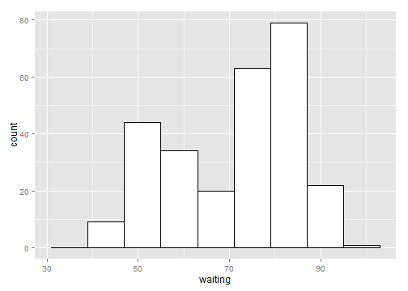 

```r

h + geom_histogram(binwidth = 8, fill = "white", colour = "black", origin = 35)
```

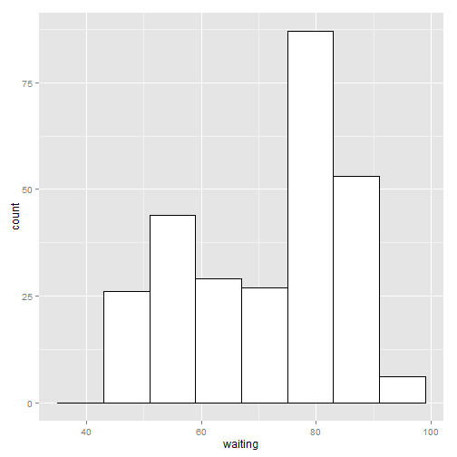 

## 6.2.Making Multiple Histograms from Grouped Data

```r
library(MASS)  # For the data set

# Use smoke as the faceting variable
ggplot(birthwt, aes(x = bwt)) + geom_histogram(fill = "white", colour = "black") + 
    facet_grid(smoke ~ .)
```

```
## stat_bin: binwidth defaulted to range/30. Use 'binwidth = x' to adjust this.
## stat_bin: binwidth defaulted to range/30. Use 'binwidth = x' to adjust this.
```

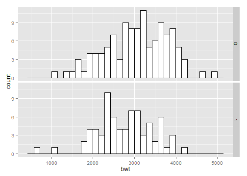 

```r

head(birthwt)
```

```
##    low age lwt race smoke ptl ht ui ftv  bwt
## 85   0  19 182    2     0   0  0  1   0 2523
## 86   0  33 155    3     0   0  0  0   3 2551
## 87   0  20 105    1     1   0  0  0   1 2557
## 88   0  21 108    1     1   0  0  1   2 2594
## 89   0  18 107    1     1   0  0  1   0 2600
## 91   0  21 124    3     0   0  0  0   0 2622
```

```r

birthwt1 <- birthwt  # Make a copy of the data

# Convert smoke to a factor
birthwt1$smoke <- factor(birthwt1$smoke)
levels(birthwt1$smoke)
```

```
## [1] "0" "1"
```

```r

library(plyr)  # For the revalue() function
birthwt1$smoke <- revalue(birthwt1$smoke, c(`0` = "No Smoke", `1` = "Smoke"))

ggplot(birthwt1, aes(x = bwt)) + geom_histogram(fill = "white", colour = "black") + 
    facet_grid(smoke ~ .)
```

```
## stat_bin: binwidth defaulted to range/30. Use 'binwidth = x' to adjust this.
## stat_bin: binwidth defaulted to range/30. Use 'binwidth = x' to adjust this.
```

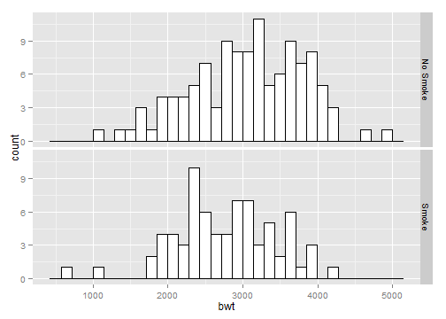 

```r

ggplot(birthwt, aes(x = bwt)) + geom_histogram(fill = "white", colour = "black") + 
    facet_grid(race ~ .)
```

```
## stat_bin: binwidth defaulted to range/30. Use 'binwidth = x' to adjust this.
## stat_bin: binwidth defaulted to range/30. Use 'binwidth = x' to adjust this.
## stat_bin: binwidth defaulted to range/30. Use 'binwidth = x' to adjust this.
```

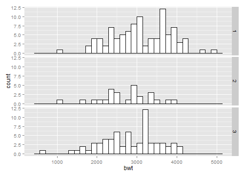 

```r

ggplot(birthwt, aes(x = bwt)) + geom_histogram(fill = "white", colour = "black") + 
    facet_grid(race ~ ., scales = "free")
```

```
## stat_bin: binwidth defaulted to range/30. Use 'binwidth = x' to adjust this.
## stat_bin: binwidth defaulted to range/30. Use 'binwidth = x' to adjust this.
## stat_bin: binwidth defaulted to range/30. Use 'binwidth = x' to adjust this.
```

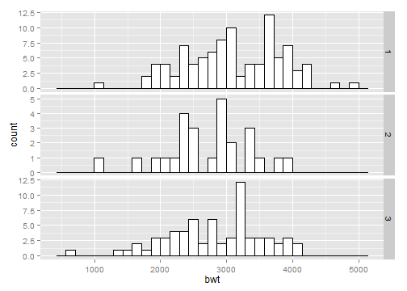 

```r

# Convert smoke to a factor
birthwt1$smoke <- factor(birthwt1$smoke)

# Map smoke to fill, make the bars NOT stacked, and make them
# semitransparent
ggplot(birthwt1, aes(x = bwt, fill = smoke)) + geom_histogram(position = "identity", 
    alpha = 0.4)
```

```
## stat_bin: binwidth defaulted to range/30. Use 'binwidth = x' to adjust this.
```

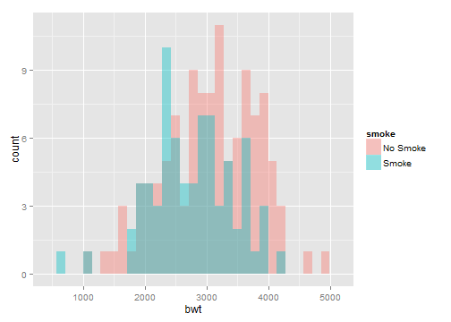 

## Making a Density Curve

```r
ggplot(faithful, aes(x = waiting)) + geom_density()
```

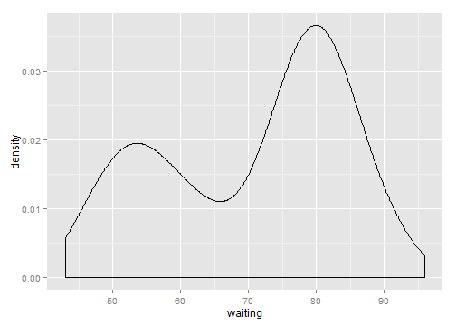 

```r

# The expand_limits() increases the y range to include the value 0
ggplot(faithful, aes(x = waiting)) + geom_line(stat = "density") + expand_limits(y = 0)
```

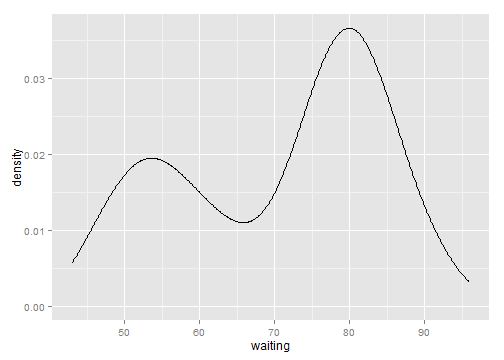 

```r

head(faithful)
```

```
##   eruptions waiting
## 1     3.600      79
## 2     1.800      54
## 3     3.333      74
## 4     2.283      62
## 5     4.533      85
## 6     2.883      55
```

```r

# Store the values in a simple vector
w <- faithful$waiting

ggplot(NULL, aes(x = w)) + geom_density()
```

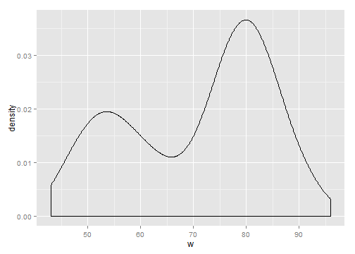 

```r

ggplot(faithful, aes(x = waiting)) + geom_line(stat = "density", adjust = 0.25, 
    colour = "red") + geom_line(stat = "density") + geom_line(stat = "density", 
    adjust = 2, colour = "blue")
```

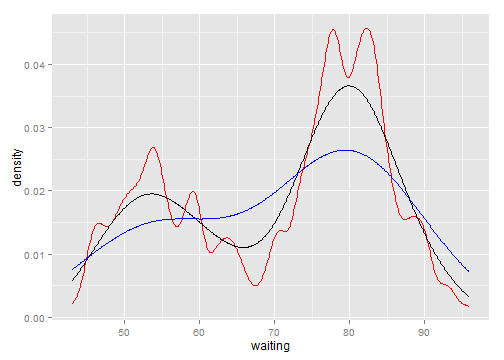 

```r

ggplot(faithful, aes(x = waiting)) + geom_density(fill = "blue", alpha = 0.2) + 
    xlim(35, 105)
```

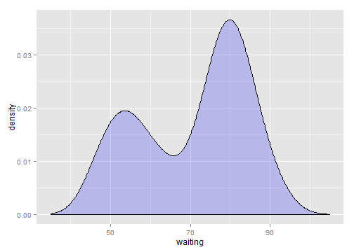 

```r

# This draws a blue polygon with geom_density(), then adds a line on top
ggplot(faithful, aes(x = waiting)) + geom_density(fill = "blue", colour = NA, 
    alpha = 0.2) + geom_line(stat = "density") + xlim(35, 105)
```

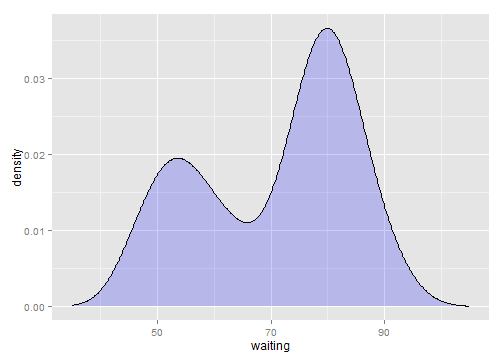 

```r

ggplot(faithful, aes(x = waiting, y = ..density..)) + geom_histogram(fill = "cornsilk", 
    colour = "grey60", size = 0.2) + geom_density() + xlim(35, 105)
```

```
## stat_bin: binwidth defaulted to range/30. Use 'binwidth = x' to adjust this.
```

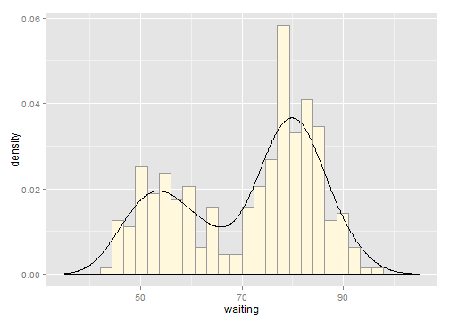 

## 6.4.Making Multiple Density Curves from Grouped Data

```r
library(MASS)  # For the data set
# Make a copy of the data
birthwt1 <- birthwt

# Convert smoke to a factor
birthwt1$smoke <- factor(birthwt1$smoke)

# Map smoke to colour
ggplot(birthwt1, aes(x = bwt, colour = smoke)) + geom_density()
```

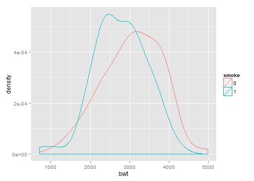 

```r

# Map smoke to fill and make the fill semitransparent by setting alpha
ggplot(birthwt1, aes(x = bwt, fill = smoke)) + geom_density(alpha = 0.3)
```

 

```r


head(birthwt)
```

```
##    low age lwt race smoke ptl ht ui ftv  bwt
## 85   0  19 182    2     0   0  0  1   0 2523
## 86   0  33 155    3     0   0  0  0   3 2551
## 87   0  20 105    1     1   0  0  0   1 2557
## 88   0  21 108    1     1   0  0  1   2 2594
## 89   0  18 107    1     1   0  0  1   0 2600
## 91   0  21 124    3     0   0  0  0   0 2622
```

```r


ggplot(birthwt1, aes(x = bwt)) + geom_density() + facet_grid(smoke ~ .)
```

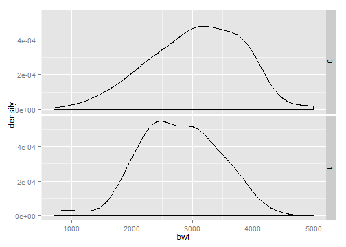 

```r


levels(birthwt1$smoke)
```

```
## [1] "0" "1"
```

```r


library(plyr)  # For the revalue function
birthwt1$smoke <- revalue(birthwt1$smoke, c(`0` = "No Smoke", `1` = "Smoke"))


ggplot(birthwt1, aes(x = bwt)) + geom_density() + facet_grid(smoke ~ .)
```

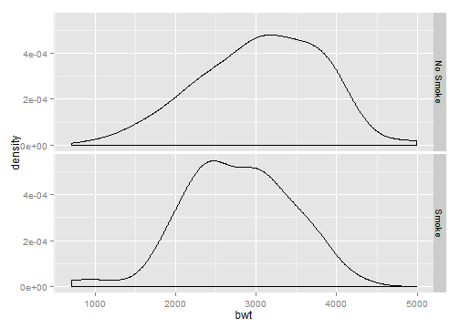 

```r


ggplot(birthwt1, aes(x = bwt, y = ..density..)) + geom_histogram(binwidth = 200, 
    fill = "cornsilk", colour = "grey60", size = 0.2) + geom_density() + facet_grid(smoke ~ 
    .)
```

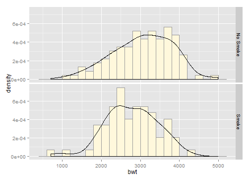 

## 6.5.Making a Frequency Polygon

```r
ggplot(faithful, aes(x = waiting)) + geom_freqpoly()
```

```
## stat_bin: binwidth defaulted to range/30. Use 'binwidth = x' to adjust this.
```

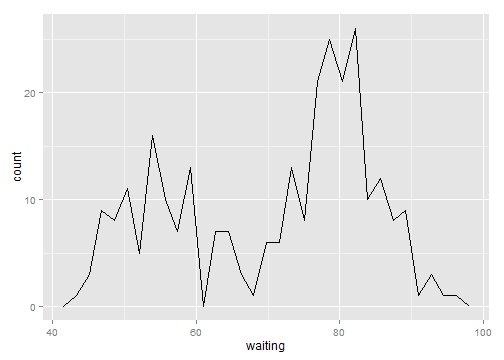 

```r

ggplot(faithful, aes(x = waiting)) + geom_freqpoly(binwidth = 4)
```

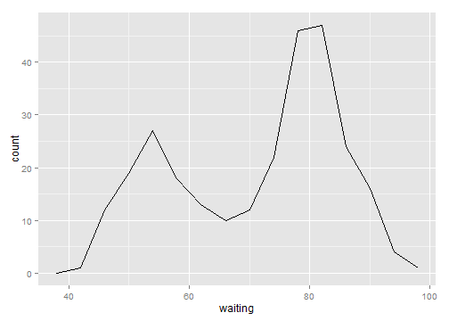 

```r

# Use 15 bins
binsize <- diff(range(faithful$waiting))/15
ggplot(faithful, aes(x = waiting)) + geom_freqpoly(binwidth = binsize)
```

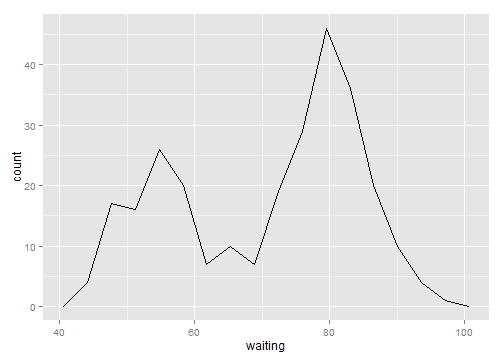 

## 6.6.Making a Basic Box Plot

```r
library(MASS)  # For the data set

ggplot(birthwt, aes(x = factor(race), y = bwt)) + geom_boxplot()
```

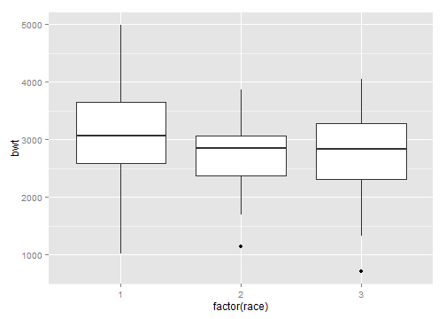 

```r
# Use factor() to convert numeric variable to discrete


head(birthwt)
```

```
##    low age lwt race smoke ptl ht ui ftv  bwt
## 85   0  19 182    2     0   0  0  1   0 2523
## 86   0  33 155    3     0   0  0  0   3 2551
## 87   0  20 105    1     1   0  0  0   1 2557
## 88   0  21 108    1     1   0  0  1   2 2594
## 89   0  18 107    1     1   0  0  1   0 2600
## 91   0  21 124    3     0   0  0  0   0 2622
```

```r

ggplot(birthwt, aes(x = factor(race), y = bwt)) + geom_boxplot(width = 0.5)
```

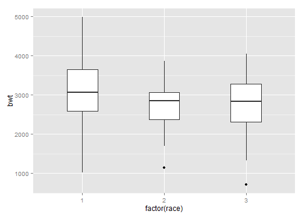 

```r


ggplot(birthwt, aes(x = factor(race), y = bwt)) + geom_boxplot(outlier.size = 1.5, 
    outlier.shape = 21)
```

 

```r


ggplot(birthwt, aes(x = 1, y = bwt)) + geom_boxplot() + scale_x_continuous(breaks = NULL) + 
    theme(axis.title.x = element_blank())
```

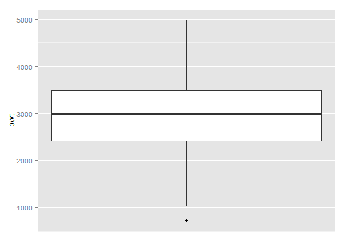 

## 6.7.Adding Notches to a Box Plot

```r
library(MASS)  # For the data set

ggplot(birthwt, aes(x = factor(race), y = bwt)) + geom_boxplot(notch = TRUE)
```

```
## notch went outside hinges. Try setting notch=FALSE.
```

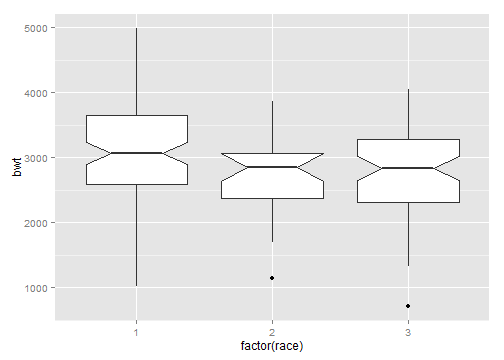 

```r


# Notch went outside hinges. Try setting notch=FALSE.
```

## 6.8.Adding Means to a Box Plot

```r
library(MASS)  # For the data set

ggplot(birthwt, aes(x = factor(race), y = bwt)) + geom_boxplot() + stat_summary(fun.y = "mean", 
    geom = "point", shape = 23, size = 3, fill = "white")
```

 

## 6.9.Making a Violin plot

```r
library(gcookbook)  # For the data set

# Base plot
p <- ggplot(heightweight, aes(x = sex, y = heightIn))

p + geom_violin()
```

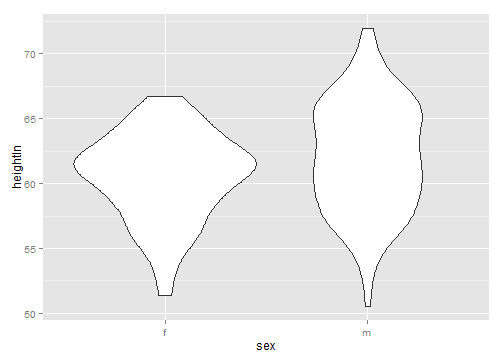 

```r

p + geom_violin() + geom_boxplot(width = 0.1, fill = "black", outlier.colour = NA) + 
    stat_summary(fun.y = median, geom = "point", fill = "white", shape = 21, 
        size = 2.5)
```

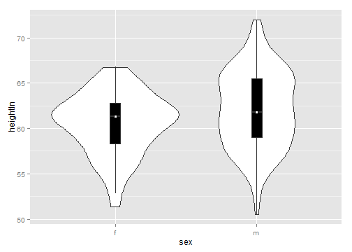 

```r


p + geom_violin(trim = FALSE)
```

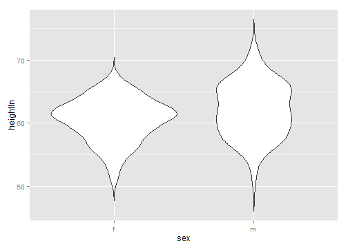 

```r


# Scaled area proportional to number of observations
p + geom_violin(scale = "count")
```

 

```r

# More smoothing
p + geom_violin(adjust = 2)
```

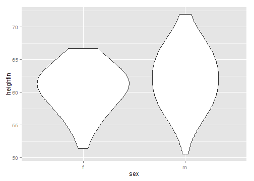 

```r

# Less smoothing
p + geom_violin(adjust = 0.5)
```

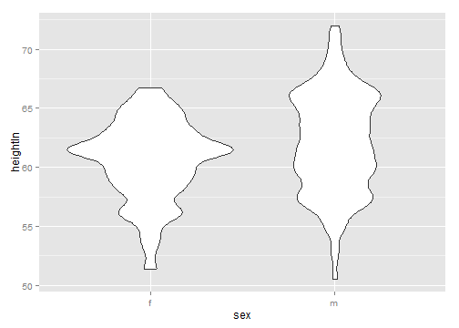 

## 6.10.Making a Dot Plot

```r
library(gcookbook) # For the data set
countries2009 <- subset(countries, Year==2009 & healthexp>2000)

p <- ggplot(countries2009, aes(x=infmortality))

p + geom_dotplot()
```

```
## stat_bindot: binwidth defaulted to range/30. Use 'binwidth = x' to adjust this.
```

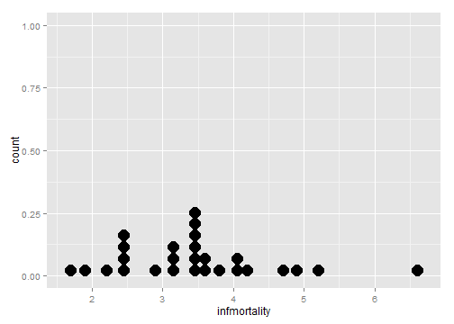 

```r
    
p + geom_dotplot(binwidth=.25) + geom_rug() +
    scale_y_continuous(breaks=NULL) +   # Remove tick markers
    theme(axis.title.y=element_blank()) # Remove axis label
```

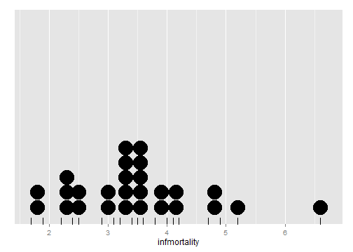 

```r
    
p + geom_dotplot(method="histodot", binwidth=.25) + geom_rug() +
    scale_y_continuous(breaks=NULL) + theme(axis.title.y=element_blank())
```

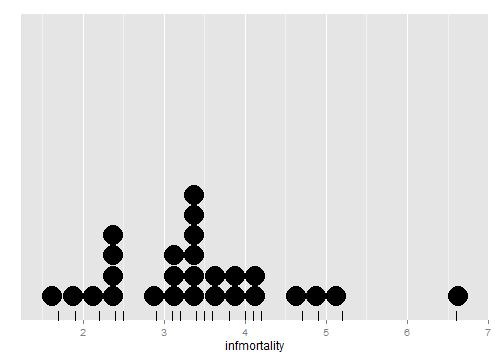 

```r
    
p + geom_dotplot(binwidth=.25, stackdir="center")
```

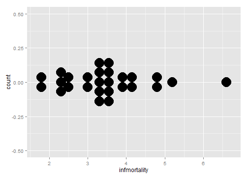 

```r
    scale_y_continuous(breaks=NULL) + theme(axis.title.y=element_blank())
```

```
## NULL
```

```r

p + geom_dotplot(binwidth=.25, stackdir="centerwhole")
```

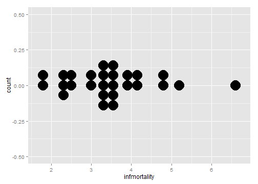 

```r
    scale_y_continuous(breaks=NULL) + theme(axis.title.y=element_blank())
```

```
## NULL
```

## 6.11.Making Multiple Dot Plots for Grouped Data

```r
library(gcookbook)  # For the data set

ggplot(heightweight, aes(x = sex, y = heightIn)) + geom_dotplot(binaxis = "y", 
    binwidth = 0.5, stackdir = "center")
```

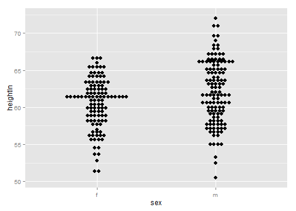 

```r

ggplot(heightweight, aes(x = sex, y = heightIn)) + geom_boxplot(outlier.colour = NA, 
    width = 0.4) + geom_dotplot(binaxis = "y", binwidth = 0.5, stackdir = "center", 
    fill = NA)
```

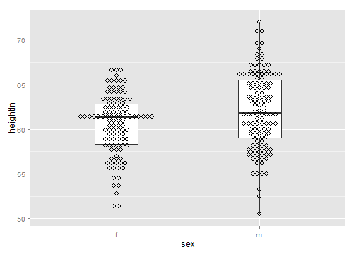 

```r

ggplot(heightweight, aes(x = sex, y = heightIn)) + geom_boxplot(aes(x = as.numeric(sex) + 
    0.2, group = sex), width = 0.25) + geom_dotplot(aes(x = as.numeric(sex) - 
    0.2, group = sex), binaxis = "y", binwidth = 0.5, stackdir = "center") + 
    scale_x_continuous(breaks = 1:nlevels(heightweight$sex), labels = levels(heightweight$sex))
```

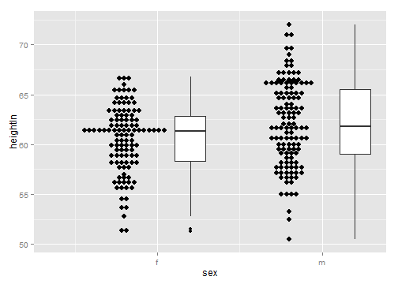 

## 6.12.Making a Density Plot of Two-Dimensional Data

```r
# The base plot
p <- ggplot(faithful, aes(x = eruptions, y = waiting))

p + geom_point() + stat_density2d()
```

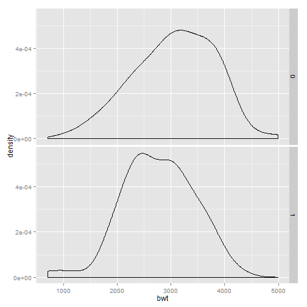 

```r


# Contour lines, with 'height' mapped to color
p + stat_density2d(aes(colour = ..level..))
```

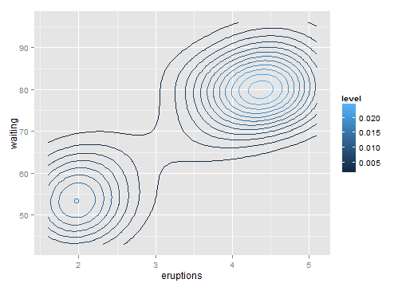 

```r

# Map density estimate to fill color
p + stat_density2d(aes(fill = ..density..), geom = "raster", contour = FALSE)
```

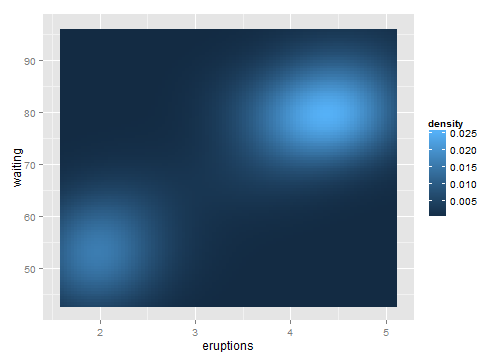 

```r

# With points, and map density estimate to alpha
p + geom_point() + stat_density2d(aes(alpha = ..density..), geom = "tile", contour = FALSE)
```

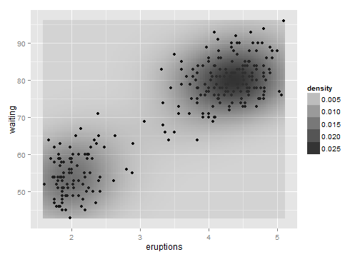 

```r

p + stat_density2d(aes(fill = ..density..), geom = "raster", contour = FALSE, 
    h = c(0.5, 5))
```

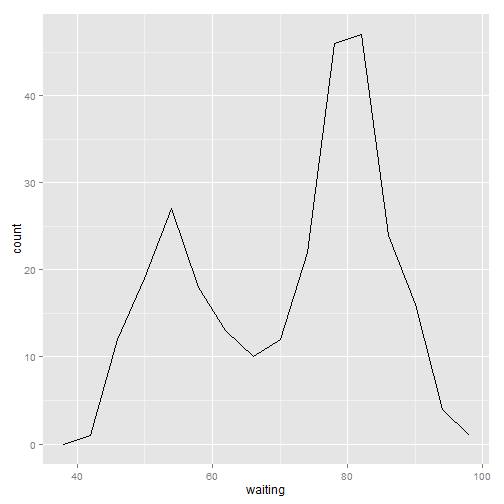 

