# chapter: Annotations
## 7.1.Adding Text Annotations 

```r
library(ggplot2)
p <- ggplot(faithful, aes(x=eruptions, y=waiting)) + geom_point()

p + annotate("text", x=3, y=48, label="Group 1") +
    annotate("text", x=4.5, y=66, label="Group 2")
```

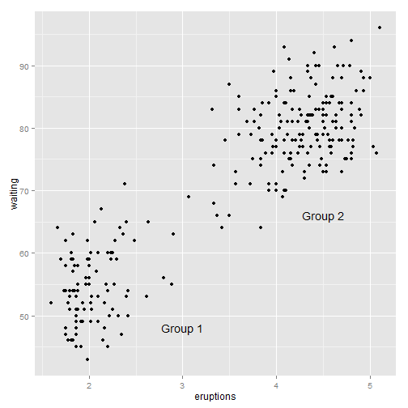 

```r
    
    
p + annotate("text", x=3, y=48, label="Group 1", family="serif",
             fontface="italic", colour="darkred", size=3) +
    annotate("text", x=4.5, y=66, label="Group 2", family="serif",
             fontface="italic", colour="darkred", size=3)
```

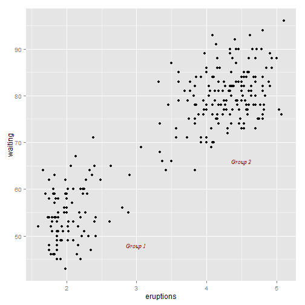 

```r
    
    
p + annotate("text", x=3, y=48, label="Group 1", alpha=.1) +     # Normal
    geom_text(x=4.5, y=66, label="Group 2", alpha=.1)            # Overplotted
```

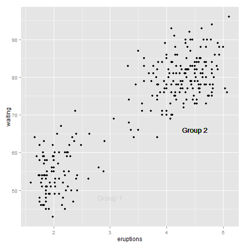 

```r
    
    
p + annotate("text", x=-Inf, y=Inf, label="Upper left", hjust=-.2, vjust=2) +
    annotate("text", x=mean(range(faithful$eruptions)), y=-Inf, vjust=-0.4,
             label="Bottom middle")
```

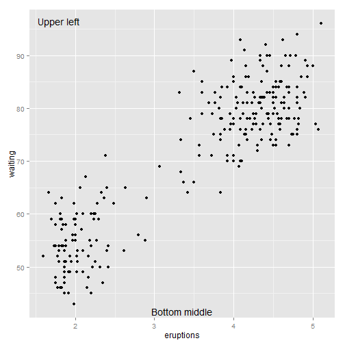 

## 7.2.Using Mathematical Expressions in Annotations

```r
# A normal curve
p <- ggplot(data.frame(x = c(-3, 3)), aes(x = x)) + stat_function(fun = dnorm)

p + annotate("text", x = 2, y = 0.3, parse = TRUE, label = "frac(1, sqrt(2 * pi)) * e ^ {-x^2 / 2}")
```

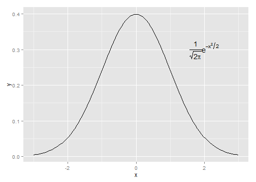 

```r

p + annotate("text", x = 0, y = 0.05, parse = TRUE, size = 4, label = "'Function:  ' * y==frac(1, sqrt(2*pi)) * e^{-x^2/2}")
```

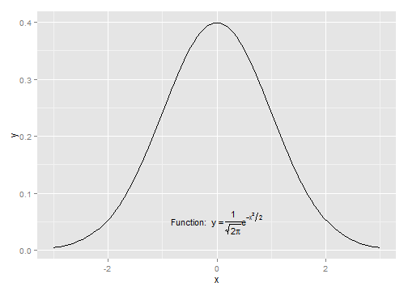 

## 7.3.Adding Lines

```r
library(gcookbook)  # For the data set

p <- ggplot(heightweight, aes(x = ageYear, y = heightIn, colour = sex)) + geom_point()

# Add horizontal and vertical lines
p + geom_hline(yintercept = 60) + geom_vline(xintercept = 14)
```

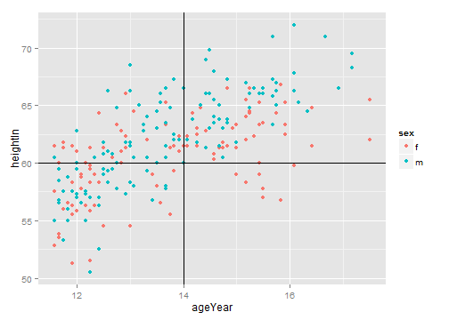 

```r

# Add angled line
p + geom_abline(intercept = 37.4, slope = 1.75)
```

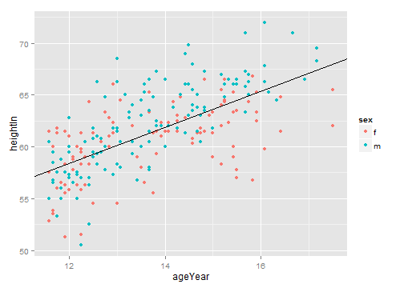 

```r

library(plyr)  # For the ddply() function
hw_means <- ddply(heightweight, "sex", summarise, heightIn = mean(heightIn))
hw_means
```

```
##   sex heightIn
## 1   f    60.53
## 2   m    62.06
```

```r

p + geom_hline(aes(yintercept = heightIn, colour = sex), data = hw_means, linetype = "dashed", 
    size = 1)
```

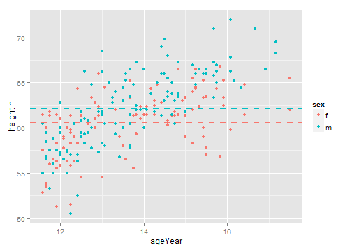 

```r


pg <- ggplot(PlantGrowth, aes(x = group, y = weight)) + geom_point()

pg + geom_vline(xintercept = 2)
```

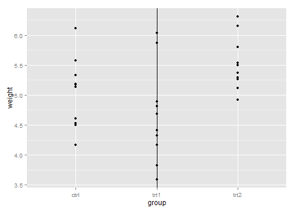 

```r

pg + geom_vline(xintercept = which(levels(PlantGrowth$group) == "ctrl"))
```

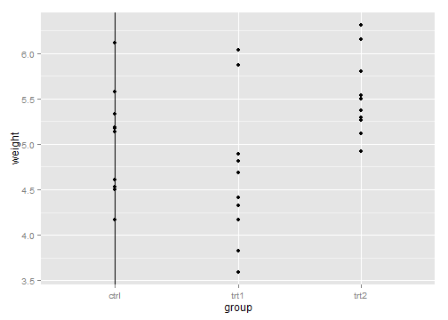 

## 7.4.Adding Line Segments and Arrows

```r
library(gcookbook)  # For the data set

p <- ggplot(subset(climate, Source == "Berkeley"), aes(x = Year, y = Anomaly10y)) + 
    geom_line()

p + annotate("segment", x = 1950, xend = 1980, y = -0.25, yend = -0.25)
```

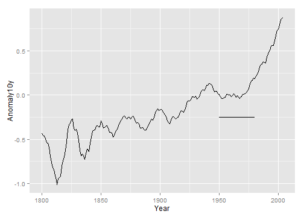 

```r


library(grid)
p + annotate("segment", x = 1850, xend = 1820, y = -0.8, yend = -0.95, colour = "blue", 
    size = 2, arrow = arrow()) + annotate("segment", x = 1950, xend = 1980, 
    y = -0.25, yend = -0.25, arrow = arrow(ends = "both", angle = 90, length = unit(0.2, 
        "cm")))
```

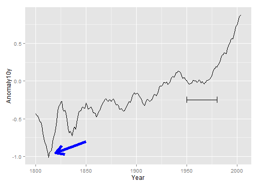 

## 7.5.Addding a Shaded Rectangle

```r
library(gcookbook)  # For the data set

p <- ggplot(subset(climate, Source == "Berkeley"), aes(x = Year, y = Anomaly10y)) + 
    geom_line()

p + annotate("rect", xmin = 1950, xmax = 1980, ymin = -1, ymax = 1, alpha = 0.1, 
    fill = "blue")
```

 

## 7.6.Highlighting an Item

```r
pg <- PlantGrowth  # Make a copy of the PlantGrowth data
pg$hl <- "no"  # Set all to 'no'
pg$hl[pg$group == "trt2"] <- "yes"  # If group is 'trt2', set to 'yes'


ggplot(pg, aes(x = group, y = weight, fill = hl)) + geom_boxplot() + scale_fill_manual(values = c("grey85", 
    "#FFDDCC"), guide = FALSE)
```

 

```r


ggplot(PlantGrowth, aes(x = group, y = weight, fill = group)) + geom_boxplot() + 
    scale_fill_manual(values = c("grey85", "grey85", "#FFDDCC"), guide = FALSE)
```

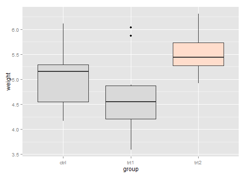 

## 7.7.Adding Error Bars

```r
library(gcookbook)  # For the data set
# Take a subset of the cabbage_exp data for this example
ce <- subset(cabbage_exp, Cultivar == "c39")

# With a bar graph
ggplot(ce, aes(x = Date, y = Weight)) + geom_bar(fill = "white", colour = "black") + 
    geom_errorbar(aes(ymin = Weight - se, ymax = Weight + se), width = 0.2)
```

```
## Mapping a variable to y and also using stat="bin".
##   With stat="bin", it will attempt to set the y value to the count of cases in each group.
##   This can result in unexpected behavior and will not be allowed in a future version of ggplot2.
##   If you want y to represent counts of cases, use stat="bin" and don't map a variable to y.
##   If you want y to represent values in the data, use stat="identity".
##   See ?geom_bar for examples. (Deprecated; last used in version 0.9.2)
```

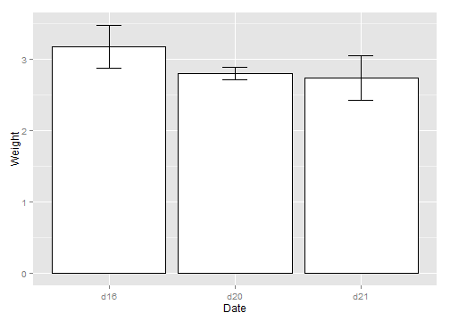 

```r

# With a line graph
ggplot(ce, aes(x = Date, y = Weight)) + geom_line(aes(group = 1)) + geom_point(size = 4) + 
    geom_errorbar(aes(ymin = Weight - se, ymax = Weight + se), width = 0.2)
```

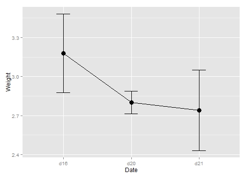 

```r
ce
```

```
##   Cultivar Date Weight     sd  n      se
## 1      c39  d16   3.18 0.9566 10 0.30251
## 2      c39  d20   2.80 0.2789 10 0.08819
## 3      c39  d21   2.74 0.9834 10 0.31098
```

```r

cabbage_exp
```

```
##   Cultivar Date Weight     sd  n      se
## 1      c39  d16   3.18 0.9566 10 0.30251
## 2      c39  d20   2.80 0.2789 10 0.08819
## 3      c39  d21   2.74 0.9834 10 0.31098
## 4      c52  d16   2.26 0.4452 10 0.14079
## 5      c52  d20   3.11 0.7909 10 0.25009
## 6      c52  d21   1.47 0.2111 10 0.06675
```

```r

# Bad: dodge width not specified
ggplot(cabbage_exp, aes(x = Date, y = Weight, fill = Cultivar)) + geom_bar(position = "dodge") + 
    geom_errorbar(aes(ymin = Weight - se, ymax = Weight + se), position = "dodge", 
        width = 0.2)
```

```
## Mapping a variable to y and also using stat="bin".
##   With stat="bin", it will attempt to set the y value to the count of cases in each group.
##   This can result in unexpected behavior and will not be allowed in a future version of ggplot2.
##   If you want y to represent counts of cases, use stat="bin" and don't map a variable to y.
##   If you want y to represent values in the data, use stat="identity".
##   See ?geom_bar for examples. (Deprecated; last used in version 0.9.2)
```

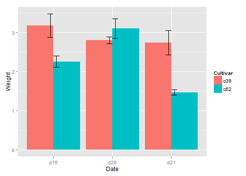 

```r

# Good: dodge width set to same as bar width (0.9)
ggplot(cabbage_exp, aes(x = Date, y = Weight, fill = Cultivar)) + geom_bar(position = "dodge") + 
    geom_errorbar(aes(ymin = Weight - se, ymax = Weight + se), position = position_dodge(0.9), 
        width = 0.2)
```

```
## Mapping a variable to y and also using stat="bin".
##   With stat="bin", it will attempt to set the y value to the count of cases in each group.
##   This can result in unexpected behavior and will not be allowed in a future version of ggplot2.
##   If you want y to represent counts of cases, use stat="bin" and don't map a variable to y.
##   If you want y to represent values in the data, use stat="identity".
##   See ?geom_bar for examples. (Deprecated; last used in version 0.9.2)
```

 

```r


# ====================================
pd <- position_dodge(0.3)  # Save the dodge spec because we use it repeatedly

ggplot(cabbage_exp, aes(x = Date, y = Weight, colour = Cultivar, group = Cultivar)) + 
    geom_errorbar(aes(ymin = Weight - se, ymax = Weight + se), width = 0.2, 
        size = 0.25, colour = "black", position = pd) + geom_line(position = pd) + 
    geom_point(position = pd, size = 2.5)
```

```
## ymax not defined: adjusting position using y instead
## ymax not defined: adjusting position using y instead
```

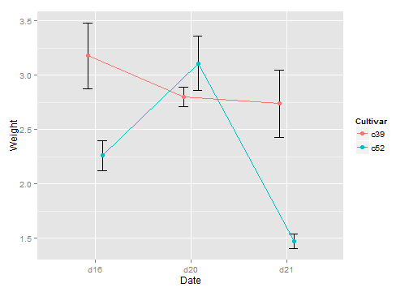 

```r

# Thinner error bar lines with size=0.25, and larger points with size=2.5
```

## 7.8.Adding Annotations to Individual Facets

```r
# The base plot
p <- ggplot(mpg, aes(x = displ, y = hwy)) + geom_point() + facet_grid(. ~ drv)

# A data frame with labels for each facet
f_labels <- data.frame(drv = c("4", "f", "r"), label = c("4wd", "Front", "Rear"))

p + geom_text(x = 6, y = 40, aes(label = label), data = f_labels)
```

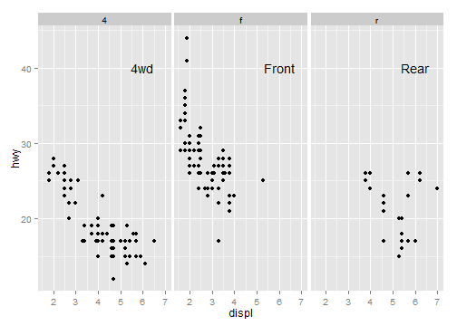 

```r

# If you use annotate(), the label will appear in all facets
p + annotate("text", x = 6, y = 42, label = "label text")
```

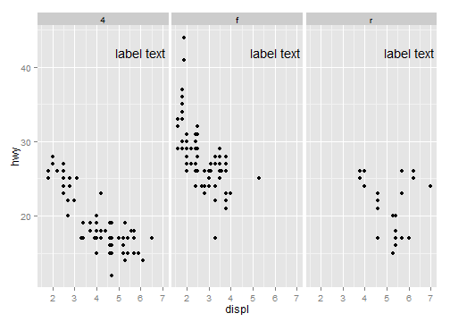 

```r

# This function returns a data frame with strings representing the
# regression equation, and the r^2 value These strings will be treated as R
# math expressions
lm_labels <- function(dat) {
    mod <- lm(hwy ~ displ, data = dat)
    formula <- sprintf("italic(y) == %.2f %+.2f * italic(x)", round(coef(mod)[1], 
        2), round(coef(mod)[2], 2))
    
    r <- cor(dat$displ, dat$hwy)
    r2 <- sprintf("italic(R^2) == %.2f", r^2)
    data.frame(formula = formula, r2 = r2, stringsAsFactors = FALSE)
}

library(plyr)  # For the ddply() function
labels <- ddply(mpg, "drv", lm_labels)
labels
```

```
##   drv                              formula                  r2
## 1   4 italic(y) == 30.68 -2.88 * italic(x) italic(R^2) == 0.65
## 2   f italic(y) == 37.38 -3.60 * italic(x) italic(R^2) == 0.36
## 3   r italic(y) == 25.78 -0.92 * italic(x) italic(R^2) == 0.04
```

```r

# Plot with formula and R^2 values
p + geom_smooth(method = lm, se = FALSE) + geom_text(x = 3, y = 40, aes(label = formula), 
    data = labels, parse = TRUE, hjust = 0) + geom_text(x = 3, y = 35, aes(label = r2), 
    data = labels, parse = TRUE, hjust = 0)
```

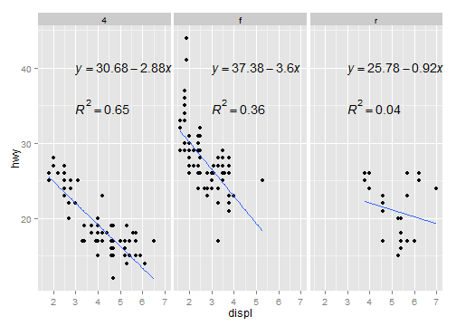 

```r

# Find r^2 values for each group
labels <- ddply(mpg, "drv", summarise, r2 = cor(displ, hwy)^2)
labels$r2 <- sprintf("italic(R^2) == %.2f", labels$r2)
```

