# chapter8: Axes
## 8.1.Swappinhg X- and Y-Axes

```r
library(ggplot2)
ggplot(PlantGrowth, aes(x = group, y = weight)) + geom_boxplot()
```

 

```r

ggplot(PlantGrowth, aes(x = group, y = weight)) + geom_boxplot() + coord_flip()
```

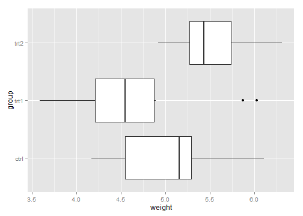 

```r


ggplot(PlantGrowth, aes(x = group, y = weight)) + geom_boxplot() + coord_flip() + 
    scale_x_discrete(limits = rev(levels(PlantGrowth$group)))
```

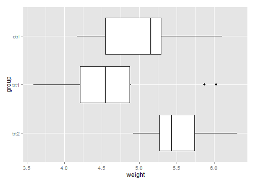 

## 8.2.Setting the Range of a Continuous Axis    

```r
p <- ggplot(PlantGrowth, aes(x = group, y = weight)) + geom_boxplot()
# Display the basic graph
p
```

 

```r

p + ylim(0, max(PlantGrowth$weight))
```

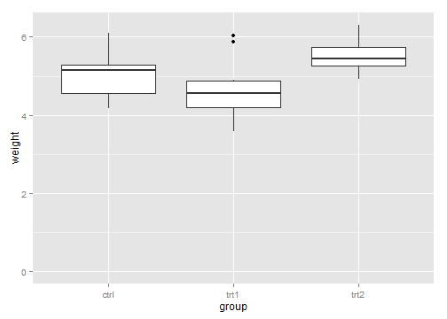 

```r

ylim(0, 10)
```

```
## continuous_scale(aesthetics = c("y", "ymin", "ymax", "yend", 
##     "yintercept", "ymin_final", "ymax_final"), scale_name = "position_c", 
##     palette = identity, limits = ..1, expand = expand, trans = ..2, 
##     guide = "none")
```

```r
scale_y_continuous(limits = c(0, 10))
```

```
## continuous_scale(aesthetics = c("y", "ymin", "ymax", "yend", 
##     "yintercept", "ymin_final", "ymax_final"), scale_name = "position_c", 
##     palette = identity, limits = ..1, expand = expand, guide = "none")
```

```r


p + ylim(0, 10) + scale_y_continuous(breaks = NULL)
```

```
## Scale for 'y' is already present. Adding another scale for 'y', which will replace the existing scale.
```

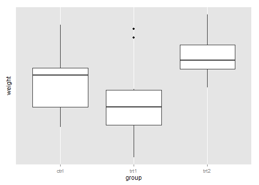 

```r

p + scale_y_continuous(breaks = NULL) + ylim(0, 10)
```

```
## Scale for 'y' is already present. Adding another scale for 'y', which will replace the existing scale.
```

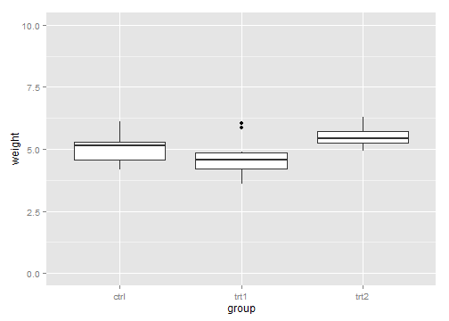 

```r

p + scale_y_continuous(limits = c(0, 10), breaks = NULL)
```

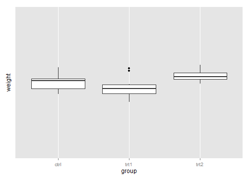 

```r

p + scale_y_continuous(limits = c(5, 6.5))  # Same as using ylim()
```

```
## Warning: Removed 13 rows containing non-finite values (stat_boxplot).
```

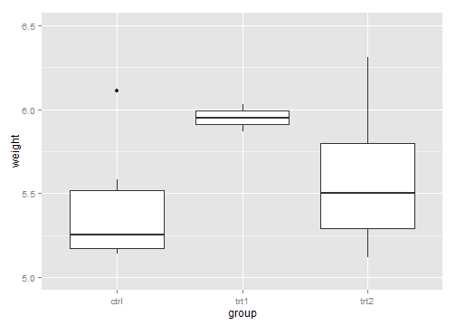 

```r

p + coord_cartesian(ylim = c(5, 6.5))
```

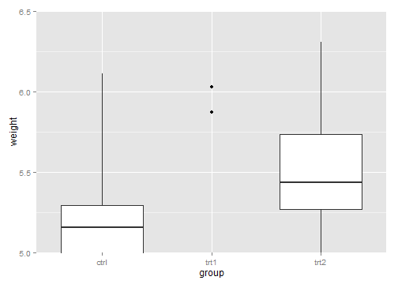 

```r

p + expand_limits(y = 0)
```

 

## 8.3.Reversing a Continuous Axis  

```r
ggplot(PlantGrowth, aes(x = group, y = weight)) + geom_boxplot() + scale_y_reverse()
```

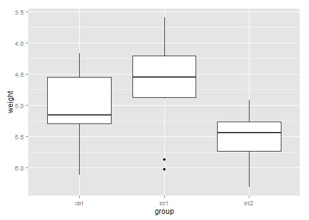 

```r

# Similar effect by specifying limits in reversed order
ggplot(PlantGrowth, aes(x = group, y = weight)) + geom_boxplot() + ylim(6.5, 
    3.5)
```

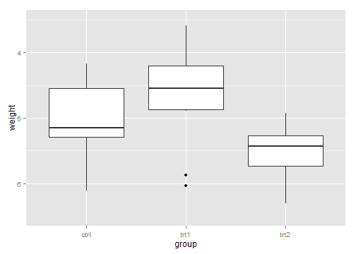 

```r

ggplot(PlantGrowth, aes(x = group, y = weight)) + geom_boxplot() + scale_y_reverse(limits = c(8, 
    0))
```

 

## 8.4.Changing the Order of Items on a Categorical Axis

```r
p <- ggplot(PlantGrowth, aes(x = group, y = weight)) + geom_boxplot()

p + scale_x_discrete(limits = c("trt1", "ctrl", "trt2"))
```

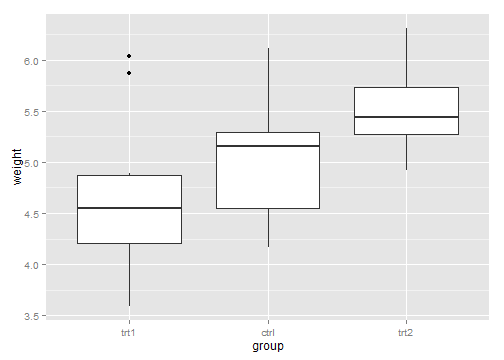 

```r

p + scale_x_discrete(limits = c("ctrl", "trt1"))
```

```
## Warning: Removed 2 rows containing missing values (geom_segment).
## Warning: Removed 1 rows containing missing values (geom_segment).
```

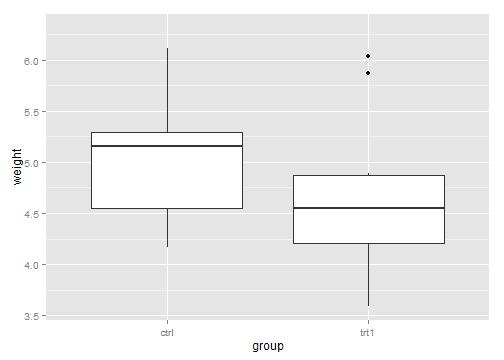 

```r

p + scale_x_discrete(limits = rev(levels(PlantGrowth$group)))
```

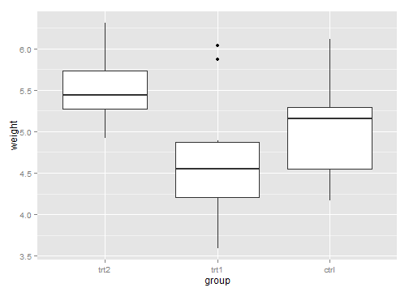 

## 8.5.Setting the Scaling Ratio of the X- and Y-Axes  

```r
library(gcookbook)  # For the data set

sp <- ggplot(marathon, aes(x = Half, y = Full)) + geom_point()

sp + coord_fixed()
```

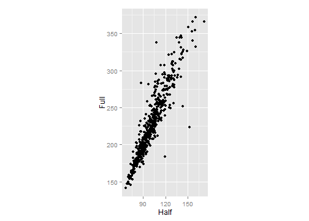 

```r

sp + coord_fixed() + scale_y_continuous(breaks = seq(0, 420, 30)) + scale_x_continuous(breaks = seq(0, 
    420, 30))
```

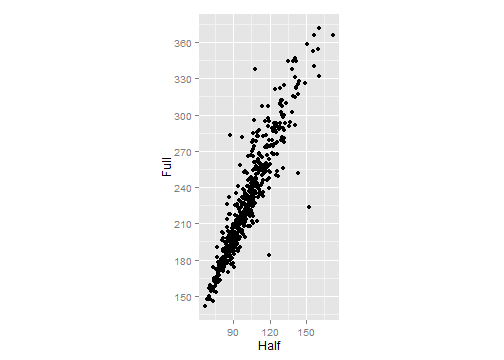 

```r

sp + coord_fixed(ratio = 1/2) + scale_y_continuous(breaks = seq(0, 420, 30)) + 
    scale_x_continuous(breaks = seq(0, 420, 15))
```

 

## 8.6.Setting the Positions of Tick Marks

```r
ggplot(PlantGrowth, aes(x = group, y = weight)) + geom_boxplot()
```

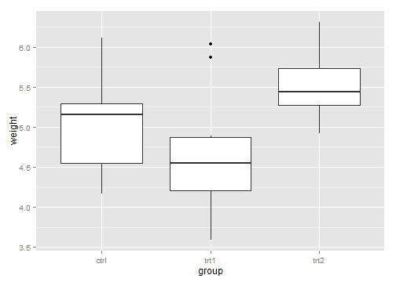 

```r

ggplot(PlantGrowth, aes(x = group, y = weight)) + geom_boxplot() + scale_y_continuous(breaks = c(4, 
    4.25, 4.5, 5, 6, 8))
```

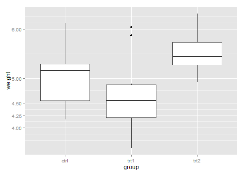 

```r

seq(4, 7, by = 0.5)
```

```
## [1] 4.0 4.5 5.0 5.5 6.0 6.5 7.0
```

```r

5:10
```

```
## [1]  5  6  7  8  9 10
```

```r

# Set both breaks and labels for a discrete axis
ggplot(PlantGrowth, aes(x = group, y = weight)) + geom_boxplot() + scale_x_discrete(limits = c("trt2", 
    "ctrl"), breaks = "ctrl")
```

```
## Warning: Removed 2 rows containing missing values (geom_point).
## Warning: Removed 2 rows containing missing values (geom_segment).
## Warning: Removed 1 rows containing missing values (geom_segment).
```

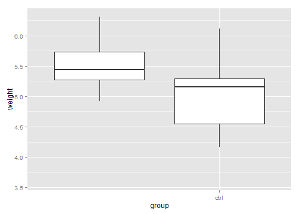 

## 8.7.Removing Tick Marks and Labels

```r
p <- ggplot(PlantGrowth, aes(x = group, y = weight)) + geom_boxplot()

p + theme(axis.text.y = element_blank())
```

 

```r

p + theme(axis.ticks = element_blank(), axis.text.y = element_blank())
```

 

```r

p + scale_y_continuous(breaks = NULL)
```

 

## 8.8.Changing the Text of Tick Labels

```r
library(gcookbook)  # For the data set

hwp <- ggplot(heightweight, aes(x = ageYear, y = heightIn)) + geom_point()
hwp
```

 

```r

hwp + scale_y_continuous(breaks = c(50, 56, 60, 66, 72), labels = c("Tiny", 
    "Really\nshort", "Short", "Medium", "Tallish"))
```

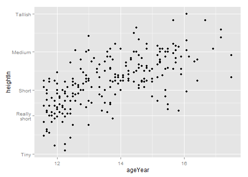 

```r

footinch_formatter <- function(x) {
    foot <- floor(x/12)
    inch <- x%%12
    return(paste(foot, "'", inch, "\"", sep = ""))
}

footinch_formatter(56:64)
```

```
## [1] "4'8\""  "4'9\""  "4'10\"" "4'11\"" "5'0\""  "5'1\""  "5'2\""  "5'3\"" 
## [9] "5'4\""
```

```r

# '4'8\'' '4'9\'' '4'10\'' '4'11\'' '5'0\'' '5'1\'' '5'2\'' '5'3\''
# '5'4\''

hwp + scale_y_continuous(labels = footinch_formatter)
```

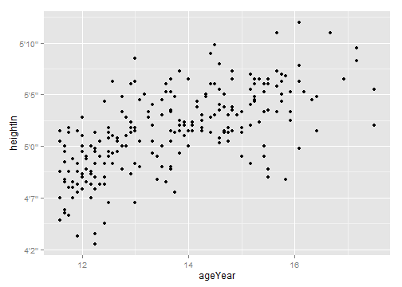 

```r

hwp + scale_y_continuous(breaks = seq(48, 72, 4), labels = footinch_formatter)
```

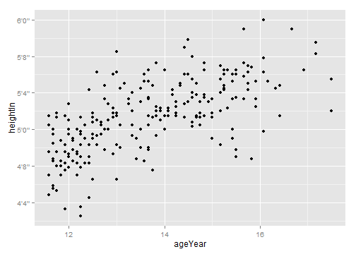 

```r

timeHMS_formatter <- function(x) {
    h <- floor(x/60)
    m <- floor(x%%60)
    s <- round(60 * (x%%1))  # Round to nearest second
    lab <- sprintf("%02d:%02d:%02d", h, m, s)  # Format the strings as HH:MM:SS
    lab <- gsub("^00:", "", lab)  # Remove leading 00: if present
    lab <- gsub("^0", "", lab)  # Remove leading 0 if present
    return(lab)
}

timeHMS_formatter(c(0.33, 50, 51.25, 59.32, 60, 60.1, 130.23))
```

```
## [1] "0:20"    "50:00"   "51:15"   "59:19"   "1:00:00" "1:00:06" "2:10:14"
```

## 8.9.Changing the Appearance of Tick Labels

```r
bp <- ggplot(PlantGrowth, aes(x = group, y = weight)) + geom_boxplot() + scale_x_discrete(breaks = c("ctrl", 
    "trt1", "trt2"), labels = c("Control", "Treatment 1", "Treatment 2"))
bp
```

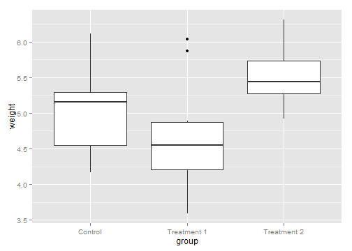 

```r

bp + theme(axis.text.x = element_text(angle = 90, hjust = 1, vjust = 0.5))
```

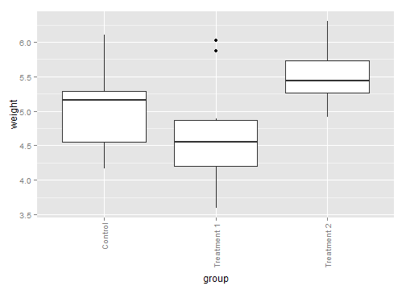 

```r

bp + theme(axis.text.x = element_text(angle = 30, hjust = 1, vjust = 1))
```

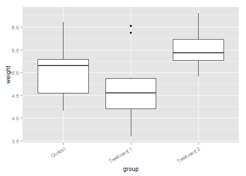 

```r

bp + theme(axis.text.x = element_text(family = "Times", face = "italic", colour = "darkred", 
    size = rel(0.9)))
```

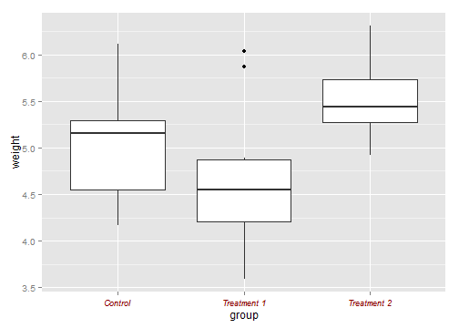 

## 8.10.Changing the Text of Axis Labels

```r
library(gcookbook)  # For the data set

hwp <- ggplot(heightweight, aes(x = ageYear, y = heightIn, colour = sex)) + 
    geom_point()
# With default axis labels
hwp
```

 

```r

# Set the axis labels
hwp + xlab("Age in years") + ylab("Height in inches")
```

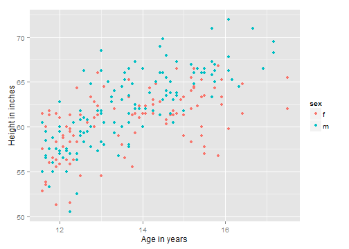 

```r

hwp + labs(x = "Age in years", y = "Height in inches")
```

 

```r

hwp + scale_x_continuous(name = "Age in years")
```

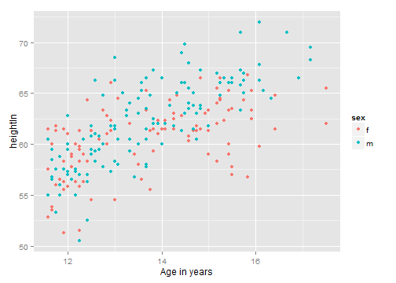 

```r

hwp + scale_x_continuous(name = "Age\n(years)")
```

 

## 8.11.Removing Axis Labels

```r
p <- ggplot(PlantGrowth, aes(x = group, y = weight)) + geom_boxplot()

p + theme(axis.title.x = element_blank())
```

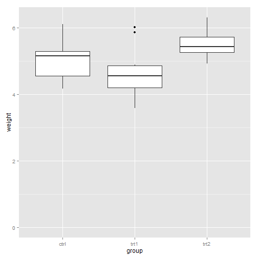 

```r

p + xlab("")
```

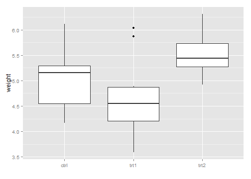 

## 8.12.Changing the Appearance of Axis Labels
## 8.13.Showing Lines Along the Axes

```r
library(gcookbook)  # For the data set

p <- ggplot(heightweight, aes(x = ageYear, y = heightIn)) + geom_point()

p + theme(axis.line = element_line(colour = "black"))
```

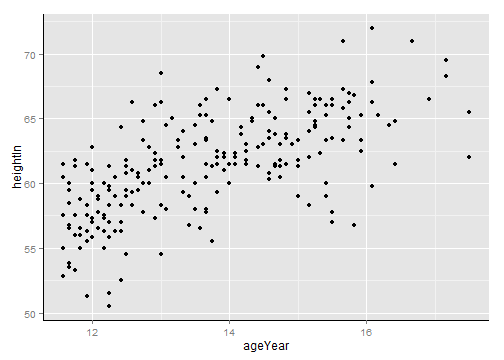 

```r

p + theme_bw() + theme(panel.border = element_blank(), axis.line = element_line(colour = "black"))
```

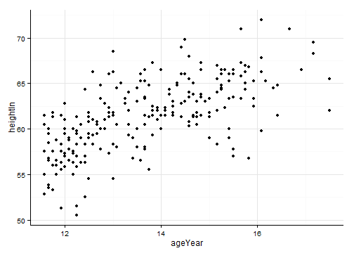 

```r

# With thick lines, only half overlaps
p + theme_bw() + theme(panel.border = element_blank(), axis.line = element_line(colour = "black", 
    size = 4))
```

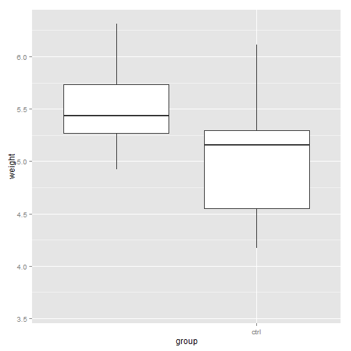 

```r

# Full overlap
p + theme_bw() + theme(panel.border = element_blank(), axis.line = element_line(colour = "black", 
    size = 4, lineend = "square"))
```

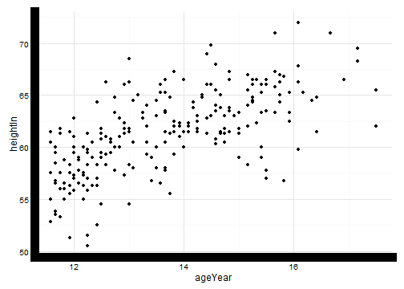 

## 8.14.Using a Logarithmic Axis

```r
library(MASS)  # For the data set

# The base plot
p <- ggplot(Animals, aes(x = body, y = brain, label = rownames(Animals))) + 
    geom_text(size = 3)
p
```

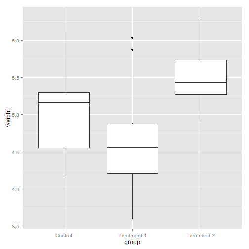 

```r

# With logarithmic x and y scales
p + scale_x_log10() + scale_y_log10()
```

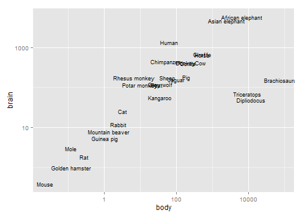 

```r

Animals
```

```
##                       body  brain
## Mountain beaver      1.350    8.1
## Cow                465.000  423.0
## Grey wolf           36.330  119.5
## Goat                27.660  115.0
## Guinea pig           1.040    5.5
## Dipliodocus      11700.000   50.0
## Asian elephant    2547.000 4603.0
## Donkey             187.100  419.0
## Horse              521.000  655.0
## Potar monkey        10.000  115.0
## Cat                  3.300   25.6
## Giraffe            529.000  680.0
## Gorilla            207.000  406.0
## Human               62.000 1320.0
## African elephant  6654.000 5712.0
## Triceratops       9400.000   70.0
## Rhesus monkey        6.800  179.0
## Kangaroo            35.000   56.0
## Golden hamster       0.120    1.0
## Mouse                0.023    0.4
## Rabbit               2.500   12.1
## Sheep               55.500  175.0
## Jaguar             100.000  157.0
## Chimpanzee          52.160  440.0
## Rat                  0.280    1.9
## Brachiosaurus    87000.000  154.5
## Mole                 0.122    3.0
## Pig                192.000  180.0
```

```r

10^(0:3)
```

```
## [1]    1   10  100 1000
```

```r

10^(-1:5)
```

```
## [1] 1e-01 1e+00 1e+01 1e+02 1e+03 1e+04 1e+05
```

```r


p + scale_x_log10(breaks = 10^(-1:5)) + scale_y_log10(breaks = 10^(0:3))
```

 

```r

library(scales)
p + scale_x_log10(breaks = 10^(-1:5), labels = trans_format("log10", math_format(10^.x))) + 
    scale_y_log10(breaks = 10^(0:3), labels = trans_format("log10", math_format(10^.x)))
```

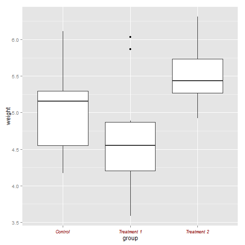 

```r

ggplot(Animals, aes(x = log10(body), y = log10(brain), label = rownames(Animals))) + 
    geom_text(size = 3)
```

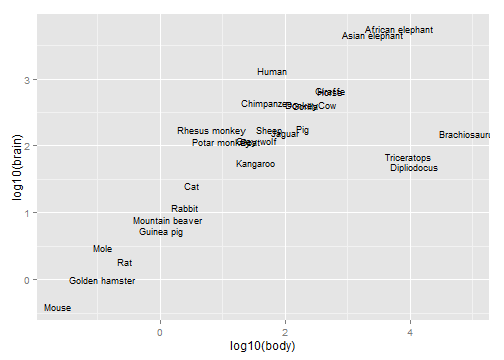 

```r

library(scales)

# Use natural log on x, and log2 on y
p + scale_x_continuous(trans = log_trans(), breaks = trans_breaks("log", function(x) exp(x)), 
    labels = trans_format("log", math_format(e^.x))) + scale_y_continuous(trans = log2_trans(), 
    breaks = trans_breaks("log2", function(x) 2^x), labels = trans_format("log2", 
        math_format(2^.x)))
```

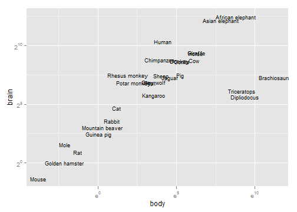 

```r


library(gcookbook)  # For the data set

ggplot(aapl, aes(x = date, y = adj_price)) + geom_line()
```

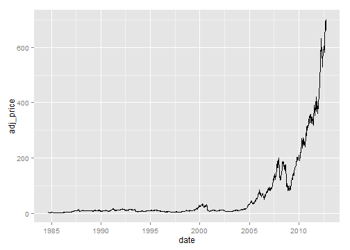 

```r

ggplot(aapl, aes(x = date, y = adj_price)) + geom_line() + scale_y_log10(breaks = c(2, 
    10, 50, 250))
```

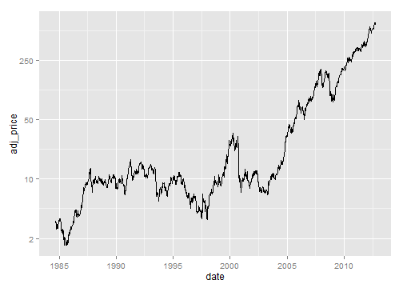 

## 8.15.Adding Ticks for a Logarithmic Axis

```r
library(MASS)  # For the data set
library(scales)  # For the trans and format functions
ggplot(Animals, aes(x = body, y = brain, label = rownames(Animals))) + geom_text(size = 3) + 
    annotation_logticks() + scale_x_log10(breaks = trans_breaks("log10", function(x) 10^x), 
    labels = trans_format("log10", math_format(10^.x))) + scale_y_log10(breaks = trans_breaks("log10", 
    function(x) 10^x), labels = trans_format("log10", math_format(10^.x)))
```

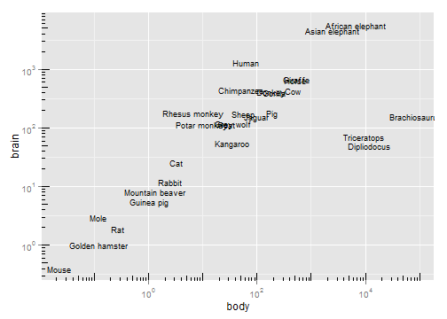 

```r


ggplot(Animals, aes(x = body, y = brain, label = rownames(Animals))) + geom_text(size = 3) + 
    annotation_logticks() + scale_x_log10(breaks = trans_breaks("log10", function(x) 10^x), 
    labels = trans_format("log10", math_format(10^.x)), minor_breaks = log10(5) + 
        -2:5) + scale_y_log10(breaks = trans_breaks("log10", function(x) 10^x), 
    labels = trans_format("log10", math_format(10^.x)), minor_breaks = log10(5) + 
        -1:3) + coord_fixed() + theme_bw()
```

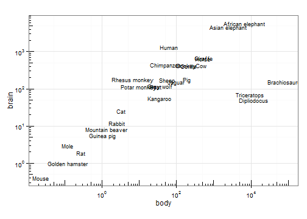 

## 8.16.Making a Circular Graph

```r
library(gcookbook)  # For the data set
head(wind)
```

```
##   TimeUTC Temp WindAvg WindMax WindDir SpeedCat DirCat
## 3       0 3.54    9.52   10.39      89    10-15     90
## 4       5 3.52    9.10    9.90      92     5-10     90
## 5      10 3.53    8.73    9.51      92     5-10     90
## 6      15 3.63    8.97    9.90      94     5-10     90
## 7      20 3.71    8.51    9.41      97     5-10     90
## 8      25 3.73    8.43    9.02      95     5-10     90
```

```r

ggplot(wind, aes(x = DirCat, fill = SpeedCat)) + geom_histogram(binwidth = 15, 
    origin = -7.5) + coord_polar() + scale_x_continuous(limits = c(0, 360))
```

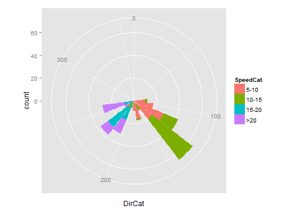 

```r

ggplot(wind, aes(x = DirCat, fill = SpeedCat)) + geom_histogram(binwidth = 15, 
    origin = -7.5, colour = "black", size = 0.25) + guides(fill = guide_legend(reverse = TRUE)) + 
    coord_polar() + scale_x_continuous(limits = c(0, 360), breaks = seq(0, 360, 
    by = 45), minor_breaks = seq(0, 360, by = 15)) + scale_fill_brewer()
```

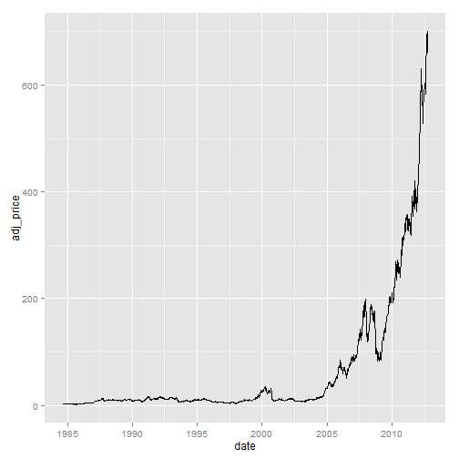 

```r

coord_polar(start = -45 * pi/180)
```

```
## $theta
## [1] "x"
## 
## $r
## [1] "y"
## 
## $start
## [1] -0.7854
## 
## $direction
## [1] 1
## 
## attr(,"class")
## [1] "polar" "coord"
```

```r

# Put mdeaths time series data into a data frame
md <- data.frame(deaths = as.numeric(mdeaths), month = as.numeric(cycle(mdeaths)))

# Calculate average number of deaths in each month
library(plyr)  # For the ddply() function
md <- ddply(md, "month", summarise, deaths = mean(deaths))
md
```

```
##    month deaths
## 1      1   2130
## 2      2   2081
## 3      3   1970
## 4      4   1657
## 5      5   1314
## 6      6   1187
## 7      7   1137
## 8      8   1038
## 9      9   1022
## 10    10   1241
## 11    11   1378
## 12    12   1796
```

```r

# Make the base plot
p <- ggplot(md, aes(x = month, y = deaths)) + geom_line() + scale_x_continuous(breaks = 1:12)

# With coord_polar
p + coord_polar()
```

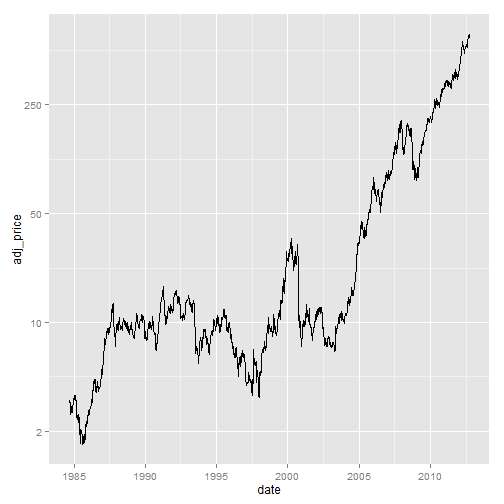 

```r

# With coord_polar and y (r) limits going to zero
p + coord_polar() + ylim(0, max(md$deaths))
```

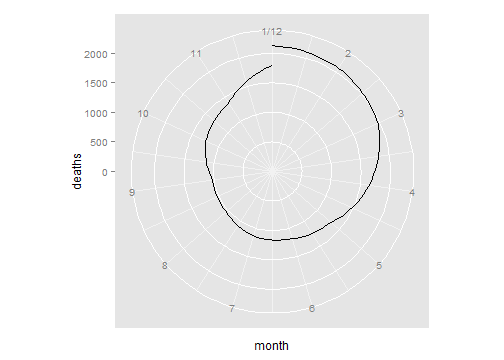 

```r

p + coord_polar() + ylim(0, max(md$deaths)) + xlim(0, 12)
```

```
## Scale for 'x' is already present. Adding another scale for 'x', which will replace the existing scale.
```

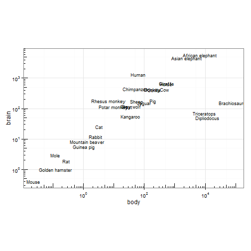 

```r

# Connect the lines by adding a value for 0 that is the same as 12
mdx <- md[md$month == 12, ]
mdx$month <- 0
mdnew <- rbind(mdx, md)

# Make the same plot as before, but with the new data, by using %+%
p %+% mdnew + coord_polar() + ylim(0, max(md$deaths))
```

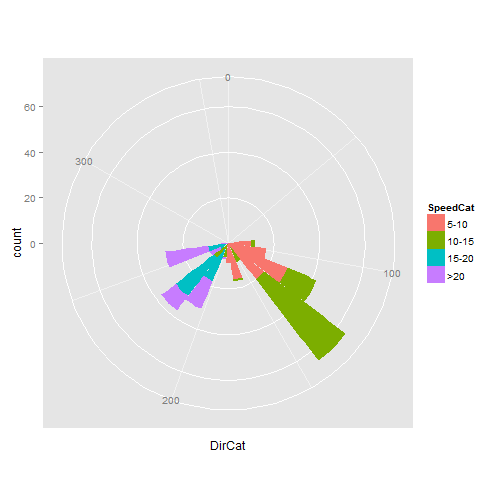 

## 8.17.Using Dates on an Axis

```r
# Look at the structure
str(economics)
```

```
## 'data.frame':	478 obs. of  6 variables:
##  $ date    : Date, format: "1967-06-30" "1967-07-31" ...
##  $ pce     : num  508 511 517 513 518 ...
##  $ pop     : int  198712 198911 199113 199311 199498 199657 199808 199920 200056 200208 ...
##  $ psavert : num  9.8 9.8 9 9.8 9.7 9.4 9 9.5 8.9 9.6 ...
##  $ uempmed : num  4.5 4.7 4.6 4.9 4.7 4.8 5.1 4.5 4.1 4.6 ...
##  $ unemploy: int  2944 2945 2958 3143 3066 3018 2878 3001 2877 2709 ...
```

```r

ggplot(economics, aes(x = date, y = psavert)) + geom_line()
```

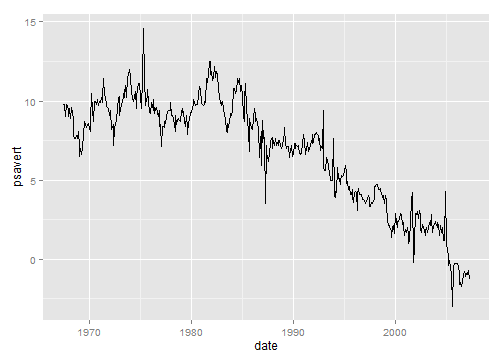 

```r

# Take a subset of economics
econ <- subset(economics, date >= as.Date("1992-05-01") & date < as.Date("1993-06-01"))

# Base plot - without specifying breaks
p <- ggplot(econ, aes(x = date, y = psavert)) + geom_line()
p
```

```
## Warning: 'mbcsToSbcs'里转换'涓���� 1992'出错：<e4>代替了dot
## Warning: 'mbcsToSbcs'里转换'涓���� 1992'出错：<b8>代替了dot
## Warning: 'mbcsToSbcs'里转换'涓���� 1992'出错：<83>代替了dot
## Warning: 'mbcsToSbcs'里转换'涓���� 1992'出错：<e6>代替了dot
## Warning: 'mbcsToSbcs'里转换'涓���� 1992'出错：<9c>代替了dot
## Warning: 'mbcsToSbcs'里转换'涓���� 1992'出错：<88>代替了dot
## Warning: 'mbcsToSbcs'里转换'������ 1992'出错：<e5>代替了dot
## Warning: 'mbcsToSbcs'里转换'������ 1992'出错：<8d>代替了dot
## Warning: 'mbcsToSbcs'里转换'������ 1992'出错：<81>代替了dot
## Warning: 'mbcsToSbcs'里转换'������ 1992'出错：<e6>代替了dot
## Warning: 'mbcsToSbcs'里转换'������ 1992'出错：<9c>代替了dot
## Warning: 'mbcsToSbcs'里转换'������ 1992'出错：<88>代替了dot
## Warning: 'mbcsToSbcs'里转换'涓���<U+383C><U+3E38> 1993'出错：<e4>代替了dot
## Warning: 'mbcsToSbcs'里转换'涓���<U+383C><U+3E38> 1993'出错：<b8>代替了dot
## Warning: 'mbcsToSbcs'里转换'涓���<U+383C><U+3E38> 1993'出错：<80>代替了dot
## Warning: 'mbcsToSbcs'里转换'涓���<U+383C><U+3E38> 1993'出错：<e6>代替了dot
## Warning: 'mbcsToSbcs'里转换'涓���<U+383C><U+3E38> 1993'出错：<9c>代替了dot
## Warning: 'mbcsToSbcs'里转换'涓���<U+383C><U+3E38> 1993'出错：<88>代替了dot
## Warning: 'mbcsToSbcs'里转换'������ 1993'出错：<e5>代替了dot
## Warning: 'mbcsToSbcs'里转换'������ 1993'出错：<9b>代替了dot
## Warning: 'mbcsToSbcs'里转换'������ 1993'出错：<9b>代替了dot
## Warning: 'mbcsToSbcs'里转换'������ 1993'出错：<e6>代替了dot
## Warning: 'mbcsToSbcs'里转换'������ 1993'出错：<9c>代替了dot
## Warning: 'mbcsToSbcs'里转换'������ 1993'出错：<88>代替了dot
## Warning: 'mbcsToSbcs'里转换'涓���� 1992'出错：<e4>代替了dot
## Warning: 'mbcsToSbcs'里转换'涓���� 1992'出错：<b8>代替了dot
## Warning: 'mbcsToSbcs'里转换'涓���� 1992'出错：<83>代替了dot
## Warning: 'mbcsToSbcs'里转换'涓���� 1992'出错：<e6>代替了dot
## Warning: 'mbcsToSbcs'里转换'涓���� 1992'出错：<9c>代替了dot
## Warning: 'mbcsToSbcs'里转换'涓���� 1992'出错：<88>代替了dot
## Warning: 'mbcsToSbcs'里转换'������ 1992'出错：<e5>代替了dot
## Warning: 'mbcsToSbcs'里转换'������ 1992'出错：<8d>代替了dot
## Warning: 'mbcsToSbcs'里转换'������ 1992'出错：<81>代替了dot
## Warning: 'mbcsToSbcs'里转换'������ 1992'出错：<e6>代替了dot
## Warning: 'mbcsToSbcs'里转换'������ 1992'出错：<9c>代替了dot
## Warning: 'mbcsToSbcs'里转换'������ 1992'出错：<88>代替了dot
## Warning: 'mbcsToSbcs'里转换'涓���<U+383C><U+3E38> 1993'出错：<e4>代替了dot
## Warning: 'mbcsToSbcs'里转换'涓���<U+383C><U+3E38> 1993'出错：<b8>代替了dot
## Warning: 'mbcsToSbcs'里转换'涓���<U+383C><U+3E38> 1993'出错：<80>代替了dot
## Warning: 'mbcsToSbcs'里转换'涓���<U+383C><U+3E38> 1993'出错：<e6>代替了dot
## Warning: 'mbcsToSbcs'里转换'涓���<U+383C><U+3E38> 1993'出错：<9c>代替了dot
## Warning: 'mbcsToSbcs'里转换'涓���<U+383C><U+3E38> 1993'出错：<88>代替了dot
## Warning: 'mbcsToSbcs'里转换'������ 1993'出错：<e5>代替了dot
## Warning: 'mbcsToSbcs'里转换'������ 1993'出错：<9b>代替了dot
## Warning: 'mbcsToSbcs'里转换'������ 1993'出错：<9b>代替了dot
## Warning: 'mbcsToSbcs'里转换'������ 1993'出错：<e6>代替了dot
## Warning: 'mbcsToSbcs'里转换'������ 1993'出错：<9c>代替了dot
## Warning: 'mbcsToSbcs'里转换'������ 1993'出错：<88>代替了dot
## Warning: 'mbcsToSbcs'里转换'涓���� 1992'出错：<e4>代替了dot
## Warning: 'mbcsToSbcs'里转换'涓���� 1992'出错：<b8>代替了dot
## Warning: 'mbcsToSbcs'里转换'涓���� 1992'出错：<83>代替了dot
## Warning: 'mbcsToSbcs'里转换'涓���� 1992'出错：<e6>代替了dot
## Warning: 'mbcsToSbcs'里转换'涓���� 1992'出错：<9c>代替了dot
## Warning: 'mbcsToSbcs'里转换'涓���� 1992'出错：<88>代替了dot
## Warning: 'mbcsToSbcs'里转换'������ 1992'出错：<e5>代替了dot
## Warning: 'mbcsToSbcs'里转换'������ 1992'出错：<8d>代替了dot
## Warning: 'mbcsToSbcs'里转换'������ 1992'出错：<81>代替了dot
## Warning: 'mbcsToSbcs'里转换'������ 1992'出错：<e6>代替了dot
## Warning: 'mbcsToSbcs'里转换'������ 1992'出错：<9c>代替了dot
## Warning: 'mbcsToSbcs'里转换'������ 1992'出错：<88>代替了dot
## Warning: 'mbcsToSbcs'里转换'涓���<U+383C><U+3E38> 1993'出错：<e4>代替了dot
## Warning: 'mbcsToSbcs'里转换'涓���<U+383C><U+3E38> 1993'出错：<b8>代替了dot
## Warning: 'mbcsToSbcs'里转换'涓���<U+383C><U+3E38> 1993'出错：<80>代替了dot
## Warning: 'mbcsToSbcs'里转换'涓���<U+383C><U+3E38> 1993'出错：<e6>代替了dot
## Warning: 'mbcsToSbcs'里转换'涓���<U+383C><U+3E38> 1993'出错：<9c>代替了dot
## Warning: 'mbcsToSbcs'里转换'涓���<U+383C><U+3E38> 1993'出错：<88>代替了dot
## Warning: 'mbcsToSbcs'里转换'������ 1993'出错：<e5>代替了dot
## Warning: 'mbcsToSbcs'里转换'������ 1993'出错：<9b>代替了dot
## Warning: 'mbcsToSbcs'里转换'������ 1993'出错：<9b>代替了dot
## Warning: 'mbcsToSbcs'里转换'������ 1993'出错：<e6>代替了dot
## Warning: 'mbcsToSbcs'里转换'������ 1993'出错：<9c>代替了dot
## Warning: 'mbcsToSbcs'里转换'������ 1993'出错：<88>代替了dot
## Warning: 'mbcsToSbcs'里转换'涓���� 1992'出错：<e4>代替了dot
## Warning: 'mbcsToSbcs'里转换'涓���� 1992'出错：<b8>代替了dot
## Warning: 'mbcsToSbcs'里转换'涓���� 1992'出错：<83>代替了dot
## Warning: 'mbcsToSbcs'里转换'涓���� 1992'出错：<e6>代替了dot
## Warning: 'mbcsToSbcs'里转换'涓���� 1992'出错：<9c>代替了dot
## Warning: 'mbcsToSbcs'里转换'涓���� 1992'出错：<88>代替了dot
## Warning: 'mbcsToSbcs'里转换'������ 1992'出错：<e5>代替了dot
## Warning: 'mbcsToSbcs'里转换'������ 1992'出错：<8d>代替了dot
## Warning: 'mbcsToSbcs'里转换'������ 1992'出错：<81>代替了dot
## Warning: 'mbcsToSbcs'里转换'������ 1992'出错：<e6>代替了dot
## Warning: 'mbcsToSbcs'里转换'������ 1992'出错：<9c>代替了dot
## Warning: 'mbcsToSbcs'里转换'������ 1992'出错：<88>代替了dot
## Warning: 'mbcsToSbcs'里转换'涓���<U+383C><U+3E38> 1993'出错：<e4>代替了dot
## Warning: 'mbcsToSbcs'里转换'涓���<U+383C><U+3E38> 1993'出错：<b8>代替了dot
## Warning: 'mbcsToSbcs'里转换'涓���<U+383C><U+3E38> 1993'出错：<80>代替了dot
## Warning: 'mbcsToSbcs'里转换'涓���<U+383C><U+3E38> 1993'出错：<e6>代替了dot
## Warning: 'mbcsToSbcs'里转换'涓���<U+383C><U+3E38> 1993'出错：<9c>代替了dot
## Warning: 'mbcsToSbcs'里转换'涓���<U+383C><U+3E38> 1993'出错：<88>代替了dot
## Warning: 'mbcsToSbcs'里转换'������ 1993'出错：<e5>代替了dot
## Warning: 'mbcsToSbcs'里转换'������ 1993'出错：<9b>代替了dot
## Warning: 'mbcsToSbcs'里转换'������ 1993'出错：<9b>代替了dot
## Warning: 'mbcsToSbcs'里转换'������ 1993'出错：<e6>代替了dot
## Warning: 'mbcsToSbcs'里转换'������ 1993'出错：<9c>代替了dot
## Warning: 'mbcsToSbcs'里转换'������ 1993'出错：<88>代替了dot
## Warning: 'mbcsToSbcs'里转换'涓���� 1992'出错：<e4>代替了dot
## Warning: 'mbcsToSbcs'里转换'涓���� 1992'出错：<b8>代替了dot
## Warning: 'mbcsToSbcs'里转换'涓���� 1992'出错：<83>代替了dot
## Warning: 'mbcsToSbcs'里转换'涓���� 1992'出错：<e6>代替了dot
## Warning: 'mbcsToSbcs'里转换'涓���� 1992'出错：<9c>代替了dot
## Warning: 'mbcsToSbcs'里转换'涓���� 1992'出错：<88>代替了dot
## Warning: 'mbcsToSbcs'里转换'������ 1992'出错：<e5>代替了dot
## Warning: 'mbcsToSbcs'里转换'������ 1992'出错：<8d>代替了dot
## Warning: 'mbcsToSbcs'里转换'������ 1992'出错：<81>代替了dot
## Warning: 'mbcsToSbcs'里转换'������ 1992'出错：<e6>代替了dot
## Warning: 'mbcsToSbcs'里转换'������ 1992'出错：<9c>代替了dot
## Warning: 'mbcsToSbcs'里转换'������ 1992'出错：<88>代替了dot
## Warning: 'mbcsToSbcs'里转换'涓���<U+383C><U+3E38> 1993'出错：<e4>代替了dot
## Warning: 'mbcsToSbcs'里转换'涓���<U+383C><U+3E38> 1993'出错：<b8>代替了dot
## Warning: 'mbcsToSbcs'里转换'涓���<U+383C><U+3E38> 1993'出错：<80>代替了dot
## Warning: 'mbcsToSbcs'里转换'涓���<U+383C><U+3E38> 1993'出错：<e6>代替了dot
## Warning: 'mbcsToSbcs'里转换'涓���<U+383C><U+3E38> 1993'出错：<9c>代替了dot
## Warning: 'mbcsToSbcs'里转换'涓���<U+383C><U+3E38> 1993'出错：<88>代替了dot
## Warning: 'mbcsToSbcs'里转换'������ 1993'出错：<e5>代替了dot
## Warning: 'mbcsToSbcs'里转换'������ 1993'出错：<9b>代替了dot
## Warning: 'mbcsToSbcs'里转换'������ 1993'出错：<9b>代替了dot
## Warning: 'mbcsToSbcs'里转换'������ 1993'出错：<e6>代替了dot
## Warning: 'mbcsToSbcs'里转换'������ 1993'出错：<9c>代替了dot
## Warning: 'mbcsToSbcs'里转换'������ 1993'出错：<88>代替了dot
```

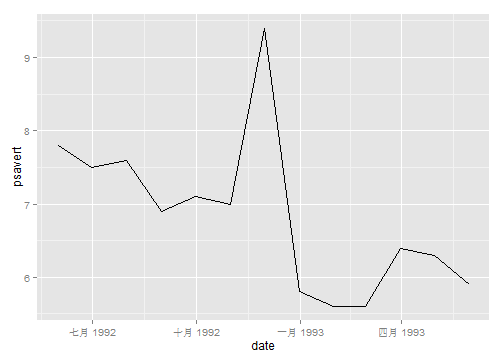 

```r

# Specify breaks as a Date vector
datebreaks <- seq(as.Date("1992-06-01"), as.Date("1993-06-01"), by = "2 month")

# Use breaks, and rotate text labels
p + scale_x_date(breaks = datebreaks) + theme(axis.text.x = element_text(angle = 30, 
    hjust = 1))
```

 

```r

library(scales)
p + scale_x_date(breaks = datebreaks, labels = date_format("%Y %b")) + theme(axis.text.x = element_text(angle = 30, 
    hjust = 1))
```

```
## Warning: 'mbcsToSbcs'里转换'1992 ������'出错：<e5>代替了dot
## Warning: 'mbcsToSbcs'里转换'1992 ������'出错：<85>代替了dot
## Warning: 'mbcsToSbcs'里转换'1992 ������'出错：<ad>代替了dot
## Warning: 'mbcsToSbcs'里转换'1992 ������'出错：<e6>代替了dot
## Warning: 'mbcsToSbcs'里转换'1992 ������'出错：<9c>代替了dot
## Warning: 'mbcsToSbcs'里转换'1992 ������'出错：<88>代替了dot
## Warning: 'mbcsToSbcs'里转换'1992 ������'出错：<e5>代替了dot
## Warning: 'mbcsToSbcs'里转换'1992 ������'出错：<85>代替了dot
## Warning: 'mbcsToSbcs'里转换'1992 ������'出错：<ab>代替了dot
## Warning: 'mbcsToSbcs'里转换'1992 ������'出错：<e6>代替了dot
## Warning: 'mbcsToSbcs'里转换'1992 ������'出错：<9c>代替了dot
## Warning: 'mbcsToSbcs'里转换'1992 ������'出错：<88>代替了dot
## Warning: 'mbcsToSbcs'里转换'1992 ������'出错：<e5>代替了dot
## Warning: 'mbcsToSbcs'里转换'1992 ������'出错：<8d>代替了dot
## Warning: 'mbcsToSbcs'里转换'1992 ������'出错：<81>代替了dot
## Warning: 'mbcsToSbcs'里转换'1992 ������'出错：<e6>代替了dot
## Warning: 'mbcsToSbcs'里转换'1992 ������'出错：<9c>代替了dot
## Warning: 'mbcsToSbcs'里转换'1992 ������'出错：<88>代替了dot
## Warning: 'mbcsToSbcs'里转换'1992 ���浜���<U+383C><U+3E38>'出错：<e5>代替了dot
## Warning: 'mbcsToSbcs'里转换'1992 ���浜���<U+383C><U+3E38>'出错：<8d>代替了dot
## Warning: 'mbcsToSbcs'里转换'1992 ���浜���<U+383C><U+3E38>'出错：<81>代替了dot
## Warning: 'mbcsToSbcs'里转换'1992 ���浜���<U+383C><U+3E38>'出错：<e4>代替了dot
## Warning: 'mbcsToSbcs'里转换'1992 ���浜���<U+383C><U+3E38>'出错：<ba>代替了dot
## Warning: 'mbcsToSbcs'里转换'1992 ���浜���<U+383C><U+3E38>'出错：<8c>代替了dot
## Warning: 'mbcsToSbcs'里转换'1992 ���浜���<U+383C><U+3E38>'出错：<e6>代替了dot
## Warning: 'mbcsToSbcs'里转换'1992 ���浜���<U+383C><U+3E38>'出错：<9c>代替了dot
## Warning: 'mbcsToSbcs'里转换'1992 ���浜���<U+383C><U+3E38>'出错：<88>代替了dot
## Warning: 'mbcsToSbcs'里转换'1993 浜����'出错：<e4>代替了dot
## Warning: 'mbcsToSbcs'里转换'1993 浜����'出错：<ba>代替了dot
## Warning: 'mbcsToSbcs'里转换'1993 浜����'出错：<8c>代替了dot
## Warning: 'mbcsToSbcs'里转换'1993 浜����'出错：<e6>代替了dot
## Warning: 'mbcsToSbcs'里转换'1993 浜����'出错：<9c>代替了dot
## Warning: 'mbcsToSbcs'里转换'1993 浜����'出错：<88>代替了dot
## Warning: 'mbcsToSbcs'里转换'1993 ������'出错：<e5>代替了dot
## Warning: 'mbcsToSbcs'里转换'1993 ������'出错：<9b>代替了dot
## Warning: 'mbcsToSbcs'里转换'1993 ������'出错：<9b>代替了dot
## Warning: 'mbcsToSbcs'里转换'1993 ������'出错：<e6>代替了dot
## Warning: 'mbcsToSbcs'里转换'1993 ������'出错：<9c>代替了dot
## Warning: 'mbcsToSbcs'里转换'1993 ������'出错：<88>代替了dot
## Warning: 'mbcsToSbcs'里转换'1993 ������'出错：<e5>代替了dot
## Warning: 'mbcsToSbcs'里转换'1993 ������'出错：<85>代替了dot
## Warning: 'mbcsToSbcs'里转换'1993 ������'出错：<ad>代替了dot
## Warning: 'mbcsToSbcs'里转换'1993 ������'出错：<e6>代替了dot
## Warning: 'mbcsToSbcs'里转换'1993 ������'出错：<9c>代替了dot
## Warning: 'mbcsToSbcs'里转换'1993 ������'出错：<88>代替了dot
## Warning: 'mbcsToSbcs'里转换'1992 ������'出错：<e5>代替了dot
## Warning: 'mbcsToSbcs'里转换'1992 ������'出错：<85>代替了dot
## Warning: 'mbcsToSbcs'里转换'1992 ������'出错：<ad>代替了dot
## Warning: 'mbcsToSbcs'里转换'1992 ������'出错：<e6>代替了dot
## Warning: 'mbcsToSbcs'里转换'1992 ������'出错：<9c>代替了dot
## Warning: 'mbcsToSbcs'里转换'1992 ������'出错：<88>代替了dot
## Warning: 'mbcsToSbcs'里转换'1992 ������'出错：<e5>代替了dot
## Warning: 'mbcsToSbcs'里转换'1992 ������'出错：<85>代替了dot
## Warning: 'mbcsToSbcs'里转换'1992 ������'出错：<ab>代替了dot
## Warning: 'mbcsToSbcs'里转换'1992 ������'出错：<e6>代替了dot
## Warning: 'mbcsToSbcs'里转换'1992 ������'出错：<9c>代替了dot
## Warning: 'mbcsToSbcs'里转换'1992 ������'出错：<88>代替了dot
## Warning: 'mbcsToSbcs'里转换'1992 ������'出错：<e5>代替了dot
## Warning: 'mbcsToSbcs'里转换'1992 ������'出错：<8d>代替了dot
## Warning: 'mbcsToSbcs'里转换'1992 ������'出错：<81>代替了dot
## Warning: 'mbcsToSbcs'里转换'1992 ������'出错：<e6>代替了dot
## Warning: 'mbcsToSbcs'里转换'1992 ������'出错：<9c>代替了dot
## Warning: 'mbcsToSbcs'里转换'1992 ������'出错：<88>代替了dot
## Warning: 'mbcsToSbcs'里转换'1992 ���浜���<U+383C><U+3E38>'出错：<e5>代替了dot
## Warning: 'mbcsToSbcs'里转换'1992 ���浜���<U+383C><U+3E38>'出错：<8d>代替了dot
## Warning: 'mbcsToSbcs'里转换'1992 ���浜���<U+383C><U+3E38>'出错：<81>代替了dot
## Warning: 'mbcsToSbcs'里转换'1992 ���浜���<U+383C><U+3E38>'出错：<e4>代替了dot
## Warning: 'mbcsToSbcs'里转换'1992 ���浜���<U+383C><U+3E38>'出错：<ba>代替了dot
## Warning: 'mbcsToSbcs'里转换'1992 ���浜���<U+383C><U+3E38>'出错：<8c>代替了dot
## Warning: 'mbcsToSbcs'里转换'1992 ���浜���<U+383C><U+3E38>'出错：<e6>代替了dot
## Warning: 'mbcsToSbcs'里转换'1992 ���浜���<U+383C><U+3E38>'出错：<9c>代替了dot
## Warning: 'mbcsToSbcs'里转换'1992 ���浜���<U+383C><U+3E38>'出错：<88>代替了dot
## Warning: 'mbcsToSbcs'里转换'1993 浜����'出错：<e4>代替了dot
## Warning: 'mbcsToSbcs'里转换'1993 浜����'出错：<ba>代替了dot
## Warning: 'mbcsToSbcs'里转换'1993 浜����'出错：<8c>代替了dot
## Warning: 'mbcsToSbcs'里转换'1993 浜����'出错：<e6>代替了dot
## Warning: 'mbcsToSbcs'里转换'1993 浜����'出错：<9c>代替了dot
## Warning: 'mbcsToSbcs'里转换'1993 浜����'出错：<88>代替了dot
## Warning: 'mbcsToSbcs'里转换'1993 ������'出错：<e5>代替了dot
## Warning: 'mbcsToSbcs'里转换'1993 ������'出错：<9b>代替了dot
## Warning: 'mbcsToSbcs'里转换'1993 ������'出错：<9b>代替了dot
## Warning: 'mbcsToSbcs'里转换'1993 ������'出错：<e6>代替了dot
## Warning: 'mbcsToSbcs'里转换'1993 ������'出错：<9c>代替了dot
## Warning: 'mbcsToSbcs'里转换'1993 ������'出错：<88>代替了dot
## Warning: 'mbcsToSbcs'里转换'1993 ������'出错：<e5>代替了dot
## Warning: 'mbcsToSbcs'里转换'1993 ������'出错：<85>代替了dot
## Warning: 'mbcsToSbcs'里转换'1993 ������'出错：<ad>代替了dot
## Warning: 'mbcsToSbcs'里转换'1993 ������'出错：<e6>代替了dot
## Warning: 'mbcsToSbcs'里转换'1993 ������'出错：<9c>代替了dot
## Warning: 'mbcsToSbcs'里转换'1993 ������'出错：<88>代替了dot
## Warning: 'mbcsToSbcs'里转换'1992 ������'出错：<e5>代替了dot
## Warning: 'mbcsToSbcs'里转换'1992 ������'出错：<85>代替了dot
## Warning: 'mbcsToSbcs'里转换'1992 ������'出错：<ad>代替了dot
## Warning: 'mbcsToSbcs'里转换'1992 ������'出错：<e6>代替了dot
## Warning: 'mbcsToSbcs'里转换'1992 ������'出错：<9c>代替了dot
## Warning: 'mbcsToSbcs'里转换'1992 ������'出错：<88>代替了dot
## Warning: 'mbcsToSbcs'里转换'1992 ������'出错：<e5>代替了dot
## Warning: 'mbcsToSbcs'里转换'1992 ������'出错：<85>代替了dot
## Warning: 'mbcsToSbcs'里转换'1992 ������'出错：<ab>代替了dot
## Warning: 'mbcsToSbcs'里转换'1992 ������'出错：<e6>代替了dot
## Warning: 'mbcsToSbcs'里转换'1992 ������'出错：<9c>代替了dot
## Warning: 'mbcsToSbcs'里转换'1992 ������'出错：<88>代替了dot
## Warning: 'mbcsToSbcs'里转换'1992 ������'出错：<e5>代替了dot
## Warning: 'mbcsToSbcs'里转换'1992 ������'出错：<8d>代替了dot
## Warning: 'mbcsToSbcs'里转换'1992 ������'出错：<81>代替了dot
## Warning: 'mbcsToSbcs'里转换'1992 ������'出错：<e6>代替了dot
## Warning: 'mbcsToSbcs'里转换'1992 ������'出错：<9c>代替了dot
## Warning: 'mbcsToSbcs'里转换'1992 ������'出错：<88>代替了dot
## Warning: 'mbcsToSbcs'里转换'1992 ���浜���<U+383C><U+3E38>'出错：<e5>代替了dot
## Warning: 'mbcsToSbcs'里转换'1992 ���浜���<U+383C><U+3E38>'出错：<8d>代替了dot
## Warning: 'mbcsToSbcs'里转换'1992 ���浜���<U+383C><U+3E38>'出错：<81>代替了dot
## Warning: 'mbcsToSbcs'里转换'1992 ���浜���<U+383C><U+3E38>'出错：<e4>代替了dot
## Warning: 'mbcsToSbcs'里转换'1992 ���浜���<U+383C><U+3E38>'出错：<ba>代替了dot
## Warning: 'mbcsToSbcs'里转换'1992 ���浜���<U+383C><U+3E38>'出错：<8c>代替了dot
## Warning: 'mbcsToSbcs'里转换'1992 ���浜���<U+383C><U+3E38>'出错：<e6>代替了dot
## Warning: 'mbcsToSbcs'里转换'1992 ���浜���<U+383C><U+3E38>'出错：<9c>代替了dot
## Warning: 'mbcsToSbcs'里转换'1992 ���浜���<U+383C><U+3E38>'出错：<88>代替了dot
## Warning: 'mbcsToSbcs'里转换'1993 浜����'出错：<e4>代替了dot
## Warning: 'mbcsToSbcs'里转换'1993 浜����'出错：<ba>代替了dot
## Warning: 'mbcsToSbcs'里转换'1993 浜����'出错：<8c>代替了dot
## Warning: 'mbcsToSbcs'里转换'1993 浜����'出错：<e6>代替了dot
## Warning: 'mbcsToSbcs'里转换'1993 浜����'出错：<9c>代替了dot
## Warning: 'mbcsToSbcs'里转换'1993 浜����'出错：<88>代替了dot
## Warning: 'mbcsToSbcs'里转换'1993 ������'出错：<e5>代替了dot
## Warning: 'mbcsToSbcs'里转换'1993 ������'出错：<9b>代替了dot
## Warning: 'mbcsToSbcs'里转换'1993 ������'出错：<9b>代替了dot
## Warning: 'mbcsToSbcs'里转换'1993 ������'出错：<e6>代替了dot
## Warning: 'mbcsToSbcs'里转换'1993 ������'出错：<9c>代替了dot
## Warning: 'mbcsToSbcs'里转换'1993 ������'出错：<88>代替了dot
## Warning: 'mbcsToSbcs'里转换'1993 ������'出错：<e5>代替了dot
## Warning: 'mbcsToSbcs'里转换'1993 ������'出错：<85>代替了dot
## Warning: 'mbcsToSbcs'里转换'1993 ������'出错：<ad>代替了dot
## Warning: 'mbcsToSbcs'里转换'1993 ������'出错：<e6>代替了dot
## Warning: 'mbcsToSbcs'里转换'1993 ������'出错：<9c>代替了dot
## Warning: 'mbcsToSbcs'里转换'1993 ������'出错：<88>代替了dot
## Warning: 'mbcsToSbcs'里转换'1992 ������'出错：<e5>代替了dot
## Warning: 'mbcsToSbcs'里转换'1992 ������'出错：<85>代替了dot
## Warning: 'mbcsToSbcs'里转换'1992 ������'出错：<ad>代替了dot
## Warning: 'mbcsToSbcs'里转换'1992 ������'出错：<e6>代替了dot
## Warning: 'mbcsToSbcs'里转换'1992 ������'出错：<9c>代替了dot
## Warning: 'mbcsToSbcs'里转换'1992 ������'出错：<88>代替了dot
## Warning: 'mbcsToSbcs'里转换'1992 ������'出错：<e5>代替了dot
## Warning: 'mbcsToSbcs'里转换'1992 ������'出错：<85>代替了dot
## Warning: 'mbcsToSbcs'里转换'1992 ������'出错：<ab>代替了dot
## Warning: 'mbcsToSbcs'里转换'1992 ������'出错：<e6>代替了dot
## Warning: 'mbcsToSbcs'里转换'1992 ������'出错：<9c>代替了dot
## Warning: 'mbcsToSbcs'里转换'1992 ������'出错：<88>代替了dot
## Warning: 'mbcsToSbcs'里转换'1992 ������'出错：<e5>代替了dot
## Warning: 'mbcsToSbcs'里转换'1992 ������'出错：<8d>代替了dot
## Warning: 'mbcsToSbcs'里转换'1992 ������'出错：<81>代替了dot
## Warning: 'mbcsToSbcs'里转换'1992 ������'出错：<e6>代替了dot
## Warning: 'mbcsToSbcs'里转换'1992 ������'出错：<9c>代替了dot
## Warning: 'mbcsToSbcs'里转换'1992 ������'出错：<88>代替了dot
## Warning: 'mbcsToSbcs'里转换'1992 ���浜���<U+383C><U+3E38>'出错：<e5>代替了dot
## Warning: 'mbcsToSbcs'里转换'1992 ���浜���<U+383C><U+3E38>'出错：<8d>代替了dot
## Warning: 'mbcsToSbcs'里转换'1992 ���浜���<U+383C><U+3E38>'出错：<81>代替了dot
## Warning: 'mbcsToSbcs'里转换'1992 ���浜���<U+383C><U+3E38>'出错：<e4>代替了dot
## Warning: 'mbcsToSbcs'里转换'1992 ���浜���<U+383C><U+3E38>'出错：<ba>代替了dot
## Warning: 'mbcsToSbcs'里转换'1992 ���浜���<U+383C><U+3E38>'出错：<8c>代替了dot
## Warning: 'mbcsToSbcs'里转换'1992 ���浜���<U+383C><U+3E38>'出错：<e6>代替了dot
## Warning: 'mbcsToSbcs'里转换'1992 ���浜���<U+383C><U+3E38>'出错：<9c>代替了dot
## Warning: 'mbcsToSbcs'里转换'1992 ���浜���<U+383C><U+3E38>'出错：<88>代替了dot
## Warning: 'mbcsToSbcs'里转换'1993 浜����'出错：<e4>代替了dot
## Warning: 'mbcsToSbcs'里转换'1993 浜����'出错：<ba>代替了dot
## Warning: 'mbcsToSbcs'里转换'1993 浜����'出错：<8c>代替了dot
## Warning: 'mbcsToSbcs'里转换'1993 浜����'出错：<e6>代替了dot
## Warning: 'mbcsToSbcs'里转换'1993 浜����'出错：<9c>代替了dot
## Warning: 'mbcsToSbcs'里转换'1993 浜����'出错：<88>代替了dot
## Warning: 'mbcsToSbcs'里转换'1993 ������'出错：<e5>代替了dot
## Warning: 'mbcsToSbcs'里转换'1993 ������'出错：<9b>代替了dot
## Warning: 'mbcsToSbcs'里转换'1993 ������'出错：<9b>代替了dot
## Warning: 'mbcsToSbcs'里转换'1993 ������'出错：<e6>代替了dot
## Warning: 'mbcsToSbcs'里转换'1993 ������'出错：<9c>代替了dot
## Warning: 'mbcsToSbcs'里转换'1993 ������'出错：<88>代替了dot
## Warning: 'mbcsToSbcs'里转换'1993 ������'出错：<e5>代替了dot
## Warning: 'mbcsToSbcs'里转换'1993 ������'出错：<85>代替了dot
## Warning: 'mbcsToSbcs'里转换'1993 ������'出错：<ad>代替了dot
## Warning: 'mbcsToSbcs'里转换'1993 ������'出错：<e6>代替了dot
## Warning: 'mbcsToSbcs'里转换'1993 ������'出错：<9c>代替了dot
## Warning: 'mbcsToSbcs'里转换'1993 ������'出错：<88>代替了dot
## Warning: 'mbcsToSbcs'里转换'1992 ������'出错：<e5>代替了dot
## Warning: 'mbcsToSbcs'里转换'1992 ������'出错：<85>代替了dot
## Warning: 'mbcsToSbcs'里转换'1992 ������'出错：<ad>代替了dot
## Warning: 'mbcsToSbcs'里转换'1992 ������'出错：<e6>代替了dot
## Warning: 'mbcsToSbcs'里转换'1992 ������'出错：<9c>代替了dot
## Warning: 'mbcsToSbcs'里转换'1992 ������'出错：<88>代替了dot
## Warning: 'mbcsToSbcs'里转换'1992 ������'出错：<e5>代替了dot
## Warning: 'mbcsToSbcs'里转换'1992 ������'出错：<85>代替了dot
## Warning: 'mbcsToSbcs'里转换'1992 ������'出错：<ab>代替了dot
## Warning: 'mbcsToSbcs'里转换'1992 ������'出错：<e6>代替了dot
## Warning: 'mbcsToSbcs'里转换'1992 ������'出错：<9c>代替了dot
## Warning: 'mbcsToSbcs'里转换'1992 ������'出错：<88>代替了dot
## Warning: 'mbcsToSbcs'里转换'1992 ������'出错：<e5>代替了dot
## Warning: 'mbcsToSbcs'里转换'1992 ������'出错：<8d>代替了dot
## Warning: 'mbcsToSbcs'里转换'1992 ������'出错：<81>代替了dot
## Warning: 'mbcsToSbcs'里转换'1992 ������'出错：<e6>代替了dot
## Warning: 'mbcsToSbcs'里转换'1992 ������'出错：<9c>代替了dot
## Warning: 'mbcsToSbcs'里转换'1992 ������'出错：<88>代替了dot
## Warning: 'mbcsToSbcs'里转换'1992 ���浜���<U+383C><U+3E38>'出错：<e5>代替了dot
## Warning: 'mbcsToSbcs'里转换'1992 ���浜���<U+383C><U+3E38>'出错：<8d>代替了dot
## Warning: 'mbcsToSbcs'里转换'1992 ���浜���<U+383C><U+3E38>'出错：<81>代替了dot
## Warning: 'mbcsToSbcs'里转换'1992 ���浜���<U+383C><U+3E38>'出错：<e4>代替了dot
## Warning: 'mbcsToSbcs'里转换'1992 ���浜���<U+383C><U+3E38>'出错：<ba>代替了dot
## Warning: 'mbcsToSbcs'里转换'1992 ���浜���<U+383C><U+3E38>'出错：<8c>代替了dot
## Warning: 'mbcsToSbcs'里转换'1992 ���浜���<U+383C><U+3E38>'出错：<e6>代替了dot
## Warning: 'mbcsToSbcs'里转换'1992 ���浜���<U+383C><U+3E38>'出错：<9c>代替了dot
## Warning: 'mbcsToSbcs'里转换'1992 ���浜���<U+383C><U+3E38>'出错：<88>代替了dot
## Warning: 'mbcsToSbcs'里转换'1993 浜����'出错：<e4>代替了dot
## Warning: 'mbcsToSbcs'里转换'1993 浜����'出错：<ba>代替了dot
## Warning: 'mbcsToSbcs'里转换'1993 浜����'出错：<8c>代替了dot
## Warning: 'mbcsToSbcs'里转换'1993 浜����'出错：<e6>代替了dot
## Warning: 'mbcsToSbcs'里转换'1993 浜����'出错：<9c>代替了dot
## Warning: 'mbcsToSbcs'里转换'1993 浜����'出错：<88>代替了dot
## Warning: 'mbcsToSbcs'里转换'1993 ������'出错：<e5>代替了dot
## Warning: 'mbcsToSbcs'里转换'1993 ������'出错：<9b>代替了dot
## Warning: 'mbcsToSbcs'里转换'1993 ������'出错：<9b>代替了dot
## Warning: 'mbcsToSbcs'里转换'1993 ������'出错：<e6>代替了dot
## Warning: 'mbcsToSbcs'里转换'1993 ������'出错：<9c>代替了dot
## Warning: 'mbcsToSbcs'里转换'1993 ������'出错：<88>代替了dot
## Warning: 'mbcsToSbcs'里转换'1993 ������'出错：<e5>代替了dot
## Warning: 'mbcsToSbcs'里转换'1993 ������'出错：<85>代替了dot
## Warning: 'mbcsToSbcs'里转换'1993 ������'出错：<ad>代替了dot
## Warning: 'mbcsToSbcs'里转换'1993 ������'出错：<e6>代替了dot
## Warning: 'mbcsToSbcs'里转换'1993 ������'出错：<9c>代替了dot
## Warning: 'mbcsToSbcs'里转换'1993 ������'出错：<88>代替了dot
```

 

```r

# Mac and Linux
Sys.setlocale("LC_TIME", "it_IT.UTF-8")
```

```
## Warning: 操作系统报告说无法执行将本地化设成"it_IT.UTF-8"的请求
```

```
## [1] ""
```

```r

# Windows
Sys.setlocale("LC_TIME", "italian")
```

```
## [1] "Italian_Italy.1252"
```

```r

# Convert WWWusage time-series object to data frame
www <- data.frame(minute = as.numeric(time(WWWusage)), users = as.numeric(WWWusage))

# Define a formatter function - converts time in minutes to a string
timeHM_formatter <- function(x) {
    h <- floor(x/60)
    m <- floor(x%%60)
    lab <- sprintf("%d:%02d", h, m)  # Format the strings as HH:MM
    return(lab)
}

# Default x axis
ggplot(www, aes(x = minute, y = users)) + geom_line()
```

 

```r

# With formatted times
ggplot(www, aes(x = minute, y = users)) + geom_line() + scale_x_continuous(name = "time", 
    breaks = seq(0, 100, by = 10), labels = timeHM_formatter)
```

 

```r

scale_x_continuous(breaks = c(0, 20, 40, 60, 80, 100), labels = c("0:00", "0:20", 
    "0:40", "1:00", "1:20", "1:40"))
```

```
## continuous_scale(aesthetics = c("x", "xmin", "xmax", "xend", 
##     "xintercept"), scale_name = "position_c", palette = identity, 
##     breaks = ..1, labels = ..2, expand = expand, guide = "none")
```

```r

timeHM_formatter(c(0, 50, 51, 59, 60, 130, 604))
```

```
## [1] "0:00"  "0:50"  "0:51"  "0:59"  "1:00"  "2:10"  "10:04"
```

```r

timeHMS_formatter <- function(x) {
    h <- floor(x/3600)
    m <- floor((x/60)%%60)
    s <- round(x%%60)  # Round to nearest second
    lab <- sprintf("%02d:%02d:%02d", h, m, s)  # Format the strings as HH:MM:SS
    lab <- sub("^00:", "", lab)  # Remove leading 00: if present
    lab <- sub("^0", "", lab)  # Remove leading 0 if present
    return(lab)
}

timeHMS_formatter(c(20, 3000, 3075, 3559.2, 3600, 3606, 7813.8))
```

```
## [1] "0:20"    "50:00"   "51:15"   "59:19"   "1:00:00" "1:00:06" "2:10:14"
```

