chapter: Controlling the Overall Appearance of Graphs

```r
# ==================
library(ggplot2)
library(gcookbook)  # For the data set

p <- ggplot(heightweight, aes(x = ageYear, y = heightIn)) + geom_point()

p + ggtitle("Age and Height of Schoolchildren")
```

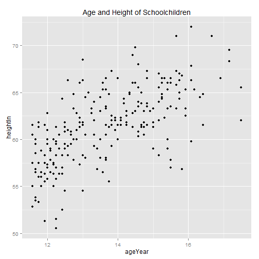 

```r

# Use \n for a newline
p + ggtitle("Age and Height\nof Schoolchildren")
```

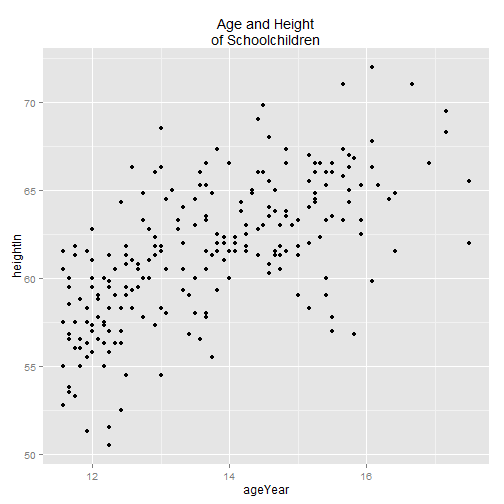 

```r


# ==================================== Move the title inside
p + ggtitle("Age and Height of Schoolchildren") + theme(plot.title = element_text(vjust = -2.5))
```

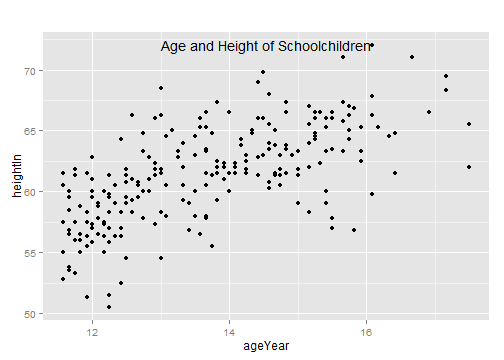 

```r

# Use a text annotation instead
p + annotate("text", x = mean(range(heightweight$ageYear)), y = Inf, label = "Age and Height of Schoolchildren", 
    vjust = 1.5, size = 6)
```

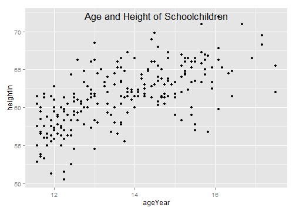 

```r


# ====================================
library(gcookbook)  # For the data set

# Base plot
p <- ggplot(heightweight, aes(x = ageYear, y = heightIn)) + geom_point()

# Controlling appearance of theme items
p + theme(axis.title.x = element_text(size = 16, lineheight = 0.9, family = "Times", 
    face = "bold.italic", colour = "red"))
```

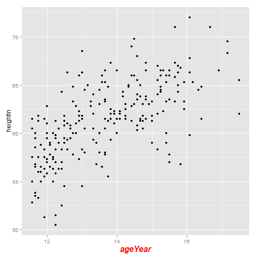 

```r

p + ggtitle("Age and Height\nof Schoolchildren") + theme(plot.title = element_text(size = rel(1.5), 
    lineheight = 0.9, family = "Times", face = "bold.italic", colour = "red"))
```

 

```r

# rel(1.5) means that the font will be 1.5 times the base font size of the
# theme.  For theme elements, font size is in points.


# ====================================
p + annotate("text", x = 15, y = 53, label = "Some text", size = 7, family = "Times", 
    fontface = "bold.italic", colour = "red")
```

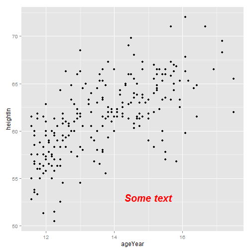 

```r

p + geom_text(aes(label = weightLb), size = 4, family = "Times", colour = "red")
```

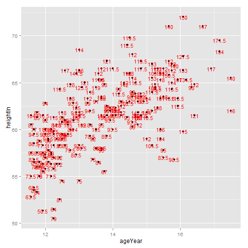 

```r

# For text geoms, font size is in mm


# ====================================
library(gcookbook)  # For the data set

# Base plot
p <- ggplot(heightweight, aes(x = ageYear, y = heightIn)) + geom_point()

# Grey theme (the default)
p + theme_grey()
```

 

```r

# Black-and-white theme
p + theme_bw()
```

 

```r


# ====================================
p + theme_grey(base_size = 16, base_family = "Times")
```

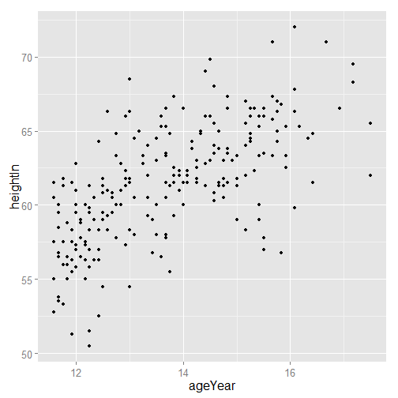 

```r


# ==================================== Set default theme for current session
theme_set(theme_bw())

# This will use theme_bw()
p
```

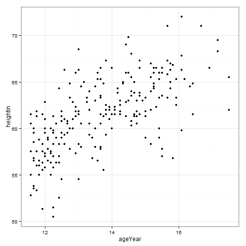 

```r

# Reset the default theme back to theme_grey()
theme_set(theme_grey())


# ====================================
library(gcookbook)  # For the data set

# Base plot
p <- ggplot(heightweight, aes(x = ageYear, y = heightIn, colour = sex)) + geom_point()

# Options for the plotting area
p + theme(panel.grid.major = element_line(colour = "red"), panel.grid.minor = element_line(colour = "red", 
    linetype = "dashed", size = 0.2), panel.background = element_rect(fill = "lightblue"), 
    panel.border = element_rect(colour = "blue", fill = NA, size = 2))
```

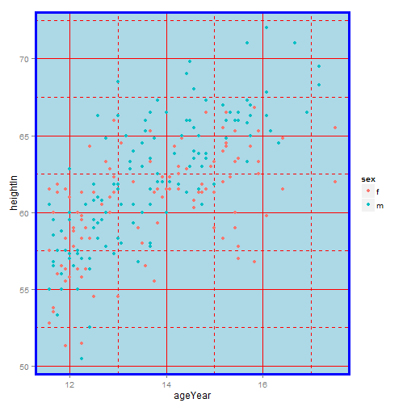 

```r

# Options for text items
p + ggtitle("Plot title here") + theme(axis.title.x = element_text(colour = "red", 
    size = 14), axis.text.x = element_text(colour = "blue"), axis.title.y = element_text(colour = "red", 
    size = 14, angle = 90), axis.text.y = element_text(colour = "blue"), plot.title = element_text(colour = "red", 
    size = 20, face = "bold"))
```

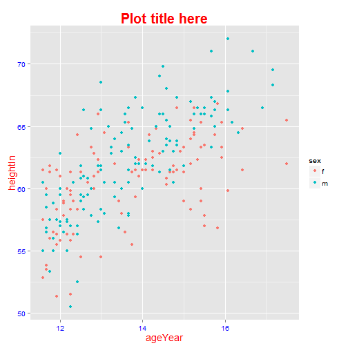 

```r

# Options for the legend
p + theme(legend.background = element_rect(fill = "grey85", colour = "red", 
    size = 1), legend.title = element_text(colour = "blue", face = "bold", size = 14), 
    legend.text = element_text(colour = "red"), legend.key = element_rect(colour = "blue", 
        size = 0.25))
```

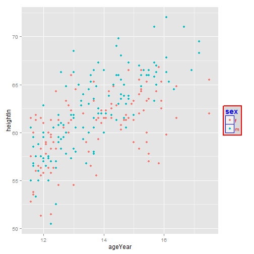 

```r

# Options for facets
p + facet_grid(sex ~ .) + theme(strip.background = element_rect(fill = "pink"), 
    strip.text.y = element_text(size = 14, angle = -90, face = "bold"))
```

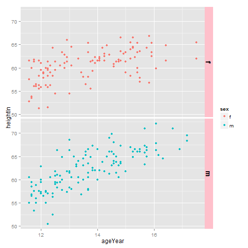 

```r
# strip.text.x is the same, but for horizontal facets


# ==================================== theme() has no effect if before
# adding a complete theme
p + theme(axis.title.x = element_text(colour = "red")) + theme_bw()
```

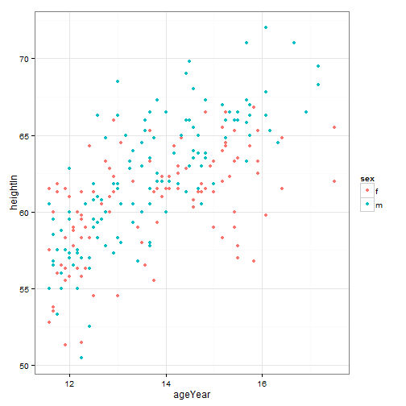 

```r

# theme() works if after a compete theme
p + theme_bw() + theme(axis.title.x = element_text(colour = "red", size = 12))
```

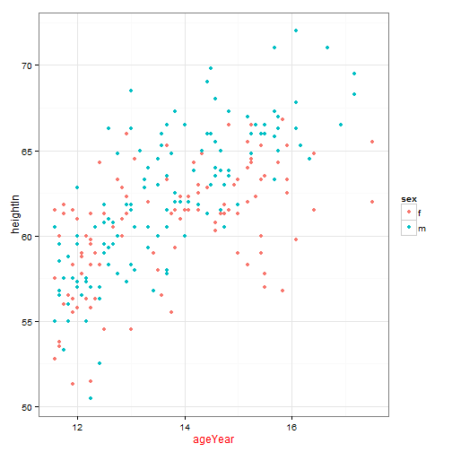 

```r


# ====================================
library(gcookbook)  # For the data set

# Start with theme_bw() and modify a few things
mytheme <- theme_bw() + theme(text = element_text(colour = "red"), axis.title = element_text(size = rel(1.25)))

# Base plot
p <- ggplot(heightweight, aes(x = ageYear, y = heightIn)) + geom_point()

# Plot with modified theme
p + mytheme
```

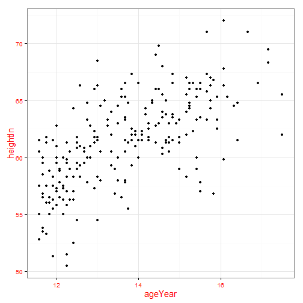 

```r


# ====================================
library(gcookbook)  # For the data set

p <- ggplot(heightweight, aes(x = ageYear, y = heightIn)) + geom_point()

p + theme(panel.grid.major = element_blank(), panel.grid.minor = element_blank())
```

 

```r


# ==================================== Hide the vertical grid lines (which
# intersect with the x-axis)
p + theme(panel.grid.major.x = element_blank(), panel.grid.minor.x = element_blank())
```

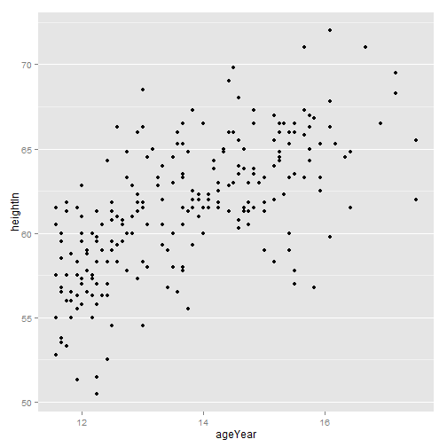 

```r

# Hide the horizontal grid lines (which intersect with the y-axis)
p + theme(panel.grid.major.y = element_blank(), panel.grid.minor.y = element_blank())
```

 

```r


# ==================
```

