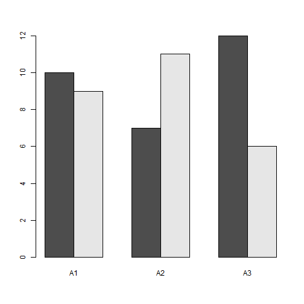
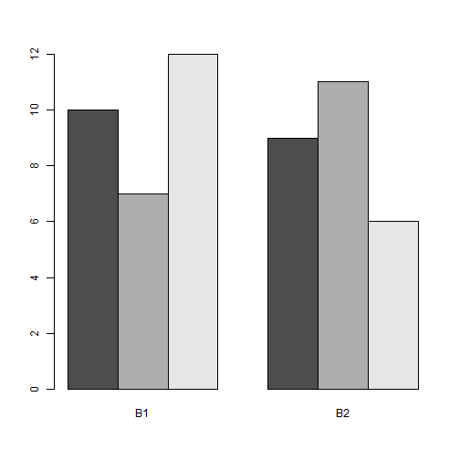
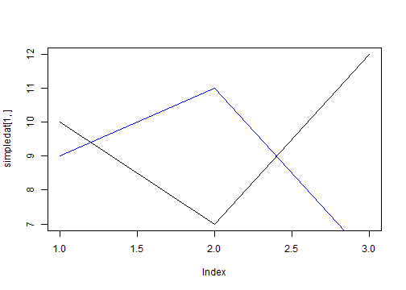
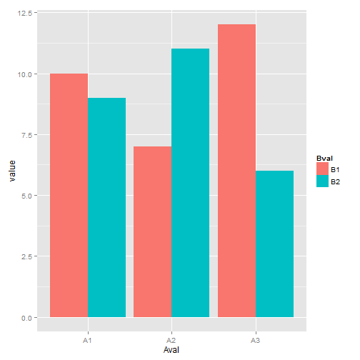
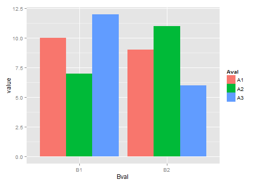
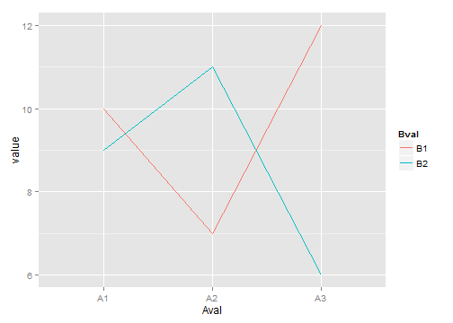
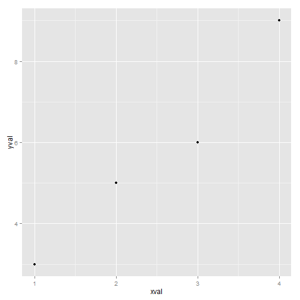
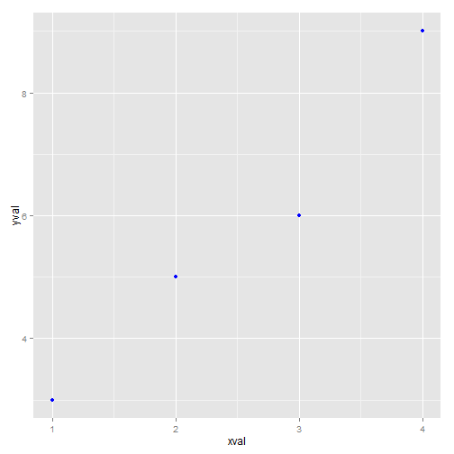
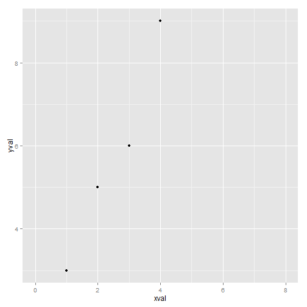
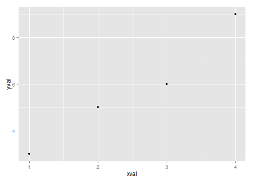

appendix: Introduction to ggplot2

```r
library(gcookbook)  # For the data set
simpledat
```

```
##    A1 A2 A3
## B1 10  7 12
## B2  9 11  6
```

```r

barplot(simpledat, beside = TRUE)
```

 

```r

t(simpledat)
```

```
##    B1 B2
## A1 10  9
## A2  7 11
## A3 12  6
```

```r

barplot(t(simpledat), beside = TRUE)
```

 

```r

plot(simpledat[1, ], type = "l")
lines(simpledat[2, ], type = "l", col = "blue")

simpledat_long
```

```
##   Aval Bval value
## 1   A1   B1    10
## 2   A1   B2     9
## 3   A2   B1     7
## 4   A2   B2    11
## 5   A3   B1    12
## 6   A3   B2     6
```

```r

library(ggplot2)
```

 

```r
ggplot(simpledat_long, aes(x = Aval, y = value, fill = Bval)) + geom_bar(stat = "identity", 
    position = "dodge")
```

 

```r

ggplot(simpledat_long, aes(x = Bval, y = value, fill = Aval)) + geom_bar(stat = "identity", 
    position = "dodge")
```

 

```r

ggplot(simpledat_long, aes(x = Aval, y = value, colour = Bval, group = Bval)) + 
    geom_line()
```

 

```r

dat <- data.frame(xval = 1:4, yval = c(3, 5, 6, 9), group = c("A", "B", "A", 
    "B"))
dat
```

```
##   xval yval group
## 1    1    3     A
## 2    2    5     B
## 3    3    6     A
## 4    4    9     B
```

```r

ggplot(dat, aes(x = xval, y = yval))
```

```
## Error: No layers in plot
```

```r

ggplot(dat, aes(x = xval, y = yval)) + geom_point()
```

 

```r

p <- ggplot(dat, aes(x = xval, y = yval))
p + geom_point()
```

 

```r

p + geom_point(aes(colour = group))
```

 

```r

p + geom_point(colour = "blue")
```

 

```r

p + geom_point() + scale_x_continuous(limits = c(0, 8))
```

 

```r

p + geom_point() + scale_colour_manual(values = c("orange", "forestgreen"))
```

 

